# Assessing District Elections as a Remedy in State Voting Rights Acts

Michael Hankinson∗ Joseph R. Loffredo† Asya Magazinnik‡

July 21, 2026

Abstract

As federal voting rights protections recede, state-level voting rights acts (VRAs) have become the principal legal tool for safeguarding minority representation in the United States. We assess what these laws can accomplish using the California Voting Rights Act, which has compelled over 150 cities to replace at-large with district elections. Applying redistricting algorithms across 109 cities, we evaluate how much district elections—and the alternative reforms state VRAs permit—can amplify Latino political influence. District elections prove to be a limited remedy: most cities cannot draw a majority-Latino district and many cannot use districts to meaningfully increase Latino electoral success, even under optimistic assumptions about turnout, cohesion, and crossover voting. By contrast, cumulative voting, ranked choice voting, and limited voting empower Latino voters without relying on favorable geography or mapmakers’ discretion. We

conclude that policymakers seeking to improve minority representation should be more open to

reforms within the proportional representation family.

Word Count: 6,955

Keywords: representation, local politics, Latino politics, voting rights, algorithmic districting The authors thank Tyler Simko, members of the MIT Election Data and Science Lab, and members of the Democracy Center at the University of Rochester for helpful comments. The authors also thank Joshua Lipman for research assistance. The authors acknowledge the MIT Office of Research Computing and Data for providing high performance computing resources that have contributed to the research results reported within this paper.

∗Corresponding author: Assistant Professor of Political Science, George Washington University. 2115 G Street NW, Washington, DC 20052. hankinson@gwu.edu

†PhD Candidate, Department of Political Science, Massachusetts Institute of Technology. 77 Massachusetts Avenue, E53-470, Cambridge, MA 02142. loffredo@mit.edu

‡Professor of Social Data Science, Hertie School. Friedrichstrasse 180, Berlin, Germany 10117. a.magazinnik@hertie-school.org

## Introduction

The Voting Rights Act of 1965 (VRA) long stood as the federal government’s most powerful tool for protecting minority political representation in the United States. However, a series of recent Supreme Court decisions has eroded its enforcement capacity (Greenwood and Stephanopoulos 2023). Most recently, in Louisiana v. Callais (2026), the Court severely restricted the drawing of majority-minority districts, requiring proof that the state “intentionally drew its districts to afford minority voters less opportunity because of their race” (Supreme Court of the United States 2026). Legal scholars argue that the ruling has effectively ended the VRA’s core protections (Hasen 2025), which extended from Congress to school boards.

To counteract a hamstrung VRA, 23 states have drafted or passed voting rights acts of their own, designed to replicate or expand upon the federal statute. We evaluate the capacity of these laws to fill the void left by federal retrenchment. When federal courts find fault with an electoral rule for diluting minority political power, they typically impose a specific remedy. By contrast, state VRAs leave implementation of the remedy to local jurisdictions, bounded only by broad legal standards. What states can accomplish therefore turns on what localities do with their discretion: specifically, how racial demographics, political behavior, and geography shape the remedies cities adopt, and how much those remedies can advance minority political influence.

We evaluate state VRA capacity by examining the California Voting Rights Act (CVRA) of 2001, the first law of its kind and the model for many since. The CVRA lowered the federal evidentiary standard for showing that at-large local elections dilute minority voting power, making it easier for plaintiffs to challenge them in court. It has since pushed hundreds of municipalities and school districts to replace at-large with district elections (Abott and Magazinnik 2020; Collingwood and Long 2019). As other states adopt their own VRAs, California offers the clearest available evidence on what such laws can and cannot accomplish.

We first study the effectiveness of the CVRA’s principal remedy: district elections for local legislative office, historically the most common response to Section 2 challenges nationwide. We measure the reform’s success using two outcomes: the number of majority-Latino districts and the expected Latino share of the city council, the latter modeled under a range of assumptions

about racial crossover, racial cohesion, and the Latino–non-Latino turnout gap (Atsusaka 2021).1 We begin by collecting the first district maps adopted under the CVRA for 109 cities.2 We then use state-of-the-art districting algorithms to characterize the distribution of both outcomes across a representative sample of race-neutral counterfactual plans, along with the extreme values attainable by explicit optimization for those outcomes (McCartan and Imai 2023; Cannon et al. 2023). This lets us trace what district elections could deliver in each city and judge each adopted map against that benchmark.

Despite the historic popularity of districting as a remedy, some voting rights advocates have grown skeptical that district elections deliver meaningful gains in political power for minority voters. The ACLU of California, for example, has warned that switching to district elections is no panacea for Latino representation, pointing instead to three alternatives: limited voting, cumulative voting, and single transferable vote (STV) ranked choice voting (ACLU of Southern California 2025). The same three reforms appear in NAACP Legal Defense Fund model legislation (NAACP Legal Defense and Educational Fund 2026). Using parallel assumptions about racial crossover, racial cohesion, and the turnout gap, we simulate synthetic ballots for Latino and non-Latino candidates (Benade et al. 2021; MGGG Redistricting Lab 2025) and estimate the expected effect of each alternative reform on Latino representation.

We present four key findings. First, political geography and demographics severely limit what district elections can accomplish. Even in simulations explicitly designed to maximize the number of Latino-majority districts, 61% of the 109 cities in our sample cannot draw a single district with a majority-Latino citizen voting-age population (CVAP). This constraint helps explain why district elections have been found to improve minority representation only in jurisdictions with large and residentially segregated minority populations (Abott and Magazinnik 2020; Collingwood and Long 2019; Dancygier 2014; Trounstine and Valdini 2008). Looking at expected electoral outcomes tells the same story. In 50% of our cities, no feasible map would be predicted to place a single Latino candidate on the council. The CVRA’s relaxed evidentiary standard, in short, has brought district elections to many cities where the reform is unlikely to have a meaningful impact.

1Although the CVRA has been used to advance the representation of both Latino and Asian American voters, Latinos are the modal minority group in California cities.

2Appendix Table A-1 lists California cities that have adopted district elections and identifies those in our sample. Appendix Tables A-2 and A-3 summarize their demographic composition.

Second, within the half of the sample where maps do vary in our outcomes of interest, city councils tended to choose favorable ones. Of this subset, 51% of cities adopted plans above the 90th percentile of the simulation distribution of expected Latino council share, and 18% adopted the most favorable plan in the simulation distribution. This may reflect the high-profile nature of CVRA districting: maps were debated in public hearings and adopted in open votes under activist and state scrutiny.

Third, the limitations of district elections persist even under optimistic assumptions about political behavior. Researchers have described the switch to district elections as a mobilizing event that narrows racial turnout disparities (Hertz 2023). Yet even if the turnout gap between Latino and non-Latino voters were to close entirely, district elections would only meaningfully increase the expected Latino share of the city council in 35 of the 109 cities in our sample. Favorable assumptions about Latino cohesion and non-Latino crossover voting fare no better. The limits of district elections are structural, not behavioral.

Finally, we find that limited voting, cumulative voting, and STV ranked choice voting show far more promise for minority descriptive representation. Across a range of simulation tools (Benade et al. 2021; MGGG Redistricting Lab 2025) and behavioral assumptions, all three yield higher expected Latino council shares than districts, on average, by making more efficient use of every vote cast for a Latino candidate.

Our work contributes to a growing body of research on state voting rights regimes and their capacity to fill the vacuum left by federal retrenchment. District elections emerge as the most limited remedy, hampered by geography and vulnerable to the preferences of local decisionmakers. The other remedies we study, by contrast, fulfill the representational goals of state VRAs, do not depend on local discretion and geography, and come with fewer trade-offs with other policy objectives (e.g., Hankinson and Magazinnik 2023; Mast 2024). Because every state VRA passed or introduced to date permits these alternatives or leaves open the possibility that they may be implemented, advocates for minority descriptive representation should be more open to reforms within the proportional representation family.3

3Strictly speaking, only STV is a fully proportional system. Limited and cumulative voting are often classified as semi-proportional: they permit cohesive minorities to convert votes into seats more efficiently than winner-takeall rules, but they do not guarantee proportionality and their performance depends on coordination among voters and candidates (Lijphart, Pintor and Sone 1986; Cox 1997). For brevity, we refer to these reforms collectively as proportional-family remedies.

## How State VRAs Aim to Increase Minority Descriptive

## Representation

The federal VRA advances voting rights through two mechanisms: Section 5’s preclearance requirement and Section 2’s prohibition on electoral institutions that limit voting rights on the basis of race. Since Thornburg v. Gingles (1986), Section 2 claims have rested on a three-pronged test: the minority group must be (1) sufficiently large and geographically compact to constitute a majority in a single-member district, (2) must be politically cohesive, and (3) must vote sufficiently as a bloc to routinely defeat the majority group’s preferred candidate (Supreme Court of the United States 1986).

State VRAs expand on the federal statute chiefly by eliminating the first prong. Doing so not only widens the set of targetable jurisdictions beyond those with large, geographically segregated minority populations, but also opens the door to electoral remedies beyond district elections (Greenwood and Stephanopoulos 2023). Of the 23 states that have passed or introduced their own VRA, 16 explicitly name electoral remedies (Appendix Table B-4). All 16 include district elections, underscoring their status as the default remedy. Most of these 16 explicitly endorse proportional reforms, while the remainder make clear that they do not limit remedies to district elections. Of the 7 states that do not explicitly name an electoral reform, 6 use language like “a new electoral system” and “appropriate remedies” that accommodates a broad set of options including proportional reforms. The seventh state, Arizona, offers a non-exclusive list of remedies to voter dilution, but does not mention changing the method of election. In short, of the 22 state VRAs that address structural electoral reform, each permits, either explicitly or implicitly, institutions beyond district elections.

Despite the apparent openness of state VRAs to alternative institutions, district elections have been the favored remedy to a Section 2 challenge. The logic is simple: under racially polarized voting, a citywide majority bloc can capture every seat in at-large elections. Single-member districts, by contrast, enable the creation of at least one majority-minority district in which the minority bloc has sufficient size to elect its candidate of choice. However, district elections face four constraints in increasing minority descriptive representation. First, the city’s minority population must be sufficiently large and spatially clustered for a majority-minority district to be possible. If the minority

population is evenly distributed, no district can exceed the citywide minority share. Thus, relaxing Gingles’s first prong enables state VRA challenges precisely in the cities where district elections are unlikely to translate into more seats for the minority group.

Second, voters vary in their support for candidates within (cohesion) and outside of (crossover) their own racial or ethnic group. White Democrats, for example, are increasingly willing to support non-white candidates (Mikkelborg 2025), and such crossover can propel non-white candidates to office even absent a local racial majority. Latinos, meanwhile, have shown declining cohesion in their support for the Democratic Party (Fraga, Velez and West 2025), which may portend declining racial cohesion as a voting bloc. Given crossover and cohesion, a majority-minority district may be neither necessary nor sufficient for minority descriptive representation.

Third, the majority–minority turnout gap conditions the minority-population threshold a district must clear to create meaningful opportunities for minority candidates (Fraga 2018). If the minority group votes at lower rates than the majority, even a highly cohesive minority-majority may fail to secure descriptive representation. A large literature has accordingly sought to identify the CVAP threshold required to elect a “candidate of choice” (e.g., Atsusaka 2021; Cameron, Epstein and O’Halloran 1996; Lublin 1997; Lublin et al. 2020).

Fourth, district elections require the selection of a map that advances the state VRA’s goals, but mapmakers’ incentives need not match the statute’s objectives. A districting plan may crack or pack minority voters, but it can blunt the reform even without racial gerrymandering. In implementing the CVRA, cities have preferred maps that give each incumbent a district of their own, avoiding contests between sitting councilors (Loffredo, Hankinson and Magazinnik 2026). This incumbency protection limits minority candidate entry and electoral success.

In contrast to district elections, the alternative systems we investigate all elect multiple members from the city at large. Under cumulative voting, voters receive as many votes as there are open seats and may allocate them however they choose: in a five-seat election, a voter may give all five votes to one candidate or split them among several, and the top five vote-getters win. Limited voting works similarly, but voters receive fewer votes than there are open seats—perhaps two votes in a five-seat election—and, as usually implemented in practice, can only give one vote per candidate. The single transferable vote differs from the first two because it is a form of ranked choice voting. Voters rank the candidates, and counting proceeds in rounds. The first round considers voters’ top-

ranked choices, and any candidates who reach a quota are elected.4 If no candidate has reached the quota and there are more candidates than unfilled seats, the candidate with the fewest current votes is eliminated. In either case, the affected ballots transfer to voters’ next-ranked remaining choice: votes for elected candidates beyond the quota in the first case, or all votes for the eliminated candidate in the second case. This process repeats until all seats are filled.

All three systems are relevant options for state VRAs. Cumulative voting has been adopted in Texas, where state courts prescribed it in a series of cases brought on behalf of Latino voters by the League of United Latin American Citizens (LULAC) (Nichols 2002). Limited voting has been used for local elections in Alabama, Connecticut, Pennsylvania, and North Carolina in response to VRA litigation (U.S. Election Assistance Commission 2023). Six California cities use or have used ranked choice voting for city council elections (Ranked Choice Voting Resource Center 2026)— Albany, Berkeley, Oakland, Palm Desert, San Francisco, and San Leandro—and in 2026 Los Angeles announced that it is considering the reform (Gomez 2026).

## The California Voting Rights Act

To unpack how district elections shape descriptive representation, we leverage the implementation of the California Voting Rights Act of 2001. The law was designed to ease plaintiffs’ path to challenging at-large elections for disadvantaging Latino electorates. Whereas the Gingles test requires that a city be able to draw at least one majority-minority district before a court can compel district elections, the CVRA requires only that plaintiffs show evidence of “racially polarized voting.” The law has brought district elections to over 160 city councils, with wide variation in segregation, demographic composition, and political geography among adopters. Many cities seemingly switch voluntarily, but the threat of the law looms over every such choice: every city that has challenged a CVRA claimant in court has lost, some accumulating millions of dollars in legal fees (Schuk 2015). Even a law firm’s threat letter may require reimbursing roughly $30,000 in research costs and starts a clock compelling fast action. Municipalities that see themselves as likely targets therefore have strong incentives to act preemptively.

Once a city commits to switching, the mapmaking process begins. CVRA districting has pro- 4The quota is typically just over 1 of the ballots in an S-seat election, known as the Droop quota.

S+1

ceeded largely without the advanced methods now deployed in state and federal redistricting, suggesting much to learn from modern computational tools. Typically, the city council hires a demographer to advise on map design and help community members submit their own proposals. The demographer may also work with a “citizens’ committee” charged with distilling public input into a single recommended map. Eventually, the council votes to select a final plan.

Councils face both internal and external constraints on the plans they can feasibly draw. Internally, a city is limited by its shape and electoral geography (e.g., Chen and Rodden 2013). Externally, the plan must comport with federal standards or risk litigation under the federal VRA: districts should be roughly equal in population, relatively compact, and contiguous. These constraints interact. A city with an irregular shape, for example, may be structurally unable to divide certain communities between districts while satisfying the contiguity, compactness, and equalpopulation requirements—a situation we illustrate with the following example.

The Mapmaking Process: Evidence from Anaheim

The challenges of engineering descriptive representation through districts are well illustrated by Anaheim, a city of approximately 350,000 people outside Los Angeles. With Latinos comprising 53% of its population and 35% of its citizen voting-age population, Anaheim was an ideal target for CVRA litigation, and adopted district elections in response to a 2014 lawsuit filed by the ACLU. To manage the transition, the city council formed a citizens’ committee led by five retired judges. The committee proposed the “People’s Map,” with six districts: one majority-Latino CVAP district and two others where Latinos constituted a sizable minority of around 45% (Elmahrek 2015). Despite broad public support, the council initially voted 3–2 against the People’s Map. Leading the opposition, Councilmember Jordan Brandman argued that it failed to maximize Latino representation, potentially exposing the city to future CVRA litigation; he favored an alternative with two majority-Latino districts. The People’s Map was ultimately adopted (Elmahrek 2016), but the council remained uneasy. New census data showed the lone majority-Latino district slipping to 49% Latino CVAP (Diamond 2016). The city’s demographer offered assurances that, given the margin of error, the dip was unlikely to reflect a real change in the underlying electoral geography, but the fixation on the 50% threshold underscored how much it matters to some stakeholders.

Anaheim’s debate was possible only because a sizable Latino population, coupled with residen-

tial segregation, gave the city a meaningful choice: as we show in our later analyses, Anaheim could draw anywhere from zero to two majority-Latino districts. Figure 1 illustrates this point. The top panel shows the People’s Map, with three districts where Latinos form a sizable minority. The bottom shows a counterfactual map, similar in spirit to Brandman’s proposal, that maximizes the number of majority-Latino districts at two.

By the same token, the maps reveal how physical and political geography constrain what can be achieved. The sparsely populated east side of the city, the Anaheim Hills—home to parks, nature reserves, and expensive homes—forms a natural district (District 6) under the compactness, contiguity, and equal-population constraints. A narrow peninsula on the city’s western edge similarly anchors District 1. Because Anaheim’s Latino population is concentrated in the urban center while white residents tend to live in the less densely populated areas to the west, east, and south, white voters constitute the majority in any perturbation of the “naturally occurring” Districts 1 and 6. By contrast, the four central districts leave the mapmaker considerable freedom: the bottom map pulls Latino voters from District 5 to lift Districts 3 and 4 above the 50% threshold.

Which approach would maximize Latino electoral success: concentrating Latino voters into two safe majority-Latino districts, as in Brandman’s proposal, or spreading them across more diffuse “opportunity districts,” as under the People’s Map? Were other, superior alternatives available but undiscovered due to the limitations of the technology at hand? Could the disagreement have been avoided entirely by a reform that required no map at all? We answer these questions in the analyses that follow.

## Data and Methodology

We obtained as many city council district shapefiles as we could find for the 167 cities that we have documented as switching to district elections under the CVRA. Our sample contains 109 first district plans (65% of switchers), which we overlaid with a 2017 Census block-level shapefile to associate each block with a city council district and a set of demographic and political indicators from the U.S. Census, a California voter file obtained from L2, and the California Statewide Database.5 5See Appendix Table A-1 for details about this sample. Table A-2 presents a comparison of our sample to all 167 switchers and all California cities.

Map 1: The People's Map

1 2 5

Map 2: Alternative Map that Maximizes Majority−Latino Districts 1 5

Latino Proportion of CVAP

0% 25% 50% 75%100% Latino % CVAP District Map 1 Map 2 1 0.30 0.30 2 0.33 0.32

3 0.49 0.51

4 0.45 0.51

5 0.45 0.39

6 0.16 0.15

Figure 1: Districting in the city of Anaheim. Top panel shows the adopted “People’s Map”; bottom panel shows an alternative map that maximizes the number of majority-Latino districts at 2.

These shapefiles constitute the inputs to our districting simulations.6

Districting Simulations

To characterize the universe of options available under geographic and legal constraints—and thus to assess how favorable the chosen maps were for Latino representation within that universe—we conduct a set of redistricting simulations. We use the automated redistricting simulator deployed in the redist package for R (Kenny et al. 2021), which implements a Sequential Monte Carlo (SMC) algorithm (McCartan and Imai 2023) to characterize the distribution of districting plans that satisfy the contiguity, compactness, and population-parity constraints within each of our 109 cities, fixing the number of districts to that of the adopted plan. We generate 5,000 draws from this target distribution, where each draw is an assignment of Census blocks to city council districts. Because these sampled plans are not guaranteed to span the entire range of feasible options, we additionally use short-burst optimization (Cannon et al. 2023) to search for plans that maximize and minimize our outcomes of interest.7

The resulting distributions can be interpreted as a “race-neutral baseline” for each city, as they are constructed without reference to racial demographics, partisanship, incumbency, or other optional criteria (e.g., preservation of “communities of interest”).8 In other words, sampling from the simulation distribution should be understood as generating a representative sample of cities’ alternatives under minimal legal and geographic constraints, not the plans they would likely have adopted given additional, context-specific considerations. Where an adopted map falls in this distribution measures the favorability of the city’s choice relative to available alternatives, and the short-burst plans bound the feasible set from above and below.

Measuring Latino Electoral Success

Majority-Latino CVAP districts. As Anaheim’s experience shows, conversations surrounding the CVRA have focused on the creation of majority-Latino CVAP districts. The 50% CVAP 6For further details on the data construction process, see Appendix A.

7Implemented by the redist shortburst() function in redist. For a detailed discussion of both algorithms and parameter values, see Appendix C. Appendix Table C-5 presents diagnostics.

8Defined by state law as populations sharing social or economic interests that warrant inclusion in a single district (Cal. Elec. Code § 21601(c)). While some cities prioritized keeping communities of interest together, we treat this as an endogenous choice rather than a constraint.

threshold is intuitive to the average citizen, and the simplest measure of an empowered voting bloc: a group comprising 50% of the citizen voting-age population can, in principle, elect its preferred candidate, regardless of that candidate’s ethnic identity.

Expected Latino council share. Useful as a measure of political strength, the 50% CVAP threshold is agnostic about the preferences of the Latino voting bloc, and ignores cross-ethnic coalitions that may propel Latino candidates to office even in the absence of Latino majorities. We therefore also measure the reform’s success in terms of the expected ethnic composition of councils. This outcome depends on the behavior of Latino and non-Latino voters along three dimensions. The first is voter turnout. Latinos vote at lower rates than whites across the board (Fraga 2018), effectively raising the CVAP threshold a district must clear before Latino voters constitute an electoral majority. Second, descriptive representation follows from demographic majorities only insofar as Latino voters coalesce around Latino candidates (cohesion). Third, Latino candidates need not rely on Latino votes alone; also relevant is the fraction of non-Latino voters who will support them (crossover).

We begin with assumptions derived from observed voting patterns in these cities. Turnout comes from the L2 voter file, which records each registrant’s validated vote history and predicted ethnicity. For each city, we compute Latino and non-Latino turnout as the share of each group’s registrants who voted on average over the 2014 and 2016 general elections, and use these rates to convert each district’s Latino CVAP share into a turnout-adjusted share of the electorate. For cohesion and crossover, we construct an empirical benchmark from four statewide top-two races that pitted a Latino against a non-Latino candidate of the same party, so that differences in support across precincts reflect ethnic rather than partisan cleavages. For each simulated district, we aggregate block-level votes for the Latino and the leading non-Latino candidate, compute the Latino candidate’s district-level vote share in each race, and average across the four races.

These assumptions enter into a logical model (Atsusaka 2021), which takes as inputs a district’s effective Latino share of the electorate (C) along with a measure of racial polarization (M), and returns as output the predicted probability that a district elects a Latino candidate. We set M to the observed racial margin from the four statewide primary races and C to each district’s

turnout-reweighted Latino CVAP share.9 We compute the probability of a Latino candidate winning separately for every district in a simulated plan and then use these probabilities in a Monte Carlo simulation to compute the expected Latino council share.10

These assumptions need not be static. The reform could mobilize Latino voters by making their votes pivotal in majority-Latino districts (Fraga 2018; Hertz 2023), and the public attention to Latino voting rights that accompanies a CVRA transition may strengthen in-group cohesion and provoke white crossover support or backlash. As discussed, behavior is also a moving target for reasons unrelated to the reform. The decline in Latino support for the Democratic Party may portend weaker cohesion behind Latino candidates as well (Fraga, Velez and West 2025).

Thus, we vary these inputs. First, we ask how district performance changes in the best case: the Latino turnout gap closes entirely. To do so, we compute predicted Latino council shares under a counterfactual in which Latino registrants turn out at the same rates as non-Latino registrants in each city and compare these estimates to those derived from using the observed turnout gap. Second, for cohesion and crossover, we bound plausible future behavior with a range of assumptions on either side of the status quo. On the optimistic end, Latino cohesion remains high and non- Latino crossover support rises, consistent with district elections and the attention that accompanies a CVRA transition strengthening in-group solidarity and drawing sympathetic crossover votes. On the pessimistic end, cohesion weakens while crossover stays limited. We evaluate the model by varying one parameter at a time: cohesion at 60%, 80%, and 100% (the share of Latinos supporting the Latino candidate), while holding crossover at 30%; and crossover at 20%, 30%, and 40% (the share of the city’s non-Latinos supporting the Latino candidate), while holding cohesion at 80%. Alternative Electoral Institutions

We also investigate electoral institutions beyond district elections. Benade et al. (2021) provide a framework for estimating electoral outcomes from the size of racial groups, their levels of racial cohesion and crossover, the number of seats in an electoral contest, the number of candidates from each group, and the degree of internal coordination on candidates. These parameters generate synthetic ballots that can be aggregated under cumulative voting, limited voting, or single transferable 9M embeds implied levels of cohesion and crossover, which we need not estimate directly.

10See Appendix D for further details about the logical model and its parameters.

vote systems. Our outcome of interest is the expected Latino share of the council.

We implement this framework in a two-bloc, two-slate setup, running 500 simulations of 1,000 ballots per city with parameters tailored to each city’s electoral context. Specifically, we use city council election returns compiled by de Benedictis-Kessner and Bernhard (2022) to derive these contextual factors from recent elections in each city. The election dataset gives us the number of seats per contest and candidate counts by group, which are estimated by applying Bayesian Improved Surname Geocoding to candidates in the three at-large elections preceding the city’s switch. The Latino electorate share is the turnout-adjusted Latino proportion of CVAP, computed from the same block-level CVAP data used in our districting simulations. We assume that both Latinos and non-Latinos are internally homogeneous in their preferences over their respective slates of candidates. Our estimates are therefore best read as attainable rather than guaranteed outcomes. We select values of cohesion and crossover to mirror the ones used in the districting simulations.11

## Results

The Limits of District Elections

Figure 2 shows the simulation distribution of the proportion of majority-Latino CVAP districts for every city in our sample. The solid black line represents the range of the distribution estimated by SMC; the dashed black line extends this to the feasible range found through short-burst optimization. The red diamond marks the enacted plan, and the number to its right gives the enacted plan’s percentile in the distribution. Anaheim’s “People’s Map,” for example, falls in the 25th percentile of its simulation distribution. This plan has zero majority-Latino districts, whereas the city could have drawn anywhere from zero to two.

Most strikingly, 61% of the cities in the sample cannot draw a single majority-Latino district. For these cities, there is simply no variation in the outcome across plans. At the other extreme, 3% of cities can draw only majority-Latino districts, owing to their large Latino populations. Notably, among the 39 cities (36% of the sample) with any variation in the number of majority- Latino districts they can draw, 87% chose a map above the 50th percentile in its capacity to create majority-Latino districts.

11For a detailed discussion of the ballot simulation, see Appendix E.

King City 100% Dixon 100% Sanger 100% Eastvale 100% Selma 100% Elk Grove 100% Wasco 100% Encinitas 100% Oxnard 99% Escondido 100% Jurupa Valley 98% Exeter 100% Indio 100% Fairfield 100% Fontana 0% Fremont 100% Whittier 98% Fullerton 100% Los Banos 100% Garden Grove 100% Santa Maria 100% Glendora 100% Madera 100% Half Moon Bay 100% Porterville 96% Hemet 100% West Covina 100% Lake Forest 100% Chula Vista 100% Lincoln 100% Palmdale 100% Marina 100% Hesperia 100% Menlo Park 100% Tulare 100% Morgan Hill 100% Duarte 99% Murrieta 100% Ceres 60% Napa 100% Imperial Beach 88%

Novato 100% Patterson 99%

Ojai 100% Compton 100%

Orange 100% Lompoc 100%

Pacifica 100% Cathedral City 15%

Palm Springs 100% Kingsburg 100%

Paso Robles 100% La Mirada 100%

Poway 100% Lodi 100%

Rancho Cucamonga 100% Monterey Park 100%

Richmond 100% Redlands 100%

Rohnert Park 100% Visalia 100%

Roseville 100% Redwood City 100%

San Rafael 100% Placentia 24%

Santa Barbara 100% Anaheim 25%

Santa Clara 100% Modesto 34%

Stockton 56% Santa Rosa 100% Tehachapi 76% Santee 100% Corona 97% Simi Valley 100% Vista 98% Solana Beach 100% Woodland 100% South Pasadena 100% Lemoore 100% South San Francisco 100% Atwater 100% Stanton 100% Apple Valley 100% Sunnyvale 100% Banning 100% Temecula 100% Barstow 100% Torrance 100% Big Bear Lake 100% Turlock 100% Buena Park 100% Twentynine Palms 100% Camarillo 100% Union City 100% Campbell 100% Upland 100% Carlsbad 100% Vallejo 100% Chino Hills 100% Ventura 100% Citrus Heights 100% Westminster 100% Claremont 100% Wildomar 100%

Concord 100% Yucaipa 100%

Dana Point 100% Yucca Valley 100%

0% 25% 50% 75% 100% 0% 25% 50% 75% 100%

Majority−Latino District Share

Full SMC Range Short−Burst Range Enacted Value

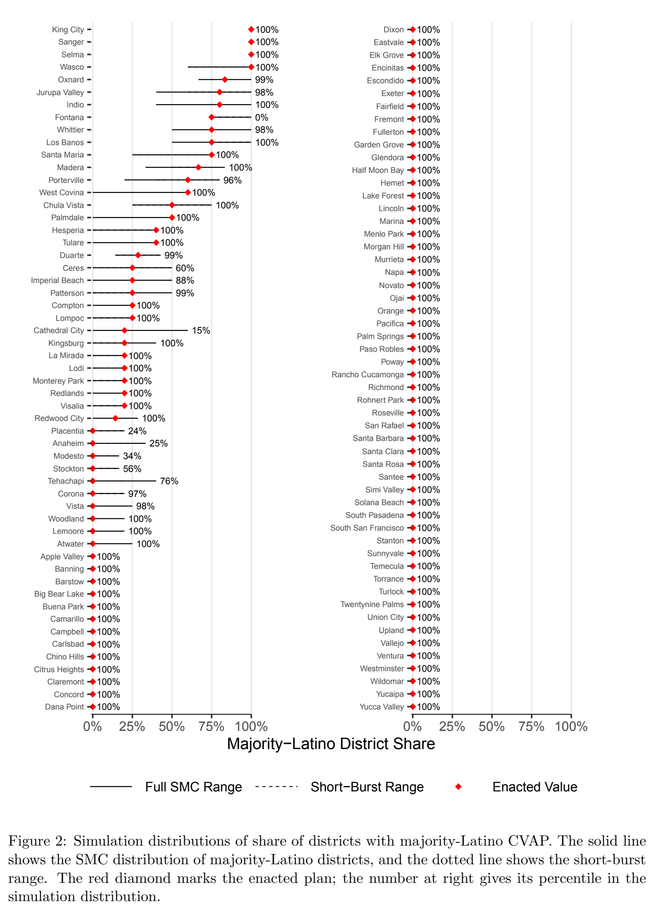

***Figure 2.*** Simulation distributions of share of districts with majority-Latino CVAP. The solid line shows the SMC distribution of majority-Latino districts, and the dotted line shows the short-burst range. The red diamond marks the enacted plan; the number at right gives its percentile in the simulation distribution.

Sanger 100% Apple Valley 100% Selma 100% Banning 100% King City 100% Big Bear Lake 100% Wasco 100% Camarillo 100% Whittier 52% Campbell 100% Oxnard 96% Carlsbad 100% Indio 74% Citrus Heights 100% Fontana 0% Claremont 100% Los Banos 55% Concord 100% Madera 37% Dana Point 100% Jurupa Valley 25% Dixon 100% West Covina 8% Elk Grove 100% Santa Maria 93% Encinitas 100% Palmdale 90% Escondido 100% Chula Vista 37% Exeter 100% Porterville 20% Fairfield 100% Patterson 100% Fremont 100% Tulare 100% Glendora 100% Duarte 92% Half Moon Bay 100% Ceres 38% Hemet 100% Compton 100%

Lake Forest 100% Imperial Beach 39%

Lincoln 100% Cathedral City 9%

Marina 100% Monterey Park 100%

Menlo Park 100% Redlands 99%

Morgan Hill 100% La Mirada 60%

Murrieta 100% Hesperia 98%

Napa 100% Anaheim 4%

Novato 100% Lompoc 96%

Ojai 100% Redwood City 84%

Orange 100% Kingsburg 24%

Pacifica 100% Corona 91%

Palm Springs 100% Modesto 14%

Paso Robles 100% Lodi 100%

Poway 100% Eastvale 100%

Placentia 19% Rancho Cucamonga 100% Garden Grove 89% Rohnert Park 100% South San Francisco 100% Roseville 100% Lemoore 63% San Rafael 100% Vista 88% Santa Clara 100% Richmond 99% Santa Rosa 100% Buena Park 43% Santee 100% Atwater 98% Simi Valley 100% Fullerton 84% Solana Beach 100% Visalia 59% South Pasadena 100% Tehachapi 73% Sunnyvale 100% Turlock 81% Temecula 100% Barstow 93% Torrance 100% Upland 94% Twentynine Palms 100% Ventura 95% Union City 100% Stockton 99% Vallejo 100% Woodland 100% Westminster 100% Chino Hills 100% Wildomar 100%

Stanton 100% Yucaipa 100%

Santa Barbara 100% Yucca Valley 100%

0% 25% 50% 75% 100% 0% 25% 50% 75% 100% Expected Latino Council Share

Full SMC Range Short−Burst Range Enacted Value

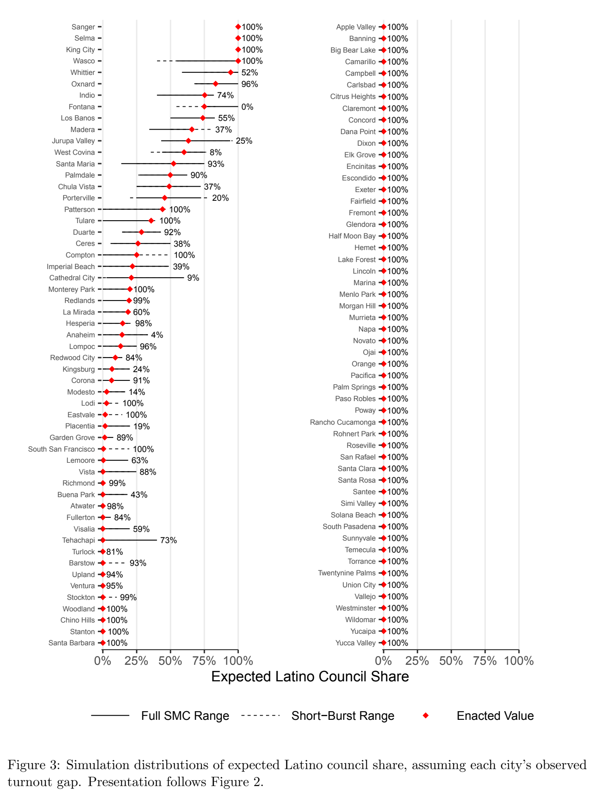

***Figure 3.*** Simulation distributions of expected Latino council share, assuming each city’s observed turnout gap. Presentation follows Figure 2.

The tendency to draw fewer majority-Latino districts need not reflect a desire to stymie the reform. In Anaheim, highly mobilized activists believed there were benefits to multiple opportunity districts even if no single district crossed the 50% threshold, expecting crossover voting to propel Latino candidates to office. In Figure 3, we assess this expectation by replicating Figure 2 with expected Latino council share as the outcome. The estimates presented assume observed levels of Latino cohesion and non-Latino crossover and apply each city’s observed turnout gap. We find that 50% of cities cannot draw a single map with an expected Latino council share above zero. Again, when cities had room to maneuver, they chose favorably for Latinos: among the 55 cities with variation in expected Latino council share, 18% implemented a map achieving the most favorable plan in the simulation distribution, and only 14 cities selected a map in the bottom half of their distribution.

District Performance under Counterfactual Voter Behavior

Closing the Turnout Gap Might the limited performance of district elections stem from the turnout gap? Recall that the estimates in Figure 3 rely on turnout observed before each city’s switch to district elections, but the switch could plausibly narrow this gap. Figure 4 therefore plots the maximum expected Latino council share attainable under the most favorable simulated map, at the observed turnout gap and with the gap closed entirely. Closing the gap leaves the attainable maximum unchanged in 58 of 109 cities, which are omitted from Figure 4. Among the remaining 51 cities, it raises the attainable maximum by more than 5 points in 35 cities, but by less than 5 percentage points in 16 cities.12 The limited effects of district elections are not primarily a function of differential turnout.

Shifting Cohesion and Crossover Cohesion and crossover could likewise respond to the reform, or drift on their own. Figure 5 therefore evaluates a grid of alternative assumptions, plotting expected Latino council share against citywide Latino CVAP share. The solid black curve in both panels shows the relationship at observed behavior, corresponding roughly to 80% cohesion and 30% crossover. Note the shape of this curve: a city at 50% Latino CVAP can expect a 50% Latino council, but expected council share severely lags CVAP share in the 10–30% range, where the vast 12Compton is an outlier: Latinos there turn out at higher rates than non-Latino voters.

erahS

licnuoC

onitaL

detcepxE

.xaM

anatnoF oidnI yellaV

apuruJ

dranxO sonaB

soL

ellivretroP aredaM anivoC

tseW

atsiV

aluhC

eladmlaP sereC ytiC

lardehtaC

eraluT nosrettaP notpmoC hcaeB

lairepmI

miehanA copmoL etrauD ipahcaheT airepseH grubsgniK ailasiV retawtA anoroC ytiC

doowdeR

notkcotS eroomeL atsiV wotsraB adariM

aL

notnatS sdnaldeR ocsicnarF

naS

htuoS

kcolruT idoL kraP

aneuB

notrelluF elavtsaE otsedoM evorG

nedraG

dnalpU dnaldooW dnomhciR kraP

olneM

egnarO gninnaB arutneV arabraB atnaS

agnomacuC ohcnaR ramodliW Actual Turnout Gap No Turnout Gap

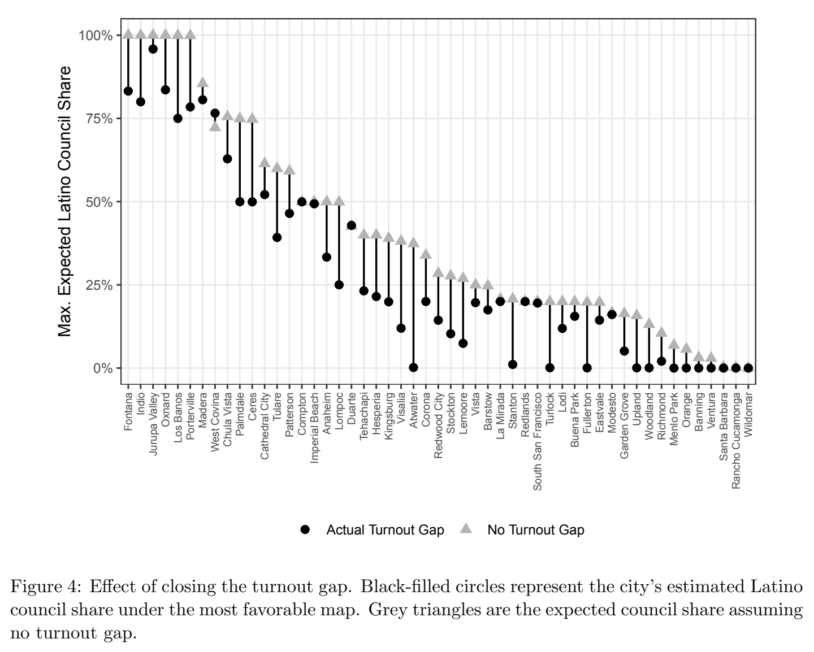

***Figure 4.*** Effect of closing the turnout gap. Black-filled circles represent the city’s estimated Latino council share under the most favorable map. Grey triangles are the expected council share assuming no turnout gap.

majority of our cities fall. At 30% Latino CVAP, the expected Latino council share is zero.

The left panel varies Latino cohesion while holding crossover at 30%. Increases beyond the already high observed baseline do not yield significant representational gains. A decline, by contrast, would be costly. Were cohesion to fall to 60%, even a city at 50% Latino CVAP could expect only a 25% Latino council. The right panel varies crossover while holding cohesion at 80%, and the effects are modest. Raising crossover to 40% hardly shifts the curve, and cutting it to 20% shifts it only slightly rightward. No assumption changes the curve’s fundamental shape: expected Latino council share remains essentially zero below roughly 30% Latino CVAP. The limited potential of district elections is not attributable to voting behavior. Even full Latino cohesion offers little opportunity for Latino descriptive representation in the cities where most CVRA reform has occurred.

Varying Cohesion (30% Crossover)

60% cohesion

100% cohesion

75% Observed

0% 25% 50% 75% 100% erahS

licnuoC

onitaL

detcepxE

Varying Crossover (80% Cohesion) 20% crossover 40% crossover 75% Observed

0% 25% 50% 75% 100% Latino CVAP Share

erahS

licnuoC

onitaL

detcepxE

Latino CVAP Share

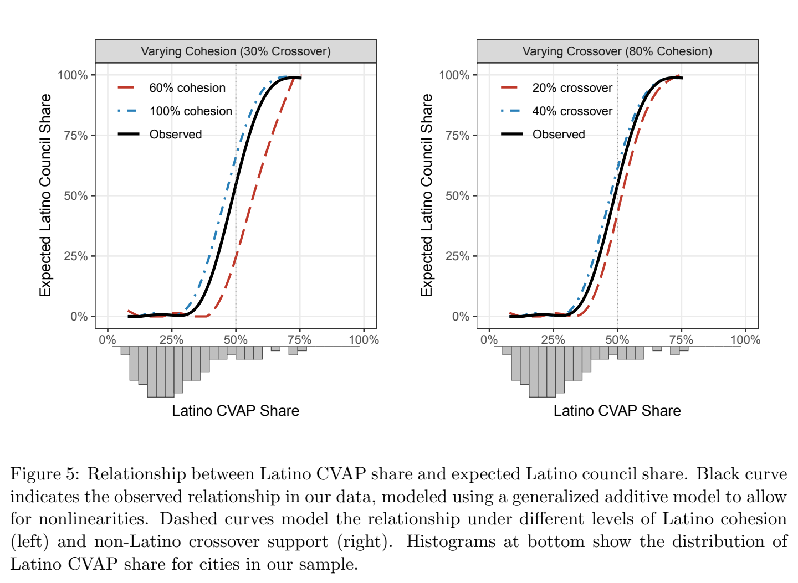

***Figure 5.*** Relationship between Latino CVAP share and expected Latino council share. Black curve indicates the observed relationship in our data, modeled using a generalized additive model to allow for nonlinearities. Dashed curves model the relationship under different levels of Latino cohesion (left) and non-Latino crossover support (right). Histograms at bottom show the distribution of Latino CVAP share for cities in our sample.

The Promise of Alternative Remedies

Given the limited possibilities under district elections, how would these cities fare under cumulative voting, limited voting, and the single transferable vote? Figure 6 plots, for every city and each system, the difference between median expected Latino council share and the city’s Latino CVAP share, across three cohesion scenarios. Two patterns emerge.

Latino Cohesion: 1.00 Latino Cohesion: 0.80 Latino Cohesion: 0.60

Non−Latino Crossover: 0.30 Non−Latino Crossover: 0.30 Non−Latino Crossover: 0.30

+50%

+23% +23%

+25%

+19% +19% +19% +18% +17% +16% +16% −17%

−19%

−23%

−25%

−50%

Districting Cumulative Limited Single Districting Cumulative Limited Single Districting Cumulative Limited Single Transferable Transferable Transferable Vote Vote Vote erahS

PAVC

onitaL

erahS

licnuoC

onitaL

detcepxE

naideM

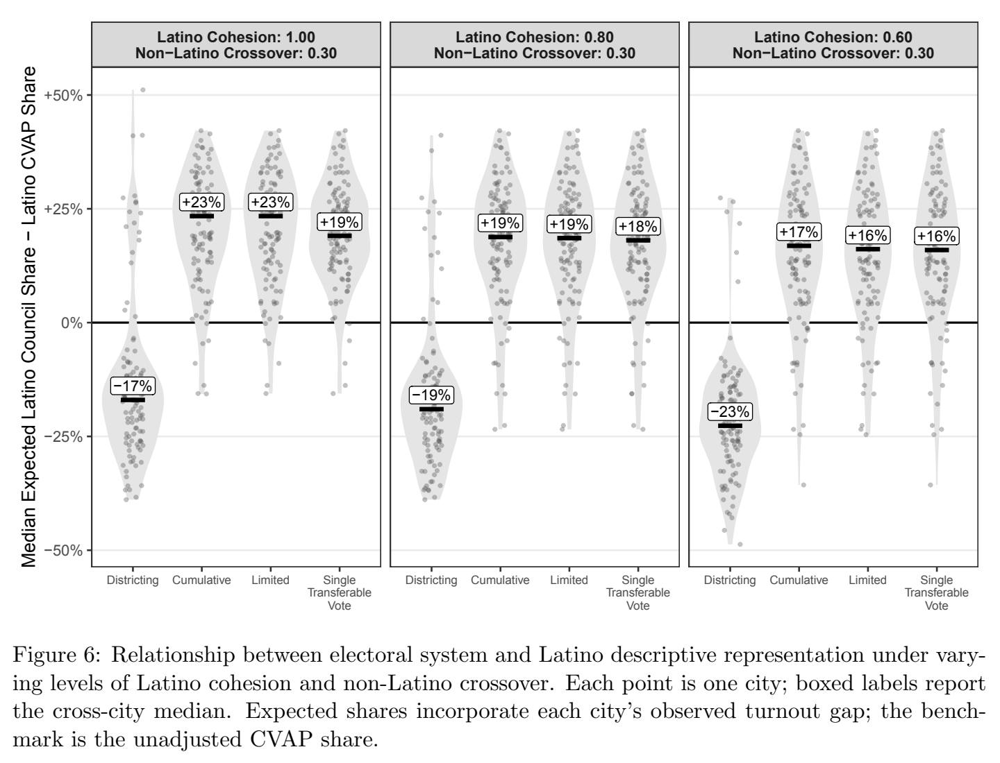

***Figure 6.*** Relationship between electoral system and Latino descriptive representation under vary- ing levels of Latino cohesion and non-Latino crossover. Each point is one city; boxed labels report the cross-city median. Expected shares incorporate each city’s observed turnout gap; the bench- mark is the unadjusted CVAP share.

First, the three alternative systems produce similar distributions within each scenario. This is not as surprising as it may appear: although the systems tally votes differently, they share the property that a cohesive voting bloc can convert its vote share into a comparable seat share provided it can internally coordinate on the slate of candidates. Since we embed this coordination assumption in our simulations, the mechanical differences among the three rules matter only at the margins.13

13Appendix Figure E-1 shows that the systems do come apart under alternative assumptions about coordination.

Second, all three systems deliver expected Latino council shares above proportionality—exceeding Latino CVAP share by 16 to 23 percentage points in the median city, depending on cohesion—while districting falls 17 to 23 points below it. This substantial gap highlights an important difference in the efficiency with which district-based and proportional-family systems absorb crossover votes.14 Under proportional rules, every crossover ballot counts toward seats, regardless of where the voter lives. Consider a city whose electorate is 20% Latino, with cohesion of 0.6 and crossover of 0.3. The Latino slate’s expected vote share is 0.2 × 0.6 + 0.8 × 0.3 = 36%, which is 16 points above the group’s population share.15 By contrast, under districting, residential segregation wastes significant crossover votes: 30% crossover in an overwhelmingly white district still leaves a Latino candidate short of a majority. These votes are only pivotal in demographically mixed districts where Latinos are a large but not already dominant share of the electorate.

## Discussion

Following the hollowing out of the federal VRA, nearly half of state legislatures have passed or introduced their own VRA. These VRAs offer both district elections and, often, proportional representation systems as remedies to minority vote dilution in local government. Applying redistricting and ballot simulation algorithms to the CVRA, we assessed representational outcomes under enacted district maps, maps that were possible but not selected, and proportional systems requiring no maps.

Our findings present a sobering picture for district elections. In most cities, geography and demography prevent the construction of districts which would meaningfully improve representation. Thus, by expanding the set of cases where voter dilution claims would succeed, the CVRA brought district elections to cities where the reform would have little impact on Latino electoral success under even the most optimistic assumptions about turnout, cohesion, and crossover. California councils generally chose favorable maps, but the state’s intense interest-group monitoring may not travel elsewhere. Even favorable maps tend to protect incumbents, disadvantaging Latino candidates (Loffredo, Hankinson and Magazinnik 2026).

14For reference, see the bottom row of Appendix Figure E-1 for estimates from a simulation with full Latino cohesion and no crossover.

15This closely matches our estimated +16% to +17% median. The same calculation nearly reproduces the medians in the other panels: 40% at 0.8 cohesion (+18% to +19%) and 44% at full cohesion (+19% to +23%).

We also demonstrate that systems in the proportional representation family do not share these limitations. These systems require neither a spatially concentrated minority nor the selection of a favorable map by the incumbent council. Across our simulations, all three alternative systems deliver Latino council shares exceeding proportionality in the very cities where district elections fail, and they do so under a wide range of assumptions about cohesion, crossover, and candidate strength. For the cities where districting is limited by geography and demography, proportional reforms may be the only remedy for advancing minority descriptive representation.

## References

Abott, Carolyn and Asya Magazinnik. 2020. “At-Large Elections and Minority Representation in Local Government.” American Journal of Political Science 64(3):717–733.

ACLU of Southern California. 2025. “Securing Fair Representation in California.”. Accessed: 2026-03-25.

URL: https://www.aclusocal.org/app/uploads/2025/08/Securing-Fair-Representation-in- California-ACLU-SoCal-2025.pdf

Atsusaka, Yuki. 2021. “A Logical Model for Predicting Minority Representation: Application to Redistricting and Voting Rights Cases.” American Political Science Review 115(4):1210–1225. Benade, Gerdus, Ruth Buck, Moon Duchin, Dara Gold and Thomas Weighill. 2021. “Ranked choice voting and proportional representation.” Available at SSRN 3778021 .

Cameron, Charles, David Epstein and Sharyn O’Halloran. 1996. “Do Majority-Minority Districts Maximize Substantive Black Representation in Congress?” American Political Science Review 90(4):794–812.

Cannon, Sarah, Ari Goldbloom-Helzner, Varun Gupta, JN Matthews and Bhushan Suwal. 2023. “Voting Rights, Markov Chains, and Optimization by Short Bursts.” Methodology and Computing in Applied Probability 25(1):36.

Chen, Jowei and Jonathan Rodden. 2013. “Unintentional Gerrymandering: Political Geography and Electoral Bias in Legislatures.” Quarterly Journal of Political Science 8(3):239–269.

Collingwood, Loren and Sean Long. 2019. “Can States Promote Minority Representation? Assessing the Effects of the California Voting Rights Act.” Urban Affairs Review pp. 1–32.

Cox, Gary W. 1997. Making Votes Count: Strategic Coordination in the World’s Electoral Systems. Cambridge: Cambridge University Press.

Dancygier, Rafaela M. 2014. “Electoral Rules or Electoral Leverage? Explaining Muslim Representation in England.” World Politics 66(2):229–263.

de Benedictis-Kessner, Justin and Rachel Bernhard. 2022. “Concatenated Files Fixing Errors in the California Elections Data Archive (CEDA).” GitHub repository, online: https://github. com/justindbk/ceda/.

Diamond, Greg. 2016. “District 3 is Still a Majority Latino CVAP as It Ever Was: A Close Look at Block Groups 93 & 106.” The Orange Juice .

Elmahrek, Adam. 2015. “Anaheim City Council Stalls Transition to District Elections.” Voice of OC .

Elmahrek, Adam. 2016. “‘People’s Map’ Victory a Lesson in Hardball Activism.” Voice of OC . Fraga, Bernard L. 2018. The Turnout Gap: Race, Ethnicity, and Political Inequality in a Diversifying America. Cambridge: Cambridge University Press.

Fraga, Bernard L., Yamil R. Velez and Emily A. West. 2025. “Reversion to the Mean, or Their Version of the Dream? Latino Voting in an Age of Populism.” 119(1):517–525.

Gomez, Melissa. 2026. “L.A. City Council Should Expand to 25 Members, Charter Reform Commission Says.” Los Angeles Times . Accessed 2026-07-20.

URL: https://www.latimes.com/california/story/2026-02-28/la-city-council-should-expand-to- 25-members-charter-reform-commi ssion-says

Greenwood, Ruth M and Nicholas O Stephanopoulos. 2023. “Voting Rights Federalism.” Emory LJ 73:299.

Hankinson, Michael and Asya Magazinnik. 2023. “The Supply–Equity Trade-off: The Effect of Spatial Representation on the Local Housing Supply.” The Journal of Politics 25(3).

Hasen, Richard L. 2025. “The Supreme Court Just Signaled Something Deeply Disturbing About the Next Term.” Slate .

Hertz, Zachary L. 2023. “Does a Switch to By-District Elections Reduce Racial Turnout Disparities in Local Elections? The Impact of the California Voting Rights Act.” Election Law Journal: Rules, Politics, and Policy 22(3):213–228.

Kenny, Christopher T., Cory McCartan, Ben Fifield and Kosuke Imai. 2021. “redist: Simulation Methods for Legislative Redistricting.” Available at The Comprehensive R Archive Network (CRAN).

URL: https://CRAN.R-project.org/package=redist

Lijphart, Arend, Rafael L´opez Pintor and Yasunori Sone. 1986. The Limited Vote and the Single Nontransferable Vote: Lessons from the Japanese and Spanish Examples. In Electoral Laws and Their Political Consequences, ed. Bernard Grofman and Arend Lijphart. New York: Agathon Press pp. 154–169.

Loffredo, Joseph, Michael Hankinson and Asya Magazinnik. 2026. “Reform Drift: How Incumbent Protection Undermines Descriptive Representation in Local Government.”.

URL: https://www.ssrn.com/abstract=5372605

Lublin, David. 1997. The Paradox of Representation: Racial Gerrymandering and Minority Interests in Congress. Princeton, NJ: Princeton University Press.

Lublin, David, Lisa Handley, Thomas L Brunell and Bernard Grofman. 2020. “Minority Success in Non-Majority Minority Districts: Finding the “Sweet Spot”.” Journal of Race, Ethnicity, and Politics 5(2):275–298.

Mast, Evan. 2024. “Warding off development: Local control, housing supply, and nimbys.” Review of Economics and Statistics 106(3):671–680.

McCartan, Cory and Kosuke Imai. 2023. “Sequential Monte Carlo for Sampling Balanced and Compact Redistricting Plans.” Annals of Applied Statistics 17(4):3300–3323.

URL: https://doi.org/10.1214/23-AOAS1763

MGGG Redistricting Lab. 2025. “VoteKit Documentation.” https://votekit.readthedocs.io/ en/latest/. Accessed: 2026-03-25.

Mikkelborg, Anna Caroline. 2025. “White Democrats’ growing support for Black politicians in the era of the “Great Awokening”.” American Political Science Review 119(4):1902–1920.

NAACP Legal Defense and Educational Fund. 2026. “Model State Voting Rights Act.” https: //www.naacpldf.org/state-voting-rights-acts/state-vra-model-bill/. Accessed March 25, 2026.

Nichols, John. 2002. “A Voting Reform That Works Is Transforming Texas.” The Nation . Accessed 2026-07-20.

URL: https://www.thenation.com/article/archive/voting-reform-works-transforming-texas/

Ranked Choice Voting Resource Center. 2026. “Where is RCV Used?” https://www. rcvresources.org/where-is-rcv-used/. Accessed 2026-07-20.

Schuk, Carolyn. 2015. “Fighting CVRA Lawsuit Will Likely Cost Santa Clara $3.97 Million More Than It Cost Sunnyvale To Avoid One.” The Silicon Valley Voice .

Supreme Court of the United States. 1986. “Thornburg v. Gingles, 478 U.S. 30.”.

Supreme Court of the United States. 2026. “Louisiana v. Callais.” https://www.supremecourt. gov/opinions/25pdf/24-109_21o3.pdf. 608 U.S. (2026) (No. 24-109), decided April 29, 2026.

Trounstine, Jessica and Melody E Valdini. 2008. “The Context Matters: The Effects of Single- Member versus At-Large Districts on City Council Diversity.” American Journal of Political Science 52(3):554–569.

U.S. Election Assistance Commission. 2023. “Alternative Voting Systems in the United States.” https://www.eac.gov/sites/default/files/electionofficials/Final_ Alternative_Voting_Methods_in_the_United_States_508.pdf. Accessed 2026-07-20.

## Supplemental Information for “Assessing District Elections as a

A Data Construction and Summary Statistics . . . . . . . . . . . . . . . . . . . . . . . A-2 B State VRA Reforms . . . . . . . . . . . . . . . . . . . . . . . . . . . . . . . . . . . . A-8 C Districting Simulations . . . . . . . . . . . . . . . . . . . . . . . . . . . . . . . . . . . A-10 Creating a distribution of feasible districting plans. . . . . . . . . . . . . . . . A-10 Optimizing plans for particular measures. . . . . . . . . . . . . . . . . . . . . A-13 D Predicting Latino Council Share Using Atsusaka’s (2021) Logical Model . . . . . . . A-14 Model structure. . . . . . . . . . . . . . . . . . . . . . . . . . . . . . . . . . . A-14 Determining M and C for CVRA cities. . . . . . . . . . . . . . . . . . . . . . A-15 Computing expected Latino council share from district-level probabilities. . . A-15 Analyses with counterfactual turnout, cohesion, and crossover values. . . . . A-15 Share of majority-Latino districts as an alternative measure. . . . . . . . . . A-16 E Modeling Alternative Institutions . . . . . . . . . . . . . . . . . . . . . . . . . . . . . A-16

A Data Construction and Summary Statistics

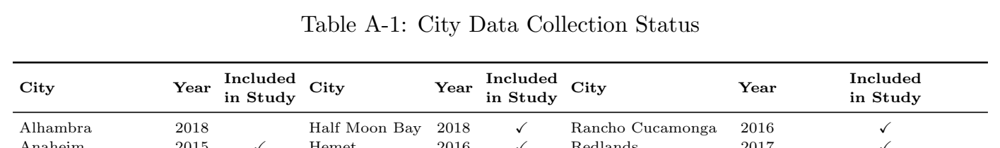

***Table A-1.*** City Data Collection Status

[Download data as CSV](tables/tab-01.csv)

Included Included Included City Year City Year City Year

in Study in Study in Study Alhambra 2018 Half Moon Bay 2018 ✓ Rancho Cucamonga 2016 ✓ Anaheim 2015 ✓ Hemet 2016 ✓ Redlands 2017 ✓ Antioch 2018 Hesperia 2017 ✓ Redwood City 2018 ✓ Apple Valley 2019 ✓ Highland 2016 Richmond 2019 ✓ Arcadia 2017 Imperial Beach 2018 ✓ Riverbank 2015

Arroyo Grande 2019 Indio 2017 ✓ Rohnert Park 2020 ✓ Atascadero 2022 Jurupa Valley 2017 ✓ Roseville 2019 ✓ Atwater 2017 ✓ King City 2016 ✓ San Francisco 2000

Bakersfield 2018 Kingsburg 2018 ✓ San Juan Capistrano 2016

Banning 2016 ✓ La Mirada 2016 ✓ San Marcos 2016

Barstow 2018 ✓ La Palma 2022 San Mateo 2021

Bellflower 2016 Lake Elsinore 2018 San Rafael 2018 ✓ Big Bear Lake 2017 ✓ Lake Forest 2017 ✓ San Ramon 2019

Brentwood 2019 Lakewood 2021 Sanger 2010 ✓ Buellton 2018 Lemoore 2018 ✓ Santa Ana 2018

Buena Park 2016 ✓ Lincoln 2020 ✓ Santa Barbara 2014 ✓ Camarillo 2019 ✓ Livermore 2018 Santa Clara 2018 ✓ Campbell 2019 ✓ Lodi 2017 ✓ Santa Clarita 2016

Carlsbad 2017 ✓ Lompoc 2017 ✓ Santa Cruz 2020

Carpinteria 2017 Los Alamitos 2018 Santa Maria 2017 ✓ Carson 2020 Los Banos 2014 ✓ Santa Rosa 2017 ✓ Cathedral City 2017 ✓ Madera 2010 ✓ Santee 2018 ✓ Ceres 2015 ✓ Malibu 2020 Selma 2019 ✓ Chino 2016 Manteca 2021 Simi Valley 2018 ✓ Chino Hills 2016 ✓ Marina 2019 ✓ Solana Beach 2018 ✓ Chula Vista 2012 ✓ Martinez 2017 South Pasadena 2017 ✓ Citrus Heights 2019 ✓ Menlo Park 2017 ✓ South San Francisco 2018 ✓ Claremont 2018 ✓ Merced 2015 Stanton 2017 ✓ Coalinga 2018 Millbrae 2022 Stockton 2016 ✓ Compton 2012 ✓ Mission Viejo 2022 Sunnyvale 2018 ✓ Concord 2018 ✓ Modesto 2008 ✓ Tehachapi 2017 ✓ Corona 2016 ✓ Monterey Park 2019 ✓ Temecula 2017 ✓ Costa Mesa 2016 Moorpark 2018 Torrance 2018 ✓ Dana Point 2018 ✓ Morgan Hill 2017 ✓ Tulare 2012 ✓ Davis 2019 Murrieta 2017 ✓ Turlock 2014 ✓ Desert Hot Springs 2021 Napa 2020 ✓ Tustin 2021

Diamond Bar 2022 National City 2021 Twentynine Palms 2018 ✓ Dixon 2016 ✓ Novato 2019 ✓ Union City 2019 ✓ Duarte 2017 ✓ Oceanside 2017 Upland 2016 ✓ Dublin 2022 Ojai 2018 ✓ Vacaville 2018

Eastvale 2016 ✓ Ontario 2020 Vallejo 2018 ✓ El Cajon 2016 Orange 2018 ✓ Ventura 2018 ✓ El Monte 2022 Oroville 2019 Victorville 2021

Elk Grove 2019 ✓ Oxnard 2018 ✓ Visalia 2014 ✓ Encinitas 2017 ✓ Pacifica 2018 ✓ Vista 2017 ✓ Escondido 2013 ✓ Palm Desert 2019 Wasco 2017 ✓ Eureka 2016 Palm Springs 2018 ✓ West Covina 2016 ✓ Exeter 2017 ✓ Palmdale 2015 ✓ Westminster 2019 ✓ Fairfield 2019 ✓ Paso Robles 2018 ✓ Whittier 2014 ✓ Fontana 2017 ✓ Patterson 2016 ✓ Wildomar 2016 ✓ Fremont 2017 ✓ Perris 2021 Windsor 2019

Fullerton 2016 ✓ Petaluma 2021 Woodland 2014 ✓ Garden Grove 2016 ✓ Placentia 2016 ✓ Yuba City 2022

Glendale 2018 Pleasanton 2021 Yucaipa 2016 ✓

Glendora 2017 ✓ Porterville 2018 ✓ Yucca Valley 2018 ✓

Goleta 2017 Poway 2017 ✓

Note: Check marks indicate the 109 of 167 switching cities included in the study. Year is the year the city switched to district elections.

We obtained as many city council district shapefiles as we could find for the California cities that have converted to district elections under the CVRA. Through a combination of searching online

and contacting city government offices by phone, we ultimately obtained 109 shapefiles, covering 65% of the 167 cities that we have documented as having switched or committed to switching to district elections in the wake of the CVRA. Table A-1 lists each of these 167 cities, identifies the year they switched to district elections, and indicates the set of cities we were able to collect shapefiles for and include in this study.

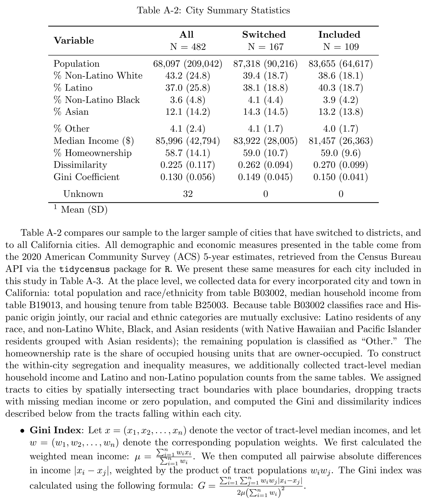

***Table A-2.*** City Summary Statistics

[Download data as CSV](tables/tab-02.csv)

All Switched Included

Variable

N = 482 N = 167 N = 109

Population 68,097 (209,042) 87,318 (90,216) 83,655 (64,617) % Non-Latino White 43.2 (24.8) 39.4 (18.7) 38.6 (18.1) % Latino 37.0 (25.8) 38.1 (18.8) 40.3 (18.7) % Non-Latino Black 3.6 (4.8) 4.1 (4.4) 3.9 (4.2) % Asian 12.1 (14.2) 14.3 (14.5) 13.2 (13.8) % Other 4.1 (2.4) 4.1 (1.7) 4.0 (1.7) Median Income ($) 85,996 (42,794) 83,922 (28,005) 81,457 (26,363) % Homeownership 58.7 (14.1) 59.0 (10.7) 59.0 (9.6)

Dissimilarity 0.225 (0.117) 0.262 (0.094) 0.270 (0.099)

Gini Coefficient 0.130 (0.056) 0.149 (0.045) 0.150 (0.041)

Unknown 32 0 0

### 1 Mean (SD)

Table A-2 compares our sample to the larger sample of cities that have switched to districts, and to all California cities. All demographic and economic measures presented in the table come from the 2020 American Community Survey (ACS) 5-year estimates, retrieved from the Census Bureau API via the tidycensus package for R. We present these same measures for each city included in this study in Table A-3. At the place level, we collected data for every incorporated city and town in California: total population and race/ethnicity from table B03002, median household income from table B19013, and housing tenure from table B25003. Because table B03002 classifies race and Hispanic origin jointly, our racial and ethnic categories are mutually exclusive: Latino residents of any race, and non-Latino White, Black, and Asian residents (with Native Hawaiian and Pacific Islander residents grouped with Asian residents); the remaining population is classified as “Other.” The homeownership rate is the share of occupied housing units that are owner-occupied. To construct the within-city segregation and inequality measures, we additionally collected tract-level median household income and Latino and non-Latino population counts from the same tables. We assigned tracts to cities by spatially intersecting tract boundaries with place boundaries, dropping tracts with missing median income or zero population, and computed the Gini and dissimilarity indices described below from the tracts falling within each city.

• Gini Index: Let x = (x , x , . . . , x ) denote the vector of tract-level median incomes, and let 1 2 n

w = (w , w , . . . , w ) denote the corresponding population weights. We first calculated the 1 2 n

weighted mean income: µ =

(cid:80)n

i=1

wixi

. We then computed all pairwise absolute differences (cid:80)n

i=1

wi

in income |x − x |, weighted by the product of tract populations w w . The Gini index was i j i j calculated using the following formula: G =

(cid:80)n

i=1

(cid:80)n

j=1

wiwj|xi−xj| 2µ((cid:80)n

i=1

wi )2

• Dissimilarity index. Let L and NL denote the Latino and non-Latino population in tract i i

(cid:80) (cid:80)

i, respectively, and let L = L and NL = NL be the total Latino and non-Latino popi i i i

(cid:12) (cid:12) ulation in the city, respectively. The dissimilarity index is given by: D = 1 (cid:80)n (cid:12)Li − NLi (cid:12). 2 i=1 (cid:12) L NL (cid:12) We then overlaid the shapefiles we collected from each city on a Census block-level shapefile from 2017,1 which allowed us to associate each block with a city council district as well as a set of political and demographic indicators (e.g., citizen voting-age population) obtained from the U.S. Census, a statewide voter file from the data vendor L2, and the California Statewide Database.2 The resulting standardized and enhanced shapefiles constituted the inputs into our simulations. 1Obtained from: https://www.census.gov/cgi-bin/geo/shapefiles/index.php?year=2017&layergroup= Blocks+%282010%29.

2https://statewidedatabase.org/.

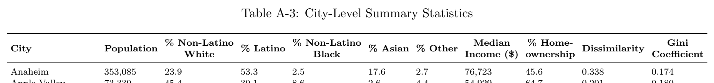

***Table A-3.*** City-Level Summary Statistics

[Download data as CSV](tables/tab-03.csv)

% Non-Latino % Non-Latino Median % Home- Gini City Population % Latino % Asian % Other Dissimilarity

White Black Income ($) ownership Coefficient Anaheim 353,085 23.9 53.3 2.5 17.6 2.7 76,723 45.6 0.338 0.174

Apple Valley 73,339 45.4 39.1 8.6 2.6 4.4 54,929 64.7 0.201 0.189 Atwater 30,336 33.7 55.5 3.6 5.1 2.1 57,052 52.4 0.195 0.142 Banning 30,276 37.4 47.0 7.1 3.8 4.7 43,442 68.6 0.350 0.140 Barstow 23,547 23.5 44.8 16.1 4.7 10.9 42,912 41.0 0.096 0.167 Big Bear Lake 5,302 64.5 31.4 0.4 1.9 1.8 54,896 56.6 0.227 0.149 Buena Park 82,228 23.6 37.9 2.8 33.0 2.8 84,680 56.6 0.247 0.149 Camarillo 68,583 56.0 29.1 2.3 8.8 3.8 98,039 63.8 0.200 0.136 Campbell 42,891 48.5 19.7 2.3 23.6 5.9 122,644 49.2 0.254 0.163 Carlsbad 114,411 69.3 15.5 1.0 8.9 5.2 112,933 62.5 0.312 0.158 Cathedral City 54,812 32.0 56.7 1.6 7.4 2.4 50,350 61.6 0.379 0.191 Ceres 48,355 23.6 62.3 3.4 7.6 3.1 59,247 60.0 0.193 0.132 Chino Hills 82,800 28.6 27.5 3.6 36.9 3.5 104,661 73.0 0.290 0.113 Chula Vista 268,779 16.9 60.3 4.5 15.1 3.2 86,132 60.1 0.291 0.200 Citrus Heights 87,665 67.6 19.9 3.3 3.4 5.7 65,867 58.5 0.207 0.096 Claremont 35,610 50.7 23.2 4.9 14.9 6.4 101,080 66.0 0.097 0.176 Compton 95,804 0.9 69.3 27.0 1.2 1.6 58,703 55.9 0.308 0.110 Concord 129,227 47.4 29.1 3.5 13.1 6.9 92,706 60.1 0.330 0.177 Corona 168,112 31.7 47.9 6.0 10.9 3.6 88,434 63.6 0.322 0.191 Dana Point 33,782 73.7 16.3 2.1 3.9 3.9 105,250 62.7 0.194 0.138 Dixon 20,106 49.1 41.3 2.1 4.7 2.9 79,465 60.2 0.102 0.059 Duarte 21,399 23.2 52.3 6.4 16.0 2.1 82,620 64.0 0.191 0.152 Eastvale 65,766 20.6 40.1 7.2 28.0 4.2 127,881 78.8 0.130 0.063 Elk Grove 173,370 33.5 19.0 10.4 30.4 6.7 101,776 73.9 0.133 0.122 Encinitas 62,967 76.4 15.9 0.3 3.8 3.6 120,488 63.8 0.284 0.145 Escondido 150,396 35.8 51.9 2.1 6.3 4.0 65,326 51.3 0.379 0.236 Exeter 10,433 46.4 47.1 0.8 3.1 2.6 48,605 63.1 0.280 0.078 Fairfield 116,544 29.9 29.8 16.3 17.2 6.8 86,204 59.0 0.316 0.179 Fontana 212,704 14.0 68.5 8.0 6.7 2.8 75,681 66.3 0.330 0.187 Fremont 234,829 18.9 12.8 3.1 61.5 3.8 142,374 61.4 0.310 0.125 Fullerton 141,061 33.8 36.8 1.9 23.9 3.6 85,471 53.7 0.386 0.174 Garden Grove 172,800 18.7 36.6 0.8 42.0 1.9 73,611 53.7 0.313 0.132 Glendora 51,087 46.5 36.2 1.7 11.7 3.9 99,153 70.4 0.212 0.112 Half Moon Bay 12,583 60.8 28.2 0.4 6.4 4.2 131,233 67.0 0.342 0.158 Hemet 84,686 38.9 47.3 8.1 2.7 3.0 43,152 59.8 0.224 0.203 Hesperia 95,163 32.3 59.1 3.9 2.6 2.1 54,149 62.2 0.183 0.159 Imperial Beach 27,334 32.4 51.5 5.5 6.3 4.3 59,795 32.3 0.251 0.192 Indio 89,996 27.9 64.9 3.5 2.2 1.5 53,434 72.2 0.484 0.177

Table A-3: City-Level Summary Statistics (continued)

% Non-Latino % Non-Latino Median % Home- Gini City Population % Latino % Asian % Other Dissimilarity

White Black Income ($) ownership Coefficient Jurupa Valley 106,646 19.7 71.4 3.0 4.3 1.6 77,787 68.9 0.324 0.170

King City 13,845 8.8 87.6 1.0 1.2 1.4 50,174 39.5 0.387 0.159 Kingsburg 12,116 41.0 47.7 0.3 7.9 3.1 73,281 64.8 0.206 0.089 La Mirada 48,260 32.9 42.0 1.3 20.9 2.9 92,493 77.4 0.197 0.139 Lake Forest 84,666 51.8 23.2 2.0 17.8 5.2 112,988 70.4 0.293 0.142 Lemoore 25,867 38.5 44.0 5.7 7.6 4.3 68,658 52.5 0.138 0.114 Lincoln 48,150 69.4 18.4 1.2 6.9 4.0 88,991 81.0 0.244 0.169 Lodi 66,562 45.8 37.8 1.4 11.2 3.7 64,153 52.8 0.268 0.178 Lompoc 42,753 29.1 60.4 3.1 3.8 3.6 57,071 45.3 0.330 0.189 Los Banos 39,443 20.2 71.4 1.7 4.2 2.5 64,567 57.3 0.267 0.130 Madera 65,575 14.3 78.3 4.2 1.7 1.5 49,335 50.6 0.251 0.178 Marina 21,966 39.7 28.2 6.7 15.7 9.7 73,115 41.2 0.087 0.084 Menlo Park 35,211 57.4 15.8 4.0 17.4 5.4 167,567 58.2 0.636 0.217 Modesto 214,485 42.5 40.7 4.7 8.5 3.6 62,182 55.7 0.311 0.173 Monterey Park 60,597 5.0 27.4 0.4 65.8 1.4 63,389 50.7 0.316 0.139 Morgan Hill 44,789 45.5 34.0 1.6 15.1 3.8 128,373 72.6 0.189 0.142 Murrieta 114,066 47.6 32.5 4.5 9.5 5.9 91,654 66.1 0.167 0.131 Napa 78,294 53.0 39.9 0.6 2.8 3.7 85,953 58.6 0.312 0.149 Novato 53,781 63.0 20.5 3.7 6.1 6.6 101,629 69.9 0.271 0.131 Ojai 7,613 77.9 16.8 0.2 3.3 1.7 75,653 56.9 0.101 0.032 Orange 139,322 43.8 38.2 1.4 12.8 3.9 96,605 59.2 0.335 0.187 Oxnard 207,722 13.6 75.1 2.1 7.0 2.2 77,050 54.5 0.421 0.149 Pacifica 38,663 51.4 18.6 2.4 22.0 5.5 130,466 69.2 0.139 0.051 Palm Springs 48,390 61.9 25.2 4.6 5.1 3.2 57,916 63.7 0.298 0.164 Palmdale 153,240 19.5 61.6 12.0 4.2 2.8 65,444 63.9 0.278 0.197 Paso Robles 31,480 59.2 34.1 0.3 2.5 4.0 69,297 59.4 0.225 0.115 Patterson 22,309 20.5 66.7 5.0 5.9 1.9 69,947 68.3 0.200 0.092 Placentia 52,049 39.3 38.3 2.4 15.9 4.0 100,707 63.9 0.388 0.178 Porterville 59,056 22.7 68.6 0.3 4.9 3.4 44,095 50.4 0.197 0.151 Poway 49,780 63.8 16.2 1.8 12.8 5.4 115,332 78.9 0.248 0.145 Rancho Cucamonga 178,060 34.8 37.3 9.6 14.0 4.3 92,290 62.5 0.162 0.193 Redlands 71,680 47.2 35.5 5.6 7.3 4.4 81,265 58.5 0.248 0.205 Redwood City 84,518 42.6 36.3 1.2 16.1 3.7 123,294 47.5 0.512 0.223 Richmond 110,051 18.2 44.1 17.4 15.1 5.2 72,463 53.0 0.370 0.184 Rohnert Park 42,559 59.1 27.1 1.7 6.7 5.3 77,831 50.7 0.325 0.123 Roseville 138,860 66.4 15.6 1.8 11.7 4.5 95,519 67.5 0.191 0.189 San Rafael 59,178 57.8 30.3 1.5 6.5 3.9 97,009 49.4 0.561 0.180

Table A-3: City-Level Summary Statistics (continued)

% Non-Latino % Non-Latino Median % Home- Gini City Population % Latino % Asian % Other Dissimilarity

White Black Income ($) ownership Coefficient Sanger 26,744 15.0 80.5 0.0 3.2 1.2 52,349 58.7 0.221 0.167

Santa Barbara 90,911 55.8 36.7 1.3 3.7 2.5 81,618 41.3 0.416 0.211 Santa Clara 126,723 30.9 16.3 2.8 45.2 4.8 136,870 43.5 0.209 0.120 Santa Maria 105,528 15.4 76.7 1.2 4.7 2.0 67,634 50.4 0.417 0.138 Santa Rosa 178,391 54.3 32.7 2.3 6.4 4.3 80,472 55.2 0.365 0.135 Santee 57,407 67.4 19.7 1.9 4.7 6.3 85,826 71.4 0.113 0.112 Selma 24,405 10.7 85.0 0.9 1.8 1.7 42,059 54.9 0.353 0.123 Simi Valley 125,768 58.2 24.5 1.4 11.9 4.0 99,245 71.5 0.248 0.155 Solana Beach 13,301 70.6 15.0 0.9 6.4 7.0 106,904 64.9 0.457 0.099 South Pasadena 25,478 40.0 19.0 4.0 31.8 5.2 109,927 49.0 0.096 0.123 South San Francisco 66,878 22.6 30.4 1.6 41.5 3.9 106,005 61.6 0.289 0.112 Stanton 38,317 19.0 49.2 1.6 27.1 3.1 66,017 48.2 0.242 0.125 Stockton 311,103 19.4 43.5 11.0 20.9 5.1 58,393 49.9 0.307 0.208 Sunnyvale 152,569 29.1 16.7 1.1 48.2 4.9 150,464 44.9 0.388 0.132 Tehachapi 12,718 51.5 35.9 6.8 2.5 3.2 47,039 64.5 0.198 0.101 Temecula 113,117 50.7 30.1 4.1 9.5 5.7 98,631 65.9 0.160 0.117 Torrance 144,430 34.7 19.1 2.7 37.7 5.7 94,781 54.6 0.218 0.119 Tulare 64,546 28.0 63.6 3.0 2.4 3.0 56,024 57.2 0.300 0.167 Turlock 72,715 48.0 40.1 2.0 6.1 3.8 60,799 53.7 0.287 0.206 Twentynine Palms 26,748 52.0 24.5 9.3 5.7 8.6 42,959 31.0 0.296 0.073 Union City 75,067 15.7 19.7 4.5 55.9 4.1 120,772 65.0 0.344 0.149 Upland 77,348 36.8 44.1 6.1 8.8 4.2 76,259 54.6 0.263 0.198 Vallejo 121,275 23.2 27.5 17.8 24.4 7.1 73,869 57.1 0.281 0.193 Ventura 108,467 53.8 36.9 1.6 3.9 3.8 79,986 55.5 0.289 0.159 Visalia 133,100 38.0 51.9 2.2 5.7 2.2 66,668 59.2 0.217 0.163 Vista 100,659 38.4 50.2 2.9 4.9 3.6 73,163 49.6 0.300 0.117 Wasco 27,553 7.4 84.1 5.7 0.9 1.9 39,291 59.4 0.329 0.190 West Covina 105,808 10.8 52.6 4.6 29.5 2.5 85,626 62.7 0.233 0.089 Westminster 90,857 21.8 22.9 0.9 51.4 3.0 67,142 53.4 0.274 0.166 Whittier 84,821 24.5 65.8 1.2 5.0 3.4 76,026 57.7 0.259 0.165 Wildomar 36,091 45.3 40.0 2.8 5.6 6.3 76,791 73.4 0.187 0.127 Woodland 59,759 37.1 49.6 1.6 8.0 3.7 71,477 52.5 0.199 0.177 Yucaipa 54,358 56.3 34.9 1.0 4.4 3.4 73,196 71.6 0.198 0.264 Yucca Valley 21,701 62.1 26.6 4.3 3.5 3.6 47,901 63.6 0.168 0.154

B State VRA Reforms

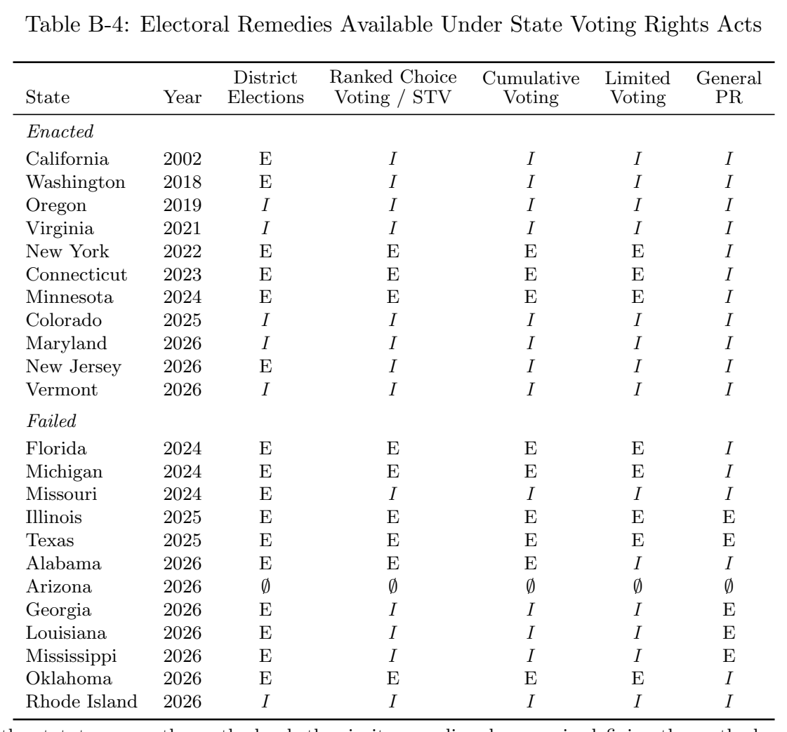

***Table B-4.*** Electoral Remedies Available Under State Voting Rights Acts

[Download data as CSV](tables/tab-04.csv)

District Ranked Choice Cumulative Limited General State Year Elections Voting / STV Voting Voting PR Enacted

California 2002 E I I I I Washington 2018 E I I I I Oregon 2019 I I I I I Virginia 2021 I I I I I New York 2022 E E E E I Connecticut 2023 E E E E I Minnesota 2024 E E E E I Colorado 2025 I I I I I Maryland 2026 I I I I I New Jersey 2026 E I I I I Vermont 2026 I I I I I Failed

Florida 2024 E E E E I Michigan 2024 E E E E I Missouri 2024 E I I I I Illinois 2025 E E E E E Texas 2025 E E E E E Alabama 2026 E E E I I Arizona 2026 ∅ ∅ ∅ ∅ ∅ Georgia 2026 E I I I E Louisiana 2026 E I I I E

Mississippi 2026 E I I I E

Oklahoma 2026 E E E E I

Rhode Island 2026 I I I I I

Note: E = the statute names the method, whether in its remedies clause or in defining the methods a jurisdiction may adopt; I = the method is not named, but nothing in the statute forecloses it; ∅ = the statute enumerates the relief a court may order and omits any change to the method of election. Arizona alone is coded ∅: its stated remedies (§ 16-1212) are exclusively procedural (additional voting hours, polling locations, means of voting, registration opportunities, voter education, calendar changes) although § 16-1202(D) prohibits a method of election that dilutes the vote of a protected class. Year is the year of enactment for enacted laws and of introduction for failed bills. Ranked choice voting and the single transferable vote are treated as one category: statutes name the method variously as “proportional ranked-choice voting” (CT, MN, FL, MI, AL, OK), “ranked-choice voting” (NY), or “the single transferable vote” (IL, TX), and these denote the same method. General PR records a statute naming a generic proportional or semi-proportional category, or a proportional method other than those in the preceding columns. Coding Rule

Codings are three-level, and turn first on whether a statute forecloses a change to the method of election. ∅ is coded where the statute enumerates the relief a court may order and that enumeration omits any change to the method of election. The remedy is not simply unmentioned but excluded by the terms of the list. E is coded where the statute names a specific electoral system, including where it does so only in defining “alternative method of election” or an equivalent category. I is coded where no specific system is named but nothing forecloses one.

For example, Virginia grants “appropriate remedies that are tailored to remedy the violation” (§ 24.2-130(D)) without enumerating any and names no system, as do Colorado, Maryland, Oregon, Vermont and Rhode Island. Arizona alone is coded ∅ because its § 16-1212 list runs to voting

hours, polling locations, means of voting, registration opportunities, voter education and calendar changes, without referencing the method of election. While our reforms of interest are not explicitly prohibited, we consider the AZ VRA potentially more limiting in its openness to electoral reform compared to the other state VRAs.

Where a statute is coded E, the named system enters by one of several routes. Georgia’s authorizes “altering the method of election,” invoking a definition that names the categories (§ 21-3-14(e) with § 21-3-3(8)) whereas Minnesota’s remedies section is open-ended and its definitions name the systems (§ 200.58 with § 200.52, subd. 4(d)). E therefore records legislative specification, not a holding that a court has been authorized to impose the method. Naming does not require a remedies clause. Similarly, Alabama does not list remedies. It never states what a court may order, but it names proportional ranked-choice and cumulative voting at § 3(b)(1), and § 7(e)(9)–(10) sets the procedure the commission must follow when a municipality implements “a district-based or alternative method of election,” on a 20-business-day comment period and a 90-day review. The systems are named and the statute builds administrative machinery around adopting them; nothing forecloses them.

Sources

Enacted: California: Cal. Elec. Code §§ 14025–14032. Washington: RCW 29A.92. Oregon: ORS §§ 255.400–255.424. Virginia: Va. Code §§ 24.2-125–131. New York: N.Y. Elec. Law §§ 17-200– 222. Connecticut: Conn. Gen. Stat. §§ 9-368i–9-368q. Minnesota: Minn. Stat. §§ 200.50–200.59. Colorado: Colo. Rev. Stat. §§ 1-47-101–302. Maryland: Md. Elec. Law §§ 15.7-101–107. New Jersey: N.J. P.L. 2026, c. (ACS for A-1715/SCS for S-282); chapter number not yet assigned. Vermont: 17 V.S.A. §§ 2045–2046.

Failed: Florida: SB 1522 (2024). Michigan: SB 401–404 (2024). Missouri: HB 2873 (2024). Illinois: HB 3047/SB 3170 (2025). Texas: HB 5258 (2025). Alabama: HB 486/SB 290 (2026). Arizona: SB 1343 (2026). Georgia: SB 536 (2026). Louisiana: SB 365 (2026). Mississippi: HB 1446/SB 2582 (2026). Oklahoma: SB 1583 (2026). Rhode Island: H 8334/S 3143 (2026).

Exclusion

Illinois (2011). The Illinois Voting Rights Act of 2011 is not counted as an enacted state VRA. It applies only to state legislative redistricting and provides no local government coverage. Most comprehensive SVRA trackers likewise exclude it.

C Districting Simulations

Creating a distribution of feasible districting plans. We use the Sequential Monte Carlo (SMC) redistricting alogrithm proposed by McCartan and Imai (2023) and implemented as an automated redistricting simulator by Kenny et al. (2021). We select this approach for a few reasons. First, it can incorporate contiguity, compactness, and equal population constraints into the estimation process, meaning that it approximates the particular distribution of plans that real-world decisionmakers, given the physical and residential geography of their city, can feasibly produce under federal law. To our knowledge this algorithm is the best among currently available methods at approximating this particular distribution that is of substantive interest to us. Second, the algorithm is computationally efficient, scales well, and is easy to implement using the R package redist (Kenny et al. 2021).

We refer the interested reader to a detailed discussion of the SMC algorithm in McCartan and Imai (2023), presenting only the intuition here. The approach treats the task of assigning m geographic units (for us, Census blocks) to n contiguous council districts as a graph-cut problem: partitioning a graph—where nodes represent geographic units and edges between two nodes represent their contiguity—into a set of connected subgraphs, representing districts. The SMC algorithm is then performed to obtain a representative sample of plans from the distribution of valid plans as formulated in this way.

redist smc requires a few key user-defined parameters. The first is compactness, which we set at the default level of ρ = 1 for every city.3 Larger values of ρ correspond to a preference for fewer edge cuts and therefore a redistricting plan with more compact districts.

The second is a value for the maximal deviation from population parity—that is, where the city’s population is divided evenly among districts—that will be tolerated of any district in a plan. Legislative districting at the federal level is held to a very high population equality standard. In the 1983 case Karcher v. Daggett, the U.S. Supreme Court ruled that there is no deviation that could practically be avoided that is too small to potentially violate the “one person, one vote” standard set by Article I, Section 2 of the Constitution. Evenwel v. Abbott (2016) provides a useful guideline for state and local redistricting, stating that legislative maps with a maximum population deviation of less than 10% between the largest and smallest districts are presumably consistent with the one-person, one-vote principle (this is equivalent to pop tol = 0.05 in redist). At the local level, larger deviations may be necessary to achieve other districting goals, especially in smaller and more sparsely or unevenly populated municipalities.

Absent concrete legal guidance or precedent at the city level, we approach the determination of the maximum tolerable deviation from population parity as an empirical matter. First we compute, for every adopted district plan, the maximal deviation of any district, given by:

(cid:12)(cid:80) p (cid:12)

(cid:12) i∈V i (cid:12)

max 1≤l≤n (cid:12) l − 1(cid:12) (1) (cid:12) p¯ (cid:12)

where V is a district, n is the number of districts, i is a Census block, p is the population in block l i

i from the 2010 Census, and p¯ is defined as

(cid:80)m

p /n (where m is the number of blocks). We i=1 i

find that some cities, in particular smaller ones, have very high values—far beyond what is usually tolerated at the federal level—and the overall mean across cities is 0.10. We therefore set the population tolerance parameter as the maximum of 0.05 (equivalent to the Evenwel standard) and the city’s own adopted map’s largest deviation, with the rationale that if a certain deviation was permitted in practice, then any plan with smaller deviations would have been fair game as well— 3See McCartan et al. (2022), Section 3.3 for further detail on why ρ = 1 is recommended.

at least on this dimension. While we cannot know how much larger a deviation might have been tolerated, our approach yields relatively conservative target distributions—that is, it may exclude some counterfactual possibilities that were in fact on the table. Still, because the deviations are so high in practice, the algorithm still has a large degree of freedom to explore alternative plans.

Finally, the user is also expected to define the number of samples to draw (sims) and, optionally, how many independent parallel runs to conduct (runs). We chose to run 5,000 simulations across 4 parallel runs. Thus, we generate 20,000 simulated district plans from a target distribution—5,000 from each of four independent chains—and thin the resulting plans to retain a final sample of 5,000. This aligns with a process the ALARM team (who wrote the redist package) typically uses.4

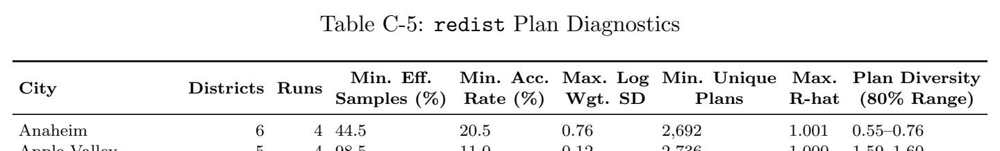

***Table C-5.*** redist Plan Diagnostics

[Download data as CSV](tables/tab-05.csv)

Min. Eff. Min. Acc. Max. Log Min. Unique Max. Plan Diversity City Districts Runs

Samples (%) Rate (%) Wgt. SD Plans R-hat (80% Range) Anaheim 6 4 44.5 20.5 0.76 2,692 1.001 0.55–0.76

Apple Valley 5 4 98.5 11.0 0.12 2,736 1.000 1.59–1.60 Atwater 4 4 36.7 13.7 0.72 2,735 1.002 0.40–0.70 Banning 5 4 95.5 8.2 0.21 2,696 1.001 1.53–1.57 Barstow 4 4 96.7 9.7 0.18 2,855 1.000 1.32–1.37 Big Bear Lake 5 4 93.3 10.2 0.25 2,704 1.002 1.49–1.56 Buena Park 5 4 52.8 24.4 0.61 2,807 1.004 0.55–0.84 Camarillo 5 4 46.7 27.8 0.60 2,815 1.002 0.65–0.91 Campbell 5 4 54.3 29.2 0.61 2,784 1.003 0.50–0.79 Carlsbad 4 4 49.7 18.6 0.59 2,873 1.002 0.50–0.86 Cathedral City 5 4 46.3 12.9 0.59 2,768 1.001 0.60–0.89 Ceres 4 4 58.4 11.2 0.52 2,913 1.002 0.44–0.72 Chino Hills 5 4 58.5 10.7 0.60 2,710 1.004 0.62–0.90 Chula Vista 4 4 34.6 21.4 0.60 2,821 1.001 0.60–0.87 Citrus Heights 5 4 41.5 20.3 0.60 2,834 1.001 0.61–0.87 Claremont 5 4 94.8 9.7 0.22 2,706 1.001 1.51–1.57 Compton 4 4 99.0 14.5 0.10 2,853 1.001 1.36–1.38 Concord 5 4 53.8 21.5 0.58 2,769 1.003 0.74–0.96 Corona 5 4 48.7 15.5 0.60 2,730 1.002 0.58–0.85 Dana Point 5 4 30.5 10.6 0.68 2,695 1.002 0.47–0.76 Dixon 4 4 44.2 10.2 0.55 2,896 1.002 0.60–0.87 Duarte 7 4 41.7 17.9 0.82 2,511 1.005 0.45–0.70 Eastvale 5 4 93.6 7.7 0.24 2,616 1.001 1.49–1.56 Elk Grove 4 4 28.7 13.3 0.58 2,850 1.005 0.56–0.85 Encinitas 4 4 98.4 11.4 0.12 2,852 1.001 1.35–1.37 Escondido 4 4 98.7 12.4 0.11 2,850 1.001 1.36–1.38 Exeter 5 4 53.4 19.6 0.62 2,711 1.008 0.51–0.84 Fairfield 6 4 42.7 12.8 0.70 2,717 1.004 0.53–0.81 Fontana 4 4 99.2 12.7 0.09 2,835 1.000 1.37–1.38 Fremont 6 4 97.4 14.6 0.16 2,591 1.003 1.76–1.77 Fullerton 5 4 33.6 20.2 0.63 2,797 1.007 0.64–0.90 Garden Grove 6 4 44.7 20.1 0.68 2,756 1.002 0.60–0.88 Glendora 5 4 52.1 11.5 0.57 2,769 1.003 0.71–0.94 Half Moon Bay 4 4 43.4 16.8 0.59 2,768 1.002 0.64–0.91 Hemet 5 4 51.9 9.9 0.61 2,763 1.004 0.62–0.88 Hesperia 5 4 48.6 13.6 0.57 2,791 1.001 0.72–0.95 Imperial Beach 4 4 56.1 17.3 0.49 2,857 1.002 0.69–0.95 Indio 5 4 49.0 13.9 0.64 2,766 1.006 0.67–0.93 Jurupa Valley 5 4 35.6 11.7 0.58 2,807 1.005 0.69–0.94 King City 5 4 54.2 5.3 0.58 2,317 1.004 0.69–0.96 4See https://github.com/alarm-redist/fifty-states/blob/main/R/template/03 sim.R for an example.

Table C-5: redist Plan Diagnostics (continued)

Min. Eff. Min. Acc. Max. Log Min. Unique Max. Plan Diversity City Districts Runs

Samples (%) Rate (%) Wgt. SD Plans R-hat (80% Range) Kingsburg 5 4 70.2 6.6 0.59 2,540 1.002 0.46–0.74

La Mirada 5 4 46.7 11.5 0.57 2,775 1.001 0.55–0.85 Lake Forest 5 4 96.0 12.2 0.20 2,677 1.000 1.53–1.58 Lemoore 5 4 40.2 12.2 0.69 2,685 1.003 0.45–0.87 Lincoln 5 4 31.8 17.8 0.75 2,733 1.003 0.50–0.82 Lodi 5 4 41.7 17.3 0.58 2,794 1.002 0.71–0.96 Lompoc 4 4 43.5 21.9 0.60 2,839 1.001 0.62–0.89 Los Banos 4 4 54.4 14.2 0.53 2,779 1.002 0.54–0.84 Madera 6 4 44.6 24.4 0.60 2,750 1.004 0.64–0.89 Marina 4 4 62.9 12.7 0.54 2,862 1.002 0.59–0.91 Menlo Park 5 4 91.2 14.3 0.28 2,648 1.000 1.49–1.55 Modesto 6 4 32.7 21.9 0.69 2,689 1.005 0.59–0.84 Monterey Park 5 4 95.7 14.3 0.20 2,746 1.000 1.53–1.58 Morgan Hill 4 4 8.5 10.5 0.77 2,625 1.005 0.57–0.92 Murrieta 5 4 43.6 20.3 0.60 2,799 1.002 0.69–0.94 Napa 4 4 57.0 24.5 0.53 2,848 1.005 0.55–0.85 Novato 5 4 94.8 11.2 0.22 2,571 1.001 1.51–1.57 Ojai 4 4 75.2 21.3 0.44 2,813 1.004 0.65–0.92 Orange 6 4 41.6 23.6 0.71 2,675 1.004 0.60–0.86 Oxnard 6 4 44.1 27.3 0.63 2,689 1.003 0.68–0.91 Pacifica 5 4 47.8 18.9 0.67 2,712 1.003 0.61–0.88 Palm Springs 5 4 44.2 17.9 0.68 2,784 1.003 0.62–0.94 Palmdale 4 4 62.1 9.9 0.54 2,904 1.003 0.46–0.73 Paso Robles 4 4 49.8 11.6 0.60 2,760 1.001 0.48–0.79 Patterson 4 4 58.0 11.0 0.52 2,893 1.001 0.59–0.87 Placentia 5 4 51.1 19.0 0.58 2,784 1.004 0.57–0.82 Porterville 5 4 47.7 25.7 0.61 2,775 1.003 0.68–0.93 Poway 4 4 94.9 11.2 0.22 2,799 1.001 1.29–1.35 Rancho Cucamonga 4 4 37.8 18.8 0.48 2,926 1.002 0.74–0.97 Redlands 5 4 56.5 9.4 0.55 2,798 1.002 0.70–0.96 Redwood City 7 4 51.2 37.9 0.64 2,541 1.004 0.70–0.89 Richmond 6 4 16.1 21.2 0.81 2,624 1.013 0.56–0.80 Rohnert Park 5 4 43.8 26.9 0.64 2,808 1.001 0.52–0.82 Roseville 5 4 38.3 16.8 0.65 2,812 1.003 0.56–0.86 San Rafael 4 4 96.4 9.3 0.18 2,849 1.001 1.32–1.36 Sanger 4 4 97.7 10.0 0.15 2,857 1.001 1.33–1.37 Santa Barbara 6 4 48.7 23.2 0.61 2,684 1.002 0.77–0.98 Santa Clara 6 4 28.3 21.9 0.60 2,787 1.003 0.60–0.87 Santa Maria 4 4 55.4 14.0 0.53 2,868 1.002 0.63–0.91 Santa Rosa 7 4 50.5 21.0 0.61 2,704 1.002 0.70–0.94 Santee 4 4 97.8 8.1 0.15 2,868 1.001 1.33–1.37 Selma 4 4 51.3 8.9 0.54 2,796 1.001 0.49–0.79 Simi Valley 4 4 98.2 13.2 0.13 2,843 1.001 1.36–1.38 Solana Beach 4 4 43.7 12.3 0.54 2,768 1.003 0.49–0.80 South Pasadena 5 4 59.5 10.8 0.52 2,626 1.004 0.64–0.91 South San Francisco 5 4 95.0 10.1 0.22 2,714 1.001 1.53–1.58 Stanton 4 4 93.5 10.1 0.24 2,827 1.001 1.28–1.35 Stockton 6 4 45.5 18.1 0.68 2,686 1.002 0.71–0.93 Sunnyvale 6 4 55.8 22.9 0.58 2,728 1.003 0.71–0.93 Tehachapi 5 4 17.9 0.2 1.24 619 1.030 0.27–0.54 Temecula 5 4 95.2 16.3 0.21 2,641 1.001 1.54–1.58 Torrance 6 4 98.0 14.6 0.14 2,628 1.001 1.75–1.77 Tulare 5 4 98.0 14.2 0.14 2,710 1.001 1.57–1.59 Turlock 4 4 58.0 15.4 0.50 2,907 1.001 0.62–0.89

Table C-5: redist Plan Diagnostics (continued)

Min. Eff. Min. Acc. Max. Log Min. Unique Max. Plan Diversity City Districts Runs

Samples (%) Rate (%) Wgt. SD Plans R-hat (80% Range) Twentynine Palms 5 4 87.2 27.9 0.33 2,675 1.001 1.48–1.54

Union City 4 4 98.4 11.6 0.12 2,851 1.000 1.35–1.38 Upland 4 4 54.4 14.8 0.58 2,845 1.002 0.62–0.90 Vallejo 6 4 38.9 15.0 0.65 2,672 1.003 0.69–0.95 Ventura 7 4 35.8 16.3 0.85 2,625 1.004 0.55–0.79 Visalia 5 4 38.3 21.9 0.51 2,817 1.004 0.74–0.96 Vista 4 4 54.4 17.9 0.53 2,839 1.002 0.51–0.80 Wasco 5 4 36.7 16.5 0.78 2,542 1.003 0.54–0.80 West Covina 5 4 97.5 15.5 0.16 2,695 1.001 1.56–1.59 Westminster 4 4 56.7 16.7 0.54 2,886 1.001 0.47–0.79 Whittier 4 4 47.5 27.1 0.56 2,916 1.002 0.52–0.82 Wildomar 5 4 47.1 17.7 0.61 2,565 1.002 0.56–0.90

Woodland 5 4 36.8 28.0 0.63 2,731 1.004 0.60–0.87

Yucaipa 5 4 49.5 9.2 0.55 2,792 1.006 0.72–0.99

Yucca Valley 5 4 97.2 10.5 0.17 2,756 1.001 1.56–1.59

Diagnostic information from our districting simulations using SMC are presented in Table C-5. For every retained plan, we then compute our two outcomes of interest. Because each simulated plan is simply an assignment of Census blocks to districts, we aggregate our block-level data up to the district level under that plan’s assignment. From these district-level quantities we calculate, first, the proportion of the plan’s districts whose Latino share of CVAP exceeds 50%, and second, the plan’s expected Latino council share, obtained by predicting each district’s probability of electing a Latino candidate and aggregating those probabilities across the council. We repeat this procedure for every plan in every city, under observed voting behavior as well as the counterfactual turnout, cohesion, and crossover scenarios described in the main text. Appendix Section D details the construction of both measures.

Optimizing plans for particular measures. Because the SMC sample of plans is not guaranteed to contain the most extreme plans a mapmaker could draw, we complement our simulated plans with short-burst optimization (Cannon et al. 2023), implemented by the redist shortburst() function in redist. The algorithm runs a merge-split Markov chain for a short “burst” of proposals to identify the best plan according to a user-supplied score function, and restarts the chain from that plan. We retain the package defaults of 10 proposals per burst and 500 bursts per run, initialize each chain at the city’s enacted plan, and impose the same compactness parameter and population tolerance used in our SMC runs. Because the merge-split proposal requires a contiguous starting plan, we first repair each city’s block adjacency graph using the geomander package, adding edges so that geographically disconnected pieces of the same enacted district (e.g., blocks separated by unincorporated land) are treated as connected.

We optimize each outcome separately in every city, supplying redist shortburst() with a custom score function for each. For the share of majority-Latino districts, the score is the fraction of a plan’s districts whose Latino share of CVAP is at least 50%:

1 scorer_majority_minority <- function(map, group_pop, total_pop, thresh = 0.5) {

2 group_pop <- rlang::eval_tidy(rlang::enquo(group_pop), map)

3 total_pop <- rlang::eval_tidy(rlang::enquo(total_pop), map)

4 ndists <- attr(map, "ndists")

5 fn <- function(m) colSums(redist:::group_pct(m, group_pop, total_pop, ndists) >= thresh) / (cid:44)→ ndists

6 class(fn) <- c("redist_scorer", "function")

7 fn

For expected Latino council share, the score aggregates each candidate plan’s block-level CVAP and proxy-election votes to the district level, applies the logical model of Equation 3 to obtain each district’s probability of electing a Latino candidate, and sums these probabilities before dividing by the number of seats:

1 scorer_atsusaka <- function(map, atsusaka_input, coethnic = NULL, crossover = NULL, gap = NULL) { 2 ndists <- attr(map, "ndists")

3 fn <- function(m) atsusaka_expected_share(m, atsusaka_input, coethnic, crossover, gap) / ndists 4 class(fn) <- c("redist_scorer", "function")

5 fn

where atsusaka expected share() computes, for each plan,

(cid:80)n

P with M and C conl=1 win,l

structed from the aggregated district data as described in Appendix D.

We run the optimizer twice per outcome—once maximizing and once minimizing the score— to bound the optimal range from both directions; when the maximized score is zero, we skip the minimization run, since the outcome is bounded below by zero. For expected Latino council share, we repeat this procedure under observed voting behavior and under each counterfactual combination of cohesion, crossover, and turnout described in the main text.

D Predicting Latino Council Share Using Atsusaka’s (2021) Logical Model

To translate a district’s demographic and behavioral characteristics into a predicted electoral outcome, we use the Atsusaka (2021) logical model of minority candidate emergence and success. A “logical model” in this sense is a parsimonious, deductively derived formula rather than a statistically estimated one: it takes a small number of theoretically motivated inputs and returns a predicted probability. Atsusaka (2021) validates the model’s predictive accuracy against two independent datasets—Louisiana mayoral elections (1986–2016) and state legislative general elections in 36 states (2012, 2014)—where it correctly predicts roughly 90% of minority candidate emergence and 95% of minority electoral success, outperforming OLS and logistic regressions fit directly to the data.

Model structure. The model rests on four scope conditions: elections are “biracial,” pitting a minority-preferred candidate against a white-preferred candidate; at least one viable minority candidate exists in the eligibility pool regardless of district composition; minority candidates are short-term instrumentally rational, entering races chiefly to win the next election rather than for symbolic or long-run reasons; and district-level candidate emergence is governed by the decision of the single most viable minority politician. Under these conditions, Atsusaka (2021) argues that a minority candidate runs if and only if she expects to win, so that the probability of candidate emergence, P , is modeled as the probability of victory, P .

run win

The model builds this win probability in three steps. First, it defines the racial margin of victory, M, as half the difference in vote share between the top minority- and white-preferred candidates in the most recent comparable election:

M = 50 + 1 (cid:0) V M − V W (cid:1) ∈ (0, 100), (2) 2 t−1 t−1

which summarizes how minority candidates have fared against white candidates, incorporating the

joint effects of turnout, cohesion, and crossover voting embedded in that prior election. Second, because the true future racial margin is unknown, the model bounds it between two logical extremes: M itself (assuming the next election looks exactly like the last), and C, the racial margin implied by the district’s minority composition under the limiting assumption of total in-group cohesion and zero crossover. Third, the model takes the geometric mean of M and C (each recentered by adding 50, since the geometric mean is undefined for negative numbers) as the best guess of the future racial margin absent other information, and converts this estimated margin into a win probability using the standard normal CDF, Φ, to account for uncertainty around that guess. Combining these steps yields the model’s central equation:

(cid:16) (cid:17)

P = Φ (MC)1/2 − 50 , (3) win

which gives the probability that the district elects a minority-preferred candidate as a function of only two inputs, M and C.

Determining M and C for CVRA cities. Because the cities in our sample are switching from at-large to district elections, there is no prior single-member district race from which to measure M. Instead, we proxy for M using four statewide top-two contests that pitted a Latino against a non-Latino candidate of the same party—Controller and Secretary of State (2014), U.S. Senate (2016), and Lieutenant Governor (2018)—so that differences in support reflect ethnic rather than partisan cleavages.5 For each simulated district, we aggregate block-level votes cast within its boundaries for the Latino and the leading non-Latino candidate in each of the four races, compute the implied racial margin (50 + 1(V L − V NL)) for each, and average across races to obtain M. This value varies by district (and by simulated plan), since it depends on which blocks a given map assigns to a district.

For C, we use each district’s turnout-adjusted Latino CVAP share. We compute city-specific Latino and non-Latino turnout rates from the L2 voter file, averaged over the 2014 and 2016 general elections to reflect the staggered timing of city council elections.

Computing expected Latino council share from district-level probabilities. Equation 3 returns a win probability for the preferred Latino candidate in a single district. We compute this probability separately for every district in every simulated plan. To translate these district-level probabilities into a plan-level outcome, we treat each district as an independent Bernoulli trial with success probability P and simulate the plan’s overall Latino council share via Monte Carlo: for win

each simulated plan, we draw whether each district elects a Latino councilmember according to its P , sum the number of districts with Latino winners, and divide by the total number of council win

seats. Repeating this 10,000 times per plan and averaging yields the plan’s expected Latino council share.

Analyses with counterfactual turnout, cohesion, and crossover values. The counterfactual analyses in the main text (closing the turnout gap; varying cohesion and crossover) enter this same framework by altering C and M, respectively. Closing the turnout gap sets C equal to the raw Latino CVAP share. We compute M under counterfactual cohesion and crossover values according 5The pairings, all Democrats, are: John P´erez vs. Betty Yee (Controller, 2014); Alex Padilla vs. Leland Yee (Secretary of State, 2014); Loretta Sanchez vs. Kamala Harris (U.S. Senate, 2016); Ed Hernandez vs. Eleni Kounalakis (Lieutenant Governor, 2018).

to the equation:

M = 50 + 1(cid:0) V L − V NL(cid:1) , (4) where V L = (cid:0) ρ · cohesion + (1 − ρ) · crossover (cid:1) · 100 and V NL = 100 − V L, and ρ represents Latino CVAP share.

Share of majority-Latino districts as an alternative measure. We aggregate the blocklevel citizen voting-age population estimates attached to our enhanced shapefiles up to the district level, summing each block’s Latino and total citizen voting age population (CVAP) according to the plan’s assignment of blocks to districts. A district’s Latino CVAP share is its Latino CVAP divided by its total CVAP, and we classify a district as majority-Latino when this share exceeds 50%. The plan-level outcome reported in the main text is the proportion of a plan’s districts that are majority-Latino. In comparison to the expected Latino council share measure listed above, this outcome measure requires no behavioral assumptions. We thus use the share of districts that are majority-Latino as an alternative measure to benchmark what districting can achieve based on a city’s residential geography alone.

E Modeling Alternative Institutions

In simulating elections under each system, we assume a two-bloc, two-slate setup. That is, we assume a city is made up of Latino and non-Latino voters and there are Latino and non-Latino candidates. For each city, we run 500 simulations (n sims) in which 1,000 ballots (n voters) are generated in each simulation.6 For all three systems, we provide a series of parameters that are tailored to the electoral context of the city whose elections are being simulated: number of elected candidates, number of Latino and non-Latino candidates, proportion Latino CVAP, turnoutadjusted proportion Latino CVAP, then Latino and non-Latino cohesion and crossover. Because elections are staggered, we specify the number of seats based on a fraction of the total number of seats on the city council. If there is a five-member council, we conduct an election where two candidates are elected and another where three are elected.

The next two parameters, num latino cands and num nonlatino cands, are determined using CEDA election records from the three at-large elections prior to the switch to district elections. We use Bayesian Improved Surname and Geocoding (BISG) implemented in the wru R package (Khanna et al. 2024) to probabilistically assign each candidate a race/ethnicity, then sum the predicted probabilities across candidates in each election year to estimate the number of Latino and non-Latino candidates per election. We then take the average of these counts grouped by the number of candidates elected in each contest (i.e., 2, 3, or 4) to determine the values for these parameters for each contest type (i.e., by each value of num elected), which are replicated as needed to cover all council seats. For the purposes of simulations, we assume that each group in each city will have at least 1 candidate. To be consistent with our district simulations, we use the turnout-adjusted Latino CVAP share to assign values of the prop latino parameter.

Estimates of racial cohesion and crossover are assumed across the same counterfactual values implemented for our district simulations: 60%, 80%, and 100% of Latinos supporting the Latino candidate—and three values of crossover—20%, 30%, and 40% of the city’s non-Latinos supporting the Latino candidate. The cohesion and crossover parameters dictate the degree to which voters in these simulations tend to support each slate of candidates. Voters’ preferences may vary over candidates within a slate. For example, Latino voters may coalesce around a single Latino candidate or be divided in their support across multiple Latino candidates. To capture this variation, Benade 6This is consistent with the simulations run by Benade et al. (2021).

et al. (2021) add candidate-strength parameters. They denote these parameters as α , which AB

indicates the division of support from group A for candidates of group B. In our two-bloc, twoslate setup, this means that we have four parameter values to set: α , α , α , α , where L LL LN NL NN

indicates Latino candidates and N indicates non-Latino candidates. Setting these parameters with the same values set by Benade et al. (2021) creates four scenarios for which to run simulations:

• Scenario A (α = 0.5, α = 0.5, α = 0.5, α = 0.5). All voters agree on the rank LL LN NL NN

order within the slates of Latino (L) candidates and non-Latino (N) candidates.

• Scenario B (α = 2, α = 0.5, α = 0.5, α = 0.5). All voters agree on the rank LL LN NL NN

order of N, and all non-Latino voters agree on the ordering of L, but Latino voters randomly vary their preference order of L.

• Scenario C (α = 2, α = 2, α = 2, α = 2). All voters randomly order both slates LL LN NL NN

on their ballots.

• Scenario D (α = 0.5, α = 0.5, α = 2, α = 2). All the Latino voters agree on the LL LN NL NN

rank order for both slates, but non-Latino voters randomly vary the order for both slates. Under cumulative voting, voters in each city can allocate as many points as there are seats up for election. In most of our cities, where 2 or 3 seats are on the ballot in an election year, that means voters can allocate 2 or 3 points, respectively. To simulate an election under cumulative voting, the parameters defined above are used to generate a preference profile—a collection of ballot types, where each ballot type records how a voter allocates their points across candidates and a weight equal to the number of voters who cast that allocation. This preference profile, along with num elected, is then passed to a function that determines the winners of the election in each simulation. For each simulation, we take the total number of Latino candidates elected across the city’s elections and divide by the total number of seats on the city council to get the simulated Latino council share.

Under limited voting, voters are able to select fewer candidates than the number of seats up for election. In our simulations, we assume that voters have one fewer vote than the number of seats up for election, and they can only give one vote per candidate — mirroring how limited voting systems have been implemented in U.S. local elections in practice. For example, in an election where 3 seats are up for election, voters can select 2 candidates. Thus, the process for simulating elections under limited voting differs from cumulative voting in how ballots are generated: each voter casts one vote for each of their top k distinct candidates, taken from the same Plackett–Luce rankings used in our single transferable vote simulations which are described in the next paragraph.

Again, given the context of our study, we implement single transferable vote (STV) in our simulations. We implement the votekit defaults that (1) the Droop quota of ⌊ N ⌋ + 1 is the m+1

threshold for election, where N is the number of voters and m is the number of seats up for election, and (2) a fractional, rather than random, transfer of votes is used (all ballots that can be transferred are assigned a new weight according to the share of votes for the elected candidate that were in excess of the threshold). Benade et al. (2021) offer four models of voter ranking behavior. We implement the Plackett–Luce (PL) model in our simulations, where a ballot is probabilistically filled one position at a time by drawing from the slates according to the preference profile weight. PL is thought to simulate “impulsive” voter behavior, where voters fill out a ballot in one shot without looking back over the whole ranking.

Figure E-1 shows that results are substantively similar across all four candidate-strength parameters and the three cohesion/crossover combinations that constitute our main analysis. The

bottom panel, shown for reference, validates that the systems do not produce outcomes above proportionality when there is fully racially polarized voting (zero crossover).

Scenario A: Scenario B: Scenario C: Scenario D:

(All Agree on (POC Voters Random (All Voters (Majority Voters

Within−Slate Order) on POC Slate) Random on Both) Random on Both)

+23% +23% +24% +27% +27% +24% +26% +26% +23% +19% +20% +20%

+19% +19% +18% +19% +19% +18% +24% +24% +20% +19% +22% +19%

+17% +16% +16% +16% +16% +16% +18% +19% +17% +18% +19% +16%

+2% +1%

−8% −15% −10% −15% −8% −14% −15% −6% −13% −15%

Non−Latino Crossover: 0.30 Non−Latino Crossover: 0.30 Non−Latino Crossover: 0.30 Non−Latino Crossover: 0.00 Latino Cohesion: 1.00 Latino Cohesion: 0.80 Latino Cohesion: 0.60 Latino Cohesion: 1.00 +60%

+30%

−30%

+60% +30% −30% +60% +30% −30% +60%

+30%

−30%

Cumulative Limited Single Cumulative Limited Single Cumulative Limited Single Cumulative Limited Single Transferable Transferable Transferable Transferable Vote Vote Vote Vote erahS

PAVC

onitaL

erahS

licnuoC

onitaL

detcepxE

naideM

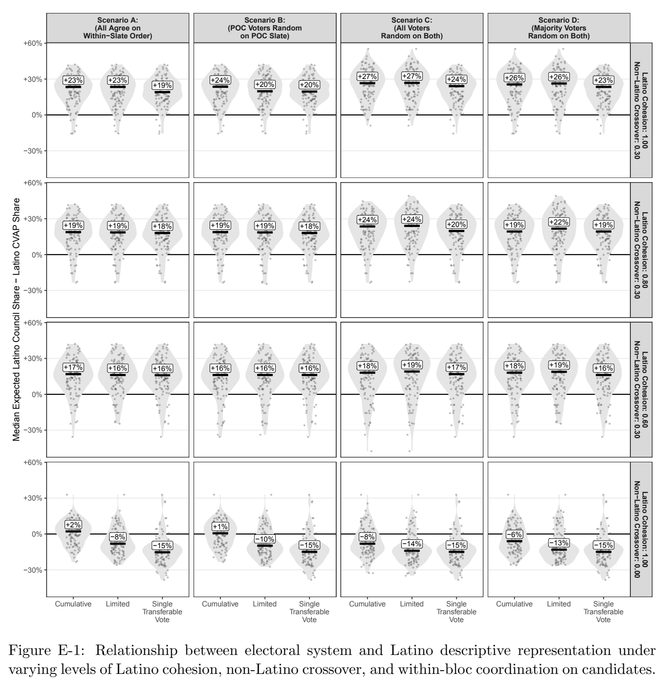

***Figure E-1.*** Relationship between electoral system and Latino descriptive representation under varying levels of Latino cohesion, non-Latino crossover, and within-bloc coordination on candidates.

## References

Atsusaka, Yuki. 2021. “A Logical Model for Predicting Minority Representation: Application to Redistricting and Voting Rights Cases.” American Political Science Review 115(4):1210–1225. Benade, Gerdus, Ruth Buck, Moon Duchin, Dara Gold and Thomas Weighill. 2021. “Ranked choice voting and proportional representation.” Available at SSRN 3778021 .

Cannon, Sarah, Ari Goldbloom-Helzner, Varun Gupta, JN Matthews and Bhushan Suwal. 2023. “Voting Rights, Markov Chains, and Optimization by Short Bursts.” Methodology and Computing in Applied Probability 25(1):36.

Kenny, Christopher T., Cory McCartan, Ben Fifield and Kosuke Imai. 2021. “redist: Simulation Methods for Legislative Redistricting.” Available at The Comprehensive R Archive Network (CRAN).

URL: https://CRAN.R-project.org/package=redist

Khanna, Kabir, Kosuke Imai, Santiago Olivella and Evan T. Rosenman. 2024. “wru: Who Are You? Bayesian Prediction of Racial Category Using Surname and Geolocation.” Available at The Comprehensive R Archive Network (CRAN) and GitHub.

URL: https://cran.r-project.org/web/packages/wru/index.html

McCartan, Cory, Christopher Kenny, Tyler Simko, Shiro Kuriwaki, George Garcia III, Kevin Wang, Melissa Wu and Kosuke Imai. 2022. “Simulated Redistricting Plans for the Analysis and Evaluation of Redistricting in the United States.” Nature Scientific Data 9:689.

McCartan, Cory and Kosuke Imai. 2023. “Sequential Monte Carlo for Sampling Balanced and Compact Redistricting Plans.” Annals of Applied Statistics 17(4):3300–3323.

URL: https://doi.org/10.1214/23-AOAS1763