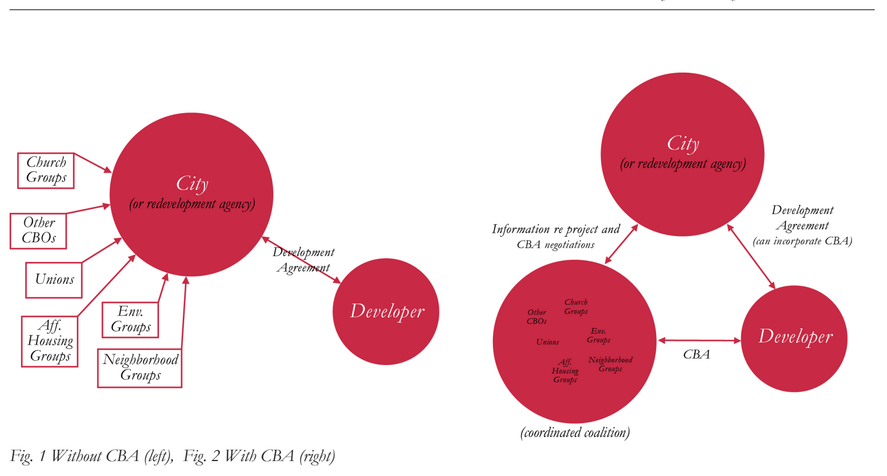

# Externalities or Extortion? Privatizing Social Policy through Community Benefits Agreements

6 - 7

## Michael Hankinson

Author Biography:

Michael Hankinson is a third-year Ph.D. candidate in Government and Social Policy (Graduate School of Arts and Sciences/Harvard Kennedy School) at Harvard University. His research focuses on the politics of urban redevelopment, ranging from gentrification to public-private partnerships. More broadly, his interests extend to the effect of politics on the built environment. Prior to Harvard, Michael attended the University of Virginia as an Echols Scholar, graduating with a B.A. in Government and Environment Thought & Practice.

### Ethical Risks

A building is merely the physical byproduct of a lengthy development process. From design to approval to

construction, the development process provides countless junctures of ethical risk, particularly in mitigating a

project’s negative externalities. These externalities, ranging from congestion to gentrification, have been a constant

source of friction between developers and neighboring residents. Indeed, the management of such externalities has required government intervention in the form of zoning and permit approval. Like any political process, permit

approval consists of negotiating, bargaining, and promise making, actions inherently based on an ethics of trust and transparency. Recently, bargaining innovations have sought to lessen the role of government as a mediator between developers and community groups, potentially increasing the risk of violations of trust and transparency. In this article, I analyze these bargaining innovations to understand how investors, community advocates, and concerned citizens can better navigate the ethical risks of the development process.

Nearly every major urban development project requires the interaction of three players: a developer spearheading the project, a community of neighboring residents, and a cadre of elected officials responsible for project approval. In

the traditional model, the developer and elected officials negotiate the project proposal and development agreement. While local residents are free to voice concerns, their participation is targeted toward their elected officials via public hearings and appeals. In other words, the community’s ability to engage with the developer must be channeled through government conduits.

Recently, this traditional model of community voice via politicians has been subverted by a new pathway of

development bargaining. Labeled “Community Benefits Agreements”, CBAs are private contracts negotiated between a project’s developer and the surrounding community groups. To counter a new project’s potential externalities, the

developer will promise either financial, physical, or behavioral goods, ranging for the provision of affordable housing units to the guarantee of a living wage for employees. In exchange, community groups will pledge to publically support Navigating Investments with Ethical Risk

***Figure 1.*** Without CBA (left), Fig. 2 With CBA (right)

the development, typically through favorable testimony at public hearings. As a result, a well-negotiated CBA can provide a community with valuable resources while helping developers build political momentum behind their projects.

Indeed, the presence of a CBA stems from a

community’s leverage of power, both political and

legal. Politically, organized community protest against a proposed development can weigh heavily on elected officials, specifically when large public subsidies are

being extended to the developer. Thus, developers

seeking financial support from the city have an incentive to minimize political opposition through community

negotiations. Legally, a community’s power comes from the ability to delay projects via legal action. Thanks to mandated environmental impact statements and reviews, large scale developments are vulnerable to questions of their effects on air quality, energy use, and public health. Because development delays have high financial costs, even unsuccessful lawsuits can squander a project’s

financial viability. Consequently, a community’s threat

of legal action can provide the necessary leverage for a developer to negotiate a CBA.

### Describing the Problem

Still nascent, CBAs lack a formal legal definition. There are no specifications on the number of groups necessary to comprise a valid community voice. Nor are there

predetermined benefits levels deemed just compensation for a community’s political support. In short, a CBA

may be signed with various levels of inclusivity and

accountability. For instance, an agreement negotiated

solely by elected officials may claim to represent the

will of the entire community. Julian Gross, who has

represented community coalitions in over a dozen CBAs, frames how such an agreement may be misleading:

“[L]ocal government officials and developers sometimes use the term CBA to describe any set of community

benefits commitments on which they agree. A charitable view is that this is a convenient term for commitments of interest to the community; a less charitable view is

that project proponents hope to fill the political space a community-driven CBA campaign would occupy, thus easing project approval and marginalizing opposition” (Gross 2008).

From his experience drafting community benefits

Hankinson

agreements across the United States, Gross outlines

his requirements for an ethically legitimate CBA. First, a CBA applies to a single development project. The

agreement must be legally enforceable, not aspirational or voluntary. Finally, the agreement must address a range of community issues and be the product of substantial community involvement (Gross 2008). Together, these measures of inclusivity and accountability form Gross’s standards for ethically legitimate CBAs.

Yet, despite these standards of success, the nebulous

definition of a CBA has led to a wide spectrum of

outcomes. Since 2001, 30 agreements have been

negotiated. In this period, two cities stand out as hosting a combined 40 percent of all agreements: Los Angeles (eight) and New York City (four). Yet, though these

cities share a disposition towards benefits agreements, the character of their CBAs is completely contrary.

While Los Angeles has thrived both as the birthplace and paragon of inclusive and accountable CBAs, New York’s agreements have been riddled with controversy (The Public Law Center 2011, Salkin 2007, Gross 2008, Ahern et al. 2010, Been et al. 2010). Not only have the New York agreements been challenged for failing to represent the will of the affected community, but the enforcement and delivery of their promised benefits has been plagued by protest and delay (Robbins 2012). As noted by New York Comptroller John Liu: “[S]

tudies have singled out New York City’s community

benefits agreements as examples of what not to do. It is time for this embarrassment to end” (New York City Comptroller 2010).

A premier example of New York’s woes is the Atlantic Yards project in Brooklyn. In June 2005, a CBA of

eight community groups was used to win approval of $200 million in public subsides for a $2.5 billion mixeduse development (Oder 2011, Develop Don’t Destroy Brooklyn 2012). However, not only had three of the

eight signees received over $5 million in financing from the developer prior to beginning CBA negotiations, but two signees had also been formed as pro-development groups in response to the project proposal (Robbins

2012, Develop Don’t Destroy Brooklyn 2012). Indeed, the coalition was not representative of the community, but rather handpicked by the developer, raising a

conflict of interest in negotiations. Furthermore, while only eight organizations signed the CBA, a coalition

of more than 50 community organizations has formed Navigating Investme 8 - 9

in vehement opposition to the development (Been

et al. 2010). Regarding accountability, the CBA lacks

specific reporting requirements outside of its workforce provisions (Ahern et al. 2010). Likewise, an independent compliance monitor was to assess the developer’s

performance in meeting its promised benefits. As of

September 2012, over seven years after signing the CBA, a monitor had not been hired (Robbins 2012).

### Testing Gross

To assess the ethical risks of CBA negotiation, I

conducted the first analysis of the entire population of

### 30 CBAs. Testing Gross’s theory of ethical legitimacy, I

sought to identify variables contributing to inclusive and accountable benefits agreements. To begin, I first coded CBA success based on standards of both inclusivity and accountability (Gross 2008). Using control variables of institutional structure, I then tested the hypotheses that these standards are more likely to be met when there

exists 1) a pre-established economic justice organization leading the community coalition, 2) the participation of labor unions in the community coalition, and 3) the joint efforts of construction unions and service unions

in support of the CBA. I surmised that in the absence of these conditions elected officials and developers

are likely to bypass open community representation.

Consequently, CBAs formed without these conditions would be of low inclusivity and low accountability, such as that of Atlantic Yards.

The results were illuminating. While the presence and cooperation of labor unions stood as strong predictors of CBA success, the dominant predictive variable was the leadership of an economic justice organization.

Indeed, 19 out of the 20 successful CBAs included

community coalitions led by such organizations. More so, I traced their structure to affiliation under the

Partnership for Working Families (PWF), a national network of 16 regional economic and environmental justice organizations (The Partnership for Working

Families 2012, Working Partnerships USA 2008). While there were two successful cases not utilizing PWF

support, the inclusivity and accountability of every

PWF-supported CBA suggests the benefits of the

national network in sharing strategies for the negotiation of successful benefits agreements.

Nevertheless, the analysis should be taken with caution. with Ethical Risk

While I did my best to code inclusivity, there will always be groups that will protest exclusion. Though a large coalition may seem to display community consensus, there is no way to guarantee the representativeness of self-selecting organizations. Even if full representation were possible, inclusivity does not solve the ethics

of non-governmental development agreements. For

instance, the developer-promised community benefits represent a privatization of previously government-

provided social policy. Applied ad hoc, CBAs may lead to costly neighborhood-by-neighborhood solutions

to problems requiring coordinated efforts at the city level (Been et al. 2010). Taken to the extreme, benefits agreements resemble a form of “greenmailing”, wherein citizens groups threaten developers with environmental lawsuits only to drop the lawsuit when provided with unrestricted payments (Brasuell 2013, Fulton 2013).

In other words, lacking a government mediator, CBAs unleash a new array of ethical dilemmas.

### Solving the Problem

This examination of CBAs has raised two questions. First, until today, what variables have contributed to ethical benefits agreements? Second, going forward, what are the ethical risks of these agreements as a new form of social policy? As CBAs continue to evolve, each player in the development process needs to approach their role with an awareness of these inherent risks.

First, the investor valuing fair, good-faith community relations must understand that all CBAs are not

created equal. While some CBAs do mobilize extensive community coalitions, others can be forged with

handpicked, unrepresentative organizations harboring financial conflicts of interest. In due diligence, the

ethical investor needs to look beyond the developer’s press release and examine the politics of the actual

agreement. The equation of any benefit agreement with the community will is a far too naïve assumption.

Second, elected officials and community advocates

seeking a fair bargain for their neighborhoods must

recognize the pitfalls of non-inclusive, unaccountable benefits agreements. The findings from the population analysis suggest that leadership from an economic

justice organization, specifically one affiliated with the Partnership for Working Families, has been a sufficient condition for success. To minimize the ethical risks of the bargaining process, community advocates should

seek the resources and experience of these organizations in forging their own benefits agreements.

Third, concerned citizens must understand the

impact of these non-governmental bargains on

urban development. As noted above, the benefits of community voice may be outweighed by the agreements’ collective costs. While originally a supporter of CBAs, New York City Mayor Michael Bloomberg protested against the agreements, equating community demands for benefits as a form of “ransom” (Braziller 2006). Similarly, the Association of the New York City Bar issued a task force report recommending that the City give no “credit” in the land use approval process to

developers for benefits provided through CBAs (Been et al. 2010). In short, these side bargains are likely to increase the costs of urban development, potentially stifling projects of public good operating on slim

margins. Citizens must be aware that with their demands for benefits comes a NIMBY-esque tax on development citywide.

Consequently, perhaps the best solution to unethical bargaining in CBAs is not found in enhancing the

inclusivity and accountability of the agreements

themselves, but in identifying their impetus. Multiple reports attribute the advent of CBAs to citizen

discontent with the formal development approval

process (Ahern et al. 2010, Been et al. 2010). Thus, to regain its role as the negotiation mediator, city

governments must seek methods of empowering

community voice in the permit approval process. So long as citizens feel left out of the conversation, they will continue to seek side-bargains with developers, exposing investors, advocates, and fellow citizens to further ethical risk in a development process already fraught with moral dilemma.

### References

Ahern, John, Priscilla Almodovar, Barry Gosin, and

Joyce Moy. 2010. Recommendations on the Task

Force on Public Benefit Agreements. New York: New York City Comptroller.

Been, Vicki, Mark A. Levine, Ross Moskowitz,

Wesley O’Brien, and Ethel Sheffer. 2010. The Role of Community Benefit Agreements in New York City’s Land Use Process. New York: New York City Bar.

Hankinson 10 - 11

## Brasuell, James. 2013. “Leaked Settlement Shows Faculty Review

how NIMBYs ‘Greenmail’ Developers.” Curbed

LA. http://www.la.curbed.com.

Coalition for Clean & Safe Ports. 2012. Jobs Can’t

Be Good or Green If They’re Not Union. Long

## Beach: Coalition for Clean & Safe Ports. Quinton Mayne

Develop Don’t Destroy Brooklyn. Time Line.

http://www.developdontdestroy.org.

Fulton, William. 2013. “60% of EIR Challenges

Involve Infill Projects.” California Planning &

Development Report. Quinton Mayne is Assistant Professor of

Gross, Julian. 2008. CBAs: Definitions, Values, Public Policy at the Harvard Kennedy School and Legal Enforceability. Journal of Affordable

of Government where he teaches courses in Housing and Community Development 17.1-

2:36-58. policy design and urban politics. He is af- Gross, Julian, Greg LeRoy, and Madeline Janis- filiated with the Ash Center for Democratic Aparicio. 2005. Community Benefits

Governance and Innovation.

Agreements: Making Development Projects

Accountable. Washington, DC: Good Jobs First.

New York City Comptroller. 2010. Comptroller

Liu Convenes Task Force on Public Benefits Community Benefits Agreements are problematic Agreements. New York: New York City

for Hankinson in large part because they constitute Comptroller.

a form of privatized governance that runs the risk Oder, Norman. 2011. “At tense Council hearing,

James, Lander cite AY delays, construction of failing three important ethical tests: an inclusion changes, press NYC EDC’s Pinsky on need test, an accountability test, and a common goods test. for updated cost-benefit analysis.” Atlantic Yards These ethical risks are not however insurmountable. Report. http://atlanticyardsreport.blogspot.com.

Hankinson’s own research suggests they are mitigated The Partnership for Working Families. The

when organized advocates of economic justice play a Partnership For Working Families. http://www.

communitybenefits.org/. leading role in the crafting of CBAs. Citing work by The Public Law Center. 2011. Summary and Index Gross, Hankinson also identifies the imposition and of Community Benefits Agreements. New

effective policing of preemptive formal requirements Orleans, LA: The Public Law Center.

as a potential way to guard against participatory

Robbins, Liz. 2012. “In Brooklyn, Bracing for

Hurricane Barclays.” New York Times. exclusion, developers’ breaking their promises, and Salkin, Patricia E. 2007. “Community Benefits neighborhood NIMBYism.

Agreements: Opportunities and Traps for

Developers, Municipalities, and Community

Given their ethical risks, Hankinson seems to suggest Organizations.” Planning & Environmental

that city governments should avoid CBAs, concluding Law 59.11:3-8.

Working Partnerships USA. History. http://www. that elected politicians should “seek methods of

wpusa.org. empowering community voice” that allow them to

regain their role as “negotiation mediators.” This idea that, compared to CBAs, city governments serving as “negotiation mediators” will make development processes more inclusive, accountable, and oriented toward the common good seems questionable, at

least in the United States. Take the example of

New York City referred to by Hankinson. Electoral participation in city-level elections is extremely low: barely 28 percent of registered voters cast their vote in the mayoral election of 2009. Even if turnout

were higher, it would still be difficult for the voices of coordination problems. Though elected “negotiation political minorities and those with few organizational mediators” that sit in city hall are certainly better

resources to be heard and have influence in important placed than those involved in CBAs to see the

planning decisions given the combination of the “big picture” for the city as a whole and achieve

centralization of political powers in the office of the coordination to that end across the city, we must ask mayor, the city’s first-past-the-post electoral system, ourselves whether the big picture they see is in fact and the very low level of party competition. The a just one, grounded in the common good. Given reality is that these and similar structural impediments the typical weakness of city politicians’ electoral

to inclusion, accountability, and orientation toward mandate on the one hand and extant mechanisms of the common good are found across the United accountability on the other, we might well think it is States. Indeed, as Hankinson recognizes, it is this not.

very dysfunctionality of traditional systems of local

development with elected governments at their heart

that has driven communities to embrace CBAs in the

first place.

So, what is to be done? Perhaps the most obvious

but also the most difficult solution is to reform

## Jay Wickersham

the electoral and decision-making structures and

institutions of city governments: making council

chambers more inclusive of public opinion in all

its diversity and replacing a winner-takes-all logic

with one of multiparty dialogue and negotiation Jay Wickersham is Adjunct Associate

that respects political minorities. A second and Professor of Architecture at the Harvard much more common solution is to establish Graduate School of Design where he teaches participatory or deliberative democratic institutions courses in the law, ethics, and history of that allow communities to influence city hall’s architectural practice. He is a partner in development decisions. In practice however this

the Cambridge, Massachusetts law firm approach encounters many of the same inclusion

Noble & Wickersham LLP. He served as

and accountability problems as CBAs; moreover,

Assistant Secretary of Environmental Affairs introducing local-level participatory opportunities

for Massachusetts and directed the state’s fails to address the arguably larger problem of the

environmental impact review program from likely very weak claims to inclusion and accountability

1998 to 2002.

of elected “negotiation mediators” in such a

system. CBAs represent a third solution. If CBAs

sideline city hall, in a sense they solve the ethical

problems posed by the low levels of inclusiveness In recent decades, regulation of major development and accountability of elected politicians. Moreover, projects has shifted away from prescribing “as-ofenshrining legally-enforceable obligations to inclusion right” land uses and densities under local zoning

and accountability, even equality, in CBAs, as per codes. Instead, most cities now favor discretionary Gross’s recommendations, seems much more feasible project-specific approvals, often with significant

than achieving the equivalent for elections to and public participation. The use of the Community

decision making within city hall. It seems then that Benefits Agreement (CBA), executed by the project it is the common goods test that CBAs have the most developer and a coalition of community groups

difficulty passing due to the fact that they fragment outside of the governmental approvals process, marks the planning process and in so doing exacerbate a further step in this evolution.

Hankinson 12 - 13 Hankinson’s article makes a valuable contribution for major development projects, initiated in 2000

by evaluating the success of the first generation of to address shortcomings in the approvals process,

30 CBAs, starting in 2001, according to the criteria provides an alternative to a CBA. The IAG process

of “accountability” and “inclusivity” articulated by avoids privatization by remaining within the

Julian Gross, a leading advocate for their use. By these framework of formal governmental reviews. 3 An IAG measures, the analysis finds 20 CBAs to be successful. has up to 15 members, drawn from neighborhood

The strongest correlation for success was the presence residents, local businesses, and community

of a community coalition led by an economic justice organizations. Two members are nominated by elected organization – preferably, one structured according to officials representing the affected community; the rest the standards of the Partnership of Working Families are appointed by the mayor, on the recommendations (PWF). (Because Julian Gross served as legal director of community members and at-large city councilors. for PWF between 2006 and 2010, 1 there may be some IAGs participate actively in public hearings and

circularity in basing the analysis upon his criteria.) comment processes; they also meet directly with

project developers. An IAG does not enter into

Hankinson also identifies, but does not analyze in a separate agreement with the developer; instead,

depth, broader ethical and political critiques of it has the opportunity to review and comment on CBAs. At the project level, there are concerns about the binding Cooperation Agreement between the transparency and fairness. CBA negotiations may developer and the city before it is executed.

unfairly advantage parties with greater resources and

leverage, on either side.

The U.S. Supreme Court addressed the fairness of

discretionary project approvals under the “takings”

clause of the Fifth Amendment to the Constitution, in the 1987 Nollan case and the 1994 Dolan case. 2

The Court held that there must be a “nexus” between a project’s impacts and the benefits it provides;

developers should not be forced to fix problems that they didn’t cause. Further, there must be a “rough

proportionality” between the relative levels of impacts and benefits. If these tests apply to government

approvals, they should also apply to CBAs arising out of a regulatory process.

As Hankinson notes, critics have characterized

CBAs as “privatizing” the governmental process.

Whom do self-appointed community advocates really represent? What assurance do we have that a CBA

process, no matter how inclusive, is an improvement

on the elections and deliberations of a representative

democracy?

Boston’s use of an Impact Advisory Group (IAG)

(1) See www.juliangross.net/docs/CV/201301/Julian_Gross_CV.pdf

(2) Nollan v. California Coastal Comm’n, 483 U.S. 525; Dolan v. City of Tigard, 512 U.S. 374.

(3) An Order Relative to the Provision of Mitigation by Development Projects in Boston (Oct. 2000); An Order Further Regulating the Provision of Mitigation by Development Projects in Boston (April 2001). See www.bostonredevelopmentauthority.org/econ dev/Impact%20Advisory%20Groups.htm

Navigating Investments with Ethical Risk