# How Self-Interest and Symbolic Politics Shape the Effectiveness of Compensation for Nearby Housing Development

### Michael Hankinson Justin de Benedictis-Kessner

### July 17, 2024

Abstract

Policy with concentrated costs often faces intense localized opposition. Both private and governmental actors frequently use financial compensation to attempt to overcome this opposition. We measure how effective such compensation is for winning policy support in the arena of housing development. We build a novel survey platform that shows respondents images of their self-reported neighborhood with hypothetical renderings of new housing superimposed on existing structures. Using a sample of nearly 600 Bostonians, we find that compensating residents increases their support for nearby market-rate housing construction. However, compensation does not influence support for affordable housing. We theorize that the inclusion of affordable housing activates symbolic attitudes, decreasing the importance of financial self-interest and thus the effectiveness of compensation. Our findings suggest greater interaction between selfinterest and symbolic politics within policy design than previously asserted. Together,

this research signals opportunities for coalition building by policy entrepreneurs when

facing opposition due to concentrated costs.

Word count: 7,993 words

Keywords: self-interest, compensation, survey experiment, local government, housing

For comments, suggestions, and advice, we thank in alphabetical order: Riley Carney, Ryan Enos, John Helveston, Eunji Kim, Asya Magazinnik, Melissa Sands, Ken Scheve, Andrew Thompson, and Yamil Velez. We are grateful for feedback from the CSDP Conference on Housing Politics and Policy at Princeton University. We appreciate the research assistance of Emmalee Jordan and Peyton Wilson, image rendering by Rafael Marengoni, and GIS software development of Alex Jacobson. Funding for this study came from the Boston Area Research Initiative and the Harvard Graduate School of Design Real Estate Academic Initiative. A pre-analysis plan for this study was registered at EGAP prior to data collection (https://osf.io/a3nmw). The study has been approved by the GWU IRB (# NCR203047) and the Harvard IRB (# IRB21-0892). redacted.

∗Assistant Professor, Department of Political Science, George Washington University. 2115 G Street, N.W., Washington, D.C. 20052. hankinson@gwu.edu

†Assistant Professor, John F. Kennedy School of Government, Harvard University. 79 John F. Kennedy St., Cambridge, MA 02138. jdbk@hks.harvard.edu

Many public policies are accompanied by concentrated costs. Often these costs are spatially concentrated, such as the increased traffic and noise surrounding a transit hub. For other policies, the concentrated costs are not inherently spatial, but still prone to geographic clustering — e.g., harms to domestic industry via trade liberalization. Spatial or not, concentrated costs may turn voters who support a policy in the abstract against the policy in its implementation. Not only are the groups who experience concentrated costs more likely to mobilize in opposition to the policy (Wilson, 1980), but the American political system empowers veto actors with considerable negative power. In short, concentrated costs can quickly derail the passage and implementation of even popular policies.

Concentrated costs have negative impacts on voters’ self-interest (de Benedictis-Kessner and Hankinson, 2019; Marble and Nall, 2021). Consequently, it may be possible to offset these costs through concentrated benefits that have a positive impact on their self-interest, such as material compensation. Compensation is commonly used to increase political support for policies ranging from market deregulation via industry-wide subsidies (Margalit, 2011) to large-scale waste facilities via direct payments to neighbors (Kunreuther and Easterling, 1996). Though some experimental studies have tested the effect of increasing levels of compensation by varying the amount of money offered (e.g., Frey, Oberholzer-Gee, and Eichenberger, 1996; Walker, Wiersma, and Bailey, 2014), we know less about whether the form of compensation or the traits of the concentrated policy costs influence the effectiveness of that compensation. Furthermore, experimental tests of compensation often rely on abstract policies that are unlikely to be familiar to respondents, such as income tax breaks for higher carbon taxes (e.g., Jagers, Martinsson, and Matti, 2019).

In this paper, we experimentally assess the effectiveness of compensation on local support for a concentrated policy cost with which most voters are very familiar: new multifamily housing development. New housing brings concentrated costs in the form of noise, traffic congestion, and stereotypes about new arrivals. The frequency with which new housing is proposed and developed — relative to larger-scale infrastructure — means that existing res-

idents are likely to have concrete opinions rather than abstract ones on this issue. Residents often fear development’s costs and express their vocal opposition to it (Einstein, Glick, and Palmer, 2019), making the politics of multifamily housing production especially contentious (de Benedictis-Kessner, Jones, and Warshaw, 2024). And real estate developers already frequently try to win the approval of current residents through compensation. All of these factors make housing development an appropriate case to examine the political effects of compensation.

We first describe the common use of local negotiation and compensation in the housing permitting process in American cities. In half of the 25 most populous cities, developers seeking a discretionary permit are required to meet with an organized body recognized by the city government as the community representatives. One-third of these 25 cities require the body to issue an advisory vote on support for the permit. Prior to that vote, developers will often negotiate compensation agreements with these community institutions in exchange for their support. These negotiations in advance of even advisory votes suggests that communitylevel compensation plays an important role in the production of new housing.

To measure the causal effects of compensation on support for new housing, we use an original map-based survey instrument and an experimental design that leverages realistic housing proposals located in respondents’ self-reported neighborhoods. Combining Google Street View images with 3-dimensional models of proposed buildings, our survey measures residents’ support for proposed developments and assesses the causal effect of compensation from a developer on this support. Using a sample of nearly 600 Boston residents, we find that compensation increases support for nearby housing. However, the effectiveness of compensation is limited to market-rate housing. Support for affordable housing is unresponsive to an increase in compensation, even among renters who are generally less wealthy than homeowners. Likewise, whether the compensation is offered as public goods investment or direct cash payments does not change its effectiveness.

The limited effect of compensation on support for affordable housing suggests that atti-

tudes towards affordable housing may be more entrenched than those towards market-rate housing. This could be because the presence of affordable housing appeals to voters’ symbolic attitudes — sympathy or lack thereof for the poor — rather than their economic self-interest. In this case, policymakers eager to build coalitions for housing with concentrated costs may be able to leverage these symbolic attitudes. However, doing so risks undermining the effectiveness of additional compensation. Many negotiations over new development are large — averaging more than $200,000 as we show in our observational data from Boston — and the uncertainty of these negotiations can lead developments to fall apart. Our findings therefore point to fruitful pathways that local officials might use to more efficiently deliver community benefits.

More broadly, this paper helps build theory on the interplay between politics and economics. Our results corroborate recent work showing that appeals to financial self-interest can sometimes overcome concentrated policy costs (e.g., Walker, Wiersma, and Bailey, 2014). Yet our experiment also indicates that there are limits to the use of compensation in delivering concentrated benefits, especially when self-interest intersects with symbolic politics. Policymakers should have a deeper understanding of how symbolic politics and self-interest politics intertwine if they hope to rely on compensation to win community support.

## Compensation and Negotiation for Housing

The construction of new homes is rife with concentrated costs. Development brings noise and congestion, potentially harming quality of life. New residents may consume more in public services than they provide in tax revenue, raising the tax burden of existing property owners (Hamilton, 1976). Biases against racial outgroups may cause current residents to be wary of new neighbors (Charles, 2006). These threats — as well as a decline in property values from increased supply — may lead homeowners to oppose new housing (Fischel, 2001). Similarly, renters may oppose new market-rate housing because they believe it will attract

demand to their neighborhoods, increasing local rents (Hankinson, 2018; Nall, Elmendorf, and Oklobdzija, 2024).

Even when in the minority, local housing opponents are often effective in blocking or down-sizing proposed developments. Low-turnout local elections and permit review processes with unrepresentative public comment reward the preferences of organized, wealthier homeowners who often want no new housing, only single-family housing, or housing located outside of their neighborhoods (Einstein, Palmer, and Glick, 2019). Collectively, these political barriers to housing development threaten equity both locally and nationally. Limiting new housing not only raises rents (see, e.g., Been, Ellen, and O’Regan, 2019, for a review), but also prices out those seeking to move to cities with high upward income mobility, exacerbating income inequality (Ganong and Shoag, 2017) and entrenching racial segregation (Trounstine, 2018).

Although permitting decisions may be formally controlled by appointed officials, these officials are responsive to public comment on individual development projects (Sahn, 2023). Thus, the mass public — and the reaction of the public to concentrated costs of housing development — meaningfully influences policy change. While efforts to persuade respondents of housing’s collective benefits have shown limited effectiveness (Marble and Nall, 2021), the concentrated costs of housing may be directly countered through concentrated benefits.

Historically, such benefits were public in nature and designed to offset the infrastructure costs of new development. Known as exactions or linkage fees, the amount of compensation is formula-based, limiting the ability of the surrounding community to secure additional benefits using their political leverage (Been, 2005). Over time, however, the conceptualization of infrastructure and externalities has expanded to include effects on human capital. Today, even formula-based exactions may include public amenities beyond road and sewer development (Kim, 2020). Likewise, city governments have institutionalized the role of community groups in vocalizing what they would like to see from new development. These institutions formalize the process of negotiation over these collective benefits, giving political power to

neighbors to secure compensation from developers in many cities.

## How Concentrated Benefits Are Institutionalized

In line with larger efforts to enhance community voice within public administration (Bingham, Nabatchi, and O’Leary, 2005; Jakobsen et al., 2019; Vigoda, 2002), local governments have worked to better integrate citizen input into the housing approval process. But the inclusion of community input varies both by the type of housing proposed and the structure of the approval process within the city.

First, the permitting of housing differs based on the two types of proposals: by-right and discretionary. By-right proposals are those currently allowed by zoning and thus their approval is largely administrative, insulating it from community input. In contrast, proposals which exceed the zoning code are subject to discretionary review via a legislative body which will solicit community input. Because of the strictness of contemporary zoning, new housing developments increasingly must go through this discretionary review (O’Neill, Gualco-Nelson, and Biber, 2019, 2020).

Second, how community input is institutionalized varies across cities. At the more limited end of the spectrum, discretionary review may be confined to a public meeting in front of the city’s Planning Commission — an appointed board composed of professionals such as architects or lawyers. During these meetings, residents may use public statements to attempt to change the development’s design or secure community benefits from the developer. In this context, residents are operating as individuals and not negotiating with the developer as a unified group. Following these public statements and any concessions offered from the developer, the commission will vote on whether to approve the permit.

There is considerable debate over the power community members have in these meetings. On one hand, public input may be disregarded and the meeting’s occurrence used as a form of “tokenization” to create a sense of democratic legitimacy (Arnstein, 1969; Checkoway,

1981). On the other hand, research has found evidence that community input does affect decisionmaking (Dynes, Karpowitz, and Monson, 2022; Sahn, 2023). Likewise, commission members often refer to community support in their rationale for approval or denial of projects (Einstein, Palmer, and Glick, 2019). Even beyond the direct effect of public comment, these meetings may serve as venues of coordination and agenda-setting for future political action (Adams, 2004).

At the other end of the community input spectrum, a coalition of community groups may negotiate a formal community benefits agreement (CBA) with the developer. Ranging from financial to physical, to behavioral goods, CBAs may include the provision of affordable housing units or the guarantee of a living wage for employees who are residents of the community (Wolf-Powers, 2010). In exchange, community groups will pledge to support the development, typically through testimony at public hearings. Compared to standardized benefits like exactions, this direct negotiation between developers and community groups is theoretically more efficient for securing community benefits and maintaining an elastic housing supply (Foster and Warren, 2022). As a result, a well-negotiated and legally enforceable CBA can provide a community with valuable resources while helping developers win political support.

Traditionally, formal CBAs have been confined to large, mixed-used developments on the scale of multiple city blocks. The uniqueness of these projects limits their comparability to each other, as well as the generalizability of their negotiations. Instead, we focus on community benefits that result from more common, semi-formalized negotiations between community groups and developers. These negotiations are similar to CBAs in that the city government recognizes a group of residents as representatives of the affected community, thus providing the agreement with legitimacy. But unlike CBAs, these negotiations occur in tandem with developments of all sizes that require discretionary review, including most multifamily housing.

How common are these opportunities for semi-formalized negotiation? We reviewed

the discretionary review processes of the 25 most populous American cities and examined whether the following conditions exist:

### 1. A structure of geographically-defined groups recognized by city government as repre-

senting a neighborhood.

2. Developers are required to meet with these groups as part of the discretionary review process.

### 3. These groups are asked to supply formal recommendations regarding approval of the

project.

Table A-1 in the Appendix outlines our findings. To summarize, 12 of the 25 most populous cities recognize a geographically defined entity as representing community interests in these decisions. In 8 of these 12 cities, community consultation is formally required in discretionary review. Within these 12 cities, we expect neighborhoods to be able to better exert their political influence and negotiate for compensation relative to cities without any recognized entity representing the community. In the other 13 cities, community groups may struggle to coordinate their negotiation efforts and risk developers splintering the community by selecting only favorable groups to represent the community — e.g., the controversial Atlantic Yards CBA (Been, 2010).

But even within these 12 cities with community negotiation institutions, some cities have more formal community input. For instance, Boston, MA is known for heavily relying on negotiated benefits unique to each development, rather than scheduled benefits based on a fixed formula (Kim, 2020).1 More broadly, the institutionalization of community input appears to correspond with the ideology of city voters, with more conservative southern cities lacking formal recognition for community organizations in the development review process. To understand how communities secure benefits from developers, we analyze 421 agreements from Boston, signed between 2016 and 2021. Known locally as “cooperation agreements,” these packages range from large amounts of money for community groups to other investments in physical infrastructure. Not all benefits are assigned financial values. For

example, a development may provide a community group with a room for monthly meetings but not provide an estimated value of that benefit. Of the 421 agreements we observe, 35% provided some amount of financial compensation.

Of agreements including financial values, the average package was $240,000 with a maximum of $5.35 million. To estimate benefits benefits per capita, we define beneficiaries as residents within the typical development notification radius — where developers need to notify residents about public hearings regarding their proposal. This radius is often ≤300 feet around the property. Given Boston’s population density of ∼14,000 people per square mile, the average payout would be $1,680 per person. In total, $35.7 million in specifiedfinancial benefits were committed to communities through these agreements in the six-year period we observe. Approximately 37% of this amount went to parks and recreation, 21% to community-based centers and resources, 28% to streets and transportation, and the remaining 13% to individual non-profits.

Figure H-1 shows the distribution of these agreements across Boston, overlaid on a map of neighborhoods’ median household income levels. The agreements are both common and geographically dispersed. They exist in the wealthier neighborhoods along the harbor, the majority single-family home neighborhoods in the southwest of the city, and in the lowerincome communities in the middle and southeast of the city. The volume and distribution of these agreements suggests that most neighborhoods in Boston have experience with these negotiations.

These observational data indicate how common it is for development review processes to involve material compensation in exchange for political support. But if we want to understand how these agreements shape political support, examining only the finalized agreements is a form of selection on the dependent variable. Data on real-world community benefits for successful projects inherently lack information about unsuccessful projects and the (unsatisfactory) package of compensation that they might have involved. Thus examining only successful agreements cannot shed light on whether such compensation is critical in securing

Household Median Income

$150,000

$100,000

$50,000

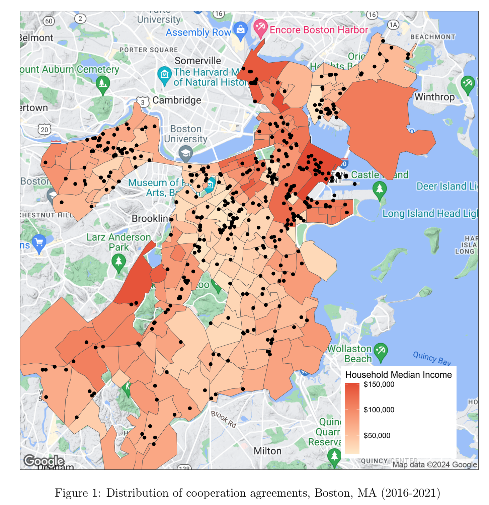

***Figure 1.*** Distribution of cooperation agreements, Boston, MA (2016-2021)

support for new housing. Instead, using an experimental approach and randomly varying the size and structure of proposed compensation packages enables us to avoid selection bias and identify the causal effect of compensation on local support for development.

## Experimental Design

To assess the causal effect of compensation, we use a “willingness-to-accept” survey experiment wherein we show residents of Boston hypothetical new buildings proposed within their self-reported neighborhood and describe the randomly varied bundles of compensation that are offered by developers in exchange for their support. We conducted our pre-registered experiment on a sample of over 578 Boston residents recruited through a variety of methods from April 2021 to April 2022.

This experimental design leverages both a willingness-to-accept framework and the spatial dimension of neighborhoods to mimic the real-world concentrated costs and potential benefits from housing development.2 To do so, our survey asked for respondents’ approximate home locations, calculated the distance between the proposals and respondents’ locations, and displayed 3-dimensional renderings of housing proposals on actual nearby residential parcels in their neighborhoods. The survey allowed the respondent to either enter their address or to first enter their ZIP code, then zooming in to their neighborhood.3 Respondents were then asked to indicate the intersection nearest to their home.

Next, respondents were shown 5 development proposals randomly sampled from a list of potential proposals within a roughly 1 mile radius from their home. We chose nearby proposals in this distance range because spatially-driven opposition in an urban environment declines rapidly beyond this distance (e.g., Hankinson, 2018). Likewise, councilmembers considering whether to approve a proposal may provide greater weight to input from to those living closer to the housing proposal. In other words, proposals within this radius are the ones where respondents would both have the most leverage to obstruct and would be the most likely to benefit from compensation.

The visual presentation of these proposals was designed to mimic how proposals might be encountered in respondents’ daily lives. Each proposal contained two images: the existing parcel viewed from the sidewalk captured via Google’s Street View and a rendering of the proposed development (see Figure H-2). The rendering was based on a 3-dimensional

representation of the current structure captured from slightly above via Google Earth. To represent the proposed building, each rendering included a blue prism drawn over the existing building to display the physical size of the proposed development without providing any details of its exterior design. These two images were displayed alongside a map showing a blue icon — the respondent’s location — and an orange icon — the location of the proposal. Throughout the survey, the blue icon always remained visible, with the screen reorienting to show the location of each new proposal.

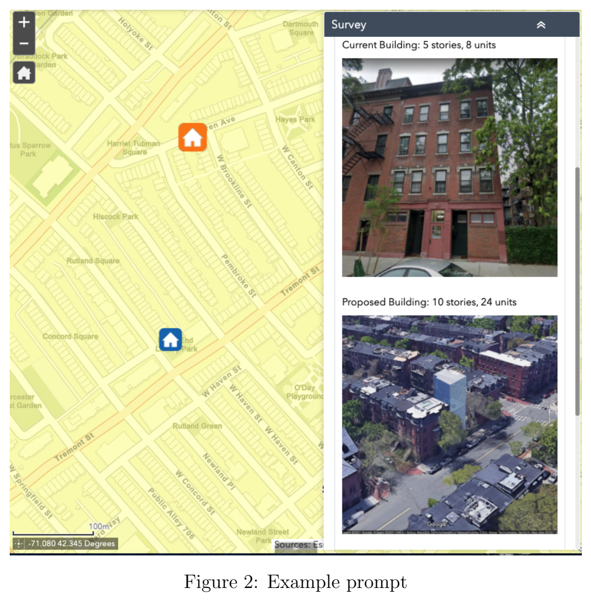

***Figure 2.*** Example prompt

The proposed developments were sampled from real residential structures that exist in the City of Boston’s property database, ensuring that only realistic locations for development were shown. Each proposal was described as twice as tall as the current building and containing threefold as many units. The proposal’s was stated in text and displayed using a

blue prism surrounding the existing structure. The number of units in the proposal was also displayed in text and was rounded up for buildings with odd numbers of units. This increase in density was substantial but not unrealistic for new residential development in Boston.

Experimentally, the survey randomly varied three features of each proposal. First, we varied the affordability of each proposal’s units, stating either: “Half of the units would be occupied by low-income housing voucher recipients” or “The units will be rented at whatever price the local market supports.” Of course, the effects of affordable vs. marketrate development reach beyond the price point of individual units, and might include effects on the racial and economic diversity of the neighborhood and nearby schools. But this bundled treatment mirrors how affordable housing is often described by developers. At the bottom of the proposal, respondents were asked their support for the new building using a 5-item Likert response scale ranging from “Strongly oppose” to “Strongly support.” We rescaled this measure to range from 0 (least support) to 1 (most support) and used it as our first outcome of interest.

Next, respondents were given information about the compensation offered by the developer. We randomly varied the compensation amount, ranging from $50 to $10,000. These amounts were chosen to cover the median compensation level required for winning support and to avoid obviously excessive bids (Kanninen, 1995).4 The median compensation bid offered was $1,500, which is in line with the earlier estimate of $1,650 per capita we calculated from the existing Boston cooperation agreements. This compensation was presented either as a direct payment to the respondent or as an investment in local public goods, randomized at the individual-level but held constant across each of the five proposals viewed to minimize cognitive load. The text read:

“Suppose your neighborhood could vote on whether this proposal should be built.

If the proposal passes, the developer will contribute money to the neighborhood

around the property. The money would be [distributed as a one-time cash pay-

ment such that each person, including you, would receive $X]/[spent on park and

street improvements worth $X per neighborhood resident].”

The size of the “neighborhood” and total amount of compensation to be paid out ($X ∗ # of neighborhood residents) was not defined, allowing respondents to form their own mental image of their neighborhood.

We might reasonably assume that respondents would prefer cash benefits for their fungibility. However, research on the use of compensation for similar land uses finds that residents do not like the feeling of being bribed. For example, Frey, Oberholzer-Gee, and Eichenberger (1996) find that residents are less supportive of a nearby nuclear waste facility when offered a small amount of compensation rather than no compensation at all. They argue that this happens because the financial payment crowds out the “warm glow” effects of doing one’s civic duty by accepting the waste facility. Experimental evidence on the siting of wind energy has also found that residents prefer public goods provision rather than private payments, likely due to the chronic under-provision of local public goods in these communities (Garc´ıa et al., 2016). Ultimately, theoretical evidence points in both directions.

Following this information about compensation, we then asked respondents our second outcome measure for whether they supported the proposal. Following best practices of contingent valuation experiments, we phrased this measure in the form of a referendum. Respondents were asked “How would you vote on this proposal?” and indicated their support on a binary scale.

To summarize, the randomized features of the proposal were the following:

• Affordability: 0% of units for low-income residents v. 50% of units for low-income residents. Randomized at the proposal level.

• Compensation ranging from $50 to $10,000. Randomized at the proposal level.

• Form of compensation: Direct payment vs. public goods investment. Randomized at the respondent level.

## Data

Our survey was designed only for respondents in Boston, due to the tractability of creating customized renderings of developments to serve as experimental stimuli. Yet Boston is an appropriate choice for studying opinions about housing policy: the city has high housing costs and struggles with siting new housing (Glaeser and Ward, 2009) in a similar fashion to many other large cities. And like many large American cities, Boston residents are predominantly liberal and Democratic. So while our survey respondents likely mirror the population most relevant for studying responses to housing development in large cities, we caution against extrapolating our findings to what we might find if we were to conduct our experiment on a broad national population.

We gathered responses from Boston residents via three methods. Wave 1 of the survey was fielded in April 2021. To recruit the sample, we used a commercially available voter file. We defined the sampling frame of registered voters living in Boston with an email address provided in the voter file (57% of registered voters). We used stratified sampling, grouping voters by race, age, voter turnout in the 2018 general election, and registered political party. We oversampled young and minority voters using estimated response rates from a similar voter file-based survey (Wilcox-Archuleta, 2019) to improve representativeness. Targeting a sample of 1,000 respondents, we emailed 46,833 voters. Participants who completed the 10minute survey received a $5 Amazon gift card sent to their email address. Wave 1 contained 288 respondents.5

Wave 2 of the survey was recruited via snowball sampling of neighborhood associations and tenants groups in Fall of 2021. We emailed unique survey IDs to individuals in leadership positions within Boston neighborhood associations and groups and asked them to distribute the survey to their members. No compensation was offered for this survey. While snowball sampling is by no means appropriate or ideal for gathering representative survey samples (Erickson, 1979), the respondents for this wave were not necessarily intended to represent the broader city population. Instead, the target universe of respondents for this survey

wave were those people most likely to attend community meetings to express their support or opposition to new housing development — and therefore those people whose opinions likely hold a great deal of power in the housing policy process in cities. In line with this expectation, 76% of Wave 2 respondents reported attending a Boston political meeting or community forum in the past 12 months, meaning their voice is incredibly relevant to this political phenomenon. Wave 2 contained 216 respondents.

Wave 3 of the survey was recruited to help maximize our sample size and therefore statistical power for our experiment. We fielded this wave in February 2022 via the PureSpectrum survey platform by targeting respondents registered with Boston-based ZIP codes. To ensure data quality, respondents were first filtered based on self-reported residence in Boston then respondents had to indicate their address within the city using the approach described above. These requirements make us confident that all respondents are current residents of Boston. Wave 3 contained 300 respondents.

We combined responses to Waves 1, 2, and 3 for a total of 805 respondents, of which 589 respondents provided demographic information. The demographics of our combined survey sample match the population of Boston reasonably well, as we show in Appendix Table H-

### 2.6 Figure H-3 shows the spatial distribution of respondents and our experimental stimuli

across the Boston area. These maps show that both our respondents and the proposed developments that they evaluated encompassed nearly all of the city’s residential geography. To analyze the experiment, we followed our pre-analysis plan and regressed support for each housing proposal (using our two separate outcome measures) on the randomly varied attributes of each development: compensation amount, inclusion of affordable housing, and form of compensation. We also included an array of demographic covariates including homeownership, income, race/ethnicity, education, partisanship, gender, and age. We used Huber-White standard errors clustered at the respondent level to account for the multiple proposals evaluated by each respondent.7

(a) Self-reported location of respondents (b) Location of building proposals

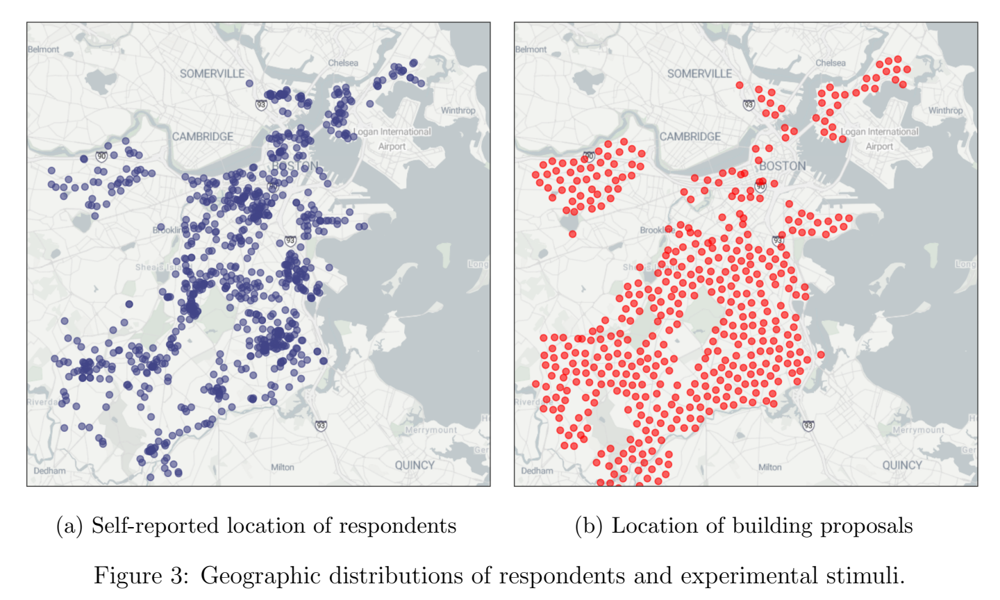

***Figure 3.*** Geographic distributions of respondents and experimental stimuli.

## Results

In this section, we discuss the results using our two separate outcome measures in turn. First, we use responses to the rescaled Likert outcome to assess how the affordability of housing developments affected respondents’ support for these proposals before the information about compensation was presented. Second, we use respondents’ support for the proposal measured as a binary outcome — which was asked after more information about compensation was described — to examine the effects of compensation and its amount.

### The Effects of Affordability

To examine respondents’ baseline attitudes towards new housing, we look at support for proposals measured before compensation was described using the following OLS equation: support = β + β distance + β affordability + γX + ϵ (1) i 0 1 i 2 i i i

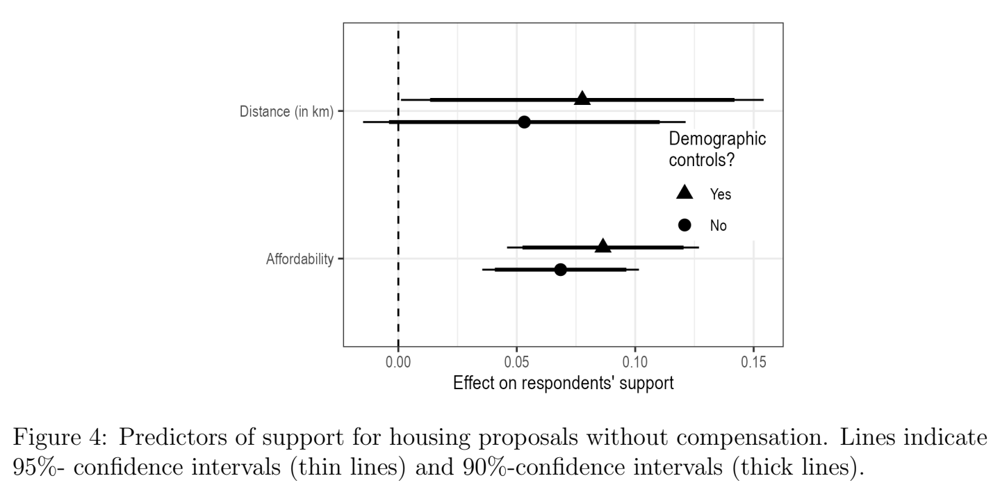

***Figure 4.*** Predictors of support for housing proposals without compensation. Lines indicate 95%- confidence intervals (thin lines) and 90%-confidence intervals (thick lines).

The dependent variable of support is the Likert response operationalized as an interval variable with a unit scale from 0 (“Strongly oppose”) to 1 (“Strongly support”). For the randomly varied proposal attributes, we operationalize distance based on a kilometer increase away from the respondent’s house, and “Affordability” as a dummy variable indicating whether the proposal included half affordable units, rather than all market-rate units. X is a vector of individual-level covariates including homeownership status, income, race, education, ideology, gender, and age. Figure H-4 displays the effects of the randomly-varied attributes on support for the proposal, both from models with demographic controls included (filled triangles) and without controls (filled circles).

Corroborating recent research, we find that the distance between a respondent’s home and the proposed development influences their support. A 1-kilometer increase in the distance of the proposal away from a respondent’s home increased support by 0.05 to 0.08 (p < .05) along the 0-1 scale towards the highest outcome category of “strongly support.” In addition, proposals including affordable units were 0.07 to 0.08 (p < .001) more popular among respondents.8 The positive effect of affordable housing is unexpected, given that past empirical work has found that affordable housing generally has less support than marketrate housing especially among homeowners. We explore and consider mechanisms behind

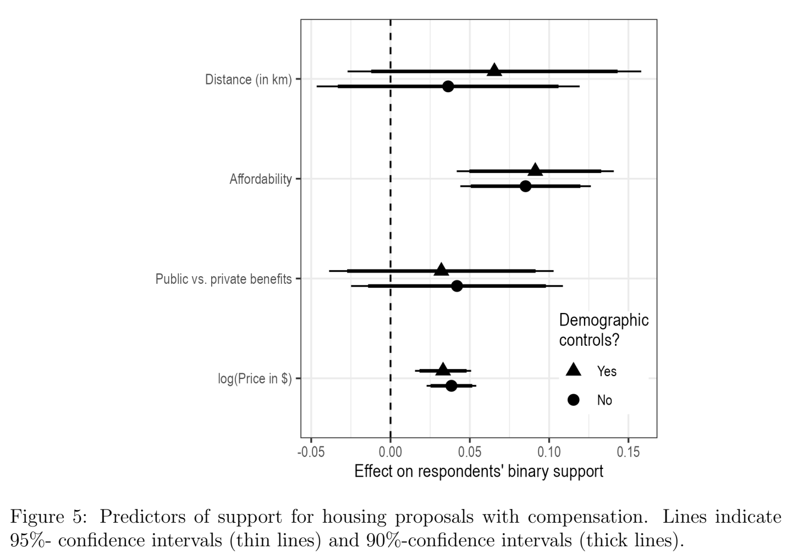

***Figure 5.*** Predictors of support for housing proposals with compensation. Lines indicate 95%- confidence intervals (thin lines) and 90%-confidence intervals (thick lines).

this effect in the Discussion.

### The Effects of Compensation

We next assess the effect of compensation and other experimental features of the proposed developments. To do so, we use our second outcome, which measured binary support for the proposal after the development’s compensation package was described to respondents. On average, 49% of respondents reported support on this outcome for proposals in our experiment. We adapt Equation 1 by using our second outcome variable and by adding the experimental conditions of the amount and form of the compensation (public v. private benefits). We log compensation in order to assess the effects as percentage change in compensation rather than a nominal change.

support = β + β log(compensation) + β form + β distance + β affordability + γX + ϵ

i 0 1 i 2 i 3 i 4 i i i We display the results of these analyses in Figure H-5. Compensation increased respondents’ support for proposed developments. The median amount of compensation offered in our experiment was $1,500 per person. Doubling that compensation — meaning an increase in compensation from $1,500 to $3,000 per person — increased support for the proposal by 2.6 percentage points (p < .001). Relative to 49% average support for proposals, this type of effect is substantively significant given that it could help achieve majority support.

Whether that compensation was offered via a public benefit rather than a private payment appears to have had no detectable effect on respondents’ support, however. Providing the benefits as public goods rather than private payments had a positive effect in all models, but these effects were not statistically significant.9 As in our earlier analyses, proposals that included affordable housing received more support from respondents. Respondents reported 9 percentage points higher support for partially affordable proposals than for market-rate proposals (p < .001).

However, the form of housing (affordable rather than market-rate) moderated the effect of compensation on respondents’ support for developments. We interacted the affordability of the housing proposal with the amount of compensation offered, and show these results in Figure H-6. For affordable proposals, the compensation offered had no influence on respondents’ support (the coefficient represented by the filled circle at the bottom of Figure H-6). Yet for market-rate housing proposals (the coefficient represented by the filled square in Figure H-6), the amount of compensation offered increased respondents’ support.10 In substantive terms, a 100 percent increase in compensation increased support for market-rate proposals by 3.7 percentage points (p < .001), but the same increase in compensation did not increase support for affordable proposals.11

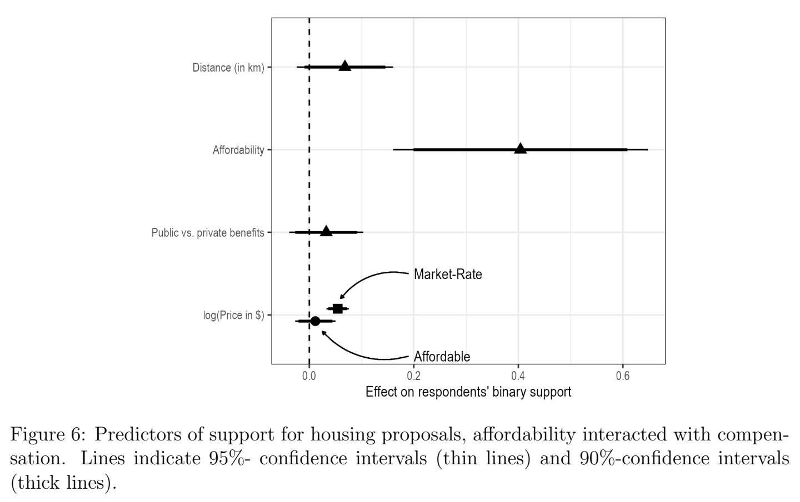

***Figure 6.*** Predictors of support for housing proposals, affordability interacted with compen- sation. Lines indicate 95%- confidence intervals (thin lines) and 90%-confidence intervals (thick lines).

### Evidence from Open-Ended Responses

To better understand why the effect of compensation varied based on the affordability of the proposed housing development, we turned to the open-ended text responses given by survey respondents. For the first of the five proposals viewed, we asked each respondent: “Using at least 5 words, how did the financial compensation affect your support for the proposal?” We calculated the frequency of words that people used in response to this question, among both those who were randomly assigned a proposal that included affordable housing and those assigned a proposal solely composed of market-rate housing. To make responses comparable, we stemmed all words, removed numbers and stopwords (i.e. common conjunctions and prepositions), and replaced the symbol “$” with the word “dollars.”

To compare the responses of people who evaluated affordable proposals with those of people who evaluated market-rate proposals, we examine the relative frequency of each word following the approach used by Wasow (2020) and others. Figure H-7 presents the relative frequency of words used by respondents in the two conditions, among the most commonly

used (overall) words.12 We plot the base-2 logged ratio of a given term’s frequency between respondents in the affordable condition and respondents in the market-rate condition along the horizontal axis. Positive values of this ratio indicate words that are more common among respondents in the affordable condition, while negative values of this ratio indicate words that were more common among respondents in the market-rate condition. Of course, using word stems alone cannot indicate whether a reference to a word was positive or negative. We can only conclude that the stem was more frequently used and therefore likely more salient in respondents’ decision-making process.

The positive values of the relative frequency of the top two words in Figure H-7 indicate that respondents evaluating affordable proposals were more than one-and-a-half times more likely to use the terms “benefit” and “build” compared to those respondents evaluating market-rate proposals.13 In contrast, the bottom two words in Figure H-7 indicate that respondents evaluating market-rate housing used the term “afford” almost three times as much as those evaluating an affordable housing proposal, and referenced the compensation offered to them (using the word “dollar”) almost twice as frequently.14

Respondents who evaluated market-rate proposals appear much more focused on the compensation offered by developers than respondents who evaluated affordable proposals. Respondents evaluating affordable housing may have paid more attention to other features of the proposed development — such as whether the housing itself would benefit the community — instead of the compensation. This evidence provides depth to our earlier results showing that the amount of compensation only minimally influenced respondents’ support when they were evaluating affordable housing proposals.

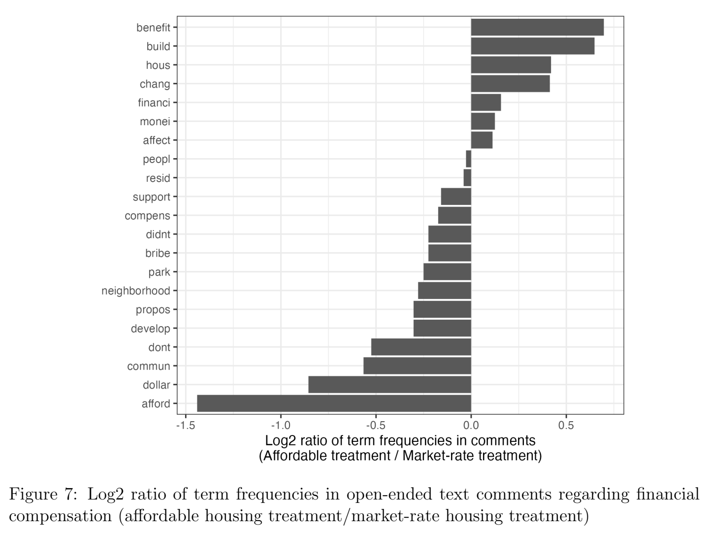

***Figure 7.*** Log2 ratio of term frequencies in open-ended text comments regarding financial compensation (affordable housing treatment/market-rate housing treatment)

## Discussion

Our findings include several unexpected results, including the positive effect of affordable housing as well as the null effects of compensation format and spatial proximity. In this section, we discuss these results as well as the potential mechanisms behind our finding that compensation increases support for market-rate housing but not affordable housing.

We find that proposals which include affordable housing earn more support than those composed of market-rate housing. One potential reason for this might be expressive partisan responding. To test for this, we interact the affordability of proposals with respondents’ partisanship and ideology and show these results in Table H-10 in the Appendix. Across multiple specifications, the interaction is null. This suggests that expressive responding from liberal residents is unlikely to explain our results.

The positive effect of including affordable units may instead have to do with the type of affordable housing proposed. Our experiment references a mixed-income development in which only 50% of the units are affordable housing. Given half of the units will be market-rate, respondents may believe that the development will be well-maintained and generally blend in with the neighborhood. Likewise, the proposed housing developments in our experiment are far from the specter of large apartment towers that abstract visions of “affordable housing” may bring to mind. Finally, our results match other recent experimental work finding greater support for developments with mixed-income housing — which includes some low-income affordable units — in comparison to developments with uniformly marketrate housing (e.g., Matheis and Sorens, 2024; Nall, Elmendorf, and Oklobdzija, 2024). In all, the smaller scale and mixed-income nature of this affordable housing may temper some of the negative effects associated with affordable housing in past research.

We also find that the type of compensation offered — public benefits versus direct cash payment — does not affect respondent support for the proposed development. As we discuss above, this is somewhat surprising, but not unprecedented. Along with avoiding the perception of a bribe, a public benefits package may be popular due to the aggregate effect of the neighborhood payments. The quality of life improvements from pooling everyone’s payments into local street and park infrastructure upgrades may exceed the value of a respondent’s individual cash payment. In all, our results suggest that these counter-pressures may have canceled out.

Our third unexpected finding is that the proximity of development has limited effects on respondents’ support. This is likely due to our experiment’s design, wherein all of the proposed developments were within a mile radius of the respondent’s home. Based on probability, it is unlikely that many developments would be very close to any respondents, e.g., on the same block. Instead, most of the developments fall somewhere in a middle distance between 360 meters to 720 meters. While respondents might think very differently about proposals on their block, proposals within this middle distance may all be viewed as still

within their neighborhood, but not far enough away such that their distance could increase respondents’ support.

Finally, we find that support for affordable housing is unresponsive to compensation. There are two possible reasons for this result. First, affordable housing proposals might suffer from floor or ceiling effects. Dislike for affordable housing may be so great as to overwhelm any effect of compensation. Conversely, support for affordable housing may be so high that compensation cannot move support any higher. Neither of these is a likely explanation: the median support for affordable housing among respondents in our experiment hovers around 50 percent. Instead, we believe that our results demonstrate the calcified nature of public opinion on affordable housing. Supporters and opponents are sufficiently anchored in their opinions that they are unaffected by the levels of compensation that developers provide to neighbors. This calcification due to the symbolic politics of affordable housing therefore weakens the effects of compensation.

Our findings of ineffective compensation bear some similarity to those from other studies of compensation and unwanted land uses. Boyle et al. (2019) study the effects of compensation in the siting of wind turbines, and find similarly calcified responses to this ideologicallycharged type of development. In particular, they find that a segments of respondents are less supportive of wind energy writ large (“anti-wind”), and that compensation is generally unpersuasive for these people. Similarly to how we find that affordable housing calcifies respondents’ attitudes towards housing, Boyle et al. (2019) find that attitudes towards another policy with a strong ideological dimension can make compensation ineffective. We see our results fitting together with these previous findings into a broader picture of when the effect of compensation — and financial self-interest — can be blunted by symbolic and ideological dimensions of policy.

## Policy Implications

The goal of our experiment was to assess how several features of housing proposals influence local residents’ support for those developments. While our experiment uses real locations, real images of buildings, and renderings from respondents’ self-reported neighborhoods, our study is unable to fully replicate the debate that accompanies new housing proposals: experiments inherently require simplification and abstraction. Despite this abstraction, we believe our experiment has value in that it allows us to learn about people’s reactions to developments at their first chance to give input and decide whether they support or oppose development — a crucial beginning from which people may eventually enter the more public discourse. In this section, we discuss the limits to the implications of our findings for policymaking given the constraints of external validity due to experimental simplification. First, the real-world approval of housing development rarely takes the form of binary votes on a neighborhood-wide ballot. Instead, negotiations are often held between developers and select community groups. To the average voter, so long as “the community” gets something, the proposed package may be seen as adequate. In contrast, politically powerful local groups are likely to care deeply and attempt to shape the type of community benefit offered. If the public benefits in our experiment were more selective (semi-public, semi-excludable), then it is possible that respondents would show more support for the personal direct payments. Likewise, the public may be skeptical of community benefits if the negotiation process were framed as illegitimate. Ultimately, these questions and scenarios underscore how little research has been conducted on public support for compensation in the context of housing.

Second, while we report average treatment effects, there is variationin these effects across relevant real-world groups of people. Table H-11 and Table H-12 in the Appendix show the findings from our main analyses, separated by survey waves. Wave 2 is composed of respondents recruited from neighborhood organizations who are active in housing politics, and may therefore bear the most relevance for the real-world development process. Respondents in

this sample appear more supportive of housing which is farther away from them. Likewise, Wave 2 respondents also show a smaller increase in support for housing that includes affordable units compared to solely market-rate housing than among our full respondent sample. The effect of compensation is also smaller for respondents from Wave 2 and not statistically significant.

These differences across sample waves affirm expectations of differences across residents. Those who are the most heavily invested in neighborhood politics appear to fit the typical definitions of housing NIMBYism: opposed to proposals most nearby and wary of affordable housing. At the same time, the treatment effects are still relatively consistent across samples, suggesting that our study is detecting real attitudes held among residents and which may be channeled using policy innovations like we propose. These subsample analyses were not preregistered, so we caution against over-interpretation of these results. Yet they give some clues as to how dimensions of housing development that we examine may play out in an especially important subset of the population, and may be useful and worthy of future study.

Third, as we state in the Discussion, the positive effect of affordable housing on respondent support may be driven by the type of affordable developments proposed: mixed-income. But affordable housing can take many forms, even in the single city of Boston. New larger developments covered by Boston’s inclusionary zoning policy only need to dedicate 13% of their units to income-restricted housing. But in Massachusetts since 2010, new construction funded by the Low-Income Housing Tax Credit has designated 96% of its units as incomerestricted. Our proposals, which set aside 50% of units as income-restricted, fall somewhere in between these two extremes. We believe these proposals tap into the attitudes towards mixed-income housing and should not necessarily be interpreted as relevant to either fully affordable or inclusionary zoning developments.

Fourth, compensation agreements may operate differently outside the context of Boston. But as we show in our observational analysis, community contact and informal negotiation is a mandatory part of housing entitlement process in 12 of the 25 most populous cities in

the U.S. Likewise, many local policy advocates point towards compensation via community benefits agreements as the more equitable path to development (Fraser, 2022) – not just of housing, but also development of energy infrastructure (U.S. Department of Energy, 2017). While CBAs may be not be ubiquitous in housing today, our findings are a necessary first step to better understand the political science of compensation as well as the policy conditions under which compensation will be effective in winning public support.

Even with these caveats, our findings indicate clear pathways towards increasing public support for new housing in urban environments such as Boston. Our results suggest that including affordable housing can be a useful measure to increase net support for a project. However, once affordable housing is incorporated, additional compensation is unlikely to prove useful in expanding a coalition. In fact, additional compensation may only hurt the financial viability of a project, with little payoff in public support. Instead, support for mixed-income developments, which are often developments that fall under commonly used inclusionary zoning requirements, could be increased by highlighting the relative affordability of the development. This appeal to the symbolic value of affordability may do more to garner neighbors’ support compared to simply increasing financial compensation.

## Conclusion

Compensating the public has long been a formal or informal requirement for developers. But little is known about how communities negotiate to secure concentrated benefits to offset housing’s localized costs. In this paper, we have measured not only the real-world extent of institutionalized community voice in securing benefits, but also the effectiveness of that compensation in offsetting concentrated costs via an experiment. We showed respondents realistic 3-dimensional renderings for new housing within their self-reported neighborhoods and found that compensation — be it public goods or private payments — is effective in increasing support for development among the mass public. However, we also found that

including affordable housing not only increased support for each proposal, but negated the effect of compensation on support.

These findings support a history of research in public policy and political science demonstrating the dominance of symbolic politics in mass public preferences for policy (Feldman, 1982; Sears et al., 1980). Only when a policy is proximate to an individual’s material wellbeing and lacks a salient partisan framing should we expect self-interest to drive attitudes (e.g., H˚arsman and Quigley, 2010). In this case, the partisan and racialized perspectives towards affordable housing may prevent appeals to financial self-interest from driving attitudes (Tighe, 2012). Conversely, research has also found self-interested attitudes to be largely unmoved by symbolic frames and sociotropic primes (Chong, Citrin, and Conley, 2001; Marble and Nall, 2021; but see Mutz and Kim, 2017; Boyle et al., 2019). In contrast, our findings suggest that even the narrow change of housing’s affordability can influence whether voters evaluate the policy through a lens of self-interest or symbolic values.

More broadly, the findings from this project extend theory on the intersection of selfinterest and symbolic politics in a way that generalizes to other policy areas beyond housing. For instance, policymakers often confront both symbolic politics and financial self-interest when considering redistributive education policy funding mechanisms, as well as highly ideological energy policy infrastructure. Our results suggest that the design of such policy may cause symbolic attitudes to eclipse the importance of financial concerns for the average voter. Ultimately, compensating those who bear a policy’s concentrated costs may be considered an advance in equity compared to the history of 20th century top-down planning, where many communities directly affected by localized policy lacked voice. Yet the (over)use of compensation in any policy area risks inefficiencies in the use of financial resources. This study deepens our understanding of how voters respond to compensation for concentrated costs. Given the increasing use of compensation for disparate projects from clean energy infrastructure to housing development, more work is needed to understand how the interplay of self-interest and symbolic politics can advance both equity and efficiency.

## Notes

1The Boston Planning & Development Agency (BPDA) facilitates the negotiation of benefits using an “Impact Advisory Group” (IAG) for each large discretionary permit. IAGs are formed uniquely for each qualifying project and are composed of nearby residents appointed by the mayor. The IAG works with the developer to identify the effects of the development on the community and then — in concert with the BPDA — negotiates a mitigation package attached to the development’s approval.

2In Appendix B, we further explain our design’s framework and how we circumvent some of the concerns about financial realism in survey experiments.

3This ZIP code-based method, rather than the exact address method, was chosen by 72% of respondents. 4See Section B.1 for more detail on bid selection.

5Our response rate to Wave 1 is not uncommon of this style of voter file recruiting, which is often in the low single digits (Yan, Kalla, and Broockman, 2018). And while limited in sample size, this approach of an online survey of respondents recruited from a defined sampling frame — the voter file — has been found to generate representativeness comparable to that of phone panel surveys (Broockman, Kalla, and Sekhon, 2017).

6Individual tables of descriptive statistics for Waves 1, 2 and 3 are presented in Tables H-3, H-4, and H-5. 7See Section G for our pre-analysis plan.

8The inclusion of affordable housing had a similarly-sized positive effect on support among both homeowners and renters, as indicated by the null interaction between homeowner status and “Affordable” in Column 3 of Table H-6.

9The interaction between amount of compensation and the form of compensation was also substantively null (column 4 in Table H-7).

10Column 3 of Table H-7 shows these results in tabular form.

11Disaggregating these models by homeownership, we find that the inclusion of affordable housing negates the effect of compensation among both homeowners and renters (see Appendix D.1).

12We chose the top 21 word stems, due to a tie for the 20th most common word.

1320.7 ≈ 1.6.

1421.4 ≈ 2.7, and 20.9 ≈ 1.9, respectively.

## References

Adams, Brian. 2004. “Public Meetings and the Democratic Process.” Public Administration Review 64(1): 43–54.

Alvarez, R Michael, and Jonathan Nagler. 1998. “When Politics and Models Collide: Estimating Models of Multiparty Elections.” American Journal of Political Science 42(1): 55–96.

Arnstein, Sherry R. 1969. “A Ladder of Citizen Participation.” Journal of the American Institute of Planners 35(4): 216–224.

Been, Vicki. 2005. “Impact Fees and Housing Affordability.” Cityscape pp. 139–185.

Been, Vicki. 2010. “Community Benefits: A New Local Government Tool or Another Variation on the Exactions Theme.” University of Chicago Law Review 77: 5.

Been, Vicki, Ingrid Gould Ellen, and Katherine O’Regan. 2019. “Supply Skepticism: Housing Supply and Affordability.” Housing Policy Debate 29(1): 25–40.

Bingham, Lisa Blomgren, Tina Nabatchi, and Rosemary O’Leary. 2005. “The New Governance: Practices and Processes for Stakeholder and Citizen Participation in the Work of Government.” Public Administration Review 65(5): 547–558.

Boyle, Kevin J. 2017. “Contingent Valuation in Practice.” In A Primer on Nonmarket Valuation. Springer pp. 83–131.

Boyle, Kevin J, Jessica Boatwright, Sreeya Brahma, and Weibin Xu. 2019. “NIMBY, Not, in Siting Community Wind Farms.” Resource and Energy Economics 57: 85–100.

Broockman, David E, Joshua L Kalla, and Jasjeet S Sekhon. 2017. “The Design of Field Experiments with Survey Outcomes: A Framework for Selecting More Efficient, Robust, and Ethical Designs.” Political Analysis 25(4): 435–464.

Calia, Pinuccia, and Elisabetta Strazzera. 1999. “Bias and Efficiency of Single vs Double Bound Models for Contingent Valuation Studies: a Monte Carlo Analysis.” Fondazione Eni Enrico Mattei Working Paper (10.99).

Carson, Richard T, and Miko(cid:32)laj Czajkowski. 2014. “The Discrete Choice Experiment Approach to Environmental Contingent Valuation.” In Handbook of Choice Modelling, ed. S Hess, and A Daly. Northampton: Edward Elgar Publishing.

Carson, Richard T, and Theodore Groves. 2007. “Incentive and Informational Properties of Preference Questions.” Environmental and Resource Economics 37(1): 181–210.

Charles, Camille Zubrinksy. 2006. Won’t You Be My Neighbor: Race, Class, and Residence in Los Angeles. Russell Sage Foundation.

Checkoway, Barry. 1981. “The Politics of Public Hearings.” The Journal of Applied Behavioral Science 17(4): 566–582.

Chong, Dennis, Jack Citrin, and Patricia Conley. 2001. “When Self-Interest Matters.” Political Psychology 22(3): 541–570.

de Benedictis-Kessner, Justin, and Michael Hankinson. 2019. “Concentrated Burdens: How Self-Interest and Partisanship Shape Opinion of Opioid Treatment Policy.” American Political Science Review 113(4): 1078–1084.

de Benedictis-Kessner, Justin, Daniel Jones, and Christopher Warshaw. 2024. “How Partisanship in Cities Influences Housing Policy.” American Journal of Political Science (forthcoming).

Diamond, Peter A, and Jerry A Hausman. 1994. “Contingent Valuation: Is Some Number Better Than No Number?” Journal of Economic Perspectives 8(4): 45–64.

Dynes, Adam M, Christopher F Karpowitz, and J Quin Monson. 2022. “How Local Officials

Respond to Expressions of Public Opinion.” Working paper, presented at the Annual Meeting of the Midwest Political Science Association.

Einstein, Katherine Levine, David M Glick, and Maxwell Palmer. 2019. Neighborhood Defenders: Participatory Politics and America’s Housing Crisis. New York: Cambridge University Press.

Einstein, Katherine Levine, Maxwell Palmer, and David M Glick. 2019. “Who Participates in Local Government? Evidence from Meeting Minutes.” Perspectives on Politics 17(1): 28–46.

Erickson, Bonnie H. 1979. “Some problems of inference from chain data.” Sociological methodology 10: 276–302.

Feldman, Stanley. 1982. “Economic Self-Interest and Political Behavior.” American Journal of Political Science pp. 446–466.

Fischel, William A. 2001. The Homevoter Hypothesis. Cambridge, MA: Harvard University Press.

Foster, David, and Joseph Warren. 2022. “The NIMBY Problem.” Journal of Theoretical Politics 34(1): 145–172.

Fraser, Catherine. 2022. Community Benefits Agreements Offer Meaningful Opportunities to Include Voters’ Voices in Development. Technical report Data For Progress.

Frey, Bruno S, Felix Oberholzer-Gee, and Reiner Eichenberger. 1996. “The Old Lady Visits Your Backyard: A Tale of Morals and Markets.” Journal of Political Economy 104(6): 1297–1313.

Ganong, Peter, and Daniel Shoag. 2017. “Why Has Regional Income Convergence in the US Declined?” Journal of Urban Economics 102: 76–90.

Garc´ıa, Jorge H, Todd L Cherry, Steffen Kallbekken, and Asbjørn Torvanger. 2016. “Willingness to Accept Local Wind Energy Development: Does the Compensation Mechanism Matter?” Energy Policy 99: 165–173.

Glaeser, Edward L, and Bryce A Ward. 2009. “The Causes and Consequences of Land Use Regulation: Evidence from Greater Boston.” Journal of Urban Economics 65(3): 265–278. Gomila, Robin. 2021. “Logistic or Linear? Estimating Causal Effects of Experimental Treatments on Binary Outcomes Using Regression Analysis.” Journal of Experimental Psychology: General 150(4): 700.

Hamilton, Bruce W. 1976. “Capitalization of Intrajurisdictional Differences in Local Tax Prices.” The American Economic Review 66(5): 743–753.

Hankinson, Michael. 2018. “When Do Renters Behave Like Homeowners? High Rent, Price Anxiety, and NIMBYism.” American Political Science Review 112(3): 473–493.

H˚arsman, Bjo¨rn, and John M Quigley. 2010. “Political and Public Acceptability of Congestion Pricing: Ideology and Self-Interest.” Journal of Policy Analysis and Management 29(4): 854–874.

Helveston, John Paul. 2020. logitr: Random Utility Logit Models with Preference and Willingness to Pay Space Parameterizations. https://jhelvy.github.io/logitr/: .

Jagers, Sverker C, Johan Martinsson, and Simon Matti. 2019. “The Impact of Compensatory Measures on Public Support for Carbon Taxation: An Experimental Study in Sweden.” Climate Policy 19(2): 147–160.

Jakobsen, Morten, Oliver James, Donald Moynihan, and Tina Nabatchi. 2019. “JPART Virtual Issue on Citizen-State Interactions in Public Administration Research.” Journal of Public Administration Research and Theory 29(4): e8–e15.

Johnston, Robert J, Kevin J Boyle, Wiktor Adamowicz, Jeff Bennett, Roy Brouwer, Trudy Ann Cameron, W Michael Hanemann, Nick Hanley, Mandy Ryan, Riccardo Scarpa et al. 2017. “Contemporary Guidance for Stated Preference Studies.” Journal of the Association of Environmental and Resource Economists 4(2): 319–405.

Kanninen, Barbara J. 1995. “Bias in Discrete Response Contingent Valuation.” Journal of Environmental Economics and Management 28(1): 114–125.

Kim, Minjee. 2020. “Negotiation or Schedule-Based? Examining the Strengths and Weaknesses of the Public Benefit Exaction Strategies of Boston and Seattle.” Journal of the American Planning Association 86(2): 208–221.

Kim, Younjun, Catherine L Kling, and Jinhua Zhao. 2015. “Understanding Behavioral Explanations of the WTP-WTA Divergence Through a Neoclassical Lens: Implications for Environmental Policy.” Annual Review of Resource Economics 7: 169–87.

Knetsch, Jack L. 2005. “Gains, Losses, and the US-EPA Economic Analyses Guidelines: A Hazardous Product?” Environmental and Resource Economics 32(1): 91–112.

Kunreuther, Howard, and Doug Easterling. 1996. “The Role of Compensation in Siting Hazardous Facilities.” Journal of Policy Analysis and Management 15(4): 601–622.

Marble, William, and Clayton Nall. 2021. “Where Self-Interest Trumps Ideology: Liberal Homeowners and Local Opposition to Housing Development.” Journal of Politics 83(4): 1747–1763.

Margalit, Yotam. 2011. “Costly Jobs: Trade-Related Layoffs, Government Compensation, and Voting in US Elections.” American Political Science Review 105(1): 166–188.

Matheis, Mike, and Jason Sorens. 2024. “Framing Affordable Housing: An Experimental Test of Changing Attitudes.” Housing Studies 39(4): 1049–1065.

McFadden, Daniel, and Kenneth Train. 2000. “Mixed MNL Models for Discrete Response.” Journal of Applied Econometrics 15(5): 447–470.

Mutz, Diana C, and Eunji Kim. 2017. “The Impact of In-Group Favoritism on Trade Preferences.” International Organization 71(4): 827–850.

Nall, Clayton, Christopher S Elmendorf, and Stan Oklobdzija. 2024. “Folk Economics and the Persistence of Political Opposition to New Housing.” Working paper, online: https: //dx.doi.org/10.2139/ssrn.4266459.

O’Neill, Moira, Giulia Gualco-Nelson, and Eric Biber. 2019. “Developing Policy from the Ground Up: Examining Entitlement in the Bay Area to Inform California’s Housing Policy Debates.” Hastings Environmental Law Journal 24: 1.

O’Neill, Moira, Giulia Gualco-Nelson, and Eric Biber. 2020. “Sustainable Communities or the Next Urban Renewal?” Ecology Law Quarterly 47: 1061.

Sahn, Alexander. 2023. “Public Comment and Public Policy.” American Journal of Political Science (forthcoming).

Sears, David O, Richard R Lau, Tom R Tyler, and Harris M Allen. 1980. “Self-Interest vs. Symbolic Politics in Policy Attitudes and Presidential Voting.” American Political Science Review 74(3): 670–684.

Tighe, J Rosie. 2012. “How Race and Class Stereotyping Shapes Attitudes Toward Affordable Housing.” Housing Studies 27(7): 962–983.

Trounstine, Jessica. 2018. Segregation by Design: Local Politics and Inequality in American Cities. Cambridge University Press.

U.S. Department of Energy. 2017. Guide to Advancing Opportunities for Community Benefits through Energy Project Development. Technical report U.S. Department of Energy.

Vigoda, Eran. 2002. “From Responsiveness to Collaboration: Governance, Citizens, and the Next Generation of Public Administration.” Public Administration Review 62(5): 527–540. Viscusi, W Kip, and Joel Huber. 2012. “Reference-Dependent Valuations of Risk: Why Willingness-to-Accept Exceeds Willingness-to-Pay.” Journal of Risk and Uncertainty 44(1): 19–44.

Walker, Benjamin JA, Bouke Wiersma, and Etienne Bailey. 2014. “Community Benefits, Framing and the Social Acceptance of Offshore Wind Farms: An Experimental Study in England.” Energy Research & Social Science 3: 46–54.

Wasow, Omar. 2020. “Agenda Seeding: How 1960s Black Protests Moved Elites, Public Opinion and Voting.” American Political Science Review 114(3): 638–659.

Wilcox-Archuleta, Bryan. 2019. “Survey Sampling with Voter Files: Improving on Affordable Survey Options for Public Opinion.” Working paper.

Wilson, James Q. 1980. The Politics of Regulation. New York: Basic Books.

Wolf-Powers, Laura. 2010. “Community Benefits Agreements and Local Government: A Review of Recent Evidence.” Journal of the American Planning Association 76(2): 141– 159.

Yan, Alan, Joshua Kalla, and David E Broockman. 2018. “Increasing Response Rates and Representativeness of Online Panels Recruited by Mail: Evidence from Experiments in 12 Original Surveys.” Working paper. Online: https://files.osf.io/v1/resources/t4msy/providers/osfstorage/ 6255db69d5121d0974336640?action=download&direct&version=1.

## Supplementary Appendix for

## Contents

A Institutionalization of Community Negotiation for Public Benefits A-2 B Evaluating Public Support Using a “Willingness-to-Accept” Experiment A-7 B.1 Bid Selection . . . . . . . . . . . . . . . . . . . . . . . . . . . . . . . . . . . A-8 C Descriptive Statistics A-9 D Results, Tabular Form A-10 D.1 Results by Homeownership Status . . . . . . . . . . . . . . . . . . . . . . . . A-11 E Alternative Modeling Approaches A-12 F Survey Instrument A-14 F.1 Individual proposals . . . . . . . . . . . . . . . . . . . . . . . . . . . . . . . A-15 F.2 Demographics . . . . . . . . . . . . . . . . . . . . . . . . . . . . . . . . . . . A-16 G Pre-Analysis Plan A-20 G.1 Individual Proposals . . . . . . . . . . . . . . . . . . . . . . . . . . . . . . . A-20 H Exploratory Analyses A-22

## A Institutionalization of Community Negotiation for

## Public Benefits

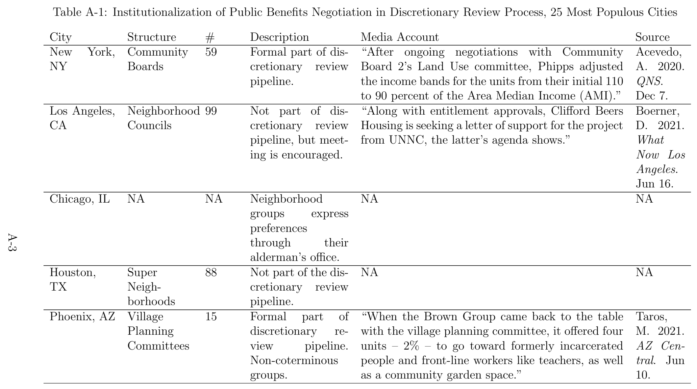

***Table A-1.*** Institutionalization of Public Benefits Negotiation in Discretionary Review Process, 25 Most Populous Cities City Structure # Description Media Account Source New York, Community 59 Formal part of dis- “After ongoing negotiations with Community Acevedo, NY Boards cretionary review Board 2’s Land Use committee, Phipps adjusted A. 2020. pipeline. the income bands for the units from their initial 110 QNS. to 90 percent of the Area Median Income (AMI).” Dec 7. Los Angeles, Neighborhood 99 Not part of dis- “Along with entitlement approvals, Clifford Beers Boerner, CA Councils cretionary review Housing is seeking a letter of support for the project D. 2021. pipeline, but meet- from UNNC, the latter’s agenda shows.” What

[Download data as CSV](tables/tab-01.csv)

ing is encouraged. Now Los Angeles. Jun 16. Chicago, IL NA NA Neighborhood NA NA

groups express

preferences

through their

alderman’s office.

Houston, Super 88 Not part of the dis- NA NA

TX Neigh- cretionary review

borhoods pipeline.

Phoenix, AZ Village 15 Formal part of “When the Brown Group came back to the table Taros,

Planning discretionary re- with the village planning committee, it offered four M. 2021. Committees view pipeline. units – 2% – to go toward formerly incarcerated AZ Cen- Non-coterminous people and front-line workers like teachers, as well tral. Jun groups. as a community garden space.” 10.

City Structure # Description Media Account Source

Philadelphia, Registered 200+ Formal part of “In late 2012,...City Council formalized the long- Elliot,

PA Community discretionary re- standing practice of real estate developers and com- K. 2017. Organiza- view pipeline. No munity groups negotiating by defining and regulat- Office of tions single group rep- ing RCOs...the zoning code update requires that Innovaresents community one RCO for the neighborhood coordinates one tion and though. meeting where everybody is represented.” Technology. Jul 31.

San Anto- NA NA NA NA NA

nio, TX

San Diego, Community 43 Formal part of dis- “Community planning groups, even though they’re Burks,

CA Planning cretionary review advisory, play an important role in bringing the M. 2015. Groups pipeline. community together to have a conversation in terms KPBS.

of what a project should look like.” May 20. Dallas, TX NA NA NA NA NA

San Jose, NA NA NA NA NA

CA

Austin, TX Neighborhood 31 Formal part of “I think that the discussion has been fruitful, and Thompson, Plan Con- discretionary re- as a result of the stakeholder feedback the Jay Paul B. 2021. tact Teams view pipeline. Company increased by over $900,000 the commu- Com-

Non-coterminous nity benefits in the targeted areas that were in fact munity groups, generated identified by the contact teams.” Impact. from ground up. Jun 9. Jacksonville, Citizens 6 Not part of the NA NA

FL Planning discretionary re-

Advisory view pipeline.

Committees Large aggregation

level limits direct

neighborhood

influence.

City Structure # Description Media Account Source

Fort Worth, NA NA NA NA NA

TX

Columbus, Area Com- 21 Formal part of dis- “Many residents have opposed the plans for two Ferenchik, OH missions cretionary review years, saying the project’s scale is too big for the M. 2022. pipeline. neighborhood. The developer had gone back and The

forth with the Schumacher Place Civic Association Columand Columbus South Side Area Commission, and bus

residents last year held ‘whale walks’ in protest of Dispatch. the development’s size.” Feb 9.

Indianapolis, NA NA NA NA NA

IN

Charlotte, NA NA NA NA NA

NC

San Fran- Array of NA Pre-existing “It’s unclear how much of the project’s affordabil- Mark, cisco, CA groups groups supplanted ity played into the discontent of neighborhood anti- J. 2019. the need to create gentrification activists — primarily, a coalition of Mission a new institution. Mission-based groups called United to Save the Local. These groups have Mission. But Moshayedi asserted in an interview July 26. the ability to re- that, during negotiations, the coalition asked for

quest discretionary major concessions such as “land” and “a lot of

review of any cash.” He would not say how much money the coali-

project, making tion asked for. He said, too, the groups did not

even their informal specify where the money would go but that it would

influence powerful. be on a “payment basis.”

Seattle, WA Design Re- 8 Formal part of dis- NA NA view Boards cretionary review

pipeline. Focused

on design review,

not maximizing

community input

writ large.

City Structure # Description Media Account Source Denver, CA NA NA NA NA NA

Washington, Advisory 37 Formal part of dis- “D.C. lawmakers are looking to arm the city’s ad- Koma, DC Neigh- cretionary review visory neighborhood commissions with more re- A. 2020. borhood pipeline. sources and expertise as they negotiate with devel- Wash- Commis- opers, hoping to empower the volunteer commis- ington sions sioners as they engage in highly technical debates Business over zoning and development.” Journal. Dec 2. Nashville, NA NA NA NA NA

TN

Oklahoma NA NA NA NA NA

City, OK

El Paso, TX NA NA NA NA NA

Boston, MA Impact NA Formal part of “The mitigation package...included a new pot of Daniel, Advisory discretionary re- money that was championed by State Rep. Dan S. 2020. Group view pipeline. Ryan and other officials. That was perhaps the Charlestown Formed ad hoc largest change in mitigation measures, which is Patriotper development what the IAG is tasked with negotiating. That new Bridge. proposal pot of money would be a $500,000 grant from the Dec 16. developer to the Boston Housing Authority to fix

buildings and improve open spaces in areas of the

development slated for reconstruction much later in

the process.”

Portland, NA NA NA NA NA

OR

## B Evaluating Public Support Using a “Willingness-to-

## Accept” Experiment

There are challenges to capturing the effects of compensation on public support through a survey experiment. To begin, traditional surveys often lack real-world stakes that would enable financial payments to be realistically powerful. Such surveys can introduce a hypothetical bias when the exercise lacks consequences to the respondent. However, some have suggested that a hypothetical bias can be avoided if the results of the survey have a non-zero probability of being used in the real-world decision-making process (Carson and Czajkowski, 2014). We work to counter this hypothetical bias by stating in recruitment and during the survey that a final report of findings will be shared with the City of Boston.

More broadly, experiments with financial tradeoffs are most accurate when the respondent is familiar with the good being valued. Given that housing is an individual’s largest regular expense and that residents often connect new development to their personal housing costs (Fischel, 2001), and that residents in growing cities like Boston regularly observe new housing development, we expect that the respondents in our survey are both familiar and comfortable with evaluating the tradeoffs around new housing proposals. This familiarity avoids many of the logical problems identified in intangible, unfamiliar goods, such as respondents valuing the lives of 10 whales the same as 100 whales (Diamond and Hausman, 1994).

There are also debates over whether WTA or its counterpart — “Willingness to Pay” (WTP) — is a better method for measuring stated preferences. In a WTA experiment, the goal is to elicit how much a respondent would need to be compensated to agree to a policy. In contrast, a WTP experiment measures how much a respondent would pay to either implement or block a new policy. WTA is more appropriate for this study due to its loss-based reference point and realism as a policy instrument (Knetsch, 2005; Kim, Kling, and Zhao, 2015). Because most people view new housing as having negative externalities, WTA better captures the reference point of a loss which requires compensation (Viscusi and Huber, 2012; Johnston et al., 2017). This is in contrast to valuing a public good which does not exist, but for which the respondent is willing to pay, e.g., constructing a new park.

Second, the framework of WTA is far more realistic as a policy instrument. As noted, WTA already exists as a compensation measures in the form of CBAs between developers and their proposal’s surrounding community. In contrast, we have yet to observe a citizen paying a developer to not build nearby (i.e., WTP). Indeed, the proposition that respondents should have to pay to avoid development would seem so ludicrous and repugnant that it risks “system rejection” of the survey by respondents, leading to either protest responses or satisficing. The tools of delay and veto are already in the hands of the current residents (Einstein, Palmer, and Glick, 2019). Thus, a WTA experiment enhances the findings’ externality validity by better reflecting both the psychology of the housing’s externalities and the existing policy processes.

Regarding format, the recent stated preferences literature uniformly supports using a referenda-style bid, particularly around items that are public goods. As a referendum, the bid offers respondents a payment should the proposed policy pass, then asks respondents about their support in a yes/no form. Unlike open-ended statements or payment cards, this referenda-style bid prevents respondents from intentionally misstating their values to

influence the outcomes of the study (Boyle, 2017).

Less clear is the form of the referenda choice experiment. Single-bounded experiments offer one compensation amount, whereas double-bounded experiments offer a follow-up; a higher value if the respondent declined the first offer, a lower if they accepted. Carson and Groves (2007) find the double-bounded choice experiment to bias estimates downwards and to be largely undesirable except for increasing statistical power. However, even this power benefit has been questioned for survey samples of more than a few hundred respondents (Calia and Strazzera, 1999). Consequently, this survey utilizes a single-bounded WTA choice experiment.

### B.1 Bid Selection

A March 2021 pilot study (n = 250) from Amazon’s Mechanical Turk platform showed respondents a hypothetical development proposal for their own community. The proposal was generic, not actually pulled from a respondent’s neighborhood like in this study. Asking an open-ended response and removing seemingly extreme values (greater than $100,000), the median minimum compensation level required to support the proposal was $1,000. Best practice suggests spreading compensation values between the 20th and 80th percentiles to identify the median valuation. Consequently, we selected 7 bid amounts roughly following the distribution of minimally accepted values from 20th through 80th percentiles of the pilot data: $50, $200, $500, $1,000, $1,500, $2,000, and $5,000. Of course, this distribution may have been biased downward given the lower income levels of Mechanical Turk respondents. Results from Wave 1 showed that most respondents still were not accepting the proposed housing even when offered $5,000. To better estimate the causal effect of compensation, we increased the bid values for Waves 2 and 3 to $250, $750, $1,500, $3,000, $5,000, $7,500, and $10,000. The three waves are combined in the analysis.

## C Descriptive Statistics

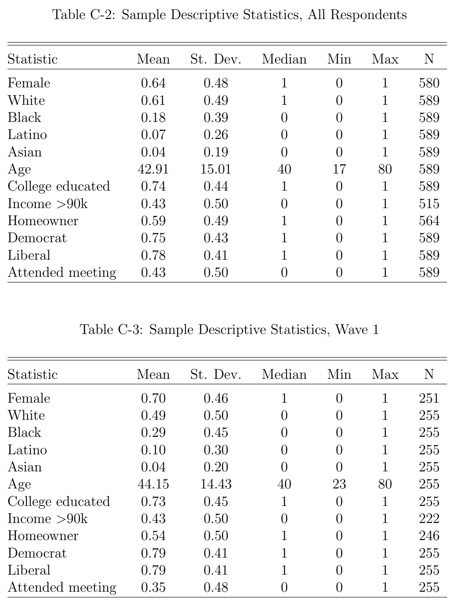

***Table C-2.*** Sample Descriptive Statistics, All Respondents

[Download data as CSV](tables/tab-02.csv)

Statistic Mean St. Dev. Median Min Max N Female 0.64 0.48 1 0 1 580 White 0.61 0.49 1 0 1 589 Black 0.18 0.39 0 0 1 589 Latino 0.07 0.26 0 0 1 589 Asian 0.04 0.19 0 0 1 589 Age 42.91 15.01 40 17 80 589 College educated 0.74 0.44 1 0 1 589 Income >90k 0.43 0.50 0 0 1 515 Homeowner 0.59 0.49 1 0 1 564 Democrat 0.75 0.43 1 0 1 589 Liberal 0.78 0.41 1 0 1 589 Attended meeting 0.43 0.50 0 0 1 589

***Table C-3.*** Sample Descriptive Statistics, Wave 1

[Download data as CSV](tables/tab-03.csv)

Statistic Mean St. Dev. Median Min Max N Female 0.70 0.46 1 0 1 251 White 0.49 0.50 0 0 1 255 Black 0.29 0.45 0 0 1 255 Latino 0.10 0.30 0 0 1 255 Asian 0.04 0.20 0 0 1 255 Age 44.15 14.43 40 23 80 255 College educated 0.73 0.45 1 0 1 255 Income >90k 0.43 0.50 0 0 1 222 Homeowner 0.54 0.50 1 0 1 246 Democrat 0.79 0.41 1 0 1 255 Liberal 0.79 0.41 1 0 1 255 Attended meeting 0.35 0.48 0 0 1 255

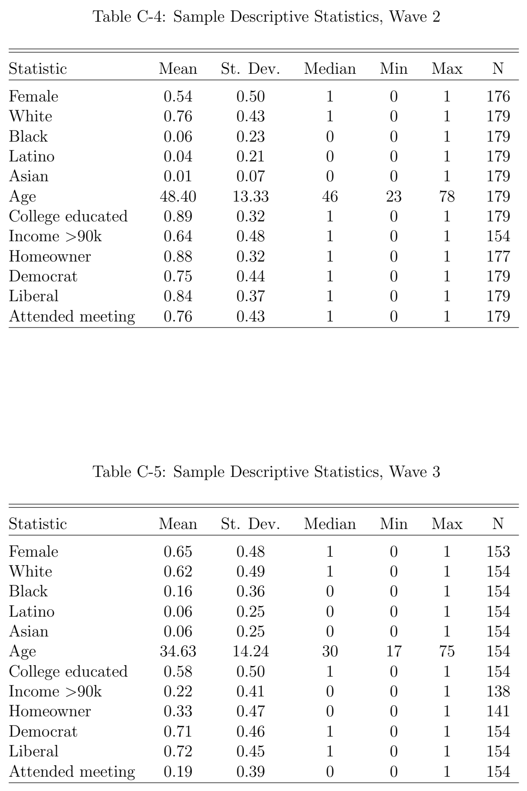

***Table C-4.*** Sample Descriptive Statistics, Wave 2

[Download data as CSV](tables/tab-04.csv)

Statistic Mean St. Dev. Median Min Max N Female 0.54 0.50 1 0 1 176 White 0.76 0.43 1 0 1 179 Black 0.06 0.23 0 0 1 179 Latino 0.04 0.21 0 0 1 179 Asian 0.01 0.07 0 0 1 179 Age 48.40 13.33 46 23 78 179 College educated 0.89 0.32 1 0 1 179 Income >90k 0.64 0.48 1 0 1 154 Homeowner 0.88 0.32 1 0 1 177 Democrat 0.75 0.44 1 0 1 179 Liberal 0.84 0.37 1 0 1 179 Attended meeting 0.76 0.43 1 0 1 179

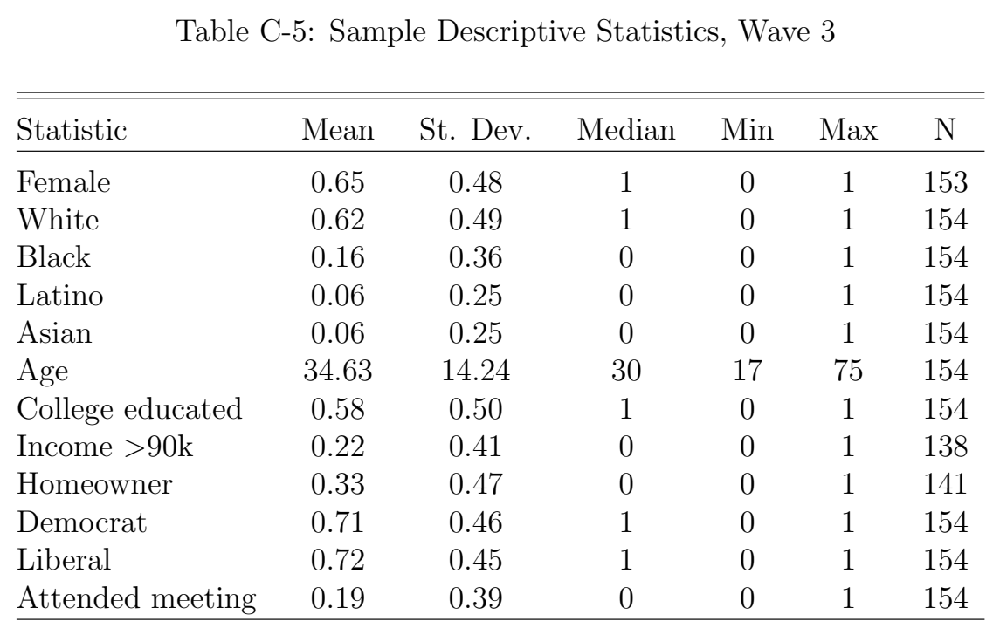

***Table C-5.*** Sample Descriptive Statistics, Wave 3

[Download data as CSV](tables/tab-05.csv)

Statistic Mean St. Dev. Median Min Max N Female 0.65 0.48 1 0 1 153 White 0.62 0.49 1 0 1 154 Black 0.16 0.36 0 0 1 154 Latino 0.06 0.25 0 0 1 154 Asian 0.06 0.25 0 0 1 154 Age 34.63 14.24 30 17 75 154 College educated 0.58 0.50 1 0 1 154 Income >90k 0.22 0.41 0 0 1 138 Homeowner 0.33 0.47 0 0 1 141 Democrat 0.71 0.46 1 0 1 154 Liberal 0.72 0.45 1 0 1 154 Attended meeting 0.19 0.39 0 0 1 154

## D Results, Tabular Form

Table H-6 displays the results of Figure H-4 in tabular form. Because of a technical error, the affordability condition of proposals was not recorded for the first 78 respondents, so the sample size decreases when adding the covariate of affordability. Further decreases occur with demographics due to respondent roll-off. Model 1 (left) includes only the randomized aspects of the proposals. Model 2 (center) includes respondent demographics. Model 3 (right) includes an interaction between homeownership status and the inclusion of affordable housing units to assess differential effect between homeowners and renters.

Table H-7 displays the results of Figure H-5 in tabular form.

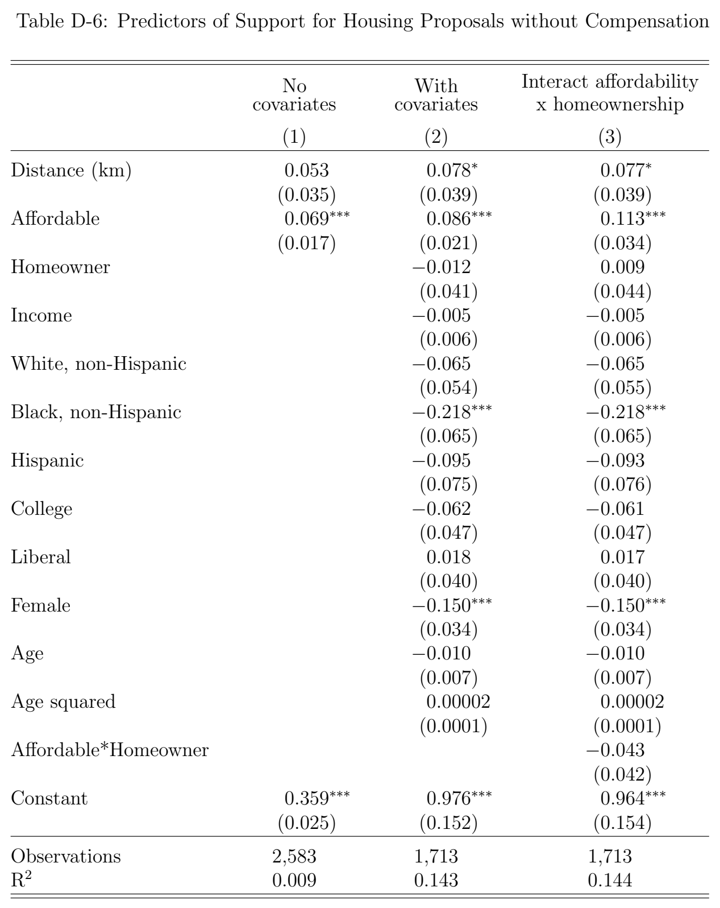

***Table D-6.*** Predictors of Support for Housing Proposals without Compensation

[Download data as CSV](tables/tab-06.csv)

No With Interact affordability covariates covariates x homeownership (1) (2) (3)

Distance (km) 0.053 0.078∗ 0.077∗

(0.035) (0.039) (0.039)

Affordable 0.069∗∗∗ 0.086∗∗∗ 0.113∗∗∗ (0.017) (0.021) (0.034) Homeowner −0.012 0.009

Income −0.005 −0.005 White, non-Hispanic −0.065 −0.065 Black, non-Hispanic −0.218∗∗∗ −0.218∗∗∗ Hispanic −0.095 −0.093 College −0.062 −0.061 Liberal 0.018 0.017 Female −0.150∗∗∗ −0.150∗∗∗ Age −0.010 −0.010 Age squared 0.00002 0.00002 Affordable*Homeowner −0.043

(0.042) Constant 0.359∗∗∗ 0.976∗∗∗ 0.964∗∗∗ (0.025) (0.152) (0.154) Observations 2,583 1,713 1,713

R2 0.009 0.143 0.144

Note: ∗p<0.05; ∗∗p<0.01; ∗∗∗p<0.001

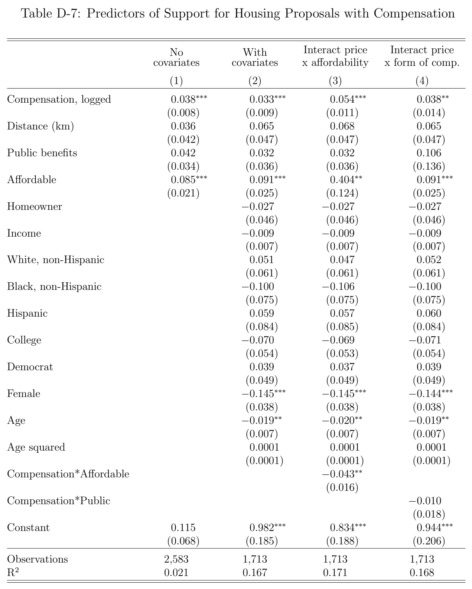

***Table D-7.*** Predictors of Support for Housing Proposals with Compensation

[Download data as CSV](tables/tab-07.csv)

No With Interact price Interact price covariates covariates x affordability x form of comp. (1) (2) (3) (4)

Compensation, logged 0.038∗∗∗ 0.033∗∗∗ 0.054∗∗∗ 0.038∗∗ Distance (km) 0.036 0.065 0.068 0.065 Public benefits 0.042 0.032 0.032 0.106 Affordable 0.085∗∗∗ 0.091∗∗∗ 0.404∗∗ 0.091∗∗∗ Homeowner −0.027 −0.027 −0.027 (0.046) (0.046) (0.046) Income −0.009 −0.009 −0.009 (0.007) (0.007) (0.007) White, non-Hispanic 0.051 0.047 0.052 (0.061) (0.061) (0.061) Black, non-Hispanic −0.100 −0.106 −0.100 (0.075) (0.075) (0.075) Hispanic 0.059 0.057 0.060 (0.084) (0.085) (0.084) College −0.070 −0.069 −0.071 (0.054) (0.053) (0.054) Democrat 0.039 0.037 0.039 (0.049) (0.049) (0.049) Female −0.145∗∗∗ −0.145∗∗∗ −0.144∗∗∗ (0.038) (0.038) (0.038) Age −0.019∗∗ −0.020∗∗ −0.019∗∗ (0.007) (0.007) (0.007) Age squared 0.0001 0.0001 0.0001 (0.0001) (0.0001) (0.0001) Compensation*Affordable −0.043∗∗

(0.016)

Compensation*Public −0.010 (0.018) Constant 0.115 0.982∗∗∗ 0.834∗∗∗ 0.944∗∗∗ Observations 2,583 1,713 1,713 1,713

R2 0.021 0.167 0.171 0.168

Note: ∗p<0.05; ∗∗p<0.01; ∗∗∗p<0.001

### D.1 Results by Homeownership Status

To better understand the mechanism, we plot the effect of compensation separately for market-rate and affordable proposals, separately among renters (Figure H-8) and homeowners (Figure H-9). The LOESS lines on each plot demonstrate the relationship between compensation and proposal support.

(a) Market-rate housing (b) Affordable housing

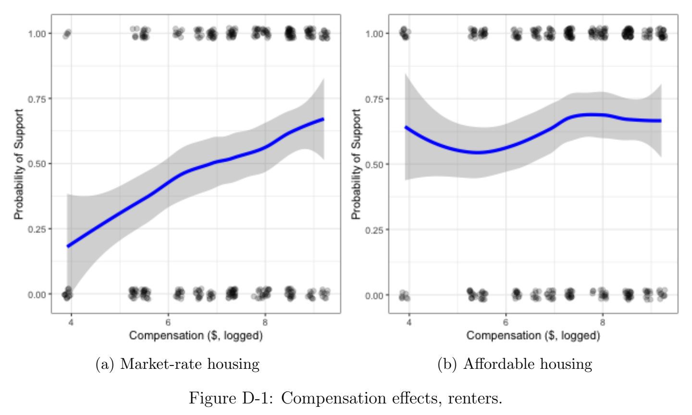

***Figure D-1.*** Compensation effects, renters.

Among renters, compensation increased support for market-rate housing. In contrast, renters supported affordable housing at a uniformly higher level, regardless of compensation level. This interaction between affordability and compensation is reflected parametrically in Table H-8, Models 1 and 2. A 100 percent increase in compensation increased support for market-rate proposals by 5.9 percentage points (p < .001), whereas the effect was null for proposals with affordable housing as evidenced by the large, statistically significant negative interaction term. These results — coupled with the positive and significant coefficient on the inclusion of affordable housing — suggest that renter support for affordable housing is higher than market-rate housing but insensitive to compensation. In contrast, support for market-rate housing was lower than affordable housing, but could be increased via financial compensation.

Similarly, among homeowners, compensation had a small effect on support for market rate housing, but it had little to no effect on affordable housing. This lack of an effect is reinforced by Table H-8, Models 3 and 4. A 100 percent increase in financial compensation increased support for market rate housing by 2.5 percentage points (p < .01). However, the interaction between compensation and affordability was negative and substantively large enough to negate any treatment effect from compensation. The effects of compensation for any type of housing are small in comparison to those observed among renters.

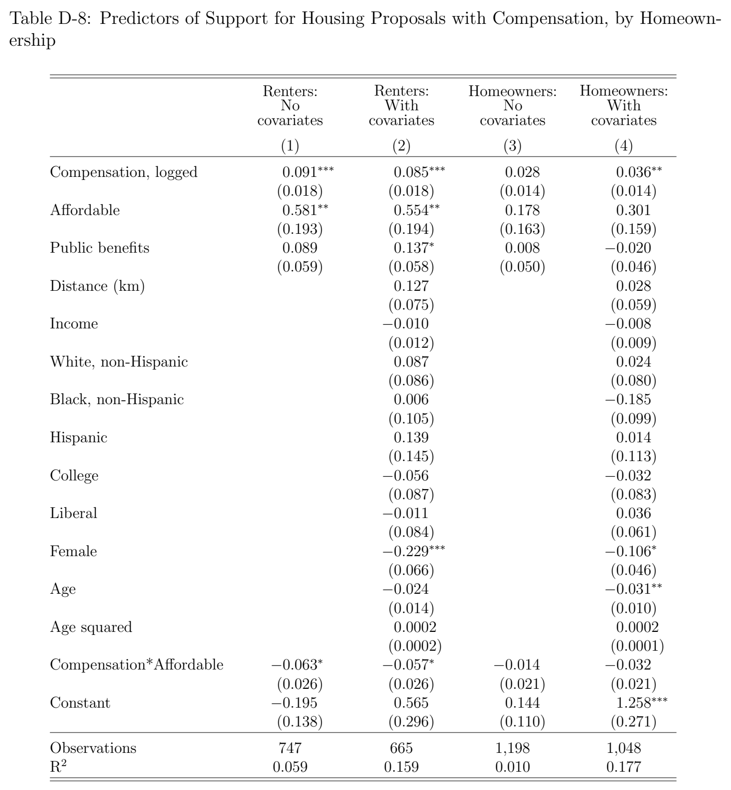

***Table D-8.*** Predictors of Support for Housing Proposals with Compensation, by Homeown- ership

[Download data as CSV](tables/tab-08.csv)

Renters: Renters: Homeowners: Homeowners: No With No With

covariates covariates covariates covariates (1) (2) (3) (4)

Compensation, logged 0.091∗∗∗ 0.085∗∗∗ 0.028 0.036∗∗ Affordable 0.581∗∗ 0.554∗∗ 0.178 0.301 Public benefits 0.089 0.137∗ 0.008 −0.020 Distance (km) 0.127 0.028 Income −0.010 −0.008 White, non-Hispanic 0.087 0.024 Black, non-Hispanic 0.006 −0.185 Hispanic 0.139 0.014 College −0.056 −0.032 Liberal −0.011 0.036 Female −0.229∗∗∗ −0.106∗ Age −0.024 −0.031∗∗ Age squared 0.0002 0.0002 Compensation*Affordable −0.063∗ −0.057∗ −0.014 −0.032 Constant −0.195 0.565 0.144 1.258∗∗∗ Observations 747 665 1,198 1,048

R2 0.059 0.159 0.010 0.177

Note: ∗p<0.05; ∗∗p<0.01; ∗∗∗p<0.001

(a) Market-rate housing (b) Affordable housing

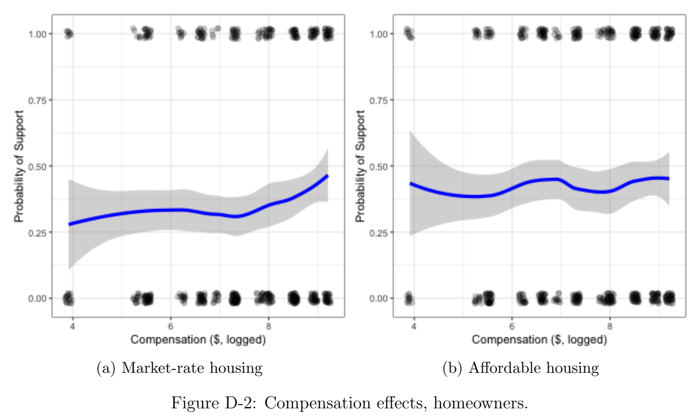

***Figure D-2.*** Compensation effects, homeowners.

Finally, we assess whether the generally weak effects of compensation that we find among homeowners could be due to an income effect, in which homeowners are wealthier and therefore less likely be persuaded by the same amount of money as renters, and because homeowner concerns are tied to their home value, and the levels of compensation offered in our experiment pale in comparison to the value of their homes. To examine this potential mechanism for our overall results, Table H-9 tests whether the effects of compensation among either renters or homeowners are driven by their income. We subset to only market-rate housing proposals for these analyses, as this was the only type of housing proposal which showed any compensation effects in our previous analyses, and interact compensation with respondents’ income. We find no evidence that respondent income moderates the effect of compensation.

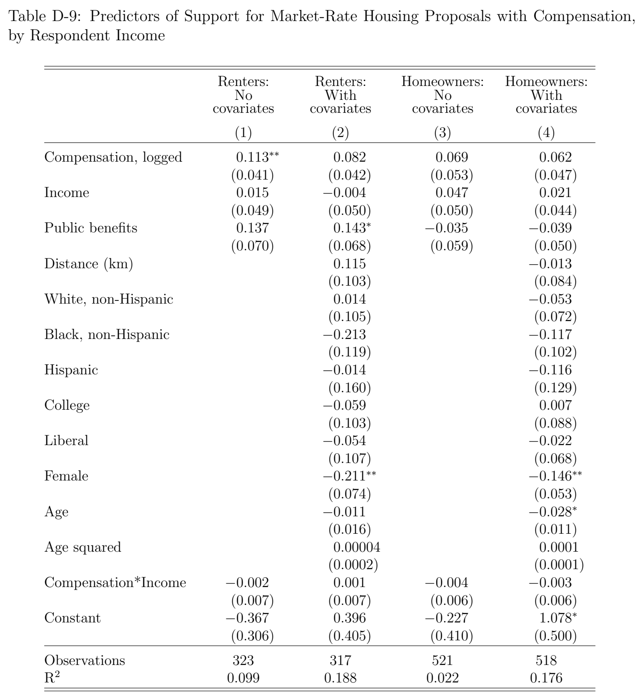

***Table D-9.*** Predictors of Support for Market-Rate Housing Proposals with Compensation, by Respondent Income

[Download data as CSV](tables/tab-09.csv)

Renters: Renters: Homeowners: Homeowners: No With No With

covariates covariates covariates covariates (1) (2) (3) (4)

Compensation, logged 0.113∗∗ 0.082 0.069 0.062 Income 0.015 −0.004 0.047 0.021 Public benefits 0.137 0.143∗ −0.035 −0.039 Distance (km) 0.115 −0.013 White, non-Hispanic 0.014 −0.053 Black, non-Hispanic −0.213 −0.117 Hispanic −0.014 −0.116 College −0.059 0.007 Liberal −0.054 −0.022 Female −0.211∗∗ −0.146∗∗ Age −0.011 −0.028∗ Age squared 0.00004 0.0001 Compensation*Income −0.002 0.001 −0.004 −0.003 Constant −0.367 0.396 −0.227 1.078∗ Observations 323 317 521 518

R2 0.099 0.188 0.022 0.176

Note: ∗p<0.05; ∗∗p<0.01; ∗∗∗p<0.001

## E Alternative Modeling Approaches

Our pre-analysis plan stated that we would use multinomial and mixed logit models (Helveston, 2020). Revisiting the literature, this approach is ill-suited for our data structure (e.g. Alvarez and Nagler, 1998; McFadden and Train, 2000). Both choice-based logit models are designed for outcome variables that represent choices between multiple options. In our experiment, this could have been accomplished if respondents had chosen between, for instance, two different development proposals with their characteristics randomized, similar to a conjoint design.

In contrast, our respondents evaluated and expressed their support for a single proposal at a time rather than choosing between alternatives. To adopt our data structure for a choicebased logit model would require us to generate an alternative choice from the status quo. For example, voting against the building proposal would be coded as the equivalent of voting for a building similar to the status quo: a market-rate development which would provide $0 of compensation to the respondent. This hypothetical, synthetic choice is theoretically difficult to justify. In retrospect, our design is instead suited for an OLS approach. Using OLS, we test the same hypotheses and use the controls as specified in our pre-analysis plan, with the benefit of requiring fewer assumptions (Gomila, 2021).

Still, in the interest of full transparency, we reproduce our results using logit models. Specifically, we use multinomial logits. The mixed logit model listed in the pre-analysis plan is designed to test for heterogeneity in preferences across respondents. Within our results, this approach exhausts statistical power to point of being uninformative, whereas the multinomial logit still captures differences in choice-based decisionmaking. Additionally, because logit choice probabilities are unintuitive, we convert the coefficients into predicted probabilities of support for proposals at various levels of compensation. By plotting the expected support probability across the range of compensation offered, we show variation in the effectiveness of compensation based on traits of the respondent and building proposal. Following the preanalysis plan, Figure H-10 shows how the effect of compensation varies based on the proximity of the development proposal to the respondent. The figure bundles proximity based on developments “near” the respondent (less than the median distance, 540 meters away) and “far” from the respondent (greater than 540 meters away). We find no evidence that the effectiveness of price varies by proximity. Instead, we see a uniform increase in the expected probability of support for new development as the compensation offered to respondents increases from $50 to $10,000.

Figure H-11 shows how the effect of compensation varies based on the affordability of the proposed housing. As we show in Figure H-6, the effect of compensation is exclusively found in response to proposals for new market-rate housing. In contrast, proposals which include affordable housing do not experience an increase in expected support as compensation increases. Additionally, supporting our findings in Figure H-5, the average level of support is higher for affordable housing compared to market-rate housing.

Figure H-12 shows how the effect of compensation varies based on the tenancy status of the respondent. While renters are consistently more supportive of new housing compared to homeowners, the effect of compensation — expressed here as the slope of each line — is positive for both homeowners and renters. However, as shown in the OLS results in Table H-8, renters are more responsive to compensation compared to homeowners.

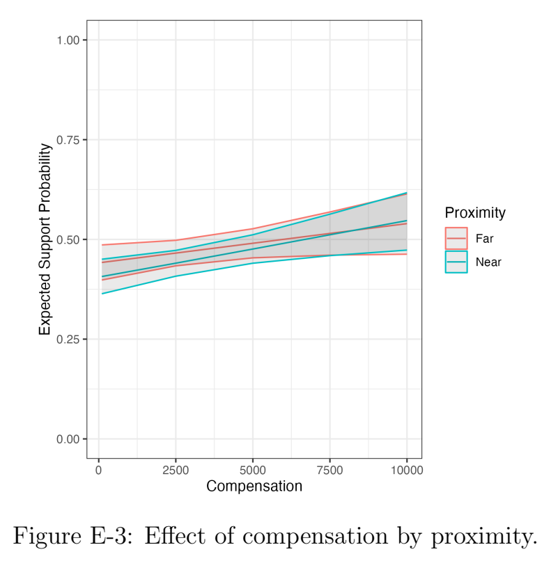

***Figure E-3.*** Effect of compensation by proximity.

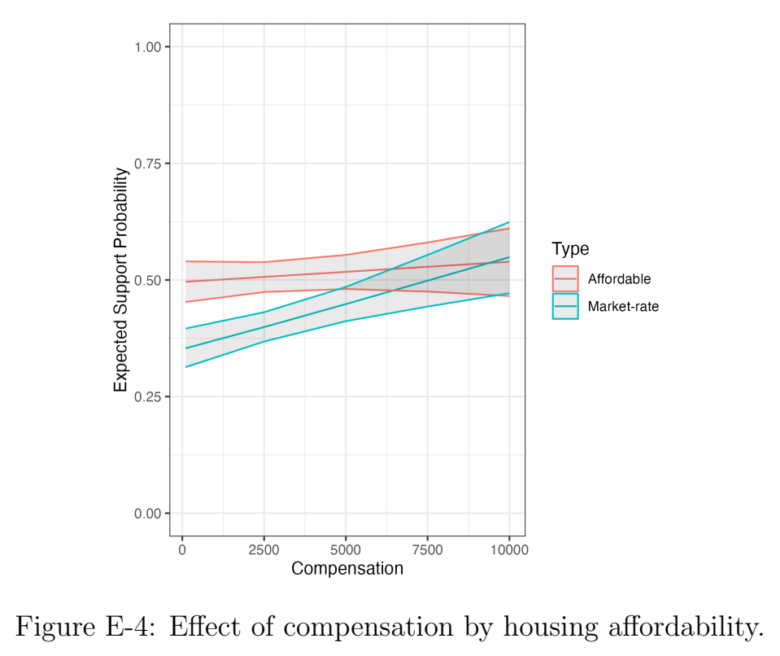

***Figure E-4.*** Effect of compensation by housing affordability.

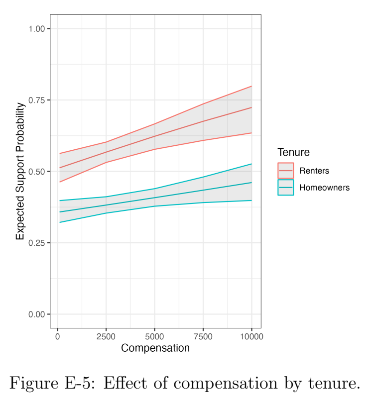

***Figure E-5.*** Effect of compensation by tenure.

Figure H-13 shows how the effect of compensation varies by the affordability of the proposed housing, but looking exclusively among renters. Much of the gentrification literature argues that renters are generally more averse towards market-rate housing compared to affordable housing (Hankinson, 2018; Marble and Nall, 2021). Consequently, we expected renters to require more compensation in exchange for supporting market-rate housing compared to affordable housing. We find that, similar to the full sample results in Figure H-11, increased compensation generally only increases support for market-rate housing. Likewise, average support for affordable housing is higher compared to market-rate housing. In general, this supports our hypothesis that renters require more compensation for a market-rate housing proposal to reach similar expected probabilities of support as an affordable housing development.

Figure H-14 shows how the effect of compensation varies based on the form of the compensation offered to respondents. “Private” compensation was offered a direct payment to the respondent, whereas “public” compensation was offered to the community as an equivalent investment in nearby parks and streets. Matching our OLS results in Table H-8, the form of compensation does not affect respondent support for the development proposal. And although it appears that additional compensation may only be effective for private, direct payments, this interaction is not statistically significant in our OLS models (Table H-8).

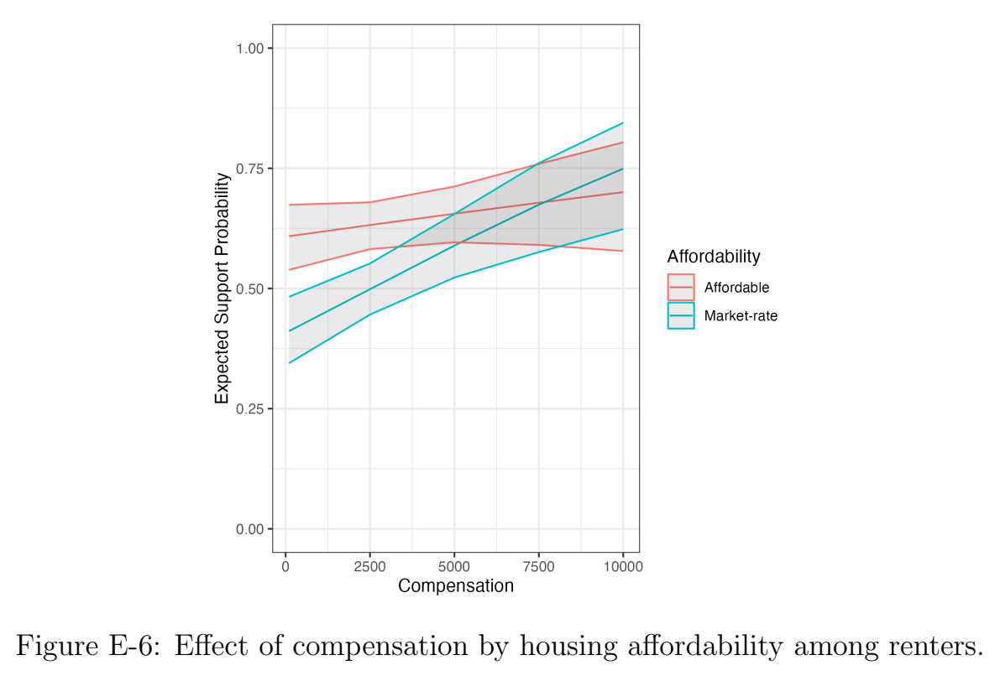

***Figure E-6.*** Effect of compensation by housing affordability among renters.

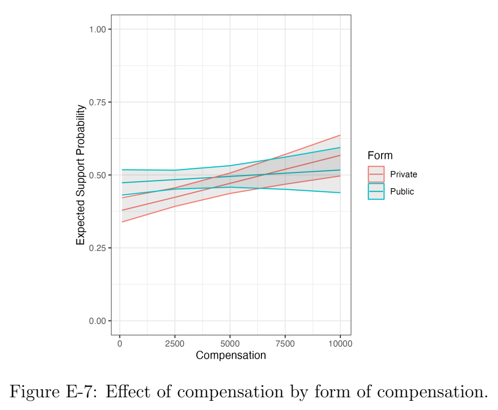

***Figure E-7.*** Effect of compensation by form of compensation.

## F Survey Instrument

Users will follow a link to the interface where they will begin the survey. Following a consent form, respondents will see a screener and two attention checks.

1. “For our research, careful attention to survey questions is critical! We thank you for your care.”

• I understand

• I do not understand

2. “People are very busy these days and many do not have time to follow what goes on in the government. We are testing whether people read questions. To show that you’ve read this much, answer both ‘extremely interested’ and ‘very interested.”’

• Extremely interested

• Very interested

• Moderately interested

• Slightly interested

• Not at all interested

3. “To start, which city/town do you live in?” • Boston

• Brookline

• Cambridge

• Chelsea

• Everett

• Somerville

• Winthrop

• Other

### 4. User identifies their home

• “First, we need to know where you live in Boston. Please enter your address. Your address will not be shared with anyone. If you would not like to share your address, please enter your ZIP code.”

• If street address entered, User is shown their neighborhood (3/4 mile radius of address) with a pin dropped on their address. If ZIP code entered, User is shown their ZIP code and asked to indicate their home or the nearest intersection.

### F.1 Individual proposals

“Next, you will be asked to share your opinion about hypothetical housing development proposals in your neighborhood. These proposals are not real.

However, the findings of this study will be presented to the City of Boston to help them learn about what residents like you think about housing. To capture the most accurate data, we ask you to thoughtfully consider these proposals as if they were real.”

Each proposal features:

• Current building

– Address of property

– Google Street View image of property currently

– Current number of floors and units

• Proposed building

– Number of floors (2x current building) and units (3x current building) – Rendering of the mass of the new building

– Randomization of 50% affordable housing or 100% market-rate housing • “Do you support or oppose replacing the current building with the proposed building?” – Strongly oppose

– Oppose a little

– Neither support nor oppose

– Support a little

– Strongly support

• For proposal 1 out of 5: “Using at least 5 words, why do you support or oppose this proposal?” Answer via text-box.

• Willingness-to-Accept Experiment - User will be randomly assigned to either the direct payment condition or the public goods condition. Whatever the User is assigned for the first proposal they will maintain for all 5 proposals to eliminate confusion. Compensation values will randomly vary from the following set: $50, $200, $500, $1000, $1500, $2000, $5000.

– Direct payment text: “Suppose your neighborhood could vote on whether this proposal should be built. If the proposal passes, the developer would contribute money to the neighborhood around the property. The money would be distributed as a one-time cash payment such that each person, including you, would receive $XXX. How would you vote on this proposal?”

– Public goods text: “Suppose your neighborhood could vote on whether this proposal should be built. If the proposal passes, the developer would contribute money to the neighborhood around the property. The money would be spent on park and street improvements worth about $XXX per neighborhood resident. How would you vote on this proposal?”

∗ “Yes, I would vote in favor of the proposal”

∗ “No, I would vote against the proposal”

– For proposal 1 out of 5: “Using at least 5 words, how did the financial compensation affect your support for the proposal?” Answer via text-box.

### F.2 Demographics

“Now I am going to ask a few questions about you.”

1. “In the past 12 months, have you attended a Boston political meeting (such as school board or city council) or a community forum?”

• Yes

• No

2. “How long have you lived in Boston, in years?” • Less than a year

• 1-3 years

• 4-8 years

• 8 years or longer

3. “How long have you lived at your current address, in years?” • Less than a year

• 1-3 years

• 4-8 years

• 8 years or longer

4. “Do you or someone you live with own the place in Boston where you are living now, or do you rent?”

• Own

• Rent

• Other

5. “Thinking back over the last year, what was your household’s annual income?” • None or less than $19,999

• $20,000 to $39,999 • $40,000 to $49,999 • $50,000 to $59,999 • $60,000 to $69,999 • $70,000 to $89,999 • $90,000 to $119,999 • $120,000 to $149,999 • $150,000 to $199,999 • $200,000 to $249,999 • $250,000 to $349,999 • $350,000 to $499,999 • $500,000 or more

• Don’t know

• Prefer not to say

6. “What is the highest level of education you have completed?” • Did not graduate from high school • High school graduate

• Some college, but no degree

• 2-year college degree

• 4-year college degree

• Postgraduate degree (MA, MBA, MD, JD, PhD, etc.) 7. “What is your gender?”

• Male

• Female

• Other

8. “What year were you born?” - dropdown list 9. “What racial or ethnic group(s) best describe you? Select all that apply.” • White

• Black or African-American

• Hispanic or Latino

• Asian or Asian-American

• Native American

• Middle Eastern

• Other

10. “In general, do you think of yourself as...” • Liberal

• Conservative

• Moderate

• Haven’t thought about it much

11. IF ‘Liberal’: “Would you call yourself a strong liberal or not a very strong liberal?” • Strong liberal

• Not very strong liberal

12. IF ‘Conservative’: “Would you call yourself a strong liberal or not a very strong conservative?”

• Strong conservative

• Not very strong conservative

13. IF ‘Moderate’ or ‘Haven’t thought about it much’: “Do you think of yourself as closer to liberals or conservatives?”

• Closer to liberals

• Closer to conservative

• Neither

14. “In general, do you think of yourself as...” • Democrat

• Republican

• Independent

• Other party

15. IF ‘Democrat’: “Would you call yourself a strong Democrat or not a very strong Democrat?”

• Strong

• Not very strong

16. IF ‘Republican’: “Would you call yourself a strong Republican or not a very strong Republican?”

• Strong

• Not very strong

17. IF ‘Independent’ or ‘Other party’: “Do you think of yourself as closer to the Republican Party or to the Democratic Party?”

• Closer to the Democratic Party

• Closer to the Republican Party

• Neither

18. “What else should we know about your opinion on housing prices and new development in your neighborhood and in Boston?” Answer via text-box.

19. “Do you have any other comments for us about this topic and the survey?” Answer via text-box.

## G Pre-Analysis Plan

Included below are the hypotheses we test as well as our analytical strategy for testing each hypothesis as pre-registered with EGAP prior to data collection. Elements of the pre-analysis plan (the study’s theory, experimental design, and survey instrument) that are discussed or included elsewhere in the manuscript are not reproduced below but are included in the PAP filed with EGAP.

### G.1 Individual Proposals

This experimental module combines a location-based measure of NIMBYism with a Willingnessto-Accept (WTA) experiment. The WTA experiment estimates the median monetary value at which respondents are indifferent to a nearby increase in residential density. Respondents are offered an amount of compensation in exchange for supporting a new housing development proposal. By randomly varying the amount of compensation offered, we are able to capture the causal effect of different compensation levels on respondent support.

Using a respondent’s location, the survey randomly selects 5 housing proposals that are within 1/2 mile of the respondent’s home. For each proposal, respondents are shown images of the existing development and the proposed development. Each development shows the number of units as well as the share of units set aside for low-income housing voucher holders. Respondents are asked: “Do you support or oppose replacing the current building with the proposed building?” Support is captured using a 5-point Likert scale from “Strongly oppose” to “Strongly support.”

Next respondents are offered an amount of compensation in the form of either a personal payment or a public goods investment, randomized at the individual-level but held constant across each proposal the respondent views. Respondents select either a “Yes” or “No” response in favor of the proposed development combined with the compensation. Respondents repeat this exercise for each of the 5 proposals.

G.1.1 Hypotheses

Our exploratory hypotheses are:

Hypothesis 1 (H1): Compensation will be positive correlated with proximity.

Hypothesis 2 (H2): Compensation will be higher for developments with 50% affordable housing compared to those solely composed of market-rate units.

Hypothesis 3 (H3): Homeowners will require more compensation than renters.

Hypothesis 4 (H4): Renters require more compensation when the housing is all marketrate rather than 50% affordable.

Hypothesis 5 (H5): Compensation will be higher for public goods investments than for direct payments.

G.1.2 Measures and Index Construction

The outcome variable (“Choice”) is 1 if the respondent votes in favor of the proposal when coupled with the compensation and 0 otherwise.

G.1.3 Estimation Procedure

We estimate multinomial and mixed logit models on choice data using a random utility model specified in the willingness-to-pay (WTP) space via the logitr package (Helveston, 2020). Compensation is a fixed parameter, whereas the experimental parameters (distance from the respondent’s location, affordability share, and form of compensation) will be modeled as normally distributed across the population. The model will include controls listed earlier. From this model, we also simulate shares of support for housing over a wide array price points.

The following approaches will be used to test each hypothesis:

H1: Regress choice on compensation, proximity, affordability, and form of compensation using a mixed logit model including controls.

H2: Regress choice on compensation, proximity, affordability, and form of compensation using a mixed logit model including controls.

H3: Regress choice on compensation, proximity, affordability, and form of compensation using a mixed logit model including controls.

H4: Regress choice on compensation, proximity, affordability, and form of compensation using a multinomial logit model including controls, interacting affordability with homeownership status.

H5: Regress choice on compensation, proximity, affordability, and form of compensation using a mixed logit model including controls.

## H Exploratory Analyses

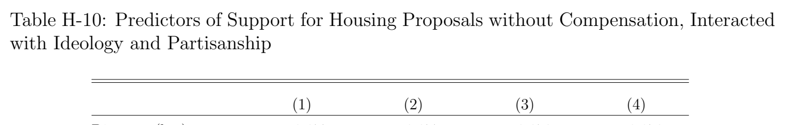

***Table H-10.*** Predictors of Support for Housing Proposals without Compensation, Interacted with Ideology and Partisanship

(1) (2) (3) (4)

Distance (km) 0.077∗ 0.077∗ 0.073 0.073 Affordable 0.101∗ 0.092∗∗∗ 0.047 0.078∗∗ Liberal 0.027

(0.045)

Ideology −0.013

(0.023)

Democrat 0.065

(0.040)

Party ID −0.035 (0.027) Homeowner −0.012 −0.012 −0.011 −0.014 Income −0.005 −0.005 −0.006 −0.005 White, non-Hispanic −0.065 −0.065 −0.084 −0.072 Black, non-Hispanic −0.218∗∗∗ −0.218∗∗∗ −0.234∗∗∗ −0.222∗∗∗ Hispanic −0.095 −0.095 −0.094 −0.093 College −0.062 −0.062 −0.072 −0.065 Female −0.150∗∗∗ −0.150∗∗∗ −0.154∗∗∗ −0.153∗∗∗ Age −0.010 −0.010 −0.008 −0.009 Age squared 0.00002 0.00002 0.00000 0.00001 Affordable*Liberal −0.017

(0.047)

Affordable*Ideology 0.009

(0.023)

Affordable*Democrat 0.051

(0.044)

Affordable*Party ID −0.012 (0.032) Constant 0.970∗∗∗ 0.984∗∗∗ 0.939∗∗∗ 0.966∗∗∗ Observations 1,713 1,713 1,713 1,713

R2 0.144 0.144 0.152 0.147

Note: ∗p<0.05; ∗∗p<0.01; ∗∗∗p<0.001

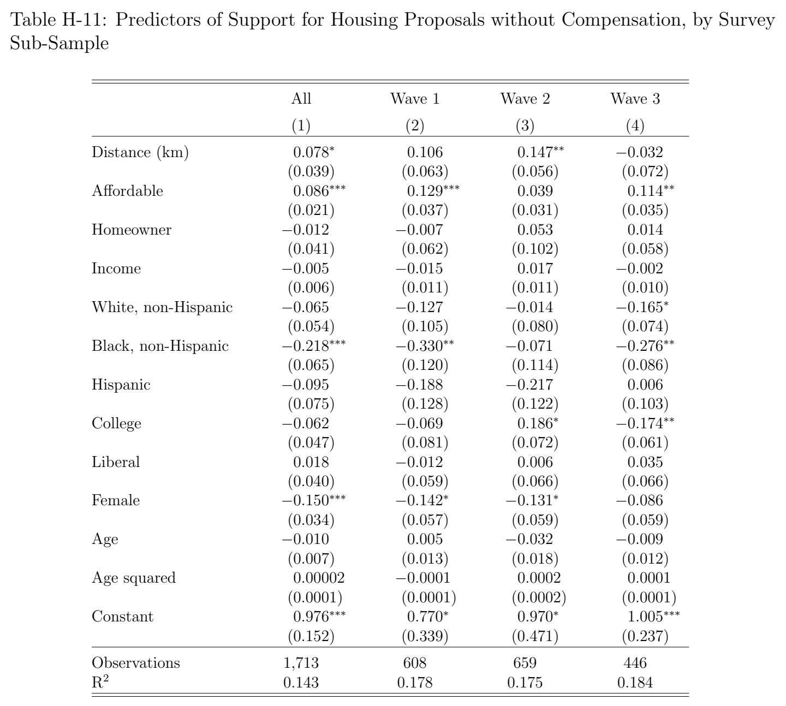

***Table H-11.*** Predictors of Support for Housing Proposals without Compensation, by Survey Sub-Sample

[Download data as CSV](tables/tab-11.csv)

All Wave 1 Wave 2 Wave 3 (1) (2) (3) (4)

Distance (km) 0.078∗ 0.106 0.147∗∗ −0.032 Affordable 0.086∗∗∗ 0.129∗∗∗ 0.039 0.114∗∗ Homeowner −0.012 −0.007 0.053 0.014 Income −0.005 −0.015 0.017 −0.002 White, non-Hispanic −0.065 −0.127 −0.014 −0.165∗ Black, non-Hispanic −0.218∗∗∗ −0.330∗∗ −0.071 −0.276∗∗ Hispanic −0.095 −0.188 −0.217 0.006 College −0.062 −0.069 0.186∗ −0.174∗∗ Liberal 0.018 −0.012 0.006 0.035 Female −0.150∗∗∗ −0.142∗ −0.131∗ −0.086 Age −0.010 0.005 −0.032 −0.009 Age squared 0.00002 −0.0001 0.0002 0.0001 Constant 0.976∗∗∗ 0.770∗ 0.970∗ 1.005∗∗∗ Observations 1,713 608 659 446

R2 0.143 0.178 0.175 0.184

Note: ∗p<0.05; ∗∗p<0.01; ∗∗∗p<0.001

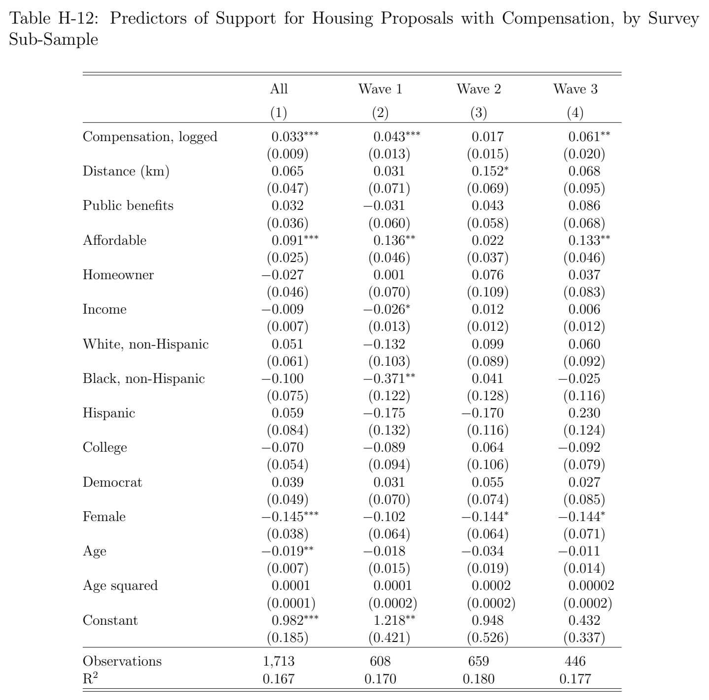

***Table H-12.*** Predictors of Support for Housing Proposals with Compensation, by Survey Sub-Sample

[Download data as CSV](tables/tab-12.csv)

All Wave 1 Wave 2 Wave 3 (1) (2) (3) (4)

Compensation, logged 0.033∗∗∗ 0.043∗∗∗ 0.017 0.061∗∗ Distance (km) 0.065 0.031 0.152∗ 0.068 Public benefits 0.032 −0.031 0.043 0.086 Affordable 0.091∗∗∗ 0.136∗∗ 0.022 0.133∗∗ Homeowner −0.027 0.001 0.076 0.037 Income −0.009 −0.026∗ 0.012 0.006 White, non-Hispanic 0.051 −0.132 0.099 0.060 Black, non-Hispanic −0.100 −0.371∗∗ 0.041 −0.025 Hispanic 0.059 −0.175 −0.170 0.230 College −0.070 −0.089 0.064 −0.092 Democrat 0.039 0.031 0.055 0.027 Female −0.145∗∗∗ −0.102 −0.144∗ −0.144∗ Age −0.019∗∗ −0.018 −0.034 −0.011 Age squared 0.0001 0.0001 0.0002 0.00002 Constant 0.982∗∗∗ 1.218∗∗ 0.948 0.432 Observations 1,713 608 659 446

R2 0.167 0.170 0.180 0.177

Note: ∗p<0.05; ∗∗p<0.01; ∗∗∗p<0.001