# “City Limits” of Representation: How Perceptions of Public Opinion and Fiscal Constraints Shape Legislator Housing Attitudes

Michael Hankinson† Adrian Pietrzak‡

June 5, 2026

Abstract

Cities in the United States face a housing affordability crisis, driven in part by policies which restrict the supply of housing. To what extent is this a political problem, driven by challenges to representation? Are the housing policy preferences of elected officials representative of the preferences of their constituents? In an elite survey of local elected officials, we compare support for a pro-housing zoning reform, affordable housing tax incentives, and rent control against constituent preferences for the same policies. While elites are responsive to public opinion, there is substantial bias which leads to mixed congruence. For one, elites significantly underestimate public support for these housing reforms. Instead, legislator perceptions largely align with the preferences of neighborhood defenders, who are both more active in local politics and tend to oppose changes compared to the housing policy status quo. Additionally, legislators’ responsiveness to even perceived public opinion is substantially biased by their expectations of the policies’ fiscal impacts. Together, these findings unite theories of representation with fiscal federalism, centering the beliefs and behaviors of legislators in local policymaking and the political origins of the housing affordability crisis.

Word count: ∼9,000, excluding References

∗Authors names are listed alphabetically. Special thanks to Aleida Armijos and Massimo Lagazzi for research assistance. This research was deemed exempt by the GW IRB, #NCR 256679.

†Assistant Professor, Department of Political Science, George Washington University. hankinson@gwu.edu ‡PhD Candidate, Department of Politics, Princeton University. ap1296@princeton.edu

Note: This draft focuses on results from an initial sample of local elected officials. Results including a sample of state legislators will be included in June 2026. Additionally, we are conducting an expanded survey of local elected officials in May 2026.

Many U.S. cities and towns are facing a housing affordability crisis. The cause of this crisis has been linked to the regulations that restrict the supply of new housing (Glaeser, Gyourko and Saks 2005; Glaeser and Gyourko 2018). Despite this knowledge, why are housing regulations difficult to reform? One possibility is public opinion. An increasing body of scholarship has demonstrated that the public often dislikes new housing, especially if it proposed in one’s immediate community (Elmendorf, Nall and Oklobdzija 2025; Hankinson 2018; Trounstine 2023). However, public opinion research has also shown many pro-housing reforms to be popular (Elmendorf, Nall and Oklobdzija 2024; Horowitz and Kansal 2023).

Another possibility lies in the beliefs and decision-making processes of state and local elected officials—those most responsible for local land-use regulations. While local policies and spending levels in American cities have been found to be responsive to public opinion (Kogan and Einstein 2016; Tausanovitch and Warshaw 2014), these studies have not examined housing policies specifically. In addition to local officials high degree of control over the policy domain, housing policy is unique in that attitudes often cut across traditional partisan affiliation (Marble and Nall 2021), potentially complicating local responsiveness. Moreover, these studies miss the electoral connection, that is, the attitudes of public officials and their perceptions of the public which have been found to matter at other levels of government (e.g., Broockman and Skovron 2018). While recent research in the Canadian context does link public opinion about housing to the policy preferences of local elected officials (Rivard and Lucas 2024), this comparison does not assess the underlying mechanisms of perceptions and may not generalize to the U.S. context.

In this study, we ask: are the housing policy positions of elected officials congruent with public attitudes? If not, what are the drivers of (in)congruence? One possibility is perceptions of public opinion. Do elected officials even have accurate perceptions of their own residents’ attitudes? If not, does variation in this misperception align with common theories of local politics: such as the role of local interest groups (such as developers or unions (Anzia 2022; Hankinson, Magazinnik and Weissman 2024)) and highly active subsets of the public (or issue publics, such as so-called

“neighborhood defenders” who attend local meetings about housing (Einstein, Glick and Palmer 2019))? Another possibility is structural constraints stemming from the logic of federalism. Local politicians have been theorized to be highly constrained in their ability to pass (often popular) policies if they threaten the fiscal stability of their municipality (Peterson 1981). Regardless of the accuracy of their perception of public opinion, do elected officials deviate from public preferences when faced with fiscal concerns?

Using a combination of in-person and online surveys, we ask over 800 state and local elected officials’ how they would vote on three housing policies: two supply-side policies (zoning reform and tax incentives for affordable housing) and one demand-side policy (rent control). We then estimate district-level public opinion for these policies using the 2024 Cooperative Election Study (CES) for the supply-side policies and a collection of surveys for the rent-control policy. Our estimation ranges from a grand mean approach of sampled elected officials and their constituents to district-level estimation via multi-level regression and poststratification (MRP).

We introduce a new framework to understand democratic responsiveness, and assess both external responsiveness—the relationship between an officials’ position and our estimate of their constituents’ actual public opinion—and internal responsiveness—the relationship between an officials’ position and their perception of public opinion in their districts. While most evaluations of representation focus on congruence and external responsiveness (Caughey and Warshaw 2022; Einstein and Kogan 2016; Lax and Phillips 2012; Tausanovitch and Warshaw 2014, e.g., ), internal responsiveness removes the role of misperceptions of public opinion. This allows us to test if elected officials are responsive to their internal perceptions of public opinion, and if so, if that responsiveness is biased (that is, if elected officials are willing to pass policies with either small minorities or super majorities of perceived support). Finally, we build theory for the quality of local representation using a number of additional questions we asked elected officials about how they evaluate policy in their districts.

First, we explore representation as both policy congruence—the degree to which politicians’ support for policies aligns with their constituents’ support (Canes-Wrone 2015)—and external responsiveness—the degree to which politician support increases with public opinion (Achen 1978; Matsusaka 2026). For pro-housing zoning reform, local officials are slightly more supportive of the reform than their constituents. For affordable housing tax incentives, local officials exhibit high

levels of congruence, expressing support for the policy at a rate similar to the public. For rent control, support among elected officials substantially lags the high support found among constituents, leading to very low levels of policy congruence. Zoning reform shows a high level of external responsiveness, but legislator support for affordable housing incentives and rent control substantially lags public opinion. These results suggest a mixed picture of representation in local housing policy. One source of bias in external responsiveness is the accuracy of legislators’ perceptions of public opinion. We ask politicians about their perceptions of public opinion on the same three policies and compare these to MRP estimates of local public opinion. Politicians systematically underestimate public support for all three policy reforms by wide margins ranging a minimum of 11 points for zoning reform to a maximum of 39 points for rent control. This misperception is likely due to unrepresentative contact. We show that politicians’ perceptions of public opinion are more closely aligned with the attitudes of highly active and overrepresented subsets of the public, specifically “neighborhood defenders” who often attend local meetings about housing and vote in local elections at high rates (Einstein, Glick and Palmer 2019; Fischel 2001). Furthermore, these misperception are smaller in contexts where housing policy is a more salient issue, places where constituents beyond neighborhood defenders are likely to voice their opinions on the policies.

The second source of bias in external responsiveness is the quality of internal responsiveness— the extent to which elected officials vote in line with what they believe their constituents’ prefer. In some ways, this is a more accurate measure of legislators’ responsiveness to public opinion, as it removes the influence of misperceptions. We posit that officials deviate from perceived public opinion as a function of their expectations of both accountability (i.e., the probability that they will be punished for deviation) and the fiscal consequences of the policy. We demonstrate that all three policy areas are responsive to perceived public opinion, but have some degree of bias. Legislators match (perceived) public opinion on rent control, but lead (perceived) public opinion on zoning reform and affordable housing incentives.

To understand why politicians deviate from even perceived public opinion, we explore the relative influence of local interests (e.g. business interests, non-profits), asking politicians to rank their importance. We find little evidence that ranking various interest groups above public opinion drives this lower quality representation. Rather, we show that expectations over the fiscal impact of policies significantly biases internal responsiveness. For example, zoning reform is generally

viewed as being budget positive, which may be why elected officials lead perceived public opinion.1 Compared to those who view a policy as budget neutral, those who view a policy as budget negative are more likely to lag public opinion. In contrast, those who view a policy as budget positive behave similarly as those those view it as budget neutral. These findings suggest that federalism-induced budget constraints (Peterson 1981) and policy effects moderate responsiveness, leading elected officials to substantially deviate from public opinion.

This study provides three contributions to our understanding of representation and local politics. First, we observe the quality of responsiveness—both internal and external—for high-profile housing policy. Politicians are highly responsive to public opinion, but that responsiveness has bias, leading to only occasional congruence with public opinion. Second, we demonstrate that this bias is built, in part, on a foundation of misperceptions of public opinion. Politicians do not believe that the public supports these three policies. These misperceptions are likely driven in part by uneven local participation. Local officials believe that public opinion is closer to that of neighborhood defenders, leading to an underestimation of support for both zoning reform and affordable housing. Thus, the congruence we do find is largely coincidental representation. Third, by assessing internal responsiveness, we show that the continued importance of fiscal constraints and budgetary thinking among elected officials may bias responsiveness. For local officials, expectations about a policy’s fiscal impact may be just as important as electoral considerations, especially for a policy with direct fiscal impacts, such as local tax incentives. Together, these results bridge theories of representation and fiscal federalism by centering the perspective of the decision makers themselves.

## Theory

A question at the core of democratic theory is whether elected officials represent the policy preferences of their constituents. A growing empirical literature finds that, on average, public policy respond to mass preferences of Americans at the state and local level (Caughey and Warshaw 2022; Einstein and Kogan 2016; Tausanovitch and Warshaw 2014). However, responsiveness is often biased, with policies often requiring super-majorities in public opinion for about even-chances of passage, evidence of policy incongruence (Lax and Phillips 2012). Additionally, models of represen- 1In contrast, affordable housing tax incentives and rent control have less clear explanations which we explore in the Discussion.

tation underlying these findings rely on politicians responding to public opinion. While this empirical literature finds alignment between mass preferences and enacted policies, it does not directly capture the role of elected officials in understanding and responding to public opinion. Moreover, there is a strong reason to believe elite models of responsiveness differ at the sub-national level. While politicians at higher levels of government have many signals of public opinion, including public opinion polling, state and local elected officials representing smaller geographies lack these tools and instead rely on information that may be more biased, such as neighborhood meetings or constituent contact (Einstein, Glick and LeBlanc 2017).

To unpack this electoral connection, we examine public opinion and legislator attitudes in the context of housing policy. Cities and states exert substantial autonomy in their control over housing policy, from regulations to subsidization. Furthermore, these policies have been identified as key contributors to the housing affordability crisis (Glaeser, Gyourko and Saks 2005; Glaeser and Gyourko 2018). Efforts to reform these policies often face strong political opposition, and preferences over housing policy often cut across traditional party cleavages (Marble and Nall 2021). Thus, understanding the connection between mass preferences and legislator opinion is a meaningful component of unpacking the obstacles to reform.

The first component of this connection is mass preferences towards housing policy. Surveys find that most voters support broader reforms to regulate the housing market and expand the supply of affordable housing (Elmendorf, Nall and Oklobdzija 2024; Mendelberg, Novoa and Pietrzak 2025). However, this support does not extend to policies that would increase the supply of marketrate housing (Elmendorf, Nall and Oklobdzija 2024). Likewise, voters often oppose changes in their immediate community, reflecting NIMBY (“not in my backyard”) politics (Larsen and Nyholt 2024; Trounstine 2023). These NIMBY attitudes are often held by those most active in local politics, leading them to have a potentially out-sized influence on local policymaking (Einstein, Glick and Palmer 2019).

Despite their pride in knowing their constituents (Mayhew 1974), political elites have been found to often misperceive public opinion among their constituents. For example, Broockman and Skovron (2018) find that American state legislators overestimate the conservatism of their districts, likely due to the higher levels of political contact from conservative constituents (particularly during the early 2010’s). Thus, perceptions of opinion can be biased based on differential levels of political

participation. At the local level, such biases are found in higher turnout among white voters (Hajnal and Trounstine 2005), homeowners (Hall and Yoder 2022), and older residents (Einstein et al. 2025). On housing policy, these factors overlap in the intense political mobilization of neighborhood defenders, a group typically composed of older homeowners who oppose reforms which would change the feel of their communities via more housing development (Einstein, Glick and Palmer 2019). These neighborhood defenders not only vote at higher rates but also participate in non-voting settings, such as public hearings and protests (Sahn 2025), all ways of effectively delivering their policy stances to elected officials, who often cite meeting comments as their primary source of information about public opinion Einstein, Glick and LeBlanc (2017).

Still, the risk of misperceptions is limited by issue salience and the importance of other factors in local decision making. In places where housing affordability has greater political salience, there is likely to be both greater mobilization and more attention paid by public officials to these concerns. As mobilization increases, participation tends to become more representative, reducing the risk of bias (Hajnal and Trounstine 2005). Furthermore, if politicians feel that housing is a top concern among the public, they may be more willing to invest in learning about public opinion rather than relying on the loudest voices to inform their perceptions.

As for other influences, public opinion is just one factor in electoral decision making. Elected officials also have to weigh the considerations of interest groups, from the business community to non-profits and labor unions (Anzia 2022). These include institutions and champions of citywide growth interests (Logan and Molotch 1987), like large employers and hospitals who may see new workforce housing as critical for their long-term success. General fiscal constraints also weigh heavily. Policies leading to net costs over added tax revenue risk long-term debt, risking the exit of capital and residents (Tiebout 1956). These concerns are believed to weigh heavily on the minds of elected officials, limiting their responsiveness to public opinion and prioritizing citywide growth and fiscal objectives (Peterson 1981).

The nexus of these forces in local representation can be seen in research related to this study. Rivard and Lucas (2024) conducted similar research on a nationally representative survey of Canadians and 700 local elected officials. They found the policy preferences of elected officials to be largely aligned with the public. However, rather than finding greater congruence with homeowners or the highly educated, Rivard and Lucas (2024) find that politicians agree with more ideolog-

ically proximate constituents. These results paint a positive picture of representation, implying that the true obstacle to housing reform are the conflicts that occur due to hyper-local opposition and mobilization, not broader representation misalignment. However, this study leaves open many questions. Is this representation due politicians accurately perceiving and acting in alignment with the preferences of their voters, or is it coincidental? Given that housing policy often crosses partisan cleavages in the United States (Marble and Nall 2021), will the same moderating effect of ideology drive responsiveness in the U.S. context? Moreover, do stronger federalism-related fiscal constraints in the U.S. further heighten the salience of these budgetary concerns in local elected officials calculus? We address these open questions test various mechanism underlying whether and why local elected officials are responsive to public opinion.

## Design

To test our hypotheses, we conduct two surveys: one of state and one local officials. We ask multiple questions about three housing policies: zoning reform to build more multifamily housing, tax incentives for affordable housing, and rent control. Table 1 shows these policies and their wordings.2

In both surveys, ask officials to imagine that the three policies are proposed in their relevant legislative chambers, and ask how they would vote publicly on the record. We emphasize the publicity of the vote and also remind officials to evaluate policies based on “the political landscape and the needs of your district” to elicit strategic, political preferences rather than the politicians’ personally held preferences over policies. Additionally, we ask this question first to elicit the most organic responses and avoid priming the effects of public opinion or other interests we ask about later. After asking about these vote stances, we then ask about the importance of five other interests: the general public, meeting attendees (to proxy for ‘neighborhood defenders’), the municipal budget, business interests, and non-profits/unions. Elected officials were asked to 2Our survey of local elected officials asked the same questions affordable housing from the 2024 CES, but switched “federal tax incentives” with “local tax incentives.” We believe that respondents read this question as willingness to pay more in taxes overall to support affordable housing, whether it’s local, state, or federal taxes. We wanted to provide elected officials with the level of taxes they have direct control over. It is not obvious the bias that would occur if the public had a polarizing attitudes about federal taxes versus local taxes for supporting affordable housing. The question on zoning reform is also slightly modified. The original wording is “Relax local zoning laws in your state to allow for construction of more apartments and condos.” We drop “in your state” in the survey of local officials to focus attention on local reforms.

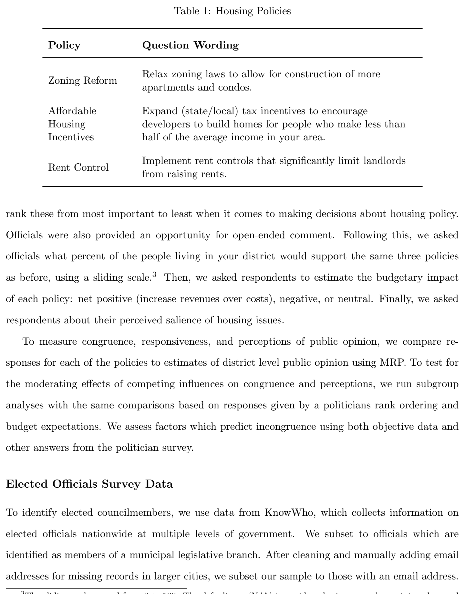

***Table 1.*** Housing Policies

[Download data as CSV](tables/tab-01.csv)

Policy Question Wording

Relax zoning laws to allow for construction of more

Zoning Reform

apartments and condos.

Affordable Expand (state/local) tax incentives to encourage

Housing developers to build homes for people who make less than Incentives half of the average income in your area.

Implement rent controls that significantly limit landlords

Rent Control

from raising rents.

rank these from most important to least when it comes to making decisions about housing policy. Officials were also provided an opportunity for open-ended comment. Following this, we asked officials what percent of the people living in your district would support the same three policies as before, using a sliding scale.3 Then, we asked respondents to estimate the budgetary impact of each policy: net positive (increase revenues over costs), negative, or neutral. Finally, we asked respondents about their perceived salience of housing issues.

To measure congruence, responsiveness, and perceptions of public opinion, we compare responses for each of the policies to estimates of district level public opinion using MRP. To test for the moderating effects of competing influences on congruence and perceptions, we run subgroup analyses with the same comparisons based on responses given by a politicians rank ordering and budget expectations. We assess factors which predict incongruence using both objective data and other answers from the politician survey.

Elected Officials Survey Data

To identify elected councilmembers, we use data from KnowWho, which collects information on elected officials nationwide at multiple levels of government. We subset to officials which are identified as members of a municipal legislative branch. After cleaning and manually adding email addresses for missing records in larger cities, we subset our sample to those with an email address. 3The sliding scale ranged from 0 to 100. The default was ‘N/A’ to avoid anchoring around a certain value, and officials had to move the scale to proceed in the survey.

Our total sampling frame was just under 14,000 municipal officials.4

We recruited councilmembers via email to take our survey hosted online via Qualtrics between November 20, 2025 and January 15, 2026 (n = 789, 5.8% response rate).5 We recruited state elected officials to take our survey in-person on a tablet at the the National Conference of State Legislatures 2025 Legislative Summit, held between August 4-6, 2025 (n = 125).

Public Opinion Data and MRP Estimation

To estimate sub-national public opinion about housing policies, we rely on the technique called multilevel modeling with post-stratification (MRP). We rely on MRP as it substantially outperforms alternative methods (such as disaggregation), allowing us to estimate public opinion at small geographies (Ornstein 2023; Park, Gelman and Bafumi 2004). As we are interested in local representatives, we model these at the smallest geography possible given the constraints of both census and survey data, the zip code. Unlike disaggregation, MRP partially pools information across geographies, meaning that we can credibly estimate public opinion in zip codes where we have very few respondents. In addition to MRP, we also present an alternative “grand mean” approach (Broockman and Skovron 2018), which averages public support for policies among respondents that live in zip codes where a representative responded to our elite survey.

For two of our housing policies, zoning reform and affordable housing incentives, we draw on the 2024 Cooperative Election Study (CES). The large sample size (n = 60,000) of the CES allows us to generate estimates at the small geography of the zip code level. For rent control, we assemble six surveys that asked relatively similar questions about rent control and the respondents zip code (n = 10,200), following prior scholarship (Lax and Phillips 2009).6

Following the method outlined in Kastellec, Lax and Phillips (2010), we fit an individual-level logistic regression model of opinion for each housing policy, as a function of a respondents age, race, 4For councilmembers in larger cities (over 50,000 residents) with missing email addresses, we collected these by hand using municipal websites and social media, adding 1,200 additional emails. We removed entries where the title field provided indicated a non-legislative position (e.g. “Police Commissioner”), although we did not remove Mayors, as council-manager forms of government typically designate a member of City Council as Mayor, who retains legislative, rather than executive, duties.

5After asking the respondent to identify their title (e.g. current legislator, former legislator, staffer), we instructed staffers to hand over the survey to the current legislator and dropped those who did not.

6We also present models which add either a fixed or random effect for the source of the survey to account for wording and sampling differences and results are substantively very similar.

gender, poverty status, and location (at the zip code, county, state, and census region levels).7 In addition to these individual-level variables, we add several ecological variables into the model. At the zip code level we add the homeowership rate, population density, transit modeshare, and the college attainment rate. At the county level we add vote choice in the 2024 Presidental election. These variables were chosen based on factors known to matter in the housing literature. Appendix A details the MRP methodology in greater detail.

In total, we estimate public opinion for over 31,000 zip codes. These zip codes represent over 330 million Americans, or 98 percent of the population total (as of 2023). Table 2 displays summary statistics at the zip code level. When weighting these figures by the total population in each zip code, average support for zoning reform is 51% and support for affordable housing incentives is 75%, very close to the CES weighted average support of 49% and 72%, respectively. Support for rent control—which does not have a national benchmark—is 76%, very similar to affordable housing incentives.

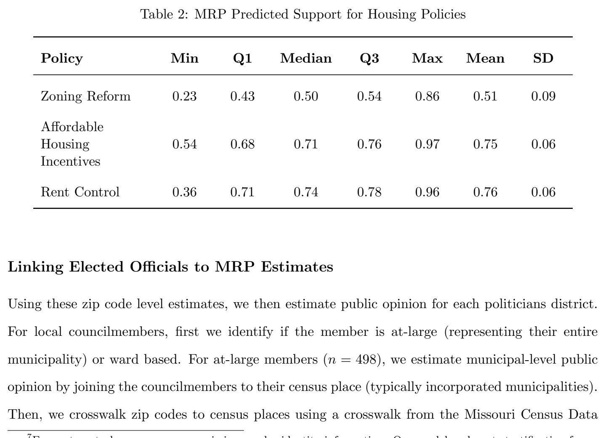

***Table 2.*** MRP Predicted Support for Housing Policies

[Download data as CSV](tables/tab-02.csv)

Policy Min Q1 Median Q3 Max Mean SD

Zoning Reform 0.23 0.43 0.50 0.54 0.86 0.51 0.09

Affordable

Housing 0.54 0.68 0.71 0.76 0.97 0.75 0.06

Incentives

Rent Control 0.36 0.71 0.74 0.78 0.96 0.76 0.06

Linking Elected Officials to MRP Estimates

Using these zip code level estimates, we then estimate public opinion for each politicians district. For local councilmembers, first we identify if the member is at-large (representing their entire municipality) or ward based. For at-large members (n = 498), we estimate municipal-level public opinion by joining the councilmembers to their census place (typically incorporated municipalities). Then, we crosswalk zip codes to census places using a crosswalk from the Missouri Census Data 7For rent control, one survey was missing gender identity information. Our model and post-stratification frame excludes gender for this policy.

Center, which calculates the population overlap each zip code contained in or intersecting a census place based on 2020 census data at the block level. We use these population overlap estimates to construct population weights, and sum the zip code level public opinion estimates multiplied by their population weights to the census place level.

For councilmembers representing a ward (n = 291), we attempt to collect information about the geography of their ward. Data collection is ongoing, but so far we have collected shapefiles for 175 councilmembers and geocoded 137. For these, we apply a similar methodology as above. First, we identify the census blocks contained (centroid) within a ward geometry. Then, we aggregate census block populations contained within the ward by zip code, allowing us to construct population weights for each segment of a zip code intersecting the ward, and sum the zip code level public opinion estimates multiplied by their population weights to the ward level. For the remaining wards we cannot obtain a shapefile for, we rely on PDF or image files of wards uploaded to municipal websites or requested from city clerks. We are in the process of georeferencing these maps of the ward boundaries, then drawing vector polygons via QGIS to obtain usable shapefiles.

## Pre-Registered Hypotheses

Hypothesis 1 (H1). Politician support will be consistently lower than public opinion for our three housing policies (relaxing zoning laws, tax incentives for affordable housing, and rent control), evidence of policy incongruence.

Hypothesis 2 (H2). Politicians will consistently underestimate public support for our three housing polices, and larger misperceptions in public opinion predict larger gaps in policy incongruence. We expect elite misperceptions to differ from the ideologically conservative bias documented in Broockman and Skovron (2018), but concur on their underlying mechanism: unrepresentative constituent contact. They hypothesize that conservative bias stems from unrepresentative constituent contact (in the study context, the rise of the Tea Party movement). We hypothesize that unrepresentative constituent contact similarly biases state-and-local officials’ perceptions, but via the opinions of highly active neighborhood defenders or “homevoters.” We anticipate these types of have status-quo preserving opinions, preferring the low-growth regulatory status quo. Therefore, they should have lower support for both relaxing local zoning laws (deregulation, a more

traditionally conservative opinion) and funding for affordable housing (market intervention, a more traditionally liberal opinion), both of which would depart from the low-development status quo. Hypothesis 3 (H3). Politicians’ perceptions of public opinion will be closer to the opinions of neighborhood defenders, who support all three policies at lower rates, compared to other residents. As stated, neighborhood defenders support for the status quo when it comes to housing development should lead them to support zoning reform and affordable housing funding at lower rates compared to the rest of the public. The group’s general conservative lean should also lead to lower support for rent control compared to the rest of the public.

Hypothesis 4 (H4). Politicians’ perceptions will be more accurate in districts where housing policy is more salient (measured both objectively and subjectively).

We expect higher housing salience to lead to more accurate perceptions of public opinion due to greater levels of citizen contact. Low rates of participation tend to lead to unrepresentative participation, as seen in by low turnout elections in city government (Hajnal and Trounstine 2005). In the context of housing, low salience may mean that the only people participating via public meetings and contact are neighborhood defender-types. In contrast, high policy salience should lead to more participation across demographic groups, providing a more representative sense of public support for these housing policies.

Hypothesis 5 (H5). The gap between politician support for the policy less district public opinion will be predicted by:

• a negative gap for all three policies (politician support is lower than the public) will be predicted by rating meeting attendees higher.

• a positive gap for the two supply side reforms will be predicted by politicians rating business leaders as more important (and vice versa for rent control).

• because fiscal considerations may constrain the choices of elected officials, politicians rating fiscal balance as highly influential and rating a policy as a fiscal net negative will show greater incongruence with their constituents in the form of a negative gap.

In addition to our formal hypotheses, there are number of research questions we plan to address using exploratory analyses.8 We do not have theory-driven predictions for these tests. As a result, 8Note: Results for these analyses will be reported in future drafts.

we will report the analyses but interpret them with more reservation. The exploratory analyses will investigate misperception among the following subgroups: • Partisanship of elected officials

• District-level variables

– Competitive districts

– Local v. state office

– At-large v. district for local officials

– Nonpartisan elections

– Form of government (e.g., council-manager; for local elected officials) – Professionalized legislatures (for state elected officials)

## Analytical Strategy

To test H1 and H2, we will compare politicians’ support (H1) and perception of public opinion (H2) to their constituents’ views using two methods, following the approach used in Broockman and Skovron (2018):

• Grand Mean Approach:

– Estimate support for each policy among only respondents living in municipalities/districts where a politician responded to our survey (based on a ZIP code crosswalk, inclusive of respondents whose ZIP codes are only partially contained in a municipality/district). • Multilevel Regression with Poststratification (MrP):

– While the grand mean approach provides average perception of any random politician selected, we also want to analyze the severity of the misperception at the politician level, to correlate with other politician-level attributes and survey responses, requiring an estimate of municipal/district-level public opinion.

– To do so, we estimate municipal/district level support for the policies using a multi-level model with random intercepts at the municipal/district level, with opinion predicted by various demographic attributes available in both survey and Census data, including: age, race, gender, education, and homeownership. We also include county-level partisan voting patterns.

– This allows us to estimate a politician-level public opinion difference score.

To test H3, we estimate the average misperception via the grand mean approach for neighborhood defenders. Using CES data, define neighborhood defenders as homeowners, age 45 and above, who voted in 2016, 2020, and 2024. These are the types of people shown to be most active in local politics and most likely to attend local meetings about housing (Einstein, Glick and Palmer 2019; Sahn 2025). This is a subgroup analysis form of the grand mean approach; we anticipate both that the support for housing policies will be lower among neighborhood defenders and that the gap between local elected officials’ perceptions of public opinion will be smaller for the neighborhood defenders than the general public (one-tailed test) as well as non-neighborhood defender public opinion.

To test H4, we will identify districts where housing policy is salient by using both objective and subjective measures. As an objective measure, we will use a combination of housing affordability (as a percentage of household income) and vacancy rates. Areas with both below average (nationwide, not sample-wide) affordability and vacancy rates will be considered high salience contexts. We will compare the misperception within these high salience districts to the remaining districts.9 For subjective measures, we will ask politicians to assess the importance of housing policy issues among their voters. Districts above the median importance will be considered high salience districts.

To test H5, we define operationalize the gap between public opinion and politician support for each policy via “agreement,” the share of the district population which approves of the politician’s policy stance (Caughey and Warshaw 2022). For example, if 55% of the public supports a policy and so does the district’s councilmember, agreement is .55. However, if that same councilmember were to oppose the policy, then the agreement score would be .45, as only 45% of the public would agree with the politician’s opposition to the policy.

We assess variation in agreement across an array of moderating variables:

• H5a: we add the importance ranking of public opinion, with a negative gap for all three policies predicted by meeting attendees being ranked higher and public opinion lower.

• H5b: we add the importance ranking of business leaders, with a positive gap for the two supply-side policies and a negative gap for rent control predicted by business leaders being ranked higher.

9Results for objective measures of salience will be reported in future drafts.

• H5c: we add the importance ranking of fiscal concerns interacted with the expected fiscal impact of each policy (positive, neutral, or negative), with a negative gap predicted by ranking fiscal concerns highly and the policy as “net negative.”

## Results

Policy Congruence and External Responsiveness

To assess congruence, we use multiple approaches. First, we compare the average councilmember’s vote against public support at the district level estimated via MRP (Table 3, Columns 1 and 2). For two policies—zoning reform and affordable housing incentives—councilmembers state they would vote for the two policies at rates meeting or exceeding average public support across their districts. Levels of support among elected officials are similar to public support for affordable housing tax incentives and about 10 points higher for the pro-housing zoning reform. For rent control, on the other hand, councilmembers’ stated vote is much lower than average public support in their districts.

Next, we compute rates of policy congruence and policy agreement (e.g., Caughey and Warshaw 2022). Congruence represents the share of policymakers voting ‘yes’ if a majority of the public supports the policy and ‘no’ otherwise. Agreement represents the share of the public in a policymaker’s district that supports their representative’s stated preference. We find relatively high degrees of congruence for zoning reform and affordable housing incentives, but very low congruence for rent control, representing mixed evidence for H1—that councilmember support for housing reforms would lag public opinion and lead to incongruence. Agreement follows similar patterns, indicating that most voters support the stated preference of their local official for zoning reform and affordable housing incentives, but not rent control.

These figures do obscure some heterogeneity in agreement, however. Support for affordable housing tax incentives is incredibly high and tightly centered around its mean, (mean = 0.75, sd = 0.06), as is rent control (mean = 0.77, sd = 0.05). Zoning reform, however, is more controversial and has larger variance (mean = 0.51, sd = .08).10 As a result, politician who vote against affordable housing tax incentives and rent control have very low rates of policy agreement. Zoning reform, on 10These results are also visualized later, in Figure 4.

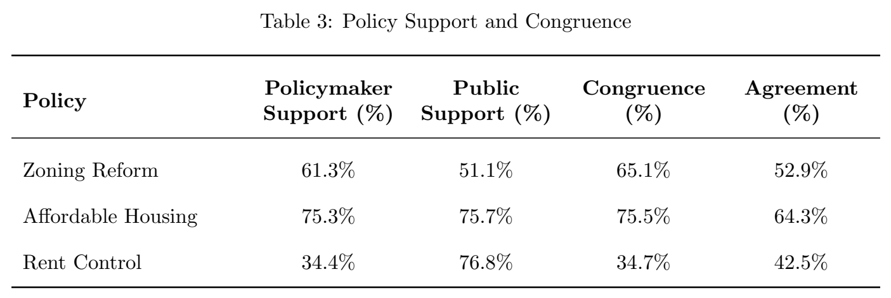

***Table 3.*** Policy Support and Congruence

[Download data as CSV](tables/tab-03.csv)

Policymaker Public Congruence Agreement Policy

Support (%) Support (%) (%) (%)

Zoning Reform 61.3% 51.1% 65.1% 52.9%

Affordable Housing 75.3% 75.7% 75.5% 64.3%

Rent Control 34.4% 76.8% 34.7% 42.5%

the other hand, produces more middling rates of agreement regardless of a politicians stance, with both yes and no votes having above 50% rates of agreement, suggesting responsiveness. Figure 1 plots these agreement results by politician vote.

In addition to congruence and agreement, we also examine external responsiveness directly and plot the predicted probability of a councilmember stating that they would vote ‘yes’ for each policy as function of public opinion in their district using a logit model. Policies show evidence of responsiveness if their slopes are steep and positively sloped. Figure 2 plots these relationships. All policies show strong evidence of responsiveness, with strong positive relationships that are statistically significant at the 95% level.

The plots in Figure 2 also display dashed lines from the x- and y-axes where policy support and the probability of a councilmember stating they would vote ‘yes’ reach 50%. The relationship of the responsiveness curves to these dashed lines reveals if responsiveness is biased. Perfect majoritarian responsiveness would produce curves that are very steep and cross the 50-50 crosshairs. Meanwhile, biased responsiveness will be less steep and the entire curve will be shifted either to the left or right, leading or lagging public opinion. In Figure 2, zoning reform shows little bias in responsiveness. However, despite relatively high rates of policy congruence and agreement, affordable housing incentives and rent control shows a notable bias—requiring above majority public support to push the probability of a councilmember voting “yes” above 50%.

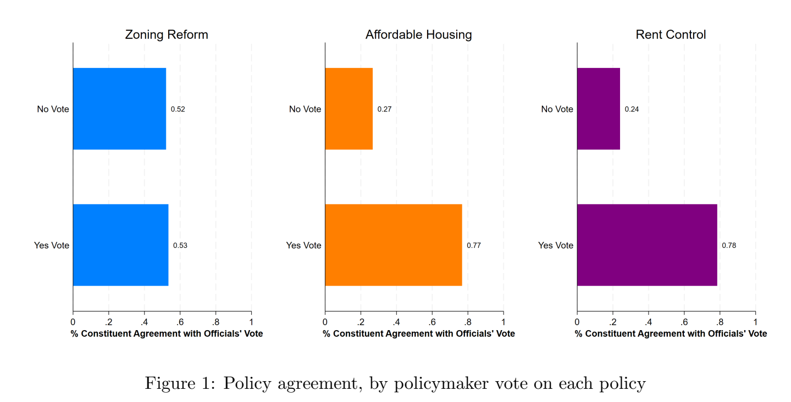

***Figure 1.*** Policy agreement, by policymaker vote on each policy

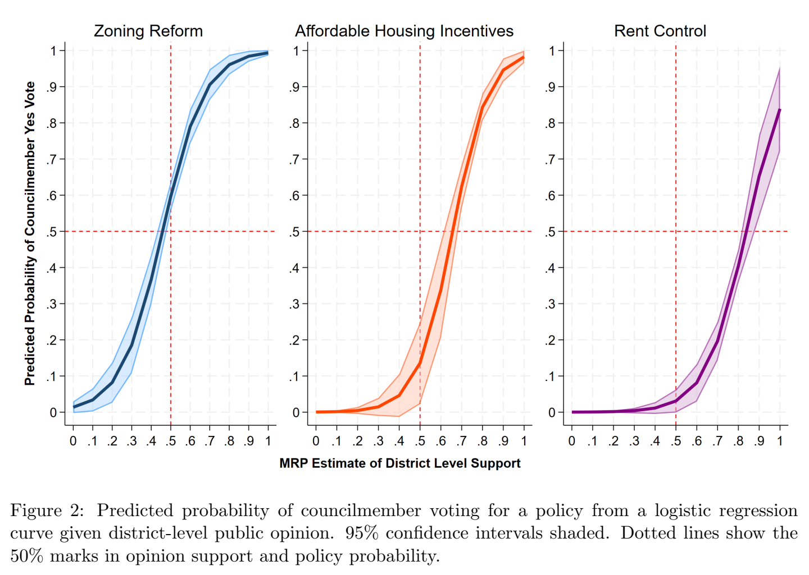

***Figure 2.*** Predicted probability of councilmember voting for a policy from a logistic regression curve given district-level public opinion. 95% confidence intervals shaded. Dotted lines show the 50% marks in opinion support and policy probability.

The Electoral Connection and Perceptions of Public Opinion

Why do councilmembers’ preferences sometimes deviate from public opinion in their district? One possibility is that elected officials are responsive to public opinion, but have an inaccurate perception of such opinion. To test this theory, we asked each councilmember about their perception of public opinion in their district.

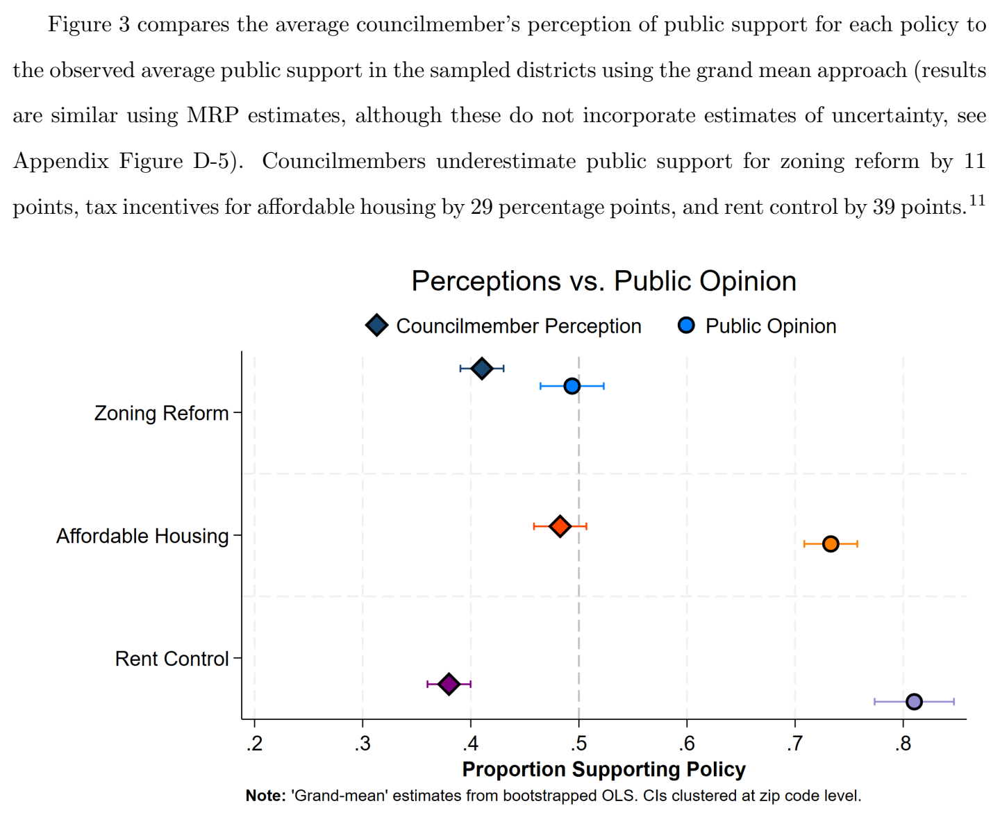

***Figure 3.*** compares the average councilmember’s perception of public support for each policy to the observed average public support in the sampled districts using the grand mean approach (results are similar using MRP estimates, although these do not incorporate estimates of uncertainty, see

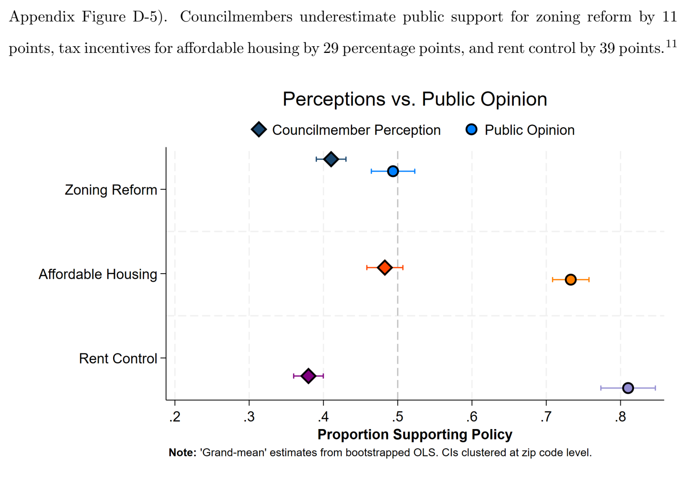

***Appendix Figure D-5.*** ). Councilmembers underestimate public support for zoning reform by 11 points, tax incentives for affordable housing by 29 percentage points, and rent control by 39 points.11

Figure 3: Councilmember perception of policy support compared to public opinion as estimated using the grand mean approach.

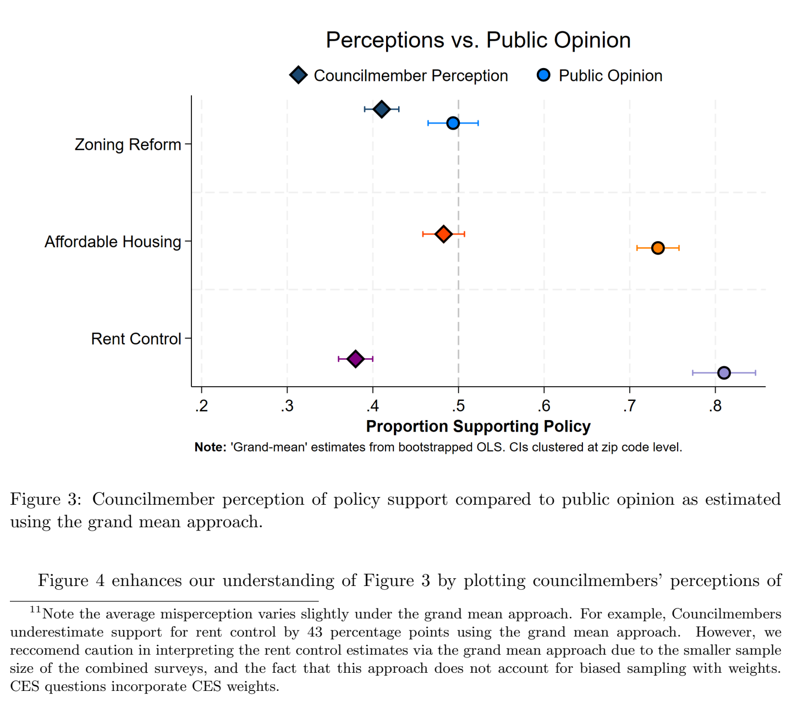

***Figure 4.*** enhances our understanding of Figure 3 by plotting councilmembers’ perceptions of 11Note the average misperception varies slightly under the grand mean approach. For example, Councilmembers underestimate support for rent control by 43 percentage points using the grand mean approach. However, we reccomend caution in interpreting the rent control estimates via the grand mean approach due to the smaller sample size of the combined surveys, and the fact that this approach does not account for biased sampling with weights. CES questions incorporate CES weights.

public opinion against MRP estimates of public opinion. The relationship between the two is visualized with a LOESS curve and a unit slope line represents a perfect relationship. For all three policies, the LOESS curve runs below the unit slope indicating that councilmembers’ perceptions of public support for these policies are consistently below the actual public support of their constituencies.12 These findings support the first clause of H2—that politicians will consistently underestimate public support for housing reforms. Moreover, they suggest that policy congruence and agreement for affordable housing is more coincidental rather than intentional.

Figure 4: Councilmember perception of policy support compared to public opinion as estimated using MRP.

Another notable attribute of Figure 4 is the relative lack of variation in average public support for the affordable housing policy and rent control. Within our sample, independent surveys, and the CES as a whole (for affordable housing incentives), large majorities of residents consistently show support for these pro-renter policies. At the same time, the broad coverage of the y-axis indicates that councilmembers’ perceptions of public opinion are widely varying. Many councilmembers expect there to be very little support for these pro-renter policies in their district. In contrast, there is more variation in estimated public opinion for zoning reform.

Next, we test for the sources of misperception. One potential source of this is linked to differences in local participation among neighborhood defenders—those who attend meetings about housing and participate in local politics—from non-defenders. The top panel of Figure 5 compares 12Still, the MRP approach allows us to see that both LOESS curves have positive slopes. Councilmembers’ perceptions of public opinion increase as local public support increases, indicating perception is correlated to public opinion at least in a cross-sectional snapshot.

councilmembers perceptions of public opinion to actual public opinion as a baseline. The middle and bottom panels of Figure 5 compare councilmembers’ perceptions to separate estimates of public opinion among those with traits that are strongly associated with higher participation in local politics (and hence, likely to better reflect the opinions of ‘neighborhood defenders’) —older homeowners who regularly vote—as well as the rest of the population (‘non-defenders’) using the grand mean approach (Einstein et al. 2025). Councilmember perceptions of public opinion are consistently more similar to the attitudes of neighborhood defenders than the attitudes of non-defenders. In fact, there is no difference between councilmembers’ perceptions of support for zoning reform and the neighborhood defenders’ support for zoning reform. This is perhaps unsurprising when considering that zoning reforms (especially parcel-level zoning variances) are exactly the type of policy matters that drive neighborhood defenders to participate in local politics and attend zoning hearings (Einstein, Glick and Palmer 2019; Hall and Yoder 2022). In contrast, neighborhood defenders may be less likely to voice their opinions on rent control and tax incentives for affordable housing, leading to comparatively less influence on perceptions of public opinion. These findings support H3—that politicians’ perceptions of public opinion are closer to those of neighborhood defenders.

Another potential source of misperceptions is linked to the salience of local housing costs. In Figure 6, we explore the role of local issue salience by plotting the MRP-estimates of misperception against councilmembers’ self-reported belief of issue salience in their districts. Across both affordable housing and zoning reform, councilmembers’ perceptions of public opinion are more accurate for those who say that housing affordability is “very important” or “extremely important” to their voters—supporting H4. Of course, this relationship may be endogenous based on the councilmembers’ own interest in the policy area. Councilmembers interested in housing believe that it is a high priority issue and also may invest greater time in getting to know their constituents’ attitudes on these topics. Still, the findings that perceptions better reflect that of ’neighborhood defenders’ and are more accurate in districts with a (perceived) more severe affordability crisis suggests that unrepresentative contact may be driving misperceptions in public opinion.

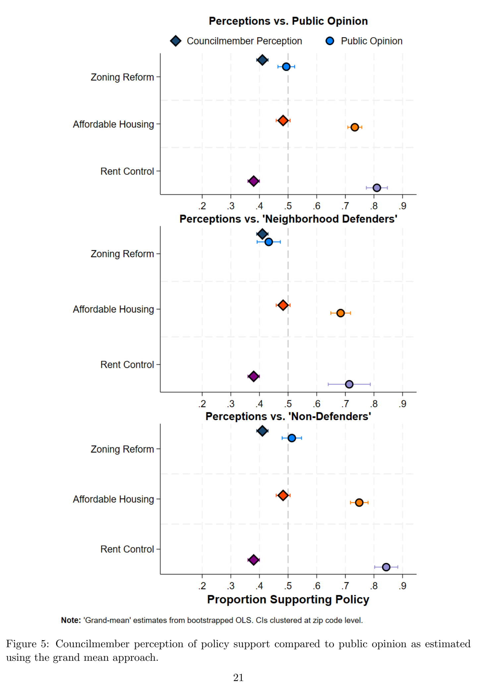

***Figure 5.*** Councilmember perception of policy support compared to public opinion as estimated using the grand mean approach. 21

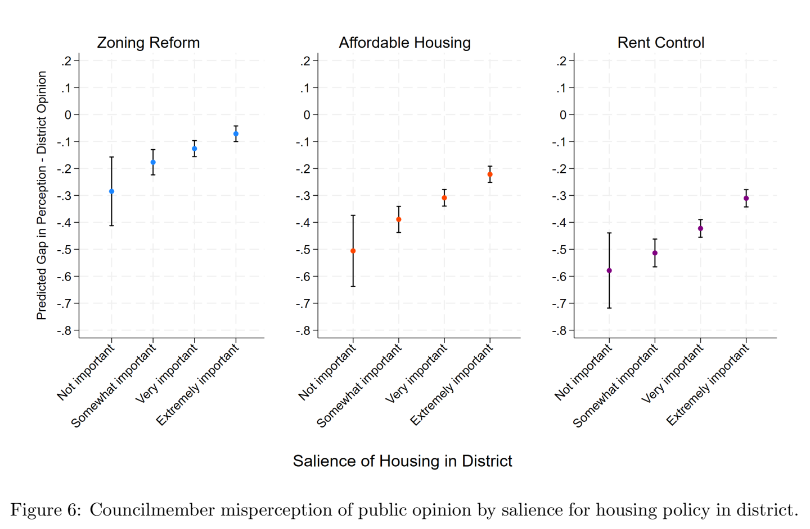

***Figure 6.*** Councilmember misperception of public opinion by salience for housing policy in district.

Internal Responsiveness

These misperceptions are troubling for the quality of local democracy. However, if legislators are responsive to their perceptions of public opinion, then we have evidence of the potential to improve local accountability. To assess this internal responsiveness, we repeat the analysis from Figure 2 using perceptions of public opinion, rather than actual public opinion at the district level modeled using MRP. Figure 7 plots these relationships. Like Figure 2, we see a clear, positive relationship between perceived public opinion and vote choice. However, we observe a large leftward bias in responsiveness by elected officials to their perceptions of public opinion for two policies: zoning reform and affordable housing incentives. That is, many politicians appear to be willing to deliberately lead what they perceive as tepid to cold public opinion on these housing policies. In contrast, rent control displays near perfect internal responsiveness. Although we find that elected officials substantially underestimate public support for rent control, those that believe it be popular are willing to support it.

Do larger misperceptions in public opinion predict larger gaps in policy incongruence? To answer

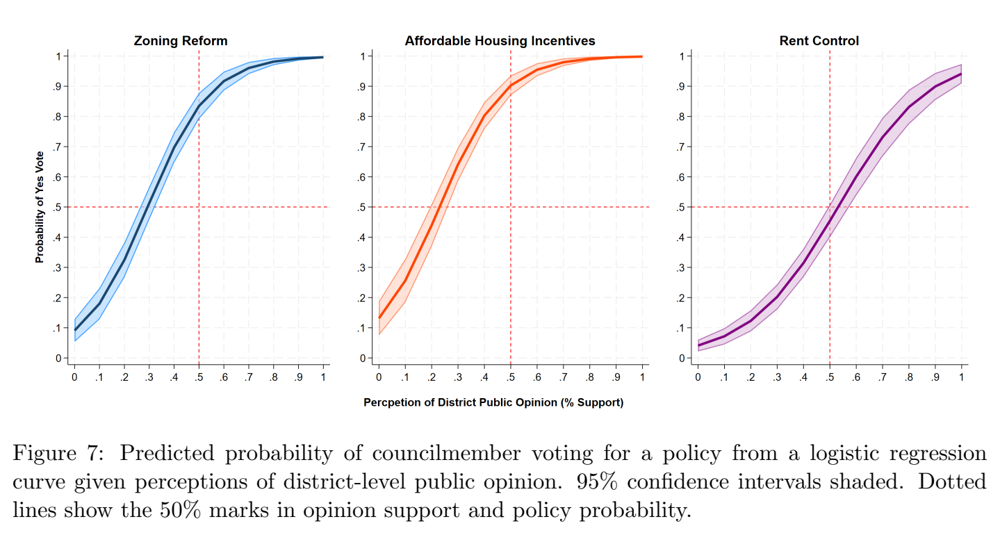

***Figure 7.*** Predicted probability of councilmember voting for a policy from a logistic regression curve given perceptions of district-level public opinion. 95% confidence intervals shaded. Dotted lines show the 50% marks in opinion support and policy probability.

this, we operationalize district-level representation as policy “agreement” (Caughey and Warshaw 2022), the share of the public in a district that support their councilmembers’ stated policy position. Figure 8 use nonparametric kernel regressions to compare policy agreement against councilmember misperception (the gap between perceived and actual district-level public opinion). Regression lines for zoning reform and affordable housing incentives are curved with maxima near 0 on the x-axis, indicating that councilmembers’ policy positions are most aligned with public opinion when the councilmembers have the most accurate perceptions of public opinion. Critically, these curves are nonparametric, so the presence of a maxima is not model-dependent.

For all policies, agreement is lowest when misperceptions are the largest. Both affordable housing and zoning reform feature maxima near where councilmembers have the most accurate perceptions of public opinion. For rent control, this is not as clearly the case, and we cannot say for sure that policy agreement is greatest when misperceptions are at their minimum. We note, however that there are very few observations with a positive gap in perception for both affordable housing tax incentives and rent control. Given this, the continued positive slope suggests that legislators have more accurate perceptions of public opinion have increased agreement - consistent with H2.

Notably, the curves also have different magnitudes primarily due the distribution of public

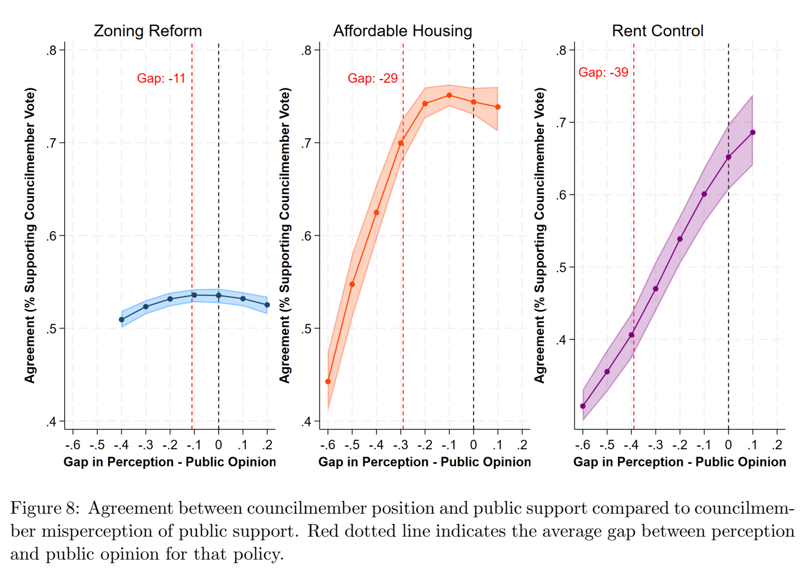

***Figure 8.*** Agreement between councilmember position and public support compared to councilmem- ber misperception of public support. Red dotted line indicates the average gap between perception and public opinion for that policy.

opinion. The more severe curves for affordable housing tax incentives and rent control reflects the concentration of true public opinion estimates between 60% and 80% support. Given public support is so high, the average level of agreement is able to extend as high as .75 for councilmembers in favor of affordable housing tax incentives and rent control. In contrast, public support for zoning reform is concentrated between 40% and 60%, meaning the average share of the public agreeing with any given policy is largely limited to this narrow range.

Influences Beyond Public Opinion

Thus far, we have established that there is a mixed level of external responsiveness in local housing policy. Politicians dramatically underestimate public opinion, meaning they are sometimes willing to support policies that they believe are out of step with their constituents (as evidenced by both zoning reform and affordable housing tax incentives). Even accounting for these politicians’ perceptions of public opinion, we see their support leading the public for zoning reform and affordable housing incentives. That is, politicians display biased internal responsiveness. What are the drivers of this willingness to buck public opinion?

To unpack this deviation, we asked politicians to rank the importance of five factors in their policy making: the opinions of residents, public meeting attendees, business leaders, and nonprofits/labor unions as well as the effect on the municipal budget. We also asked local officials to state their expectations of how the policy would affect the budget, from budget negative (greater service costs than added tax revenue), to neutral, to budget positive (vice versa). Figure 9 displays the rankings of councilmembers in the importance of these factors in housing policymaking. Public opinion and budget are nearly tied for being the top consideration and the majority of respondents place both of them in their “top 2” rankings. Other factors are less influential. We validate this measure with a conjoint experiment where we randomized support or opposition for our four interest groups and the budgetary impact of a proposed market rate development (See Appendix Figure D-6). We find nearly identical effects: large effects of public opinion and impacts on the budget that are effectively tied in magnitude, followed by more modest effects by other interest groups. Next, we assess if different rankings are associated with biased internal responsiveness to public opinion. Is ranking public opinion as less influential associated with greater deviation from public opinion? To do so, we predict the probability of a elected official voting “yes” as a function of

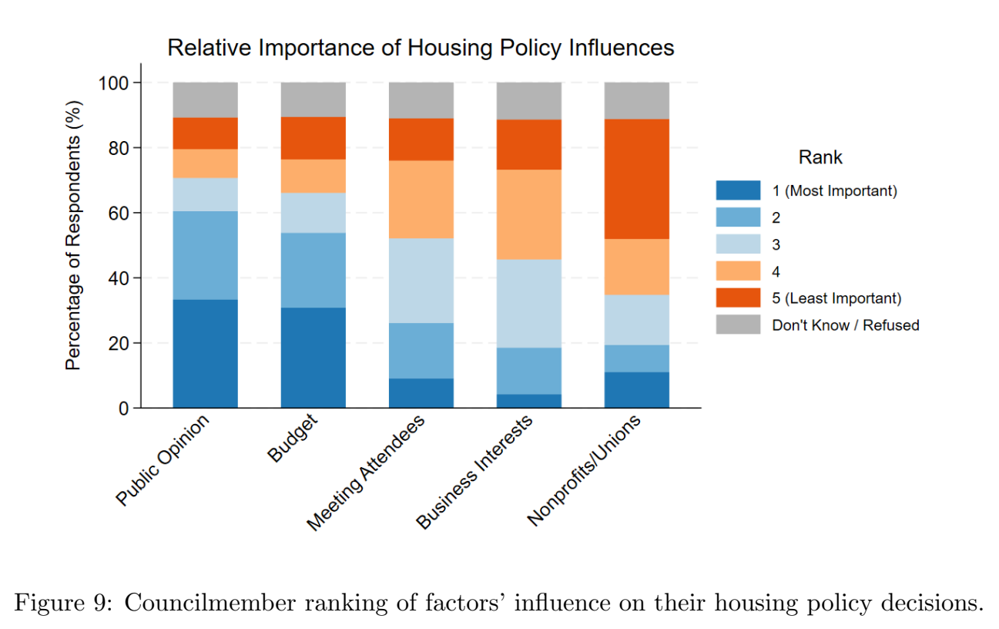

***Figure 9.*** Councilmember ranking of factors’ influence on their housing policy decisions.

perceived public opinion, with moderating subgroup effects by if an influence was ranked above or below that of public opinion. We use perceived public opinion as that is the quantity that should, and does, shape legislator behavior, as evidenced by Figure 7. However, we do not find meaningful variation in responsiveness based on the ranking of meeting attendees nor business leaders (against H5a and H5b, see Appendix B, Figures B-1 and B-2). Nor do we find that the relative influence of the budget biases responsiveness (see Appendix Figures B-3 and B-4 plot for these results).

Still, as an exploratory analysis, we do find large variation based on the expected fiscal impacts of each policy. Figure 10 displays policy responsiveness between the elected officials’ stated vote and their perception of public opinion in their district. This relationship is broken down based on perceived effects of policy on the budget.13 Figure 10 shows large shifts in the policy responsiveness curves based on expected budget impacts. Take a neutral budget effect as a baseline. Politicians who expect reforms will lead to negative budgetary impacts (red lines) show a substantial rightward shift in internal responsiveness. Those who expect positive budget impacts (green lines) show a leftward shift that is not statistically nor substantively significant. That is, politicians who are pessimistic about the budget effects of these policies are more risk-seeking, deviating from their 13As we found no effects by the relative importance of the budget compared to public opinion, we do not plot this variation and note this test departs from our pre-registered analysis plan by not including that interaction.

perception of public opinion, compared to politicians who are optimistic about the fiscal impacts.

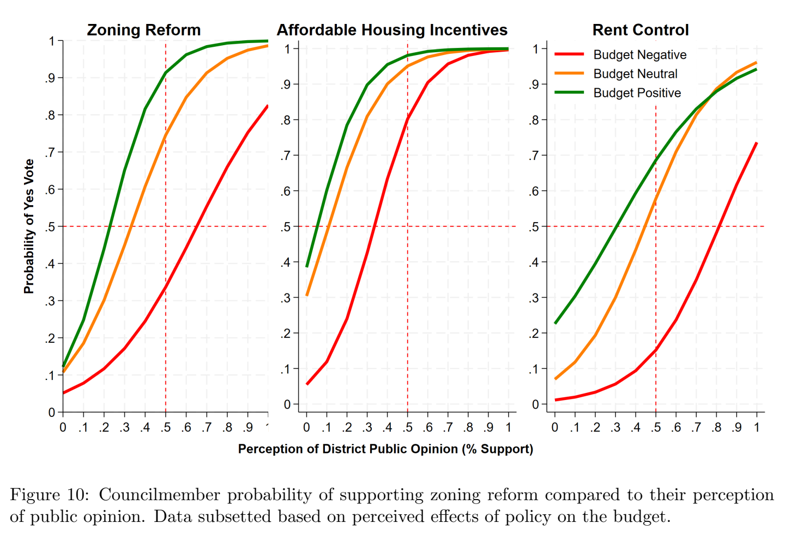

***Figure 10.*** Councilmember probability of supporting zoning reform compared to their perception of public opinion. Data subsetted based on perceived effects of policy on the budget.

Table 4 shows the average expected fiscal impact of each policy. Given the moderating effect of fiscal expectations on responsiveness, these diverging expectations help to explain why politicians appear to be sometimes congruent with public opinion despite inaccurately perceiving it. Zoning reform is overwhelmingly seen as budget positive or neutral, counteracting the low perception of support. Meanwhile, while affordable housing incentives are more likely to be seen as harming the municipal budget, the majority still view these as either budget neutral or positive, similarly counteracting perceived tepid public opinion. Finally, rent control is seen as largely budget neutral or negative, with few perceiving a positive fiscal impact of the policy. This may help explain why, unlike zoning reform and affordable housing incentives, few local politicians appear willing to buck their perception of district public opinion.

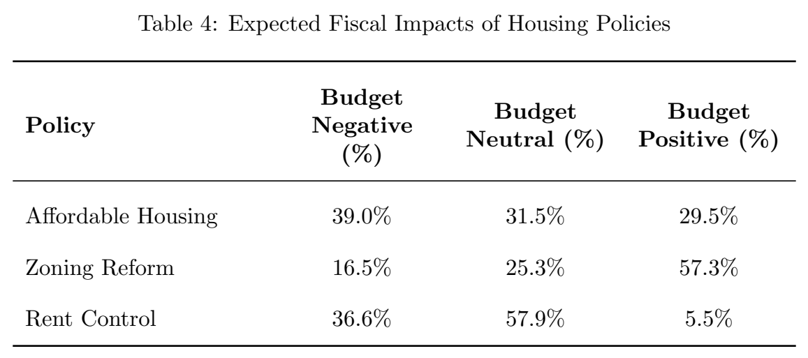

***Table 4.*** Expected Fiscal Impacts of Housing Policies

[Download data as CSV](tables/tab-04.csv)

Budget

Budget Budget Policy Negative

Neutral (%) Positive (%) Affordable Housing 39.0% 31.5% 29.5%

Zoning Reform 16.5% 25.3% 57.3%

Rent Control 36.6% 57.9% 5.5%

## Discussion

To help build a body of evidence, it is important to contextualize our findings against similar studies. Of the nine policy areas that Rivard and Lucas (2024) examine, two are similar to our policies of interest though not perfectly matched. Like our measure of support for tax incentives for affordable housing, Rivard and Lucas (2024) ask about support for: “New construction of affordable housing units by governments.” Similar to our measure of zoning reform, they ask about support for: “Repealing single-family zoning bylaws to allow for mixed housing construction everywhere.” For both zoning and affordable housing, Rivard and Lucas (2024) find positive correlations between politician support and public support. However, for both policies, politician support leads public support. These findings are largely similar to our own, providing external validity in the similar but separate context of Canadian municipalities.

In contrast, Rivard and Lucas (2024) find no evidence that politician support is more closely aligned with homeowners versus renters, leading them to discount the influence of homeowners in shaping citywide housing policy. We offer an alternative interpretation. We also find that politicians’ policy support is not more closely aligned with our subset of neighborhood defenders— older homeowners who vote regularly. However, we demonstrate that politicians’ perceptions of public opinion are more aligned with this group. Thus, neighborhood defenders likely do play an out-sized role in shaping housing politics, at least by the mechanism of altering how politicians view public opinion. That this effect does not always manifest as shaping politicians’ preferred policies signals that there are other factors beyond public opinion meaningfully shaping citywide housing policy.

To that point, our findings signal the importance of pushing beyond public attitudes in understanding housing reform politics. Our findings highlight the importance of fiscal constraints and perceptions of budgetary impacts. While our ranking question did not pick-up meaningful variation in the role of interests groups, this could be due to noise generated through rankings as opposed to ratings or due to a better tailoring of specific interest groups. For example, large local employers from hospitals to even Disney World have lobbied against NIMBY interests to expand “attainable housing” for their workers (Lake 2024). Additionally, interest group influence may operate indirectly—such as by influencing perceptions of public opinion or municipal budget impacts—rather than directly through statements of support or opposition. Still, our results so far suggest that interest groups, while an important consideration, may be secondary to the competing considerations of public opinion and municipal finance.

An additional factor likely affecting the relationship between perceived public opinion and policy support is subjective evaluations of the policy. Politician ideology likely impacts policy support, all else equal. And like the public writ large, officials almost certainly vary in how effective they believe each of these policies is likely to be (Been, Ellen and O’Regan 2019; Elmendorf, Nall and Oklobdzija 2025). Future iterations of this project will more closely examine the moderating effects of elite partisanship, along with beliefs about whether expanding the housing supply is an effective method to reducing housing prices.

Finally, uncertainty likely affects the role of public opinion and fiscal constraints. For some policies, an official may be willing to buck public opinion because they believe voters are unlikely to hold them accountable due low turnout and low voter information. Likewise, a politician may believe a policy has directional budgetary impacts, but expects those impacts to be minor. This may explain why rent control has perfect internal responsiveness while having slightly negative budgetary impacts. The policy does not cost the government anything in the short-term, thus allowing elected officials to support it in unison with their voters. Future research should assess the role of these symbolic and subjective evaluations of policy.

Normatively, our findings present a mixed image of housing policy and local democracy. Zoning reform and affordable housing incentives see a relatively high-level of policy congruence and external responsiveness, but it occurs due to coincidental representation. Therefore, the degree to which this representation will hold over time is uncertain. At the very least, neighborhood defenders are

not dictators of elected officials’ stated vote choice. Instead, elected officials are willing to defy perceived public opinion to pursue policies expanding the supply of market-rate and affordable housing, particularly when they believe these policies have potential to fill the municipal coffers. Furthermore, these substantial misperceptions among policymakers raise the opportunity for pro-housing information campaigns. For rent control, politicians are perfectly internally responsive but wildly underestimate public support. These findings suggests that conveying accurate measure of public opinion may improve external responsiveness. But for zoning reform and affordable housing incentives, it is unclear whether efforts to better inform officials’ of the true support for policy would increase officials’ support for reform or encounter ceiling effects given the existing high level of elected officials’ support.

## Conclusion

In this study, we assess the relationship between public opinion, elected officials’ perceptions of opinion, and the stated preferences of elected officials when it comes to high-profile housing policies. We find that while legislators are responsive to public opinion, they vary substantially in their alignment with voters. What alignment does exist for zoning reform and affordable housing tax incentives is largely coincidental, the result of biased internal responsiveness and a willingness of politicians to deviate from (their perception of) public opinion.

One of the sources of this deviation is officials’ underestimation of constituents’ support for all three housing policies. These misperceptions may be due to unequal participation, as officials’ perceptions are more aligned to the opinions of neighborhood defenders than for non-defenders. Perceptions are also more accurate in contexts where housing affordability is a salient political issue.

Still, even elected officials’ responsiveness to their perception of public opinion is imperfect, with officials leading perceived public opinion on the policies of zoning reform and affordable housing. We demonstrate influences beyond public opinion play a role, with positive anticipated fiscal impacts likely leading to greater than expected support for zoning reform and affordable housing tax incentives. Together, our findings unite theories of representation with fiscal federalism, centering the beliefs and behaviors of legislators in local policymaking.

## References

Achen, Christopher H. 1978. “Measuring representation.” American Journal of Political Science pp. 475–510.

Anzia, Sarah F. 2022. Local interests: politics, policy, and interest groups in US city governments. University of Chicago Press.

Been, Vicki, Ingrid Gould Ellen and Katherine O’Regan. 2019. “Supply Skepticism: Housing Supply and Affordability.” Housing Policy Debate 29(1):25–40.

Behrens, Kristian, Gilles Duranton and Fr´ed´eric Robert-Nicoud. 2014. “Productive cities: Sorting, selection, and agglomeration.” Journal of Political Economy 122(3):507–553.

Broockman, David E and Christopher Skovron. 2018. “Bias in perceptions of public opinion among political elites.” American Political Science Review 112(3):542–563.

Canes-Wrone, Brandice. 2015. “From mass preferences to policy.” Annual Review of Political Science 18(1):147–165.

Caughey, Devin and Christopher Warshaw. 2022. Dynamic Democracy: Public Opinion, Elections, and Policymaking in the American States. University of Chicago Press.

Einstein, Katherine Levine, David Glick and Conor LeBlanc. 2017. 2016 Menino Survey of Mayors. Technical report Boston University Initiative on Cities.

Einstein, Katherine Levine, David M Glick and Maxwell Palmer. 2019. Neighborhood Defenders. Cambridge University Press.

Einstein, Katherine Levine, Maxwell Palmer, Ellis Hamilton and Ethan Singer. 2025. “Age and Homeownership Drive the Local Turnout Gap.” Urban Affairs Review .

Einstein, Katherine Levine and Vladimir Kogan. 2016. “Pushing the city limits: Policy responsiveness in municipal government.” Urban Affairs Review 52(1):3–32.

Elmendorf, Christopher S, Clayton Nall and Stan Oklobdzija. 2024. “What state housing policies do voters want? Evidence from a platform-choice experiment.” Journal of Political Institutions and Political Economy 5(1):117–152.

Elmendorf, Christopher S, Clayton Nall and Stan Oklobdzija. 2025. “The folk economics of housing.” Journal of Economic Perspectives 39(3):45–66.

Fischel, William A. 2001. The Homevoter Hypothesis. Cambridge, MA: Harvard University Press. Glaeser, Edward and Joseph Gyourko. 2018. “The Economic Implications of Housing Supply.” Journal of Economic Perspectives 32(1):3–30.

Glaeser, Edward L, Joseph Gyourko and Raven E Saks. 2005. “Why Have Housing Prices Gone Up?” American Economic Review 95(2):329–333.

Grabar, Henry. 2024. Paved paradise: How parking explains the world. Penguin.

Hajnal, Zoltan and Jessica Trounstine. 2005. “Where Turnout Matters: The Consequences of Uneven Turnout in City Politics.” The Journal of Politics 67(2):515–535.

Hall, Andrew B and Jesse Yoder. 2022. “Does homeownership influence political behavior? Evidence from administrative data.” The Journal of Politics 84(1):351–366.

Hankinson, Michael. 2018. “When Do Renters Behave Like Homeowners? High Rent, Price Anxiety, and NIMBYism.” American Political Science Review 112(3):473–493.

Hankinson, Michael, Asya Magazinnik and Anna Weissman. 2024. “When Do Local Interest Groups Participate in the Housing Entitlement Process?” Journal of Political Institutions and Political Economy 5(1):47–69.

Horowitz, Alex and Tushar Kansal. 2023. “Survey Finds Large Majorities Favor Policies to Enable More Housing.” The Pew Charitable Trusts. Published November 30, 2023. Accessed April 18, 2026.

URL: https://www.pew.org/en/research-and-analysis/articles/2023/11/30/survey-finds-largemajorities-favor-policies-to-enable-more-housing

Kastellec, Jonathan P, Jeffrey R Lax and Justin H Phillips. 2010. “Public opinion and Senate confirmation of Supreme Court nominees.” The Journal of Politics 72(3):767–784.

Kogan, Vladimir and Katherine Levine Einstein. 2016. “Pushing the City Limits: Policy Responsiveness in Municipal Government.” Urban Affairs Review 51(1):3–32.

Lake, Sydney. 2024. “Walt Disney World dedicated nearly 80 acres to a massive affordable housing project near its Orlando park. But Orange County NIMBYs aren’t having it.” Fortune .

URL: https://fortune.com/2024/03/30/disney-nimby-affordable-housing-orlando/

Larsen, Martin Vinæs and Niels Nyholt. 2024. Understanding Nimbyism as Local Preservationism. Technical report Center for Open Science.

Lax, Jeffrey and Justin Phillips. 2012. “The Democratic Deficit in the States.” American Journal of Political Science .

Lax, Jeffrey R and Justin H Phillips. 2009. “How should we estimate public opinion in the states?” American Journal of Political Science 53(1):107–121.

Logan, John and Harvey Molotch. 1987. Urban Fortunes: The Political Economy of Place. The University of California Press.

Marble, William and Clayton Nall. 2021. “Where Interests Trump Ideology: The Persistent Influence of Homeownership in Local Development Politics.” Journal of Politics 83(4).

Matsusaka, John G. 2026. ““Congruence” and “Responsiveness” in the study of representation.” Public Choice pp. 1–14.

Mayhew, David R. 1974. Congress: The Electoral Connection. Vol. 26 Yale University Press.

Mendelberg, Tali, Gustavo Novoa and Adrian Pietrzak. 2025. “Insufficiently Affordable: Public Opinion About Housing Affordability.”.

Ornstein, Joseph T. 2023. Getting the most out of surveys: Multilevel regression and poststratification. In Causality in Policy Studies: a Pluralist Toolbox. Springer pp. 99–122.

Park, David K, Andrew Gelman and Joseph Bafumi. 2004. “Bayesian multilevel estimation with poststratification: State-level estimates from national polls.” Political Analysis 12(4):375–385. Peterson, Paul E. 1981. City Limits. University of Chicago Press.

Pietrzak, Adrian and Tali Mendelberg. 2025. “Political Architecture: Contextual Development and Opposition to Housing.” Urban Affairs Review p. 10780874251398034.

Rivard, Alex B and Jack Lucas. 2024. “Municipal Political Representation and Housing Affordability.”.

Sahn, Alexander. 2025. “Public comment and public policy.” American Journal of Political Science 69(2):685–700.

Tausanovitch, Chris and Christopher Warshaw. 2014. “Representation in Municipal Government.” American Political Science Review 108(3):605–641.

Ternullo, Stephanie. 2024. “The Politics of Suburban Restrictivism.” Available at SSRN 4766660 . Tiebout, Charles M. 1956. “A Pure Theory of Local Expenditures.” Journal of Political Economy 64(5):416–424.

URL: https://www.journals.uchicago.edu/doi/abs/10.1086/257839

Trounstine, Jessica. 2023. “You won’t be my neighbor: opposition to high density development.” Urban Affairs Review 59(1):294–308.

## Online Appendix

## A MRP Estimation

Following the method outlined in Kastellec, Lax and Phillips (2010), we estimate the following individual-level logistic regression model of opinion about housing policy (from 0 to 1, where 1 is support). An individual’s response y is a function of their demographics (indexed a, r, g, p for categorical variables by age, race, gender, and poverty status, respectively) and location (indexed z, c, s, R for zip code, county, state, and region, respectively):

y ∼ Bernoulli(π ) (1) i i

logit(π ) = β + αage + αrace + αgender + αpoverty + u + v + w + r + X β + X γ (2) i 0 a[i] r[i] g[i] p[i] z[i] c[i] s[i] R[i] z[i] c[i]

The individual-level random effects are modeled as:

αage ∼ N(0, σ2 ) (3) a age

αrace ∼ N(0, σ2 ) (4) r race

αgender ∼ N(0, σ2 ) (5) g gender

αpoverty ∼ N(0, σ2 ) (6) p poverty

The zip code, county, state (including Washington, DC), and region effects are modeled as:

u ∼ N(0, σ2 ) (7) z zip

v ∼ N(0, σ2 ) (8) c county

w ∼ N(0, σ2 ) (9) s state

r ∼ N(0, σ2 ) (10) R region

Where both zip and county predictions include a series of ecological fixed effects (detailed below). We fit the model in R using the lmer function from the lme4 package (Bates et al. 2015). After fitting this model, we compute the weighted average of predicted probabilities using poststratification weights at the zip code level:

(cid:80)Jz

θˆ = j=1 jz jz (11) z (cid:80)Jz

j=1 jz

where N is the census population count for demographic cell j in zip code z, and πˆ is the jz jz

predicted probability of support for that demographic cell.

For zip codes and counties where we do not observe CES respondents, we set the zip code random effect to zero. We drop zip codes where the census does not estimate cross-tabulated demographics (typically very small population zip codes) and those where we do not have the full set of fixed-effect variables.

To construct our post-stratification weights, we use cross-tabulated data at the zip code level from the 2019-2023 American Community Survey (ACS). We use tables B17001A-G, which provide the fully crossed counts of people in each zip code by age, race, gender, and poverty status. We chose poverty status as it is the closest proxy for household income available at a granular level of cross-tabulation, and income has been shown to matter for preferences about housing develop- A-1

ment (Mendelberg, Novoa and Pietrzak 2025). In pre-testing our weighting scheme, we also found that poverty better predicts support for housing policies than another commonly used variable in post-stratification weights: educational attainment. In the CES, we construct variables that closely match census categories. We collapse age into less than 35, 35 to 54, 55 to 64, and 65 and older. We collapse race into White alone, Black alone, Asian alone, and other/mixed race. For CES respondents who self-identify as Hispanic or Middle Eastern, we reassign them to one of the categories based on their responses to the “multiracial” question. For poverty status, we approximate household size using three questions “marital status,” “children under age 18 in household,” and “number of children.” For married and domestic/civil partnership respondents, we assign these as 2-person households at baseline. For all other marital statuses, we assign these as 1-person households at baseline.

To these baselines, we add the number of children to the household size for respondents who select that they have at least one child under age 18 in their household. Then, we use the Census Bureau 2024 Poverty Thresholds by Size of Family and Number of Children and assign them to above or below the poverty line based on the “family income” question, rounded up. While imperfect due to imprecise income bins and an indirect measure of household size, our method identifies 13.6% of respondents to be below the poverty line, very similar to the actual rate of 10.6% in 2024 (11.1% in 2023). All variables used for post-stratification weights are entered into the MRP model as individual-level predictors.

In addition to these individual-level variables, we add several ecological variables into the model. These variables were chosen based on factors known to matter in the housing literature. At the zip code level, we add: the homeownership rate, as homeowners and renters have diverging financial incentives and preferences (Fischel 2001; Hankinson 2018); population density per square mile, as a proxy for building density, as people have contextual development preferences and suburbanites tend to be more resistive to new housing (Pietrzak and Mendelberg 2025; Ternullo 2024); the transit, cycling, or walking mode-share to work, as traffic and parking concerns shape housing preferences (Grabar 2024; Trounstine 2023); and the college attainment rate, measured as the percent of residents who have obtained a bachelor’s degree or higher, which matters for residential sorting into cities (Behrens, Duranton and Robert-Nicoud 2014). All four variables come from the 2019-2023 ACS. Due to extreme values, we rescale population density by subtracting the mean and diving over the standard deviation (based on CES averages).

To match this data to the CES, we use the zip to ZCTA crosswalk from the U.S. Health Resources and Services Administration (HRSA). At the county level we add the 2024 democratic presidential vote share. While partisanship matters less in shaping housing preferences than other policy domains (Marble and Nall 2021), recent evidence suggests party identification may moderate the effects of other variables, like income, in predicting support for housing policies (Wetherill 2025). County election returns come from Michael Minn, collected from Secretaries of State websites. For CES respondents where election data did not match based on the CES provided FIPS code, we matched their zip code to their county FIPS code using the HUD-USPS ZIP Code Crosswalk files. In total, we estimate public opinion for over 31,000 zip codes. These zip codes represent over 330 million Americans, or 98 percent of the population total (as of 2023). The mean zip code support for zoning reform is 50% support (min = 23%, Q1 = 43%, Q3 = 0.54%, max= 86%). The mean zip code support for affordable housing tax credits is 72% support (min =54%, Q1 = 68%, Q3 = 76%, max = 97%). When weighting these figures by the total population in each zip code, support for zoning reform is 51% and support for affordable housing tax credits is 75%, very close to the CES weighted average support of 49% and 72%, respectively.

A-2

## B Additional Pre-Registered Hypotheses

Appendix Figure B-1 shows that politicians who rank public opinion over that of public meeting attendees do not differ in their responsiveness of perceived public opinion, against H5a. Appendix Figure B-2 shows that politicians who rank public opinion over that of business interests do not differ in their responsiveness of perceived public opinion, against H5b.

Figure B-3 displays policy responsiveness by showing the relationship between the elected officials’ stated vote and their perception of public opinion in their district. This relationship is broken down based on perceived effects of policy on the budget and the relative importance of the budget compared to public opinion in decision making. As previously established, politician support for zoning reform increases with their perception of public support. However, this responsiveness varies based on politicians perception of the budgetary effect of zoning. For those think zoning reform will be net neutral or even positive (blue and red lines), the relationship is leading. They are quicker to support zoning reform. In contrast, for those who believe that zoning reform is budget negative (yellow and green lines), they are both less responsive—a flatter slope—and either match or lag public opinion. Still, they are more likely to congruent with their perception of public opinion. In contrast, the relative ranking of budget versus public opinion does not meaningfully affect responsiveness.

Appendix Figure B-4 shows the same pattern for policy responsiveness on affordable housing tax credits. Again, the main driver of variation in responsiveness is the elected official’s perception of budget impact. Those who view the policy as budget negative require higher levels of public opinion to support the policy but are not only equally responsive but also more likely to be congruent with their perception of public opinion. As for H5c, we expected budget-focused officials who view the policies as a fiscal net negative to have greater incongruence with their constituents. Figures B-3 and B-4 do not show this group to be particularly unresponsive to public opinion. If anything, they are more inline with perceived public opinion, being more likely to support policy in line with public attitudes compared to those who do not view these policies as fiscally costly.

A-3

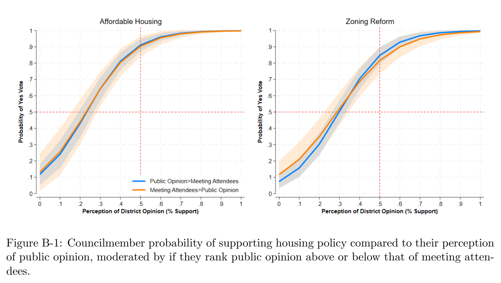

***Figure B-1.*** Councilmember probability of supporting housing policy compared to their perception of public opinion, moderated by if they rank public opinion above or below that of meeting atten- dees.

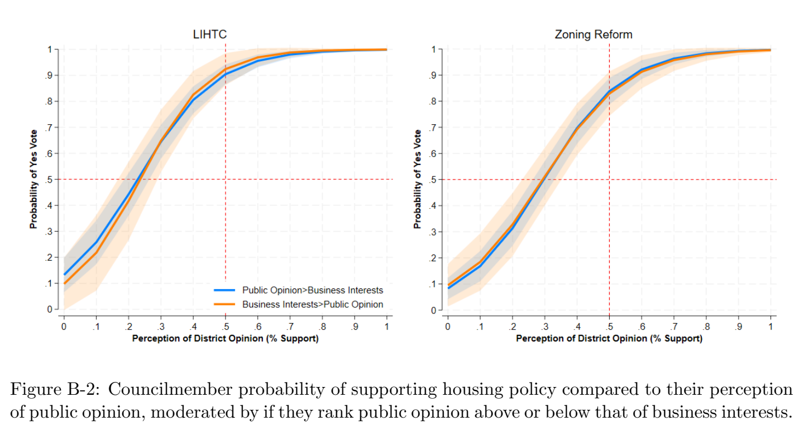

***Figure B-2.*** Councilmember probability of supporting housing policy compared to their perception of public opinion, moderated by if they rank public opinion above or below that of business interests.

A-4

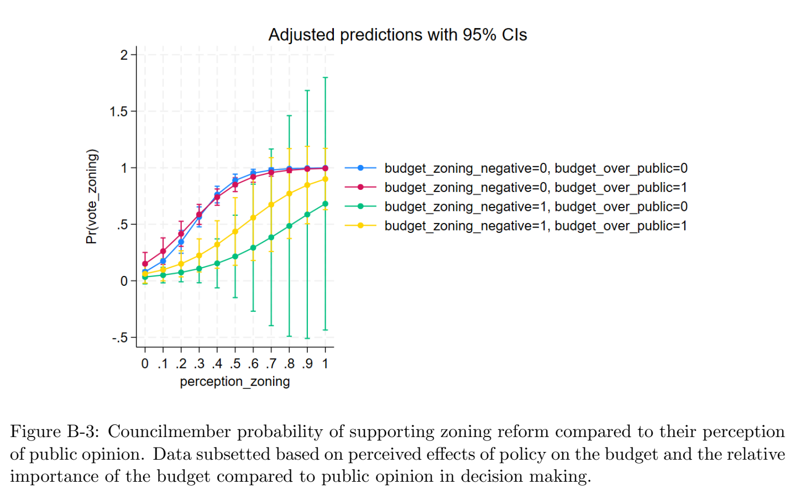

***Figure B-3.*** Councilmember probability of supporting zoning reform compared to their perception of public opinion. Data subsetted based on perceived effects of policy on the budget and the relative importance of the budget compared to public opinion in decision making.

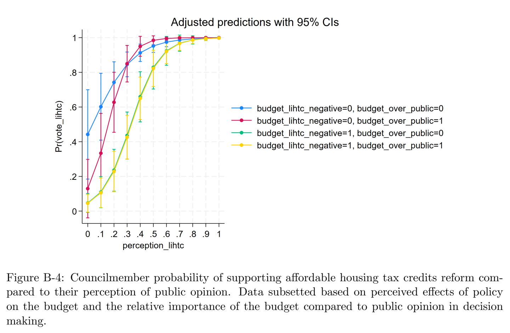

***Figure B-4.*** Councilmember probability of supporting affordable housing tax credits reform com- pared to their perception of public opinion. Data subsetted based on perceived effects of policy on the budget and the relative importance of the budget compared to public opinion in decision making.

A-5

## C Survey Questions

CES

1. Relax local zoning laws in your state to allow for construction of more apartments and condos. 2. Expand federal tax incentives to encourage developers to build homes for people who make less than half of the average income in your area.

Local/State Officials Survey

### 1. Lately, there’s been growing discussion about housing affordability — rising home prices and

rent. While this issue matters more in some areas than others, how important do you believe housing affordability is to voters in your district? [Extremely important, very important, somewhat important, not at all important]

[LATER IN THE SURVEY]

### 2. If the following policy were proposed in your (municipality/State legislature), how would you

vote? Yes/No [Forced choice. Rotate order of policies but have them remained fixed across questions within respondent.]

• Relax local zoning laws to allow for construction of more apartments and condos.

• Expand (local/State) tax incentives to encourage developers to build homes for people who make less than half of the average income in your area.

• Implement rent controls that severely limit landlords from raising rents.

3. Next, we’d like to know generally how you make decisions about housing policy. How important are the following influences as you prepare to cast your vote? Please drag and drop the following items from 1 (most influential) to 5 (least influential). [Rotate influences].

• Opinion of residents

• Opinion of public meeting attendees

• Expected impact on (municipal/state) budget

• Opinion of business leaders

• Opinion of non-profits/labor unions

4. We would also like to know about people in your (municipality/district). In your opinion, what percent of the people living in your (municipality/district) would support the following policy proposals? [Slider from 0 to 100% - default at N/A].

• Relax local zoning laws to allow for construction of more apartments and condos.

• Expand local tax incentives to encourage developers to build homes for people who make less than half of the average income in your area.

• Implement rent controls that severely limit landlords from raising rents.

5. All things considered, what would be the effect of each policy on your city/state’s budget. Net positive (increase revenue over costs) Net neutral Net negative (increase costs over revenue) • Relax local zoning laws to allow for construction of more apartments and condos.

• Expand (local/State) tax incentives to encourage developers to build homes for people who make less than half of the average income in your area.

• Implement rent controls that severely limit landlords from raising rents.

## D Additional Figures and Tables

A-6

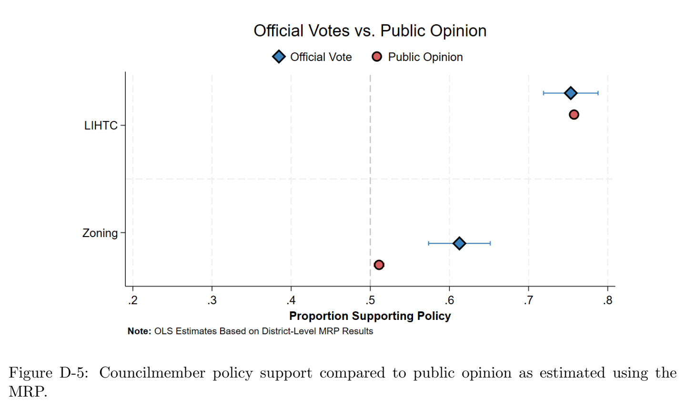

***Figure D-5.*** Councilmember policy support compared to public opinion as estimated using the MRP.

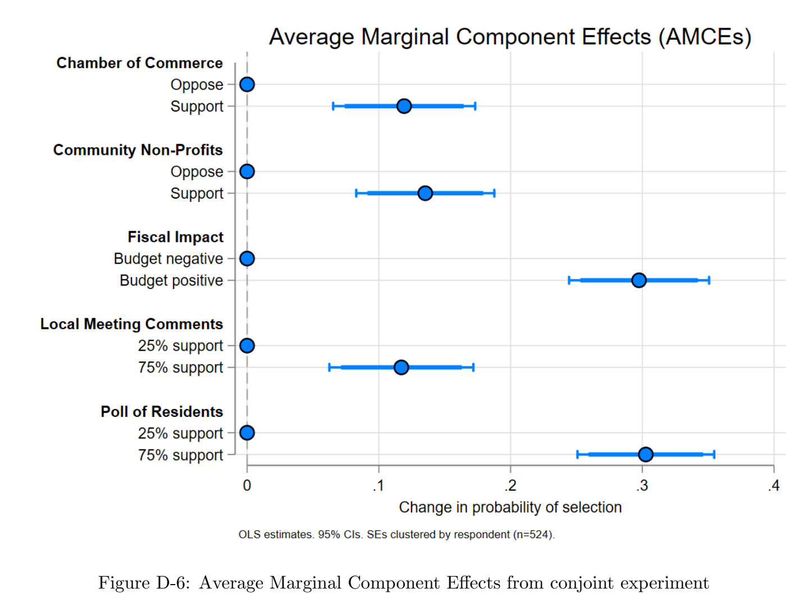

***Figure D-6.*** Average Marginal Component Effects from conjoint experiment

A-7