# When Do Local Interest Groups Participate in the Housing Entitlement Process?

Michael Hankinson∗ Asya Magazinnik† Anna Weissman ‡

May 1, 2024

Abstract

Local governments control a hidden flow of economic goods that never appear on city budgets. Through the housing entitlement process, city officials may condition approval on the benefits developers provide to organized interests. But the politics and policies created by this discretionary review have yet to be studied through the lens of interest group mobilization. We bridge this gap with an analysis of the behavior of construction unions in the housing entitlement process. Using data from 164 U.S. cities, we find that construction union representatives are more likely to attend public meetings to advocate for favorable labor agreements when the expected profitability of new housing developments is high — and thus, when there are more particularistic benefits on the table. While interest group competition within local participatory institutions may signal a robust, pluralist democracy, it also risks driving up housing costs, to the detriment of both organized and unorganized residents.

Keywords: interest groups, local politics, housing, pluralism

All authors contributed equally. Author names are listed in alphabetical order.

∗Assistant Professor, Department of Political Science, George Washington University, 2115 G St NW, Washington, DC 20052, USA; hankinson@gwu.edu

†Professor of Social Data Science, Hertie School, Friedrichstrasse 180, 10117 Berlin, Germany; a.magazinnik@hertie-school.org

‡PhD Candidate, Department of Political Science, University of California, Berkeley, 210 Social Sciences Building, Berkeley, CA 94720, USA; anna weissman@berkeley.edu

## Introduction

Interest groups have long been seen as a vehicle for pursuing particularistic benefits from government (Baumgartner and Leech 1998; Gray and Lowery 1996; Olson Jr. 1971). Within the context of local government, interest group competition has been viewed by some as an indication of a robust, pluralist democracy (Dahl 1961). Organized interests may also increase the chances that potentially marginalized groups win benefits they otherwise might not receive (Berry and Wilcox 2018; Anzia 2019). At the same time, groups with existing power have the capacity to participate more than unorganized or less well-resourced groups, underscoring a tension between interest group competition and pluralism (Schattschneider 1960).

Within local government, the most politically active interest groups are those with “a large, direct, regular, and economic interest in what that government does” (Anzia 2022, p. 12). Government contracts and salaries mobilize public sector unions, whereas tax incentives and abatements draw chambers of commerce into politics. Land use and housing development command the attention of homeowners, neighborhood associations, and developers, each of whom have a material stake in what is built and where. Be it a budget line item or a physical structure, these conflicts generate discrete, observable data with which to measure and compare interest groups’ achievements.

At the same time, local governments also control a hidden flow of large economic goods that do not have obvious budgetary or physical manifestations. Instead, government actors can informally condition their decision making on whether private actors provide benefits to interest groups. For example, in high-demand housing markets, nearly all large-scale multifamily developments require discretionary approval by the city planning commission and, if appealed, the city council (O’Neill, Gualco-Nelson and Biber 2019, 2020). Community groups and labor unions exert political pressure on this discretionary review process to secure benefits for their members, such as meeting spaces or more favorable building contracts (Been 2010; Hankinson 2013; Hankinson and de Benedictis- Kessner 2024). To limit their own political and financial risk, developers compensate these groups in exchange for their public support.

In this paper, we shed light on these less visible conflicts. In particular, we are interested in how interest groups compete for the significant resources that are generated by the institution of local discretionary review. Here, rather than vying publicly for a share of the city budget,

interest groups compete with private interests — and with each other — over the distribution of benefits from projects that require local government approval. The parties to these conflicts are familiar players in local politics: developers, unions, homeowners’ associations, and community organizations, among others. But they participate in an arena that has, until recently (Einstein, Glick and Palmer 2020), flown under the radar of scholarly and media attention: city council and planning commission meetings that significantly influence local officials’ (highly discretionary) decision making. Do political outcomes and behavior in this arena resemble what we know from traditional interest group conflicts over budgetary line items and higher-level policy decisions?

As a first step in this research agenda, we ask a basic question: are organized interest groups motivated to participate in the local discretionary review process by the size of the benefits available for them to win for their members? In other words, does Anzia’s (2022) insight that local interest groups’ activities are shaped by “what governments do” — and more specifically, the resources they control — hold in this relatively unexplored domain?

Although the question is simple, its implications are significant. While the scope of conflict for any individual decision may be drawn narrowly around the groups that have the most immediately at stake, in the aggregate these decisions have far-reaching consequences for the livelihoods of all city residents. In the context of housing, the distribution of benefits from a particular multifamily housing development may be negotiated only between developers, homeowners with a financial stake in the neighborhood, and unions with a stake in the contracts that structure how the housing is built. But in the aggregate, both labor rights and a robust housing supply are issues that affect the city as a whole.

For instance, if interest groups “overfish” in the entitlement process and ask for too many benefits, the development may no longer be profitable, leading the developer to withdraw their proposal. Not only does this scuttle the immediate project, but it may engender a reputation of unpredictability in the entitlement process and have a chilling effect on future development. When less new housing is built, not only are potential benefits left on the table, but local housing prices increase, raising the cost of living for both interest group members and unorganized residents (Been, Ellen and O’Regan 2019; Glaeser and Gyourko 2018).1

1This tension between facilitating new construction and competing for favorable contracts has even caused a major cleavage within the construction labor movement regarding whether to support regulatory streamlining reform to increase the housing supply or maintain the status quo to maximize unions’ political leverage over individual

Our analysis focuses on the behavior of construction unions, a well-organized group with clear, transparent goals: to secure favorable employment contracts for their members. As our dependent variable, we have generated a measure of this group’s participation in the regulatory process using LocalView (Barari and Simko 2023), a database of public comment in local government meetings. For our independent variable, we use an estimate of the local “zoning tax” per quarter acre (Gyourko and Krimmel 2021), a proxy for the surplus from a development. We argue that the zoning tax therefore captures the amount of benefits groups have to vie for without causing the proposal to be financially unprofitable.

Using data from 164 cities across the United States, we find that cities with more benefits on the table have more construction union participation in local meetings. Even controlling for each city’s political ideology, a standard deviation increase in the local zoning tax is associated with a 12 percentage point increase in the probability of a construction union appealing to local legislative bodies for more favorable project labor agreements. While our empirical analysis focuses on the appearance of construction unions in the public record, we also include examples of the rhetoric union representatives use to pressure public officials. Additionally, we set an agenda for the advancement of our theory, including how a lack of coordination among competing interests can stymie the collective provision of the housing supply.

Our paper makes four key contributions. First, we connect the hidden benefit streams generated by the local entitlement process to the mainstream political science literature on interest groups. Although these benefits and the conflicts they generate are not very visible, they have wide-ranging consequences for public welfare and housing affordability. Second, we show how researchers can study the behavior of groups that use local political institutions to compete for benefits, in this case by giving public testimony in local city council and planning commission meetings. Third, we conceptualize a way to measure these groups’ incentives when there are not clear budget line items to compare across cities. Using the zoning tax as a proxy for available benefits, we show that even these hidden benefit streams match Anzia’s (2022) characterization of “large economic goods” as the primary driver of local interest group participation. Finally, we show that groups are responsive to the size of these incentives, even after accounting for local political ideology. As a result, these semi-public negotiations should be considered in line with conventional interest group conflict.

projects (Christopher 2023).

## Theory

Literature & Our Contribution

The large and influential literature on interest groups in American politics has focused almost exclusively on the national level. But many of the insights generated by this literature are not transportable to local politics (Anzia 2022). For instance, scholars have stressed the importance of resources (Schattschneider 1960; Schlozman, Verba and Brady 2012), a lens that has less explanatory power at the local level. Institutional settings — and thus the tools groups have at their disposal to influence government — are also meaningfully different: at the national level, personal contacts and testifying at hearings are used strategically by groups (Baumgartner et al. 2009), but at the local level, groups have direct access to representatives through participatory institutions like public meetings.

The literature’s almost exclusive focus on the federal government has hindered scholarly advancement toward a deep understanding of how interest groups function, in two ways. First, we have an incomplete picture of how groups operate across the entire range of political settings that constitute the American federal system. And while the policies local governments make create a constellation of organized interests distinct from those that coalesce around national issues (Anzia 2022), it is also the case that the same nationally organized groups are increasingly treating national and subnational governments as substitutes when deciding in which venue to participate (Hertel-Fernandez 2019). Second, Anzia points out that focusing attention on the federal government alone — with its fixed set of institutions, organized interests, and policy outcomes at a given time — does not provide the variation needed to test theories about when groups mobilize and exercise influence over the political process. Thus, she writes, “the enterprise of testing for interest group influence has been developed and pursued in a setting where it is perhaps most difficult to detect” (Anzia 2022, p. 12).

We heed the call to devote attention to interest group participation at the local level, in particular by exploiting variation across local governments to learn more about the conditions under which groups participate. Our starting point is a simple, foundational question: are interest groups mobilized to make demands on local government by the size of the potential gains that are at stake? Our expectation is that, all else equal, the share of particularistic benefits available for a group to

compete for will be a key driver of that group’s decision to participate in the political process.

While this is an intuitive proposition — in line with a broad scholarly consensus that interest groups form in order to secure particularistic benefits from government (Hacker and Pierson 2014) — there is not, to our knowledge, empirical evidence of the sensitivity of groups that have already formed to the size of the potential benefits. The work that has been done in the local context has focused on other explanations for interest group mobilization. For instance, Cooper, Nownes and Roberts (2005) have analyzed whether local institutions like nonpartisan elections and initiatives predict interest group activity, finding no effects. Oliver, Ha and Callen (2012) suggest that interest groups will be more active in larger municipalities that have more issues on the agenda, which is also what Anzia (2022) finds in a survey of officials from large and small municipalities.

However, having an issue that concerns an interest group on the local legislative agenda is neither necessary nor sufficient to induce participation: groups may mobilize to bring certain issues to their representatives’ attention when sufficient gains are at stake, and they may choose to accept the status quo on issues already on the table where significant gains from their participation are not anticipated. By measuring groups’ sensitivity to potential benefits, we hope to contribute to a richer theory that is microfounded in interest groups’ desires and incentives.

Our focus on this particular mechanism is motivated by its important implications for representation. On the one hand, responsiveness to the groups that are most deeply affected by a particular issue should be a goal of democratic government. What is more, with lower barriers to participation, local politics may present opportunities for historically marginalized groups to organize and demand benefits from government, whereas they would have continued to be disadvantaged by traditional institutions such as national parties that represent majority interests (Berry and Wilcox 2018).

But the conditions that determine how much groups stand to gain or lose from a policy — and therefore who mobilizes to shape the outcome of that decision — may well be exogenous to the considerations that a policymaker who is interested in overall social welfare would prioritize. As our findings demonstrate, the benefits that construction unions stand to gain from the housing approval process are likely not driven by considered policies that balance the competing demands of organized labor and demand for new housing. Rather, these benefits are shaped by the degree to which preexisting regulatory and political barriers have distorted housing prices in the city. Understanding

how the local housing market frames these conflicts is a critical first step for evaluating their resemblance to robust, pluralist democracy.

Union Participation in the Local Context

We restrict our focus to one particularly active interest group on the local political stage: construction unions. In so doing, we are following Anzia (2022)’s policy-centered approach to the study of local interest group participation: we take the core functions of local governments as our starting point, and we trace from there the issues that are likely to drive interest group activity. Land use — in particular the approval of new housing developments — is one of the most important and most contested functions of city councils and planning commissions (Peterson 1981). As a result, construction unions have strong incentives to engage with these institutions in hopes of securing particularistic benefits.

To do so, unions expand the scope of the conflict between themselves and developers to include the elected and appointed officials who have control over the permitting approval that developers seek. By appealing to these institutions, unions hope that the city council and planning commission will in turn pressure developers to offer more favorable project labor agreements, such as negotiating the proportion of the building work that must be done with union labor and agreements about overtime pay, benefits, pay for time not worked, and work rules (Belman, Bodah and Philips 2007). The ability of unions to secure benefits from this process requires two conditions. First, there must be new development projects. In cities with little new construction, either due to extremely low demand or zoning-induced scarcity, there are no benefits for construction unions to compete for, so we would not expect them to spend time appealing to city government. Second, benefits will only accrue to the union if the development project is financially viable, and actually gets built. In a perfectly competitive market, developers would build housing units to meet demand until the profitability of the marginal development is driven down to a minimally acceptable level of profit — generally between 12 and 20% (National Association of Home Builders 2022). Below this expected profit margin, developers are unlikely to pursue the project. For projects at this profit margin, if a developer is pressured to provide benefits, they may abandon the proposal.

Thus, a perfectly competitive development sector would preclude unions from securing benefits in the entitlement process. If new developers continued to enter a competitive market, they would

build housing until the marginal development yielded the minimally acceptable profit, and there would be no surplus left for interest groups. Indeed, any attempt to claim benefits from a proposed development would cause the development to be financially infeasible, leaving nothing on the table to distribute. In that case, there would be no incentive for construction unions to appear at city council and planning commission meetings, because their success would undermine the project.

Of course, empirically, interest groups do appear at public meetings and are successful in securing benefits. So where does the reality depart from a perfectly competitive market? There are two scenarios under which we would observe both benefits on the table and variation in interest group activity. First, the city may have a less than perfectly competitive market for housing construction. Political barriers created by complex zoning environments restrict the supply of new housing, driving up the costs of development and, consequently, housing prices. Anecdotal evidence suggests that large real estate developers prefer this byzantine regulatory environment, as they are able to invest in the skills and political relationships to best navigate it (Schleicher 2013). Regulations prevent smaller-scale developers from entering the market, allowing large developers to benefit from high profit margins. Still, some empirical research has found limited evidence of monopoly power in the homebuilding sector, even in expensive and politically challenging markets like New York City (Glaeser, Gyourko and Saks 2005).

Second, even if the homebuilding industry is reasonably competitive, there is another source of variation in the benefits on the table across cities: the variance of the profit margin. To highlight this variation, consider two cities. City A has a simple, predictable housing entitlement process. Given a competitive market, every residential development would have the minimally acceptable profit margin of exactly 15%. In contrast, City B has a complex, unpredictable entitlement process. While the expected profit margin is still the minimally acceptable 15%, the profitability of any given project fluctuates dramatically. Some developers face political headwinds and run out of funding, incurring losses. Other well-connected developers easily navigate the process and reap large returns. While City A and City B have the same expected profit margin, the profitable projects in City B would generate sufficient returns for the developer to compensate interest groups and make a profit. As a result, interest groups will organize and attend city council and planning meetings in City B to pressure developers for material benefits.

Both pathways to profit margin variation — uncompetitive markets and unpredictability — can

be traced to the local regulatory environment, which contributes to the variance of the expected profit margin by introducing risk (Gyourko, Hartley and Krimmel 2021). Risk-inducing regulations include the need for additional reviews, detailed reports, unforeseen meetings with community groups, and additional exactions and linkage fees. These unpredictable hurdles add both direct financial costs and costs in the form of delay, making some projects no longer financially feasible while others sail through the process to yield massive returns. While there are numerous metrics designed to measure the complexity of the local zoning environment (e.g., Gyourko, Hartley and Krimmel 2021; Monkkonen, Manville and Lens 2024), we justify our use of (Gyourko and Krimmel 2021)’s “zoning tax” in the Data section.

Hypothesis

We expect that construction union members are more likely to show up to city council and planning commission meetings to advocate for concessions from developers when the pool of benefits on the table — as captured by the zoning tax — is large. In order for this hypothesis to hold, union members must have some (even imperfect) awareness of the size of these benefits. While the precise size may not be known, union members are almost certainly aware of variation in the expected profitability of developments, and frame their demands in terms of their fair share of these profits (e.g., Cohen 2023).

While cities give us the necessary variation to identify this effect in theory, it is important to carefully consider the other factors that may covary with the treatment and outcome. Figure 1 summarizes these factors. To start, the zoning tax is a direct combination of both local housing demand and the local regulatory institutions. Absent strict regulations, a high level of local demand would lead to an increase in the local supply of housing. In contrast, absent local demand, strict zoning regulations would not have much effect on the local housing market. Instead, the zoning tax emerges when high demand faces strict regulations, pushing potential profit margins — and thus the benefits on the table — higher.

But, the relationship between the zoning tax and union activity may be confounded by local ideology. More liberal cities may both adopt more stringent zoning taxes while simultaneously incentivizing union activity, despite there being no causal connection between the two variables. In short, to identify the relationship between the zoning tax and union activity, we must control for

either the local political ideology or the local zoning institutions. We discuss data that helps us do so below.

Local Housing Demand Institutions Ideology

Zoning Tax Union Activity

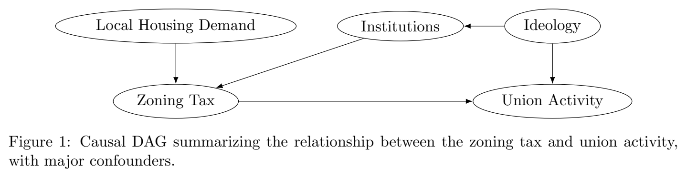

***Figure 1.*** Causal DAG summarizing the relationship between the zoning tax and union activity, with major confounders.

## Data and Measurement

Union Activity

Our dependent variable is a binary indicator for construction union participation in city council and planning board meetings. To code this, we rely on LocalView (Barari and Simko 2023), the largest database of transcripts from local meetings in municipalities across the United States. The LocalView database includes transcripts from all local meetings from 2006 to the present that have been uploaded to YouTube: to date, 78,118 city council and planning board meetings across 798 municipalities.2 We subset this broader sample to cities with at least ten transcripts on file over the period from 2006 to 2023. Although this reduces our effective sample to 590 cities, we think the result is more representative of city council “business as usual”: for cities that do not routinely share their meetings on YouTube but have one or two posted online, we run the risk of relying on meetings that are dominated by outlying agenda items or occurrences, and in which the usual participants are less likely to appear.3

To generate the dependent variable, we start with any minutes in this subset that include a set of terms that would identify the relevant unions. Specifically, we identify minutes that have the term “union” within twenty words of a second term such as “construction,” “building,” “carpenter,” or “bricklayer.” After excluding irrelevant uses of the word “union,” as in names of streets or landmarks, we read the text surrounding the remaining occurrences and manually identify cases in 2For more detail on this sample of municipalities, see Barari and Simko (2023).

3See Figure A-1 for a distribution of the number of minutes per city.

which a construction union member speaks at a meeting advocating for union interests, particularly in the context of new developments. Finally, we collapse these mentions to a cross-sectional binary indicator for whether there was at least one instance of construction union participation in a city over the study period.4 Overall, 72 of the 590 municipalities (12%) have at least one meeting in which construction union members show up to advocate for their interests.

Union representatives speak to advocate for the use of union labor generally, to support specific developments that promise favorable contracts for their members, and to block those that do not. For instance, a positive case we identified in the city of West Covina, California reads as follows: My name is Manuel Salcido. I’m a member of the Southwest Regional Council of Car-

penters. Proud union carpenter. I live in the local area. I live, work, and recreate here

in the vicinity. . . I believe that I will be impacted by the environmental impacts of the

housing element update. The city should require the project to be built utilizing a local

and skilled trained workforce. Local hiring and skilled trained workforce requirements

reduce construction-related environmental impacts while benefiting the local economy.5 In another case, a union member spoke in favor of a proposed development that planned to use a union contract:

Honorable Council, thank you so much for the opportunity to speak tonight. My name is Jason Baez and I’m a proud member of Labor’s International Union of North America. I fully support this project. First, I would like to say that any strong long-term relationship is built on give and take and trust. Whenever the city of MoVal needs infrastructure improvements, utility improvements, buildings — we the union construction force, Local Union 2672, we get in there and tie it all up. I hope this council is going to do the right thing tonight and vote for this.

In a third case, the union representative did the opposite: threatened to withhold support from a project unless the developer committed to using union labor:

Developer La Piara has a very bad track record from past completed projects. They are very irresponsible contractors that cheated their workers by not paying [according to]

area standards — no overtime, and even in some cases cash pay to avoid paying proper

taxes. That is why we, the carpenters’ union, oppose this project until the developer

commits to hiring a responsible contractor that would respect the area standards and

pay the workers correctly and provide benefits for the workers and their families.

4Although the number of construction union mentions per city is quite variable (see Figure A-2 for a distribution), there is not much we can do with this variation, since we do not have a reliable denominator of meetings that actually took place in a city. In other words, because we cannot rely on LocalView having all of a given city’s meetings on file, we would not trust a dependent variable such as a proportion of minutes in LocalView that have a construction union appearance.

5Excerpts have been lightly edited for clarity, as the transcription process introduces errors.

Limitations. Our dependent variable is designed to capture the appearance of construction unions at local participatory meetings. While we are confident that we have gleaned the most information we could from LocalView’s data, we are also limited by which cities choose to post their meetings online. Additionally, it is possible, although unlikely, that there are construction union speakers who have appeared at these meetings and did not use the term “union,” but instead referred to their local organization by its abbreviated name. These appearances would lead to false negatives in our dependent variable as currently constructed.

Zoning Tax

Although Gyourko and Krimmel (2021)’s zoning tax does not directly measure our variable of interest — the exact size of the benefits available for interest group competition — the zoning tax is a proxy for the variability of the profit margin within each city. To estimate the local zoning tax, Gyourko and Krimmel (2021) start with the premise that the price of a house, P (H), is the sum of physical construction costs, CC, and the price of land, P (L).

P (H) = CC + P (L) (1) In turn, the authors define the value of land as being composed of two parts. The first is the price an existing homeowner places on having an extra quarter acre of land (q) times the amount of land on which the house sits (A). The second part represents the value created by winning the political approval to build a home on that land. This is the value created by zoning regulations, Z. P (L) = qA + Z (2) To measure Z, Gyourko and Krimmel (2021) assume that absent local zoning regulations, a quarter acre of land would be valued identically by both an existing homeowner and a developer. In this scenario, were the developer to place greater value on the land compared to the existing homeowner, then the homeowner would subdivide and sell their land to the developer.

But in areas with strict zoning regulations, the developer cannot seamlessly build on any parcel of land. Instead, the value of the land to the developer would come from the ability to build on that land. In this scenario, developers would bid up the price of land that comes with development

rights, whereas homeowners would only bid up land based on its non-development “use value.”6 This differential bidding between developers and homeowners would lead to a gap between the value of land based on its inclusion of development rights. This gap represents the value of land attributable to local zoning regulations (Z).

Using transaction data from 2013 to 2018, Gyourko and Krimmel (2021) calculate this zoning tax at multiple distance bands within 24 CBSAs. Their estimates match both conventional wisdom and survey-based measures of the local zoning environment (e.g., Gyourko, Hartley and Krimmel 2021). For example, the largest regulatory tax can be found in the San Francisco metro area where zoning regulations increase the value of a quarter acre of land by over $400,000. Other metro areas with regulatory taxes include San Jose, Los Angeles, New York, and Seattle. In contrast, there are no significant zoning taxes in Cincinnati and Detroit. In total, Gyourko and Krimmel (2021) estimate this zoning tax for 20 of the CBSAs represented in our LocalView data.7

Limitations. Gyourko and Krimmel (2021)’s estimates of the local zoning tax are based on the valuation of a quarter acre of land for the construction of single-family homes. However, the construction unions we observe in the LocalView data typically negotiate over multifamily and mixed residential-commercial projects. If the zoning tax for single-family housing development were imperfectly correlated with the zoning tax for multifamily housing, there could be some measurement error on our explanatory variable, inducing attenuation bias. We think this is unlikely, as the strictness of specific regulations tends to move in tandem (Gyourko, Saiz and Summers 2008; Gyourko, Hartley and Krimmel 2021). But to the extent that there is random divergence between the two, it would make our finding a conservative estimate of the true effect.

Ideology

To measure municipal political ideology, we use data from the American Ideology Project (Warshaw and Tausanovitch 2022). The authors draw on data from 18 large-scale surveys of the American public to calculate estimates of respondents’ ideal points using a two-parameter item response theory (IRT) model. From these individual-level estimates, the authors then estimate the mass public’s ideology in each municipality using multilevel regression and post-stratification (MRP) 6To borrow the dichotomy between the “use value” versus “exchange value” of land (Logan and Molotch 2007). 7See Table A-2 for the CBSAs included in our data and the number of municipalities we use within each CBSA.

0 200,000 400,000

Zoning Tax ($/quarter-acre)

ytisneD

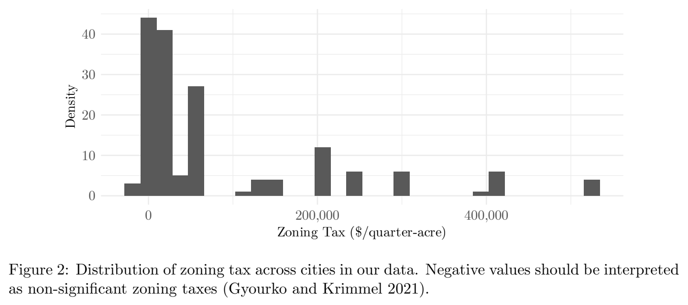

***Figure 2.*** Distribution of zoning tax across cities in our data. Negative values should be interpreted as non-significant zoning taxes (Gyourko and Krimmel 2021).

(Park, Gelman and Bafumi 2004; Tausanovitch and Warshaw 2013). The MRP estimates are not specific to any year but rather apply to the overall time period. Lower values correspond with politically right-wing/conservative positions, higher values with left-wing/liberal positions.8 The data are mean centered at 0 with a standard deviation of 1. As a robustness check, we also present results using each municipality’s Democratic presidential vote share in the 2016 election (Warshaw and Tausanovitch 2022).

Data Construction

Our final analysis dataset is a cross-section of municipality-level observations. To assign the zoning tax, our independent variable, to municipalities, we first geocode Census places within their respective CBSAs. For the places within the CBSAs covered by Gyourko and Krimmel (2021), we measure the distance from each place centroid to the center of its CBSA using the same method as Gyourko and Krimmel (2021).9 We then assign to each place the zoning tax per quarter-acre as defined at the CBSA’s three distance bands: less than 15 miles away, 15 to 30 miles away, and 8This is an inversion from the original data such that values positively correlate with a city’s Democratic vote share.

9The definition of the CBSA center is somewhat subjective. As stated in Gyourko and Krimmel (2021, 11): “There is no agreed upon answer to what the centroid of a large metropolitan area should be. We use the address that Google provides when you ask the question ‘what route should I take to travel from City A to City B?’. For New York City, that is City Hall, which is located at 11 Centre Street in Lower Manhattan near the Wall Street area; in San Francisco, the centroid is near the Marconi Center in the downtown of the city. Neither of these places is near the physical center of the group of counties that make up the CBSA. Atlanta is different, as it turns out that the Georgia state capitol building in downtown Atlanta (which is where Google directs us to if we ask it for a route from our hometown of Philadelphia to Atlanta) is near the physical center of that metropolitan area.”

more than 30 miles away from the urban core.

We merge these data together with the help of shapefiles from Manson et al. (2022). Of the 590 municipalities from LocalView, 164 have data on their CBSA zoning tax. We provide summary statistics of these measures and completeness in Appendix Section A, as well as a map showing their spatial distribution across the United States.

## Methods

Our theoretical framework makes clear how to identify the causal effect of the zoning tax on union activity. Following Pearl (2009), we find the minimally sufficient adjustment sets needed to close all backdoor paths between the zoning tax and union activity, isolating the causal effect of interest. This is achieved by conditioning on either ideology or institutions (not both, which would introduce collider bias). We favor adjusting for ideology, as it allows us to get the most out of our data; by contrast, controlling for institutions would require us to drop two-thirds of our data due to the lack of coverage from existing regulatory datasets (e.g., Gyourko, Hartley and Krimmel (2021)).

For each model, we regress a binary indicator for the appearance of a construction union representative on our continuous measure of the local zoning tax. Each model uses Huber-White standard errors.

Estimation. For city i, we estimate our flagship model as:

UnionMention = β + β ZoningTax + β Ideology + ε (3) i 0 1 i 2 i i

where the coefficient β represents our estimated effect of the local zoning tax on interest group mobilization. As a robustness check, we also swap ideology with Democratic vote share in the 2016 presidential elections.

## Results

Figure 3 shows the bivariate relationship between the estimated zoning tax and union activity. On the y-axis, we plot our dependent variable: a binary indicator for whether a construction union

member showed up at a city council or planning commission meeting to advocate for the group’s interests over the study period. Municipalities are grouped by quartile of the zoning tax, which is shown on the x-axis. We compute the mean probability of a construction union appearance within each group, as well as 95% confidence intervals. In local governments with higher zoning taxes, we find a higher probability of a construction union representative speaking at a city council or planning commission meeting. However, this increase is somewhat nonlinear: construction union activity stays relatively stable until the top quartile, when it rises dramatically from approximately 13 to nearly 40 percent of municipalities. This suggests that groups may need to overcome certain costs or barriers to mobilization, and that they only do so when the potential benefits are sufficiently large.

1.00

0.75

0.50

0.25

0.00

Q1 Q2 Q3 Q4 Zoning Tax (Quarter-Acre) by Quartile

)yraniB(

noitneM

noinU

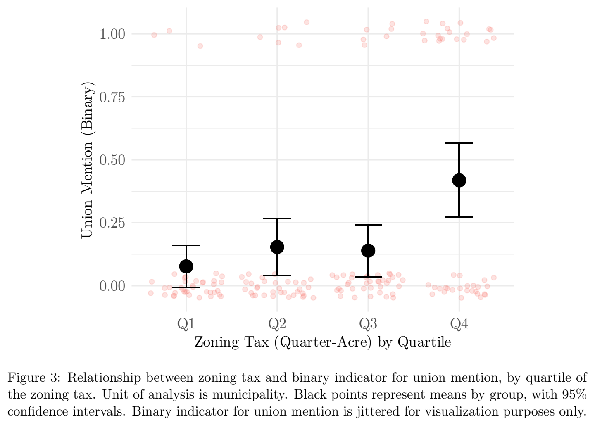

***Figure 3.*** Relationship between zoning tax and binary indicator for union mention, by quartile of the zoning tax. Unit of analysis is municipality. Black points represent means by group, with 95% confidence intervals. Binary indicator for union mention is jittered for visualization purposes only.

Model 1 of Table 1 summarizes this bivariate relationship: a one standard deviation increase in the local zoning tax is associated with a 13 percentage point higher probability of construction union activity in local meetings. In Models 2 and 3, we control for municipal-level ideology, first

using the Warshaw and Tausanovitch (2022) estimates (Model 2) and then using 2016 presidential vote share (Model 3). Doing so, we continue to find that cities with a standard deviation higher zoning tax have a 10 to 12 percentage point higher probability of activity among construction unions.

Model 1 Model 2 Model 3

Zoning Tax (std.) 0.132∗∗∗ 0.120∗ 0.098∗

(0.038) (0.046) (0.045)

Dem. Ideology 0.219

(0.184)

Dem. Pres. Vote (2016) 0.486∗ (0.193) Intercept 0.201∗∗∗ 0.203∗∗∗ −0.076 (0.030) (0.032) (0.109) R2 0.108 0.126 0.152 Adj. R2 0.103 0.114 0.140

Num. obs. 164 144 144

RMSE 0.381 0.393 0.387

∗∗∗p < 0.001; ∗∗p < 0.01; ∗p < 0.05

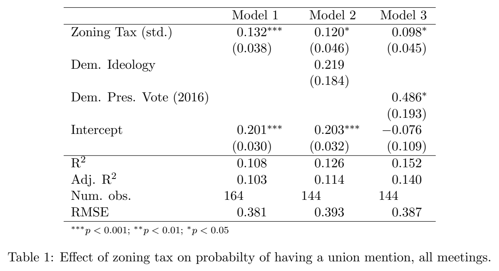

***Table 1.*** Effect of zoning tax on probabilty of having a union mention, all meetings.

[Download data as CSV](tables/tab-01.csv)

In Tables B-3 and B-4, we disaggregate our data into union mentions in either planning commission meetings or city council meetings. Both specifications follow a similar pattern, suggesting that the size of available benefits for interest groups increases the probability of construction union activity in both city council and planning commission meetings.

## Directions for Future Research

Other Strategies of Influence

An inherent limitation of our analytical strategy is the reliance on appearances in city council and planning board meetings to measure interest group activity. Construction unions may fail to show up at meetings under two conditions. First, if union power is particularly low within a city, then the political act of speaking at a meeting will be unlikely to compel the developer to sign a project labor agreement. Even a large amount of potential benefits on the table would not draw union representatives to a meeting if they are unlikely to succeed. In contrast, if construction unions

are very powerful in city politics, they may not need to appear at a local meeting in order to pressure developers to sign project labor agreements. Instead, the union may rely on the threat of withholding campaign contributions and endorsements to city council members, who can in turn pressure developers behind closed doors. Both cases of low and high union power would appear in our data as an absence of union participation.

To work around these challenges, one can use other data sources with substantially more variation than appearance at a public meeting. For example, the California Environmental Quality Act (CEQA) allows for citizens and organizations to request more stringent environmental review from developers under the premise that building new housing risks environmental damage. Many groups that use CEQA are alleged to be shell organizations representing construction unions or other local interest groups seeking community benefits agreements (Elmendorf and Duncheon 2022). As leverage, these groups allegedly file CEQA demands designed to delay development for months or even years. But, if a developer signs a project labor agreement with the unions, these requests are withdrawn. Future research may investigate whether the frequency of CEQA filings is also correlated with the benefits on the table for a project, controlling for the area’s environmental sensitivity.

Competition with Other Groups

Our study captures the participation of construction unions in local politics. However, there are many interest groups in local government that may use public hearings as a venue to vie for benefits, including neighborhood organizations, homeowner associations, and affordable housing advocates. While these groups may present a united front for community benefits, they are also in competition with one another for a fixed (maximum) sum. On one hand, this may mean that the most politically savvy interest group will be rewarded while others will not. On the other hand, absent deft mediating skills by elected officials, the clamoring of multiple interest groups for benefits risks “overfishing,” causing the current developer to walk away from the project or deterring future developers from proposing new housing.

Our data do not allow us to observe this inter-group competition. We are limited to testing whether the size of available benefits spurs construction union activity. But if other interest groups are as responsive as labor unions, then unions may be forced to strategically adjust their demands downward to keep from collectively demanding too much and causing the developer to walk away,

leaving everyone worse off. Are interest groups aware of the coordination problem they face, and do they strategically respond? Are they able to communicate with one another? Do they view competition as a zero-sum, one-shot game or a repeated game in which they would benefit from cooperation? Future research may build our theory in these directions, for instance by interviewing elite members of these interest groups about the challenges and opportunities of inter-group competition.

## Discussion

We find that construction unions are more likely to participate in public meetings when there are more benefits to be gained. Doing so, these interest groups are tapping into a hidden stream of benefits, one privately funded by developers. This framework has several features which make it politically popular. First, the unions are able to secure benefits that do not come from the city budget or the taxpayer. Furthermore, the source — real estate developers’ profits — is also politically beneficial. In survey experiments, respondents are 20 percentage points less likely to support a new development when they are informed that the developer is likely to earn a large profit (Monkkonen and Manville 2019). Finally, voters are unlikely to be aware of how these agreements and their unpredictability may stifle the supply of new housing, harming long-run affordability. This combination of concentrated benefits and diffuse costs makes these negotiations a winning arrangement in the eyes of the interest groups (minus developers), local leaders, and the public. But beyond housing affordability, these negotiations have implications for local democracy. Public meetings allow organized interests to participate in the same manner as ordinary citizens. But group involvement does not guarantee equal representation. Some groups are more easily organized into politics than others (Olson Jr. 1971). As groups mobilize to secure benefits from private actors, we should be concerned about the unorganized interests that are excluded. At the same time, reducing political participation at the local level to limit group influence may also lead to less transparency in decision-making. If organized interests are going to vie for this hidden stream of benefits, which formal institutional arrangements are most favorable for a healthy local democracy?

Conditional on local governments formally requiring developer-supported benefits for interest

groups, two general structures exist: negotiation or schedule-based. In a negotiation-based system, decisions about benefits are negotiated on a project-by-project basis, and public meetings allow for participation in the planning process of each of these projects. These groups can negotiate benefits for their members in an ad hoc manner. The alternative, schedule-based benefits are fixed within each city, across development projects. “Localities can impose exactions. . . according to a nondiscretionary, predetermined schedule” (Kim 2020, 209), meaning each project is held to the same standards with no room for securing benefits from each project individually.

Given most of the negative attention on interest groups in the political science literature is focused on negotiation in public meetings, the alternative might sound preferable for promoting equal representation, but there are trade-offs for each. Negotiating benefit packages for each development agreement introduces uncertainty, the potential for more powerful groups to benefit on projects where they are the most involved in the participatory process or have the most power to obstruct a project, and potentially a larger use of government resources during the planning process (Kim 2020). However, schedule-based systems treat all projects the same, introducing rigidity to the process, which can lead to worse average development outcomes for all relevant parties.

As a third path, these participatory systems can be side-stepped by other forms of collective decision-making, like community benefits agreements (CBAs) (Been 2010; Hankinson 2013). CBAs differ from negotiation-based benefits packages because they often occur prior to reaching the formal approval process. Developers meet with groups on their own, often behind closed doors, in hopes of offering benefits to secure these groups’ endorsements upon reaching the public meeting phase. Generally, only the groups or coalition which have sufficient political leverage are successful in winning compensation. And although CBAs may take many forms, their most opaque embodiment avoids both government officials’ input and the traditional public comment process in open meetings. These developer-interest group only agreements are perhaps the least representative institution for allocating material benefits.

Overall, while interest groups use these local institutions to their advantage to secure benefits, the alternatives to these participatory systems are not inherently better. Would more representative outcomes result from a system with greater predictability than one with more context-dependent decision-making? Existing literature does not provide an empirical answer. Future work should further explore the implications of groups’ pursuit of particularistic benefits in different institutional

environments.

## Conclusion

In this paper, we have outlined a theory of how local interest groups, specifically labor unions, enter the political process of housing entitlement to compete for particularistic benefits. Our theory predicts that construction unions will be more active in local politics when there are more potential benefits on the table — that is, when there is a large gap between the minimally acceptable level of profit to the developer and the expected returns from the proposed project. We have found evidence for this theory by combining a measure of these benefits with transcript data from the city council and planning board meetings of 164 cities. Even after controlling for local political ideology, municipalities with higher zoning taxes experience more construction union activity within their participatory institutions.

A high zoning tax presents a policy challenge for the supply of local infrastructure. A complex entitlement process creates both potentially large profits for developers as well as the means for interest groups to compete for these benefits. This may dissuade interest groups from supporting reforms designed to lower the cost of infrastructure provision. In the case of housing, many groups like construction unions may feel cross-pressured, benefiting from project-by-project deals while suffering from the high housing costs that result from a high zoning tax. But for every crosspressured group, there are many more unorganized citizens who are left out of the entitlement process entirely. Unable to compete for their own particularistic benefits, they ultimately bear the brunt of the costs.

More broadly, our findings advance the understanding of interest group mobilization and participation writ large. In this context, the regular business of the city council and planning boards should be of interest to construction unions. However, even accounting for the local political climate, we find that union participation in local government is driven not by long-term policy debates, but by the material benefits up for grabs with each development decision. That these benefits are the mobilizing factor for interest groups is not an indictment of the groups’ behavior, but rather a symbol of the transactional politics created by discretionary review. Whether these ad hoc negotiations embody the pluralist ideals of competition or systematically disadvantage the

unorganized is a foundational concern of local democracy.

## References

Anzia, Sarah F. 2019. “When Does a Group of Citizens Influence Policy? Evidence from Senior Citizen Participation in City Politics.” Journal of Politics 81(1):1–14.

Anzia, Sarah F. 2022. Local Interests: Politics, Policy, and Interest Groups in US City Governments. Chicago, IL: University of Chicago Press.

Barari, Soubhik and Tyler Simko. 2023. “LocalView, a database of public meetings for the study of local politics and policy-making in the United States.” Nature Scientific Data 10(135).

Baumgartner, Frank R. and Beth L. Leech. 1998. Basic Interests: The Importance of Groups in Politics and in Political Science. Princeton, NJ: Princeton University Press.

Baumgartner, Frank R., Jeffrey M. Berry, Marie Hojnacki, Beth L. Leech and David C. Kimball.

### 2009. Lobbying and Policy Change: Who Wins, Who Loses, and Why. Chicago, IL: University

of Chicago Press.

Been, Vicki. 2010. “Community Benefits Agreements: A New Local Government Tool or Another Variation on the Exactions Theme?” The University of Chicago Law Review 77(1):5–35.

Been, Vicki, Ingrid Gould Ellen and Katherine O’Regan. 2019. “Supply Skepticism: Housing Supply and Affordability.” Housing Policy Debate 29(1):25–40.

Belman, Dale, Matthew M. Bodah and Peter Philips. 2007. “Project Labor Agreements.” Available at: https://files.epi.org/page/-/pdf/031611-earn-pla.pdf (accessed on 05/01/24).

Berry, Jeffrey M. and Clyde Wilcox. 2018. The Interest Group Society. Routledge.

Christopher, Ben. 2023. “Cracks in California labor coalition raise hopes for YIMBY breakthrough on housing bill.” Available at: https://www.pressdemocrat.com/article/news/ cracks-in-california-labor-coalition-raise-hopes-for-yimby-breakthrough-on/ (accessed on 05/01/24).

Cohen, Rachel M. 2023. “How housing activists and unions found common ground in California.” Available at: https://www.vox.com/policy/2023/8/21/23831121/housing-yimbysaffordable-rent-unions-california (accessed on 05/01/24).

Cooper, Christopher A., Anthony J. Nownes and Steven Roberts. 2005. “Perceptions of power: Interest groups in local politics.” State and Local Government Review 37(3):206–216.

Dahl, Robert A. 1961. Who governs?: Democracy and power in an American city. New Haven: Yale University Press.

Einstein, Katherine Levine, David M. Glick and Maxwell Palmer. 2020. Neighborhood Defenders: Participatory Politics and America’s Housing Crisis. New York: Cambridge University Press. Elmendorf, Christopher S. and Timothy G. Duncheon. 2022. “When Super-Statutes Collide: CEQA, the Housing Accountability Act, and Tectonic Change in Land Use Law.” Ecology Law Quarterly 49:655–714.

Glaeser, Edward and Joseph Gyourko. 2018. “The Economic Implications of Housing Supply.” Journal of Economic Perspectives 32(1):3–30.

Glaeser, Edward L., Joseph Gyourko and Raven Saks. 2005. “Why is Manhattan so expensive? Regulation and the rise in housing prices.” The Journal of Law and Economics 48(2):331–369. Gray, Virginia and David Lowery. 1996. “A Niche Theory of Interest Representation.” The Journal of Politics 58(1):91–111.

Gyourko, Joseph, Albert Saiz and Anita Summers. 2008. “A new measure of the local regulatory environment for housing markets: The Wharton Residential Land Use Regulatory Index.” Urban Studies 45(3):693–729.

Gyourko, Joseph and Jacob Krimmel. 2021. “The impact of local residential land use restrictions on land values across and within single family housing markets.” Journal of Urban Economics 126:103374.

Gyourko, Joseph, Jonathan S. Hartley and Jacob Krimmel. 2021. “The local residential land use regulatory environment across U.S. housing markets: Evidence from a new Wharton index.” Journal of Urban Economics 124:103337.

Hacker, Jacob S. and Paul Pierson. 2014. “After the ‘master theory’: Downs, Schattschneider, and the rebirth of policy-focused analysis.” Perspectives on Politics 12(3):643–662.

Hankinson, Michael. 2013. “Externalities or Extortion? Privatizing Social Policy through Community Benefits Agreements.” Harvard Journal of Real Estate 1:7–11.

Hankinson, Michael and Justin de Benedictis-Kessner. 2024. “How Self-Interest and Symbolic Politics Shape the Effectiveness of Compensation for Nearby Housing Development.” Available at: https://www.mhankinson.com/documents/compensation_housing.pdf (accessed on 05/01/24).

Hertel-Fernandez, Alex. 2019. State Capture: How Conservative Activists, Big Businesses, and Wealthy Donors Reshaped the American States–and the Nation. Oxford University Press.

Kim, Minjee. 2020. “Negotiation or schedule-based? Examining the strengths and weaknesses of the public benefit exaction strategies of Boston and Seattle.” Journal of the American Planning Association 86(2):208–221.

Logan, John R. and Harvey Molotch. 2007. Urban fortunes: The political economy of place, with a new preface. Berkeley, CA: University of California Press.

Manson, Steven, Jonathan Schroeder, David Van Riper, Tracy Kugler and Steven Ruggles. 2022. “IPUMS National Historical Geographic Information System: Version 17.0.” Available at: http: //doi.org/10.18128/D050.V17.0 (accessed on 05/01/24).

Monkkonen, Paavo and Michael Manville. 2019. “Opposition to development or opposition to developers? Experimental evidence on attitudes toward new housing.” Journal of Urban Affairs 41(8):1123–1141.

Monkkonen, Paavo, Michael Manville and Michael Lens. 2024. “Built out cities? A new approach to measuring land use regulation.” Journal of Housing Economics 63:101982.

National Association of Home Builders. 2022. “Builders’ Profit Margins Fall as Balance Sheets Grow.” Available at: https://eyeonhousing.org/2022/04/builders-profitmargins-fall-as-balance-sheets-grow/ (accessed on 05/01/24).

Oliver, J Eric, Shang E Ha and Zachary Callen. 2012. Local elections and the politics of small-scale democracy. Princeton University Press.

Olson Jr., Mancur. 1971. The Logic of Collective Action: Public Goods and the Theory of Groups. Cambridge, MA: Harvard University Press.

O’Neill, Moira, Giulia Gualco-Nelson and Eric Biber. 2019. “Developing Policy from the Ground Up: Examining Entitlement in the Bay Area to Inform California’s Housing Policy Debates.” Hastings Environmental Law Journal 25:1.

O’Neill, Moira, Giulia Gualco-Nelson and Eric Biber. 2020. “Sustainable Communities or the Next Urban Renewal?” Ecology Law Quarterly 47:1061–1122.

Park, David K., Andrew Gelman and Joseph Bafumi. 2004. “Bayesian multilevel estimation with poststratification: State-level estimates from national polls.” Political Analysis 12(4):375–385. Pearl, Judea. 2009. Causality: Models, Reasoning and Inference. New York: Cambridge University Press.

Peterson, Paul E. 1981. City limits. Chicago, IL: University of Chicago Press.

Schattschneider, E.E. 1960. The Semisovereign People: A Realist’s View of Democracy in America. New York: Holt, Rinehart and Winston.

Schleicher, David. 2013. “City Unplanning.” Yale Law Journal 122(7):1670–2105.

Schlozman, Kay Lehman, Sidney Verba and Henry E. Brady. 2012. The unheavenly chorus: Unequal political voice and the broken promise of American democracy. Princeton, NJ: Princeton University Press.

Tausanovitch, Chris and Christopher Warshaw. 2013. “Measuring constituent policy preferences in congress, state legislatures, and cities.” Journal of Politics 75(2):330–342.

Warshaw, Christopher and Chris Tausanovitch. 2022. “Subnational ideology and presidential vote estimates (v2022).” Available at: https://doi.org/10.7910/DVN/BQKU4M (accessed on 05/01/24).

## Online Appendix for “When Do Local Interest Groups Participate

A Descriptives

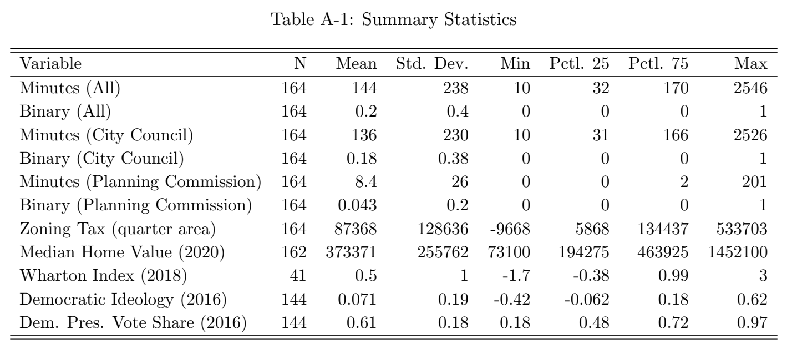

***Table A-1.*** Summary Statistics

[Download data as CSV](tables/tab-02.csv)

Variable N Mean Std. Dev. Min Pctl. 25 Pctl. 75 Max Minutes (All) 164 144 238 10 32 170 2546 Binary (All) 164 0.2 0.4 0 0 0 1 Minutes (City Council) 164 136 230 10 31 166 2526 Binary (City Council) 164 0.18 0.38 0 0 0 1 Minutes (Planning Commission) 164 8.4 26 0 0 2 201 Binary (Planning Commission) 164 0.043 0.2 0 0 0 1 Zoning Tax (quarter area) 164 87368 128636 -9668 5868 134437 533703 Median Home Value (2020) 162 373371 255762 73100 194275 463925 1452100 Wharton Index (2018) 41 0.5 1 -1.7 -0.38 0.99 3 Democratic Ideology (2016) 144 0.071 0.19 -0.42 -0.062 0.18 0.62 Dem. Pres. Vote Share (2016) 144 0.61 0.18 0.18 0.48 0.72 0.97 A-1

0 1000 2000 3000 4000 Number of Minutes seitiC

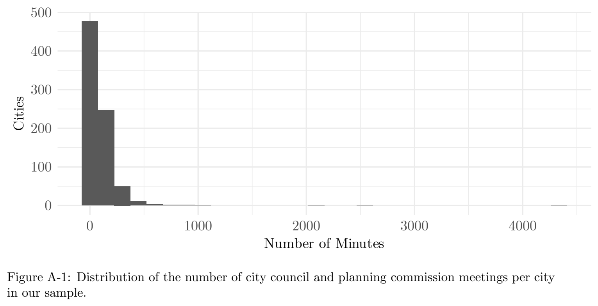

***Figure A-1.*** Distribution of the number of city council and planning commission meetings per city in our sample.

0 5 10 15 Number of Mentions

seitiC

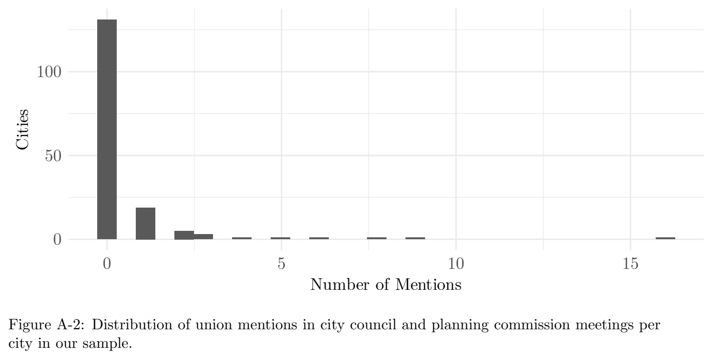

***Figure A-2.*** Distribution of union mentions in city council and planning commission meetings per city in our sample.

A-2

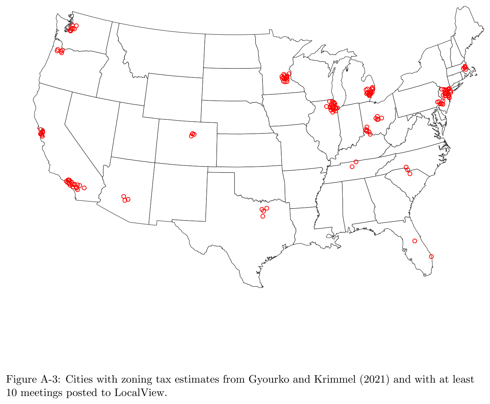

***Figure A-3.*** Cities with zoning tax estimates from Gyourko and Krimmel (2021) and with at least 10 meetings posted to LocalView.

A-3

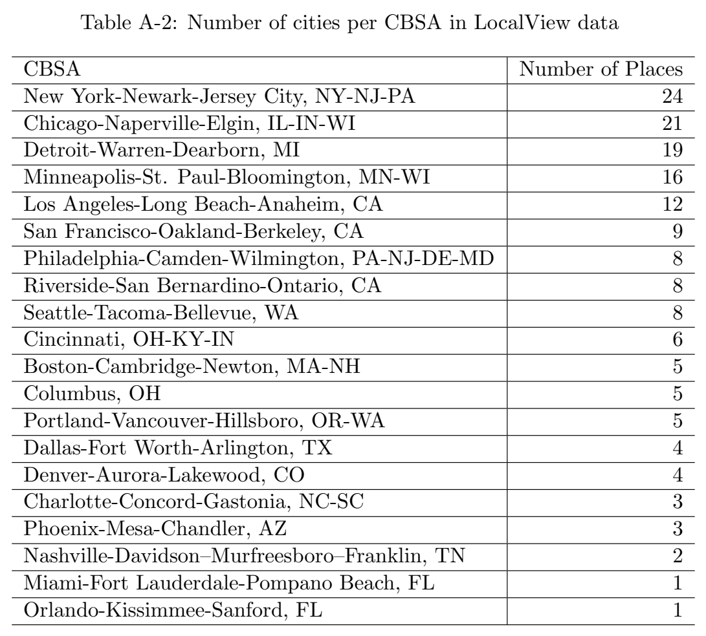

***Table A-2.*** Number of cities per CBSA in LocalView data CBSA Number of Places New York-Newark-Jersey City, NY-NJ-PA 24 Chicago-Naperville-Elgin, IL-IN-WI 21 Detroit-Warren-Dearborn, MI 19 Minneapolis-St. Paul-Bloomington, MN-WI 16 Los Angeles-Long Beach-Anaheim, CA 12 San Francisco-Oakland-Berkeley, CA 9 Philadelphia-Camden-Wilmington, PA-NJ-DE-MD 8

[Download data as CSV](tables/tab-03.csv)

Riverside-San Bernardino-Ontario, CA 8 Seattle-Tacoma-Bellevue, WA 8 Cincinnati, OH-KY-IN 6 Boston-Cambridge-Newton, MA-NH 5 Columbus, OH 5 Portland-Vancouver-Hillsboro, OR-WA 5 Dallas-Fort Worth-Arlington, TX 4 Denver-Aurora-Lakewood, CO 4 Charlotte-Concord-Gastonia, NC-SC 3 Phoenix-Mesa-Chandler, AZ 3 Nashville-Davidson–Murfreesboro–Franklin, TN 2 Miami-Fort Lauderdale-Pompano Beach, FL 1 Orlando-Kissimmee-Sanford, FL 1 A-4

B Results by Meeting Type

Model 1 Model 2 Model 3 Zoning Tax (std.) 0.099∗∗ 0.093∗ 0.070 (0.037) (0.045) (0.044) Dem. Ideology 0.126

(0.177)

Dem. Pres. Vote (2016) 0.398∗ (0.186) Intercept 0.177∗∗∗ 0.183∗∗∗ −0.050 (0.029) (0.032) (0.105) R2 0.066 0.075 0.097 Adj. R2 0.061 0.062 0.084 Num. obs. 164 144 144

RMSE 0.371 0.385 0.380 ∗∗∗p < 0.001; ∗∗p < 0.01; ∗p < 0.05

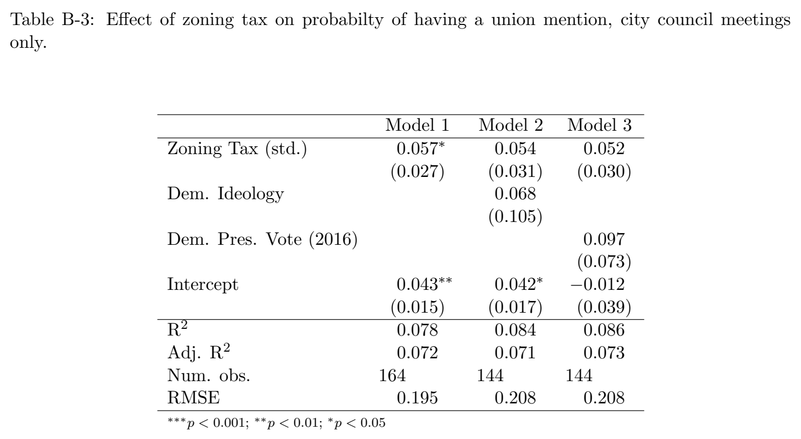

***Table B-3.*** Effect of zoning tax on probabilty of having a union mention, city council meetings only.

[Download data as CSV](tables/tab-04.csv)

Model 1 Model 2 Model 3 Zoning Tax (std.) 0.057∗ 0.054 0.052 (0.027) (0.031) (0.030) Dem. Ideology 0.068

(0.105)

Dem. Pres. Vote (2016) 0.097 (0.073) Intercept 0.043∗∗ 0.042∗ −0.012 (0.015) (0.017) (0.039) R2 0.078 0.084 0.086 Adj. R2 0.072 0.071 0.073 Num. obs. 164 144 144

RMSE 0.195 0.208 0.208 ∗∗∗p < 0.001; ∗∗p < 0.01; ∗p < 0.05

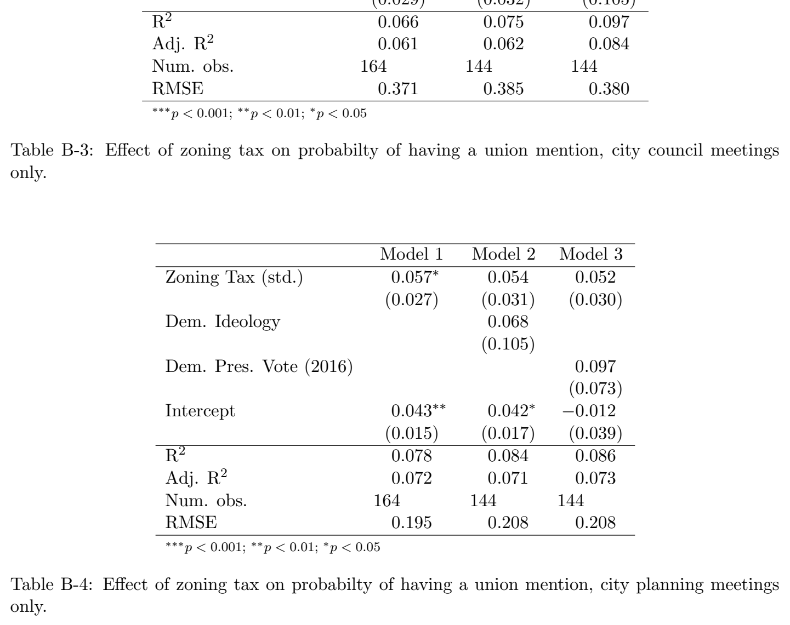

***Table B-4.*** Effect of zoning tax on probabilty of having a union mention, city planning meetings only.

[Download data as CSV](tables/tab-05.csv)

A-5