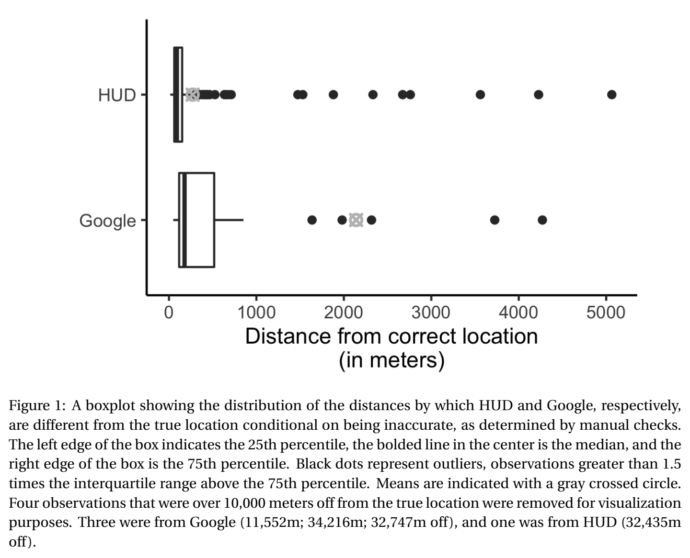
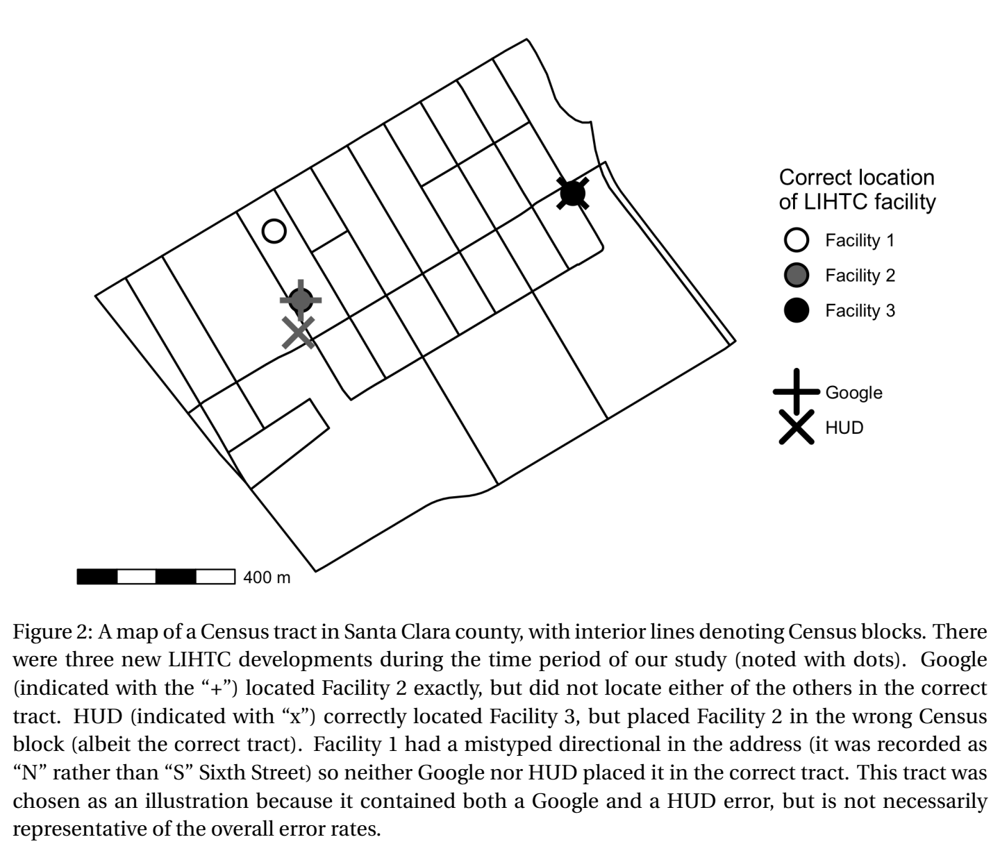

# Inaccuracies in Low Income Housing Geocodes: When and Why They Matter

Inaccuracies in Low Income Housing Geocodes:

### Nicole E. Wilson, Michael Hankinson, Asya Magazinnik, and Melissa Sands*

### March 18, 2023

Abstract

Scholars across disciplines frequently employ data on housing developments subsidized by the National Low Income Housing Tax Credit (LIHTC). We find that the geographic coordinates for these developments, generated by the U.S. Department of Housing and Urban Development (HUD), are frequently inaccurate. Using both the population of data from California and a national sample, we find that HUD-provided geocodes are inaccurate nearly half the time while Google-generated geocodes are almost always more accurate. However, while Google’s geolocation is more likely to be accurate, when it is inaccurate, it deviates from the true location by a much greater distance than HUD. We therefore recommend that scholars use Google-generated geocodes for most research applications where the localized environment matters; however, in studies where observations are aggregated to a larger area, researchers may prefer to use HUD geocodes, which are more frequently inaccurate but typically by smaller distances.

*We thank Sara Borenstein for her excellent research assistance on this project.

Introduction

Cities are built on a foundation of spatial proximity, with residential density creating opportunities for social connections, economic activity, and political life.1 Consequently, social scientists rely on geographic data to study the urban political world, be it records on where voters live to explain how citizens influence each other’s political behavior, or the location of protests to understand how social movements unfold, or the siting of infrastructure that connects citizens to — or isolates them from — their government and one another.

When it comes to empirically testing theories that operate over spatial distance, the accuracy of georeferenced data is of the utmost importance. Even small inaccuracies can introduce noise, obscuring theoretical relationships that really exist (Type II error), or even bias toward false findings (Type I error), leading future researchers down the wrong path. But due to resource constraints, even the most careful and ambitious researchers are unable to collect all the georeferenced data they need on their own. Instead, they must often rely on administrative agencies that build and maintain such datasets, with little ability to independently verify the data’s quality.

Thus, when systematic inaccuracies in administrative data are discovered, scholars have a responsibility to notify the intellectual community. In this paper, we document inaccuracies found in the National Low Income Housing Tax Credit (LIHTC — pronounced “lie-tech”) Database. Generated by the U.S. Department of Housing and Urban Development (HUD), this publicly available database collects information on every LIHTC-funded project. And because over 90% of subsidized housing built in the U.S. since 1987 has been funded in part by LIHTC (Diamond and McQuade 2019), the LIHTC database is the primary source of insight into the causes and consequences of affordable housing development in the United States. Across political science, economics, and urban studies, scholars have explored the effect of LIHTC developments on such diverse outcomes as crime (Woo and Joh 2015, Freedman and Owens 2011, Diamond and McQuade 2019), property values (Green, Malpezzi, and Seah 2002; Funderburg

and MacDonald 2010; Ellen et al. 2007; Diamond and McQuade 2019; Deng 2011), neighborhood demographics (Freeman and Rohe 2000; Freeman 2003; Freedman and McGavock 2015; Diamond and McQuade 2019), neighborhood turnover (Baum-Snow and Marion 2009), and school quality (Di and Murdoch 2013).

A core component of the LIHTC data is the inclusion of a geographic coordinate marking the precise location of each LIHTC-funded development. While using the data for our own research, we discovered that 45% of the 851 HUD-provided geocodes we manually verified are inaccurate to varying degrees.2 Note that we describe a geocode as accurate if it appears within the facility parcel. On occasion, geocodes are recorded far from the centroid of a large parcel; the Methodology section describes how we deal with these special cases. The median distance discrepancy between the HUD-provided geocode and the coordinate we manually verified as accurate is 70 meters, with a mean discrepancy of 153 meters. In contrast, geocodes that we generated through the publicly available Google Geocoding API were accurate 95% of the time and had a median distance discrepancy of 0 meters, with a mean discrepancy of 136 meters. We replicated this process on a national sample of LIHTC developments built from 2012 to 2020 and found comparable levels of error.

These inaccurate geocodes introduce nontrivial measurement error in studying how LI- HTC affects the local political, social, or economic environment — however that local environment is defined. Some studies use a continuous measure of distance to low-income housing (Di and Murdoch 2013; Diamond and McQuade 2019; Green, Malpezzi, and Seah 2002), while others define radii within which an observation is considered “treated” by a LIHTC development (Baum-Snow and Marion 2009; Ellen et al. 2007; Freedman and McGavock 2015; Funderburg and MacDonald 2010; Woo and Joh 2015; Woo, Joh, and Van Zandt 2016), with distances as small as 500 feet (152.4 meters) (Woo, Joh, and Van Zandt 2016) or 1,000 feet (304.8 meters) (Deng 2011; Ellen, O’Regan, and Voicu 2009). Under both of these approaches, a mean discrepancy of 153 meters (equivalent to about 500 feet) poses significant challenges to detecting effects. Still other studies aggregate observations to a larger geographic unit, and while some

units are large enough for the average error not to matter — for instance, town (Mast 2022) — we find that for smaller units the misclassification error can be substantial. Within our subset of California data, we find that 6% of the HUD coordinates are incorrectly assigned to the block group level, and fully 19% are inaccurate at the block level.

In this research note, we first provide a detailed description of the LIHTC data and the specific subsets of the data that we carefully audited. We then describe our methodology for checking the accuracy of the data, and we summarize the identified patterns. In short, coordinates generated by entering LIHTC facility addresses into the Google Geocoding API were much more consistently accurate than the HUD-provided coordinates. Finally, we provide recommendations for scholars interested in working with the LITHC data, taking into consideration that a manual audit is not feasible for most projects.

Data Description

At the time of writing, the complete LIHTC database had 50,567 observations, each representing a specific housing project that has received LIHTC funding. For our paper (Hankinson, Magazinnik, and Sands 2022), we focus on new construction developments3 placed in service in California between 1999 and 2010, since this enables us to test the causal effect of new low-income developments on support for housing referenda that appeared on the state ballot. These criteria limit our sample to 1,266 projects. A comparison between our sample and the full nationwide LIHTC dataset is in Table A.1 in the Appendix. The developments in our subset are slightly newer when compared to the complete data. The projects in our subset also have a somewhat higher annual LIHTC allocation amount, on average. Facilities in our sample also tend to have higher numbers of total units and low-income units. While our California sample is not and was not built to be perfectly representative of all LIHTC data, we find little evidence that the accuracy of HUD geocodes varies by year or allocated amount (Figures A.1-A.2). However, facilities with more units (both total and low-income) appear to be more accurately located on average (Figures A.3-A.4), suggesting that HUD accuracy rates may be even lower in

the broader dataset than we find in our data.

Methodology

To assess the accuracy of the HUD-provided geocodes, we needed to find the true locations of the LIHTC developments — a labor-intensive undertaking that was only feasible for a limited number of observations. We therefore focused our efforts on a sample of the data where we expected to find the highest concentration of inaccuracies, and the largest inaccuracies in magnitude. To identify this sample, we first passed the names and addresses of the facilities in our California subset through the Google Geocoding API4, generating a separate set of latitude/longitude coordinates. We then calculated the great circle distance between the two points (HUD- and Google-provided coordinates) for each facility. Next, we pulled out the cases where the discrepancy between HUD and Google was greater than 35 meters (N = 851).5

The motivation for our focus on this sample was our intuition that the greater the distance between the two coordinates, the greater the likelihood that HUD is wrong, and the higher the returns on correcting the data point for constructing an accurate measure of spatial proximity to LIHTC. Of course, it is also possible that there were inaccuracies among developments that fell below our 35-meter discrepancy threshold. But with smaller discrepancies, conditional on at least one of the coordinates (either HUD or Google) being accurate for a given LIHTC facility, there is less measurement error introduced by the inaccuracy. And while there were likely some cases where HUD and Google were close to one another but both inaccurate — perhaps due to an error in the address — we believe such cases to be relatively unusual.

For these 851 developments, we evaluated:

1. whether the HUD coordinates were accurate;

2. whether the Google coordinates were accurate;

3. whether neither coordinate should be used, in which case we recorded a new coordinate. We assessed accuracy by entering both coordinates into Google Maps and using the default layer, the satellite layer, Streetview, and historical satellite imagery from Google Earth to ascer-

tain whether the coordinates indeed fell within the bounds of the correct LIHTC parcel.6 We often referenced auxiliary information about the development, such as the number of units and year placed in service, and verified the development’s location on the property management company’s website. Inaccuracies included cases where the point was placed on an incorrect building, empty lot, or a street outside the facility. If neither coordinate was near the centroid of the development and the parcel was large, even if one or both were technically accurate (i.e., within the parcel), we recorded a third, more central set of coordinates to allow for more precise measurement of proximity to a LIHTC facility. We also recorded whether the Google coordinates were better than the HUD coordinates, defining “better” as closer to the facility’s centroid.

Key Findings

Inaccuracy of HUD Coordinates

Among the HUD coordinates we checked, slightly more than half — 55.3% (N = 471) — were accurate. It appears our intuition was correct that greater distances between the HUD and Google coordinates indicate more likely inaccuracies. When we break up the distances between Google and HUD into quartiles, we see that for the greatest distances between them (∼122.0 meters and above), HUD is accurate only 39.0% of the time. The HUD accuracy rate rises to 56.1%, 57.3%, and 69.0% in the third, second, and first quartiles, respectively, with HUD being accurate more than two-thirds of the time at discrepancies less than 52.7 meters (Figure B.1 in the Appendix). In short, as the distance between the Google and HUD coordinates for a given facility decreases, HUD accuracy increases. Still, HUD is frequently inaccurate even when Google and HUD are relatively close. Again, there may be cases in which HUD and Google are very close to one another but are both inaccurate, which we cannot identify here.

Comparison of HUD and Google Coordinates

Google coordinates were more accurate than the HUD-provided coordinates the vast majority of the time (for 80.1% of facilities). When HUD was inaccurate, Google was almost always

Table 1: Accuracy of HUD and Google coordinates

Both Accurate Only HUD Accurate Only Google Accurate Neither Accurate

53.0% 2.5% 41.5% 3.1%

better (94.5% of the time). Further, even when HUD was technically accurate (i.e., within the parcel), Google was still better (i.e., closer to the centroid) most of the time (68.6%).

We recorded new coordinates in 8.9% of cases. For many of these observations, HUD was technically accurate — the coordinate was located within the LIHTC parcel — but it was far from the centroid of the development, which would also introduce measurement error for spatial proximity to LIHTC.7 Conditional on HUD being accurate, we recorded new coordinates 6.4% of the time. Google coordinates were more likely to be central to the facility when they were within the parcel: conditional on Google being accurate, we recorded new coordinates less frequently (4.7% of the time).

Taken together, in a slight majority of cases (53.0%), both HUD and Google were accurately located within the facility parcel (Table 1). In 41.5% of cases, Google was correct when HUD was not. Combined, that indicates an overall accuracy rate of 94.5% for Google. In only 3.1% of cases, neither the HUD-provided coordinates nor the Google coordinates were accurate. These are typically cases in which there is an error in the address. However, these errors seem to affect HUD and Google in different ways; the median distance between the two sets of coordinates is 128.8 meters (compared to a median distance of 76.2 meters in all observations checked). About 40% have a directional (e.g., “N" or “S") in the street name, an issue we address in the discussion, below. Finally, in only 2.5% of cases, HUD was correct, but Google was not. In short, Google coordinates were almost always superior to HUD coordinates.

Degree of Inaccuracies

However, although Google was less frequently inaccurate, it was off by a greater degree when it was incorrect. When HUD was inaccurate, it deviated from the correct point by an average of 271.0 meters.8 Google, on the other hand, was off by an average of 2,140.3 meters in the

47 cases in which it was inaccurate.9 We discuss in more detail below how these distances can be consequential for defining exposure to LIHTC in previous studies, even when observations are aggregated to a higher unit such as a Census block or tract. See Figure 1 for a summary of the distribution of location errors for the inaccurate geocodes.

***Figure 1.*** A boxplot showing the distribution of the distances by which HUD and Google, respectively, are different from the true location conditional on being inaccurate, as determined by manual checks. The left edge of the box indicates the 25th percentile, the bolded line in the center is the median, and the right edge of the box is the 75th percentile. Black dots represent outliers, observations greater than 1.5 times the interquartile range above the 75th percentile. Means are indicated with a gray crossed circle. Four observations that were over 10,000 meters off from the true location were removed for visualization purposes. Three were from Google (11,552m; 34,216m; 32,747m off), and one was from HUD (32,435m off).

Replication with National Data

Along with using data from California, Hankinson, Magazinnik, and Sands (2022) also assesses the effect of LIHTC developments nationwide on attitudes towards new housing development. Specifically, we draw a national sample of 959 LIHTC developments placed in service between 2012 and 2020 based on their proximity to respondents from a nationally representa-

Table 2: Accuracy of HUD and Google coordinates: comparing California subset and national sample Both Accurate Only HUD Accurate Only Google Accurate Neither Accurate California 53.0% 2.5% 41.5% 3.1%

National 41.7% 5.2% 43.2% 9.9%

tive survey we fielded in 2016. Unlike the California sample, this national sample is not meant to capture the universe of LIHTC development during its 13 year window, nor is the sample meant to be representative. As reported in Table A.1, developments within this subgroup are built later, have more money allocated to them, and have more units relative to the broader population of LIHTC developments. But importantly, the sample allows us to assess the generalizability of these inaccuracies beyond California, allowing us to rule out the possibility that these inaccuracies are attributable to the California Tax Credit Allocation Committee (CTCAC) that administers the LIHTC program.

The patterns from the national sample, after restricting to cases where the discrepancy between HUD and Google was greater than 35 meters (N = 476), are largely similar to our findings using the California data (Table 2). However, there are some differences in terms of magnitudes. While both HUD and Google were correct 53.0% of the time in California, this rate drops to 41.7% when sampling from the entire country. The rate at which only Google was accurate was 43.2% in the national sample (compared to 41.5% for California only). There were also more cases in the national data for which only HUD was accurate — 5.2%. The rate at which neither coordinate was considered accurate was more than three times higher in the national sample at 9.9%. Despite these differences, we have no reason to believe that the data generation process responsible for inaccuracies in the California data is not generalizable to the national sample. Discussion

Source of Inaccuracies

One reason for the inaccuracies and the divergence between results in California and the rest of the country is HUD’s geocoding procedure. When we reached out to HUD via email

about the inaccuracies in the data, they responded with the following:

“Address data submitted to HUD — either through the Department’s systems of record, or directly to a program office — are processed using the agency’s Geocode Service Center (GSC). Address data is not validated prior to submission to the GSC, and location data interpolated by the system is not reviewed for post process accuracy. Instead, HUD relies on return codes supplied by the system to indicate the overall accuracy of the interpolated data. Addresses that cannot be interpolated to

the rooftop of a structure associated with a given address are assigned the location

of the geographic center point for the smallest verified geography for which the ad-

dress is located.”

We expect that the degree of inaccuracy introduced by this interpolation procedure will vary by the level of previous development in the area. In already developed urban areas, the error should not be consequential. For instance, in the case of a short, existing street that goes from 1 to 100 Main Street, 50 Main Street will fall approximately in the middle of a relatively small space. By contrast, in rural areas, developments are more likely to go on a new road that does not exist prior to construction, causing HUD to place the coordinate in the middle of the lowest verified geographic unit. Further, even existing roads may be long or have irregular numbering systems, making interpolation in these cases less precise. We believe this to be a potential explanation for why the California HUD data is more accurate than the national sample: more of California’s LIHTC developments are being built in previously developed areas.

To test our theory that newly constructed roads are contributing to HUD’s geocoding inaccuracies, we would need data on the timing of road segment construction across the US. Instead, we use 2010 Census-tract level population density as a proxy for the level of previous development surrounding the new LIHTC construction. Denser areas are less likely to build completely new road segments for LIHTC development, but rather use the LIHTC funding to redevelop existing residential lots with established — not interpolated — street addresses.

For both our California and national samples, HUD geocodes are more likely to be accurate low density areas (Figures A.5 and A.6). However, conditional on being inaccurate, the magnitude of the inaccuracy is greater in low density areas (Figures A.5 and A.6). While seemingly contradictory, these findings match our understanding of HUD’s geocoding procedure.

Because parcels in high density areas are relatively smaller — e.g., the size of one apartment building — a geocode that is only off by 10 meters may register as inaccurate. In low density areas, larger parcels provide greater leeway for geocodes to land on the correct parcel, thus avoiding some of these inaccuracies. Regarding the magnitude of the inaccuracy, the larger scale of parcels in low density areas means that inaccurate geocodes are likely to be farther away. Furthermore, these larger inaccuracies match our theory that LIHTC development in low density areas is more likely to be on new roads for which the HUD geocoder does not have records and is forced to guess. Thus, we recommend that researchers focusing on LIHTC development in rural areas exercise extra caution when using the HUD geocodes.

Implications

As noted above, existing studies have taken varying approaches to using the LIHTC data. Several — including Shamsuddin and Cross (2020) and Freedman and McGavock (2015) — aggregate to the Census tract level.10 We now examine how the assignment to Census tract changes when using corrected California data. For all analyses, we use 2010 Census designations. We find that 3.3% of observations (N = 28) fall into the incorrect Census tract when using the HUD-provided coordinates. If we used Google coordinates instead, fewer (1.9%) would have been assigned to the wrong Census tract. Even at this high level of aggregation, using geocodes from Google reduces error.

At the block group level, a smaller level of aggregation, 5.5% of HUD coordinates are incorrectly assigned, compared to 2.2% of Google-generated coordinates. Finally, when looking at Census blocks, HUD miscategorizes a full 19.4% of developments (compared to only 5.9% for Google). An example visualizing these types of errors is in Figure 2.

Other studies use distance to a LIHTC development to define treatment, rather than aggregated to a particular geographic unit. Deng (2011), for example, considers the effect of LIHTC developments on neighborhood characteristics. She defines the “impact area” as within 1000 feet (or 304.8 meters) of a development. Given that HUD was off by an average of 271.0 me-

***Figure 2.*** A map of a Census tract in Santa Clara county, with interior lines denoting Census blocks. There were three new LIHTC developments during the time period of our study (noted with dots). Google (indicated with the “+”) located Facility 2 exactly, but did not locate either of the others in the correct tract. HUD (indicated with “x”) correctly located Facility 3, but placed Facility 2 in the wrong Census block (albeit the correct tract). Facility 1 had a mistyped directional in the address (it was recorded as “N” rather than “S” Sixth Street) so neither Google nor HUD placed it in the correct tract. This tract was chosen as an illustration because it contained both a Google and a HUD error, but is not necessarily representative of the overall error rates.

ters, and was inaccurate for almost half of all cases, these inaccuracies would likely affect this analysis. Other studies that use larger distances (say, 2,000 feet, or 609.6 meters as in Ellen et al. (2007) and Woo and Joh (2015)) may be less affected. As discussed above regarding the source of inaccuracies, the HUD inaccuracy problem may be more severe in less developed areas.

Recommendations

Given that Google’s geocodes were largely more accurate than the HUD geocodes — in both the California data and the national sample — researchers should strongly consider using Google-generated geocodes in future studies concerning LIHTC developments instead of the HUD-provided coordinates. Although in the majority of cases where HUD was inaccurate, it

was only by a small distance, it was common for the HUD coordinate to fall on a neighboring parcel or building, on the closest major road, or at the start of a long access road. Though minor in scale, these inaccuracies could pose challenges for micro-level analyses.

However, there may be some cases in which it is advantageous to stick with the HUDprovided coordinates. Specifically, because Google tends to be off by greater distances, HUD may be better when aggregating up to a geographic unit for which minor inaccuracies should not matter, but large ones might.

Further, we offer a few cautions even when working with geocodes from Google. First, there were frequent issues with addresses that had a directional in the street name (i.e., “North/N”, “South/S”, “East/E”, “West/W”) being incorrectly recorded by HUD in the address field. For instance, one facility had the address as 426 W Nicolet St when the actual development is at 426 E Nicolet St, an inaccuracy of 0.5 miles. Because the Google geocode is based on the recorded address, there will be little discrepancy with the HUD geocode, and both will be incorrect if the address was originally incorrectly entered. Manual checks focused on addresses with directionals can mitigate this problem.

Second, we suggest that researchers include the facility name — along with the full address — when using the Google API, but note that Google was occasionally misled by the name of the development. There are cases in which including the name is critical for Google’s ability to locate a development. For example, 381 E Hueneme Rd, Oxnard, CA 93033, is not an established street address. Thus, Google Maps drops a pin at the midpoint of E Hueneme Rd. However, when the name is included along with the street address (“Villa Cesar Chavez, 381 E Hueneme Rd, Oxnard, CA 93033”), Google correctly identifies the housing development located 2.7 miles away from where the address-only pin was dropped. On the other hand, we observed cases where including the name was disadvantageous. For instance, when geocoding Brizzolara Apartments with the name and address (“Brizzolara Apts, 611 Brizzolara St, San Luis Obispo, CA, 93401”), Google drops the pin at 537 Brizzolara St, the address associated with a 5-unit apartment complex of that name in San Luis Obispo. The 30-unit complex we are look-

ing for is actually called Brizzolara Street Apts. Had we excluded the name when geocoding this observation, it would have been accurate. Still, we find that including the facility name helps in more cases than it hurts.

Finally, in studies focused on a small geographic area or with a small number of cases, for which hand-checking is feasible, we recommend visually confirming via Google Maps that the coordinates being used (whether from HUD or Google) are landing on the correct facilities. When hand-checking all cases is not feasible, scholars may want to consider checking only those addresses most likely to contain errors, such as those with directionals in the street address or those with the largest discrepancies between HUD and Google. HUD itself could assist in this process by including the return codes from their geocoding with the LIHTC data. This would allow researchers to prioritize hand-checking the development locations in which the geocoder has the least confidence.

Conclusion

While publicly-available data on affordable housing developments funded by LIHTC generates new opportunities for researchers, we urge caution in the use of the HUD-provided geolocations. Specifically, the HUD-provided coordinates are often inaccurate for the developments, to the extent that observations sometimes fall into the wrong Census designations (i.e., block, block group, and even tract). This poses challenges for studies seeking to identify the causes or consequences of the geographic distribution of affordable housing. We propose that researchers instead use the Google Geocoding API to generate a new set of coordinates based on the facility name and address. While this method is not immune to inaccuracies, it has a significantly higher accuracy rate than the HUD-provided geocodes. On the other hand, in some cases scholars may prefer to use the original HUD coordinates, given that when the Google coordinates are inaccurate, they are off by a greater distance.

More broadly, our findings highlight the unavoidable risk that comes with relying on administrative data. To be clear, we ascribe neither ill motive nor negligence to HUD. Rather, we

urge researchers to better understand the process that generated their data. In this case, interpolation procedures have led to error permeating academic articles across multiple disciplines. We hope that this research note not only helps future research on the role of housing in urban politics but also encourages scholars to notify the intellectual community of inaccuracies in other widely used datasets. While such work is often tedious, the validation of data is the foundation of credible empirical research.

Notes

1“Without the social drama that comes into existence through the focusing and intensification of group activity there is not a single function performed in the city that could not be performed — and has not in fact been performed — in the open country” (Mumford 1937, 94). 2We are not the first to notice this: Woo, Joh, and Van Zandt (2016) also noted these inaccuracies in their study of the effect of LIHTC on housing turnover in Charlotte, North Carolina, and Cleveland, Ohio.

3LIHTC-funded projects may also be rehabilitations of existing buildings.

4https://developers.google.com/maps/documentation/geocoding/overview

5For 17 additional facilities, there was no HUD-provided coordinate, likely because the address was incomplete (e.g., it was missing a zip code). These observations are not included in the summary statistics below comparing HUD and Google accuracy.

6The observations were split equally between two research assistants who implemented these manual checks. We did not include scattered-site developments, which are split across multiple, non-contiguous parcels, and we counted separate phases of a development as separate parcels.

7The extent to which this amount of measurement error will matter will vary across studies. 8The median distance by which HUD was off was 90.4 meters.

9The median distance by which Google was off was 178.2 meters.

10Some of the studies cited in this section reference geocoding LIHTC data but do not explicitly state whether they relied on the HUD-provided coordinates. Thus, we cannot say for sure whether the error we detect is present in their data.

References

Baum-Snow, Nathaniel, and Justin Marion. 2009. “The Effects of Low Income Housing Tax Credit Developments on Neighborhoods.” Journal of Public Economics 93(5-6), 654–666.

Deng, Lan. 2011. “The External Neighborhood Effects of Low-Income Housing Tax Credit Projects Built by Three Sectors.” Journal of Urban Affairs 33(2), 143–166.

Di, Wwenhua, and James C. Murdoch. 2013. “The Impact of the Low Income Housing Tax Credit Program on Local Cchools.” Journal of Housing Economics 22(4), 308–320.

Diamond, Rebecca, and Tim McQuade. 2019. “Who Wants Affordable Housing in Their Backyard? An Equilibrium Analysis of Low-Income Property Development.” Journal of Political Economy 127(3), 1063–1117.

Ellen, Ingrid Gould, Katherine O’Regan, and Ioan Voicu. 2009. “Siting, Spillovers, and Segregation: A Reexamination of the Low Income Housing Tax Credit Program.” Housing Markets and the Economy: Risk, Regulation, and Policy, 233–267.

Ellen, Ingrid Gould, Amy Ellen Schwartz, Ioan Voicu, and Michael H. Schill. 2007. “Does Federally Subsidized Rental Housing Depress Neighborhood Property Values?” Journal of Policy Analysis and Management: The Journal of the Association for Public Policy Analysis and Management 26(2), 257–280.

Freedman, Matthew, and Tamara McGavock. 2015. “Low-Income Housing Development, Poverty Concentration, and Neighborhood Inequality.” Journal of Policy Analysis and Management 34(4), 805–834.

Freedman, Matthew, and Emily G. Owens. 2011. “Low-Income Housing Development and Crime.” Journal of Urban Economics 70(2-3), 115–131.

Freeman, Lance. 2003. “The Impact of Assisted Housing Developments on Concentrated Poverty. Housing Policy Debate 14(1-2), 103–141.

Freeman, Lance, and William Rohe. 2000. “Subsidized Housing and Neighborhood Racial Transition: An Empirical Investigation.” Housing Policy Debate 11(1), 67–89.

Funderburg, Richard, and Heather MacDonald. 2010. “Neighbourhood Valuation Effects from New Construction of Low-Income Housing Tax Credit Projects in Iowa: A Natural Experiment.” Urban Studies 47(8), 1745–1771.

Green, Richard K., Stephen Malpezzi, and Kiat-Ying Seah. 2002. “Low Income Housing Tax Credit Housing Developments and Property Values.” Technical report, Center for Urban Land Economics Research, the University of Wisconsin.

Hankinson, Michael, Asya Magazinnik, and Melissa Sands. 2022. The Policy Adjacent: How Affordable Housing Generates Policy Feedback Among Neighboring Residents. Working Paper. Mast, Evan. 2022. “Warding Off Development: Local Control, Housing Supply, and NIMBYs.” The Review of Economics and Statistics, 1–29.

Mumford, Lewis. (1937). “What is a City?” Architectural Record 82(5), 59–62.

Shamsuddin, Shomon, and Hannah Cross. 2020. “Balancing Act: The Effects of Race and Poverty on LIHTC Development in Boston.” Housing Studies 35(7), 1269–1284.

Woo, Ayoung, and Kenneth Joh. 2015. “Beyond Anecdotal Evidence: Do Subsidized Housing Developments Increase Neighborhood Crime?” Applied Geography 64, 87–96.

Woo, Ayoung, Kenneth Joh, and Shannon Van Zandt. 2016. “Impacts of the Low-Income Housing Tax Credit Program on Neighborhood Housing Turnover.” Urban Affairs Review 52(2), 247–279.

Author Biography

Nicole Wilson is a PhD candidate in the Department of Political Science at the Massachusetts Institute of Technology (MIT). Her research focuses on urbanization and political behavior.

Michael Hankinson is an Assistant Professor in the Department of Political Science at the George Washington University. His research focuses on political behavior, local politics, and representation with applications towards housing and land use policy.

Asya Magazinnik is an Assistant Professor in the Department of Political Science at the Massachusetts Institute of Technology (MIT). Her research interests include electoral geography, federalism, local politics, and law enforcement.

Melissa Sands is Assistant Professor of Politics and Data Science in the Department of Government at the London School of Economics and Political Science (LSE). Her research focuses on the link between local social and economic context and political behavior.