# Districting Without Parties: How City Council Maps Increase Minority Representation

Michael Hankinson∗ Asya Magazinnik†

June 21, 2023

Abstract

District elections have long been considered a tool for promoting minority representation in local government. But surprisingly little is understood about how electoral maps themselves shape political outcomes. We collect over one hundred new districting plans from cities across California that converted from at-large to district elections in the wake of the California Voting Rights Act of 2001. Applying a state-of-the-art automated redistricting simulator, we find that most of these cities could not feasibly produce a plan with even one Latino-majority seat, though those that could generally tried to maximize this quantity. We introduce alternative metrics of descriptive representation that are tailored to a city’s political dynamics and risk tolerance around securing at least one Latino seat. Contrary to intuitions from partisan districting, we see no conflict between the goals of guaranteeing minimal representation and maximizing seats overall; rather, we find that concentrating Latino voters within districts often achieves both

goals and at no expense for Latinos’ substantive representation.

Word Count: 11,870 words

Keywords: districting, representation, local politics

Both authors contributed equally and names are in alphabetical order. We are grateful to Yuxiao Wang, Joseph Loffredo, Natalie Li, and Jordan Billings for invaluable research assistance. The manuscript also benefited from generous feedback from Shiro Kuriwaki, Max Palmer, and workshops at Aarhus University, the Hertie School, and the George Washington University. This work has been supported (in part) by Grant # 2105-32770 from the Russell Sage Foundation. Any opinions expressed are those of the principal investigators alone and should not be construed as representing the opinions of the Foundation.

∗Assistant Professor, Department of Political Science, GWU. hankinson@gwu.edu

†Assistant Professor, Department of Political Science, MIT. asyam@mit.edu

## Introduction

Single-member district elections have long been considered a tool for improving the descriptive representation of minority groups (Davidson and Korbel 1981; Welch 1990), especially where districts can be drawn that make the minority a local majority (Abott and Magazinnik 2020; Trounstine and Valdini 2008). Consequently, legal action and even statewide legislation have prompted hundreds of cities across the United States to switch from multi-member at-large city council elections to district systems in recent decades. An active academic literature has kept apace with these developments, analyzing how the adoption of district elections changes both representation and policy at the local level (Abott and Magazinnik 2020; Collingwood and Long 2019; Dancygier 2014; Hankinson and Magazinnik 2023).

Almost universally, these studies have defined districting as a uniform treatment, with no consideration for how the districting plans that are actually drawn aggregate votes into council seats. But, as scholars and practitioners of state and federal legislative districting are well aware, the specific shape and location of district boundaries deeply matter for electoral outcomes. In the partisan context, a plan can systematically advantage one party by either diluting its rival party’s voters across multiple districts (“cracking”) or overconcentrating them in a few districts (“packing”). Falling either just below or too far above the threshold of 50% of the two-party vote share “wastes” votes, leading a party to win fewer seats than what would be proportional to its population share (Stephanopoulos and McGhee 2015). In the American first-past-the-post system, the massive swings in the compositions of legislatures that can result from even small perturbations of district boundaries have generated enormous scholarly attention, not to mention legal and political dispute.

And yet, the insights from these debates have not yet been systematically applied to the practice of local districting. Our paper fills this gap. We adapt the statistical and computational tools developed for partisan districting to build theory and evidence for a new and important context: minority representation in local government. In so doing, we develop a research design that also advances the study of districting and minority representation more broadly, including at the congressional level. Previous work on minority representation has treated individual districts as the unit of analysis, studying the population thresholds that racial minorities must clear in order

to achieve descriptive or substantive representation (e.g., Cameron, Epstein and O’Halloran 1996). While this work has yielded important substantive insights, treating districts as the unit of analysis can only provide a partial view of the issues: not only does the concentration of minority voters in one district mechanically constrain the compositions of the other districts’ electorates, but how one district’s elected council member represents her constituents is enabled and constrained by other members of the council. To see the full picture of representation, one must zoom out to the entire ecosystem: the district plan and the composition of the entire legislative body that it generates. Recent advances in simulation-based methods for studying all possible districting plans within a city enable us to do just that.

A central challenge of this enterprise — and, by the same token, an opportunity to advance the literature — is that the logic of partisan districting does not translate cleanly to the axis of ethnic conflict in local politics. The focus of partisan districting is the 50% two-party vote share threshold. In theory, if a minority voting bloc is greater than 50% of the citizen voting-age population (CVAP) in some district, they have the ability to elect their candidate of choice. But given historically lower levels of turnout among minority voters compared to white voters (Fraga 2018), a threshold greater than 50% may be needed to provide a “realistic opportunity to elect officials of their choice” (Kirksey v. Board of Supervisors of Hinds County Mississippi, 554 F.2nd 559 (1977)). By the early 1980s, legal opinions consistently cited 65 percent as the standard for “realistic opportunity,” despite having little empirical basis for this threshold (Brace et al. 1988). While the “65 percent rule” acknowledges inequalities of resources, turnout, and political organization, it also risks magnifying these disparities. If the threshold for minority representation is set too high, it will lead to the packing of minority voters into fewer districts at the expense of creating realistic opportunities in more districts. For example, research on congressional districting suggests that Black populations well below the 50% threshold have been able to elect Black members of Congress due to coalition voting with non-Black Democrats (Cameron, Epstein and O’Halloran 1996; Lublin 1997; Lublin et al. 2020). Even in contexts of intense racially polarized voting, such as the American South, concentrating Black voters in excess of 47% CVAP has been found to be inefficient (Cameron, Epstein and O’Halloran 1996).

We tackle this question empirically by developing a novel approach for understanding how different feasible districting plans within a city translate into citywide electoral outcomes for the

minority group, given the facts on the ground related to the city’s electoral geography and political behavior. To do so, we leverage the California Voting Rights Act (CVRA), which continues to compel California cities to switch from at-large to district elections in order to increase the electoral success of Latino candidates and therefore the descriptive representation of Latino voters. We combine electoral and administrative data from cities that adopted brand-new districting plans in response to the CVRA. Then, we use the redistricting algorithm developed by Fifield et al. (2020) to characterize the distribution of feasible plans within each city, given its unique physical and residential geography coupled with the federal contiguity, compactness, and equal-population constraints. Finally, we use real-world city council election data to model electoral outcomes under each feasible plan. This gives us new insight into how district maps can maximize minority electoral success, not just across cities but compared to what is possible within each city. Moreover, comparing the adopted maps to these distributions allows us to assess whether cities generally chose plans that were favorable to minority voters — and what they optimized for in their choices.

First, we find that the metric of Latino representation that was the focus of city council meetings, interest groups, and indeed the CVRA itself — the share of districts in which the Latino CVAP is more than 50% of total CVAP — is not useful for evaluating maps in the majority of our cities. In 58% of our sample, it is impossible to draw even one majority Latino CVAP district. Filling this analytical void, we compute alternative measures of minority electoral success: the expected share of council seats held by Latinos; the probability of electing at least one Latino to council; and the probability of Latinos holding the council majority. Which measure a minority voting bloc will seek to maximize depends on the goals it hopes to achieve with descriptive representation, on its level of risk-aversion, and on the political dynamics on councils. However, contrary to intuitions from the partisan districting literature, we do not find systematic trade-offs in optimizing for these different metrics. While some plans are better at maximizing some metrics than others, rarely are any of the various goals in direct tension with one another.

Second, we find that maps which increase the concentration of Latinos within districts tend to increase all four measures of electoral success. In contrast to the partisan context, where “packing” may decrease a party’s expected seat share, concentrated districts are necessary for the electoral success of Latino minorities. What is more, we find no evidence that concentrating Latino voters in districts has downstream effects on partisan advantage. In particular, because Latinos tend

to support the Democratic party (Barreto and Segura 2014), some may worry that concentrating Latino voters in a few districts will disadvantage Democrats across the other districts, sacrificing substantive representation for descriptive representation (Brace, Grofman and Handley 1987; Lublin 1997). We do not find this to be the case. Rather, across risk-neutral, risk-averse, and substantive representation goals, maximizing the concentration of Latino voters is often the simplest and most effective strategy.

Our third finding sheds light on why concentrating Latino voters promotes descriptive representation. Analyzing the relationship between the size of a district’s Latino voting population and that district’s probability of electing a Latino city councilmember across all simulated plans and all cities, we document an important pattern: a convexity in the function that summarizes this relationship when Latinos are less than one-half of the voting population. This implies that two districts with extreme values of Latino CVAP — for instance, 5% and 45% — yield a higher expected Latino council share than two districts with intermediate values — for instance, 25% Latino CVAP each. In other words, concentrated plans work due to a nonlinear strength in numbers effect: the gains incurred from adding Latino voters to a 25% Latino district generally outweigh the losses from taking Latino voters away from the same district. Importantly, the same pattern does not hold for white voters, who benefit from being spread out across districts as long as they are more than approximately one-third of the voting population.

In practice, the cities that adopted districts under the CVRA generally chose more concentrated plans from their sets of feasible options, and these plans were usually favorable for the electoral success of Latino candidates. But this underscores our fourth and final contribution: that the reform of district elections on its own is a poorly defined treatment, with potentially noisy and inconsistent effects on downstream political outcomes. Only when it is paired with concrete plans that concentrate Latino voters should we expect to see substantial gains in Latino descriptive representation. This finding has important implications for scholarship, jurisprudence, and policy. Notably, in the recent Supreme Court case of Allen v. Milligan, the state of Alabama defended its congressional districting map, which stood accused of diluting the influence of Black voters, on the basis that it was in line with the “average” race-neutral plan that is feasible in Alabama. As the Supreme Court majority affirmed — and we empirically show — the “average” feasible plan is not a sufficiently strong policy lever to remedy racial inequalities in representation; the most effective

plans are often unusual in how they aggregate minority votes. We conclude with a brief discussion of the practical and normative implications of this insight.

## Theory and Literature

As of 2012, approximately 64 percent of American municipalities relied on at-large voting for their city council elections, whereas 14 percent used district elections, with the remaining 22 percent utilizing some form of hybrid systems (Clark and Krebs 2012). This city-level variation largely stems from the early 20th century, when municipal reformers sought to counter the influence of machine-style politics via at-large systems (Trounstine 2009). Reformers believed that at-large elections would produce council members responsive to the city as a whole, not the patronage politics of their own district.

In reality, the constituency of the at-large legislator is rarely the city as a whole. Elected officials are most responsive to those who participate, generally meaning wealthier, more highly educated white voters; low turnout in local elections exacerbates this participation gap (Hajnal and Trounstine 2005). So long as an at-large city maintains a majority white turnout with racially polarized voting, a white coalition can secure an all-white city council. By contrast, cities that can draw districts where the underrepresented minority constitutes a local majority can theoretically create the opportunity for the minority voting bloc to elect its preferred candidate.

How district elections increase minority representation at the local level has been theorized, but not critically assessed. Under the federal Voting Rights Act (VRA), the conditions under which an at-large system may be held legally responsible for minority vote dilution are succinctly stated by the Gingles test. To prove that district elections would likely increase minority representation, plaintiffs must show that the relevant racial or language minority group is “sufficiently large and geographically compact to constitute a majority in a single-member district”; that this group is “politically cohesive”; and that the majority usually votes as a bloc to defeat the minority’s preferred candidates (Thornburg v. Gingles, 478 U.S. 30, 53 n. 21 (1986)). Absent these conditions, we should not expect the implementation of district elections to improve descriptive representation.

Empirical evidence supporting this theory at the local level has generally come from across-city analyses showing that the effects of district elections are greater in cities with large minority pop-

ulations and high levels of racial segregation (Abott and Magazinnik 2020; Collingwood and Long 2019; Dancygier 2014; Hankinson and Magazinnik 2023; Trounstine and Valdini 2008). But findings from these studies, particularly the moderating effect of segregation, have been noisy, inconsistent, and undertheorized. For instance, the same segregation that creates the conditions for advantageous maps may just as easily facilitate maps disadvantaging minority voters via cracking and packing. Understanding the effect of “districting well” versus districting alone requires evaluating the performance of various plans compared to counterfactual plans that are also available within the same city. To our knowledge, no such analysis has been done to date. Consequently, in addition to lacking a complete understanding of the mechanism by which districts improve minority descriptive representation, the existing literature cannot speak to whether city councils have overperformed or underperformed expectations in their use of district elections to advance this goal.

## Background: Legislative Districting and the CVRA

To unpack how district elections shape descriptive representation, we leverage the implementation of the California Voting Rights Act (CVRA). Passed in 2001, the CVRA was designed to increase the representation of Latino voters. As applied to local contests, the law made it easier for plaintiffs to challenge at-large elections for disadvantaging Latino electorates. Specifically, the CVRA lowered the bar set by the federal Gingles test, requiring only that plaintiffs show evidence of “racially polarized voting.” As a consequence, the law has brought district elections to over 150 city councils, creating wide variation in the levels of segregation, demographic composition, and political geography among adopters.

The CVRA presents a unique opportunity for opening the black box of how city council maps increase minority representation. First, whereas the Gingles test requires that a city be able to draw at least one majority-minority district in order for a court to compel that city to switch to district elections, the CVRA directly relaxes this standard, allowing us to observe the effect of district elections under a wide range of conditions — not just those that are in theory most favorable to minority candidates. Second, the CVRA presents the rare case of districting, not re-districting. While redistricting often works around preexisting boundaries and is exceptionally sensitive to protecting incumbents (Henderson, Hamel and Goldzimer 2018), district boundaries in

our cities were being drawn from a blank slate. Although incumbent protection certainly may have been taken into consideration, this factor is much more muted when there is no preexisting plan: drawing new plans that protect at-large incumbents is a difficult problem, and one with which California’s city councils had little experience.

The process for selecting maps begins with the decision of a city council to switch from at-large to district elections. While many cities appear to switch voluntarily, the threat posed by the CVRA always looms in the background. Every city that has challenged a CVRA claimant in court has lost, with some racking up millions of dollars in legal fees (Schuk 2015). Even receiving a threat letter from a civil rights law firm has serious consequences: not only does it require the city to reimburse the firm for approximately $30,000 in research costs, but it starts a countdown requiring fast action to remedy the situation. In contrast, cities that take action prior to any outside legal action can take their time to gather public input and select maps while keeping up with traditional council business. Thus, municipalities that see themselves as targets for litigation may prefer to act early and voluntarily.

Having decided to switch, city councils begin the mapmaking process. In contrast to the highly resourced, sophisticated nature of state and federal mapmaking, districting under the CVRA has been less technical — suggesting that there is much to learn by applying cutting-edge methodologies. First, the city council hires a demographer to both advise the council in the design of their maps and facilitate the ability of community members to submit their own suggestions. The demographer may also work with a “citizens’ committee” designed to collate public input into a single map to recommend to the city council. Eventually, the city council votes directly on a map.

City councils face both internal and external constraints on the range of maps that they can feasibly draw. Internally, a city is limited by both its shape and electoral geography (e.g., Chen and Rodden 2013). For example, a city with a small minority population or a minority population that is fully integrated with the majority may be unable to draw a district with a majority-minority CVAP. Externally, the map must comport with federal standards, or risk litigation under the federal VRA: it should be roughly equal in population, relatively compact, and contiguous, with every effort made to keep “communities of interest” together. These external constraints may interact with the internal constraints. For example, a city with an irregular shape may find itself structurally unable to divide certain communities between districts while satisfying the contiguity, compactness, or

equal-population requirements, even if so doing would achieve a “fairer” map.

Defining Latino Success: Evidence from Anaheim

The challenge of optimizing representation can be seen in the mapmaking process of Anaheim, a midsize city of approximately 350,000 people located outside of Los Angeles. With 50% of the population and 38% of the citizen voting-age population identifying as Latino, Anaheim was an ideal target for CVRA litigation. Indeed, the city decided to adopt district elections in response to a 2014 lawsuit filed by the ACLU. To aid in the transition, Anaheim’s city council formed a citizens’ committee led by five retired judges. The committee would combine public input with a legal understanding of the CVRA to propose a community-supported district map. The map would then be voted on by the city council.

But the unexpected debate that erupted around the committee’s map highlights the challenges of defining Latino electoral success and the dearth of tools for evaluating districting plans. Dubbed “The People’s Map,” the committee’s map created six districts, consisting of one majority Latino CVAP district and two other districts where Latinos were a sizeable minority of around 45% (Elmahrek 2015) — a level that has been found sufficient for Black voters to achieve substantive representation in Congress (Cameron, Epstein and O’Halloran 1996). Yet despite a groundswell of public support, the Anaheim city council voted 3-2 against the People’s Map. Leading the opposition, Councilmember Jordan Brandman expressed concern that the map failed to maximize Latino representation, possibly exposing the city to future CVRA litigation. Brandman favored an alternative map that created two majority Latino CVAP districts.

The meeting ended with the final decision being tabled until the new census data would become available two months later (Elmahrek 2015). Ultimately, advocates of the People’s Map threatened to protest one of Anaheim’s largest annual conventions, spurring the city council to adopt their map (Elmahrek 2016). However, just prior to adoption, there was additional hesitation. The new census data showed that the map’s lone majority Latino CVAP district was no longer majority Latino, dropping to 49% Latino CVAP (Diamond 2016). The city’s demographer assured the council that the 5-year American Community Survey’s margin of error meant that this was not likely to reflect a significant change to the underlying electoral geography, but the public’s focus on this dip highlighted the importance of the 50% CVAP threshold to many stakeholders.

Anaheim’s debate raises meaningful questions about how best to increase descriptive representation. First, which approach would maximize Latino electoral success: concentrating Latino voters into two majority-minority districts like Brandman’s map, or the more diffuse approach of the People’s Map? And if Brandman’s map were more effective, would even higher concentrations of Latino voters be more successful in securing seats, or would further packing eventually yield negative returns? Furthermore, was 50% Latino CVAP a meaningful threshold, raising legitimate concerns about the new census data, or folk wisdom that does not reflect on-the-ground voting behavior?

Second, missing from the Anaheim debate was another consideration: what was the risk tolerance of the Latino community? Reliance on the 50% CVAP threshold not only assumes equal turnout and candidate entry across groups, but also approaches these outcomes without accounting for uncertainty. But variation over time generates swings, such that even a seemingly safe district may occasionally elect the candidate opposed by the typical majority voting bloc. If Latino voters are spread across districts with narrow majorities, there may be cycles where no Latinos are elected to city council. For a risk-averse voting bloc, the loss of all representation may be far worse than failing to fully maximize expected seat share, as the mere presence of a minority member has been found to play a pivotal role in agenda-setting in legislatures (Bratton and Haynie 1999; Canon 1999). Thus, Brandman’s safer map may have been more attractive to a risk-averse population prioritizing a floor of representation rather than maximizing average representation over election cycles.

## Data and Methodology

To address these questions, we obtained as many city council district shapefiles as we could find for the California cities that have converted to district elections under the CVRA. Through a combination of searching online and contacting city government offices by phone, we ultimately obtained 106 shapefiles, covering 69% of the 153 cities that we have documented as having switched or committed to switching to district elections in the wake of the CVRA. We then overlaid these shapefiles on a Census block-level shapefile from 2017,1 which allowed us to associate each block with 1Obtained from: https://www.census.gov/cgi-bin/geo/shapefiles/index.php?year=2017&layergroup= Blocks+%282010%29.

a city council district as well as a set of economic, political, and demographic indicators obtained from the U.S. Census and the California Statewide Database.2 The resulting standardized and enhanced shapefiles constituted the inputs into our districting simulations.3

Additionally, we used several city-level data sources in our analysis. We obtained city council election returns from de Benedictis-Kessner and Bernhard (2022), who built upon data collected by the California Elections Data Archive (CEDA).4 To measure residential segregation of Latino voters, we computed the dissimilarity index (Duncan and Duncan 1955) between the Latino and non-Latino citizen voting-age population,5 given by:

T (cid:12) (cid:12)

1 (cid:88) (cid:12) l t n t (cid:12)

D = (cid:12) − (cid:12) (1) 2 (cid:12)L N (cid:12)

t=1

where t indexes Census tracts within the city, l and n are the sizes of the Latino and non-Latino citizen voting-age populations in tract t, respectively, L is the total Latino CVAP in the city, and N is the total non-Latino CVAP in the city. We obtained all other relevant city-level economic and demographic indicators from the Census.

Districting Simulations

A central interest of this project is how cities exercise political control over the favorability of electoral maps toward minority groups. We have argued that decisionmakers are constrained by two forces: physical and residential geography, and federally mandated standards. In order to understand the universe of choices available to decisionmakers given these constraints — and thus to see how favorable their chosen maps were within this feasible universe — we conduct a set of redistricting simulations.

We use the automated redistricting simulator developed by Fifield et al. (2020),6 which uses a Sequential Monte Carlo algorithm to characterize the distribution of feasible districting plans under the contiguity, compactness, and population parity constraints. We apply this algorithm to each of 2https://statewidedatabase.org/.

3For more details on the data construction process, please see Appendix A.

4Available at: https://csu-csus.esploro.exlibrisgroup.com/esploro/outputs/dataset/California- Elections-Data-Archive-CEDA/99257830890201671?institution=01CALS_USL.

5Measured three years prior to the year of the first district election. See Appendix A for a justification of this choice.

6Implemented by the R package redist (Kenny et al. 2021).

the 106 shapefiles that we prepared, producing for each city a set of counterfactual maps that one just as easily could have drawn, and that would also have had roughly contiguous, compact, and equal-population districts. We fix the number of districts in the simulations to be the number of districts in the adopted plan.7 We generate 40,000 draws from the target distribution of districting plans, where a draw is an assignment of Census blocks to city council districts. This allows us to compare realized electoral outcomes for the minority and majority groups under the adopted maps to the distribution of expected outcomes under the feasible alternatives. For a detailed discussion of the algorithm, the parameter values that we use, and diagnostics, please see Appendix B.

Post-Districting Analysis

Using these sets of maps within each city, we calculate how the maps varied in our electoral outcomes of interest and whether trade-offs exist in the pursuit of one strategy over another. We begin by walking the reader through the example of Anaheim to illustrate the constraints on the ground, and how the algorithm incorporates these considerations. We then formalize our measures of Latino electoral success as well as concentration for a given districting plan. From there, we extend our analysis to the remaining cities in our sample.

The Constraints of Geography

Recall Anaheim’s debate over how to draw district lines. In a sense, that a debate was possible at all was due to Anaheim’s sizeable Latino population. With 38% of the citizen voting-age population identifying as Latino, the city had a meaningful choice between pursuing multiple electoral strategies. By the same token, the city’s geography creates certain limitations. Simple visual examination of a map of Anaheim reveals how both physical and political geography shape and constrain the electoral maps that can be drawn (Figure 1).

Physically, the relatively sparsely populated area on the east side of the city, the Anaheim Hills — home to the city’s parks, nature reserves, a golf course, and expensive homes overlooking the city — forms a natural district (District 6) under the compactness, contiguity, and equal population constraints. Indeed, not only is this a district under the adopted map, but some small variation on 7While the number — and therefore size — of districts affects the relationship between minority segregation and representation (Rodden 2019), our cities did not generally alter their council size when adopting district elections. Thus, we limit the range of feasible plans to only those with the same number of council seats as the adopted plan.

District 6 is also a district under the overwhelming majority of simulated maps. The same is true to some extent on the western side of the city, which also has a narrow peninsula that will naturally constitute a district under most maps (District 1). Politically, Figure 1 shows that Anaheim’s Latino population is concentrated in the urban center, whereas white residents tend to live in the less densely populated areas to the west, east, and south. Thus, white voters will constitute the majority in any perturbation of the “naturally occuring” Districts 1 and 6.

By contrast, the four districts at the center of the city leave a lot of freedom, and account for the lion’s share of the variation in whites’ and Latinos’ relative political advantage. Panel (a) shows the People’s Map, with one (nearly) majority-minority Latino district and two sizeable Latino minority districts. Panel (b) shows a simulated map that maximizes the number of Latino majority districts — one akin to the map proposed by Councilmember Brandman. By and large, Districts 1 and 6 are unchanged between the maps, with the main difference being that the “concentrated” map below pulls Latino voters from District 4 to elevate the Latino vote shares in Districts 3 and 5.

Along with visualizing the range of possibilities for each city, our approach allows us to see where the adopted map falls in this range. The left panel of Figure 2 shows the distribution of Latino proportion of CVAP in each district.8 Here, we see once more the inescapable fact that Districts 1 and 6 can only be majority white, whereas Districts 2 through 5 are where the crucial choices happen. Furthermore, we see from the panel on the right that Anaheim’s adopted map (the People’s Map) is on the low end of the distribution of Latino-majority seats across feasible alternatives in Anaheim: whereas it creates zero Latino-majority districts, the modal feasible plan would have created one out of six, and a handful of outliers would have created two out of six.

Definitions of Electoral Success

To judge how well a district map improves Latino representation requires defining a measure of electoral success. Like the federal VRA, conversations surrounding the CVRA have focused on the creation of majority Latino CVAP districts, and for good reason. Not only is the 50% Latino CVAP threshold intuitive to the average citizen attending public meetings and offering input on proposed maps, but it is the simplest measure of empowering a voting bloc. By composing 50% 8Simulated districts are numbered in such a way as to maximize overlap and comparability with the adopted map.

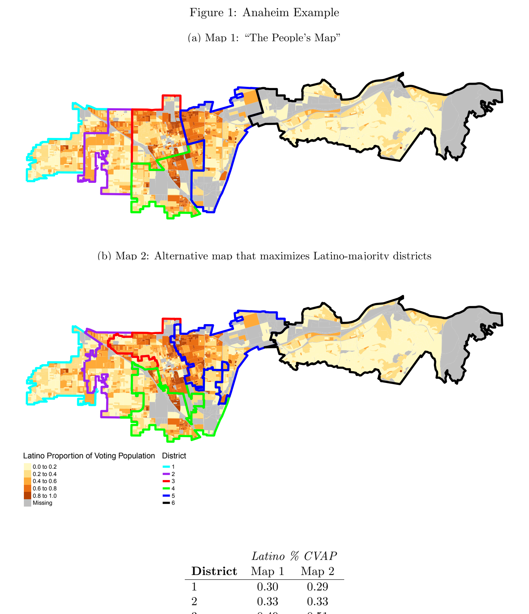

***Figure 1.*** Anaheim Example (a) Map 1: “The People’s Map”

(b) Map 2: Alternative map that maximizes Latino-majority districts Latino Proportion of Voting Population District

0.0 to 0.2 1

0.2 to 0.4 2

0.4 to 0.6 3

0.6 to 0.8 4

0.8 to 1.0 5

Missing 6

Latino % CVAP District Map 1 Map 2 1 0.30 0.29 2 0.33 0.33 3 0.49 0.51 4 0.45 0.39 5 0.45 0.51 6 0.16 0.15

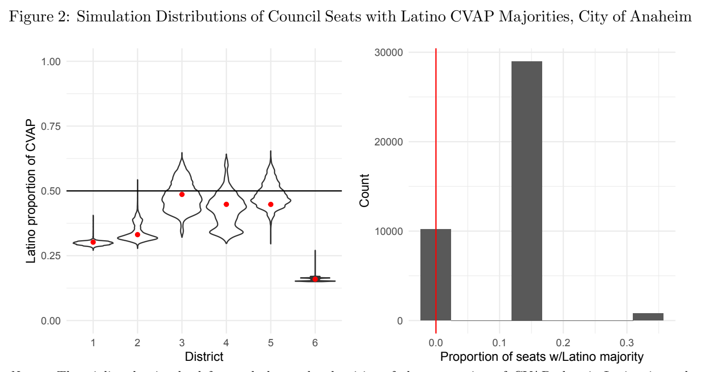

***Figure 2.*** Simulation Distributions of Council Seats with Latino CVAP Majorities, City of Anaheim

1.00

0.75

0.50

0.25

0.00

1 2 3 4 5 6 District

PAVC

fo

noitroporp

onitaL

0.0 0.1 0.2 0.3

Proportion of seats w/Latino majority

tnuoC

Notes: The violin plot in the left panel shows the densities of the proportion of CVAP that is Latino in each district over 40,000 simulations. Red dots correspond to the values for the adopted map. Densities are scaled to a standardized maximum width; thus, we discourage comparisons across districts. The histogram in the right panel shows the distribution of the proportion of districts, out of a total of six, with a Latino CVAP above 0.5, also over the 40,000 simulations. Red line corresponds to the value for the adopted map.

of the citizen voting-age population, Latinos (or any group) can theoretically elect their preferred candidate — regardless of the candidate’s ethnicity.

While the 50% CVAP threshold is useful as a measure of political strength that is agnostic to the preferences of the Latino voting bloc, it is important to remember that the CVRA was born partially from the observable lack of descriptive representation in California local government. Thus, we aim to provide some additional measures of the reform’s success that are related to the expected ethnic composition of councils under alternative maps. However, the local context introduces an obstacle rarely encountered in federal districting: election returns are usually only available at the (true) district level, rather than lower-level units such as precincts that can be aggregated to other (hypothetical) districts.

Our solution is to predict electoral outcomes under hypothetical districts using a model trained on real-world election data. We begin with the CEDA dataset of electoral outcomes measured at the district-city-year level for our 106 cities (post-districting). We use this dataset to model the probability that district i in city c in election year t elects a Latino candidate as a function of CVAP, partisanship, and other characteristics of the district, which are computed by aggregating

up from the Census block level to the adopted districting plan. Then, for each simulated district, we compute the same covariates and use them to calculate the predicted probability of electing a Latino candidate.

Because our conclusions about Latino electoral success under alternative districting schemes rely on predictions generated by this model, its validity and predictive power are of the utmost importance for our findings to hold water. Fortunately, a sizeable literature has been devoted to the problem of predicting minority descriptive representation using district characteristics, with notable recent developments by Atsusaka (2021) and Fraga, Gonzalez Juenke and Shah (2020). After testing a variety of approaches, we select a relatively parsimonious logistic regression specification that performs well out of sample, correctly classifying 81% of the cases. In Appendix C, we report the estimated coefficients from this model and the results of other tests of the model’s performance. (cid:92) We then use the district-level predictions generated by our model, which we call pˆ = P r(Latino elected) , cdt cdt to build three useful citywide predictions for each districting plan:

1. Expected Latino council share: This is computed as the average of pˆ across all districts, and represents the share of the city council that we would expect to be Latino over many elections.9

2. Probability of at least one Latino on council: This is computed as the complement of the probability of electing zero Latinos, which is the product of the complements of pˆ across districts.

3. Probability of a Latino council majority: This is computed as the sum of the probabilities of each configuration of election outcomes that generates a Latino council majority. For example, in a city with three districts, a Latino council majority will occur under the following conditions: Districts A and B elect Latinos, Districts B and C elect Latinos, Districts A and C elect Latinos, or all three districts elect Latinos. To compute the probability that Districts A and B elect Latinos, we multiply pˆ ∗ pˆ ∗ (1 − pˆ ); the other configurations are A B C

computed analogously. Then, we sum the probabilities of each configuration to calculate the overall probability of a Latino council majority.

9We now suppress the c and t subscripts when we are focused on a particular plan within a city. The time t is held fixed at the first year of district elections in that city.

Each of these alternatives captures a different strategy for securing some form of descriptive representation. Several considerations inform which measure reformers will prioritize. The first is risk tolerance. Maximizing the first quantity is a risk-neutral strategy, since the same expected council share can be achieved by one certain Latino district and one certain white district, or by two 50% probability Latino districts. And while taking this approach will maximize representation in the long run, in any given election cycle there may be a real danger of ending up with no representation. Given evidence that the presence of just one minority member can affect the agenda, a risk-averse voting bloc may favor plans that maximize the second quantity. Finally, for cities with sufficiently large Latino populations, the city council majority may be within reach. But maximizing this quantity may be risky if having a fighting chance in a majority of districts requires stretching the population too thin to make any safe districts.

A second consideration is what reformers hope to achieve through descriptive representation. When it comes to representing voters’ interests in council votes, the Latino bloc is well served by having a council share in proportion to, or better yet in excess of, its population share. On the other hand, even one voice may suffice to bring new concerns and perspectives to the table, to set the agenda, or to have an impact on the behavior and opinions of other councilmembers — especially in a small and collegial legislative body.

Finally, council dynamics also play an important role. At one extreme, city councils may resemble the national legislature, where opposing factions battle to win majorities or otherwise fail to enact their governing agendas. But, at the other extreme, councils may be cooperative and deliberative; they may have a formal or informal norm of unanimity, or grant their members specific veto powers. While in the former case, the minority should seek to maximize its numbers — and pursue council majorities whenever they are within reach — in the latter case guaranteeing one seat is vital, whereas pushing beyond that may be inefficient.

Concentrating Latino Voters

Aside from their expected electoral outcomes, we can also characterize districting plans with respect to how they distribute Latino voters. A common concern in the partisan districting literature is the concentration of one party in a way that wastes votes, a strategy known as “packing.” This term is typically used to describe maps where concentrating a group diminishes its electoral influence (e.g.,

Best et al. 2018). In this sense, packing implies disadvantage. But we want to know whether the approach of concentrating Latino voters is effective in increasing their descriptive representation. Thus, we do not use the term “packing,” though it may be common parlance.

We measure the concentration of Latino voters that is associated with each plan using the dissimilarity index of districts under that plan. In other words, we apply the same calculation as in Equation 1, this time with council districts rather than Census tracts as the lower-level geography. By calculating this index for every simulated districting plan, we can see how plans vary in their concentration of Latino voters, holding fixed the city’s underlying residential segregation; we use the term “concentrating” rather than “segregating” to distinguish how maps are drawn from the baseline residential segregation in the city. To enable comparisons between Latino and white voters, we compute two versions of the dissimilarity index for each electoral outcome in each city: for Latinos, we compute the index for Latinos versus all others; and for whites, we compute the index for non-Hispanic whites versus all others.10

## Results

Most Cities Could Not Draw Even One Latino-Majority District

As we have argued, our simulation exercise is important for assessing district elections on the basis of not just one adopted plan, but the potential of what they can achieve under the geographic and legal constraints on the ground. In Appendix Figures D-2 through D-6, we plot the ranges of various outcomes of interest over the simulation distributions for each city, as well as the percentile of those distributions where the adopted plan falls. These outcomes of interest include the proportion of council seats with a Latino CVAP majority (Figure D-2), the expected Latino council share (Figure D-3), the probability of at least one Latino on council (Figure D-4), the probability of a Latino council majority (Figure D-5), and the dissimilarity index of plans (Figure D-6).

Strikingly, Figure D-2 shows that 58% of the cities in our sample cannot draw a single district with greater than 50% Latino CVAP, as evidenced by the fact that not one of the city’s 40,000 simulated plans contains even one such district. This happens for two reasons: the Latino population in the city is not large enough and not residentially segregated enough to constitute a local 10Figure A-1 builds intuition around how the dissimilarity index summarizes the concentration of a voting bloc.

majority under any feasible configuration. Furthermore, an additional three cities cannot draw a district without a majority Latino CVAP. For these cities, there is no variation in simulated plans based on this simple outcome.

However, we do see that cities that had the option of creating Latino-majority districts not only did so, but generally maximized the number they could feasibly draw. Of the 41 cities with variation on this outcome in their simulation distributions, 33 (80%) created plans that landed above the 90th percentile. In other words, the CVRA effectively communicated its priority of drawing Latino-majority districts where possible, and compliance with this goal was generally high.

No Systematic Trade-offs Across Measures of Success

Although many cities could not draw Latino-majority districts, we can imagine that the choice of maps is still meaningful for Latino representation in these places. Thus we now turn to our three additional measures of Latino descriptive representation: the expected Latino council share, the probability of at least one Latino on council, and the probability of a Latino council majority. We calculate each measure of electoral success for each of the 40,000 maps within all 106 cities.

A natural first question to ask is whether there are trade-offs in optimizing for these different goals. To see this, we calculate the correlation between each possible pair of measures within each city. We begin by looking at how the share of seats with a majority Latino CVAP correlates with our three measures of Latino electoral success. Figure 3 presents three histograms — one for each set of within-city correlations — with a red vertical line showing the average correlation across all cities. Only the 41 cities that had some variation in their simulation distributions of majority Latino CVAP districts are included here. Within this subset, maps that increase the number of majority Latino CVAP districts also tend to improve performance on all three measures of electoral success. Indeed, negative correlations in this column are highly conditional. For instance, we find that a trade-off between maximizing the share of majority Latino CVAP districts and the probability of a Latino council majority only occurs in cities with very large and segregated Latino populations.11 11Consider the city of Indio. The plan that maximizes the share of majority Latino CVAP districts has the following Latino CVAP share for Districts 1 through 5: 0.58, 0.50, 0.53, 0.57, and 0.61. The plan that maximizes the probability of a Latino council majority has the following Latino CVAP share for districts 1 through 5: 0.32, 0.41, 0.86, 0.64, and 0.77. When Latinos constitute the majority of the voting population citywide, and when they are sufficiently segregated, then it is possible to concentrate Latino voters in three out of five districts, yielding a higher probability of a Latino council majority than a plan that gives Latinos a bare CVAP majority in every district.

In Appendix Figure E-7, we also present correlations between every pair of predicted electoral outcomes: the expected Latino council share with the probability of at least one Latino on council; the expected Latino council share with the probability of a Latino council majority; and the probability of at least one Latino on council with the probability of a Latino council majority. These histograms include all cities, because every city has variation in these probabilities, even those unable to create majority Latino CVAP districts. And here, we see correlations that are overwhelmingly positive and close to 1. The same kinds of maps achieve all three goals.

Concentrating Latino Voters Improves Descriptive Representation

Given that there are no consistent trade-offs among these electoral outcomes, are there simple principles for simultaneously maximizing all four? We find that plans that concentrate Latinos — in other words, that create some districts with large numbers of Latino voters while necessarily leaving other districts with few — are more effective at achieving every electoral goal than plans that distribute Latino voters more evenly across districts, as long as Latinos are under half of the voting population citywide. This condition holds for the vast majority of cities in our sample. The same is not true for whites: plans that concentrate white voters are only electorally successful when the citywide white voting population is below one-third — a small number of the cities in our sample. For most cities, plans that spread out white voters across districts maximize electoral success for white candidates.

To evaluate how concentrating Latino voters relates to descriptive representation, we compute the correlation between the simulated plans’ dissimilarity index for Latinos and each of our four electoral outcomes of interest across all simulations within each city. This gives us four correlation coefficients per city, which we plot against citywide Latino CVAP in Figure 4 (in black). We also do the same for whites, and show these correlations on the same graphs (in gray). The histograms at top and bottom show the distributions of the proportion of citywide CVAP that is Latino (in black, above) and that is white (in gray, below) within our study sample.

We begin with the correlation between the dissimilarity index of plans for Latinos (whites) versus all others, and the proportion of council seats that have a Latino (white) CVAP majority. In panel (a), we see positive correlations when Latinos are a citywide minority, and negative correlations when they are a citywide majority; an identical pattern holds for whites. For both groups, the

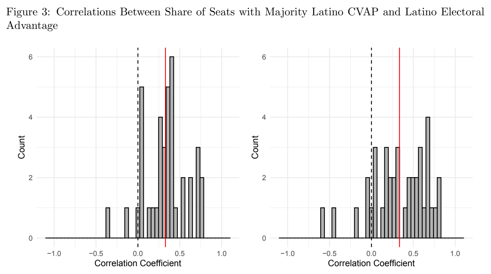

***Figure 3.*** Correlations Between Share of Seats with Majority Latino CVAP and Latino Electoral Advantage

−1.0 −0.5 0.0 0.5 1.0

Correlation Coefficient

tnuoC

−1.0 −0.5 0.0 0.5 1.0 Correlation Coefficient (a) Share of seats w/majority Latino CVAP and

Expected Latino Council Share

tnuoC

(b) Share of seats w/majority Latino CVAP and Pr(At Least One Latino on Council) −1.0 −0.5 0.0 0.5 1.0 Correlation Coefficient

tnuoC

(c) Share of seats w/majority Latino CVAP and Pr(Latino Council Majority)

positive correlation is strongest when they are just shy of half of the citywide voting population, while the negative correlation is strongest when they are just above this threshold. This makes sense: when a group is in the minority, but substantial enough to create majorities in some districts, then concentrated plans will maximize the number of majority-minority districts. On the other hand, when a group has a bare citywide majority, then plans that spread this population out to achieve bare majorities in as many districts as possible will be the most efficient strategy.

From panel (a) alone, we would conclude that the takeaways for white voters are the same as for Latinos.12 But panels (b) through (d) suggest otherwise. In panel (b), we see that concentrated maps tend to increase expected Latino council share for most cities where Latinos are up to 50% of the overall population. There are even a few cities just over the 50% threshold that still see positive, albeit reduced, correlations. Thus, even when Latinos are a sizeable voting bloc, the logic of panel (a) does not translate into electoral victories. Because of lower turnout, resources, and mobilization within this group, spreading the city’s Latino population into a larger number of districts achieves worse descriptive representation than concentrating it in fewer districts where they have the critical mass to make a difference.

The opposite is true for white voters and candidates. Due to systematic advantages in voter turnout, political networks and resources, and incumbency, white voters have outsized influence on their district’s electoral outcomes, while white candidates (collectively) have a high baseline probability of being elected. As a result, panel (b) shows that once whites surpass approximately one-third of the citywide voting population, their descriptive representation is maximized when they are spread out across districts; they stand a good chance of achieving electoral victories even with such minorities.

In panel (c), we also see that concentrating Latinos nearly always helps secure at least one Latino seat on city council, regardless of the citywide Latino CVAP. The same is true for whites when they are a citywide minority, but the correlation begins to fall earlier than for Latinos — again, when they are around one-third of citywide CVAP. Finally, panel (d) shows that concentrating Latinos almost always increases the probability of securing a Latino council majority, whereas there is a negative relationship for whites in most cities. Taken together, our findings reveal an 12The curves diverge to the right of 0.6 proportion CVAP citywide, but this is merely an artifact of the fact that there are no cities where Latinos are more than 60% of citywide CVAP that also have variation on this electoral outcome (and thus where a correlation can be computed).

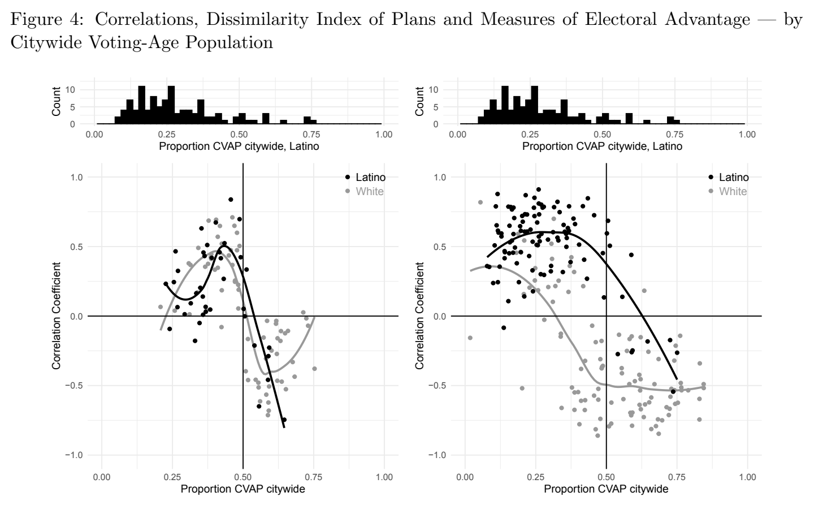

***Figure 4.*** Correlations, Dissimilarity Index of Plans and Measures of Electoral Advantage — by Citywide Voting-Age Population

Proportion CVAP citywide, Latino

tnuoC

### 1.0 Latino

White 0.5

0.0

−0.5

−1.0

Proportion CVAP citywide

tneiciffeoC

noitalerroC

Proportion CVAP citywide, Latino

(a) Share of seats w/majority [group] CVAP

tnuoC

### 1.0 Latino

White 0.5

0.0

−0.5

−1.0

Proportion CVAP citywide

tneiciffeoC

noitalerroC

(b) Expected [group] council share

### 1.0 Latino

White

0.5

0.0

−0.5

−1.0

Proportion CVAP citywide

tneiciffeoC

noitalerroC

Proportion CVAP citywide, white

tnuoC

### 1.0 Latino

White 0.5

0.0

−0.5

−1.0

Proportion CVAP citywide (c) Pr(at least 1 [group] councilmember)

tneiciffeoC

noitalerroC

Proportion CVAP citywide, white

tnuoC

(d) Pr([group] council majority)

Notes: “Group” in brackets represents Latinos for black points and whites for gray points. Loess-smoothed curves fitted to each set of points are shown in the associated color. “Correlation coefficient” on y-axis represents the correlation between the dissimilarity index of plans for Latinos (black points) or whites (gray points) and the subcaption for each panel; for instance, the black points in panel (a) represent correlations between the concentration of Latinos in a city’s plans and the share of seats with majority Latino CVAP produced by those plans, across all simulated plans for that city. Panel (a) has fewer observations, as some cities have no variation on this electoral outcome across simulated plans.

important insight: whereas whites and Latinos exhibit the same patterns in the technical exercise of drawing majority districts (panel a), they differ substantially in how the distributions of voters across districts map onto electoral outcomes.

Why Concentrating Latino Voters Works

Concentrating Latino voters generally improves this group’s descriptive representation on city councils, so long as Latinos do not comprise the overwhelming majority of the citywide voting population. To understand why this is the case for Latinos but not white voters, we investigate how a district’s racial composition relates to its propensity to elect white and Latino city councilmembers. In Figure 5, we plot the relationship between the proportion of a district’s eligible voters who are Latino and that district’s predicted probability of electing a Latino councilmember (black curve), as well as the same relationship for white voters and councilmembers (gray curve), over all simulated plans for every city in our sample.13 Figure 5 immediately reveals that for the same district-level voting population share, whites are systematically more likely than Latinos to elect coethnic city councilmembers. The probability of electing a Latino councilmember crosses the 50% threshold when Latinos comprise 50% of the district’s voting population, whereas the probability of electing a white councilmember is already greater than one-half when the white voting population is just over one-third.14

A second important feature of Figure 5 is the convexity of the curve for Latinos in the critical region between 0 and 50% of district CVAP — the region within which the vast majority of feasible districts fall.15 Convexity implies that the expected Latino council share will always be higher from two districts with extreme values of Latino CVAP than two districts each having the mean of those values.16 For instance, having one district with 45% Latino CVAP and another with 5% yields a higher expected Latino council share than two districts with 25% Latino CVAP. Then, in 13These predicted probabilities are the same ones that we introduced in the section titled “Definitions of Electoral Success” and used throughout the analysis in Figures 3–4.

14Because we estimate the predicted probabilities of electing whites and Latinos using separate binary response models, it is possible for a 30% white district to have a probability of electing a white councilmember above 0.5 at the same time that a 70% Latino district has a probability of electing a Latino councilmember above 0.5. The 30% white district in this analysis averages over all possible (real and simulated) racial compositions of the remaining 70%, and similarly for the 70% Latino district; thus, the two sets of probabilities computed here are not complementary and need not sum to at most one.

15The interquartile range of simulated districts is 16% to 39% Latino CVAP.

16To see this, consider any two districts that have Latino proportions of CVAP of x and x , respectively, and let 1 2

f(x) be the convex function that takes Latino proportion of CVAP to probability of electing a Latino councilmember.

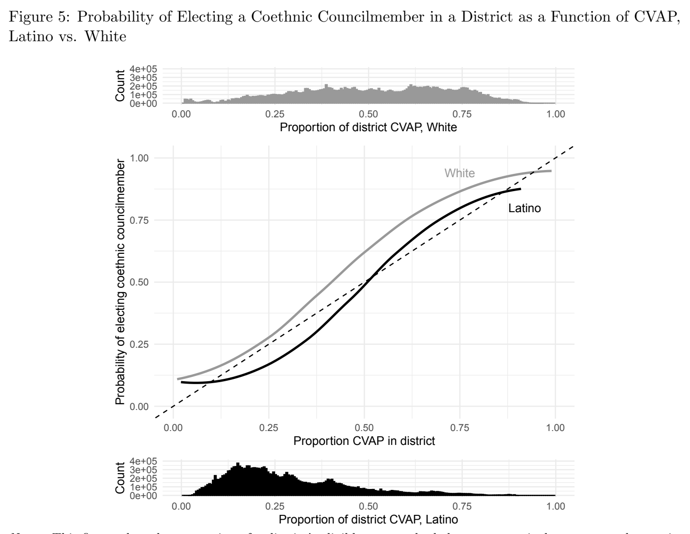

***Figure 5.*** Probability of Electing a Coethnic Councilmember in a District as a Function of CVAP, Latino vs. White

4e+05

3e+05

2e+05

1e+05

0e+00

Proportion of district CVAP, White

tnuoC

1.00

White

Latino 0.75

0.50

0.25

0.00

Proportion CVAP in district rebmemlicnuoc

cinhteoc

gnitcele

fo

ytilibaborP

4e+05

3e+05 2e+05

1e+05

0e+00

Proportion of district CVAP, Latino

tnuoC

Notes: This figure plots the proportion of a district’s eligible voters who belong to a particular group on the x-axis, and the probability that a member of that group is elected to council on the y-axis, over all simulated districts for all cities in our sample. The black curve summarizes this relationship for Latinos and the gray curve summarizes this relationship for whites. Curves are constructed by computing binned means of the probability of electing a coethnic councilmember at 0.01-unit intervals along the x-axis, then fitting a Loess-smoothed curve to these means. Histogram at top shows the distribution of the x-axis for whites over all simulated districts; histogram at bottom shows this distribution for Latinos.

the region above 50% Latino CVAP, the curve becomes slightly concave. Here, districts at any two extreme values of Latino CVAP yield a lower expected Latino council share than two districts at the mean of those values; for instance, two districts with 75% Latino CVAP are somewhat more favorable in expectation than one district with 50% and the other with 100%.

This finding is particularly important in light of the fact that the majority of cities in our sample could not create even one Latino-majority district. Nonetheless, our analysis highlights that these cities could still make critical choices in promoting Latino descriptive representation through their districting plans. In particular, Figure 5 suggests that concentrating the Latino voting population is especially important when Latinos constitute citywide and districtwide minorities; in fact, the largest marginal gains in the probability of electing a Latino representative are realized between about one-fourth and one-half of the district’s voting population.

While white voters also exhibit some convexity on the very low end of white district CVAP share, this convexity is much less pronounced; rather, the overall shape of the gray curve in Figure 5 is concave in the region above one-third of white district CVAP share, where the vast majority of all feasible districts fall. This underpins the result in Figure 4, panel (b): that white candidates perform best when white voters are dispersed in this region.

No Systematic Trade-off with Substantive Representation

A final concern is that concentrating Latino voters will hamper the election of Democrats citywide. Given that Latinos tend to share policy views with and support Democratic candidates (Barreto, Segura and Woods 2004), especially in California (Hui and Sears 2018), a decline in Democratic electoral success would entail a meaningful trade-off of descriptive for substantive representation.17 To test for such a trade-off, we calculate the correlation between each of our measures of electoral success and the share of districts with a Democratic majority of registered voters. Only 44% of The expected council share from these two districts is:

f(x ) + f(x )

1 2

Now consider the expected council share from two districts, each having Latino proportion of CVAP at the mean of x and x :

1 2

(cid:0)x1+x2 (cid:1)

(cid:0)x1+x2 (cid:1)

(cid:16)x + x (cid:17) 2 2 = f 1 2 2 2

The first equation must be greater than the second when the function f(x) is convex. 17Though such a trade-off may be less pronounced in light of increasingly durable shifts of the Latino electorate away from the Democratic Party (Fraga, Velez and West 2022).

our sample exhibits any variation on the latter outcome; in all, over half of the cities in our sample lack the necessary variation to compute a correlation. There is no trade-off between promoting Latino descriptive representation and creating majority Democratic districts in these cities. And among cities where there is some variation in both outcomes, Figure E-8 shows that there is also no systematic relationship.

## Discussion

Revisiting Anaheim, in some ways Councilmember Brandman was right: indeed, concentrated plans are associated with Latino electoral success as long as Latinos are not a citywide supermajority. Across over one hundred cities, we find that not only are multiple measures of minority descriptive representation compatible on average, but they can all be achieved using the same strategy: creating districts with high concentrations of Latino voters. What is more, promoting descriptive representation along these dimensions is not generally incompatible with substantive representation, as measured by Democratic partisan advantage.

Thus, the intense focus of the debate in Anaheim around majority Latino CVAP districts did not capture the whole picture. When it comes to actually electing Latino representatives, the most significant marginal gains from concentrating Latino voters accrue in the space between 0 and 50% Latino CVAP, not in crossing the 50% threshold. In Anaheim’s case, the adopted plan, with three districts falling just shy of a Latino majority, and a more concentrated plan like Brandman’s, with two districts just over the Latino majority threshold, produce quite similar Latino council shares in expectation: 50% and 51%, respectively. These findings are particularly important in light of the fact that, even in the context of the CVRA, Latino-majority districts are often out of reach. But we have shown that, even when this is the case, cities nonetheless hold significant power to shape electoral outcomes through the drawing of districting plans.

To what extent are these insights generalizable to other contexts — to local districting outside of California, and to congressional districting — and to other minority groups? In other words, what are the scope conditions under which concentrated plans promote minority descriptive representation more broadly? Although the present study lacks the statistical power to speak directly

to the actual or potential electoral success of other minority groups under the CVRA,18 the answer to this question lies in the shapes of the curves in Figure 5, which are in turn determined by the political behavior of the relevant electorate.

One crucial feature is the degree of racial polarization, often operationalized by the extent to which voter race predicts vote choice. In an electorate with low racial polarization, the curve in Figure 5 for any group is relatively flat: the racial composition of a district is only associated with the race of its elected representative insofar as any candidates for office must come from that district, but not due to any patterns in voter behavior. By contrast, in a highly polarized electorate, we would see a sharp, discontinuous increase in the probability of electing a coethnic representative when a group exceeds 50% of CVAP, because majority status is both necessary and sufficient for this outcome. In contexts of high racial polarization — for instance, there is evidence that Latino voters are less racially polarized than Black voters (Kuriwaki et al. Forthcoming) — we expect major returns to minority concentration that mainly accrue in crossing the 50% threshold. With low racial polarization — for instance, in the presence of coalition voting with white Democrats — more diffuse maps that draw strength from these coalitions may be most effective.

Another consideration is how political behavior changes with group size, which affects the curvature — that is, any concavities or convexities — in Figure 5. Notably, Fraga (2018) finds that the well-documented gap in turnout between white and Latino voters closes when Latinos are in the electoral majority in their congressional district; the same is also true for Black and Asian voters. The mobilizing effects of group size may accrue discontinuously over the 50% threshold if voters are applying a Downsian calculus, or they may grow over other intervals if empowerment theory (Barreto, Segura and Woods 2004; Barreto 2010) or elite mobilization (Leighley 2001; Rosenstone and Hansen 1993) are at work. Regardless, an important body of work has produced convincing evidence that political mobilization is a function of the racial composition of one’s district, and the specific ways in which this may be true for a given group determine when and how it benefits from concentrated plans.

Finally, it is useful to note that the context in which CVRA cities drew their districting plans involved an unusually high degree of interest group and judicial oversight. Moreover, cities were 18The largest non-white voting bloc is Latinos in the majority of California cities that converted to districts, and modeling the electoral success of Black and Asian candidates in California city council elections is much more difficult than doing so for Latinos.

guided by the general principle of creating Latino-majority districts when possible and keeping “communities of interest” together. As a result, the maps they produced were usually favorable for Latino descriptive representation given what was feasible under the legal and geographic constraints. But there is no guarantee that favorable maps would have been drawn absent such pressures. Indeed, in cities not covered by the CVRA, city councils generally produce maps which do not maximize racial representation (Novoa N.p.).

What is more, as we show in Appendix Figure D-6, the cities with the widest range of plans from which to choose are the most segregated cities in our sample. These cities are able to make both very concentrated and very diffuse plans, whereas cities where Latinos are residentially integrated generally have lower levels and variances of Latino concentration over their simulation distributions. This means that the very tool that we have identified for promoting Latino descriptive representation is subject to the greatest political control in segregated cities — which may also suffer from the most acute racial inequality and conflict. Therefore, we add some important nuance to previous findings: segregation alone is a poorly defined moderator of the effect of district elections. That previous studies of the CVRA find segregation to be a positive moderator of the effect of district elections on minority electoral success reflects contextual incentive structures in addition to any effects of segregation alone.

## Conclusion

Using state-of-the-art redistricting tools, we have expanded the prior understanding of how district elections increase minority descriptive representation. District elections are not successful solely when they create majority-minority districts. Were that the case, we would see very little change in electoral outcomes in most cities that adopted districts under the CVRA, where creating any majority-Latino districts was impossible. Rather, using real-world election data paired with a validated predictive model, we show how districting plans can increase the expected Latino council share, the probability of securing at least one Latino seat on council, and the probability of a Latino council majority.

Contrary to expectations from the partisan districting literature, we find that these measures of descriptive representation are generally compatible, and are simultaneously advanced by districting

plans that concentrate Latino voters. This strategy does not, on average, come at the cost of substantive representation, as measured by the success of Democratic candidates. Examining the relationship between a district’s racial composition and its propensity to elect Latino candidates across the universe of feasible plans in over one hundred California cities, we find that the most significant marginal gains from concentrating Latino voters are realized below the 50% threshold — not in creating Latino majorities. While a great deal of scholarly attention and political debate has focused on creating majority-minority districts, we have provided novel insight into how to promote minority descriptive representation in the large set of cases when this is impossible.

In short, we have shown how district elections can be maximally effective, but also exposed their limitations. To advance minority descriptive representation, the overarching institutional structure must be paired with plans that concentrate the minority voting bloc. This is made possible when cities are segregated and face political incentives to adopt such plans. But relying on segregation to set the stage for district elections to be successful is concerning. Segregated cities not only struggle to provide collective goods, but also have an incentive to direct goods to members of the dominant coalition (Trounstine 2018). This tendency is likely to be exacerbated under district elections, given even more clearly spatially-defined constituencies and the history of legislative logrolling. Likewise, segregation heightens inter-group tensions, both threatening cooperation and potentially spurring conflict (Enos 2017). That low segregation cities would be penalized in their ability to increase minority voice through districting should cause us to question the viability of district elections as panacea for representation. In other words, the Gingles test may have been less a conservative barrier to reform and more of a guardrail against false hope in unsuitable cities.

More broadly, our findings are more than a mechanical assessment of how cities should draw district lines. Rather, we have shown how a reform designed to improve minority representation faces constraints, stemming from both electoral geography and political agency. Understanding these forces is crucial to realizing the maximum potential of the reform — and tempering expectations of what it can achieve. Building knowledge about how institutional design interacts with real-world geography and political behavior is not only important for equalizing voice, but vital for democratic legitimacy. When a reform like districting is guided by improper tools and folk wisdom, the promise of representation is unlikely to be fulfilled, undermining trust in the institution.

## References

Abott, Carolyn and Asya Magazinnik. 2020. “At-Large Elections and Minority Representation in Local Government.” American Journal of Political Science 64(3):717–733.

Atsusaka, Yuki. 2021. “A Logical Model for Predicting Minority Representation: Application to Redistricting and Voting Rights Cases.” American Political Science Review 115(4):1210–1225. Barreto, Matt. 2010. Ethnic Cues: The Role of Shared Ethnicity in Latino Political Participation. Ann Arbor, MI: University of Michigan Press.

Barreto, Matt A, Gary M Segura and Nathan D Woods. 2004. “The Mobilizing Effect of Majority– Minority Districts on Latino Turnout.” American Political Science Review 98(1):65–75.

Barreto, Matt and Gary Segura. 2014. Latino America: How America’s Most Dynamic Population is Poised to Transform the Politics of the Nation. Public Affairs.

Best, Robin E, Shawn J Donahue, Jonathan Krasno, Daniel B Magleby and Michael D McDonald. 2018. “Considering the Prospects for Establishing a Packing Gerrymandering Standard.” Election Law Journal 17(1):1–20.

Brace, Kimball, Bernard Grofman and Lisa Handley. 1987. “Does Redistricting Aimed to Help Blacks Necessarily Help Republicans?” The Journal of Politics 49(1):169–185.

Brace, Kimball, Bernard N Grofman, Lisa R Handley and Richard G Niemi. 1988. “Minority Voting Equality: The 65 Percent Rule in Theory and Practice.” Law & Policy 10(1):43–62.

Bratton, Kathleen A and Kerry L Haynie. 1999. “Agenda Setting and Legislative Success in State Legislatures: The Effects of Gender and Race.” The Journal of Politics 61(3):658–679.

Cameron, Charles, David Epstein and Sharyn O’Halloran. 1996. “Do Majority-Minority Districts Maximize Substantive Black Representation in Congress?” American Political Science Review 90(4):794–812.

Canon, David T. 1999. Race, Redistricting, and Representation: The Unintended Consequences of Black Majority Districts. University of Chicago Press.

Chen, Jowei and Jonathan Rodden. 2013. “Unintentional Gerrymandering: Political Geography and Electoral Bias in Legislatures.” Quarterly Journal of Political Science 8(3):239–269.

Clark, Alistair and Timothy B Krebs. 2012. Elections and Policy Responsiveness. In The Oxford Handbook of Urban Politics.

Collingwood, Loren and Sean Long. 2019. “Can States Promote Minority Representation? Assessing the Effects of the California Voting Rights Act.” Urban Affairs Review pp. 1–32.

Dancygier, Rafaela M. 2014. “Electoral Rules or Electoral Leverage? Explaining Muslim Representation in England.” World Politics 66(2):229–263.

Davidson, Chandler and George Korbel. 1981. “At-Large Elections and Minority-Group Representation: A Re-Examination of Historical and Contemporary Evidence.” The Journal of Politics 43(4):982–1005.

de Benedictis-Kessner, Justin and Rachel Bernhard. 2022. “Concatenated Files Fixing Errors in the California Elections Data Archive (CEDA).” GitHub repository, online: https://github. com/justindbk/ceda/.

Diamond, Greg. 2016. “District 3 is Still a Majority Latino CVAP as It Ever Was: A Close Look at Block Groups 93 & 106.” The Orange Juice .

Duncan, Otis Dudley and Beverly Duncan. 1955. “A Methodological Analysis of Segregation Indexes.” American Sociological Review 20(2):210–217.

Elmahrek, Adam. 2015. “Anaheim City Council Stalls Transition to District Elections.” Voice of OC .

Elmahrek, Adam. 2016. “‘People’s Map’ Victory a Lesson in Hardball Activism.” Voice of OC . Enos, Ryan D. 2017. The Space Between Us: Social Geography and Politics. Cambridge University Press.

Fifield, Benjamin, Michael Higgins, Kosuke Imai and Alexander Tarr. 2020. “Automated Redistricting Simulation Using Markov Chain Monte Carlo.” Journal of Computational and Graphical Statistics 29(4):715–728.

Fraga, Bernard L. 2018. The Turnout Gap: Race, Ethnicity, and Political Inequality in a Diversifying America. Cambridge University Press.

Fraga, Bernard L., Eric Gonzalez Juenke and Paru Shah. 2020. “One Run Leads to Another: Minority Incumbents and the Emergence of Lower Ticket Minority Candidates.” The Journal of Politics 82(2):771–775.

Fraga, Bernard L., Yamil R. Velez and Emily A. West. 2022. Reversion to the Mean, or their Version of the Dream? An Analysis of Latino Voting in 2020. Technical report.

Hajnal, Zoltan and Jessica Trounstine. 2005. “Where Turnout Matters: The Consequences of Uneven Turnout in City Politics.” The Journal of Politics 67(2):515–535.

Hankinson, Michael and Asya Magazinnik. 2023. “The Supply–Equity Trade-off: The Effect of Spatial Representation on the Local Housing Supply.” The Journal of Politics 25(3).

Henderson, John A, Brian T Hamel and Aaron M Goldzimer. 2018. “Gerrymandering Incumbency: Does Nonpartisan Redistricting Increase Electoral Competition?” The Journal of Politics 80(3):1011–1016.

Hui, Iris and David O Sears. 2018. “Reexamining the Effect of Racial Propositions on Latinos’ Partisanship in California.” Political Behavior 40(1):149–174.

Kenny, Christopher T., Cory McCartan, Ben Fifield and Kosuke Imai. 2021. “redist: Simulation Methods for Legislative Redistricting.” Available at The Comprehensive R Archive Network (CRAN).

URL: https://CRAN.R-project.org/package=redist

Kuriwaki, Shiro, Stephen Ansolabehere, Angelo Dagonel and Soichiro Yamauchi. Forthcoming. “The Geography of Racially Polarized Voting: Calibrating Surveys at the District Level.” American Political Science Review .

Leighley, Jan. 2001. Strength in Numbers? The Political Mobilization of Racial and Ethnic Minorities. Princeton, NJ: Princeton University Press.

Lublin, David. 1997. The Paradox of Representation. Princeton, NJ: Princeton University Press.

Lublin, David, Lisa Handley, Thomas L Brunell and Bernard Grofman. 2020. “Minority Success in Non-Majority Minority Districts: Finding the “Sweet Spot”.” Journal of Race, Ethnicity, and Politics 5(2):275–298.

Novoa, Gustavo. N.p. “Local Lines: A Simulation Analysis of Majority-Minority Districts in U.S. City Councils.” Working paper.

URL: https://www.gustavofnovoa.com/ iles/ugd/3b834d 93f9bc391bb43b3af4eb62570d6be65.pdf f 8

Rodden, Jonathan A. 2019. Why Cities Lose: The Deep Roots of the Urban-Rural Political Divide. Basic Books.

Rosenstone, Steven J. and John Mark Hansen. 1993. Mobilization, Participation, and Democracy in America. New York: Macmillan.

Schuk, Carolyn. 2015. “Fighting CVRA Lawsuit Will Likely Cost Santa Clara $3.97 Million More Than It Cost Sunnyvale To Avoid One.” The Silicon Valley Voice .

Stephanopoulos, Nicholas O and Eric M McGhee. 2015. “Partisan Gerrymandering and the Efficiency Gap.” The University of Chicago Law Review 82:831.

Trounstine, Jessica. 2009. Political Monopolies in American Cities: The Rise and Fall of Bosses and Reformers. Chicago: University of Chicago Press.

Trounstine, Jessica. 2018. Segregation by Design: Local Politics and Inequality in American Cities. New York: Cambridge University Press.

Trounstine, Jessica and Melody E Valdini. 2008. “The Context Matters: The Effects of Single- Member versus At-Large Districts on City Council Diversity.” American Journal of Political Science 52(3):554–569.

Welch, Susan. 1990. “The Impact of At-Large Elections on the Representation of Blacks and Hispanics.” The Journal of Politics 52(4):1050–1076.

## Online Appendix for “Districting Without Parties: How City Coun-

## Contents

A Data Construction . . . . . . . . . . . . . . . . . . . . . . . . . . . . . . . . . . . . . A-2 B Districting Simulation . . . . . . . . . . . . . . . . . . . . . . . . . . . . . . . . . . . A-4 C Estimating Measures of Electoral Success . . . . . . . . . . . . . . . . . . . . . . . . A-12 D Simulation Distributions . . . . . . . . . . . . . . . . . . . . . . . . . . . . . . . . . . A-15 E Additional Tables and Figures . . . . . . . . . . . . . . . . . . . . . . . . . . . . . . . A-21

A Data Construction

Here, we outline the data construction process by which we prepared city shapefiles for districting simulation. As a baseline, we began with the 2017 TIGER/Line Shapefile for the state of California at the Census block level.1 We used Census blocks because this seems to be the unit that most cities used for district assignment. Then, we associated each block with a set of demographic, economic, and political variables, described in detail below. Finally, we intersected each of the 106 city council district shapefiles in our possession with this statewide block-level shapefile. This generated 106 block-level shapefiles — one for each city — mapping Census blocks (with covariates) to city council districts.

Variables

1. Housing Data. We collected the following variables from the 2010 Decennial Census:

1. CB Variable ID H003002, the total number of housing units in which a person or group of persons is living at the time of the interview, or if the occupants are only temporarily absent, as for example, on vacation;

2. CB Variable ID H014002, the total number of housing units where the owner or co-owner lives in the unit, even if it is mortgaged or not fully paid for.

We computed the homeownership rate as the number of occupied households that are owned (H014002) divided by the total number of occupied housing units (H003002).

### 2. Voting-Age Population. We collected block-level total population from the 2010 Decennial

Census (CB Variable ID P001001). In addition, we collected the following variables related to citizen voting-age population (CVAP) from the Redistricting Database for the State of California (“Statewide Database”)2:

### 1. Total citizen voting-age population

### 2. Black or African American (alone) citizen voting-age population

### 3. Asian (alone) citizen voting-age population

### 4. Hispanic or Latino citizen voting-age population

### 5. Not Hispanic or Latino citizen voting-age population

### 6. White citizen voting-age population

Because cities districted in different years, we pulled these CVAP estimates from different time periods for each city. In order to approximate as closely as possible the data cities were working with at the time that they districted, we selected 5-year estimates ending 3 years prior to the year of the first election under the newly adopted districting plan. For example, if the year of first 1Obtained from: https://www.census.gov/cgi-bin/geo/shapefiles/index.php?year=2017&layergroup= Blocks+%282010%29.

2Accessed at: https://statewidedatabase.org/. We used CVAP estimates from Statewide Database instead of the Census Bureau because the Census has only block group-level estimates, whereas Statewide Database provides block-level estimates.

election was 2018, we would use 2011–2015 estimates. If the year of first district election was 2012 or earlier, we used 2006–2010 estimates, as this was the closest available option. We arrived at this procedure after examining the supporting documentation of several city redistricting plans, as illustrated by the following examples:

### 1. Banning: first conducted election in 2016, reports 2010–2014 5-year estimates in supporting

documentation;3

### 2. Brea: first conducted election in 2022, reports 2015–2019 5-year estimates in supporting

documentation;4

### 3. Menlo Park: first conducted election in 2018, reports 2011–2015 5-year estimates in supporting

documentation;5

### 4. Rancho Cucamonga: first conducted election in 2018, reports 2010–2014 5-year estimates in

supporting documentation;6

### 5. Richmond: first conducted election in 2020, reports 2012–2016 5-year estimates in supporting

documentation.7

### 3. Income. We collected block group-level median household income from the Census American

Community Survey (ACS) (CB Variable ID B19013 001). We assigned to each block the value from its block group, as that was the lowest level of aggregation for which data was available. We chose the ACS time period for each city according to the same approach outlined for voting-age population, above.

4. Partisanship. Here, we wish to compute two block-level variables estimated at the time of a city’s first district election: a count of Democratic voters that is reasonably robust to changes in turnout between elections, as well as the total number of registered voters.

To do so, we collected partisanship and registration data from the general election files from Statewide Database. For each city, we used data from the 6 general elections prior to the year of first district election. For presidential election years (2004, 2008, 2012, 2016, 2020), we collected the number of votes cast for the Democratic presidential candidate; for midterm election years (2002, 2006, 2010, 2014, 2018), we collected the number of votes cast for the Democratic gubernatorial candidate.

A challenge of working with these data is translating them across geographies: voter registration and partisanship are reported at the SR precinct level, whereas we require data at the block level. To get around this, we downloaded a crosswalk file between SR precincts and 2010 Census blocks from Statewide Database, which provides the percentage of an SR precinct that falls within a given Census block.8 To convert SR precinct-level data to block-level estimates, we joined the 3http://www.banning.ca.us/DocumentCenter/View/4545/Banning-Draft-Maps-20160607?bidId=

4https://www.ci.brea.ca.us/DocumentCenter/View/12725/January-12-District-Mapping-Workshop-

PowerPoint-Presentation

5https://www.menlopark.org/DocumentCenter/View/15883/Presentation---Menlo-Park-Introduction-to- Election-Systems

6http://www.ndcresearch.com/wp-content/uploads/2016/03/20160317-NDC-RC-Kickoff-Presentation-

v3.pdf

7https://www.ci.richmond.ca.us/DocumentCenter/View/51558/District-Elections-Community-Workshop- Presentation-11-14-19-and-11-18-19?bidId=

8See documentation here: https://statewidedatabase.org/d10/Creating%20CA%20Official% 20Redistricting%20Database.pdf.

electoral data with the crosswalk file and computed estimates of the number of Democratic votes and registered voters each Census block contributes to the SR total. We then aggregated all blocklevel contributions by their Census block IDs.

Finally, to compute the block-level estimated count of Democratic voters, we calculated the sum of block-level estimates of Democratic votes cast in the past 6 general elections (both presidential and midterm), divided by the sum of block-level estimates of the number of overall votes in the past 6 general elections, multiplied by the total number of registered voters in the general election year immediately following the year of first district elections.

### 5. Statewide Election Returns. We measure the support for Latino candidates in statewide

elections using SR precinct returns for four statewide elections: Controller (2014), Secretary of State (2014), US Senate (2016), and Lt. Governor (2018). These returns are also obtained from Statewide Database and mapped to Census blocks according to the procedure described in (4) directly above. We manually coded all candidates in these four elections as Latino or non-Latino. Shapefile Preparation

After merging the above variables onto our baseline block-level shapefile for the state of California, we intersected this file with each of our 106 city council district shapefiles. This process produced, for each city, a block-level shapefile with both a vector of city council district assignments and the complete set of variables described above.

As a final step in preparation for districting simulation, we checked that all blocks were contiguous, as the simulation requires contiguous graphs. For disconnected blocks or components, we manually assigned nearest neighbors, determined by visual inspection.

Defining Voting Bloc Concentration

The dissimilarity index can be interpreted as the proportion of Latinos that would have to change places with non-Latinos in other districts so that all districts would have the same Latino share as the city overall (Duncan and Duncan 1955). The index ranges from 0 for full integration to 1 for full segregation.

Figure A-1 builds intuition around how the dissimilarity index summarizes the concentration of a voting bloc. Panel (a) depicts Escondido, a midsize city with a population of approximately 150,000 located in San Diego County. Most of Escondido’s Latino residents live in the geographic center of the city; predominantly white neighborhoods form a ring around this area. This structure allows for two possibilities: a plan that concentrates the Latino area at the city center within a single district (panel (b)), and one that distributes these voters equally across four districts (panel (c)). Whereas the first approach yields a high dissimilarity index of 0.25, the second yields a low value of 0.01.

B Districting Simulation

Redistricting Algorithm

We use the automated redistricting simulator proposed by Fifield et al. (2020). We select this algorithm for a few reasons. First, it can incorporate contiguity, compactness, and equal population

Latino Proportion of CVAP 0.0 to 0.2

0.2 to 0.4

0.4 to 0.6

0.6 to 0.8

0.8 to 1.0

Missing

(a) City of Escondido, CA

Latino Proportion of CVAP District Latino Proportion of CVAP District 0.0 to 0.2 1 0.0 to 0.2 1 0.2 to 0.4 2 0.2 to 0.4 2 0.4 to 0.6 3 0.4 to 0.6 3 0.6 to 0.8 4 0.6 to 0.8 4 0.8 to 1.0 0.8 to 1.0

Missing Missing

(b) Map 1: Maximizing (c) Map 2: Minimizing Dissimilarity Index Dissimilarity Index

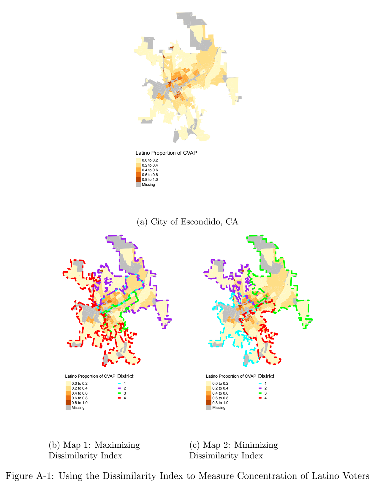

***Figure A-1.*** Using the Dissimilarity Index to Measure Concentration of Latino Voters

Latino % CVAP District Map 1 Map 2 1 0.37 0.21 2 0.16 0.21

3 0.28 0.21 4 0.13 0.22 Dissimilarity index 0.25 0.01

constraints into the estimation process, meaning that it approximates the particular distribution of plans that real-world decisionmakers, given the physical and residential geography of their city, can feasibly produce under federal law. To our knowledge this algorithm is the best among currently available methods at approximating this particular distribution that is of substantive interest to us. Second, the algorithm is computationally efficient, scales well, and is easy to implement using the R package redist (Kenny et al. 2021).

We refer the interested reader to a detailed discussion of the algorithm in the published articles (Fifield et al. 2020; McCartan et al. 2022), presenting only the intuition here. The approach treats the task of assigning m geographic units (for us, Census blocks) to n contiguous council districts as a graph-cut problem: partitioning a graph — where nodes represent geographic units and edges between two nodes represent their contiguity — into a set of connected subgraphs, representing districts. It then uses a Sequential Monte Carlo (SMC) algorithm to obtain a representative sample of plans from the distribution of valid plans as formulated in this way.

Parameter Selection

The algorithm requires a few key user-defined parameters. The first is compactness, which we set at the default level of ρ = 1 for every city.9 Larger values of ρ correspond to a preference for fewer edge cuts and therefore a redistricting plan with more compact districts. Based on the literature on edge-cut compactness (Dube and Clark 2016; DeFord, Duchin and Solomon 2021), McCartan and Imai (2022) suggest ρ = 1 as a choice that produces reasonably compact districts, and is computationally efficient.

The user is also required to provide a value for the maximal deviation from population parity — that is, where the city’s population is divided evenly among districts — that will be tolerated of any district in a feasible plan. Legislative districting at the federal level is held to a very high population equality standard. In the 1983 case Karcher v. Daggett, the Supreme Court ruled that there is no deviation that could practically be avoided that is too small to potentially violate the “one person, one vote” standard set by Article I, Section 2 of the Constitution. However, at the local level, larger deviations may be necessary to achieve other districting goals, especially in smaller and more sparsely or unevenly populated municipalities.

Absent concrete legal guidance or precedent at the city level, we approach the determination of the maximum tolerable deviation from population parity as an empirical matter. First we compute, for every adopted district plan, the maximal deviation of any district, given by:

(cid:12)(cid:80) p (cid:12)

(cid:12) i∈V i (cid:12)

max 1≤l≤n (cid:12) l − 1(cid:12) (2) (cid:12) p¯ (cid:12)

where V is a district, n is the number of districts, i is a Census block, p is the population in l i

block i from the 2010 Census, and p¯ is defined as

(cid:80)m

p /n (where m is the number of blocks). i=1 i

The second column of Table B-1 reports this maximal value for every city. We find that some cities, in particular smaller ones, have very high values — far beyond what is usually tolerated at the federal level — and the overall mean across cities is 0.10.10 We therefore set the population tolerance parameter as the maximum of 0.01 and the city’s own adopted map’s largest deviation,11 9See McCartan and Imai (2022), Section 3.3 for further detail.

10By comparison, the maximum deviation of the New Jersey redistricting plan rejected by Karcher v. Daggett was 0.004: the decision reports an average district population of 526,059 and smallest district (Sixth District) population of 523,798 (Karcher, Speaker, New Jersey Assembly, et al. v. Daggett et al. 1983).

11Although we made this decision as a safeguard against overly conservative restrictions, this constraint never

with the rationale that if a certain deviation was permitted in practice, then any plan with smaller deviations would have been fair game as well — at least on this dimension. While we cannot know how much larger a deviation might have been tolerated, our approach yields relatively conservative target distributions — that is, it may exclude some counterfactual possibilities that were in fact on the table. Still, because the deviations are so high in practice, the algorithm still has a large degree of freedom to explore alternative plans.

Diagnostics

We run the SMC algorithm with 4 independent chains with 10,000 simulations in each chain to assess convergence. This gives us 40,000 draws from the target distribution. Then we renumber the districts for each plan in a way that minimizes the number of blocks that have changed from the adopted plan.

The redist package helpfully computes several diagnostics to help the user assess whether the algorithm successfully sampled from the target distribution. We briefly describe each of these diagnostics, reported in Table B-1, and refer the reader to Fifield et al. (2020) as well as the redist package documentation12 for more details.

• Diversity (Column 3)

The off-diagonal elements of the variation of information distance matrix for our sample of plans. Column 3 reports the 80% range of this statistic. Generally, diversity is good if most values are greater than 0.5.

• Rˆ (Columns 4–7)

Rˆ values across the four chains computed for four variables: population overlap (Column 3), which measures how much of the population is in the same district in both a given plan and the reference plan, as well as homeownership rate (Column 4), percent of CVAP that is Latino (Column 5), and percent of voters who are Democrats (Column 6) — all defined in Appendix A above. Rˆ is calculated for the first district only; other districts look similar. Rˆ values should be close to 1 and generally under 1.05; otherwise, there is too much between-chain variation, indicating not enough samples.

• Effective Sample Size (Column 8)

The ratio of the effective sample size, computed using the SMC weights, to the total samples. Computed for run 1 of chain 1. Reported range is the minimum and maximum value across splits, excluding resample. Larger values (close to 100%) are better.

• Acceptance Rate (Column 9)

Fraction of drawn spanning trees that yield a valid redistricting plan within the population tolerance. Computed for run 1 of chain 1. Reported range is the minimum and maximum value across splits. We seek to avoid very small values (< 1%), which can indicate a bottleneck. • Maximum Unique Plans (Column 10)

An upper bound on the number of unique redistricting plans that survive each stage. Computed for run 1 of chain 1. Reported range is the minimum and maximum value across splits, excluding resample. Small values indicate a bottleneck.

binds in practice: the observed value is never less than 0.01.

12https://alarm-redist.org/redist/reference/summary.redist_plans.html

• Standard Deviation of the Log Weights (Column 11)

Standard deviation of the log weights. Computed for run 1 of chain 1. Reported range is the minimum and maximum value across splits, excluding resample. High standard deviations indicate less efficient sampling; values greater than 3 are likely problematic.

As Table B-1 indicates, we achieve desirable values on all of the above diagnostics in all cities.

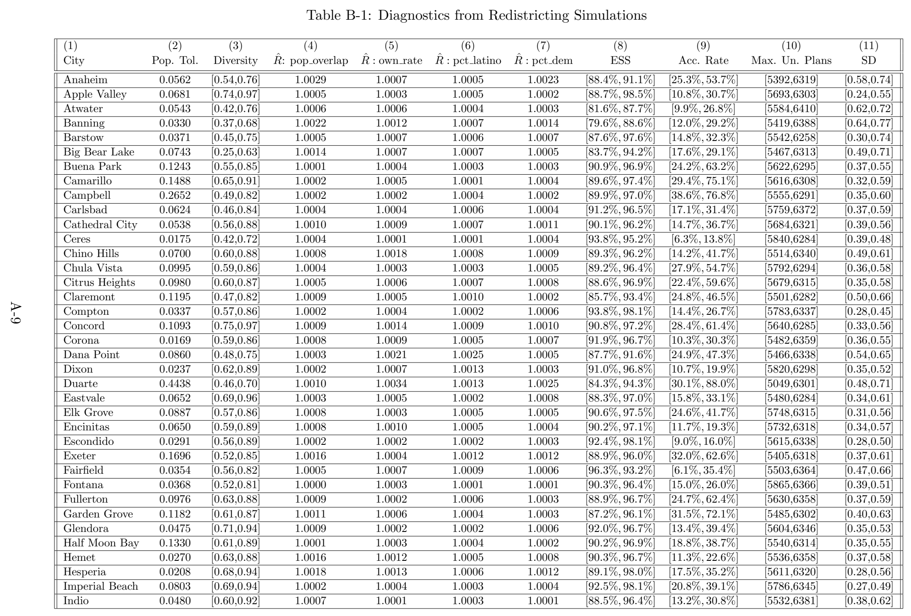

***Table B-1.*** Diagnostics from Redistricting Simulations

[Download data as CSV](tables/tab-01.csv)

(1) (2) (3) (4) (5) (6) (7) (8) (9) (10) (11) City Pop. Tol. Diversity Rˆ: pop overlap Rˆ : own rate Rˆ : pct latino Rˆ : pct dem ESS Acc. Rate Max. Un. Plans SD

Anaheim 0.0562 [0.54,0.76] 1.0029 1.0007 1.0005 1.0023 [88.4%,91.1%] [25.3%,53.7%] [5392,6319] [0.58,0.74] Apple Valley 0.0681 [0.74,0.97] 1.0005 1.0003 1.0005 1.0002 [88.7%,98.5%] [10.8%,30.7%] [5693,6303] [0.24,0.55] Atwater 0.0543 [0.42,0.76] 1.0006 1.0006 1.0004 1.0003 [81.6%,87.7%] [9.9%,26.8%] [5584,6410] [0.62,0.72] Banning 0.0330 [0.37,0.68] 1.0022 1.0012 1.0007 1.0014 [79.6%,88.6%] [12.0%,29.2%] [5419,6388] [0.64,0.77] Barstow 0.0371 [0.45,0.75] 1.0005 1.0007 1.0006 1.0007 [87.6%,97.6%] [14.8%,32.3%] [5542,6258] [0.30,0.74] Big Bear Lake 0.0743 [0.25,0.63] 1.0014 1.0007 1.0007 1.0005 [83.7%,94.2%] [17.6%,29.1%] [5467,6313] [0.49,0.71] Buena Park 0.1243 [0.55,0.85] 1.0001 1.0004 1.0003 1.0003 [90.9%,96.9%] [24.2%,63.2%] [5622,6295] [0.37,0.55] Camarillo 0.1488 [0.65,0.91] 1.0002 1.0005 1.0001 1.0004 [89.6%,97.4%] [29.4%,75.1%] [5616,6308] [0.32,0.59] Campbell 0.2652 [0.49,0.82] 1.0002 1.0002 1.0004 1.0002 [89.9%,97.0%] [38.6%,76.8%] [5555,6291] [0.35,0.60] Carlsbad 0.0624 [0.46,0.84] 1.0004 1.0004 1.0006 1.0004 [91.2%,96.5%] [17.1%,31.4%] [5759,6372] [0.37,0.59] Cathedral City 0.0538 [0.56,0.88] 1.0010 1.0009 1.0007 1.0011 [90.1%,96.2%] [14.7%,36.7%] [5684,6321] [0.39,0.56] Ceres 0.0175 [0.42,0.72] 1.0004 1.0001 1.0001 1.0004 [93.8%,95.2%] [6.3%,13.8%] [5840,6284] [0.39,0.48] Chino Hills 0.0700 [0.60,0.88] 1.0008 1.0018 1.0008 1.0009 [89.3%,96.2%] [14.2%,41.7%] [5514,6340] [0.49,0.61] Chula Vista 0.0995 [0.59,0.86] 1.0004 1.0003 1.0003 1.0005 [89.2%,96.4%] [27.9%,54.7%] [5792,6294] [0.36,0.58] Citrus Heights 0.0980 [0.60,0.87] 1.0005 1.0006 1.0007 1.0008 [88.6%,96.9%] [22.4%,59.6%] [5679,6315] [0.35,0.58] Claremont 0.1195 [0.47,0.82] 1.0009 1.0005 1.0010 1.0002 [85.7%,93.4%] [24.8%,46.5%] [5501,6282] [0.50,0.66] Compton 0.0337 [0.57,0.86] 1.0002 1.0004 1.0002 1.0006 [93.8%,98.1%] [14.4%,26.7%] [5783,6337] [0.28,0.45] Concord 0.1093 [0.75,0.97] 1.0009 1.0014 1.0009 1.0010 [90.8%,97.2%] [28.4%,61.4%] [5640,6285] [0.33,0.56] Corona 0.0169 [0.59,0.86] 1.0008 1.0009 1.0005 1.0007 [91.9%,96.7%] [10.3%,30.3%] [5482,6359] [0.36,0.55] Dana Point 0.0860 [0.48,0.75] 1.0003 1.0021 1.0025 1.0005 [87.7%,91.6%] [24.9%,47.3%] [5466,6338] [0.54,0.65] Dixon 0.0237 [0.62,0.89] 1.0002 1.0007 1.0013 1.0003 [91.0%,96.8%] [10.7%,19.9%] [5820,6298] [0.35,0.52] Duarte 0.4438 [0.46,0.70] 1.0010 1.0034 1.0013 1.0025 [84.3%,94.3%] [30.1%,88.0%] [5049,6301] [0.48,0.71] Eastvale 0.0652 [0.69,0.96] 1.0003 1.0005 1.0002 1.0008 [88.3%,97.0%] [15.8%,33.1%] [5480,6284] [0.34,0.61] Elk Grove 0.0887 [0.57,0.86] 1.0008 1.0003 1.0005 1.0005 [90.6%,97.5%] [24.6%,41.7%] [5748,6315] [0.31,0.56] Encinitas 0.0650 [0.59,0.89] 1.0008 1.0010 1.0005 1.0004 [90.2%,97.1%] [11.7%,19.3%] [5732,6318] [0.34,0.57] Escondido 0.0291 [0.56,0.89] 1.0002 1.0002 1.0002 1.0003 [92.4%,98.1%] [9.0%,16.0%] [5615,6338] [0.28,0.50] Exeter 0.1696 [0.52,0.85] 1.0016 1.0004 1.0012 1.0012 [88.9%,96.0%] [32.0%,62.6%] [5405,6318] [0.37,0.61] Fairfield 0.0354 [0.56,0.82] 1.0005 1.0007 1.0009 1.0006 [96.3%,93.2%] [6.1%,35.4%] [5503,6364] [0.47,0.66] Fontana 0.0368 [0.52,0.81] 1.0000 1.0003 1.0001 1.0001 [90.3%,96.4%] [15.0%,26.0%] [5865,6366] [0.39,0.51] Fullerton 0.0976 [0.63,0.88] 1.0009 1.0002 1.0006 1.0003 [88.9%,96.7%] [24.7%,62.4%] [5630,6358] [0.37,0.59] Garden Grove 0.1182 [0.61,0.87] 1.0011 1.0006 1.0004 1.0003 [87.2%,96.1%] [31.5%,72.1%] [5485,6302] [0.40,0.63] Glendora 0.0475 [0.71,0.94] 1.0009 1.0002 1.0002 1.0006 [92.0%,96.7%] [13.4%,39.4%] [5604,6346] [0.35,0.53] Half Moon Bay 0.1330 [0.61,0.89] 1.0001 1.0003 1.0004 1.0002 [90.2%,96.9%] [18.8%,38.7%] [5540,6314] [0.35,0.55] Hemet 0.0270 [0.63,0.88] 1.0016 1.0012 1.0005 1.0008 [90.3%,96.7%] [11.3%,22.6%] [5536,6358] [0.37,0.58] Hesperia 0.0208 [0.68,0.94] 1.0018 1.0013 1.0006 1.0012 [89.1%,98.0%] [17.5%,35.2%] [5611,6320] [0.28,0.56] Imperial Beach 0.0803 [0.69,0.94] 1.0002 1.0004 1.0003 1.0004 [92.5%,98.1%] [20.8%,39.1%] [5786,6345] [0.27,0.49] Indio 0.0480 [0.60,0.92] 1.0007 1.0001 1.0003 1.0001 [88.5%,96.4%] [13.2%,30.8%] [5532,6381] [0.38,0.62]

(1) (2) (3) (4) (5)

City Pop. Tol. Diversity Rˆ: pop overlap Rˆ : own rate Rˆ : Jurupa Valley 0.0559 [0.70,0.94] 1.0008 1.0004 1 King City 0.0466 [0.67,0.93] 1.0016 1.0003 1 Kingsburg 0.0571 [0.43,0.73] 1.0005 1.0002 1 Lake Forest 0.0623 [0.55,0.85] 1.0012 1.0016 1 La Mirada 0.0658 [0.54,0.86] 1.0011 1.0000 1 Lemoore 0.0350 [0.50,0.85] 1.0020 1.0014 1 Lincoln 0.1592 [0.47,0.80] 1.0005 1.0002 1 Lodi 0.0163 [0.72,0.95] 1.0010 1.0007 1 Lompoc 0.2231 [0.64,0.91] 1.0002 1.0005 1 Los Banos 0.0670 [0.57,0.85] 1.0002 1.0005 1 Madera 0.1849 [0.66,0.90] 1.0012 1.0002 1 Marina 0.1746 [0.61,0.93] 1.0002 1.0003 1 Menlo Park 0.2046 [0.42,0.74] 1.0008 1.0009 1 Modesto 0.0991 [0.57,0.83] 1.0007 1.0003 1 Monterey Park 0.0184 [0.67,0.91] 1.0001 1.0012 1 Morgan Hill 0.0855 [0.29,0.70] 1.0005 1.0005 1 Murrieta 0.1599 [0.68,0.94] 1.0002 1.0013 1 Napa 0.0919 [0.56,0.86] 1.0009 1.0002 1 Novato 0.1033 [0.63,0.89] 1.0017 1.0016 1 Ojai 0.1586 [0.59,0.80] 1.0000 1.0002 1 Orange 0.0869 [0.60,0.86] 1.0007 1.0003 1 Oxnard 0.1103 [0.69,0.91] 1.0010 1.0005 1 Pacifica 0.1710 [0.62,0.90] 1.0002 1.0005 1 Palmdale 0.0166 [0.48,0.72] 1.0002 1.0012 1 Palm Springs 0.0682 [0.61,0.92] 1.0002 1.0003 1 Paso Robles 0.1280 [0.45,0.80] 1.0006 1.0000 1 Patterson 0.0232 [0.59,0.86] 1.0003 1.0002 1 Placentia 0.0835 [0.55,0.83] 1.0007 1.0028 1 Porterville 0.0951 [0.65,0.90] 1.0006 1.0021 1 Poway 0.0779 [0.64,0.91] 1.0008 1.0001 1 Rancho Cucamonga 0.0489 [0.72,0.97] 1.0002 1.0001 1 Redlands 0.0184 [0.73,0.96] 1.0005 1.0008 1 Redwood City 0.2806 [0.71,0.90] 1.0018 1.0001 1 Richmond 0.1215 [0.55,0.81] 1.0046 1.0054 1 Rohnert Park 0.1662 [0.52,0.83] 1.0005 1.0005 1 Roseville 0.0940 [0.57,0.87] 1.0012 1.0003 1 Sanger 0.0373 [0.59,0.87] 1.0007 1.0005 1 San Rafael 0.0245 [0.24,0.66] 1.0030 1.0015 1 Santa Barbara 0.3315 [0.76,0.98] 1.0001 1.0006 1 Santa Clara 0.0735 [0.66,0.87] 1.0012 1.0010 1 6) (7) (8) (9) (10) (11) latino Rˆ : pct dem ESS Acc. Rate Max. Un. Plans SD

(1) (2) (3) (4) (5)

City Pop. Tol. Diversity Rˆ: pop overlap Rˆ : own rate Rˆ : Santa Maria 0.0161 [0.61,0.91] 1.0008 1.0002 1 Santa Rosa 0.0919 [0.69,0.93] 1.0027 1.0065 1 Santee 0.0479 [0.42,0.79] 1.0010 1.0007 1 Selma 0.0668 [0.49,0.81] 1.0009 1.0004 1 Simi Valley 0.0716 [0.65,0.92] 1.0008 1.0006 1 Solana Beach 0.2383 [0.50,0.82] 1.0004 1.0001 1 South Pasadena 0.0575 [0.66,0.92] 1.0004 1.0005 1 South San Francisco 0.1096 [0.33,0.63] 1.0008 1.0006 1 Stanton 0.0545 [0.29,0.63] 1.0003 1.0000 1 Stockton 0.0605 [0.70,0.94] 1.0016 1.0009 1 Sunnyvale 0.0829 [0.70,0.91] 1.0014 1.0008 1 Temecula 0.1160 [0.67,0.92] 1.0004 1.0009 1 Torrance 0.0531 [0.64,0.87] 1.0005 1.0006 1 Tulare 0.0303 [0.63,0.92] 1.0018 1.0006 1 Turlock 0.0640 [0.62,0.88] 1.0006 1.0003 1 Twentynine Palms 0.2716 [0.53,0.78] 1.0025 1.0010 1 Union City 0.0504 [0.46,0.79] 1.0004 1.0001 1 Upland 0.0415 [0.58,0.88] 1.0010 1.0007 1 Vallejo 0.0163 [0.68,0.96] 1.0008 1.0015 1 Ventura 0.0373 [0.57,0.82] 1.0031 1.0008 1 Visalia 0.1042 [0.74,0.97] 1.0005 1.0002 1 Vista 0.0751 [0.51,0.81] 1.0003 1.0007 1 Wasco 0.9150 [0.54,0.80] 1.0003 1.0013 1 West Covina 0.0819 [0.45,0.71] 1.0005 1.0002 1 Westminster 0.0922 [0.46,0.79] 1.0001 1.0001 1 Whittier 0.1058 [0.51,0.81] 1.0004 1.0005 1 Wildomar 0.0948 [0.56,0.81] 1.0004 1.0007 1 Woodland 0.1780 [0.62,0.89] 1.0002 1.0007 1 Yucaipa 0.0499 [0.74,0.99] 1.0001 1.0006 1 Yucca Valley 0.0534 [0.77,1.00] 1.0006 1.0005 1 6) (7) (8) (9) (10) (11) latino Rˆ : pct dem ESS Acc. Rate Max. Un. Plans SD

Using ShortBurst to Explore Extreme Values of the Distributions

After running the SMC algorithm on each city, we additionally run a second round of redistricting optimization through “short bursts,” implemented in the redist package through the function redist shortburst and described in Cannon et al. (2020). This approach finds the extreme values of the simulation distribution by running a Markov chain for a small number of iterations (a “short burst”), then restarting the chain from the most extreme plan encountered in the previous burst. We define the extremity of a plan based on the highest fraction of Latino voters across its districts. Thus, this final step helps us find the plans with the highest possible concentration of Latino voters in a district, including outlying values that are not captured when exploring the distribution using SMC.

Since the short burst algorithm is designed to find extreme values, we do not include these plans most of our analyses, so that our sampled plans remain representative of the target distribution. However, in Figures D-2 through D-6, we include the plans returned by short burst when reporting the minimum and maximum (but not the mean) of each city’s simulation distribution.

C Estimating Measures of Electoral Success

We take a four-step approach to estimating predicted Latino electoral success for any simulated districting plan.

### 1. Estimation Step: We begin by estimating a logistic regression on real-world city council

election data for the 106 cities in our sample, post-districting. Our dataset contains one observation for every election that took place in a city, council district, and election year. Estimated coefficients from this regression are reported in Table C-1.

Dependent variable: A binary indicator for whether a Latino won office in a city-districtelection year. Names of winning candidates are drawn from the California Elections Data Archive (CEDA) and candidate race is estimated using the R package wru (Imai and Khanna 2021).

Predictors: We include the following district-level predictors of electing a Latino candidate, which we compute by aggregating our shapefile data (described in detail in Appendix A above) from the Census block to the city council district level under each city’s adopted plan: (a) Total citizen voting-age population (CVAP)13

(b) Proportion of CVAP that is Black/African American, Asian, and Hispanic/Latino 14

(c) Proportion of registered voters who are Democrats15

(d) Homeownership rate16

(e) Citywide measure of segregation (dissimilarity index)

(f) Vote share to all Latino candidates in the following statewide elections:

• Controller, 2014

• Senate, 2016

13See section 2 of Appendix A for variable construction.

14We leave white and other as the omitted category. See section 2 of Appendix A for variable construction. 15See section 4 of Appendix A for variable construction.

16See section 1 of Appendix A for variable construction.

• Lieutenant Governor, 201817

2. Aggregation Step: For each simulated plan, we compute all of the predictors that went into the estimation model by aggregating up from Census blocks.

3. Prediction Step: Using the model estimated in Step 1 and the predictors computed in Step (cid:92)

2, we generate a predicted pˆ = P r(Winner is Latino ) for every simulated district in every d d

city.

4. Manipulation Step: With a set of pˆ ’s in hand for every plan, we can manipulate the district-level probabilities of electing Latino candidates into our plan-level electoral outcomes of interest:

• E[Latino council share] = 1 (cid:80)D pˆ

D d=1 d

• Pr(At least one Latino on council) = 1 − P r(No Latinos on council) = 1 − (cid:81)D (1 − pˆ ) d=1 d • Pr(Latino majority on council) = (cid:80) (cid:0)(cid:81) pˆ ∗ (cid:81) (1 − pˆ ) (cid:1) where M is the {L,N}∈M l∈L l n∈N n

set of all possible ways to make a set L of Latino-winning districts and N of non-Latinowinning districts s.t. |L| ≥ |N|.

These computations are valid under the simplifying assumption that district elections are independent of one another. While we recognize that there are almost certainly spillovers across districts — for instance, potential candidates’ calculations about entering a race in one district may also depend on conditions in other districts — such dependencies would be prohibitively computationally intensive to model.

Validating the Predictive Model

We evaluate the predictive power of our model in two ways. First, we use repeated ten-fold crossvalidation, repeated twenty times. The model’s average accuracy over the twenty trials is 0.763. We also use a randomly sampled partition of the data (60%) as a training set for fitting the model and the remainder (40%) as the test set, to generate predictions. Table C-2 presents a confusion matrix for these predictions in the test set, compared to the reference of their true values. The model has reasonably high accuracy out of sample, above 0.8.

17See section 5 of Appendix A for variable construction. We omit the 2014 Secretary of State race, on which we have also gathered data, from the model because of its high correlation with the 2014 Controller race.

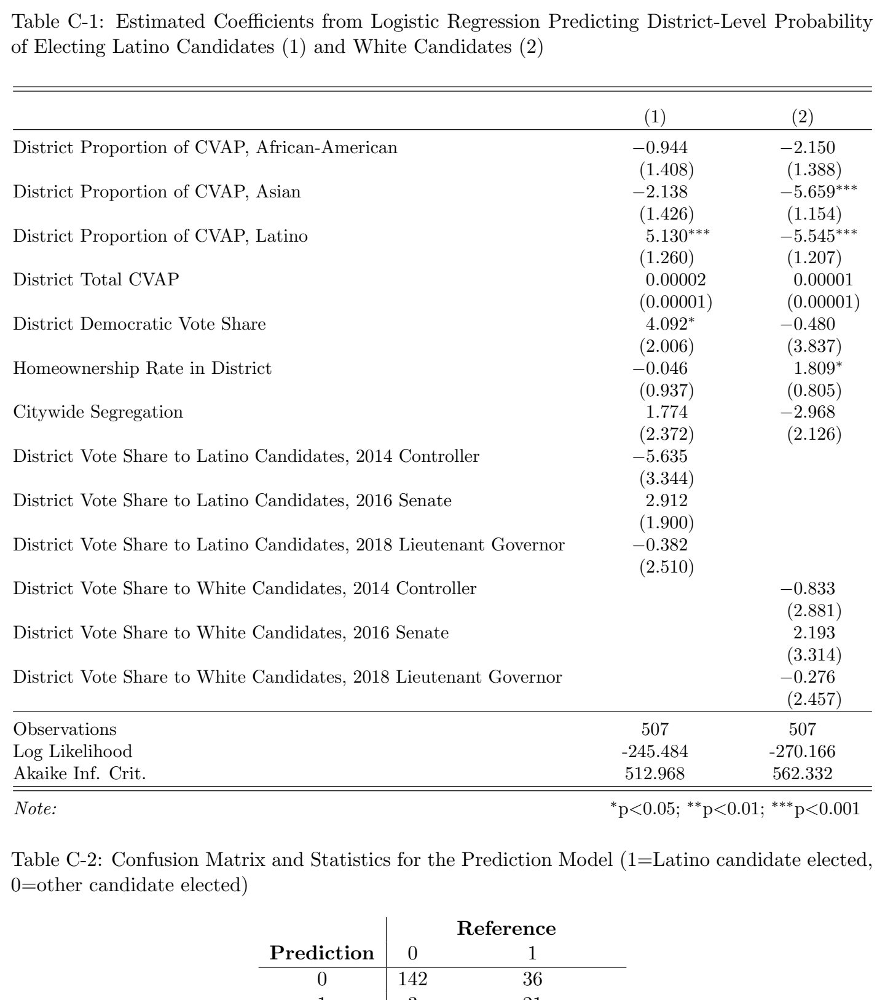

***Table C-1.*** Estimated Coefficients from Logistic Regression Predicting District-Level Probability of Electing Latino Candidates (1) and White Candidates (2)

[Download data as CSV](tables/tab-02.csv)

(1) (2)

District Proportion of CVAP, African-American −0.944 −2.150

(1.408) (1.388) District Proportion of CVAP, Asian −2.138 −5.659∗∗∗ (1.426) (1.154) District Proportion of CVAP, Latino 5.130∗∗∗ −5.545∗∗∗ (1.260) (1.207) District Total CVAP 0.00002 0.00001 (0.00001) (0.00001) District Democratic Vote Share 4.092∗ −0.480

(2.006) (3.837) Homeownership Rate in District −0.046 1.809∗ (0.937) (0.805) Citywide Segregation 1.774 −2.968 (2.372) (2.126) District Vote Share to Latino Candidates, 2014 Controller −5.635

(3.344)

District Vote Share to Latino Candidates, 2016 Senate 2.912

(1.900)

District Vote Share to Latino Candidates, 2018 Lieutenant Governor −0.382

(2.510)

District Vote Share to White Candidates, 2014 Controller −0.833 (2.881) District Vote Share to White Candidates, 2016 Senate 2.193 (3.314) District Vote Share to White Candidates, 2018 Lieutenant Governor −0.276 (2.457) Observations 507 507

Log Likelihood -245.484 -270.166 Akaike Inf. Crit. 512.968 562.332 Note: ∗p<0.05; ∗∗p<0.01; ∗∗∗p<0.001

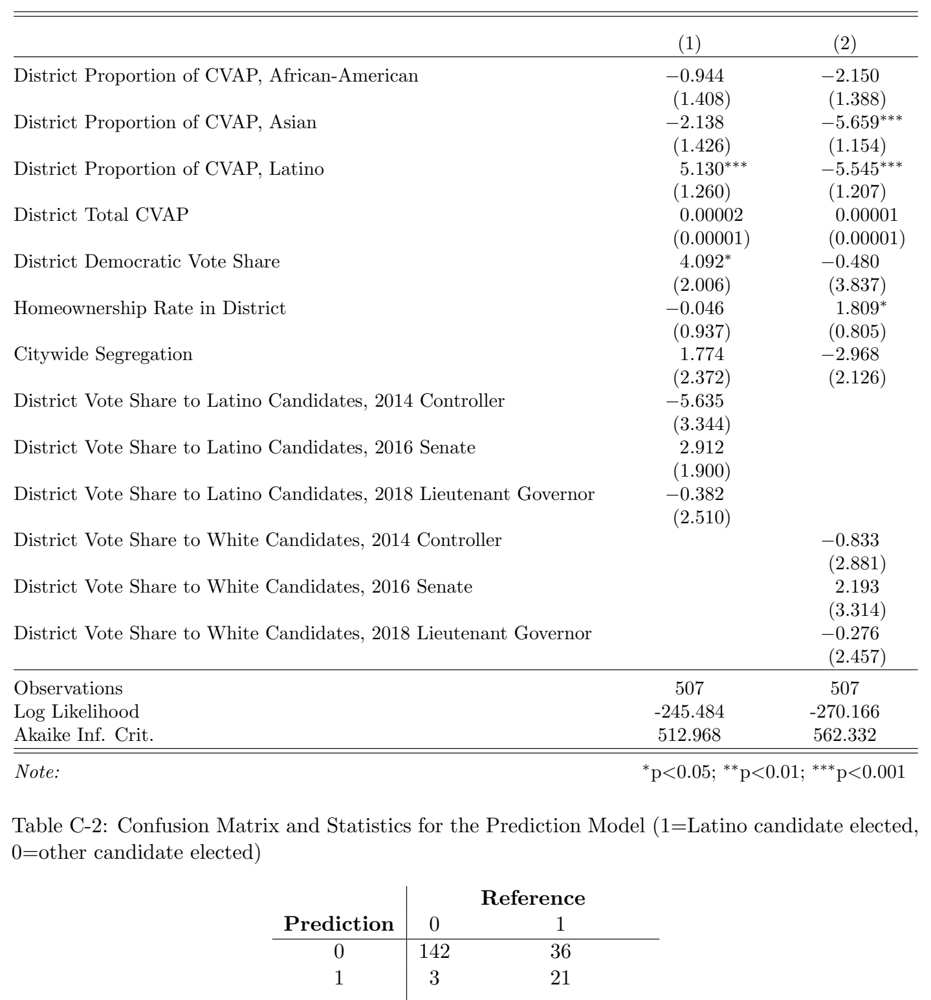

***Table C-2.*** Confusion Matrix and Statistics for the Prediction Model (1=Latino candidate elected, 0=other candidate elected) Reference Prediction 0 1 0 142 36 1 3 21

[Download data as CSV](tables/tab-03.csv)

Accuracy: 0.807 (95% CI: 0.746, 0.859) Sensitivity: 0.368

Specificity: 0.979

Precision: 0.875

Recall: 0.368

F1: 0.519

D Simulation Distributions

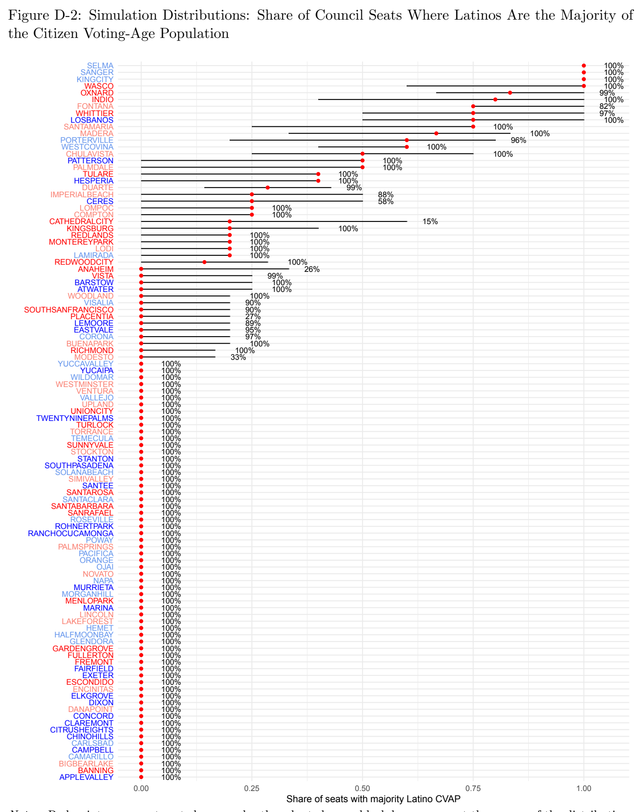

***Figure D-2.*** Simulation Distributions: Share of Council Seats Where Latinos Are the Majority of the Citizen Voting-Age Population

SELMA 100% SANGER 100% KINGCITY 100% WASCO 100% OXNARD 99% INDIO 100% FONTANA 82% WHITTIER 97% LOSBANOS 100% SANTAMARIA 100%

MADERA 100%

PORTERVILLE 96%

WESTCOVINA 100%

CHULAVISTA 100%

PATTERSON 100%

PALMDALE 100%

TULARE 100%

HESPERIA 100%

DUARTE 99%

IMPERIALBEACH 88% CERES 58% LOMPOC 100%

COMPTON 100%

CATHEDRALCITY 15% KINGSBURG 100%

REDLANDS 100%

MONTEREYPARK 100%

LODI 100%

LAMIRADA 100%

REDWOODCITY 100% ANAHEIM 26% VISTA 99% BARSTOW 100% ATWATER 100% WOODLAND 100%

VISALIA 90%

SOUTHSANFRANCISCO 90%

PLACENTIA 27%

LEMOORE 89% EASTVALE 95% CORONA 97% BUENAPARK 100% RICHMOND 100% MODESTO 33% YUCCAVALLEY 100%

YUCAIPA 100%

WILDOMAR 100%

WESTMINSTER 100%

VENTURA 100% VALLEJO 100% UPLAND 100% UNIONCITY 100% TWENTYNINEPALMS 100% TURLOCK 100% TORRANCE 100% TEMECULA 100% SUNNYVALE 100% STOCKTON 100% STANTON 100% SOUTHPASADENA 100% SOLANABEACH 100% SIMIVALLEY 100% SANTEE 100% SANTAROSA 100% SANTACLARA 100% SANTABARBARA 100% SANRAFAEL 100% ROSEVILLE 100% ROHNERTPARK 100% RANCHOCUCAMONGA 100% POWAY 100% PALMSPRINGS 100% PACIFICA 100% ORANGE 100% OJAI 100% NOVATO 100% NAPA 100% MURRIETA 100% MORGANHILL 100% MENLOPARK 100% MARINA 100% LINCOLN 100% LAKEFOREST 100% HEMET 100% HALFMOONBAY 100% GLENDORA 100% GARDENGROVE 100% FULLERTON 100% FREMONT 100% FAIRFIELD 100% EXETER 100% ESCONDIDO 100% ENCINITAS 100% ELKGROVE 100% DIXON 100% DANAPOINT 100% CONCORD 100% CLAREMONT 100% CITRUSHEIGHTS 100% CHINOHILLS 100% CARLSBAD 100% CAMPBELL 100% CAMARILLO 100%

BIGBEARLAKE 100%

BANNING 100%

APPLEVALLEY 100%

Share of seats with majority Latino CVAP

Notes: Red points represent seat shares under the adopted map; black bars represent the ranges of the distributions over 40,000 simulated maps. To the right of each distribution we indicate the percentile within the simulation distribution where the adopted map falls. City labels are colored by quantile of the distribution of segregation (measured by dissimilarity index of Latinos and non-Latinos) across the cities in our sample: highest quantile (> 0.26) in red, next quantile (between 0.21 and 0.26) in light red, next (between 0.17 and 0.21) in light blue, and lowest (< 0.17) in blue.

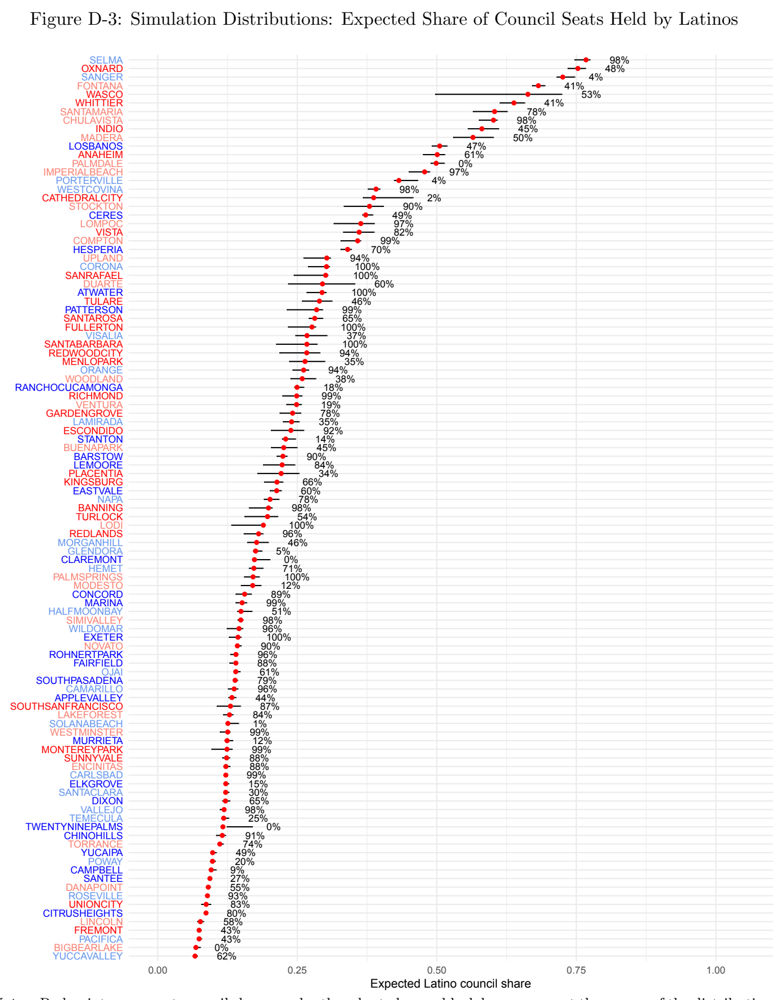

***Figure D-3.*** Simulation Distributions: Expected Share of Council Seats Held by Latinos

SELMA 98% OXNARD 48% SANGER 4%

FONTANA 41%

WASCO 53%

WHITTIER 41%

SANTAMARIA 78%

CHULAVISTA 98%

INDIO 45%

MADERA 50%

LOSBANOS 47%

ANAHEIM 61%

PALMDALE 0%

IMPERIALBEACH 97%

PORTERVILLE 4%

WESTCOVINA 98%

CATHEDRALCITY 2%

STOCKTON 90%

CERES 49%

LOMPOC 97%

VISTA 82% COMPTON 99% HESPERIA 70%

UPLAND 94%

CORONA 100%

SANRAFAEL 100%

DUARTE 60% ATWATER 100% TULARE 46% PATTERSON 99% SANTAROSA 65% FULLERTON 100% VISALIA 37% SANTABARBARA 100% REDWOODCITY 94% MENLOPARK 35% ORANGE 94% WOODLAND 38% RANCHOCUCAMONGA 18%

RICHMOND 99% VENTURA 19% GARDENGROVE 78% LAMIRADA 35% ESCONDIDO 92% STANTON 14% BUENAPARK 45% BARSTOW 90% LEMOORE 84% PLACENTIA 34% KINGSBURG 66% EASTVALE 60% NAPA 78% BANNING 98% TURLOCK 54% LODI 100% REDLANDS 96% MORGANHILL 46% GLENDORA 5%

CLAREMONT 0% HEMET 71% PALMSPRINGS 100% MODESTO 12% CONCORD 89% MARINA 99% HALFMOONBAY 51% SIMIVALLEY 98% WILDOMAR 96% EXETER 100% NOVATO 90% ROHNERTPARK 96% FAIRFIELD 88% OJAI 61% SOUTHPASADENA 79% CAMARILLO 96% APPLEVALLEY 44% SOUTHSANFRANCISCO 87% LAKEFOREST 84% SOLANABEACH 1% WESTMINSTER 99% MURRIETA 12% MONTEREYPARK 99% SUNNYVALE 88% ENCINITAS 88% CARLSBAD 99% ELKGROVE 15% SANTACLARA 30% DIXON 65% VALLEJO 98% TEMECULA 25% TWENTYNINEPALMS 0% CHINOHILLS 91% TORRANCE 74% YUCAIPA 49% POWAY 20% CAMPBELL 9%

SANTEE 27% DANAPOINT 55% ROSEVILLE 93% UNIONCITY 83% CITRUSHEIGHTS 80% LINCOLN 58% FREMONT 43%

PACIFICA 43%

BIGBEARLAKE 0%

YUCCAVALLEY 62%

Expected Latino council share

Notes: Red points represent council shares under the adopted map; black bars represent the ranges of the distributions over 40,000 simulated maps. To the right of each distribution we indicate the percentile within the simulation distribution where the adopted map falls. City labels are colored by quantile of the distribution of segregation (measured by dissimilarity index of Latinos and non-Latinos) across the cities in our sample: highest quantile (> 0.26) in red, next quantile (between 0.21 and 0.26) in light red, next (between 0.17 and 0.21) in light blue, and lowest (< 0.17) in blue.

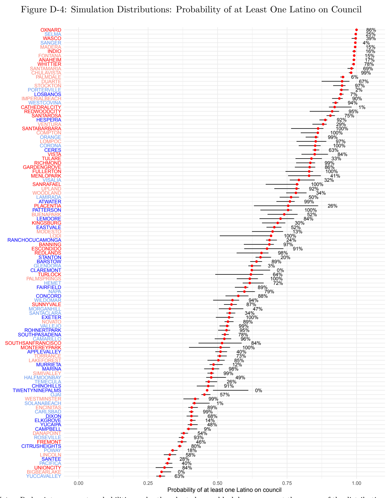

***Figure D-4.*** Simulation Distributions: Probability of at Least One Latino on Council

OXNARD 86% SELMA 25% WASCO 39% SANGER 4% MADERA 15% INDIO 16% FONTANA 15% ANAHEIM 17% WHITTIER 78% SANTAMARIA 69% CHULAVISTA 99% PALMDALE 6%

DUARTE 67% STOCKTON 97% PORTERVILLE 2% LOSBANOS 7%

IMPERIALBEACH 90% WESTCOVINA 94% CATHEDRALCITY 1% REDWOODCITY 95% SANTAROSA 75% HESPERIA 92%

VENTURA 29%

SANTABARBARA 100% COMPTON 100%

ORANGE 99%

LOMPOC 97% CORONA 100% CERES 63% VISTA 84% TULARE 33% RICHMOND 99%

GARDENGROVE 86%

FULLERTON 100% MENLOPARK 41% VISALIA 32% SANRAFAEL 100%

UPLAND 92%

WOODLAND 34%

LAMIRADA 50%

ATWATER 99%

PLACENTIA 26% PATTERSON 100% BUENAPARK 52% LEMOORE 84% KINGSBURG 30%

EASTVALE 52%

MODESTO 13%

LODI 100%

RANCHOCUCAMONGA 24% BANNING 97% ESCONDIDO 91% REDLANDS 98%

STANTON 20% BARSTOW 89%

GLENDORA 3%

CLAREMONT 0% TURLOCK 64% PALMSPRINGS 100% HEMET 72% FAIRFIELD 89%

NAPA 79% CONCORD 88%

WILDOMAR 94%

SUNNYVALE 87%

MORGANHILL 47% SANTACLARA 34%

EXETER 100% NOVATO 89% VALLEJO 99% ROHNERTPARK 95% SOUTHPASADENA 78%

CAMARILLO 96% SOUTHSANFRANCISCO 84% MONTEREYPARK 100% APPLEVALLEY 40% TORRANCE 73% LAKEFOREST 85% MURRIETA 12%

MARINA 98%

SIMIVALLEY 99%

HALFMOONBAY 49% TEMECULA 26% CHINOHILLS 91%

TWENTYNINEPALMS 0% OJAI 57% WESTMINSTER 99%

SOLANABEACH 1%

ENCINITAS 89%

CARLSBAD 99%

DIXON 68% ELKGROVE 14% YUCAIPA 48% CAMPBELL 9% DANAPOINT 54% ROSEVILLE 93%

FREMONT 46% CITRUSHEIGHTS 80% POWAY 18%

LINCOLN 58%

SANTEE 28%

PACIFICA 40%

UNIONCITY 84%

BIGBEARLAKE 0%

YUCCAVALLEY 63%

Probability of at least one Latino on council

Notes: Red points represent probabilities under the adopted map; black bars represent the ranges of the distributions over 40,000 simulated maps. To the right of each distribution we indicate the percentile within the simulation distribution where the adopted map falls. City labels are colored by quantile of the distribution of segregation (measured by dissimilarity index of Latinos and non-Latinos) across the cities in our sample: highest quantile (> 0.26) in red, next quantile (between 0.21 and 0.26) in light red, next (between 0.17 and 0.21) in light blue, and lowest (< 0.17) in blue.

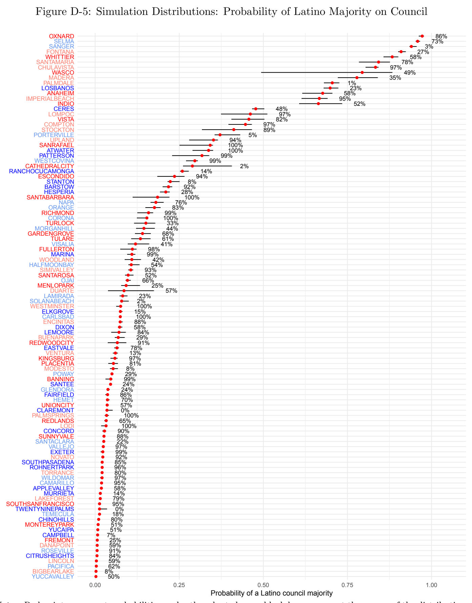

***Figure D-5.*** Simulation Distributions: Probability of Latino Majority on Council

OXNARD 86% SELMA 73% SANGER 3% FONTANA 27%

WHITTIER 58% SANTAMARIA 78%

CHULAVISTA 97%

WASCO 49%

MADERA 35%

PALMDALE 1%

LOSBANOS 23%

ANAHEIM 58%

IMPERIALBEACH 95%

INDIO 52% CERES 48%

LOMPOC 97%

VISTA 82%

COMPTON 97%

STOCKTON 89%

PORTERVILLE 5%

UPLAND 94%

SANRAFAEL 100%

ATWATER 100%

PATTERSON 99%

WESTCOVINA 99%

CATHEDRALCITY 2% RANCHOCUCAMONGA 14%

ESCONDIDO 94%

STANTON 8%

BARSTOW 92%

HESPERIA 28%

SANTABARBARA 100% NAPA 76%

ORANGE 83%

RICHMOND 99%

CORONA 100%

TURLOCK 33% MORGANHILL 44% GARDENGROVE 68% TULARE 61% VISALIA 41% FULLERTON 98%

MARINA 99%

WOODLAND 42% HALFMOONBAY 54% SIMIVALLEY 93%

SANTAROSA 52% OJAI 66% MENLOPARK 25% DUARTE 57% LAMIRADA 23% SOLANABEACH 2% WESTMINSTER 100% ELKGROVE 15% CARLSBAD 100% ENCINITAS 88% DIXON 58% LEMOORE 84% BUENAPARK 29% REDWOODCITY 91% EASTVALE 78% VENTURA 13% KINGSBURG 97% PLACENTIA 81% MODESTO 8% POWAY 29% BANNING 99% SANTEE 24% GLENDORA 24% FAIRFIELD 86% HEMET 70% UNIONCITY 57% CLAREMONT 0% PALMSPRINGS 100% REDLANDS 65% LODI 100% CONCORD 90% SUNNYVALE 88% SANTACLARA 22% VALLEJO 97% EXETER 99% NOVATO 92% SOUTHPASADENA 85% ROHNERTPARK 96% TORRANCE 80% WILDOMAR 97% CAMARILLO 95% APPLEVALLEY 58% MURRIETA 14% LAKEFOREST 79% SOUTHSANFRANCISCO 95% TWENTYNINEPALMS 0% TEMECULA 18% CHINOHILLS 80% MONTEREYPARK 51% YUCAIPA 51% CAMPBELL 7% FREMONT 25% DANAPOINT 59% ROSEVILLE 91% CITRUSHEIGHTS 84% LINCOLN 59%

PACIFICA 62%

BIGBEARLAKE 8%

YUCCAVALLEY 50%

Probability of a Latino council majority

Notes: Red points represent probabilities under the adopted map; black bars represent the ranges of the distributions over 40,000 simulated maps. To the right of each distribution we indicate the percentile within the simulation distribution where the adopted map falls. City labels are colored by quantile of the distribution of segregation (measured by dissimilarity index of Latinos and non-Latinos) across the cities in our sample: highest quantile (> 0.26) in red, next quantile (between 0.21 and 0.26) in light red, next (between 0.17 and 0.21) in light blue, and lowest (< 0.17) in blue.

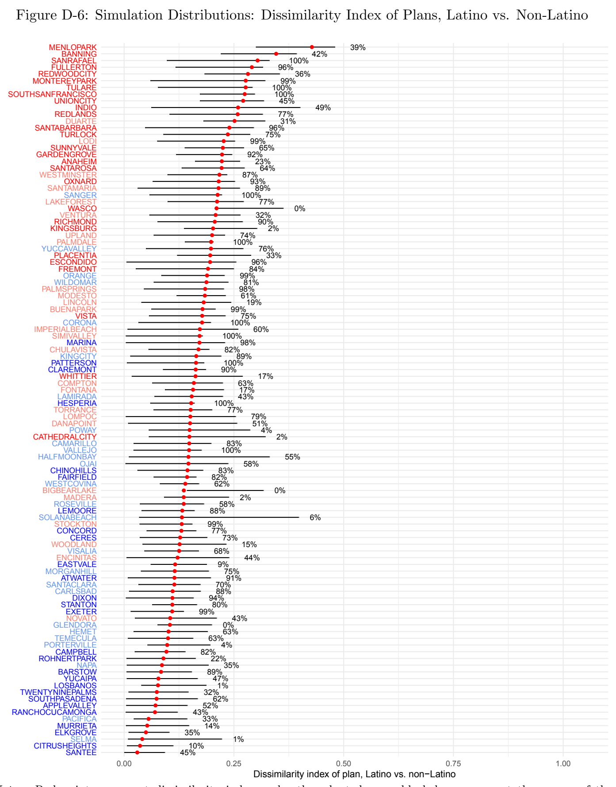

***Figure D-6.*** Simulation Distributions: Dissimilarity Index of Plans, Latino vs. Non-Latino

MENLOPARK 39% BANNING 42%

SANRAFAEL 100%

FULLERTON 96%

REDWOODCITY 36%

MONTEREYPARK 99%

TULARE 100%

SOUTHSANFRANCISCO 100%

UNIONCITY 45% INDIO 49% REDLANDS 77% DUARTE 31% SANTABARBARA 96% TURLOCK 75% LODI 99%

SUNNYVALE 65%

GARDENGROVE 92%

ANAHEIM 23% SANTAROSA 64% WESTMINSTER 87%

OXNARD 93% SANTAMARIA 89% SANGER 100% LAKEFOREST 77% WASCO 0% VENTURA 32% RICHMOND 90% KINGSBURG 2% UPLAND 74%

PALMDALE 100%

YUCCAVALLEY 76% PLACENTIA 33% ESCONDIDO 96% FREMONT 84% ORANGE 99% WILDOMAR 81% PALMSPRINGS 98% MODESTO 61% LINCOLN 19% BUENAPARK 99% VISTA 75% CORONA 100% IMPERIALBEACH 60% SIMIVALLEY 100%

MARINA 98% CHULAVISTA 82%

KINGCITY 89% PATTERSON 100% CLAREMONT 90%

WHITTIER 17% COMPTON 63% FONTANA 17% LAMIRADA 43%

HESPERIA 100%

TORRANCE 77%

LOMPOC 79% DANAPOINT 51% POWAY 4% CATHEDRALCITY 2% CAMARILLO 83%

VALLEJO 100%

HALFMOONBAY 55% OJAI 58%

CHINOHILLS 83%

FAIRFIELD 82%

WESTCOVINA 62%

BIGBEARLAKE 0% MADERA 2%

ROSEVILLE 58%

LEMOORE 88%

SOLANABEACH 6% STOCKTON 99%

CONCORD 77%

CERES 73%

WOODLAND 15% VISALIA 68%

ENCINITAS 44% EASTVALE 9% MORGANHILL 75% ATWATER 91% SANTACLARA 70%

CARLSBAD 88% DIXON 94%

STANTON 80% EXETER 99%

NOVATO 43% GLENDORA 0% HEMET 63% TEMECULA 63% PORTERVILLE 4% CAMPBELL 82%

ROHNERTPARK 22% NAPA 35% BARSTOW 89% YUCAIPA 47% LOSBANOS 1% TWENTYNINEPALMS 32% SOUTHPASADENA 62% APPLEVALLEY 52% RANCHOCUCAMONGA 43%

PACIFICA 33% MURRIETA 14%

ELKGROVE 35%

SELMA 1%

CITRUSHEIGHTS 10%

SANTEE 45%

Dissimilarity index of plan, Latino vs. non−Latino

Notes: Red points represent dissimilarity index under the adopted map; black bars represent the ranges of the distributions over 40,000 simulated maps. To the right of each distribution we indicate the percentile within the simulation distribution where the adopted map falls. City labels are colored by quantile of the distribution of segregation (measured by dissimilarity index of Latinos and non-Latinos) across the cities in our sample: highest quantile (> 0.26) in red, next quantile (between 0.21 and 0.26) in light red, next (between 0.17 and 0.21) in light blue, and lowest (< 0.17) in blue.

E Additional Tables and Figures

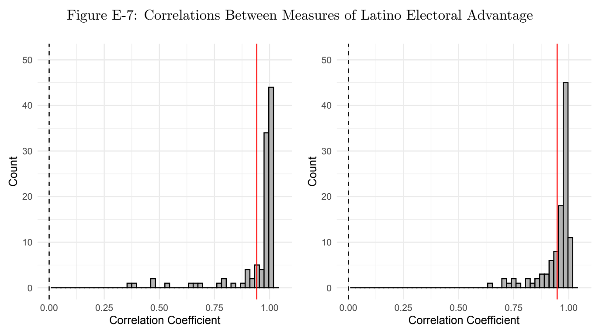

***Figure E-7.*** Correlations Between Measures of Latino Electoral Advantage

Correlation Coefficient

tnuoC

Correlation Coefficient (a) Expected Latino Council Share and

Pr(At Least One Latino on Council)

tnuoC

(b) Expected Latino Council Share and Pr(Latino Council Majority)

Correlation Coefficient

tnuoC

(c) Pr(At Least One Latino on Council) and Pr(Latino Council Majority)

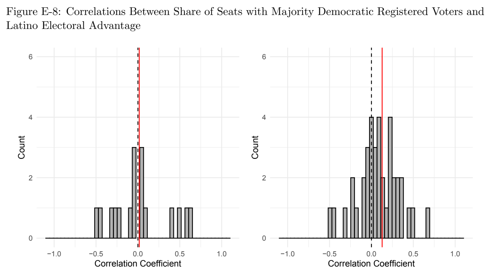

***Figure E-8.*** Correlations Between Share of Seats with Majority Democratic Registered Voters and Latino Electoral Advantage

−1.0 −0.5 0.0 0.5 1.0

Correlation Coefficient

tnuoC

−1.0 −0.5 0.0 0.5 1.0 Correlation Coefficient

(a) Share of seats w/Democratic registered voter

majority and share of seats w/Latino CVAP

majority

tnuoC

(b) Share of seats w/Democratic registered voter majority and expected Latino council share −1.0 −0.5 0.0 0.5 1.0

Correlation Coefficient

tnuoC

−1.0 −0.5 0.0 0.5 1.0 Correlation Coefficient

(c) Share of seats w/Democratic registered voter

majority and Pr(at least one Latino on council)

tnuoC

(d) Share of seats w/Democratic registered voter majority and Pr(Latino council majority)

## References

Cannon, Sarah, Ari Goldbloom-Helzner, Varun Gupta, JN Matthews and Bhushan Suwal. 2020. “Voting Rights, Markov Chains, and Optimization by Short Bursts.”.

URL: https://arxiv.org/abs/2011.02288

DeFord, Daryl, Moon Duchin and Justin Solomon. 2021. “Recombination: A Family of Markov Chains for Redistricting.” Harvard Data Science Review.

URL: https://hdsr.mitpress.mit.edu/pub/1ds8ptxu

Dube, Matthew P. and Jesse Tyler Clark. 2016. “Beyond the Circle: Measuring District Compactness Using Graph Theory.” Northeast Political Science Association Conference — Boston, MA. URL: https://www.researchgate.net/publication/311557290 Beyond the Circle Measuring District Compactness Fifield, Benjamin, Michael Higgins, Kosuke Imai and Alexander Tarr. 2020. “Automated Redistricting Simulation Using Markov Chain Monte Carlo.” Journal of Computational and Graphical Statistics 29(4):715–728.

Imai, Kosuke and Kabir Khanna. 2021. “Who Are You? Bayesian Prediction of Racial Category Using Surname and Geolocation.” https://github.com/kosukeimai/wru.

Karcher, Speaker, New Jersey Assembly, et al. v. Daggett et al. 1983. 462 U.S. 725.

URL: https://tile.loc.gov/storage-services/service/ll/usrep/usrep462/usrep462725/usrep462725.pdf Kenny, Christopher T., Cory McCartan, Ben Fifield and Kosuke Imai. 2021. “redist: Simulation Methods for Legislative Redistricting.” Available at The Comprehensive R Archive Network (CRAN).

URL: https://CRAN.R-project.org/package=redist

McCartan, Cory, Christopher Kenny, Tyler Simko, Shiro Kuriwaki, George Garcia III, Kevin Wang, Melissa Wu and Kosuke Imai. 2022. “Simulated Redistricting Plans for the Analysis and Evaluation of Redistricting in the United States.” Nature Scientific Data 9:689.

McCartan, Cory and Kosuke Imai. 2022. “Sequential Monte Carlo for Sampling Balanced and Compact Redistricting Plans.” arXiv.

URL: https://arxiv.org/pdf/2008.06131.pdf