# Concentrated Burdens: How Self-Interest and Partisanship Shape Opinion on Opioid Treatment Policy

Concentrated Burdens:

### Justin de Benedictis-Kessner∗ Michael Hankinson†

### July 9, 2019

Forthcoming in the American Political Science Review

Abstract

When does self-interest influence public opinion on contentious public policies? The bulk of theory in political science suggests that self-interest is only a minor force in public opinion. Using nationally-representative survey data, we show how financial and spatial self-interest and partisanship all shape public opinion on opioid treatment policy. We find that a majority of respondents support a redistributive funding model for treatment programs, while treatment funded by taxation based on a community’s overdose rate is less popular. Moreover, financial self-interest cross-pressures lowerincome Republicans, closing the partisan gap in support by more than half. We also experimentally test how the spatial burden of siting treatment clinics alters policy preferences. People across the political spectrum are less supportive when construction of a clinic is proposed closer to their home. These results highlight how partisanship

and self-interest interact in shaping preferences on public policy with concentrated

burdens.

Keywords: public policy, public opinion, opioids, addiction, redistribution, NIMBYism

Both authors contributed equally. For comments, suggestions, and advice, we thank Karl Kronebusch, St´ephane Lavertu, Brendan Nyhan, Justin Phillips, Melissa Sands, and participants at the 2018 Local Political Economy APSA pre-conference, the 2018 APSA Annual Meeting, the 2018 APPAM Fall Research Conference, and seminars at the Marxe School of Public & International Affairs, Baruch College, and the Northeastern University School of Public Policy and Urban Affairs. We appreciate the research assistance of Cody Edgerly, Aaron Henry, and Claudia Scott, and funding from Time-sharing Experiments for the Social Sciences (TESS).

∗Assistant Professor, Boston University. 232 Bay State Road, Boston, MA 02215. jdbk@bu.edu

†Assistant Professor of Political Science, Baruch College, CUNY. One Bernard Baruch Way, New York, NY 10010. 610-368-0200. michael.hankinson@baruch.cuny.edu

When does self-interest motivate people’s opinions on public policy? Much of political science has downplayed the role of self-interest in the formation of public opinion (Kinder and Kiewiet, 1981; Sears and Funk, 1991). Especially when it comes to economic self-interest, people often form opinions counter to what political scientists assume would be their rational, self-interested preferences (e.g., Campbell et al., 1960; Gelman, 2008). Instead, researchers note the primacy of partisanship and ideology in public opinion (e.g. Green, Palmquist, and Schickler, 2002).

The deepening opioid overdose crisis presents a policy challenge in which self-interest may be especially strong. Each day, nearly 200 Americans die from a drug overdose, making overdose the leading cause of death for Americans under age 55 (Katz and Sanger-Katz, 2018). Despite the acuity of this crisis, policymakers have faced difficulty in appropriating and allocating the funding public health experts believe is necessary to combat the epidemic (Saloner and Barry, 2018).

Part of this shortfall may stem from variation in need for these policies. Currently, many high-need communities bear a disproportionate share of the financial burden in responding to the crisis.1 Municipal and county governments often must cover the increased costs of emergency call volumes, ambulance services, medical examiner and coroner bills, overcrowded jails, and care services for those struggling with addiction (Seligson and Reid, 2017). Moreover, people often fear that the construction of addiction treatment infrastructure will deteriorate public safety, decrease property values, and diminish overall quality of life (e.g. Banker, 2017). Through these intense forces of financial and spatial self-interest, the opioid crisis provides an opportunity to test when self-interest motivates policy preferences. Furthermore, the crisis affects not only urban areas, but also rural, whiter, less wealthy, and more conservative parts of the United States in a way that previous drug crises have not (Jalal et al., 2018). This political geography provides new ground for understanding theories 1Ohio, for instance, has large within-state inequality of costs in confronting the opioid crisis. Rembert et al. (2017) estimate that in 2015 multiple Ohio counties bore costs greater than $1,400 per capita, while in five low-overdose counties costs were less than $100 per capita.

of self-interest across political, demographic, and geographic spectrums where these forces may cross-pressure members of the public.

Using a nationally-representative survey and an embedded experiment, we test support for policies to address the opioid crisis, specifically the funding of treatment and the construction of new treatment clinics. In our experiment, we vary the location of a proposed clinic to test the influence of a respondents’ spatial self-interest on public opinion. Overall, we find that treatment policy funded redistributively is more popular than policy funded based on a community’s local overdose burden, as current financial burdens are de facto allocated. Under both funding models, people support policies less if they will pay more to fund the policy, demonstrating the influence of financial self-interest. Leveraging the geographic breadth of our survey sample, we also test how self-interest and partisan predispositions cross-pressure voters. While Republicans are less supportive of treatment policies than Democrats overall, financial self-interest cross-pressures lower-income Republicans, leading them to form opinions more in line with partisans across the aisle than they would otherwise. Additionally, we show that the physical proximity of treatment infrastructure activates spatial self-interest: people across the political spectrum oppose clinic construction more when it is proposed closer to their home. Together, these results demonstrate the power of self-interest and its ability to cross-pressure voters on an especially severe policy challenge with concentrated burdens.

## Theoretical Expectations

Research on “policy feedback” has shown that direct policy benefits from social programs — such as Medicare and the GI bill — may galvanize constituencies to protect those policies (e.g., Campbell, 2005; Mettler, 2005). Similarly, direct policy costs may provoke opposition due to financial self-interest, such as wealthy homeowners opposing high property taxes (Sears and Citrin, 1982). Such costs may be not only financial, but also spatial, provoking

self-interest typified by NIMBY (‘Not In My Backyard’) opposition (e.g., Hankinson, 2018; Stokes, 2016). Public policy to confront the opioid crisis may activate an especially powerful sense of self-interest because of the policies’ concentrated burdens. Specifically, self-interest may motivate people to support policies in which they will pay less relative to policies where they will pay more, and support treatment infrastructure less when it is closer to them rather than far.

However, partisan polarization may limit the influence of self-interest. Preferences for drug treatment policy — as with many other policies — have historically cleaved along partisan lines: Democrats have ordinarily been more supportive of treatment programs than Republicans (Meier, 1994). At national, state, and local levels, evidence abounds that partisanship shapes policy outputs (Caughey, Warshaw, and Xu, 2017; de Benedictis-Kessner and Warshaw, 2016). Growing polarization among elites and the nationalization of politics may reinforce the degree to which this partisanship affects public opinion (Druckman, Peterson, and Slothuus, 2013; Hopkins, 2018). Yet in some policy areas, partisan polarization has led to few policy differences (Anzia and Moe, 2017; Grumbach, 2018). Especially in the area of health policy, personal experiences and self-interest may attenuate the role of partisanship (Campbell, 2015; Lerman and McCabe, 2017).

Because of the geography of the opioid crisis, the communities most affected by today’s crisis — those who are also currently paying the cost of treatment policy — are much more likely to be conservative than in past drug crises. Therefore the voters whose self-interest — based on their income, context, and location — might influence their policy preferences may also have differing partisan predispositions towards health policy. In other words, voters may be cross-pressured (Klar, 2013; Chong, Citrin, and Conley, 2001) by their partisanship and self-interest in the formation of policy preferences concerning the opioid crisis. We expect that financial and spatial self-interest may influence individuals to form opinions that decrease attitudinal polarization between parties.

## Research Design and Data

To test these theoretical questions, we surveyed a representative sample of 2,000 United States residents in 2018.2 In this survey, we asked respondents their support for a policy funding opioid treatment and a policy that would open a new treatment clinic nearby. We measured support for each using a five-point scale from ‘strongly support’ to ‘strongly oppose.’3

The first policy proposal involved a $100 million state bill funding medication-assisted opioid addiction treatment. Using a split-sample design, we described a funding model designed in one of two ways that varied the allocation of the policy’s financial burden.4 In the first of the two split-sample options, the income-based option, we describe the policy as funded redistributively, with those people who have a household income higher than their state’s median income paying more than those with a lower household income. In the second split-sample option, the overdose rate-based option, we describe the policy as funded instead according to a community’s overdose rate, with those living in areas with a higher opioid overdose rate relative to their state’s median rate paying more than those in areas with a lower overdose rate.5 This second option — allocating financial burden based on the local overdose burden — matches the costs of treatment to those who would benefit from the funding, a framework championed for other policies with spatially concentrated benefits (e.g., Mullin, Smith, and McNamara, 2018). Furthermore, this design of policy matches the status quo, in which cities and counties with high rates of opioid use have few outside resources to which 2In Appendix A, we further describe the sampling procedure and demographic characteristics of this survey, conducted on the NORC AmeriSpeak panel.

3We recoded each of the scales to a binary measure with the value 1 if respondents answered either ‘strongly support’ or ‘somewhat support’ and 0 otherwise. Appendix F shows the text of all survey questions.

4In both cases, the funding of the policy was allocated such that some people would pay $55 while others would pay $5 in additional taxes for the policy. These dollar figures were based on the 2018 federal budget, wherein the federal government proposed spending $4.6 billion to fight the opioid crisis (Mulvihill, 2018). Were all $4.6 billion to be directed to treatment funding, the average payment per taxpayer would be approximately $30. We divide the $30 per person into a 1:11 ratio to emphasize the potentially disproportionate burden sharing.

5As described in full detail in Appendix F, we use information about respondents (their income and location) to display which of the funding groups they would be in for that policy.

they can turn and must shoulder the financial burden for these policies.6 In short, our first policy option allocates costs redistributively while the second option mirrors the status quo, allocating financial costs according to need.

The second policy proposal involved the construction of a new opioid treatment clinic. We experimentally varied the clinic’s proposed location to manipulate its spatial cost and therefore assess the causal effect of respondents’ spatial self-interest. We described the proposed location as either 2 miles away (a 40-minute walk), in the far treatment condition, or 1/4 mile away (a 5-minute walk), in the near treatment condition, from the respondent’s home. The difference in average levels of support for the treatment clinic between the two experimental conditions represents the treatment effect of the proximity of policy infrastructure.

To assess moderators of self-interest, we measured respondent exposure to the opioid crisis, as contact with societal ills may affect political participation and policy attitudes (e.g., Bateson, 2012). First, we asked if respondents personally knew anyone who had been addicted to opioids, including heroin and prescription pain killers. Second, we measured respondents’ contextual exposure to overdose deaths by connecting their ZIP code to countylevel data on opioid death rates in 2015 from the National Vital Statistics System (NVSS) provided by the Centers for Disease Control’s National Center for Health Statistics. Finally, we recorded respondents’ self-reported partisan identification, ideology, income, and ZIP code.

## Results

We first assess how respondents’ characteristics determine support for opioid treatment policy, separating the two split-sample funding-allocation options for the first policy proposal and aggregating both experimental treatment groups for our second policy proposal. These 6For instance, taxpayers in these communities are increasingly forced to raise property taxes to fund their own treatment programs (e.g., Boyle, 2017).

descriptive results are presented in the three panels of Figure 1, with the percent of respondents supporting each policy on the vertical axis and subgroups by respondents’ characteristics along the horizontal axis. Overall, 56% supported the redistributive treatment funding proposal, while 44% supported the needs-based funding proposal and 46% supported the construction of a new opioid treatment clinic in their community. This preference for the redistributive over the needs-based funding model for treatment funding extends across all subgroups of respondents.

As with most social policies, partisanship and ideology divide public opinion on all three opioid treatment policy options. Republican respondents were 28 percentage points less likely to support the policy proposal with a redistributive funding model for addiction treatment, 15 percentage points less likely to support the needs-based proposal, and 25 percentage points less likely to support the construction of a treatment clinic than Democratic respondents.7 Personal exposure to the opioid crisis also affected people’s support for these policies. 54% of our sample reported personally knowing someone who had struggled with opioid addiction. Respondents who reported knowing someone who has been addicted to opioids were on average 9 percentage points more supportive of each of the three policies than those who did not know someone with addiction issues.8 Income and community exposure to the opioid crisis also influence policy preferences, which we explore in detail in the next section. 7In Appendix C, we present these results in tabular form along with additional subgroups of respondents. 8We explore the correlates of knowing someone with addiction in Appendix A, as well as differential support across other moderators in Appendix C.

Treatment Funding: Redistributive

All Democrats Independents Republicans Know Don't Know Below Median Above Median Below Median Above Median Respondents (n = 499) (n = 174) (n = 317) Someone Someone Income Income Overdose RateOverdose Rate (n = 991) w/ Addiction w/ Addiction (n = 507) (n = 484) (n = 533) (n = 458) (n = 547) (n = 444)

Subgroup

yciloP

troppuS

Treatment Funding: Needs-Based

All Democrats Independents Republicans Know Don't Know Below Median Above Median Below Median Above Median Respondents (n = 488) (n = 163) (n = 359) Someone Someone Income Income Overdose RateOverdose Rate (n = 1012) w/ Addiction w/ Addiction (n = 475) (n = 537) (n = 536) (n = 476) (n = 528) (n = 484)

Subgroup

yciloP

troppuS

Clinic Construction

All Democrats Independents Republicans Know Don't Know Below Median Above Median Below Median Above Median Respondents (n = 987) (n = 337) (n = 673) Someone Someone Income Income Overdose RateOverdose Rate (n = 2000) w/ Addiction w/ Addiction (n = 982) (n = 1018) (n = 1067) (n = 933) (n = 1074) (n = 926)

Subgroup

yciloP

troppuS

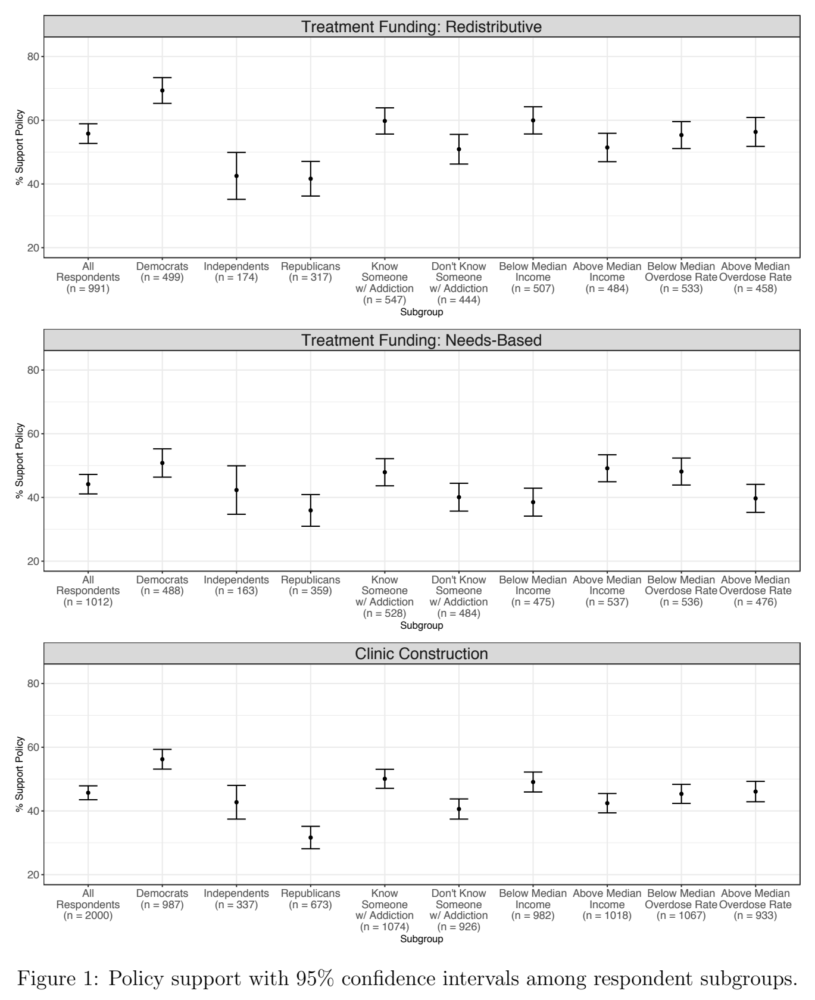

***Figure 1.*** Policy support with 95% confidence intervals among respondent subgroups.

### Financial Self-Interest

We next assess the role of self-interest in support for our first policy proposal, the state bill funding opioid treatment. In both funding models, we operationalize financial self-interest

as the difference in support between those who would pay more and those who would pay less. For those who viewed the proposal funded redistributively, this means the difference in support between above-median income respondents, who would pay $55, and below-median income respondents, who would pay $5. In the overdose rate-based funding model, we operationalize self-interest as the difference in support between those who live in areas with higher rates of overdose and those in areas with lower rates of overdose.

To capture the relative importance of self-interest, we measured the difference in support for each funding condition across the dimension determining self-interest and present these results in Figure 2, with raw differences plotted as circles and covariate-adjusted model coefficients as triangles.9 For the redistributive funding model, on the left, higher income respondents were 9 percentage points less supportive of the policy than lower-income respondents. Similar results hold for the needs-based funding model, shown on the right. Respondents living in high-overdose areas were 8 percentage points less in favor of needs-based treatment funding than those in low overdose areas.10

0.00

Redistributive Overdose rate-based Funding model tseretni-fles

laicnanif

fo

tceffE

troppus

ycilop

no

Covariateadjusted No

Yes

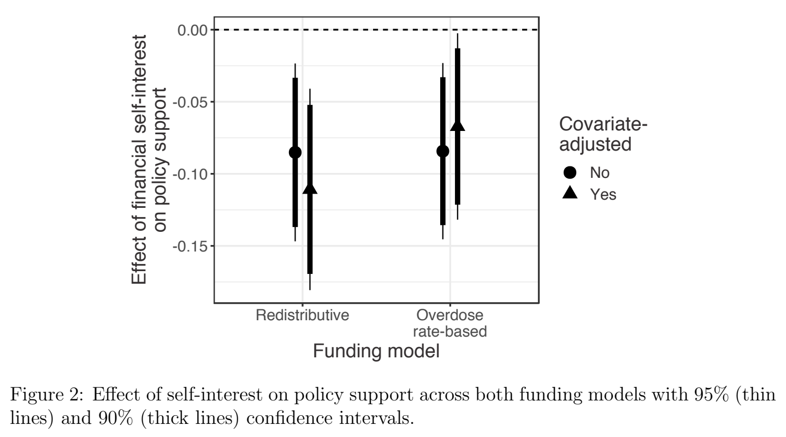

***Figure 2.*** Effect of self-interest on policy support across both funding models with 95% (thin lines) and 90% (thick lines) confidence intervals.

9Covariate-adjusted models include age, gender, race, homeownership, marital status, education, partisanship, ideology, and indicators for above median income and above median overdose rate.

10We present tabular results in Appendix D.

To put these effects in context, we compare these differences between groups with opposing self-interest to the polarization between partisan groups. In Figure 3, we plot the effect of an indicator for whether or not the respondent was a Republican (rather than a Democrat) for both funding models, with raw differences again plotted as circles and covariate-adjusted model coefficients as triangles. For the redistributive funding model, Republicans were 28 percentage points less supportive of the redistributively-funded policy than Democrats, and 15 percentage points less supportive of the overdose rate-based funding model. These sharp partisan divides show the power of partisanship in policy preferences. In comparison, the effect of partisanship is roughly double that of self-interest on support for these policy proposals.

0.0

Redistributive Overdose rate-based Funding model pihsnasitrap

fo

tceffE

troppus

ycilop

no

Covariateadjusted

No

Yes

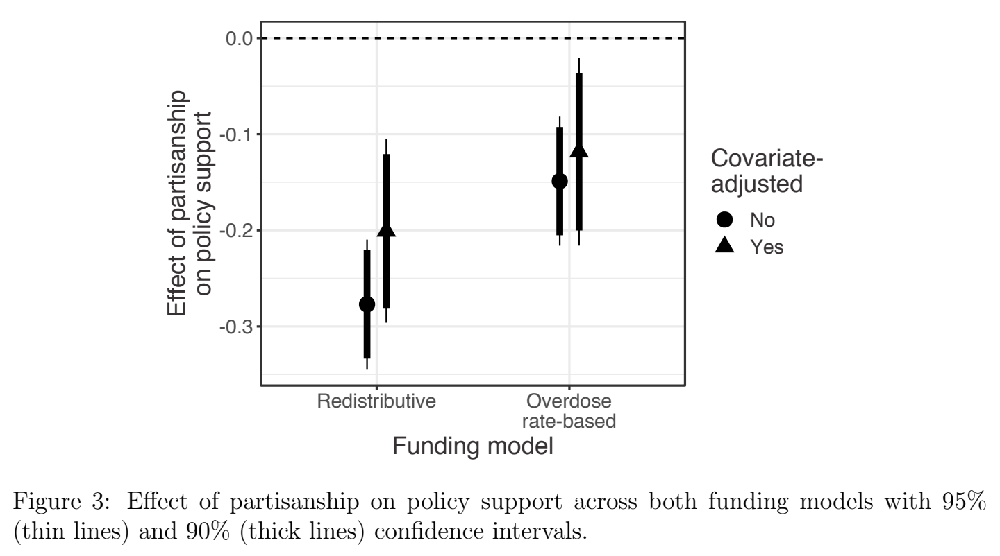

***Figure 3.*** Effect of partisanship on policy support across both funding models with 95% (thin lines) and 90% (thick lines) confidence intervals.

We next assess cross-pressuring within each party by interacting the relevant self-interest variable with an indicator for party identification. We plot these differential effects in Figure 4, for the redistributive funding model in the left panel and the overdose rate-based funding model in the right panel. For the redistributive funding model, self-interest — as measured by income group — has an effect close to zero among Democrats, whereas it has a 19 percentage point effect among Republicans. This interaction of 21 percentage points

between self-interest and partisanship is statistically significant (p < 0.01), demonstrating that Republicans were cross-pressured when faced with a redistributive policy proposal. This effect manifests as a boost in support among low-income Republicans and a decrease in the partisan gap in support by more than half, as we show in Appendix Figure A2. In contrast, for the overdose rate-based model, self-interest — as measured by local overdose rates — had a similar effect among both Democrats and Republicans.

Overdose

Redistributive

rate-based

0.1

0.0

Republicans Democrats Republicans Democrats Partisanship tseretni-fles

laicnanif

fo

tceffE

troppus

ycilop

no

Covariateadjusted No

Yes

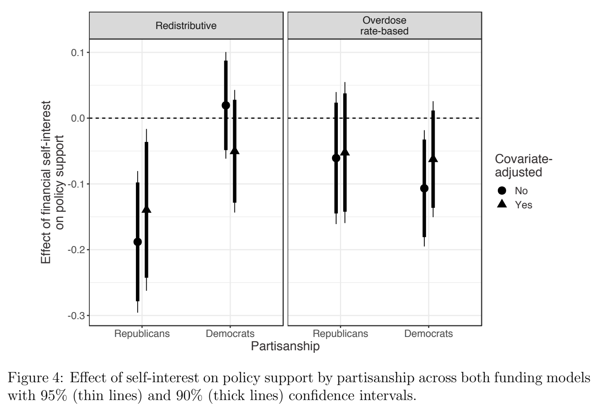

***Figure 4.*** Effect of self-interest on policy support by partisanship across both funding models with 95% (thin lines) and 90% (thick lines) confidence intervals.

### Spatial Self-Interest and the Implementation of Infrastructure

Next, we test the causal effect of spatial self-interest by experimentally varying the proximity of a proposed treatment clinic. We operationalize the effect of self-interest as the difference in support between those respondents in the “near” condition, who evaluated a clinic proposed 1/4 mile away, and those in the “far” condition, who evaluated a clinic proposed 2 miles away. We plot this treatment effect in Figure 5 for the full sample, on the left, and partisan

subgroups, on the right.

Among our full sample, 53% who were in the far condition supported the new treatment clinic, whereas respondents who were in the near condition were 14 percentage points less supportive of clinic construction (p < 0.01). This treatment effect demonstrates how the proximity of infrastructure and corresponding spatial self-interest shapes opinion on implementing opioid treatment policy.

Partisan

Full Sample

Subgroups

0.00

Republicans Democrats tseretni-fles

laitaps

fo

tceffE

troppus

ycilop

no

Covariateadjusted

No

Yes

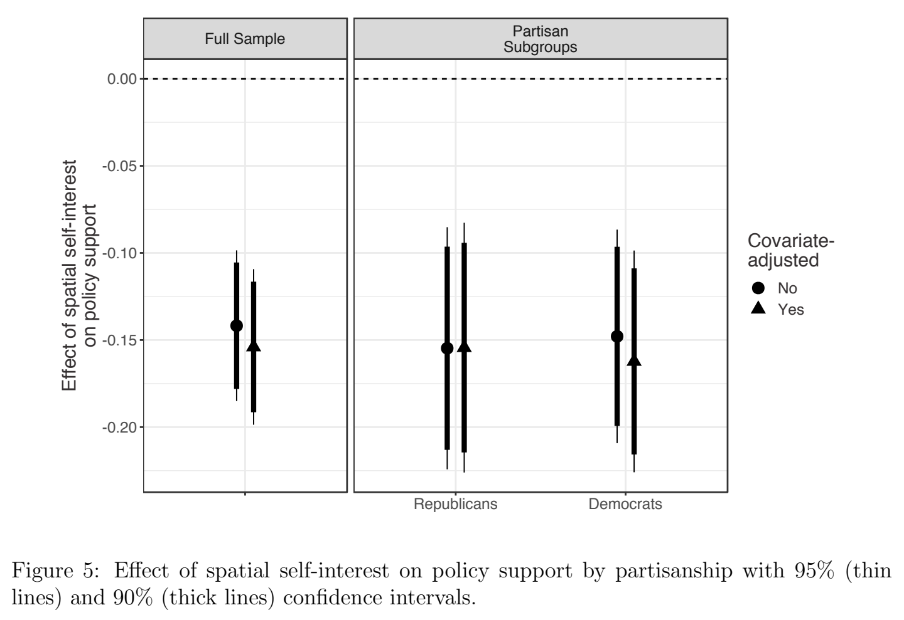

***Figure 5.*** Effect of spatial self-interest on policy support by partisanship with 95% (thin lines) and 90% (thick lines) confidence intervals.

To put this effect in context, we can compare the influence of spatial self-interest to that of partisanship for this policy proposal. As discussed earlier, Republicans were 25 percentage points less supportive of clinic construction than Democrats. While the magnitude of selfinterest’s influence is less than that of partisanship, it is still substantial.

To test whether spatial self-interest cross-pressures partisans as it did for financial selfinterest, we separately estimate this treatment effect by respondents’ partisanship and test for an interaction between spatial self-interest and partisanship. As shown on the right side

of Figure 5, the effect of spatial self-interest among Republicans and Democrats is largely similar, whether or not covariates are used in the models. This stability demonstrates the enduring power of spatial self-interest across partisan subgroups.11

## Conclusion

The eventual success (or failure) of government response to the opioid crisis relies at least in part on public opinion. Generating a body of knowledge about which features of policy — both in funding and implementation — are more widely supported is crucial to navigating the policy process on this issue. Moreover, the opioid crisis provides a novel opportunity to assess how self-interest interacts with other political considerations when people form opinions on high-stakes policies.

Using a nationally-representative survey, we find considerable support for opioid treatment policies. However, the specifics of policy design substantially alter their palatability. Our split-sample survey demonstrates that people consistently favor treatment policy funded redistributively — allocating the financial burden according to individuals’ income and not local overdose rates, as burdens are currently distributed. We also show that while ideological preferences shape the degree to which people favor redistributive funding, financial self-interest can cross-pressure voters, especially Republicans. Still, such cross-pressuring is not universal, as we show the strength and durability of spatial self-interest in our experiment on siting treatment clinics.

Our results present two direct implications for the policy response to the opioid crisis. First, the popularity of policy funded redistributively suggests that policymakers have wide leeway for structuring opioid treatment legislation progressively. While this type of policy is favored by broad swaths of the population, policymakers should be aware of how financial burdens may influence this support. The cross-pressuring of partisans towards re- 11We present these results in Table A9 in Appendix E, where we also assess heterogeneity in our treatment effect by income and respondents’ personal or community exposure to the opioid crisis.

distributive funding suggests that policymakers may leverage self-interest specifically among lower-income conservative voters to build broad coalitions of policy support. Second, spatial self-interest consistently provokes NIMBY opposition towards new treatment clinics. Historically, such opposition has led policymakers to concentrate unwanted policy infrastructure in low-income and minority neighborhoods where political mobilization is less likely (Bullard, 2008). Our results warn of the potential for similar stark inequalities in the spatial distribution of the infrastructure needed to address the opioid crisis.

More generally, our results add to the knowledge of how self-interest structures attitudes. On this policy issue, as on others, the allocation of a policy’s shared burdens — financially and spatially — may drive self-interest and therefore public support. As with policy solutions to other collective challenges — such as climate change (Bechtel and Scheve, 2013; Stokes and Warshaw, 2017) — when policies target benefits or concentrate costs based on a group’s income, location, or reliance on the policy, self-interest matters for these policies’ public support. Further research is needed to understand whether this self-interest will obstruct policy efforts to confront the opioid crisis and halt the growing number of fatalities.

## References

Anzia, Sarah F, and Terry M Moe. 2017. “Polarization and Policy: The Politics of Public- Sector Pensions.” Legislative Studies Quarterly 42(1): 33–62.

Banker, Andy. 2017. “Planned drug treatment center runs into opposition in St. Charles County.” Fox News - St. Louis (Oct. 25).

Bateson, Regina. 2012. “Crime Victimization and Political Participation.” American Political Science Review 106(3): 570–587.

Bechtel, Michael M, and Kenneth F Scheve. 2013. “Mass Support for Global Climate Agreements Depends on Institutional Design.” Proceedings of the National Academy of Sciences 110(34): 13763–13768.

Boyle, James. 2017. “Bucks County commissioners vote to raise taxes for 2018.” The Intelligencer (Dec. 20).

Bullard, Robert D. 2008. Dumping in Dixie: Race, Class, and Environmental Quality. Westview Press.

Campbell, Andrea L. 2015. “Independence and Freedom: Public Opinion and the Politics of Medicare and Medicaid.” In Medicare and Medicaid at Fifty, ed. Keith Wailoo, Alan Cohen, Julian Zelizer, and David Colby. Oxford University Press.

Campbell, Andrea Louise. 2005. How Policies Make Citizens: Senior Political Activism and the American Welfare State. Princeton University Press.

Campbell, Angus, Philip E. Converse, Warren E. Miller, and Donald E. Stokes. 1960. The American Voter. University of Chicago Press.

Caughey, Devin, Christopher Warshaw, and Yiqing Xu. 2017. “Incremental Democracy: The Policy Effects of Partisan Control of State Government.” Journal of Politics 79(4): 1342–1358.

Chong, Dennis, Jack Citrin, and Patricia Conley. 2001. “When Self-Interest Matters.” Political Psychology 22(3): 541–570.

de Benedictis-Kessner, Justin, and Christopher Warshaw. 2016. “Mayoral Partisanship and Municipal Fiscal Policy.” Journal of Politics 78(4): 1124–1138.

Druckman, James N, Erik Peterson, and Rune Slothuus. 2013. “How Elite Partisan Polarization Affects Public Opinion Formation.” American Political Science Review 107(1): 57–79.

Gelman, Andrew. 2008. Red State, Blue State, Rich State, Poor State: Why Americans Vote the Way They Do. Princeton University Press.

Green, Donald, Bradley Palmquist, and Eric Schickler. 2002. Partisan Hearts and Minds: Political Parties and the Social Identities of Voters. New Haven, CT: Yale University Press.

Grumbach, Jacob M. 2018. “From Backwaters to Major Policymakers: Policy Polarization in the States, 1970–2014.” Perspectives on Politics 16(2): 416–435.

Hankinson, Michael. 2018. “When Do Renters Behave Like Homeowners? High Rent, Price Anxiety, and NIMBYism.” American Political Science Review 112(3): 473–493.

Hopkins, Daniel J. 2018. The Increasingly United States: How and Why American Political Behavior Nationalized. University of Chicago Press.

Jalal, Hawre, Jeanine M Buchanich, Mark S Roberts, Lauren C Balmert, Kun Zhang, and Donald S Burke. 2018. “Changing dynamics of the drug overdose epidemic in the United States from 1979 through 2016.” Science 361(6408).

Katz, Josh, and Margot Sanger-Katz. 2018. “‘The Numbers Are So Staggering.’ Overdose Deaths Set a Record Last Year.” The New York Times (Nov. 29).

Kinder, Donald R, and D Roderick Kiewiet. 1981. “Sociotropic Politics: The American Case.” British Journal of Political Science 11(2): 129–161.

Klar, Samara. 2013. “The Influence of Competing Identity Primes on Political Preferences.” Journal of Politics 75(4): 1108–1124.

Lerman, Amy E, and Katherine T McCabe. 2017. “Personal Experience and Public Opinion: A Theory and Test of Conditional Policy Feedback.” Journal of Politics 79(2): 624–641. Meier, Kenneth J. 1994. The Politics of Sin: Drugs, Alcohol and Public Policy. Routledge. Mettler, Suzanne. 2005. Soldiers to Citizens: The GI Bill and the Making of the Greatest Generation. Oxford University Press.

Mullin, Megan, Martin D Smith, and Dylan E McNamara. 2018. “Paying to Save the Beach: Effects of Local Finance Decisions on Coastal Management.” Climatic Change pp. 1–15. Mulvihill, Geoff. 2018. “Federal Budget Deal Includes $4.6 Billion to Combat Opioid Epidemic.” The Washington Post (Mar. 25).

Rembert, Mark H, Michael R Betz, Bo Feng, and Mark D Partridge. 2017. “Taking Measure of Ohio’s Opioid Crisis.”.

Saloner, Brendan, and Colleen L Barry. 2018. “Ending the Opioid Epidemic Requires a Historic Investment in Medication-Assisted Treatment.” Journal of Policy Analysis and Management 37(2): 431–438.

Sears, David O, and Carolyn L Funk. 1991. “The Role of Self-Interest in Social and Political Attitudes.” Advances in Experimental Social Psychology 24: 1–91.

Sears, David O., and Jack Citrin. 1982. Tax Revolt: Something for Nothing in California. Cambridge, MA: Harvard University Press.

Seligson, Paula, and Tim Reid. 2017. “Unbudgeted: How the opioid crisis is blowing a hole in small-town America’s finances.” Reuters (Sep. 27).

Stokes, Leah C. 2016. “Electoral Backlash against Climate Policy: A Natural Experiment on Retrospective Voting and Local Resistance to Public Policy.” American Journal of Political Science 60(4): 958–974.

Stokes, Leah C, and Christopher Warshaw. 2017. “Renewable Energy Policy Design and Framing Influence Public Support in the United States.” Nature Energy 2(8): 17107.

## Supplementary Appendix for

“Concentrated Burdens:

## A Survey Sample Characteristics

Our survey sample was collected by the nonpartisan research organization NORC at the University of Chicago. NORC recruits a probability-based survey panel called AmeriSpeak that is designed to be representative of the US household population. NORC’s AmeriSpeak panelists participate in studies on behalf of academic and government research as well as for-profit marketing research.

Our survey was conducted on the web only using a general population of US adults age 18 and over between August 2 and September 6, 2018. During this study period, NORC sent 7 email reminders and 2 SMS reminders to non-respondents between August 4 and September 5. Panelists were offered the cash equivalent of $1 for completing the study, and those respondents who completed the survey took a median of 1 minute to complete it. The weighted cumulative AAPOR RR3 response rate was 8.5%.

In Table A1 below, we show the demographic characteristics of the sample that eventually completed our survey.

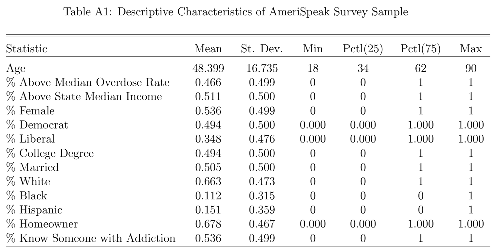

***Table A1.*** Descriptive Characteristics of AmeriSpeak Survey Sample

[Download data as CSV](tables/tab-01.csv)

Statistic Mean St. Dev. Min Pctl(25) Pctl(75) Max Age 48.399 16.735 18 34 62 90 % Above Median Overdose Rate 0.466 0.499 0 0 1 1 % Above State Median Income 0.511 0.500 0 0 1 1 % Female 0.536 0.499 0 0 1 1 % Democrat 0.494 0.500 0.000 0.000 1.000 1.000 % Liberal 0.348 0.476 0.000 0.000 1.000 1.000 % College Degree 0.494 0.500 0 0 1 1 % Married 0.505 0.500 0 0 1 1 % White 0.663 0.473 0 0 1 1 % Black 0.112 0.315 0 0 0 1 % Hispanic 0.151 0.359 0 0 0 1 % Homeowner 0.678 0.467 0.000 0.000 1.000 1.000 % Know Someone with Addiction 0.536 0.499 0 0 1 1 In order to further assess who is most affected by the opioid crisis, we also analyzed the predictors of someone answering the question on survey about whether they knew someone struggling with addiction. First, in Figure A1 we show the number of people answering reporting each response option for this question. Second, in Table A2 we show the results of a regression predicting a positive response to any of these categories of personal exposure on demographic characteristics. People who are personally in contact with someone struggling with addiction are more likely to be younger, less likely to be black, less likely to be a homeowner, more likely to be a political independent or Republican, less likely to be conservative, less educated, and more likely to be in the Northeast or the West.

50.0% 40.0%

30.0%

20.0%

10.0%

0.0%

Self Family Close Acquaintance No one member friend

Know anyone with opioid addiction?

gnidnopser

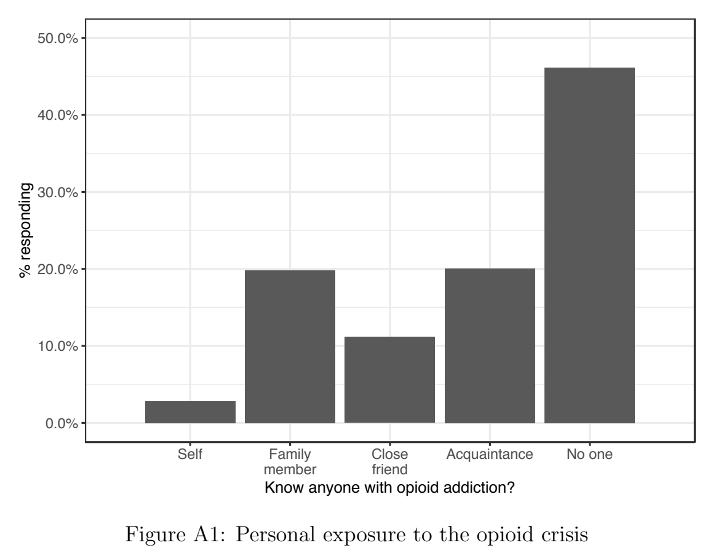

***Figure A1.*** Personal exposure to the opioid crisis

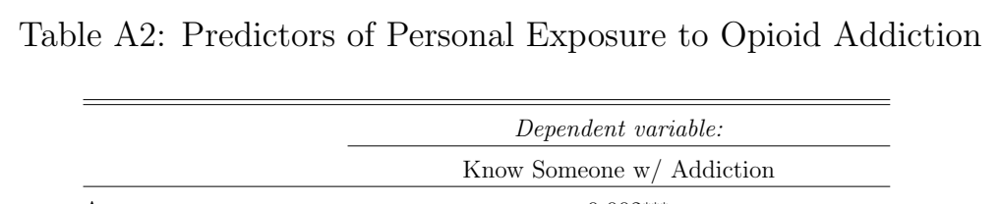

***Table A2.*** Predictors of Personal Exposure to Opioid Addiction

Dependent variable:

Know Someone w/ Addiction Age −0.002∗∗∗

Female −0.012

Black −0.075∗ Hispanic −0.033 Homeowner −0.051∗ Party: Independent 0.097∗∗ Party: Republican 0.117∗∗∗ Ideology: Moderate −0.051 Ideology: Conservative −0.082∗∗ College Degree −0.068∗∗∗ Married −0.030 Income >50k −0.038 Region: Northeast 0.105∗∗∗ Region: South 0.046 Region: West 0.078∗∗ Constant 0.701∗∗∗ Observations 1,749 Adjusted R2 0.025 F Statistic 3.945∗∗∗ Note: ∗p<0.1; ∗∗p<0.05; ∗∗∗p<0.01

Omitted category for partisanship is ’Democrat’, for ideology is ’Liberal’, and for Region is ’Midwest’

## B Demographic Balance Across Experimental Condi-

## tions

In this section, we assess demographic balance across the two experimental conditions in our experiment. The only observable demographic characteristic on which we observe a statistically distinguishable imbalance is age, though the substantive size of this difference is quite small, as shown in Table A3. However, to ensure that this slight imbalance does not affect our estimated experimental treatment effects, we include models with covariates in our main analyses alongside the raw treatment effects.

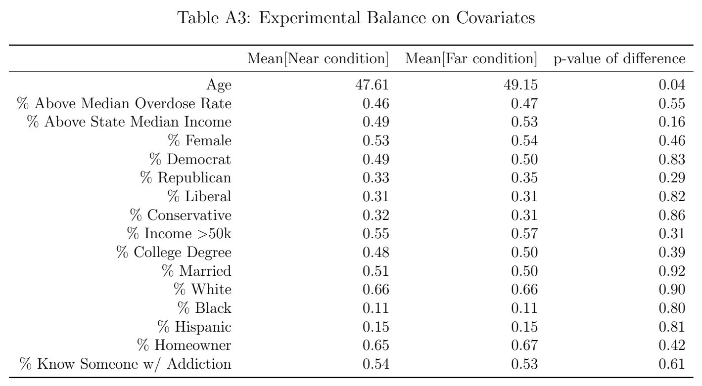

***Table A3.*** Experimental Balance on Covariates

[Download data as CSV](tables/tab-03.csv)

Mean[Near condition] Mean[Far condition] p-value of difference Age 47.61 49.15 0.04 % Above Median Overdose Rate 0.46 0.47 0.55 % Above State Median Income 0.49 0.53 0.16 % Female 0.53 0.54 0.46 % Democrat 0.49 0.50 0.83 % Republican 0.33 0.35 0.29 % Liberal 0.31 0.31 0.82 % Conservative 0.32 0.31 0.86 % Income >50k 0.55 0.57 0.31 % College Degree 0.48 0.50 0.39 % Married 0.51 0.50 0.92 % White 0.66 0.66 0.90 % Black 0.11 0.11 0.80 % Hispanic 0.15 0.15 0.81 % Homeowner 0.65 0.67 0.42 % Know Someone w/ Addiction 0.54 0.53 0.61

## C Descriptive Results in Tabular Form

In this section, we first present our treatment policy funding results in tabular form, displaying the mean support for the two split-sample treatment funding options, income-based redistributive funding and overdose rate-based funding, as well as for the clinic construction proposal across various subgroups, as presented in Figure 1 in the main text. Within each subgroup, we find no evidence of floor or ceiling effects that might bias our main results.

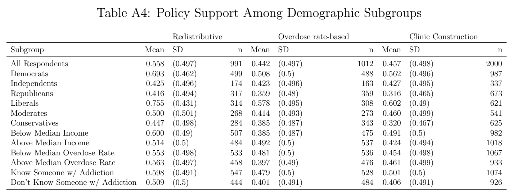

***Table A4.*** Policy Support Among Demographic Subgroups

[Download data as CSV](tables/tab-04.csv)

Redistributive Overdose rate-based Clinic Construction

Subgroup Mean SD n Mean SD n Mean SD n All Respondents 0.558 (0.497) 991 0.442 (0.497) 1012 0.457 (0.498) 2000 Democrats 0.693 (0.462) 499 0.508 (0.5) 488 0.562 (0.496) 987 Independents 0.425 (0.496) 174 0.423 (0.496) 163 0.427 (0.495) 337 Republicans 0.416 (0.494) 317 0.359 (0.48) 359 0.316 (0.465) 673 Liberals 0.755 (0.431) 314 0.578 (0.495) 308 0.602 (0.49) 621 Moderates 0.500 (0.501) 268 0.414 (0.493) 273 0.460 (0.499) 541 Conservatives 0.447 (0.498) 284 0.385 (0.487) 343 0.320 (0.467) 625 Below Median Income 0.600 (0.49) 507 0.385 (0.487) 475 0.491 (0.5) 982 Above Median Income 0.514 (0.5) 484 0.492 (0.5) 537 0.424 (0.494) 1018 Below Median Overdose Rate 0.553 (0.498) 533 0.481 (0.5) 536 0.454 (0.498) 1067 Above Median Overdose Rate 0.563 (0.497) 458 0.397 (0.49) 476 0.461 (0.499) 933 Know Someone w/ Addiction 0.598 (0.491) 547 0.479 (0.5) 528 0.501 (0.5) 1074 Don’t Know Someone w/ Addiction 0.509 (0.5) 444 0.401 (0.491) 484 0.406 (0.491) 926

## D Treatment Funding Results in Tabular Form

In this section, we present our main effects of financial self-interest (Table A5) both as differences in means and when modeled with demographic covariates, as presented graphically in Figure 2. Across each specification, the covariate-adjusted effect of self-interest differs only in magnitude from the difference-in-means tests.

Finally, we test for heterogeneous effects of financial self-interest among different respondent groups for each of the two policy funding options by interacting the measure of financial self-interest with demographic covariates. We present these results in Table A6, with the redistributive funding model in columns 1-4 and the overdose rate-based funding model in columns 5-8. These results are shown graphically in Figure A2 as well, with support for the redistributive funding model in the left panel and for the overdose rate-based funding model in the right panel. This demonstrates that the effect of self-interest on support for the redistributive funding model for Republicans manifests as a boost in support among low-income individuals that closes the distance between partisans by more than half.

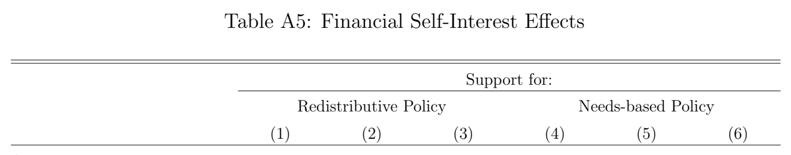

***Table A5.*** Financial Self-Interest Effects

Support for:

Redistributive Policy Needs-based Policy (1) (2) (3) (4) (5) (6) Above State Median Income −0.085∗∗∗ −0.111∗∗∗ 0.086∗∗

(0.031) (0.036) (0.036) Above Median Overdose Rate −0.011 −0.084∗∗∗ −0.067∗∗ (0.032) (0.031) (0.033) Age 0.002∗ 0.002∗∗ Female −0.034 −0.084∗∗ Black −0.121∗∗ −0.102∗ Hispanic −0.081∗ −0.040

Homeowner −0.089∗∗ −0.038

Independent −0.253∗∗∗ −0.268∗∗∗ −0.011 −0.085∗ (0.055) (0.042) (0.057) (0.045) Republican −0.201∗∗∗ −0.277∗∗∗ −0.118∗∗ −0.149∗∗∗ (0.049) (0.034) (0.050) (0.034) Moderate −0.151∗∗∗ −0.123∗∗∗

Conservative −0.145∗∗∗ −0.130∗∗

College Degree 0.071∗∗ −0.001

Married −0.017 −0.002

Constant 0.600∗∗∗ 0.812∗∗∗ 0.693∗∗∗ 0.481∗∗∗ 0.553∗∗∗ 0.508∗∗∗ (0.022) (0.067) (0.021) (0.021) (0.068) (0.022) Observations 991 842 990 1,012 902 1,010 Adjusted R2 0.006 0.121 0.074 0.006 0.048 0.017 F Statistic 7.317∗∗∗ 9.879∗∗∗ 40.605∗∗∗ 7.301∗∗∗ 4.499∗∗∗ 9.577∗∗∗ Note: ∗p<0.1; ∗∗p<0.05; ∗∗∗p<0.01

Omitted category for partisanship is ’Democrat’

and for ideology is ’Liberal’

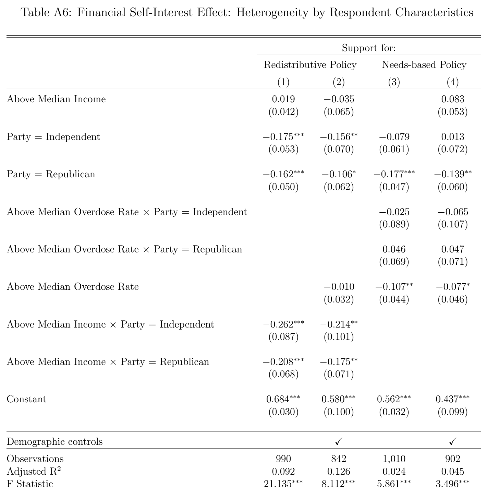

***Table A6.*** Financial Self-Interest Effect: Heterogeneity by Respondent Characteristics

[Download data as CSV](tables/tab-06.csv)

Support for:

Redistributive Policy Needs-based Policy (1) (2) (3) (4)

Above Median Income 0.019 −0.035 0.083 (0.042) (0.065) (0.053) Party = Independent −0.175∗∗∗ −0.156∗∗ −0.079 0.013 (0.053) (0.070) (0.061) (0.072) Party = Republican −0.162∗∗∗ −0.106∗ −0.177∗∗∗ −0.139∗∗ (0.050) (0.062) (0.047) (0.060) Above Median Overdose Rate × Party = Independent −0.025 −0.065 Above Median Overdose Rate × Party = Republican 0.046 0.047 Above Median Overdose Rate −0.010 −0.107∗∗ −0.077∗ (0.032) (0.044) (0.046) Above Median Income × Party = Independent −0.262∗∗∗ −0.214∗∗

Above Median Income × Party = Republican −0.208∗∗∗ −0.175∗∗

Constant 0.684∗∗∗ 0.580∗∗∗ 0.562∗∗∗ 0.437∗∗∗ (0.030) (0.100) (0.032) (0.099) Demographic controls (cid:88) (cid:88)

Observations 990 842 1,010 902 Adjusted R2 0.092 0.126 0.024 0.045 F Statistic 21.135∗∗∗ 8.112∗∗∗ 5.861∗∗∗ 3.496∗∗∗ Note: ∗p<0.1; ∗∗p<0.05; ∗∗∗p<0.01 Omitted category for partisanship is ’Democrat’

Income-Based Overdose Rate-Based High Income Low Income High Overdose Rate Low Overdose Rate Subgroup

yciloP

troppuS

Democrats Republicans

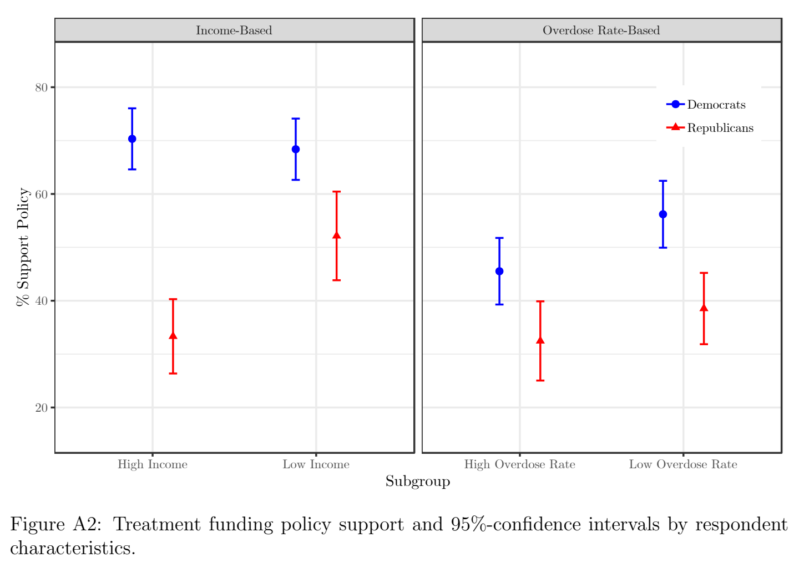

***Figure A2.*** Treatment funding policy support and 95%-confidence intervals by respondent characteristics.

## E NIMBY Experiment in Tabular Form

In this section, we present the results for our clinic construction policy proposal. First, we present our main treatment effect both with and without demographic controls in Table A7. Across each specification the covariate-adjusted effect of self-interest differs only in magnitude from the difference-in-means tests.

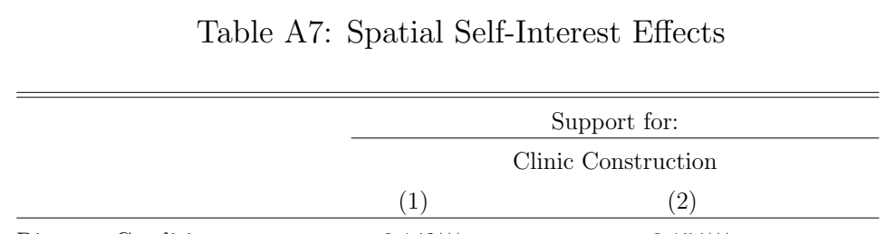

***Table A7.*** Spatial Self-Interest Effects

Support for:

Clinic Construction (1) (2) Distance Condition −0.142∗∗∗ −0.154∗∗∗ Above State Median Income −0.041 Above Median Overdose Rate −0.013 Age 0.001 Female −0.053∗∗ Black 0.0002 Hispanic 0.023 Homeowner −0.094∗∗∗ Independent −0.081∗∗ Republican −0.133∗∗∗ Moderate −0.095∗∗∗ Conservative −0.163∗∗∗ College Degree 0.003 Married −0.034 Constant 0.526∗∗∗ 0.777∗∗∗ Observations 2,000 1,741 Adjusted R2 0.020 0.096 F Statistic 41.280∗∗∗ 14.176∗∗∗ Note: ∗p<0.1; ∗∗p<0.05; ∗∗∗p<0.01

Omitted category for partisanship is ’Democrat’ and for ideology is ’Liberal’

Additionally, in Table A8 we display the mean support among respondents in the near treatment and among those in the far treatment for various subgroups of respondent characteristics, along with the experimental treatment effect of spatial self-interest. In Figure A3 we show these subgroup treatment effects across ideology, income, personal contact with someone struggling with addiction, local overdose rates, and race.

Finally, in Table A9 we more formally test for heterogeneity in our treatment effect of spatial self-interest by interacting our treatment indicator with various demographic characteristics. Across income, partisanship, and personal knowledge of someone with addiction, we find no statistically distinguishable differences in the size of the effect of spatial selfinterest, for both the raw treatment effects and the covariate-adjusted effects. We do find that the negative treatment effect of spatial self-interest is smaller for respondents who live in areas with above-median overdose rates (p < 0.10). Specifically, as shown by the interaction terms in columns (3) and (4), the magnitude of the effect of spatial self-interest among respondents live in areas with higher overdose rates is approximately half the size of the effect among people who live in areas with lower overdose rates. This interaction lacks a clear theoretical explanation. As shown in Table A8 and Figure A5, respondents in high overdose areas expressed both less support for clinics ‘far’ from them and more support for clinics ‘near’ them. At the same time, the treatment effect of spatial self-interest is consistent across groups personally exposed to someone struggling with addiction: the effects shown in Figure A7 are similar across groups that did and did not report knowing someone with opioid addiction issues. Future research should more fully explore this heterogenous effect. Ideological Income Know Someone Overdose-Rate Racial

Subgroups Subgroups w/ Addiction Subgroups Subgroups

0.0

Conservatives Liberals Above-MedianBelow-Median Yes No Above-MedianBelow-Median White Black tseretni-fles

laitaps

fo

tceffE

troppus

ycilop

no

Covariateadjusted No

Yes

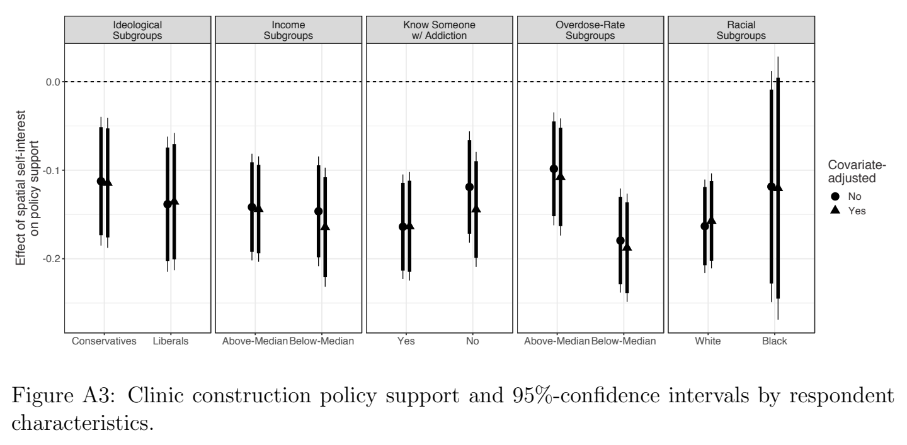

***Figure A3.*** Clinic construction policy support and 95%-confidence intervals by respondent characteristics.

Table A8: Spatial Burden Subgroup Means and Treatment Effects Subset Mean[Far] Mean[Near] Treatment effect (CI) p-value of difference All Respondents 0.526 0.385 -0.142 0

(-0.185, -0.099)

n 1024 984

Above Median Income 0.492 0.35 -0.142 0

(-0.202, -0.082)

n 539 487

Below Median Income 0.565 0.419 -0.146 0 (-0.208, -0.084)

n 485 497

Above Median Overdose Rate 0.508 0.41 -0.098 0.003 (-0.162, -0.035)

n 484 452

Below Median Overdose Rate 0.543 0.363 -0.179 0 (-0.238, -0.121)

n 540 532

Democratic Respondents 0.634 0.486 -0.148 0 (-0.209, -0.086)

n 508 483

Republican Respondents 0.39 0.235 -0.155 0 (-0.224, -0.086)

n 356 320

Know Someone with Addiction 0.582 0.418 -0.164 0 (-0.223, -0.105)

n 543 533

Don’t Know Someone with Addiction 0.463 0.345 -0.119 0 (-0.182, -0.056)

n 481 451

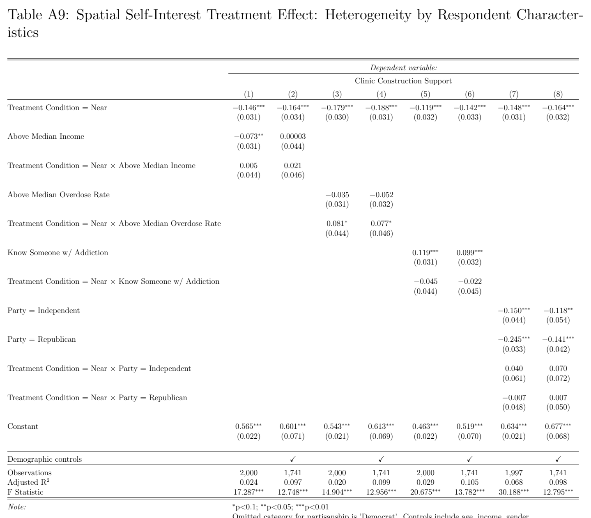

***Table A9.*** Spatial Self-Interest Treatment Effect: Heterogeneity by Respondent Character- istics

[Download data as CSV](tables/tab-08.csv)

Dependent variable:

Clinic Construction Support

(1) (2) (3) (4) (5) (6) (7) (8) Treatment Condition = Near −0.146∗∗∗ −0.164∗∗∗ −0.179∗∗∗ −0.188∗∗∗ −0.119∗∗∗ −0.142∗∗∗ −0.148∗∗∗ −0.164∗∗∗ (0.031) (0.034) (0.030) (0.031) (0.032) (0.033) (0.031) (0.032) Above Median Income −0.073∗∗ 0.00003

Treatment Condition = Near × Above Median Income 0.005 0.021

Above Median Overdose Rate −0.035 −0.052

Treatment Condition = Near × Above Median Overdose Rate 0.081∗ 0.077∗

Know Someone w/ Addiction 0.119∗∗∗ 0.099∗∗∗

Treatment Condition = Near × Know Someone w/ Addiction −0.045 −0.022

Party = Independent −0.150∗∗∗ −0.118∗∗ Party = Republican −0.245∗∗∗ −0.141∗∗∗ Treatment Condition = Near × Party = Independent 0.040 0.070 Treatment Condition = Near × Party = Republican −0.007 0.007 Constant 0.565∗∗∗ 0.601∗∗∗ 0.543∗∗∗ 0.613∗∗∗ 0.463∗∗∗ 0.519∗∗∗ 0.634∗∗∗ 0.677∗∗∗ (0.022) (0.071) (0.021) (0.069) (0.022) (0.070) (0.021) (0.068) Demographic controls (cid:88) (cid:88) (cid:88) (cid:88) Observations 2,000 1,741 2,000 1,741 2,000 1,741 1,997 1,741 Adjusted R2 0.024 0.097 0.020 0.099 0.029 0.105 0.068 0.098 F Statistic 17.287∗∗∗ 12.748∗∗∗ 14.904∗∗∗ 12.956∗∗∗ 20.675∗∗∗ 13.782∗∗∗ 30.188∗∗∗ 12.795∗∗∗ Note: ∗p<0.1; ∗∗p<0.05; ∗∗∗p<0.01

Omitted category for partisanship is ’Democrat’. Controls include age, income, gender,

partisanship, ideology, college degree, marital status, race, and homeownership.

Below average Above average Income

yciloP

troppuS

Distance Treatment Far

Near

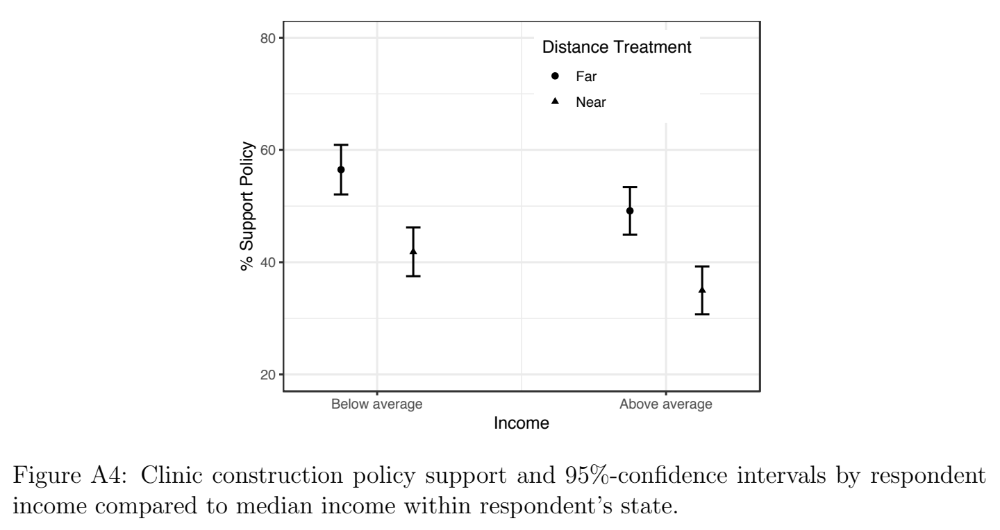

***Figure A4.*** Clinic construction policy support and 95%-confidence intervals by respondent income compared to median income within respondent’s state.

Below median Above median Overdose Rate

yciloP

troppuS

Distance Treatment Far

Near

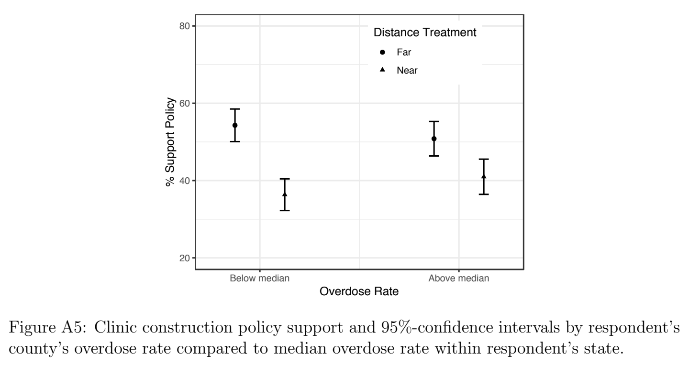

***Figure A5.*** Clinic construction policy support and 95%-confidence intervals by respondent’s county’s overdose rate compared to median overdose rate within respondent’s state.

Far Near Distance

yciloP

troppuS

Party ID

Democrats Independents Republicans

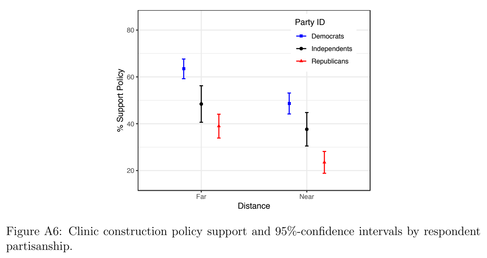

***Figure A6.*** Clinic construction policy support and 95%-confidence intervals by respondent partisanship.

No Yes Know Someone w/ Addiction yciloP

troppuS

Distance Treatment Far

Near

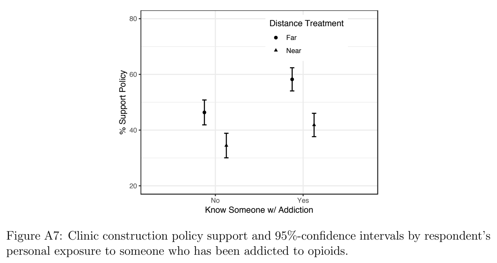

***Figure A7.*** Clinic construction policy support and 95%-confidence intervals by respondent’s personal exposure to someone who has been addicted to opioids.

## F Survey Questions

The survey used in this study contained two policy proposals and one follow-up question. Each respondent answered both policy questions, and the order of the two policy questions was randomized. For the first proposed policy, respondents viewed one of two split-sample options describing the funding model of the proposed state policy to treat opioid addiction: either a needs-based or an income-based funding model. Each respondent’s state was piped into the question wording using their state of residence as previously reported in the NORC AmeriSpeak intake survey. Information on the respondent’s area’s rate of opioid use was similarly piped in using their ZIP code. Information on whether the respondent was above or below their state’s median income was also piped in using their pre-reported income. For the second policy proposal, respondents viewed one of two options that differently described the location of a proposed opioid addiction treatment clinic. Finally, all respondents answered the question on personal exposure to the opioid crisis.

Proposal 1, evenly randomized between Needs-Based Treatment and Income-Based Option

### 1. The [STATE] government is considering a policy to fund medication-assisted treatment

programs for people with substance abuse problems across the state. The cost would be $100 million total. These programs would help people affected by the opioid crisis. It would do this by providing needed medication and follow-up that can keep them off dangerous opioids and prevent deadly overdoses. Taxpayers in [STATE] will bear the costs of this policy, divided up in the following way.

[Local Overdose Rate-Based Option]

• Taxpayers in areas with above average rates of opioid use will pay an additional $55 in taxes. In contrast, taxpayers in areas with below average rates of opioid use will pay an additional $5 in taxes.12

• Based on your ZIP code, you live in an area with [an above/a below] average rate of opioid use.

[Income-Based Option]

• Taxpayers with an above average income will pay an additional $55 in taxes. In contrast, taxpayers with a below average income will pay an additional $5 in taxes. • Based on your income, you have [an above/a below] average level of income.

Would you support or oppose this policy?

### 1. Strongly support

### 2. Somewhat support

### 3. Neither support nor oppose

### 4. Somewhat oppose

### 5. Strongly oppose

12Although the assignment is based on above/below the state’s median level, we use the term ‘average’ for cognitive ease.

Experiment, evenly randomized between Near Treatment and Far Treatment

### 2. Medication-assisted treatment clinics provide help for people with substance abuse prob-

lems. They do this by providing needed medication (such as methadone) and follow-up that can keep them off dangerous opioids and prevent deadly overdoses.

[Near Treatment]

Would you support the opening of a new medication-assisted treatment clinic for opioid addiction a 1/4 mile (5 minute walk) from your home?

[Far Treatment] Would you support the opening of a new medication-assisted treatment clinic for opioid addiction 2 miles (40 minute walk) from your home?

### 1. Strongly support

### 2. Somewhat support

### 3. Neither support nor oppose

### 4. Somewhat oppose

### 5. Strongly oppose

Personal Exposure, descriptive/non-experimental question 3. Do you personally know anyone who has ever been addicted to opioids, including prescription painkillers or heroin?

### 1. Yes, me

### 2. Yes, a family member

### 3. Yes, a close friend

### 4. Yes, an acquaintance

### 5. No, I do not know anyone who has ever been addicted to opioids