# How the Identity of Substance Users Shapes Public Opinion on Opioid Policy

### Justin de Benedictis-Kessner Michael Hankinson

### December 16, 2022

Forthcoming at Political Behavior

Abstract

How do media portrayals of potential policy beneficiaries’ identities sway public support for these policies in a public health setting? Using a pre-registered vignette experiment, we show that the racial identity of substance users depicted in news media shapes public opinion on policies to address the opioid crisis. People display biases in favor of their own racial identity group that manifest in their support for both treatmentbased policies and punitive policies. We show that these biases may be moderated by the type of initial drug used by a substance user and associated levels of perceived blame. Extending theories of group politics, we also assess favoritism based on gender and residential context identities, but find no such biases. These results highlight the

continued centrality of race in the formation of policy preferences.

Keywords: group identity, race, public health, addiction, healthcare, public policy

Word count: 8572

Both authors contributed equally. For comments, suggestions, and advice, we thank Sarah Gollust, Joanne Miller, Brendan Nyhan, and participants at the 2019 Midwest Political Science Association Conference and in seminars at Northeastern University and the University of Copenhagen. We appreciate the research assistance of Cody Edgerly, Aaron Henry, and Claudia Scott. We also thank Shirley Colon, Savannah Hankinson, and Kareem Wright for their role in generating our treatment photographs. Partial financial support was received from Time-sharing Experiments for the Social Sciences (TESS). The pre-analysis plan for this study is available in the EGAP repository (# 20190515AD). The study was conducted in compliance with relevant laws and the research design was approved by the Harvard University IRB (# IRB20-1355). ∗Assistant Professor, John F. Kennedy School of Government, Harvard University. 79 John F. Kennedy St., Cambridge, MA 02138. jdbk@hks.harvard.edu

†Assistant Professor, Department of Political Science, George Washington University. 2115 G Street, N.W., Washington, D.C. 20052. hankinson@gwu.edu

Each day, more than 200 Americans die from a drug overdose, making overdose the leading cause of death for Americans under age 45 (Woolf, Chapman, and Lee, 2021). The rise in overdoses has been driven by the use of opioids, and in particular synthetic opioids such as fentanyl: nearly three-quarters of overdoses in 2020 involved opioids (Baumgartner and Radley, 2021). Though opioid overdoses are not a new phenomenon, the current opioid crisis has permeated the media with stories of substance use and addiction, thereby raising awareness of these issues among the public. This has been accompanied by increased calls for healthcare policies — specifically, addiction treatment programs — suited to address the crisis (Om, 2018; Saloner and Barry, 2018). In contrast, legislative responses to previous drug crises were more punishment-oriented (Kim, Morgan, and Nyhan, 2020).

What has caused this increased attention by the media, the public, and policymakers to drug addiction, and a focus on treatment-based rather than punitive policy responses? Popular narratives have focused on how, compared to previous drug addiction crises, the current opioid crisis affects different people and places. Specifically, the current opioid crisis cuts across lines of class, race, and ideology, and reaches more rural, whiter, conservative, and less wealthy parts of the United States (Jalal et al., 2018). In contrast, previous drug crises — such as the crack epidemic of the 1980s — affected largely non-white populations living in urban population centers. In turn, substance users depicted in media stories on the current opioid epidemic have been whiter and less urban than in media narratives during the crack scare (Harbin, 2018; Netherland and Hansen, 2016).

These differences in the identities of opioid substance users may be what has caused public opinion and subsequently public policy to support treatment rather than punishment much more than during past drug crises. Past research has shown that associating racial minorities with other policies — from welfare, to the Affordable Care Act (ACA), to gun ownership — may cause white Americans to oppose those policies (e.g., Gilens, 1999; Hayes, Fortunato, and Hibbing, 2020; Tesler, 2012). The whiter media narrative surrounding the opioid crisis could, in an opposite effect, drive members of the public to support compassionate opioid

treatment policies. Testing the way that multiple group identities influence policy opinions is crucial for understanding both how policymakers and the public have responded to the opioid crisis. Such tests can also help assess the political feasibility of future policy solutions related to both opioids and other contemporary health crises.

In this paper, we empirically assess how the identity of substance users depicted in the media shapes public opinion on policy responses to the opioid crisis using an experiment. We compare people’s responses to media descriptions of people with substance use disorder in the current drug crisis using a pre-registered factorial randomized survey experiment that varies features of potential policy beneficiaries.1 We manipulate the racial identity, gender, and residential location of opioid users depicted in a media story to examine how these identities shape support for both treatment-based and punitive policy. Moreover, we explore one mechanism behind these effects on policy opinions advanced by other theories of social policy: the perceptions of individual blame for addiction.

Our results highlight the continued primacy of race in shaping public support for targeted social policies. We show that people increase their support for treatment-based policy when they are shown stories of substance users who share their own racial identity. We test for whether group identities beyond race — gender and geography, two increasingly salient political cleavages in American politics — have the potential to also influence the public’s support for policy. The effects of these other group identities pale in comparison to the effect of race, suggesting that public opinion surrounding the opioid crisis is highly racialized but likely not shaped by other group identities in ways suggested by some popular media accounts.

Additionally, we test a commonly believed mechanism for the relationship between group identity and resource allocation: the perceived deservingness of policy recipients. Although 1The pre-analysis plan for this study was registered prior to data collection at EGAP (# 20190515AD) and is included in Appendix N. The study was conducted in compliance with relevant laws and the research design was approved by our institution’s IRB, and informed consent was obtained from all individual participants included in the study. The data and replication code for our study can be found at: https: //doi.org/10.7910/DVN/QMVU0Z

we find that blame is strongly correlated with treatment policy support, we do not find evidence that blame mediates the relationship between group identity and policy support. We do, however, find that a person’s initial use of different types of opioids – heroin rather than prescription pills – directly affects perceptions of blame and conditions the relationship between shared identity and support for opioid policy. This suggests that blame can moderate the role of group identity in the formation of policy opinions, even if it does not causally mediate this relationship.

Together, these results demonstrate how media depictions of the people affected can shift public opinion about policies to address the opioid crisis. Although our findings cannot speak to the cumulative effects of exposure to multiple media stories, our findings still present a normatively troubling possibility for policy representation, especially for the nuanced issue of health policy. The portrayal of the opioid crisis as predominantly affecting white populations may have increased policy support among white constituents and policymakers. Yet our findings also suggest that health crises disproportionately affecting communities of color — such as COVID-19 — may be less likely to receive similar support for compassionate medical policy if the media portrays them as accurately having such disproportionate impacts.

## Theory and Hypotheses

Media stories about the opioid crisis have differed in their coverage from those during previous drug crises. Coverage has often featured white rather than non-white substance users (Harbin, 2018), as well as people from backgrounds outside of urban environments (Netherland and Hansen, 2016). The language in such media portrayals has also highlighted medical policy responses rather than criminal justice policy responses to the crisis (Shachar et al., 2020). The racial identities of the people and the language used in these stories may be one reason support for opioid treatment policies is so high (de Benedictis-Kessner and Hankinson, 2019). Specifically, both popular media and research studies have claimed that ‘whiteness’ is driving national attention to the current epidemic (Netherland and Hansen,

2016). These claims lead us to expect that our nationally-representative sample on the whole will be less supportive of funding treatment programs after reading about a Black rather than a white policy beneficiary (H1).

Though previous research has noted that the sympathetic framing of individuals in news articles about the opioid crisis can shape public opinion about policy responses (Raychaudhuri, Mendelberg, and McDonough, 2022), it has been unable to determine the role of shared identity, nor has it been able to explore the role of identity traits other than race. Our study explores group attachments and identity beyond the effect of race on white Americans. While a large body of research suggests that racial group identity is influential in the formation of people’s policy preferences, other (often intersecting) group identities of people may also shape attitudes. We test a theory that incorporates the potential for multiple types of group identity – both relatively immutable group characteristics and group traits less commonly thought of as structuring social preferences – to shape policy preferences.

Within the United States, racial identity often provides a foundational group attachment that structures policy attitudes. For example, when white Americans believe that policies will target benefits to Black people – not necessarily in an accurate reflection of reality – they are often less supportive of these policies than when they believe these policies will benefit white people (e.g., Feldman and Huddy, 2005; Gilens, 1999). These dynamics play out in numerous policy areas, including welfare policy, affirmative action, crime, and taxes. Health care policy opinions in particular have been recently shaped by racial bias (Israel-Trummel and Shortle, 2019; Tesler, 2012). Black Americans also express support for social programs benefiting ingroup members, though this support may weaken when the issue is linked to a marginalized subset of the ingroup (White, 2007). This literature leads us to expect that white respondents will report higher levels of support for opioid treatment funding when white rather than Black substance users are depicted in the media, while Black respondents will report higher support when Black rather than white substance users are depicted (H2a). The group attachments that influence support for public policies may be especially broad

in the case of policies to address opioid use given the unusual context of the opioid crisis. This context makes this issue area an excellent place to test how group identities other than race shape attitudes. For example, while heroin and non-medical prescription opioid use is greater among men, the rate of use is growing faster among women (Marsh et al., 2018), and pregnant women have historically been especially stigmatized for drug use (Gomberg, 1982). These gendered perceptions of drug use may strengthen the salience of gender identity in this issue area. More broadly, women politicians and members of the public tend to support social policies that target women (e.g., Holman, 2014; Strolovitch, 2008). We therefore expect both men and women respondents will be more supportive of treatment funding when viewing substance users who match their gender (H2b).

Especially unusual about the opioid crisis is its geographic context. Unlike past drug crises, the opioid crisis has been characterized by higher rates of prescription drug misuse and overdose in rural areas of the US than in urban areas (Monnat and Rigg, 2016). Americans may therefore have opinions on opioid-related policies associated with the rural or urban identities of the people these policies target (Lyons and Utych, 2021; Nemerever and Rogers, 2021). People may even display residential context-based ingroup preferences reflective of Cramer’s (2016) theory of ‘rural consciousness’ and the growing urban-rural political divide, despite geographic identity being more malleable than other identity characteristics. We expect respondents will be more supportive of treatment funding when viewing substance users who share their residential context (H2c).

Much of the literature on the role of group identity in shaping policy preferences has focused on beneficial policies that would confer positive benefits on people of certain identity groups. Other social policies do not directly benefit those who interact with them. Many policies proposed to address illicit drug use — such as the opioid crisis — involve more punitive policies. If the punitive policy is viewed as a threat to members of one’s ingroup, it could lead respondents to oppose the policy (Klar, 2013). Conversely, if the policy is perceived as helping to maintain ingroup norms by punishing deviant behavior (i.e., a “black

sheep effect”), respondents may respond to a shared identity with the affected individual by being more supportive of punitive policies (Marques and Paez, 1994).

In particular, white Americans may be more supportive of punitive policies that will impact Black people due to outgroup biases (Hurwitz and Peffley, 2005b), and Black Americans may oppose punitive policies that target racial ingroup members. Historic racial bias in the enforcement and sentencing of drug offenses during the crack epidemic likely informs many Black Americans’ perceptions of narcotics law enforcement as unfair (Bobo and Johnson, 2004). This history could discourage support for law enforcement policy responses when the policy recipient is Black. In line with this, public opinion data show Black Americans are more willing to allocate resources to lowering crime rates than white Americans — likely due in part to their higher probability of being victims of crime — but also are more concerned over the harshness of police violence (Eckhouse, 2019). On the other hand, Black Americans could instead see punitive policies as a way to enforce group norms due to the dynamics of “respectability politics” (Forman, 2017; Jefferson, 2020). Despite these contrasting theories, we expect both white and Black respondents to show less support for funding punitive policy when reading a profile of a substance user from their racial ingroup (H3a).

The role of gender and geographic group identities in support for punitive policies has weaker theoretical and empirical foundation on which to build our theory. Shared gender and geographic context identities may simply shape support for law enforcement policy in the reverse of how they shape support for treatment policy. We expect that people will be less supportive of punitive policy targeted towards people who share a gender identity (H3b) or geographic context identity with them (H3c).

The mechanism behind ingroup biases in people’s drug policy preferences is not clearly informed by previous research. Group identity might shape opioid policy opinions through people’s perceptions of individual blame. Substance users have traditionally been viewed as personally responsible for addiction and thus undeserving of assistance (Jencks, 1992). Yet unlike in past drug crises wherein substance abusers were seen as deviant, many Americans

view the opioid epidemic as an unclear case of personal responsibility. A 2017 poll found that 69% of Americans can “understand how someone accidentally gets addicted to opioids” (American Psychiatric Association, 2017). A likely reason for this is that many opioid addictions begin with painkillers prescribed by a doctor (Cicero et al., 2014).

Group identity may contribute to this social construction of deservingness (Fang and Huber, 2020; Schneider and Ingram, 1993; Tajfel, 1982). Racial identity may play a particularly potent role in the mechanism behind the formation of opinion on public policies and, in our case, opioid treatment policy (Michener, 2019).2 In the case of opioid-related policies, people’s support may therefore be shaped by group identity via their perceptions of a substance user’s blame for their own addiction. We therefore expect people’s perceptions of blame to negatively correlate with their support for funding treatment policy and positively correlate with support for funding punitive policy (H4). In turn, blame may play a causally mediating role in policy attitudes (Imai, Keele, and Yamamoto, 2010; Imai et al., 2011). We expect that blame will mediate people’s support for policies that are both beneficial and punitive (H5).

## Research Design and Data

To test these hypotheses, we use a vignette-style factorial randomized survey experiment that allows us to vary information in a news article describing a person struggling with substance use. We constructed this news article by combining elements of text from actual published news articles that profiled individuals who use opioids.3 Crucially, we manipulated identity-based attributes of the substance user depicted in this story. Each story featured a substance user with a randomly chosen racial identity, gender, and residential location. We also varied the initial opioid drug they were described as first using before developing a sub- 2Though we do not asses it in this paper, the racial identity of people depicted in media stories about the opioid crisis may also shape perceptions of which groups are “losing” in the political and public health arenas (Gollust and Miller, 2020), which might subsequently shape policy opinions.

3Full wording of the article and all survey questions is in Appendix A.

stance use disorder, and the source of insurance for their addiction treatment.4 The research design, protocols, hypotheses, and analyses were pre-registered prior to data collection.

We varied the racial identity of the policy recipient described in the article to be either non-Hispanic white or African-American.5 We vary racial identity by both presenting different photos at the beginning of the article and by utilizing different names for the recovering substance user. The photo depicted their hands holding a syringe or pills without any additional identifiers that could signal other characteristics such as income-level (Doleac and Stein, 2013) — a depiction of substance users that is exceptionally common in articles about substance abuse. Figure 1 shows examples of two of these photos, varying by race, and all photos that we used are presented in Appendix C. We also varied the person’s name between one commonly attributed either to non-Hispanic whites or to African-Americans (Gaddis, 2017).6

We varied other identity attributes of the person depicted in the news story in simpler ways. We varied gender identity via the substance user’s name and the use of gendered pronouns in the news story. We varied the person’s residential location by describing the person as living in one of three alternate locations: a rural farm, a quiet suburb, or an urban downtown center.7 Finally, our experimental design also included two manipulations unrelated to group identity: how the substance user received treatment for their addiction (via public vs. private insurance) and the initial drug with which the person began using opioids (heroin, legally prescribed OxyContin, or illegally obtained OxyContin). We use the latter of these manipulations to assess one potential mechanism behind our main effects of identity.

4A summary of all experimentally varied attributes and levels of each attribute are described in Appendix B. 5This decision may limit the generalizability of our findings to Latinos and Asian-Americans, whose group identities are prone to be based on national-origin and immigration status as well as ethnicity/race (Masuoka and Junn, 2013).

6To account for socio-economic factors within race, we selected two names for each race-gender pairing, with a name from both the lowest and highest education quartile within each race.

7We include a series of factual manipulation checks for each of these manipulations, which indicate our manipulations were overwhelmingly effective at shifting the perceived identity characteristics (Appendix D).

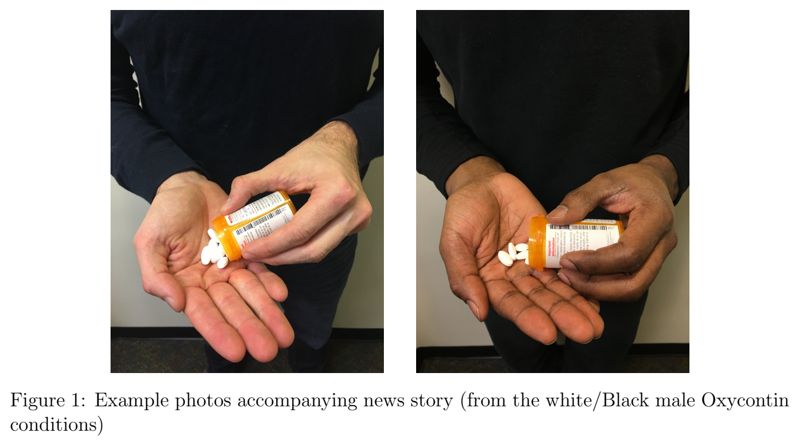

***Figure 1.*** Example photos accompanying news story (from the white/Black male Oxycontin conditions)

We use three primary outcome variables. First, to measure support for opioid treatment policy, we asked each respondent their desired degree of change to federal funding for opioid treatment programs as follows: “If you were making up the budget for the federal government this year, would you increase, decrease, or keep spending the same for treatment for those addicted to opioids?” Second, to measure support for a punitive response to the opioid crisis, we asked each respondent their desired degree of change to federal funding for law enforcement activity as follows: “If you were making up the budget for the federal government this year, would you increase, decrease, or keep spending the same for law enforcement to arrest and prosecute those addicted to opioids?” Response options for both questions were “increase a lot,” “increase a little,” “keep the same,” “decrease a little,” and “decrease a lot.” Finally, we ask about individual blame and deservingness, a critical theoretical pathway through which racial identities have been shown to influence public opinion. We asked respondents: “Would you agree or disagree that individuals addicted to opioids are to blame for their own addiction?” The five response options ranged from “strongly agree” to “strongly disagree.”

We also measured several different characteristics of each survey respondent. We asked

respondents for their demographic information and self-reported ZIP codes to code each respondent’s race, gender, partisan identity, and residential location.8 We also asked respondents whether they personally know anyone who has dealt with opioid addiction, or if they themselves have.

We fielded this survey on a nationally-representative probability sample of 3,112 adult respondents recruited via NORC’s AmeriSpeak Panel in June 2019.9 Specifically, the sample was selected from the AmeriSpeak panel by sampling within strata of age, race/ethnicity, education, and gender. In addition, the sampling strategy makes use of expected differential response rates in order to produce enhanced representation of “hard-to-reach rural households” (NORC, 2016), allowing us to make refined estimates of respondent subgroup opinions among populations of special interest for this project. We present additional sampling details, as well as full descriptive statistics for our sample, in Appendix F.

## Results

We first analyze the treatment effects of each of our identity attribute manipulations across the entire survey sample. We tested for these effects by comparing the average support for increased treatment and law enforcement funding among the different treatment conditions. For each attribute that we varied, we examine the differential levels of policy support among respondents in each experimental condition. We code our main outcome variables, respondents’ desired increase or decrease in spending, as a continuous interval of support that takes a value of 1 if respondents strongly agreed to increase funding and a value of 0 if they strongly disagreed. For the mediation analysis, we similarly recode our outcome of individual blame with a value of 1 if respondents strongly agreed that those struggling with 8We code residential location as either ‘urban,’ ‘suburban,’ or ‘rural’ based on the population density classifications described by Kolko (2015).

9We based our sample size on estimates of statistical power from a pilot survey we fielded in January 2019 (Appendix E).

addiction are to blame for their own addiction and a value of 0 if they strongly disagreed.10 Figure 2 plots our treatment effects of each attribute level among the full sample of respondents on our measure of support for treatment funding and law enforcement funding, with effects in the positive direction indicating greater support. For each attribute, we use one level as the reference category and show treatment effects of other attribute levels relative to that baseline.

Treatment Spending Enforcement Spending

(interval scale) (interval scale)

Race:

White

Black

Gender:

Man

Woman

Residential location: Urban

Suburban

Rural

−0.05 0.00 0.05 −0.05 0.00 0.05 Difference in policy support from baseline user attribute

etubirttA

resU

ecnatsbuS

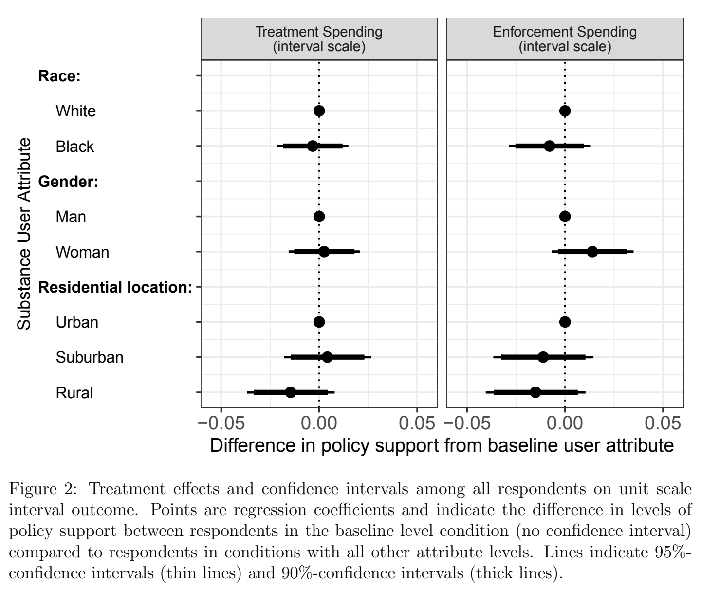

***Figure 2.*** Treatment effects and confidence intervals among all respondents on unit scale interval outcome. Points are regression coefficients and indicate the difference in levels of policy support between respondents in the baseline level condition (no confidence interval) compared to respondents in conditions with all other attribute levels. Lines indicate 95%- confidence intervals (thin lines) and 90%-confidence intervals (thick lines).

Among our full sample of respondents, none of the three identity attributes of the substance user affected support for either treatment or law enforcement funding. Contrary to 10Results are nearly identical when using binary coding of the outcome scales rather than the continuous interval coding of the dependent variables (Appendix G).

H1, respondents who read the news story about a substance user who was Black were no less likely to support increasing funding for treatment than those who read about a white substance user. Respondents who read the news story about a female substance user reported levels of support that were nearly identical to support among those who read about a male substance user. The residential identity of the substance user also had relatively small treatment effects. None of these differences were statistically significant among our full sample of survey respondents. The null effects of identity on support for treatment funding were nearly identical for law enforcement funding.11

### Moderation from Respondents’ Identities

However, our main theoretical expectation and corresponding pre-registered hypotheses held that the influences of these group identities on opinion would hinge on the respondents’ own identities. To assess this type of treatment effect heterogeneity, we next present the analyses of our treatment effects for race, gender, and residential location among subgroups of respondents. This allows us to assess descriptive moderation of treatment effects when a substance user’s identity matches that of the respondent.12 For each attribute of the substance user depicted in the news story in our experiment, we compare the treatment effect among the group of respondents whose own identity matches one attribute level to the effect among the group of respondents whose identity does not match that attribute level. We first assess the degree to which respondents’ racial identity moderates the treatment effect of the substance user’s race. As described above, we observed an overall null treatment effect of the race of the substance user depicted in the news story on both policy outcomes, which we plot at the top of the two panels in Figure 3. However, this treatment effect operates 11Results for our additional manipulations (insurance coverage and pathway to addiction) are reported in Appendix H. While not pre-registered, we also assess the potential for interactions among our treatments (Appendix I) as well as conditional effects based on the respondent’s partisanship (Appendix J). Finally, we report the estimated false discovery rate for each hypothesis test given multiple hypothesis testing (Appendix K).

12All conditional treatment effects are simply subgroup differences in the causal effects of our attribute manipulations, and do not necessarily represent causal differences of these respondent characteristics.

heterogeneously, as evidenced by the effects among respondents’ racial groups, which we plot in the middle and on the bottom of Figure 3 for Black and white respondents, respectively. Treatment Spending Enforcement Spending

(interval scale) (interval scale)

Full

Sample

Black

Respondents

White

Respondents

-0.1 0.0 0.1 -0.1 0.0 0.1

Treatment effect of substance user race

(black condition - white condition) on policy support

tesbuS

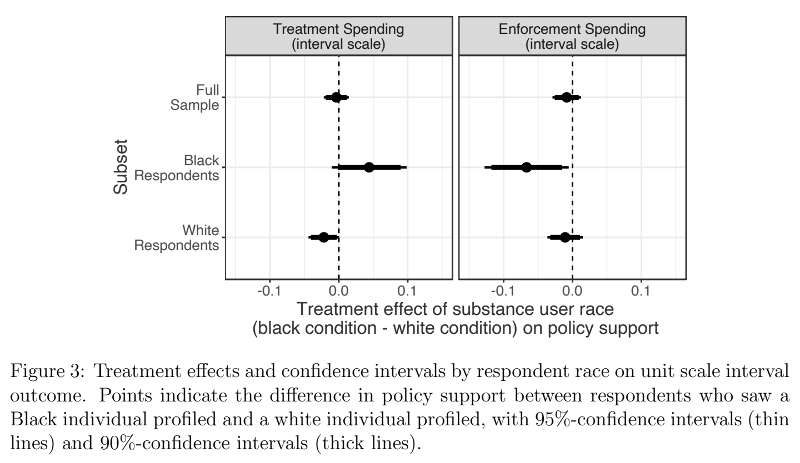

***Figure 3.*** Treatment effects and confidence intervals by respondent race on unit scale interval outcome. Points indicate the difference in policy support between respondents who saw a Black individual profiled and a white individual profiled, with 95%-confidence intervals (thin lines) and 90%-confidence intervals (thick lines).

For our treatment funding policy outcome, plotted in the left panel of Figure 3, among Black respondents, those in the ‘Black’ treatment condition were 4 percentage points more likely to support treatment funding than those respondents in the ‘white’ treatment condition. In contrast, among white respondents, those in the condition depicting a Black substance user were 2 percentage points less supportive of a funding increase than those in the condition depicting a white substance user. The interaction between the experimental race manipulation and respondents’ race of 7 percentage points is statistically significant (p = 0.022).13 These effects replicate findings of shared racial identity from a pilot study we fielded on Amazon.com’s Mechanical Turk platform (see Appendix E). The larger magnitude of the effect of race among Black respondents on this outcome is particularly interesting, as it challenges existing theories that mainly concern the ingroup favoritism of white Americans 13This test for the moderation of treatment effects follows our pre-registered method for testing for this difference using an interaction between the race condition and respondent race in OLS.

— and their potential racial animus — when it comes to social policy opinions. Instead, these results support H2a, suggesting race-based ingroup favoritism for both white and Black respondents.

For our law enforcement spending policy outcome, plotted in the right panel of Figure 3, we observed effects that mirror those of our treatment spending outcome. Black respondents in the ‘Black’ treatment condition were statistically significantly less likely to support increased enforcement spending than Black respondents in the ‘white’ treatment condition by 7 percentage points. We observed a small and statistically insignificant effect among white respondents. The interaction between the race manipulation and respondents’ race of 6 percentage points is not statistically significant at the 95% level (p = 0.091), though it suggests that respondent race may moderate the effect of racial identity on support for punitive policy as well as on treatment policy.

While these results present mixed evidence for H3a, they reflect those of Hurwitz and Peffley (2005a), who exposed respondents to descriptions of racial profiling and police brutality. The researchers observed that Black respondents who perceived the criminal justice system as chronically unfair exhibited ingroup favoritism in their judgements of the encounters, whereas white respondents were not sensitive to the race of the individual targeted. Hurwitz and Peffley (2005a) attributed this differential to the white respondents’ perception of ‘color-blind’ fairness in the criminal justice system. In contrast to Black Americans, many white Americans have not experienced similarly high levels of incarceration and its community-wide consequences (Western, 2006). Given this lack of exposure to the criminal justice system and its racial biases, white Americans’ current attitudes towards law enforcement in response to opioid use may not be as polarized by race, lead to the null effect among that subgroup.

We next assess the role of respondents’ gender identity in moderating the treatment effect of gender, which we show in Figure 4. As described in the previous section, among the full sample of respondents, we observed a null treatment effect of the gender of the

substance user depicted in the news story on both policy outcomes, as plotted at the top of Figure 4. Contrary to H2b, neither men nor women showed ingroup preferences on our treatment spending outcome. Likewise, a shared gender identity has a similar null effect on our enforcement spending outcome, suggesting that respondents’ gender does not moderate the effect of gender identity on support for punitive spending (H3b).

Treatment Spending Enforcement Spending

(interval scale) (interval scale)

Full

Sample

Men

Respondents

Women

Respondents

-0.10 -0.05 0.00 0.05 0.10-0.10 -0.05 0.00 0.05 0.10

Treatment effect of substance user gender

(man condition - woman condition) on policy support

tesbuS

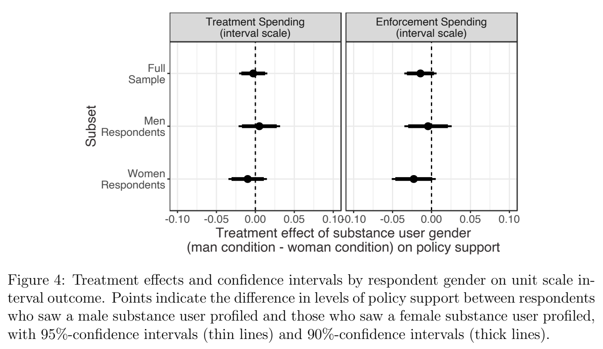

***Figure 4.*** Treatment effects and confidence intervals by respondent gender on unit scale in- terval outcome. Points indicate the difference in levels of policy support between respondents who saw a male substance user profiled and those who saw a female substance user profiled, with 95%-confidence intervals (thin lines) and 90%-confidence intervals (thick lines).

Finally, we conduct similar analyses of the treatment effect of residential context among respondent subgroups of residential context. We plot the effects of the residential context of the individual portrayed in the article for our treatment spending outcome in the left panel of Figure 5 and for our law enforcement spending outcome in the right panel, using separate shapes for each of the three comparisons between experimental conditions. We show these effects for our full respondent sample on the top, among respondents in rural locations (second from the top), suburban locations (third), and urban locations (on the bottom). For our first policy outcome, among the full sample of respondents, reading about a rural versus an urban substance user had a null effect, as described earlier. Within each geographic subgroup, none of the effects were statistically significant, meaning respondents

showed little ingroup favoritism for people from their own residential context (H2c). For our second outcome, support for law enforcement spending policy, we see a similar lack of subgroup effects (H3c). Together, these results show that shared residential identity on its own is unlikely to shape opinions on opioid-related policies.

Treatment Spending Enforcement Spending

(interval scale) (interval scale)

Full

Sample

Rural

Respondents

Suburban

Respondents

Urban

Respondents

-0.1 0.0 0.1 -0.1 0.0 0.1 Treatment effect of substance user

residential context on policy support

tesbuS

Rural - suburban Rural - urban Suburban - urban

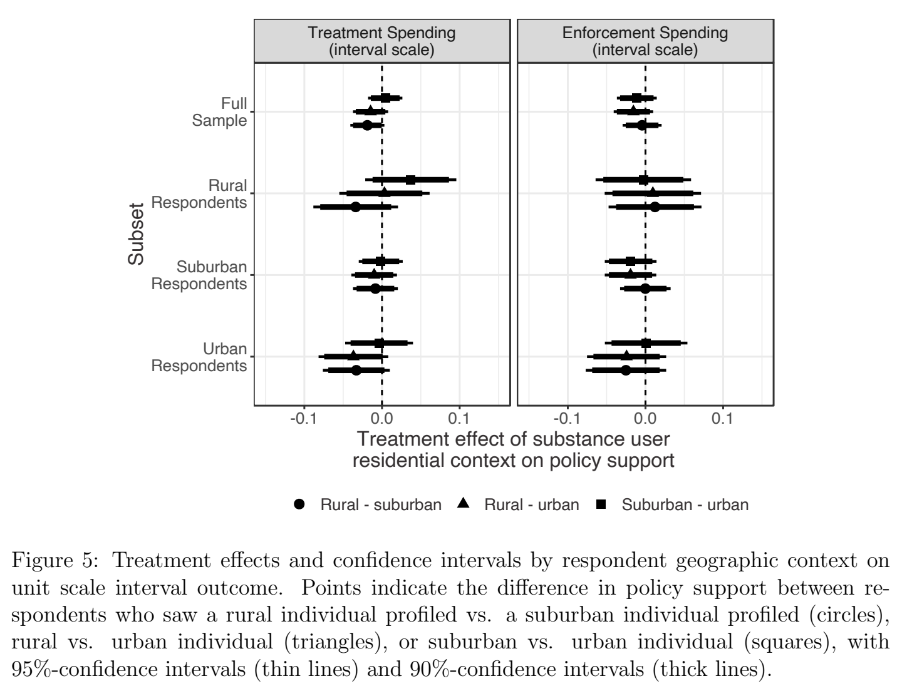

***Figure 5.*** Treatment effects and confidence intervals by respondent geographic context on unit scale interval outcome. Points indicate the difference in policy support between re- spondents who saw a rural individual profiled vs. a suburban individual profiled (circles), rural vs. urban individual (triangles), or suburban vs. urban individual (squares), with 95%-confidence intervals (thin lines) and 90%-confidence intervals (thick lines).

To assess the effects of identity across multiple respondent subgroups simultaneously, we also examined whether the match between one aspect of a respondent’s identity and the identity of the person profiled in the article had an effect on their policy support — essentially, aggregating across respondent subgroups to assess ingroup or outgroup favoritism for each demographic characteristic. These effects are plotted in Figure 6. Each of the points in this figure is based on differences in opinions between respondents whose identity matches that of the individual in the media story along that one identity attribute, and respondents

whose identity does not match that attribute. While matching the identity of the substance user depicted in the news story appears to have a uniformly positive effect on support for treatment spending, this ingroup bias is only statistically distinguishable from zero for racial identity. We see more muted racial ingroup favoritism effects for respondents’ support of the punitive law enforcement spending policy, which would be reflected by negative coefficients for the punitive outcome. In short, shared identity on attributes outside of race does not affect support for either opioid-related policy.

Treatment Spending Enforcement Spending

(interval scale) (interval scale)

Race

Gender

Residential

Context

-0.05 0.00 0.05 -0.05 0.00 0.05

Treatment effect of substance user attribute

(identity matching - non-matching) on policy support

noitalupinaM

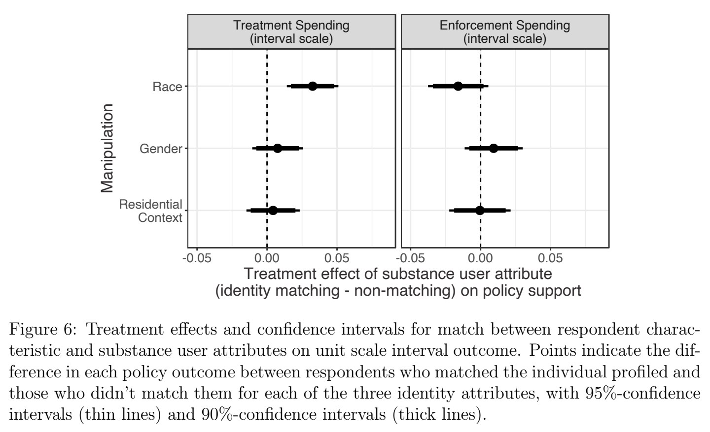

***Figure 6.*** Treatment effects and confidence intervals for match between respondent charac- teristic and substance user attributes on unit scale interval outcome. Points indicate the dif- ference in each policy outcome between respondents who matched the individual profiled and those who didn’t match them for each of the three identity attributes, with 95%-confidence intervals (thin lines) and 90%-confidence intervals (thick lines).

### Mechanisms

We next assess one potential mechanism behind our results: perceptions of personal blame. To do so, we use the question on our survey asking respondents the degree to which they believed substance users like the one depicted in the story are to blame for their own drug addiction. Overall, 52 percent of respondents somewhat or strongly agreed with the statement that those addicted to opioids are to blame for their addiction. As hypothesized, agreement with this attribution of blame was highly predictive of policy opinions (H4 ). Those

who agreed with the statement were 17 percentage points less likely to support treatment spending policy and 16 percentage points more likely to support law enforcement spending policy than those who did not think individuals were to blame.

To more formally test whether this perception of blame acts as a crucial causal mechanism behind the effect of group identity on policy opinions, we conducted exploratory causal mediation analyses using blame as a continuous variable (Imai, Keele, and Yamamoto, 2010; Imai et al., 2011). These analyses rest on an assumption of sequential ignorability that is potentially untenable in this and many other situations, and a different experimental design could yield a superior method of assessing blame’s mediating role by randomizing the mediator in a parallel design (Imai et al., 2011) or setting values of the mediator (Acharya, Blackwell, and Sen, 2018). Yet these analyses do provide an initial exploration of the plausibility of this mechanism. Contrary to H5, these analyses (which we present in Appendix L) suggest that none of the treatment effects associated with group identity were mediated by blame. This is despite the fact that the measure is predictive of policy opinions, and that we did observe variation on the measure itself between respondents.

The absence of evidence supporting blame as a mediator is surprising given the theoretic importance of perceived deservingness in support for social welfare policy. To further interrogate this, we assess the effects of identity within levels of one of our other experimental manipulations that was not based on substance users’ identity. We conduct several exploratory analyses that were not in our pre-analysis plan but are helpful in developing a more comprehensive understanding of how identity and blame intersect. Specifically, we analyze the effects of our manipulation that varied the initial drug which the person profiled in our story began using before becoming addicted to opioids.

First, we assess the common wisdom that many opioid users are considered less blameworthy because they began taking opioids legally, via a prescription. Figure 7 plots the effect of the initial drug manipulation on respondents’ perceptions of the blame that the substance user had for their situation. Our results support the folk wisdom, and show that respondents

perceived people who were described as initially using OxyContin that was prescribed by a physician as less blameworthy compared to people who were described as using heroin. Substance users who were described as having first used either legal or illegal OxyContin were perceived by respondents to be 5 to 10 percentage points less blameworthy than those substance users described as first using heroin.

Individual Blame

(interval scale)

Initial Opioid Use:

Heroin

Illegal OxyContin

Legal OxyContin

−0.1 0.0 0.1

Difference in perceived blame

from baseline user attribute

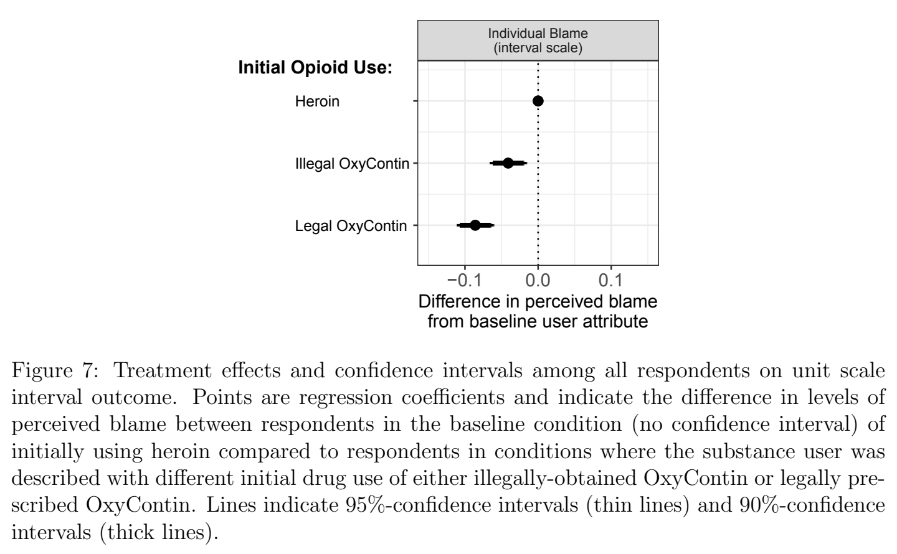

***Figure 7.*** Treatment effects and confidence intervals among all respondents on unit scale interval outcome. Points are regression coefficients and indicate the difference in levels of perceived blame between respondents in the baseline condition (no confidence interval) of initially using heroin compared to respondents in conditions where the substance user was described with different initial drug use of either illegally-obtained OxyContin or legally pre- scribed OxyContin. Lines indicate 95%-confidence intervals (thin lines) and 90%-confidence intervals (thick lines).

Given that respondents ascribe a higher level of individual blame to substance users who first used heroin, we next explored whether this manipulation might condition the effects of identity that we previously described. We examine this in Figure 8, which replicates Figure 6 and shows the effect of a shared identity on our policy outcomes but separately for respondents who read about a substance user who initially used heroin (top row) vs. legally-prescribed OxyContin (bottom row).14 For this first group, substance users who began their addiction by using heroin, perceptions of individual blame are much higher. In this condition, it appears that shared identity does not affect support for treatment funding. 14For the sake of brevity, we only conduct these exploratory analyses for the two conditions of initial drug use for which we see more extreme differences on perceived blame, as shown in Figure 7.

We see suggestive evidence that shared racial identity may decrease support for funding law enforcement (p < 0.1).

For the second group of substance users, who began using opioids when prescribed Oxy- Contin — and therefore were viewed less blameworthy — we see different effects. Sharing an identity with the substance user increased support for treatment funding by 6 percentage points (p < .01) while a shared gender identity had a smaller but still positive effect. These effects of shared identity only affected support for treatment funding and not punitive enforcement funding opinions.

These interaction results, in tandem with the ACME results described previously, suggest that identity may not have an effect on policy opinions through (i.e., mediated by) individual blame. However, blame may still moderate the effect of a shared identity. Few or none of the substance users described as initially using heroin, who were perceived to have high levels of blame, may be seen as worthy of treatment. Thus, a shared identity may not meaningfully affect support for funding sympathetic treatment programs. At the same time, some of the users associated with heroin may be viewed as more deserving of punishment than others. Given the primacy of race in conditioning criminal justice attitudes, we should not be surprised that a shared racial identity decreases support for funding law enforcement. In contrast, few or none of the substance users described as initially using prescription OxyContin, who were viewed as less blameworthy, may be seen as deserving punishment at all, limiting the influence of shared identity on respondents’ support for punitive policy responses. However, respondents may have room in their opinions to be selective in their support of treatment funding. Thus, these results reflect the established importance of identity in allocating group-based benefits, but suggest that there may be a moderating – if not mediating – role for perceptions of blame.

Treatment Spending Enforcement Spending

(interval scale) (interval scale)

Heroin Prescription Pills Race

Gender

Residential

Context

Race

Gender

Residential

Context

-0.05 0.00 0.05 0.10 -0.05 0.00 0.05 0.10

Treatment effect of substance user attribute

(identity matching - non-matching) on policy support

noitalupinaM

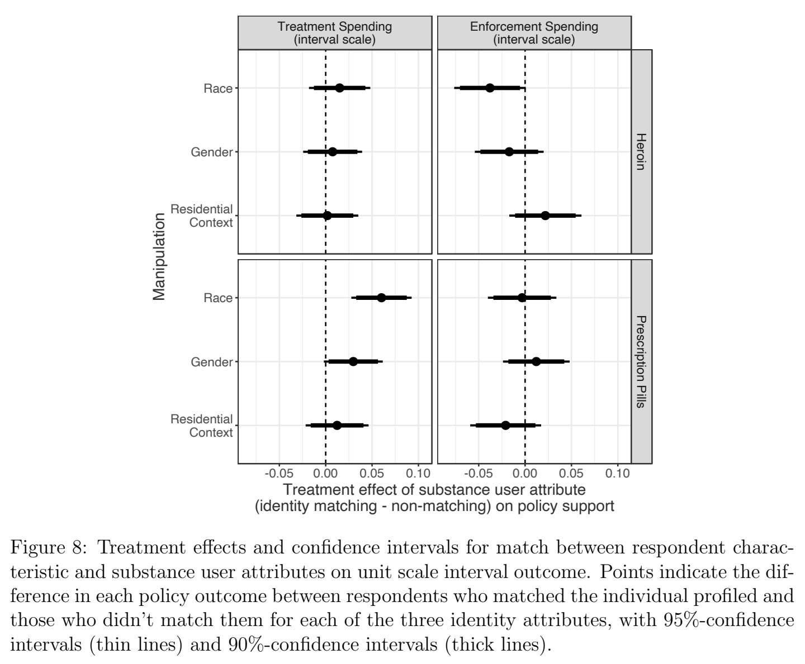

***Figure 8.*** Treatment effects and confidence intervals for match between respondent charac- teristic and substance user attributes on unit scale interval outcome. Points indicate the dif- ference in each policy outcome between respondents who matched the individual profiled and those who didn’t match them for each of the three identity attributes, with 95%-confidence intervals (thin lines) and 90%-confidence intervals (thick lines).

## Conclusion

In this paper, we have provided comprehensive evidence of the direct effect of media depictions of substance users on public opinion about opioid policy solutions. Our findings suggest that, much as with other social policies, racial group prejudice plays a large role in the way that people form opinions about both treatment- and punishment-focused opioid policies. Even given the cross-cutting nature of the opioid epidemic, where theory would lead us to say other group identities should matter in the formation of public opinion, race matters most.

Our results have several important limitations. Not all people will, in the real world, read depictions of individuals suffering from substance use disorder in the media. Thus the types of effects we observe may have different effects when consumed in a real-world setting. Information, and in particular information about the opioid crisis, may have heterogeneous effects based on the preferences individuals hold for consuming said information (Testa, Moffitt, and Schenk, 2020). The effects of racial identity on policy opinions that we do observe may even be an underestimate of the potential effects of identity given our relatively mild rates of passage on our manipulations checks (Kane and Barabas, 2019). Given this, the magnitude of our treatment effects — even if taken as a “treatment-on-treated” effect on a captive group of respondents — indicate the large potential for broader public opinion changes due to exposure to a single media story about this issue.

Additionally, though personal exposure to individuals with substance use may be one way that people learn about the effects of the opioid crisis (e.g., Kaufman and Hersh, 2020), news media are another way that people learn about real-world conditions around themselves (e.g. Neuner, Soroka, and Wlezien, 2019). Indeed, personal news consumption is positively associated with the perceived severity of the opioid epidemic in one’s community (Gollust and Haselswerdt, 2021). For the large sector of the population that is not directly affected by the crisis, the information conveyed in these media stories may be the most important

consideration in the formation of their policy opinions.15

Our evidence that mass opinion is subject to biases based on racial identity not only affirms the centrality of group identity in policy opinions, but also highlights a potential fault in representation. Policymakers are frequently biased in whose preferences they are responsive to, favoring whiter and wealthier constituents in their policy decisions (e.g. Butler and Broockman, 2011; Gilens, 2012). Likewise, lawmakers are constrained in their capacity to handle urgent crises like the opioid crisis that demand regulatory oversight of local implementing authorities (e.g. Cook and Fortunato, 2022; Fortunato and Parinandi, 2022). Especially under such capacity constraints, legislators may only act to pass and implement policy when they see a crisis as more urgent — a perception that may be shaped by biases favoring certain groups, as we show. This might lead to lawmakers ignoring the need for policy action when it affects other groups to which they are less sympathetic. Policymakers should therefore be attentive to the effect of media narratives on public opinion when creating policy if they wish to adhere to principles of democratic representation.

15Analyses of the effects of group identity on policy opinions within subgroups of personal exposure to the crisis, however, suggest that even those who know someone struggling with addiction may still be influenced by these factors (see Appendix M).

## References

Acharya, Avidit, Matthew Blackwell, and Maya Sen. 2018. “Analyzing Causal Mechanisms in Survey Experiments.” Political Analysis 26(4): 357–378.

American Psychiatric Association. 2017. “American Psychiatric Association Opinion Poll: April 2017.”.

AmeriSpeak Panel Technical Overview. 2016.

Baumgartner, Jesse C., and David C. Radley. 2021. “The Spike in Drug Overdose Deaths During the COVID-19 Pandemic and Policy Options to Move Forward.” The Commonwealth Fund: To the Point. Online: https://doi.org/10.26099/gyf5-3z49.

Bobo, Lawrence D, and Devon Johnson. 2004. “A Taste for Punishment: Black and White Americans’ Views on the Death Penalty and the War on Drugs.” Du Bois Review: Social Science Research on Race 1(1): 151–180.

Butler, Daniel M, and David E Broockman. 2011. “Do Politicians Racially Discriminate Against Constituents? A Field Experiment on State Legislators.” American Journal of Political Science 55(3): 463–477.

Cicero, Theodore J, Matthew S Ellis, Hilary L Surratt, and Steven P Kurtz. 2014. “The Changing Face of Heroin Use in the United States: A Retrospective Analysis of the Past 50 Years.” JAMA Psychiatry 71(7): 821–826.

Cook, Scott J, and David Fortunato. 2022. “The Politics of Police Data: State Legislative Capacity and the Transparency of State and Substate Agencies.” American Political Science Review (forthcoming).

Cramer, Katherine J. 2016. The Politics of Resentment: Rural Consciousness in Wisconsin and the Rise of Scott Walker. Chicago: University of Chicago Press.

de Benedictis-Kessner, Justin, and Michael Hankinson. 2019. “Concentrated Burdens: How Self-Interest and Partisanship Shape Opinion on Opioid Treatment Policy.” American Political Science Review 113(4): 1078–1084.

Doleac, Jennifer L, and Luke CD Stein. 2013. “The Visible Hand: Race and Online Market Outcomes.” The Economic Journal 123(572): F469–F492.

Eckhouse, Laurel. 2019. “Race, Party, and Representation in Criminal Justice Politics.” Journal of Politics 81(3): 1143–1152.

Fang, Albert H, and Gregory A Huber. 2020. “Perceptions of Deservingness and the Politicization of Social Insurance: Evidence from Disability Insurance in the United States.” American Politics Research 48(5): 543–559.

Feldman, Stanley, and Leonie Huddy. 2005. “Racial Resentment and White Opposition to Race-Conscious Programs: Principles or Prejudice?” American Journal of Political Science 49(1): 168–183.

Forman, Jr., James. 2017. Locking Up Our Own: Crime and Punishment in Black America. New York: Farrar, Straus and Giroux.

Fortunato, David, and Srinivas C Parinandi. 2022. “Social Welfare Returns to Legislative Capacity: Evidence from the Opioid Epidemic.” Working paper, Presented at the Annual Meeting of the Midwest Political Science Association.

Gaddis, S Michael. 2017. “How Black are Lakisha and Jamal? Racial Perceptions from Names Used in Correspondence Audit Studies.” Sociological Science 4: 469–489.

Gilens, Martin. 1999. Why Americans Hate Welfare: Race, Media, and the Politics of Antipoverty Policy. Chicago: University of Chicago Press.

Gilens, Martin. 2012. Affluence and Influence: Economic Inequality and Political Power in America. Princeton, NJ: Princeton University Press.

Gollust, Sarah E, and Jake Haselswerdt. 2021. “A Crisis in My Community? Local-Level Awareness of the Opioid Epidemic and Political Consequences.” Social Science & Medicine 291: 114497.

Gollust, Sarah E, and Joanne M Miller. 2020. “Framing the Opioid Crisis: Do Racial Frames Shape Beliefs of Whites Losing Ground?” Journal of Health Politics, Policy and Law 45(2): 241–276.

Gomberg, Edith S Lisansky. 1982. “Historical and Political Perspective: Women and Drug Use.” Journal of Social Issues 38(2): 9–23.

Harbin, M. Brielle. 2018. “The Contingency of Compassion: Media Depictions of Drug Addiction.” Working Paper, presented at the Annual Meeting of the American Political Science Association.

Hayes, Matthew, David Fortunato, and Matthew V Hibbing. 2020. “Race–Gender Bias in White Americans’ Preferences for Gun Availability.” Journal of Public Policy (forthcoming).

Holman, Mirya R. 2014. “Sex and the City: Female Leaders and Spending on Social Welfare Programs in US Municipalities.” Journal of Urban Affairs 36(4): 701–715.

Hurwitz, Jon, and Mark Peffley. 2005a. “Explaining the Great Racial Divide: Perceptions of Fairness in the US Criminal Justice System.” Journal of Politics 67(3): 762–783.

Hurwitz, Jon, and Mark Peffley. 2005b. “Playing the Race Card in the Post–Willie Horton Era: The Impact of Racialized Code Words on Support for Punitive Crime Policy.” Public Opinion Quarterly 69(1): 99–112.

Imai, Kosuke, Luke Keele, and Teppei Yamamoto. 2010. “Identification, Inference and Sensitivity Analysis for Causal Mediation Effects.” Statistical Science 25(1): 51–71.

Imai, Kosuke, Luke Keele, Dustin Tingley, and Teppei Yamamoto. 2011. “Unpacking the Black Box of Causality: Learning About Causal Mechanisms from Experimental and Observational Studies.” American Political Science Review 105(4): 765–789.

Israel-Trummel, Mackenzie, and Allyson Shortle. 2019. “The Continuing Link between Racial Attitudes and Punishment in the Time of Opioids.” Working paper.

Jalal, Hawre, Jeanine M Buchanich, Mark S Roberts, Lauren C Balmert, Kun Zhang, and Donald S Burke. 2018. “Changing Dynamics of the Drug Overdose Epidemic in the United States from 1979 through 2016.” Science 361(6408).

Jefferson, Hakeem. 2020. “The Politics of Respectability and Black Americans’ Punitive Attitudes.” Working paper, presented at the Annual Meeting of the American Political Science Association.

Jencks, Christopher. 1992. Rethinking Social Policy: Race, Poverty, and the Underclass. Cambridge, MA: Harvard University Press.

Kane, John V, and Jason Barabas. 2019. “No Harm in Checking: Using Factual Manipulation Checks to Assess Attentiveness in Experiments.” American Journal of Political Science 63(1): 234–249.

Kaufman, Aaron R, and Eitan D Hersh. 2020. “The Political Consequences of Opioid Overdoses.” PloS One 15(8): e0236815.

Kim, Jin Woo, Evan Morgan, and Brendan Nyhan. 2020. “Treatment versus Punishment: Understanding Racial Inequalities in Drug Policy.” Journal of Health Politics, Policy and Law 45(2): 177–209.

Klar, Samara. 2013. “The Influence of Competing Identity Primes on Political Preferences.” Journal of Politics 75(4): 1108–1124.

Kolko, Jed. 2015. “How Suburban Are Big American Cities?”.

Lyons, Jeffrey, and Stephen M Utych. 2021. “You’re Not From Here!: The Consequences of Urban and Rural Identities.” Political Behavior (forthcoming).

Marques, Jos´e M, and Dario Paez. 1994. “The ‘Black Sheep Effect’: Social Categorization, Rejection of Ingroup Deviates, and Perception of Group Variability.” European Review of Social Psychology 5(1): 37–68.

Marsh, Jeanne C, Keunhye Park, Yu-An Lin, and Cliff Bersamira. 2018. “Gender Differences in Trends for Heroin Use and Nonmedical Prescription Opioid Use, 2007–2014.” Journal of Substance Abuse Treatment 87: 79–85.

Masuoka, Natalie, and Jane Junn. 2013. The Politics of Belonging: Race, Public Opinion, and Immigration. Chicago: University of Chicago Press.

Michener, Jamila. 2019. “Policy Feedback in a Racialized Polity.” Policy Studies Journal 47(2): 423–450.

Monnat, Shannon M, and Khary K Rigg. 2016. “Examining Rural/Urban Differences in Prescription Opioid Misuse Among US Adolescents.” The Journal of Rural Health 32(2): 204–218.

Nemerever, Zoe, and Melissa Rogers. 2021. “Measuring the Rural Continuum in Political Science.” Political Analysis 29(3): 267–286.

Netherland, Julie, and Helena B Hansen. 2016. “The War on Drugs that Wasn’t: Wasted Whiteness, ‘Dirty Doctors,’ and Race in Media Coverage of Prescription Opioid Misuse.” Culture, Medicine, and Psychiatry 40(4): 664–686.

Neuner, Fabian G, Stuart N Soroka, and Christopher Wlezien. 2019. “Mass Media as a Source of Public Responsiveness.” The International Journal of Press/Politics 24(3): 269–292. Om, Anjali. 2018. “The Opioid Crisis in Black and White: The Role of Race in Our Nation’s Recent Drug Epidemic.” Journal of Public Health 40(4): e614–e615.

Raychaudhuri, Tanika, Tali Mendelberg, and Anne McDonough. 2022. “The Political Effects of Opioid Addiction Frames.” Journal of Politics (forthcoming).

Saloner, Brendan, and Colleen L Barry. 2018. “Ending the Opioid Epidemic Requires a Historic Investment in Medication-Assisted Treatment.” Journal of Policy Analysis and Management 37(2): 431–438.

Schneider, Anne, and Helen Ingram. 1993. “Social Construction of Target Populations: Implications for Politics and Policy.” American Political Science Review 87(2): 334–347. Shachar, Carmel, Andrea L. Campbell, Tess Wise, and Gali Katznelson. 2020. “Criminal Justice or Public Health: A Comparison of the Representation of the Crack Cocaine and Opioid Epidemics in the Media.” Journal of Health Politics, Policy and Law 45(2): 211– 239.

Strolovitch, Dara Z. 2008. Affirmative Advocacy: Race, Class, and Gender in Interest Group Politics. Chicago: University of Chicago Press.

Tajfel, Henri. 1982. “Social Psychology of Intergroup Relations.” Annual Review of Psychology 33(1): 1–39.

Tesler, Michael. 2012. “The Spillover of Racialization into Health Care: How President Obama Polarized Public Opinion by Racial Attitudes and Race.” American Journal of Political Science 56(3): 690–704.

Testa, Paul F, Susan L Moffitt, and Marie Schenk. 2020. “Public Preferences for New Information on Opioids.” Journal of Health Politics, Policy and Law 45(2): 311–339.

Western, Bruce. 2006. Punishment and Inequality in America. Russell Sage Foundation.

White, Ismail K. 2007. “When Race Matters and When It Doesn’t: Racial Group Differences in Response to Racial Cues.” American Political Science Review 101(2): 339–354.

Woolf, Steven H, Derek A Chapman, and Jong Hyung Lee. 2021. “COVID-19 as the Leading Cause of Death in the United States.” JAMA 325(2): 123–124.

## Supplementary Appendix for

### Justin de Benedictis-Kessner Michael Hankinson

### December 8, 2022

∗Assistant Professor, John F. Kennedy School of Government, Harvard University. 79 John F. Kennedy St., Cambridge, MA 02138. jdbk@hks.harvard.edu

†Assistant Professor, Department of Political Science, George Washington University. 2115 G Street, N.W., Washington, D.C. 20052. hankinson@gwu.edu

## Contents

A Survey Instrument A-1 B Experimental Manipulations A-4 C Photos from Experiment A-5 D Results from Manipulation Checks A-7 E Power Analyses from Pilot Study A-9 F Descriptive Characteristics of Survey Respondents A-12 G Results Using Alternative Coding of DV A-13 H Additional Treatments A-18 I Interaction Effects of Randomized Treatments A-19 J Heterogeneity in the Effects by Respondent Partisanship A-27 K Multiple Hypothesis Testing Corrections A-29 L Mediation Analyses A-36 M Heterogeneity in the Effects of Group Identity by Personal Exposure A-38 N Pre-Analysis Plan A-41

## A Survey Instrument

### Experimental Vignette

The following replicates the introduction and news story all subjects read, with text varying according to the experimental condition. All gendered pronouns varied based on gender randomization, but example uses female pro-nouns for clarity.

We are interested in learning what people can remember from what they read in news articles. We would now like you to read a news article, and then answer some questions about it. You will find the article on the next page. Please read it carefully before answering the following questions.

There will be a brief pause on the next screen so you can read the story. At the end of the pause, an arrow will appear at the bottom of the screen.

Once the arrow appears, you may move on to the next screen of the survey by clicking on the arrow.

PHOTO OF HAND HOLDING DRUG PARAPHERNALIA

(See Section C for photos.)

NAME, holding the drugs that started her addiction.

NAME is a resident of CONTEXT and a recovering opioid addict who has witnessed the disturbing, dark side of addiction.

Growing up, NAME had what appeared to be a bright future ahead of her. But after high school, NAME got her first taste of the drug that would come to rule over her life. PATHWAY.

“It was instant love,” she said. “That was the first time I got that opioid feeling, and I really liked the way it felt.”

Her life started to go downhill, quickly. While most of the people she grew up with were graduating from college or getting their first big job, she was doing whatever she had to do to get high. After her first introduction to opioids, she started buying the drugs illegally from people she knew were selling in her town. To pay for these drugs, she did things she now says she regrets given the toll they took on her life. Over the past four years, NAME overdosed twice. Both times she was found by friends or family members and revived by paramedics or in the hospital.

“About a year ago, I just finally had enough and hit a point where either I stopped or I was going to die and not come back this time,” she said. NAME is now in outpatient rehab. She is thankful for her INSURANCE. Otherwise, she would not be able to afford treatment and could not begin her journey to recovery.

”I just hope people will hear my story and realize there is a way out. You just have to want it. The disease may not have been my responsibility, but the recovery is 100 percent my responsibility,” she said.

### Outcome Variables

We randomize the order of questions 1 and 2 (“treatment” and “law enforcement to arrest and prosecute”).

Now, we would like to know your opinion about opioid treatment programs.

1. If you were making up the budget for the federal government this year, would you increase, decrease, or keep spending the same for treatment for those addicted to opioids?

• Increase a lot

• Increase a little

• Keep the same

• Decrease a little

• Decrease a lot

2. If you were making up the budget for the federal government this year, would you increase, decrease, or keep spending the same for law enforcement to arrest and prosecute those addicted to opioids?

• Increase a lot

• Increase a little

• Keep the same

• Decrease a little

• Decrease a lot

3. Would you agree or disagree that individuals addicted to opioids are to blame for their own addiction?

• Strongly agree

• Somewhat agree

• Neither agree nor disagree

• Somewhat disagree

• Strongly disagree

### Manipulation Checks

Due to survey length constraints, two of the five manipulation checks were randomly selected for each respondent to answer.

Next, we are going to ask you a few questions about the individual profiled in the news article you read about opioid addiction.

• What was the race of the individual profiled in the news article?

– Asian

– Black

– Hispanic

– White

• What was the gender of the individual profiled in the news article? – Male

– Female

• In which type of community did the individual profiled live? – A rural farm

– A quiet suburb

– An urban downtown center

• How did the individual profiled become addicted to opioids?

– Injured his/her knee and needed surgery. His/her doctor prescribed him/her OxyContin pills for the pain during his/her recovery.

– His/her friend illegally gave him/her OxyContin pain pills at a party.

– His/her friend gave him/her heroin at a party.

• What type of insurance did the individual profiled have?

– Insurance purchased from a private provider

– Insurance purchased through the Affordable Care Act/Obamacare marketplace – Insurance coverage from their state’s Medicaid expansion, funded by the Affordable Care Act/Obamacare

### Demographic Variables

We collect demographic data on race, gender, ideology, partisanship, homeownership, age, and ZIP code from NORC panel variables. We also included a question on respondents’ personal exposure to individuals struggling with addiction:

• Do you personally know anyone who has ever been addicted to opioids, including prescription painkillers or heroin? Please select all that apply.

– Yes, me

– Yes, a family member

– Yes, a close friend

– Yes, an acquaintance

– No, I do not know anyone who has ever been addicted to opioids

## B Experimental Manipulations

We varied the following attributes of the individual profiled in the news story, with full randomization that allowed each attribute to take one value with no restrictions based on other attribute values.

1. Race - name and use of dark-skinned or light-skinned hand in photo. We use names from the lowest education quartile and highest education quartile within race (e.g., Gaddis, 2017) to mitigate any socio-economic effects outside of race.

• Black woman - Lakisha (lowest quartile), Janae (highest quartile)

• White woman - Angie, Katelyn

• Black man - DaShawn, Darius

• White man - Ronny, Jake

### 2. Gender - name and use of he/she pronouns

### 3. Residential location

• a rural farm

• a quiet suburb

• an urban downtown center

### 4. Pathway to addiction - story of person varied according to below options, along

with drug paraphernalia depicted in image (i.e. when story described a person who began their opioid use with OxyContin pills, the image showed a hand holding pills, whereas when the story described a person who began their opioid use with heroin, the image showed a needle).

• Injured his/her knee and needed surgery. His/her doctor prescribed him/her OxyContin pills for the pain during his/her recovery.

• His/her friend illegally gave him/her OxyContin pain pills at a party.

• His/her friend gave him/her heroin at a party.

### 5. Insurance coverage

• insurance purchased from a private provider

• insurance purchased through the Affordable Care Act/Obamacare marketplace • insurance coverage from the state’s Medicaid expansion, funded by the Affordable Care Act/Obamacare

## C Photos from Experiment

(a) Woman/Black/Pills (b) Woman/Black/Needle (c) Woman/White/Pills (d) Woman/White/Needle

(e) Man/Black/Pills (f) Man/Black/Needle (g) Man/White/Pills (h) Man/White/Needle

## D Results from Manipulation Checks

In Figure D-1 we present the treatment effect of varying attributes on the proportion of respondents answering the manipulation check question in line with that treatment. Each point plots this treatment effects for a different attribute along with its 95% confidence interval. Each attribute that we varied greatly increased the proportion of respondents answering that option on the manipulation check question, and all treatment effects were statistically significant. For instance, respondents in the ‘black’ treatment group were 58 percentage points more likely to answer that the person profiled in the article they read was black than respondents in the ‘white’ treatment group (p < 0.01), as plotted with the left-most point. All other treatments had similarly large and statistically significant effects on our manipulation check questions, indicating that our experimental manipulations were conveying the information we hoped to convey.

1.00

0.75 0.76

0.58

0.50 0.51

0.45 0.45 0.25

0.00

Race: Gender: Insurance: Pathway to addiction: Residential location: black female private pills at party rural Manipulation check

noitpo

esnopser

no

tceffe

tnemtaerT

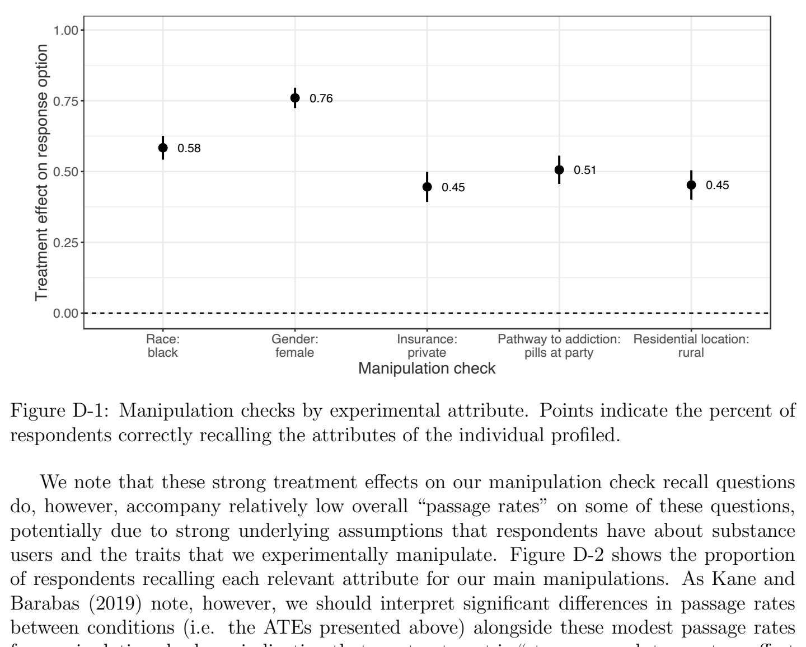

***Figure D-1.*** Manipulation checks by experimental attribute. Points indicate the percent of respondents correctly recalling the attributes of the individual profiled. We note that these strong treatment effects on our manipulation check recall questions do, however, accompany relatively low overall “passage rates” on some of these questions, potentially due to strong underlying assumptions that respondents have about substance users and the traits that we experimentally manipulate. Figure D-2 shows the proportion of respondents recalling each relevant attribute for our main manipulations. As Kane and Barabas (2019) note, however, we should interpret significant differences in passage rates between conditions (i.e. the ATEs presented above) alongside these modest passage rates

for manipulation checks as indicating that our treatment is “strong enough to exert an effect despite a sizable presence of inattentive respondents” (p. 238). In other words, the presence of treatment effects on our manipulation check outcomes but overall low levels of correct recall on these manipulation checks should suggest that our experimental treatment effects are an underestimate of what treatment effects on policy attitudes might be if there were more perfect compliance.

Race Condition: Black Race Condition: White Gender Condition: Female Gender Condition: Male 100% 100%

90% 91% 85%

75% 75%

64%

50% 50%

29%

25% 25%

15%

7% 1% 5% 3% 1% 9% 0% 0%

White BlackHispanicAsian White BlackHispanicAsian Male Female Male Female Recalled race as: Recalled gender as: Location Condition: Rural Location Condition: Suburban Location Condition: Urban 80% 75%

60%

52% 50% 44%

40% 33%

20% 15% 18%

7% 6%

A rural A quiet An urban A rural A quiet An urban A rural A quiet An urban farm suburb downtown farm suburb downtown farm suburb downtown center center center Recalled location as:

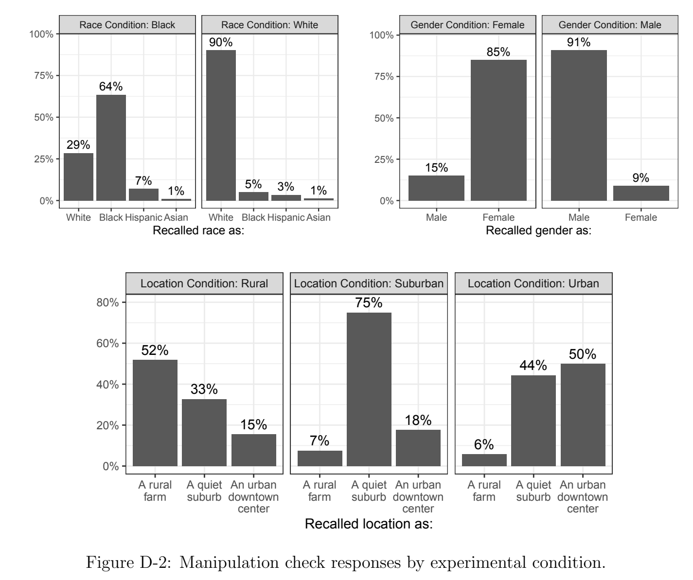

***Figure D-2.*** Manipulation check responses by experimental condition.

## E Power Analyses from Pilot Study

In January 2019, we fielded a nearly identical experiment on Amazon.com’s Mechanical Turk (MTurk) platform as a pilot study (n = 800). The pilot treatment effects that we observed on our limited sample enabled us to conduct power analyses helping inform the necessary sample size for the study. As shown below, the effects of shared racial identity on opioid policy support that we report in the main text replicate our pilot findings from the smaller MTurk sample. In contrast, our study did not find similar effects of shared residential identity as found in the MTurk sample. Additionally, our pilot study did not include outcome variables on punitive policy or deservingness. Still, the pilot findings informed the sample size we believed necessary to replicate the effects using the NORC’s AmeriSpeak sample (n = 3, 112).

Reviewing the pilot study data, we first analyzed the treatment effects on our race manipulation. We tested for this effect by comparing the average support for treatment funding — which, as in the main text, we recoded as a continuous measure of support — among respondents who read the profile of a black person struggling with addiction to the support for spending among respondents who read the same profile of a white person. This difference in means represents the treatment effect of race.

We plot the treatment effect for the full sample of respondents on the left side of Figure E-3. Within this pilot sample, we observed an overall null treatment effect: respondents in the ‘black’ condition were 1 percentage points less likely to support funding than respondents in the ‘white’ condition. However, as we hypothesized, this treatment effect should operate heterogeneously, with respondent’s identity moderating the overall effect. In this case, we expected that respondents’ racial identity would do so and consequently tested for the heterogeneity of these effects by respondents’ race.

Full

Sample

Black

Respondents

White

Respondents

-0.1 0.0 0.1 0.2 0.3

Treatment effect of recipient race

on spending support (black-white)

tesbuS

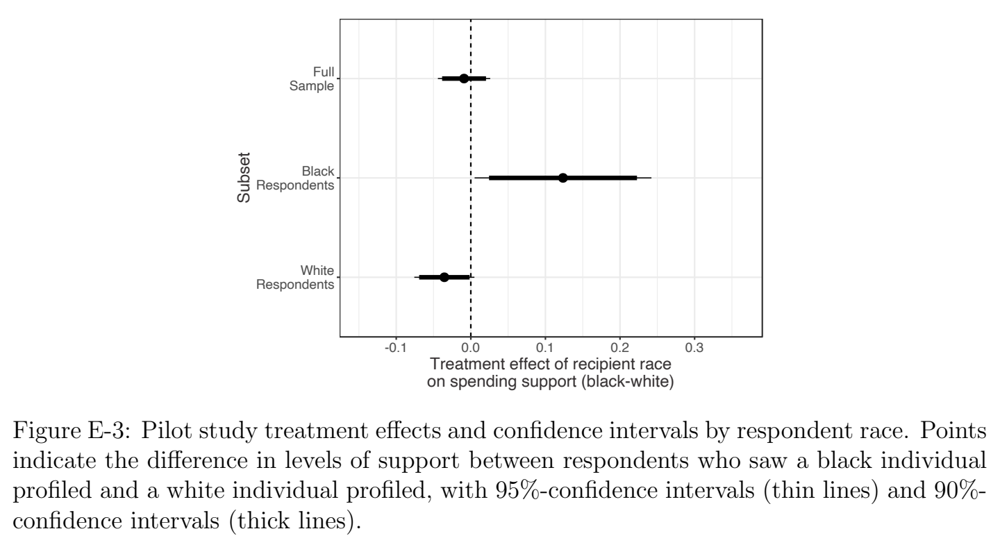

***Figure E-3.*** Pilot study treatment effects and confidence intervals by respondent race. Points indicate the difference in levels of support between respondents who saw a black individual profiled and a white individual profiled, with 95%-confidence intervals (thin lines) and 90%- confidence intervals (thick lines).

Among black respondents, those in the ‘black’ treatment condition were 12 percentage

points more likely to support funding than those respondents in the ‘white’ treatment condition. We plot this treatment effect in the middle of Figure E-3, which is statistically significant (p = 0.041). Using the standard deviation of the outcome variable among black respondents, we calculate this as a standardized effect size of 0.42. Among white respondents, we observe a treatment effect of a 4 percentage point decrease in support for funding (p = 0.084), which we plot on the right side of Figure G-6. This is a standardized effect size of 0.14. Like our AmeriSpeak panel sample, the effects are nearly identical when operationalizing support for treatment spending as a binary variable.

Using these two standardized effect sizes, we conducted power analyses to test what the required sample size would be in each respondent racial group to detect effects of these sizes with an α of 0.05 and power of 0.8. This yielded a required treatment condition size of 90 among black respondents and 766 among white respondents, yielding a total required n of 1712.

Though this power analysis indicated a need for a relatively small sample size, we also wanted to test for the required sample size to detect some smaller treatment effects on other experimentally manipulated attributes of the person profiled in the article with a greater number of potential attribute values — for instance, the person’s residential context — and therefore a greater number of experimental conditions. We conducted similar analyses of this treatment effect in our pilot, among our full sample (plotted on the left of Figure E- 4) and among respondents in rural locations (in the middle of Figure E-4) and non-rural locations (right side of Figure E-4).1 As with our tests of the effect of race, we operationalize the treatment effect of the residential context of the person profiled in the article as the difference in support for treatment funding among those respondents who viewed the profile of a rural individual (from ‘a rural farm’) and support among those respondents who viewed the profile of a non-rural individual (from ‘a quiet suburb’ or ‘an urban downtown center’). On average, the geographic context of the individual profiled had a null effect on respondent support for treatment funding. However, among rural respondents, we find a 7 percentage point increase in funding support (p=0.188). We observe a small negative treatment effect among non-rural respondents, but it is statistically indistinguishable from zero with this sample size. While these effects are not statistically significant, they match the shared identity relationships we found for race.

We used these pilot treatment effect sizes to also conduct power analyses for this experimental treatment. In order to detect a treatment effect of residential context of the sizes observed in our pilot among rural respondents, we would have needed to have 255 respondents in each condition, while we would need 2218 non-rural respondents in each condition in order to detect negative effects of the size observed in our pilot. Though this yielded a clearly unrealistic required sample size of 4946, we believed that there were several reasons to still test for this treatment effect on a large nationally representative sample.

For one, estimates of heterogenous effects — a primary quantity of interest in this study — can suffer substantially from the idiosyncratic features of a Mechanical Turk sample (e.g., Berinsky, Huber, and Lenz, 2012; Levay, Freese, and Druckman, 2016). Geographic variation on MTurk is unreliable, and suggests that our opinion estimates among rural and non-rural 1We use respondents’ ZIP codes to group them into rural and non-rural subgroups and test for context-based in-group preferences among these respondents reflective of Cramer’s (2016) theory of ‘rural consciousness.’

Full Sample

Rural

Respondents

Non-Rural

Respondents

-0.1 0.0 0.1 0.2 0.3

Treatment effect of recipient context

on spending support (rural - non-rural)

tesbuS

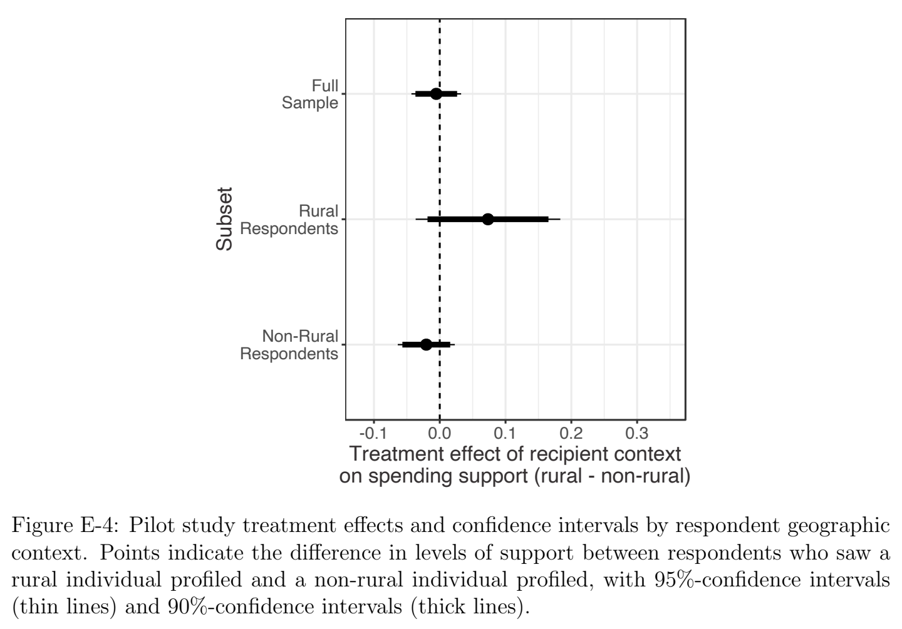

***Figure E-4.*** Pilot study treatment effects and confidence intervals by respondent geographic context. Points indicate the difference in levels of support between respondents who saw a rural individual profiled and a non-rural individual profiled, with 95%-confidence intervals (thin lines) and 90%-confidence intervals (thick lines).

respondents may have been biased, leading to potential biases in our estimated treatment effects. A TESS study fielded via NORC’s AmeriSpeak Panel, on the other hand, would make use of enhanced representation of “hard-to-reach rural households” (NORC, 2016). This would help us refine our estimates of opinion among rural and non-rural respondents, as well as the other respondent subgroups of particular interest for this study. Thus, we pursued a nationally representative sample of over 3,000 respondents via NORC, the results of which are reported in the main text of this paper.

## F Descriptive Characteristics of Survey Respondents

As described in the main text of the manuscript, NORC drew a stratified probability sample from their AmeriSpeak Panel to invite to participate in our survey. The survey was in the field from June 16 to July 11, 2019, during which period NORC sent 5 reminder emails and one SMS reminder. Panelists were offered the cash equivalent of $1 to complete the survey via NORC’s points incentive system. The median respondent took 3 minutes to complete the survey. The weighted AAPOR RR3 response rate was 30.3%.

Below, we present descriptive statistics of interest for our full sample of survey respondents.

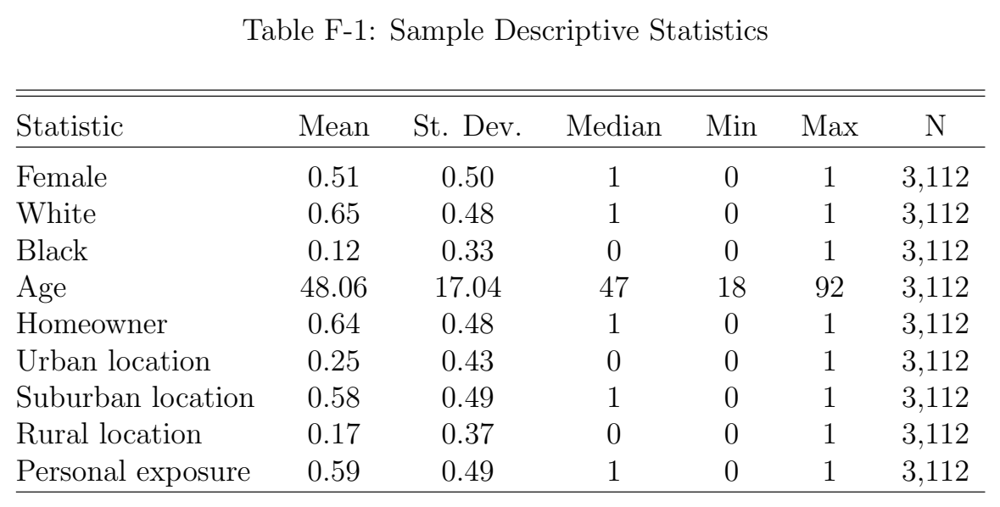

***Table F-1.*** Sample Descriptive Statistics

[Download data as CSV](tables/tab-01.csv)

Statistic Mean St. Dev. Median Min Max N

Female 0.51 0.50 1 0 1 3,112 White 0.65 0.48 1 0 1 3,112 Black 0.12 0.33 0 0 1 3,112 Age 48.06 17.04 47 18 92 3,112 Homeowner 0.64 0.48 1 0 1 3,112 Urban location 0.25 0.43 0 0 1 3,112 Suburban location 0.58 0.49 1 0 1 3,112 Rural location 0.17 0.37 0 0 1 3,112 Personal exposure 0.59 0.49 1 0 1 3,112

## G Results Using Alternative Coding of DV

In this section, we replicate the main results with an alternative coding of the dependent variables as binary measures of support that take a value of 1 if respondents supported increasing funding by a lot or a little and a value of 0 otherwise. These alternative results, presented below in Figure G-5, are largely similar to those presented in the text of the paper in Figure ??.

Treatment Spending Enforcement Spending

(binary scale) (binary scale)

Race:

White

Black

Gender:

Man

Woman

Residential location: Urban

Suburban

Rural

−0.10 −0.05 0.00 0.05 0.10 −0.10 −0.05 0.00 0.05 0.10 Difference in policy support from baseline user attribute

etubirttA

resU

ecnatsbuS

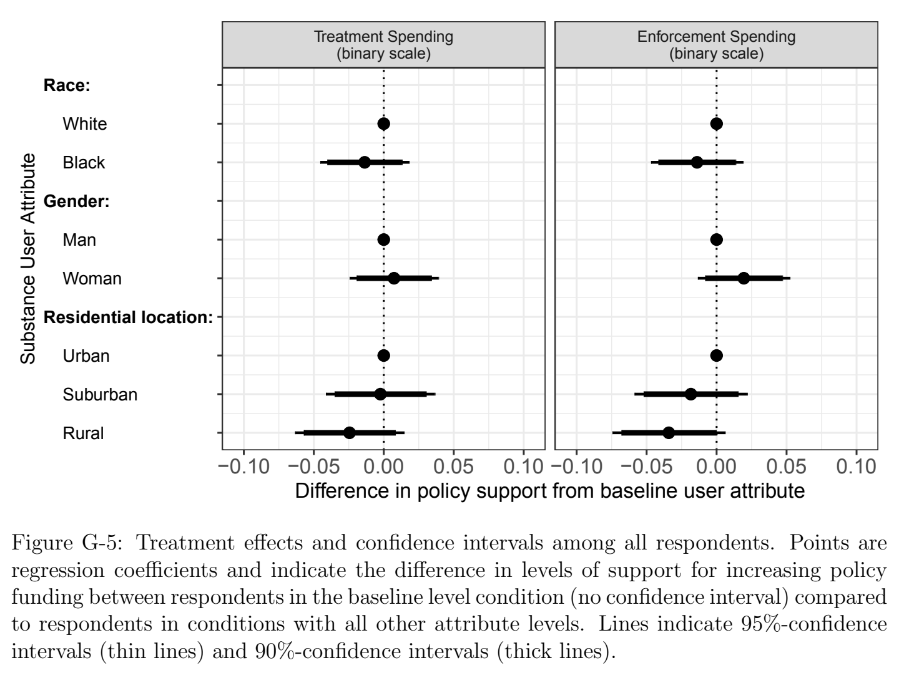

***Figure G-5.*** Treatment effects and confidence intervals among all respondents. Points are regression coefficients and indicate the difference in levels of support for increasing policy funding between respondents in the baseline level condition (no confidence interval) compared to respondents in conditions with all other attribute levels. Lines indicate 95%-confidence intervals (thin lines) and 90%-confidence intervals (thick lines).

In addition, we also present the results exploring heterogeneity in the treatment effects of various substance user attributes using a binary outcome. In Figure G-6 we present the effect of the race treatment for both Black and white respondents.

Treatment Spending Enforcement Spending (binary scale) (binary scale) Full

Sample

Black

Respondents

White

Respondents

-0.2 -0.1 0.0 0.1 -0.2 -0.1 0.0 0.1

### Treatment effect of recipient race

### on spending support (black-white)

tesbuS

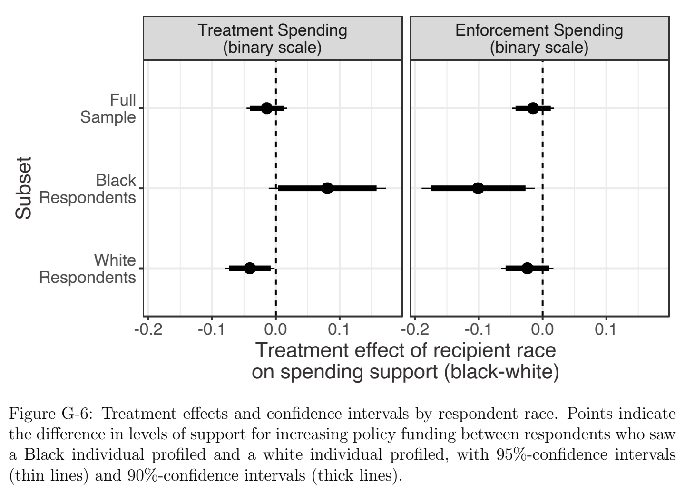

***Figure G-6.*** Treatment effects and confidence intervals by respondent race. Points indicate the difference in levels of support for increasing policy funding between respondents who saw a Black individual profiled and a white individual profiled, with 95%-confidence intervals (thin lines) and 90%-confidence intervals (thick lines).

Treatment Spending Enforcement Spending (binary scale) (binary scale) Full

Sample

Men

Respondents

Women

Respondents

-0.10 -0.05 0.00 0.05 -0.10 -0.05 0.00 0.05

### Treatment effect of recipient gender

### on funding support (male - female)

tesbuS

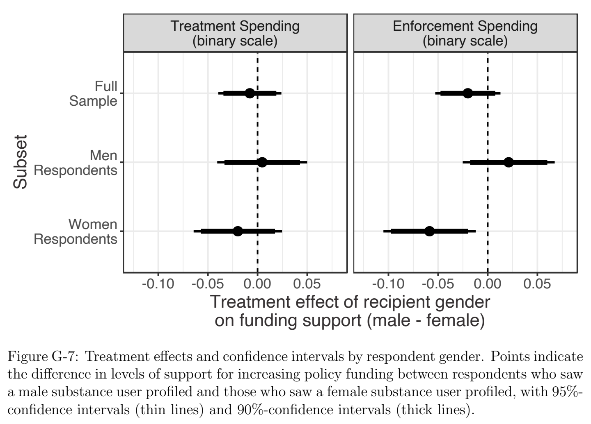

***Figure G-7.*** Treatment effects and confidence intervals by respondent gender. Points indicate the difference in levels of support for increasing policy funding between respondents who saw a male substance user profiled and those who saw a female substance user profiled, with 95%- confidence intervals (thin lines) and 90%-confidence intervals (thick lines).

Treatment Spending Enforcement Spending (binary scale) (binary scale) Full

Sample

Rural

Respondents

Suburban

Respondents

Urban

Respondents

-0.1 0.0 0.1 -0.1 0.0 0.1

### Treatment effect of recipient context

### on spending support

tesbuS

Rural - suburban Rural - urban Suburban - urban

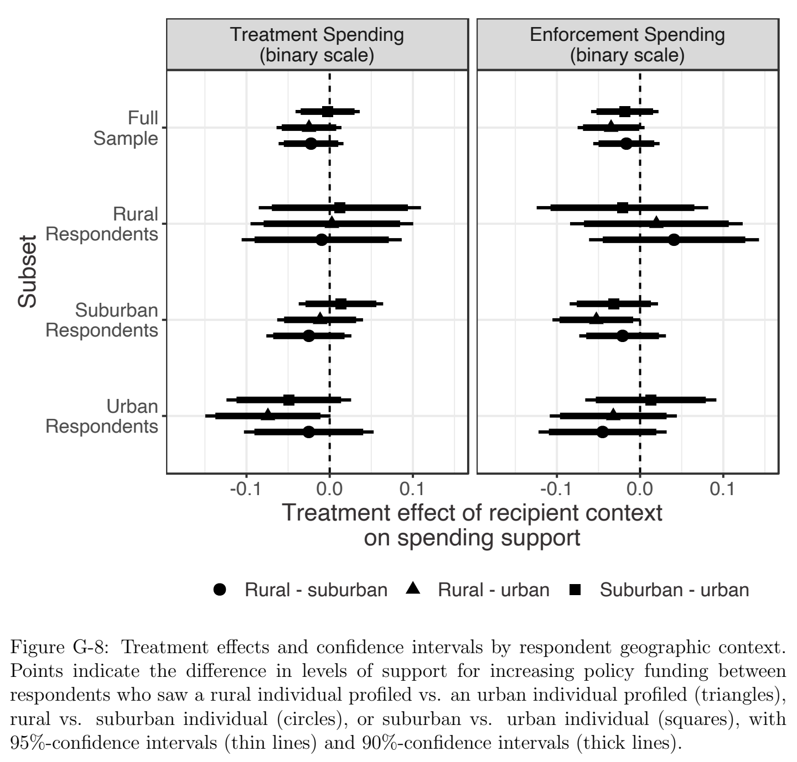

***Figure G-8.*** Treatment effects and confidence intervals by respondent geographic context. Points indicate the difference in levels of support for increasing policy funding between respondents who saw a rural individual profiled vs. an urban individual profiled (triangles), rural vs. suburban individual (circles), or suburban vs. urban individual (squares), with 95%-confidence intervals (thin lines) and 90%-confidence intervals (thick lines).

Treatment Spending Enforcement Spending (binary scale) (binary scale)

Race

Gender

Residential

Context

-0.05 0.00 0.05 -0.05 0.00 0.05

### Treatment effect of recipient attribute

### on outcome (identity matching - non-matching)

noitalupinaM

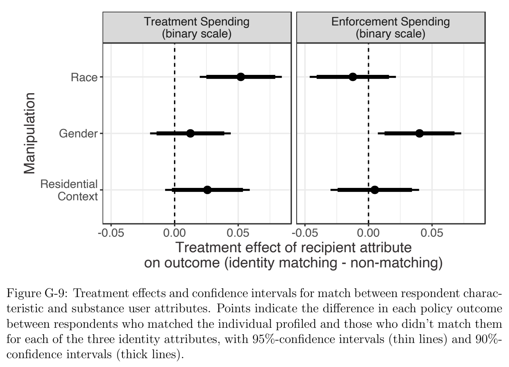

***Figure G-9.*** Treatment effects and confidence intervals for match between respondent charac- teristic and substance user attributes. Points indicate the difference in each policy outcome between respondents who matched the individual profiled and those who didn’t match them for each of the three identity attributes, with 95%-confidence intervals (thin lines) and 90%- confidence intervals (thick lines).

## H Additional Treatments

Treatment Spending Enforcement Spending (interval scale) (interval scale) Insurance Coverage:

Medicaid

ACA Marketplace

Private

Initial Opioid Use:

Heroin

Illegal OxyContin

Legal OxyContin

−0.05 0.00 0.05 −0.05 0.00 0.05

Difference in policy support from baseline user attribute etubirttA

resU

ecnatsbuS

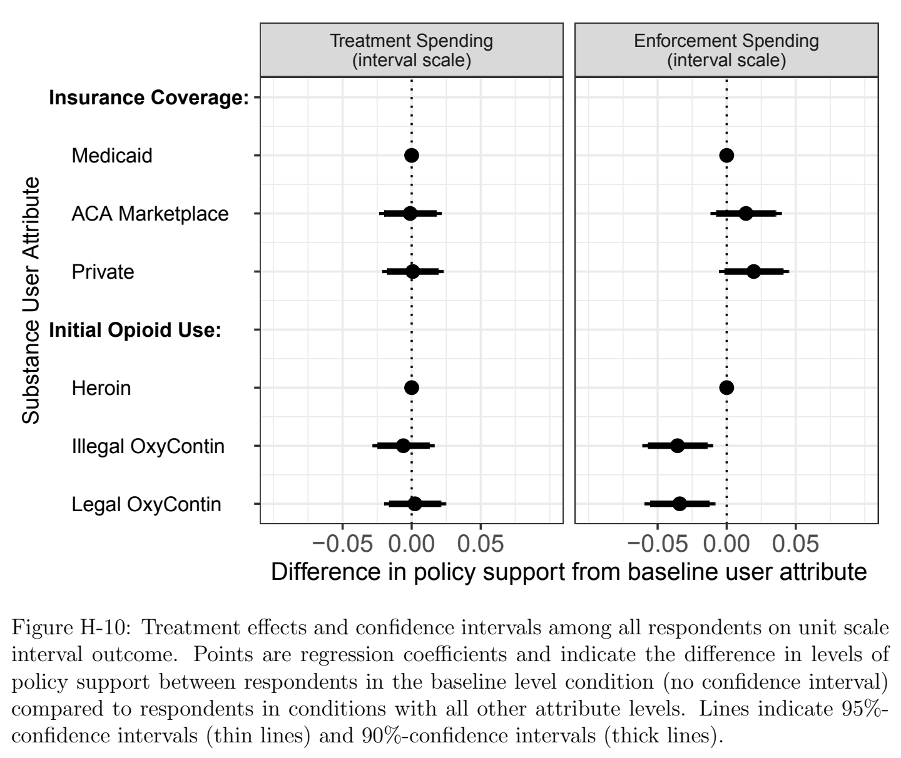

***Figure H-10.*** Treatment effects and confidence intervals among all respondents on unit scale interval outcome. Points are regression coefficients and indicate the difference in levels of policy support between respondents in the baseline level condition (no confidence interval) compared to respondents in conditions with all other attribute levels. Lines indicate 95%- confidence intervals (thin lines) and 90%-confidence intervals (thick lines).

## I Interaction Effects of Randomized Treatments

Condition Location: Condition Location: Condition Location: (Urban) (Suburban) (Rural) Race:

White

Black

Gender:

Man

Woman

−0.05 0.00 0.05 −0.05 0.00 0.05 −0.05 0.00 0.05 Difference in policy support from baseline user attribute

etubirttA

resU

ecnatsbuS

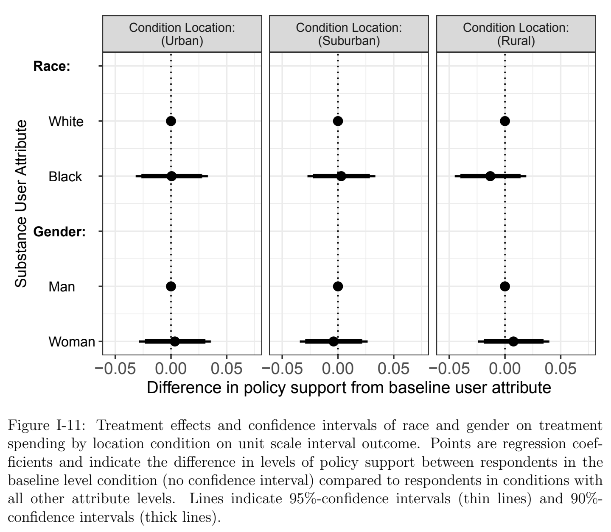

***Figure I-11.*** Treatment effects and confidence intervals of race and gender on treatment spending by location condition on unit scale interval outcome. Points are regression coef- ficients and indicate the difference in levels of policy support between respondents in the baseline level condition (no confidence interval) compared to respondents in conditions with all other attribute levels. Lines indicate 95%-confidence intervals (thin lines) and 90%- confidence intervals (thick lines).

Condition Location: Condition Location: Condition Location: (Urban) (Suburban) (Rural) Race:

White

Black

Gender:

Man

Woman

−0.05 0.00 0.05 −0.05 0.00 0.05 −0.05 0.00 0.05 Difference in policy support from baseline user attribute

etubirttA

resU

ecnatsbuS

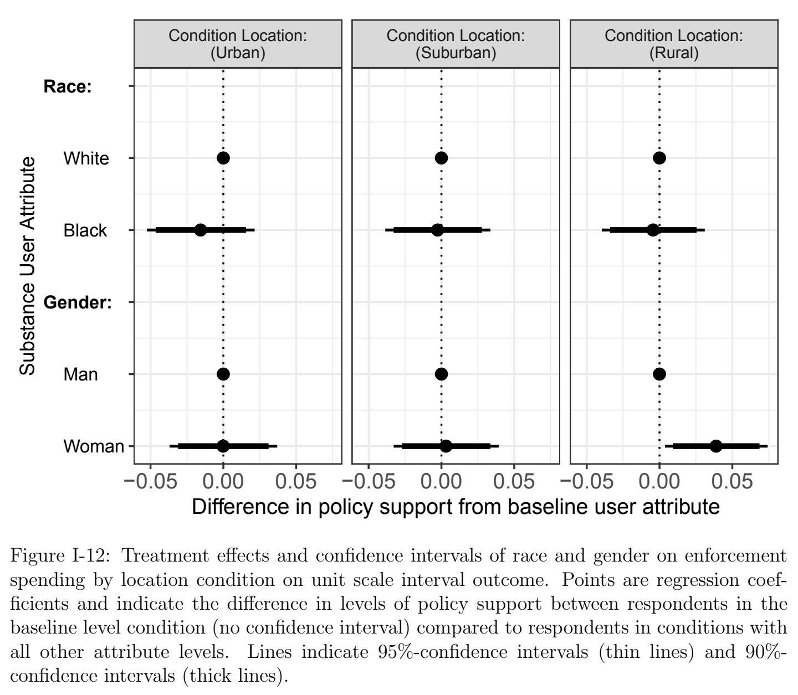

***Figure I-12.*** Treatment effects and confidence intervals of race and gender on enforcement spending by location condition on unit scale interval outcome. Points are regression coef- ficients and indicate the difference in levels of policy support between respondents in the baseline level condition (no confidence interval) compared to respondents in conditions with all other attribute levels. Lines indicate 95%-confidence intervals (thin lines) and 90%- confidence intervals (thick lines).

Condition Gender: Condition Gender:

(Man) (Woman)

Condition Race:

White

Black

−0.05 0.00 0.05 −0.05 0.00 0.05 Difference in policy support from baseline user attribute

etubirttA

resU

ecnatsbuS

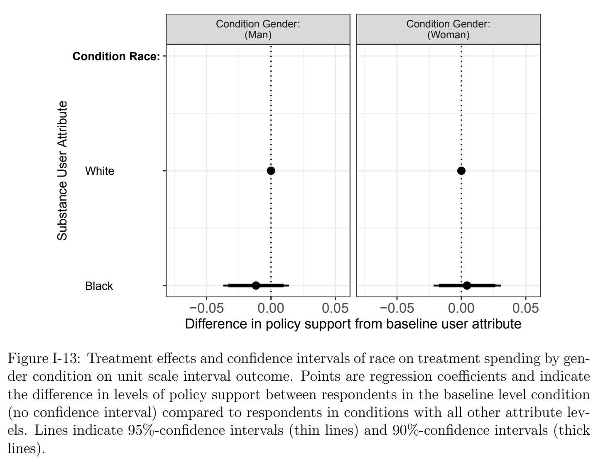

***Figure I-13.*** Treatment effects and confidence intervals of race on treatment spending by gen- der condition on unit scale interval outcome. Points are regression coefficients and indicate the difference in levels of policy support between respondents in the baseline level condition (no confidence interval) compared to respondents in conditions with all other attribute lev- els. Lines indicate 95%-confidence intervals (thin lines) and 90%-confidence intervals (thick lines).

Condition Gender: Condition Gender:

(Man) (Woman)

Condition Race:

White

Black

−0.05 0.00 0.05 −0.05 0.00 0.05 Difference in policy support from baseline user attribute

etubirttA

resU

ecnatsbuS

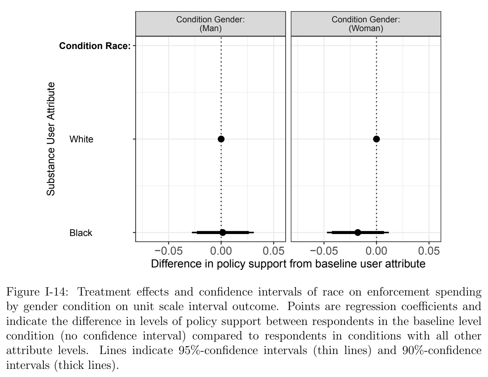

***Figure I-14.*** Treatment effects and confidence intervals of race on enforcement spending by gender condition on unit scale interval outcome. Points are regression coefficients and indicate the difference in levels of policy support between respondents in the baseline level condition (no confidence interval) compared to respondents in conditions with all other attribute levels. Lines indicate 95%-confidence intervals (thin lines) and 90%-confidence intervals (thick lines).

Condition Pathway: Condition Pathway: Condition Pathway: (Heroin) (Illegal Pills) (Prescription Pills) Race:

White

Black

Gender:

Man

Woman Location: Urban

Suburban

Rural

Insurance:

Medicaid

ACA Marketplace Private insurance

−0.05 0.00 0.05 −0.05 0.00 0.05 −0.05 0.00 0.05 Difference in policy support from baseline user attribute

etubirttA

resU

ecnatsbuS

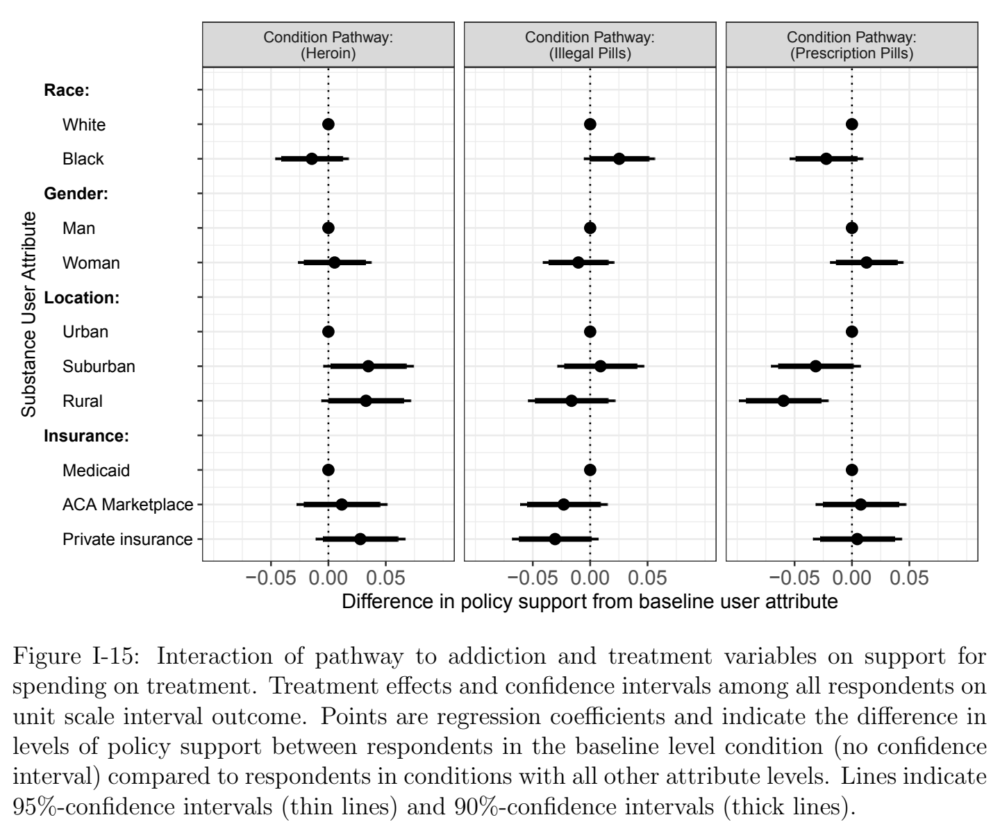

***Figure I-15.*** Interaction of pathway to addiction and treatment variables on support for spending on treatment. Treatment effects and confidence intervals among all respondents on unit scale interval outcome. Points are regression coefficients and indicate the difference in levels of policy support between respondents in the baseline level condition (no confidence interval) compared to respondents in conditions with all other attribute levels. Lines indicate 95%-confidence intervals (thin lines) and 90%-confidence intervals (thick lines).

Condition Pathway: Condition Pathway: Condition Pathway: (Heroin) (Illegal Pills) (Prescription Pills) Race:

White

Black

Gender:

Man

Woman Location: Urban

Suburban

Rural

Insurance:

Medicaid

ACA Marketplace Private insurance

−0.05 0.00 0.05 −0.05 0.00 0.05 −0.05 0.00 0.05 Difference in policy support from baseline user attribute

etubirttA

resU

ecnatsbuS

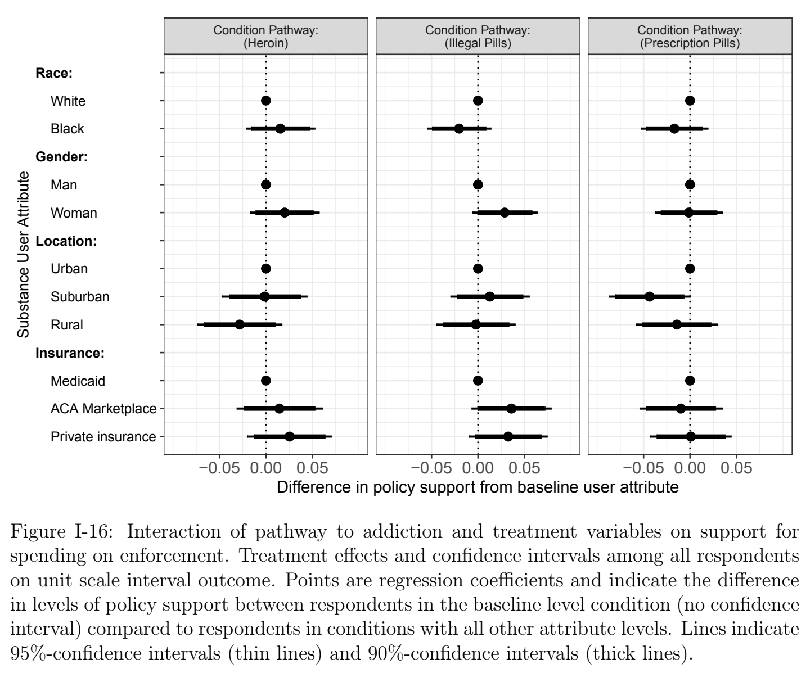

***Figure I-16.*** Interaction of pathway to addiction and treatment variables on support for spending on enforcement. Treatment effects and confidence intervals among all respondents on unit scale interval outcome. Points are regression coefficients and indicate the difference in levels of policy support between respondents in the baseline level condition (no confidence interval) compared to respondents in conditions with all other attribute levels. Lines indicate 95%-confidence intervals (thin lines) and 90%-confidence intervals (thick lines).

Condition Insurance: Condition Insurance: Condition Insurance: (Medicaid) (ACA Marketplace) (Private Insurance) Race:

White

Black

Gender:

Man

Woman Location: Urban

Suburban Rural

Pathway:

Heroin

Illegal pills

Prescription pills

−0.05 0.00 0.05 −0.05 0.00 0.05 −0.05 0.00 0.05 Difference in policy support from baseline user attribute

etubirttA

resU

ecnatsbuS

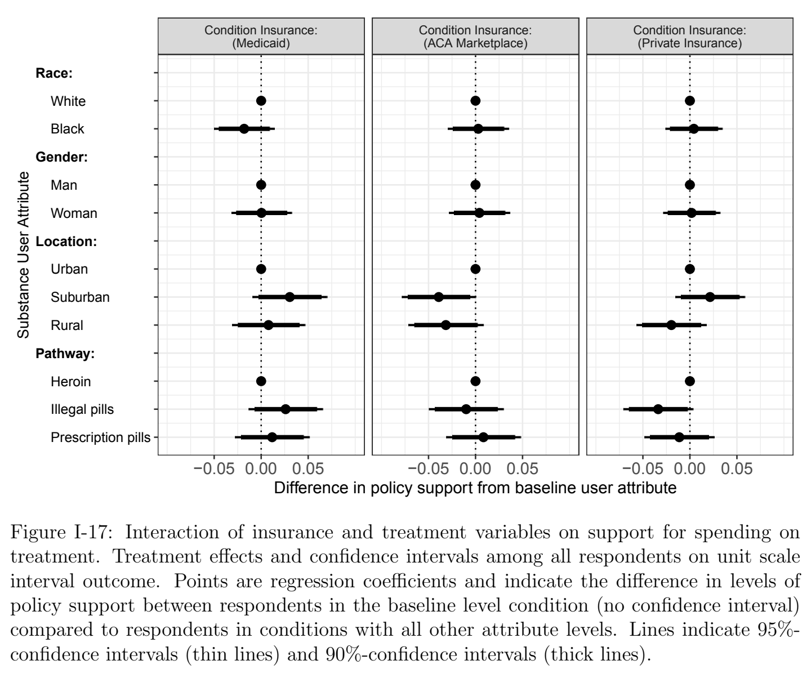

***Figure I-17.*** Interaction of insurance and treatment variables on support for spending on treatment. Treatment effects and confidence intervals among all respondents on unit scale interval outcome. Points are regression coefficients and indicate the difference in levels of policy support between respondents in the baseline level condition (no confidence interval) compared to respondents in conditions with all other attribute levels. Lines indicate 95%- confidence intervals (thin lines) and 90%-confidence intervals (thick lines).

Condition Insurance: Condition Insurance: Condition Insurance: (Medicaid) (ACA Marketplace) (Private Insurance) Race:

White

Black

Gender:

Man

Woman Location: Urban

Suburban Rural

Pathway:

Heroin

Illegal pills

Prescription pills

−0.05 0.00 0.05 −0.05 0.00 0.05 −0.05 0.00 0.05 Difference in policy support from baseline user attribute

etubirttA

resU

ecnatsbuS

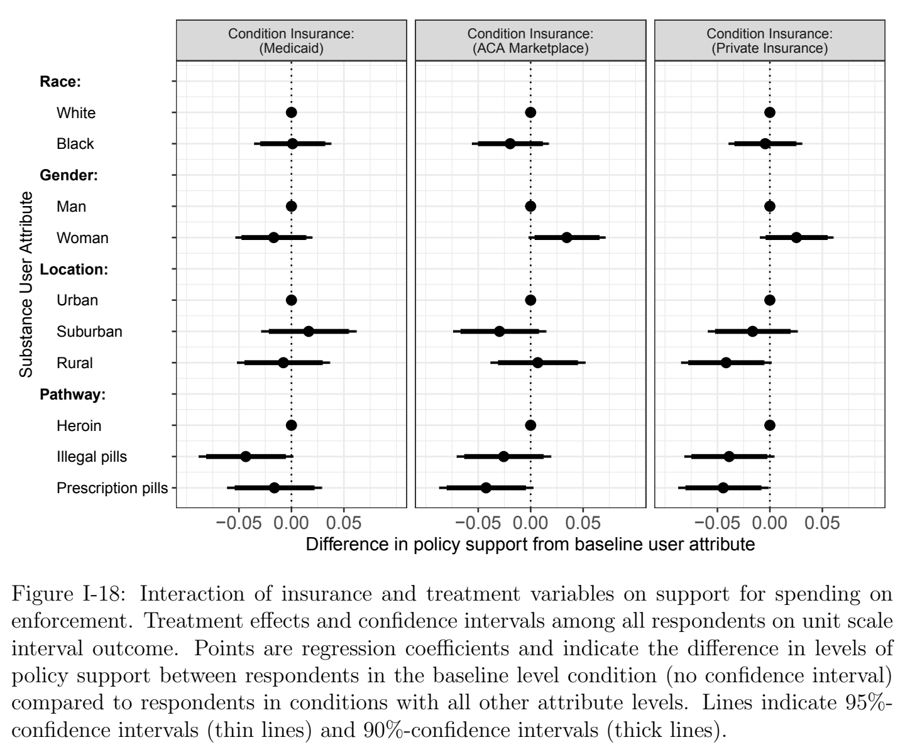

***Figure I-18.*** Interaction of insurance and treatment variables on support for spending on enforcement. Treatment effects and confidence intervals among all respondents on unit scale interval outcome. Points are regression coefficients and indicate the difference in levels of policy support between respondents in the baseline level condition (no confidence interval) compared to respondents in conditions with all other attribute levels. Lines indicate 95%- confidence intervals (thin lines) and 90%-confidence intervals (thick lines).

## J Heterogeneity in the Effects by Respondent Parti-

## sanship

Treatment Spending Enforcement Spending (interval scale) (interval scale)

Race:

White

Black

Gender:

Man

Woman

Residential location: Urban

Suburban

Rural

−0.05 0.00 0.05 −0.05 0.00 0.05 Difference in Outcome from Baseline User Attribute

etubirttA

resU

ecnatsbuS

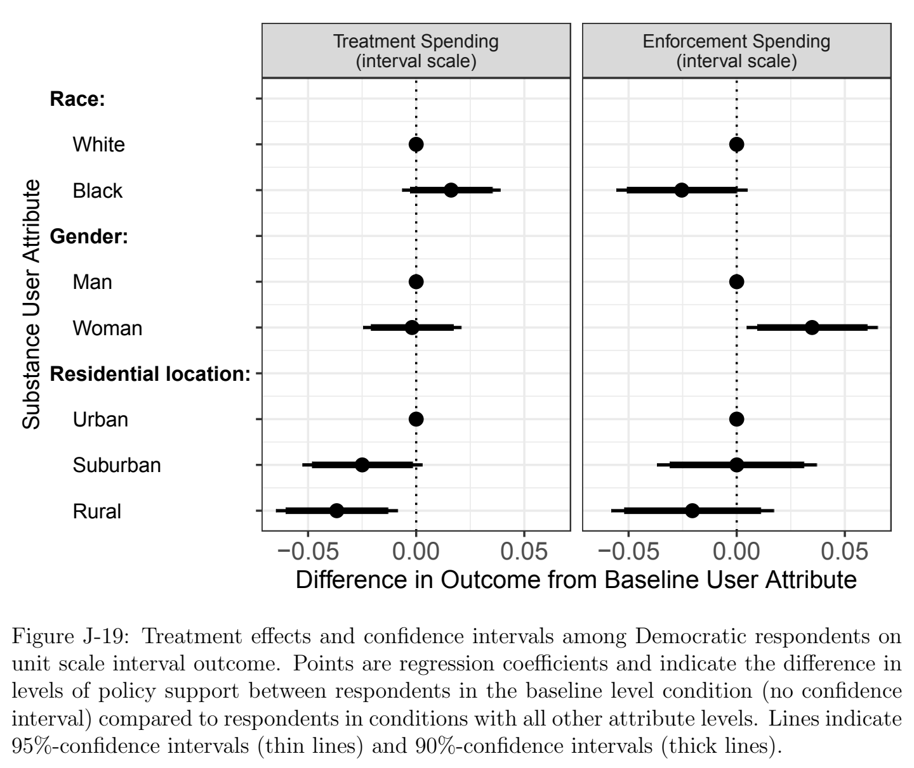

***Figure J-19.*** Treatment effects and confidence intervals among Democratic respondents on unit scale interval outcome. Points are regression coefficients and indicate the difference in levels of policy support between respondents in the baseline level condition (no confidence interval) compared to respondents in conditions with all other attribute levels. Lines indicate 95%-confidence intervals (thin lines) and 90%-confidence intervals (thick lines).

Treatment Spending Enforcement Spending (interval scale) (interval scale) Race:

White

Black

Gender:

Man

Woman

Residential location: Urban

Suburban

Rural

−0.05 0.00 0.05 −0.05 0.00 0.05 Difference in Outcome from Baseline User Attribute

etubirttA

resU

ecnatsbuS

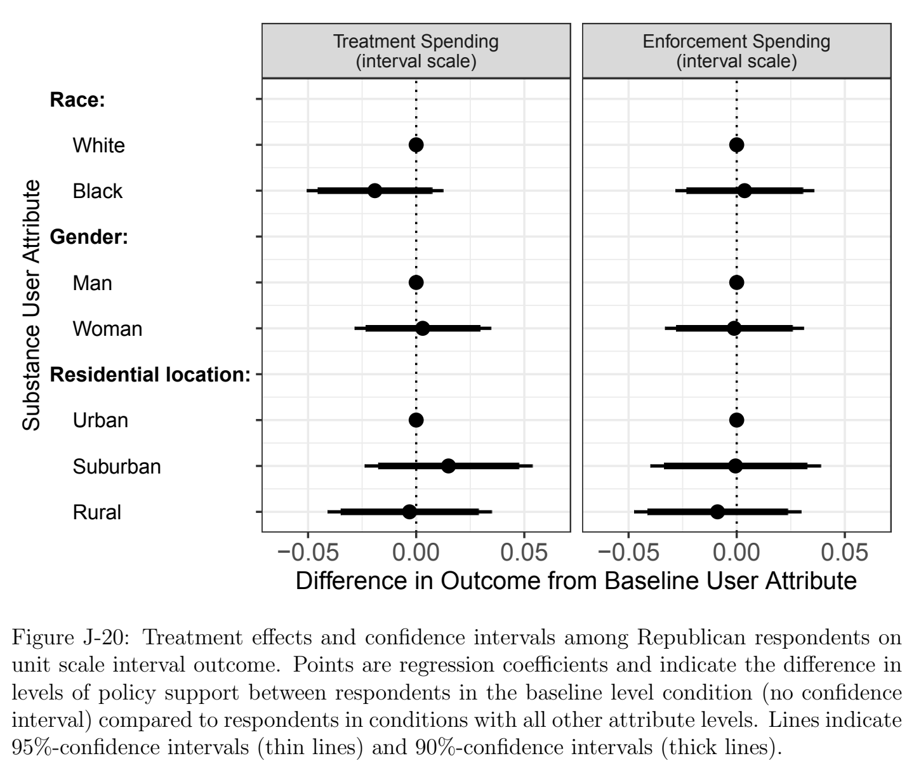

***Figure J-20.*** Treatment effects and confidence intervals among Republican respondents on unit scale interval outcome. Points are regression coefficients and indicate the difference in levels of policy support between respondents in the baseline level condition (no confidence interval) compared to respondents in conditions with all other attribute levels. Lines indicate 95%-confidence intervals (thin lines) and 90%-confidence intervals (thick lines).

## K Multiple Hypothesis Testing Corrections

To account for multiple hypothesis testing, we estimate a false discovery rate (FDR) — the rate that features called significant are truly null — for every hypothesis test in our analysis. The FDR has been shown to be uniformly more powerful that the traditional Bonferroni method (Storey and Tibshirani, 2003). In Table K-2, we report the original p-value and corrected q-value for each hypothesis test.

For example, Figure 6 shows that sharing a racial identity with the profiled substance user causes a respondent to increase their support for funding addiction treatment programs by 3 percentage points. The estimate’s p-value of < 0.01 indicates that there is a less than 1 percent chance of observing as great (or greater) test statistic under the assumption that the null hypothesis is correct. In a similar sense, the estimate’s q-value of 0.05 allows us to say that 5 percent of the test statistics that are as extreme as the “Race (matching) on treatment” hypothesis are false positives. This makes increases our confidence that the primacy of shared racial identity in the shaping opioid policy is not the result of multiple hypothesis testing.

Figure Spending DV Hypothesis P-Value Q-Value Figure 2 Treatment Race 0.72 0.98 Figure 2 Treatment Gender 0.78 1.00 Figure 2 Treatment Context (suburban) 0.71 0.97 Figure 2 Treatment Context (rural) 0.20 0.69 Figure 2 Enforcement Race 0.46 0.81 Figure 2 Enforcement Gender 0.19 0.68 Figure 2 Enforcement Context (suburban) 0.39 0.80 Figure 2 Enforcement Context (rural) 0.25 0.71 Figure 3 Treatment Race by respondent (Black) 0.11 0.55 Figure 3 Treatment Race by respondent (white) 0.06 0.51 Figure 3 Enforcement Race by respondent (Black) 0.03 0.48 Figure 3 Enforcement Race by respondent (white) 0.42 0.80 Figure 4 Treatment Gender by respondent (man) 0.71 0.97 Figure 4 Treatment Gender by respondent (woman) 0.43 0.80 Figure 4 Enforcement Gender by respondent (man) 0.77 1.00 Figure 4 Enforcement Gender by respondent (woman) 0.11 0.55 Figure 5 Treatment Context (sub. v. urban) by resp. (rural) 0.22 0.71 Figure 5 Treatment Context (rural v. urban) by resp. (rural) 0.92 1.00 Figure 5 Treatment Context (rural v. sub.) by resp. (rural) 0.22 0.71 Figure 5 Treatment Context (sub. v. urban) by resp. (sub.) 0.91 1.00 Figure 5 Treatment Context (rural v. urban) by resp. (sub.) 0.50 0.86 Figure 5 Treatment Context (rural v. sub.) by resp. (sub.) 0.57 0.88 Figure 5 Treatment Context (sub. v. urban) by resp. (urban) 0.86 1.00 Figure 5 Treatment Context (rural v. urban) by resp. (urban) 0.11 0.55 Figure 5 Treatment Context (rural v. sub.) by resp. (urban) 0.13 0.57 Figure 5 Enforcement Context (sub. v. urban) by resp. (rural) 0.93 1.00 Figure 5 Enforcement Context (rural v. urban) by resp. (rural) 0.76 1.00 Figure 5 Enforcement Context (rural v. sub.) by resp. (rural) 0.69 0.97 Figure 5 Enforcement Context (sub. v. urban) by resp. (sub.) 0.26 0.71 Figure 5 Enforcement Context (rural v. urban) by resp. (sub.) 0.25 0.71 Figure 5 Enforcement Context (rural v. sub.) by resp. (sub.) 0.99 1.00 Figure 5 Enforcement Context (sub. v. urban) by resp. (urban) 0.97 1.00 Figure 5 Enforcement Context (rural v. urban) by resp. (urban) 0.35 0.80 Figure 5 Enforcement Context (rural v. sub.) by resp. (urban) 0.34 0.80 Figure 6 Treatment Race (matching) 0.00 0.05 Figure 6 Treatment Gender (matching) 0.41 0.80 Figure 6 Treatment Context (matching) 0.66 0.96 Figure 6 Enforcement Race (matching) 0.15 0.61 Figure 6 Enforcement Gender (matching) 0.38 0.80 Figure 6 Enforcement Context (matching 0.97 1.00 Figure 7 Blame Illegal pills 0.00 0.08 Figure 7 Blame Legal pills 0.00 0.00 Figure 8 Treatment Race (matching) x Heroin 0.37 0.80

Figure 8 Treatment Gender (matching) x Heroin 0.65 0.96 Figure 8 Treatment Context (matching) x Heroin 0.92 1.00 Figure 8 Enforcement Race (matching) x Heroin 0.00 0.04 Figure 8 Enforcement Gender (matching) x Heroin 0.07 0.52 Figure 8 Enforcement Context (matching) x Heroin 0.48 0.83 Figure 8 Treatment Race (matching) x Legal pills 0.05 0.51 Figure 8 Treatment Gender (matching) x Legal pills 0.37 0.80 Figure 8 Treatment Context (matching) x Legal pills 0.27 0.71 Figure 8 Enforcement Race (matching) x Legal pills 0.87 1.00 Figure 8 Enforcement Gender (matching) x Legal pills 0.51 0.86 Figure 8 Enforcement Context (matching) x Legal pills 0.28 0.71 Figure G5 Treatment Race 0.40 0.80 Figure G5 Treatment Gender 0.65 0.96 Figure G5 Treatment Context (suburban) 0.90 1.00 Figure G5 Treatment Context (rural) 0.22 0.71 Figure G5 Enforcement Race 0.40 0.80 Figure G5 Enforcement Gender 0.25 0.71 Figure G5 Enforcement Context (suburban) 0.37 0.80 Figure G5 Enforcement Context (rural) 0.10 0.55 Figure G6 Treatment Race by respondent (Black) 0.08 0.54 Figure G6 Treatment Race by respondent (white) 0.04 0.51 Figure G6 Enforcement Race by respondent (Black) 0.03 0.45 Figure G6 Enforcement Race by respondent (white) 0.25 0.71 Figure G7 Treatment Gender by respondent (man) 0.84 1.00 Figure G7 Treatment Gender by respondent (woman) 0.38 0.80 Figure G7 Enforcement Gender by respondent (man) 0.37 0.80 Figure G7 Enforcement Gender by respondent (woman) 0.01 0.34 Figure G8 Treatment Context (sub. v. urban) by resp. (rural) 0.81 1.00 Figure G8 Treatment Context (rural v. urban) by resp. (rural) 0.96 1.00 Figure G8 Treatment Context (rural v. sub.) by resp. (rural) 0.84 1.00 Figure G8 Treatment Context (sub. v. urban) by resp. (sub.) 0.60 0.92 Figure G8 Treatment Context (rural v. urban) by resp. (sub.) 0.66 0.96 Figure G8 Treatment Context (rural v. sub.) by resp. (sub.) 0.34 0.80 Figure G8 Treatment Context (sub. v. urban) by resp. (urban) 0.20 0.69 Figure G8 Treatment Context (rural v. urban) by resp. (urban) 0.05 0.51 Figure G8 Treatment Context (rural v. sub.) by resp. (urban) 0.53 0.87 Figure G8 Enforcement Context (sub. v. urban) by resp. (rural) 0.69 0.97 Figure G8 Enforcement Context (rural v. urban) by resp. (rural) 0.71 0.97 Figure G8 Enforcement Context (rural v. sub.) by resp. (rural) 0.43 0.80 Figure G8 Enforcement Context (sub. v. urban) by resp. (sub.) 0.24 0.71 Figure G8 Enforcement Context (rural v. urban) by resp. (sub.) 0.05 0.51 Figure G8 Enforcement Context (rural v. sub.) by resp. (sub.) 0.43 0.80 Figure G8 Enforcement Context (sub. v. urban) by resp. (urban) 0.75 1.00 Figure G8 Enforcement Context (rural v. urban) by resp. (urban) 0.41 0.80

Figure G8 Enforcement Context (rural v. sub.) by resp. (urban) 0.25 0.71 Figure G9 Treatment Race (matching) 0.00 0.08 Figure G9 Treatment Gender (matching) 0.44 0.80 Figure G9 Treatment Context (matching) 0.13 0.57 Figure G9 Enforcement Race (matching) 0.48 0.83 Figure G9 Enforcement Gender (matching) 0.02 0.36 Figure G9 Enforcement Context (matching) 0.78 1.00 Figure H10 Treatment Insurance (ACA) 0.92 1.00 Figure H10 Treatment Insurance (Private) 0.95 1.00 Figure H10 Treatment Pathway (Illegal pills) 0.59 0.92 Figure H10 Treatment Pathway (Legal pills) 0.84 1.00 Figure H10 Enforcement Insurance (ACA) 0.29 0.71 Figure H10 Enforcement Insurance (Private) 0.13 0.57 Figure H10 Enforcement Pathway (Illegal pills) 0.01 0.22 Figure H10 Enforcement Pathway (Legal pills) 0.01 0.28 Figure I11 Treatment Race x Urban 0.97 1.00 Figure I11 Treatment Gender x Urban 0.83 1.00 Figure I11 Treatment Race x Suburban 0.85 1.00 Figure I11 Treatment Gender x Suburban 0.80 1.00 Figure I11 Treatment Race x Rural 0.42 0.80 Figure I11 Treatment Gender x Rural 0.64 0.96 Figure I12 Enforcement Race x Urban 0.41 0.80 Figure I12 Enforcement Gender x Urban 0.99 1.00 Figure I12 Enforcement Race x Suburban 0.89 1.00 Figure I12 Enforcement Gender x Suburban 0.86 1.00 Figure I12 Enforcement Race x Rural 0.81 1.00 Figure I12 Enforcement Gender x Rural 0.03 0.47 Figure I13 Treatment Race x Man 0.37 0.80 Figure I13 Treatment Race x Woman 0.74 0.99 Figure I14 Enforcement Race x Man 0.92 1.00 Figure I14 Enforcement Race x Woman 0.23 0.71 Figure I15 Treatment Race x Heroin 0.37 0.80 Figure I15 Treatment Gender x Heroin 0.74 0.99 Figure I15 Treatment Context (suburban) x Heroin 0.08 0.54 Figure I15 Treatment Context (rural) x Heroin 0.10 0.55 Figure I15 Treatment Insurance (ACA) x Heroin 0.56 0.88 Figure I15 Treatment Insurance (private) x Heroin 0.16 0.63 Figure I15 Treatment Race x Illegal pills 0.11 0.55 Figure I15 Treatment Gender x Illegal pills 0.51 0.86 Figure I15 Treatment Context (suburban) x Illegal pills 0.64 0.96 Figure I15 Treatment Context (rural) x Illegal pills 0.40 0.80 Figure I15 Treatment Insurance (ACA) x Illegal pills 0.23 0.71 Figure I15 Treatment Insurance (private) x Illegal pills 0.11 0.55 Figure I15 Treatment Race x Legal pills 0.17 0.64

Figure I15 Treatment Gender x Legal pills 0.43 0.80 Figure I15 Treatment Context (suburban) x Legal pills 0.11 0.55 Figure I15 Treatment Context (rural) x Legal pills 0.00 0.11 Figure I15 Treatment Insurance (ACA) x Legal pills 0.70 0.97 Figure I15 Treatment Insurance (private) x Legal pills 0.81 1.00 Figure I16 Enforcement Race x Heroin 0.41 0.80 Figure I16 Enforcement Gender x Heroin 0.29 0.71 Figure I16 Enforcement Context (suburban) x Heroin 0.95 1.00 Figure I16 Enforcement Context (rural) x Heroin 0.22 0.71 Figure I16 Enforcement Insurance (ACA) x Heroin 0.54 0.87 Figure I16 Enforcement Insurance (private) x Heroin 0.27 0.71 Figure I16 Enforcement Race x Illegal pills 0.25 0.71 Figure I16 Enforcement Gender x Illegal pills 0.11 0.55 Figure I16 Enforcement Context (suburban) x Illegal pills 0.56 0.88 Figure I16 Enforcement Context (rural) x Illegal pills 0.92 1.00 Figure I16 Enforcement Insurance (ACA) x Illegal pills 0.10 0.55 Figure I16 Enforcement Insurance (private) x Illegal pills 0.13 0.57 Figure I16 Enforcement Race x Legal pills 0.36 0.80 Figure I16 Enforcement Gender x Legal pills 0.94 1.00 Figure I16 Enforcement Context (suburban) x Legal pills 0.05 0.51 Figure I16 Enforcement Context (rural) x Legal pills 0.53 0.87 Figure I16 Enforcement Insurance (ACA) x Legal pills 0.66 0.96 Figure I16 Enforcement Insurance (private) x Legal pills 0.97 1.00 Figure I17 Treatment Race x Medicaid 0.27 0.71 Figure I17 Treatment Gender x Medicaid 0.98 1.00 Figure I17 Treatment Context (suburban) x Medicaid 0.13 0.57 Figure I17 Treatment Context (rural) x Medicaid 0.69 0.97 Figure I17 Treatment Pathway (illegal pills) x Medicaid 0.20 0.69 Figure I17 Treatment Pathway (legal pills) x Medicaid 0.56 0.88 Figure I17 Treatment Race x ACA 0.86 1.00 Figure I17 Treatment Gender x ACA 0.80 1.00 Figure I17 Treatment Context (suburban) x ACA 0.05 0.51 Figure I17 Treatment Context (rural) x ACA 0.12 0.57 Figure I17 Treatment Pathway (illegal pills) x ACA 0.62 0.94 Figure I17 Treatment Pathway (legal pills) x ACA 0.68 0.97 Figure I17 Treatment Race x Private 0.78 1.00 Figure I17 Treatment Gender x Private 0.91 1.00 Figure I17 Treatment Context (suburban) x Private 0.26 0.71 Figure I17 Treatment Context (rural) x Private 0.30 0.71 Figure I17 Treatment Pathway (illegal pills) x Private 0.07 0.54 Figure I17 Treatment Pathway (legal pills) x Private 0.55 0.88 Figure I18 Enforcement Race x Medicaid 0.95 1.00 Figure I18 Enforcement Gender x Medicaid 0.36 0.80 Figure I18 Enforcement Context (suburban) x Medicaid 0.48 0.83

Figure I18 Enforcement Context (rural) x Medicaid 0.73 0.99 Figure I18 Enforcement Pathway (illegal pills) x Medicaid 0.06 0.51 Figure I18 Enforcement Pathway (legal pills) x Medicaid 0.48 0.83 Figure I18 Enforcement Race x ACA 0.29 0.71 Figure I18 Enforcement Gender x ACA 0.06 0.52 Figure I18 Enforcement Context (suburban) x ACA 0.19 0.68 Figure I18 Enforcement Context (rural) x ACA 0.77 1.00 Figure I18 Enforcement Pathway (illegal pills) x ACA 0.26 0.71 Figure I18 Enforcement Pathway (legal pills) x ACA 0.06 0.52 Figure I18 Enforcement Race x Private 0.80 1.00 Figure I18 Enforcement Gender x Private 0.15 0.62 Figure I18 Enforcement Context (suburban) x Private 0.45 0.80 Figure I18 Enforcement Context (rural) x Private 0.06 0.51 Figure I18 Enforcement Pathway (illegal pills) x Private 0.08 0.54 Figure I18 Enforcement Pathway (legal pills) x Private 0.04 0.51 Figure J19 Treatment Race, Democrats 0.16 0.63 Figure J19 Treatment Gender, Democrats 0.87 1.00 Figure J19 Treatment Context (suburban), Democrats 0.08 0.54 Figure J19 Treatment Context (rural), Democrats 0.01 0.29 Figure J19 Enforcement Race, Democrats 0.10 0.55 Figure J19 Enforcement Gender, Democrats 0.02 0.45 Figure J19 Enforcement Context (suburban), Democrats 1.00 1.00 Figure J19 Enforcement Context (rural), Democrats 0.28 0.71 Figure J20 Treatment Race, Republicans 0.23 0.71 Figure J20 Treatment Gender, Republicans 0.85 1.00 Figure J20 Treatment Context (suburban), Republicans 0.45 0.80 Figure J20 Treatment Context (rural), Republicans 0.87 1.00 Figure J20 Enforcement Race, Republicans 0.82 1.00 Figure J20 Enforcement Gender, Republicans 0.94 1.00 Figure J20 Enforcement Context (suburban), Republicans 0.98 1.00 Figure J20 Enforcement Context (rural), Republicans 0.65 0.96 Figure L21 Treatment ACME (white) 0.40 0.80 Figure L21 Treatment ACME (Black) 0.35 0.80 Figure L21 Enforcement ACME (white) 0.42 0.80 Figure L21 Enforcement ACME (Black) 0.40 0.80 Figure L22 Treatment ACME (woman) 0.92 1.00 Figure L22 Treatment ACME (man) 0.89 1.00 Figure L22 Enforcement ACME (woman) 0.97 1.00 Figure L22 Enforcement ACME (man) 0.88 1.00 Figure M23 Treatment Race (matching), exposure 0.02 0.36 Figure M23 Treatment Race (matching), no exposure 0.03 0.46 Figure M23 Treatment Gender (matching), exposure 0.70 0.97 Figure M23 Treatment Gender (matching), no exposure 0.39 0.80 Figure M23 Treatment Context (matching), exposure 0.83 1.00

Figure M23 Treatment Context (matching), no exposure 0.58 0.90 Figure M23 Enforcement Race (matching), exposure 0.83 1.00 Figure M23 Enforcement Race (matching), no exposure 0.04 0.51 Figure M23 Enforcement Gender (matching), exposure 0.83 1.00 Figure M23 Enforcement Gender (matching), no exposure 0.08 0.54 Figure M23 Enforcement Context (matching), exposure 0.45 0.80 Figure M23 Enforcement Context (matching), no exposure 0.29 0.71 Figure M24 Treatment Race, exposure 1.00 1.00 Figure M24 Treatment Race, no exposure 0.53 0.87 Figure M24 Treatment Race by respondent (Black), exposure 0.07 0.54 Figure M24 Treatment Race by respondent (Black), no exposure 0.84 1.00 Figure M24 Treatment Race by respondent (white), exposure 0.25 0.71 Figure M24 Treatment Race by respondent (white), no exposure 0.11 0.55 Figure M24 Enforcement Race, exposure 0.20 0.69 Figure M24 Enforcement Race, no exposure 0.70 0.97 Figure M24 Enforcement Race by respondent (Black), exposure 0.26 0.71 Figure M24 Enforcement Race by respondent (Black), no exposure 0.06 0.52 Figure M24 Enforcement Race by respondent (white), exposure 0.14 0.59 Figure M24 Enforcement Race by respondent (white), no exposure 0.50 0.86 Figure M25 Treatment Gender, exposure 0.62 0.94 Figure M25 Treatment Gender, no exposure 0.53 0.87 Figure M25 Treatment Gender by respondent (man), exposure 0.56 0.88 Figure M25 Treatment Gender by respondent (man), no exposure 0.87 1.00 Figure M25 Treatment Gender by respondent (woman), exposure 0.89 1.00 Figure M25 Treatment Gender by respondent (woman), no exposure 0.29 0.71 Figure M25 Enforcement Gender, exposure 0.09 0.55 Figure M25 Enforcement Gender, no exposure 0.94 1.00 Figure M25 Enforcement Gender by respondent (man), exposure 0.18 0.68 Figure M25 Enforcement Gender by respondent (man), no exposure 0.18 0.68 Figure M25 Enforcement Gender by respondent (woman), exposure 0.29 0.71 Figure M25 Enforcement Gender by respondent (woman), no exposure 0.15 0.61

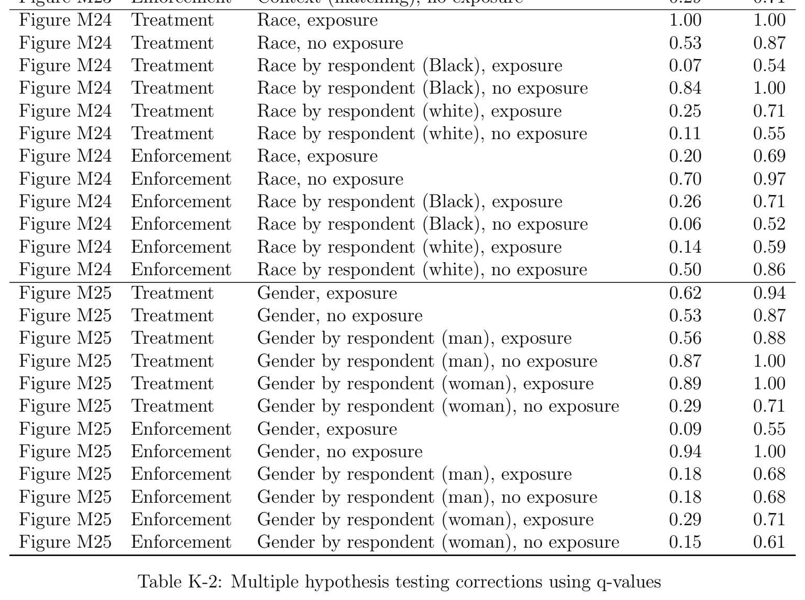

***Table K-2.*** Multiple hypothesis testing corrections using q-values

[Download data as CSV](tables/tab-02.csv)

## L Mediation Analyses

In this section, we conduct mediation analyses (Imai et al., 2011) to assess the causal mediation of our experimental effects by respondents’ perceptions of substance users’ blame for their situations. the figures below present the average direct effects (ADEs) of our experimental manipulations, the average causal mediation effects (ACMEs) of perceived blame, and the total (combined) effects. As indicated by the null ACMEs across our different identity manipulations and respondent subgroups, perceptions of blame did not play a causally mediating role in our observed treatment effects.

Treatment Treatment

White Respondents Black Respondents

ACME ACME

ADE ADE

Total Total

Effect Effect

−0.05 −0.03 −0.01 0.00 0.05 0.10 Enforcement Enforcement

White Respondents Black Respondents ACME ACME

ADE ADE

Total Total

Effect Effect

−0.04 −0.02 0.00 −0.15 −0.10 −0.05 0.00

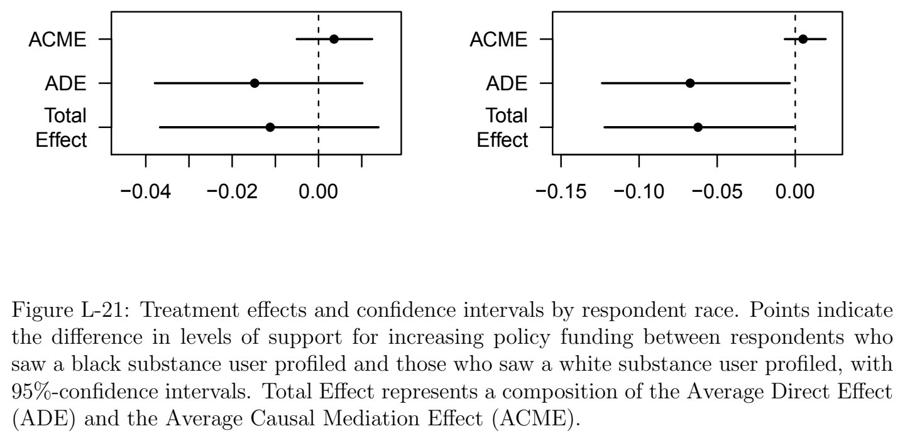

***Figure L-21.*** Treatment effects and confidence intervals by respondent race. Points indicate the difference in levels of support for increasing policy funding between respondents who saw a black substance user profiled and those who saw a white substance user profiled, with 95%-confidence intervals. Total Effect represents a composition of the Average Direct Effect (ADE) and the Average Causal Mediation Effect (ACME).

Treatment Treatment

Female Respondents Male Respondents ACME ACME

ADE ADE

Total Total

Effect Effect

−0.04 −0.02 0.00 0.02 −0.02 0.00 0.02 0.04 Enforcement Enforcement

Female Respondents Male Respondents ACME ACME

ADE ADE

Total Total

Effect Effect

−0.06 −0.04 −0.02 0.00 −0.04 −0.02 0.00 0.02

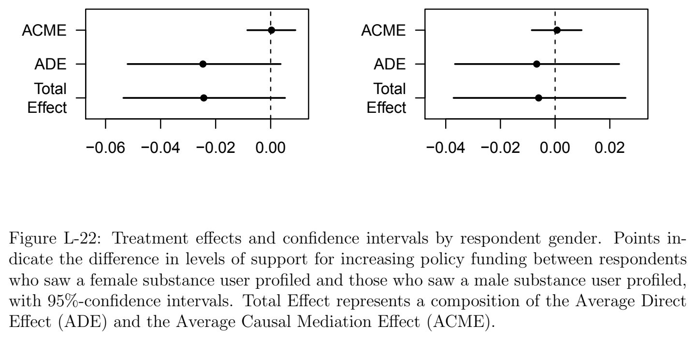

***Figure L-22.*** Treatment effects and confidence intervals by respondent gender. Points in- dicate the difference in levels of support for increasing policy funding between respondents who saw a female substance user profiled and those who saw a male substance user profiled, with 95%-confidence intervals. Total Effect represents a composition of the Average Direct Effect (ADE) and the Average Causal Mediation Effect (ACME).

## M Heterogeneity in the Effects of Group Identity by

## Personal Exposure

Treatment Spending Enforcement Spending (interval scale) (interval scale)

Race

Gender

Residential

Context

-0.04 0.00 0.04 -0.04 0.00 0.04

### Treatment effect of recipient attribute

### on outcome (identity matching - non-matching)

noitalupinaM

Know Someone

Don't Know Someone

w/ Addiction

w/ Addiction

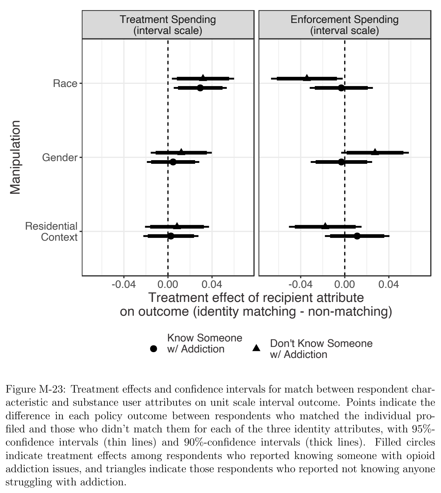

***Figure M-23.*** Treatment effects and confidence intervals for match between respondent char- acteristic and substance user attributes on unit scale interval outcome. Points indicate the difference in each policy outcome between respondents who matched the individual pro- filed and those who didn’t match them for each of the three identity attributes, with 95%- confidence intervals (thin lines) and 90%-confidence intervals (thick lines). Filled circles indicate treatment effects among respondents who reported knowing someone with opioid addiction issues, and triangles indicate those respondents who reported not knowing anyone struggling with addiction.

Treatment Spending Enforcement Spending (interval scale) (interval scale) Full

Sample

Black

Respondents

White

Respondents

-0.2 -0.1 0.0 0.1 0.2 -0.2 -0.1 0.0 0.1 0.2 Treatment effect of recipient race

on spending support (black-white)

Don't Know Someone Know Someone

w/ Addiction w/ Addiction

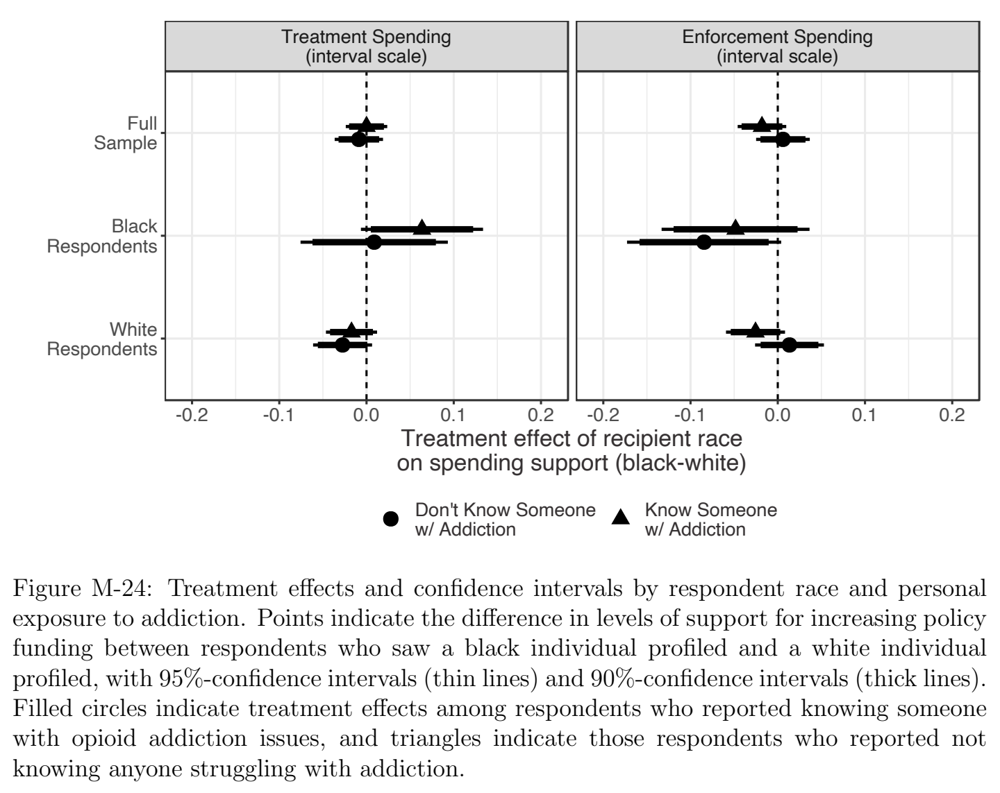

***Figure M-24.*** Treatment effects and confidence intervals by respondent race and personal exposure to addiction. Points indicate the difference in levels of support for increasing policy funding between respondents who saw a black individual profiled and a white individual profiled, with 95%-confidence intervals (thin lines) and 90%-confidence intervals (thick lines). Filled circles indicate treatment effects among respondents who reported knowing someone with opioid addiction issues, and triangles indicate those respondents who reported not knowing anyone struggling with addiction.

Treatment Spending Enforcement Spending (interval scale) (interval scale) Full

Sample

Men

Respondents

Women

Respondents

-0.2 -0.1 0.0 0.1 0.2 -0.2 -0.1 0.0 0.1 0.2 Treatment effect of recipient gender

on spending support (male - female)

Don't Know Someone Know Someone

w/ Addiction w/ Addiction

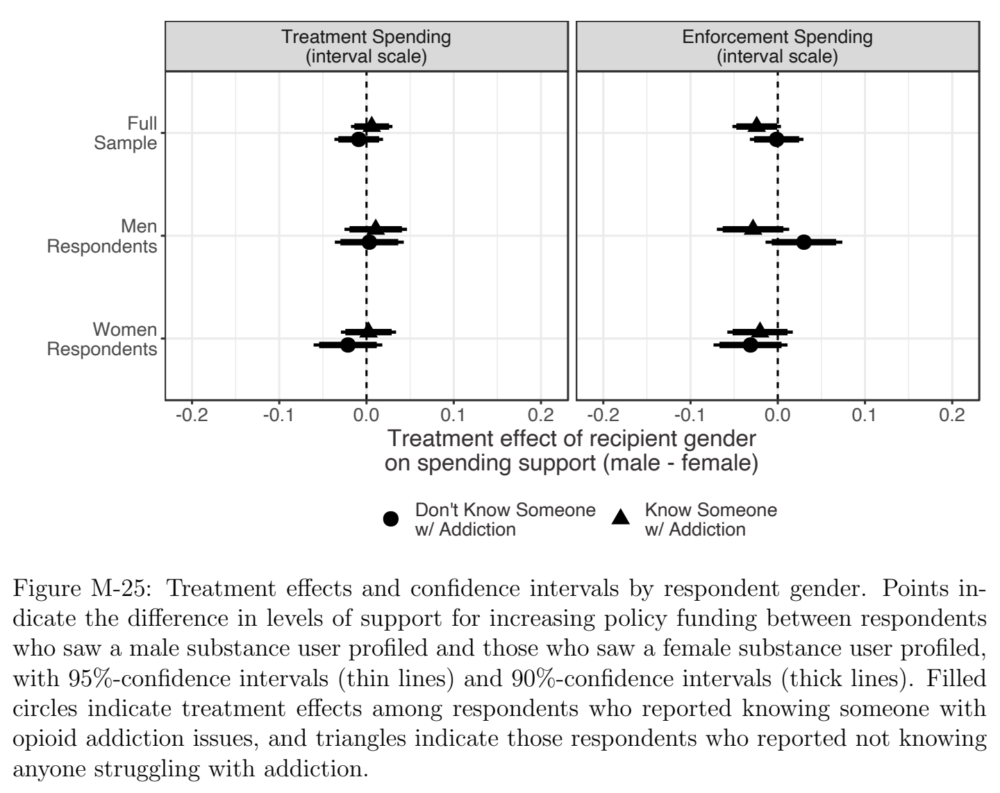

***Figure M-25.*** Treatment effects and confidence intervals by respondent gender. Points in- dicate the difference in levels of support for increasing policy funding between respondents who saw a male substance user profiled and those who saw a female substance user profiled, with 95%-confidence intervals (thin lines) and 90%-confidence intervals (thick lines). Filled circles indicate treatment effects among respondents who reported knowing someone with opioid addiction issues, and triangles indicate those respondents who reported not knowing anyone struggling with addiction.

## N Pre-Analysis Plan

Included below are the hypotheses we test as well as our analytical strategy for testing each hypothesis as pre-registered with EGAP. We note that the hypothesis numbers as noted in the manuscript do not necessarily correspond with the ordering of those hypotheses that we report in this manuscript, which we have adjusted for conceptual clarity. Elements of the pre-analysis plan (the study’s theory, experimental design, and survey instrument) that are discussed or included elsewhere in the manuscript are not reproduced below but are included in the PAP filed with EGAP. As noted in the manuscript, our experimental design also included two manipulations unrelated to group identity: how the substance user received treatment for their addiction and how the substance user began using opioids. Results from these manipulations are discussed in other work outside of this paper, and as such we do not display these hypotheses or analytic strategies below.

## Hypotheses

### Shared Identity

We expect that group identity may sway perceptions of deservingness and subsequent policy support. This leads to:

Hypothesis 1 (H1): We expect that the race, gender, and location in a rural or non-rural location of policy beneficiaries depicted in a media story will affect support for treatment and punitive policies, operationalized as support for increasing funding for opioid treatment policy and punitive policy. Specifically, for the full sample, we expect a decrease in support for funding after reading about a black policy beneficiary compared to a white policy beneficiary. Hypothesis 2 (H2): We expect that respondents will be more sympathetic to policy beneficiaries who share identities with the respondent – e.g., black respondents will be more sympathetic to black policy beneficiaries depicted in the media, while white respondents will be more sympathetic to white policy beneficiaries. Viewing a profile with a shared identity will increase respondent support for funding treatment policy.

Policy responses to drug use have traditionally been characterized as emphasizing addiction treatment or punishment (Meier, 1994). To capture both dimensions, we also ask whether respondents support funding for law enforcement to arrest and prosecute drug users. Yet, while drug policy is multi-dimensional, the longitudinal shift away from punishing drug use towards connecting users with treatment suggests these policy attitudes are inversely correlated. This leads to:

Hypothesis 3 (H3): We expect that any experimental treatment which increases respondent support for funding treatment policy will also decrease respondent support for funding law enforcement to arrest and prosecute drug users.

The mechanism behind support for both treatment and punishment is the perceived ‘deservingness’ of the substance users. Capturing the change in sympathy is our outcome variable of blame. A shared identity will decrease agreement with the belief that individuals are to blame for their own addiction. This leads to:

Hypothesis 4 (H4): We expect the ‘blame’ outcome variable to negatively correlate with support for funding treatment policy and positively correlate with support for funding punitive policy.

### Personal Exposure

Hypothesis 5 (H5): We expect that respondents who have personally known someone who has struggled with addiction will express greater support for addiction treatment funding.

## Analytical Strategy

### Shared Identity

The following approaches will be used to test each hypothesis:

H1: Two-tailed t-tests of difference in means of treatment funding support between each vignette treatment group (e.g., ‘rural’) vs. all the others in that category (e.g., ‘suburban’ and ‘urban’), using one treatment group in each category as the baseline category.

H2: Two-tailed t-tests of support for treatment funding on each identity treatment within respondent subgroups detailed below. Second, interact identity treatment effect with an indicator for the respondent’s identity subgroup. Third, measure effect of shared identity via omnibus model using new indicator for a shared identity between each respondent to the identity treatment they received.

• For the effect of the race experimental manipulation, subgroups by survey respondent race/ethnicity (black vs. non-Hispanic white).

• For the effect of the gender experimental manipulation, subgroups by respondent gender (male vs. female).

• For the effect of the location experimental manipulation, subgroups by respondent location (rural vs. non-rural, as well as three subgroups matching the manipulated levels of rural, urban, and suburban).

H3: Conduct tests for H1 and H2 using punitive outcome. Repeat additional tests below using punitive outcome.

H4: Conduct tests for H1 and H2 using blame outcome. Repeat additional tests below using blame outcome.

### Personal Exposure

H5: Two-tailed t-tests for the difference in means of treatment funding support between respondents based on personal exposure to those with opioid addiction.

## References

AmeriSpeak Panel Technical Overview. 2016.

Berinsky, Adam J, Gregory A Huber, and Gabriel S Lenz. 2012. “Evaluating Online Labor Markets for Experimental Research: Amazon.com’s Mechanical Turk.” Political Analysis 20(3): 351–368.

Cramer, Katherine J. 2016. The Politics of Resentment: Rural Consciousness in Wisconsin and the Rise of Scott Walker. Chicago: University of Chicago Press.

Gaddis, S Michael. 2017. “How Black are Lakisha and Jamal? Racial Perceptions from Names Used in Correspondence Audit Studies.” Sociological Science 4: 469–489.

Imai, Kosuke, Luke Keele, Dustin Tingley, and Teppei Yamamoto. 2011. “Unpacking the Black Box of Causality: Learning About Causal Mechanisms from Experimental and Observational Studies.” American Political Science Review 105(4): 765–789.

Kane, John V, and Jason Barabas. 2019. “No Harm in Checking: Using Factual Manipulation Checks to Assess Attentiveness in Experiments.” American Journal of Political Science 63(1): 234–249.

Levay, Kevin E, Jeremy Freese, and James N Druckman. 2016. “The Demographic and Political Composition of Mechanical Turk Samples.” Sage Open 6(1): 1–17.

Meier, Kenneth J. 1994. The Politics of Sin: Drugs, Alcohol and Public Policy. Armonk, NY: M.E. Sharpe.

Storey, John D, and Robert Tibshirani. 2003. “Statistical Significance for Genomewide Studies.” Proceedings of the National Academy of Sciences 100(16): 9440–9445.