# The Policy Adjacent: How Affordable Housing Generates Policy Feedback Among Neighboring Residents

Michael Hankinson∗ Asya Magazinnik† Melissa Sands‡

January 1, 2026

Forthcoming at the American Journal of Political Science

Abstract

While scholars have documented feedback effects among a policy’s direct winners and losers, less is known about whether such effects can occur among the indirectly affected — “the policy adjacent.” Using 458 geocoded housing developments built between two nearly identical statewide ballot propositions funding affordable housing in California, we show that policy generates feedback effects among neighboring residents in systematic ways. New, nearby affordable housing causes majority-homeowner blocks to increase their support for the housing bond, while majority-renter blocks decrease or do not change their support. We attribute the positive effect among majority-homeowner blocks to the housing’s replacement of blight. In contrast, the lack of a positive effect among majority-renter blocks may be driven by the threat of gentrification.

Policy implementation can win support for expansion among unexpected beneficiaries, while

failing to do so even among the policy’s presumed allies.

Verification Materials:

The data and materials required to verify the computational reproducibility of the results, procedures and analyses in this article are available on the American Journal of Political Science Dataverse within the Harvard Dataverse Network, at: https://doi.org/10.7910/DVN/YRTJOP.

Word Count: 9,763 words (excluding references)

Keywords: policy feedback, local political economy, housing, context effects.

All authors contributed equally. We appreciate the research assistance of Sara Bornstein and Nicole Wilson as well as voter file data provided by Ryan Enos and Marc Meredith. The manuscript also benefited from generous feedback from Andrea Campbell, Daniel de Kadt, Matthew Kim, Jackelyn Hwang, Bob Stoker, and workshops at Columbia University and George Washington University, the Political Science Departmental Research Seminar at University College London, the American Politics Workshop at the University of Wisconsin, the Political Behaviour seminar at the London School of Economics, the Spatial Dimension of Economic and Political Inequality Workshop at Princeton University, the Politics of Housing Workshop at Aarhus University, and the NYU Furman Center Speaker Series. Transaction data was provided by CoreLogic.

∗Assistant Professor, Department of Political Science, GWU. hankinson@gwu.edu

†Professor of Social Data Science, Hertie School. a.magazinnik@hertie-school.org

‡Assistant Professor of Politics and Data Science, LSE. m.sands@lse.ac.uk

Public policies create winners and losers. This can generate policy feedback loops: the economic and social impacts of a policy may shape the political behavior of those who experience its costs or benefits, reinforcing or undermining its political fortunes (Pierson 1993; Soss and Schram 2007). Yet the policy ecosystem is composed of not just direct beneficiaries, but also those whose circumstances are shaped by externalities. Even policies with very specific and localized beneficiaries can generate broader social and economic ripple effects through, for example, shared markets. We show how such externalities can create policy feedback loops among those only indirectly affected.

We consider the case of the Low-Income Housing Tax Credit (LIHTC, pronounced “lie-tech”), which has accounted for the construction or rehabilitation of over 3.6 million affordable housing units nationwide between 1987 and 2021. We show that voters change their political behavior in systematic ways when new LIHTC developments are built in their neighborhoods. California provides a unique laboratory for this study. Nearly identical bond measures appeared on the state’s ballots in November 2002 and November 2006, each allocating over $2 billion for affordable housing. Using geolocated data on 458 LIHTC developments built between these two elections, we find that the construction of nearby affordable housing causes support for funding affordable housing to increase by 2 to 2.5 percentage points in Census blocks that comprise mostly homeowners. Meanwhile, blocks that comprise mostly renters do not show the same increase, and may even decrease their support for funding more affordable housing.

Given that voters respond to changes in local housing markets (Larsen et al. 2019), we argue that these dissimilar effects between homeowners and renters are driven by two conditions.1 First, LIHTC developments often replace blight, such as empty lots, dilapidated structures, or vacant buildings. Second, LIHTC tends to be sited in disadvantaged areas, which stand to benefit the most from vacant lot redevelopment and neighborhood revitalization. As a result, there is a wellestablished positive impact of LIHTC developments on property values in distressed neighborhoods (Dillman, Horn, and Verrilli 2017; Voith et al. 2022). At least 10 published articles have studied the impact of LIHTC developments on local property values. Together they demonstrate unequivocally that LIHTC increases property values in distressed neighborhoods in the development’s immediate vicinity.2

1Throughout the text, we use the terms “homeowners” and “renters” as shorthand for “majority-homeowner blocks” and “majority-renter blocks”, respectively.

2See Dillman, Horn, and Verrilli (2017) for a review.

We argue that both the visible changes in the character of a neighborhood due to LIHTC and the resulting increase in property values drive the positive feedback effects among homeowners. Homeowners, especially those residing in lower income neighborhoods, generally stand to benefit from both of these forces and ultimately increase their support for affordable housing policy, even if they are unlikely to be its direct beneficiaries. As evidence of this mechanism, we show that homeowners living in areas where LIHTC development increased property values showed greater policy feedback effects compared to areas where LIHTC caused property values to decrease. Renters, meanwhile, have a more equivocal relationship with policies like LIHTC. We suspect, but cannot directly test, that support for policies that improve “blighted” neighborhoods is muted or complicated by fears of rising rents.

We integrate these findings into the broader policy feedback literature by defining a new theoretical concept: the policy adjacent. This category encompasses the individuals who are affected by the spillovers of the policy. Depending on their internal calculus, the policy adjacent may be “winners” or “losers.” The homeowners in our study context tend to be the policy adjacent winners — indirect beneficiaries who become more supportive of the policy. These homeowners increase their support for affordable housing once they experience positive localized externalities of new LIHTC developments, potentially making them an unexpected ally in building support for policy expansion.

In contrast, though the evidence is more circumspect, renters tend to be the policy adjacent losers — individuals who, despite generally fitting the profile of those whom the policy is intended to help, do not receive assistance. Instead, renters living near the new LIHTC are left vulnerable to its negative or mixed externalities. We might expect to observe a political backlash or ambivalence towards the policy from these policy adjacent losers. These individuals, who are typically assumed to be a natural constituency for expanding housing assistance, may in fact opt out of a broad-based renter coalition around policy expansion because they receive no direct benefits but suffer negative or mixed externalities.

We test our theory in a way that addresses two common challenges of the policy feedback literature. First, prior studies of both direct and indirect policy feedback have typically relied on self-reported attitudinal outcomes (e.g., external efficacy) or behavioral outcomes somewhat removed from the policy of interest (e.g., turnout). As Campbell (2012, p. 347) writes, “[m]any

existing feedback studies show the feed but not the back (or they just assume the back). Such studies show that policies affect the public in some way, altering attitudes or behaviors. But [...they] do not demonstrate that those attitudinal or behavioral patterns owing to program design affect subsequent policy outcomes.” California’s statewide housing bonds represent meaningful, policyrelevant pre-treatment and post-treatment behavioral outcomes: Votes dictating public funding for housing assistance.

Second, it is usually hard to identify both the direct and indirect policy winners and losers because individual-level data on eligibility, policy uptake, and usage are typically restricted to protect privacy. By their nature, the externalities of new LIHTC developments are spatially concentrated in the neighborhoods in which they are sited. This allows us to easily identify voters “treated” by these externalities. That the siting of just one LIHTC development nearby affects support for a $2+ billion bond suggests an array of other possible attitudinal and behavioral outcomes among the policy adjacent that have yet to be investigated.

We define the policy adjacent as those who experience the externalities of policy implementation. Though we are not the first to describe public policies as having externalities, spillover effects, or unintended consequences, little attention has been paid to articulating the political relevance of particular groups that experience the indirect costs and benefits of a policy. Understanding the political consequences of externalities requires identifying affected groups — for which we introduce the concept of policy adjacency — and analyzing how they express themselves in a coherent, political way.

Adjacency is often geographic — as in the case of a LIHTC development’s neighbors — but it need not be. Anyone who experiences indirect benefits or harms from a policy can be considered a member of the policy adjacent. Examples of these groups, and the externalities that they endure, are present throughout the policy feedback literature. For instance, wind turbine subsidies directly benefit landholders, energy developers, and consumers, but turbine construction can also negatively affect nearby residents, who decrease their electoral support for the responsible party (Stokes 2016). Likewise, while incarceration has been found to decrease an individual’s turnout and trust in gov-

ernment (Weaver and Lerman 2010; White 2019), indirect or “proximal contact” with the criminal justice system by the family, friends, and neighbors of those incarcerated is linked to an array of behavioral changes, from distrust and alienation (Lerman and Weaver 2014) to mobilization for change (Walker 2020).

The concept of the policy adjacent can be used to better understand the local constituencies for and against other familiar social welfare policy instruments. First, the Supplemental Nutrition Assistance Program (SNAP, formerly known as “The Food Stamps Program”) provides electronic benefits to help low-income families purchase food. Due to income segregation, SNAP’s benefits tend to be a spatially concentrated infusion of federal funds into low-income neighborhoods. This localized boon affects the local grocery economy, as the use of SNAP benefits increases local grocery prices (Leung and Seo 2023). Thus, while individuals receiving SNAP are the direct policy beneficiaries, nearby grocers indirectly benefit from the federal program’s steady stream of revenue. These grocers are policy adjacent winners. Less commonly considered part of the coalition in favor of SNAP expansion, retail grocers in low-income communities are apt to increase their support for the program once they have experienced its spillover benefits.

But the infusion of resources into the local grocery economy has spillover costs. For low-income community members either just above the SNAP income eligibility threshold or no longer qualifying for the program due to time limits, an increase in local food prices is a concentrated burden. If nonbeneficiaries connect the price increase to the influx of SNAP benefits and believe they are unlikely to become eligible themselves, they may see the expansion of SNAP as increasingly harmful to their well-being. These low-income shoppers are the policy adjacent losers. While they are the natural constituency for supporting SNAP expansion, their vulnerable position combined with SNAP’s negative spillovers may demobilize or persuade them that the program is not worth expanding absent a guarantee that they will be covered.

A second example comes from the Housing Choice Voucher Program (formerly called “Section 8”) which provides vouchers to low-income individuals covering the difference between 30% of the voucher-holder’s income and a calculated fair market rent for units in low- to lower-middle income neighborhoods. This steady stream of benefits makes landlords — the policy adjacent winners — a potential constituency in favor of expanding voucher funds. Indeed, while many landlords refuse to rent to voucher holders, others actively seek out this revenue stream, with some landlords recruiting

tenants right outside of the voucher office (Rosen 2014).

But far more individuals qualify for vouchers than the federal government provides, meaning vouchers are distributed via lottery. Consequently, only 1 in 4 families eligible for voucher assistance eventually receive it (Ellen 2020). This rationing of rental assistance means that most low-income renters are the policy adjacent losers, competing against voucher holders for a limited supply of eligible housing units. And like SNAP, the infusion of steady funds into the local housing economy may increase the cost of market-rate rental units (Susin 2002, but see Eriksen and Ross 2015). If a non-voucher holding renter connects this rise in nearby housing costs to competition from voucher holders, the renter may decide that expansion of the voucher program is detrimental to their housing stability. Again, a natural constituency for policy expansion is either demobilized or turned against it via negative indirect policy feedback.

In these cases, the status of non-beneficiaries as the policy adjacent losers is not the same as opponents in political conflict, such that a policy defeat may serve as a mobilizing symbol (e.g., Lacombe 2022). Instead, their exclusion from the program’s benefits is an “unanticipated policy loss” which risks undermining support among a key constituency (Jacobs and Weaver 2015). If program expansion were to guarantee that they would receive the SNAP benefits or housing vouchers, then these constituencies may become more supportive.

## Policy Feedback and the Low-Income Housing Tax Credit

How LIHTC Creates Policy Adjacent Winners and Losers

First enacted in 1986, LIHTC subsidizes the construction and rehabilitation of affordable rental housing for low- and moderate-income tenants. Although federal guidelines allow for a mix of lowincome and market-rate housing in a given development, in practice the overwhelming majority of units are earmarked for low-income residents. LIHTC credits are used to fund 90% of new project-based affordable housing units and they have funded 25% of all new multifamily housing units nationwide from 2000 to 2019, providing millions of affordable units (Editorial Board 2012; Freemark and Scally 2018).

Like all public policies, LIHTC creates winners and losers. Some of these are direct “winners” — the relatively few people who are allocated affordable units within the LIHTC housing — and

direct “losers” — those taxpayers who would prefer not to fund affordable housing. But affordable housing has impacts on the local neighborhood and market for both owned and rented homes, and so LIHTC also creates economic and social externalities in the neighborhoods in which new developments are built. To understand these externalities requires a closer consideration of what LIHTC-funded affordable housing looks like and where it is sited.

Federally-subsidized low-income housing tends to be built in disadvantaged neighborhoods (Freeman 2004). In our own data, LIHTC units tend to be sited in lower income, higher minority Census blocks. These sorts of places attract LIHTC developments because of developers’ economic considerations (i.e., where building LIHTC units is financially viable due to cheap land) and because there they are unlikely to meet strong “Not In My Backyard” (NIMBY)-style opposition.

This has important implications for how LIHTC is received by neighboring residents and for its potential to change local neighborhoods. New LIHTC housing tends to make neighborhoods more desirable by replacing blight (see, e.g., Figure 1), reducing crime, and bringing in financial and infrastructural investment, which is both reflected in residents’ qualitative assessments of their local areas and capitalized into higher property values (Diamond and McQuade 2019; Dillman, Horn, and Verrilli 2017).

(a) Prior to LIHTC housing (2016) (b) With LIHTC housing (2019)

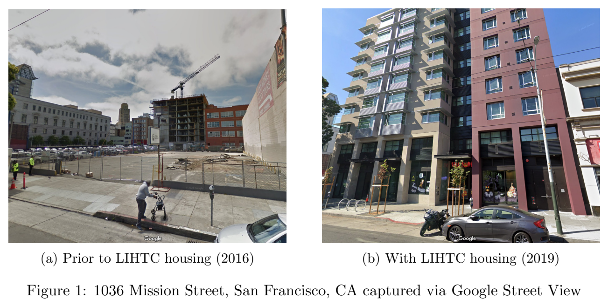

***Figure 1.*** 1036 Mission Street, San Francisco, CA captured via Google Street View

The nearby residents who experience these effects of LIHTC constitute the policy adjacent, a group containing winners and losers. For instance, homeowners and renters will be differently

impacted by housing price fluctuations. Homeowners, on average, are the policy adjacent winners, because they benefit from improvements to their immediate neighborhood, both in terms of increased property values and blight reduction.3 Meanwhile, renters face a more complicated set of circumstances. They benefit from investment in their neighborhoods, but rising property values may contribute to higher rents and housing instability. To the extent that renters perceive or experience the policy as detrimental to their own well-being, we may consider them LIHTC’s policy adjacent losers. Though they are often in principle eligible for housing assistance, it is highly unlikely that they will receive newly constructed affordable housing units themselves; instead, they are left vulnerable to the externalities of the new LIHTC development on the local housing market.4 From Neighborhood Change to Behavioral Change Among LIHTC’s Policy

Adjacent

For LIHTC’s neighborhood effects to generate feedback to political behavior, these effects must be both visible and traceable to the policy itself (Patashnik and Zelizer 2013). We argue that nearby residents notice the ways in which new LIHTC developments reshape their neighborhoods, attribute these changes directly to LIHTC, and in turn change their support for building new affordable housing.

Built by private developers, largely funded through the tax system rather than more conspicuous public budgets, and typically smaller in physical scale than the massive public housing projects of the 1950s and 1960s, LIHTC developments may not be immediately recognizable as affordable housing to casual observers. But local residents are keenly aware of the nature of these developments, for several reasons. First, LIHTC developments are almost always subject to public hearings prior to approval. While attendance at these hearings may be incomplete, developers are typically required to notify residents within 300 feet of the development site that the hearing is occurring. Outside of these hearings, LIHTC developers commonly rely on informal public information ses- 3While homeownership provides more housing stability than renting, and homeowners in our study have, on average, higher household incomes than renters, they still tend to live in distressed or gentrifying areas and are not affluent. In the context of LIHTC’s effects we still consider them “winners” because they experience a net benefit from new LIHTC construction. Homeowners are unlikely to face the threat of displacement or foreclosure when home values increase due to rising property taxes. In fact, property taxes are unlikely to pose a major concern within our study because California’s Proposition 13 limits the taxable assessed value to a maximum 2% increase each year. 4Although individual LIHTC developments prioritize local residents in lotteries for a share of the units, “local” may be defined at the city or even metropolitan level.

sions to win local support for the projects (Scally and Tighe 2015). Following approval, disruption from the generally year-long construction process is unavoidable for nearby residents, raising their awareness of the development and drawing attention to the site’s mandatory signage. Finally, public officials often use local media coverage of the housing’s opening to claim credit for creating affordable housing.5 These meetings, notifications, and media accounts almost without exception highlight the affordable nature of these developments.

Evidence that residents associate LIHTC with the improvement of their neighborhoods is found throughout the academic literature as well as media coverage. As Reid (2019) reports, “In the higher poverty tracts in the sample, the LIHTC properties . . . stood out for their quality and upkeep in comparison with the market-rate buildings nearby, something that residents also pointed out frequently during the interviews” (656). Reid goes on to document how LIHTC developments in California were perceived as investments in neighborhoods and avoided the stigma of more traditional forms of public housing, at least from the perspective of residents (2019, 656). One resident is quoted as saying, “Every neighborhood should have affordable housing. It helps change the neighborhood, makes it better, cleaner and safer” (Reid 2019, 657).

Similarly, Turbov (2006) describes how, “Over the past decade [since the mid-1990s] public housing has taken a radical departure, from causing neighborhood decline to reversing it. . . . New developments have radically changed the urban landscape and rebuilt neighborhood economies” (188-189). Local news reports quote neighbors and supporters of LIHTC proposals praising the developments for revitalizing empty lots. A recent New York Times report covered the courtordered construction of a 102-unit LIHTC development in New Berlin, WI (Eligon 2020). Prior to the development, one opponent of the project had emailed the city’s mayor stating: “If I wanted to live by low-cost housing people, I would have stayed in Milwaukee County.” Following the LIHTC’s construction, that resident regretted his opposition: “I just shot from the hip on that and probably should have been more wary. . . . If they wanted to build another, more power to them.”

Thus, the construction of new LIHTC is highly visible and its positive effects on the surrounding neighborhood are easily traceable. But our analysis goes one step further: we also expect that LIHTC will reshape the local community’s political behavior. Specifically, our first hypothesis is that homeowners will become more supportive of building further affordable housing, both in 5See SI Section A for examples.

their communities and in general. The primary mechanism, we posit, is LIHTC’s effect on their neighborhood conditions — from aesthetic improvements to crime reduction (Freedman and Owens 2011) — which are also capitalized into property values. To use the language of the policy feedback literature, this constitutes a “resource effect.”6 Given the well-documented absence of a strong partisan dimension and the dominance of economic self-interest in decisionmaking in this context (Einstein, Glick, and Palmer 2020; Marble and Nall 2021), we expect homeowners — whose homes are not only their largest asset, but also highly illiquid, making them particularly sensitive to their value — to have a clear, positive political response to nearby LIHTC.

For renters, the advantages of blight reduction may be counterbalanced by the perception that rising property values threaten their housing stability, resulting in mixed political effects. In 2019, New York City’s Deputy Mayor for Housing noted renters’ perception of even affordable housing as a gentrification threat: “[T]he only way that we get a more integrated city is if we have more affordable housing across a wider range of neighborhoods. If people fear that they’re going to be pushed out of their neighborhood, they will not accept housing” (Goodman 2019).

Given these countervailing forces, renters are unlikely to behave like homeowners. How exactly renters will be affected by new, nearby LIHTC depends on the relative strength of these opposing forces: the benefits of blight reduction versus the costs of housing instability. In the context of an expensive housing market like California’s, we expect the costs to outweigh the benefits. Thus, our second hypothesis is that renters in our sample will decrease their support for the housing bonds in response to the construction of nearby LIHTC.

## Data and Measurement

To test our theory of the policy adjacent in the case of LIHTC housing, we use the presence of two similar affordable housing bonds placed on the California statewide general election ballot in 2002 and 2006. The foundation of the dataset is California election data aggregated to the 2010 Census block level, which is our unit of analysis throughout (McCue 2011). Using a series of crosswalks and spatial joins, we construct a dataset of 15,769 unique blocks near LIHTC developments. For each block we measure voting returns, treatment status, and a bevy of block- and tract-level 6We consider the possibility of a non-material mechanism of policy feedback (interpretive effects) in our Conclusion.

characteristics, described below.

These 15,769 blocks are far fewer than the roughly 710,000 Census blocks in California, but they contain 7% of the population of California as of 2000. Of course, the residents living in these blocks are not representative of California as a whole. They are poorer, more racially diverse, and less likely to be homeowners than the average Californian. We return to the generalizability of our findings beyond this sample below.

Dependent Variable To measure voters’ support for building new affordable housing, we use the presence of two $2+ billion housing bonds placed on statewide ballots in California, the first in November 2002 (Proposition 46)7 and the second in November 2006 (Proposition 1C).8 Both bonds were placed on the ballot by the Housing and Emergency Shelter Trust Fund Acts of 2002 and 2006, and were very similar in content and wording. In 2002, a $2.1 billion bond was to provide: shelters for battered women; clean and safe housing for low-income senior citizens;

emergency shelters for homeless families with children; housing with social services for

homeless and mentally ill; repairs/accessibility improvements to apartments for fami-

lies and handicapped citizens; military veteran homeownership assistance; and security

improvements/repairs to existing emergency shelters.

And in 2006, another $2.85 billion bond was to provide:

shelters for battered women and their children, clean and safe housing for low-income senior citizens; homeownership assistance for the disabled, military veterans, and work-

ing families; and repairs and accessibility improvements to apartments for families and

disabled citizens.

The 2002 bond passed with 57.6% of the vote, the 2006 bond with 57.8% of the vote.

Our primary outcome of interest is the difference in support for the 2002 and 2006 bonds, which provided near-identical opportunities for voters to express support for major investments in building affordable housing statewide. Although affordable housing was only one of several components of the two bonds, it was the main focus of the media coverage and messaging around them: they were commonly referred to simply as the “low-income housing bond” (e.g., Gledhill 2002) or the “affordable housing bond” (e.g., de Sa 2006). After the successful passage of the first bond in 2002, 7https://repository.uchastings.edu/cgi/viewcontent.cgi?article=2203&context=ca_ballot_props

8https://repository.uchastings.edu/cgi/viewcontent.cgi?referer=https://www.google.com/

&httpsredir=1&article=2260&context=ca_ballot_props

local media reported on — and politicians claimed credit for — the use of the funds to build a large number of affordable units (Stewart 2004); these claims were reiterated in the run-up to the 2006 election (Coit 2006).9 We obtain block-level returns for both ballot initiatives from the California Secretary of State online repository10 and compute the difference in average block-level support for the bonds between 2002 and 2006.11

LIHTC Developments We are interested in the presence of new LIHTC-funded affordable housing developments during the four years between the 2002 and 2006 elections. LIHTC credits can be used both to construct new affordable housing and to rehabilitate existing structures as affordable housing. We only use projects that were new constructions and drop those dedicated towards building rehabilitation. Rehabilitation of existing LIHTC is more likely to be an internal investment in the existing building, which would be less likely to reduce blight.

We obtain data for every LIHTC-funded project from the HUD National Low-Income Housing Tax Credit Database. We focus on the 458 LIHTC developments placed into service in California from 2003 to 2006, inclusive, of which 446 have complete data.12 The median dwelling had 79 units, of which 72 (92% of units) were reserved for low-income residents.13 Along with new development between the two elections, we also geocode LIHTC developments built from 1999 to 2002 and developments placed into service from 2007 to 2010, which are deployed in various analyses. We validate the accuracy of the geocodes by employing best practices articulated by Wilson et al. (2024).

Homeownership and Rentership We classify “renter blocks” or “homeowner blocks” based on the tercile cutpoints of homeownership among all unique blocks. Blocks in the lowest tercile of homeownership (< 21% homeowners) are “renter blocks,” or the policy adjacent losers, while blocks in the highest tercile of homeownership (> 67% homeowners) are “homeowner blocks,” or the policy adjacent winners.

9See SI Section A for media coverage of the bonds.

10https://www.sos.ca.gov/elections/prior-elections/statewide-election-results

11See SI Section B.1 for more detail.

12We lack month-level data on when developments were placed in service. Thus, we are possibly excluding usable LIHTC developments from late November and December 2002 as well as inappropriately including developments from late November and December 2006. Either error would likely add noise to our estimates, not bias.

13See SI Section B.2 for more detail.

Since our analysis is conducted at the block level, we cannot directly observe whether the treatment effects among homeowner blocks and renter blocks are driven by individual homeowners and renters, respectively. But because these blocks are overwhelmingly dominated by one group or the other, we do not think that ecological inference concerns are a major threat. Renter blocks have a population-weighted mean homeownership rate of only 6%; homeowner blocks have a populationweighted mean homeownership rate of 83%. We present our results across a range of homeownership cutpoints in SI Section F.2 to show their robustness to alternative specifications.

We additionally collect data on a number of block-level Census variables that are relevant to local housing politics, including race and ethnicity, vacancy rates, and population density.14 All of these variables are measured as of 2000, prior to the 2002 election and subsequent construction of LIHTC developments. We use these to assess balance on pretreatment covariates to evaluate the validity of our research designs.

## Research Designs

To identify the causal effect of LIHTC development on the policy adjacent, we need to address a central endogeneity problem: LIHTC developments are not sited at random. Rather, they may be disproportionately located in areas with higher political support for affordable housing; in residentially sparse or gentrifying areas; or areas that are otherwise associated with our political outcomes of interest. To circumvent this problem, we use two analytical strategies. Both are based on a difference-in-differences design where the first of these differences is the change in voter support for the housing bond between 2002 and 2006. We term these two designs the near-far and the near-near design.15

Near-Far Design

Our first approach, the near-far design, compares blocks that are treated by new LIHTC developments to nearby blocks that are just too far to be affected. The key identification assumption of this approach is that in the absence of new LIHTC construction, support for affordable housing would have moved in parallel in the treatment group — the ring of blocks closest to the development — 14Income-related variables are unavailable at the Census block level. See SI Section B.3.

15This approach is inspired by Asquith, Mast, and Reed (2021).

and the control group — an outer ring of blocks just further away. This assumption is likely to hold when adjacent blocks within a neighborhood are similar to one another, but there is some exogenous, hyper-local variation in the lots that are available for development.

In properly defining the treatment and control rings under this approach, the analyst faces a trade-off. The identification assumption is more likely to hold the smaller the treatment and control areas, but the rings should be large enough to capture the entire group of people substantially affected by the LIHTC development as well as a large enough sample of control units to precisely detect any treatment effects. We find that the bandwidths that balance these competing considerations are within a 350-meter radius from the LIHTC development for the treatment group, and between 350 and 600 meters away for the controls.16 Figure 2 visualizes the near-far design in San Francisco, CA.

To empirically test the identification assumption, we subset the data to homeowner blocks and renter blocks as defined above. SI Section C.1 presents the pretreatment covariate balance between treated and control units within each subset as well as the sample as a whole. For both homeowner and renter blocks, treated units are comparable to control units on observable block-level covariates measured prior to LIHTC construction. This suggests that within the 600-meter radius, the exact location of the LIHTC development is plausibly exogenous to some common (observed) confounders. We estimate the effect of nearby LIHTC on support for affordable housing using ordinary least squares. Our sample is constructed by taking every LIHTC development sited in 2003-2006, indexed by l, and gathering all blocks, indexed by b, within a 600-meter radius. Then, we estimate the equation:

Y = β + β T + β renter + β (T ∗ renter ) + ζ + ε (1) lb 0 1 lb 2 b 3 lb b l lb

where T defines the block’s treatment status and renter captures the degree of rentership as opposed to homeownership in the block.17 Since our theory predicts divergent effects among homeowners and renters, we include an interaction term between T and renter. We also include ζ, a LIHTClevel fixed effect, to account for unobserved confounders common to all blocks associated with a development. We use robust standard errors clustered at the LIHTC level.

16See SI Section F.1 for a discussion of bandwidth choice, and sensitivity analyses using other definitions.

17Some blocks enter the analysis multiple times if they are within 600 meters of multiple LIHTC developments. Thus, we index Y and T by both l and b in order to uniquely identify every block-development pairing.

37.81°N 37.80°N 37.79°N 37.78°N 37.77°N

37.76°N 37.75°N

37.74°N

37.73°N

122.46°W 122.44°W 122.42°W 122.40°W 122.38°W Longitude

edutitaL

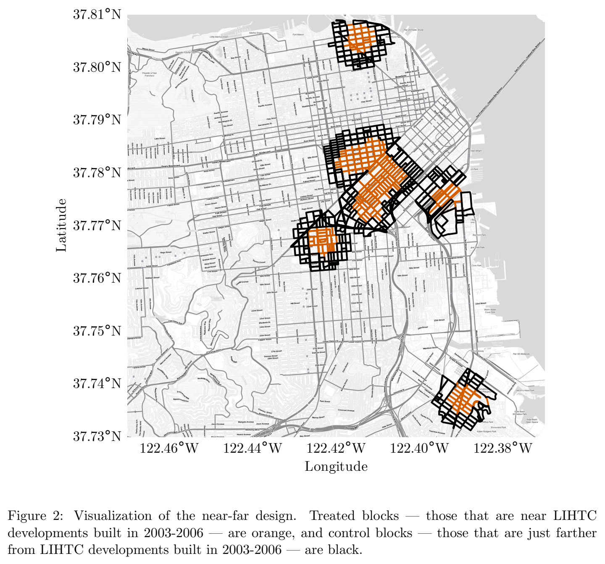

***Figure 2.*** Visualization of the near-far design. Treated blocks — those that are near LIHTC developments built in 2003-2006 — are orange, and control blocks — those that are just farther from LIHTC developments built in 2003-2006 — are black.

Since both a block’s exposure to LIHTC and its rentership status are matters of degree, there is not one unique approach to defining the T or renter variables. To ensure that our results are not sensitive to any particular choice, we now present several alternative definitions of these variables. In the Results section, we report estimates under each approach, and they all consistently agree with one another.

Defining the treatment.

1. Binary. Our first approach, illustrated in Figure 2, is to create a treatment ring and a control ring around each LIHTC development. Then, for the sample of blocks within a 600-meter radius of any l, we define:

 1 if most of the area of block b is ≤ 350 meters away from l

lb

 0 if most of the area of block b is > 350 meters away from l

### 2. Continuous in distance. Alternatively, T may be constructed as a continuous variable

lb

based on a block’s spatial proximity to the LIHTC development. For each block within 600 meters of each LIHTC development, we compute d as the great circle distance between the lb

centroid of the block and the development. For comparability across our different approaches, we rescale d to be between 0 and 1 by dividing by its maximum value in the data, and then lb

we invert it so that higher values represent more intensive treatment:

d′ = 1 − lb

lb max (d )

l,b lb

Finally, we compute T as the standardized version of d′ , subtracting its mean value and lb lb

dividing by two standard deviations (Gelman 2008).

3. Continuous in size. Intensity of treatment may also depend on the cumulative number of LIHTC units to which a block is exposed. Thus, for each block within 600 meters of each LITHC development, we compute T as the total number of units over all treatment rings lb

(defined according to the Binary approach above) to which block b belongs. Once more, we standardize this variable.

Defining rentership. In addition to our binary coding of renter blocks according to the homeownership tercile cutpoints (1=bottom tercile, 0=top tercile), we compute a continuous version of renter as the proportion of households in a block that are not homeowners, ranging from 0 (100% homeowners) to 1 (100% renters). The continuous approach increases our sample size compared to the binary approach, since it does not require excluding the middle tercile.

Near-Near Design

Though our near-far design shows balance on observable characteristics, unobserved confounders remain a risk. For example, LIHTC developers may target specific locations where new housing is most politically feasible to permit, thus confounding our causal estimates.

Our near-near design accounts for this possibility by comparing areas treated by LIHTC developments between 2003 and 2006 to areas that will be treated by new LIHTC between 2007 and 2010. By defining these later-treated units as controls, we compare areas that are similarly prone to new LIHTC development, but with different treatment timings. The key identification assumption under this approach is that political support for affordable housing would have moved in parallel between the earlier-treated and later-treated areas in the absence of LIHTC construction. This assumption would hold if the two sets of areas shared all the political and geographic characteristics that make them attractive to developers, and if any differences in the timing of development were purely due to the idiosyncratic nature of building and permitting.

The primary risk to this near-near design would be if the timing of a LIHTC development were driven by neighborhood-level political factors correlated with our dependent variable. We believe this risk to be small. The funding process in California is highly competitive, with roughly 27-58% of developer applications funded between 2007 and 2012 (Diamond and McQuade 2019). The high rejection rate of applications for LIHTC funding each year suggests a large degree of variation in when a project is funded that is unrelated to the preferences of nearby residents. SI Section C.2 shows the weighted mean difference in our block-level covariates within homeownership terciles and the sample as a whole. As in the near-far design, our treated and control units are comparable on observable pretreatment covariates.

Figure 3 visualizes the near-near strategy. To construct the sample for this design, we take every LIHTC development sited in 2003-2006 as well as 2007-2010. Then we gather all blocks within a

37.81°N 37.80°N 37.79°N 37.78°N 37.77°N

37.76°N 37.75°N

37.74°N

37.73°N

122.46°W 122.44°W 122.42°W 122.40°W 122.38°W Longitude

edutitaL

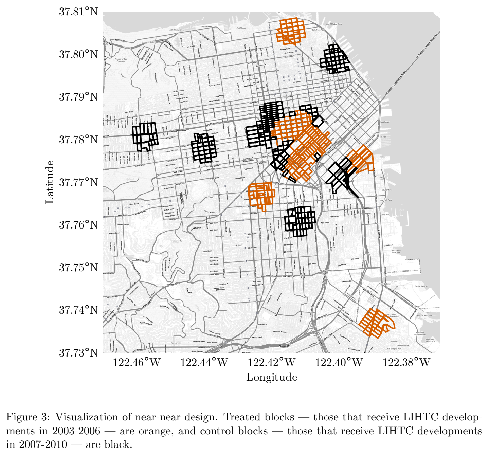

***Figure 3.*** Visualization of near-near design. Treated blocks — those that receive LIHTC develop- ments in 2003-2006 — are orange, and control blocks — those that receive LIHTC developments in 2007-2010 — are black.

350-meter radius of each development.18 We estimate the equation:

Y = β + β T + β renter + β (T ∗ renter ) + ζ + ε (2) lbc 0 1 lbc 2 bc 3 lbc bc c lbc

where l indexes all LIHTC developments in this sample, b indexes blocks, and c indexes metro areas (CBSAs in the Census). We can no longer include a LIHTC-level fixed effect, since there is no within-LIHTC variation in this design; instead, ζ represents a CBSA-level fixed effect. The renter variable may once again be binary or continuous, as described in the near-far design. Similarly, T may be defined in multiple ways:

1. Binary. Let L represent the set of LIHTC developments sited in 2003-2006 and L

0306 0710 represent the set of LIHTC developments sited in 2007-2010. Then, for the sample of blocks within 350 meters of any l ∈ {L , L }, we compute:

0306 0710

 1 if l ∈ L

lbc

 0 if l ∈ L

Because of clustering in the location of LIHTC developments (An et al. 2023), some blocks that were treated in 2003-2006 were treated again in 2007-2010; these blocks are included in the treated group but excluded from the controls.

2. Continuous in size.19 For the same sample as in the Binary approach, we define T as lbc

the sum of units of LIHTC sited in 2003-2006 within 350 meters of block b. Thus, all control blocks — those treated in 2007-2010 but not 2003-2006 — receive a value of 0. This variable is then standardized.

Table 1 summarizes our specifications.

18Blocks enter the analysis multiple times if they are within 350 meters of multiple LIHTC developments.

19The “continuous in distance” specification from the near-far design cannot be used for the near-near design because the control units are not spatially proximate to their comparable treated units.

Model Treatment Rentership Sample size Near-Far Design

### 1. Binary Binary Binary 6,000

### 2. Proximity (cont.) Continuous (distance) Binary 6,000

### 3. Units (cont.) Continuous (size) Binary 6,000

### 4. Continuous rentership Binary Continuous 9,292

Near-Near Design

### 5. Binary Binary Binary 4,038

### 6. Units (cont.) Continuous (size) Binary 4,038

### 7. Continuous rentership Binary Continuous 6,144

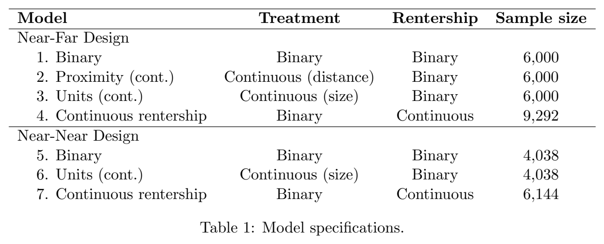

***Table 1.*** Model specifications.

[Download data as CSV](tables/tab-01.csv)

## Results

Changes in Policy Support

Our near-far design measures the effect of new affordable housing when comparing blocks surrounding the same LIHTC development using a LIHTC-level fixed effect.20 Figure 4 shows the effect of proximity to a LIHTC development on the change in support for the housing bonds across the four near-far specifications.21 For the “Continuous rentership” specification, “Homeowners” can be interpreted as blocks with 100% homeowners and “Renters” as blocks with 0% homeowners. Additionally, we present Holm-Bonferroni adjusted confidence intervals to account for our two hypotheses.22

The presence of nearby, new affordable housing causes voters in homeowner blocks to increase their support for funding affordable housing by 1.9 to 2.3 percentage points, an approximately 0.2 standard deviation increase in the voter-weighted average change in support for the housing bonds. Importantly, this effect is positive, meaning homeowners — who as a group are traditionally more averse to affordable housing than renters — increase their support for funding affordable housing once exposed to its implementation. However, as expected, the effect of LIHTC on predominantly renter blocks is substantially smaller. The renter coefficients suggest that a new, nearby LIHTC development causes these voters to decrease their support by 0.8 to 1.5 percentage points.

Figure 5 shows estimated treatment effects under the near-near design. A new, nearby LIHTC development causes homeowner blocks to increase their support for the housing bonds by 1.8 to 2.5 20See SI Section G.4 for a nonparametric difference in means analysis.

21See SI Section D for results in tabular form.

22See SI Section E for a detailed discussion of this adjustment.

Binary Proximity Units Continuous rentership

etamitsE

Homeowners Renters

Figure 4: Effect of new, nearby LIHTC on change in support for housing bonds, near-far design, including 95%-confidence intervals adjusted for multiple hypothesis testing.

percentage points. In contrast, renter blocks experience a 1.3 to 2.2 percentage point decrease in bond support. In two of three models, the treatment effects among renter blocks are not statistically significant at conventional levels.

Together, the results of the near-far and near-near models support our first hypothesis. Homeowners show a clear increase in support for affordable housing in response to new LIHTC. For our second hypothesis — that LIHTC would decrease renter support for funding housing — we are more cautious. The overall trend is negative, but is only statistically significant in 4 of our 7 models. This is at least partially attributable to the fact that the sample of the near-near approach is 50% smaller than that of the near-far approach. Still, while the renter results on their own are not consistently statistically significant, the difference between the positive effects on homeowner blocks and the mixed effects on renter blocks is statistically significant across all specifications.

Validity

To probe the validity of our designs, we conduct a placebo test replicating the near-far design using LIHTC developments built between 2007 and 2010. Because these LIHTC developments were opened after the 2006 election, there should be no difference in change in support for the housing

Binary Units Continuous rentership

etamitsE

Homeowners Renters

Figure 5: Effect of new, nearby LIHTC on change in support for housing bonds, near-near design, including 95%-confidence intervals adjusted for multiple hypothesis testing.

bonds from 2002 to 2006 between the blocks “near” and “far” from them. Table G-14 shows this to be true. Homeowner and renter blocks treated between 2007 and 2010 show consistently null results, both in magnitude and statistical significance.

To investigate our theoretical claim that homeownership is the primary cleavage driving response to new, nearby LIHTC development, we repeat our near-far and near-near designs on our other block-level covariates: racial demographics (% non-Hispanic white, % Black, % Latinx), vacancy rate, and population density (SI Figures G-8 and G-9). We do not find any statistically significant differences between blocks with high and low values of these variables. Additionally, treatment effects are null for blocks in the middle tercile of homeownership, reinforcing the importance of this cleavage (Table G-15).

Because new LIHTC developments are constantly being built, some blocks may have been treated by a new LIHTC development just prior to the 2002 election. Exposure to LIHTC developments just prior to our period of study may mean that voters were already treated when voting on the “pretreatment” housing bond, or were desensitized to the effects of new LIHTC developments. In SI Section D, we replicate the same design excluding all cases of prior exposure. Results are

nearly identical.

We conduct additional sensitivity analyses to see how our results respond to different distance bands. SI Section F.1 replicates our near-far and near-near designs with the binary treatment, moving the distance radius defining treated units from 300 meters to 425 meters in 25-meter increments. Results are consistent but grow noisier as the treatment radius increases, as expected. Once the treatment radius expands beyond a LIHTC development’s sphere of influence, the “treated” group will begin to include blocks which should be categorized as control units, biasing downward the estimated effects.

We also repeat our analyses on the 350 meter distance band specification but move the cutpoints that define our homeowner and renter blocks. Extreme cutpoints may leave insufficient data to estimate an effect, while moderate ones risk diluting the conditional effect we are trying to estimate. SI Section F.2 shows that our results are stable across cutpoints 5 percentage points higher or lower than the tercile cutpoints produced by the distribution of treated blocks. Even cutpoints 10 percentage points above or below the tercile-defined settings yield substantively similar results.

An additional challenge comes from residential churn. If new LIHTC developments cause those least tolerant of affordable housing to move away, being replaced by more tolerant residents, then the positive effect of LIHTC on support for the housing bonds may be an artifact of replacement rather than behavioral change. We assess this possibility in SI Section H, where we derive a decomposition of our dependent variable — change in average support for the bond between 2002 and 2006 — into a weighted sum of opinion change and replacement components. Although we cannot compute these components directly since we cannot observe the vote choice of people who move in and out of a particular area, we can compute bounds on opinion change based on residential churn data and some assumptions about the replacement process.

We find that the opinion change effect of interest for homeowners under the near-far design is bounded between −0.09 and 0.16.23 The lower bound is computed for the unlikely scenario that everyone who moves away from a LIHTC-treated area between 2002 and 2006 opposes the bond and everyone who moves in supports it; the upper bound is computed analogously for the opposite scenario. Of course, both extremes are unlikely. More informatively, we find that there must be some positive opinion change effect up to the point when 38% of voters who leave the block support 23Using the binary treatment specification. Results are similar for the near-near design.

the bond compared to 62% of voters who move in, yielding a 24 percentage point gap in support between the two groups. If the gap is any larger, our overall treatment effect must be driven by replacement. Given well-documented barriers to politically-driven residential sorting (Mummolo and Nall 2017), this is unlikely to be the case, so we are confident in attributing our treatment effect at least in part to opinion change.

To further investigate alternative mechanisms, in SI Section H we explore whether LIHTC developments affected turnout and ballot roll-off. We find little consistent evidence that either of these dependent variables is affected by LIHTC development.

Evidence that Policy Support is Conditioned by Housing Prices

We posit that changes in housing prices can help explain divergent behavior between homeowners and renters. The first part of this chain is uncontroversial: there is ample evidence that LIHTC developments increase housing prices on average in lower-income areas, an impact that we corroborate in our data. Here we present suggestive evidence that this dynamic drives our observed behavioral changes.

First, we determine where the LIHTC developments in our sample changed property values by estimating the effects of each development on surrounding home prices. To do so, we use geocoded CoreLogic data to identify all residential transactions that occurred within 600 meters of every LIHTC development sited between 2003 and 2010, inclusive — that is, all developments that define both our near-far and near-near samples. Aggregating this data to the block-year level for the years 1996 to 2015, we estimate the model:

log(price) = β + β treat + β post + β (treat ∗ post ) + β lotsize +

bt 0 1 b 2 t 3 b t 4 bt

β lotsize2 + β livingarea + β livingarea2 + β bedrooms + (3) 5 bt 6 bt 7 bt 8 bt

β bathrooms + β spring + β summer + β fall + ρ + ε

9 bt 10 bt 11 bt 12 bt t bt

where treat is the treatment status of block b as defined by our near-far design (treated blocks are within 350 meters of the development, control blocks 350-600 meters away); post is a binary indicator that takes a value of 1 starting in the year the development was placed in service, and 0 beforehand; lotsize , livingarea , bedrooms , and bathrooms are block-year average charbt bt bt bt

acteristics of the housing transactions; spring , summer , and fall are block-year averages of bt bt bt

transaction-level seasonal dummies; and ρ is a year fixed effect. The coefficient β represents an t 3

estimated price effect for that LIHTC development.

Next, we use these estimated price effects to test our proposed mechanism: that LIHTC increased homeowners’ support for affordable housing by raising nearby home values. To do so, we divide our sample of LIHTC developments sited in 2003-2006 — those that define our treated sample — into terciles according to their estimated price effects. In the top tercile, the LIHTC development increased nearby home prices by at least 7%; in the bottom tercile, it decreased nearby home prices by at least 5%.24 We drop the middle tercile, where home prices are largely unchanged by LIHTC, in order to better isolate places where prices increased or decreased.

In Figure 6, we estimate Equations 1 (near-far analysis) and 2 (near-near analysis) separately on the top and bottom price effect terciles. To reduce loss of statistical power, we use the “Continuous rentership” model specification from Figures 4 and 5. Note, however, the reduction in sample sizes to between about a third and a quarter of the samples in the comparable main analysis, leading us to expect noisier estimates.25 The effect of new, nearby LIHTC on support for funding affordable housing is about 3 percentage points in homeowner blocks where prices increased. In blocks where prices decreased, the effects are not statistically different from zero. Despite some imprecision in the estimates due to drastically reduced sample sizes, the overall picture suggests that homeowners respond more positively where LIHTC development increased nearby home values.

Meanwhile, majority-renter blocks never show positive treatment effects in response to LIHTC. Still, we urge caution in assessing renter treatment effects conditional on housing prices. The behavior of homeowners in response to changes in housing prices has clear expectations from previous research, whereas the behavior of renters does not. While rent and home transaction prices are likely connected, landlords rarely lower rent for current tenants when property values decline, limiting renters’ benefit from decreased housing prices. Instead, as we theorized above, renters are likely more responsive to the local quality of life and their sense of housing instability. We focus directly on the latter in the next section.

24Appendix Table H-18 compares areas around the LIHTC developments from the top and bottom price effect terciles on pretreatment characteristics.

25This is evident by the larger scale of the vertical axis, reflecting larger confidence intervals.

(a) Prices decreased (b) Prices increased Near-far Near-near Near-far Near-near

etamitsE

Homeowners Renters

Figure 6: Effect of new, nearby LIHTC on change in support for housing bonds, continuous rentership model, for bottom price effects tercile (“Prices decreased”) and top price effects tercile (“Prices increased”), including 95%-confidence intervals adjusted for multiple hypothesis testing.

Gentrifying Renter Neighborhoods Show Larger Negative Effects

The effect of new, nearby affordable housing on homeowner blocks is straightforward. LIHTC replaces blight, increasing nearby property values. We find evidence of our proposed mechanism by demonstrating stronger policy feedback effects on areas where LIHTC increased surrounding property values. In contrast, treated renters do not show the same positive response to new LIHTC. Instead, our results suggest that renters may become more likely to oppose affordable housing bonds when exposed to new LIHTC developments.

One explanation for this divergence is that renters may associate new LIHTC developments with gentrification and displacement. This is consistent with research finding that renters in cities with high housing costs oppose nearby market-rate housing because they believe that new development will make their neighborhood more attractive, increasing their rent and threatening their housing stability (Hankinson 2018). This mechanism of blight reduction leading to higher rents mirrors the concept of “green” gentrification where the replacement of derelict infrastructure with environmental amenities risks local gentrification and displacement (e.g., Immergluck and Balan 2018). Given that new LIHTC development may increase nearby property values, this could similarly drive a

backlash effect or at least hinder renters from expressing positive policy feedback associated with improved neighborhood conditions.

To assess these explanations, we identify blocks which were gentrifying from 1990 to 2000, prior to the 2002 election. Following the gentrification literature, we first identify blocks deemed eligible for gentrification as of 1990. Hwang (2020) defines a Census tract as eligible for gentrification if the tract’s median income in 1990 is below its city’s median income.26 Based on this definition, 83% of our renter blocks fell within gentrification eligible tracts in 1990, which is unsurprising given the tendency of LIHTC developments to be sited in lower-income neighborhoods. We then identify tracts, and thus blocks, that actually underwent gentrification from 1990 to 2000. Hwang (2020) specifies two conditions, both of which must be met over a ten-year period for a tract to be considered gentrifying:

1. The tract’s median rent or home value increases more quickly than the variable’s median increase among all tracts in the city.

2. The tract’s % with at least a BA or median household income increases more quickly than the variable’s median increase among all tracts in the city.

From 1990 to 2000, 22% of our renter blocks met both criteria and qualify as gentrifying. To assess whether gentrification matters for renter response to LIHTC, we re-estimate our regressions on gentrification-eligible renter blocks only, and include a binary indicator for whether each block was gentrifying prior to the 2002 election.

As shown in Figure 7, renter blocks in non-gentrifying tracts show essentially no response to LIHTC. In contrast, renter blocks in gentrifying tracts decreased support for the housing bond by 1.8 to 2.9 percentage points when exposed to a LIHTC development. These estimates are statistically significant in four out of five specifications. Likewise, in both the near-far and nearnear designs, gentrification status does not affect the change in support for the housing bonds among homeowner blocks (Figure H-16). This evidence suggests that when LIHTC developments are sited in neighborhoods already experiencing rising rents and the perceived threat of displacement, there may be a stronger negative reaction among renters.

26Existing literature defines “gentrification” using data available only at the tract level, requiring us to assign block-level attributes based on tract-level data.

(a) Near-far (b) Near-near Binary Units Proximity Binary Units etamitsE

Gentrifying Non-gentrifying

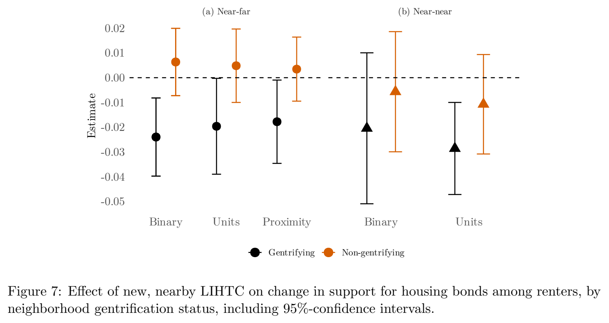

***Figure 7.*** Effect of new, nearby LIHTC on change in support for housing bonds among renters, by neighborhood gentrification status, including 95%-confidence intervals.

## Discussion

To date, the political science of affordable housing policy has tended to focus on two groups: the mass public and the residents of affordable housing units. Absent has been consideration of the surrounding residents once the housing has been built. But this group is important. The new affordable housing is the physical manifestation of the policy. Thus, those affected by these buildings each day may play an important role in the long-term politics of housing policy.

That a single nearby LIHTC development changes down-ballot voting behavior suggests that proponents of affordable housing should consider policy implementation as they engage in strategic coalition building. But while treated homeowners may be mobilized to increase funding for housing, it is no coincidence that LIHTC springs up in places where it is less likely to meet strong homeowner opposition (Trounstine 2018). We suspect — though cannot directly test — that attempts to build affordable housing in higher income areas would not only meet greater homeowner resistance, but would also fail to increase local property values. Consequently, homeowners in these areas may not show the same increased support for funding additional housing as observed by the homeowners in our study.

Similarly, renters in gentrifying areas will likely be less sanguine about local development. But efforts to win the support of local renters — by, for example, prioritizing adjacent residents for new

units — may generate repercussions. Prioritization of local residents below the municipality level in housing lotteries is largely viewed as invalid under the U.S. Fair Housing Act, as it may entrench existing patterns of racial segregation. While historically designed to “exclude non-Caucasians from ever establishing residency” in all-white cities,27 even local prioritization meant to mitigate displacement via gentrification has been heavily circumscribed by HUD or challenged in court (Freund 2018). Thus, there is a tension between building sustained local support for affordable housing and pursuing regional goals of integration.

Alternatively, housing policies that increase the residential stability of existing tenants may limit the backlash of renters against new LIHTC development. When we restrict our sample to cities without rent control, the negative treatment effect found among renters appears to increase.28 This exploratory analysis supports the idea that renters’ backlash towards LIHTC may be due to their concerns about gentrification and displacement. At the very least, the analysis suggests that theory generation about the policy adjacent should be considered within the broader ecosystem of that policy. For affordable housing, the ecosystem includes local policies such as rent control, rent stabilization, and property tax regulations.

## Conclusion

Across multiple designs and specifications, we show that new, nearby affordable housing changes residents’ voting behavior when asked to fund affordable housing statewide. This policy feedback effect is largely conditioned by the economic externalities created by these developments. To the extent that affordable housing represents an investment in the local neighborhood, homeowners — the policy adjacent winners — stand to benefit from increasing property values. At the same time, affordable housing units can be perceived to harm market-rate renters through rent inflation. This poses an uncomfortable quandary for proponents of subsidized housing: While building affordable housing directly benefits recipients, it may undermine support among the economically precarious policy adjacent losers, who should be natural political allies.

Beyond housing, our definition of the policy adjacent contributes to the literature on policy feedback. First, in recognizing the possibility for winners and losers among indirect policy recip- 27United States v. Housing Authority of Chickasaw, 504 S.D. Ala. 716 (1980) at 731.

28See SI H.6 for additional details.

ients, we underscore their potential as coherent political constituencies. If we aim to understand the conditions under which we observe policy stability versus expansionary processes versus selfundermining policy processes (Busemeyer, Abrassart, and Nezi 2021), we need to recognize that policies can have heterogeneous effects not just on those directly affected, but also those indirectly affected.

Our study also reinforces the importance of considering both the self-reinforcing and selfundermining forces of policy feedback effects, which “frequently flow simultaneously from the same set of policies” (Jacobs and Weaver 2015, 454). We are constrained, however, by the aggregate nature of election returns. Future research could use targeted surveys to more precisely gauge the attitudes towards and awareness of nearby affordable housing among individual homeowners and renters. Comprehensive data pertaining to the latter — including information on rental costs over time — are particularly difficult to come by, currently limiting our ability to understand how neighborhood change affects these households. Studies of what LIHTC-induced neighborhood change actually looks like on the ground, perhaps by leveraging street-view imagery over time, would also help more directly illuminate the nature of local transformations due to new affordable housing development.

More broadly, the concept of the policy adjacent creates new avenues for theoretical development. Because the mechanism of LIHTC is, primarily, a physical upgrade to the surroundings, we categorize our findings as a resource effect. However, policy feedback can also occur through interpretive effects, where a policy changes one’s political efficacy and perceived relationship to government. For example, the recognition felt by direct beneficiaries of the G.I. Bill helped spark their civic participation beyond that purely related to the economic benefits offered by the program (Mettler and Welch 2004). In contrast, if rising property values create instability for renters, then the new housing may also affect renters’ sense of self-efficacy. While we do not observe a decrease in voter turnout in renter areas, gentrification has been linked to decreased social capital and engagement in low-income Black communities (Newman, Velez, and Pearson-Merkowitz 2016). Further research is required to determine whether, in the case of the policy adjacent, such interpretive effects are plausible, or if interpretive effects require receipt of direct benefits.

Our results show how the implementation of policies with concentrated externalities can generate indirect policy feedback in unforeseen ways. Positive economic spillovers can convert unexpected

supporters from the policy adjacent winners. At the same time, those same spillovers may not be a universal boon and instead lead to conflicted effects among the policy adjacent losers. This framework — the policy adjacent winners and losers — extends policy feedback effects to indirect externalities, and should help to deepen our understanding of the long-term viability of policies with concentrated benefits and costs.

## References

An, Brian, Andrew Jakabovics, Jing Liu, Anthony W Orlando, Seva Rodnyansky, Richard Voith, Sean Zielenbach, and Raphael W Bostic. 2023. “Factors Affecting Spillover Impacts of LIHTC Developments: An Analysis of Los Angeles.” Cityscape: A Journal of Policy Development and Research 25(2): 309–363.

Asquith, Brian J, Evan Mast, and Davin Reed. 2021. “Local Effects of Large New Apartment Buildings in Low-Income Areas.” The Review of Economics and Statistics pp. 1–46.

Busemeyer, Marius R, Aur´elien Abrassart, and Roula Nezi. 2021. “Beyond Positive and Negative: New Perspectives on Feedback Effects in Public Opinion on the Welfare State.” British Journal of Political Science 51(1): 137–162.

Campbell, Andrea Louise. 2012. “Policy Makes Mass Politics.” Annual Review of Political Science 15: 333–351.

Coit, Michael. 2006. “Burbank Housing Opens Larkfield Complex: 56-Unit Affordable Apartment Project Keeps Developer on Track to Build 400 Residences This Year.” The Press Democrat (06 Oct).

de Sa, Karen. 2006. “Measure Would Fund More Affordable Housing.” San Jose Mercury News (03 Oct).

Diamond, Rebecca, and Tim McQuade. 2019. “Who Wants Affordable Housing in their Backyard? An Equilibrium Analysis of Low-Income Property Development.” Journal of Political Economy 127(3): 1063–1117.

Dillman, Keri-Nicole, Keren Mertens Horn, and Ann Verrilli. 2017. “The What, Where, and When of Place-Based Housing Policy’s Neighborhood Effects.” Housing Policy Debate 27(2): 282–305. Editorial Board, The. 2012. “A Tax Credit Worth Preserving.” The New York Times (20 Dec). Einstein, Katherine Levine, David M Glick, and Maxwell Palmer. 2020. Neighborhood Defenders. Cambridge University Press.

Eligon, John. 2020. “Residents Feared Low-Income Housing Would Ruin Their Suburb. It Didn’t.” The New York Times (5 Nov).

Ellen, Ingrid Gould. 2020. “What Do We Know About Housing Choice Vouchers?” Regional Science and Urban Economics 80: 103380.

Eriksen, Michael D, and Amanda Ross. 2015. “Housing Vouchers and the Price of Rental Housing.” American Economic Journal: Economic Policy 7(3): 154–76.

Freedman, Matthew, and Emily G Owens. 2011. “Low-Income Housing Development and Crime.” Journal of Urban Economics 70(2-3): 115–131.

Freeman, Lance. 2004. Siting Affordable Housing: Location and Neighborhood Trends of Low Income Housing Tax Credit Developments in the 1990s. Brookings Institution, Center on Urban and Metropolitan Policy.

Freemark, Yonah, and Corianne Payton Scally Scally. 2018. LIHTC Provides Much-Needed Affordable Housing, But Not Enough to Address Today’s Market Demands. Technical report Urban Institute.

Freund, Zachary C. 2018. “Perpetuating Segregation or Turning Discrimination on Its Head: Affordable Housing Residency Preferences as Anti-Displacement Measures.” Colum. L. Rev. 118: 833.

Gelman, Andrew. 2008. “Scaling Regression Inputs by Dividing by Two Standard Deviations.” Statistics in Medicine 27(15): 2865–2873.

Gledhill, Lydia. 2002. “Low-income Housing Bond Approved.” San Francisco Chronicle (06 Nov). Goodman, David J. 2019. “What the City Didn’t Want the Public to Know: Its Policy Deepens Segregation.” The New York Times (16 July).

Hankinson, Michael. 2018. “When Do Renters Behave Like Homeowners? High Rent, Price Anxiety, and NIMBYism.” American Political Science Review 112(3): 473–493.

Hwang, Jackelyn. 2020. “Gentrification Without Segregation? Race, Immigration, and Renewal in a Diversifying City.” City & Community 19(3): 538–572.

Immergluck, Dan, and Tharunya Balan. 2018. “Sustainable for Whom? Green Urban Development, Environmental Gentrification, and the Atlanta Beltline.” Urban Geography 39(4): 546–562.

Jacobs, Alan M, and R Kent Weaver. 2015. “When Policies Undo Themselves: Self-Undermining Feedback as a Source of Policy Change.” Governance 28(4): 441–457.

Lacombe, Matthew J. 2022. “Post-Loss Power Building: The Feedback Effects of Policy Loss on Group Identity and Collective Ection.” Policy Studies Journal 50(3): 507–526.

Larsen, Martin Vinæs, Frederik Hjorth, Peter Thisted Dinesen, and Kim Mannemar Sønderskov. 2019. “When Do Citizens Respond Politically to the Local Economy? Evidence from Registry Data on Local Housing Markets.” American Political Science Review 113(2): 499–516.

Lerman, Amy E, and Vesla M Weaver. 2014. Arresting Citizenship. University of Chicago Press. Leung, Justin H, and Hee Kwon Seo. 2023. “How Do Government Transfer Payments Affect Retail Prices and Welfare? Evidence from SNAP.” Journal of Public Economics 217: 104760.

Marble, William, and Clayton Nall. 2021. “Where Interests Trump Ideology: The Persistent Influence of Homeownership in Local Development Politics.” Journal of Politics 83(4).

McCue, Kenneth F. 2011. Creating California’s Official Redistricting Database. Technical report California Institute of Technology.

Mettler, Suzanne, and Eric Welch. 2004. “Civic Generation: Policy Feedback Effects of the GI Bill on Political Involvement over the Life Course.” British Journal of Political Science 34(3): 497–518.

Mummolo, Jonathan, and Clayton Nall. 2017. “Why Partisans Do Not Sort: The Constraints on Political Segregation.” The Journal of Politics 79(1): 45–59.

Newman, Benjamin J, Yamil Velez, and Shanna Pearson-Merkowitz. 2016. “Diversity of a Different Kind: Gentrification and its Impact on Social Capital and Political Participation in Black Communities.” Journal of Race, Ethnicity, and Politics 1(2): 316–347.

Patashnik, Eric M, and Julian E Zelizer. 2013. “The Struggle to Remake Politics: Liberal Reform and the Limits of Policy Feedback in the Contemporary American State.” Perspectives on Politics 11(4): 1071–1087.

Pierson, Paul. 1993. “When Effect Becomes Cause: Policy Feedback and Political Change.” World Politics 45(4): 595–628.

Reid, Carolina K. 2019. “Rethinking “Opportunity” in the Siting of Affordable Housing in California: Resident Perspectives on the Low-Income Housing Tax Credit.” Housing Policy Debate 29(4): 645–669.

Rosen, Eva. 2014. “Rigging the Rules of the Game: How Landlords Geographically Sort Low– Income Renters.” City & Community 13(4): 310–340.

Scally, Corianne Payton, and J Rosie Tighe. 2015. “Democracy in Action?: NIMBY as Impediment to Equitable Affordable Housing Siting.” Housing Studies 30(5): 749–769.

Soss, Joe, and Sanford F Schram. 2007. “A Public Transformed? Welfare Reform as Policy Feedback.” American Political Science Review 101(1): 111–127.

Stewart, Jocelyn. 2004. “Los Angeles; City awarded $36 million for housing; State funds are expected to help build about 807 rental units and some single- family homes designed for lowincome buyers.” Los Angeles Times (14 Feb).

Stokes, Leah C. 2016. “Electoral Backlash against Climate Policy: A Natural Experiment on Retrospective Voting and Local Resistance to Public Policy.” American Journal of Political Science 60(4): 958–974.

Susin, Scott. 2002. “Rent Vouchers and the Price of Low-Income Housing.” Journal of Public Economics 83(1): 109–152.

Trounstine, Jessica. 2018. Segregation by Design: Local Politics and Inequality in American Cities. Cambridge University Press.

Turbov, Mindy. 2006. “Public Housing Redevelopment as a Tool for Revitalizing Neighborhoods: How and Why Did It Happen and What Have We Learned?” Nw. JL & Soc. Pol’y 1: 167.

Voith, Richard, Jing Liu, Sean Zielenbach, Andrew Jakabovics, Brian An, Seva Rodnyansky, Anthony W Orlando, and Raphael W Bostic. 2022. “Effects of Concentrated LIHTC Development on Surrounding House Prices.” Journal of Housing Economics p. 101838.

Walker, Hannah L. 2020. Mobilized by Injustice: Criminal Justice Contact, Political Participation, and Race. Oxford University Press.

Weaver, Vesla M, and Amy E Lerman. 2010. “Political Consequences of the Carceral State.” American Political Science Review 104(4): 817–833.

White, Ariel. 2019. “Misdemeanor Disenfranchisement? The Demobilizing Effects of Brief Jail Spells on Potential Voters.” American Political Science Review 113(2): 311–324.

Wilson, Nicole E, Michael Hankinson, Asya Magazinnik, and Melissa Sands. 2024. “Inaccuracies in Low Income Housing Geocodes: When and Why They Matter.” Urban Affairs Review 60(1): 217–231.

## Supplementary Information for “The Policy Adjacent: How Af-

## Contents

A Media Coverage and LIHTC’s Traceability A-2 B Data A-3 B.1 Housing Bond Data . . . . . . . . . . . . . . . . . . . . . . . . . . . . . . . . . . . . A-3 B.2 LIHTC Data . . . . . . . . . . . . . . . . . . . . . . . . . . . . . . . . . . . . . . . . A-3 B.3 Other Variables . . . . . . . . . . . . . . . . . . . . . . . . . . . . . . . . . . . . . . . A-5 B.4 Dataset Construction . . . . . . . . . . . . . . . . . . . . . . . . . . . . . . . . . . . . A-5 C Balance Tables A-6 C.1 Near-Far Balance . . . . . . . . . . . . . . . . . . . . . . . . . . . . . . . . . . . . . . A-6 C.2 Near-Near Balance . . . . . . . . . . . . . . . . . . . . . . . . . . . . . . . . . . . . . A-7 D Results in Tabular Form A-8 D.1 Results - Full Sample . . . . . . . . . . . . . . . . . . . . . . . . . . . . . . . . . . . . A-8 D.2 Results - Using blocks not treated by new LIHTC from 1999-2002 (“Clean” Sample) A-9 D.3 Treatment Effect Heterogeneity by Price Effects . . . . . . . . . . . . . . . . . . . . . A-10 D.4 Gentrification Status Analysis for Renters . . . . . . . . . . . . . . . . . . . . . . . . A-11 E Multiple Hypothesis Adjustment A-12 F Sensitivity Analysis A-14 F.1 Distance Bands . . . . . . . . . . . . . . . . . . . . . . . . . . . . . . . . . . . . . . . A-14 F.2 Homeownership Cutpoints . . . . . . . . . . . . . . . . . . . . . . . . . . . . . . . . . A-15 G Robustness Checks A-17 G.1 Placebo Test . . . . . . . . . . . . . . . . . . . . . . . . . . . . . . . . . . . . . . . . A-17 G.2 Other Block-Level Covariates . . . . . . . . . . . . . . . . . . . . . . . . . . . . . . . A-17 G.3 Middle Tercile of Homeownership . . . . . . . . . . . . . . . . . . . . . . . . . . . . . A-18 G.4 Naive Difference in Means . . . . . . . . . . . . . . . . . . . . . . . . . . . . . . . . . A-19 H Mechanisms A-20 H.1 Price Effects . . . . . . . . . . . . . . . . . . . . . . . . . . . . . . . . . . . . . . . . . A-20 H.2 Opinion Change vs. Replacement . . . . . . . . . . . . . . . . . . . . . . . . . . . . . A-20 H.3 Turnout . . . . . . . . . . . . . . . . . . . . . . . . . . . . . . . . . . . . . . . . . . . A-26 H.4 Roll-Off . . . . . . . . . . . . . . . . . . . . . . . . . . . . . . . . . . . . . . . . . . . A-29 H.5 Gentrification and Homeowners . . . . . . . . . . . . . . . . . . . . . . . . . . . . . . A-30 H.6 Rent Control . . . . . . . . . . . . . . . . . . . . . . . . . . . . . . . . . . . . . . . . A-31

## A Media Coverage and LIHTC’s Traceability

In this section, we present evidence that voters associated new affordable housing developments in their neighborhoods with the statewide bonds. Contemporaneous media coverage commonly referred to the 2002 and 2006 statewide bonds as the “low-income housing bond” (e.g., Gledhill 2002) or the “affordable housing bond” (e.g., de Sa 2006). Furthermore, following the 2002 bond’s passage, local media reported on how the infusion of funds would lead to over 130,000 new housing units statewide (e.g., Wedner 2004). For example, 24 cities in Los Angeles County received $62.6 million, which was estimated to fund 1,767 units, whereas the $13.9 million to San Bernardino and Riverside would fund 444 units (Stewart 2004). By mid-2004, Los Angeles County’s total had reached $92.2 million which would translate into nearly 7,200 new housing units.

Local advocates credit-claimed for the use of the bonds to fund development in their region. In the Los Angeles Times, the mayor of Los Angeles touted how the city’s receipt of $36 million would be used to build 807 rental units, “so that Los Angeles can continue to make investments that shelter working families, create jobs and improve neighborhoods, despite a tough budgetary year” (Stewart 2004). In the Bay Area, the San Francisco Chronicle wrote about how the $100 million awarded to the Bay Area would be spent. Not only would two new affordable projects begin construction with the funding, but two ongoing developments—100 units and 76 units—“would have been stalled without the cash” (Fulbright 2005).

In the run-up to the 2006 election, these claims were reiterated in support of the new affordable housing bond. For example, a local news article published one month before the 2006 election makes this connection explicit (Coit 2006):

State bond funds from Proposition 46 have been critical to Burbank’s helping meet

demand for more affordable housing across the county. The bond money accounts for

35 percent of the Larkfield Oaks project, which also was funded by Burbank’s usual complex array of public and private financing to lower development costs and rents.

Proposition 46, approved by voters four years ago, provides $2.1 billion for low-income housing, home buyer assistance, and other targeted efforts. With that funding likely to be spent over the next year, state lawmakers placed Proposition 1C on the Nov. 7 ballot to provide an additional $2.85 billion toward similar efforts.

Burbank has received $38 million in Proposition 46 money, second among all nonprofit affordable housing builders throughout California. “It’s allowed us to do more, and it’s allowed us to reach a deeper level of affordability,” [affordable housing developer John] Lowry said.

Similar reporting connected the 2002 bond to not only over 100,000 new homes, but to the 2006 bond (de Sa 2006):

“Prop. 46 prompted the construction of thousands of homes affordable to Bay Area families, and we expect a similar return through Prop. 1C,” said Carl Guardino, president and CEO of the Silicon Valley Leadership Group and the initiative’s statewide cochair.

## B Data

The purpose of this section is to provide additional detail about the data used in the study and how our final dataset was constructed.

B.1 Housing Bond Data

In this study, we use electoral data from two California housing bonds passed by voters statewide in 2002 and 2006. Figure B-1 shows the change in support for the housing bonds between the two elections at the Census block level. Observations are weighted by the average number of votes recorded on the housing bonds across both elections. We drop blocks that recorded zero votes on either the 2002 or the 2006 bonds, as we cannot reliably estimate the change in support between the elections for these blocks. Fortunately, these blocks have very few voters. The vertical line shows the mean change in support for bonds between the two elections, weighted by the average number of voters in each block. Support for the bonds was largely stable across the two elections. The voter-weighted average block only increased support for the bonds by 0.3 percentage points with a weighted standard deviation of 12 percentage points.

-1.0 -0.5 0.0 0.5 1.0

Bond % Support 2006 - Bond % Support 2002

ytisneD

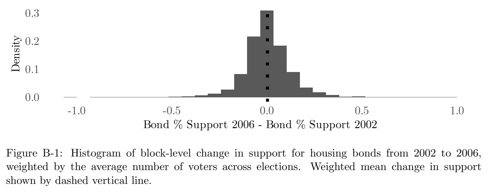

***Figure B-1.*** Histogram of block-level change in support for housing bonds from 2002 to 2006, weighted by the average number of voters across elections. Weighted mean change in support shown by dashed vertical line.

B.2 LIHTC Data

As our treatment, we use exposure to new, nearby LIHTC-funded affordable housing construction that is placed in service during the 4-year period between the 2002 and 2006 election. As shown in Figure B-2, LIHTC locations during this time period were broadly distributed across CA, matching the state’s population distribution. For context, federal guidelines stipulate that, in order to qualify for the tax credit, at least 20% of tenants in the proposed project must earn below 50% of the area median gross income (AMGI) or, alternatively, at least 40% of tenants must earn less than 60% of AMGI. Developers must restrict rents for low-income residents to 30% of the relevant income limit for a minimum of 30 years.

On average, there is a 1 year lag between credit allocation for a development and a development being placed in service. Studying property values via transactions, Diamond and McQuade (2019) use year of credit allocation to measure the effect of affordable housing, arguing that the announcement of affordable housing should immediately affect transactions even before construction begins. This may be reasonable for identifying effects on transaction values, as property purchasers are

42°N

40°N

38°N

36°N

34°N

124°W 122°W 120°W 118°W 116°W 114°W lon

tal

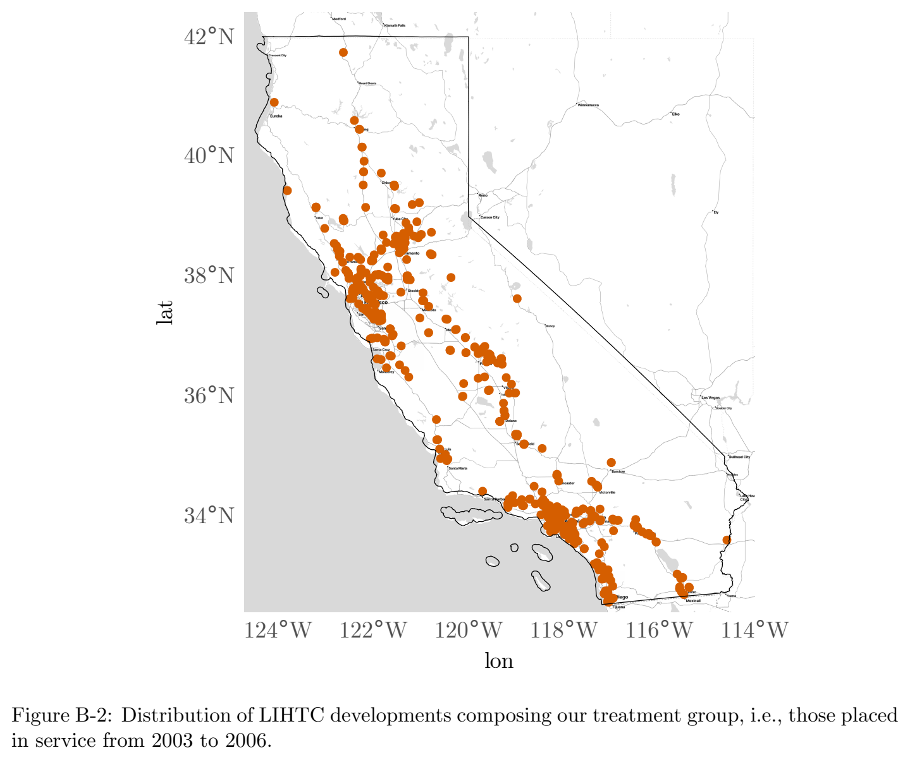

***Figure B-2.*** Distribution of LIHTC developments composing our treatment group, i.e., those placed in service from 2003 to 2006.

likely to have a high awareness of changes in the area that may affect the long-term value of the large asset they are about to purchase. We expect nearby voters to become responsive once they become aware of rising housing prices and connect this increase to affordable housing policy, which we believe is most likely to come with the advent of new physical infrastructure. Thus we define treatment based on when each building is placed into service.

B.3 Other Variables

Income-related variables are not available at the Census block level. Some of our later analyses involve subsetting the data based on Census tract-level household income measures, but we cannot control for income in block-level analyses. To give a sense of scale, tracts generally contain between 1,200 and 8,000 people, with an optimum size of 4,000 people. Census blocks are not defined by population but are much smaller in area; for example, one block in a city typically comprises a Census block. Thus, tract data is useful as a moderating variable across LIHTC developments, but not for capturing variation within the area treated by an individual LIHTC development.

B.4 Dataset Construction

When defining proximity, we use the centroid of each Census block as its precise location. For the “Binary” treatment, we define treated blocks as those within 350 meters of a LIHTC development. For cases where the treatment radius cuts through a block, we calculated what percent of the block’s area was within the treatment radius. If ≥50% of the block’s area was covered by the treatment radius, the block was treated, otherwise the block was part of the near-far control group.

Some LIHTC developments are sited in close proximity to each other, such that the same block can be treated by more than one LIHTC development. Because our near-far estimation strategy relies on a LIHTC-level fixed effect, each block requires a LIHTC identifier, making the unit of analysis a block-LIHTC dyad. When a block is treated by more than one development, the block will appear in the near-far dataset however many times it is treated and with each observation referencing a unique LIHTC development.

In contrast, sometimes a block may be a control unit for one LIHTC development but also treated by another LIHTC development. Because the block was treated by any LIHTC development, it is considered a treated unit and all control observations of the block are dropped from the model. This ensures that blocks will only ever appear as treated or control, never both. 91% of blocks only appear once in the near-far data. The maximum number of appearances for a block is six times (<.04% of all blocks), meaning a few blocks were within 350 meters of six LIHTC buildings placed in service between 2003 and 2006.

Like the near-far design, the near-near design requires that blocks appear as many times as they are treated by different LIHTC developments. But if a block is treated not only by new LIHTC housing in 2003-2006 but also by new LIHTC in 2007-2010, then the block only appears as a treated unit. This leaves as control units blocks that were only treated in 2007-2010, after the second housing bond election.

## C Balance Tables

C.1 Near-Far Balance

Mean (treated) Mean (control) Std. mean difference Homeownership rate 0.34 0.45 -0.34 Percent voted in 2002 0.42 0.44 -0.14 Percent non-Hispanic white 0.34 0.39 -0.17 Percent non-Hispanic Black 0.10 0.09 0.05 Percent Hispanic 0.37 0.35 0.08 Vacancy rate 0.05 0.05 0.04 Density (pop./km-squared) 13467.50 8754.27 0.28

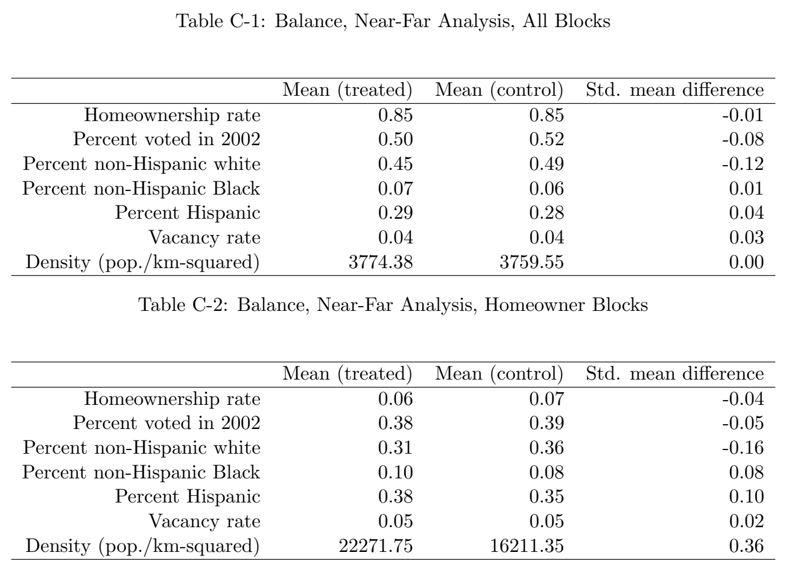

***Table C-1.*** Balance, Near-Far Analysis, All Blocks

[Download data as CSV](tables/tab-02.csv)

Mean (treated) Mean (control) Std. mean difference Homeownership rate 0.85 0.85 -0.01 Percent voted in 2002 0.50 0.52 -0.08 Percent non-Hispanic white 0.45 0.49 -0.12 Percent non-Hispanic Black 0.07 0.06 0.01 Percent Hispanic 0.29 0.28 0.04 Vacancy rate 0.04 0.04 0.03 Density (pop./km-squared) 3774.38 3759.55 0.00

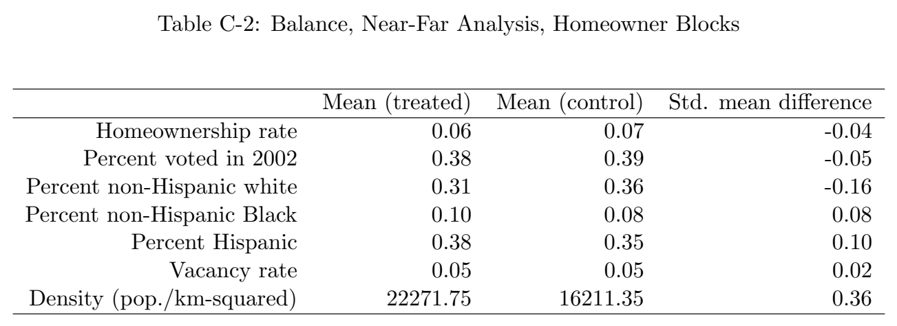

***Table C-2.*** Balance, Near-Far Analysis, Homeowner Blocks

[Download data as CSV](tables/tab-03.csv)

Mean (treated) Mean (control) Std. mean difference Homeownership rate 0.06 0.07 -0.04 Percent voted in 2002 0.38 0.39 -0.05 Percent non-Hispanic white 0.31 0.36 -0.16 Percent non-Hispanic Black 0.10 0.08 0.08 Percent Hispanic 0.38 0.35 0.10 Vacancy rate 0.05 0.05 0.02 Density (pop./km-squared) 22271.75 16211.35 0.36

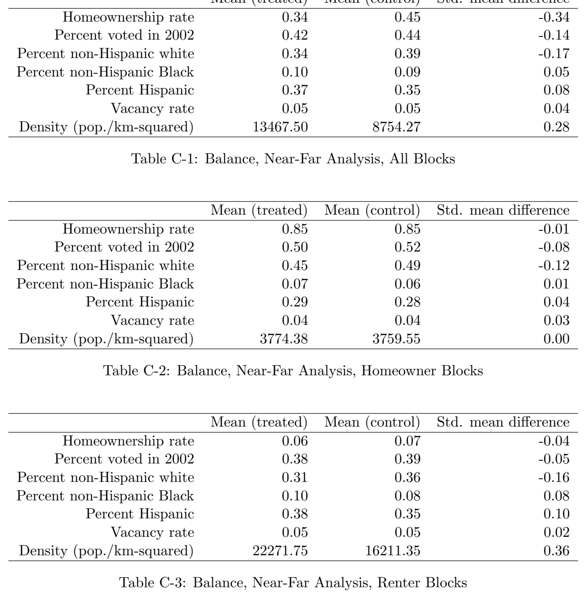

***Table C-3.*** Balance, Near-Far Analysis, Renter Blocks

[Download data as CSV](tables/tab-04.csv)

C.2 Near-Near Balance

Mean (treated) Mean (control) Std. mean difference Homeownership rate 0.34 0.34 -0.01 Percent voted in 2002 0.42 0.42 -0.03 Percent non-Hispanic white 0.34 0.38 -0.12 Percent non-Hispanic Black 0.10 0.09 0.01 Percent Hispanic 0.37 0.37 0.01 Vacancy rate 0.05 0.05 -0.03 Density (pop./km-squared) 13467.50 11011.33 0.12

***Table C-4.*** Balance, Near-Near Analysis, All Blocks

[Download data as CSV](tables/tab-05.csv)

Mean (treated) Mean (control) Std. mean difference Homeownership rate 0.85 0.84 0.02 Percent voted in 2002 0.50 0.49 0.06 Percent non-Hispanic white 0.45 0.43 0.07 Percent non-Hispanic Black 0.07 0.08 -0.06 Percent Hispanic 0.29 0.35 -0.19 Vacancy rate 0.04 0.04 0.07 Density (pop./km-squared) 3774.38 4836.58 -0.05

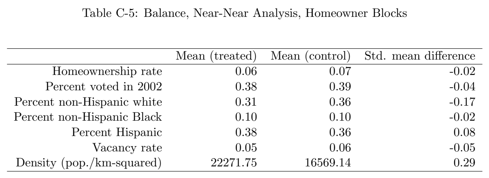

***Table C-5.*** Balance, Near-Near Analysis, Homeowner Blocks

[Download data as CSV](tables/tab-06.csv)

Mean (treated) Mean (control) Std. mean difference Homeownership rate 0.06 0.07 -0.02 Percent voted in 2002 0.38 0.39 -0.04 Percent non-Hispanic white 0.31 0.36 -0.17 Percent non-Hispanic Black 0.10 0.10 -0.02 Percent Hispanic 0.38 0.36 0.08 Vacancy rate 0.05 0.06 -0.05 Density (pop./km-squared) 22271.75 16569.14 0.29

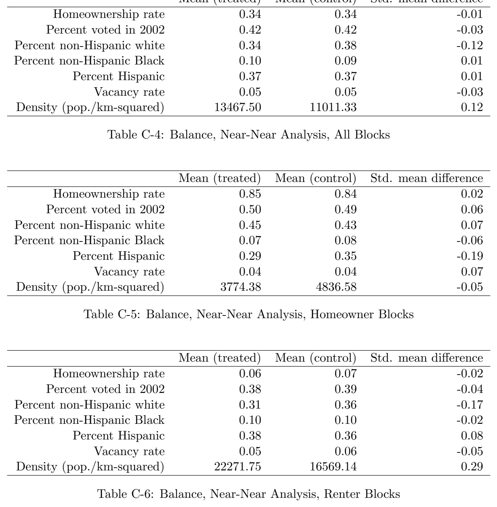

***Table C-6.*** Balance, Near-Near Analysis, Renter Blocks

[Download data as CSV](tables/tab-07.csv)

## D Results in Tabular Form

D.1 Results - Full Sample

Binary Proximity Units Continuous LIHTC Project 0.021∗∗∗ 0.019∗∗ 0.023∗∗ 0.020∗∗ (0.006) (0.006) (0.008) (0.007) % Renters 0.013 0.003 0.002 0.019∗ (0.007) (0.006) (0.006) (0.008) LIHTC x % Renters −0.030∗∗∗ −0.029∗∗∗ −0.038∗∗∗ −0.028∗∗ (0.008) (0.007) (0.010) (0.009) LIHTC FE Yes Yes Yes Yes LIHTC SE Clusters Yes Yes Yes Yes R2 0.236 0.236 0.237 0.219 Adj. R2 0.175 0.175 0.175 0.180 Num. obs. 6000 6000 6000 9292

RMSE 0.477 0.477 0.476 0.468 N Clusters 444 444 444 446

∗∗∗p < 0.001; ∗∗p < 0.01; ∗p < 0.05

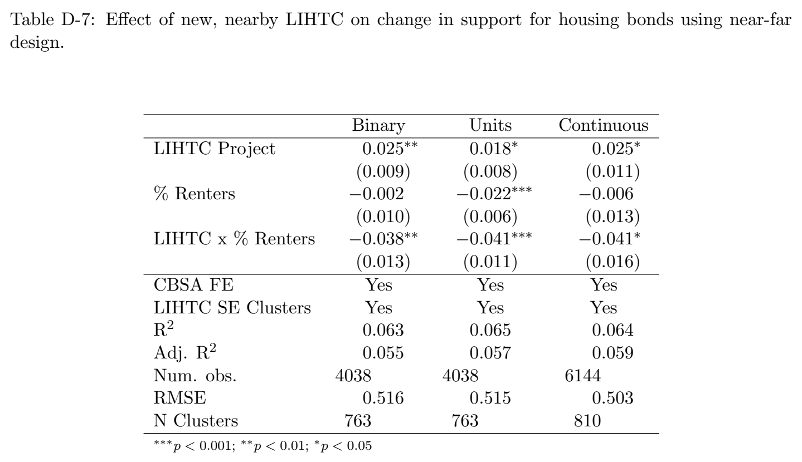

***Table D-7.*** Effect of new, nearby LIHTC on change in support for housing bonds using near-far design.

[Download data as CSV](tables/tab-08.csv)

Binary Units Continuous LIHTC Project 0.025∗∗ 0.018∗ 0.025∗ (0.009) (0.008) (0.011) % Renters −0.002 −0.022∗∗∗ −0.006 (0.010) (0.006) (0.013) LIHTC x % Renters −0.038∗∗ −0.041∗∗∗ −0.041∗ (0.013) (0.011) (0.016) CBSA FE Yes Yes Yes

LIHTC SE Clusters Yes Yes Yes

R2 0.063 0.065 0.064 Adj. R2 0.055 0.057 0.059 Num. obs. 4038 4038 6144

RMSE 0.516 0.515 0.503 N Clusters 763 763 810

∗∗∗p < 0.001; ∗∗p < 0.01; ∗p < 0.05

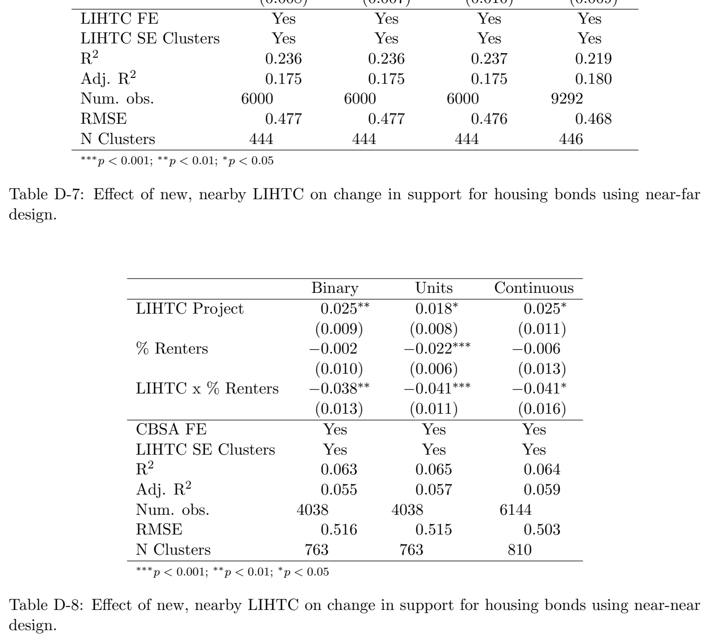

***Table D-8.*** Effect of new, nearby LIHTC on change in support for housing bonds using near-near design.

[Download data as CSV](tables/tab-09.csv)

D.2 Results - Using blocks not treated by new LIHTC from 1999-2002 (“Clean” Sample)

Binary Proximity Units Continuous LIHTC Project 0.022∗∗∗ 0.019∗∗ 0.024∗∗ 0.022∗∗ (0.006) (0.006) (0.008) (0.007) % Renters 0.014 0.003 0.002 0.022∗∗ (0.007) (0.006) (0.006) (0.008) LIHTC x % Renters −0.032∗∗∗ −0.029∗∗∗ −0.044∗∗∗ −0.033∗∗ (0.008) (0.008) (0.012) (0.010) LIHTC FE Yes Yes Yes Yes

LIHTC SE Clusters Yes Yes Yes Yes R2 0.243 0.242 0.244 0.225 Adj. R2 0.177 0.176 0.178 0.183 Num. obs. 5527 5527 5527 8649

RMSE 0.478 0.478 0.478 0.470 N Clusters 443 443 443 445

∗∗∗p < 0.001; ∗∗p < 0.01; ∗p < 0.05

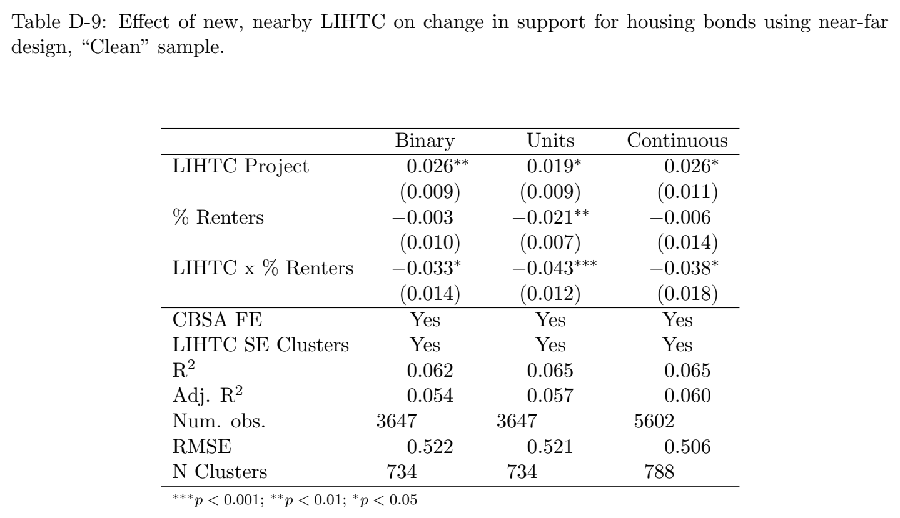

***Table D-9.*** Effect of new, nearby LIHTC on change in support for housing bonds using near-far design, “Clean” sample.

[Download data as CSV](tables/tab-10.csv)

Binary Units Continuous LIHTC Project 0.026∗∗ 0.019∗ 0.026∗ (0.009) (0.009) (0.011) % Renters −0.003 −0.021∗∗ −0.006 (0.010) (0.007) (0.014) LIHTC x % Renters −0.033∗ −0.043∗∗∗ −0.038∗ (0.014) (0.012) (0.018) CBSA FE Yes Yes Yes

LIHTC SE Clusters Yes Yes Yes

R2 0.062 0.065 0.065 Adj. R2 0.054 0.057 0.060 Num. obs. 3647 3647 5602

RMSE 0.522 0.521 0.506 N Clusters 734 734 788

∗∗∗p < 0.001; ∗∗p < 0.01; ∗p < 0.05

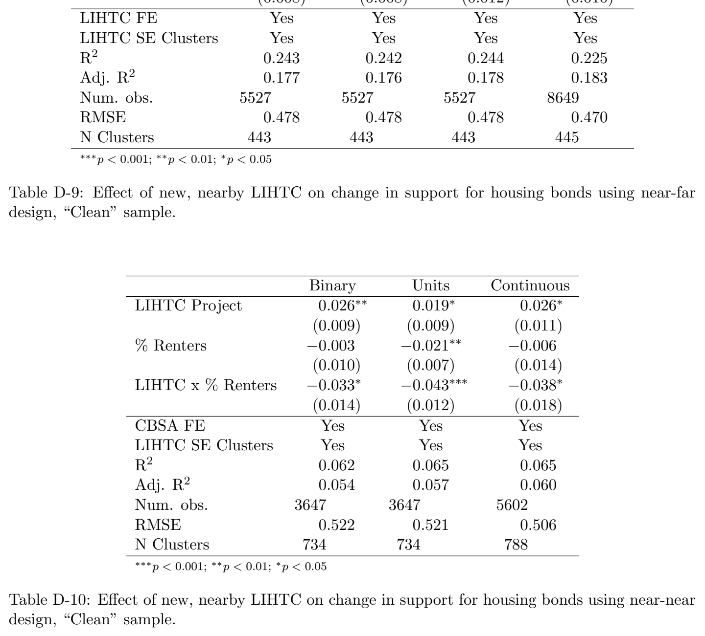

***Table D-10.*** Effect of new, nearby LIHTC on change in support for housing bonds using near-near design, “Clean” sample.

[Download data as CSV](tables/tab-11.csv)

D.3 Treatment Effect Heterogeneity by Price Effects

Prices decreased Prices increased

Near-far Near-near Near-far Near-near LIHTC Project 0.017 0.018 0.034∗∗ 0.017 (0.012) (0.022) (0.012) (0.018) % Renters 0.027 0.008 0.030 −0.013 (0.014) (0.026) (0.015) (0.023) LIHTC x % Renters −0.036∗ −0.049 −0.041∗ −0.037 (0.017) (0.035) (0.018) (0.026) LIHTC FE Yes No Yes No

CBSA FE No Yes No Yes

LIHTC SE Clusters Yes Yes Yes Yes R2 0.290 0.098 0.175 0.080 Adj. R2 0.257 0.087 0.131 0.064 Num. obs. 3068 2150 2604 1604

RMSE 0.451 0.507 0.478 0.479 N Clusters 134 270 129 217

∗∗∗p < 0.001; ∗∗p < 0.01; ∗p < 0.05

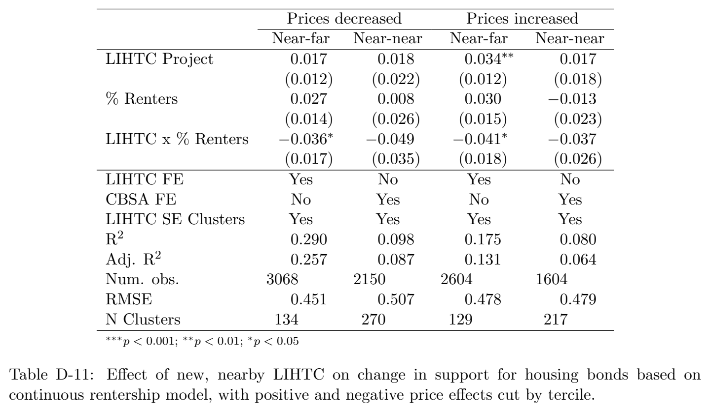

***Table D-11.*** Effect of new, nearby LIHTC on change in support for housing bonds based on continuous rentership model, with positive and negative price effects cut by tercile.

[Download data as CSV](tables/tab-12.csv)

D.4 Gentrification Status Analysis for Renters

Near-Far Near-Near

Binary Units Proximity Binary Units LIHTC Project 0.006 0.003 0.005 −0.006 −0.011 (0.007) (0.007) (0.008) (0.012) (0.010) Gentrifying −0.000 −0.011 −0.010 −0.039∗ −0.042∗∗ (0.010) (0.010) (0.010) (0.019) (0.013) LIHTC x Gentrifying −0.030∗∗ −0.021 −0.024 −0.015 −0.018 (0.011) (0.011) (0.013) (0.020) (0.014) CBSA FE Yes Yes Yes Yes Yes LIHTC SE Clusters Yes Yes Yes Yes Yes R2 0.290 0.288 0.290 0.110 0.118 Adj. R2 0.220 0.219 0.221 0.098 0.105 Num. obs. 2187 2187 2187 1820 1820

RMSE 0.429 0.430 0.429 0.483 0.481 N Clusters 192 192 192 330 330

∗∗∗p < 0.001; ∗∗p < 0.01; ∗p < 0.05

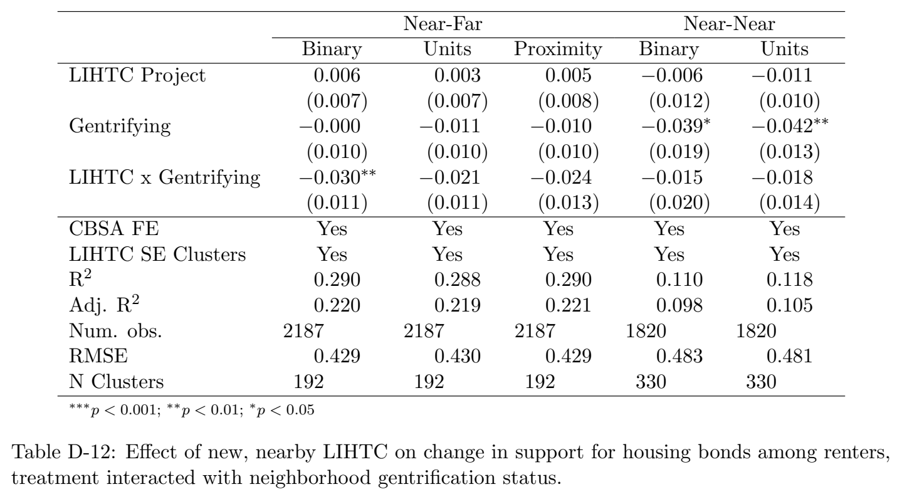

***Table D-12.*** Effect of new, nearby LIHTC on change in support for housing bonds among renters, treatment interacted with neighborhood gentrification status.

[Download data as CSV](tables/tab-13.csv)

## E Multiple Hypothesis Adjustment

Our analysis is built around two hypotheses. The first is that homeowners exposed to new, nearby LIHTC developments will increase their support for funding affordable housing. The second is that renters will have a negative reaction to LIHTC, expressing less support for affordable housing after being treated by new, nearby LIHTC.

To account for these two hypotheses, we use the Holm-Bonferroni correction (Holm 1979), which is a uniformly more powerful, sequential application of the Bonferroni correction (Rice 1989). To implement this adjustment, we order our two hypotheses from lowest to highest based on their maximum p-values (i.e., H ,..., H , where m = 2). Next, each p-value is compared to a significance 1 m

threshold defined by the position of its respective hypothesis (k) and the standard of α = 0.05. If P < α , then we reject the null hypothesis and proceed to the next hypothesis. We report k (m+1−k)

all comparisons between p-values and adjusted significance thresholds in Table E-13.

To begin, we organize our hypotheses according to the maximum p-value from the seven models (four “near-far” models and three “near-near” models). The lowest maximum p-value comes from our hypothesis that homeowners would have a positive response to new, nearby LIHTC (“Homeowners > 0”). We compare each p-value from this hypothesis to an adjusted significance threshold based on P < α or P < 0.025. In Table E-13, we indicate whether each p-value is less than k (2+1−1) k

this adjusted significant threshold. For this hypothesis, 6 out of 7 tests produce p-values below the adjusted significance threshold.

Our second hypothesis is that renters would show a negative response to new, nearby LIHTC (“Renters < 0”). We compare the p-values from the tests of this hypothesis to a new adjusted threshold: P < α or P < 0.050. For this hypothesis, 4 out of 7 tests produce p-values below k (2+1−2) k

the adjusted significance threshold. Thus, evidence for this hypothesis is less conclusive than that for the previous hypothesis.

All confidence intervals in Figures 4 and 5 in the text are adjusted according to the procedure outlined here.

Table E-13: Significance of Main Results using Holm-Bonferroni-Adjusted Significance Threshold Hypothesis Design Model p-Value H-B Threshold Adjusted Sig.? Homeowners > 0 Near-Far Binary 0.000 0.025 ✓

Homeowners > 0 Near-Far Distance 0.001 0.025 ✓

Homeowners > 0 Near-Far Units 0.003 0.025 ✓

Homeowners > 0 Near-Far Continuous 0.003 0.025 ✓ Homeowners > 0 Near-Near Binary 0.004 0.025 ✓ Homeowners > 0 Near-Near Units 0.028 0.025 - Homeowners > 0 Near-Near Continuous 0.020 0.025 ✓ Renters < 0 Near-Far Binary 0.045 0.050 ✓ Renters < 0 Near-Far Distance 0.028 0.050 ✓ Renters < 0 Near-Far Units 0.035 0.050 ✓ Renters < 0 Near-Far Continuous 0.055 0.050 - Renters < 0 Near-Near Binary 0.205 0.050 - Renters < 0 Near-Near Units 0.006 0.050 ✓ Renters < 0 Near-Near Continuous 0.099 0.050 -

## F Sensitivity Analysis

F.1 Distance Bands

The following figures show the effects of the “Binary” treatment based on different radii for defining treated blocks versus control blocks. All datasets are based on an outer limit of the control ring set at 600 meters. The radii listed on the x-axis represent the radius of the outer limit of the treated ring, which is also the inner limit of the control ring. As the radius increases, more blocks will be defined as treated and fewer will be defined as control. At some hypothetical radius, the entire treatment effect will be captured, providing the clearest contrast with the control blocks. We believe that radius is 350 meters. However, as shown in these figures, the point estimates are stable across a wide variety of distance band specifications.

Here, all tercile cutpoints are set based on the cutpoints for our preferred distance band specification (350 meters). The cutpoints are > 67% homeownership rate for homeowner blocks and < 21% homeownership rate for renter blocks

300m 325m 350m 375m 400m 425m Radius

etamitsE

Design Near-Far Near-Near

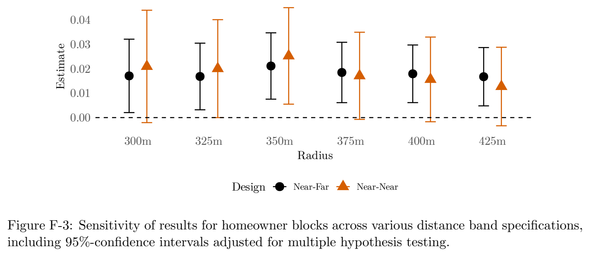

***Figure F-3.*** Sensitivity of results for homeowner blocks across various distance band specifications, including 95%-confidence intervals adjusted for multiple hypothesis testing.

300m 325m 350m 375m 400m 425m Radius

etamitsE

Design Near-Far Near-Near

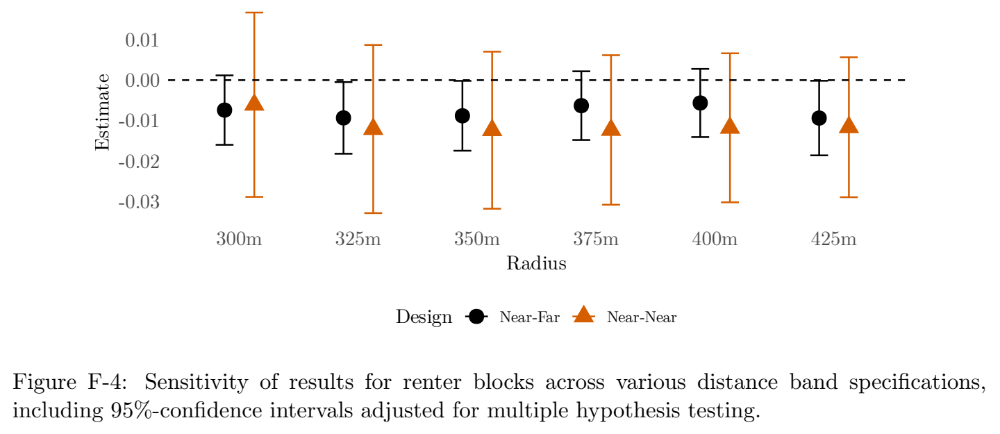

***Figure F-4.*** Sensitivity of results for renter blocks across various distance band specifications, including 95%-confidence intervals adjusted for multiple hypothesis testing.

F.2 Homeownership Cutpoints

For all moderating variables, we categorize blocks based on the tercile cutpoints of the variable among all unique blocks. These cutpoints allow us to define “homeowner blocks” as blocks with homeownership rates of > 67% and “renter blocks” as blocks with homeownership rates of < 21% as of 2000 (Figure F-5). Setting the cutpoints for categorizing high and low subgroups strikes a balance between maximizing the homogeneity of the residents within that subgroup while also ensuring that enough units remain in each subgroup to estimate a treatment effect should one exist. We test the sensitivity of our binary treatment specification to different cutpoints in defining homeowner blocks and renter blocks. Figures F-6 through F-7 show the average treatment effects for the “Binary” treatment for the near-far and near-near designs on homeowner and renter blocks at higher and lower cutpoints. The results are substantively similar at cutpoints ±10 percentage points for each subgroup and design.

Of note, in many of our model specifications, we drop Census blocks that are neither in the top nor bottom tercile of the homeownership rate. Of the 458 LIHTC developments in our analysis sample, only 12 developments are dropped from the analysis because they solely consists of middletercile blocks. Additionally, while some areas have higher homeownership rates overall, 39% of the LIHTC developments have both homeowner and renter blocks within 350 meters. For example, even in the majority renter city of San Francisco, 10 LIHTC developments were constructed from 2003-2006, 6 of which have homeowner blocks within 350 meters.

0.00 0.25 0.50 0.75 1.00

Homeownership Rate, 2000

ytisneD

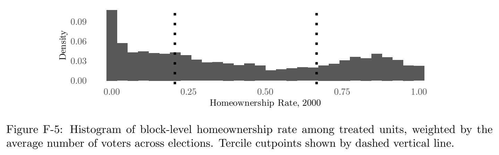

***Figure F-5.*** Histogram of block-level homeownership rate among treated units, weighted by the average number of voters across elections. Tercile cutpoints shown by dashed vertical line.

>60% >65% >70% >75% >80% Cutpoint

etamitsE

Design Near-Far Near-Near

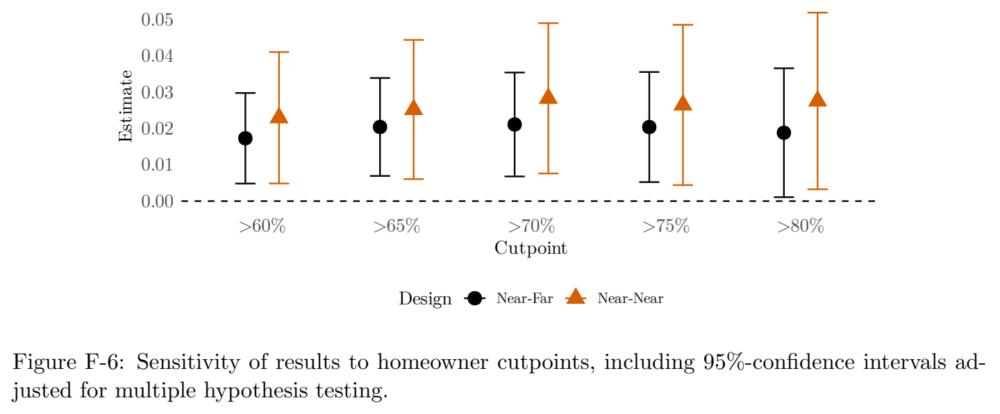

***Figure F-6.*** Sensitivity of results to homeowner cutpoints, including 95%-confidence intervals ad- justed for multiple hypothesis testing.

<10% <15% <20% <25% <30% Cutpoint

etamitsE

Design Near-Far Near-Near

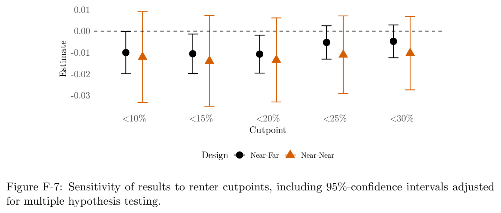

***Figure F-7.*** Sensitivity of results to renter cutpoints, including 95%-confidence intervals adjusted for multiple hypothesis testing.

## G Robustness Checks

G.1 Placebo Test

Binary Proximity Units Continuous LIHTC Project 0.004 0.002 0.010 0.003 (0.007) (0.007) (0.006) (0.007) % Renters 0.016∗ 0.014∗ 0.014∗ 0.016 (0.007) (0.006) (0.006) (0.008) LIHTC x % Renters −0.005 −0.004 −0.004 −0.004 (0.009) (0.010) (0.012) (0.012) LIHTC FE Yes Yes Yes Yes

LIHTC SE Clusters Yes Yes Yes Yes

R2 0.254 0.254 0.254 0.241 Adj. R2 0.191 0.191 0.191 0.201 Num. obs. 5465 5465 5465 8623

RMSE 0.477 0.477 0.476 0.467 N Clusters 423 423 423 431

∗∗∗p < 0.001; ∗∗p < 0.01; ∗p < 0.05

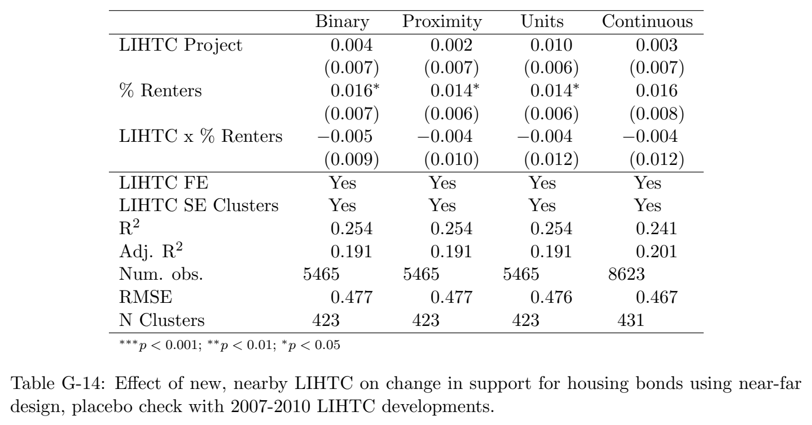

***Table G-14.*** Effect of new, nearby LIHTC on change in support for housing bonds using near-far design, placebo check with 2007-2010 LIHTC developments.

[Download data as CSV](tables/tab-14.csv)

G.2 Other Block-Level Covariates

Homeowners White Black Hispanic Vacancy Density (n = 6,000) (n = 6,161) (n = 6,540) (n = 6,028) (n = 6,261) (n = 5,427)

Variable

etamitsE

Tercile High Tercile Low Tercile

Figure G-8: Treatment effects from the near-far design, using other block-level covariates as binary treatments, including 95%-confidence intervals. These “Homeowners” confidence intervals are not adjusted for multiple hypothesis testing so as to present an equivalent comparison of the treatments across all block-level covariates.

Homeowners White Black Hispanic Vacancy Density (n = 4,038) (n = 3,995) (n = 4,273) (n = 4,056) (n = 4,048) (n = 3,876)

Variable

etamitsE

Tercile High Tercile Low Tercile

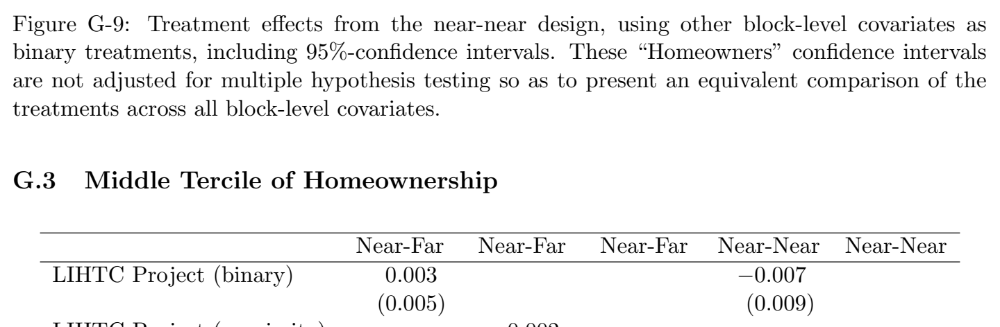

***Figure G-9.*** Treatment effects from the near-near design, using other block-level covariates as binary treatments, including 95%-confidence intervals. These “Homeowners” confidence intervals are not adjusted for multiple hypothesis testing so as to present an equivalent comparison of the treatments across all block-level covariates.

G.3 Middle Tercile of Homeownership

Near-Far Near-Far Near-Far Near-Near Near-Near

LIHTC Project (binary) 0.003 −0.007

(0.005) (0.009)

LIHTC Project (proximity) 0.002

(0.005)

LIHTC Project (units) −0.004 −0.022∗ (0.006) (0.009) LIHTC FE LIHTC LIHTC LIHTC CBSA CBSA LIHTC SE Clusters Yes Yes Yes Yes Yes R2 0.300 0.300 0.300 0.092 0.096 Adj. R2 0.212 0.212 0.212 0.079 0.083 Num. obs. 3260 3260 3260 2087 2087

RMSE 0.447 0.447 0.447 0.475 0.474 N Clusters 365 365 365 572 572

∗∗∗p < 0.001; ∗∗p < 0.01; ∗p < 0.05

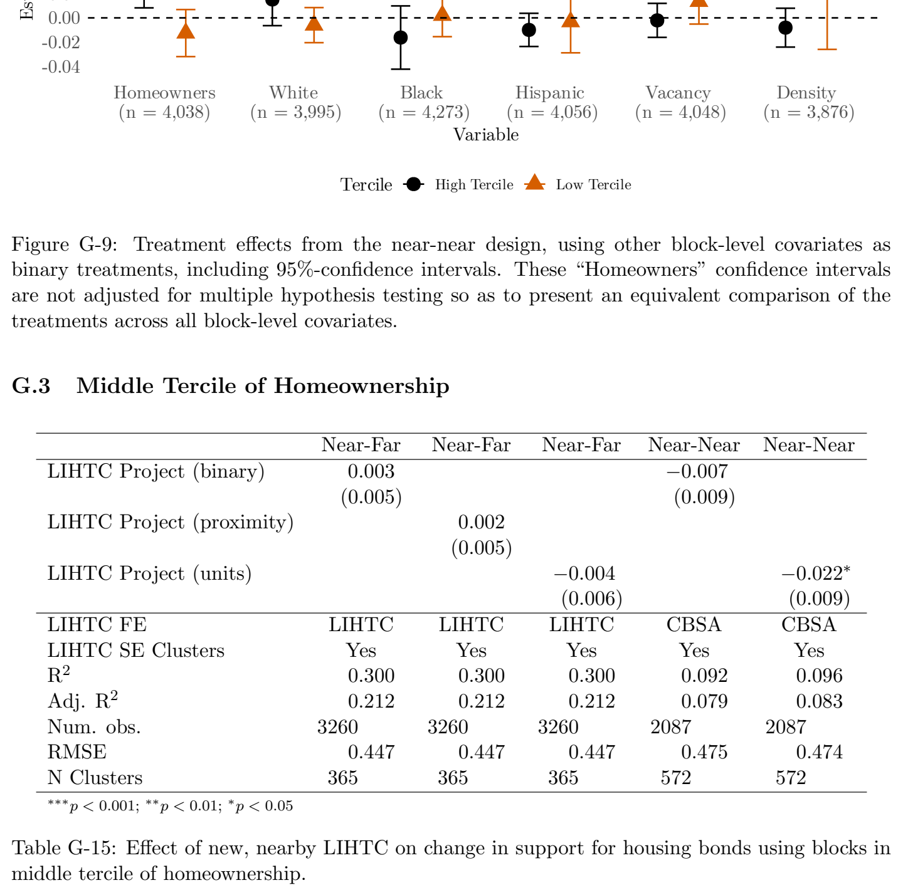

***Table G-15.*** Effect of new, nearby LIHTC on change in support for housing bonds using blocks in middle tercile of homeownership.

[Download data as CSV](tables/tab-15.csv)

G.4 Naive Difference in Means

As a validation check, we present a nonparametric difference-in-means estimate of the effect of LIHTC developments by calculating the voter-weighted average change in housing bond support between treated and control blocks. We use the “Binary” approach outlined above, as the sharp cutpoints are most intuitive for a simple difference. Table G-16 shows our dependent variable, the change in support for the housing bonds, as a voter-weighted mean within both the treated and control groups. Starting with homeowner blocks (top row), we find that treated blocks on average increased their support for the housing bonds by 2.8 percentage points whereas control blocks increased their support by 1.2 percentage points. The difference in means between treated and control blocks is 1.7 percentage points, representing our nonparametric estimate of the effect of new LIHTC development on voters in homeowner blocks.

The second row shows the change in support among renter blocks. In contrast to homeowners, the average treated renter block decreased support for funding affordable housing by 1.3 percentage points while the average control renter block increased support for funding by 0.1 percentage points. The difference of means between treated and control blocks suggests that renter blocks near new LIHTC development decrease their support for affordable housing by 1.4 percentage points compared to renter blocks farther away. Both the differences for homeowner and renter blocks match our parametric estimates from the near-far design.

Treated Control Difference

Homeowners 0.028 0.012 0.017

n = 1,096 n = 2,506

Renters -0.013 0.001 -0.014

n = 1,569 n = 2,034

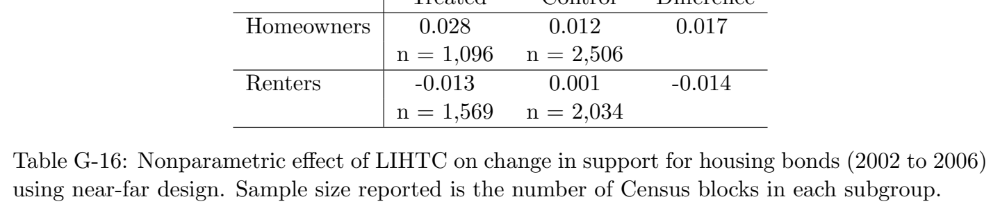

***Table G-16.*** Nonparametric effect of LIHTC on change in support for housing bonds (2002 to 2006) using near-far design. Sample size reported is the number of Census blocks in each subgroup.

[Download data as CSV](tables/tab-16.csv)

For the near-near design, we again start with our nonparametric difference in means between treated and control units in Table G-17. The sample size of treated blocks in the near-near design is the same as the near-far design because the treated units are the same across both approaches. The near-near design only changes the control group against which the treated units are being compared. That the two different control groups show similar stability in housing bond support from 2002 to 2006 makes us more confident in the analytical strategy.

Treated Control Difference

Homeowners 0.028 0.005 0.023

n = 1,096 n = 783

Renters -0.013 0 -0.013

n = 1,569 n = 1,409

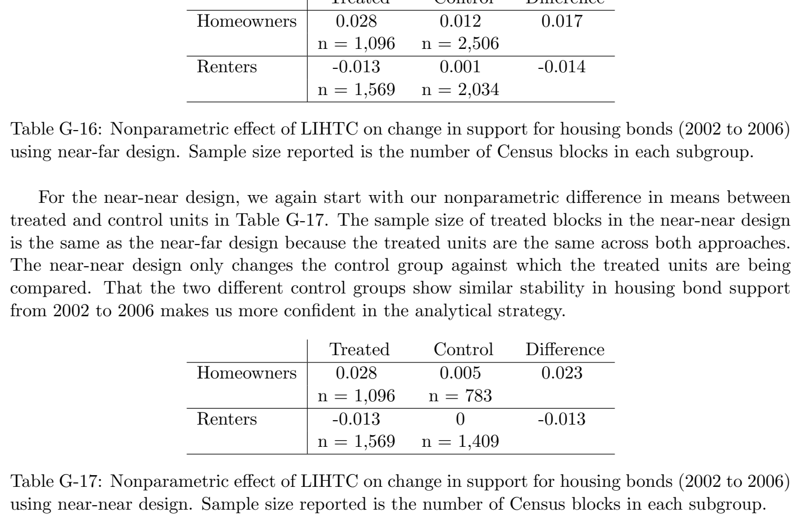

***Table G-17.*** Nonparametric effect of LIHTC on change in support for housing bonds (2002 to 2006) using near-near design. Sample size reported is the number of Census blocks in each subgroup.

[Download data as CSV](tables/tab-17.csv)

## H Mechanisms

H.1 Price Effects

In Table H-18, we report population-weighted means of key pretreatment characteristics of the LIHTC developments sited from 2003 to 2006 that were in the top tercile of price effects, with nearby home prices increasing by at least 7% (“Prices Increased”), as well as the bottom tercile, where prices decreased by at least 5% (“Prices Decreased”). The unit of analysis is unique blocks within our treated sample.29 The final column of Table H-18 shows the p-values from two-sided t-tests comparing the two groups.

Broadly speaking, blocks in the bottom tercile look similar to blocks in the top tercile. They have similar homeownership rates, vacancy rates, population densities, and pretreatment levels of support for the 2002 statewide affordable housing bond. The blocks are also almost identical in their racial/ethnic composition, as even the statistically significant difference in percent Black is substantively small (∼3 percentage points). However, these blocks substantively differ in their local economic conditions. Areas where LIHTC decreased home prices had higher median home values in the year 2000 (+17%, p < 0.001) as well as higher median household incomes (+5%, p < 0.05). In short, the LIHTC developments in our sample increased property values in areas where the new development may have been more likely to replace blight. In contrast, the developments in our sample decreased property values in more middle-class neighborhoods, where the LIHTC was less likely to replace blight and may have been more associated with negative externalities (e.g., noise and congestion due to higher density housing). These trends align with our expectations as well as other research showing that LIHTC development increases property values in lower-income and distressed neighborhoods (e.g., Diamond and McQuade 2019; Dillman, Horn, and Verrilli 2017).

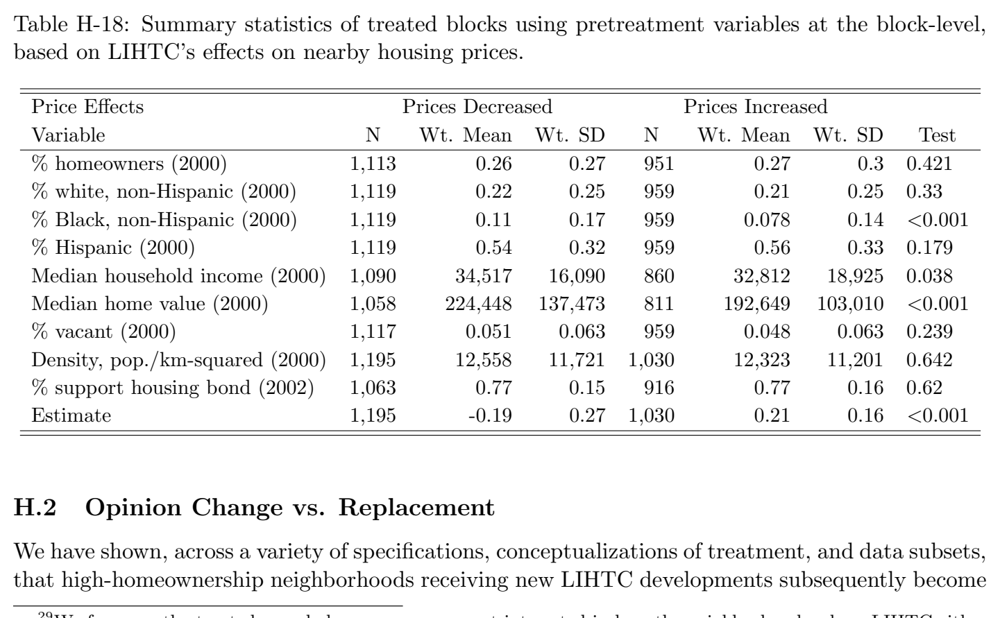

***Table H-18.*** Summary statistics of treated blocks using pretreatment variables at the block-level, based on LIHTC’s effects on nearby housing prices.

[Download data as CSV](tables/tab-18.csv)

Price Effects Prices Decreased Prices Increased

Variable N Wt. Mean Wt. SD N Wt. Mean Wt. SD Test

% homeowners (2000) 1,113 0.26 0.27 951 0.27 0.3 0.421 % white, non-Hispanic (2000) 1,119 0.22 0.25 959 0.21 0.25 0.33

% Black, non-Hispanic (2000) 1,119 0.11 0.17 959 0.078 0.14 <0.001 % Hispanic (2000) 1,119 0.54 0.32 959 0.56 0.33 0.179 Median household income (2000) 1,090 34,517 16,090 860 32,812 18,925 0.038 Median home value (2000) 1,058 224,448 137,473 811 192,649 103,010 <0.001 % vacant (2000) 1,117 0.051 0.063 959 0.048 0.063 0.239 Density, pop./km-squared (2000) 1,195 12,558 11,721 1,030 12,323 11,201 0.642

% support housing bond (2002) 1,063 0.77 0.15 916 0.77 0.16 0.62

Estimate 1,195 -0.19 0.27 1,030 0.21 0.16 <0.001 H.2 Opinion Change vs. Replacement

We have shown, across a variety of specifications, conceptualizations of treatment, and data subsets, that high-homeownership neighborhoods receiving new LIHTC developments subsequently become 29We focus on the treated sample because we are most interested in how the neighborhoods where LIHTC either increased or decreased prices compare to one another, and these are the areas where housing prices were most acutely affected by LIHTC according to the logic of our research design.

more supportive of additional public spending on affordable housing. But our ability to test behavioral outcomes directly is hindered by our inability to observe individual voting decisions. In particular, changes in the composition of the electorate from the pre-treatment to post-treatment periods would threaten the validity of our claims about how new LIHTC development shapes voter preferences. Below we interrogate whether the estimated treatment effects can be attributed to changes in who votes.

We first attempt to disentangle opinion change — the effect predicted by our theory — from replacement, whereby opponents of nearby LIHTC move away from the area and supporters disproportionately move in. First, we derive a decomposition of our dependent variable — change in average support for the bond between 2002 and 2006 — into a weighted sum of opinion change and replacement components. Although we cannot compute these components directly, since we cannot observe the vote choice of people who move in and out a particular area, we can compute bounds on opinion change based on residential churn data and some assumptions about the replacement process. Specifically, the lower bound on opinion change is achieved when the replacement component is at its maximum: that is, when everyone who moves away from a LIHTC-treated area between the two affordable housing bonds opposes the bond and everyone who moves in supports it. Conversely, the upper bound is achieved in the (unlikely) scenario when everyone who moves away supports the bond, and everyone who moves in opposes it.

Decomposition of the dependent variable. Our dependent variable, the change in the proportion of voters in a block who supported the bond from 2002 to 2006, can be decomposed as follows:

prop. support in 2006 prop. support in 2002

(cid:122) (cid:125)(cid:124) (cid:123) (cid:122) (cid:125)(cid:124) (cid:123)

1 (cid:88)

N06

1 (cid:88)

N02

∆ = 1(V ote = Y es) − 1(V ote = Y es) = 2006,2002 i,2006 i,2002 N N

06 02

i=1 i=1

(cid:34)

n B 1 (cid:88)

nB

1(V ote = Y es) + n 06 1 (cid:88)

n06

1(V ote = Y es) (cid:35) i,2006 i,2006

N 06 n B N 06 n 06 (4) i=1 i=1

(cid:124) (cid:123)(cid:122) (cid:125) prop. support in 2006

(cid:34)

n B 1 (cid:88)

nB

1(V ote = Y es) + n 02 1 (cid:88)

n02

1(V ote = Y es) (cid:35) i,2002 i,2002

N n N n

### 02 B 02 02

i=1 i=1

(cid:124) (cid:123)(cid:122) (cid:125) prop. support in 2002

where we have divided the total voting population into three types:

• Voters who were there (in the block) in both 2002 and 2006, of whom there are n • Voters who were there in 2002 and left before 2006, of whom there are n

• Voters who were not there in 2002 and moved in by 2006, of whom there are n

And we have N as the total number of voters in the 2002 election as well as N as the total 02 06

number of voters in the 2006 election, giving us:

• N = n + n

### 02 B 02

• N = n + n

### 06 B 06

Rearranging Equation 4:

part due to opinion change (cid:122) (cid:125)(cid:124) (cid:123) (cid:34)

n B 1 (cid:88)

nB

1(V ote = Y es) − n B 1 (cid:88)

nB

1(V ote = Y es) (cid:35) 2006,2002 i,2006 i,2002

N n N n

### 06 B 02 B

i=1 i=1

(cid:34)

n 06 1 (cid:88)

n06

1(V ote = Y es) − n 02 1 (cid:88)

n02

1(V ote = Y es) (cid:35) i,2006 i,2002

N n N n

06 06 02 02

i=1 i=1

(cid:124) (cid:123)(cid:122) (cid:125) part due to replacement

We can write this more compactly as:

(cid:18) (cid:19) (cid:18) (cid:19) n n n n

B B 06 02

∆ = x¯ − x¯ + x¯ − x¯ (6) 2006,2002 B,2006 B,2002 06,2006 02,2002 N N N N

06 02 06 02

(cid:124) (cid:123)(cid:122) (cid:125) (cid:124) (cid:123)(cid:122) (cid:125)

opinion change replacement

where:

• x¯ is the proportion of voters who were in the block in both 2002 and 2006 who supported B,2006

the bond in 2006

• x¯ is the proportion of voters who were in the block in both 2002 and 2006 who supported B,2002

the bond in 2002

• x¯ is the proportion of voters who moved in between 2002 and 2006 who supported the 06,2006

bond in 2006

• x¯ is the proportion of voters who moved out between 2002 and 2006 who supported the 02,2002

bond in 2002

Rearranging, we can isolate opinion change as:

(cid:18) (cid:19) n n

06 02

opinion change = ∆ − x¯ − x¯ (7) 2006,2002 06,2006 02,2002

N N

06 02

(cid:124) (cid:123)(cid:122) (cid:125)

replacement

Computing bounds on opinion change. We assume that in control blocks, there is no differential residential turnover, so that x¯ = x¯ = x¯ = x¯ . For treatment blocks, the B,2006 B,2002 06,2006 02,2002

lower bound on opinion change is achieved when the replacement component is at its maximum, which is when x¯ = 1 and x¯ = 0. Then, opinion change is:

06,2006 02,2002

min(opinion change) = ∆ − (8) 2006,2002

Conversely, the upper bound is achieved when x¯ = 0 and x¯ = 1. Then, opinion change 06,2006 02,2002

is:

max(opinion change) = ∆ + (9) 2006,2002

It is also possible to consider any combination of intermediate values for x¯ ∈ [0, 1] and 02,2002

x¯ ∈ [0, 1]. This is what we do in Figures H-10 and H-11. Here, we plot treatment effect 06,2006

estimates from our near-far and near-near designs, respectively, where the dependent variable is opinion change computed using Equation 7 above with different values of x¯ and x¯ . For 02,2002 06,2006

clarity of presentation, we focus on the binary definition of treatment and on homeowner blocks. To compute these estimates, we require block-level estimates of n and N . We measure N as 06 06 06

the number of voters in the 2006 election. We estimate n as the number of transactions recorded in the block in the years 2003 through 2006, inclusive,30 multiplied by the number of adults per household,31 multiplied by the statewide voter turnout rate in the 2006 election.32

The left-most estimate of the effect of nearby LIHTC on opinion change under the near-far approach, achieved when x¯ is 1 and x¯ is 0, represents the upper bound on this effect, 0.16; 02,2002 06,2006

at the other end, the lower bound is −0.09. The estimated opinion change effect is approximately zero when 62% of voters who leave the block oppose the bond, while 62% of voters who move in support it, representing a total 24 percentage point gap between those who move out and those who move in. Note that x¯ and x¯ need not sum to 1. We choose symmetric values only so 02,2002 06,2006

that we can visualize the upper and lower bounds, and for general ease of interpretation. Results are very similar under the near-near approach: the opinion change effect is approximately zero when 64% of voters who leave the block oppose the bond and 64% of those who move in support it, representing a 28 percentage point difference.

30Since our elections of interest took place in November 2002 and November 2006, this gives us a close enough estimate of residential turnover between the two elections.

31Measured at the tract level in the 2010 Decennial Census.

32The 2006 turnout rate in California was 39.29%.

02, 2002

1.00 0.75 0.50 0.25 0.00 −0.1

0.00 0.25 0.50 0.75 1.00 06, 2006 tceffE

tnemtaerT

fo

tnenopmoC

egnahC

noinipO

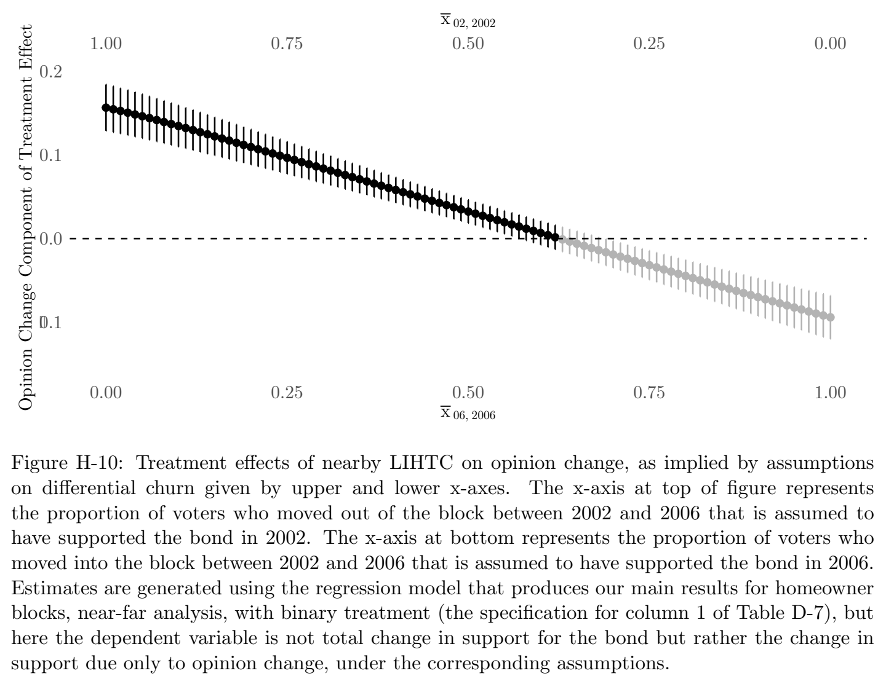

***Figure H-10.*** Treatment effects of nearby LIHTC on opinion change, as implied by assumptions on differential churn given by upper and lower x-axes. The x-axis at top of figure represents the proportion of voters who moved out of the block between 2002 and 2006 that is assumed to have supported the bond in 2002. The x-axis at bottom represents the proportion of voters who moved into the block between 2002 and 2006 that is assumed to have supported the bond in 2006. Estimates are generated using the regression model that produces our main results for homeowner blocks, near-far analysis, with binary treatment (the specification for column 1 of Table D-7), but here the dependent variable is not total change in support for the bond but rather the change in support due only to opinion change, under the corresponding assumptions.

02, 2002

1.00 0.75 0.50 0.25 0.00 −0.1

0.00 0.25 0.50 0.75 1.00 06, 2006 tceffE

tnemtaerT

fo

tnenopmoC

egnahC

noinipO

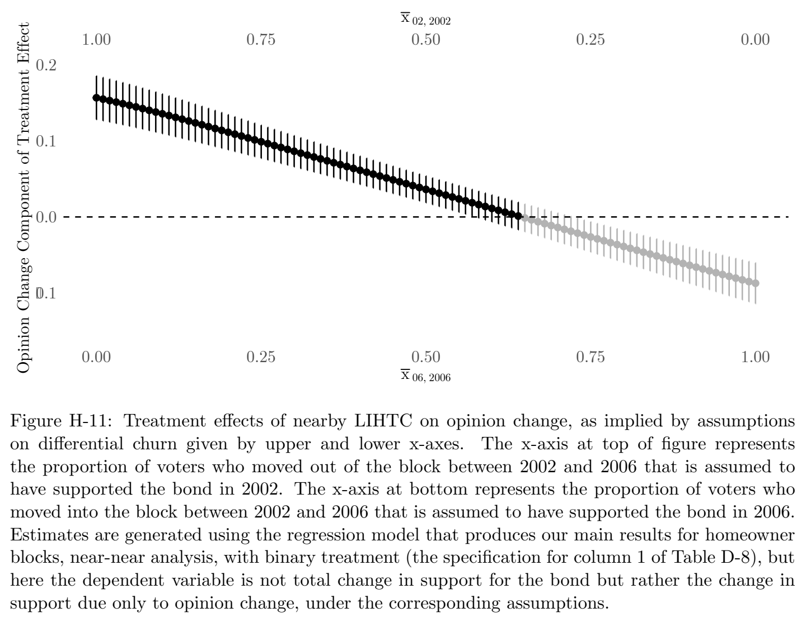

***Figure H-11.*** Treatment effects of nearby LIHTC on opinion change, as implied by assumptions on differential churn given by upper and lower x-axes. The x-axis at top of figure represents the proportion of voters who moved out of the block between 2002 and 2006 that is assumed to have supported the bond in 2002. The x-axis at bottom represents the proportion of voters who moved into the block between 2002 and 2006 that is assumed to have supported the bond in 2006. Estimates are generated using the regression model that produces our main results for homeowner blocks, near-near analysis, with binary treatment (the specification for column 1 of Table D-8), but here the dependent variable is not total change in support for the bond but rather the change in support due only to opinion change, under the corresponding assumptions.

H.3 Turnout

Mobilization could be driving our effects if the new LIHTC development increased or decreased voter turnout. The first question is whether we see differential voter turnout across elections in treated blocks versus control blocks. The CA Statewide Database records both the total number of voters who turned out in each election and the total number of registered voters at the block level. Figures H-12 and H-13 show the estimated effect of a LIHTC development on the change in block-level turnout using the standard array of models with our near-far and near-near designs, respectively. Point estimates are small and never statistically significant, making it unlikely that turnout is behind our effect.

We also assess effects on turnout using a 2007 California voter file. This approach not only allows us to avoid the problems of ecological inference (at least for turnout), but it allows us to subset to voters who we know were registered at an address within 600 meters of a future LIHTC development prior to the 2002 election. In other words, we are able to study precisely those who are experiencing the advent of LIHTC as a treatment rather than those selecting into the neighborhood after the affordable housing has been built.

To use the voter file data, we geocode all voters who were registered to vote prior to the 2002 general election within 600 meters of our LIHTC treatments. We then assign voters a treatment status according to our near-far and near-near designs. Voters are assigned homeownership terciles according to their block’s homeownership rate using the 2000 Census data and the cutpoints used throughout this analysis.33 We then use the same OLS models as with our block-level outcomes. Unlike our block-level estimates, we see consistent negative and statistically significant effects of LIHTC development on voter turnout (Tables H-19 and H-20). Using the near-far design, voters in homeowner blocks are 2 percentage points less likely to turnout in the 2006 general election compared to 2002. The interaction with voters in renter blocks shows a substantively large and generally statistically significant effect, one which counters the negative point estimates among homeowner blocks. This is evidence that the negative effect of affordable housing on turnout is concentrated in blocks comprising more than 2/3 homeowners. The near-near design shows larger negative effects among homeowners, but with less precision. Here the renter interaction is still positive but not large enough to counter the negative homeowner effect. While voter turnout shows more inconsistency between the near-far and near-near design than the rest of our analyses, the body of evidence suggests that this negative effect on turnout is real among voters who were registered to nearby addresses prior to the 2002 election.

33This assignment of homeownership tercile based on Census block implies that even this analysis requires some degree of ecological inference.

H.3.1 Turnout Analysis Using Block Data

Binary Proximity Units Continuous (n = 6,225) (n = 6,225) (n = 6,225) rentership (n = 9,164) Model

etamitsE

Tenancy Homeowners Renters

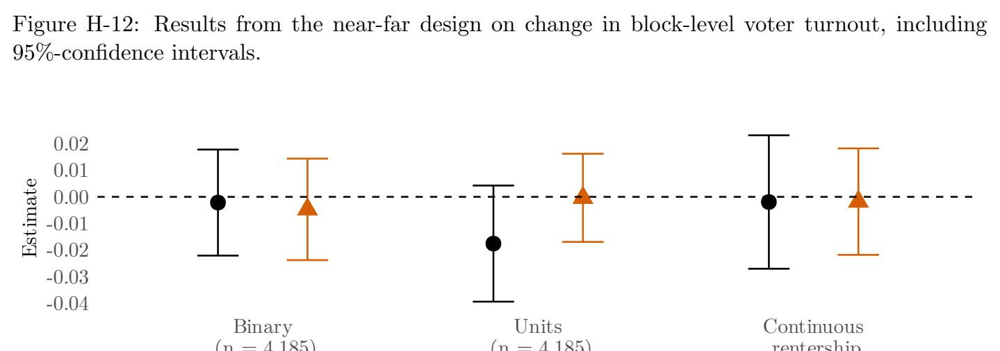

***Figure H-12.*** Results from the near-far design on change in block-level voter turnout, including 95%-confidence intervals.

Binary Units Continuous (n = 4,185) (n = 4,185) rentership (n = 6,372) Model

etamitsE

Tenancy Homeowners Renters

Figure H-13: Results from the near-near design on change in block-level voter turnout, including 95%-confidence intervals.

H.3.2 Turnout Analysis Using Voter File Data

All Clean LIHTC Project −0.019∗∗∗ −0.021∗∗∗ (0.005) (0.005) Renter Blocks −0.021∗ −0.023∗∗ (0.008) (0.009) LIHTC x Renter Blocks 0.016∗ 0.017∗ (0.007) (0.009) LIHTC FE Yes Yes LIHTC SE Clusters Yes Yes R2 0.197 0.190 Adj. R2 0.194 0.187 Num. obs. 136416 121908 RMSE 0.514 0.511 N Clusters 456 456 ∗∗∗p < 0.001; ∗∗p < 0.01; ∗p < 0.05

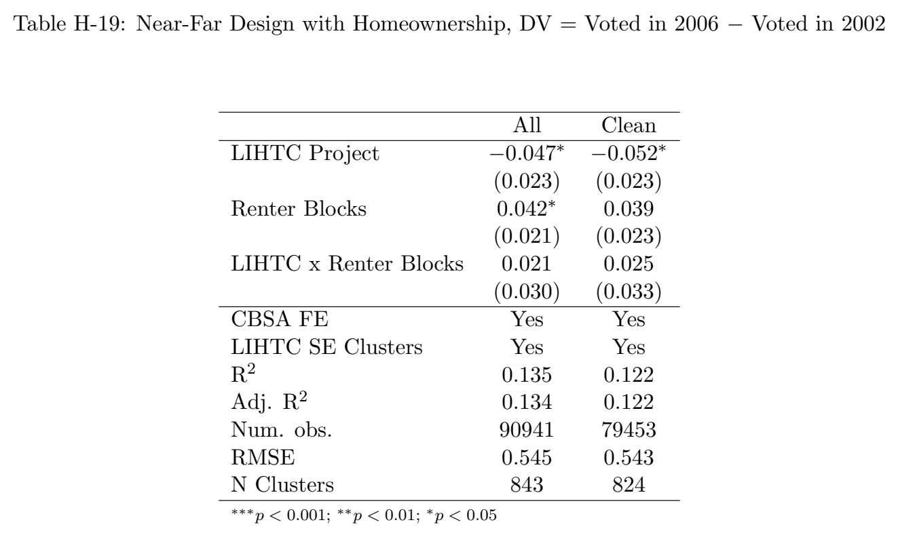

***Table H-19.*** Near-Far Design with Homeownership, DV = Voted in 2006 − Voted in 2002

[Download data as CSV](tables/tab-19.csv)

All Clean LIHTC Project −0.047∗ −0.052∗ (0.023) (0.023) Renter Blocks 0.042∗ 0.039 (0.021) (0.023) LIHTC x Renter Blocks 0.021 0.025 (0.030) (0.033) CBSA FE Yes Yes LIHTC SE Clusters Yes Yes R2 0.135 0.122 Adj. R2 0.134 0.122 Num. obs. 90941 79453 RMSE 0.545 0.543 N Clusters 843 824 ∗∗∗p < 0.001; ∗∗p < 0.01; ∗p < 0.05

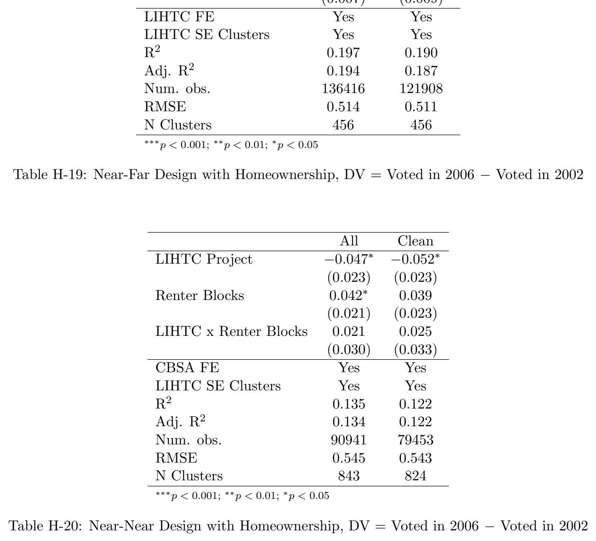

***Table H-20.*** Near-Near Design with Homeownership, DV = Voted in 2006 − Voted in 2002

[Download data as CSV](tables/tab-20.csv)

H.4 Roll-Off

Roll-off is a second mechanism that could be behind our treatment effects. Along with federal, state and local races, the 2002 California ballot had seven propositions on it. 2006 had thirteen. Consequently, the voter-weighted average roll-off from turning out to vote for the housing bonds in the 2002 and 2006 elections was 21% and 20%, respectively. Despite this consistently high roll-off rate, it is possible that local LIHTC construction could have mobilized nearby individuals to cast a vote on those down-ballot bonds — an effect that would not be detectable simply by examining turnout (i.e., whether an individual voted in the elections at all). Using data on the number of votes for each housing bond divided by the total number of votes at the block level, we find null effects with the exception of one model: the near-near design with a binary treatment (Figures H-14 and H-15). However, because of the inconsistency in size and direction of the effects, we are not convinced that our results are explained by differential roll-off between treated and control blocks. Binary Proximity Units Continuous (n = 6,225) (n = 6,225) (n = 6,225) rentership (n = 9,614) Model

etamitsE

Tenancy Homeowners Renters

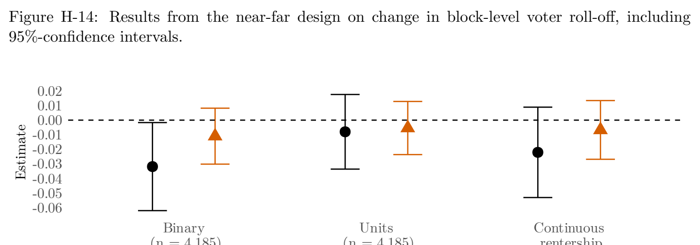

***Figure H-14.*** Results from the near-far design on change in block-level voter roll-off, including 95%-confidence intervals.

Binary Units Continuous (n = 4,185) (n = 4,185) rentership (n = 6,372) Model

etamitsE

Tenancy Homeowners Renters

Figure H-15: Results from the near-near design on change in block-level voter roll-off, including 95%-confidence intervals.

H.5 Gentrification and Homeowners

Using the same approach as we did for renters, we identify homeowner blocks which were gentrifying from 1990 to 2000, prior to the 2002 election. But whereas renter blocks show a clear and consistent pattern, gentrification status does not moderate the treatment effect of LIHTC on homeowner support for the housing bonds. That gentrification exclusively plays a role in renter blocks makes us more confident that the negative treatment effect of LIHTC on renter support is driven by concerns about rising housing costs.

Near-Far Near-Near

Binary Proximity Units Binary Unit (n = 964) (n = 964) (n = 964) (n = 515) (n = 515) Model

etamitsE

Design Near-Far Near-Near Trajectory Gentrifying Non-gentrifying Figure H-16: Results for homeowners and gentrification analysis, including 95%-confidence intervals adjusted for multiple hypothesis testing.

H.6 Rent Control

As of 2006, the following 14 California cities had some form of strict rent control: Berkeley, Beverly Hills, Cotati, East Palo Alto, Hayward, Los Angeles, Los Gatos, Oakland, Palm Springs, San Francisco, San Jose, Santa Monica, Thousand Oaks, and West Hollywood. If new LIHTC development raises concerns about gentrification and displacement among renters, then we would expect the protections provided by rent control to mitigate some of these concerns. In other words, LIHTC in cities with rent control may not decrease renters’ support for the affordable housing bond.

Unfortunately, of these cities with rent control, only 12 cities appear in our dataset, leaving an independent analysis of rent control cities underpowered. However, we can replicate our main results from Figures 4 and 5 using blocks from the 277 cities that did not have rent control in 2006. If rent control insulates renters from the negative effects of new LIHTC development, then we should see larger negative treatment effects among renters in cities without rent control.

Figure H-17 shows the effect of new, nearby LIHTC development on the change in support for the affordable housing bond using the near-far design. This sample only includes cities without rent control and includes with the same adjustment for multiple hypothesis testing as in Figure 4. Figure H-18 shows the results using the near-near design using only cities without rent control. The effects on renter blocks appear to be larger in magnitude compared to the full data. Rather than a 1 to 2 percentage point decrease in support for the bond (Figures 4 and 5), new LIHTC in cities without rent control decreases support for the affordable housing bond in renter blocks by 2 to 3 percentage points. Notably, the effects of nearby LIHTC on homeowner blocks in these cities is unchanged compared to Figures 4 and 5, suggesting that the moderating effect of rent control only shapes renter political behavior.

Due to insufficient data from cities with rent control, we cannot conduct a statistical test of the moderating effect of rent control on renter responsiveness to new LIHTC development. However, these exploratory analyses support the theory that renters’ backlash towards LIHTC may be due to their concerns about housing instability. At the very least, the analyses suggest that theory generation about housing attitudes should be observed within the broader ecosystem of housing policies, including rent control, property taxes, etc.

Binary Proximity Units Continuous (n = 6,000) (n = 6,000) (n = 6,000) rentership (n = 9,292) Model

etamitsE

Tenancy Homeowners Renters

Figure H-17: Results from the near-far design among cities without rent control, including 95%confidence intervals adjusted for multiple hypothesis testing.

Binary Units Continuous (n = 4,038) (n = 4,038) rentership (n = 6,144) Model

etamitsE

Tenancy Homeowners Renters

Figure H-18: Results from the near-near design among cities without rent control, including 95%confidence intervals adjusted for multiple hypothesis testing.

## References

Coit, Michael. 2006. “Burbank Housing Opens Larkfield Complex: 56-Unit Affordable Apartment Project Keeps Developer on Track to Build 400 Residences This Year.” The Press Democrat (06 Oct).

de Sa, Karen. 2006. “Measure Would Fund More Affordable Housing.” San Jose Mercury News (03 Oct).

Diamond, Rebecca, and Tim McQuade. 2019. “Who Wants Affordable Housing in their Backyard? An Equilibrium Analysis of Low-Income Property Development.” Journal of Political Economy 127(3): 1063–1117.

Dillman, Keri-Nicole, Keren Mertens Horn, and Ann Verrilli. 2017. “The What, Where, and When of Place-Based Housing Policy’s Neighborhood Effects.” Housing Policy Debate 27(2): 282–305. Fulbright, Leslie. 2005. “Low-income housing gets $100 million boost, Proposition 46 money helps fund current projects.” San Francisco Chronicle (16 Jul).

Gledhill, Lydia. 2002. “Low-income Housing Bond Approved.” San Francisco Chronicle (06 Nov). Holm, Sture. 1979. “A Simple Sequentially Rejective Multiple Test Procedure.” Scandinavian Journal of Statistics pp. 65–70.

Rice, William R. 1989. “Analyzing Tables of Statistical Tests.” Evolution 43(1): 223–225.

Stewart, Jocelyn. 2004. “Los Angeles; City awarded $36 million for housing; State funds are expected to help build about 807 rental units and some single- family homes designed for lowincome buyers.” Los Angeles Times (14 Feb).

Wedner, Diane. 2004. “Low-income projects come on line; construction funded by proposition 46 is underway, but advocates say the bond money is being raided.” Los Angeles Times (02 May).