# Racial Demographic Change Primes Do Not Affect Affordable Housing Attitudes Among Whites

Michael Hankinson† Ethan Porter‡

May 26, 2026

Abstract

White opposition to affordable housing has long been attributed to local racial demographic change, raising concerns that ongoing shifts could undermine efforts to address the affordability crisis. Through four survey experiments (n = 6, 725), we test whether racial demographic change primes affect support for new affordable housing. Using both established and personalized treatments, administered to samples prior research suggests should be susceptible, we find no evidence that these primes shape attitudes. Study 1 finds personalized primes about recent demographic change have no effect, even among long-term white homeowners. Study 2 replicates this null with a national prime. Study 3 finds personalized primes about future demographic change also have no effect. Study 4 shows these primes do not affect support for state preemption of local control, as proposed in recent research. A meta-analysis confirms a precise, well-powered null, indicating that racial demographic change has diminished relevance in contemporary affordable housing politics.

Word count: 6,877 excluding references

Keywords: racial threat; demographic change; affordable housing; NIMBYism; survey experiments; null results

All errors are ours alone. We are grateful for helpful feedback from Yonah Freemark, Jasmine Smith and Anna Weissman. We also thank GW’s University Faculty Facilitating Fund (UFF) for funding. Funding was also provided by the John S. and James L. Knight Foundation through a grant to the Institute for Data, Democracy & Politics at The George Washington University. This research was deemed exempt by the GW IRB, #NCR235254. We used Claude Code version 2.1.148 and Refine.ink to assist with copyediting and code diagnostics.

Assistant Professor, Department of Political Science, George Washington University. 2115 G Street, N.W., Washington, D.C. 20052. hankinson@gwu.edu. Corresponding author.

Associate Professor, School of Media and Public Affairs and Department of Political Science, George Washington University. 1922 F Street, N.W., Washington, D.C. 20052. evporter@gwu.edu

The United States is becoming increasingly racially diverse (Frey 2018). Social scientists have linked this diversification to the concept of racial threat, that members of the racial majority react defensively when facing demographic change (Blalock 1967; Key Jr 1949). Racial threat has been shown to shape a wide range of outcomes from heightening prejudice and deteriorating democratic norms to reducing support for redistributive policies associated with minorities (Enos 2017; Hopkins 2010; Thompson 2026; Wetts and Willer 2018). Across this literature, experimental primes highlighting increasing racial diversity often trigger more racially conservative responses (Craig and Richeson 2014).

In this paper, we test an array of these demographic change primes in the context of affordable housing, where racial threat is frequently invoked but rarely tested directly. Historically, a host of institutions were designed to explicitly enforce racial segregation through housing policy, from restrictive covenants and redlining to exclusionary zoning (Massey 1990; Rothstein 2017; Trounstine 2018). Observational evidence underscores this relationship. Increases in minority population shares have been found to spark white flight, exclusionary zoning, housing discrimination, and local control over affordable housing development (Boustan 2010; Hankinson 2026; Reny and Newman 2018; Sahn 2025). Survey researchers document the relationship between racial resentment and opposition to affordable housing (Douglas et al. 2025; Tighe 2012), while journalists point to racial threat as the unspoken root of opposition. Reporting on a rejected affordable housing proposal, DeParle (2024) write: “While the project won unanimous support from the planning commission, critics warned online that it would serve ‘lazy welfare lifers’ and create a ‘breeding ground for crime.’...[M]ost of the tenants would have been Black, and most of the critics were white.”

Yet we know comparatively little about whether and how demographic change and racial threat shape attitudes towards affordable housing policy today. Survey experiments which explicitly vary the racial composition of new housing developments have found largely null effects (e.g., Trounstine 2023). Other studies using more subtle treatments, such as associating a housing proposal with Black and Latino community groups, have also failed to recover statistically significant effects (e.g., Britt and Jozwiak 2024). In short, given the potential of racial demographic change as an upending political force, there is a surprising lack of evidence connecting it to this important and historically racialized policy.

To address this disconnect between theory and evidence, we test the role of racial threat in

affordable housing policy by conducting four survey experiments (n = 6, 725) that prime racial demographic change and measure its impact on policy preferences. We vary the framing of the demographic change—national versus local, retrospective versus prospective—and use both off-theshelf treatments as well as treatments customized to individual participants’ contexts. Moreover, two studies utilize novel panels of respondents whose geographic or homeownership histories make them especially likely to register racial threat. Across all four experiments, the findings converge: we observe no evidence that primes of racial demographic change decrease white support for affordable housing. Meta-analysis confirms that, despite ample statistical power, racial demographic change primes do not shift views toward affordable housing.

This null result is substantively important. While racial attitudes remain strongly correlated with housing opinions, experimental manipulations of racial demographic change fail to shift those views. However, the racial primes did move emotional outcomes among the racially resentful in expected directions, suggesting that the treatment is being received. Instead, our findings suggest that either Americans do not associate new affordable housing with racial demographic change or that opposition to affordable housing is less responsive to short-term racial threat cues than commonly assumed. Rather, durable associations between racial attitudes and housing preferences may reflect deeper, more entrenched worldviews rather than situational reactions to demographic information. Indeed, in Study 4, we offer exploratory evidence that demographic change primes affect preferences for institutional reform in a way that aligns with racial threat, but not preferences for affordable housing on its own. Together, our findings support a decreased emphasis on racial threat as the unspoken root of affordable housing opposition and a more sincere engagement with stated concerns such as a project’s level of affordability (Mendelberg, Novoa and Pietrzak 2025) and contextual fit (Larsen and Nyholt 2024; Pietrzak and Mendelberg 2025).

## Racial Primes in Political Science

Survey experiments in political science use racial primes to make race salient—or to activate preexisting racial schemas, then measure downstream effects on attitudes, emotions, and behavior. In theory, primes do not invent racial considerations from scratch; rather, they shift which considerations are top-of-mind when respondents interpret information and form judgments. These implicit

primes replace explicit racial appeals, which may be resisted for being direct affronts to norms of racial equality (Mendelberg 2001).

Racial primes can take a number of forms. Experiments have manipulated the association of policies with specific racial groups, ranging from social welfare programs (Wetts and Willer 2018) to immigration (Brader, Valentino and Suhay 2008). Other manipulations randomize whether respondents are informed about racial disparities associated with the policy (Israel-Trummel and Schachter 2019; Stephens-Dougan 2023). While many racial primes work by simply connecting the issue to race, demographic change primes are designed to capture a dynamic process: the growing racial diversity of one’s context. These primes not only make a connection to race but are meant to activate status threat or zero-sum political thinking. In the American context, these primes are typically tailored towards non-Hispanic white respondents, emphasizing a white versus non-white binary also known as the “majority-minority” narrative (Levy and Myers 2021). Constructing primes involves choices across geographic scale (national versus local), time horizon (retrospective versus prospective), whether political implications are stated explicitly (e.g., Engelhardt, Huffman and Oelerich 2025), and mode of delivery—from declarative statements to encouragements to reflect on demographic change (e.g., Thompson et al. 2025; Thompson and McCabe 2025).

Given the heightened focus on demographic change in the United States, researchers, elites, and the media increasingly look towards racial threat as an explanation for zero-sum populism and broader policy attitudes (e.g., Bai and Federico 2021; Hochschild 2016; Kaufman 2018; Major, Blodorn and Major Blascovich 2018; Metzl 2019; Rodrik 2021; Thompson 2026). Thus, it is critical that political scientists carefully measure political and policy attitudes’ responsiveness to tools like racial primes. Poorly designed experiments or null results (e.g., Engelhardt, Huffman and Oelerich 2025; Stewart and Willer 2022) buried in the file drawer risk misleading research and decision making at a time of critical policy stakes, such as responding to the deepening housing affordability crisis.

## Racial Demographic Change and Affordable Housing Policy

In the United States, housing policy has long been viewed as a central arena shaped by racial threat. Restrictive covenants, redlining, and exclusionary zoning worked in concert to separate racial groups

and protect white neighborhoods from perceived encroachment (Massey 1990; Rothstein 2017; Trounstine 2018). During the Great Migration, the arrival of Black residents in northern and western cities coincided with white flight, racial discrimination in housing, and the expansion of low-density zoning regimes that constrained multifamily housing development (Boustan 2010; Reny and Newman 2018; Sahn 2025). Continuing into the late 20th century, whiter communities were more likely to restrict housing development, entrenching racial segregation (Trounstine 2020).

Other studies explicitly isolate the link between demographic change and affordable housing. At the individual level, racial resentment and negative racial stereotypes are consistently correlated with opposition to affordable housing (Douglas et al. 2025; Tighe 2012). Examining ballot returns in 1990s, Hankinson (2026) finds that an increase in an area’s non-white population was associated with greater support for local control over affordable housing. Ostensibly, this local control would help voters block affordable housing, excluding predominantly non-white residents from their community. Inverting this mechanism, the early 2000s’ demolition of public housing projects—occupied almost entirely by Black residents—decreased nearby white voters’ turnout and support for conservative candidates, behaviors associated with racial threat (Enos 2016).

Despite this extensive evidence, the causal role of racial threat in shaping current affordable housing attitudes remains uncertain. Much of the literature relies on observational designs in which racial composition, political attitudes, and land-use institutions are deeply intertwined. Residential sorting makes it difficult to disentangle whether racial threat actively drives opposition to housing, or whether both are downstream manifestations of more stable beliefs. Likewise, while racial demographic change primes may produce more conservative policy preferences among whites when it comes to immigration and federal social programs (Craig and Richeson 2014; Wetts and Willer 2018), housing politics are highly localized and deeply familiar. It is unclear whether informational cues about racial change are sufficient to activate exclusionary responses, or whether housing attitudes are largely fixed by prior beliefs, regular policy exposure, and material considerations (Broockman, Elmendorf and Kalla 2024; Hankinson 2018; Marble and Nall 2021).

Evidence from Survey Experiments

Survey experiments designed to isolate causal effects of racial primes have produced mixed results. Trounstine (2023) uses a conjoint experiment to randomly vary development attributes and measure

support for proposals. Along with varying each proposals’ structure, share of income-restricted units, inclusion of parking, size, and monthly cost, the experiment also varies the expected racial composition of future residents. All else equal, increasing the expected share of white residents not only decreases support for the development, but the effect is smaller than that of altering the development’s structure, expected monthly cost, and inclusion of parking.

But randomly varying the race of expected tenants presents validity challenges. Landlords cannot legally discriminate based on race, meaning information signaling the race of the future tenants may not be credible. Furthermore, by directly referencing race, the treatment may trigger social desirability bias. Accounting for these concerns, Britt and Jozwiak (2024) randomize both the spatial proximity of a development proposal and the inclusion of a racial prime about Black and Latino community organizations. In the design, the proposed housing proposal would set aside 20% of its units as low-income housing due to a partnership with either “the Martin Luther King Community Center and the Latino Community Center” (treatment condition) or “the county” (control condition). This subtle prime is designed to imply: “that there would be a special effort to make units available to either black or Latinx people” (Britt and Jozwiak 2024, p. 1990).

Britt and Jozwiak (2024) argue that the inclusion of this racial prime decreases support for the housing proposal, especially among racially resentful respondents. However, while their racial primes include information about the proposal’s location, the experiment’s pure control condition makes no mention of location. Thus, it is unclear whether the observed effect is driven by the prime or the location. In contrast, when the racial prime treatments are compared to their respective “location only” treatments, the effect of the racial prime is not statistically significant.

This ambiguity and general lack of evidence motivates a direct experimental test of racial threat in the context of local housing attitudes. In the experiments that follow, we randomly assign respondents to receive information about demographic change and measure its effect on support for new, nearby affordable housing. In doing so, we assess whether racial threat operates as a situational reaction to demographic information or possibly a long-run, structural force that shapes institutions and attitudes over time but is less responsive to short-term cues.

## Analytical Strategy

Across four experiments, we attempt to stimulate racial threat using primes about racial demographic change. In Studies 1 and 4, we build novel panels of participants for whom prior evidence gives us good reason to suspect would be acutely affected by racial primes—such as long-time white homeowners in ZIP codes which have experienced demographic change—and test retrospective primes. In Study 2, we test versions of prospective primes that have been found in prior research (e.g., Craig and Richeson 2014; Wetts and Willer 2018) to trigger discriminatory attitudes. In Study 3, we use a prospective prime and include an over-sample of non-white participants (i.e., participants who do not identify as non-Hispanic white) to more precisely test for variation across race. Table 1 summarizes our studies. All of our samples were drawn from Cloud Research Connect between January 2024 and May 2025. Recent research shows that, compared to panelists on other survey platforms, Connect panelists are more attentive and of generally higher quality (Stagnaro et al. 2024). In sum, these studies assess the effect of racial primes on the housing attitudes of 6,725 respondents.

All analyses use OLS regression with robust standard errors.

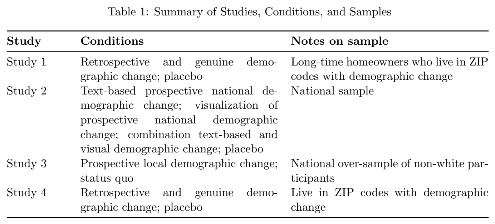

***Table 1.*** Summary of Studies, Conditions, and Samples

[Download data as CSV](tables/tab-01.csv)

Study Conditions Notes on sample

Study 1 Retrospective and genuine demo- Long-time homeowners who live in ZIP graphic change; placebo codes with demographic change

Study 2 Text-based prospective national de- National sample

mographic change; visualization of

prospective national demographic

change; combination text-based and

visual demographic change; placebo

Study 3 Prospective local demographic change; National over-sample of non-white parstatus quo ticipants

Study 4 Retrospective and genuine demo- Live in ZIP codes with demographic graphic change; placebo change

## Hypotheses

Across all four studies, we hypothesize that racial demographic change primes will decrease white support for affordable housing. In Studies 2 and 3, we expect that the effects of racial demographic

change prime will be stronger among those who exhibit higher levels of racial resentment. In Study 4, we attempt to replicate the findings of Hankinson (2026), that treated respondents will more strongly favor policies allowing them to block affordable housing (i.e., local control compared to state control over the affordable housing supply). Finally, we consider a number of pre-registered research questions for which our expectations were more ambiguous. We describe these exploratory analyses on a study-by-study basis.

Pre-registration documents are available in Section D. All studies were reviewed by the [UNI- VERSITY] IRB and deemed exempt.

## Study 1

Design

In Study 1, we built a multi-wave panel, in which we collect demographic data in the first wave. To be eligible, participants must report being a) homeowners who have lived in the same house for at least ten years and b) from ZIP codes which experienced at least a 5 percent decrease in white population share from 2000 to 2020. Note, 5 percent is the minimum change in the sampling frame, whereas our sample experienced a 22 percent decrease in their local white population share on average (Section A). These homeowners are expected to be heavily invested, financially and emotionally, in their community’s trajectory and to have experienced local demographic change in a way that makes the treatment realistic and compelling.

The Study 1 treatment is designed to prime racial threat by showing real Census data about the ZIP code level decrease in white population over the past 20 years. The treatment conditions reads as follows:

The United States has grown more racially diverse over time.

You live in ZIP code [RESPONDENT ZIP CODE]. We’ve crunched the data, and we

can confirm that your ZIP code has gotten increasingly diverse with time. To be precise,

over the last twenty years, the white population in your area has decreased by [∆ ZIP

PERCENT NON-HISPANIC WHITE 2000-2020] percent.

The placebo condition includes placebo text about bird-watching, a placebo used in other studies

(e.g., Nyhan et al. 2019).1

Our primary dependent variable is a 7-item Likert scale of support for a 50-unit affordable housing development in the respondents’ community. We also include a behavioral outcome, allowing respondents to endorse and add to a letter to their governor either in favor of or against more affordable housing in their state. We communicated to respondents that these letters would be printed and mailed, making this endorsement and their addition of text a meaningful behavioral outcome similar to petition signing (e.g., Han 2016).

As a mechanism check, we selected another policy outcome which we expect to be explicitly linked to racial threat: willingness to host refugees in one’s community. To capture this outcome, we use the same outcome text as Ferwerda, Flynn and Horiuchi (2017).

Results

First, we subset our sample of long-time homeowners to only white respondents. Table 2 show the results for our main hypothesis (Models 1 and 2) as well as for effects on support for refugee resettlement (Models 3 and 4). All attitudinal variables are converted to a continuous 0–1 scale and controls were pre-registered. Together, we find no evidence that information about local racial demographic change decreases long-time white homeowners support for affordable housing nor local refugee resettlement.

We repeat this approach on our behavioral outcome of letter writing, with the outcome variable ranging from -1 (against housing) to +1 (for housing) and again focusing on white, long-time homeowners. We find no effect on willingness to write to one’s governor in opposition to new, nearby affordable housing (Table C-3).

To test for a differential effect by race, we interact our treatment with a binary indicator for nonwhite respondents using the full sample (Table 3). Though underpowered, the results show negative effects concentrated among non-whites rather than whites—cutting against the expectation that demographic change primes activate racial threat in white homeowners.

Discussion Information about local demographic change does not affect white respondents’ attitudes towards affordable housing, even when focusing on long-time white homeowners who may 1See Section B for all treatment and placebo conditions.

Housing support Immigration support Model 1 Model 2 Model 3 Model 4 Treatment −0.004 −0.032 0.024 −0.006 (0.030) (0.029) (0.030) (0.025) Income (cont.) −0.012∗ 0.008 Female 0.013 0.033 College or more −0.011 0.024 Age 0.001 −0.000 Republican (-1, 1) −0.082∗ −0.044 Conservative (-1, 1) −0.049 −0.147∗∗∗ Intercept 0.654∗∗∗ 0.665∗∗∗ 0.425∗∗∗ 0.363∗∗∗ (0.020) (0.060) (0.021) (0.054) R2 0.000 0.182 0.002 0.372

Adj. R2 −0.002 0.166 −0.001 0.359

Num. obs. 411 365 411 365

RMSE 0.308 0.282 0.300 0.243

∗∗∗p < 0.001; ∗∗p < 0.01; ∗p < 0.05

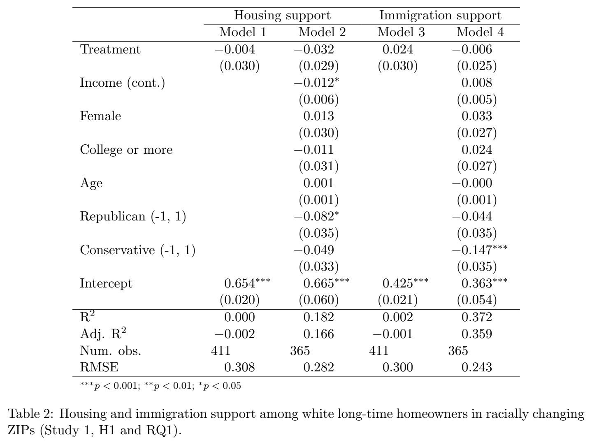

***Table 2.*** Housing and immigration support among white long-time homeowners in racially changing ZIPs (Study 1, H1 and RQ1).

[Download data as CSV](tables/tab-02.csv)

Housing support Immigration support Model 1 Model 2 Model 3 Model 4 Demographic Change 00-20 −0.004 −0.025 0.024 0.002 (0.030) (0.028) (0.030) (0.025) Non-white 0.088∗∗ 0.046 0.056 −0.009 (0.032) (0.033) (0.038) (0.034) Demo. Change 00-20 x Non-white −0.091 −0.059 −0.088 −0.045 (0.056) (0.055) (0.055) (0.051) Income (cont.) −0.006 0.007 Female (bi.) 0.043 0.039 College or more −0.021 0.027 Age −0.000 −0.001 Republican (-1, 1) −0.115∗∗∗ −0.168∗∗∗ Intercept 0.654∗∗∗ 0.668∗∗∗ 0.425∗∗∗ 0.378∗∗∗ (0.020) (0.051) (0.021) (0.049) R2 0.011 0.142 0.005 0.277

Adj. R2 0.006 0.130 −0.001 0.266

Num. obs. 566 552 566 552

RMSE 0.302 0.284 0.297 0.255

∗∗∗p < 0.001; ∗∗p < 0.01; ∗p < 0.05

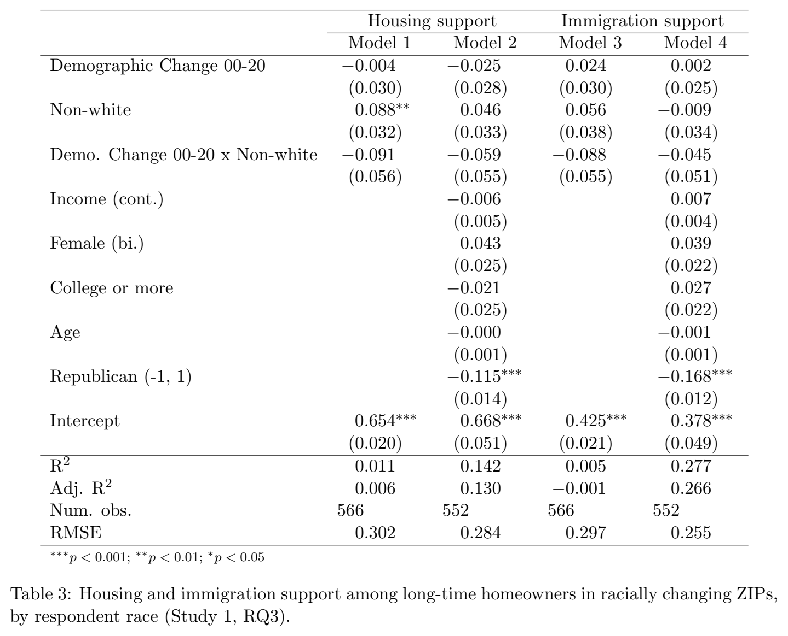

***Table 3.*** Housing and immigration support among long-time homeowners in racially changing ZIPs, by respondent race (Study 1, RQ3).

[Download data as CSV](tables/tab-03.csv)

be uniquely attuned to changing local conditions.

## Study 2

Design

Finding little evidence that white respondents react to priming past (retrospective) changes in their local context, we decided to explore the effects of forward-looking (prospective) demographic change. This technique has been established in social science research and is a popular approach among current scholarship (e.g., Bai and Federico 2021; Brown, Rucker and Richeson 2022; Craig and Richeson 2014; Krosch et al. 2022; Major, Blodorn and Major Blascovich 2018; Schildkraut and Marotta 2018; Stewart and Willer 2022; Thompson and McCabe 2025; Wetts and Willer 2018). A national prime avoids the selection problem in Study 1, where intolerant residents may have left the sampled ZIP codes, leaving only tolerant residents unlikely to react. Framing change nationally also creates a threat even in ZIP codes that have remained demographically stable. If new affordable housing is associated with non-white occupants, then building it locally would allow this national diversification to more directly affect one’s community.

We randomize exposure of respondents to information about future national demographic change and record respondents’ support for an affordable housing proposal in their community. Pretreatment demographics, racial resentment, and policy attitudes are captured in Wave 1. In Wave 2, respondents were randomized into one of the following:

• Treatment 1 – Craig and Richeson (2014) text-based message of national demographic change • Treatment 2 – Wetts and Willer (2018) visualization of national demographic change

• Treatment 3 – Combination of Craig and Richeson (2014) text-based message and Wetts and Willer (2018) visualization

The full treatments are included in Section B. We use a commonly-used placebo, this one containing a sauce recipe.

Results

In Table 4 Models 1 and 2, respondents exposed to information about national demographic change do not decrease their support for local housing policy. Models 3 and 4 show that the treatment

is not moderated by racial resentment, although high levels of racial resentment are associated with less support for affordable housing. Table C-4 shows that the treatment also does not move attitudes towards immigration, regardless of racial resentment. The effect of treatment on housing attitudes is not statistically different between white and non-white respondents (Table C-5) and none of the three treatments on their own are statistically significant (Table C-6).

Model 1 Model 2 Model 3 Model 4

Treatment −0.004 −0.006 −0.012 −0.012

(0.010) (0.010) (0.014) (0.014)

Symbolic racism score −0.229∗∗∗ −0.203∗∗∗ Treatment x SRS 0.020 0.015 Housing support, pretreatment 0.819∗∗∗ 0.763∗∗∗ 0.732∗∗∗ 0.712∗∗∗ (0.013) (0.016) (0.017) (0.018) Non-white 0.018∗ 0.011 Income (cont.) −0.001 −0.002 Female 0.008 0.004 College or more −0.004 −0.008 Republican (-1, 1) −0.039∗∗∗ −0.013∗ Intercept 0.098∗∗∗ 0.139∗∗∗ 0.234∗∗∗ 0.262∗∗∗ (0.012) (0.018) (0.020) (0.024) R2 0.661 0.672 0.687 0.688 Adj. R2 0.661 0.671 0.686 0.686

Num. obs. 1864 1829 1864 1829

RMSE 0.183 0.180 0.176 0.176

∗∗∗p < 0.001; ∗∗p < 0.01; ∗p < 0.05

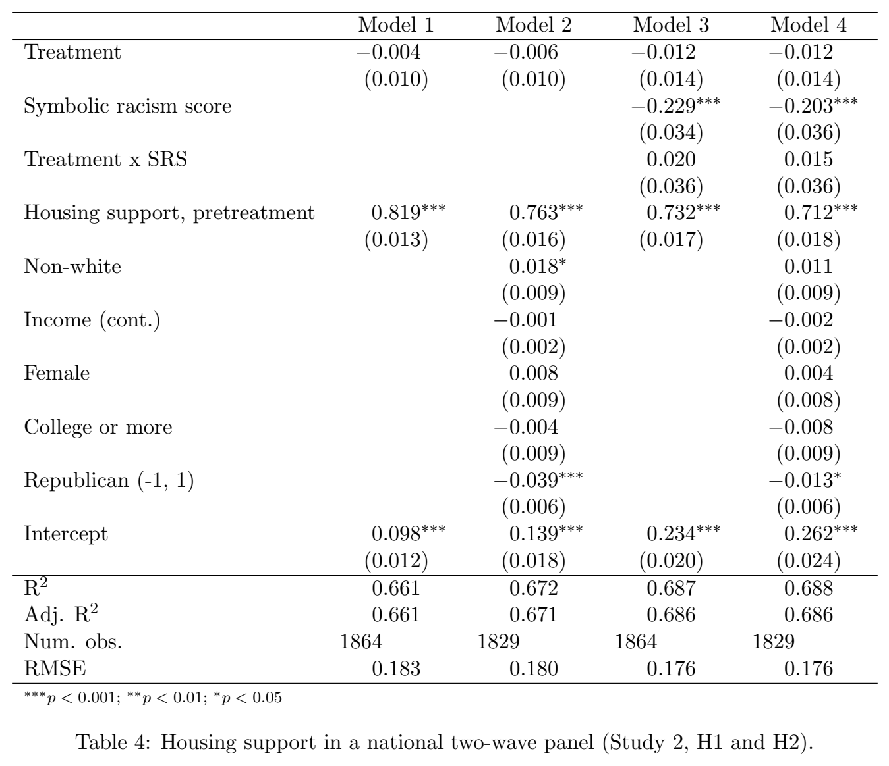

***Table 4.*** Housing support in a national two-wave panel (Study 2, H1 and H2).

[Download data as CSV](tables/tab-04.csv)

Past research has found that national trends require local demographic change to affect policy attitudes (Hopkins 2010). In an exploratory analysis, we subset the sample to only include respondents who had experienced at least a 5 percent decrease in their ZIP code’s white population, similar to Study 1. Again, treatment effects are null (Table C-7).

Discussion As with Study 1, the prime does not decrease housing support. That racial resentment correlates negatively with housing support suggests respondents engaged with the survey and that racially resentful respondents did not selectively exiting.

## Study 3

Design

Study 3 is a one-wave experiment that builds on Study 2 by using a similar forecast of racial demographic change but targeted towards respondents’ local contexts.2 The treatment states:

In our day jobs, we are professional social scientists who study demography. Earlier in

this survey, you shared some information with us about where you live.

We’ve crunched the numbers using your ZIP code. Based on our calculations, there’s a

good chance that the population in your area is about to get a lot more diverse. Over

the next few years, we think that the number of Black and Latino people who live in

your area may double.

The control condition states that the population share of Black and Latino residents would stay the same over the next few years. This design involves a degree of deception, as we did not independently forecast demographic change for each area. At the end of the survey, we debriefed respondents and told them that the information provided was not accurate and was part of a research design.

We over-sampled of non-white respondents to achieve balance between white and non-white respondents.

Results

In Table 5, Models 1 and 2 show that the treatment does not decrease support for affordable housing in a substantively nor statistically meaningfully way. Models 3 and 4 show that the interaction with racial resentment is not statistically significant. However, as in Study 2, racial resentment is negatively correlated with support for the affordable housing development. Even with a more 2The pre-analysis plan stated that respondents would be recruited over two waves. This was a typo.

racially balanced sample, the treatment effect does not vary by respondent race (Table C-8). The treatment also affects neither a respondent’s willingness to attend a local meeting about the housing proposal (Table C-9) nor attitudes towards local refugee resettlement (Table C-10).

Model 1 Model 2 Model 3 Model 4

Treatment −0.016 −0.015 0.000 −0.008

(0.017) (0.015) (0.023) (0.023) Symbolic racism score −0.625∗∗∗ −0.542∗∗∗ Treatment x SRS −0.043 −0.019 Non-white 0.031∗ 0.011 Income (cont.) −0.017∗∗∗ −0.019∗∗∗ Female −0.001 −0.029∗ College or more −0.009 −0.019

Republican (-1, 1) −0.140∗∗∗ −0.042∗∗∗ Intercept 0.582∗∗∗ 0.614∗∗∗ 0.793∗∗∗ 0.857∗∗∗ (0.012) (0.020) (0.017) (0.026) R2 0.001 0.202 0.281 0.328

Adj. R2 −0.000 0.199 0.279 0.324

Num. obs. 1503 1454 1503 1454

RMSE 0.324 0.290 0.275 0.266

∗∗∗p < 0.001; ∗∗p < 0.01; ∗p < 0.05

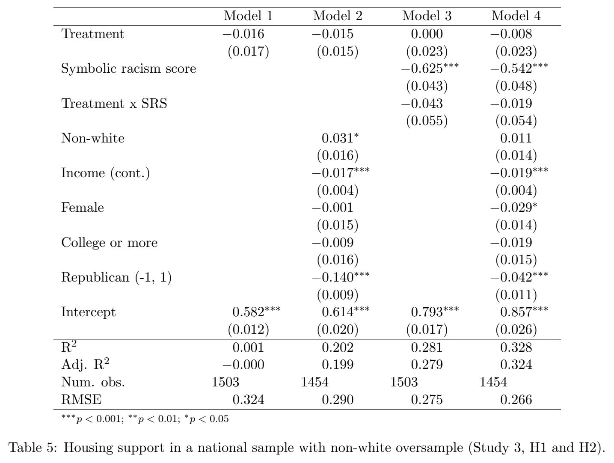

***Table 5.*** Housing support in a national sample with non-white oversample (Study 3, H1 and H2).

[Download data as CSV](tables/tab-05.csv)

Prior research has shown that emotions are often intimately related to racial attitudes (Banks 2014). As a mechanism check, we conduct an exploratory analysis to see whether the treatment affected respondents’ emotions: anger, disgust, sympathy, fear, and hope. As shown in Table C-11, information about local demographic change did not affect any emotions except for hope. Probing further, Table C-12 interacts the treatment of local demographic change with respondents’ racial resentment score. All of the relationships are significant and operate in the expected direction. For respondents with high levels of racial resentment, the racial demographic change treatment increases anger, disgust, and fear, while decreasing sympathy and hope. These findings strongly underscore that our treatment is being received by respondents and those respondents are reacting

in ways expected—but the treatment is not affecting their views about new affordable housing in their community.

Discussion Study 3 shows that forecasts about local demographic change also fail to decrease respondents support for local affordable housing, despite affecting emotional responses among the racially resentful.

## Study 4

Design

Studies 1 through 3 found no evidence of an average treatment effect of racial demographic change on whites’ attitudes towards affordable housing. In Study 4, we directly engage with Hankinson (2026) to assess whether a local demographic change prime would increase voter support for local control over affordable housing as a way to block unwanted developments.

Study 4 was a pre-registered multi-wave panel experiment. In the first wave, participants (n = 3,063) provided demographic information, including their ZIP codes. To improve validity, the only eligible participants were from ZIP codes that a) were majority white in 2000 and b) experienced a 10 percentage point decrease in their white population between 2000 and 2020. Based on these constraint, the overall sample experienced an 18 percentage point decrease in their white population share from 2000 to 2020 on average.

Our treatment condition read as follows:

The United States has grown more racially diverse over time.

You live in ZIP code [RESPONDENT ZIP CODE]. In 2000, [ZIP PERCENT NON-

HISPANIC WHITE 2000]% of residents in your ZIP code identified as white, non-

Hispanic. Today, only [ZIP PERCENT NON-HISPANIC WHITE 2020]% of residents in your ZIP code identify as white, non-Hispanic. In other words, the white population in your area has decreased by [∆ ZIP PERCENTAGE POINT NON-HISPANIC WHITE 2000-2020] percentage points since the year 2000.

The placebo condition again consisted of text about cooking sauces. Our attitudinal outcome

(“support a policy giving governors and other elected state officials final say in the construction of new affordable housing”) is a 7-point Likert scale from support to oppose, which is converted to a 0–1 scale in the analysis. Reflecting the voting behavior observed in Hankinson (2026), our behavioral outcome is the respondent’s willingness to endorse a letter to their governor in favor or against moving control over affordable housing to the state level.

Results

In Table 6 Models 1 and 2, presenting data on local racial demographic change has a null effect on attitudes towards local control over housing. To test whether the expected effect exists among white respondents, we interact the treatment with whether the respondent is non-white.3 Models 3 and 4 show that even among only white respondents, there is no evidence of a backlash effect. In contrast, there is an unexpected positive treatment effect among non-white respondents.

We also pre-registered research questions pertaining to respondents’ pre-treatment attitudes, willingness to exhibit a behavioral outcome, and alignment with their state governor’s party. The effect of the racial prime is not moderated by pre-treatment attitudes towards affordable housing (Table C-13). However, the treatment did interact with whether the respondent shares partisanship with their governor(Table 7). This interaction is driven entirely by white respondents, with the racial prime decreasing support for state control by 7 percentage points (d = .23, p < .01) among those who do not match their governor’s partisanship and increasing support for state control by 4 percentage points (d = .13, p = .08) among those who do match their governor’s partisanship.

As a behavioral outcome, Table C-14 shows a positive effect of treatment on one’s willingness to endorse state control via a letter to their governor, compared to options of a letter opposing state control or not endorsing either letter.4 This behavior response is not moderated by a party match with one’s governor (Table C-15).

Discussion Among white respondents, we find no evidence that a treatment designed to prime racial threat increases support for local control over affordable housing. However, this relationship is moderated by whether the respondent’s partisanship matches the party of the governor, which 3Given Hankinson (2026) finds treatment effects among both majority white and non-white precincts, this test was not included in our pre-analysis plan.

4These options are operationalized as endorse state control (+1), endorse local control (-1), or endorse neither letter (0).

Attitudinal support for state control

Model 1 Model 2 Model 3 Model 4 Treatment 0.007 0.010 −0.011 −0.009 (0.011) (0.013) (0.013) (0.015) Non-white 0.029 0.033 −0.005 (0.015) (0.017) (0.021) Treatment x Non-white 0.076∗∗ 0.072∗ Homeowner (bi.) −0.039∗ −0.040∗ Income (cont.) −0.008∗∗ −0.008∗∗ Female (bi.) 0.056∗∗∗ 0.052∗∗∗ College or more −0.039∗∗ −0.038∗∗ Age −0.003∗∗∗ −0.003∗∗∗ Republican (-1, 1) −0.024 −0.027

Conservative (-1, 1) −0.054∗∗∗ −0.053∗∗∗ Intercept 0.414∗∗∗ 0.564∗∗∗ 0.404∗∗∗ 0.571∗∗∗ (0.008) (0.029) (0.010) (0.029) R2 0.000 0.117 0.014 0.120

Adj. R2 −0.000 0.113 0.013 0.115

Num. obs. 2792 1951 2792 1951

RMSE 0.301 0.287 0.299 0.286

∗∗∗p < 0.001; ∗∗p < 0.01; ∗p < 0.05

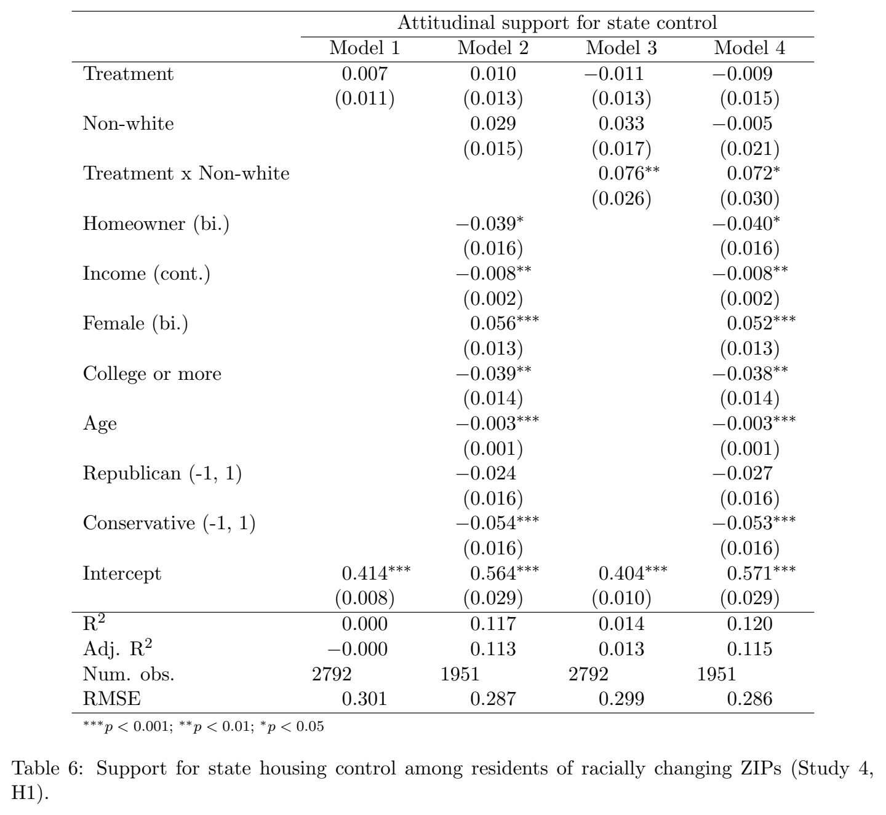

***Table 6.*** Support for state housing control among residents of racially changing ZIPs (Study 4, H1).

[Download data as CSV](tables/tab-06.csv)

Full sample White respondents only Model 1 Model 2 Model 3 Model 4 Treatment −0.047∗ −0.039 −0.076∗∗∗ −0.067∗∗ (0.018) (0.020) (0.021) (0.023) Party match with Governor 0.002 0.009 0.004 0.009 (0.018) (0.019) (0.021) (0.023) Treatment x Party match 0.084∗∗∗ 0.088∗∗ 0.117∗∗∗ 0.104∗∗∗ (0.025) (0.027) (0.028) (0.031) Homeowner −0.044∗∗ −0.053∗∗ Income (cont.) −0.005∗ −0.005 Female 0.051∗∗∗ 0.011 College or more −0.042∗∗ −0.040∗ Age −0.003∗∗∗ −0.003∗∗∗ Non-white 0.023

Republican (-1, 1) −0.029 −0.003

Conservative (-1, 1) −0.048∗∗ −0.071∗∗∗ Intercept 0.421∗∗∗ 0.550∗∗∗ 0.411∗∗∗ 0.581∗∗∗ (0.014) (0.032) (0.017) (0.037) R2 0.010 0.119 0.022 0.110

Adj. R2 0.009 0.114 0.021 0.104

Num. obs. 2435 1831 1792 1373

RMSE 0.300 0.287 0.293 0.286

∗∗∗p < 0.001; ∗∗p < 0.01; ∗p < 0.05

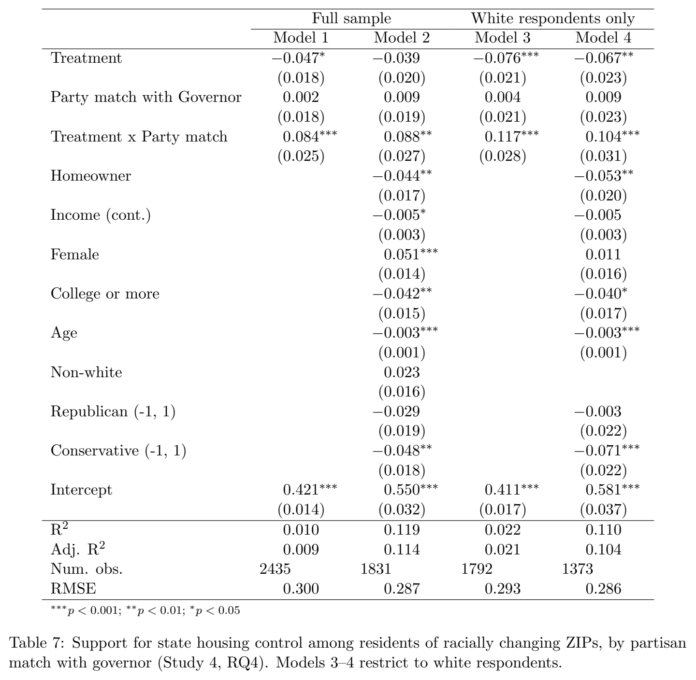

***Table 7.*** Support for state housing control among residents of racially changing ZIPs, by partisan match with governor (Study 4, RQ4). Models 3–4 restrict to white respondents.

[Download data as CSV](tables/tab-07.csv)

aligns with a policy-focused perspective of federalism—preferring control where it is most likely to align with one’s preferences. Among non-white respondents, the racial prime increases support for state control in a way that is unexpected and not supported by Hankinson (2026).

Regarding the increase in the willingness to write to one’s governor, it is possible that the demographic change treatment raised the salience of housing policy in a way that did not change attitudes but sparked mobilization via letter endorsement. Still, this behavioral effect is not present in Study 1 where we focus more narrowly on the supply of affordable housing rather than state versus local control. Therefore, we refrain from over-theorizing its origin.

## Meta-Analysis and Statistical Power

We have now run four different designs either highlighting information about past local demographic change or informing respondents about future national or local demographic change. By and large, the treatments do not generate statistically nor substantively significant effects. To aggregate our results, we conduct a random effects meta-analysis. In practice, this amounts to a “mini” metaanalysis as outlined by Goh, Hall and Rosenthal (2016) and recently exemplified by P´erez, Vicuna and Ramos (2024).

First, we meta-analyze the average attitudinal effects reported in Studies 1-4 (Figure 1). Relying on the covariate-adjusted estimates to increase precision, and within the 0–1 scale we have converted our outcomes to, we observe a non-significant effect of -0.010 (C.I.: -0.027, 0.007). There was virtually zero heterogeneity across studies (I2 < 1%) and we were sufficiently powered to detect effects as small as .02 on our 0–1 scale. We repeat this exercise with the interaction effect to generate estimates for nonwhite respondents for all studies. Again, the meta-analytic estimate is not significant.

Pooling across all four experiments, we were at 80% power to detect effects as small as .02 on our 0–1 scale among white respondents. In Study 1, we were at 80% power to detect an effect as small as .079; in Study 2, an effect as small as .035; and effects as small as .064 and .043 in Studies 3 and 4, respectively. Expressed in standardized terms, these minimum detectable effects (Cohen’s d ≈ .26, .11, .20, and .14 for Studies 1–4, and .08 pooled) fall within or below the range of policy and ideology effects that Craig and Richeson (2014) report for the analogous racial-shift prime (d ≈

Treatment effects on housing support: white respondents and race interaction White respondents Treatment × non-white Study 1 (Affordable Housing)

[Tailored local change]

Study 2 (Local Housing)

[Prospective national change]

Study 3 (Local Housing)

[Prospective local change]

Study 4 (State Control)

[Tailored local change]

RE model estimate

-0.10 -0.05 0.00 0.05 0.10 -0.2 -0.1 0.0 0.1

Effect size (0–1 scale) Effect size (0–1 scale)

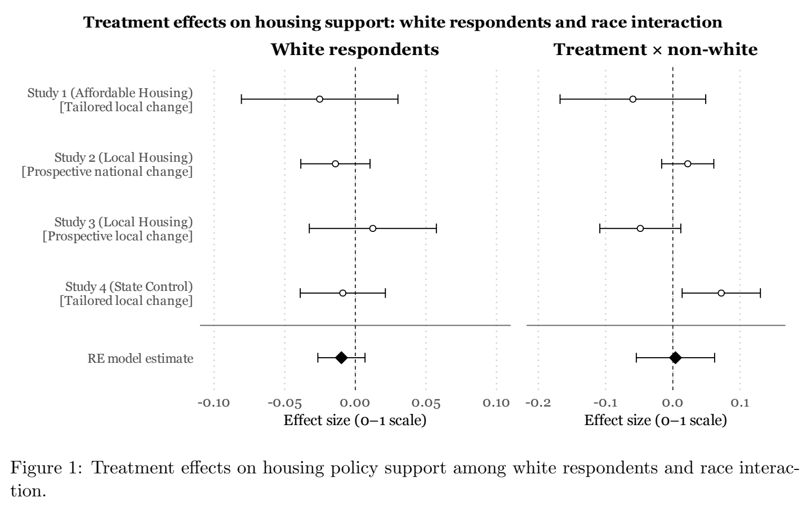

***Figure 1.*** Treatment effects on housing policy support among white respondents and race interac- tion.

0.22–0.42). The same holds for Wetts and Willer (2018), whose racial-status-threat visualization we adapt directly as Study 2’s Treatment 2—the study that deployed these off-the-shelf primes, and the one with our smallest minimum detectable effect (d ≈ .11). In Wetts and Willer (2018), the manipulation shifted attitudes by d ≈ .40 to .48; every one of our minimum detectable effects sits well below those estimates.

Our conditional tests were also reasonably well-powered. The treatment X resentment interaction was 80% powered to detect a shift in the treatment effect as small as d ≈ .09–.12 per standard deviation of racial resentment, and even within the most racially resentful half of respondents our minimum detectable effect (d ≈ 0.14–0.19) remained below the benchmark effects discussed above. Our tests for differential effects by race were less well-powered, with detectable differences of d ≈ .18–.51 across studies. Taken in aggregate, we were exceedingly well-powered to detect effects far smaller than those typically reported in this literature; even individually, each study could detect effects at or below the range of previously reported. Consult Table C-16 for more details on statistical power.

We can also make a positive equivalence claim. Using two one-sided tests (Lakens, Scheel and

Isager 2018) against an equivalence bound set at d = .15 (set conservatively below the smallest effect Craig and Richeson (2014) report (d = .22)), the pooled estimate among white respondents is statistically equivalent to zero. Its 90% CI falls entirely within .047, letting us reject ( p < .05) the presence of an effect even as large as this bound, itself smaller than any this literature would lead us to expect. The pooled effect is in fact equivalent to zero within a margin of ±0.024 on the 0–1 scale ( d ≈ .08). In sum, these tests let us positively conclude—not just fail to reject—that the effect of racial demographic change primes on white affordable housing attitudes is smaller than the smallest effect reported in this literature, with the pooled estimate statistically equivalent to zero within a margin of d = .08. Table C-16 provides details on the equivalence tests.

## Discussion

Contrary to expectations, primes about racial demographic change did not decrease white respondents support for new, nearby affordable housing. This null result was observed across a wide variety of treatments, both original and from prior studies, and among subjects (e.g., long-term white homeowners, racially resentful whites) who would, in theory, be most affected by such treatments.

While we cannot rule out the possibility that methodological choices related to experimental design and sample composition explain our findings, the results themselves counter many such first-order objections. For example, one might be concerned that we over-sampled racially tolerant respondents. But as Study 3 makes clear, respondents who score high on racial resentment react negatively to the primes even as their policy views do not shift. Nevertheless, that we have to hunt for a backlash among white respondents is evidence of our overarching claim.

Another concern is that our primes are too recognizable. Yet our results remain the same across both common and original treatments. Likewise, that racially resentful participants react emotionally to the primes in precisely the way that racial threat expects should temper concerns that our treatments are too subtle or are activating social desirability bias. If norm compliance were masking a true effect, respondents would suppress their exclusionary responses to varying degrees, with some even over-correcting toward inclusion, thereby inflating the variance of treated responses while leaving the mean unchanged. We find no such pattern; a meta-analysis shows no

treatment effect on the variance of white respondents’ attitudes (Figure C-1). This does not rule out social desirability entirely, but the fact that prior demographic change studies detected effects with these very same treatments suggests its influence on our conclusion is quite limited.

What, then, might explain these surprising results? We offer two explanations. First, racial threat may be low on the list of possible explanations for affordable housing policy attitudes. There are a number of reasons Americans oppose new development in their community, such protecting property values (Fischel 2001; Hall and Yoder 2022; Marble and Nall 2021), opposing gentrification (Elmendorf, Nall and Oklobdzija 2025; Hankinson 2018), preserving neighborhood character (Einstein, Glick and Palmer 2020; Larsen and Nyholt 2024; Pietrzak and Mendelberg 2025) and symbolic attitudes associated with development (Broockman, Elmendorf and Kalla 2024). None of these factors have much to do with national or local racial demographic change. If anything, new research finds that Americans express wide support for affordable housing (Mendelberg, Novoa and Pietrzak 2025), popularity which may coincide with the declining significance of segregation in affordable housing politics. That respondents with high racial resentment are more opposed to affordable housing may not be a causal relationship as much as linked to a larger worldview upstream of both racial attitudes and affordable housing.

Second, housing policy attitudes may be too rigid to be affected by a racial prime. Unlike policies where voters have very limited substantive connections, most Americans have experienced new housing development in their community. The association between development and quality of life may be crystallized in respondents’ minds and thus unlikely to be moved by one-off treatments about broad social change, no matter how well-designed. Instead, attitudes towards affordable housing may be difficult to move absent direct interventions meant to counter housing stereotypes (Anderson et al. 2025; Hankinson and de Benedictis-Kessner 2024).

What do our findings mean for observational evidence linking demographic change to affordable housing attitudes? While we do not find support for an average treatment effect, Study 4 shows that the treatment effect on support for state control is moderated by white respondents’ alignment with their governor’s party. On one hand, this finding aligns with Hankinson (2026). The California state legislature has been supportive of building more affordable housing. Voters observed in Hankinson (2026) would have been right to favor local control. In contrast, our respondents living in red states may be wise to support state control as a way to stymie affordable housing. On the other hand,

Studies 1 through 3 do not find evidence that racial demographic change primes affect support for affordable housing locally. Consequently, the racial threat mechanism in Hankinson (2026) may be less about affordable housing compared to consolidating power in one’s preferred level of government. Thus, racial demographic change may still affect the ability to advance affordable housing via state preemption and broader institutional reform.

In all, we find that racial demographic change primes do not have a substantive effect on white Americans’ attitudes towards affordable housing in their community. This does not negate the link between racism and exclusionary housing policy in the 20th century. It is possible that racism is less dominant in this policy space or that housing attitudes are sufficiently stable that they cannot be moved by such primes. Either way, the Trump Administration has recently worked to tie the housing affordability crisis to illegal immigration (Smialek, DePillis and Rodriguez 2024), meaning racial resentment may become more activated in housing politics. But for now, we emphasize the lack of evidence that racial threat is the unspoken driver of local opposition to affordable housing.

## References

Anderson, Christopher, Eitan Briman, Andrew Ferrin et al. 2025. “Debunking NIMBY Myths Increases Support for Affordable Housing, Especially Near Respondents’ Homes.” Journal of Experimental Political Science pp. 1–14. Published online.

Bai, Hui and Christopher M Federico. 2021. “White and minority demographic shifts, intergroup threat, and right-wing extremism.” Journal of Experimental Social Psychology 94:104114.

Banks, Antoine J. 2014. Anger and Racial Politics: The Emotional Foundation of Racial Attitudes in America. Cambridge University Press.

Blalock, Hubert M. 1967. Toward a Theory of Minoirty Group Relations. John Wiley and Sons. Boustan, Leah Platt. 2010. “Was postwar suburbanization “white flight”? Evidence from the black migration.” The Quarterly Journal of Economics 125(1):417–443.

Brader, Ted, Nicholas A Valentino and Elizabeth Suhay. 2008. “What triggers public opposition to immigration? Anxiety, group cues, and immigration threat.” American Journal of Political Science 52(4):959–978.

Britt, Lucy and Andreas Jozwiak. 2024. “White NIMBYism and diversity close to home.” Social Science Quarterly 105(6):1985–2002.

Broockman, David, Christopher S Elmendorf and Joshua Kalla. 2024. “The Symbolic Politics of Housing.” Unpublished Manuscript. URL: https://osf. io/preprints/osf/surv9 .

Brown, Xanni, Julian M Rucker and Jennifer A Richeson. 2022. “Political ideology moderates White Americans’ reactions to racial demographic change.” Group Processes & Intergroup Relations 25(3):642–660.

Craig, Maureen A and Jennifer A Richeson. 2014. “On the precipice of a “majority-minority” America: Perceived status threat from the racial demographic shift affects White Americans’ political ideology.” Psychological Science 25(6):1189–1197.

DeParle, Jason. 2024. “Developers Got Backing for Affordable Housing. Then the Neighborhood Found Out.” The New York Times .

Douglas, Isabella P, Deland Chan, Lucy Zhang Bencharit and Sarah L Billington. 2025. “Understanding how racism and affect impact public opinions toward affordable housing in the United States.” Journal of Planning Education and Research 45(3):512–530.

Einstein, Katherine Levine, David M Glick and Maxwell Palmer. 2020. Neighborhood Defenders. Cambridge University Press.

Elmendorf, Christopher S, Clayton Nall and Stan Oklobdzija. 2025. “The folk economics of housing.” Journal of Economic Perspectives 39(3):45–66.

Engelhardt, Andrew M, Nicole Huffman and Veronica Oelerich. 2025. “Validating Whites’ Reactions to the “Racial Shift”.” Journal of Experimental Political Science pp. 1–13.

Enos, Ryan D. 2016. “What the Demolition of Public Housing Teaches Us About the Impact of Racial Threat on Political Behavior.” American Journal of Political Science 60(1):123–142.

Enos, Ryan D. 2017. The Space Between Us: Social Geography and Politics. Cambridge University Press.

Ferwerda, Jeremy, DJ Flynn and Yusaku Horiuchi. 2017. “Explaining opposition to refugee resettlement: The role of NIMBYism and perceived threats.” Science Advances 3(9):e1700812.

Fischel, William A. 2001. The Homevoter Hypothesis. Cambridge, MA: Harvard University Press. Frey, William H. 2018. Diversity Explosion: How New Racial Demographics Are Remaking America. Brookings Institution Press.

Goh, Jin X, Judith A Hall and Robert Rosenthal. 2016. “Mini meta-analysis of your own studies: Some arguments on why and a primer on how.” Social and Personality Psychology Compass 10(10):535–549.

Hall, Andrew B and Jesse Yoder. 2022. “Does homeownership influence political behavior? Evidence from administrative data.” The Journal of Politics 84(1):351–366.

Han, Hahrie. 2016. “The organizational roots of political activism: Field experiments on creating a relational context.” American Political Science Review 110(2):296–307.

Hankinson, Michael. 2018. “When Do Renters Behave Like Homeowners? High Rent, Price Anxiety, and NIMBYism.” American Political Science Review 112(3):473–493.

Hankinson, Michael. 2026. The Voters’ Veto: Local Racial Demographic Change and Exclusionary Behavior. Technical report Working Paper.

Hankinson, Michael and Justin de Benedictis-Kessner. 2024. “How self-interest and symbolic politics shape the effectiveness of compensation for nearby housing development.” Journal of Public Policy 44(4):785–808.

Hochschild, Arlie Russell. 2016. Strangers in their own land: Anger and mourning on the American right. The New Press.

Hopkins, Daniel J. 2010. “Politicized places: Explaining where and when immigrants provoke local opposition.” American Political Science Review 104(1):40–60.

Israel-Trummel, Mackenzie L and Ariela Schachter. 2019. “Does Shared Social Disadvantage Cause Black–Latino Political Commonality?” Journal of Experimental Political Science 6(1):43–52.

Kaufman, Eric. 2018. Whiteshift: Populism, Immigration, and the Future of White Majorities. Allen Lane.

Key Jr, Valdimer O. 1949. Southern Politics in State and Nation. New York: Knopf.

Krosch, Amy R, Suzy J Park, Jesse Walker and Ari R Lisner. 2022. “The threat of a majorityminority US alters white Americans’ perception of race.” Journal of Experimental Social Psychology 99:104266.

Lakens, Dani¨el, Anne M Scheel and Peder M Isager. 2018. “Equivalence testing for psychological research: A tutorial.” Advances in Methods and Practices in Psychological Science 1(2):259–269. Larsen, Martin Vinæs and Niels Nyholt. 2024. Understanding Nimbyism as Local Preservationism. Technical report Center for Open Science.

Levy, Morris and Dowell Myers. 2021. “Racial projections in perspective: Public reactions to narratives about rising diversity.” Perspectives on Politics 19(4):1147–1164.

Major, Brenda, Alison Blodorn and Gregory Major Blascovich. 2018. “The threat of increasing diversity: Why many White Americans support Trump in the 2016 presidential election.” Group Processes & Intergroup Relations 21(6):931–940.

Marble, William and Clayton Nall. 2021. “Where Interests Trump Ideology: The Persistent Influence of Homeownership in Local Development Politics.” Journal of Politics 83(4).

Massey, Douglas S. 1990. “American apartheid: Segregation and the making of the underclass.” American Journal of Sociology 96(2):329–357.

Mendelberg, Tali. 2001. The Race Card: Campaign Strategy, Implicit Messages, and the Norm of Equality. Princeton University Press.

Mendelberg, Tali, Gustavo Novoa and Adrian Pietrzak. 2025. “Insufficiently Affordable: Public Opinion About Housing Affordability.”.

Metzl, Jonathan M. 2019. Dying of whiteness: How the politics of racial resentment is killing America’s heartland. Hachette UK.

Nyhan, B., E. Porter, J. Reifler and T.J. Wood. 2019. “Taking Fact-Checks Literally But Not Seriously? The Effects of Journalistic Fact-Checking on Factual Beliefs and Candidate Favorability.” Political Behavior 42:939–960.

P´erez, Efr´en, Bianca Vicuna and Alisson Ramos. 2024. “Taking stock of solidarity between people of color: a mini meta-analysis of five experiments.” American Political Science Review 118(3):1549– 1555.

Pietrzak, Adrian and Tali Mendelberg. 2025. “Political Architecture: Contextual Development and Opposition to Housing.” Urban Affairs Review p. 10780874251398034.

Reny, Tyler T and Benjamin J Newman. 2018. “Protecting the Right to Discriminate: The Second Great Migration and Racial Threat in the American West.” American Political Science Review 112(4):1104–1110.

Rodrik, Dani. 2021. “Why does globalization fuel populism? Economics, culture, and the rise of right-wing populism.” Annual Review of Economics 13:133–170.

Rothstein, Richard. 2017. The Color of Law: A Forgotten History of How Our Government Segregated America. Liveright Publishing.

Sahn, Alexander. 2025. “Racial diversity and exclusionary zoning: Evidence from the great migration.” The Journal of Politics 87(4):000–000.

Schildkraut, Deborah J and Satia A Marotta. 2018. “Assessing the political distinctiveness of White millennials: How race and generation shape racial and political attitudes in a changing America.” RSF: The Russell Sage Foundation Journal of the Social Sciences 4(5):158–187.

Smialek, Jeanna, Lydia DePillis and Natasha Rodriguez. 2024. “Trump Blames Immigrant Surge for Housing Crisis. Most Economists Disagree.” The New York Times .

Stagnaro, Michael, Jamie Druckman, Adam Berinsky, Antonio Arechar, Rob Willer and David Rand. 2024. “Representativeness Versus Attentiveness: A Comparison Across Nine Online Survey Samples.” OSF .

URL: https://osf.io/preprints/psyarxiv/h9j2d

Stephens-Dougan, Lafleur. 2023. “White Americans’ reactions to racial disparities in COVID-19.” American Political Science Review 117(2):773–780.

Stewart, Sheridan and Robb Willer. 2022. “The effects of racial status threat on White Americans’ support for Donald Trump: Results of five experimental tests.” Group Processes & Intergroup Relations 25(3):791–810.

Thompson, Andrew Ifedapo. 2026. The Big Flip: Racial Demographic Change and the Future of American Democracy. Oxford University Press.

Thompson, Andrew Ifedapo, Maxwell Beveridge, Stefan McCabe, Molly Ahern, Fryda Cortes, Noah Axford and Jacqueline Martinez Franks. 2025. “Anti-Black Political Violence and the Historical Legacy of the Great Replacement Conspiracy.” Perspectives on Politics 23(1):195–212.

Thompson, Andrew Ifedapo and Stefan D McCabe. 2025. “The importance of local racial demographic changes in democratic erosion in the mass American public.” Proceedings of the National Academy of Sciences 122(48):e2501150122.

Tighe, J Rosie. 2012. “How race and class stereotyping shapes attitudes toward affordable housing.” Housing Studies 27(7):962–983.

Trounstine, Jessica. 2018. Segregation by Design: Local Politics and Inequality in American Cities. Cambridge University Press.

Trounstine, Jessica. 2020. “The Geography of Inequality: How Land Use Regulation Produces Segregation.” American Political Science Review 114(2):443–455.

Trounstine, Jessica. 2023. “You won’t be my neighbor: opposition to high density development.” Urban Affairs Review 59(1):294–308.

Wetts, Rachel and Robb Willer. 2018. “Privilege on the precipice: Perceived racial status threats lead White Americans to oppose welfare programs.” Social Forces 97(2):793–822.

## Online Appendix for “Racial Demographic Change Primes Do Not

## Contents

A Descriptive Statistics A-2 B Experimental Conditions A-3 B.1 Study 1 . . . . . . . . . . . . . . . . . . . . . . . . . . . . . . . . . . . . . . . . . . . A-3 B.2 Study 2 . . . . . . . . . . . . . . . . . . . . . . . . . . . . . . . . . . . . . . . . . . . A-3 B.3 Study 3 . . . . . . . . . . . . . . . . . . . . . . . . . . . . . . . . . . . . . . . . . . . A-5 B.4 Study 4 . . . . . . . . . . . . . . . . . . . . . . . . . . . . . . . . . . . . . . . . . . . A-5 C Additional Tables A-6 C.1 Study 1 . . . . . . . . . . . . . . . . . . . . . . . . . . . . . . . . . . . . . . . . . . . A-6 C.2 Study 2 . . . . . . . . . . . . . . . . . . . . . . . . . . . . . . . . . . . . . . . . . . . A-7 C.3 Study 3 . . . . . . . . . . . . . . . . . . . . . . . . . . . . . . . . . . . . . . . . . . . A-11 C.4 Study 4 . . . . . . . . . . . . . . . . . . . . . . . . . . . . . . . . . . . . . . . . . . . A-15 C.5 Meta-Analysis . . . . . . . . . . . . . . . . . . . . . . . . . . . . . . . . . . . . . . . . A-18 D Pre-Registrations A-19

## A Descriptive Statistics

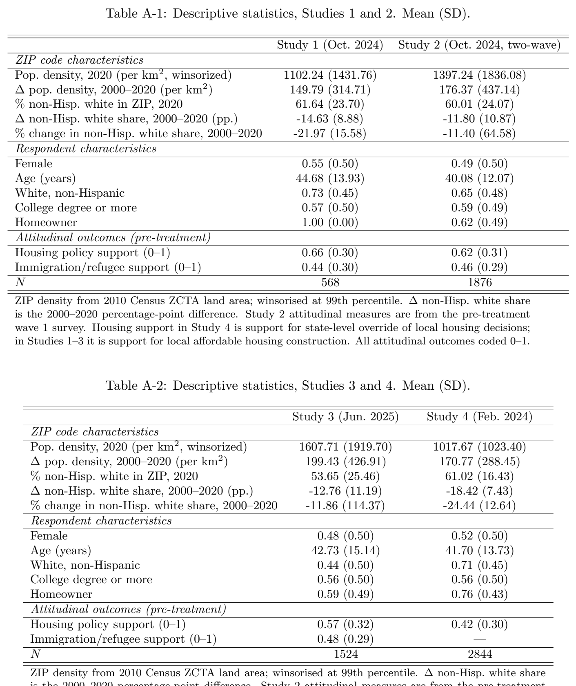

***Table A-1.*** Descriptive statistics, Studies 1 and 2. Mean (SD).

[Download data as CSV](tables/tab-08.csv)

Study 1 (Oct. 2024) Study 2 (Oct. 2024, two-wave) ZIP code characteristics

Pop. density, 2020 (per km2, winsorized) 1102.24 (1431.76) 1397.24 (1836.08) ∆ pop. density, 2000–2020 (per km2) 149.79 (314.71) 176.37 (437.14) % non-Hisp. white in ZIP, 2020 61.64 (23.70) 60.01 (24.07) ∆ non-Hisp. white share, 2000–2020 (pp.) -14.63 (8.88) -11.80 (10.87) % change in non-Hisp. white share, 2000–2020 -21.97 (15.58) -11.40 (64.58) Respondent characteristics

Female 0.55 (0.50) 0.49 (0.50) Age (years) 44.68 (13.93) 40.08 (12.07) White, non-Hispanic 0.73 (0.45) 0.65 (0.48) College degree or more 0.57 (0.50) 0.59 (0.49) Homeowner 1.00 (0.00) 0.62 (0.49) Attitudinal outcomes (pre-treatment)

Housing policy support (0–1) 0.66 (0.30) 0.62 (0.31)

Immigration/refugee support (0–1) 0.44 (0.30) 0.46 (0.29)

N 568 1876

ZIP density from 2010 Census ZCTA land area; winsorised at 99th percentile. ∆ non-Hisp. white share is the 2000–2020 percentage-point difference. Study 2 attitudinal measures are from the pre-treatment wave 1 survey. Housing support in Study 4 is support for state-level override of local housing decisions; in Studies 1–3 it is support for local affordable housing construction. All attitudinal outcomes coded 0–1.

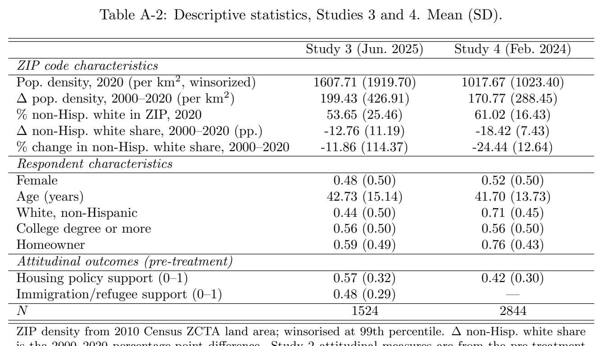

***Table A-2.*** Descriptive statistics, Studies 3 and 4. Mean (SD).

[Download data as CSV](tables/tab-09.csv)

Study 3 (Jun. 2025) Study 4 (Feb. 2024) ZIP code characteristics

Pop. density, 2020 (per km2, winsorized) 1607.71 (1919.70) 1017.67 (1023.40) ∆ pop. density, 2000–2020 (per km2) 199.43 (426.91) 170.77 (288.45) % non-Hisp. white in ZIP, 2020 53.65 (25.46) 61.02 (16.43) ∆ non-Hisp. white share, 2000–2020 (pp.) -12.76 (11.19) -18.42 (7.43) % change in non-Hisp. white share, 2000–2020 -11.86 (114.37) -24.44 (12.64) Respondent characteristics

Female 0.48 (0.50) 0.52 (0.50) Age (years) 42.73 (15.14) 41.70 (13.73) White, non-Hispanic 0.44 (0.50) 0.71 (0.45) College degree or more 0.56 (0.50) 0.56 (0.50) Homeowner 0.59 (0.49) 0.76 (0.43) Attitudinal outcomes (pre-treatment)

Housing policy support (0–1) 0.57 (0.32) 0.42 (0.30)

Immigration/refugee support (0–1) 0.48 (0.29) —

N 1524 2844

ZIP density from 2010 Census ZCTA land area; winsorised at 99th percentile. ∆ non-Hisp. white share is the 2000–2020 percentage-point difference. Study 2 attitudinal measures are from the pre-treatment wave 1 survey. Housing support in Study 4 is support for state-level override of local housing decisions; in Studies 1–3 it is support for local affordable housing construction. All attitudinal outcomes coded 0–1.

## B Experimental Conditions

B.1 Study 1

Treatment The United States has grown more racially diverse over time.

You live in ZIP code [RESPONDENT ZIP CODE]. We’ve crunched the data, and we can confirm that your ZIP code has gotten increasingly diverse with time. To be precise, over the last twenty years, the white population in your area has decreased by [∆ ZIP PERCENT NON-HISPANIC WHITE 2000-2020] percent.

Placebo What do you need for birdwatching?

• The most basic equipment required for bird watching is your eyes, though you will soon need to have more items with you if you intend to make this a pastime or serious hobby. How far you go is a matter of taste and budget.

• The most useful thing that you can carry is a notepad and pencil. Use this to make a note of location, time, date, weather and habitat. Write a list of the birds that you see and know. Draw or write down a description of those that you don’t. You can look them up later in you field guide. Your notebook should become a diary of where you have been and what you have seen.

• A field guide is a book that provides descriptions of birds to assist you in their identification. The descriptions use several factors to help you determine the exact bird that you are looking at. As soon as you see a bird that you do not recognize you will need to have access to a good field guide. There are many to choose from.

• Binoculars. These are pretty essential and buy the best that you can afford. A good pair well looked after will last you a lifetime. Take time to choose ones that suit you.

B.2 Study 2

Treatment 1 – Craig and Richeson (2014) “In a Generation, Racial Minorities May Be the U.S. Majority” New U.S. Census Bureau data suggest that America will become a “majorityminority” nation much faster than once predicted. The nation’s racial minority population is steadily rising, advancing an unmistakable trend that could make minorities the new American majority by midcentury. The data show a declining number of White adults and growing under- 18 populations of Hispanics, Asians, and other minorities. Demographers calculate that by 2042, Americans who identify themselves as Hispanic, Black, Asian, American Indian, Native Hawaiian, or Pacific Islander will together outnumber non-Hispanic Whites. The main reasons for the accelerating change are rapid immigration growth and significantly higher birthrates among racial and ethnic minorities. As White baby boomers age past their childbearing years, younger Hispanic parents are having children – and driving U.S. population growth. For example, there are now roughly 9 births for every 1 death among Hispanics, compared to a roughly one-to-one ratio for Whites. The latest figures are predicated on current and historical trends, which can be thrown awry by several variables, including prospective overhauls of public policy.

Treatment 2 - Wetts and Willer (2018)

The majority of Americans will be nonwhite in about 25 years.

Treatment 3 – Combined

The majority of Americans will be nonwhite in about 25 years.

New U.S. Census Bureau data suggest that America will become a “majority-minority” nation much faster than once predicted. The nation’s racial minority population is steadily rising, advancing an unmistakable trend that could make minorities the new American majority by midcentury. The data show a declining number of White adults and growing under-18 populations of Hispanics, Asians, and other minorities. Demographers calculate that by 2042, Americans who identify themselves as Hispanic, Black, Asian, American Indian, Native Hawaiian, or Pacific Islander will together outnumber non-Hispanic Whites. The main reasons for the accelerating change are rapid immigration growth and significantly higher birthrates among racial and ethnic minorities. As White baby boomers age past their childbearing years, younger Hispanic parents are having children – and driving U.S. population growth. For example, there are now roughly 9 births for every 1 death among Hispanics, compared to a roughly one-to-one ratio for Whites. The latest figures are predicated on current and historical trends, which can be thrown awry by several variables, including prospective overhauls of public policy.

Placebo Five sauces for the modern cook By Samrin Nosrat Travis Lett often steals. Of course, the only person this pensive chef ever steals from is himself. At his Los Angeles, USA restaurant, “We’re constantly appropriating elements from dishes we’ve done in the past to create

new combinations,” he said. There’s a lesson here: To improve your cooking, learn how to make and use sauce like a professional. Five basic types of sauces appear over and over again on menus and in cookbooks that feature the kind of vegetable-heavy, flavor-dense food that cooks and eaters favor today: yogurt sauce, pepper sauce, herb sauce, tahini sauce and pesto. Master each one, and you’ll immediately have access to the dozens of variations that descend from them, too. Think of them as the new mother sauces, an updated version of the five mother sauces of French cuisine. Armed with one of these five sauces, the home cook can go on and cook what he or she is most comfortable cooking. The right sauce will transform the distinct elements of a dish into a unified statement of taste.

B.3 Study 3

Treatment In our day jobs, we are professional social scientists who study demography. Earlier in this survey, you shared some information with us about where you live.

We’ve crunched the numbers using your ZIP code. Based on our calculations, there’s a good chance that the population in your area is about to get a lot more diverse.

Over the next few years, we think that the number of Black and Latino people who live in your area may double.

Status quo Condition In our day jobs, we are professional social scientists who study demography. Earlier in this survey, you shared some information with us about where you live.

We’ve crunched the numbers using your ZIP code. Based on our calculations, there’s a good chance that the population in your area is going to remain essentially the same.

Over the next few years, we think that the number of Black and Latino people who live in your area will probably remain unchanged.

B.4 Study 4

Treatment The United States has grown more racially diverse over time.

You live in ZIP code [RESPONDENT ZIP CODE]. In 2000, [ZIP PERCENT NON-HISPANIC WHITE 2000]% of residents in your ZIP code identified as white, non-Hispanic. Today, only [ZIP PERCENT NON-HISPANIC WHITE 2020]% of residents in your ZIP code identify as white, non-Hispanic. In other words, the white population in your area has decreased by [∆ ZIP PER- CENTAGE POINT NON-HISPANIC WHITE 20000-2020] percentage points since the year 2000. Control What do you need for birdwatching?

• The most basic equipment required for bird watching is your eyes, though you will soon need to have more items with you if you intend to make this a pastime or serious hobby. How far you go is a matter of taste and budget.

• The most useful thing that you can carry is a notepad and pencil. Use this to make a note of location, time, date, weather and habitat. Write a list of the birds that you see and know. Draw or write down a description of those that you don’t. You can look them up later in you field guide. Your notebook should become a diary of where you have been and what you have seen.

• A field guide is a book that provides descriptions of birds to assist you in their identification. The descriptions use several factors to help you determine the exact bird that you are looking at. As soon as you see a bird that you do not recognize you will need to have access to a good field guide. There are many to choose from.

• Binoculars. These are pretty essential and buy the best that you can afford. A good pair well looked after will last you a lifetime. Take time to choose ones that suit you.

## C Additional Tables

C.1 Study 1

Letter writing (white respondents only)

Model 1 Model 2

Treatment 0.036 0.020

Income (cont.) −0.008 Female 0.000 College or more 0.025 Age 0.001 Republican (-1, 1) −0.101∗∗∗ Intercept 0.099∗∗∗ 0.066 R2 0.002 0.062 Adj. R2 −0.000 0.048 Num. obs. 411 405

RMSE 0.396 0.389 ∗∗∗p < 0.001; ∗∗p < 0.01; ∗p < 0.05

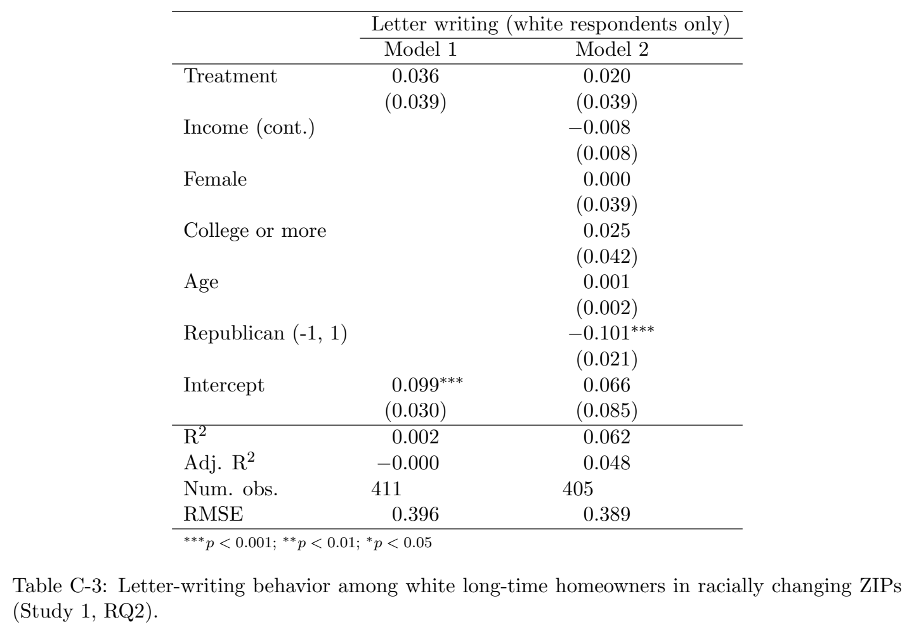

***Table C-3.*** Letter-writing behavior among white long-time homeowners in racially changing ZIPs (Study 1, RQ2).

[Download data as CSV](tables/tab-10.csv)

C.2 Study 2

Model 1 Model 2 Model 3 Model 4 Treatment −0.004 −0.002 −0.003 −0.002 (0.008) (0.008) (0.013) (0.013) Symbolic racism score −0.123∗∗∗ −0.083∗∗ Treatment x SRS −0.003 −0.001 Immigration support, pretreatment 0.852∗∗∗ 0.792∗∗∗ 0.784∗∗∗ 0.762∗∗∗ (0.011) (0.015) (0.016) (0.017) Non-white 0.008 0.004 Income (cont.) −0.003∗ −0.003∗ Female (bi.) 0.006 0.004

College or more 0.014 0.014 Republican (-1, 1) −0.036∗∗∗ −0.026∗∗∗ Intercept 0.072∗∗∗ 0.083∗∗∗ 0.146∗∗∗ 0.132∗∗∗ (0.009) (0.013) (0.016) (0.019) R2 0.722 0.727 0.731 0.730 Adj. R2 0.722 0.725 0.730 0.728 Num. obs. 1862 1827 1862 1827

RMSE 0.154 0.153 0.152 0.152 ∗∗∗p < 0.001; ∗∗p < 0.01; ∗p < 0.05

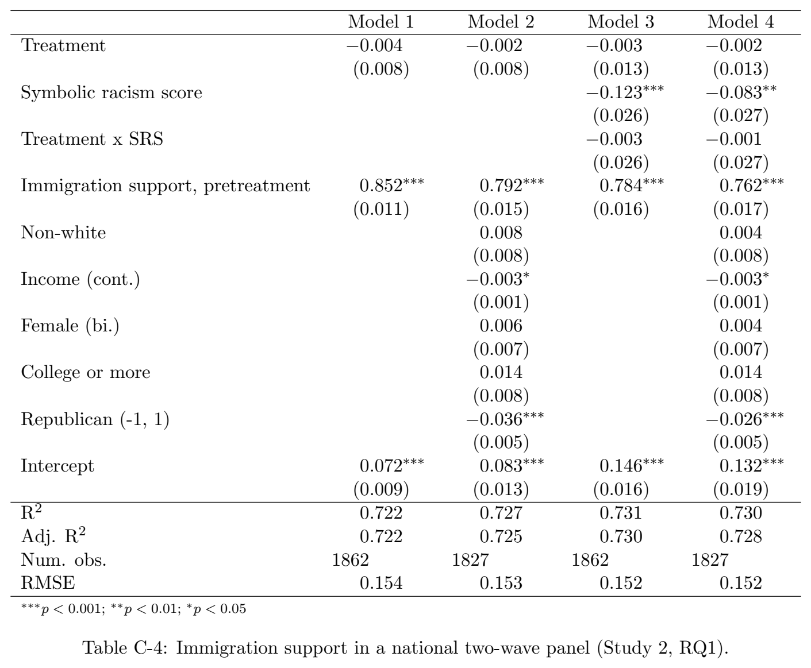

***Table C-4.*** Immigration support in a national two-wave panel (Study 2, RQ1).

[Download data as CSV](tables/tab-11.csv)

Model 1 Model 2 Treatment −0.013 −0.014 Non-white 0.000 0.002 Treatment x Non-white 0.027 0.022 Housing support, pretreatment 0.818∗∗∗ 0.764∗∗∗ Income (cont.) −0.001 Female 0.008

College or more −0.004

Republican (-1, 1) −0.039∗∗∗ Intercept 0.099∗∗∗ 0.145∗∗∗ R2 0.663 0.673

Adj. R2 0.662 0.671

Num. obs. 1864 1829

RMSE 0.183 0.180

∗∗∗p < 0.001; ∗∗p < 0.01; ∗p < 0.05

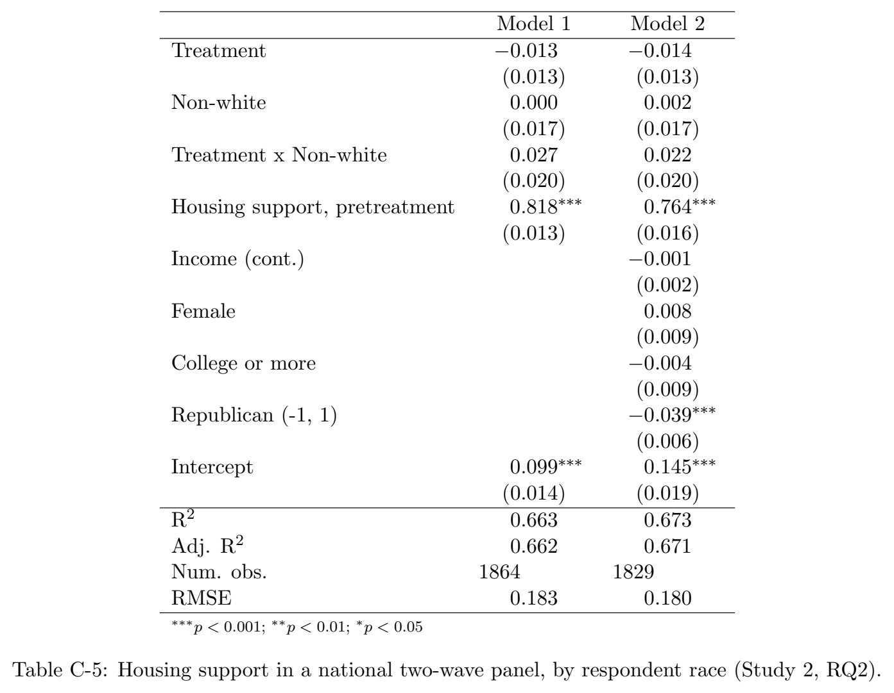

***Table C-5.*** Housing support in a national two-wave panel, by respondent race (Study 2, RQ2).

[Download data as CSV](tables/tab-12.csv)

Craig & Richeson Wetts & Willer Combined Craig and Richeson (2014) −0.020

Wetts and Willer (2018) 0.002

Combined treatment −0.002 Non-white 0.016 0.005 0.016 (0.013) (0.012) (0.012) Housing support, pretreatment 0.761∗∗∗ 0.779∗∗∗ 0.764∗∗∗ (0.023) (0.020) (0.023) Income (cont.) −0.001 −0.004 −0.001 (0.003) (0.002) (0.002) Female 0.015 0.011 0.016

(0.012) (0.012) (0.012) College or more 0.006 −0.029∗ −0.014

(0.013) (0.012) (0.012) Republican (-1, 1) −0.029∗∗∗ −0.031∗∗∗ −0.038∗∗∗ (0.008) (0.008) (0.008) Intercept 0.143∗∗∗ 0.157∗∗∗ 0.146∗∗∗ (0.024) (0.023) (0.023) R2 0.647 0.699 0.675

Adj. R2 0.644 0.696 0.672

Num. obs. 904 900 895

RMSE 0.187 0.173 0.174

∗∗∗p < 0.001; ∗∗p < 0.01; ∗p < 0.05

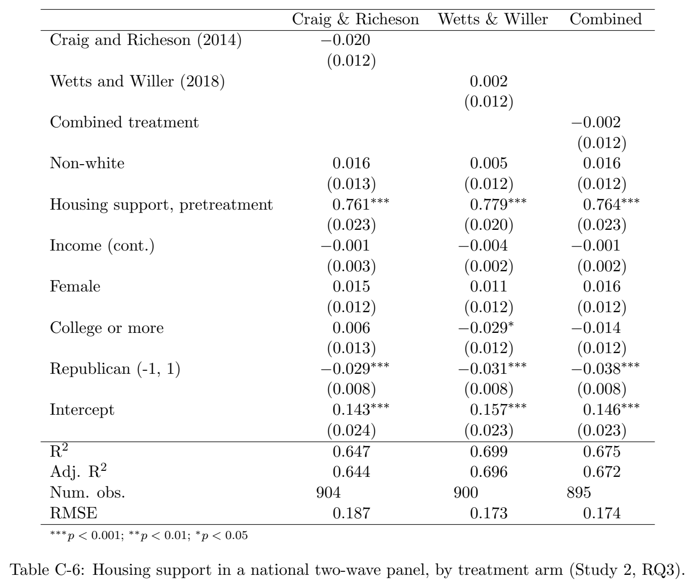

***Table C-6.*** Housing support in a national two-wave panel, by treatment arm (Study 2, RQ3).

[Download data as CSV](tables/tab-13.csv)

H1: Main effect H2: SRS interaction Model 1 Model 2 Model 3 Model 4 Treatment −0.002 −0.001 −0.019 −0.020

(0.011) (0.011) (0.016) (0.016) Symbolic racism score −0.242∗∗∗ −0.226∗∗∗ Treatment x SRS 0.054 0.054 Housing support, pretreatment 0.835∗∗∗ 0.785∗∗∗ 0.751∗∗∗ 0.735∗∗∗ (0.014) (0.017) (0.019) (0.020) Non-white 0.010 0.004 Income (cont.) −0.002 −0.003 Female 0.011 0.007 College or more −0.009 −0.012 Republican (-1, 1) −0.035∗∗∗ −0.010 Intercept 0.080∗∗∗ 0.115∗∗∗ 0.215∗∗∗ 0.242∗∗∗ (0.013) (0.019) (0.022) (0.026) R2 0.687 0.694 0.709 0.708 Adj. R2 0.687 0.692 0.708 0.706 Num. obs. 1410 1386 1410 1386

RMSE 0.177 0.176 0.171 0.172

∗∗∗p < 0.001; ∗∗p < 0.01; ∗p < 0.05

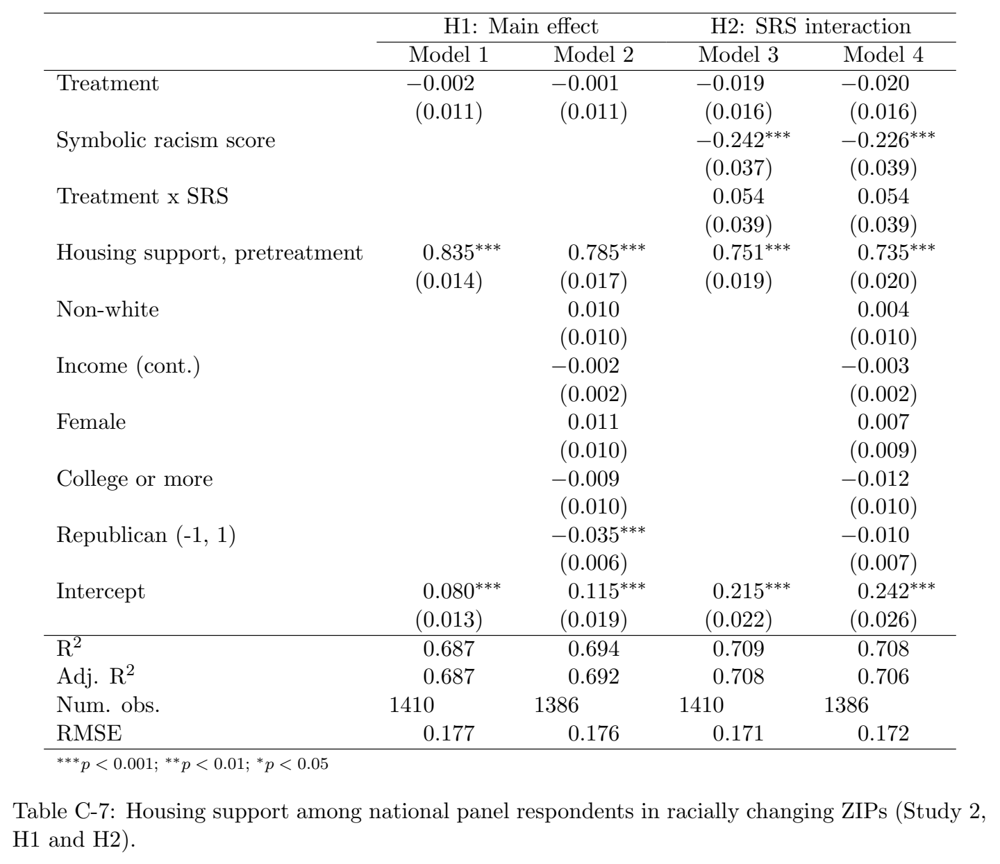

***Table C-7.*** Housing support among national panel respondents in racially changing ZIPs (Study 2, H1 and H2).

[Download data as CSV](tables/tab-14.csv)

C.3 Study 3

Model 1 Model 2 Treatment 0.012 0.012 Non-white 0.106∗∗∗ 0.057∗ Treatment x Non-white −0.047 −0.048 Income (cont.) −0.017∗∗∗ Female (bi.) −0.002

College or more −0.008

Republican (-1, 1) −0.140∗∗∗ Intercept 0.522∗∗∗ 0.599∗∗∗ R2 0.017 0.204

Adj. R2 0.015 0.199

Num. obs. 1503 1454

RMSE 0.322 0.290

∗∗∗p < 0.001; ∗∗p < 0.01; ∗p < 0.05

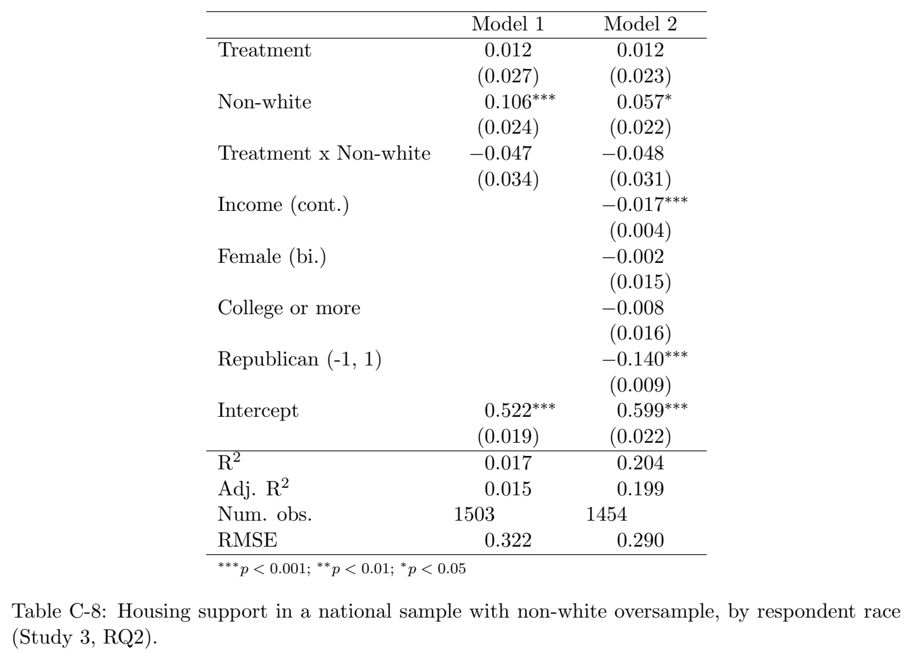

***Table C-8.*** Housing support in a national sample with non-white oversample, by respondent race (Study 3, RQ2).

[Download data as CSV](tables/tab-15.csv)

Model 1 Model 2 Treatment −0.017 −0.018 Non-white −0.031 Income (cont.) 0.010∗ Female 0.004

College or more 0.063∗∗∗ Republican (-1, 1) 0.049∗∗∗ Intercept 0.425∗∗∗ 0.365∗∗∗ R2 0.001 0.048

Adj. R2 −0.000 0.043

Num. obs. 1420 1379

RMSE 0.330 0.323 ∗∗∗p < 0.001; ∗∗p < 0.01; ∗p < 0.05

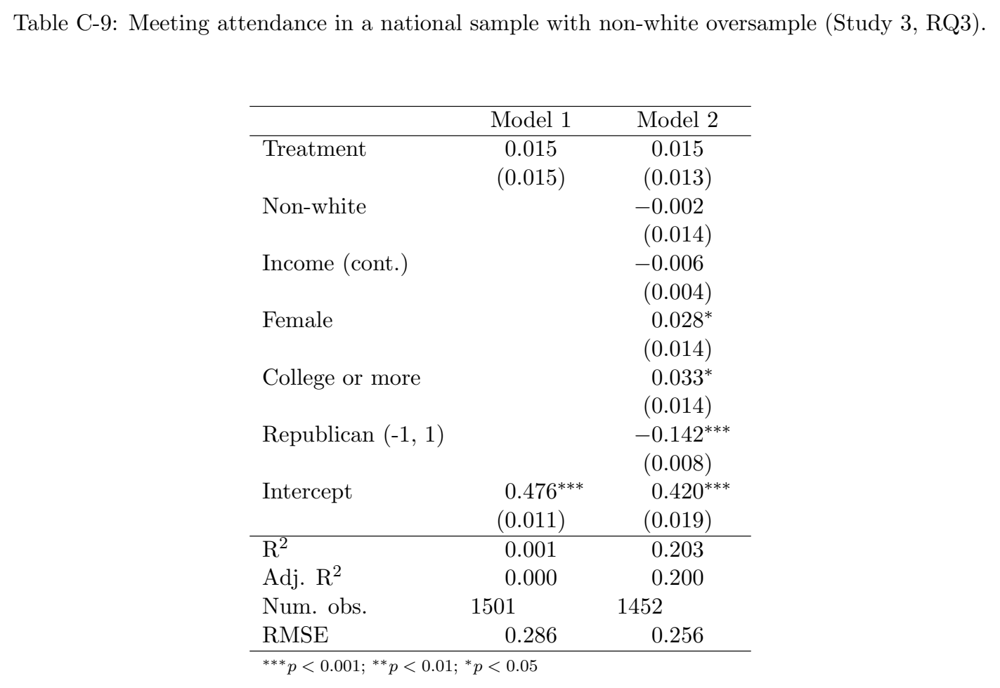

***Table C-9.*** Meeting attendance in a national sample with non-white oversample (Study 3, RQ3).

[Download data as CSV](tables/tab-16.csv)

Model 1 Model 2 Treatment 0.015 0.015 Non-white −0.002 Income (cont.) −0.006 Female 0.028∗ College or more 0.033∗ Republican (-1, 1) −0.142∗∗∗ Intercept 0.476∗∗∗ 0.420∗∗∗ R2 0.001 0.203

Adj. R2 0.000 0.200

Num. obs. 1501 1452

RMSE 0.286 0.256

∗∗∗p < 0.001; ∗∗p < 0.01; ∗p < 0.05

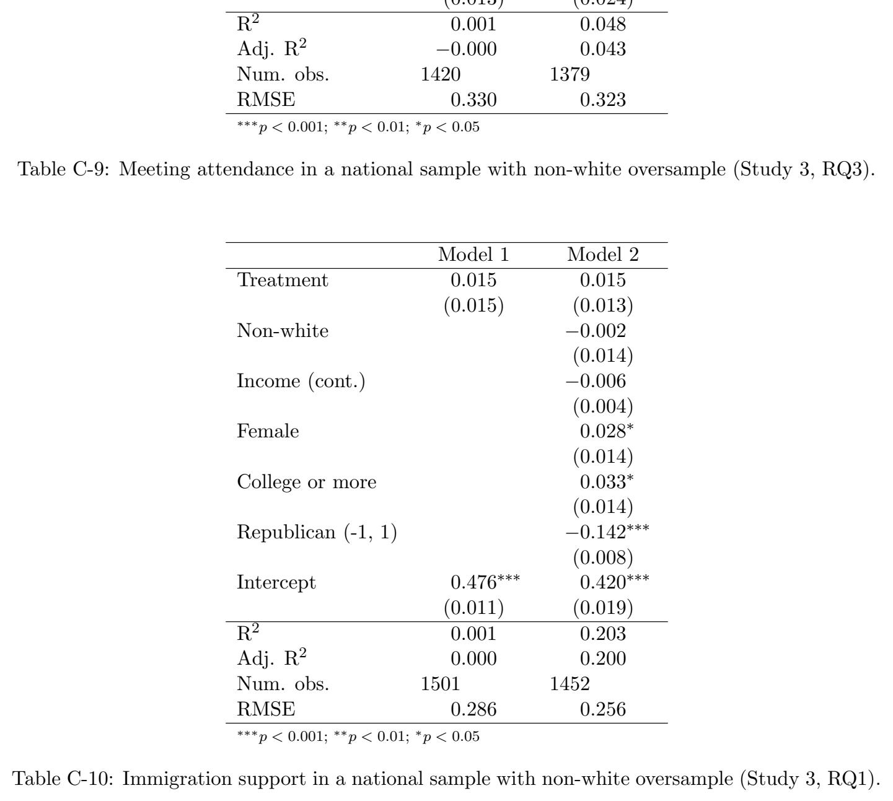

***Table C-10.*** Immigration support in a national sample with non-white oversample (Study 3, RQ1).

[Download data as CSV](tables/tab-17.csv)

Anger Disgust Sympathy Fear Hope Treatment −0.005 −0.009 0.037∗ 0.015 0.057∗∗ (0.010) (0.010) (0.017) (0.011) (0.018) Non-white 0.036∗∗∗ 0.038∗∗∗ −0.009 0.030∗∗ 0.046∗ (0.010) (0.010) (0.018) (0.011) (0.019) Income (cont.) 0.000 0.001 −0.010∗ −0.005 0.002 (0.003) (0.003) (0.004) (0.003) (0.005) Female −0.015 −0.010 −0.027 −0.016 0.010 (0.010) (0.010) (0.017) (0.011) (0.018) College or more 0.002 0.011 0.049∗∗ 0.018 0.020 (0.011) (0.010) (0.018) (0.011) (0.019) Republican (-1, 1) 0.020∗∗ 0.023∗∗∗ −0.061∗∗∗ 0.022∗∗ 0.004 (0.007) (0.007) (0.010) (0.007) (0.011) Intercept 0.065∗∗∗ 0.049∗∗∗ 0.306∗∗∗ 0.081∗∗∗ 0.372∗∗∗ (0.013) (0.013) (0.024) (0.015) (0.025) R2 0.016 0.022 0.035 0.017 0.012 Adj. R2 0.012 0.017 0.031 0.013 0.008 Num. obs. 1454 1454 1455 1454 1455

RMSE 0.198 0.194 0.326 0.213 0.347

∗∗∗p < 0.001; ∗∗p < 0.01; ∗p < 0.05

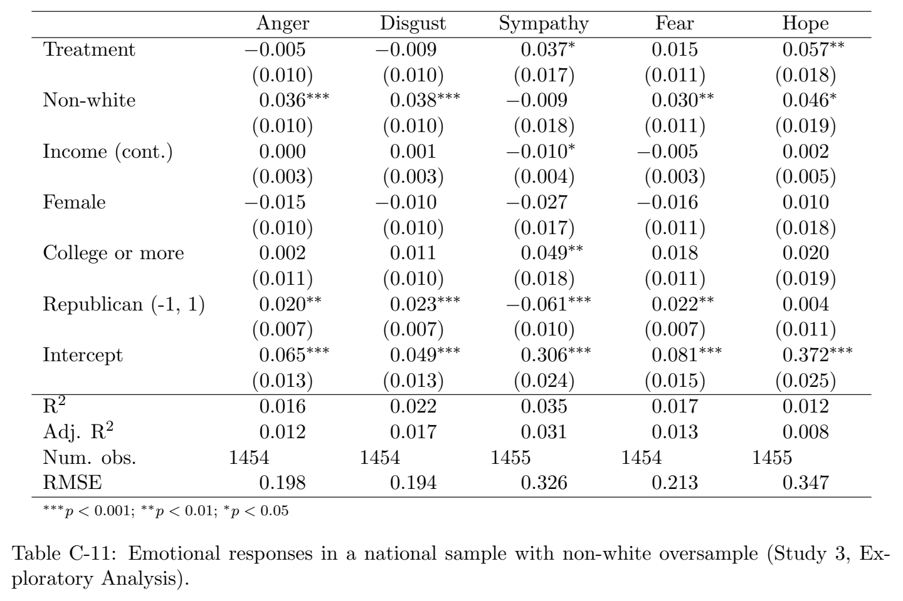

***Table C-11.*** Emotional responses in a national sample with non-white oversample (Study 3, Ex- ploratory Analysis).

[Download data as CSV](tables/tab-18.csv)

Anger Disgust Sympathy Fear Hope

Treatment −0.090∗∗∗ −0.089∗∗∗ 0.116∗∗∗ −0.060∗∗∗ 0.251∗∗∗ (0.016) (0.016) (0.029) (0.016) (0.029) Symbolic Racism Score 0.002 0.036 −0.200∗∗∗ 0.060 0.035

(0.038) (0.036) (0.052) (0.036) (0.060) Treatment x SRS 0.249∗∗∗ 0.235∗∗∗ −0.233∗∗∗ 0.220∗∗∗ −0.569∗∗∗ (0.050) (0.049) (0.061) (0.047) (0.067) Non-white 0.043∗∗∗ 0.046∗∗∗ −0.023 0.038∗∗∗ 0.033 (0.010) (0.010) (0.017) (0.011) (0.018) Income (cont.) 0.001 0.001 −0.011∗ −0.005 0.002 (0.003) (0.003) (0.004) (0.003) (0.005) Female −0.007 −0.001 −0.044∗∗ −0.005 −0.007

(0.010) (0.010) (0.017) (0.011) (0.018) College or more 0.003 0.013 0.044∗ 0.020 0.018 (0.011) (0.010) (0.018) (0.011) (0.018) Republican (-1, 1) −0.004 −0.005 −0.003 −0.010 0.052∗∗∗ (0.008) (0.008) (0.012) (0.009) (0.013) Intercept 0.050∗ 0.018 0.409∗∗∗ 0.040 0.390∗∗∗ (0.020) (0.019) (0.033) (0.021) (0.035) R2 0.064 0.077 0.086 0.066 0.086

Adj. R2 0.058 0.072 0.080 0.060 0.080

Num. obs. 1454 1454 1455 1454 1455

RMSE 0.194 0.189 0.317 0.208 0.334

∗∗∗p < 0.001; ∗∗p < 0.01; ∗p < 0.05

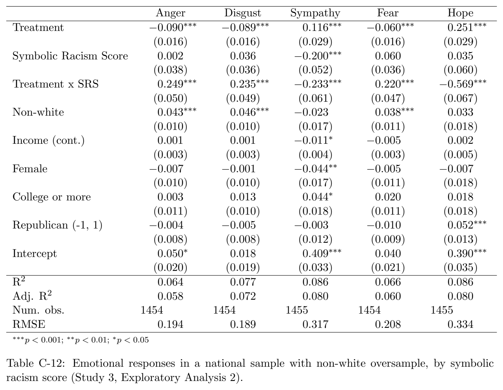

***Table C-12.*** Emotional responses in a national sample with non-white oversample, by symbolic racism score (Study 3, Exploratory Analysis 2).

[Download data as CSV](tables/tab-19.csv)

C.4 Study 4

Attitudinal support for state control Model 1 Model 2 Treatment 0.012 −0.019

Support for housing supply 0.420∗∗∗ 0.360∗∗∗ Treatment x Support supply −0.009 0.035 Homeowner −0.015 Income (cont.) −0.007∗∗ Female 0.038∗∗ College or more −0.030∗ Age −0.003∗∗∗ Non-white 0.027 Republican (-1, 1) 0.031 Conservative (-1, 1) −0.049∗∗ Intercept 0.117∗∗∗ 0.320∗∗∗ R2 0.158 0.206 Adj. R2 0.157 0.201 Num. obs. 2792 1951

RMSE 0.276 0.272

∗∗∗p < 0.001; ∗∗p < 0.01; ∗p < 0.05

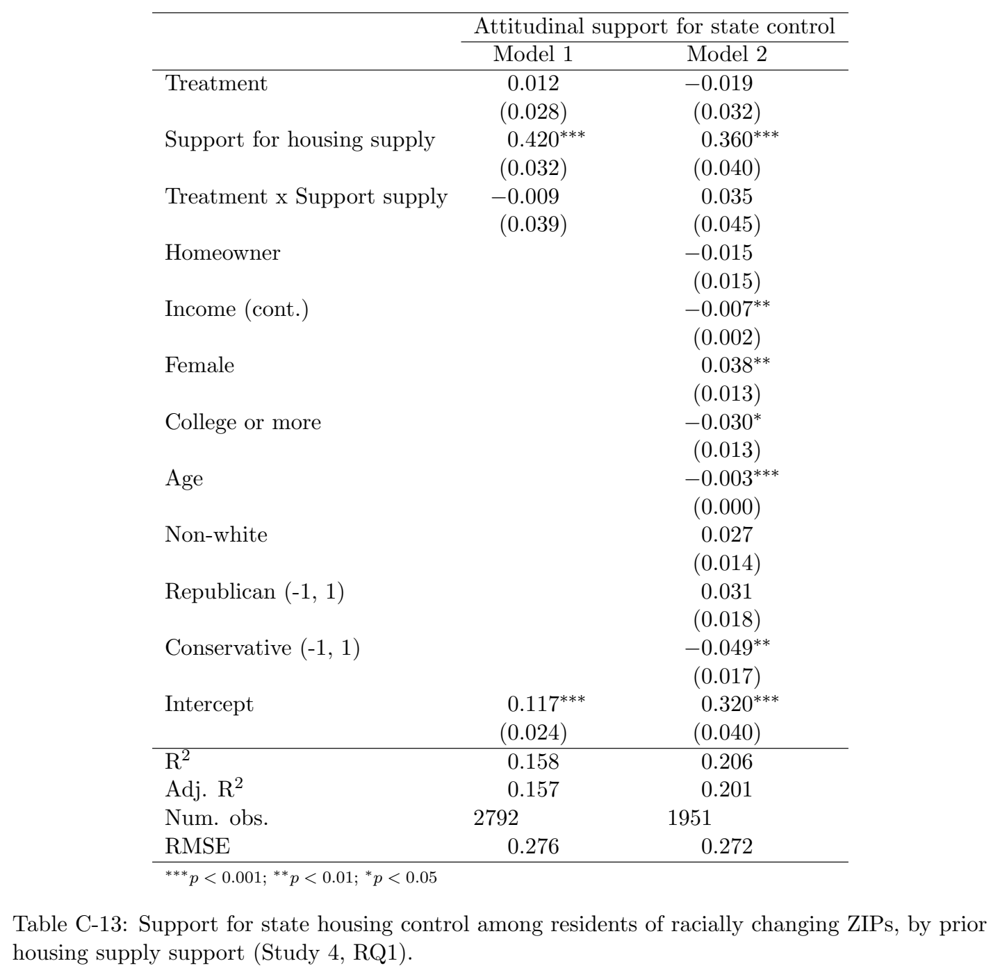

***Table C-13.*** Support for state housing control among residents of racially changing ZIPs, by prior housing supply support (Study 4, RQ1).

[Download data as CSV](tables/tab-20.csv)

Letter support for state control Model 1 Model 2 Treatment 0.059∗∗∗ 0.061∗∗∗ Homeowner 0.015

Income (cont.) −0.015∗∗∗ Female −0.076∗∗∗ College or more 0.052∗∗ Age −0.002∗∗ Non-white −0.003 Republican (-1, 1) 0.028 Conservative (-1, 1) −0.062∗∗ Intercept −0.034∗∗∗ 0.132∗∗∗ R2 0.006 0.042 Adj. R2 0.005 0.038 Num. obs. 2791 1950

RMSE 0.390 0.377

∗∗∗p < 0.001; ∗∗p < 0.01; ∗p < 0.05

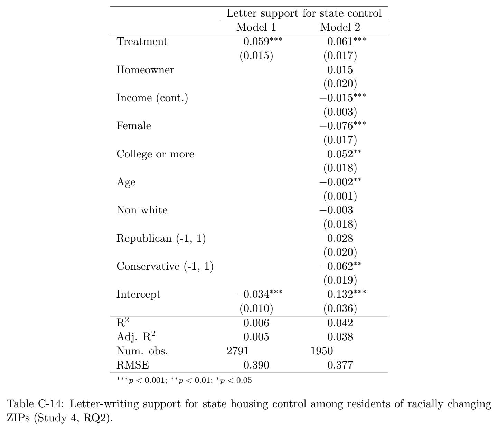

***Table C-14.*** Letter-writing support for state housing control among residents of racially changing ZIPs (Study 4, RQ2).

[Download data as CSV](tables/tab-21.csv)

Letter support for state control Model 1 Model 2 Treatment 0.073∗∗ 0.043 Party match with Governor 0.033 −0.002

Treatment x Party match −0.041 0.017

Homeowner 0.015 Income (cont.) −0.013∗∗∗ Female −0.089∗∗∗ College or more 0.059∗∗ Age −0.002∗∗ Non-white −0.018 Republican (-1, 1) 0.040 Conservative (-1, 1) −0.076∗∗ Intercept −0.043∗∗ 0.123∗∗ R2 0.005 0.044 Adj. R2 0.004 0.038 Num. obs. 2434 1830

RMSE 0.398 0.380 ∗∗∗p < 0.001; ∗∗p < 0.01; ∗p < 0.05

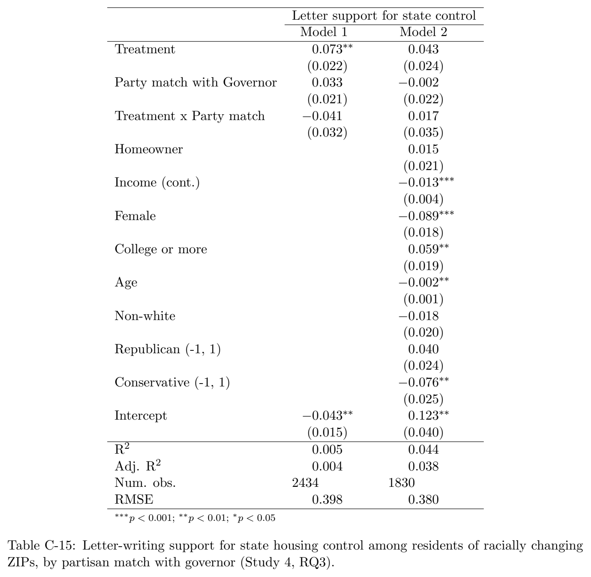

***Table C-15.*** Letter-writing support for state housing control among residents of racially changing ZIPs, by partisan match with governor (Study 4, RQ3).

[Download data as CSV](tables/tab-22.csv)

C.5 Meta-Analysis

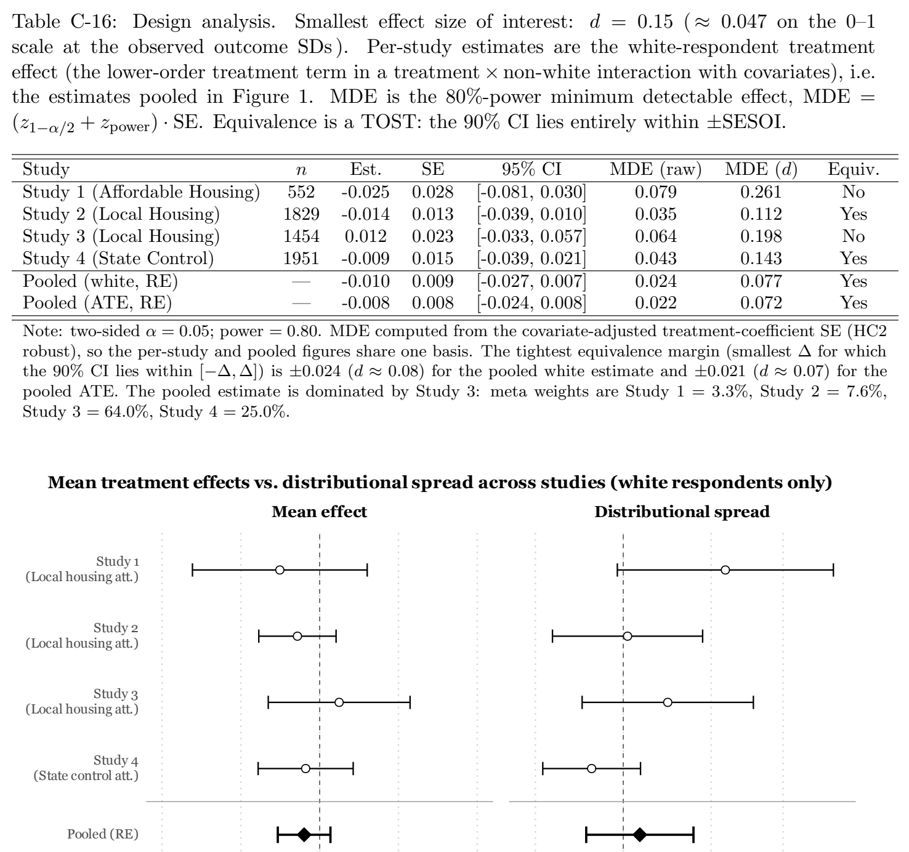

***Table C-16.*** Design analysis. Smallest effect size of interest: d = 0.15 ( ≈ 0.047 on the 0–1 scale at the observed outcome SDs ). Per-study estimates are the white-respondent treatment effect (the lower-order treatment term in a treatment × non-white interaction with covariates), i.e. the estimates pooled in Figure 1. MDE is the 80%-power minimum detectable effect, MDE = (z + z ) · SE. Equivalence is a TOST: the 90% CI lies entirely within ±SESOI. 1−α/2 power Study n Est. SE 95% CI MDE (raw) MDE (d) Equiv. Study 1 (Affordable Housing) 552 -0.025 0.028 [-0.081, 0.030] 0.079 0.261 No Study 2 (Local Housing) 1829 -0.014 0.013 [-0.039, 0.010] 0.035 0.112 Yes

[Download data as CSV](tables/tab-23.csv)

Study 3 (Local Housing) 1454 0.012 0.023 [-0.033, 0.057] 0.064 0.198 No Study 4 (State Control) 1951 -0.009 0.015 [-0.039, 0.021] 0.043 0.143 Yes Pooled (white, RE) — -0.010 0.009 [-0.027, 0.007] 0.024 0.077 Yes Pooled (ATE, RE) — -0.008 0.008 [-0.024, 0.008] 0.022 0.072 Yes Note: two-sided α = 0.05; power = 0.80. MDE computed from the covariate-adjusted treatment-coefficient SE (HC2 robust), so the per-study and pooled figures share one basis. The tightest equivalence margin (smallest ∆ for which the 90% CI lies within [−∆, ∆]) is ±0.024 (d ≈ 0.08) for the pooled white estimate and ±0.021 (d ≈ 0.07) for the pooled ATE. The pooled estimate is dominated by Study 3: meta weights are Study 1 = 3.3%, Study 2 = 7.6%, Study 3 = 64.0%, Study 4 = 25.0%.

Mean treatment effects vs. distributional spread across studies (white respondents only)

Mean effect Distributional spread

Study 1

(Local housing att.)

Study 2

(Local housing att.)

Study 3

(Local housing att.)

Study 4

(State control att.)

Pooled (RE)

-0.10 -0.05 0.00 0.05 0.10 0.8× 1.0× 1.25× 1.5×

Average treatment effect Variance ratio (s2_treat / s2_ctrl)

(0–1 scale) [> 1.0 = treated group more dispersed]

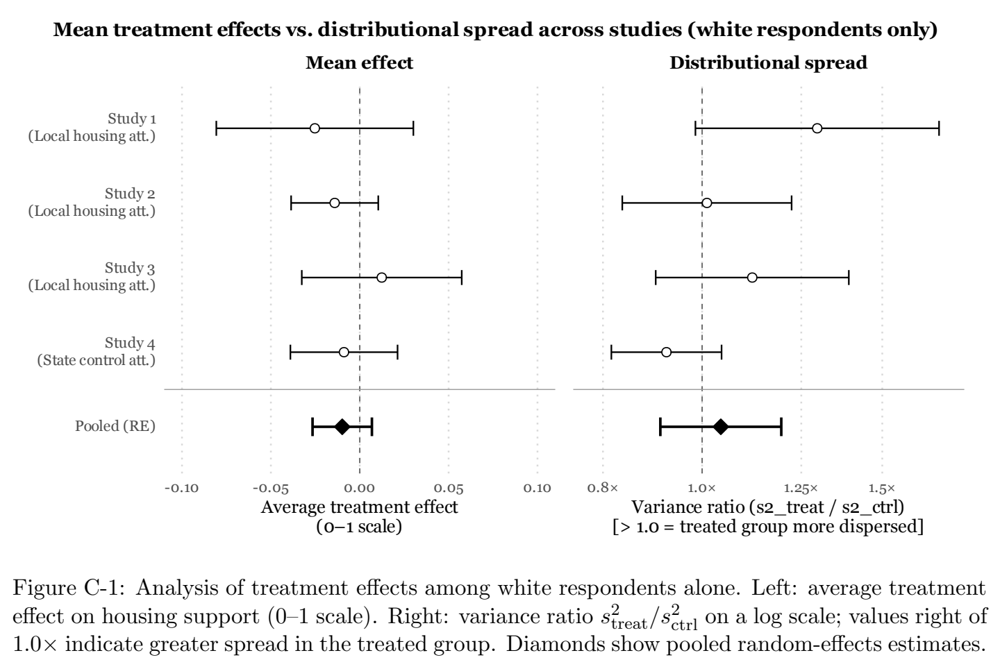

***Figure C-1.*** Analysis of treatment effects among white respondents alone. Left: average treatment effect on housing support (0–1 scale). Right: variance ratio s2 /s2 on a log scale; values right of treat ctrl 1.0× indicate greater spread in the treated group. Diamonds show pooled random-effects estimates.

## D Pre-Registrations

The following documents are the pre-registrations we registered with the Center for Open Science (OSF.io). At times, the pre-registrations refer to each other using a different order than what is in the manuscript. This is because Study 4 in the manuscript was conducted first, making it Study 1 in the pre-registrations. This study is presented last in the manuscript for clarity, as Studies 1–3 more directly test our core hypothesis: the effect of racial demographic change primes on support for affordable housing.

Below, the pre-registrations are presented in the order of the manuscript.

## Study Design Overview

What shapes a voter’s willingness to limit or even give up their veto power over policy? In a previous experiment, we sought to understand how di↵erent messages a↵ect voters’ willingness to give up local control over new a↵ordable housing and instead empower state-level decisionmakers. Specifically, we assessed the e↵ect of sharing local racial demographic change data on both attitudinal and behavioral outcomes.

In this follow-up experiment, we focus on a subset of respondents that prior research suggests would be the most sensitive to racial demographic change: long-time homeowners who have experienced this change firsthand. We also design a mechanism check. Does information about your local demographic change a↵ect support for immigration policy in the form of local refugee resettlement? If the treatment a↵ects support for local immigration policy, but not for local a↵ordable housing, that would suggest that the role of racial demographic change on modern housing attitudes is less important than previously imagined.

Our outcomes are both attitudinal and behavioral. For attitudinal outcomes, we ask respondents for their support for two policies: a↵ordable housing nearby and local refugee resettlement levels. For a behavioral outcome, we ask respondents to sign a letter to their governor endorsing either more or less new a↵ordable housing in their community. To make the behavioral outcome more meaningful, we inform respondents that we will print and mail their letter to their governor, o↵ering to provide them with photographic evidence that we have done so.

Sample

Our sample is constrained by our treatments. First, we constructed a sample respondents who are homeowners and have lived in their home for at least 10 years. These criteria are evaluated using self-reported data from a previous survey and we recontact qualifying respondents using their respondent IDs.

To make the treatment of local racial demographic change realistic, we subset to a sample of respondents from ZIP codes which have experienced a substantively meaningful increase in the non-white population. Specifically, we will sample respondents from ZIP codes which experienced at least a 5 percent decrease in their non-Hispanic white population from 2000 to 2020.

The sample frame contains 1,144 respondents, of which 70% (798) identify as white, non- Hispanic. The survey will be fielded via Connect. Respondents have already shared their current ZIP code in Wave 1 of the survey. Information from this ZIP code will used within Wave 2 of the survey, specifying how much their ZIP code has demographically changed over time and the name of their governor.

## Hypotheses

Hypothesis 1 Exposure to a message about local demographic change will decrease support for a↵ordable housing locally among non-Hispanic white homeowners.

Hankinson (2023) finds that a local decrease in the non-Hispanic white population increases voter support for direct democratic control over a↵ordable housing. Thus, we expect that priming respondents to think about how the non-Hispanic white population of their ZIP code has decreased over the past 20 years will decrease their support for giving up similar local control over a↵ordable housing.

## Research Questions

In addition to our formal hypothesis, we have a series of exploratory research questions we will investigate through this study. Due to the novelty of the study and subject matter, we have no clear expectations of how these variables will be related.

Research Question 1 Does our treatment a↵ect subject’s support for local refugee settlement? Research Question 2 Does our treatment a↵ect subject’s willingness to engage in meaningful political action (i.e., co-signing a letter to their governor advocating for either more or less new a↵ordable housing in their community)?

Research Question 3 Is there evidence of a treatment e↵ect among non-whites?

## Analytical Strategy

Our hypothesis, as well as Research Questions #1-2, will be evaluated on the non-white Hispanic portion of our sample only. To answer Research Question #3, we will estimate all models on the non-white portion of our sample.

Our attitudinal outcome (support for “a proposal to build a 50-unit a↵ordable housing development in your city/town”) is operationalized as a continuous variable on a 7-point scale from support to oppose (See Appendix for full survey questionnaire).

Our behavioral outcome is a continuous variable of the respondent’s willingness to endorse a letter to their governor:

• -1 for letter against new, nearby a↵ordable housing

• 0 for no letter

• +1 for letter in favor of new, nearby a↵ordable housing

For our hypothesis and research questions, we will regress the dependent variable on an indicator for treatment, compared to the control condition. We will use robust standard errors as well as demographic covariates. Our covariates include:

• Homeownership - binary (1 if homeowner, 0 otherwise)

• Income - continuous variable based on bins

• Gender - binary (1 if female, 0 if male, other excluded)

• Age - continuous variable

• Race - binary (1 if non-Hispanic white, 0 otherwise)

• Education - binary (1 if 4-year college degree or higher, 0 otherwise)

• Partisanship - continuous variable (-1 if Democrat or lean Democrat, +1 if Republican or lean Republican, 0 otherwise)

• Ideology - continuous variable (-1 if liberal or lean liberal, +1 if conservative or lean conservative, 0 otherwise)

We will also report results without covariates; those will appear in the appendix. We will also include a pre-treatment measure of support for housing:

• A measure of support for a 50-unit a↵ordable housing development in their own community, administered in Wave 2 prior to treatment (7-point scale).

We include two attention checks prior to treatment. Any respondent who fails to pass both attention checks will be excluded from the analysis. The complete survey instrument is included in the Appendix. If we observe any attrition within wave, we will follow the procedure outlined in Chapter 7 of Gerber and Green (2012).

## References

Gerber, Alan S and Donald P Green. 2012. Field Experiments: Design, Analysis, and Interpretation. W. W. Norton & Company.

Hankinson, Michael. 2023. Racial Demographic Change Increases Support for Voters’ Veto Power Over A↵ordable Housing. Technical report Working Paper.

## Online Appendix for “Local Control Over A↵ordable Housing”

## Contents

A Wave 1: Survey Questionnaire A-2 B Wave 2: Survey Questionnaire A-2

## A Wave 1: Survey Questionnaire

Italicized language is for pre-analysis plan clarity and will not be included in the survey. 1. What Zip code do you live in? Zip codes are usually five digits (e.g., 07666).

• Text-box answer

2. In what year did you move to the Zip code you now live in? Please enter a specific year with four numbers (e.g., 2013).

3. Is your current primary residence...

• Owned by you or someone in your household

• Rented

• Occupied without payment of rent

4. If homeowner... In what year did you buy the home you now live in? Please enter the precise year with four numbers (e.g., 2013).

## B Wave 2: Survey Questionnaire

Italicized language is for pre-analysis plan clarity and will not be included in the survey, with the exception of the letter to the respondent’s governor.

Informed Consent

[Institutional Review Board Consent Form]

• Yes, I agree with these terms

• No, I do not agree with these terms

Attention Checks

1. For our research, careful attention to survey questions is critical! We thank you for your care. • I understand

• I do not understand

2. People are very busy these days and many do not have time to follow what goes on in the government. We are testing whether people read questions. To show that you’ve read this much, answer both “extremely interested” and “very interested.”

• Extremely interested

• Very interested

• Moderately interested

• Slightly interested

• Not at all interested

Demographics

First, we would like to ask some questions about your background.

### 1. What is your annual household income (including bonuses and commissions) in U.S. dollars?

• None or less than $19,999 • $350,000 and over

• Don’t know

### 2. Do you identify as male or female?

• Male

• Female

• Neither

### 3. In what year were you born?

• Drop-down selection from 1910 to 2005 4. What racial or ethnic group(s) best describe(s) you? You may select more than one. • Caucasian/White

• Black of African-American

• Latino or Hispanic

• Native American or Aleut

• Asian/Pacific Islander

• Middle Eastern

• Other

### 5. What is the highest level of education you have completed?

• Did not graduate from high school

• High school graduate

• Some college, but no degree

• 2-year college degree

• 4-year college degree

• Postgraduate degree (MA, MBA, MD, JD, PhD, etc.) 6. Generally speaking, do you consider yourself a... • Democrat

• Republican

• Independent

• Other partyy

7. If Generally speaking, do you consider yourself a... = Democrat: Would you call yourself a strong Democrat or a not very strong Democrat? • Strong

• Not very strong

8. If Generally speaking, do you consider yourself a... = Republican: Would you call yourself a strong Republican or a not very strong Republican?

• Strong

• Not very strong

9. If Generally speaking, do you consider yourself a... = Independent or Other party: Do you think of yourself as closer to the Republican Party or to the Democratic Party?

• Closer to the Republican Party

• Closer to the Democratic Party

• Neither

10. Generally speaking, do you usually think of yourself as a liberal, a conservative, a moderate, or you haven’t thought much about this?

• Liberal

• Conservative

• Moderate

• Haven’t thought much about it

11. If Generally speaking, do you usually think of yourself as a... = liberal: Would you call yourself a strong liberal or a not very strong liberal?

• Strong liberal

• Not very strong liberal

12. If Generally speaking, do you usually think of yourself as a... = conservative: Would you call yourself a strong conservative or a not very strong conservative?

• Strong conservative

• Not very strong conservative

13. If Generally speaking, do you usually think of yourself as a... = moderate or Haven’t thought much about it: Do you think of yourself as closer to liberals or closer to conservatives?

• Closer to liberals

• Closer to conservatives

• Neither

Experimental Conditions

Respondents will be randomized into one of two conditions: Control or Local Demographic Change. Control: Placebo Text

Add short timer (5 seconds)

What do you need for birdwatching?

• The most basic equipment required for bird watching is your eyes, though you will soon need to have more items with you if you intend to make this a pastime or serious hobby. How far you go is a matter of taste and budget.

• The most useful thing that you can carry is a notepad and pencil. Use this to make a note of location, time, date, weather and habitat. Write a list of the birds that you see and know. Draw or write down a description of those that you don’t. You can look them up later in you field guide. Your notebook should become a diary of where you have been and what you have seen.

• A field guide is a book that provides descriptions of birds to assist you in their identification. The descriptions use several factors to help you determine the exact bird that you are looking at. As soon as you see a bird that you do not recognize you will need to have access to a good field guide. There are many to choose from.

• Binoculars. These are pretty essential and buy the best that you can a↵ord. A good pair well looked after will last you a lifetime. Take time to choose ones that suit you.

Treatment: Local Demographic Change

For this prompt, ZIP code is based on the respondent’s self-reported ZIP code. US Census statistics on ZIP code-level racial demographics are piped-in based on the self-reported ZIP code.

The United States has grown more racially diverse over time.

You live in ZIP code [RESPONDENT ZIP CODE]. We’ve crunched the data, and we can confirm that your ZIP code has gotten increasingly diverse with time. To be precise, over the last twenty years, the white population in your area has decreased by [DIFFERENCE ZIP PERCENT- AGE POINT NON-HISPANIC WHITE 2020-2000] percent.

Dependent Variables

Following the experimental conditions, respondents will answer dependent variables.

Attitudinal Outcomes

1. Housing - Local Project Would you support a proposal to build a 50-unit a↵ordable housing development in your city/town?

• Strongly oppose

• Oppose

• Somewhat oppose

• Neither support nor oppose

• Somewhat support

• Support

• Strongly support

2. Immigration - Local Do you support or oppose refugee resettlement in your local community? Suppose that people who feel that absolutely no refugees should be placed in your local community are at one end of a scale, at point 0; and others who feel that as many refugees as possible should be placed in your local community are at the other end, at point 7. Where would you place YOURSELF on this scale?

• 7-point scale

Behavioral Outcomes

In this study, you’ve read and answered a question about housing policy.

Next, we would like to know if you would be willing to sign a letter to your governor about your opinion on a↵ordable housing.

We will print and send each letter in a stamped envelope.

We’re serious about this—if you want a photo of your letter, stamped and ready to be sent to your governor, email me at housingsurveystudy@gmail.com.

• I wish to write my governor to share my belief that [state] does not need more a↵ordable housing in my community.

• I wish to write my governor to share my belief that [state] does need more a↵ordable housing in my community.

• I do not wish to write my governor.

Anti-A↵ordable Housing Letter

Here’s the draft of the letter:

Dear Governor [RESPONDENT’S GOVERNOR’S NAME],

I believe that [STATE NAME] should not compel cities and towns to build more a↵ordable housing in their communities. For far too long, state politicians have forced new construction of a↵ordable housing in local communities. Local politicians know what’s best for their community. We do not need more a↵ordable housing in my community.

Pro-A↵ordable Housing Letter

Here’s the draft of the letter:

Dear Governor [RESPONDENT’S GOVERNOR’S NAME],

I believe that [STATE NAME] should compel cities and towns to build more a↵ordable housing in their communities. For far too long, local politicians have prevented new construction of a↵ordable housing in their communities. Housing prices in this country have become too expensive. We need more a↵ordable housing in my community.

1. What do you want to add to the letter? Write in the box below.

• Text-box answer

We will send the letter in a stamped envelope. To do so, we need some more information. Don’t worry — we will destroy this information as soon as we’ve sent your letter!

Please enter your name:

• Text-box answer

2. Please enter your address:

• Text-box answer

3. Do you have any other comments for us about this survey or how local governments should make decisions about permitting a↵ordable housing?

• Text-box answer

4. If Control... Earlier in this survey, you read a passage about birdwatching. According to the text, what is essential for birdwatching?

• Sunglasses

• Binoculars

5. If Treatment... Earlier in this survey, you read a passage about the racial demographics of your ZIP code. According to the text, has the white population in your area increased or decreased since the year 2000?

• Increased

• Decreased

Pre-Analysis Plan for Effects of Demographic Change on Housing Attitudes (Study 3) Motivation

In Study 1, we find that whites do not change their support of state control over housing policy when provided information about local racial demographic change. In Study 2, we construct a unique sample of long-term white homeowners and find that personalized treatments about racial demographic change at the ZIP code level also do not change

policy attitudes among whites (but may among non-whites).

In Study 3, we want to generalize our approach by closely mirroring existing

research on how to test the effects of racial demographic change on racial attitudes,

including housing policy. We use two common racial primes about demographic change nationwide: one from Craig and Richeson (2014), the other from Wetts and Willer (2018), as well as the union of the two prompts. Our dependent variable of interest is still support for new affordable housing in one’s own community.

As mechanism checks, we include a pre-treatment measure of respondents’ racial resentment, which we will interact with treatment. We also include a dependent variable about local refugee resettlement, which should most closely pick-up a response to

national demographic change (which many may attribute to immigration).

Design

In this experiment, we randomize exposure of respondents to information about national demographic change in the United States and we record respondents’ support for

affordable housing in their community. While pretreatment demographics and policy

attitudes are captured in Wave 1, respondents in Wave 2 will be randomized into one of the following:

• Control condition – placebo text

• Treatment 1 – Craig and Richeson text-based message of demographic change • Treatment 2 – Wetts and Willer visualization of demographic change

• Treatment 3 – Combination of Craig and Richeson text-based message of

demographic change and Wetts and Willer visualization of demographic change Sample

The survey will target adult respondents from the United States. Respondents will be recruited using the survey platform Cloud Research Connect. Wave 1 will survey 2,000 respondents. With an expected retention rate of 70%, Wave 2 will survey 1,400

respondents.

Hypotheses

In this study, we test two hypotheses.

H1: Priming respondents to think about national demographic change will decrease support for affordable housing in their community.

Regress support for affordable housing on treatment, controlling for respondent

demographics and respondent support for housing policy outcome in Wave 1.

H2: The treatment effect of the prime will be stronger among respondents with higher levels of racial resentment.

Regress support for affordable housing on treatment interacted with respondent racial resentment score, controlling for respondent demographics and respondent support for housing policy outcome in Wave 1.

We also propose three research questions.

RQ1: Does treatment affect attitudes towards local refugee resettlement?

Regress support for refugee resettlement on treatment, controlling for respondent

demographics and respondent support for refugee policy outcome in Wave 1.

RQ2: Is there a treatment effect on housing attitudes among non-white respondents? Regress support for affordable housing on treatment interacted with respondent

race/ethnicity, controlling for respondent demographics and respondent support for housing policy outcome in Wave 1.

RQ3a: Will priming respondents to think about national demographic change with a textbased treatment decrease support for affordable housing in their community?

RQ3b: Will priming respondents to think about national demographic change with an image-based treatment decrease support for affordable housing in their community? RQ3c: Will priming respondents to think about national demographic change with a

combined text and image treatment decrease support for affordable housing in their

community?

Regress support for affordable housing on three treatment variables, controlling for

respondent demographics and respondent support for housing policy outcome in Wave 1. Analytical Strategy

All hypothesis and research questions will be tested via OLS using robust standard errors. All dependent variables will be scaled to a 0 to 1 outcome. We will use all demographic

controls listed. Most notably, education will be defined as having completed college, party ID will range from -1 (Democrat) to +1 (Republican), homeownership will be a binary, and race will be defined as a binary for white, non-Hispanic. For the racial resentment scale, all responses will be scaled from 1 (strongly oppose) to 5 (strongly support), with items #2, #3, and #6 reverse-coded. All six responses will then be averaged for each respondent.

For H1, H2, RQ1 and RQ2, our treatment variable will be a binary variable that collapses assignment to one of our three treatments. For RQ3a-c, we will regress our dependent variable on three separate treatment variables, as well as control variables.

Survey Questions – Wave 1

After passing the attention checks, the question blocks for demographics, partisanship, the racial resentment scale, and the pretreatment policy support questions were

randomized for all respondents.

Consent Form

Please click “Yes” to continue if you agree with these terms.

• Yes, I agree with these terms

• No, I do not agree with these terms

Attention Check 1

For our research, careful attention to survey questions is critical! We thank you for your care.

• I understand

• I do not understand

Attention Check 2

People are very busy these days and many do not have time to follow what goes on in the government. We are testing whether people read questions. To show that you’ve read this much, answer both “extremely interested” and “very interested.” • Extremely interested

• Very interested

• Moderately interested

• Slightly interested

• Not at all interested

Demographics

Intro: We would like to ask some questions about your background. Income

What is your annual household income (including bonuses and commissions) in U.S. dollars?

• None or less than $19,999

• $350,000 and over

• Don’t know

Gender

Do you identify as male or female? • Male

• Female

• Other: ______

Age

In what year were you born?

• Dropdown with options 1910-2006 Race

What racial or ethnic group(s) best describe(s) you? You may select more than one. • Caucasian/White (non-Hispanic) • Black or African-American (non-Hispanic) • Latino or Hispanic

• Native American or Aleut

• Asian/Pacific Island

• Middle Eastern

• Other

Education

What is the highest level of education you have completed? • Did not graduate from high school • High school graduate

• Some college, but no degree

• 2-year college degree

• 4-year college degree

• Postgraduate degree (MA, MBA, MD, JD, PhD, etc.)

Racial Resentment Scale

Please provide your level of agreement with these questions: (Strongly Disagree, Disagree, Neither Agree nor Disagree, Agree, Strongly Agree)

• Irish, Italians, Jewish and other minorities overcame prejudice and worked their way up. Blacks should do the same without any special favors.

• Generations of slavery and discrimination have created conditions that make it

difficult for blacks to work their way out of the lower class.

• Over the past few years, blacks have gotten less than they deserve.

• It’s really a matter of some people not trying hard enough; if blacks would only try harder they could be just as well off as whites.

• Discrimination against blacks is no longer a problem in the United States. • It is easy to understand the anger of black people in America.

Zip

What is the 5-digit ZIP code of your primary residence? _________________________ Homeowner

Is your current primary residence….

• Owned by you or someone in your household

• Rented

• Occupied without payment of rent, but not owned by you or someone in your household

Party ID

Generally speaking, do you consider yourself a…

• Democrat

• Republican

• Independent

• Other party

Party ID 2 (If Democrat is selected)

Would you call yourself a strong Democrat or a not very strong Democrat? • Strong

• Not very strong

Party ID 2 (If Republican is selected)

Would you call yourself a strong Republican or a not very strong Republic? • Strong

• Not very strong

Party ID 3 (If Independent or Other Party is selected)

Do you think of yourself as closer to the Republican Party or to the Democratic Party? • Closer to the Republican Party

• Closer to the Democratic Party

• Neither

Pretreatment Policy Support – Affordable Housing

A local group is proposing to build a 100-unit affordable housing development in your community. The units will be occupied by low-income and moderate-income residents. The new building will be 1/4 mile (5 minute walk) from your home.

Based on this information, would you support or oppose such a project?

(Strongly oppose to strongly support; Randomly flip scale order).

Pretreatment Policy Support – Refugee Resettlement

Do you support or oppose refugee resettlement in your local community? Suppose that people who feel that absolutely no refugees should be placed in your local community are at one end of a scale, at point 1; and others who feel that as many refugees as possible should be placed in your local community are at the other end, at point 7. Where would you place YOURSELF on this scale? Randomly flip scale order

Feedback

Do you have any other comments for us about this survey or affordable housing?

Survey Questions – Wave 2

Consent Form

Please click “Yes” to continue if you agree with these terms. • Yes, I agree with these terms

• No, I do not agree with these terms

Attention Check 1

For our research, careful attention to survey questions is critical! We thank you for your care.

• I understand

• I do not understand

Attention Check 2

People are very busy these days and many do not have time to follow what goes on in the government. We are testing whether people read questions. To show that you’ve read this much, answer both “extremely interested” and “very interested.” • Extremely interested

• Very interested

• Moderately interested

• Slightly interested

• Not at all interested

Universal Prompt

We will now show you the text from a recent press release. After the text, please give your opinions about the topic and other current events. Please pay close attention while

reading, as you will be asked questions about the content of the press release after you've read it.

Control Condition

Five sauces for the modern cook

By Samrin Nosrat

Travis Lett often steals. Of course, the only person this pensive chef ever steals from is himself. At his Los Angeles, USA restaurant, “We’re constantly appropriating elements from dishes we’ve done in the past to create new combinations,” he said.

There’s a lesson here: To improve your cooking, learn how to make and use sauce like a professional.

Five basic types of sauces appear over and over again on menus and in cookbooks that feature the kind of vegetable-heavy, flavor-dense food that cooks and eaters favor today: yogurt sauce, pepper sauce, herb sauce, tahini sauce and pesto. Master each one, and you’ll immediately have access to the dozens of variations that descend from them, too.

Think of them as the new mother sauces, an updated version of the five mother sauces of French cuisine. Armed with one of these five sauces, the home cook can go on and cook what he or she is most comfortable cooking. The right sauce will transform the distinct

elements of a dish into a unified statement of taste.

Treatment 1 – Craig and Richeson

“In a Generation, Racial Minorities May Be the U.S. Majority”

New U.S. Census Bureau data suggest that America will become a “majority-minority”

nation much faster than once predicted.

The nation’s racial minority population is steadily rising, advancing an unmistakable trend that could make minorities the new American majority by midcentury. The data show a

declining number of White adults and growing under-18 populations of Hispanics, Asians, and other minorities. Demographers calculate that by 2042, Americans who identify

themselves as Hispanic, Black, Asian, American Indian, Native Hawaiian, or Pacific

Islander will together outnumber non-Hispanic Whites.

The main reasons for the accelerating change are rapid immigration growth and

significantly higher birthrates among racial and ethnic minorities. As White baby boomers age past their childbearing years, younger Hispanic parents are having children – and driving U.S. population growth. For example, there are now roughly 9 births for every 1 death among Hispanics, compared to a roughly one-to-one ratio for Whites. The latest figures are predicated on current and historical trends, which can be thrown awry by several variables, including prospective overhauls of public policy.

Treatment 2 – Wetts and Willer

The majority of Americans will be nonwhite in about 25 years.

Treatment 3 – Combination

“In a Generation, Racial Minorities May Be the U.S. Majority”

The majority of Americans will be nonwhite in about 25 years.

New U.S. Census Bureau data suggest that America will become a “majority-minority”

nation much faster than once predicted.

The nation’s racial minority population is steadily rising, advancing an unmistakable trend that could make minorities the new American majority by midcentury. The data show a

declining number of White adults and growing under-18 populations of Hispanics, Asians, and other minorities. Demographers calculate that by 2042, Americans who identify

themselves as Hispanic, Black, Asian, American Indian, Native Hawaiian, or Pacific

Islander will together outnumber non-Hispanic Whites.

The main reasons for the accelerating change are rapid immigration growth and

significantly higher birthrates among racial and ethnic minorities. As White baby boomers age past their childbearing years, younger Hispanic parents are having children – and driving U.S. population growth. For example, there are now roughly 9 births for every 1 death among Hispanics, compared to a roughly one-to-one ratio for Whites. The latest figures are predicated on current and historical trends, which can be thrown awry by several variables, including prospective overhauls of public policy.

Posttreatment Policy Support – Affordable Housing

A local group is proposing to build a 100-unit affordable housing development in your community. The units will be occupied by low-income and moderate-income residents. The new building will be 1/4 mile (5 minute walk) from your home.

Based on this information, would you support or oppose such a project?

(Strongly oppose to strongly support; Randomly flip scale order).

Posttreatment Policy Support – Refugee Resettlement

Do you support or oppose refugee resettlement in your local community? Suppose that people who feel that absolutely no refugees should be placed in your local community are at one end of a scale, at point 1; and others who feel that as many refugees as possible should be placed in your local community are at the other end, at point 7. Where would you place YOURSELF on this scale? Randomly flip scale order

Feedback

Do you have any other comments for us about this survey or affordable housing?

Pre-Analysis Plan for Effects of Demographic Change on Housing Attitudes (Study 4) Motivation

In Study 1, we find that whites do not change their support of state control over housing policy when provided information about local racial demographic change. In Study 2, we construct a unique sample of long-term white homeowners and find that personalized treatments about racial demographic change at the ZIP code level also do not change policy attitudes among whites (but may among non-whites). In Study 3, we used two

common racial primes about demographic change nationwide: one from Craig and

Richeson (2014), the other from Wetts and Willer (2018), as well as the union of the two prompts.

In this follow-up experiment, we focus again on respondents' local context, fully randomizing whether their local context is expected to change in the future, rather than

how it has changed in the past. Our outcomes are both attitudinal and expressions of

behavioral intent. For attitudinal outcomes, we ask respondents for their support for two policies: affordable housing nearby and local refugee resettlement levels. For a behavioral outcome, we ask respondents if they would be willing to attend a local meeting to express their opinion, even if the meeting were costly regarding their time and energy.

As mechanism checks, we include a pre-treatment measure of respondents’ racial resentment, which we will interact with treatment. We also include a dependent variable about local refugee resettlement, which should most closely pick-up a response to

national demographic change (which many may attribute to immigration).

Design

In this experiment, we randomize exposure of respondents to information about national demographic change in the United States and we record respondents’ support for

affordable housing in their community. While pretreatment demographics and policy

attitudes are captured in Wave 1, respondents in Wave 2 will be randomized into one of the following:

• Control condition – Black and Latino population plateau

• Treatment – Black and Latino population increase

Sample

The survey will target adult respondents from the United States. Respondents will be

recruited using the survey platform Cloud Research Connect. We will over-sample nonwhite respondents. The target sample size will be 1,500 respondents (1,000 respondents set to Census demographics and 500 respondents who identify as non-white).

Hypotheses

In this study, we test two hypotheses.

H1: Priming respondents to think about future local demographic change will decrease support for affordable housing in their community.

Regress support for affordable housing on treatment, controlling for respondent

demographics.

H2: The treatment effect of the prime will be stronger among respondents with higher levels of racial resentment.

Regress support for affordable housing on treatment interacted with respondent racial resentment score, controlling for respondent demographics.

We also propose three research questions.

RQ1: Does treatment affect attitudes towards local refugee resettlement?

Regress support for refugee resettlement on treatment, controlling for respondent

demographics.

RQ2: Is there a treatment effect on housing attitudes among non-white respondents? Regress support for affordable housing on treatment interacted with respondent

race/ethnicity, controlling for respondent demographics.

RQ3: Does treatment affect willingness to attend a local meeting to express their opinion about affordable housing?

Regress support for affordable housing on local meeting behavioral intent outcome,

controlling for respondent demographics.

Analytical Strategy

All hypothesis and research questions will be tested via OLS using robust standard errors. All dependent variables will be scaled to a 0 to 1 outcome. We will use all demographic controls listed. Most notably, education will be defined as having completed college, party ID will range from -1 (Democrat) to +1 (Republican), homeownership will be a binary, and race will be defined as a binary for white, non-Hispanic.

Survey Questions

Consent Form

Please click “Yes” to continue if you agree with these terms.

• Yes, I agree with these terms

• No, I do not agree with these terms

Attention Check 1

For our research, careful attention to survey questions is critical! We thank you for your care.

• I understand

• I do not understand

Attention Check 2

People are very busy these days and many do not have time to follow what goes on in the government. We are testing whether people read questions. To show that you’ve read this much, answer both “extremely interested” and “very interested.” • Extremely interested

• Very interested

• Moderately interested

• Slightly interested

• Not at all interested

Demographics

Intro: We would like to ask some questions about your background. State

In what state do you currently reside? Drop-down menu Race

What racial or ethnic group(s) best describe(s) you? You may select more than one. • Caucasian/White (non-Hispanic)

• Black or African-American (non-Hispanic)

• Latino or Hispanic

• Native American or Aleut

• Asian/Pacific Island

• Middle Eastern

• Other

Hispanic

Are you of Spanish, Hispanic, or Latino origin? • Yes

• No

Age

In what year were you born?

• Dropdown with options 1910-2006

Education

What is the highest level of education you have completed? • Less than high school degree

• High school graduate (high school diploma or equivalent including GED) • Some college, but no degree

• Associate degree in college (2-year) • Bachelor’s degree in college (4-year) • Master’s degree

• Professional degree (JD, MD)

• Doctoral degree

Homeowner

Which of the following best describes you? • Homeowner (name on deed)

• Live with the homeowner (spouse, parents, etc.) • Renter (I pay the rent)

• Live with someone who pays the rent • None of the above

Income

How much total combined income do all members of your household earn before taxes? • Less than $30,000

• $250,000 and above • Prefer not to answer Gender

Do you identify as male or female? • Male

• Female

• Prefer not to say

• Other: ______

ZIP

Please enter your ZIP code below. _________________________ Racial Resentment Scale

Please provide your level of agreement with these questions: (Strongly Disagree, Disagree, Neither Agree nor Disagree, Agree, Strongly Agree)

• Irish, Italians, Jewish and other minorities overcame prejudice and worked their way up. Blacks should do the same without any special favors.

• Generations of slavery and discrimination have created conditions that make it difficult for blacks to work their way out of the lower class.

• Over the past few years, blacks have gotten less than they deserve.

• It’s really a matter of some people not trying hard enough; if blacks would only try harder they could be just as well off as whites.

• Discrimination against blacks is no longer a problem in the United States. • It is easy to understand the anger of black people in America.

Party ID

Generally speaking, do you consider yourself a…

• Democrat

• Republican

• Independent

• Other party

Party ID 2 (If Democrat is selected)

Would you call yourself a strong Democrat or a not very strong Democrat? • Strong

• Not very strong

Party ID 2 (If Republican is selected)

Would you call yourself a strong Republican or a not very strong Republic? • Strong

• Not very strong

Party ID 3 (If Independent or Other Party is selected)

Do you think of yourself as closer to the Republican Party or to the Democratic Party? • Closer to the Republican Party

• Closer to the Democratic Party

• Neither

Universal Transition

We’re now going to share some information with you about your local community.

Control Condition

In our day jobs, we are professional social scientists who study demography. Earlier in this survey, you shared some information with us about where you live.

We've crunched the numbers using your ZIP code. Based on our calculations, there's a good chance that the population in your area is going to remain essentially the same.

Over the next few years, we think that the number of Black and Latino people who live in your area will probably remain unchanged.

Treatment

In our day jobs, we are professional social scientists who study demography. Earlier in this survey, you shared some information with us about where you live.

We've crunched the numbers using your ZIP code. Based on our calculations, there's a good chance that the population in your area is about to get a lot more diverse.

Over the next few years, we think that the number of Black and Latino people who live in your area may double.

Emotions

Next, we are interested in how you are feeling. To what extent would you say you feel the following emotions right now? (Not at all, a little, Some, a lot)

• Angry

• Disgusted

• Sympathetic

• Fearful

• Hopeful

Policy Support – Affordable Housing

A local group is proposing to build a 100-unit affordable housing development in your community. The units will be occupied by low-income and moderate-income residents. The new building will be 1/4 mile (5 minute walk) from your home.

Based on this information, would you support or oppose such a project?

(Strongly oppose to strongly support; Randomly flip scale order).

Local Meeting – Affordable Housing

Would you attend a local meeting to voice your opinion on this low-income housing proposal, even if this meeting is long and after a busy day?

• Yes, I would definitely attend a local meeting

• Yes, I would probably attend a local meeting

• No, I would probably not attend a local meeting

• No, I would definitely not attend a local meeting

• Don’t know

Policy Support – Refugee Resettlement

Do you support or oppose refugee resettlement in your local community? Suppose that people who feel that absolutely no refugees should be placed in your local community are at one end of a scale, at point 1; and others who feel that as many refugees as possible

should be placed in your local community are at the other end, at point 7. Where would you place YOURSELF on this scale? Randomly flip scale order

Local Meeting – Refugee Resettlement

Would you attend a local meeting to voice your opinion on refugee resettlement in your community, even if this meeting is long and after a busy day?

• Yes, I would definitely attend a local meeting

• Yes, I would probably attend a local meeting

• No, I would probably not attend a local meeting

• No, I would definitely not attend a local meeting

• Don’t know

Feedback

Do you have any other comments for us about this survey or affordable housing?

Debrief

Earlier in this study, you saw projected information about the composition of where you live. This projection was created for research purposes only and should not be understood as an accurate projection of where you live.

## Study Design Overview

The inadequate supply of a↵ordable housing is an increasingly salient social challenge. Politically, the construction of a↵ordable housing faces two challenges: limited voter support for the policy and institutional design which empowers opponents. First, voters near planned a↵ordable housing sites often oppose its construction, due to expectations of how the housing will a↵ect their community and property values (Hankinson 2018; Marble and Nall 2021). Second, local institutions tend to be most responsive to those experiencing these concentrated costs, with less consideration for those who may benefit from new a↵ordable housing (Einstein, Glick and Palmer 2020; Trounstine 2018; Sahn 2023).

Within the United States, land use decisions—including those about a↵ordable housing—are almost exclusively controlled by local government. Within local government, power is often concentrated within the neighborhoods where housing is proposed. First, norms of log-rolling empower the preferences of the council member in whose district the housing is sited (Hankinson and Magazinnik 2023). Second, nearly all proposals for a↵ordable housing trigger a public meeting where residents are invited to appeal directly to policymakers. Not only are these attendees generally unrepresentative of the community (Einstein, Palmer and Glick 2019), but comments made by white attendees and those living near the proposed housing site are highly correlated with the eventual approval decisions (Sahn 2023). Taken to an extreme, residents can stymie integration via direct democracy when housing proposals and land use policies are placed on the local ballot (Hankinson 2023). In short, not only do local governments control the permitting of a↵ordable housing, but local voters hold substantial veto power over whether new housing is actually built.

While the e↵ect of local participatory institutions on segregation is well theorized, little is known about voters’ support for the institutions themselves. To date, researchers have focused on persuading voters to either support inclusionary housing policies (Hankinson 2018; Marble and Nall 2021) or promote greater representation within existing institutions (de Benedictis-Kessner, Einstein and Palmer 2023). But even were attitudes and representation improved, not only would voters still be generally able to block unwanted projects, but the time, fees, and uncertainty that come with these local institutions would continue to limit the construction of a↵ordable housing options. In contrast, reforming institutions to limit local control over a↵ordable housing may expand the entire housing pipeline, both promoting integration and addressing the supply-side of the a↵ordability crisis.1

What shapes a voter’s willingness to limit or even give up their veto power over policy? In this experiment, we seek to understand how di↵erent messages a↵ect voters’ willingness to give up local control over new a↵ordable housing and instead empower state-level decision-makers. Specifically, we assess the e↵ect of sharing local racial demographic change data on both attitudinal and behavioral outcomes.

Our outcomes are both attitudinal and behavioral. For attitudinal outcomes, we ask respondents for their support for limiting local control over a↵ordable housing. For a behavioral outcome, we ask respondents to sign a letter to their governor endorsing either more or less local control over a↵ordable housing. To make the behavioral outcome more meaningful, we inform respondents that we will print and mail their letter to their governor, o↵ering to provide them with photographic evidence that we have done so.

1See Been, Ellen and O’Regan (2019) for a review of the role of supply in the a↵ordability of housing.

Sample

Our sampling frame is constrained by our treatments. To make the treatment of local racial demographic change realistic, we will sample respondents from ZIP codes which have experienced substantively large increases in the non-white population. Specifically, we will sample respondents from ZIP codes which were majority non-Hispanic white in 2000 and experienced a 10 percentage point decrease in their non-Hispanic white population from 2000 to 2020.2

The survey will be fielded in two waves via Connect. The first wave sampled 3,063 respondents, collecting demographic and pre-treatment attitudinal responses. In the second wave, we will attempt to recontact the 1,561 respondents in our eligible ZIP codes and administer the experiment. Within Wave 1, respondents will self-report their current ZIP code and homeownership status. Information from this ZIP code will used within Wave 2 of the survey, specifying how much their ZIP code has demographically changed over time and the name of their governor.

## Hypotheses

Hypothesis 1 Exposure to a message about local demographic change will decrease support for state control—as opposed to local control—over a↵ordable housing.

Hankinson (2023) finds that a local decrease in the non-Hispanic white population increases voter support for direct democratic control over a↵ordable housing. Thus, we expect that priming respondents to think about how the non-Hispanic white population of their ZIP code has decreased over the past 20 years will decrease their support for giving up similar local control over a↵ordable housing.

## Research Questions

In addition to our formal hypothesis, we have a series of exploratory research questions we will investigate through this study. Due to the novelty of the study and subject matter, we have no clear expectations of how these variables will be related.

Research Question 1 Does the e↵ect of our treatment message vary by subjects’ pre-treatment responses to a question about general housing attitudes (“support for a 50-unit a↵ordable housing development in their city/town”)?

Research Question 2 Does the message a↵ect subjects’ willingness to engage in meaningful political action (i.e., co-signing a letter to their governor advocating for either more or less local control over housing)?

Research Question 3 Will the e↵ect of the message vary based on the match between subjects’ partisanship and the party aliation of their governor?

Support for giving up local control may be contingent on who will gain power via the reform. We specify that in giving up local control, more control will be held by state elected ocials. If the respondents’ political party does not match their governor’s party, the respondent may be less likely to be willing to give up local control.

2Collectively, these 875 ZIP codes encompass 8% of the US population as of 2020.

We will also present excerpts of edits that subjects make to the pre-written letter; this will be qualitative data.

## Analytical Strategy

Our attitudinal outcome (“support a policy giving governors and other elected state ocials final say in the construction of new a↵ordable housing”) is operationalized as a continuous variable on a 7-point scale from support to oppose (See Appendix for full survey questionnaire). Our behavioral outcome is a continuous variable of the respondent’s willingness to endorse a letter to their governor: • -1 for letter against local control

• 0 for no letter

• +1 for letter in favor of local control

For each hypothesis, we will regress the dependent variable on an indicator for treatment, compared to the control condition. We will use robust standard errors as well as demographic covariates. Our covariates include:

• Homeownership - binary (1 if homeowner, 0 otherwise)

• Income - continuous variable based on bins

• Gender - binary (1 if female, 0 if male, other excluded)

• Age - continuous variable

• Race - binary (1 if non-Hispanic white, 0 otherwise)

• Education - binary (1 if 4-year college degree or higher, 0 otherwise)

• Partisanship - continuous variable (-1 if Democrat or lean Democrat, +1 if Republican or lean Republican, 0 otherwise)

• Ideology - continuous variable (-1 if liberal or lean liberal, +1 if conservative or lean conservative, 0 otherwise)

We will also report results without covariates; those will appear in the appendix. We will also include a pre-treatment measure of support for housing:

• A measure of support for a 50-unit a↵ordable housing development in their own community, administered in Wave 2 prior to treatment (7-point scale).

We include two attention checks prior to treatment. Any respondent who fails to pass both attention checks will be excluded from the analysis. The complete survey instrument is included in the Appendix. If we observe any attrition within wave, we will follow the procedure outlined in Chapter 7 of Gerber and Green (2012).

## References

Been, Vicki, Ingrid Gould Ellen and Katherine O’Regan. 2019. “Supply Skepticism: Housing Supply and A↵ordability.” Housing Policy Debate 29(1):25–40.

de Benedictis-Kessner, Justin, Katherin Levine Einstein and Maxwell Palmer. 2023. “Who Should Make Decisions? Public Perceptions of Democratic Inclusion in Housing Policy.” Available at: https://www.hks.harvard.edu/publications/who-should-make-decisionspublic-perceptions-democratic-inclusion-housing-policy.

Einstein, Katherine Levine, David M Glick and Maxwell Palmer. 2020. Neighborhood Defenders. Cambridge University Press.

Einstein, Katherine Levine, Maxwell Palmer and David M Glick. 2019. “Who Participates in Local Government? Evidence from Meeting Minutes.” Perspectives on Politics 17(1):28–46.

Gerber, Alan S and Donald P Green. 2012. Field Experiments: Design, Analysis, and Interpretation. W. W. Norton & Company.

Hankinson, Michael. 2018. “When Do Renters Behave Like Homeowners? High Rent, Price Anxiety, and NIMBYism.” American Political Science Review 112(3):473–493.

Hankinson, Michael. 2023. Racial Demographic Change Increases Support for Voters’ Veto Power Over A↵ordable Housing. Technical report Working Paper.

Hankinson, Michael and Asya Magazinnik. 2023. “The Supply–Equity Trade-o↵: The E↵ect of Spatial Representation on the Local Housing Supply.” The Journal of Politics 85(3):1033–1047. Marble, William and Clayton Nall. 2021. “Where Interests Trump Ideology: The Persistent Influence of Homeownership in Local Development Politics.” Journal of Politics 83(4).

Sahn, Alexander. 2023. “Public Comment and Public Policy.” American Journal of Political Science Trounstine, Jessica. 2018. Segregation by Design: Local Politics and Inequality in American Cities. Cambridge University Press.

## Online Appendix for “Local Control Over A↵ordable Housing”

## Contents

A Wave 1: Survey Questionnaire A-2 B Wave 2: Survey Questionnaire A-2

## A Wave 1: Survey Questionnaire

Italicized language is for pre-analysis plan clarity and will not be included in the survey.

### 1. What is your 5-digit ZIP code?

• Text-box answer

2. Is your current primary residence...

• Owned by you or someone in your household

• Rented

• Occupied without payment of rent

Respondents will answer 4 questions unrelated to this specific study.

## B Wave 2: Survey Questionnaire

Italicized language is for pre-analysis plan clarity and will not be included in the survey, with the exception of the letter to the respondent’s governor.

Informed Consent

[Institutional Review Board Consent Form]

• Yes, I agree with these terms

• No, I do not agree with these terms

Attention Checks

1. For our research, careful attention to survey questions is critical! We thank you for your care. • I understand

• I do not understand

2. People are very busy these days and many do not have time to follow what goes on in the government. We are testing whether people read questions. To show that you’ve read this much, answer both “extremely interested” and “very interested.”

• Extremely interested

• Very interested

• Moderately interested

• Slightly interested

• Not at all interested

Demographics

First, we would like to ask some questions about your background.

### 1. What is your annual household income (including bonuses and commissions) in U.S. dollars?

• None or less than $19,999

• $350,000 and over

• Don’t know

### 2. Do you identify as male or female?

• Male

• Female

• Neither

### 3. In what year were you born?

• Drop-down selection from 1910 to 2005 4. What racial or ethnic group(s) best describe(s) you? You may select more than one. • Caucasian/White

• Black of African-American

• Latino or Hispanic

• Native American or Aleut

• Asian/Pacific Islander

• Middle Eastern

• Other

### 5. What is the highest level of education you have completed?

• Did not graduate from high school

• High school graduate

• Some college, but no degree

• 2-year college degree

• 4-year college degree

• Postgraduate degree (MA, MBA, MD, JD, PhD, etc.) 6. Generally speaking, do you consider yourself a... • Democrat

• Republican

• Independent

• Other partyy

7. If Generally speaking, do you consider yourself a... = Democrat: Would you call yourself a strong Democrat or a not very strong Democrat?

• Strong

• Not very strong

8. If Generally speaking, do you consider yourself a... = Republican: Would you call yourself a strong Republican or a not very strong Republican?

• Strong

• Not very strong

9. If Generally speaking, do you consider yourself a... = Independent or Other party: Do you think of yourself as closer to the Republican Party or to the Democratic Party?

• Closer to the Republican Party

• Closer to the Democratic Party

• Neither

10. Generally speaking, do you usually think of yourself as a liberal, a conservative, a moderate, or you haven’t thought much about this?

• Liberal

• Conservative

• Moderate

• Haven’t thought much about it

11. If Generally speaking, do you usually think of yourself as a... = liberal: Would you call yourself a strong liberal or a not very strong liberal?

• Strong liberal

• Not very strong liberal

12. If Generally speaking, do you usually think of yourself as a... = conservative: Would you call yourself a strong conservative or a not very strong conservative?

• Strong conservative

• Not very strong conservative

13. If Generally speaking, do you usually think of yourself as a... = moderate or Haven’t thought much about it: Do you think of yourself as closer to liberals or closer to conservatives?

• Closer to liberals

• Closer to conservatives

• Neither

14. Would you support a proposal to build a 50-unit a↵ordable housing development in your city/town?

• Strongly oppose

• Oppose

• Somewhat oppose

• Neither support nor oppose

• Somewhat support

• Support

• Strongly support

Experimental Conditions

Respondents will be randomized into one of two conditions: Control or Local Demographic Change.

Control: Placebo Text

Add short timer (5 seconds)

What do you need for birdwatching?

• The most basic equipment required for bird watching is your eyes, though you will soon need to have more items with you if you intend to make this a pastime or serious hobby. How far you go is a matter of taste and budget.

• The most useful thing that you can carry is a notepad and pencil. Use this to make a note of location, time, date, weather and habitat. Write a list of the birds that you see and know. Draw or write down a description of those that you don’t. You can look them up later in you field guide. Your notebook should become a diary of where you have been and what you have seen.

• A field guide is a book that provides descriptions of birds to assist you in their identification. The descriptions use several factors to help you determine the exact bird that you are looking at. As soon as you see a bird that you do not recognize you will need to have access to a good field guide. There are many to choose from.

• Binoculars. These are pretty essential and buy the best that you can a↵ord. A good pair well looked after will last you a lifetime. Take time to choose ones that suit you.

Treatment: Local Demographic Change

For this prompt, ZIP code is based on the respondent’s self-reported ZIP code. US Census statistics on ZIP code-level racial demographics are piped-in based on the self-reported ZIP code.

The United States has grown more racially diverse over time.

You live in ZIP code [RESPONDENT ZIP CODE]. In 2000, [ZIP PERCENT NON-HISPANIC WHITE 2000]% of residents in your ZIP code identified as white, non-Hispanic. Today, only [ZIP PERCENT NON-HISPANIC WHITE 2020]% of residents in your ZIP code identify as white, non- Hispanic. In other words, the white population in your area has decreased by [DIFFERENCE ZIP PERCENTAGE POINT NON-HISPANIC WHITE 2020-2000] percentage points since the year 2000.

Dependent Variables

Following the experimental conditions, respondents will answer dependent variables.

Attitudinal Outcomes

1. Today, local residents and politicians often have the ability to prevent the construction of low- and middle-income a↵ordable housing in their communities.

Would you support a policy giving governors and other elected state ocials final say in the construction of new a↵ordable housing? Under this policy, local ocials such as your mayor or town council members would be unable to block the construction of new a↵ordable housing—only ocials at the state level could make decisions about building new a↵ordable housing.

• I would strongly oppose this policy

• I would oppose this policy

• I would somewhat oppose this policy

• I would neither support nor oppose this policy

• I would somewhat support this policy

• I would support this policy

• I would strongly support this policy

2. If Would you support a policy... != Neither support nor oppose, then: Why do you support or oppose this new policy—that is, preventing local politicians and residents from stopping the construction of new a↵ordable housing?

• Text-box answer

### 3. Thank you so much for your participation so far!

Behavioral Outcomes

In this study, you’ve read and answered questions about housing policy.

Next, we would like to know if you would be willing to sign a letter to your governor about your opinion on local control. We will print and send each letter in a stamped envelope.

We’re serious about this—if you want a photo of your letter, stamped and ready to be sent to your governor, email me at housingsurveystudy@gmail.com.

• I wish to write my governor about the need to restrict the role that local politicians have over local housing decisions. I understand that this will require sharing my ZIP code.

• I wish to write my governor about the need to support the role that local politicians have over local housing decisions. I understand that this will require sharing my ZIP code.

• I do not wish to write my governor.

Anti-Local Control Letter

Here’s the draft of the letter:

Dear Governor [RESPONDENT’S GOVERNOR’S NAME],

I believe that [STATE NAME] must limit the ability of cities and towns to block a↵ordable housing in their communities. For far too long, local politicians have prevented new construction of a↵ordable housing. Housing prices in this country have become too expensive. I support policies limiting local politicians’ control over a↵ordable housing and giving more power to state ocials. Pro-Local Control Letter

Here’s the draft of the letter:

Dear Governor [RESPONDENT’S GOVERNOR’S NAME],

I believe that [STATE NAME] must protect the ability of cities and towns to block a↵ordable housing in their communities. Local politicians know what’s best for their community. A↵ordable housing decisions shouldn’t be made by state ocials. I support the role of local politicians in making decisions about a↵ordable housing in their communities.

1. What do you want to add to the letter? Write in the box below.

• Text-box answer

We will send the letter in a stamped envelope. To do so, we need some more information. Don’t worry — we will destroy this information as soon as we’ve sent your letter!

Please enter your name:

• Text-box answer

2. Please enter your address:

• Text-box answer

3. Do you have any other comments for us about this survey or how local governments should make decisions about permitting a↵ordable housing?

• Text-box answer

4. If Control... Earlier in this survey, you read a passage about birdwatching. According to the text, what is essential for birdwatching?

• Sunglasses

• Binoculars

5. If Treatment... Earlier in this survey, you read a passage about the racial demographics of your ZIP code. According to the text, has the white population in your area increased or decreased since the year 2000?

• Increased

• Decreased