# Reform Drift:

Reform Drift:

## How Incumbent Protection Undermines

## Descriptive Representation in Local Government

Submitted to the

American Journal of Political Science

Abstract

Institutional reforms designed to enhance democratic representation often place implementation in the hands of incumbents. We examine how incumbents use this control to protect their interests by leveraging the California Voting Rights Act of 2001, which prompted hundreds of jurisdictions to switch from at-large to district elections to improve minority representation. Using a state-of-the-art redistricting simulation algorithm, we show that adopted city council maps overwhelmingly placed incumbents alone in their districts—57% of cities’ plans ranked in the 99th percentile or higher for avoidance of incumbent pairings. This pattern was especially pronounced in smaller, whiter cities with lower turnout and more competitive elections. Crucially, incumbent protection deters challenger entry and reduces Latino electoral success. In Latino-opportunity districts, a lone incumbent decreases the probability of a Latino being elected by 17 percentage points. Our findings show how reforms can be blunted by those empowered to implement them, ultimately reinforcing existing power structures.

Keywords: local politics, electoral reform, descriptive representation, incumbency advantage, redistricting, city councils

Abstract Word Count: 149

Manuscript Word Count: 9,699

## Introduction

The reform of local electoral and governance institutions has long been viewed as a pathway to improving representation in municipal government. From the adoption of district elections to combat Black voter suppression in the American South (Sass and Mehay 1995; Trebbi, Aghion, and Alesina 2008), to the sweeping Progressive Era reforms in the Southwest (Bridges 1999), and, more recently, to the implementation of ranked choice voting in New York City’s mayoral primaries (Colner 2024), reformers have recognized that the rules of the game shape outcomes. Accordingly, they have sought to restructure those rules to empower marginalized groups and create incentives for more democratically responsive and accountable government.

Yet the literature in American local politics is replete with examples of institutions failing to produce substantive differences in representation or policy outcomes (e.g., Tausanovitch and Warshaw 2014; Sahn 2023; Colner 2024). In this paper, we posit an explanation for these surprising results that has not received adequate scholarly attention. We argue that the implementation of reform is often entrusted to the officials currently in government—those with a vested interest in protecting the status quo. When confronted with external pressures to restructure the rules of the game, incumbent politicians may use their superior knowledge and influence over essential features of institutional design to resist meaningful change and remain in power. Ultimately, such efforts undermine the success of any reform that threatens incumbent politicians—whether by regulating their behavior, redistributing resources, or expanding political access to new groups.

Our analysis leverages the California Voting Rights Act (CVRA) of 2001, which compelled hundreds of jurisdictions to switch from at-large to district elections for city councils, school boards, and other municipal governments. Under at-large city council elections—in which every resident may vote for candidates running for each seat in firstpast-the-post contests—white majorities consistently secured disproportionate representation. Consequently, because these officeholders tended to emerge from the same white,

affluent neighborhoods—and to be most responsive to those neighborhoods’ interests— minority-dominated swaths of the city would experience structural disinvestment and unequal access to education, infrastructure, and public services. The CVRA was conceived to break this cycle through the adoption of district elections, in which a city is carved into smaller geographic constituencies, each with the ability to elect a resident of only that district to a council seat. According to the logic of the reform, if some of these districts could be drawn to give racial or ethnic minorities—usually, Hispanic or Latino communities in this context—a local majority, then they could elect their candidates of choice from their own neighborhoods and gain a seat at the table in local government.1 Recent work evaluating the effects of the CVRA on minority officeholding and policy outcomes has found that district elections have, on average, empowered previously underrepresented communities, though the effects have been more heterogeneous and less pronounced than reformers may have hoped for (Abott and Magazinnik 2020; Collingwood and Long 2021; Hankinson and Magazinnik 2023). Our work highlights an important but understudied mechanism behind the limitations of district elections as a tool for minority empowerment: district maps were consistently drawn to place each at-large incumbent alone in their own district. By avoiding incumbent pairings, cities maximized the number of at-large councilmembers that could retain their office after the reform. While media accounts have documented this practice of incumbent protection anecdotally, our analysis is the first to collect systematic data and apply a principled methodology to quantify the degree of incumbent protection across a large number of 1Throughout this paper, we will use the terms “Hispanic” and “Latino” interchangeably. While we are primarily interested in the political representation of Latinos—U.S. residents with Latin-American ancestry—much of our analysis relies on the Census classification of “Hispanic,” a linguistic category. In practice, there is a great deal of overlap between these two classifications in the California setting.

cities that were compelled to adopt district elections.

To do so, we collect the newly adopted city council district plans as well as the residential locations of all at-large incumbent councilmembers for as many California cities as possible. In all, we are able to gather complete records for 87 cities, which are representative of the universe of 167 cities that converted to district elections for city council under the CVRA. Using these geospatial data, we compute a citywide measure of incumbent protection based on observed incumbent pairings. Then, we apply a state-of-the-art redistricting algorithm (McCartan and Imai 2023; Kenny et al. 2021) to simulate the distribution of race-neutral plans within each city, given its unique physical and political geography as well as legal requirements such as contiguity and population parity. This allows us to quantify just how unusual the observed degree of incumbent protection is in each city, compared to a representative sample of alternative district plans. Our analysis yields overwhelming and incontrovertible evidence of incumbent protection: 57% of cities’ enacted plans are in the 99th percentile or above of their simulation distributions of our measure of avoidance of incumbent pairings.

This systematic approach allows us to make general inferences about the conditions under which incumbent protection is likely to emerge. We find that incumbents are most likely to secure protection when they have the motive and opportunity to do so. They have motive in cities with more competitive elections, where incumbents have to fear more serious challengers for their seats. They have opportunity in cities with smaller, whiter populations and lower voter turnout—where both internal mobilization for reform and external monitoring of compliance are likely weaker.

Most importantly, the CVRA presents a unique opportunity to study the downstream effects of incumbent protection on electoral competition and descriptive representation. District elections are meant to attract high-quality newcomers by lowering the bar for them to win elections: instead of competing with the political establishment for citywide majorities, candidates only have to win the support of their home districts, where they

can run relatively low-cost, grassroots campaigns. By distributing incumbents over the newly created districts, however, cities undercut this logic. We find that increasing the number of districts containing at least one incumbent decreases overall challenger entry as well as the entry and success of Latino candidates. These effects are particularly pronounced in Latino-opportunity districts—those with a sizable Latino population that were purposefully created to elevate Latino candidates to office. In these districts, having a lone incumbent is associated with a 17 percentage point decrease in the probability of a Latino being elected, compared to districts with no incumbents.

Our findings have important implications beyond the specific institution of district elections. They speak to the limited effectiveness of institutional reform when the actors who are tasked with its design and implementation are the very same ones whose behavior the new rules are meant to shape and constrain. Thus, even well-intentioned efforts can be blunted or repurposed to reinforce the preexisting distribution of power. In this sense, our results echo Trounstine (2008)’s provocative argument that both political machines and reform governments exhibit their own pro-incumbent biases. Institutional change alone is not enough to loosen the grip of entrenched “political monopolies.” Broadening the coalitions to which government is accountable requires a deeper and more prolonged political struggle.

## Theory and Background

### When Institutional Reform Reproduces Power

An active literature in local political economy has made significant contributions to understanding how variation in institutional forms shapes outcomes in local government. Sahn (2023), for instance, examines the Progressive Era shift from strong mayor systems to commission and council-manager forms of government. Contrary to expectations, they find no effects on municipal spending or revenue. Similarly, Colner (2024)’s com-

prehensive analysis of ranked choice voting (RCV) reforms finds that they fail to induce high-quality candidate entry or increase the number of non-white or female candidates in the long run, casting doubt on some of the purported benefits of RCV. Analyzing a wide range of institutional arrangements—including elected mayors, the popular initiative, partisan elections, term limits, and at-large elections—across all U.S. cities and towns with populations greater than 20,000 people, Tausanovitch and Warshaw (2014) find surprisingly limited effects of institutional structure on the alignment between voter preferences and local policy outcomes.

One explanation for these findings is that reform is often implemented by actors who already occupy positions of power, and thus have both the insider knowledge and the authority to design institutions to serve their own interests. For instance, Anzia and Trounstine (2025) show that the early twentieth-century transition from patronage-based to civil service systems of municipal government was driven not by external pressures, but by city employees who stood to gain from this shift—especially where they were organized, had agency, and wielded political influence.

Even when reforms are imposed from the outside, the picture is no different. After the federal Voting Rights Act (VRA) was enacted in 1965, incumbents in jurisdictions subject to federal preclearance responded by converting elected positions to appointed ones, consequently undermining the gains in descriptive representation the VRA was designed to create (Komisarchik 2026). More recently, public outrage over a leaked tape exposing racial gerrymandering on the Los Angeles City Council generated momentum for an ethics overhaul. Yet amendments to the proposed reforms ultimately weakened the ethics commission, barring it from accepting recommendations directly from voters without city council approval. “‘The appetite for reform exists from the public, but the will doesn’t exist from the city council nor from those who may potentially be regulated,’ said Jamie York, whose own nomination to the ethics commission last year was blocked after a controversial vote” (Mason 2024).

A similar pattern played out when Los Angeles adopted term limits for city councilmembers in 1991. The result was a revolving door of termed-out officeholders between Los Angeles and Sacramento, and the creation of small “neighborhood councils” operating within city council districts. Although these councils are presented as “the closest form of government to the people,”2 in practice they have served as a training ground for city councilmembers’ staffers who later run in elections to succeed their former bosses. As a former Los Angeles city councilmember put it, “Council staffers are currently the only viable competitors to those coming out of Sacramento... The net result is a dramatic increase in in-breeding” (Galanter 2013).

### Transitioning from At-Large to District-Based City Council Elections

### Under the California Voting Rights Act

One of the most consequential recent reforms in U.S. local politics has been the shift from at-large to district-based elections for city councils, school boards, and other municipal governments. Under at-large systems, all residents vote for every available seat in firstpast-the-post contests. In contexts of racially polarized voting, this allows a bare racial majority to capture every seat, leaving even sizable minority communities completely without representation. Compounding this institutional bias in favor of the majority group, residential segregation—along with stark racial disparities in local political participation (Hajnal 2009; Hajnal and Trounstine 2005), especially in low-salience, off-cycle elections (Anzia 2014)—means that officeholders in at-large systems tend to come from the same white, affluent neighborhoods and direct resources back to those areas. The result is structural disinvestment from minority neighborhoods and the entrenchment of racial inequalities in access to education, infrastructure, and public services.

District-based elections can break this cycle by cleaving local jurisdictions, like cities, 2https://lacity.gov/government/neighborhood-councils.

into smaller geographic constituencies, each with its own council seat—including some districts where the racial minority constitutes a local majority. Typically, only the residents of a district are permitted to run for that seat. Minority voters are thereby given the opportunity to elect their “candidates of choice” from their own communities and to participate meaningfully in local governance.

This ability to elect a candidate of choice is key for substantive representation. While the previously at-large incumbents technically represent the voters of their new districts, we are pessimistic that incumbents would systematically adapt their behavior once placed in a district, even a majority-minority one. Research on electoral accountability in local government provides mixed evidence (e.g., Arceneaux 2005; Arnold and Carnes 2012; Berry and Howell 2007; Burnett and Kogan 2017; Benedictis-Kessner 2018; Hopkins and Pettingill 2018; Payson 2017). Voters in local elections often struggle to identify candidates’ issue positions (Sances 2018) or to attribute responsibility for policy outcomes to elected officials (Benedictis-Kessner 2018), challenges compounded by limited media coverage of local government (Hopkins and Pettingill 2018). But even under favorable assumptions of electoral accountability, a lack of descriptive representation limits other aspects of substantive representation from access to agenda setting (Bratton and Haynie 1999; Mansbridge 1999) to the quality of constituent services (Butler and Broockman 2011). Thus, incumbent protection likely comes at the expense of not only descriptive representation but also substantive representation.

The federal Voting Rights Act of 1965 established evidentiary standards for showing that at-large elections are causally responsible for minority vote dilution, and that district-based elections would be an effective remedy. In 2001, the California state legislature passed a law reducing these evidentiary standards for proving minority vote dilution under at-large systems, thus making it significantly easier to compel jurisdictions to switch to district elections. Since the passage of the California Voting Rights Act (CVRA), 167 California cities have undertaken this transition in their city council

elections, either voluntarily or as the result of legal action.

If effective, the CVRA can serve as a nationwide template for improving minority descriptive representation in local government. To date, eight other states have enacted, and nine more have proposed, state-level voting rights acts that may include provisions similar to California’s.3 However, recent scholarship has not viewed the CVRA as a panacea. While the average effects of conversion from at-large to district elections on minority representation are generally positive, they are highly heterogeneous and conditional (Abott and Magazinnik 2020; Collingwood and Long 2021; Hankinson and Magazinnik 2023). Part of the variation in success may stem from the fact that several preconditions must be in place for the logic of district elections to function as intended: a sufficiently large minority population, residential segregation, and racially polarized voting.4 However, in this paper, we propose and test a novel explanation for the uneven effectiveness of districting reforms: the strategic behavior of incumbents in shaping district boundaries to remain in office.

Specifically, we examine how incumbents may influence the design of district maps to protect their seats and deter the emergence of viable challengers, at the expense of descriptive and likely substantive representation. Although the CVRA opened the door for more equitable representation, it did not directly address how sitting incumbents should be treated in the districting process. Federal guidance, as articulated in Larios v. Cox (2004), permits some degree of incumbent protection in redistricting—provided that it does not interfere with higher-priority goals like equal population requirements and the avoidance of racial discrimination. Put more simply, the protection of incumbents may be considered a legitimate interest so long as it is applied consistently and does 3https://www.ncsl.org/elections-and-campaigns/state-voting-rights-acts.

4These conditions map onto the criteria that constitute the Gingles test, articulated in Thornburg v. Gingles (1986), which is applied in federal cases against at-large systems— the very criteria that the CVRA relaxed.

not take precedence over statutory or constitutional mandates. In practice, the CVRA set up a stark opposition between incumbents and political newcomers: holding council size constant, creating space for historically underrepresented communities necessarily requires displacing at least some at-large officeholders.5 As such, the CVRA presents an ideal opportunity to examine the effectiveness of institutional reform when implementation is left to those with a vested interest in maintaining the status quo.

### Avoidance of Incumbent Pairings in the Design of District Maps

We now turn to a discussion of the precise mechanisms by which incumbents could shape district maps in their favor. The CVRA led to the spread of district elections across California, but implementation was highly heterogeneous. Some cities mobilized internally to convert to districts, be it by city council ordinance or ballot initiative, while others were spurred by letters from external law firms threatening litigation. While these demand letters were enough to initiate reform in most cities, a few resisted, resulting in costly legal fees, unfavorable settlements, and—in every case to date—ultimately being compelled to move forward with districting.

Further, the drawing of district boundaries varied in process and level of citizen engagement. Some cities established citizen-led districting commissions to propose maps for council consideration, while others kept control fully within the city council. Many cities enlisted the services of demographic consultants promising to lend not only technical assistance, but assurance that adopted plans would be in compliance with state and federal law. Despite these procedural variations, incumbent members of at-large 5In practice, most cities in California held council size fixed in the transition from at-large to district elections. While expanding the council can mitigate some tension between incumbents and newcomers, it still requires incumbents to relinquish some share of power.

councils almost universally oversaw the districting process, gave input into and debated proposed plans, and, ultimately, voted to approve the adopted maps.

While there are several ways in which the (re)drawing of district lines may advantage incumbents—including reducing partisan competition and preserving constituencies intact (Lyons and Galderisi 1995; Makse 2012; Carson, Crespin, and Williamson 2014; Henderson, Hamel, and Goldzimer 2018)—in this context, the primary focus was on avoiding incumbent pairings within the same district (Glazer, Grofman, and Robbins 1987; Gaddie and Bullock 2007; Forgette, Garner, and Winkle 2009; Cottrell 2024). In general, city council elections in California lack meaningful partisan competition: they are officially nonpartisan, and candidates often minimize or conceal their party identification when running for office. Moreover, given that incumbency advantages are often amplified in the low-turnout, low-salience, and low-information context of local elections, the most significant electoral threat to incumbents typically came from other incumbents.

The avoidance of incumbent pairings was commented on in public hearings and local media. In the town of Big Bear Lake, meeting minutes show members of the city council acknowledging such protection: “Councilmember Caretto mentioned that the Green Map is non-polarizing as it has one council member residing in each district” (City Council Meeting Minutes 12/14/2017). It was also noted by the lone citizen who spoke during the final public comment period: “Elbridge Gerry would be very proud. This looks like gerrymandering” (City Council Meeting 1/18/2018).

A common justification for avoiding incumbent pairings was to maintain continuity in voters’ choices. In Visalia, community-drawn maps paired two incumbents in one district. The city council’s hired consultant redrew the maps to split them into separate districts so that, in the consultant’s own words, “no one was voted off the island” (Doe 2015). When the consultant’s change was noted by the public, Mayor Steve Nelsen expressed offense at the suggestion that the council would approve a map that was gerrymandered. Two other councilors supported the consultant’s maps because the voters

had chosen them to serve in office, and therefore should be able to vote for them again (Doe 2015). In Yucca Valley, the hired consultant explained that separating incumbents even when they live close together is a standard practice that “allows the voters to determine if the official should be re-elected, and not the demographer” (Z107.7 News Staff 2018). Some councilors were less subtle. When it was alleged that the map in Martinez was designed to protect the four out of five incumbents who lived downtown, Councilor Mike Ross responded: “If any reasonable person thinks that we’re gonna sit up here and choose a map that basically takes ourselves out of office... God bless you, you can have that as your choice” (Heidorn 2023).

Other cities established citizens’ advisory committees—groups of appointed residents tasked with drawing proposed maps for the council’s consideration—which sometimes produced maps that ran counter to incumbent protection. In Woodland, the city council had the option to adopt a map that would preserve all five incumbents’ seats. Instead, they chose between two alternatives proposed by the advisory committee. The selected map placed three incumbents in the same district (Kalfsbeek 2018), which ultimately prompted one incumbent to relocate to an apartment in his friend’s commercial building in order to run in an open district. “There’s a few haters out there who don’t like the idea that I’ve moved across the tracks to help another district,” the recently moved incumbent said. But “if [citizens in District 4] want someone who wants to work hard and bring up the standard of living... if they want me to work hard for them, then I’m their guy” (Garrison 2016).

### Hypotheses and Contribution

The CVRA presents a novel opportunity to systematically measure the prevalence, predictors, and consequences of pro-incumbent bias in local districting reforms. These constitute the three pillars of our analysis.

First, we wish to characterize the extent to which incumbents were protected in cities’

new districting plans by being placed alone in their district. While local media accounts have documented a handful of higher-profile cases—usually, where attempts at incumbent protection generated controversy and resistance—our work represents the first attempt to systematically measure the prevalence of this practice, based not on secondhand accounts but on the adopted plans themselves, across as many cities as possible.

This descriptive groundwork is important in its own right, because there are competing expectations about the degree of incumbent protection we ought to observe. Of course, we expect incumbents to use whatever influence they have over the districting process to enhance their future electoral prospects. However, there are good reasons to temper these expectations. The CVRA created an environment of unusually high salience, state-level oversight, and monitoring by interest groups and the media. Larger organizations such as the American Civil Liberties Union (ACLU) and the Southwest Voter Registration Education Project (SVREP) were active in threatening cities with litigation and lending legal and technical assistance to local activists. This statewide network supported, and was supported by, grassroots coalitions pushing for city council reform from within: in Anaheim, for instance, legal action against at-large elections was initiated by the ACLU and José Moreno, an elected member of the city’s School Board and the president of the Latino community organization Los Amigos of Orange County.6 To the extent that the CVRA lent a hand to already powerful bottom-up demands for reform, we would expect at-large incumbents to be more constrained in their ability to enact institutionalized advantages. Ultimately, the heightened visibility of districting under the CVRA is relevant for the generalizability of our findings: if we detect incumbent protection here, we can expect similar dynamics to be pervasive elsewhere.

The issues of top-down monitoring and bottom-up mobilization raise a broader question: when are incumbents most likely to secure protection more generally? To answer this—our second research question—we examine a slate of city-level predictors of the de- 6https://dhkl.law/cases/city-of-anaheim/.

gree to which incumbents ended up alone i councils. We expect incumbent protection tion and low monitoring. Following Trouns turnout and participation to foster more favo smaller, less mobilized nonwhite populatio Finally, we expect competitiveness to play findings that electoral threat predicts the e power—most notably, that Republican-con adopt restrictive voter identification laws challenged (Hicks et al. 2015; Grumbach 202 Third, and equally important, we ask wh CVRA’s goal of empowering historically un zero-sum nature of competition between po ideal setting to evaluate whether the presen try and curtailed the electoral success of La that were designed to give Latino communi tives of choice. This speaks to the question a the implementation of reform in the hands o ability to deliver meaningful change.

Given the novelty of the situation crea cities drew city council district plans for th ance for generating predictions. Incumbent typically occurring when redistricting coinc and McKee 2022). Still, state and national po districting alters the composition of incumb but often substantially—thereby introducin 2013). Challengers strategically exploit thi a district in the maps adopted by their city o be strongest amid low internal mobilizaine (2013), we expect cities with low overall rable conditions for incumbents. Cities with ns should see greater incumbent protection. n important role, consistent with previous nactment of laws that protect the party in rolled state legislatures are most likely to n states where Republicans are electorally ether incumbent protection undermined the errepresented communities. The inherently tical insiders and newcomers makes this an e of incumbents deterred new candidate enino candidates—particularly in the districts es the opportunity to elect their representat the heart of our research: whether placing those already in power erodes the reform’s ed by the CVRA, in which more than 160 e first time, prior research offers little guidairings are also rare in U.S. House elections, des with reapportionment (Ashton, Crespin, itics provide some instructive examples. Reents’ constituencies—sometimes marginally, g electoral uncertainty (Hood and McKee uncertainty, leading to more high-quality

challenger entry at the beginning of redistricting cycles than at the end (Hetherington, Larson, and Globetti 2003). Although similar dynamics in local government remain underexplored, Trounstine (2011) finds that the electoral rewards attributable to having served a term in office in the nonpartisan city council context are comparable to those in the U.S. House. Yet there is good reason to expect that the presence of incumbents in newly drawn districts may exert an even stronger dampening effect on challenger entry and minority electoral success in this context. After all, the CVRA was enacted precisely to empower structurally disadvantaged groups who had been unable to compete with entrenched incumbents in the past.

## Data

Districting Plans Our sampling frame is the universe of California cities that have switched from at-large to district elections under the CVRA—to date, 167 cities. We obtained city council district shapefiles for over 100 of these cities through online searches and by contacting local government offices.7 We overlaid these shapefiles on a Census block-level shapefile from 20178 to associate each block with a city council district in the adopted map and economic, political, and demographic indicators from the U.S. Census and the California Statewide Database.9 The resulting standardized and enhanced shapefiles are used as the basis of our districting simulations.10

7Of the remaining cities, many have announced their intention to switch to districts but have not adopted a map yet; a handful of others did not respond to our requests or were unable to provide a digital shapefile.

8Obtained from: https://www.census.gov/cgi-bin/geo/shapefiles/index.php?year= 2017&layergroup=Blocks+%282010%29.

9https://statewidedatabase.org/.

10See Appendix A.1 for more information on our shapefile construction process.

Incumbents For each of the cities for which we obtained a shapefile, we identified the members of the last city council in office before the city’s first district election. To identify these incumbents, we searched through city council minutes. To the best of our ability, we located minutes from the meeting in which a city adopted a resolution declaring the city’s intention to switch to district elections or enacted an ordinance to switch to district elections and implement a corresponding map. All council members listed in these minutes are considered to be incumbents.11 To construct our incumbents dataset, we then drew these candidates’ records from the California Elections Data Archive (CEDA),12 usually from the two at-large elections prior to the first district election.

Our approach requires having accurate information about the residential location of each incumbent at precisely the time the city transitioned from at-large to district elections. Given our interest in how a district plan accommodates the residential locations of all incumbents, missing data on even one incumbent’s location makes it challenging to draw conclusions about the entire plan of a city. We therefore invested considerable effort in compiling complete and accurate data on all incumbents’ residential locations as well as their demographic and political characteristics.

We began by searching for incumbents’ addresses within voter file records compiled by the commercial data vendor L2, matching the records as closely as possible to the year each city switched to district elections. We also used demographic records collected by de Benedictis-Kessner et al. (2023). Together, these sources provided much of our data on incumbents’ residential addresses, race/ethnicity, gender, and party affiliation. If any of these values could not be found within these data sources, we turned to internet 11See Appendix A.2 for more information on our process for identifying incumbents. We provide an example from South San Francisco of the council minutes we collected in Appendix Figure A-1.

12https://scholars.csus.edu/esploro/outputs/dataset/California-Elections-Data-Archive-CEDA/ 99257830890201671.

searches to fill in the missing information, consulting local media coverage, financial disclosures, and candidates’ personal websites and social media profiles.13 In all, we were able to assemble complete records for the councils of 87 cities.14 This sample is highly representative of the universe of 167 California cities that have switched to district elections along demographic and economic dimensions.15

We used incumbents’ addresses to assign them to a Census block and to a district in the adopted plan. To obtain a richer set of incumbent-level characteristics, we associated their residential locations with the block group-level homeownership rate, proportion white, and median income from the Census. Given the homogeneous composition of most block groups in the cities in our sample, these likely serve as good proxies for incumbents’ own characteristics, but in any case are informative about the neighborhoods incumbents come from and represent.16

City Characteristics We also collected a set of relevant city-level characteristics, including the total population of each city as well as the citizen voting-age population (CVAP) in total and by racial or ethnic group. We computed the median household income as the population-weighted median over the tracts in our shapefiles.

To measure inequality in the distribution of income across census tracts within each city, we computed a population-weighted Gini index of median household income. To measure the degree of residential segregation within each city, we computed the dissim- 13See Appendix A.2 for more information on how we collected demographic data for each incumbent candidate serving in the cities included in this study.

14Please see Appendix Table A-1 for a summary of the data loss over our dataset construction process.

15Please see Appendix Table A-2 for a comparison.

16Please see Appendix Table A-3 for a summary of our incumbent characteristics compared to all California voters.

ilarity index based on the distribution of white and non-white CVAP across tracts. This statistic is interpretable as the proportion of white residents that would need to swap tracts with non-white residents in order to achieve a uniform distribution across tracts.17 Finally, we computed characteristics related to electoral competition and racial representation at the city level. Using our incumbents dataset, we calculated the proportion of the at-large incumbent council that is white. We also computed the degree of competitiveness in each city-election as the effective number of candidates (Laakso and Taagepera 1979) divided by the number of seats up for election; we then took the mean of this quantity over the four elections prior to the first district election in each city. We also computed the average turnout rate over the same four elections, defined as the number of voters in an election divided by total CVAP. We defined a binary indicator for off-cycle elections, equal to 1 if fewer than three of these four elections took place on the same date as a presidential or midterm election (in November of even-numbered years)—an important predictor of turnout, voter information, and competitiveness at the local level (Anzia 2014).

District Characteristics Our analysis also includes post-districting electoral outcomes at the level of a city council district election within a city. Based on our incumbent data, we coded how many at-large incumbents live within each district. We also computed the number of new candidates who ran within each district (not including the incumbents) in all district elections up to and including 2020.18 We used a Bayesian prediction procedure (Khanna et al. 2024) to code the probability that each candidate is Latino based 17Please see Appendix A.4 for formal definitions of these variables.

18After 2020, there was another redistricting cycle and the plan may have shifted. Because of this, within-district analyses are limited to the election immediately following a city’s switch to district elections. In Appendix C.1, we provide more information about this limitation and present city-level analyses that explore longer-term effects of incum-

on their name and location, then used these probabilities to compute the expected number of Latino candidates as well as Latino winners in every post-districting election.19 Finally, we identified whether each at-large incumbent ran again in a district election, and whether they won reelection, using CEDA data. Using our city shapefiles, we also computed relevant district-level controls: the proportion of CVAP that is Hispanic and white, the proportion of voters who are Democrats, and median income.

## Methodology

Measuring Incumbent Protection The first task at hand is to characterize the degree to which incumbents are protected under a given districting plan. We measure incumbent protection at two levels: the incumbent and the districting plan. At the incumbent level, we define Alone , a binary indicator that takes a value of “1” if incumbent i in city c,i

c is assigned to their own district and “0” if they are assigned to a district with any number of other incumbents. At the level of a plan, we define Proportion Alone as the total number of incumbents in city c assigned to their own district, divided by the total number of incumbents sitting on the council when city c switched to district elections. This variable ranges from 0 (all incumbents sharing their district with at least one other incumbent) to 1 (every incumbent alone in their own district).

Using an Automated Districting Simulator to Detect Incumbent Protection A central interest of this project is how incumbents exercise political influence over the favorability bent protection.

19For validation, we randomly sampled and hand-coded the ethnicity of 100 of our 420 incumbent legislators. The Bayesian prediction procedure correctly classified 96 of the 100 incumbents. None of the 4 errors involved the categorization of Latino candidates. Please see Appendix A.5 for more information about our validation process.

of districting plans for their own electoral fortunes. However, a number of additional factors may also shape and constrain these outcomes. Districting plans must satisfy federally mandated standards of compactness, population parity, and contiguity. These requirements interact with each city’s unique physical shape, geography, and spatial distribution of both voters and incumbent councilmembers to limit the universe of possible plans available to local decisionmakers.

To properly assess how favorable the chosen maps were to incumbents within each city’s own distribution, we conduct a set of redistricting simulations using the automated redistricting simulator deployed in the redist package for R (Kenny et al. 2021). The simulator implements a Sequential Monte Carlo (SMC) algorithm (McCartan and Imai 2023), which we apply to prepared shapefiles for each of the 87 cities in which incumbents’ residential locations could be identified. We fix the number of districts in the simulations to match the adopted map. For each city, we generate 20,000 simulated district plans from a target distribution—5,000 from each of four independent chains—and thin the resulting plans to retain a final sample of 5,000, with Census blocks assigned to city council districts in each plan.20

When using algorithmic districting approaches, it is important to clarify what the distribution of simulated plans represents (Tam Cho and Cain 2024). The algorithm we use generates a “race-neutral baseline”: it adheres to binding constraints imposed by federal law but does not account for optional criteria such as the preservation of “communities of interest”—defined by state law as any “population that shares common social or economic interests that should be included within a single supervisorial district for purposes of its effective and fair representation.”21 While some cities prioritized this goal, we treat this as an endogenous political choice rather than an exogenous constraint 20See Appendix B for additional details on the sequential Monte Carlo algorithm and our implementation.

21CA SB 594 (2021-2022), https://legiscan.com/CA/text/SB594/id/2434655.

on their choice sets.22 Accordingly, the simulation distribution should be understood as a representative sample of cities’ alternatives under minimal legal and geographic constraints, not the plans they would most likely have adopted given additional, contextspecific considerations.

Crucially, the simulator is also blind to incumbents’ locations. This allows us to compare the degree of incumbent protection observed in an enacted plan, as measured by Alone and Proportion Alone , to the overall distribution of the same metrics over the c,i c

city’s sample of alternatives. When the enacted plan lands in a very high percentile of the city’s simulation distribution of these quantities, we take this as circumstantial evidence that the map was intentionally constructed with the aim of protecting incumbents.

To illustrate our approach, Figure 1 displays the district lines adopted by South Pasadena, CA on the left; on the right is an example of a simulated plan for the same city. The residential locations of the five incumbents are indicated with black dots. In the enacted plan on the left, all five incumbents are alone in their district (with some apparent care taken to draw one of the incumbents into District 1). Thus, for each incumbent, Alone equals 1 and for the city’s enacted plan, Proportion Alone equals 1.00.

c,i c

In the simulated plan shown on the right, only the incumbent in District 5 is assigned 22In Appendix B.4, we show that explicitly accounting for constraints that avoid splitting communities of interest does not meaningfully change our results. For 16 cities, we collected neighborhood shapefiles similar to those assembled by Ansolabehere et al. (2025). We find that these cities did tend to keep neighborhoods together in their adopted plans to a greater extent than would be expected based on our representative sample of alternative plans. However, building an explicit constraint on neighborhood splits into our simulations yields values for key quantities of interest that are highly correlated with the ones used in our main analysis.

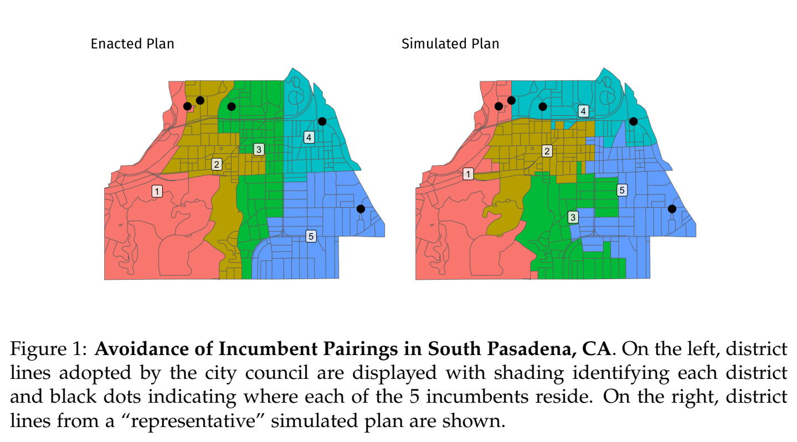

***Figure 1.*** Avoidance of Incumbent Pairings in South Pasadena, CA. On the left, district lines adopted by the city council are displayed with shading identifying each district and black dots indicating where each of the 5 incumbents reside. On the right, district lines from a “representative” simulated plan are shown.

to their own district, two incumbents are paired in District 1, two incumbents are paired in District 4, and no incumbents are assigned to Districts 2 or 3. Thus, in this plan, Proportion Alone is 0.2 and only for the incumbent in District 5 does Alone take a c c,i

value of 1. For all other incumbents, Alone equals 0. This plan is a “representative” c,i

draw from the distribution of alternative plans for South Pasadena in the sense that across the city’s 5,000 simulated plans, the median Proportion Alone value is 0.2— meaning only one of the five incumbents is alone in their district.

Explaining Incumbent Protection After estimating the overall prevalence of incumbent protection in our sample of cities, we want to draw some general conclusions about the characteristics that predict which cities are likely to engage in protection and the lengths they go to do so. Thus, we estimate models of the form shown below, using cities as units of analysis:

Y = β + β Pre-Switch Electoral Competition

c 0 1 c

+β Pre-Switch Turnout Rate + X γ + ε

2 c c c

Here, Y represents either the proportion of city c’s incumbents who are placed alone in their district under the enacted map (Proportion Alone ) or the percentile rank of the enacted map’s Proportion Alone relative to the distribution generated by the simulated plans (Percentile(Proportion Alone) ). The former captures the extent of incumbent protection embodied in the map adopted by a city, while the latter captures how aggressively a city pursued incumbent protection relative to the set of sampled alternatives. Because we argue that incumbent protection is most likely when incumbents have both the motive and opportunity to draw district lines to their advantage, we focus in particular on whether two pre-switch measures—electoral competitiveness and turnout rate—are associated with incumbent protection. We center and scale these measures to have mean 0, standard deviation 1 for ease of interpretability. Our vector of city-level covariates X includes logged population, logged median household income, residential segregation, income inequality, proportion of the incumbent council that is white, and a binary indicator for whether these elections were held off-cycle.

Measuring the Consequences of Incumbent Protection Next, we assess whether incumbents who are alone in their district are indeed more likely to remain in office than those who are paired with other incumbents. We also estimate the effects of avoiding incumbent pairings on the diversity and openness of councils to new candidates.

Our first model is estimated on a dataset with incumbents within cities as the units of analysis:

Y = β + β Alone + β Simulated Alone Probability + X γ + Z ζ + ε (2) c,i 0 1 c,i 2 c,i c c,i c,i

Here, Y represents two binary quantities of interest: whether incumbent i in city c,i

c kept their seat on council post-districting, and whether they ran for reelection at the next available opportunity. The key independent variable of interest is whether the incumbent is alone in their district, Alone , and we include as a control the proc,i

portion of city c’s simulated plans in which incumbent i is placed alone in a district (Simulated Alone Probability ). This allows us to interpret the coefficient as the c,i 1

effect of being placed alone in a district on the incumbent’s post-districting outcomes, accounting for their baseline likelihood of being alone in a district due to structural factors; again, this strategy isolates the effect of the discretionary or political component of incumbent protection. We also include the same vector of city-level controls from the previous analysis (X ), along with a vector of incumbent-level controls (Z ). These c c,i

incumbent-level controls include indicators for whether an incumbent is white, Republican, or female, as well as their Census block group’s homeownership rate, proportion white, and logged median income.

For our final analysis, we shift the unit of analysis to the city–district level to observe how the practice of incumbent protection shapes not just an incumbent’s own fate, but broader electoral competition and council composition after the districting reform. We have three outcomes of interest: the number of total new candidates vying for a district seat (not including the incumbents); number of total Latino candidates vying for a seat; and whether a Latino candidate is elected. We estimate the model:

Y = β + β One Incumbent + β Two or More Incumbents +

c,d 0 1 c,d 2 c,d

β Prop. of CVAP, Hispanic + β Prop. of CVAP, White + Z ζ + ε

3 c,d 4 c,d c c,d

where One Incumbent and Two or More Incumbents are binary indicators for c,d c,d

whether district d in city c has a lone incumbent and two or more incumbents, respectively; the omitted category is districts with zero incumbents. We include two districtlevel controls—the proportion of CVAP that is white and Hispanic—as well as the vector of city characteristics Z that we have been using throughout.

A Note on Measurement Error Given the manageable number of incumbents in our sample, it was feasible for our research team to manually check every residential location

and to validate it across a variety of sources, including media accounts, online records, California voter files, and CEDA data. For all incumbents who ran again post-districting (43% of our sample), we use the district shapefiles to check whether their geolocations indeed fall within the districts in which they subsequently ran according to CEDA. While this exercise uncovered a handful of inconsistencies, which we corrected, it revealed that our process yields accurate addresses in the vast majority of cases, which also gives us a high degree of confidence in our data for the 57% of incumbents who did not run again. Anecdotally, we know that incumbents may have multiple addresses, including ones they may keep exclusively for the purposes of running in a particular district. Our approach accounts for this strategy: since we ensure that the addresses we record for incumbents who run again line up with the districts in which they actually ran, we are likely to record this second address in those cases, and the incumbent is likely to be coded as residing in those districts.

## Results

### Incumbent Protection Is Clearly Detectable and Pervasive

Our first result is that cities overwhelmingly and incontrovertibly protected incumbents by assigning them to their own districts. Comparing the proportion of a city’s at-large incumbents who ended up in their own districts in the enacted plan, Proportion Alone , to the city’s simulation distribution of the same metric, we find that more than half of cities (52.9%) achieved the maximum degree of incumbent protection among our race-neutral simulated plans. In other words, for each of these 46 out of 87 cities, not one of the 5,000 simulated plans could place more incumbents alone in a district than the enacted plan. For an additional 4 cities (4.6%), the enacted plan fell in the 99th percentile of the simulation distribution, meaning that the observed degree of incumbent protection was only exceeded by a small number of outlying simulated plans. Given that cities were not

usually working with the kind of sophisticated software that would help them find these outlying possibilities, it is reasonable to assume that these 4 cities were also maximizing incumbent protection under technical constraints.

Figure 2 shows a histogram of the percentiles in cities’ simulation distributions of Proportion Alone in which the enacted plans fell, with a red dashed line at the median (100th percentile) and a blue dotted line at the mean (89th percentile). As we show in

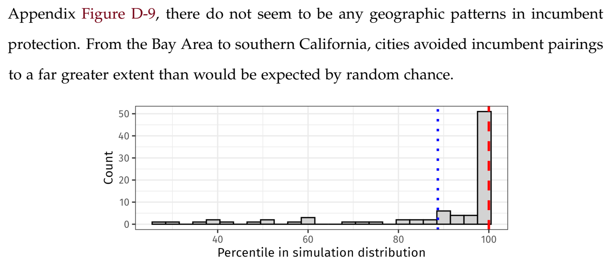

***Appendix Figure D-9.*** , there do not seem to be any geographic patterns in incumbent protection. From the Bay Area to southern California, cities avoided incumbent pairings to a far greater extent than would be expected by random chance.

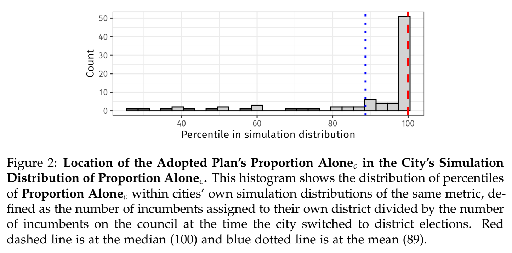

***Figure 2.*** Location of the Adopted Plan’s Proportion Alone in the City’s Simulation c Distribution of Proportion Alone . This histogram shows the distribution of percentiles c of Proportion Alone within cities’ own simulation distributions of the same metric, de- c fined as the number of incumbents assigned to their own district divided by the number of incumbents on the council at the time the city switched to district elections. Red dashed line is at the median (100) and blue dotted line is at the mean (89).

Figure 3 displays the simulation distributions of Proportion Alone in greater detail. Thin black lines indicate the entire range while thick black lines indicate the interquartile range. Black points represent the median in the simulation distribution while red diamonds indicate the percentile of the simulation distribution in which the enacted plan’s Proportion Alone value lands; this percentile is also written at right. It is evident that most cities are not highly constrained by geography when drawing maps to protect incumbents. For 53 of the 87 cities (61%), the simulation distributions span the entire possible range of Proportion Alone from 0 to 1.

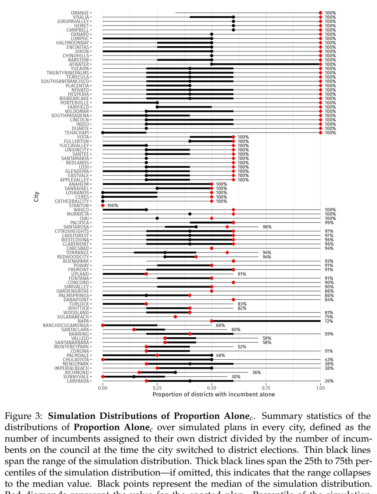

***Figure 3.*** Simulation Distributions of Proportion Alone . Summary statistics of the c distributions of Proportion Alone over simulated plans in every city, defined as the c number of incumbents assigned to their own district divided by the number of incum- bents on the council at the time the city switched to district elections. Thin black lines span the range of the simulation distribution. Thick black lines span the 25th to 75th per- centiles of the simulation distribution—if omitted, this indicates that the range collapses to the median value. Black points represent the median of the simulation distribution.

Red diamonds represent the value for the enacted plan. Percentile of the simulation distribution in which the enacted plan falls is shown on the right.

It is no wonder, then, that incumbent protection could be easily achieved while remaining in compliance with not only federally mandated standards such as contiguity and compactness, but the CVRA’s target of maximizing the number of districts in which the minority voting bloc is sufficiently large to elect its candidate of choice. In fact, in Appendix C.2, we show that there is no statistically significant association between incumbent protection and other quantities of interest relevant to mapmaking, such as compactness. Further, in Appendix Figure D-10, we show there is no systematic tradeoff between protecting incumbents and creating majority-minority districts: most cities that maximized one metric within their own simulation distributions were simultaneously able to perform very highly on the other. This flexibility is due in large part to the fact that cities were drawing district maps for the first time, with no status quo constraining their choices. It also explains how such a widespread practice could fly under the radar in this relatively high-salience, externally monitored setting: it did not interfere— at least on paper—with the reform’s stated goals. However, as our final analysis shows, incumbent protection did, ultimately, act against the aims of the reform in practice: it deterred candidate entry and minority officeholding in precisely the districts that were meant to gain a seat at the table.

### When Are Incumbents Protected?

We now turn to the question of which cities are most likely to engage in incumbent protection. Table 1 presents estimates from Equation 1. Focusing first on the proportion of incumbents placed alone in their districts in Column 1, whiter cities with historically lower voter turnout adopted maps that were more protective of incumbents. As shown in Column 2, certain types of cities are likelier than others to adopt maps that placed incumbents alone in their districts to a greater extent than would be expected based on the distribution of plans generated by our simulations: smaller, whiter cities with

Table 1: Predictors of Incumbency Protection, City-level Prop. Alone Percentile(Prop. Alone) Pre-Switch Electoral Competition 0.045+ 0.087* Pre-Switch Turnout Rate -0.082* -0.207*** log(Population) -0.041 -0.164** log(Median Household Income) -0.003 0.197 Residential Segregation -0.502+ -0.639 Gini coefficient -0.169 0.430 Prop. of CVAP, White 0.352* 0.565* Off-cycle city council elections -0.111 -0.288* (Intercept) 1.342 0.072 N 87 87 R2 0.203 0.281

+ p < 0.1, * p < 0.05, ** p < 0.01, *** p < 0.001

Note: Pre-Switch Electoral Competition and Pre-Switch Turnout Rate are

centered and scaled to have mean 0, standard deviation 1 for ease of

interpretability.

historically lower voter turnout, yet more competitive elections.

We interpret these findings as evidence of motive and opportunity. Less populous municipalities with smaller and less mobilized minority populations were less likely to face homegrown demands for institutional change and more likely to have the reform externally imposed on them by demand letters from lawyers operating statewide campaigns.23 For them, there was a particularly strong motivation to retain incumbents, who viewed themselves as the internally supported and democratically legitimate candidates. 23For instance, the city of Big Bear Lake was spurred to reform by a demand letter from Kevin Shenkman, a lawyer who has become widely known for threatening cities with litigation to get them to switch to district elections. As reported by the San Francisco

This motivation was strengthened by electoral competition: a one-standard deviation increase in the average number of effective candidates per seat is associated with the adopted map ranking 8.7 percentile points higher in the city’s simulation distribution of the proportion of incumbents alone in their districts. When incumbent candidates expect to face more serious challengers, they have a more pressing interest in securing institutionalized advantages to a greater extent. While competitiveness furnishes motive, low voter turnout presents opportunity. A one standard-deviation increase in turnout is associated with a 20.7 percentile point decrease in where the adopted map falls within a city’s simulation distribution, indicating that higher-turnout cities adopt maps that are less extreme relative to their sampled alternatives. Thus, when voters are paying attention, incumbent city council members do not appear as willing or able to press the electoral advantage that can be gained through the districting process.

### Incumbent Protection Deters Candidate Entry and Erodes Diversity on

### Councils

We have shown that cities consistently designed districting plans to safeguard incumbents, and that doing so was neither technically challenging nor at odds with creating minority-opportunity districts. Nevertheless, creating space to accommodate incumbents had clear downstream electoral consequences: it deterred competition, crowded Chronicle, “The city of Big Bear Lake folded too—angrily. Shenkman sent a demand letter to the tiny ski town of 3,000 voters in 2017. On one page, he switched mid-paragraph to an allegation about ‘the Victorville City Council,’ a different entity that had received a letter from him two weeks earlier. ’Your letter... appears to be taken from a much overused template,’ Big Bear Lake replied. The city enclosed a $30,000 check but noted it was ‘making this payment under protest.’”

out political newcomers, and interfered with Latinos’ ability to win seats, even in Latinoopportunity districts.

We report results from estimating Equation 2 in Table 2: the effect of being drawn into one’s own district on an incumbent’s subsequent electoral fortunes. In Column 1, we see that being alone is associated with a 30.7 percentage point increase in the probability of retaining office in the first post-districting election, compared to being paired with at least one other incumbent. The effect on running again is barely higher, at 33.2 percentage points as shown in Column 2, suggesting that the vast majority of protected incumbents who run again post-districting win their seat. For context, 43% of incumbents in our sample run for reelection following the switch to district elections, matching the average rate of 43% found over 4,000 municipalities nationwide (Trounstine 2013).

Of course, this relationship is endogenous: incumbents who intend to stay in office are motivated to influence the plan to protect their seat, while those who intend to retire may willingly pair up with another incumbent; moreover, politically savvy incumbents are better able to both influence the plan and, independently, to win elections. Furthermore, pairing incumbents definitionally implies that at least one of them will not retain office, so the effects reported in the “Kept Seat” column are particularly unsurprising. For these reasons, we do not interpret Table 2 as estimating a causal effect of incumbent protection on incumbents’ electoral fortunes. Rather, we interpret the strong association between protection and reelection as a sanity check that our conceptualization and measurement of incumbent protection is working as expected: incumbents who are alone in districts are likely to seek reelection, and to benefit from this institutionalized advantage. Our central inferential claims concern the costs that incumbent protection imposes on the electoral success of newcomers and, ultimately, council diversity, and they are presented in Table 3 and Table 4. In Table 3, we estimate Equation 3 for the total number of new candidates (Column 1), the total number of (new and incumbent) Latino candidates

Table 2: Effect of Districting on Incumbents’ Reelection Prospects Kept Seat Ran for Reelection Incumbent: Alone in Adopted Map 0.307*** 0.332***

Incumbent: Sim. Alone Probability -0.080 -0.036

(Intercept) -0.478 -1.111 N 325 325 R2 0.153 0.170

Controls Yes Yes

+ p < 0.1, * p < 0.05, ** p < 0.01, *** p < 0.001

See Appendix Table D-10 for full results.

(Column 2), and a binary indicator for whether any Latino is elected to council (Column 3). Compared to districts without incumbents, those with one incumbent have, on average, approximately one fewer new candidate per seat. They also attract 0.32 fewer total Latino candidates and are 9.6 percentage points less likely to elect a Latino candidate to the city council. Districts with two or more incumbents exhibit similar, albeit noisier, effects, likely due to the relatively small number of such districts in the sample.

How counterproductive is this to the CVRA’s aim of increasing Latino representation? One might imagine a scenario in which incumbents are elected to represent the whiter and wealthier districts in which they tend to live, while newly drawn Latino-opportunity districts—which are less likely to host incumbents in the first place—provide space for new candidates. This would, in theory, allow the system to balance the preservation of experienced officeholders with the creation of opportunities for greater descriptive representation. Unfortunately, the data do not support this view. In Table 4, we reestimate Equation 3 on a restricted sample of Latino-opportunity districts, defined as those with at least 30% Latino CVAP. In these districts, the negative effects of incumbent protection are especially pronounced. Districts with one incumbent in them are 17.1 percentage points less likely than districts with no incumbents to successfully elect a Latino candidate, controlling for the ethnic composition of the district and our full set

Table 3: Effect of Incumbent Protection on Post-Districting Election Outcomes Total Total Any New Cands. Latino Cands. Latino Elected

### 1 Incumbent -0.936*** -0.318** -0.096*

2+ Incumbents -0.895*** -0.325* -0.062 District: Prop. of CVAP, Hispanic 2.377+ 2.279** 1.195*** District: Prop. of CVAP, White 2.860** 0.730 0.246 District: Prop. of voters, Democrats 0.166 -0.237 0.180 District: log(Median household income) 0.038 0.140 0.107 City: Homeownership Rate -0.441 -0.303 -0.324 City: log(Population) 0.337** 0.113 -0.038 City: log(Median Household Income) 0.003 -0.033 0.077 City: Residential Segregation -0.709 -0.287 -0.078 City: Gini coefficient -0.094 -0.281 0.365 City: Prop. White of Last At-large Council 0.442 -0.253 -0.089 City: Prop. of CVAP, Hispanic -1.797 0.783 0.152 City: Prop. of CVAP, White -3.029* -0.048 0.291 City: Pre-Switch Electoral Competition 0.166* 0.095* 0.028 City: Pre-Switch Turnout Rate 0.065 0.064 -0.052 City: Off-cycle city council elections 0.253 0.376* -0.003 (Intercept) -1.654 -2.041 -1.759+ N 359 359 359 R2 0.212 0.312 0.262 + p < 0.1, * p < 0.05, ** p < 0.01, *** p < 0.001

Note: Pre-Switch Electoral Competition and Pre-Switch Turnout Rate are centered and scaled to have mean 0, standard deviation 1 for ease of interpretability.

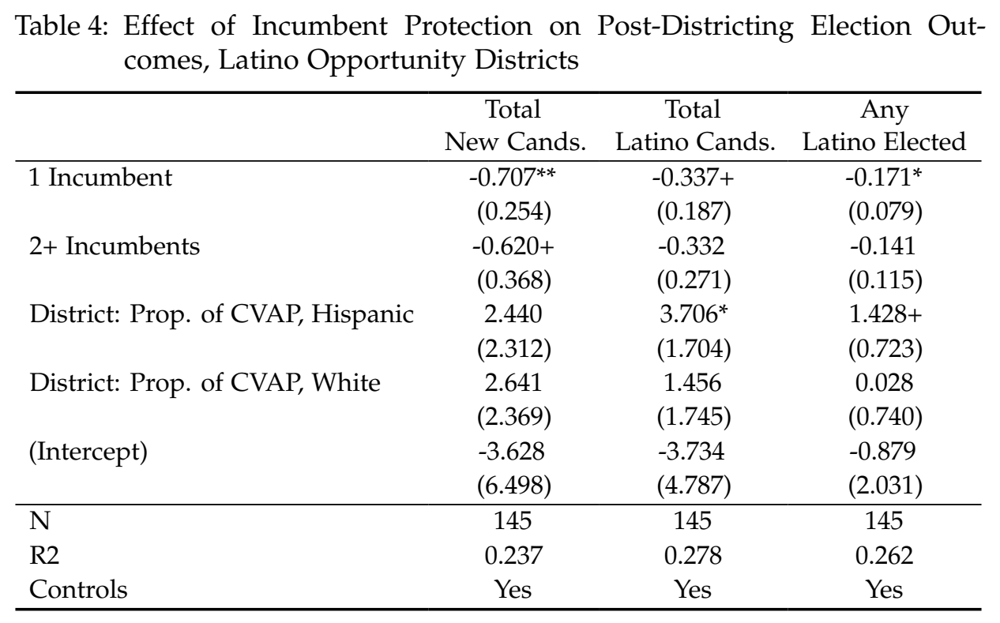

***Table 4.*** Effect of Incumbent Protection on Post-Districting Election Out- comes, Latino Opportunity Districts Total Total Any New Cands. Latino Cands. Latino Elected 1 Incumbent -0.707** -0.337+ -0.171* (0.254) (0.187) (0.079) 2+ Incumbents -0.620+ -0.332 -0.141 (0.368) (0.271) (0.115) District: Prop. of CVAP, Hispanic 2.440 3.706* 1.428+

[Download data as CSV](tables/tab-01.csv)

District: Prop. of CVAP, White 2.641 1.456 0.028 (Intercept) -3.628 -3.734 -0.879 N 145 145 145 R2 0.237 0.278 0.262 Controls Yes Yes Yes + p < 0.1, * p < 0.05, ** p < 0.01, *** p < 0.001

See Appendix Table D-11 for full results.

of city-level covariates (Column 3); they also see a nearly 0.71 decrease in number of new candidates running for a seat (Column 1) and a 0.34-unit decrease in total Latino candidates (Column 2).

## Discussion

Leveraging the CVRA, we have shown how those in power can stymie reform and protect the status quo. When switching to district elections, most city councils in our sample chose maps which would avoid incumbent pairings, maximizing the number of councilors with their own district. Incumbent protection was especially prominent in cities with more competitive elections (motive), yet lower voter turnout (opportunity). This strategy undermined the goal of expanding representation by securing favorable reelection odds for incumbents and deterring challengers. We find that having a lone incumbent in a district discouraged candidate entry and depressed Latino electoral success, even in the opportunity districts specifically drawn to advance Latino representation.

These electoral consequences add nuance to how incumbent protection should be evaluated against competing objectives. In the eyes of the law, drawing maps to separate incumbents may be a legitimate interest so long as it is applied consistently and does not take precedence over other statutory or constitutional mandates. Analyzing a large sample of newly drawn plans, we find that these requirements can easily be met: cities were able to draw maps maximizing both incumbent protection and the creation of majorityminority districts. When taking real-world electoral consequences into account, however, we show that a map that silos a current council member into a Latino opportunity district is a map that protects incumbents at the expense of minority representation.

The ability of incumbents to influence map-making may help explain the conditional success of district-based reforms. Past research emphasizes the structural preconditions for districts to advance representation; our novel analysis of the map-making process highlights the additional importance of internal mobilization. For example, community organizations may be key in elevating the stakes of the moment and driving residents to participate in the districting process. While some cities saw organized groups flood council meetings in the pursuit of representation, others were quiet. Across five public hearings, only four Big Bear Lake residents appeared and commented on the drawing of district maps. In turn, it is not surprising that the council passed a map in the 100th percentile of Proportion Alone . While we find that low turnout elections increase the likelihood of incumbent protection, future research should closely examine the role of community groups and coalitions in the districting process.

Our analysis adds incumbent protection and its electoral consequences to the already substantial list of challenges of using district elections to improve racial representation. Even if the process were managed by a citizen-led, independent districting commission, the reform requires both a large minority population and one that is sufficiently segregated (Abott and Magazinnik 2020)—presenting barriers for collective goods provision and inter-group cooperation. Even when single member districts are successful at chang-

ing the composition of the council, they tend to foster local deference, threatening the provision of essential amenities and services with locally concentrated costs such as multifamily housing (Hankinson and Magazinnik 2023). Given these challenges, researchers and reformers should explore proportional representation as a promising alternative that neither relies on the maintenance of residential segregation nor affords incumbents the same degree of control over outcomes.

More broadly, our findings illustrate a recurring problem in institutional reform: when reforms are implemented by the very actors whose power they seek to constrain, those actors often retain substantial discretion to blunt the intended effects. While the context of the CVRA and our algorithmic districting methodology jointly provide unique empirical leverage on this dynamic, its logic extends well beyond the realm of electoral map-making. Similar patterns are likely to arise wherever implementation authority lies in the hands of incumbents—whether in the design of electoral rules, the enforcement of ethics regulations, or the administration of top-down mandates that give local agents significant discretion. In such settings, formal compliance can coexist with informal strategies to undermine the spirit of the reform.

The nature of reform is to disrupt the status quo. Yet placing control over any reform in the hands of incumbents is likely to limit its effectiveness, ultimately eroding democratic legitimacy. When voters observe the ongoing lack of minority representation on councils or simply see councilors openly prioritize protecting each other’s seats, the result is a loss of public trust. Avoiding this fate, and ensuring that electoral reform succeeds in producing broadly representative and accountable government, requires not only new rules, but active public participation, interest group engagement, and alternative models that better insulate outcomes from incumbents’ influence.

## References

Abott, Carolyn, and Asya Magazinnik. 2020. “At-Large Elections and Minority Representation in Local Government.” American Journal of Political Science 64 (3): 717–733. Ansolabehere, Stephen, Jacob R. Brown, Ryan D. Enos, Ben Shair, Tyler Simko, and David Sutton. 2025. “City-Defined Neighborhood Boundaries in the United States.” Scientific Data 12, no. 1 (June 19, 2025): 1031.

Anzia, Sarah F. 2014. Timing and Turnout: How Off-Cycle Elections Favor Organized Groups. Chicago, IL: University of Chicago Press.

Anzia, Sarah F., and Jessica Trounstine. 2025. “Civil Service Adoption in America: The Political Influence of City Employees.” American Political Science Review 119 (2): 549– 565.

Arceneaux, Kevin. 2005. “Does federalism weaken democratic representation in the United States?” Publius: The Journal of Federalism 35 (2): 297–311.

Arnold, R Douglas, and Nicholas Carnes. 2012. “Holding mayors accountable: New York’s executives from Koch to Bloomberg.” American Journal of Political Science 56 (4): 949–963.

Ashton, H. Benjamin, Michael H. Crespin, and Seth C. McKee. 2022. “Dueling Incumbent House Elections, 1843-2018.” American Politics Research 50 (6): 735–742.

Benedictis-Kessner, Justin de. 2018. “How attribution inhibits accountability: evidence from train delays.” The Journal of Politics 80 (4): 1417–1422.

Berry, Christopher R, and William G Howell. 2007. “Accountability and local elections: Rethinking retrospective voting.” The Journal of Politics 69 (3): 844–858.

Bratton, Kathleen A, and Kerry L Haynie. 1999. “Agenda setting and legislative success in state legislatures: The effects of gender and race.” The Journal of Politics 61 (3): 658–679.

Bridges, Amy. 1999. Morning Glories: Municipal Reform in the Southwest. Princeton, NJ: Princeton University Press.

Burnett, Craig M, and Vladimir Kogan. 2017. “The politics of potholes: Service quality and retrospective voting in local elections.” The Journal of Politics 79 (1): 302–314.

Butler, Daniel M, and David E Broockman. 2011. “Do politicians racially discriminate against constituents? A field experiment on state legislators.” American Journal of Political Science 55 (3): 463–477.

Carson, Jamie L., Michael H. Crespin, and Ryan D. Williamson. 2014. “Reevaluating the Effects of Redistricting on Electoral Competition, 1972–2012.” State Politics & Policy Quarterly 14 (2): 165–177.

Collingwood, Loren, and Sean Long. 2021. “Can States Promote Minority Representation? Assessing the Effects of the California Voting Rights Act.” Urban Affairs Review 57 (3): 731–762.

Colner, Jonathan. 2024. “Running Toward Rankings: Ranked Choice Voting’s Impact on Candidate Entry and Descriptive Representation.” American Journal of Political Science.

Cottrell, David. 2024. “Incumbent Pairings in the 2021 Redistricting Cycle.” Presented at the Midwest Political Science Association Annual Conference. Chicago, IL.

de Benedictis-Kessner, Justin, Diana Da In Lee, Yamil R. Velez, and Christopher Warshaw. 2023. “American Local Government Elections Database.” Scientific Data 10 (1): 912.

Doe, Catherine. 2015. “Visalia City Council Chooses Voting District Map.” Valley Voice (May).

Forgette, Richard, Andrew Garner, and John Winkle. 2009. “Do Redistricting Principles and Practices Affect U.S. State Legislative Electoral Competition?” State Politics & Policy Quarterly 9 (2): 151–175.

Gaddie, Ronald Keith, and Charles S Bullock III. 2007. “From Ashcroft to Larios: Recent Redistricting Lessons from Georgia.” Fordham Urban Law Journal 34:997–1048.

Galanter, Ruth. 2013. “Reform? Term Limits Have Produced an Inbred City Council.” The Planning Report, https://www.planningreport.com/2013/07/23/reform-termlimits-have-produced-inbred-city-council?.

Garrison, Ellen. 2016. “Woodland’s Last Two Mayors Face Off As City Moves to New Election Format.” Sacramento Bee, https://www.sacbee.com/news/politics-govern ment/election/local-election/article98496892.html.

Glazer, Amihai, Bernard Grofman, and Marc Robbins. 1987. “Partisan and Incumbency Effects of 1970s Congressional Redistricting.” American Journal of Political Science 31 (3): 680–707.

Grumbach, Jacob M. 2022. Laboratories against Democracy: How National Parties Transformed State Politics. Princeton, NJ: Princeton University Press.

Hajnal, Zoltan, and Jessica Trounstine. 2005. “Where Turnout Matters: The Consequences of Uneven Turnout in City Politics.” The Journal of Politics 67 (2): 515–535.

Hajnal, Zoltan L. 2009. America’s Uneven Democracy: Race, Turnout, and Representation in City Politics. Cambridge: Cambridge University Press.

Hankinson, Michael, and Asya Magazinnik. 2023. “The Supply–Equity Trade-Off: The Effect of Spatial Representation on the Local Housing Supply.” The Journal of Politics 85 (3): 1033–1047.

Heidorn, Nicolas. 2023. The Promise of Fair Maps: California’s 2020 Local Redistricting Cycle: Lessons Learned and Future Reforms. Technical report.

Henderson, John A., Brian T. Hamel, and Aaron M. Goldzimer. 2018. “Gerrymandering Incumbency: Does Nonpartisan Redistricting Increase Electoral Competition?” The Journal of Politics 80 (3): 1011–1016.

Hetherington, Marc J., Bruce Larson, and Suzanne Globetti. 2003. “The Redistricting Cycle and Strategic Candidate Decisions in U.S. House Races.” The Journal of Politics 65 (4): 1221–1234.

Hicks, William D., Seth C. McKee, Mitchell D. Sellers, and Daniel A. Smith. 2015. “A Principle or a Strategy? Voter Identification Laws and Partisan Competition in the American States.” Political Research Quarterly 68 (1): 18–33.

Hood, M. V., III, and Seth C. McKee. 2013. “Unwelcome Constituents: Redistricting and Countervailing Partisan Tides.” State Politics & Policy Quarterly 13 (2): 203–224.

Hopkins, Daniel J, and Lindsay M Pettingill. 2018. “Retrospective voting in big-city US mayoral elections.” Political Science Research and Methods 6 (4): 697–714.

Kalfsbeek, Elizabeth. 2018. “Discontent lingers among Woodland City Council regarding map approved for district voting.” Daily Democrat, https://sbcsentinel.com/2018/ 05/29- palms- yucca- valley- use- voting- suit- threatto- draw- incumbent- friendlywards/.

Kenny, Christopher T., Cory McCartan, Ben Fifield, and Kosuke Imai. 2021. redist: Simulation Methods for Legislative Redistricting. Available at The Comprehensive R Archive Network (CRAN). https://CRAN.R-project.org/package=redist.

Khanna, Kabir, Kosuke Imai, Santiago Olivella, and Evan T. Rosenman. 2024. wru: Who Are You? Bayesian Prediction of Racial Category Using Surname and Geolocation. Available at The Comprehensive R Archive Network (CRAN) and GitHub. https://cran.rproject.org/web/packages/wru/index.html.

Komisarchik, Mayya. 2026. “Democrats Versus Democracy: The Southern Response to the Voting Rights Act.” The Journal of Politics 88 (1): 162–176.

Laakso, Markku, and Rein Taagepera. 1979. “Effective Number of Parties: A Measure with Application to West Europe.” Comparative Political Studies 12 (1): 3–27.

Lyons, Michael, and Peter F Galderisi. 1995. “Incumbency, Reapportionment, and U.S. House Redistricting.” Political Research Quarterly 48, no. 4 (December): 857–871.

Makse, Todd. 2012. “Strategic Constituency Manipulation in State Legislative Redistricting.” Legislative Studies Quarterly 37 (2): 225–250.

Mansbridge, Jane. 1999. “Should blacks represent blacks and women represent women? A contingent "yes".” The Journal of Politics 61 (3): 628–657.

Mason, Melanie. 2024. “Why scandal-plagued Los Angeles is resisting ethics reforms.” Politico, https://www.politico.com/news/2024/05/15/why-scandal-plagued-losangeles-is-resisting-ethics-reforms-00158067.

McCartan, Cory, and Kosuke Imai. 2023. “Sequential Monte Carlo for sampling balanced and compact redistricting plans.” Annals of Applied Statistics 17 (4): 3300–3323.

Payson, Julia A. 2017. “When are local incumbents held accountable for government performance? Evidence from US school districts.” Legislative Studies Quarterly 42 (3): 421–448.

Sahn, Alexander. 2023. “Reform Reconsidered: The Effects of Form of Government.” Journal of Historical Political Economy 3 (3): 337–362.

Sances, Michael W. 2018. “Ideology and vote choice in US mayoral elections: Evidence from Facebook surveys.” Political Behavior 40 (3): 737–762.

Sass, Tim R., and Stephen L. Mehay. 1995. “The Voting Rights Act, District Elections, and the Success of Black Candidates in Municipal Elections.” The Journal of Law and Economics 38 (2): 367–392.

Tam Cho, Wendy K., and Bruce E. Cain. 2024. “Deploying Trustworthy AI in the Courtroom: Lessons from Examining Algorithm Bias in Redistricting AI.” University of Chicago Legal Forum 2023 (4). https://chicagounbound.uchicago.edu/uclf/vol2023/ iss1/4.

Tausanovitch, Chris, and Christopher Warshaw. 2014. “Representation in Municipal Government.” American Political Science Review 108 (3): 605–641.

Trebbi, Francesco, Philippe Aghion, and Alberto Alesina. 2008. “Electoral Rules and Minority Representation in U.S. Cities.” Quarterly Journal of Economics 123 (1): 325–357. Trounstine, Jessica. 2008. Political Monopolies in American Cities: The Rise and Fall of Bosses and Reformers. Chicago, IL: University of Chicago Press.

. 2011. “Evidence of a Local Incumbency Advantage.” Legislative Studies Quarterly 36 (2): 255–280.

. 2013. “Turnout and Incumbency in Local Elections.” Urban Affairs Review 49 (2): 167–189.

Z107.7 News Staff. 2018. “Yucca Valley town council gets an earful over proposed election districts.” Z107.7 News, https://z1077fm.com/yucca-valley-town-council-gets-anearful-over-proposed-election-districts/.

## Online Appendix for “Reform Drift: How Incumbent Pro-

## tection Undermines Descriptive Representation in Local Gov-

## ernment”

## Contents

A Data Construction . . . . . . . . . . . . . . . . . . . . . . . . . . . . . . . . . . A-2 A.1 Shapefile Construction . . . . . . . . . . . . . . . . . . . . . . . . . . . A-2 A.2 Incumbent Identification . . . . . . . . . . . . . . . . . . . . . . . . . A-4 A.3 Data Summary . . . . . . . . . . . . . . . . . . . . . . . . . . . . . . . A-5 A.4 City-Level Variables . . . . . . . . . . . . . . . . . . . . . . . . . . . . A-12 A.5 Validating the Use of BISG . . . . . . . . . . . . . . . . . . . . . . . . A-13 B District Simulations . . . . . . . . . . . . . . . . . . . . . . . . . . . . . . . . . A-14 B.1 Redistricting Algorithm . . . . . . . . . . . . . . . . . . . . . . . . . . A-14 B.2 Plan Measurements . . . . . . . . . . . . . . . . . . . . . . . . . . . . A-14 B.3 Parameter Selection . . . . . . . . . . . . . . . . . . . . . . . . . . . . A-15 B.4 Dealing with Neighborhoods and Communities of Interest . . . . . A-17 C Supplemental Analyses . . . . . . . . . . . . . . . . . . . . . . . . . . . . . . A-20 C.1 Long-term Effects of Incumbent Protection . . . . . . . . . . . . . . . A-20 C.2 Effects of Incumbent Protection Other Outcomes . . . . . . . . . . . A-22 D Additional Tables and Figures . . . . . . . . . . . . . . . . . . . . . . . . . . . A-25

### A Data Construction

A.1 Shapefile Construction

Here, we outline the data construction process by which we prepared city shapefiles for districting simulation. As a baseline, we began with the 2017 TIGER/Line Shapefile for the state of California at the Census block level.1 We used Census blocks because this seems to be the unit that most cities used for district assignment. Then, we associated each block with a set of demographic, economic, and political variables, described in detail below. Finally, we intersected each of the 87 city council district shapefiles in our possession with this statewide block-level shapefile. This generated 87 block-level shapefiles—one for each city—mapping Census blocks (with covariates) to city council districts. Throughout our analyses, if block group- or district-level measures for any of the following variables are included, they are produced by aggregating block-level values to the corresponding level of geographic abstraction.

Variables:

1. Housing Data. We collected the following variables from the 2010 Decennial Census: 1. CB Variable ID H003002, the total number of housing units in which a person or group of persons is living at the time of the interview, or if the occupants are only temporarily absent, as for example, on vacation;

2. CB Variable ID H014002, the total number of housing units where the owner or co-owner lives in the unit, even if it is mortgaged or not fully paid for.

We computed the homeownership rate as the number of occupied households that are owned (H014002) divided by the total number of occupied housing units (H003002).

### 2. Voting-Age Population. We collected block-level total population from the 2010 De-

cennial Census (CB Variable ID P001001). In addition, we collected the following variables related to citizen voting-age population (CVAP) from the Redistricting Database for the State of California (“Statewide Database”)2:

### 1. Total citizen voting-age population

### 2. Black or African American (alone) citizen voting-age population

### 3. Asian (alone) citizen voting-age population

### 4. Hispanic or Latino citizen voting-age population

### 5. Not Hispanic or Latino citizen voting-age population

1Obtained from: https://www.census.gov/cgi-bin/geo/shapefiles/index.php?year= 2017&layergroup=Blocks+%282010%29.

2Accessed at: https://statewidedatabase.org/. We used CVAP estimates from Statewide Database instead of the Census Bureau because the Census has only block group-level estimates, whereas Statewide Database provides block-level estimates.

### 6. White citizen voting-age population

Because cities districted in different years, we pulled these CVAP estimates from different time periods for each city. In order to approximate as closely as possible the data cities were working with at the time that they districted, we selected 5-year estimates ending 3 years prior to the year of the first election under the newly adopted districting plan. For example, if the year of first election was 2018, we would use 2011–2015 estimates. If the year of first district election was 2012 or earlier, we used 2006–2010 estimates, as this was the closest available option.

### 3. Income. We collected block group-level median household income from the Census

American Community Survey (ACS) (CB Variable ID B19013_001). We assigned to each block the value from its block group, as that was the lowest level of aggregation for which data was available. We chose the ACS time period for each city according to the same approach outlined for voting-age population, above.

### 4. Partisanship. Here, we wish to compute two block-level variables estimated at the

time of a city’s first district election: (1) a count of Democratic voters reasonably robust to changes in turnout between elections and (2) the total number of registered voters.

To do so, we collected partisanship and registration data from the general election files from Statewide Database. For each city, we used data from the 6 general elections prior to the year of first district election. For presidential election years (2004, 2008, 2012, 2016, 2020), we collected the number of votes cast for the Democratic presidential candidate; for midterm election years (2002, 2006, 2010, 2014, 2018), we collected the number of votes cast for the Democratic gubernatorial candidate.

A challenge of working with these data is translating them across geographies: voter registration and partisanship are reported at the SR precinct level, whereas we require data at the block level. To get around this, we downloaded a crosswalk file between SR precincts and 2010 Census blocks from Statewide Database, which provides the percentage of an SR precinct that falls within a given Census block.3 To convert SR precinct-level data to block-level estimates, we joined the electoral data with the crosswalk file and computed estimates of the number of Democratic votes and registered voters each Census block contributes to the SR total. We then aggregated all block-level contributions by their Census block IDs.

Finally, to compute the block-level estimated count of Democratic voters, we calculated the sum of block-level estimates of Democratic votes cast in the past 6 general elections (both presidential and midterm), divided by the sum of block-level estimates of the number of overall votes in the past 6 general elections, multiplied by the total number of registered voters in the general election year immediately following the year of first district elections.

Shapefile Preparation:

After merging the above variables onto our baseline block-level shapefile for the state of California, we intersected this file with each of our 87 city council district shapefiles. This process produced, for each city, a block-level shapefile with both a vector of city council district assignments and the complete set of variables described above.

3See documentation here: https://statewidedatabase.org/d10/Creating%20CA% 20Official%20Redistricting%20Database.pdf.

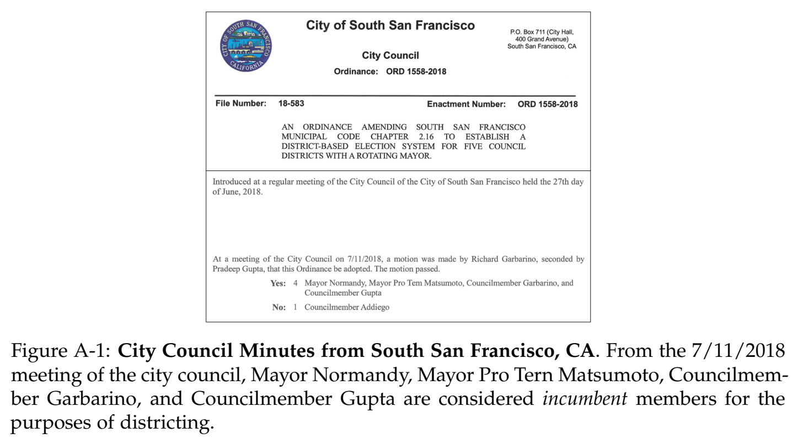

***Figure A-1.*** City Council Minutes from South San Francisco, CA. From the 7/11/2018 meeting of the city council, Mayor Normandy, Mayor Pro Tern Matsumoto, Councilmem- ber Garbarino, and Councilmember Gupta are considered incumbent members for the purposes of districting.

As a final step in preparation for districting simulation, we checked that all blocks were contiguous, as the simulation requires contiguous graphs. For disconnected blocks or components, we manually assigned nearest neighbors, determined by visual inspection.

A.2 Incumbent Identification

To identify incumbent city council members, we searched through city council minutes for each of the 87 cities included in this study. Our primary goal was to find minutes from the meeting in which the council either (1) adopted a resolution to declaring the city’s intention to switch from at-large to district elections or (2) adopted a city ordinance enacting the switch to district election and implementing the corresponding map. All council members listed in the minutes—as example of which is shown in Appendix Figure A-1 from South San Francisco—are considered to be incumbents for the purposes of this study.

Once incumbent council members are identified, we located their corresponding entries from California voter files that we obtained from L2. From L2, we requested records of all voters residing in each of the cities included in this study as of the year the city switched to district elections. This ensures that any information used from the voter file as much as possible accurately reflects incumbents at the time they were in office and the switch to district elections was implemented.

From L2, we obtain the following values:

• Address: residential address as reported by the voter in the state voter file

• Gender: in this study, coded as “M” (male) or “F” (female)

• Age

• Party: California voters report their political party preference when registering to vote; this information is available from the state voter file

• Race/ethnicity: values are modeled by L2; coded as being “White”, “Black”, “Hispanic”, “Asian”, or “Other”

To minimize the amount of missingness in our data, we use the fastLink package for R (Enamorado, Fifield, and Imai 2017) to perform a fuzzy match to a dataset of local election results compiled by de Benedictis-Kessner et al. (2023). From this data source, we collect additional values of race/ethnicity, partisanship, and gender. As de Benedictis- Kessner et al. (2023) describe, they implement a series of Random Forests to model these values.

If missing values for address, race/ethnicity, partisanship, and gender remained, we relied on a set of internet searches to fill them in. For identifying the race/ethnicity and gender of candidates, we looked for campaign website, social media sites, or news articles that contain pictures of the candidate. To fill in missing addresses, we predominately relied on whitepages.com and truepeoplesearch.com, using a combination of candidate name and city to locate the most appropriate record. Given the manageable number of incumbents in our sample, our research team to manually checked every residential location and validated it across a variety of sources, including media accounts, online records, California voter files, and CEDA data.

For all incumbents who ran again post-districting (43% of our sample), we use the district shapefiles to check whether their geolocations indeed fall within the districts in which they subsequently ran according to CEDA. While this exercise uncovered a handful of inconsistencies, which we corrected, it revealed that our process yields accurate addresses in the vast majority of cases, which also gives us a high degree of confidence in our data for incumbents who did not run again. Further, to assess the quality of the demographic modeling, we randomly sampled 100 of our 420 incumbent legislators and hand-coded their ethnicity based on their photographs as well as media coverage about how they expressed their identity. 96 of the 100 incumbents we hand-coded were accurately categorized. Of the 4 errors, there were 3 Black candidates who had been coded as white and 1 white candidate who had been coded Black. Such inaccuracy between white and Black candidates is typical in the literature. Importantly, none of the errors were found in the categorization of Latino candidates, the focus of our analysis.

With our incumbent dataset complete, we then used ArcGIS to geocode the address for each incumbent. Using a spatial join, we use the geocoded address of each candidate to determine the Census block in which the incumbent resides.

A.3 Data Summary

Cities within Study’s Sample

Table A-1: City Data Collection Status

City Year Switched Shapefile Collected Included in Sample Alhambra 2018 No No

Anaheim 2015 Yes Yes Antioch 2018 No No Apple Valley 2019 Yes Yes

Arcadia 2017 No No Arroyo Grande 2019 No No Atascadero 2022 No No Atwater 2017 Yes Yes Bakersfield 2018 No No Banning 2016 Yes Yes Barstow 2018 Yes Yes Bellflower 2016 No No Big Bear Lake 2017 Yes Yes Brentwood 2019 No No Buellton 2018 No No Buena Park 2016 Yes Yes Camarillo 2019 Yes No Campbell 2019 Yes Yes Carlsbad 2017 Yes Yes Carpinteria 2017 No No Carson 2020 No No Cathedral City 2017 Yes Yes Ceres 2015 Yes Yes Chino 2016 No No Chino Hills 2016 Yes Yes Chula Vista 2012 Yes Yes Citrus Heights 2019 Yes Yes Claremont 2018 Yes Yes Coalinga 2018 No No Compton 2012 Yes No Concord 2018 Yes Yes Corona 2016 Yes Yes Costa Mesa 2016 No No Dana Point 2018 Yes Yes Davis 2019 No No Desert Hot Springs 2021 No No Diamond Bar 2022 No No Dixon 2016 Yes Yes Duarte 2017 Yes Yes Dublin 2022 No No Eastvale 2016 Yes Yes El Cajon 2016 No No El Monte 2022 No No Elk Grove 2019 Yes No Encinitas 2017 Yes Yes

Escondido 2013 Yes No Eureka 2016 No No Exeter 2017 Yes No Fairfield 2019 Yes Yes Fontana 2017 Yes Yes Fremont 2017 Yes Yes Fullerton 2016 Yes Yes Garden Grove 2016 Yes Yes Glendale 2018 No No Glendora 2017 Yes Yes Goleta 2017 No No Half Moon Bay 2018 Yes Yes Hemet 2016 Yes Yes Hesperia 2017 Yes Yes Highland 2016 No No Imperial Beach 2018 Yes Yes Indio 2017 Yes Yes Jurupa Valley 2017 Yes Yes King City 2016 Yes No Kingsburg 2018 Yes No La Mirada 2016 Yes Yes La Palma 2022 No No Lake Elsinore 2018 No No Lake Forest 2017 Yes Yes Lakewood 2021 No No Lemoore 2018 Yes No Lincoln 2020 Yes Yes Livermore 2018 No No Lodi 2017 Yes Yes Lompoc 2017 Yes Yes Los Alamitos 2018 No No Los Banos 2014 Yes Yes Madera 2010 Yes No Malibu 2020 No No Manteca 2021 No No Marina 2019 Yes No Martinez 2017 No No Menlo Park 2017 Yes Yes Merced 2015 No No Millbrae 2022 No No Mission Viejo 2022 No No

Modesto 2008 Yes No Monterey Park 2019 Yes Yes Moorpark 2018 No No Morgan Hill 2017 Yes No Murrieta 2017 Yes Yes Napa 2020 Yes Yes National City 2021 No No Novato 2019 Yes Yes Oceanside 2017 No No Ojai 2018 Yes Yes Ontario 2020 No No Orange 2018 Yes Yes Oroville 2019 No No Oxnard 2018 Yes Yes Pacifica 2018 Yes Yes Palm Desert 2019 No No Palm Springs 2018 Yes Yes Palmdale 2015 Yes Yes Paso Robles 2018 Yes No Patterson 2016 Yes No Perris 2021 No No Petaluma 2021 No No Placentia 2016 Yes Yes Pleasanton 2021 No No Porterville 2018 Yes Yes Poway 2017 Yes Yes Rancho Cucamonga 2016 Yes Yes Redlands 2017 Yes Yes Redwood City 2018 Yes Yes Richmond 2019 Yes Yes Riverbank 2015 No No Rohnert Park 2020 Yes No Roseville 2019 Yes No San Francisco 2000 No No San Juan Capistrano 2016 No No San Marcos 2016 No No San Mateo 2021 No No San Rafael 2018 Yes Yes San Ramon 2019 No No Sanger 2010 Yes No Santa Ana 2018 No No

Santa Barbara 2014 Yes Yes Santa Clara 2018 Yes Yes Santa Clarita 2016 No No Santa Cruz 2020 No No Santa Maria 2017 Yes Yes Santa Rosa 2017 Yes Yes Santee 2018 Yes Yes Selma 2019 Yes No Simi Valley 2018 Yes Yes Solana Beach 2018 Yes Yes South Pasadena 2017 Yes Yes South San Francisco 2018 Yes Yes Stanton 2017 Yes Yes Stockton 2016 Yes No Sunnyvale 2018 Yes Yes Tehachapi 2017 Yes Yes Temecula 2017 Yes Yes Torrance 2018 Yes Yes Tulare 2012 Yes No Turlock 2014 Yes Yes Tustin 2021 No No Twentynine Palms 2018 Yes Yes Union City 2019 Yes Yes Upland 2016 Yes Yes Vacaville 2018 No No Vallejo 2018 Yes Yes Ventura 2018 Yes No Victorville 2021 No No Visalia 2014 Yes Yes Vista 2017 Yes Yes Wasco 2017 Yes Yes West Covina 2016 Yes Yes Westminster 2019 Yes No Whittier 2014 Yes Yes Wildomar 2016 Yes Yes Windsor 2019 No No Woodland 2014 Yes Yes Yuba City 2022 No No Yucaipa 2016 Yes Yes Yucca Valley 2018 Yes Yes

Total (n=167) - 109 87

In Table A-1, we list all 167 California cities that have transitioned from at-large to district elections. Column 2 reports the year in which the city council voted—either by ordinance or referendum—to adopt district elections. Column 3 indicates whether a properly formatted shapefile for the city’s first district-based election is available and was collected by us. Finally, Column 4 notes whether we were able to identify the full set of incumbent city council members at the time of the transition and map adoption, and thus include the city in our study.

Table A-2: City Summary Statistics

All Switched Included

Variable

N = 482 N = 167 N = 87

Population 68,097 (209,042) 87,318 (90,216) 84,596 (61,550) Prop. Nonwhite 0.367 (0.186) 0.405 (0.164) 0.397 (0.159) Median Income ($) 85,996 (42,794) 83,922 (28,005) 84,284 (26,992) Homeownership Rate 0.587 (0.141) 0.590 (0.107) 0.595 (0.097) Dissimilarity 0.174 (0.087) 0.201 (0.059) 0.201 (0.058)

Gini Coefficient 0.130 (0.056) 0.149 (0.045) 0.152 (0.041)

Unknown 32 0 0

### 1 Mean (SD)

In Table A-2, we present mean values for six Census variables across California cities. Column 2 reports means for all 482 cities in the state. Column 3 shows means for cities that have switched from at-large to district election. Column 4 reports means for the subset of cities included in our study. All variables are calculated using the 2020 American Community Survey 5-year estimates.

Table A-3: Descriptive Summary of Incumbents in Sample (with Comparision to California Population)

Characteristic Incumbents, N = 420 CA Population Race

White 340 (81%) 41.2%

Black 7 (1.7%) 5.7% Hispanic 46 (11%) 39.4% Asian 27 (6.4%) 15.4% Sex

Male 294 (70%) 49.7% Female 126 (30%) 50.3% Party

Democrat 176 (42%) 46% Republican 216 (52%) 24% Other 23 (5.5%) 30% Unknown 5

Homeowner

Yes 296 (87%) 55.3% No 45 (13%) 44.7% Unknown 79

Mayor 49 (12%)

Terms Served

1 176 (45%) 2 114 (29%) 3 59 (15%) 4 27 (6.9%) 5 11 (2.8%)

6 2 (0.5%)

Unknown 31

1 n (%)

Incumbent Candidates In Table A-3, we present a descriptive summary of incumbent candidates from the cities included in our study. For comparison, we include reference values for the overall population of California. Racial demographics are drawn from the U.S. Census Bureau’s 2020 P.L. 94-171 redistricting file, while sex and homeownership data come from the 2020 American Community Survey 5-year estimates. Party registration data are reported by the California Secretary of State.4

4See https://elections.cdn.sos.ca.gov/ror/15day-gen-2020/historical-reg-stats.pdf.

A.4 City-Level Variables

Gini index. Let x = (x , x , . . . , x ) denote the vector of tract-level median incomes, 1 2 n

and let w = (w , w , . . . , w ) denote the corresponding population weights. We first 1 2 n

calculated the weighted mean income:

∑n w x

µ = i=1 i i

∑n w

i=1 i

We then computed all pairwise absolute differences in income x x , weighted by i j the product of tract populations w w . The Gini index was calculated using the following i j

formula:

∑n ∑n w w | x − x |

i=1 j=1 i j i j

2 µ (∑n w )2

i=1 i

Dissimilarity index. Let W and NW denote the white and non-white CVAP in tract i i

i, respectively, and let W = ∑ W and NW = ∑ NW be the total white and non-white i i i i

CVAP in the city, respectively. The dissimilarity index is given by:

(cid:12) (cid:12)

D = 1 ∑ n (cid:12) (cid:12) (cid:12) W i − NW i (cid:12) (cid:12) (cid:12)

### 2 W NW

i=1

Competitiveness. Our main measure of electoral competitiveness is the effective number of candidates divided by the number of seats that are up for election. The effective number of candidates is computed according to the “effective number of parties” formula (Laakso and Taagepera 1979), which is given by:

ENC =

∑n p2

i=1 i

where i indexes candidates in an election with n total candidates, and p is the proportion of all votes cast that went to that candidate.

We use the ENC rather than margin of victory as our measure of electoral competitiveness because ENC captures features of competition that margin of victory obscures. Margin of victory is defined solely by the vote share difference between the top two candidates and therefore ignores how electoral support is distributed across the remaining field. As a result, two elections with identical margins of victory can imply very different competitive environments for candidate emergence and coordination.

In contrast, the effective number of candidates incorporates the full vote distribution, weighting candidates by their relative electoral support, and thus provides a measure of how concentrated or dispersed competition is. This makes ENC better suited for capturing the number of viable candidates who could plausibly win office, and thus for explaining the motive of incumbents to insulate themselves into districts of their own.

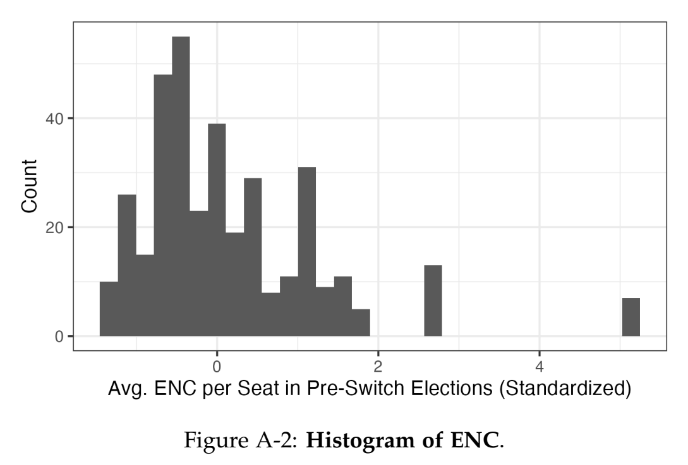

***Figure A-2.*** Histogram of ENC.

For each city, we calculate the effective number of candidates in each election, divided by the number of seats up for election, and take the mean of this quantity over the four elections prior to the first district election for the city. For interpretability, we center and scale this measure to have mean 0, standard deviation 1. To show the amount of variation in this measure, we present a histogram in Figure A-2.

Turnout. The CEDA data includes a unique identifier for each election in a city. However, some at-large elections are for one seat while others are for multiple seats, with voters casting as many votes as there are open seats. We therefore compute the number of voters in an election as the sum of votes cast in that election divided by the number of winning candidates; we divide this value by total CVAP in the city to get the turnout rate. As with competitiveness, we compute the average turnout rate over the last four at-large elections in each city.

A.5 Validating the Use of BISG

In Tables 3 and 4 of this study, we use Bayesian Improved Surname and Geocoding (BISG) implemented in the wru R package (Khanna et al. 2024) to code the probability that each candidate is Latino based on their name and location. We assess the reliability of BISG predictions by examining probability separation across racial/ethnic groups in Figure A-3. For each group, we identify candidates whose highest predicted probability corresponds to that group. We then compare two distributions: (1) the predicted probability for the assigned group (red), and (2) the maximum predicted probability assigned to any competing group (green). As indicated, there is a good degree of separation in predicted probabilities for Asian, Latino and white candidates. As our manual verification noted in Appendix A.2 suggested, there is less separation for Black candidates. Given that our analyses focus on Latino candidates in light of the goals of the CVRA, we are confident that any discrepancies from BISG do not undermine our analyses.

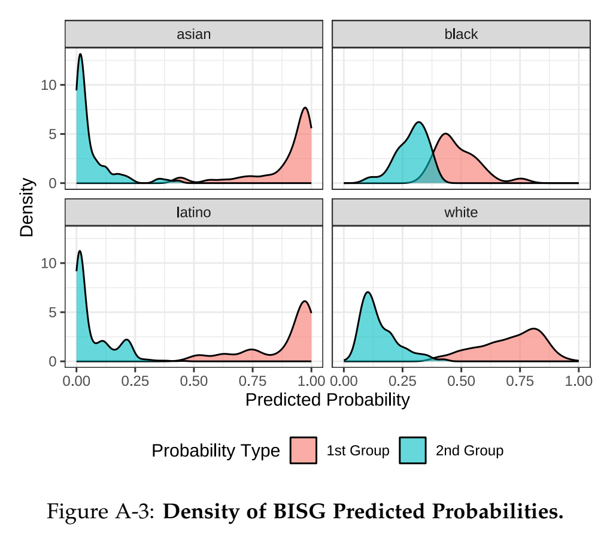

***Figure A-3.*** Density of BISG Predicted Probabilities.

### B District Simulations

B.1 Redistricting Algorithm

We use the automated redistricting simulator proposed by McCartan and Imai (2023). We select this algorithm for a few reasons. First, it can incorporate contiguity, compactness, and equal population constraints into the estimation process, meaning that it approximates the particular distribution of plans that real-world decisionmakers, given the physical and residential geography of their city, can feasibly produce under federal law. To our knowledge this algorithm is the best among currently available methods at approximating this particular distribution that is of substantive interest to us. Second, the algorithm is computationally efficient, scales well, and is easy to implement using the R package redist (Kenny et al. 2021).

We refer the interested reader to a detailed discussion of the algorithm in the published articles (McCartan and Imai 2023; McCartan et al. 2022), presenting only the intuition here. The approach treats the task of assigning m geographic units (for us, Census blocks) to n contiguous council districts as a graph-cut problem: partitioning a graph— where nodes represent geographic units and edges between two nodes represent their contiguity—into a set of connected subgraphs, representing districts. It then uses a Sequential Monte Carlo (SMC) algorithm to obtain a representative sample of plans from the distribution of valid plans as formulated in this way.

B.2 Plan Measurements

We primarily rely on two quantities of interest to measure the degree of incumbent protection observed in city council districting: Alone and Proportion Alone . Alone is c,i c c,i

binary indicator that takes a value of “1” if incumbent i in city c is assigned to their own district; “0” if candidate i is assigned to district with any number of other incumbents. Proportion Alone is defined as the total number of incumbents in city c assigned to their own district, divided by the total number of incumbents sitting on the council when city c switched to district elections. We create values for these measures based on the district maps actually adopted by each city as well each simulated plan we create. To construct values for these measures, we take the geocoded address for each incumbent and determine the Census block they reside in, using st_within() from the sf package for R to perform the necessary spatial join. For analyses using the enacted map only, values of Alone and Proportion Alone are determined solely on the district c,i c

number candidates are determined to live in. In the 5,000 simulated plans we produce for each city, we again calculate values of Alone and Proportion Alone . In each simc,i c

ulation draw, we determine the city council district to which the Census block of the incumbent is assigned. We are able to determine this through the following procedure using a built-in function from the redist package (Kenny et al. 2021):

### 1. Use the get_plans_matrix() function to extract the matrix of district assignments

from a redistricting simulation for each Census block. Rows of this matrix represent each Census block within the city’s limits. Columns represent district assignments for a single draw.

2. Join the resulting matrix to a data frame of incumbent information by the GEOID10 value representing the Census block in which the incumbent resides.

### 3. For each column (representing a single simulation draw), apply the following func-

tion to identify whether any two or more candidates are assigned to the same city council district in that draw:

1 check_duplicates <- function(col) {

2 as.integer(duplicated(col) |

3 duplicated(col, fromLast = TRUE))

4. For the enacted plan, Alone = 1 if the check_duplicates() function returns a “1” c,i

based on the first column of the plans matrix. For the simulated plans, Alone = c,i

1 if the check_duplicates() function returns a “1” based on the corresponding column for that simulation draw in the plans matrix.

### 5. For the enacted plan (column 1) and all simulated plans, Proportion Alone is

calculated as the proportion of incumbents assigned to their own district, divided by the total number of incumbents.

B.3 Parameter Selection

redist_smc requires a few key user-defined parameters. The first is compactness, which we set at the default level of ρ = 1 for every city.5 Larger values of ρ correspond to a preference for fewer edge cuts and therefore a redistricting plan with more compact districts.

5See McCartan et al. (2022), Section 3.3 for further detail on why ρ = 1 is recommended.

The user is also required to provide a value for the maximal deviation from population parity—that is, where the city’s population is divided evenly among districts—that will be tolerated of any district in a plan. Legislative districting at the federal level is held to a very high population equality standard. In the 1983 case Karcher v. Daggett, the Supreme Court ruled that there is no deviation that could practically be avoided that is too small to potentially violate the “one person, one vote” standard set by Article I, Section 2 of the Constitution. Evenwel v. Abbott (2016) provides a useful guideline for state and local redistricting, stating that legislative maps with a maximum population deviation of less than 10% between the largest and smallest districts are presumably consistent with the one-person, one-vote principle (this is equivalent to pop_tol = 0.05 in redist). At the local level, larger deviations may be necessary to achieve other districting goals, especially in smaller and more sparsely or unevenly populated municipalities.

Absent concrete legal guidance or precedent at the city level, we approach the determination of the maximum tolerable deviation from population parity as an empirical matter. First we compute, for every adopted district plan, the maximal deviation of any district, given by: (cid:12) (cid:12)

max 1≤l≤n (cid:12) (cid:12) (cid:12) ∑ i∈V l p i − 1 (cid:12) (cid:12) (cid:12) (4) where V is a district, n is the number of districts, i is a Census block, p is the population l i

in block i from the 2010 Census, and p¯ is defined as ∑m p /n (where m is the number of i=1 i

blocks). We find that some cities, in particular smaller ones, have very high values—far beyond what is usually tolerated at the federal level—and the overall mean across cities is 0.10. We therefore set the population tolerance parameter as the maximum of 0.05 (equivalent to the Evenwel standard) and the city’s own adopted map’s largest deviation, with the rationale that if a certain deviation was permitted in practice, then any plan with smaller deviations would have been fair game as well—at least on this dimension. While we cannot know how much larger a deviation might have been tolerated, our approach yields relatively conservative target distributions—that is, it may exclude some counterfactual possibilities that were in fact on the table. Still, because the deviations are so high in practice, the algorithm still has a large degree of freedom to explore alternative plans.

Finally, the user is also expected to define the number of samples to draw (sims) and, optionally, how many independent parallel runs to conduct (runs). We chose to run 5,000 simulations across 4 parallel runs. Thus, we generate 20,000 simulated district plans from a target distribution—5,000 from each of four independent chains—and thin the resulting plans to retain a final sample of 5,000. This follows the process the ALARM team (who wrote the redist package) typically uses.6

As a robustness check, we ran our simulations multiple times and varying two different parameters: (1) the minimum acceptable deviation from population parity (comparing 0.01 versus the Evenwel standard of 0.05) and (2) the number of simulations (5,000 verus 40,000). 23 of our 87 cities had values of the pop_tol parameter in the redist_smc() function less than 0.05 and thus had simulated plans more similar to the enacted plan compared to those acceptable under the Evenwel standard.

In Figure B-4, we compare how the values of Percentile(Proportion Alone) (equivalent to the red diamonds in our Figure 3) and Simulated Alone Probability correlate across simulation settings. As shown, any differences are minor with the correlations 6See https://github.com/alarm-redist/fifty-states/blob/main/R/template/03_sim.R for an example.

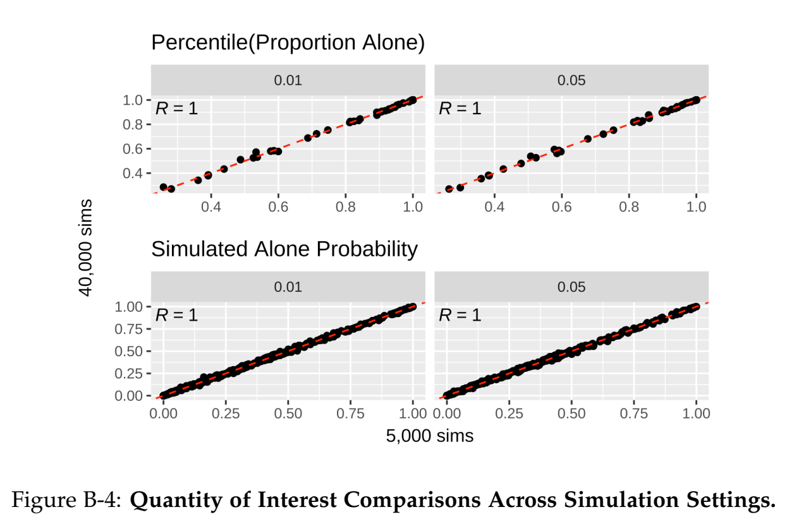

***Figure B-4.*** Quantity of Interest Comparisons Across Simulation Settings.

being equal to about 1 across all variations in settings. For this reason, we use 5,000 simulations with a population tolerance parameter set to max(Enacted Value, 0.05).

B.4 Dealing with Neighborhoods and Communities of Interest

In crafting district maps for the first time, city council members likely have an interest in keeping communities of interests (COIs) or neighborhoods together within districts, as referenced in local reporting in some cities in our sample. Thus, minimizing the number of splits to COIs or neighborhoods may be considered a constraint that should be added to districting simulations. To examine the impact of “neighborhood constraints,” we contacted cities in search of neighborhood shapefiles, similar to those collected by Ansolabehere et al. (2025). Ultimately, we were only able to collect neighborhood shapefiles that covered nearly all of a city’s geographic boundary and met the requirement for building a split constraint in the redist_smc() function for 16 cities: Carlsbad, Cathedral City, Chula Vista, Citrus Heights, Claremont, Concord, Fontana, Fremont, Imperial Beach, Oxnard, Palm Springs, Redwood City, San Rafael, Santa Rosa, Temecula, and Yucaipa. We added these constraints using the add_const_splits() function from the redist package with strength = 0.5. This treats neighborhoods as complete geographic subunits (e.g., counties within a state) and produced a set of simulated plans with most simulation diagnostic values within acceptable values for each city.

Given that we were unable to create plans with neighborhood constraints for all of our cities, we do not fully rerun our analyses for just the 16 of the 87 cities with split-constrained plans. Instead, after producing a set of simulated plans that include neighborhood constraints for these 16 cities, we examine how two quantities of interest differ with versus without this constraint. Overall, using these constrained plans does not produce noticeably different results.

First, in Figure B-5, we compare the percentile value of the proportion of incumbents

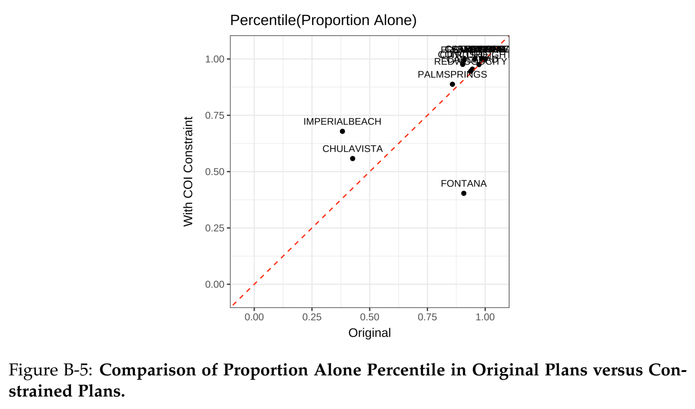

***Figure B-5.*** Comparison of Proportion Alone Percentile in Original Plans versus Con- strained Plans.

alone in their district across the indicated set of simulated plans. The x-axis represents the percentile value in the original plans while the y-axis represents the percentile value across plans with the neighborhood constraint. The values represent the red diamond in our Figure 3. As indicated, all but one of these cities lie above the 45-degree line, showing that if anything, we slightly understate the degree of incumbent protection by not accounting for the goal of keeping neighborhoods together. However, for most of these cities the differences in percentile values are small. Only in Imperial Beach and Fontana are the percentile values substantially different, but the direction of the error is not consistent between the two cities.

Second, in Figure B-6, we compare the values of Simulated Alone Probability c,i which is one of the independent variables we include in our regression models. Each point in this figure represents the value for one incumbent with the color used to indicate which city they are from. While there are instances of these values being noticeably different for individual incumbents, these differences largely balance out—as indicated by the regression line that largely follows the 45-degree line.

We also use these maps to examine the extent to which cities made an effort to keep neighborhoods together. We apply the Effective Split Index (ESI) measure introduced by Chen et al. (2022). This measure adapts the Laakso-Taagepera index to quantify how fragmented a neighborhood is across districts, weighting splits by the share of the neighborhood’s population assigned to each district. A neighborhood fully contained within a single district has a value of zero, while evenly splitting a neighborhood across two districts yields one effective split; uneven divisions count as smaller, and substantively less meaningful, splits. Because the unit of measurement for ESI is at the neighborhood level, we aggregate this to create a value that can be interpreted across cities by calculating the Total ESI in a city, divided by the number of neighborhoods in a city. We present the simulation distribution of this city neighborhood splitting in Figure B-7, showing the distribution from our original simulated plans in the left facet and the distribution

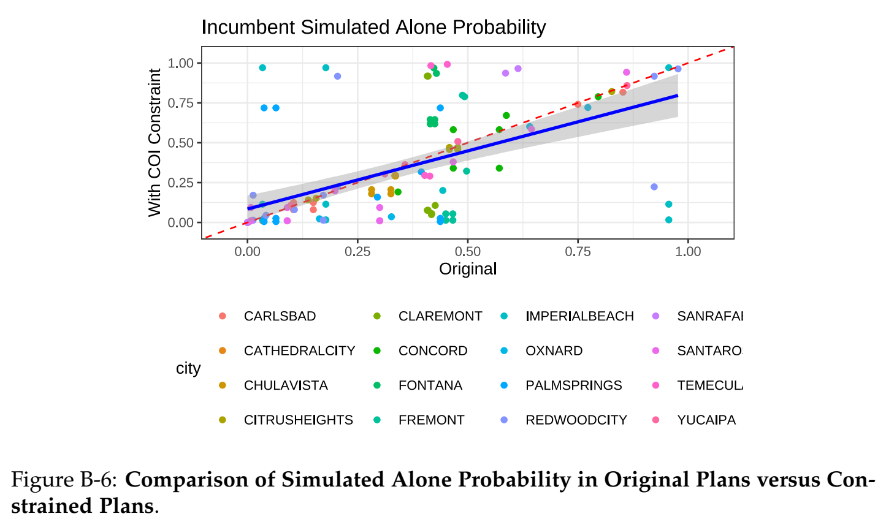

***Figure B-6.*** Comparison of Simulated Alone Probability in Original Plans versus Con- strained Plans.

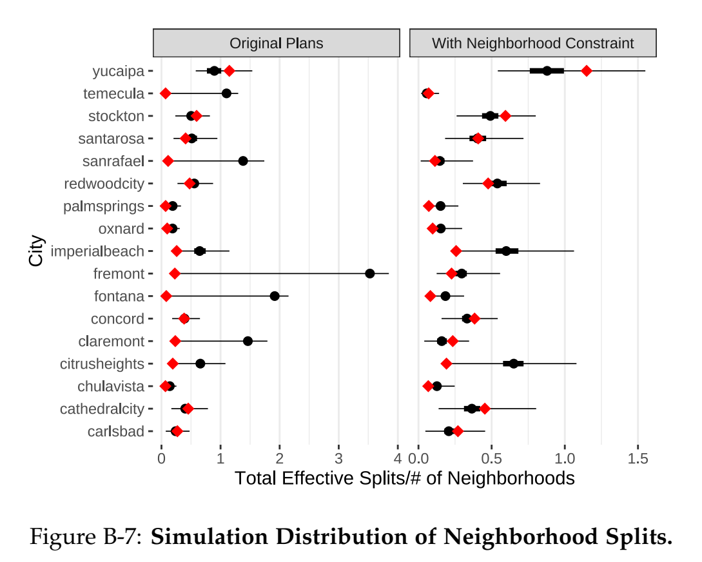

***Figure B-7.*** Simulation Distribution of Neighborhood Splits.

among simulated plans that include a constraint on splitting neighborhoods in the right facet. In both sets of simulated plans, it appears that cities adopted maps with fewer neighborhood splits than would be expected based on the simulation distributions.

Table C-4: Hazard Ratio from Cox Proportional Hazards Regression of Leaving City Council

Characteristic HR 95% CI p-value Incumbent: Alone in Adopted Map 0.59 0.47, 0.73 <0.001 Abbreviations: CI = Confidence Interval, HR = Hazard Ratio

### C Supplemental Analyses

C.1 Long-term Effects of Incumbent Protection

To understand the substantive effects of incumbent protection over time, we first collected data on term limits. Only 21 of our 87 cities (24%) have term limits for city council. Thus, the effects of incumbent protection typically do not have a built-in time limit, making it worthwhile to assess their persistence over longer time horizons.

Unfortunately, the switch to district elections occurs right before the 2020 Census, limiting the availability of post-treatment data with the same district boundaries. Cities also stagger elections across multiple years, so to observe a full turnover of the city council requires two sets of elections spaced two years apart. Consequently, our ability to track incumbents’ participation in several future election cycles is limited. Across the 334 total districts in our data, we observe just 1 post-switch election for 285 (85.3%) districts and thus 2+ elections in just 49 (14.7%) districts. Thus, any approach examining longterm effects within districts would be severely underpowered in any panel framework. As an alternative, we first examined records from the California Elections Data Archive to track the elections in which our incumbents were candidates for election. This provides coverage of elections through 2024. Of the 403 incumbents from cities were we have election returns from more than one post-switch election year, 72 (17.9%) still serve on their city council. Of the 124 incumbents who participated in at least 1 post-switch election, 91 (73%) of them were drawn into their own district. As shown in Table C-4, using a Cox Proportional Hazards Regression model, we find that incumbents drawn alone in their district are 59% as likely to leave their council at any given time compared to those paired up with another incumbent. However, we are unable to fully capture within-district effects beyond 1 post-switch election given data limitations. Nevertheless, this establishes that while there is a great deal of turnover following the switch to district elections, the incumbents who remained in office disproportionately benefited from incumbent protection in the drawing of district maps.

Despite this turnover, our findings in Table 4 of our main text—which focus on candidate supply, whether or not an incumbent actually ran in the post-switch election— indicate that compared to districts without incumbents living within their boundaries, those with one incumbent have, on average, approximately one fewer candidate per seat and attract 0.32 fewer Latino candidates. To underscore the point, drawing district lines in ways that protect incumbents limits the increase in the descriptive diversity of candidates that the CVRA intended to promote.

We then estimate city-level panel regressions using the same dependent variables in the same form. A city-level analysis allows us to evaluate whether cities that were more aggressive in protecting incumbents experienced fewer new candidates overall, fewer Latino candidates, and fewer Latinos elected to city councils following the switch to district elections. In doing so, we abstract away from the within-district dynamics

caused by the intentionality with which district lines are drawn, but take advantage of the remaining way we can examine longer-term effects of incumbent protection. The models are estimated using a city-election year panel, where outcomes are constructed for each post-switch election through 2024. Each of the models we present include fixed effects for the number of elections since the switch to district elections (t + 1, t + 2, etc.) and an indicator for elections held after the redrawing of district maps following the 2020 Census. We do not simply use year fixed effects because of the differences in the timing of the switch and first district elections across cities.

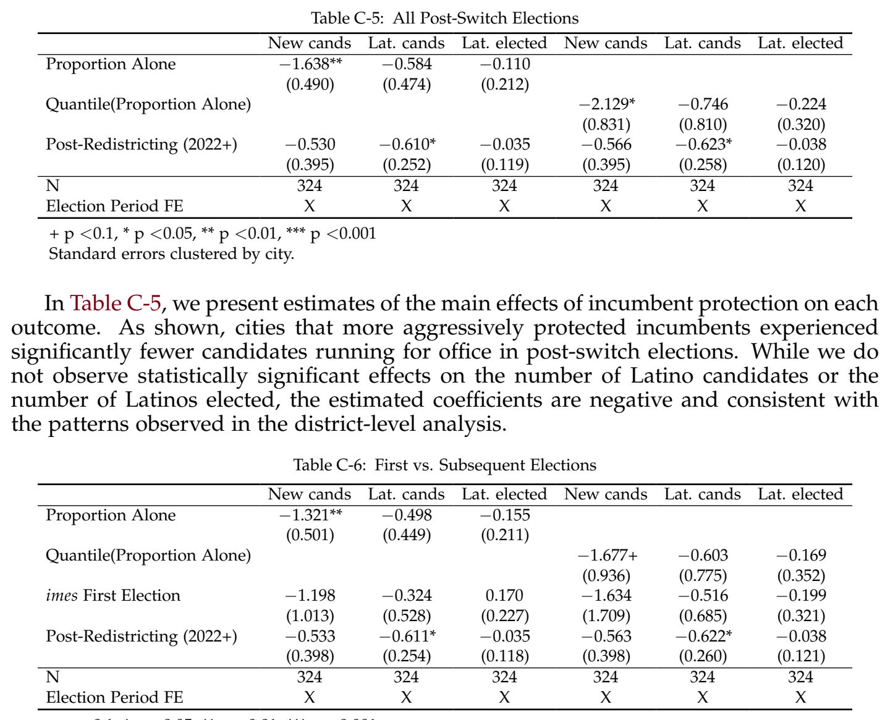

***Table C-5.*** All Post-Switch Elections New cands Lat. cands Lat. elected New cands Lat. cands Lat. elected Proportion Alone −1.638** −0.584 −0.110 (0.490) (0.474) (0.212) Quantile(Proportion Alone) −2.129* −0.746 −0.224 (0.831) (0.810) (0.320) Post-Redistricting (2022+) −0.530 −0.610* −0.035 −0.566 −0.623* −0.038 (0.395) (0.252) (0.119) (0.395) (0.258) (0.120) N 324 324 324 324 324 324

[Download data as CSV](tables/tab-02.csv)

Election Period FE X X X X X X

+ p <0.1, * p <0.05, ** p <0.01, *** p <0.001

Standard errors clustered by city.

In Table C-5, we present estimates of the main effects of incumbent protection on each outcome. As shown, cities that more aggressively protected incumbents experienced significantly fewer candidates running for office in post-switch elections. While we do not observe statistically significant effects on the number of Latino candidates or the number of Latinos elected, the estimated coefficients are negative and consistent with the patterns observed in the district-level analysis.

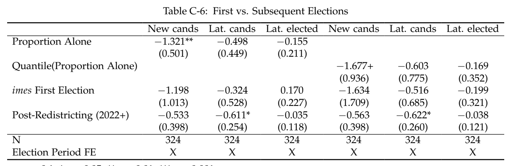

***Table C-6.*** First vs. Subsequent Elections New cands Lat. cands Lat. elected New cands Lat. cands Lat. elected Proportion Alone −1.321** −0.498 −0.155 (0.501) (0.449) (0.211) Quantile(Proportion Alone) −1.677+ −0.603 −0.169 (0.936) (0.775) (0.352) imes First Election −1.198 −0.324 0.170 −1.634 −0.516 −0.199 (1.013) (0.528) (0.227) (1.709) (0.685) (0.321) Post-Redistricting (2022+) −0.533 −0.611* −0.035 −0.563 −0.622* −0.038

[Download data as CSV](tables/tab-03.csv)

(0.398) (0.254) (0.118) (0.398) (0.260) (0.121) N 324 324 324 324 324 324

Election Period FE X X X X X X

+ p <0.1, * p <0.05, ** p <0.01, *** p <0.001

Standard errors clustered by city.

In Table C-6, we add an interaction term between incumbent protection and an indicator for the first election following the switch to district elections. A statistically significant interaction would suggest that the effects of incumbent protection are concentrated in the immediate post-switch election and attenuate over time. Instead, we find that this interaction term is not statistically significant across specifications, indicating that the effects of incumbent protection are not confined to the first post-switch election. Note, however, that because of the staggered nature of city council elections, this first post-switch election periods covers elections for just a portion of the council which may or not have been strategically chosen to be on the ballot first.

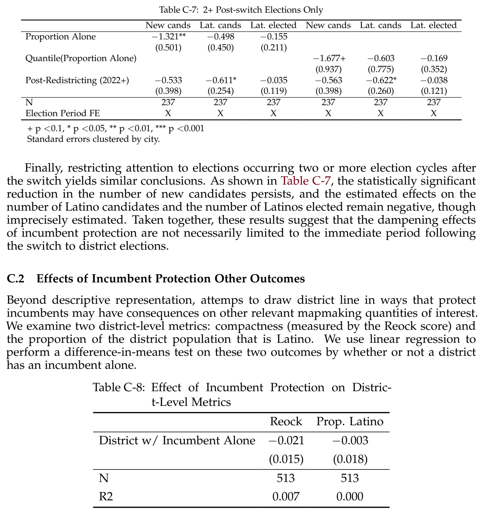

***Table C-7.*** 2+ Post-switch Elections Only New cands Lat. cands Lat. elected New cands Lat. cands Lat. elected Proportion Alone −1.321** −0.498 −0.155 (0.501) (0.450) (0.211) Quantile(Proportion Alone) −1.677+ −0.603 −0.169 (0.937) (0.775) (0.352) Post-Redistricting (2022+) −0.533 −0.611* −0.035 −0.563 −0.622* −0.038 (0.398) (0.254) (0.119) (0.398) (0.260) (0.121) N 237 237 237 237 237 237

[Download data as CSV](tables/tab-04.csv)

Election Period FE X X X X X X

+ p <0.1, * p <0.05, ** p <0.01, *** p <0.001

Standard errors clustered by city.

Finally, restricting attention to elections occurring two or more election cycles after the switch yields similar conclusions. As shown in Table C-7, the statistically significant reduction in the number of new candidates persists, and the estimated effects on the number of Latino candidates and the number of Latinos elected remain negative, though imprecisely estimated. Taken together, these results suggest that the dampening effects of incumbent protection are not necessarily limited to the immediate period following the switch to district elections.

C.2 Effects of Incumbent Protection Other Outcomes

Beyond descriptive representation, attemps to draw district line in ways that protect incumbents may have consequences on other relevant mapmaking quantities of interest. We examine two district-level metrics: compactness (measured by the Reock score) and the proportion of the district population that is Latino. We use linear regression to perform a difference-in-means test on these two outcomes by whether or not a district has an incumbent alone.

Table C-8: Effect of Incumbent Protection on Distric-

t-Level Metrics

Reock Prop. Latino

District w/ Incumbent Alone 0.021 0.003

N 513 513

R2 0.007 0.000

+ p <0.1, * p <0.05, ** p <0.01, *** p <0.001

Standard errors clustered by city.

As shown in Table C-8, we find no statistically significant differences between districts with and without a lone incumbent across these metrics when clustering standard errors at the city level.

Table C-9: Effect of Incumbent Protection on City-Level Metrics Avg. Reock Max. Prop. Latino Percentile(Proportion Alone) 0.038 0.071

N 87 87

R2 0.009 0.007

+ p <0.1, * p <0.05, ** p <0.01, *** p <0.001

We also examine whether incumbent protection is associated with changes in compactness and district demographics at the city level. In Table C-9, we regress Percentile(Proportion Alone) on two city-level outcomes: the average Reock score across districts and the maximum Latino population share observed in any district within the city. We find no statistically significant relationships between incumbent protection and either compactness or Latino representation. That said, the limited variation in Percentile(Proportion Alone) across cities constrains our ability to detect statistically precise effects. Cities that made greater efforts to isolate incumbents tend to have, on average, slightly less compact districts and marginally lower maximum Latino district shares. While these differences are small and statistically indistinguishable from zero, they suggest that incumbent protection may introduce modest distortions in district shape and composition.

In Figure C-8, we present a version of Figure 3 from the manuscript that overlays the simulation distributions for two city-level outcomes: average Reock scores (compactness) and the maximum Latino population share observed in any district within each city. Focusing first on compactness, many cities—including those that maximized the extent of incumbent protection—adopted plans that fall near the center of their respective simulation distributions. If anything, the adopted plans tend to be slightly more compact than what would be expected under the simulated baseline. A similar pattern emerges for maximum Latino population share: most cities selected plans that lie near the center of the simulation distribution and well within their relatively narrow interquartile range. These patterns suggest that even in cities that emphasized incumbent protection, adopted plans do not appear unusually compact or demographically extreme relative to the range of plausible alternatives generated by the simulations.

This pattern of results underscores our core contribution: incumbent protection was made possible because it was discreet. The plans adopted by city councils generally appear unobjectionable when evaluated using standard mapmaking criteria alone. Yet, as we show, incumbent protection was widespread and systematically dampened the outcomes on which the CVRA is most often evaluated: creating meaningful opportunities for candidates from underrepresented groups to run for and win elected office. More broadly, these findings highlight the central point we make about institutional reform: when responsibility for implementation is handed to those individuals the reform is meant to constrain, they can exploit their institutional advantages in ways that preserve the appearance of compliance while undermining the ultimate goals of those reforms.

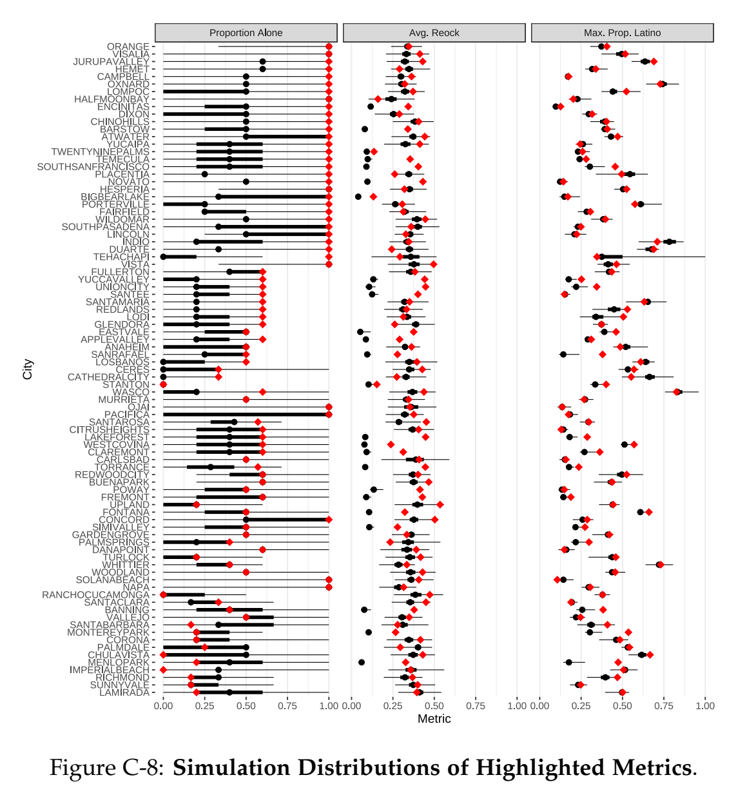

***Figure C-8.*** Simulation Distributions of Highlighted Metrics.

### D Additional Tables and Figures

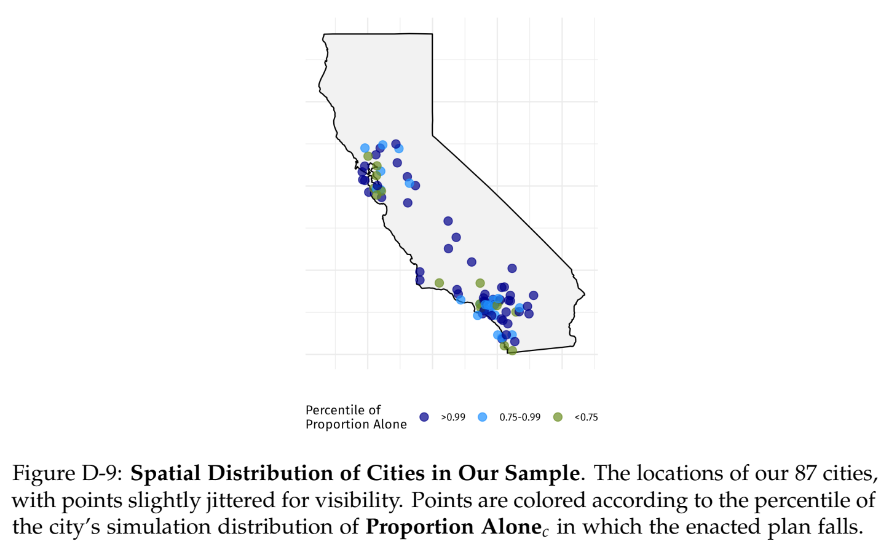

***Figure D-9.*** Spatial Distribution of Cities in Our Sample. The locations of our 87 cities, with points slightly jittered for visibility. Points are colored according to the percentile of the city’s simulation distribution of Proportion Alone in which the enacted plan falls. c

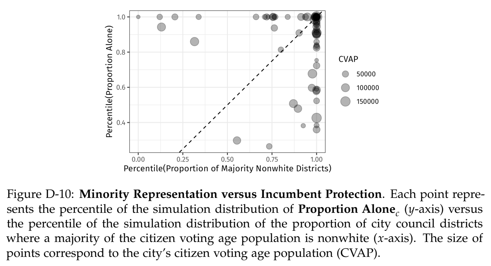

***Figure D-10.*** Minority Representation versus Incumbent Protection. Each point repre- sents the percentile of the simulation distribution of Proportion Alone (y-axis) versus c the percentile of the simulation distribution of the proportion of city council districts where a majority of the citizen voting age population is nonwhite (x-axis). The size of points correspond to the city’s citizen voting age population (CVAP).

Table D-10: Effect of Districting on Incumbents’ Reelection Prospects Kept Seat Ran for Reelection Incumbent: Alone in Adopted Map 0.307*** 0.332***

Incumbent: Sim. Alone Probability -0.080 -0.036

Incumbent: White -0.024 -0.053 Incumbent: Republican 0.134* 0.154* Incumbent: Female 0.019 0.012 Incumbent’s block group: Homeownership Rate -0.088 -0.077 Incumbent’s block group: Prop. White -0.118 -0.049 Incumbent’s block group: log(Median Income) 0.045 -0.030 City: log(Population) 0.028 -0.025 City: log(Median Household Income) 0.011 0.188 City: Residential Segregation 0.117 0.423 City: Gini coefficient -0.944 -0.350 City: Prop. White of Last At-large Council -0.372* -0.329+ City: Prop. of CVAP, White 0.617* 0.555* City: Pre-Switch Electoral Competition 0.018 0.026 City: Pre-Switch Turnout Rate 0.014 -0.038 City: Off-cycle city council elections 0.003 -0.033 (Intercept) -0.478 -1.111 N 325 325 R2 0.153 0.170 + p < 0.1, * p < 0.05, ** p < 0.01, *** p < 0.001

Note: Pre-Switch Electoral Competition and Pre-Switch Turnout Rate are centered and scaled to have mean 0, standard deviation 1 for ease of interpretability.

Table D-11: Effect of Incumbency Protection on Post-Districting Election Outcomes, Latino Opportunity Districts

Total Total Any

New Cands. Latino Cands. Latino Elected

### 1 Incumbent -0.707** -0.337+ -0.171*

2+ Incumbents -0.620+ -0.332 -0.141 District: Prop. of CVAP, Hispanic 2.440 3.706* 1.428+ District: Prop. of CVAP, White 2.641 1.456 0.028 District: Prop. of voters, Democrats 2.510 0.215 -0.205 District: log(Median household income) 0.513 0.180 -0.012 City: Homeownership Rate 0.092 0.408 -0.437 City: log(Population) 0.374+ 0.360* 0.033 City: log(Median Household Income) -0.519 -0.305 0.035 City: Residential Segregation -2.873+ -1.788 -0.271 City: Gini coefficient -1.024 -1.401 -0.432 City: Prop. White of Last At-large Council 0.735 -0.242 -0.170 City: Prop. of CVAP, Hispanic -1.079 0.725 0.646 City: Prop. of CVAP, White -1.853 0.722 1.184 City: Pre-Switch Electoral Competition 0.171+ 0.139+ 0.048 City: Pre-Switch Turnout Rate 0.112 0.128 -0.050 City: Off-cycle city council elections 0.119 0.661+ 0.159 (Intercept) -3.628 -3.734 -0.879 N 145 145 145 R2 0.237 0.278 0.262 + p < 0.1, * p < 0.05, ** p < 0.01, *** p < 0.001

Note: Pre-Switch Electoral Competition and Pre-Switch Turnout Rate are centered and scaled to have mean 0, standard deviation 1 for ease of interpretability.

## References

Ansolabehere, Stephen, Jacob R. Brown, Ryan D. Enos, Ben Shair, Tyler Simko, and David Sutton. 2025. “City-Defined Neighborhood Boundaries in the United States.” Scientific Data 12, no. 1 (June 19, 2025): 1031.

Chen, Sandra J, Samuel S-H Wang, Bernard Grofman, Richard F Ober Jr, Kyle T Barnes, and Jonathan R Cervas. 2022. “Turning communities of interest into a rigorous standard for fair districting.” Stan. JCR & CL 18:101.

de Benedictis-Kessner, Justin, Diana Da In Lee, Yamil R. Velez, and Christopher Warshaw. 2023. “American Local Government Elections Database.” Scientific Data 10 (1): 912. Enamorado, Ted, Ben Fifield, and Kosuke Imai. 2017. fastLink: Fast Probabilistic Record Linkage with Missing Data. Available at The Comprehensive R Archive Network (CRAN). https://CRAN.R-project.org/package=fastLink.

Kenny, Christopher T., Cory McCartan, Ben Fifield, and Kosuke Imai. 2021. redist: Simulation Methods for Legislative Redistricting. Available at The Comprehensive R Archive Network (CRAN). https://CRAN.R-project.org/package=redist.

Khanna, Kabir, Kosuke Imai, Santiago Olivella, and Evan T. Rosenman. 2024. wru: Who Are You? Bayesian Prediction of Racial Category Using Surname and Geolocation. Available at The Comprehensive R Archive Network (CRAN) and GitHub. https://cran.rproject.org/web/packages/wru/index.html.

Laakso, Markku, and Rein Taagepera. 1979. “Effective Number of Parties: A Measure with Application to West Europe.” Comparative Political Studies 12 (1): 3–27.

McCartan, Cory, and Kosuke Imai. 2023. “Sequential Monte Carlo for sampling balanced and compact redistricting plans.” Annals of Applied Statistics 17 (4): 3300–3323.

McCartan, Cory, Christopher Kenny, Tyler Simko, Shiro Kuriwaki, George Garcia III, Kevin Wang, Melissa Wu, and Kosuke Imai. 2022. “Simulated Redistricting Plans for the Analysis and Evaluation of Redistricting in the United States.” Nature Scientific Data 9:689.