# When Do Renters Behave Like Homeowners? High Rent, Price Anxiety, and NIMBYism

### Michael Hankinson∗

American Political Science Review, August 2018

Abstract

How does spatial scale affect support for public policy? Does supporting housing citywide but “Not In My Back Yard” (NIMBY) help explain why housing has become increasingly difficult to build in once affordable cities? I use two original surveys to measure how support for new housing varies between the city-scale and neighborhoodscale. Together, an exit poll of 1,660 voters during the 2015 San Francisco election and a national survey of over 3,000 respondents provide the first empirical measurements of NIMBYism at the individual-level. While homeowners are sensitive to housing’s proximity, renters typically do not express NIMBYism. However, in high-rent cities, renters demonstrate NIMBYism on par with homeowners, despite continuing to support large increases in the housing supply citywide. These scale-dependent preferences not only

help explain the deepening affordability crisis, but show how institutions can under-

supply even widely supported public goods. When preferences are scale-dependent,

the scale of decision making matters.

I would like to thank Ryan Enos, Jennifer Hochschild, Ed Glaeser, David Luberoff, Jonathan Spader, Chase Harrison, three anonymous reviewers, and the participants of the American Politics Research Workshop, the Urban Social Processes Workshop, the Joint Center for Housing Studies Seminar Series at Harvard for helpful feedback. This research was supported by grants from the Joint Center for Housing Studies at Harvard, the Eric M. Mindich Research Fund for the Foundations of Human Behavior, and Time-Sharing Experiments for the Social Sciences.

∗Postdoctoral Fellow, Politics Department, Oberlin College.

Since 1970, housing prices in the top quintile of the price distribution have dramatically increased, with real prices doubling in New York City and Los Angeles while nearly tripling in San Francisco (Glaeser and Gyourko, Forthcoming; Glaeser, Gyourko, and Saks, 2005a). Driving this appreciation is an inability of the supply of new homes to keep up with demand, causing the price of existing homes and apartments to rise. Even accounting for the cost of materials (Glaeser and Gyourko, Forthcoming; Glaeser, Gyourko, and Saks, 2005b; Gyourko and Saiz, 2006) and geographic constraints (Saiz, 2010), the dominant factor behind the decoupling of supply from demand is policy regulation, from limits on the density of new homes to caps on the number of permits issued (Glaeser and Ward, 2009; Ihlanfeldt, 2007; Mayer and Somerville, 2000; Quigley and Raphael, 2005). Historically, these restrictions have been limited to majority-homeowner suburbs where most residents favor the rising prices (Danielson, 1976; Fischel, 2001; Frieden, 1979). However, the restrictions have now expanded to majority-renter central cities, where high prices threaten the well-being of not only most residents, but the nation’s economy as a whole.

Why has housing become so hard to build in these traditionally development-friendly cities? And do these restrictions reflect majoritarian preferences? On one hand, residents may not want more housing in their city, meaning the supply restrictions are in line with majoritarian preferences. On the other hand, residents may support more housing, so long as that housing is not built in their own neighborhood. This ‘Not In My Back Yard’ or ‘NIMBY’ opposition (Dear, 1992; Schively, 2007) creates a collective action problem for the housing supply. Despite supporting supply citywide, residents individually have an incentive to ‘defect’ and block new housing proposed for their own neighborhood. If the permitting process allows individual residents to defect from a group interest of more supply, then NIMBYism will not only lead to less new housing overall, but to a level of supply below majoritarian preferences. This ability of NIMBYism to undermine collective action extends beyond housing to an array of land uses, from clean energy facilities (Stokes, 2016) and landfills (Lake, 1996) to homeless shelters and social service centers (Dear, 1992). So long

as the costs are spatially concentrated, even broadly supported land uses will face NIMBY opposition.

For housing, the effects of NIMBYism on supply and prices are meaningful for not only those living within these cities and but also those priced out. Today, one in four renters spends more than half of their income on housing, with growing rents expected to outpace income over the next 10 years (Charette et al., 2015). For renters, rising prices lead to instability, including the looming financial, physical, and emotional distress of eviction (Desmond, 2016). Meanwhile, the benefits of higher prices accrue disproportionately to the affluent, driving the nation’s widening wealth inequality (Rognlie, 2015).1 Beyond residents paying burdensome rents, those priced out of these cities are denied opportunity: higher rates of skill acquisition (Glaeser and Maré, 2001; Rosenthal and Strange, 2008), longer life expectancies (Chetty, Stepner, and Abraham, 2016; Singh and Siahpush, 2014), and greater levels of intergenerational upward mobility (Chetty et al., 2014; Chetty and Hendren, 2015) compared to more affordable alternatives. As evidence of this pricing out, low-wage workers are for the first time no longer migrating to high-wage cities—a breakdown causally attributed to stricter land use regulations (Ganong and Shoag, 2015).

These individual effects reverberate to national consequences. With only high-income workers able to afford the cost of living, incomes across states are no longer converging, entrenching regional inequality (Ganong and Shoag, 2015). More so, this decrease in labor mobility slows national economic growth. Hsieh and Moretti (2017) argue that restrictions on new supply decreased US economic growth by more than 50 percent from 1964 to 2009, whereas lowering restrictions in just New York, San Francisco, and San Jose to those of the median city would raise GDP by 9 percent. The slowdown’s symptoms can be seen in individual cities as well. By limiting the density of new housing, supply regulations threaten 1Rognlie (2015) goes so far as to argue that the widening wealth inequality since 1948 has been driven almost entirely by the decoupling of supply from demand due to land use regulation.

local economic productivity (Ciccone and Hall, 1996; Glaeser and Maré, 2001) and innovation (Rauch, 1993; Carlino, Chatterjee, and Hunt, 2007). Finally, when cities cannot grow up, they grow out, consuming ecosystems and increasing greenhouse gas emissions per capita (Glaeser and Kahn, 2010; Jones and Kammen, 2014). These effects are pervasive and they are path dependent. Once these development patterns are set, they tend to be enduring.

Given these consequences, why have housing restrictions leapt from homeowner-dominated suburbs to majority-renter central cities? Much of what we know about housing and NIM- BYism explains suburban homeowner behavior, but fails to describe the current affordability crisis. Unlike homeowners, there has been little research on the attitudes and political behavior of renters who compose the majority of these cities’ electorates.2 Furthermore, despite media attention, there are neither experimental evaluations nor individual-level empirical measurements of NIMBYism towards housing. To address these challenges, I conducted two surveys. To capture voting behavior and attitudes, I leveraged the 2015 San Francisco municipal election, where the ballot contained four measures directly related to the housing supply and prices. By sampling voters as they exited polling locations, my survey of 1,660 respondents captured the opinions of politically active voters after a months long campaign with housing as a primary issue. To assess the generalizability of these findings, I conducted a national survey of over 3,000 respondents from 655 municipalities. The national survey consisted of housing policy proposals and a conjoint experiment to test policy preferences. Together, these surveys provide not only widely generalizable data on the attitudes of homeowners and renters, but the first experimental measurements of NIMBYism towards housing.3

From these data, I find that while homeowners exhibit a constant level of NIMBYism 2Recent empirical work primarily uses renter behavior as a baseline against which to estimate the effects of homeownership (McCabe, 2016).

3Gerber and Phillips (2003) measure the effect of spatial proximity on support for new developments in San Diego, but their observational data is aggregated to the precinct-level.

across all housing markets, renters do not. Instead, renters on average express high support for new housing citywide and no sensitivity to the nearness of new development. However, in cities where housing prices are high, renters display NIMBYism towards market rate housing at a level on par with homeowners. This renter NIMBYism is strongly correlated with concerns over high housing prices, suggesting that renters feel economically threatened by new nearby developments. Nevertheless, NIMBY renters still support large increases in their city’s housing supply. Simply put, these renters support new housing, but not in their own neighborhood. Because these preferences vary between the neighborhood-scale and the city-scale, how city institutions approve new housing is likely to affect how much housing gets built. If NIMBY residents are able to selectively block nearby developments, less housing is likely to be approved overall than if the same residents voted on supply citywide. When policy preferences vary by spatial scale, the scale of decision making matters.

## 1 NIMBYism

From siting energy facilities to homeless shelters, the politics of any land use operate within a geographic domain. For housing, that domain is the municipality, which exercises the greatest control over the amount, location, and aesthetic of housing permitted. Within that land use’s domain, its costs and benefits vary by spatial scale. Some effects are felt in direct proportion to their proximity. For example, the noise, congestion, and aesthetic change that comes with new housing is felt most intensely by those living nearby. Because these externalities affect only a subset of the domain’s population, they operate at the ‘micro-scale’. In contrast, other effects are felt uniformly across the domain. For housing, an increased tax burden generated by the new units is shared among all residents of the municipality regardless of how close they live to the new development. These uniform externalities operate at the

‘macro-scale’, encompassing the entire domain.4

Because costs and benefits vary across scales, so do voter preferences. When the costs of a land use are more spatially concentrated than the benefits, those living closer to the use are more likely to oppose it than those living farther away. This shift from support or indifference toward the use at the macro-scale to opposition at the micro-scale is known as ‘NIMBYism’ for ‘Not In My Back Yard’. Originally coined for the protest of landfills, trash incinerators, and power plants (Dear, 1992; Fischer, 1993; Schively, 2007), the term has expanded in scope to almost any land use opposed by local residents, including new housing development. Regardless of its application, NIMBYism describes macro-scale support that does not carry over to the micro-scale, meaning the preferences are ‘scale-dependent’.5

When preferences are scale-dependent, how decisions are made can lead the same voters to different policy outcomes. Think of two cities with identical residents. These residents support new housing citywide, but oppose it in their own neighborhood. In City A, decisions about housing are made at the city-level (macro-scale) through a majority vote, similar to a ballot initiative. In City B, housing decisions are made neighborhood by neighborhood 4Few land uses are governed entirely within one domain. For instance, some states have laws that can compel a municipality to approve more housing (e.g. Massachusetts Chapter 40B). For these laws, the domain is the state-level, making the entire state the macroscale. Macro-scale effects would include any changes to tax burden of residents statewide. Meanwhile, the micro-scale would include any effects felt from the neighborhood-level up to the county-level, such as increased congestion on roads and more intensive use of public goods. Still, because the majority of debate over the housing supply occurs at the municipallevel, the municipality is our primary domain of interest.

5NIMBYism is sometimes framed altruistically, with opponents arguing that the land use is inappropriate regardless of proximity to their homes (Pendall, 2000). But when opposition no longer depends on proximity, preferences are no longer scale-dependent. In my framework, that opposition is no longer NIMBYism.

(micro-scale), with each neighborhood able to reject or accept new housing. In City A, if the majority of residents support an increase in the housing supply, that increase will occur, keeping supply in tandem with majoritarian preferences. In City B, however, each individual neighborhood is given the opportunity to defect and reject new housing proposed for their neighborhood. Given NIMBY opposition to housing nearby, the amount of new housing permitted in City B will fall short of majoritarian preferences for housing citywide. Together, NIMBYism combined with institutional design makes housing harder to build in City B than in City A.6

This stylized example is grounded in institutional shifts that have occurred over the past 40 years. Following the slum clearance, urban renewal, and highway development of the mid-20th century, citizen groups began clamoring for a larger say in city planning (Angotti, 2008; Rohe and Gates, 1985; Stone et al., 2015). This mobilization matched a larger wave of federal efforts to enhance citizen participation, beginning with Lyndon Johnson’s Community Action Program which put the local level at the forefront of the war on poverty (Berry, Portnoy, and Thomson, 1993). Specifically for urban development, the Model Cities Program of 1966 began the requirement of citizen participation in the planning process to receive federal funding. In 1974, the Community Development Block Grant program codified this neighborhood voice, mandating that cities “provide residents of the community with adequate opportunity to participate in the planning, implementation and assessment of the program” (Rohe and Gates, 1985). While initially considered superficial and weak (Berry, Portnoy, and Thomson, 1993), these mandates foreshadowed today’s citizen review processes and neighborhood planning boards, institutions designed to empower local residents to express opinions and negotiate with developers over nearby proposals.7

6This model is based on a municipality composed of multiple neighborhoods, whereas some suburban municipalities are small enough to encompass one large neighborhood. In this case, the neighborhood and city are the same scale.

7While the effect of these neighborhood institutions has yet to be quantified, previous

NIMBYism and shifts of power to the micro-scale help explain why housing has become increasingly difficult to build in many cities. But testing the NIMBY mechanism starts with identifying who holds scale-dependent preferences. Doing so would advance our understanding of local political economy where the housing supply has been largely viewed as either outside the influence of voters (Peterson, 1981; Tiebout, 1956), at the behest of suburban homeowners (Fischel, 2001), or dictated by growth-centric elites (Logan and Molotch, 1987). Missing is an understanding of how spatial scale affects support for public policy.8

studies have found evidence that neighborhood-level, ward-based decision making leads to more restrictive zoning and fewer group homes in a municipality (Clingermayer, 1993, 1994). Other evidence of increased strength among neighborhoods can be found in the rise of Community Benefits Agreements (Gross, 2007; Salkin and Lavine, 2008; Wolf-Powers, 2010). Neighborhood organizations leverage their collective political power to win developer concessions for the project, including affordable housing, living wages, and first-choice hiring. In exchange, the neighborhood groups present a united front in favor of the proposal during the city’s permit approval hearing. The existence of these negotiations outside of formal governing structures has led to debates over who represents the neighborhood, whether the contracts are enforceable, and the encouragement of project-by-project ‘ad hoc’ planning (Been, 2010). Nevertheless, these communities’ independent place at the bargaining table shows an increase of political power since the mid-20th century.

8As described above, many of the benefits of new housing accrue to non-residents or would-be residents priced out of the housing market. However, regulations of supply are almost exclusively set at the municipal-level, making the preferences of current residents the most politically relevant.

### 1.1 Macro-Scale

At the macro-scale, new housing has a negative effect on prices.9 By moderating prices, new supply provides lower rents for renters and more affordable opportunities for first-time home buyers. New housing may also benefit current residents via economic growth, wherein local business owners gain customers and cheaper labor through a more affordable cost of living.

But while pleasing to renters, lower housing prices tend to trouble homeowners. Not only is the home typically one’s largest asset, but it has been increasingly viewed as an investment vehicle for wealth creation (Fischel, 2016). Consequently, lower prices threaten the long-term expectation that one’s home value will increase above the rate of inflation. As another threat to home values, the new residents that follow development tend to be less wealthy than current residents, meaning they are likely to consume more in city services than they generate in tax revenue (Peterson, 1981; Tiebout, 1956). This combination leads to both higher taxes and lower home values for current residents. Though all residents suffer if new development strains public goods, homeowners pay doubly as this decrease in quality of life is capitalized into lower home values (Oates, 1969), whereas renters at least benefit from a lower cost of living.

9Housing can be characterized by price point, either ‘market rate’ or ‘affordable’. Market rate housing is priced by whatever people are willing to pay, whereas affordable housing is subsidized, with restrictions on both eligibility and rent charged. Market rate housing is built when the price of a unit exceeds construction costs to the point of being profitable for the developer (Glaeser and Gyourko, Forthcoming). Thus, given a stable level of demand, prices are expected to be higher in the absence of new development. However, if new supply replaces existing subsidized units and those subsidized units are not rebuilt within the market, average rents could theoretically increase.

### 1.2 Micro-Scale

Along with the macro-scale, new supply may also lower prices at the micro-scale through localized externalities. Nearby development causes physical disruptions, blocking natural light and views. With new housing comes new residents, meaning more noise, congestion, and competition for nearby public goods, such as parking spaces and local parks.10 This decrease in quality of life is capitalized into lower home values for units nearby. Finally, residents may be concerned about the demographics of the new arrivals themselves. Housing that is more affordable than the current stock will attract less wealthy and likely more racially diverse residents. Concerns about ‘outsiders’ unfamiliar with neighborhood norms may stem from either direct racism or a belief that diversity itself will lower property values (Danielson, 1976).

But local externalities do not always depress property values. Occasionally, new housing is believed to ‘upgrade’ a neighborhood. To many, investment by a developer sends a positive signal about a depressed neighborhood’s economic trajectory. New apartments may replace existing blight, such as an empty lot or vacant building, improving nearby home values and encouraging neighboring property owners to renovate their untis (Autor, Palmer, and Pathak, 2014). At the same time, this positive effect on prices has been framed as harmful to renters, with new developments and renovations accused of spurring the economic and cultural gentrification of a neighborhood (Angotti, 2008; Betancur, 2002; Hackworth and Smith, 2001). Because of this supply-induced gentrification, an individual may simultaneously believe that new housing lowers prices citywide, but that any specific development would increase nearby prices.

10E.g. Conflict over reserving public soccer fields in San Francisco’s Mission District (Wong, 2014).

### 1.3 Homeowners and Renters

To map these macro- and micro-scale effects onto politics, residents can be divided into homeowners and renters due to the two groups’ fundamentally opposing attitudes. Homeowners typically want housing prices to increase whereas renters want prices to decrease. On the macro-scale, homeowners tend to oppose new housing citywide given the new supply threatens their home value through ‘supply and demand’ market forces while also potentially increasing their tax burden. On the micro-scale, homeowners again typically oppose new development. Not only is the home their largest asset, but it is geographically fixed and difficult to sell quickly. These constraints make homeowners exceptionally risk averse to nearby change, instead preferring the status quo (Fischel, 2001).

In contrast, renters seek lower housing prices, leading them to largely support new housing at the macro-scale.11 While renters’ macro-scale support is straightforward, support at the micro-scale is theoretically less clear. On one hand, if new housing lowers neighborhood prices as feared by homeowners, renters will benefit. On the other hand, if the lower rents come at the expense of quality of life, renters may oppose the new supply. Finally, if renters believe that new housing will gentrify their neighborhood, attracting new residents and increasing demand, they may oppose the development out of fear of increasing local rents. Because of these conflicting signals, predictions of renter opposition at the micro-scale have weak priors. While policy attitudes form through many pathways, housing has several traits which may cause voters to weigh support in terms of self-interest (Sears and Funk, 1990).12 As 11Concerns about property tax rates are less relevant to renters. Even if taxes are fully transferred from landlords to renters, renters never directly view the tax, likely leading to inefficient budgetary decisions and overspending in municipalities with large renter populations (Oates, 2005).

12Sears and Funk (1990) define self-interest as “(1) short-to-medium term impact of an issue (or candidacy) on the (2) material well-being of the (3) individual’s own personal life (of that of his or her immediate family).”

a policy, new housing is tangible and visible, making it easy to connect to personal wellbeing. As discussed above, new housing’s consequences are potentially severe, affecting a homeowner’s largest asset and the renter’s largest expense. Moreover, the severity of the threat is heightened by its ambiguity. Current residents know neither who will move into the new units nor exactly how the changes will alter their daily lives. This uncertainty creates a knowledge vacuum easily filled by imagined threats and rumors. Combined with the lack of partisan politicizing around individual developments, attitudes towards housing often come down to how it affects one individually.13 Specifically, I argue that housing attitudes are primarily driven by economic self-interest, with homeowners protecting their home values and renters seeking lower housing costs. Beyond self-interest, competing explanations include larger concerns about quality of life or a preservation of the status quo. I detail how these theories compare against the paper’s findings in the Discussion.

Scale

Macro/ Micro/

Citywide Neighborhood

Homeowners Oppose Oppose

Renters Support Unclear

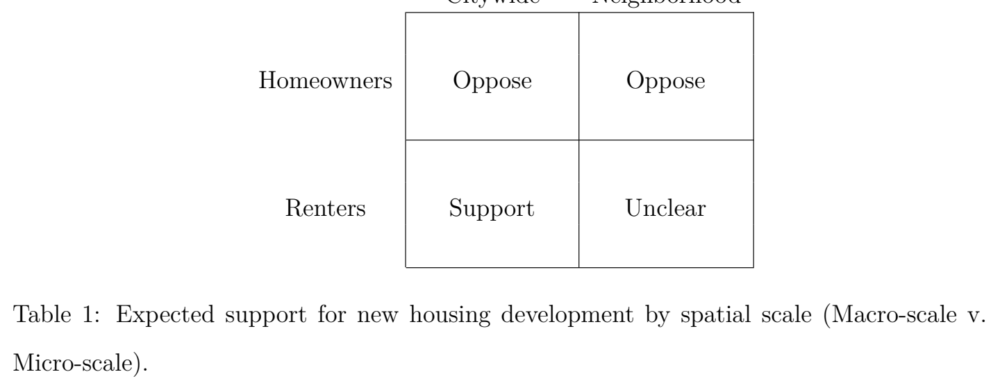

***Table 1.*** Expected support for new housing development by spatial scale (Macro-scale v. Micro-scale).

[Download data as CSV](tables/tab-01.csv)

This homeowner-renter typology sufficiently explains why housing is so hard to build in 13Compared to specific development, the housing supply in aggregate tends to evoke more partisan attitudes, particularly around subsidized affordable housing (e.g. Effects of ideology in Appendix and Marble and Nall (2017)).

homeowner-dominated suburbs. Not only are homeowners the majority of suburban voters, but they tend to be socio-economically homogeneous and geographically stationary, facilitating mobilization (DiPasquale and Glaeser, 1999; McCabe, 2016; Oliver and Ha, 2007). Likewise, the limited scope of suburban policy leads politics to largely revolve around protecting home values (Fischel, 2001; Nguyen-Hoang and Yinger, 2011). Where these existing theories do not translate is to majority-renter central cities where the housing supply has grown increasingly inelastic. In cities like San Francisco and New York, not only do homeowners make up fewer than one-third of the population, but they do not enjoy the same benefits of homogeneity and ‘home-value focused’ politics as their suburban counterparts. Still, cities once viewed as growth-focused (Logan and Molotch, 1987; Peterson, 1981; Stone, 1989) have seen a slowdown of housing construction despite rising demand.14 Though variation in new supply within New York City has been linked to the homeownership rate of individual neighborhoods (Been, Madar, and McDonnell, 2014), why housing has grown increasingly difficult to build in majority-renter cities is poorly explained by current political economy theory. The following surveys unpack the attitudes behind this unexplained trend, a first step to understanding the larger behaviors behind NIMBYism.

## 2 City-Specific Test

To understand why majority-renter cities have increasingly restricted their housing supply, I surveyed 1,660 voters during the San Francisco municipal election in November 2015. 14The housing supply is only one aspect of ‘growth’, with regime theory (Stone, 1989) and the growth machine (Logan and Molotch, 1987) generally more focused on commerce and jobs. In a way, housing has always fit oddly in the pursuit of generic growth. From a public choice perspective, the ideal city is either a luxury bedroom suburb or a non-residential industrial city, both securing favorable tax balances (Peterson, 1981). Either way, both ideal cities would likely involve highly restricted housing supplies.

The exit poll provided a rare opportunity to capture attitudes and behaviors towards housing among voters. First, respondents voiced their opinions on actual policies with real consequences if passed. Second, these policies were debated over several months of campaigning, allowing respondents to form considered opinions rather than ‘top of the head’ responses (Zaller, 1992). Third, many argued that housing was the dominant issue of the election (Brooks and Pickoff-White, 2015; Diaz, 2015; Green, 2015)15, leading the voting population to be particularly aware, informed, and interested in the survey topic. This awareness coupled with the time and resources spent voting in an off-cycle election suggest that the sampled population was similar to those willing to attend a planning meeting or influence housing policy outside of the voting booth, heightening the findings’ external validity in non-ballot cities. Finally, though San Francisco is not the average American city, this survey was designed to unpack housing attitudes within other highly-regulated urban cores, such as Los Angeles and New York City. The left-lean of these other inelastic cities improves the generalizability of the San Francisco results.16

15“November Ballot Could Decide Housing Future of S.F.” (Green, 2015). “Housing is No. 1 Issue in City Election” (Diaz, 2015). “It was an off-year election, but in San Francisco one critical issue overarched a string of contests, as several propositions on the ballot were meant to address topic No. 1 in the city: housing affordability, or the lack thereof” (Brooks and Pickoff-White, 2015).

16One concern with using San Francisco data is rent control, which insulates renters from the direct pressure of rising prices. While approximately 70 percent of San Francisco renters live in rent-controlled apartments, these renters still face price pressures via the Ellis Act, which allows landlords to evict tenants by converting rental units to ownership units. Since 2010, Ellis Act evictions have increased steadily, amounting to 2,134 evictions in 2015 alone (Sabatini, 2016 Mar. 29). While rent control status was not recorded in the original survey, I gathered rent control data from 152 recontacted respondents. Comparing renters by rent control status found little variation in demographics or attitudes towards housing (see

On Election Day, 65 pollsters were stationed outside of 26 polling locations. Over 45 percent of voters approached agreed to complete the survey, totaling 1,660 surveys. Respondents were asked their vote choice on four of the ballot propositions as well if they would support a 10 percent increase in the city’s housing supply.17 The purpose of this survey was not to estimate the exact share of San Francisco voters supporting each policy, but rather to see how attitudes towards housing shift across demographic covariates.18

To measure support for new housing citywide (macro-scale), I asked respondents if they would vote in favor of a 10 percent increase in the city’s housing supply:

“If there were a proposition to build 10% more housing in San Francisco, how would you vote on that proposition?”

Among the sampled voters, 73 percent of homeowners and 84 percent of renters supported a 10 percent increase in the city’s housing supply. Not only are both shares exceptionally large, but the effect of homeownership was not statistically significant when controlling for demographics (Appendix Table A.3).

To measure support in one’s own neighborhood (micro-scale), I leveraged Proposition I which proposed to halt the development of new housing in the gentrifying Mission District for at least 18 months (Budget and Office, 2015).19 Under this proposition, new housing Appendix).

17A full description of the survey instrument is printed in the Appendix.

18Descriptive statistics of the survey’s representativeness are included in the Appendix (Table A.1 and Table A.2). Each proposition’s vote total among respondents is on average within 6 points of the final vote total citywide.

19For perspective on the neighborhood’s gentrification, a 2015 report commissioned by the San Francisco Board of Supervisors finds that the Mission’s Hispanic/Latino population has decreased from 60 percent in 2000 to 48 percent in the 2009-2013 American Community

would only be permitted if it consisted of fewer than 6 units or were composed entirely of units set aside for low- and middle-income residents. For proposition supporters, these requirements would slow gentrification by securing remaining land for affordable housing. To opponents, the proposition would only accelerate price appreciation by cutting off new supply. I leveraged this proposal to measure support for housing at the micro-scale by offering respondents the opportunity to pass a similar ban in their own neighborhood:

“If a similar ban were proposed for your neighborhood, how would you vote?”20

Given the literature on NIMBYism, homeowners should seize this free opportunity to block new housing in their own neighborhood (Fischel, 2001). Thus, I not only expected a high level of support among homeowners, but that homeowners would show a far greater level of support than renters. Instead, only 40 percent of homeowners chose to support a neighborhood ban compared to 62 percent of renters. Put differently, 30 percent more renters supported the neighborhood ban than homeowners. This gap between homeowners and renters holds to 9 points when controlling for demographics including income, ethnicity, and ideology (Appendix Table A.3). Even dividing respondents by their support for the 10 percent increase in supply citywide, 37 percent of ‘pro-supply’ homeowners supported the ‘NIMBY’ ban compared to 52 percent of pro-supply renters, a gap which also holds with demographic controls (Figure 1).

These results are surprising and highly counterintuitive. Not only does neighborhood Survey window, with a projected decrease to 31 percent by 2025. Over the same period, the neighborhood experienced larger decreases in middle-income households and larger increases in upper-income households compared to the rest of San Francisco (Budget and Office, 2015). 20Support for such a ban had a .81 correlation with Proposition I reported vote choice. Predictors within the model look largely the same between Proposition I and the neighborhood ban, with renters out-supporting homeowners.

Pro−Supply Anti−Supply 0.8

0.6

0.4

0.2

0.0

Homeowners Renters Homeowners Renters Tenant

)tnecreP(

troppuS

Support for Micro−scale Ban by Support for Macro−scale Supply

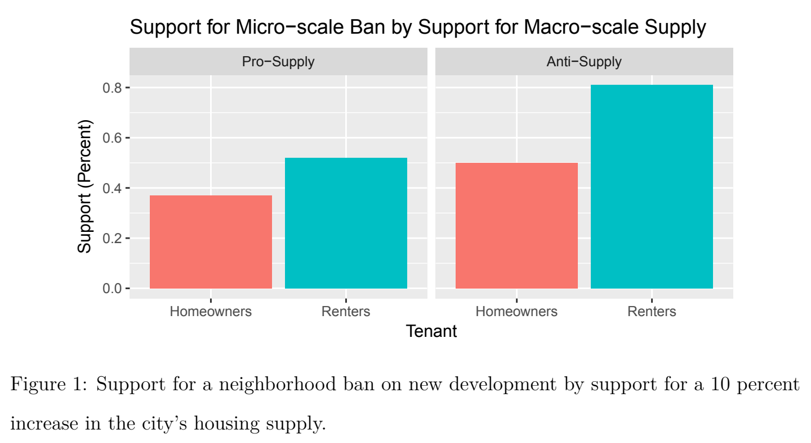

***Figure 1.*** Support for a neighborhood ban on new development by support for a 10 percent increase in the city’s housing supply.

opposition among renters outpace that of supposedly NIMBY homeowners, but the same renters show greater support for new housing citywide. Why does renter opinion differ so dramatically when asking about the macro-scale versus micro-scale? One reason may be a fear of supply-induced gentrification, a spatial threat of nearby individual developments. Imagine you are a renter in a city with high housing prices, living in one of the few remaining affordable neighborhoods. On your street, a new market rate condominium is proposed. Generally, you believe that new supply helps to mitigate rising prices. However, this one condominium would be a minuscule addition to the overall supply, making it unlikely to appreciably lower prices citywide. Instead, the new building is more likely to signal to other developers that your neighborhood is an undervalued investment. Your landlord may see the new building and consider selling or renovating her own, leading to higher rents or even eviction. In short, the long-run benefit of more supply is eclipsed by the immediate, short-run threat of displacement.

While the level of renter NIMBYism was the most striking finding, both homeowners and renters in the exit poll showed scale-dependent preferences. For these voters, housing presents a collective action problem: broad support exists for housing citywide, but new development

is unpopular in the respondent’s own neighborhood. Accordingly, San Francisco’s permitting process may yield contrasting levels of support for new housing depending on scale of decision making. Still, the exit poll results are limited to one city. Testing these theories requires a more diverse sampling frame, as well as experimental methods to directly measure the effect of spatial proximity. Likewise, a second survey would show whether the exit poll findings replicate across samples.

## 3 National Survey

To test these theories across diverse environments, I conducted a 3,019 respondent national survey of attitudes, capturing residents of 655 municipalities across 47 states.21 Administered by the online data collection firm GfK, this national survey sampled respondents from 4,068 ZIP codes in which the local government both has clear control over housing policy and no other local governments are nested within.22 From these ZIP codes, respondents received a survey composed of a conjoint experiment and policy proposal similar to that 21The survey was fielded from July 7 to July 17, 2016. As a cross-referencing measure, I recruited 152 of the exit poll respondents to also complete the national survey (See Appendix). These recontacted respondents are not part of the 3,019 respondent national sample.

22For example, Los Angeles County has a local government which regulates its own housing supply. The county contains 88 independent municipalities. For residents who live in Los Angeles County but not within an incorporated municipality, proposing a 10 percent increase in the housing supply could raise complications of where the county has jurisdiction, where municipal boundaries exist, who would absorb any new tax burden, and what locations would be eligible for development. For this reason, ZIP codes in unincorporated areas were removed from the sample. A comparison of the sampled respondents compared to their average ZIP code demographics is included in the Appendix, with sampled respondents more likely to be homeowners, wealthier, and whiter than the sampling frame’s average.

found in the San Francisco exit poll. The order of these items was randomized.23

A form of survey experiment, a choice-based conjoint experiment is a series of tasks where respondents are presented with two options and asked which of the two they prefer (Hainmueller, Hopkins, and Yamamoto, 2014). For this survey, the two options presented were hypothetical housing developments proposed for the respondent’s city/town. Each development was described by a set of seven attributes, such as the building’s height and number of units. While the same attributes were included in all proposals, the attribute levels were randomly drawn from a set of potential levels. For instance, the height of each proposed building randomly varied between 2 stories and 12 stories (See Figure 2 for an example of the conjoint task).

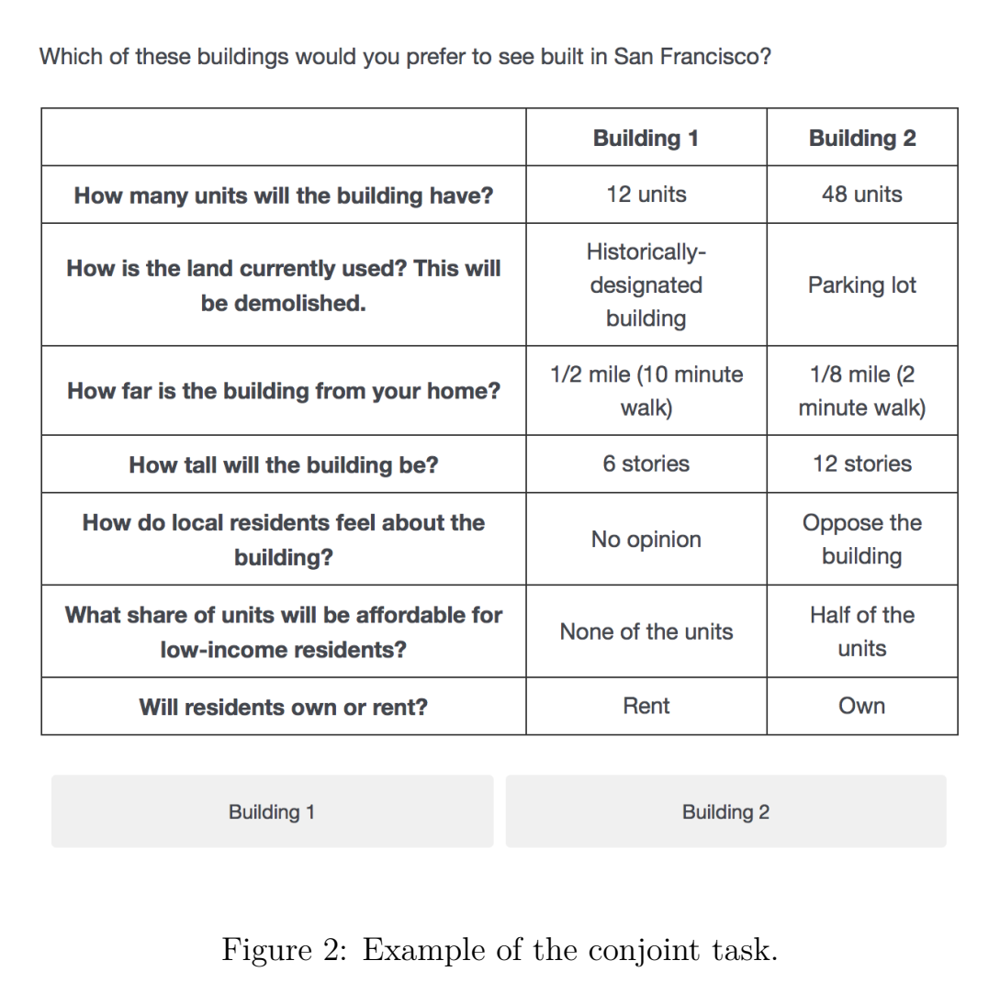

***Figure 2.*** Example of the conjoint task.

23See Table B.4 in Appendix for descriptive statistics.

For this conjoint, seven attributes were chosen to provide information that residents often use to decide whether they support a proposed development.24 For example, to measure support for affordable housing, the share of units set aside as affordable to low-income residents varied between 0 percent and 100 percent. NIMBYism was tested by varying the distance from the proposal to the respondent’s home. Other attributes included community support, the current site conditions, and whether the tenants would be homeowners or renters. Table 2 contains the complete list of attributes and attribute levels used in the experiment.25

By having respondents choose between two randomly generated buildings, I can estimate the effect of changing a specific building attribute on the support a building would receive. To capture variation across demographic groups, I subset the sample by respondent characteristics, such as homeownership status. Together, the conjoint design’s bundling of treatments not only allows for the experimental testing of multiple hypotheses, but also reduces social desirability bias by providing many potential reasons for supporting or opposing a proposed development.26

Along with the conjoint experiment, respondents answered questions pertaining to a 10 percent increase in their city/town’s housing supply. For concreteness, I used each respondent’s ZIP code to pipe in their municipality’s name, the number of existing housing units in their city/town, and the number of new units that would be permitted with a 10 percent 24The order of attributes was randomized across respondents but held fixed within respondent for consistency.

25See Appendix for explanations of the selected attribute levels.

26Because the attribute levels are fully randomized, the conjoint estimates avoid parametric modeling assumptions. Still, controlling for demographic variation via subsetting quickly constrains sample size, limiting the number of ‘controls’ that can be used. As a result, comparisons between homeowners and renters are limited in their ability to control for alternative explanations, such as income or ethnicity.

Table 2: Attributes and Levels

### 1. How far is the building from your home?

(a) 2 miles (40 minute walk) - baseline condition (b) 1 mile (20 minute walk)

(c) 1/2 mile (10 minute walk)

(d) 1/8 mile (2 minute walk)

### 2. How do local residents feel about the building?

(a) No opinion - baseline condition

(b) Support the building

(c) Oppose the building

### 3. What share of units will be affordable for low-income residents?

(a) None of the units - baseline condition (b) One-quarter of the units

(c) Half of the units

(d) All of the units

### 4. How tall will the building be?

(a) 2 stories - baseline condition

(b) 3 stories

(c) 6 stories

(d) 12 stories

5. How is the land currently used? This will be demolished. (a) Empty building - baseline condition (b) Parking lot

(c) Historically-designated building

(d) Open field

### 6. Will residents own or rent?

(a) Own - baseline condition

(b) Rent

### 7. How many units will the building have?

(a) 12 units - baseline condition

(b) 24 units

(c) 48 units

(d) 96 units

increase in supply.27 Respondents were asked their support for this citywide supply increase on a 7-point scale from ‘Strongly Oppose’ to ‘Strongly Support’. To measure support for a neighborhood ban on development, respondents were also asked:

“Would you support a ban on the construction of new housing (homes and apartments) in your neighborhood?”

Again, support was measured on a 7-point scale from ‘Strongly Oppose’ to ‘Strongly Support’.

## 4 National Results

### 4.1 NIMBYism

Starting with the macro-scale, renters are expected to be more supportive of increases in the citywide housing supply than homeowners. To resemble a ballot initiative similar to the exit poll, I convert the 7-point scale to a binary variable of support.28 Within the national survey, homeowners show a 31 percentage point decrease in support for new supply compared to renters, with 28 percent of homeowners supporting the citywide policy compared to 59 percent of renters. This effect holds to a 21 point difference with the inclusion of demographic controls and municipal fixed effects (Appendix Table B.5).

Shifting to the micro-scale, homeowners are expected to exhibit NIMBYism whereas 27See Appendix for an example prompt.

28I dichotomize support by removing the middle ‘Neutral’ option and collapsing the top three ‘Support’ and bottom three ‘Oppose’ responses into votes in favor of and votes against the proposal. The final variable is a binary: ‘1’ in support of new supply and ‘0’ for against new supply. Results using the original 7-point scale do not substantively differ (See Appendix).

renter attitudes are unclear. To measure NIMBYism, I use the conjoint’s spatial proximity attribute: “How far is the building from your home?”. Because of the stigma associated with affordable housing (Danielson, 1976; Tighe, 2010), I separate buildings containing some share of affordable housing (‘Affordable’) from those without any units set aside for low-income residents (‘Market Rate’).29

Homeowners, Proximity by Affordability

2 miles (40 minute walk) l

1 mile (20 minute walk) l

Affordable

1/2 mile (10 minute walk) l l Market−Rate

1/8 mile (2 minute walk) l

−0.2 −0.1 0.0 0.1 0.2

Change in Probability Building Preferred

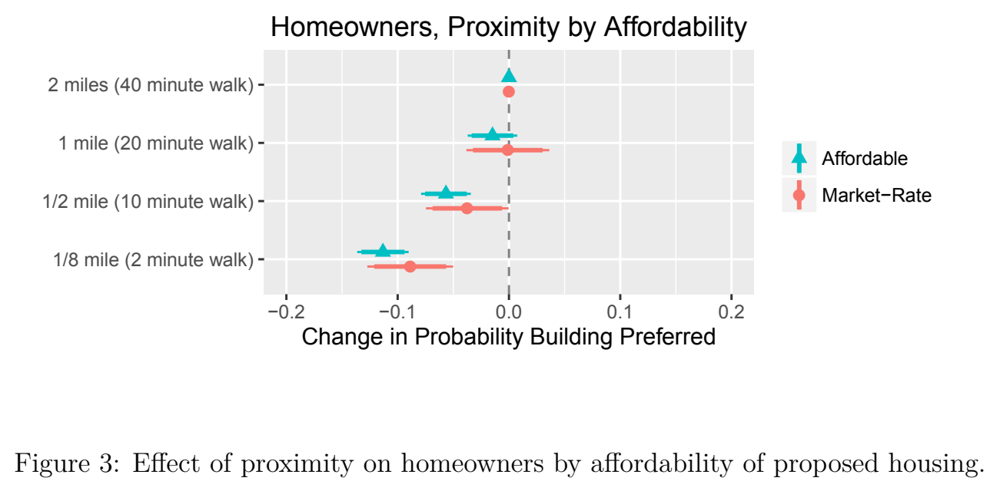

***Figure 3.*** Effect of proximity on homeowners by affordability of proposed housing.

Figure 3 shows the effect of proximity on support for these two types of buildings among homeowners. Each attribute level’s effect can be thought of as the change in support for a building compared to the baseline level. For proximity, the baseline of ‘2 miles away’ is presented at the top of the chart with a point estimate of ‘0’.30 Moving down, the point estimates and 95 percent confidence intervals show the effect of each attribute level compared 29Other cut points of affordability are displayed in Appendix Figure C.4. For both homeowners and renters, ‘All of the units’ and ‘None of the units’ buildings are more similar to each other than those in between. If anything, this moderates the effect of splitting buildings into simply ‘Affordable’ and ‘Market Rate’.

30During cognitive testing of a pilot survey, 2 miles was a distance which would almost never elicit a NIMBY response, even among respondents in rural areas.

to this baseline.31

For homeowners sampled, moving a building from 2 miles away to 1 mile away decreases support by a few percentage points for affordable housing, but the change is not statistically significant at α =.05. However, moving from 2 miles away to a 1/2 mile away lowers support by approximately 5 points for both types of housing and is statistically significant. The largest effect is found at 1/8 mile away, where market rate housing experiences an 8 point drop in support while affordable housing has a 12 point drop in support, all else equal.32 This spatial sensitivity to development matches homeowners’ NIMBY reputation and remains consistently around 10 points across demographic groups, including income (Appendix Figure C.2) and ideology (Appendix Figure C.3).

Renters, Proximity by Affordability

2 miles (40 minute walk) l

1 mile (20 minute walk) l

Affordable

1/2 mile (10 minute walk) l l Market−Rate

1/8 mile (2 minute walk) l

−0.2 −0.1 0.0 0.1 0.2

Change in Probability Building Preferred

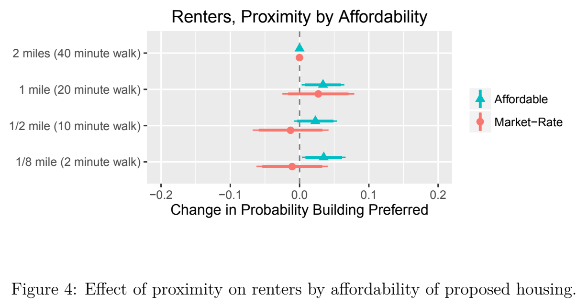

***Figure 4.*** Effect of proximity on renters by affordability of proposed housing.

31Because these distances are smaller than 2 miles away, a negative effect represents a decrease in support as the building moves closer to the respondent. In other words, any point estimate to the left of zero shows NIMBYism.

32To compare, the largest conjoint effect for homeowners is a 16 point decrease when shifting from 2 stories tall to 12 stories tall. For renters, this height shift elicits a 7 point decrease in support.

But while homeowner NIMBYism is well theorized, renter NIMBYism is not. Despite the surprising exit poll results, Figure 4 shows that renters do not in aggregate exhibit NIM- BYism towards new housing. If anything, renters show a positive YIMBY (‘Yes In My Back Yard’) attitude towards affordable housing, with support increasing the closer the building is to their home. Supporting this micro-scale gap between homeowners and renters is the more blunt NIMBY measure of the banning new development in the respondent’s neighborhood: “Would you support a ban on the construction of new housing (homes and apartments) in your neighborhood?”

Unsurprisingly, homeowners show greater support for this NIMBY ban than renters, with 42 percent of homeowners supporting the ban compared to 35 percent of renters, a gap which holds when controlling for demographics (Appendix Table B.7).

### 4.2 NIMBYism across Markets

But if renters in aggregate are not sensitive to spatial proximity, why were the renters in San Francisco more NIMBY than homeowners? Missing from these national results is the effect of context, where the respondent lives and their housing market. San Francisco’s NIMBYism may be limited to similarly high-rent cities where renters are anxious about prices and displacement. Of course, a respondent’s context can be defined by either the macroor micro-scale. On one hand, ZIP code as context provides an estimate of the renter’s immediate neighborhood. On the other hand, a renter in an expensive ZIP code likely has more affordable options should she become priced out of her current neighborhood. In contrast, a renter in an expensive city will likely have fewer affordable alternatives to chose from, heightening the threat of displacement. Thus, while the ZIP code provides precision,

the city as context better captures the gentrification threat behind renter NIMBYism.33

To gauge the role of context, I group renters into quintiles using June 2016 Zillow estimates for average rent citywide, allowing me to identify housing markets that resemble San Francisco.34 Figure 5 shows NIMBYism by isolating the change in support from 2 miles away to 1/8 mile away for each quintile of citywide rent. For affordable housing, renters do not exhibit NIMBYism in any quintile. But for market rate housing, renters in the top quintile display NIMBYism (12 point decrease in support) on par with that of homeowners (10 point decrease in support). This renter NIMBYism also exists when grouping renters by ZIP code average rent (Appendix Figure C.6) as well as when examining each level of affordability separately rather than compressed into ‘Affordable’ and ‘Market Rate’ categories (Appendix Figure C.5). In comparison, homeowner NIMBYism does not vary across quintiles (see Appendix Figure C.7), demonstrating the unique relationship between renters and their housing market at the micro-scale.

This renter NIMBYism is meaningful not just because of its size or systematic nature, but because renters in expensive cities do not show a decrease in support for new housing at the macro-scale. Returning to the proposal for a 10 percent increase in supply, renter support does not decrease in more expensive cities compared to more affordable ones (Figure 6).35 In other words, while renters in high-rent cities still support new housing at the macro-scale, they resemble homeowners when facing market rate housing at the micro-scale.

To test my mechanism, I gauge the role of gentrification in NIMBYism by asking respon- 33I provide ZIP code estimates in the Appendix and report their substantive significance in the text.

34Quintiles are defined based on entire sample, meaning the least expensive quintile for renters contains the same cities or ZIP codes as the least expensive quintile for homeowners. 35This resilience of support also holds across quintiles by ZIP code rent (Appendix Figure C.9). For homeowners, support for new supply does decrease as citywide rents increase (Appendix Figure C.10).

Most Expensive l

4th l

3rd l

2nd l

Least Expensive l

−0.2 −0.1 0.0 0.1 0.2 Change in Probability Building Preferred )selitniuQ(

ytiC

yb

tneR

egarevA

Renters, Proximity by Affordability and Average Rent by City

Affordable

l Market−Rate

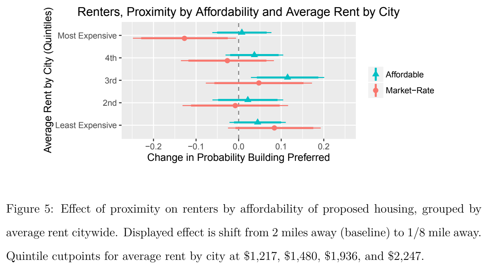

***Figure 5.*** Effect of proximity on renters by affordability of proposed housing, grouped by average rent citywide. Displayed effect is shift from 2 miles away (baseline) to 1/8 mile away. Quintile cutpoints for average rent by city at $1,217, $1,480, $1,936, and $2,247.

dents about their perspective on citywide housing prices.

“Think about the best interest of [CITY/TOWN]. Would it be best for average housing prices in [CITY/TOWN] to increase, decrease, or stay the same over the next five years? Assume that [CITY/TOWN]’s economy would stay the same.”36

From a 7-point scale of responses, I categorize renters supporting lower prices as ‘Price Anxious’, while those supporting stable or higher prices as ‘Price Neutral’. Figure 7 shows that NIMBYism towards market rate housing is prominent among ‘Price Anxious’ renters but not present among ‘Price Neutral’ renters. The same divergence does not occur when 36Referencing the stability of the economy separates price changes from economic shocks. Some respondents in pilot surveys wanted prices to drop, but believed that prices would only drop if the economy soured. Thus, the most they realistically preferred was for prices to remain stable.

Most Expensive l

4th l

3rd l

2nd l

Least Expensive l

0.00 0.25 0.50 0.75 1.00 Support for Supply (%)

)selitniuQ(

tneR

ytiC

egarevA

Renters Support for Supply Citywide, by Average Rent

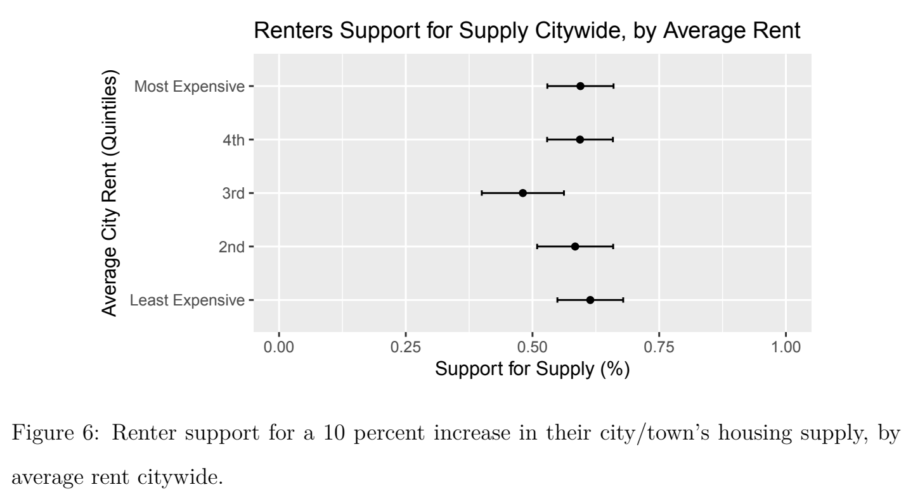

***Figure 6.*** Renter support for a 10 percent increase in their city/town’s housing supply, by average rent citywide.

comparing these groups’ preferences for affordable housing (Appendix Figure C.8). This link between NIMBYism and price anxiety supports the theory that renters in expensive cities view new market rate housing as a gentrification threat. More so, if non-financial factors like traffic, noise, and competition for parking spaces were the primary concerns among these renters, NIMBYism would not vary between affordable and market rate housing as the conjoint controls for all other development attributes. Instead, renter NIMBYism is directly targeted towards market rate housing and is strongly correlated with anxiety over housing prices.

Outside of the conjoint experiment, the survey also proposed a blanket ban on all development in the respondent’s neighborhood. Support for this ban does not significantly vary with market context. For homeowners, this lack of variation matches the conjoint’s stable level of NIMBYism. For renters, the lack of variation may stem from their general support for new housing, including mixes of market rate and affordable units in the same proposal. Instead, renter NIMBYism appears exclusively reserved for market rate housing.

Renters, Proximity by Price Anxiety (Market−Rate)

2 miles (40 minute walk)

1 mile (20 minute walk)

Price Neutral 1/2 mile (10 minute walk) Price Anxious 1/8 mile (2 minute walk)

−0.2 −0.1 0.0 0.1 0.2

Change in Probability Building Preferred

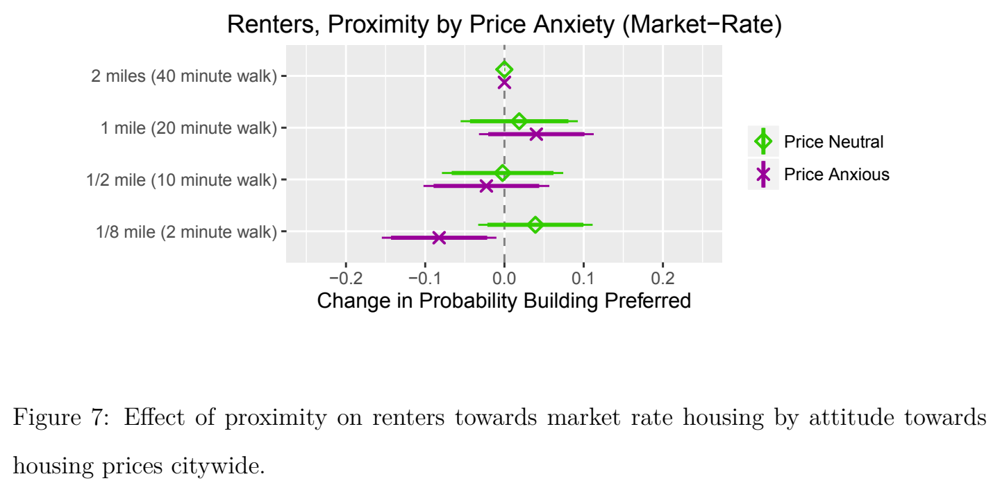

***Figure 7.*** Effect of proximity on renters towards market rate housing by attitude towards housing prices citywide.

## 5 Discussion

I have presented the first empirical measurements of housing NIMBYism at the individual level37 and the first experimental tests of NIMBYism by varying the spatial proximity of the land use, all else equal.38 By comparing support for housing citywide to opposition in one’s own neighborhood, I have shown how spatial scale directly affects policy support. Specifically, renters in high-rent cities support housing in aggregate but exhibit NIMBYism on par with homeowners when facing market rate housing in their own neighborhood. These scale-dependent preferences are reserved for market rate housing, not affordable housing, 37Gerber and Phillips (2003) use precinct-level returns on housing propositions.

38Marks and von Winterfeldt (1984) experimentally vary the site an offshore oil drilling facility between the Coast of Southern California and the Gulf of Mexico and measure respondents’ perceived risk of a large oil spill. However, this variation is more than just spatial proximity, meaning the treatment effect may capture more than just NIMBYism. Kraft and Clary (1991) capture non-housing NIMBYism at the individual level, but do not do so experimentally.

and are correlated with anxiety over housing prices, signaling that renters are responding to the spatial threat of gentrification.

While I have framed NIMBYism in terms of economic self-interest, there are competing explanations. For instance, respondents may oppose nearby housing to limit noise, congestion, and other neighborhood changes that would harm their quality of life.39 Unfortunately for the study of homeowners, quality of life factors are reflected in a home’s value. Consequently, these results cannot separate the influence of preserving quality of life from protecting one’s home value in homeowner NIMBYism. However, for renters, the NIMBYism observed can be attributed directly to economic self-interest for two reasons. First, were renters concerned exclusively about quality of life, I would expect to observe NIMBYism toward both market rate and affordable housing, all else equal. However, because the conjoint experiment measures the effect of price across all other traits, the experiment shows that renters only express NIMBYism towards market rate housing, not units with affordable housing which would have the same noise, congestion, and quality of life effects as the market rate housing. Second, within the entire conjoint sample, renter NIMBYism is strongly correlated with price anxiety, the belief that it would be best for housing prices to decrease citywide. This relationship matches the mechanism of gentrification fears discussed above. Were renters responding to quality of life concerns, I would not expect a relationship between NIMBYism and housing price concerns nor one that responds only to market rate housing. One question that emerges from these findings is why would homeowners in high-rent cities oppose housing that renters think may increase nearby housing costs? This tension comes from both group’s risk aversion. Any new development presents a downside risk. For homeowners, that is the risk of lost equity, for renters in high-rent cities it is the risk of displacement. Given the behavioral tendency to overemphasize losses compared to gains (Kahneman and Tversky, 1979), homeowners are unlikely to accept this downside risk, especially in an environment where the status quo is already rewarding. While counterintuitive, 39I would like to thank a reviewer for building out this line of reasoning.

Fischel (2001) describes homeowner risk aversion as a focus not on the expected effect of the development, but on the variance.40 My theory extends this risk aversion from suburban homeowners to not only all homeowners, but to renters in high-rent cities. This risk aversion leads renters to support housing at the macro-scale, but to oppose it at the micro-scale due to the threat of gentrification.

Be it homeowners or renters, these scale-dependent preferences matter because of the decision making process. When institutions shift power from the macro-scale to the micro-scale, they empower NIMBY opposition. Neighborhood planning boards provide a forum where local opponents with much to lose from each project often outnumber citywide supporters with little to gain from any one development. Even if most residents support new supply citywide, the ability to oppose specific developments grows when micro-scale institutions do not have a macro-scale counterweight. These shifts of influence to the micro-scale risk the ‘local trap’, where increases in micro-scale democracy ignore their macro-scale consequences (Purcell, 2006). Similar consequences exist at the metropolitan-level, where the decisions of any one municipality to block new housing spillover to the next, driving a regulatory race throughout the region (Brueckner, 1995, 1998). Be it the neighborhood within the city or the municipality within the metropolitan area, scale-dependent preferences plus micro-scale institutions foster collective action problems. Although this paper is limited to observing NIMBYism at one point in time, future research should work to capture longitudinal variation in NIMBYism. In theory, as more cities experience rising prices, renter NIMBYism may spread, causing a policy feedback further constraining supply.41 Likewise, for the institutional mechanism, future work should test the effects of shifting decision making from the macro- to the micro-scale on permitting over time.

40“NIMBYism is weird only if you think solely about the rationally expected outcomes from development. NIMBYism makes perfectly good sense if you think about the variance in expected outcomes...” (Fischel, 2001).

41I would like to thank a reviewer for this implication of my findings.

But if support for new housing exists citywide, why are existing citywide institutions like the city council unable to build a coalition for new housing? Be it a lack of strong local parties (Schleicher, 2013) or the localized incentives of ward-based elections (Banfield and Wilson, 1963; Clingermayer, 1993, 1994; Schneider and Teske, 1993), structural factors have been blamed for discouraging legislators from pursuing such citywide goals with spatially concentrated costs. In response, solutions that diminish neighborhood voice, such as a stronger centralized body or at-large elections, are politically problematic. Not only are at-large elections argued to dilute minority representation (Jones, 1976; Welch, 1990), but advocacy groups continue to use the Voting Rights Act to successfully challenge at-large systems (Childress, 2013; Fernandez, 2017). Coupling this momentum with the legacy of top-down urban renewal, voters are likely to see any reform limiting neighborhood voice as a step backwards.

Instead, reforms could harness citywide support for new housing through ballot initiatives and citywide campaigns, expanding the scope of conflict (Schattschneider, 1960). Proposals like the 10 percent supply increase suggest that citywide support exists, particularly among more liberal voters (See Appendix). And while NIMBYism may be appropriate in some cases, using macro-scale support to set a budget of development citywide would allow the macro-scale institution to weigh the costs and benefits of building in one location versus the other (Hills and Schleicher, 2011). But while citywide supply may succeed at the ballot, implementation would be challenging. Residents may support supply in aggregate because it is difficult to visualize compared to the individual developments used in the conjoint experiment. If true, then support for housing may evaporate as soon as individual neighborhoods and streets are selected for the new buildings. A balance may come from the macro-scale institution defining of how much each neighborhood has to build. Then, a micro-scale institution would be given control over where their share of housing goes in their neighborhood. This plan not only limits NIMBY defection and free-riding, but also preserves neighborhood influence in how the allocation is met. Likewise, the small size and homogeneous nature

of most neighborhoods would limit the power imbalances usually found in citywide debates over where new housing should be built.

Finally, space should exist to debate the merits of NIMBYism. The high stakes of local change spur political mobilization. This paper has highlighted the risks of NIMBYism to the housing supply. However, NIMBY protests were also able to spare countless neighborhoods from mid-century highway development (Altshuler and Luberoff, 2003). Indeed, some housing developments may also be inappropriate for their context. More broadly, there may be times the micro-scale should have veto power over a land use. Or, the micro-scale should be compensated by other jurisdictions which are able to free-ride. Efforts to design institutional reforms will have to address these normative aspects of NIMBYism, including historic inequality which has led to the clustering of low-income and minority communities least able resist locally unwanted land uses (Massey and Denton, 1993).

## 6 Conclusion

In response to the deepening affordability crisis, this paper measures the effect of spatial scale on policy support. Doing so, I have not only conducted the first experimental tests of housing NIMBYism, but also created a framework for thinking about the macro- and micro-scale of other spatially-based policy, from siting energy facilities to social service centers. For housing, macro-scale support does not always translate into micro-scale support, particularly in cities that need new housing the most. When combined with increases in micro-scale political power, these scale-dependent preferences set up political failure: the undersupply of a resource supported in aggregate. For policies to match majoritarian preferences, institutions should be designed to account for the spatial imbalance of costs and benefits. When preferences are scale-dependent, the scale of decision making matters.

## References

Altshuler, Alan A., and David E. Luberoff. 2003. Mega-Projects: The Changing Politics of Urban Public Investment. Washington, DC: Brookings Institution Press.

Angotti, Tom. 2008. New York For Sale: Community Planning Confronts Global Real Estate. Cambridge, MA: MIT Press.

Autor, David H., Christopher J. Palmer, and Parag A. Pathak. 2014. “Housing Market Spillovers: Evidence from the End of Rent Control in Cambridge, Massachusetts.” Journal of Political Economy 122(3): 661–717.

Banfield, Edward C., and James Q. Wilson. 1963. City Politics. Cambridge, MA: Harvard University Press.

Been, Vicki. 2010. “Community Benefits Agreements: A New Local Government Tool or Another Variation on the Exactions Theme?” University of Chicago Law Review 77(1): 5– 35.

Been, Vicki, Josiah Madar, and Simon McDonnell. 2014. “Urban Land-Use Regulation: Are Homevoters Overtaking the Growth Machine?” Journal of Empirical Legal Studies 11(2): 227–265.

Berry, Jeffrey M., Kent E. Portnoy, and Ken Thomson. 1993. The Rebirth of Urban Democracy. Washington, D.C.: Brookings Institution.

Betancur, John J. 2002. “The Politics of Gentrification: The Case of West Town in Chicago.” Urban Affairs Review 37(6): 780–814.

Brooks, Jon, and Lisa Pickoff-White. 2015. “S.F. Election: Lee Re-elected, Peskin Wins, Aribnb Curbs Fail.” KQED News .

Brueckner, Jan K. 1995. “Strategic Control of Growth in a System of Cities.” Journal of Public Economics 57(3): 393–416.

Brueckner, Jan K. 1998. “Testing for Strategic Interaction Among Local Governments: The Case of Growth Controls.” Journal of Urban Economics 44(3): 438–467.

Budget, and Legislative Analyst’s Office. 2015. Policy Analysis Report: Displacement in the Mission District. Technical report City and County of San Francisco San Francisco, CA: . Carlino, Gerald A., Satyajit Chatterjee, and Robert M. Hunt. 2007. “Urban Density and the Rate of Invention.” Journal of Urban Economics 61(3): 389–419.

Charette, Allison, Chris Herbert, Andrew Jakabovics, Ellen Tracy Marya, and Daniel T. McCue. 2015. “Projecting Trends in Severely Cost-Burdened Renters: 2015-2025.”.

Chetty, Raj, and Nathaniel Hendren. 2015. The Impacts of Neighborhoods on Intergenerational Mobility: Childhood Exposure Effects and County-Level Estimates. Technical report National Bureau of Economic Research Working Paper No. 23002.

Chetty, Raj, Michael Stepner, and Sarah Abraham. 2016. “The Association Between Income and Life Expectancy in the United States, 2001-2014.” Journal of the American Medical Association 315(16): 1750–1766.

Chetty, Raj, Nathaniel Hendren, Patrick Kline, and Emmanuel Saez. 2014. “Where is the Land of Opportunity? The Geography of Intergenerational Mobility in the United States.” Quarterly Journal of Economics 129(4): 1553–1623.

Childress, Sarah. 2013. “After Shelby, Voting-Law Changes Come One Town at a Time.” PBS Frontline .

Ciccone, Antonio, and Robert E. Hall. 1996. “Productivity and the Density of Economic Activity.” American Economic Review 86(1): 54–70.

Clingermayer, James C. 1993. “Distributive Politics, Ward Representation, and the Spread of Zoning.” Public Choice 77(4): 725–738.

Clingermayer, James C. 1994. “Electoral Representation, Zoning Politics, and the Exclusion of Group Homes.” Political Research Quarterly 47(4): 969–984.

Danielson, Michael N. 1976. The Politics of Exclusion. New York, NY: Columbia University Press.

Dear, Michael. 1992. “Understanding and Overcoming the NIMBY Syndrome.” Journal of the American Planning Association 58(3): 288–300.

Desmond, Matthew. 2016. Evicted: Poverty and Profit in the American City. New York, NY: Crown Publishers.

Diaz, John. 2015. “Housing Is No. 1 Issue in City Election.” San Francisco Chronicle .

DiPasquale, Denise, and Edward L. Glaeser. 1999. “Incentives and Social Capital: Are Homeowners Better Citizens?” Journal of Urban Economics 45(2): 354–384.

Fernandez, Manny. 2017. “In Texas, a Test of Whether the Voting Rights Act Still Has Teeth.” New York Times .

Fischel, William A. 2001. The Homevoter Hypothesis: How Home Values Influence Local Government Taxation, School Finance, and Land-Use Policies. Cambridge, MA: Harvard University Press.

Fischel, William A. 2016. The Rise of the Homevoters: How the Growth Machine Was Subverted by OPEC and Earth Day. Working paper Darthmouth College.

Fischer, Frank. 1993. “Citizen Participation and the Democratization of Policy Expertise: From Theoretical Inquiry to Practical Cases.” Policy Sciences 26(3): 165–187.

Frieden, Bernard J. 1979. The Environmental Protection Hustle. Cambridge, MA: MIT Press.

Ganong, Peter, and Daniel Shoag. 2015. Why Has Regional Income Convergence in the US Declined? Technical report Harvard Kennedy School Working Paper No. RWP 12-028. Gerber, Elisabeth R., and Justin H. Phillips. 2003. “Development Ballot Measures, Interest Group Endorsements, and the Political Geography of Growth Preferences.” American Journal of Political Science 47(4): 625–639.

Glaeser, Edward L., and Bryce A. Ward. 2009. “The Causes and Consequences of Land Use Regulation: Evidence from Greater Boston.” Journal of Urban Economics 65(3): 265–278. Glaeser, Edward L., and David C. Maré. 2001. “Cities and Skills.” Journal of Labor Economics 19(2): 316–342.

Glaeser, Edward L., and Joseph Gyourko. Forthcoming. “The Economic Implications of Housing Supply.” Journal of Economic Perspectives .

Glaeser, Edward L., and Matthew E. Kahn. 2010. “The Greenness of Cities: Carbon Dioxide Emissions and Urban Development.” Journal of Urban Economics 67(3): 404–418.

Glaeser, Edward L., Joseph Gyourko, and Raven E. Saks. 2005a. “Why Have Housing Prices Gone Up?” American Economic Review 95(2): 329–333.

Glaeser, Edward L., Joseph Gyourko, and Raven E. Saks. 2005b. “Why Is Manhattan So Expensive? Regulation and the Rise in Housing Prices.” Journal of Law and Economics 48(2): 331–369.

Green, Emily. 2015. “November Ballot Could Decide Housing Future of S.F.” San Francisco Chronicle .

Gross, Julian. 2007. “Community Benefits Agreements: Definitions, Values, and Legal Enforceability.” Journal of Affordable Housing & Community Development Law , 35–58.

Gyourko, Joseph, and Albert Saiz. 2006. “Construction Costs and the Supply of Housing Structure.” Journal of Regional Science 46(4): 661–680.

Hackworth, Jason, and Neil Smith. 2001. “The Changing State of Gentrification.” Tijdschrift voor economische en sociale geografie 92(4): 464–477.

Hainmueller, Jens, Daniel J. Hopkins, and Teppei Yamamoto. 2014. “Causal Inference in Conjoint Analysis: Understanding Multidimensional Choices via Stated Preference Experiments.” Political Analysis 22(1): 1–30.

Hills, Jr., Roderick J., and David N. Schleicher. 2011. “Balancing the “Zoning Budget”.” Case Western Reserve Law Review 62(1): 81–133.

Hsieh, Chang-Tai, and Enrico Moretti. 2017. Housing Constraints and Spatial Misallocation. Technical report National Bureau of Economic Research Working Paper No. 21154.

Ihlanfeldt, Keith R. 2007. “The Effect of Land Use Regulation on Housing and Land Prices.” Journal of Urban Economics 61(3): 420–435.

Jones, Christopher, and Daniel M. Kammen. 2014. “Spatial Distribution of U.S. Household Carbon Footprints Reveals Suburbanization Undermines Greenhouse Gas Benefits of Urban Population Density.” Environmental Science & Technology 48(2): 895–902.

Jones, Clinton B. 1976. “The Impact of Local Election Systems on Black Political Representation.” Urban Affairs Quarterly 11(3): 345–356.

Kahneman, Daniel, and Amos Tversky. 1979. “Prospect Theory: An Analysis of Decision Under Risk.” Econometrica , 263–291.

Kraft, Michael E., and Bruce B. Clary. 1991. “Citizen Participation and the NIMBY Syndrome: Public Response to Radioactive Waste Disposal.” Western Political Quarterly 44(2): 299–328.

Lake, Robert W. 1996. “Volunteers, NIMBYs, and Environmental Justice: Dilemmas of Democratic Practice.” Antipode 28(2): 160–174.

Logan, John R., and Harvey L. Molotch. 1987. Urban Fortunes. Berkeley, CA: University of California Press.

Marble, William, and Clayton Nall. 2017. Beyond “NIMBYism”: Why American Support Affordable Housing But Oppose Local Housing Development. Working paper Stanford University.

Marks, Gary, and Detlof von Winterfeldt. 1984. ““Not in My Back Yard”: Influence of Motivational Concerns on Judgments About a Risky Technology.” Journal of Applied Psychology 69(3): 408–415.

Massey, Douglas S., and Nancy A. Denton. 1993. American Apartheid: Segregation and the Making of the Underclass. Cambridge, MA: Harvard University Press.

Mayer, Christopher J., and C. Tsuriel Somerville. 2000. “Land Use Regulation and New Construction.” Regional Science and Urban Economics 30(6): 639–662.

McCabe, Brian J. 2016. No Place Like Home: Wealth, Community, and the Politics of Homeownership. New York, NY: Oxford University Press.

Nguyen-Hoang, Phuong, and John Yinger. 2011. “The Capitalization of School Quality into House Values: A Review.” Journal of Housing Economics 20(1): 30–48.

Oates, Wallace E. 1969. “The Effects of Property Taxes and Local Public Spending on Property Values: An Empirical Study of Tax Capitalization and the Tiebout Hypothesis.” Journal of Political Economy 77(6): 957–971.

Oates, Wallace E. 2005. “Property Taxation and Local Public Spending: The Renter Effect.” Journal of Urban Economics 57: 419–431.

Oliver, J. Eric, and Shang E. Ha. 2007. “Vote Choice in Suburban Elections.” American Political Science Review 101(03): 393–408.

Pendall, Rolf. 2000. “Local Land Use Regulation and the Chain of Exclusion.” Journal of the American Planning Association 66(2): 125–142.

Peterson, Paul E. 1981. City Limits. Chicago, IL: University of Chicago Press.

Purcell, Mark. 2006. “Urban Democracy and the Local Trap.” Urban Studies 43(11): 1921– 1941.

Quigley, John M., and Steven Raphael. 2005. “Regulation and the High Cost of Housing in California.” American Economic Review 95(2): 323–328.

Rauch, James E. 1993. “Productivity Gains from Geographic Concentration of Human Capital: Evidence from the Cities.” Journal of Urban Economics 34(3): 3–33.

Rognlie, Matthew. 2015. “Deciphering the Fall and Rise in Net Capital Share: Accumulation or Scarcity?” Brookings Papers on Economic Activity 46(1): 1–69.

Rohe, William M., and Lauren B. Gates. 1985. Planning with Neighborhoods. Chapel Hill, NC: University of North Carolina Press.

Rosenthal, Stuart S., and William C. Strange. 2008. “The Attenuation of Human Capital Spillovers.” Journal of Urban Economics 64(2): 373–389.

Sabatini, Joshua. 2016 Mar. 29. “San Francisco Evictions Continue to Rise Each Year Since 2010.” SF Examiner .

Saiz, Albert. 2010. “The Geographic Determinants of Housing Supply.” The Quarterly Journal of Economics 125(3): 1253–1296.

Salkin, Patricia, and Amy Lavine. 2008. “Understanding Community Benefits Agreements: Equitable Development, Social Justice and Other Considerations for Developers, Municipalities and Community Organizations.” UCLA Journal of Environmental Law & Policy 26: 291–331.

Schattschneider, Elmer E. 1960. The Semisovereign People: A Realist’s View of Democracy in America. Chicago, IL: Holt, Rinehart and Winston.

Schively, Carissa. 2007. “Understanding the NIMBY and LULU phenomena: Reassessing our knowledge base and informing future research.” Journal of planning literature 21(3): 255– 266.

Schleicher, David N. 2013. “City Unplanning.” Yale Law Journal 122: 1670–1737.

Schneider, Mark, and Paul Teske. 1993. “The Antigrowth Entrepreneur: Challenging the “Equilibrium” of the Growth Machine.” The Journal of Politics 55(03): 720–736.

Sears, David O., and Carolyn L. Funk. 1990. “The Limited Effect of Economic Self-interest on Political Attitudes of the Mass Public.” Journal of Behavioral Economics 19(3): 247–271. Singh, Gopal K., and Mohammad Siahpush. 2014. “Widening Rural–Urban Disparities in Life Expectancy, US, 1969–2009.” American Journal of Preventive Medicine 46(2): e19– e29.

Stokes, Leah C. 2016. “Electoral Backlash Against Climate Policy: a Natural Experiment on Retrospective Voting and Local Resistance to Public Policy.” American Journal of Political Science 60(4): 958–974.

Stone, Clarence N. 1989. Regime Politics: Governing Atlanta, 1946-1988. Lawrence, KS: University Press of Kansas.

Stone, Clarence N., Robert P. Stoker, John Betancur, Susan E. Clarke, Marilyn Dantico, Martin Horak, Karen Mossberger, Juliet Musso, Jefferey M. Sellers, Ellen Shiau, Harold Wolman, and Donn Worgs. 2015. Urban Neighborhoods in a New Era: Revitalization Politics in the Postindustrial City. Chicago, IL: University of Chicago Press.

Tiebout, Charles M. 1956. “A Pure Theory of Local Expenditures.” The Journal of Political Economy , 416–424.

Tighe, J. Rosie. 2010. “Public Opinion and Affordable Housing: A Review of the Literature.” Journal of Planning Literature 25(1): 3–17.

Welch, Susan. 1990. “The Impact of At-Large Elections on the Representation of Blacks and Hispanics.” The Journal of Politics 52(4): 1050–1076.

Wolf-Powers, Laura. 2010. “Community Benefits Agreements and Local Government: A Review of Recent Evidence.” Journal of the American Planning Association 76(2): 141– 159.

Wong, Julia C. 2014. “Dropbox, Airbnb, and the Fight Over San Francisco’s Public Spaces.” The New Yorker .

Zaller, John. 1992. The Nature and Origins of Mass Opinion. Cambridge, UK: Cambridge University Press.

## Appendix A: San Francisco

### A.1: Rent Control

To test if rent controlled tenants behaved differently than non-rent controlled tenants, I recontacted 152 of the exit poll respondents from San Francisco and asked about their rent control status. Of the 118 renters, approximately half were covered by rent control. Controlling for ethnicity, income, and ideology, the closest rent control had to having a statistically significant association was on one of the four proposition, Proposition F regulating Airbnb with a 12 point increase in support (p=.12) compared to non-rent controlled tenants. Airbnb regulations were seen as an anti-gentrification measure, meaning the increase in support among rent controlled tenants pushes against the notion that they are protected from gentrification forces. For a NIMBY ban on market rate development, rent controlled tenants showed a 10 point decrease in support, but the estimate is very noisy (p=.37). For the 10 percent increase in the housing supply, the point estimate for rent control is near zero. In all, while rent control is likely an important component of housing attitudes broadly, there is limited evidence that rent control insulated renters in the exit poll from the pressures of the San Francisco housing market.

### A.2: Descriptive Statistics, San Francisco Sample

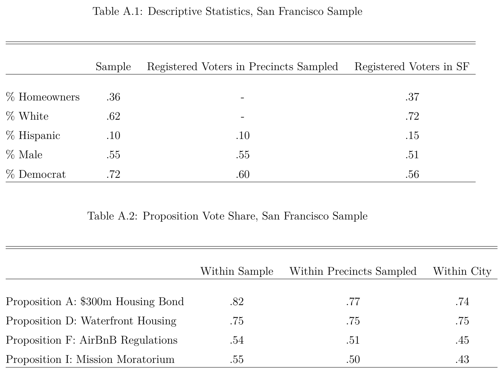

***Table A.1.*** Descriptive Statistics, San Francisco Sample

[Download data as CSV](tables/tab-02.csv)

Sample Registered Voters in Precincts Sampled Registered Voters in SF % Homeowners .36 - .37

% White .62 - .72

% Hispanic .10 .10 .15

% Male .55 .55 .51

% Democrat .72 .60 .56

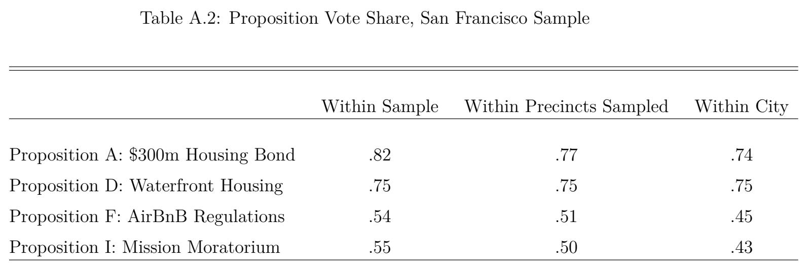

***Table A.2.*** Proposition Vote Share, San Francisco Sample

[Download data as CSV](tables/tab-03.csv)

Within Sample Within Precincts Sampled Within City Proposition A: $300m Housing Bond .82 .77 .74 Proposition D: Waterfront Housing .75 .75 .75 Proposition F: AirBnB Regulations .54 .51 .45 Proposition I: Mission Moratorium .55 .50 .43

### A.3: Policy Proposals, San Francisco Sample

Note: ‘Homeownership’ = Binary; ‘Ideology’ = 7-point categorical, 1 - ‘Extremely Con-

servative’, 7 - ‘Extremely Liberal’; ‘Income’ = 6-point categorical using mean value; ‘White,

Non-Hispanic’ = Binary; ‘Age’ = Linear; ‘Male’ = Binary.

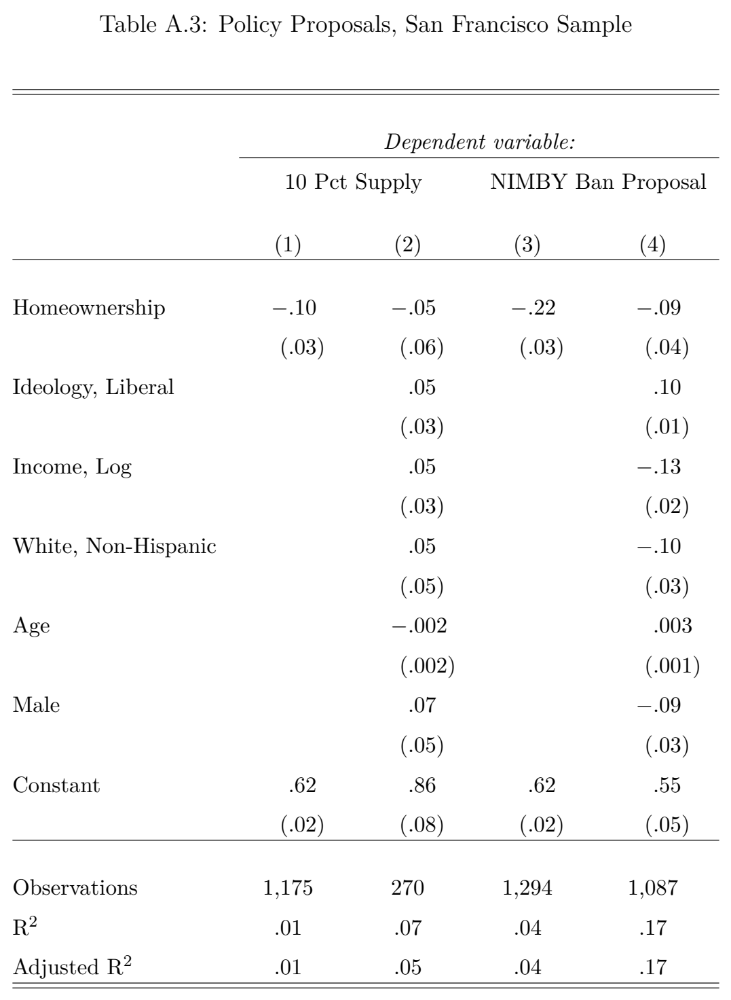

***Table A.3.*** Policy Proposals, San Francisco Sample

[Download data as CSV](tables/tab-04.csv)

Dependent variable:

### 10 Pct Supply NIMBY Ban Proposal

(1) (2) (3) (4) Homeownership −.10 −.05 −.22 −.09 (.03) (.06) (.03) (.04) Ideology, Liberal .05 .10 Income, Log .05 −.13 White, Non-Hispanic .05 −.10 Age −.002 .003 Male .07 −.09 Constant .62 .86 .62 .55 (.02) (.08) (.02) (.05) Observations 1,175 270 1,294 1,087 R2 .01 .07 .04 .17 Adjusted R2 .01 .05 .04 .17

### A.4: Recontacted Conjoint, San Francisco Sample

Renters, Proximity and Ban Support (Market−Rate)

2 miles (40 minute walk)

1 mile (20 minute walk)

Opponents Supporters 1/2 mile (10 minute walk)

1/8 mile (2 minute walk)

−0.6 −0.4 −0.2 0.0 0.2 0.4

Change in Probability Building Preferred

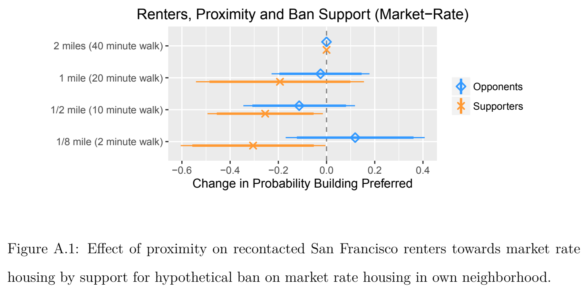

***Figure A.1.*** Effect of proximity on recontacted San Francisco renters towards market rate housing by support for hypothetical ban on market rate housing in own neighborhood.

## Appendix B: National Survey

### B.1: Descriptive Statistics, National Survey

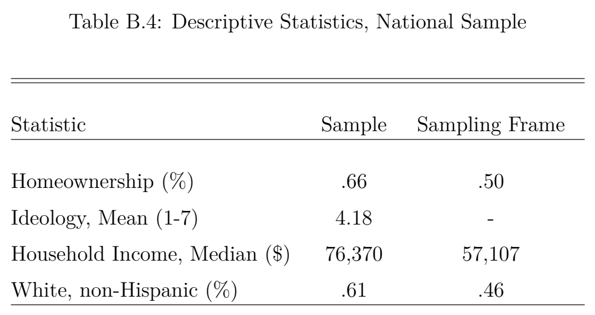

***Table B.4.*** Descriptive Statistics, National Sample

[Download data as CSV](tables/tab-05.csv)

Statistic Sample Sampling Frame Homeownership (%) .66 .50

Ideology, Mean (1-7) 4.18 -

Household Income, Median ($) 76,370 57,107 White, non-Hispanic (%) .61 .46

### B.2: 10% Supply Increase, National Sample

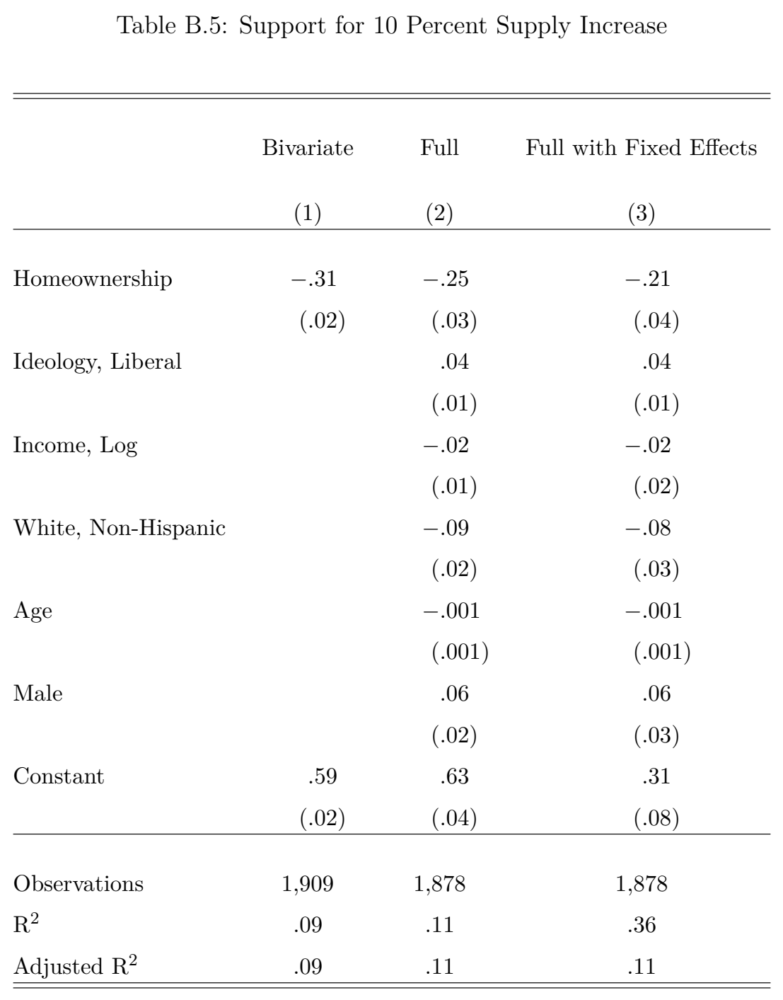

***Table B.5.*** Support for 10 Percent Supply Increase

[Download data as CSV](tables/tab-06.csv)

Bivariate Full Full with Fixed Effects (1) (2) (3) Homeownership −.31 −.25 −.21 (.02) (.03) (.04) Ideology, Liberal .04 .04 Income, Log −.02 −.02 White, Non-Hispanic −.09 −.08 Age −.001 −.001 Male .06 .06 Constant .59 .63 .31 (.02) (.04) (.08) Observations 1,909 1,878 1,878 R2 .09 .11 .36

Adjusted R2 .09 .11 .11

Note: ‘Homeownership’ = Binary; ‘Ideology’ = 7-point categorical, 1 - ‘Extremely Conservative’, 7 - ‘Extremely Liberal’; ‘Income’ = 19-point categorical using mean value; ‘White, Non-Hispanic’ = Binary; ‘Age’ = Linear; ‘Male’ = Binary.

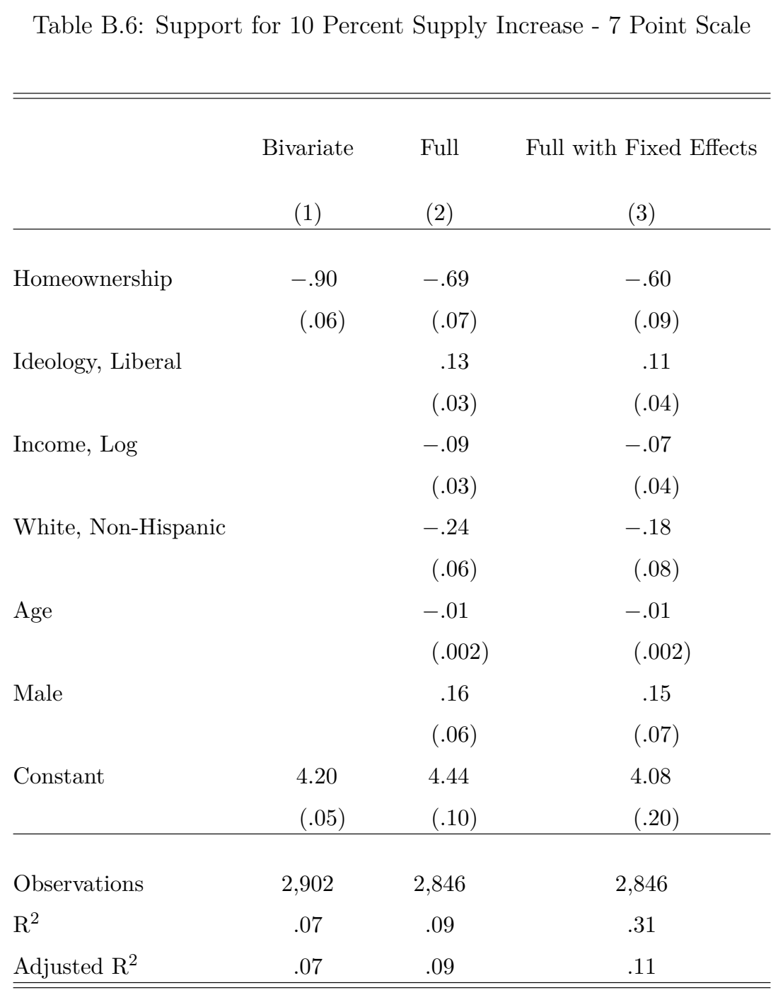

***Table B.6.*** Support for 10 Percent Supply Increase - 7 Point Scale

[Download data as CSV](tables/tab-07.csv)

Bivariate Full Full with Fixed Effects (1) (2) (3)

Homeownership −.90 −.69 −.60

(.06) (.07) (.09)

Ideology, Liberal .13 .11 Income, Log −.09 −.07 White, Non-Hispanic −.24 −.18 Age −.01 −.01 Male .16 .15 Constant 4.20 4.44 4.08 (.05) (.10) (.20) Observations 2,902 2,846 2,846 R2 .07 .09 .31

Adjusted R2 .07 .09 .11

Note: ‘Homeownership’ = Binary; ‘Ideology’ = 7-point categorical, 1 - ‘Extremely Conservative’, 7 - ‘Extremely Liberal’; ‘Income’ = 19-point categorical using mean value; ‘White, Non-Hispanic’ = Binary; ‘Age’ = Linear; ‘Male’ = Binary.

### B.3: Neighborhood Ban, National Sample

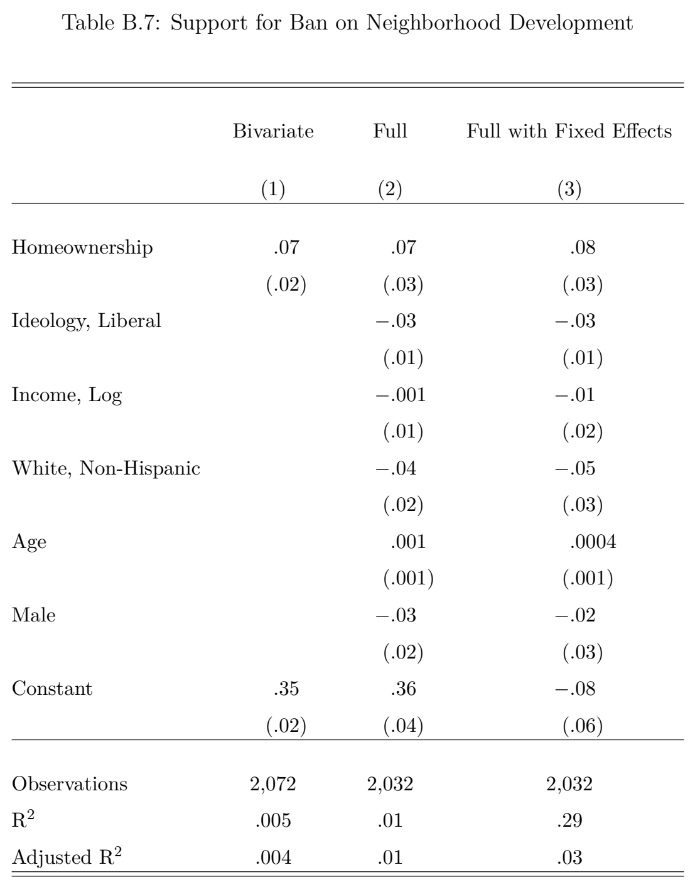

***Table B.7.*** Support for Ban on Neighborhood Development

[Download data as CSV](tables/tab-08.csv)

Bivariate Full Full with Fixed Effects (1) (2) (3)

Homeownership .07 .07 .08

(.02) (.03) (.03) Ideology, Liberal −.03 −.03 Income, Log −.001 −.01 White, Non-Hispanic −.04 −.05 Age .001 .0004 Male −.03 −.02 Constant .35 .36 −.08 (.02) (.04) (.06) Observations 2,072 2,032 2,032

R2 .005 .01 .29

Adjusted R2 .004 .01 .03

Note: ‘Homeownership’ = Binary; ‘Ideology’ = 7-point categorical, 1 - ‘Extremely Conservative’, 7 - ‘Extremely Liberal’; ‘Income’ = 19-point categorical using mean value; ‘White, Non-Hispanic’ = Binary; ‘Age’ = Linear; ‘Male’ = Binary.

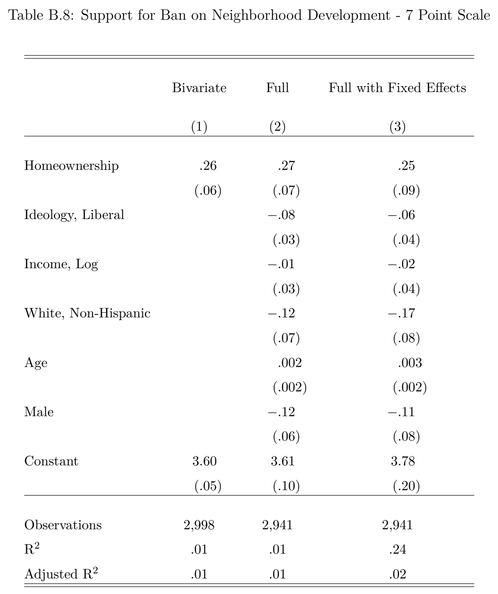

***Table B.8.*** Support for Ban on Neighborhood Development - 7 Point Scale

[Download data as CSV](tables/tab-09.csv)

Bivariate Full Full with Fixed Effects (1) (2) (3)

Homeownership .26 .27 .25

(.06) (.07) (.09)

Ideology, Liberal −.08 −.06 Income, Log −.01 −.02 White, Non-Hispanic −.12 −.17 Age .002 .003 Male −.12 −.11 Constant 3.60 3.61 3.78 (.05) (.10) (.20) Observations 2,998 2,941 2,941 R2 .01 .01 .24

Adjusted R2 .01 .01 .02

Note: ‘Homeownership’ = Binary; ‘Ideology’ = 7-point categorical, 1 - ‘Extremely Conservative’, 7 - ‘Extremely Liberal’; ‘Income’ = 19-point categorical using mean value; ‘White, Non-Hispanic’ = Binary; ‘Age’ = Linear; ‘Male’ = Binary.

## Appendix C: Conjoint Results, National Sample

Homeowners, Proximity by Income

2 miles (40 minute walk) l

1 mile (20 minute walk) l

Above Median Income 1/2 mile (10 minute walk) l l Below Median Income 1/8 mile (2 minute walk) l

−0.2 −0.1 0.0 0.1 0.2

Change in Probability Building Preferred

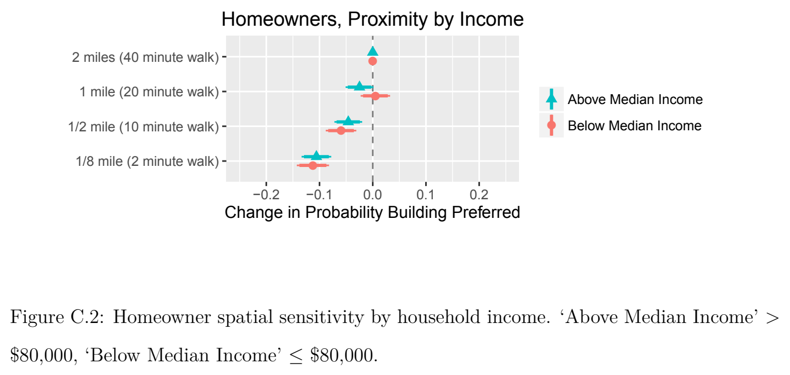

***Figure C.2.*** Homeowner spatial sensitivity by household income. ‘Above Median Income’ > $80,000, ‘Below Median Income’ ≤ $80,000.

Homeowners, Proximity by Ideology

2 miles (40 minute walk) l

1 mile (20 minute walk) l

Liberals 1/2 mile (10 minute walk) l l Conservatives 1/8 mile (2 minute walk) l

−0.2 −0.1 0.0 0.1 0.2

Change in Probability Building Preferred

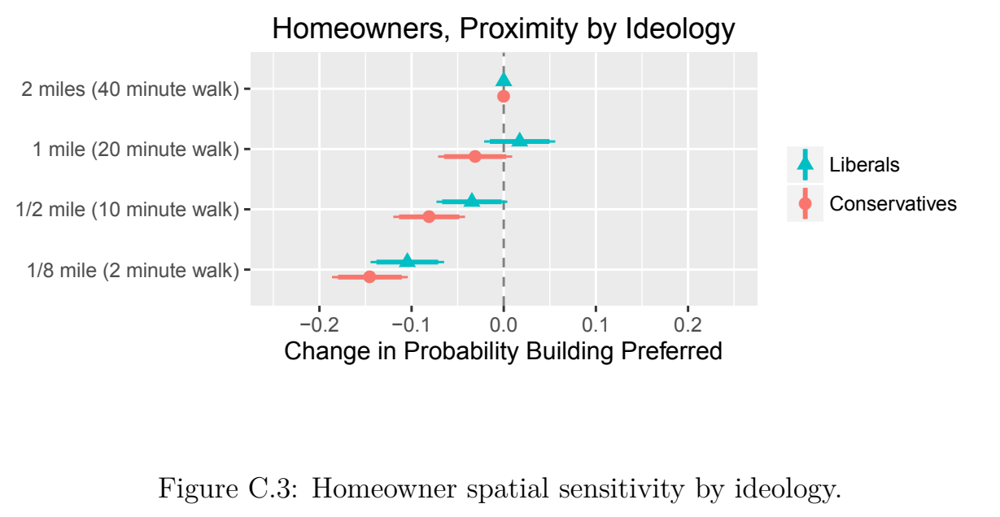

***Figure C.3.*** Homeowner spatial sensitivity by ideology.

All of the units l

Half of the units l

One−quarter of the units l

None of the units l

−0.2 −0.1 0.0 0.1 0.2

Change in Probability Building Preferred

leveL

ytilibadroffA

Proximity by Affordability

Renters l Homeowners

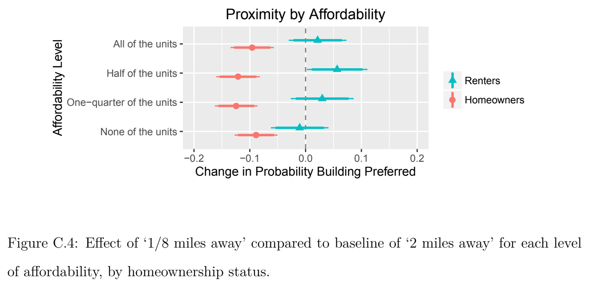

***Figure C.4.*** Effect of ‘1/8 miles away’ compared to baseline of ‘2 miles away’ for each level of affordability, by homeownership status.

Most Expensive

4th

3rd

2nd

Least Expensive

−0.2 0.0 0.2 Change in Probability Building Preferred )selitniuQ(

ytiC

yb

tneR

egarevA

Renters, Proximity by Affordability and Average Rent by City

Affordability

All of Units Half of Units Quarter of Units l None of Units

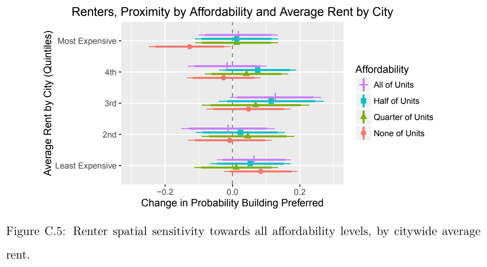

***Figure C.5.*** Renter spatial sensitivity towards all affordability levels, by citywide average rent.

Most Expensive l

4th l

3rd l

2nd l

Least Expensive l

−0.2 −0.1 0.0 0.1 0.2 Change in Probability Building Preferred )selitniuQ(

ytiC

yb

tneR

egarevA

Renters, Proximity by Affordability and Average Rent by ZIP

Affordable l Market−Rate

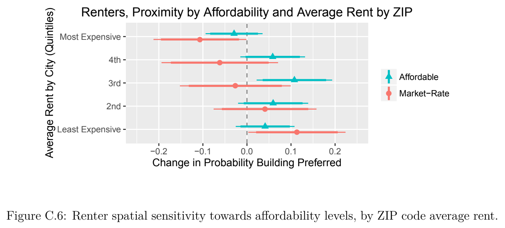

***Figure C.6.*** Renter spatial sensitivity towards affordability levels, by ZIP code average rent.

Most Expensive

4th

3rd

2nd

Least Expensive

−0.2 0.0 0.2 Change in Probability Building Preferred )selitniuQ(

ytiC

yb

tneR

egarevA

Homeowners, Proximity by Affordability and Average Rent by City

Affordability

All of Units Half of Units Quarter of Units l None of Units

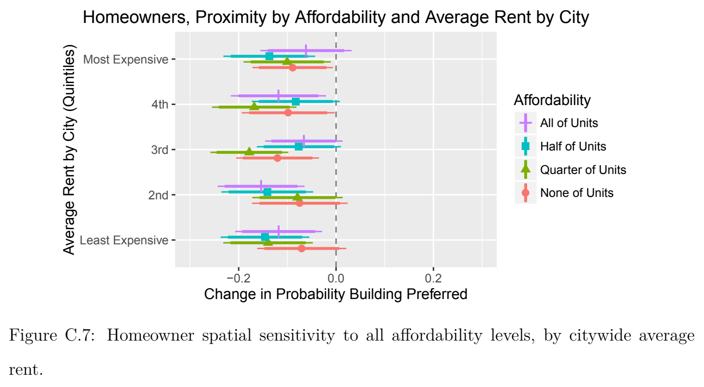

***Figure C.7.*** Homeowner spatial sensitivity to all affordability levels, by citywide average rent.

Renters, Proximity and Price Anxiety (Affordable)

2 miles (40 minute walk)

1 mile (20 minute walk)

Price Neutral

1/2 mile (10 minute walk) Price Anxious

1/8 mile (2 minute walk)

−0.2 −0.1 0.0 0.1 0.2

Change in Probability Building Preferred

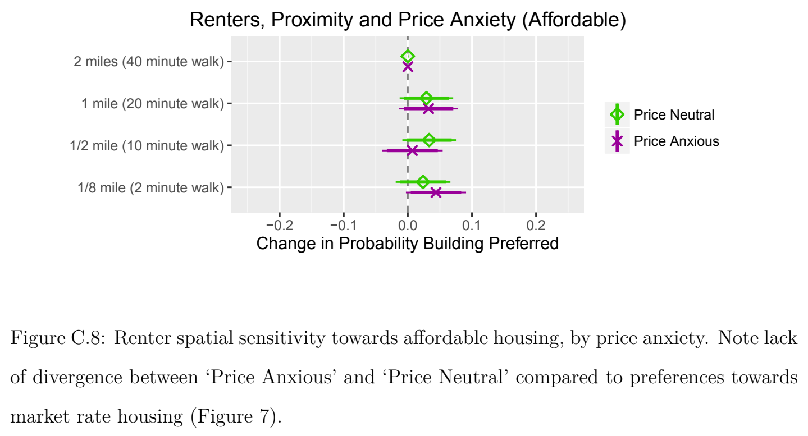

***Figure C.8.*** Renter spatial sensitivity towards affordable housing, by price anxiety. Note lack of divergence between ‘Price Anxious’ and ‘Price Neutral’ compared to preferences towards market rate housing (Figure 7).

### C.1: Policy Support by Quintile, National Sample

Most Expensive l

4th l

3rd l

2nd l

Least Expensive l

0.00 0.25 0.50 0.75 1.00 Support for Supply (%) )selitniuQ(

PIZ

yb

tneR

egarevA

Renters, Average Rent by ZIP

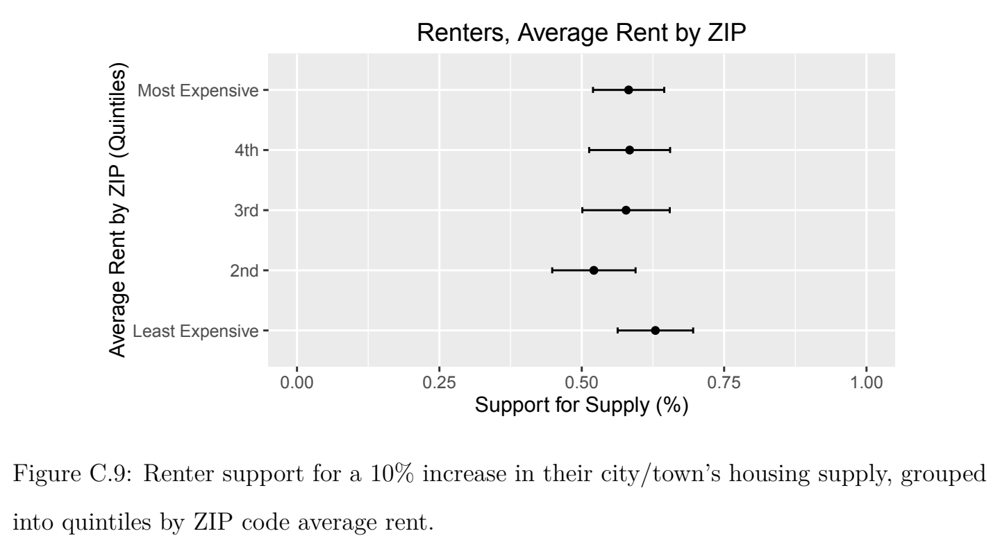

***Figure C.9.*** Renter support for a 10% increase in their city/town’s housing supply, grouped into quintiles by ZIP code average rent.

Most Expensive l

4th l

3rd l

2nd l

Least Expensive l

0.00 0.25 0.50 0.75 1.00 Support for Supply (%) )selitniuQ(

ytiC

yb

tneR

egarevA

Homeowners, Average Rent by City

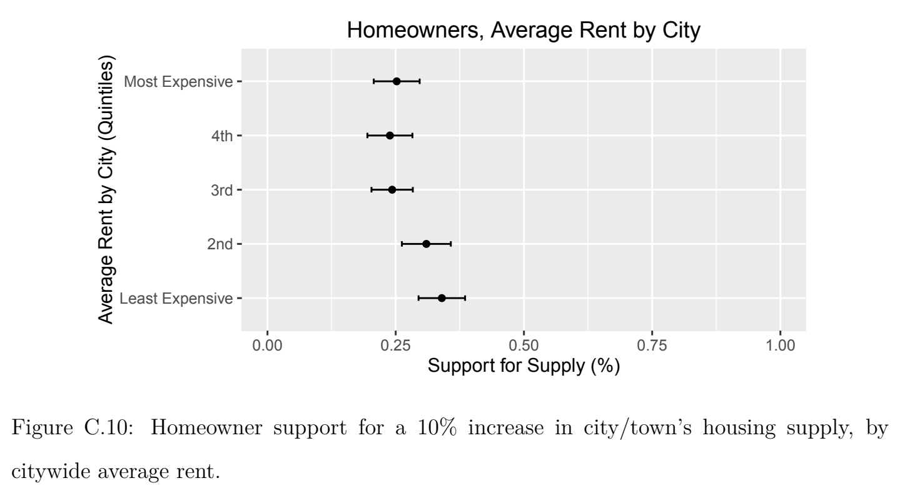

***Figure C.10.*** Homeowner support for a 10% increase in city/town’s housing supply, by citywide average rent.