# The Resilient, but Limited Effect of Process on Fairness and Legitimacy: Evidence from Wind Energy

### Michael Hankinson

### April 8, 2026

Abstract

Fair processes increase outcome acceptance. But if legitimacy is mainly driven by whether one receives their preferred outcome, then how do voters evaluate procedural fairness prior to knowing the outcome? Do voters rely on sincere procedural values or strategic considerations regarding which process will lead to their preferred outcome? Using preregistered survey experiments in the context of wind energy siting, I vary the decision-making authority, level of public input, and whether respondents learn the outcome before evaluating the process. Greater public input and local control increase perceived fairness and legitimacy. Importantly, these effects are resilient to learning the policy outcome. Process evaluations are not simply ex ante strategic forecasts of outcomes—they are stable preferences. Still, receiving one’s preferred outcome has a larger effect on ex post evaluations compared to process alone. Thus, reforms which centralize energy siting are unlikely to lose many would-be supporters on the basis of

procedural fairness.

Word Count: 5,460 words, excluding References.

Keywords: policy legitimacy, climate politics, renewable energy, local governance, survey experiments

For helpful feedback, I thank Brandon Bartels, Parrish Bergquist, Salma Elmallah, Chris Elmendorf, Jeremy Firestone, Andy Guess, Megan Mullin, Adrian Pietrzak, and participants in the AP Workshop at GWU and the Climate Politics Working Group at UCLA. Special thanks to Grace Truslow for research assistance. I used ChatGPT 5.2 and Refine.ink to assist with copyediting and code diagnostics.

∗Assistant Professor, Department of Political Science, George Washington University.

Voters regularly experience political outcomes with which they disagree. But those who believe that the decision-making process was fair are more willing to weather political losses and maintain democratic norms compared to those who feel cheated (Lind and Tyler 1988; Thibaut and Walker 1975; Tyler 1994). At the same, research finds that attitudes towards process alone are weak and voters are quick abandon procedural values in favor of preferred outcomes (Prothro and Grigg 1960). In fact, when evaluating process retrospectively, voters mainly base their evaluations of procedural fairness and legitimacy on whether they received their preferred outcome (Esaiasson et al. 2016).

But if ex post evaluations are driven by outcomes, then how do voters evaluate the process prior to learning the outcome? On one hand, “sincere procedural values” are those resilient to knowledge of the outcome. A citizen who genuinely values a process should maintain their evaluation regardless of the outcome. These sincere procedural values are the foundation for legitimizing unpopular outcomes, from judicial decisions (Bartels and Johnston 2020; Gibson, Caldeira and Baird 1998), to election outcomes (Anderson 2005), and to public policies (Grimes 2006; Tyler, Casper and Fisher 1989). On the other hand, “strategic considerations” are built around the likelihood of securing one’s preferred outcome. If based on strategic considerations, the effect of process should attenuate once the outcome is revealed.

Capturing sincere procedural values requires isolating the effect of process independent of the outcome. This is challenging. Most observational evidence of procedural fairness is retrospective, measuring perceptions of fairness after a decision is known (e.g., Firestone et al. 2018, 2020; Gross 2007; Hoen et al. 2019; Hoesch et al. 2025). Consequently, outcome favorability is likely to bias evaluations of procedural fairness. Experimental designs also face limitations. Varying the process can affect respondents’ perceptions of the most likely outcome. Thus, experiments that randomize the process but do not specify the outcome cannot isolate the effect of process (e.g., Beyers and Arras 2021; Jacobs and Kaufmann 2021; Liu et al. 2020; Persson, Esaiasson and Gilljam 2013; Wicki, Hofer and Kaufmann

2022).1

At stake is our interpretation of evidence on procedural fairness. If pre-outcome procedural evaluations are strategic, then much of this evidence is biased—capturing expectations of outcomes as well as any legitimizing effect of the process. Unpacking this bias is also crucial for institutional design. In line with procedural fairness theory, 20th century reforms in North America and Europe granted more voice and authority over the development of critical infrastructure to the local level (Altshuler and Luberoff 2004). Because such infrastructure has spatially concentrated costs, local control empowers opponents to block development even if there are more net supporters (Einstein, Glick and Palmer 2019; Sahn 2025). If pre-outcome testimony on procedural fairness is driven by strategic implications, then these reforms not only constrain the supply of collective goods—from housing (Hankinson and Magazinnik 2023; Mast 2024), to energy (Carley et al. 2020), to transportation infrastructure (Brooks and Liscow 2023)—but do little to increase the acceptance of unpopular outcomes.

Wind energy siting is an ideal context for evaluating the effect of sincere procedural values on fairness (i.e., the evaluation of the process itself) and legitimacy (i.e., one’s willingness to accept the outcome). Wind energy infrastructure has diffuse benefits and spatially concentrated costs, ranging from concerns over aesthetic impacts to the preservation of local identity (Bergquist et al. 2020; Devine-Wright and Howes 2010; Susskind et al. 2022; Wolsink 2007). These costs drive powerful local opposition. Survey evidence finds that a third of recent wind energy projects have been canceled due to community protest (Nilson et al. 2024) and the rate of local protest is growing (Stokes et al. 2023). Even in Denmark, a country with majority public support for expansion of wind energy, opposition pushes local officials to site turbines in the least politically damaging areas (Andersen et al. 2025).

In response, many governments across North America and Europe have recently centralized siting authority to the state, regional, or even national level and limited requirements 1While Esaiasson et al. (2016) holds the outcome fixed, the study does not differentiate between sincere procedural values and strategic considerations ex ante. By only measuring the effect of process when the outcome is known, the study does not show the full process of how learning the outcome affects voters’ perceptions of procedural fairness.

for public hearings in order to accelerate deployment (Chaudhuri and Susskind 2024; Stokes 2016; Uibeleisen and Go¨tz 2024; Vasstrøm et al. 2024). These reforms bring risk. If voters hold sincere procedural values, then the loss of local control and public input will decrease their willingness to accept siting outcomes as legitimate. Further consequences may extend to lower trust in government, local protests, and magnifying right-wing backlash already associated with decarbonization (Bosetti et al. 2025).

To assess these risks, I isolate the ex ante legitimizing effect of process from outcomes using two preregistered survey experiments.2 Respondents from suburban and rural ZIP codes in the United States evaluated a proposed wind energy project under randomly assigned institutions that varied (i) who makes the decision—locally elected officials or a state-appointed board of experts—and (ii) the level of public input—face-to-face meetings or written comments only. Crucially, the experiments also randomized whether respondents learned the outcome before evaluating procedural fairness and legitimacy. This design provides a direct test of whether procedural fairness shapes legitimacy when outcomes are unknown, and whether those effects are sincere values—persisting when individuals learn whether they have won or lost.

Across both experiments, three findings emerge. First, centralized decision making and limited public input reduce procedural fairness and the legitimacy of siting decisions when outcomes are unknown, with public input having the larger effect. Second, these effects are resilient to outcome information. Learning that a proposal is approved or denied does not diminish the independent effect of process on fairness and legitimacy. Third, although sincere procedural values matter, the effect of process alone is substantially smaller than the effect of receiving one’s preferred outcome.

This paper makes two contributions to our understanding of procedural fairness the- 2Both experiments were approved by the [REDACTED] Institutional Review Boards. Respondents were provided a consent form at the start of each survey and affirmatively expressed consent to advance in the study. Respondents were also compensated for their time. Preregistrations are available at https:// osf.io/4uqzb/overview?view_only=1a2aa75d23ec4a16a285f67e1e61d9d7 and https://osf.io/zeq5k/ overview?view_only=073e12ec491844cbb7c3d44a932faab3

ory and its importance for institutional reform. First, not only can institutional design increase the fairness of the siting process and the legitimacy of outcomes, but these effects are unchanged based on outcome knowledge. In other words, voter assessments of procedural fairness prior to knowing the outcome are not simply driven by what is likely to occur. Instead, they also reflect sincere procedural values that persist despite unfavorable outcomes. Second, the effects of procedural fairness only go so far. Upon learning the outcome, fairness and legitimacy are more greatly influenced by whether voters received their preferred outcome. Put differently, residents’ ex post complaints about a process being unfair do reflect sincere procedural values, but they are also heavily shaped by frustration over the outcome. As a result, studies conducted after the siting outcome is known are biased by outcome favorability. Future research should extend this paper’s experimental design to active siting conflicts, measuring perceptions of fairness and legitimacy both immediately prior to and immediately following the revelation of the policy outcome, allowing for a decomposition of sincere procedural values from outcome favorability.

The comparatively modest effects of process on fairness and legitimacy should encourage the centralization of infrastructure development decisions, including renewable energy siting. Such reforms are unlikely to lose many would-be supporters on the basis of procedural fairness. Combination reforms, such as centralized decision-making with high levels of public input, should minimize the loss of legitimacy while also removing local veto points. Still, even modest average effects of process on legitimacy may be politically consequential if they are concentrated among a highly engaged, well-resourced faction willing to mobilize against the infrastructure. By isolating the effect of process from outcome, this study provides a framework for identifying such behavioral consequences in future work.

## Procedural Fairness, Legitimacy, and the Sincere-Strategic

## Distinction

The effect of process independent of outcome can be viewed through procedural fairness theory. The three-step theory begins with a decision being made using a procedure, such as the decision to build a piece of energy infrastructure. Next, an observer evaluates the fairness of the procedure. Finally, the observer’s assessment of fairness combined with their predisposition towards the infrastructure leads to either the acceptance or rejection of the decision—otherwise known as legitimacy (Tyler 1994).

For observational research, separating the effect of process from the effect of the outcome is challenging. Case studies and surveys build on retrospective correlations between the community engagement process and a sense of procedural fairness (Firestone et al. 2018, 2020; Gross 2007; Hoen et al. 2019; Hoesch et al. 2025) as well as support for the project overall (Nilson and Stedman 2023). For studies which only sample residents living near approved projects, researchers cannot observe projects which had processes deemed unfair enough that opponents derailed approval. Furthermore, retrospective reflections struggle to account for endogeneity. Recalled preferences are not only subject to measurement error, but also Tiebout-sorting (Tiebout 1956). A wind farm’s greatest opponents may be more likely to leave the area once siting is approved, whereas some supporters now living in the area were not present for the siting conflict.

Experimental research on the causal effect of procedural fairness has had inconsistent findings. On one hand, Martin, Miko(cid:32)lajczak and Orr (2022) randomly vary procedural fairness and find that a fair process increases legitimacy independent of project outcome. However, the study’s randomized violations of fairness include clear normative concerns, such as allegations of corruption in the process. It is unsurprising that a process labeled corrupt and “controversial” is seen as unfair. In contrast, Esaiasson et al. (2016) vary processes in policy areas ranging from regulation—a ban of religious symbols in schools—to

redistribution—the use of money for either charity or celebrations. Across 27 experiments, they find that outcome favorability dominates the effect of process when it comes to perceived fairness (Esaiasson et al. 2016).

Still, this “horse racing” of process versus outcome does not help us assess how voters evaluate procedural fairness prior to the outcome being revealed and whether those evaluations are sincere or strategic. Unpacking these mechanisms is particularly important given the evolving context of renewable energy siting. While most projects address regional needs, new infrastructure often has spatially concentrated costs, mobilizing local opposition. In response, research-driven recommendations for building local support have been greater local control and greater public input (e.g., Elmallah and Rand 2022; Firestone et al. 2018, 2020, 2012; Gadzanku et al. 2025; Gross 2007; Hoen et al. 2019; Hoesch et al. 2025). These reforms believed to not only produce projects better tailored to local conditions, but also increase the legitimacy of even unpopular projects. But if evaluations of procedural fairness are just strategic considerations to secure one’s preferred policy, then reforms which create more local veto points will not only constrain the supply of renewable energy, but do nothing to increase voters’ acceptance of unpopular siting decisions.

### Wind Turbine Siting Institutions

Isolating the relationship between institutions and procedural fairness is highly relevant for energy siting policy globally. Local governments typically control decision-making over new wind facilities, presenting obstacles to development even in countries where wind energy investment is popular, such as Denmark and Sweden (Andersen et al. 2025; Lindvall 2023; Vasstrøm et al. 2024). Compared to centralized authorities, local legislators are elected and thus incentivized to keep their votes more closely aligned with nearby residents’ attitudes. Additionally, local legislators will typically hold more in-person public hearings on wind proposals, facilitating a higher level of face-to-face public input.

In contrast to this local control with high public input, governments across North America

and Europe have sought to centralize decision-making authority. Recently, Germany curtailed local control by setting binding top-down wind energy targets and allowing the state and municipal authorities to manage planning and implementation. Additional reforms have removed public hearings for wind proposals unless requested by the developer or local authorities (Uibeleisen and Go¨tz 2024). The United Kingdom has similarly exempted large scale wind power installations from local planning approval. In contrast, Norway replaced local control over wind energy development with a national framework in 2009, sparking widespread protest. By 2019, Norway began a series of reforms to strengthen local control over wind siting, illustrating how a loss of legitimacy may threaten long-term policy success (Vasstrøm et al. 2024).

Rather than centralizing authority nationally, regional governments can also preempt local control. Canadian provinces have removed local veto authority, leading to backlash and the punishment of incumbent officials (Stokes 2016). In the U.S., states have also shifted decision-making over utility-scale wind and solar facilities from local governments to state-appointed boards of experts, including Illinois, California, New York, Wisconsin, and Michigan. Other states have had strong state control for much longer, including Connecticut, Maryland, West Virginia, and North Carolina. Another 20 states maintain a hybrid approach, where large-scale energy facilities and transmission lines are approved at the state level (Chaudhuri and Susskind 2024). While this preemption often requires at least one public hearing, the level of input typically falls short of that gathered through locally elected decision-making bodies.

## Analytical Approach

Prior to data collection, I preregistered two experimental designs. The surveys were fielded on samples of suburban and rural respondents in the United States. For clarity, I describe the common points of inquiry below. Complete preregistrations and all preregistered tests

are included in the Supplementary Information.

The experiments proposed a hypothetical wind farm within eyesight of a respondent’s neighborhood, highlighting the scale of the proposal as well as expected local benefits and costs commonly discussed in siting campaigns. The proposal randomly varied the level of government making the decision, the level of public input, the outcome, and whether respondents saw this outcome prior to evaluating the process. Dependent variables included the fairness of the decision-making process measured using a 7-item Likert scale and the legitimacy of the outcome. Legitimacy was measured using a novel index of four items designed to measure respondents’ acceptance of the decision.

Figure 1 displays a stylized survey flow common across both experiments. To test for sincere procedural values, the experiment uses two branches instead of one branch with preand post-outcome measures of fairness in order to avoid consistency bias. If respondents are less likely to change their answers to the same fairness asked before and after the outcome is revealed, then my results would be biased towards finding resilient effects of process. In contrast, randomizing respondents across two separate survey arms recovers the same conceptual estimates, but without any risk of consistency bias.

The key points of inquiry are as follows:

What is the effect of state control and limited public input when the outcome is not known? To test the effect of state control and limited public input, I regress the fairness and legitimacy dependent variables on the process treatments using respondents who were not informed of the outcome (Branch 1). In this model, the treatment effect of process may operate through both sincere procedural values and strategic considerations.

Does knowing the outcome alter the effect of the process? If process operates through sincere procedural values, then providing respondents with the outcome should not change the effect of process. In contrast, if outcomes drive evaluations of procedural fairness, then the effect of state control and limited public input on fairness and legitimacy should

Wind project prompt

Branch 1 Branch 2 - Randomize - Randomize process process

- DV: Expected - DV: Expected outcome outcome

- Randomize

outcome

- DV: Fairness

- DV: Legitimacy scale

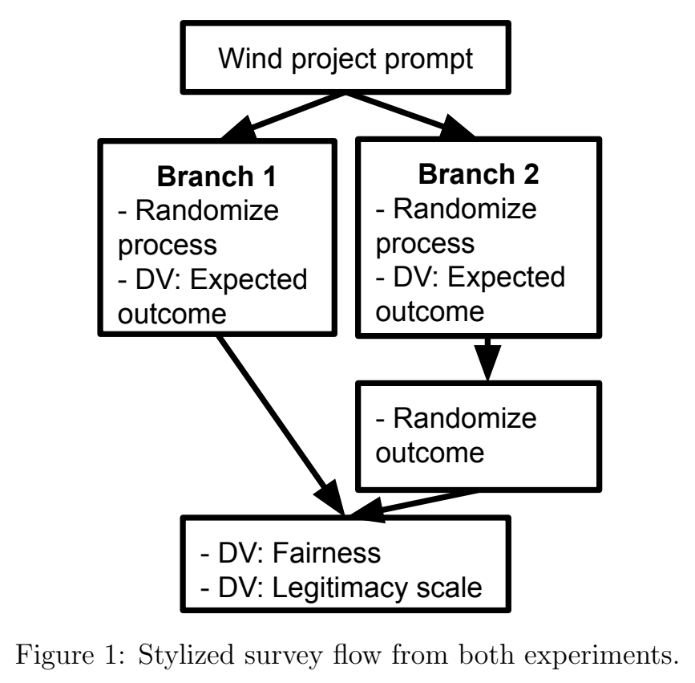

***Figure 1.*** Stylized survey flow from both experiments.

be substantively smaller—if not null—for respondents who are informed of the outcome (Branch 2). To assess this relationship, I regress the fairness and legitimacy dependent variables on the process treatments interacted with the respondents’ assigned branch using the full sample.

## Methods

Experiment 1 was fielded in December 2024. Respondents were recruited via Cloud Research Connect, an opt-in survey platform found to have among the highest response quality compared to similar popular platforms (Stagnaro et al. 2024). After dropping respondents for failing pretreatment attention checks, I surveyed 1,995 respondents living in the United States, age 18 years or older. To maximize external validity, I excluded respondents living in urban areas, as a wind farm of 340 foot tall turbines is an unrealistic land use in that context. As a result, the sample has a larger share of homeowners and non-Hispanic white respondents compared to the United States as a whole. See SI Section 3 for full descriptive

statistics.

Experiment 2 was fielded in November 2025. I explicitly sampled respondents from rural areas in order to capture those most likely to encounter large-scale wind energy projects. Cloud Research Connect does not have a deep pool of rural respondents, so I fielded the survey via PureSpectrum, a platform which combines geographic micro-targeting with demographic quotas to recruit respondents from other opt-in survey providers. I used the University of Washington RUCA-to-ZCTA crosswalk, defining rural ZIP codes as those categorized with a RUCA code of 7 or higher (e.g., Nemerever and Rogers 2021). Demographic target quotas for income, race, homeownership, age, gender, and education are based on 2021-2025 5-year ACS estimates for these rural ZCTAs. I ultimately surveyed 3,076 respondents age 18 years or older, a sample size estimated to have 80% power to detect interactions as small as 5 percentage points—roughly half the size of the main effect in Experiment 1.

### Design

In both survey experiments, respondents were asked to evaluate a hypothetical wind farm of sixty 340 foot tall turbines proposed for their community. There were explicitly told that this was not a real proposal, but to thoughtfully consider it as if it were real. The prompt includes both arguments for and against the wind farm, as well as a visualization of the scale of the turbines. Due to the diverse rural geographies in the United States, this study was unable to incorporate photomontages that would represent each respondents’ surrounding context (e.g., woods v. grasslands, flat plains v. ridges, etc.). Below is the prompt used:

A wind energy developer is proposing to build a wind farm on land in your

community. They want to build a farm of 60 turbines, each around 340 feet tall,

which would power 85,000 homes per year.3 You would be able to see the wind

turbines from your neighborhood.

3The energy production estimate was based on reporting of the 60 turbine Apex Clean Energy’s Honey Creek project. However, the turbine height at Honey Creek is taller than the 340 feet described. In SI Section 3, I discuss the implications of this mismatch for my findings.

For context, here’s a visual of the turbine height (far right) compared to other known structures:

20 ft. tall 38 ft. tall 125 ft. tall 305 ft. tall 340 ft. tall

Average Utility power Transmission The Statue of Proposed

2-story home pole tower Liberty turbines

Your community is divided. On one hand, some residents are concerned that the facility’s size would harm local property values and affect migrating birds. Residents are also concerned about the aesthetics, landscape change, and potential negative impacts on quality of life due to the turbines.

On the other hand, technical reports estimate that the wind farm would bring

over $2 million per year in new tax revenue for local schools and services and re-

duce greenhouse gas emissions. Finally, others argue that farmers and landowners

should have the right to lease their property to wind developers.

In both survey experiments, respondents were randomized into one of two branches. In Branch 1, respondents viewed only the process but they were not told the outcome of the policy siting decision. In Branch 2, respondents viewed both the process and the outcome. I also randomized the level of local control and public input. In Experiment 1, the “State board + limited input” condition presents a process where decisions are made by a state-appointed board of energy experts with limited, remote community input (“calling or writing an email

to your governor”). The other condition reflects the typical status quo where decisions over wind turbines are made by elected local legislators with high levels of face-to-face community input (“attending local meetings and voicing your concerns face-to-face with your elected legislators”).

In Experiment 2, I decouple this treatment into a level of government and level of public input treatments which vary independently of each other. For level of government, the conditions are:

• “your locally elected legislators”

• “a state-appointed board of energy experts”

For public input, the conditions are:

• “hold a series of local public meetings where residents like you can share your opinions face-to-face with the decision makers”

• “set up an email account where residents like you can send your thoughts, but there will be no public meetings about the proposal”

Finally, I randomized whether the proposed projected is approved or denied by its respective decision-making body. This randomized outcome was only visible for respondents in Branch 2, where the outcome is known. The survey flows for each experiment are diagrammed in Figures SI1 and SI3, as well as the stylized survey flow in Figure 1.

The primary outcomes of interest are the fairness of the wind turbine siting process and the legitimacy of the final decision. For fairness, the survey asks: “Regardless of project approval, do you believe this is a fair way to decide on where to permit new wind energy farms?” Respondents indicated the fairness on a 7-point scale from “very unfair” to “very fair.” I operationalize this outcome on a continuous scale from 0 to 1.

For legitimacy, I use an original four item scale of statement with agreement ranging on a 5-points scale from ”strongly agree” to ”strongly disagree.” I average the four items. The four items are internally consistent with a Cronbach’s alpha of .70. See SI Section 5 for validation of the legitimacy scale. The items are as follows, with the order randomized:

“Thinking about the process and [eventual / NA] decision, do you agree or disagree with each of the following statements?”

• “This decision ought to be accepted and considered the final word on the matter.”

• “The body that made this decision had the right to do so.”

• “There ought to be an effort to challenge the decision and get it changed.” (reversecoded)

• “Even if I personally disagree, I respect the outcome of this process.”

All models used OLS regressions with robust standard errors.

y = α + βD + γX + ε

i i i i

where y is either the fairness or legitimacy outcome for individual i; D is the process i i

treatment for individual i; X is a 1 × K vector of demographic covariates (e.g., homeownership, race, income, age, gender, education) with associated coefficients γ; and ε is an error term. All dependent variables are be scaled to a 0 to 1 outcome. I control for race/ethnicity, gender, education, age, income, homeownership, and partisanship. Education is defined as having completed college, partisanship ranges from -1 (Democrat/lean Democrat) to +1 (Republican/lean Republican), homeownership is a binary (homeowner or lives with homeowner), and race/ethnicity is operationalized as a binary for white, non-Hispanic due to the small share of non-white residents in the rural population of interest.

## Results

### Effect of Process When Outcome Is Unknown

Figure 2 shows the effect of process on the fairness and legitimacy of the turbine siting among respondents who do not know the outcome (Branch 1 only). All results are reported from OLS regressions including demographic controls. See SI Section 9 for results in tabular form.

ssenriaF ssenriaF ycamitigeL

State board + Limited input State board

Limited input

State board

Limited input

−0.10 −0.05 0.00 Estimate (95% CI)

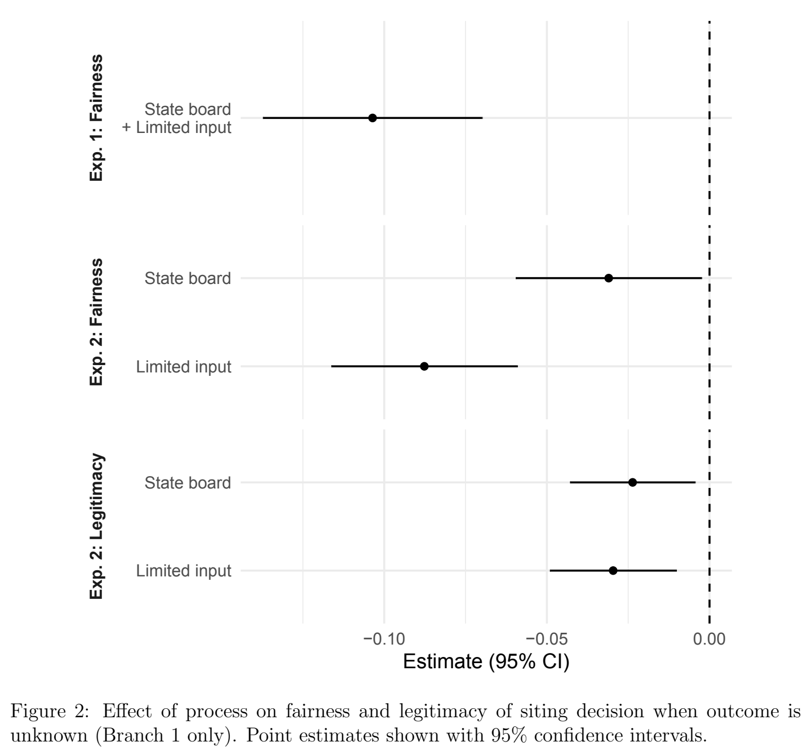

***Figure 2.*** Effect of process on fairness and legitimacy of siting decision when outcome is unknown (Branch 1 only). Point estimates shown with 95% confidence intervals.

Experiment 1 uses a compound treatment of state-appointed board with limited public input in the form of written comments compared to locally elected officials with high public input in the form of face-to-face meetings. Respondents told that the decision would be made by a state-appointed board with limited public input were 10 percentage points (d = 0.37) less likely to perceive the decision-making process as fair. This effect is larger among those who tend to mostly agree with policies decisions made by their local government (SI Section 6). This 10 point effect is unchanged even when controlling for pretreatment support for the wind farm, concern for climate change, and the wind farm’s expected effects on local property values (Table S6).

Experiment 2 decouples Experiment 1’s compound treatment into separate treatments for the level of decision-making and public input. Having the decision made by a stateappointed board decreases fairness by 3 points (d = 0.11), compared to a decision by local elected officials. Holding no public meetings and only relying on written public comment decreases fairness by 9 points (d = 0.29), compared to holding in-person meetings. The difference between these effects is statistically significant.

Experiment 2 also extends the effect of process to outcome legitimacy. Having the decision made by a state-appointed board of experts decreases legitimacy by 2 points (d = 0.12) and holding no public meetings decreases legitimacy by 3 points (d = 0.14). Altogether, Experiment 2 shows that the negative effects on fairness from Experiment 1 are driven primarily by the low level of public input, though both process treatments have comparable effects on outcome legitimacy. That the effect of process on legitimacy is smaller compared to that of fairness is expected. As stated above, legitimacy is a combination of one’s baseline support for the outcome combined with their evaluation of procedural fairness (Tyler 1994).

### Resilience of Effects When Outcome Is Known

Having established that process affects fairness and legitimacy absent knowledge of the outcome, I test whether people are similarly responsive to process when the outcome is known,

reflecting sincere procedural values. Figure 3 shows the interaction between process and branch—whether the respondent knows the final decision. Across both experiments, knowing the outcome does not alter the effect of process on fairness and legitimacy. Whether or not the outcome is known, respondents still believe that the decision-making process is less fair and less legitimate when the decision is made by the state-appointed board or with limited public input. These null findings indicate process is having a sincere—not purely strategic—effect on respondents’ judgment prior to knowing outcomes.

One concern may be that the null results in Figure 3 stem from respondents not internalizing the outcome. To test this theory, I interact the process treatments with an indicator for whether the outcome matches the respondent’s pretreatment stated preference for the wind farm—either that it would be approved or denied. Figure 4 shows that receiving one’s preferred outcome dramatically increases a respondent’s perception of fairness and decision legitimacy by 11 to 16 percentage points, respectively. Respondents are internalizing the outcome and yet the outcome does not alter the independent effect of process. Nor does getting one’s preferred outcome alter the effect of process in a consistent manner (SI Section 7). However, Figure 4 also underscores the limited effects of process. These process effects are substantially smaller than the effect of getting one’s preferred policy.

## Discussion

Across two experiments, this study identifies a sincere effect of process on procedural fairness. Face-to-face public input and local control increase perceived fairness and legitimacy. These effects persist even after individuals learn whether they have received their preferred outcome. Procedural evaluations are therefore not merely strategic projections of anticipated outcomes, but rather they reflect stable attitudes toward how decisions ought to be made. At the same time, the findings clarify the limits of procedural fairness. As shown in Esaiasson et al. (2016), outcome favorability exerts a substantially larger influence on both fairness and

Marginal effects Interaction ssenriaF ssenriaF

ycamitigeL

State board + Limited input State board

Limited input

State board

Limited input

−0.10 −0.05 0.00 0.05 −0.10 −0.05 0.00 0.05 Estimate (95% CI)

Branch Outcome known Outcome unknown

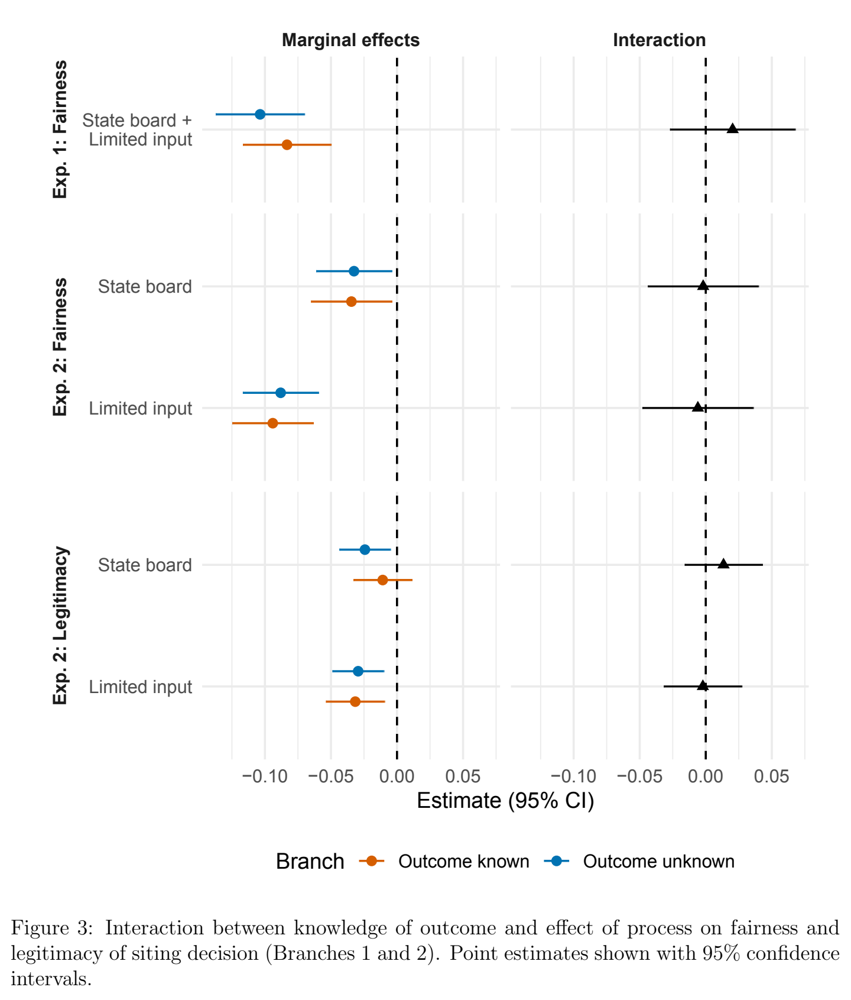

***Figure 3.*** Interaction between knowledge of outcome and effect of process on fairness and legitimacy of siting decision (Branches 1 and 2). Point estimates shown with 95% confidence intervals.

ssenriaF ssenriaF ycamitigeL

Outcome matches preference Outcome matches preference

Outcome

matches

preference

0.00 0.05 0.10 0.15 0.20 Estimate (95% CI)

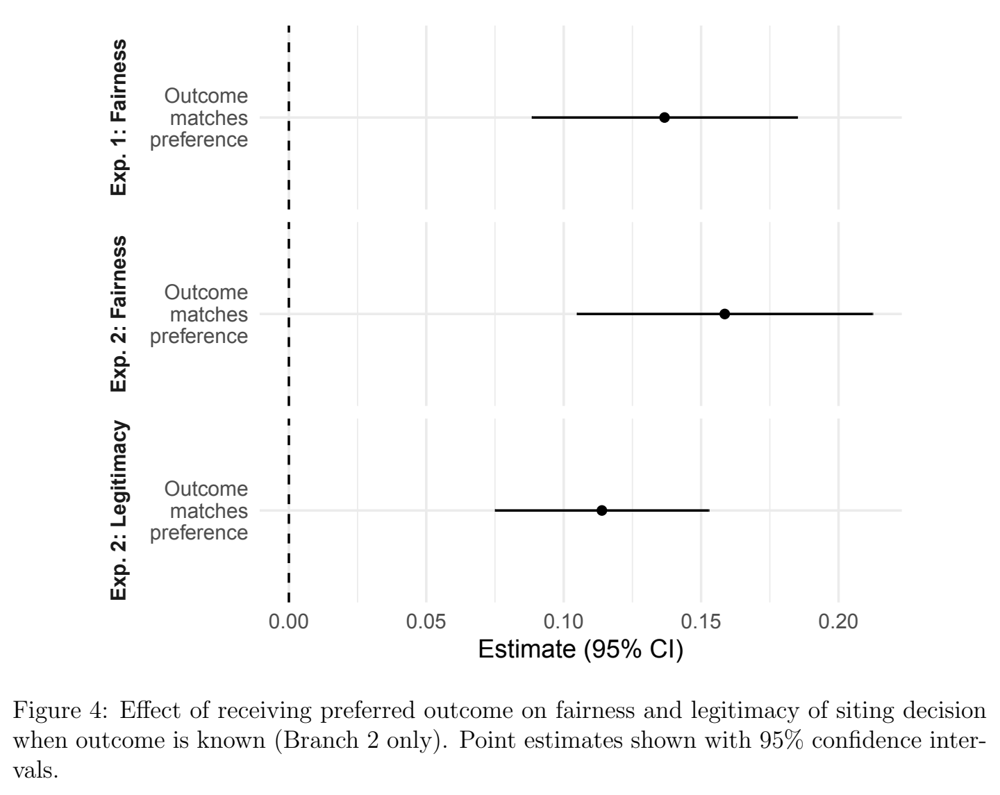

***Figure 4.*** Effect of receiving preferred outcome on fairness and legitimacy of siting decision when outcome is known (Branch 2 only). Point estimates shown with 95% confidence inter- vals.

legitimacy, indicating that process operates within tight constraints. This helps reconcile a long-standing tension in the literature: procedural fairness matters and is resilient to outcomes, but it rarely outweighs substantive preferences.

One potential concern is that the null interactions in Figure 3 reflect insufficient statistical power rather than genuine resilience of process effects. Section J address this concern with a one-sided test against the full-strategic prediction: that the interaction coefficient equals or exceeds the main process effect in magnitude, indicating complete attenuation once the outcome is known. Three of five models reject this null at conventional levels, with a fourth model falling to reject at p = .053. The exceptions are both state board treatments, the smallest main effects of the study, stressing statistical power. Still, the consistent pattern of near zero interactions across all models is broadly consistent with sincere procedural values. Another concern is whether the effects of process vary based on whether the voter received their preferred outcome. Section G investigates this in an non-preregistered exploratory analysis. In four of five treatments, receiving one’s preferred outcome does not alter the negative process effects shown in Figure 2. The exception is the state board treatment on fairness in Experiment 2, where those who receive their preferred outcome are no longer sensitive to who made the decision. One interpretation is that policy winners are able to ignore more ambiguous aspects of procedural fairness such as who made the decision, whereas public input is seen as uniformly fair in an way that cannot be ignored. Given the risk of a false positive and the absence of this pattern in Experiment 1, I interpret this as suggestive rather than conclusive and an avenue for future studies.

Applied to the political process, the presence of sincere procedural values does not mean that all public testimony prior to learning the outcome is sincere. People may bring in all sorts of considerations and motivations that they couch in the language of procedural fairness, noise that this study cannot fully account for. Likewise, changes in process do affect people’s expectations of the likely policy outcome (see Section H). However, within these testimonies is a resilient effect of the process on fairness and legitimacy. In other words,

changes in perceived fairness based on the process are not purely strategic considerations driven by motivated reasoning.

As for governance, state and national governments across North American and Europe are increasingly preempting local control to facilitate the supply of new renewable energy. On one hand, these findings urge caution. This loss of local control and public input will make voters somewhat less accepting of the siting decisions. Over time, this depressed legitimacy risks degrading general trust in government and exacerbating right-wing populist backlash already associated with decarbonization (Bosetti et al. 2025).

On the other hand, ex post evaluations of fairness are mainly driven by whether voters received their preferred outcome, thus introducing bias in past efforts to study these risks. Furthermore, the loss of legitimacy from centralization is modest. Such reforms may not lose many would-be supporters due to procedural fairness. Instead, most project opponents would have opposed the siting outcome regardless of the process. In all, the political losses from centralization are likely less consequential than the ability of these reforms to expedite the deployment of renewable energy.

Still, this study measures average treatment effects within the entire sample. If these modest average effects are larger among a subset of highly engaged, well-resources opponents, then that faction may be influential enough to stymie the deployment of renewable energy or even reverse the centralizing reforms (see Norway above). Future research should assess whether these relatively modest losses of legitimacy translate into behavioral backlash and meaningful consequences for renewable energy deployment. This study provides a framework for such an evaluation, clarifying when process meaningfully sustains legitimacy compared to when it merely reflects underlying disagreements over outcomes.

## References

Altshuler, Alan A and David E Luberoff. 2004. Mega-Projects: The Changing Politics of Urban Public Investment. Rowman & Littlefield.

Andersen, Carsten, Michael Hankinson, Martin Vineas Larsen, Asya Magazinik and Peter Bejerre Mortensen. 2025. The Shape of Democracy: Jurisdiction Boundaries and the Siting of Renewable Energy Infrastructure. Technical report Working Paper.

Anderson, Christopher. 2005. Losers’ consent: Elections and democratic legitimacy. Oxford University Press.

Bartels, Brandon L and Christopher D Johnston. 2020. Curbing the court: Why the public constrains judicial independence. Cambridge University Press.

Bergquist, Parrish, Stephen Ansolabehere, Sanya Carley and David Konisky. 2020. “Backyard voices: how sense of place shapes views of large-scale energy transmission infrastructure.” Energy research & social science 63:101396.

Beyers, Jan and Sarah Arras. 2021. “Stakeholder consultations and the legitimacy of regulatory decision-making: A survey experiment in Belgium.” Regulation & Governance 15(3):877–893.

Bosetti, Valentina, Italo Colantone, Catherine E De Vries and Giorgio Musto. 2025. “Green Backlash and Right-Wing Populism.” Nature Climate Change pp. 1–7.

Brooks, Leah and Zachary Liscow. 2023. “Infrastructure Costs.” American Economic Journal: Applied Economics 15(2):1–30.

Carley, Sanya, David M Konisky, Zoya Atiq and Nick Land. 2020. “Energy infrastructure, NIMBYism, and public opinion: a systematic literature review of three decades of empirical survey literature.” Environmental Research Letters 15(9):093007.

Chaudhuri, Anushree and Lawrence Susskind. 2024. Shifting to State Preemption: The Implications of New Renewable Energy Siting Frameworks in the U.S. Technical report MIT Renewable Energy Clinic.

Coppock, Alexander and Oliver A McClellan. 2019. “Validating the demographic, political, psychological, and experimental results obtained from a new source of online survey respondents.” Research & Politics 6(1):2053168018822174.

Devine-Wright, Patrick and Yuko Howes. 2010. “Disruption to place attachment and the protection of restorative environments: A wind energy case study.” Journal of Environmental Psychology 30(3):271–280.

Einstein, Katherine Levine, David M Glick and Maxwell Palmer. 2019. Neighborhood Defenders: Participatory Politics and America’s Housing Crisis. Cambridge University Press.

Elmallah, Salma and Joseph Rand. 2022. ““After the leases are signed, it’s a done deal”: Exploring procedural injustices for utility-scale wind energy planning in the United States.” Energy Research & Social Science 89:102549.

Esaiasson, Peter, Mikael Persson, Mikael Gilljam and Torun Lindholm. 2016. “Reconsidering the role of procedures for decision acceptance.” British Journal of Political Science 49(1):291–314.

Firestone, Jeremy, Ben Hoen, Joseph Rand, Debi Elliott, Gundula Hu¨bner and Johannes Pohl. 2018. “Reconsidering barriers to wind power projects: community engagement, developer transparency and place.” Journal of Environmental Policy & Planning 20(3):370– 386.

Firestone, Jeremy, Christine Hirt, David Bidwell, Meryl Gardner and Joseph Dwyer. 2020. “Faring well in offshore wind power siting? Trust, engagement and process fairness in the United States.” Energy Research & Social Science 62:101393.

Firestone, Jeremy, Willett Kempton, Meredith Blaydes Lilley and Kateryna Samoteskul. 2012. “Public acceptance of offshore wind power: does perceived fairness of process matter?” Journal of Environmental Planning and Management 55(10):1387–1402.

Gadzanku, Sika, Wenrui Qu, Shahzeen Z Attari, Parrish Bergquist, Sanya Carley, Alison Knasin, David M Konisky, Gilbert Michaud and Jennifer Silva. 2025. “Public attitudes and community engagement in large-scale solar siting.” Environmental Research Letters 20(11):113001.

Gelman, Andrew. 2008. “Scaling regression inputs by dividing by two standard deviations.” Statistics in Medicine 27(15):2865–2873.

Gibson, James L, Gregory A Caldeira and Vanessa A Baird. 1998. “On the legitimacy of national high courts.” American Political Science Review 92(2):343–358.

Grimes, Marcia. 2006. “Organizing consent: The role of procedural fairness in political trust and compliance.” European Journal of Political Research 45(2):285–315.

Gross, Catherine. 2007. “Community perspectives of wind energy in Australia: The application of a justice and community fairness framework to increase social acceptance.” Energy Policy 35(5):2727–2736.

Hankinson, Michael and Asya Magazinnik. 2023. “The supply-equity trade-off: The effect of spatial representation on the local housing supply.” The Journal of Politics 85(3):1033– 1047.

Hartman, Liz. 2024. Wind Turbines: the Bigger, the Better. Technical report U.S. Department of Energy - Office of Critical Minerals and Energy Innovation.

Hoen, Ben, Jeremy Firestone, Joseph Rand, Debi Elliot, Gundula Hu¨bner, Johannes Pohl, Ryan Wiser, Eric Lantz, T Ryan Haac and Ken Kaliski. 2019. “Attitudes of US wind turbine neighbors: analysis of a nationwide survey.” Energy Policy 134:110981.

Hoesch, Karl W, Sarah B Mills, Joseph Rand, Robi Nilson, Douglas L Bessette, Jacob White and Ben Hoen. 2025. “What to expect when you’re expecting engagement: Delivering procedural justice in large-scale solar energy deployment.” Energy Research & Social Science 120:103893.

Jacobs, Daan and Wesley Kaufmann. 2021. “The right kind of participation? The effect of a deliberative mini-public on the perceived legitimacy of public decision-making.” Public Management Review 23(1):91–111.

Lind, E Allan and Tom R Tyler. 1988. The social psychology of procedural justice. Springer Science & Business Media.

Lindvall, Daniel. 2023. “Why municipalities reject wind power: A study on municipal acceptance and rejection of wind power instalments in Sweden.” Energy Policy 180:113664. Liu, Lu, Thijs Bouman, Goda Perlaviciute and Linda Steg. 2020. “Public participation in decision making, perceived procedural fairness and public acceptability of renewable energy projects.” Energy and Climate Change 1:100013.

Martin, Aaron, Gosia Miko(cid:32)lajczak and Raymond Orr. 2022. “Does process matter? Experimental evidence on the effect of procedural fairness on citizens’ evaluations of policy outcomes.” International Political Science Review 43(1):103–117.

Mast, Evan. 2024. “Warding off development: Local control, housing supply, and nimbys.” Review of Economics and Statistics 106(3):671–680.

Nemerever, Zoe and Melissa Rogers. 2021. “Measuring the rural continuum in political science.” Political Analysis 29(3):267–286.

Nilson, Roberta S and Richard C Stedman. 2023. “Reacting to the rural burden: understanding opposition to utility-scale solar development in upstate New York.” Rural Sociology 88(2):578–605.

Nilson, Robi, Joseph Rand, Ben Hoen and Salma Elmallah. 2024. “Halfway up the ladder: Developer practices and perspectives on community engagement for utility-scale renewable energy in the United States.” Energy Research & Social Science 117:103706.

Persson, Mikael, Peter Esaiasson and Mikael Gilljam. 2013. “The effects of direct voting and deliberation on legitimacy beliefs: An experimental study of small group decision-making.” European Political Science Review 5(3):381–399.

Prothro, James W and Charles M Grigg. 1960. “Fundamental principles of democracy: Bases of agreement and disagreement.” The Journal of Politics 22(2):276–294.

Sahn, Alexander. 2025. “Public comment and public policy.” American Journal of Political Science 69(2):685–700.

Schroeder, Jonathan, David Van Riper, Steven Manson, Katherine Knowles, Tracy Kugler, Finn Roberts and Steven Ruggles. 2025. “IPUMS National Historical Geographic Information System: Version 20.0.” http://doi.org/10.18128/D050.V20.0.

Stagnaro, Michael Nicholas, James Druckman, Adam J Berinsky, Antonio Alonso Arechar, Robb Willer and David Rand. 2024. “Representativeness versus attentiveness: a comparison across nine online survey samples.” PsyArXiv 22.

Stokes, Leah C. 2016. “Electoral backlash against climate policy: A natural experiment on retrospective voting and local resistance to public policy.” American Journal of Political Science 60(4):958–974.

Stokes, Leah C, Emma Franzblau, Jessica R Lovering and Chris Miljanich. 2023. “Prevalence and predictors of wind energy opposition in North America.” Proceedings of the National Academy of Sciences 120(40):e2302313120.

Susskind, Lawrence, Jungwoo Chun, Alexander Gant, Chelsea Hodgkins, Jessica Cohen and Sarah Lohmar. 2022. “Sources of opposition to renewable energy projects in the United States.” Energy Policy 165.

Thibaut, John W and Laurens Walker. 1975. “Procedural justice: A psychological analysis.” (No Title) .

Tiebout, Charles M. 1956. “A pure theory of local expenditures.” Journal of Political Economy 64(5):416–424.

Tyler, Tom R. 1994. “Governing amid diversity: The effect of fair decisionmaking procedures on the legitimacy of government.” Law & Society Review 28(4):809–831.

Tyler, Tom R, Jonathan D Casper and Bonnie Fisher. 1989. “Maintaining allegiance toward political authorities: The role of prior attitudes and the use of fair procedures.” American Journal of Political Science pp. 629–652.

Uibeleisen, Maximilian and Constanze Go¨tz. 2024. “BImSchG Amendment: Significant Simplifications for Onshore Wind Farms.”. Accessed: 2026-03-04.

URL: https://www.mcdermottlaw.com/insights/bimschg-amendment-significantsimplifications-for-onshore-wind-farms/

Vasstrøm, Mikaela, David Phillip Rudolph, Hans Kjetil Lysg˚ard and Laura Tolnov Clausen. 2024. “Rescaling wind energy governance–the dynamic interplay between efficiency and justice in energy policy constructions.” Norsk Geografisk Tidsskrift-Norwegian Journal of Geography 78(3):148–165.

Wicki, Michael, Katrin Hofer and David Kaufmann. 2022. “Planning instruments enhance the acceptance of urban densification.” Proceedings of the National Academy of Sciences 119(38):e2201780119.

Wolsink, Maarten. 2007. “Wind power implementation: the nature of public attitudes: equity and fairness instead of ‘backyard motives’.” Renewable and Sustainable Energy Reviews 11(6):1188–1207.

## Supplemental Information

## Contents

A Experiment 1 Survey Instrument A-2 B Experiment 2 Survey Instrument A-7 C Turbine Height Implications A-13 D Descriptive Statistics A-13 E Validation of Legitimacy Scale A-15 F Alignment with Local Government A-18 G Outcome Matches and Perceptions A-20 H Expected Outcomes A-22 I Results in Tabular Form A-24 I.1 Effect of Process . . . . . . . . . . . . . . . . . . . . . . . . . . . . . . . . . A-24 I.2 Resilience of Process . . . . . . . . . . . . . . . . . . . . . . . . . . . . . . . A-29 J One-Sided Test A-33

## A Experiment 1 Survey Instrument

Description of proposed wind farm in respondent’s community (~60 turbines, each 340 feet tall).

Including arguments for and against proposal.

Pre-treatment support for a wind farm in

respondent’s city/town. 7-point Likert scale

Branch 2

Branch 1

Randomize approval process: Randomize approval

● Local government w/ process:

in-person community ● Local government

input

w/ in-person

● State-appointed board of community input

experts w/ minimal ● State-appointed

community input

board of experts

w/ minimal

Randomize policy outcome: community input

● Project is approved ● Project is denied

Dependent variable:

● Fairness

● Property values

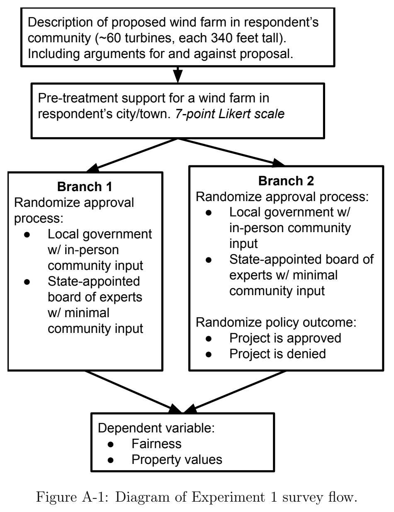

***Figure A-1.*** Diagram of Experiment 1 survey flow.

Consent + Demographics

Standard module of demographic questions and attention checks.

From what you know about global climate change or global warming, which one of the following statements comes closest to your opinion?

• Global climate change has been established as a serious problem, and immediate action is necessary

• There is enough evidence that climate change is taking place and some action should be taken

• We don’t know enough about global climate change, and more research is necessary before we take any actions

• Concern about global climate change is exaggerated. No action is necessary

• Global climate change is not occurring; this is not a real issue

In the United States, local governments are in charge of local public services, property taxes, and how land can be used. On a scale from 1 to 7, how often do you agree with the decisions made by your local government?

• Never

• Very rarely

• Rarely

• Sometimes

• Often

• Very often

• Always

• I don’t know

Transition

We will now show you information regarding a potential scenario in your community. After reading the text, please give your opinions about the topic and other current events. Please pay close attention while reading, as you will be asked questions about the content of this scenario after you’ve read it.

Project Description

A wind energy developer is proposing to build a wind farm on land in your community. They want to build a farm of 60 turbines, each around 340 feet tall, which would power 85,000 homes per year. You would be able to see the wind turbines from your neighborhood.

For context, here’s a visual of the turbine height (far right) compared to other known structures:

Your community is divided. On one hand, some residents are concerned that the facility’s size would harm local property values and affect migrating birds. Residents are also concerned about the aesthetics, landscape change, and potential negative impacts on quality of life due to the turbines.

On the other hand, technical reports estimate that the wind farm would bring over $2 million per year in new tax revenue for local schools and services and reduce greenhouse gas emissions. Finally, others argue that farmers and landowners should have the right to lease their property to wind developers.

20 ft. tall 38 ft. tall 125 ft. tall 305 ft. tall 340 ft. tall Average Utility power Transmission The Statue of Proposed 2-story home pole tower Liberty turbines

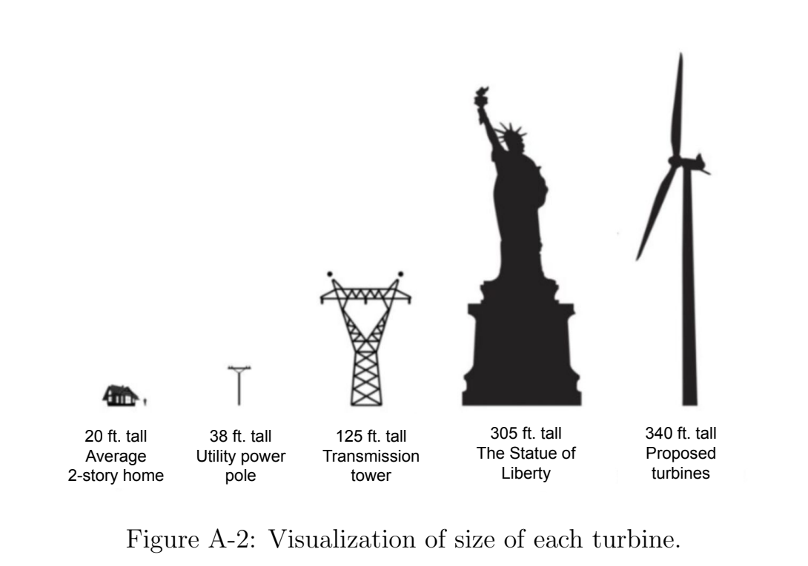

***Figure A-2.*** Visualization of size of each turbine.

Pretreatment Support for Project

Do you support or oppose the development of this wind farm in your community? • Strongly oppose

• Oppose

• Somewhat oppose

• Neither support nor oppose

• Somewhat support

• Support

• Strongly support

In at least two sentences, why do you support or oppose the wind farm? Text box answer. Treatment 1: Process

According to state law, [your locally elected legislators gets / a state-appointed board of energy experts get] to decide on whether the proposed wind farm will be approved or denied. Local residents like yourself can share your opinions by [attending local meetings and voicing your concerns face-to-face with your elected legislators / calling or writing an email to your governor.]

Treatment 2: Policy Outcome (included in Branch 2 only)

After much debate, [your elected local legislators / the state-appointed board of experts] decided to [approve / reject] the wind farm proposal. It will [now / not] be built and this decision is final.

Dependent Variables (both Branch 1 and Branch 2)

Regardless of what you think about the [eventual / NA] decision, do you believe that a vote by [your elected local legislators/the state-appointed board of experts] is a fair way to decide on the approval of new wind energy farms?

• Very unfair

• Unfair

• Somewhat unfair

• Neither fair nor unfair

• Somewhat fair

• Fair

• Very fair

In at least two sentences, why do you believe this method was fair or unfair? Text box answer.

Placebo Check

In your opinion, how [would/will/would have] this proposed wind farm [affect/affected] property values in your community?

• 7 - Greatly increase property values • 4 - No effect on property values

• 1 - Greatly decrease property values

Language conditionals:

• “would” - under Branch 1 - outcome not reported

• “will” - under Branch 2 - project approved

• “would have” - under Branch 2 - project rejected

In your opinion, which of the following processes would be the best way to decide on the approval of new wind farms?

• Majority vote by a state-appointed board of energy experts • Majority vote by elected local government officials

• Majority vote by residents of the community

• Other: [text entry]

• I don’t know

## B Experiment 2 Survey Instrument

Description of proposed wind farm in respondent’s

community (~60 turbines, each 340 feet tall).

Including arguments for and against proposal.

Pre-treatment support for a wind farm in

respondent’s city/town. 7-point Likert scale

Branch 1 Branch 2

Randomize approval process: Randomize approval process: ● Level ● Level

○ Local government ○ Local government ○ State-appointed ○ State-appointed board of experts board of experts ● Input ● Input

○ In-person ○ In-person

○ Drop box-style ○ Drop box-style Expected outcome 5-point Expected outcome 5-point Likert scale Likert scale

Randomize policy outcome ● Project approved

● Project denied

Dependent variables:

● Fairness

● Legitimacy Index

● Effects on property values

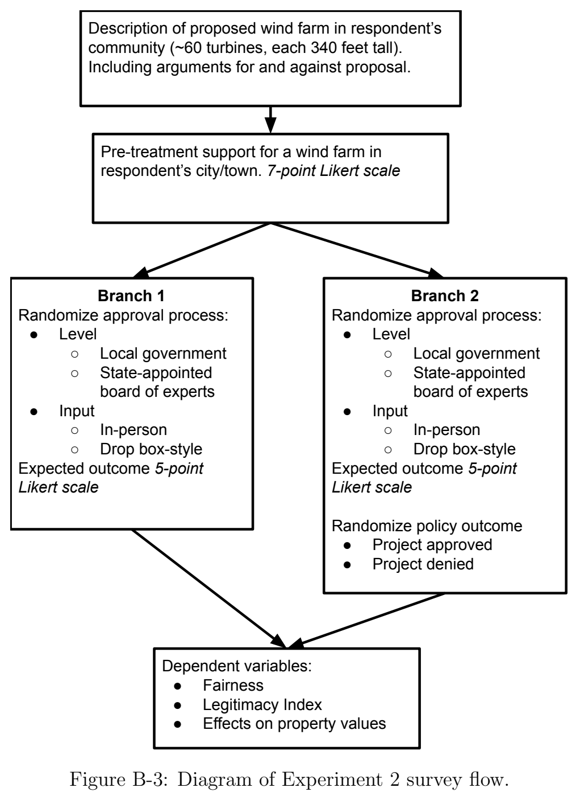

***Figure B-3.*** Diagram of Experiment 2 survey flow.

Consent + Demographics

Standard module of demographic questions and attention checks.

From what you know about global climate change or global warming, which one of the following statements comes closest to your opinion?

• Global climate change has been established as a serious problem, and immediate action is necessary

• There is enough evidence that climate change is taking place and some action should be taken

• We don’t know enough about global climate change, and more research is necessary before we take any actions

• Concern about global climate change is exaggerated. No action is necessary

• Global climate change is not occurring; this is not a real issue

In the United States, local governments are in charge of local public services, property taxes, and how land can be used. On a scale from 1 to 7, how often do you agree with the decisions made by your local government?

• Never

• Very rarely

• Rarely

• Sometimes

• Often

• Very often

• Always

• I don’t know Now, think about your state government. How often do you agree with the decisions made by your state government? • Never

• Very rarely • Rarely

• Sometimes

• Often

• Very often

• Always

• I don’t know

Transition

We will now show you information regarding a potential scenario in your community. After reading the text, please give your opinions about the topic and other current events. Please pay close attention while reading, as you will be asked questions about the content of this scenario after you’ve read it.

Project Description

A wind energy developer is proposing to build a wind farm on land in your community. They want to build a farm of 60 turbines, each around 340 feet tall, which would power 85,000 homes per year. You would be able to see the wind turbines from your neighborhood.

For context, here’s a visual of the turbine height (far right) compared to other known structures:

20 ft. tall 38 ft. tall 125 ft. tall 305 ft. tall 340 ft. tall

Average Utility power Transmission The Statue of Proposed

2-story home pole tower Liberty turbines

***Figure B-4.*** Visualization of size of each turbine.

Your community is divided. On one hand, some residents are concerned that the facility’s size would harm local property values and affect migrating birds. Residents are also concerned about the aesthetics, landscape change, and potential negative impacts on quality of life due to the turbines.

On the other hand, technical reports estimate that the wind farm would bring over $2 million per year in new tax revenue for local schools and services and reduce greenhouse gas emissions. Finally, others argue that farmers and landowners should have the right to lease their property to wind developers.

Pretreatment Support for Project

Do you support or oppose the development of this wind farm in your community?

• Strongly oppose

• Oppose

• Somewhat oppose

• Neither support nor oppose

• Somewhat support

• Support

• Strongly support

In at least two sentences, why do you support or oppose the wind farm? Text box answer. Treatment 1: Process

According to state law, [your locally elected legislators gets / a state-appointed board of energy experts get] to decide on whether the proposed wind farm will be approved or denied. [Your locally elected legislators / A state-appointed board of energy experts] will [hold a series of local public meetings where residents like you can share your opinions face-to-face with the decision makers / set up an email account where residents like you can send your thoughts, but there will be no public meetings about the proposal].

Expected Outcomes

How likely do you think it is that the wind farm proposal will be approved?

• Extremely likely

• Likely

• Somewhat likely

• Equally likely and unlikely

• Somewhat unlikely

• Very unlikely

• Extremely unlikely

Treatment 2: Policy Outcome (included in Branch 2 only) After much debate, [INSTITUTION] decided to [OUTCOME] the wind farm proposal. The wind farm will [MODIFIER] be built.

• INSTITUTION: four unique conditions from fully randomizing the decision-making body and level of public input.

• OUTCOME: deny / approve

• MODIFIER: not / now

Dependent Variables (both Branch 1 and Branch 2)

Regardless of what you think about the [eventual / NA] decision, do you believe that a vote by [INSTITUTION]—after gathering input from residents through [email / public meetings]—is a fair way to decide on the approval of new wind energy farms?

• Extremely unfair

• Unfair

• Somewhat unfair

• Neither fair nor unfair

• Somewhat fair

• Fair

• Extremely fair

Thinking about the process and [eventual / NA] decision, do you agree or disagree with each of the following statements? Matrix table, 5-point scale (strongly agree, agree, neither agree nor disagree, disagree, strongly disagree)

• “This decision ought to be accepted and considered the final word on the matter.”

• “People would be justified in protesting this decision.” (Reverse-coded). Note: This item was excluded from the analysis based on protocol specified in the pre-analysis plan. See Section E for discussion. Results are substantively and statistically unchanged regardless of its exclusion.

• “The body that made this decision had the right to do so.”

• “There ought to be an effort to challenge the decision and get it changed.” (Reversecoded)

• “Even if I personally disagree, I respect the outcome of this process.”

In at least 2 sentences, why do you believe this [eventual / NA] decision [would be / is] either legitimate or illegitimate? Text box answer

Placebo Check

In your opinion, how [would/will/would have] this proposed wind farm [affect/affected] property values in your community?

• 7 - Greatly increase property values

• 4 - No effect on property values

• 1 - Greatly decrease property values

Language conditionals:

• “would” - under Branch 1 - outcome not reported • “will” - under Branch 2 - project approved

• “would have” - under Branch 2 - project rejected

## C Turbine Height Implications

Modern onshore wind turbines have an average hub height of 339 feet (Hartman 2024). Unfortunately, I interpreted that hub height as a tip of blade height in my visualization of the proposed turbines. How may this error have affected the experimental results? Taller turbines are likely to lead to more local opposition, but it is unclear if taller turbines would alter the legitimizing effect of the approval process. Instead, my expectation is that taller turbines would lead to an intercept shift downward—less support and less legitimacy overall—but the process conditions would have similar legitimizing treatment effects.

## D Descriptive Statistics

Tables D-1 and D-2 compare each experiment’s sample to its relevant population. Fielded on Cloud Research Connect, Experiment 1 sampled rural and suburban ZIP codes. To define the comparison group, I use the ZIP codes from which at least one respondent has entered Experiment 1’s sample. For demographic traits, I use NHGIS to collect ZIP (ZCTA)-level data from the 2023 5-year American Community Survey (Schroeder et al. 2025). These ZIP code traits are weighted by their population to reflect the composition of residents themselves.

Experiment 1’s sample reflects the population’s composition of homeownership, gender, and age. Respondents in the sample have slightly lower incomes than the comparison population and are more likely to be white and college educated. The sample is 30% Republican or leans Republican. While partisanship data is not captured in the US Census, I believe that the ZIP population of these areas is slightly more Republican than the sample.

Experiment 2 samples exclusively rural ZIP codes and used demographic quotas based on the ZIP code data. While PureSpectrum has a deeper pool of rural respondents, these quotas were not strict. Still, the sample reflects the rural target population in terms of homeownership, college education, and income. The sample has an over-representation of women, white respondents, and older respondents. The sample is majority (54%) Republican/Republican leaners which is a reasonable target.

Although both samples exhibit modest deviations from their target populations on several demographic traits, these imbalances are unlikely to bias the estimated treatment effects. The treatments in both experiments are fully randomized at the individual level, and all observed demographic traits are controlled for in the analysis. As a result, differences between the sample and the target population may affect the levels of outcomes but not the internal validity of causal comparisons across treatment conditions (Coppock and McClellan 2019).

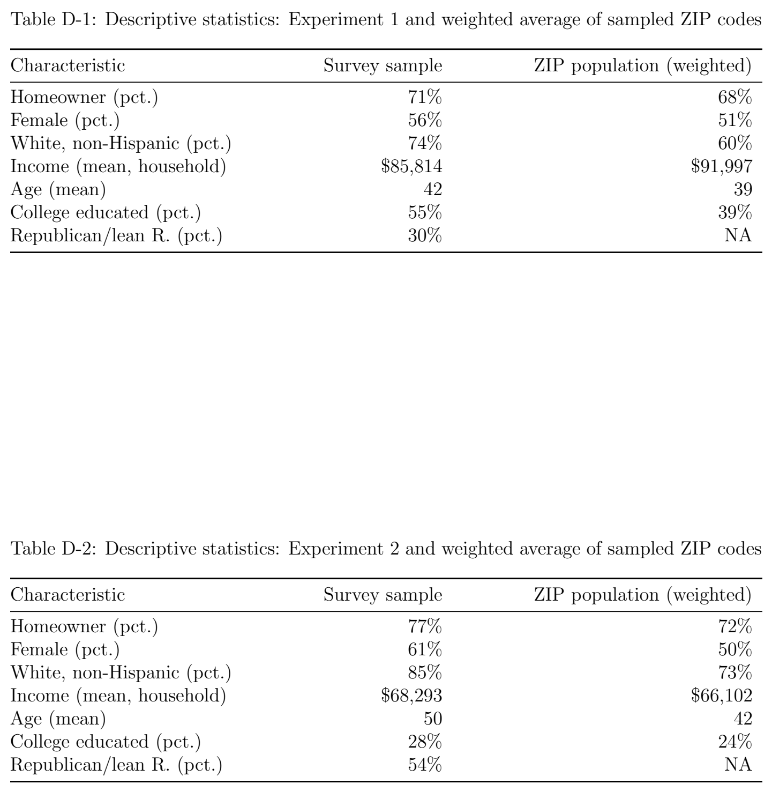

***Table D-1.*** Descriptive statistics: Experiment 1 and weighted average of sampled ZIP codes Characteristic Survey sample ZIP population (weighted) Homeowner (pct.) 71% 68% Female (pct.) 56% 51% White, non-Hispanic (pct.) 74% 60% Income (mean, household) $85,814 $91,997 Age (mean) 42 39 College educated (pct.) 55% 39% Republican/lean R. (pct.) 30% NA

[Download data as CSV](tables/tab-01.csv)

Table D-2: Descriptive statistics: Experiment 2 and weighted average of sampled ZIP codes Characteristic Survey sample ZIP population (weighted) Homeowner (pct.) 77% 72% Female (pct.) 61% 50% White, non-Hispanic (pct.) 85% 73% Income (mean, household) $68,293 $66,102 Age (mean) 50 42 College educated (pct.) 28% 24% Republican/lean R. (pct.) 54% NA

## E Validation of Legitimacy Scale

The survey instrument for Experiment 2 included an original five item legitimacy scale. The items were as follows, with the order randomized: “Thinking about the process and [eventual / NA] decision, do you agree or disagree with each of the following statements?”

• “This decision ought to be accepted and considered the final word on the matter.”

• “People would be justified in protesting this decision.” (Reverse-coded).

• “The body that made this decision had the right to do so.”

• “There ought to be an effort to challenge the decision and get it changed.” (Reversecoded)

• “Even if I personally disagree, I respect the outcome of this process.”

Accept 400

0.0 0.4 0.8 Protest 600 (rev.) 300 0.0 0.4 0.8 Right 500 0.0 0.4 0.8 Change 600 (rev.) 300 0.0 0.4 0.8 Respect 600

0.0 0.4 0.8

tnuoC

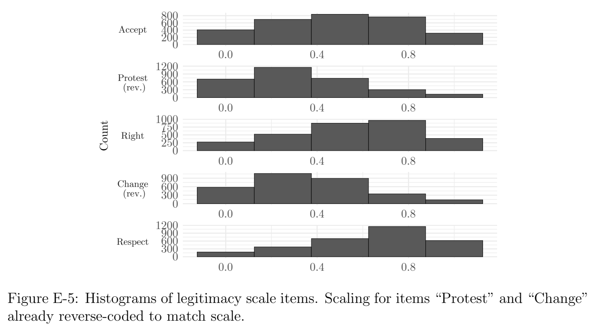

***Figure E-5.*** Histograms of legitimacy scale items. Scaling for items “Protest” and “Change” already reverse-coded to match scale.

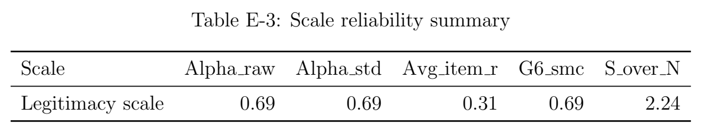

***Table E-3.*** Scale reliability summary

Scale Alpha raw Alpha std Avg item r G6 smc S over N

Legitimacy scale 0.69 0.69 0.31 0.69 2.24

Figure E-5 shows the distribution of support for each statement in the legitimacy scale. Support is reverse-coded for the “Protest” and “Change” items. While support for these two statements is lower than for the others, the heatmap shows positive correlations among

Respect 0.47 0.1 0.5 0.15 1

Change Correlation 0.29 0.47 0.23 1 0.15

(rev.)

1.0 0.5 Right 0.51 0.15 1 0.23 0.5

0.0 −0.5 Protest

0.23 1 0.15 0.47 0.1

(rev.) −1.0 Accept 1 0.23 0.51 0.29 0.47

Acc e pt Pr ot e

s e t v.) Ri g ht

h a n

e ev.)

es p ect

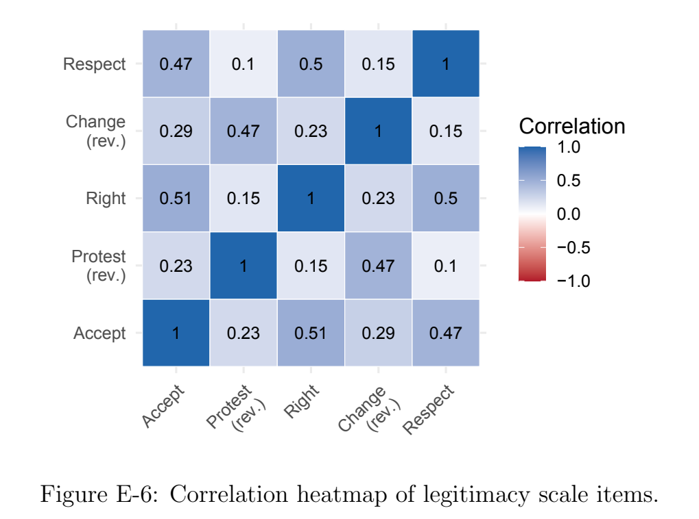

***Figure E-6.*** Correlation heatmap of legitimacy scale items.

all five variables (Figure E-6). Finally, Table S-3 reports summary statistics on the study’s novel legitimacy scale.

The pre-analysis plan notes that items would be dropped to target a Chronbach’s alpha of .70 or higher. With all five items, the Chronbachs’ alpha is .69. Dropping the “Protest” item increases the Chronbach’s alpha to .70. Results are substantively and statistically the same in either approach (Figure E-7). However, to strictly adhere to the pre-analysis plan, the manuscript reports estimates using the four-item legitimacy, excluding the “Protest” item.

ssenriaF ssenriaF ycamitigeL

State board + Limited input State board

Limited input

State board

Limited input

−0.10 −0.05 0.00 Estimate (95% CI)

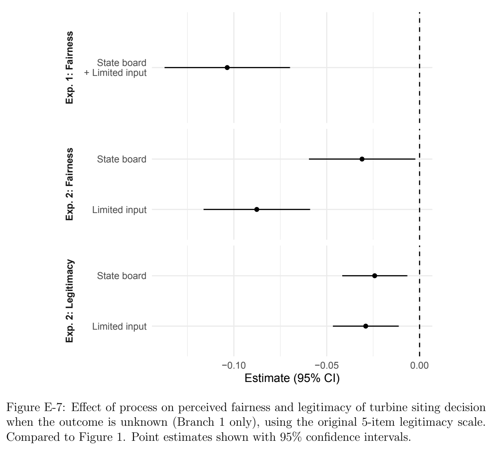

***Figure E-7.*** Effect of process on perceived fairness and legitimacy of turbine siting decision when the outcome is unknown (Branch 1 only), using the original 5-item legitimacy scale. Compared to Figure 1. Point estimates shown with 95% confidence intervals.

## F Alignment with Local Government

One explanation for the effect of level of decision making is that respondents may feel poorly represented by their state government. To test this mechanism, Experiment 1 asked: “How often do you agree with the decisions made by your local government?” I standardize this outcome as a two standard deviation effect to make it akin to a binary variable (Gelman 2008).

Of course, some respondents may feel poorly represented at the state and local level. Experiment 2 instead asked respondents to evaluate their agreement with decisions by their local government and state government. I subtract agreement with state government with agreement with local government to generate a cleaner measure of preference for local government control.

Figure F-8 shows the interactive effect of process with a preference for local government. In Experiment 1, for those who prefer local government, the compound treatment of state board with limited input suggests an even greater decrease in perceived fairness (p = .07), though this measurement of local government preference has flaws. In Experiment 2, for those who prefer local government, a decision made by state board of experts has a similar negative effect of fairness and legitimacy (p < .05). Of course, one’s preference for local government is not randomly assigned, so these respondents may differ in other ways I cannot account for.

Marginal effects Interaction ssenriaF ssenriaF

ycamitigeL

State board + Limited input State board

Limited input

State board

Limited input

−0.2 −0.1 0.0 0.1 −0.2 −0.1 0.0 0.1 Estimate (95% CI)

Local gov't agreement +1 SD from mean −1 SD from mean

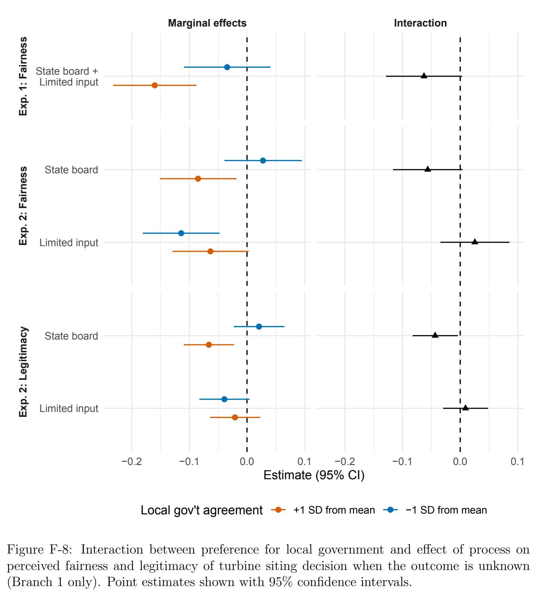

***Figure F-8.*** Interaction between preference for local government and effect of process on perceived fairness and legitimacy of turbine siting decision when the outcome is unknown (Branch 1 only). Point estimates shown with 95% confidence intervals.

## G Outcome Matches and Perceptions

Figure G-9 shows the interaction between match and the process. In 4 out of 5 treatments, getting one’s preferred outcome does not alter the negative effects of process found in Figure

### 1. However, in Experiment 2, the interaction between outcome match and state board is

large enough to negate the negative effect of state board. This suggests that people who receive their preferred outcome are no longer sensitive to who made the decision when judging the fairness of the process. However, those who did not receive their preferred outcome still perceive the state board as less fair than the local elected officials.

It is unclear why this may be the case and I hesitate to overanalyze one interaction from one of the treatments due to the risk of a false positive. Though, for theory generation, perhaps the level of decision maker is fungible in a way that the amount of public input is not. It may be easier to discount a state board as either corrupt or unimportant depending on the outcome compared to discounting public input. Public input may be seen as uniformly fair, regardless of the outcome. That this interaction exists in Experiment 2 but there is no evidence of it in Experiment 1 suggests that more data is needed to understand the stability and meaning of the relationship.

Marginal effects Interaction ssenriaF ssenriaF

ycamitigeL

State board + Limited input State board

Limited input

State board

Limited input

−0.1 0.0 0.1 −0.1 0.0 0.1 Estimate (95% CI)

Outcome match preference? Yes No

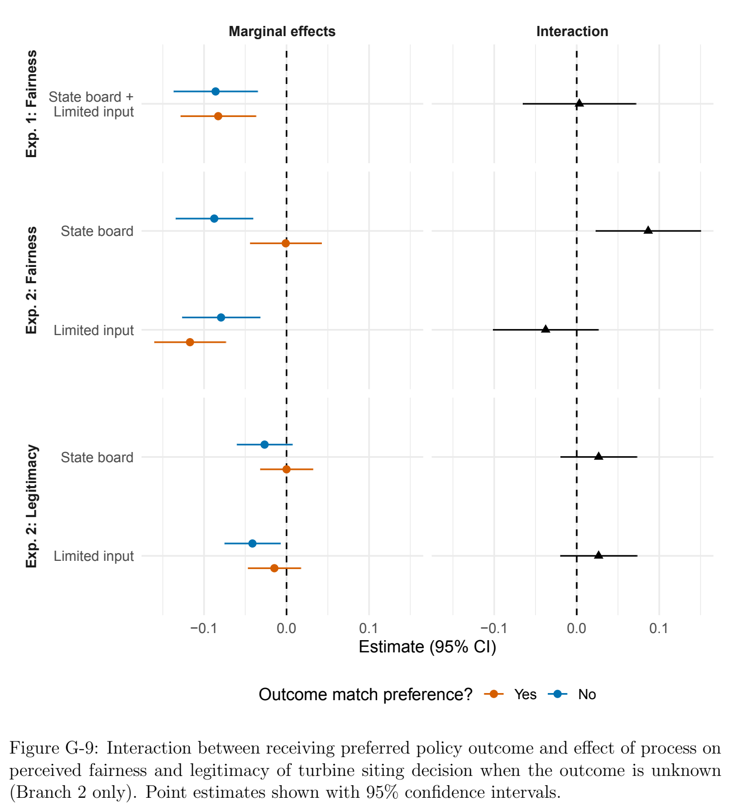

***Figure G-9.*** Interaction between receiving preferred policy outcome and effect of process on perceived fairness and legitimacy of turbine siting decision when the outcome is unknown (Branch 2 only). Point estimates shown with 95% confidence intervals.

## H Expected Outcomes

In Experiment 2, respondents in both Branches 1 and 2 stated their expectations of whether the proposed wind far would be approved or denied following the description of the approval process. Thus, I use both branches in evaluating the effect of process on expectations of outcome. There is little evidence that the process systematically affects expectations of approval (Figure H-10).

However, Figure H-11 displays these effects based on respondents’ pretreatment support for the wind proposal. Surprisingly, respondents differ in their perceptions of how public input will affect the outcome. Pro-wind respondents believe that less public input will decrease the likelihood of approval, whereas anti-wind respondents believe the opposite. Perhaps both groups believe their neighbors share their attitudes, meaning more public input will secure their preferred outcome.

To be clear, that process affects perceptions of the outcome does not negate the independent effect of process on fairness and legitimacy. Respondents may expect different outcomes based on the process, but these outcomes still do not alter the legitimizing effects of procedural fairness.

emoctuo

detcepxE

Limited input

State board

−0.01 0.00 0.01 0.02 0.03

Estimate (95% CI)

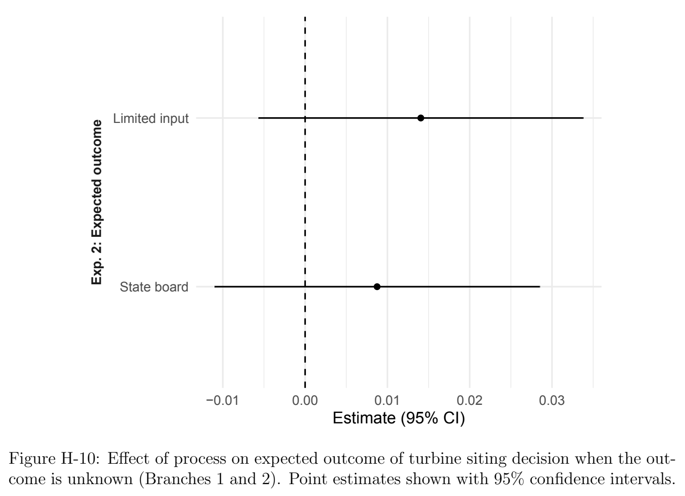

***Figure H-10.*** Effect of process on expected outcome of turbine siting decision when the out- come is unknown (Branches 1 and 2). Point estimates shown with 95% confidence intervals.

Marginal effects Interaction emoctuo

detcepxE

State board

Limited input

−0.10 −0.05 0.00 0.05 0.10 −0.10 −0.05 0.00 0.05 0.10 Estimate (95% CI)

Pretreatment wind support +1 SD from mean −1 SD from mean

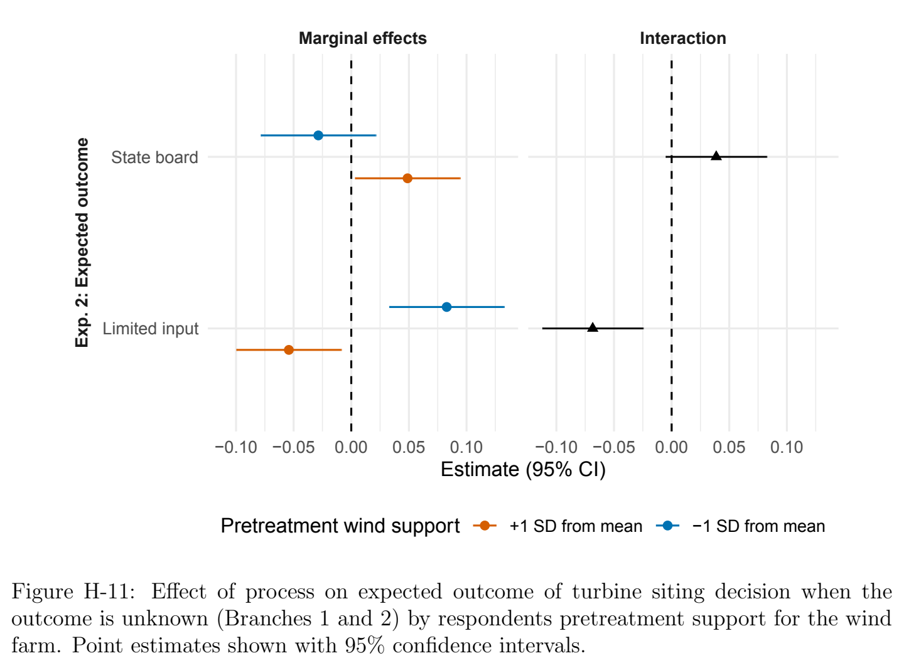

***Figure H-11.*** Effect of process on expected outcome of turbine siting decision when the outcome is unknown (Branches 1 and 2) by respondents pretreatment support for the wind farm. Point estimates shown with 95% confidence intervals.

## I Results in Tabular Form

### I.1 Effect of Process

Experiment 1: Fairness Model 1 Model 2 State board, limited input −0.103∗∗∗ −0.104∗∗∗ Homeowner −0.005 White, non-Hispanic 0.018 Income (cont.) 0.006 Female (bi.) −0.003 College or more 0.041∗ Age −0.002∗ Republican (-1, 1) −0.046∗∗∗ (Intercept) 0.546∗∗∗ 0.550∗∗∗ R2 0.035 0.081

Adj. R2 0.034 0.073

Num. obs. 964 956

RMSE 0.270 0.265

∗∗∗p < 0.001; ∗∗p < 0.01; ∗p < 0.05

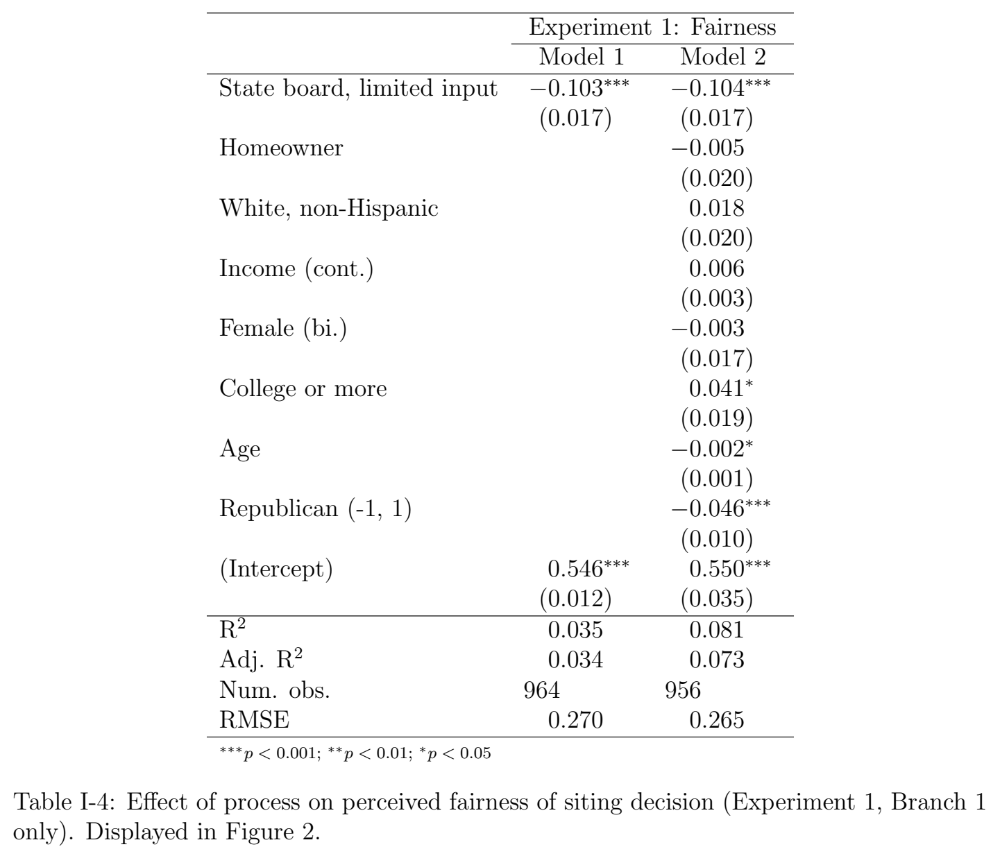

***Table I-4.*** Effect of process on perceived fairness of siting decision (Experiment 1, Branch 1 only). Displayed in Figure 2.

[Download data as CSV](tables/tab-03.csv)

Experiment 2: Fairness Experiment 2: Legitimacy Model 1 Model 2 Model 3 Model 4 Limited input −0.086∗∗∗ −0.088∗∗∗ −0.028∗∗ −0.030∗∗ State board −0.032∗ −0.031∗ −0.024∗ −0.024∗ Homeowner 0.005 −0.021 White, non-Hispanic 0.009 0.022 Income (cont.) −0.006 −0.001 Female (bi.) −0.022 −0.004 College or more 0.010 0.013

Age −0.002∗∗∗ −0.002∗∗∗ Republican (-1, 1) −0.036∗∗∗ −0.025∗∗∗ (Intercept) 0.602∗∗∗ 0.746∗∗∗ 0.524∗∗∗ 0.631∗∗∗ R2 0.024 0.056 0.009 0.055

Adj. R2 0.023 0.051 0.008 0.050

Num. obs. 1564 1527 1536 1500

RMSE 0.287 0.284 0.194 0.191

∗∗∗p < 0.001; ∗∗p < 0.01; ∗p < 0.05

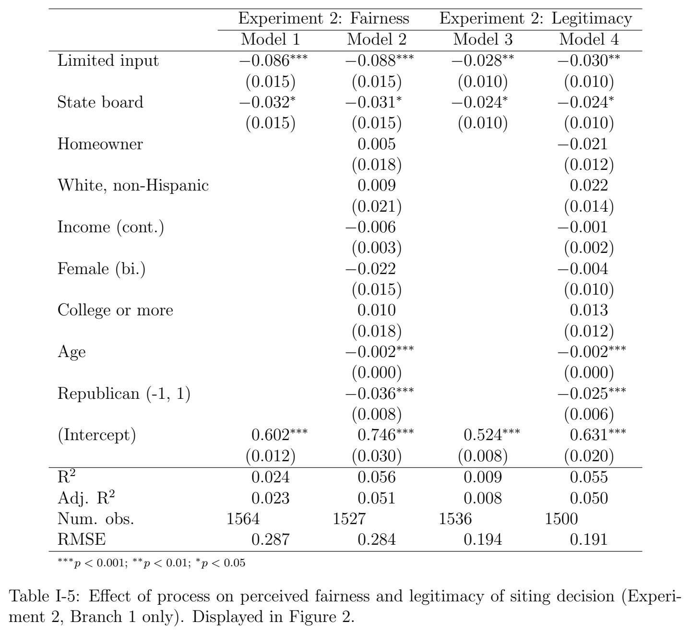

***Table I-5.*** Effect of process on perceived fairness and legitimacy of siting decision (Experi- ment 2, Branch 1 only). Displayed in Figure 2.

[Download data as CSV](tables/tab-04.csv)

Model 1 Model 2 Model 3 Model 4 State board −0.104∗∗∗ −0.091∗∗∗ −0.103∗∗∗ −0.095∗∗∗ Homeowner −0.005 0.004 −0.003 0.002 White, non-Hispanic 0.018 0.009 0.017 0.031 Income (cont.) 0.006 0.006 0.006 0.006 Female (bi.) −0.003 0.013 −0.008 −0.001 College or more 0.041∗ 0.038∗ 0.039∗ 0.041∗ Age −0.002∗ −0.001 −0.001∗ −0.001 Republican (-1, 1) −0.046∗∗∗ −0.001 −0.019 −0.030∗∗ Pretreatment project support 0.328∗∗∗

Climate change concern 0.162∗∗∗

Expected effects on property 0.309∗∗∗ (Intercept) 0.550∗∗∗ 0.312∗∗∗ 0.418∗∗∗ 0.369∗∗∗ R2 0.081 0.189 0.095 0.137

Adj. R2 0.073 0.181 0.086 0.129

Num. obs. 956 956 956 955

RMSE 0.265 0.249 0.263 0.257

∗∗∗p < 0.001; ∗∗p < 0.01; ∗p < 0.05

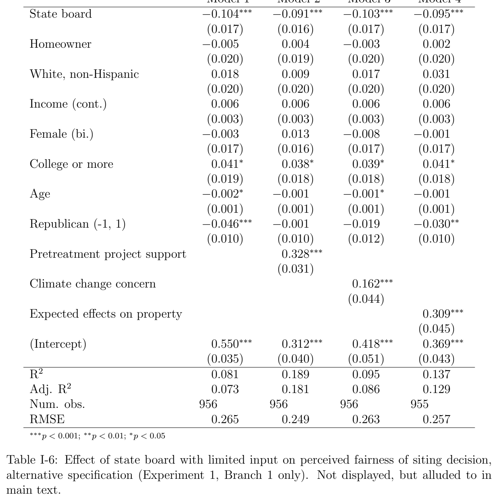

***Table I-6.*** Effect of state board with limited input on perceived fairness of siting decision, alternative specification (Experiment 1, Branch 1 only). Not displayed, but alluded to in main text.

[Download data as CSV](tables/tab-05.csv)

Experiment 1: Fairness Model 1 Model 2 State board, limited input −0.096∗∗∗ −0.097∗∗∗ Prefer local government 0.171∗∗∗ 0.167∗∗∗ State board, limited input x Local preference −0.057 −0.063

Homeowner −0.011 White, non-Hispanic 0.025 Income (cont.) 0.003 Female (bi.) −0.002 College or more 0.029

Age −0.002∗∗∗ Republican (-1, 1) −0.035∗∗∗ (Intercept) 0.541∗∗∗ 0.593∗∗∗ R2 0.109 0.144

Adj. R2 0.106 0.135

Num. obs. 964 956

RMSE 0.260 0.256

∗∗∗p < 0.001; ∗∗p < 0.01; ∗p < 0.05

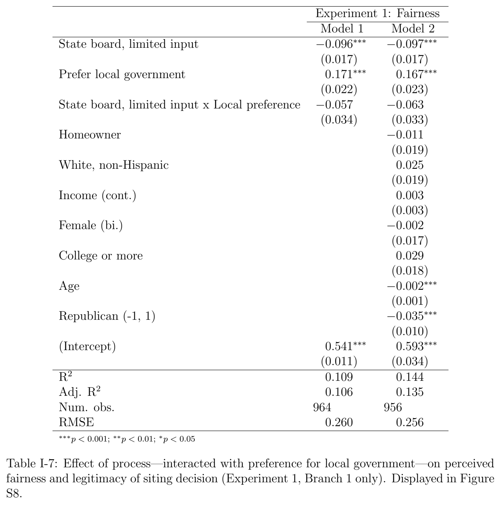

***Table I-7.*** Effect of process—interacted with preference for local government—on perceived fairness and legitimacy of siting decision (Experiment 1, Branch 1 only). Displayed in Figure S8.

[Download data as CSV](tables/tab-06.csv)

Experiment 2: Fairness Experiment 2: Legitimacy Model 1 Model 2 Model 3 Model 4 Limited input −0.087∗∗∗ −0.089∗∗∗ −0.029∗∗ −0.030∗∗ State board −0.030∗ −0.029∗ −0.023∗ −0.023∗ Prefer local government −0.042 −0.034 −0.012 −0.004 Limited input x Local preference 0.036 0.025 0.014 0.009 State board x Local preference −0.056 −0.056 −0.039 −0.043∗ Homeowner 0.006 −0.021 White, non-Hispanic 0.009 0.022 Income (cont.) −0.006 −0.001 Female (bi.) −0.024 −0.005 College or more 0.012 0.014

Age −0.002∗∗∗ −0.002∗∗∗ Republican (-1, 1) −0.036∗∗∗ −0.025∗∗∗ (Intercept) 0.602∗∗∗ 0.743∗∗∗ 0.524∗∗∗ 0.631∗∗∗ R2 0.035 0.066 0.015 0.061

Adj. R2 0.032 0.058 0.012 0.054

Num. obs. 1563 1526 1535 1499

RMSE 0.286 0.283 0.194 0.190

∗∗∗p < 0.001; ∗∗p < 0.01; ∗p < 0.05

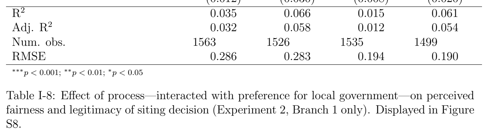

***Table I-8.*** Effect of process—interacted with preference for local government—on perceived fairness and legitimacy of siting decision (Experiment 2, Branch 1 only). Displayed in Figure S8.

[Download data as CSV](tables/tab-07.csv)

### I.2 Resilience of Process

Experiment 1: Fairness Model 1 Model 2 State board, limited input −0.103∗∗∗ −0.104∗∗∗ Outcome known 0.005 0.005 State board, limited input x Outcome known 0.021 0.020 Homeowner 0.008 White, non-Hispanic 0.013 Income (cont.) 0.002 Female (bi.) −0.016 College or more 0.027∗ Age −0.002∗∗∗ Republican (-1, 1) −0.044∗∗∗ (Intercept) 0.546∗∗∗ 0.576∗∗∗ R2 0.029 0.064

Adj. R2 0.028 0.060

Num. obs. 1995 1979

RMSE 0.273 0.268

∗∗∗p < 0.001; ∗∗p < 0.01; ∗p < 0.05

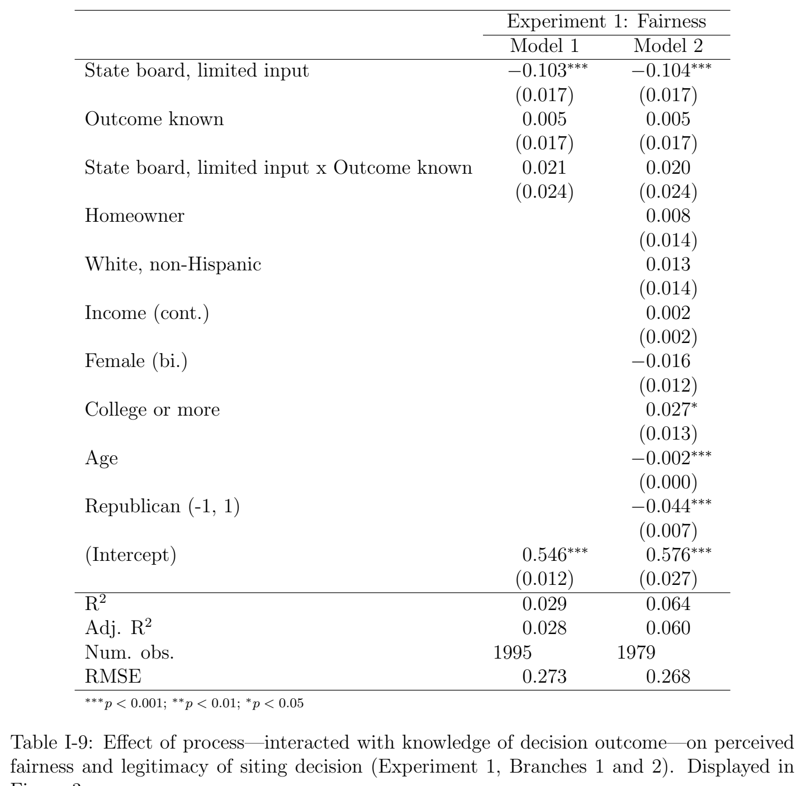

***Table I-9.*** Effect of process—interacted with knowledge of decision outcome—on perceived fairness and legitimacy of siting decision (Experiment 1, Branches 1 and 2). Displayed in

[Download data as CSV](tables/tab-08.csv)

Figure 3.

Experiment 2: Fairness Experiment 2: Legitimacy Model 1 Model 2 Model 3 Model 4 Limited input −0.086∗∗∗ −0.088∗∗∗ −0.028∗∗ −0.029∗∗ State board −0.032∗ −0.033∗ −0.024∗ −0.024∗ Outcome known 0.020 0.019 0.025∗ 0.026∗ Limited input x Outcome known −0.005 −0.006 −0.001 −0.002 State board x Outcome known −0.003 −0.002 0.010 0.013 Homeowner −0.003 −0.011 White, non-Hispanic −0.013 0.002 Income (cont.) −0.005 −0.001 Female (bi.) −0.010 −0.003 College or more 0.020 0.019∗ Age −0.001∗ −0.001∗∗∗ Republican (-1, 1) −0.029∗∗∗ −0.015∗∗∗ (Intercept) 0.602∗∗∗ 0.684∗∗∗ 0.524∗∗∗ 0.585∗∗∗ R2 0.025 0.039 0.012 0.026

Adj. R2 0.024 0.036 0.010 0.022

Num. obs. 3076 3004 3022 2953

RMSE 0.294 0.292 0.204 0.203

∗∗∗p < 0.001; ∗∗p < 0.01; ∗p < 0.05

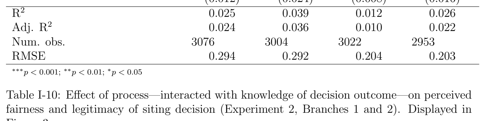

***Table I-10.*** Effect of process—interacted with knowledge of decision outcome—on perceived fairness and legitimacy of siting decision (Experiment 2, Branches 1 and 2). Displayed in

[Download data as CSV](tables/tab-09.csv)

Figure 3.

Experiment 1: Fairness Model 1 Model 2 State board, limited input −0.086∗∗ −0.086∗∗∗ Outcome match 0.139∗∗∗ 0.137∗∗∗ State board, limited input x Outcome match 0.006 0.003

Homeowner 0.017 White, non-Hispanic 0.010 Income (cont.) 0.001 Female (bi.) −0.014 College or more 0.002 Age −0.002∗∗ Republican (-1, 1) −0.043∗∗∗ (Intercept) 0.483∗∗∗ 0.538∗∗∗ R2 0.085 0.114

Adj. R2 0.082 0.104

Num. obs. 953 946

RMSE 0.270 0.267

∗∗∗p < 0.001; ∗∗p < 0.01; ∗p < 0.05

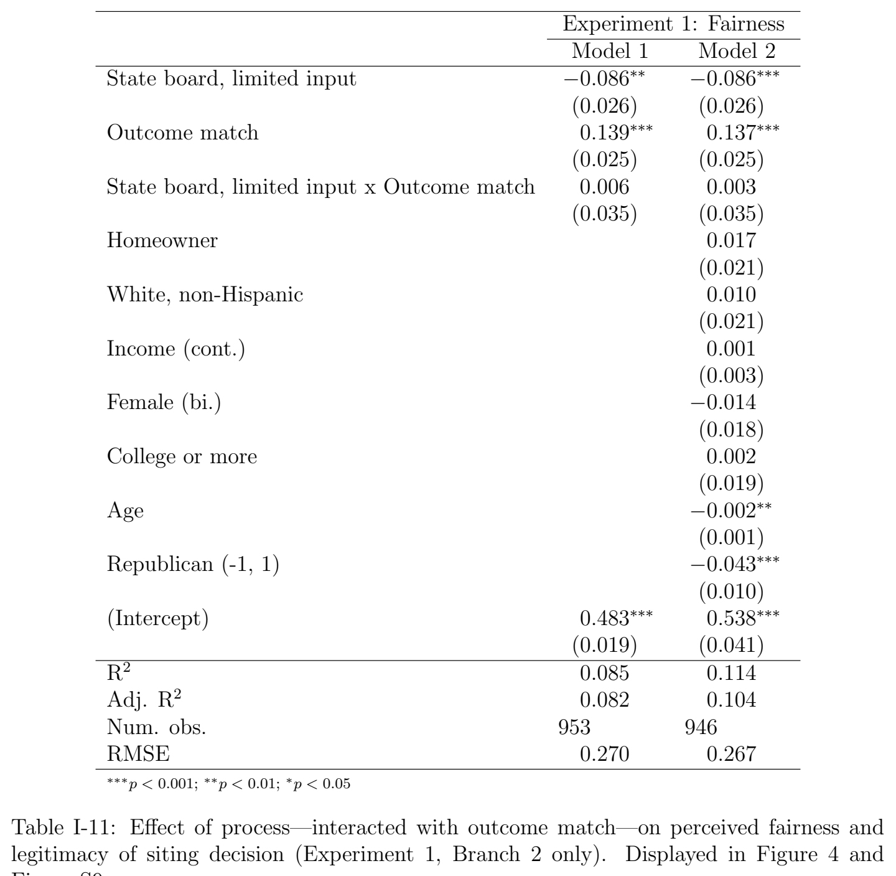

***Table I-11.*** Effect of process—interacted with outcome match—on perceived fairness and legitimacy of siting decision (Experiment 1, Branch 2 only). Displayed in Figure 4 and

[Download data as CSV](tables/tab-10.csv)

Figure S9.

Experiment 2: Fairness Experiment 2: Legitimacy Model 1 Model 2 Model 3 Model 4 Limited input −0.079∗∗∗ −0.079∗∗∗ −0.039∗ −0.041∗ State board −0.088∗∗∗ −0.088∗∗∗ −0.032 −0.027

Outcome match 0.157∗∗∗ 0.159∗∗∗ 0.114∗∗∗ 0.114∗∗∗ Limited input x Outcome match −0.033 −0.038 0.024 0.027 State board x Outcome match 0.086∗∗ 0.087∗∗ 0.031 0.027 Homeowner −0.020 −0.002 White, non-Hispanic −0.033 −0.014 Income (cont.) −0.004 0.000 Female (bi.) 0.016 0.004 College or more 0.033 0.025 Age 0.000 −0.000 Republican (-1, 1) −0.023∗ −0.008 (Intercept) 0.558∗∗∗ 0.581∗∗∗ 0.496∗∗∗ 0.501∗∗∗ R2 0.121 0.135 0.110 0.113

Adj. R2 0.118 0.126 0.107 0.104

Num. obs. 1315 1290 1292 1269

RMSE 0.294 0.292 0.210 0.210

∗∗∗p < 0.001; ∗∗p < 0.01; ∗p < 0.05

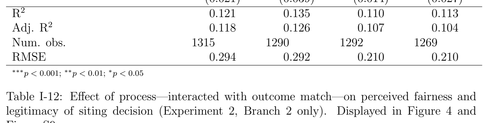

***Table I-12.*** Effect of process—interacted with outcome match—on perceived fairness and legitimacy of siting decision (Experiment 2, Branch 2 only). Displayed in Figure 4 and

[Download data as CSV](tables/tab-11.csv)

Figure S9.

## J One-Sided Test

Table J-13 reports one-sided tests of the full “strategic considerations” null—that the interaction coefficient equals or exceeds the main effect in magnitude, indicating complete attenuation of the process effect once the outcome is known. Three of five models reject this null at conventional levels. For the two largest effects—the compound treatment on fairness in Experiment 1 (β = 0.020, p < .001) and limited public input on fairness in Experiment 2 (β = -0.006, p < .001)—the interactions cluster near zero and are statistically distinguishable from full strategic attenuation despite the relatively modest main effects. Limited public input on legitimacy similarly rejects the strategic null (β = −0.002, p = .018).

The two exceptions are both state board treatments. State board on fairness marginally fails to reject (p = .053), and state board on legitimacy fails more clearly (p = .235). However, both have the smallest main effects in the study (-3.3 and -2.4 percentage points, respectively). Even complete strategic contamination of effects this small would be substantively inconsequential for the paper’s conclusions. The failure to reject the strategic null for these models therefore largely reflects the inherent difficulty of distinguishing near zero effects from other near zero effects, not affirmative evidence for strategic motivation.

Taken together, the pattern is consistent with sincere procedural values: interactions are near zero across all five models, the three largest effects clearly reject full strategic attenuation, and the two exceptions are driven by main effects too small to draw strong inferences in either direction.

Table J-13: One-Sided Tests Against Full Strategic Attenuation

Estimates One-Sided Test

Experiment Outcome Treatment βˆ 1 βˆ 3 SE Benchmark t p Reject H0 Exp 1 Fairness Compound (State Board + Limited Input) -0.104 0.020 0.024 0.104 -3.448 <0.001 Yes Exp 2 Fairness Limited Public Input -0.088 -0.006 0.021 0.088 -4.398 <0.001 Yes Exp 2 Fairness State Board -0.033 -0.002 0.021 0.033 -1.618 0.053 No Exp 2 Legitimacy Limited Public Input -0.029 -0.002 0.015 0.029 -2.101 0.018 Yes Exp 2 Legitimacy State Board -0.024 0.013 0.015 0.024 -0.723 0.235 No