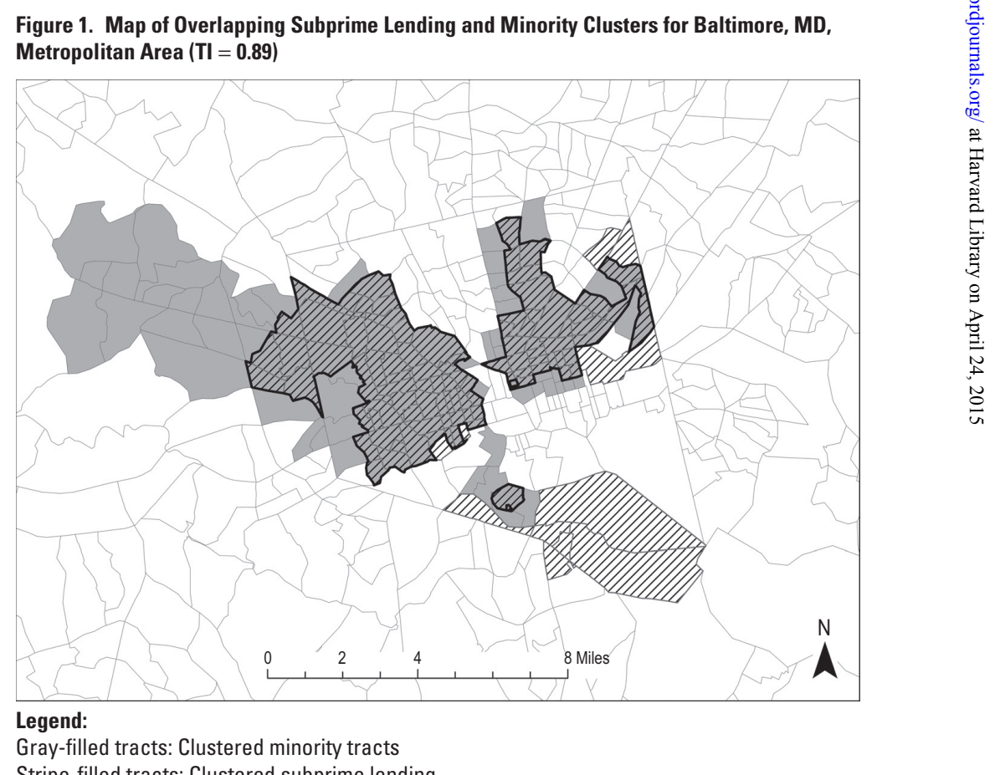
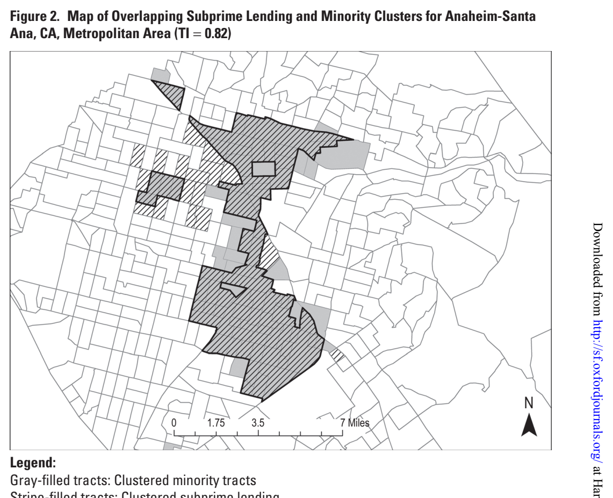
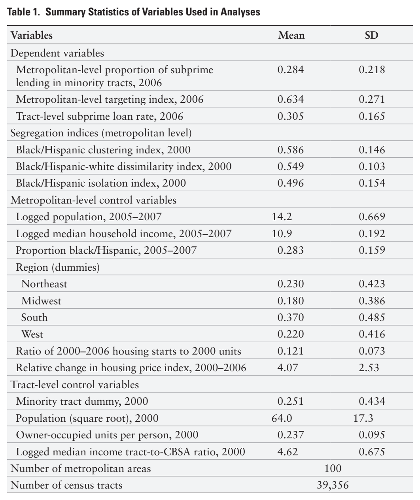
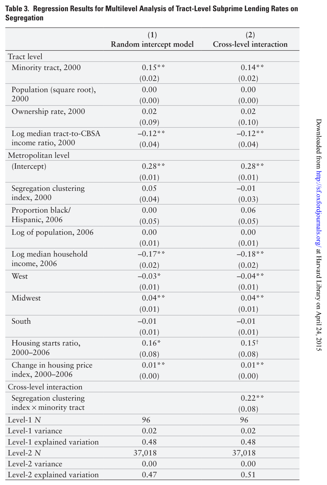
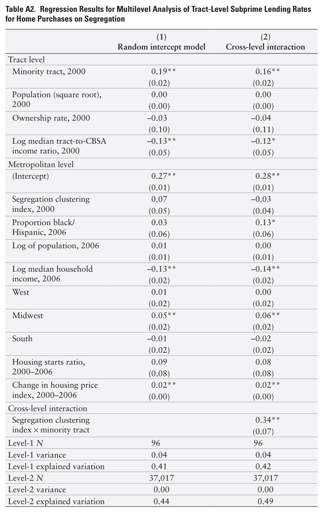

# Recent studies find that high levels of black-white segregation increased rates of

Racial and Spatial Targeting

## Racial and Spatial Targeting: Segregation

## and Subprime Lending within and across

## Metropolitan Areas

Jackelyn Hwang, Harvard University

Michael Hankinson, Harvard University

Kreg Steven Brown, Harvard University

foreclosures and subprime lending across US metropolitan areas during the housing crisis. These studies speculate that segregation created distinct geographic markets that enabled subprime lenders and brokers to leverage the spatial proximity of minorities to disproportionately target minority neighborhoods. Yet, the studies do not explicitly test whether the concentration of subprime loans in minority neighborhoods varied by segregation levels. We address this shortcoming by integrating neighborhoodlevel data and spatial measures of segregation to examine the relationship between segregation and subprime lending across the 100 largest US metropolitan areas. Controlling for alternative explanations of the housing crisis, we find that segregation is strongly associated with higher concentrations of subprime loans in clusters of minority census tracts but find no evidence of unequal lending patterns when we examine minority census tracts in an aspatial way. Moreover, residents of minority census tracts in segregated metropolitan areas had higher likelihoods of receiving subprime loans than their counterparts in less segregated metropolitan areas. Our findings demonstrate that segregation played a pivotal role in the housing crisis by creating relatively larger areas of concentrated minorities into which subprime loans could be efficiently and effectively channeled. These results are consistent with existing but untested theories on the relationship between segregation and the housing crisis in metropolitan areas.

The recent housing foreclosure crisis was a key feature of the Great Recession. The rapid growth of subprime lending and rise of foreclosures impacted the economy and affected millions of homeowners. Many previous studies presented a number of reasons for the increase in subprime lending and foreclosures, The authors thank Ryan Enos, Gary King, Kristin Perkins, Molly Roberts, Brandon Stewart, and the anonymous Social Forces reviewers for helpful suggestions. They also thank Jacob Rugh and Douglas Massey for providing data used in the analysis. They are grateful for funding that was provided by the National Science Foundation Graduate Research Fellowship (Grant DGE-1144152) and the NSF-IGERT Multidisciplinary Program in Inequality & Social Policy at Harvard University (Grant 0333403). Direct correspondence to Jackelyn Hwang, Department of Sociology, William James Hall, 33 Kirkland St., Cambridge, MA 02138, USA: E-mail: jihwang@fas.harvard.edu.

© The Author 2014. Published by Oxford University Press on behalf of the Social Forces 93(3) 1081–1108, March 2015

University of North Carolina at Chapel Hill. All rights reserved. For permissions, doi: 10.1093/sf/sou099

please e-mail: journals.permissions@oup.com. Advance Access publication on 6 November 2014

such as leveraged refinancing, overbuilding, the collapse of home prices, and poor market regulation (Doms, Furlong, and Krainer 2007; Gerardi, Shapiro, and Willen 2007; Glaeser, Gyourko, and Saiz 2008; Haughwout, Peach, and Tracy 2008; Khandani, Lo, and Merton 2009). Several additional studies have argued that racial and ethnic economic inequality and discriminatory lending practices contributed to the disparate impacts of the housing crisis on racial and ethnic minorities (Bond and Williams 2007; Immergluck 2009; Stuart 2003; Williams, Nesiba, and McConnell 2005; Wyly et al. 2006). For example, black and Hispanic borrowers were 2.8 and 2.3 times more likely than whites, respectively, to receive high-rate subprime loans and had foreclosure rates of 11 and 14 percent, respectively, compared to 6 percent for whites (Bocian et al. 2012). Additional research has demonstrated how subprime lending tended to be concentrated within minority neighborhoods, which resulted in uneven consequences of the economic fallout within metropolitan areas (Been, Ellen, and Madar 2009; Calem, Hershaff, and Wachter 2004; Immergluck 2008).

Although many of these studies point to the racialized nature of the foreclosure crisis, only a few studies have considered the role of the metropolitan-level racial and ethnic context as an explanation for how the housing crisis unfolded differently across metropolitan areas (Been, Ellen, and Madar 2009; Hyra et al. 2013; Rugh and Massey 2010). The existing evidence, though limited, suggests that racial residential segregation played a key role in the foreclosure crisis. These studies argue that segregation created unique spatial contexts that allowed subprime lending practices to flourish, thus explaining the uneven impacts of the foreclosure crisis across metropolitan areas (Been, Ellen, and Madar 2009; Hyra et al. 2013; Rugh and Massey 2010). Specifically, these studies posit that high levels of racial residential segregation created distinct geographic markets that enabled subprime lenders and brokers to efficiently and effectively target minority neighborhoods through spatial proximity, resulting in the disproportionately negative fallout of the housing crisis in highly segregated metropolitan areas. Despite agreement on how segregation may have had negative consequences in the housing crisis, these studies do not empirically test whether this pattern of subprime loans flowing to geographically based minority markets varies by levels of segregation. Testing this proposition depends on the spatial concentrations of minorities and subprime loans within metropolitan areas, but the existing analyses that link segregation and the housing crisis operationalize segregation in aspatial ways and do not examine neighborhood-level lending data within metropolitan areas.

Our study contributes to this growing area of research by using spatial measures and neighborhood-level data with a systematic, multi-city approach to test the theory outlined above. We demonstrate that segregation is strongly associated with higher concentrations of subprime loans in clusters of minority census tracts but find no evidence of unequal lending patterns when we examine minority census tracts apart from their surrounding spatial context. Moreover, resi-

dents in minority neighborhoods in segregated metropolitan areas were more

likely to receive subprime loans than their counterparts in less segregated metro-

politan areas. Our results support the theory that segregation produced areas of

spatially clustered minorities, where subprime loans were efficiently and effectively channeled. Therefore, our findings not only support the existing theory of how segregation played a role in the housing crisis but also offer the first systematic test of the intra-metropolitan patterns associated with this relationship.

## Prior Research on Segregation and the Housing Crisis

The publication of Massey and Denton’s (1993) seminal work, American Apartheid, brought scholarly attention to the historical and continuing deleterious effects of racial residential segregation on the life chances of minorities. According to Massey and Denton’s (1993) account, racial residential segregation in the United States dates back to the Great Migration following World War I, when massive numbers of blacks moved from the rural South to Northern and Western cities to meet the labor demands brought by rapid industrialization. These migrants moved to the outskirts of ghettos. As ghettoes expanded with the continued arrival of migrants, whites moved to new neighborhoods, and black migrants moved into the areas whites had left. White residents soon became limited in their housing options and attempted to use neighborhood associations, restrictive covenants, and violence to slow the movement of blacks into their neighborhoods. In addition, a set of lending policies, known as “redlining,” demarcated areas with even very small percentages of blacks to warn lenders not to lend to residents in those neighborhoods or potential buyers seeking to live there. Eventually, as middle-class whites fled to the suburbs, blacks inhabited large swaths of cities but were still constrained in their housing choices due to institutionalized discrimination through housing practices and loan discrimination (Massey and Denton 1993). As a result, black families lost out on the tremendous wealth building that occurred through home equity, contributing to large racial wealth gaps (Oliver and Shapiro 1997).

Although the Fair Housing Act of 1968 made practices like restrictive covenants and redlining illegal, subsequent studies have shown that whites still prefer to live in neighborhoods that are majority white; that lenders disproportionately deny loans to black and Hispanic homebuyers compared to equally qualified whites; and that discrimination against both blacks and Hispanics in the housing-search process persists (see Charles [2003] for a review). Although segregation levels peaked in the 1960s and have generally declined since, the national average remains high (Logan and Stults 2011). Moreover, the drastic growth of the Hispanic and Asian populations in recent decades has introduced new dimensions of racial segregation to metropolitan areas. Hispanic segregation levels tend to be lower than black segregation levels and have increased only slightly from 1970 to 2010, but they remain relatively high and are disproportionately higher in cities with large Hispanic populations. Asian segregation, on the other hand, has remained relatively low and stable (Logan and Stults 2011).

The subprime lending boom brought new ways for racial residential segrega-

tion to have disproportionately negative effects on minorities. Discriminatory

forces that historically made access to homeownership difficult for blacks and

Hispanics operated now through subprime lending and foreclosures. While many studies have demonstrated that blacks and Hispanics disproportionately received subprime loans and underwent foreclosures at the individual and neighborhood level (Bocian et al. 2012; Bond and Williams 2007; Calem, Hershaff, and Wachter 2004; Immergluck 2009; Stuart 2003; Williams, Nesiba, and McConnell 2005; Wyly et al. 2006), only a few studies have considered the role of segregation, a measure of the broader racial and ethnic context of an area, as an explanation for differences in subprime lending and foreclosure rates between metropolitan areas.

Been, Ellen, and Madar (2009) compare metropolitan-level segregation and racial differences in subprime lending in over 200 metropolitan areas and find that black and Hispanic borrowers were more likely than white borrowers to receive a subprime loan for a first home purchase in more segregated metropolitan areas, even after controlling for other borrower characteristics. Recognizing that the results do not show the link between segregated neighborhoods and subprime lending, the authors conduct a separate analysis of census tracts in New York City, which has a high level of segregation, and find that borrowers in tracts with higher shares of blacks were more likely to receive subprime loans. Though implicative, these supplementary results are constrained to a single city and thus do not explain the association between metropolitan-level segregation and subprime lending.

In another study, Rugh and Massey (2010) examine the effect of metropolitanlevel segregation on foreclosure rates across 100 metropolitan areas. Their analysis uses racial differences in subprime lending within metropolitan areas as an instrumental variable and controls for a number of economic factors, such as increases in home building and housing-price inflation. They demonstrate that black-white segregation, but not Hispanic-white segregation, played a causal role in producing an unprecedented number of foreclosures in highly segregated metropolitan areas. In a similar analysis, Hyra et al. (2013) examine the relationship between metropolitan-level segregation and subprime lending rates. Using a different instrumental variable—the number of municipal governments in each metropolitan area in 1997—and including additional controls, such as access to bank branches, the study shows that black-white segregation, but not Hispanic-white segregation, had a positive impact on metropolitan-level subprime lending rates.

Taken together, these studies agree that segregation played an important role in the housing crisis. The authors suggest that the forces of segregation spatially concentrated blacks and Hispanics within metropolitan areas into clusters of minorities that served as targetable markets to fuel the profitable trading of mortgage-backed securities for subprime lenders and brokers. Given that blacks and Hispanics had lower homeownership rates than whites due to historically limited access and typically weaker economic positions, these areas of spatially concentrated minorities likely provided the necessary demand

in return, with residents having limited access to alternative lending options

and information networks, thereby making lending exploitation easy and spa-

tially efficient (Lardner 2008; Been, Ellen, and Madar 2009; Rugh and Massey

2010). They posit that minority neighborhoods received a higher proportion of subprime loans as a result, and because many of the subprime loans during the housing crisis resulted in foreclosures, the effects of the crisis were consequently concentrated in the high-minority neighborhoods of highly segregated metropolitan areas (Rugh and Massey 2010). Following this logic, metropolitan areas with higher spatial concentrations of minorities should have higher rates of subprime lending and foreclosures. (For a full review, see Rugh and Massey [2010].)

In sum, these studies speculate that a particular intra-metropolitan pattern of subprime lending should emerge as a result of the unique spatial context produced by segregation. Thus, this pattern of subprime lending depends on the spatial concentrations of both minorities and subprime loans within metropolitan areas. However, none of these studies test whether this pattern varies across metropolitan areas by segregation levels. A test of this relationship would shed light on how segregation impacts the prevalence of subprime lending and foreclosures.

## Strategy and Hypotheses

Our study tests whether minority neighborhoods in metropolitan areas with higher levels of segregation were especially vulnerable to subprime lending. The existing literature argues that segregation impacts metropolitan-level subprime lending through a process that occurs within metropolitan areas, in which subprime lending occurs more in high-minority neighborhoods. We therefore integrate census tract-level data on originated subprime loans and demographic characteristics with metropolitan-level measures related to the housing crisis and demographic characteristics. Using these data, we examine where and to what degree subprime loans and minorities were spatially concentrated within metropolitan areas using Geographic Information Systems (GIS) software.

Based on the literature reviewed above, we expect that subprime lending will be more concentrated in minority neighborhoods within highly segregated metropolitan areas. We conceptualize and thereby operationalize minority “neighborhoods” using two approaches to appropriately assess our hypotheses and capture the social process of interest. First, like most large-scale neighborhood studies, we use census tracts as a proxy for neighborhoods. Nevertheless, the literature on segregation and the housing crisis specifically suggests that high levels of segregation are associated with subprime loan markets that can be efficiently and effectively targeted through the geographic clustering of minorities. Examining census tracts, which have average populations of 4,000 residents, may not capture these markets that can be efficiently targeted by lenders and brokers, but minority census tracts surrounded by other minority tracts—larger numbers of minorities in geographic proximity to one another—may better rep-

resent a targetable market for subprime lending. Therefore, we also operational-

ize neighborhoods as racially based clusters of census tracts. We hypothesize the

following for each approach:

H1: Subprime loans will be more concentrated in minority census tracts in highly segregated metropolitan areas than in less segregated metro-

politan areas.

H2: Subprime loans will be more concentrated in clusters of minority

census tracts in highly segregated metropolitan areas than in less segre-

gated metropolitan areas.

These hypotheses compare patterns of subprime lending across metropolitan areas; however, we can also compare subprime lending patterns across neighborhoods to examine whether minority neighborhoods in highly segregated metropolitan areas are worse off than their counterparts in metropolitan areas with low levels of segregation. This approach allows us to account for socioeconomic differences between minority neighborhoods. We hypothesize the following:

H3: Rates of subprime lending will be higher in minority census tracts

in highly segregated metropolitan areas than in less segregated metro-

politan areas.

Consequently, to test our third hypothesis, we use a multilevel modeling approach and consider neighborhoods as census tracts nested within metropolitan areas. We do not consider clusters of census tracts as neighborhoods in this part of the analysis, to maintain comparable units of analysis across metropolitan areas. Although our study examines patterns of subprime lending that are consistent with a process of lender and broker targeting that others have asserted (e.g., Been, Ellen, and Madar 2009), the data and analysis do not show whether intentionally discriminatory lending practices took place during the peak of subprime lending or whether residents in segregated metropolitan areas had limited access to information networks.

## Data and Methods

We test our hypotheses using 2006 tract-level loan data from the Home Mortgage Disclosure Act (HMDA) report (http://www.ffiec.gov/hmda) with tract-level data from the 2000 US Census (http://factfinder2.census.gov), metropolitan-level 2005–2007 American Community Survey three-year estimates (http://factfinder2.census.gov), and metropolitan-level housing and foreclosure data obtained from Jacob Rugh and Douglas Massey for the 100 largest US metropolitan areas.1 Under HMDA, the Federal Financial Institutions Examination Council (FFIEC) maintains a register of all loan applications in a given year with loan details, such as whether it was subprime (having an interest rate at origination 3 percent or greater than a comparable US Treasury security) and its purpose (e.g., purchase, refinance). In addition, all of the loan applications are geocoded to the census tract level and then linked with demographic data for the tract. For this analysis, we use only loans that reached the final stage

of origination in the 100 largest metropolitan areas, measured as Core Based

Statistical Areas (CBSAs).2 These metropolitan areas contain over 77 percent of

all foreclosures in 2006–2008 and housed the vast majority of minorities based

on the 2000 US Census—over 75 percent of African Americans, 80 percent of Hispanics, and 90 percent of Asians (Rugh and Massey 2010).

### Dependent Variables

Our analysis proceeds in three parts following each hypothesis. The dependent variables for each part are as follows: metropolitan-level degree of subprime lending in minority census tracts (H ), metropolitan-level degree of subprime lending in clusters of minority census tracts (H ), and census tract-level subprime loan rates (H ).

For our first dependent variable, we calculate the proportion of a metropolitan area’s subprime loans that are in majority-minority census tracts—that is, having a population over 50 percent black and/or Hispanic based on 2000 US Census data. We include both blacks and Hispanics, but not Asians, to identify majority-minority tracts because blacks and Hispanics, but not Asians, disproportionately received subprime loans (Bocian et al. 2012). We also ran all analyses examining majority-black tracts separately, and we note differences in the results below.

To test our second hypothesis, we construct a “targeting index” (TI) to capture the degree of subprime lending in clusters of minority tracts in each metropolitan area. To construct the TI, we identify spatial clusters of subprime loans and spatial clusters of minority tracts using a Local Moran’s I, a measure of spatial autocorrelation, in GIS software (see Anselin [1988]).3 We used a dummy variable to indicate majority-minority census tracts, as defined above, considering blacks and Hispanics both together and separately. To avoid a sharp discontinuity at the threshold of 50 percent minorities, we included a soft boundary by incorporating tracts that were between 40 and 50 percent minority to identify clusters of minority tracts.4 About 22.7 percent of the tracts in the sample were located in a cluster of minority census tracts.

After we identify both minority clusters and subprime loan clusters, we identify census tracts that belong to both types of clusters. For each metropolitan area, we calculate the proportion of the population in subprime lending clusters that are also in minority clusters. This proportion accounts for variation in the size and population of census tracts and represents the TI—the proportion of the subprime lending market that is spatially concentrated in clusters of minority tracts. If subprime lending is completely contained within the boundaries of minority clusters, the TI would have a value of 1. Alternatively, if a metropolitan area’s subprime loan clusters spill beyond the minority clusters’ boundaries, then the TI value will be between 0 and 1. In this case, segregated minority tracts are not the only victims of subprime lending. A metropolitan area would have a TI value of 0 if the clusters of subprime loans do not share any tracts with minority clusters, or if minorities were randomly distributed such that minority clusters did not exist in a metropolitan area. In addition, the Local Moran’s I

relies on variation to identify spatial clustering, and therefore metropolitan areas

with no variation in the distribution of subprime loans across tracts will have

null values. Four metropolitan areas produced null values by not having clusters

of subprime loans: El Paso, TX; Honolulu, HI; Portland, OR; and Scranton, PA. These four metropolitan areas are excluded from the analysis.

Figures 1 and 2 present maps of the Baltimore, MD, and Anaheim-Santa Ana, CA, metropolitan areas, respectively, and show each metropolitan area’s subprime loan and minority clusters and where they overlap. While the minority population in Baltimore is predominantly black and that in Anaheim-Santa Ana is predominantly Hispanic, both of their TI values are relatively high—0.89 and 0.82, respectively, which demonstrates that the relationship between minority clusters and subprime clusters can occur in metropolitan areas with either predominantly black or predominantly Hispanic minorities.

Finally, for our third hypothesis, we calculate the proportion of originated loans in each census tract that are subprime.

### Explanatory Variables

We measure our main explanatory variable of interest—metropolitan-level racial segregation—based on race-based spatial patterns within each metropolitan area. While most studies of segregation use the dissimilarity and isolation indices to operationalize segregation, the spatial aspects of segregation

***Figure 1.*** Map of Overlapping Subprime Lending and Minority Clusters for Baltimore, MD, Metropolitan Area (TI = 0.89)

0 2 4 8 Miles

Legend:

Gray-filled tracts: Clustered minority tracts

Stripe-filled tracts: Clustered subprime lending

Bolded-outlined tracts: Overlapping clusters

***Figure 2.*** Map of Overlapping Subprime Lending and Minority Clusters for Anaheim-Santa Ana, CA, Metropolitan Area (TI = 0.82)

0 1.75 3.5 7 Miles

Legend:

Gray-filled tracts: Clustered minority tracts

Stripe-filled tracts: Clustered subprime lending

Bolded-outlined tracts: Overlapping clusters

are absent from these measures (Brown and Chung 2006). The dissimilarity index measures the evenness between two groups by calculating the proportion of people in a smaller geographic unit (e.g., census tract) who would have to move so that the two groups are evenly distributed across a larger geographic unit (e.g., metropolitan area). The isolation index measures the exposure of one group to another group, which is calculated using the percentage of a group within a smaller geographic unit (e.g., census tract) for the average person in that group within the larger geographic unit (e.g., metropolitan area). An alternative measure—the clustering index—is a measure of the degree to which members of a group live close to one another, forming contiguous spatial areas.

For our purposes, the clustering index is a theoretically better measure than the more commonly used indices because it captures the degree to which spatially targetable markets of minorities exist in metropolitan areas—a key feature of the theoretical accounts linking segregation and the housing crisis. As Brown and Chung (2006) illustrate, multiple patterns, including scattered minority

tracts, can represent very high levels of segregation measured by the dissimilar-

ity index. Thus, a metropolitan area that is highly segregated according to the

dissimilarity index may not have any clusters of minority tracts. The isolation

index, however, is highly correlated with the clustering index but is measured in an aspatial way (Brown and Chung 2006).

Studies on segregation generally consider black-white and Hispanic-white segregation separately, but in our analyses, we use a joint black/Hispanic-white segregation index. The presence and degree of segregation of blacks and Hispanics varies widely across and within metropolitan areas. The rapidly growing Hispanic population and economic similarity between blacks and Hispanics in some contexts have resulted in the moderately high and recent rise of Hispanicwhite segregation levels (Logan and Stults 2011; Rugh and Massey 2013). In some metropolitan areas, blacks and Hispanics live in their own segregated spaces within the same metropolitan areas, and in others, they are increasingly living in the same or proximate spaces with each other (Alba, Logan, and Stults 2000). Moreover, some metropolitan areas have a substantial presence of only one of the groups. Thus, black-white and Hispanic-white segregation levels may be substantially different in the same metropolitan areas and may not accurately reflect the degree to which both groups are spatially segregated. Consequently, measuring the impact of black-white and Hispanic-white segregation separately across a large number of metropolitan areas can over- or underestimate the impact of racial segregation on patterns of subprime lending, depending on the prevalence of one group’s segregation compared to another.

There are also related technical reasons for analyzing black and Hispanic segregation together across a large number of metropolitan areas. We use the Global Moran’s I in GIS software to create a clustering index for each metropolitan area.5 Like the Local Moran’s I, the Global Moran’s I relies on variation among the population of census tracts, and metropolitan areas that do not have sufficient variation among tracts will produce null values. When we calculate the clustering index for blacks and Hispanics separately, 20 and 35 metropolitan areas, respectively, yield null values for the black and Hispanic clustering indices. Within these metropolitan areas, the minority group is either nearly absent or comprises the entire population in all tracts. For example, the Baltimore metropolitan area has a black clustering index of 0.71 but a Hispanic clustering index of 0, whereas the Anaheim-Santa Ana metropolitan area has a null black clustering index but a Hispanic clustering index of 0.61. Yet, both metropolitan areas have high shares of subprime loans in clusters of minority census tracts. Therefore, for both theoretical and technical reasons, we combine blacks and Hispanics to create a black/Hispanic clustering index for our main analyses to compare segregation across a large number of metropolitan areas. Four metropolitan areas produce null values for the clustering index and are therefore excluded from our analysis: Cambridge, MA; Honolulu, HI; McAllen, TX; and Scranton, PA. For example, Honolulu and McAllen consist of predominantly minority tracts, while Cambridge and Scranton have nearly no majority-minority tracts. The clustering index for the remaining 96 metropolitan areas has correlations of 0.58 and 0.51 with the black/Hispanic-white dissimilarity and black/

Hispanic isolation indices, respectively.6 While the dissimilarity and isolation

indices can range from 0 to 1, the Global Moran’s I can range from –1 (perfect

dispersion) to 1 (perfect correlation), with 0 indicating that the distribution of

minorities is random. In our sample, the clustering indices range from 0.11 to

### 0.84. In the presentation of results, we also note results from analyses using dis-

similarity and isolation indices, as well as analyses examining black-white and Hispanic-white segregation indices separately for the metropolitan areas with values for the respective indices.

In addition to segregation, prior research identifies several metropolitanlevel alternative factors that have also influenced the housing crisis. Below, we explain these factors and the relevant control variables that we include in our models to account for them. First, we use the following demographic control variables for each metropolitan area: population (logged), median household income (logged), and percent black or Hispanic from the 2005–2007 American Community Survey three-year estimates, which we label 2006 for simplicity. Metropolitan areas with lower socioeconomic status or more minorities may have higher rates of subprime lending because lower-income and minority borrowers received relatively more subprime loans (Bocian et al. 2012). In addition, we include dummy variables to control for regional differences between housing markets.

We also control for real estate market conditions by including measures of overbuilding and the housing-price boom, which were constructed by Rugh and Massey (2010). Several studies identify these factors as primary causes of the housing-market crash (Gerardi, Shapiro, and Willen 2007; Glaeser, Gyourko, and Saiz 2008). The overbuilding measure is the ratio of 2000–2006 metropolitanarea housing starts to 2000 housing units, and the housing-price-boom measure uses the Federal Housing Finance Agency’s Housing Price Index (HPI)—a weighted, repeat sales index for transactions for single-family homes—and divides the annualized change in HPI from 2000 to 2006 by the annualized change from 1980 to 2000. We also considered the following control variables based on prior studies examining metropolitan-level variation in the housing crisis (Been, Ellen, and Madar 2009; Rugh and Massey 2010; Hyra et al. 2013): median age of the housing stock, Wharton Land Use Regulation Index, percent of loans made by lenders covered by the Community Reinvestment Act, percent of homeowners with a second mortgage, 2006 unemployment rate, change in unemployment rate (2000–2006), coastal location, Rio Grande border location, percent of loans that were subprime (2004–2006), Experian metropolitan-area credit-score index, percent of the population over 25 years old with a college degree, and percent of the workforce that is unionized. When added to our base set of controls, these additional variables almost uniformly lacked statistical significance and swayed neither the significance nor the magnitude of our explanatory variable. Given our limited sample size, we present results without these variables for parsimony.

To test our third hypothesis, the units of analysis are census tracts, and we use a dummy variable to indicate whether a tract is majority-minority. Tract-level socioeconomic conditions offer likely explanations for why subprime loans may

be concentrated in minority tracts, independent of contemporary effects of segre-

gation. For example, residents in minority tracts may also be disproportionately

economically disadvantaged and thus more likely recipients of high-risk loans.

Therefore, we control for the tract-level population size (square root), owneroccupied units as a proportion of the tract population, and the logged ratio of the median tract income to the median metropolitan-area income, obtained from the FFIEC Census Reports, which rely on 2000 US Census data. All variable transformations are intended to induce linearity to satisfy the linearity assumptions of our models, and our choices of transformations are based on the respective distributions of the relevant variables. Table 1 provides descriptive statistics for the variables used in our analysis. The variables that we constructed and used in the analysis are available in a data repository (http://thedata. harvard. edu/dvn/dv/segspl).

***Table 1.*** Summary Statistics of Variables Used in Analyses Variables Mean SD Dependent variables Metropolitan-level proportion of subprime 0.284 0.218 lending in minority tracts, 2006 Metropolitan-level targeting index, 2006 0.634 0.271 Tract-level subprime loan rate, 2006 0.305 0.165 Segregation indices (metropolitan level) Black/Hispanic clustering index, 2000 0.586 0.146

[Download data as CSV](tables/tab-01.csv)

Black/Hispanic-white dissimilarity index, 2000 0.549 0.103 Black/Hispanic isolation index, 2000 0.496 0.154 Metropolitan-level control variables

Logged population, 2005–2007 14.2 0.669 Logged median household income, 2005–2007 10.9 0.192 Proportion black/Hispanic, 2005–2007 0.283 0.159 Region (dummies)

Northeast 0.230 0.423 Midwest 0.180 0.386 South 0.370 0.485 West 0.220 0.416 Ratio of 2000–2006 housing starts to 2000 units 0.121 0.073 Relative change in housing price index, 2000–2006 4.07 2.53 Tract-level control variables

Minority tract dummy, 2000 0.251 0.434 Population (square root), 2000 64.0 17.3 Owner-occupied units per person, 2000 0.237 0.095

Logged median income tract-to-CBSA ratio, 2000 4.62 0.675

Number of metropolitan areas 100

Number of census tracts 39,356

### Model Specifications

To assess our first hypothesis, we estimate the following ordinary least squares (OLS) regression model:

Proportion of Subprime Loans in Minority Tracts =

## β + β (Segreegation) + β (Proportion Bl./Hisp.)

0 1 2

## + β (Log of Population) ++ β (Log Median Household Income)

3 4 (1)

## + β (West) + β (Midwest) + β (Soouth) + β (Housing Starts Ratio)

5 6 7 8

+ β (Change in HPI) + ε,

where the dependent variable is the proportion of subprime loans that are in majority-minority tracts in each metropolitan area. We examine the effect of segregation, indicated by the coefficient β , and we include the control variables for metropolitan-level characteristics as described above. For our second hypothesis, we use the same OLS regression model as our first hypothesis but substitute the dependent variable with the TI.

For our third hypothesis, we use a two-level hierarchical linear model to examine the nested relationship of census tracts within metropolitan areas. This allows us to isolate the impact of segregation on subprime lending in minority tracts, while considering important tract- and metropolitan-level characteristics. This type of model accounts for the fact that census tracts within the same metropolitan areas are not independent units. We first present a baseline random-intercept model that includes both tract-level characteristics that may impact subprime loan rates and the metropolitan-level control variables used above. We conduct this analysis using the 37,018 census tracts in the 96 metropolitan areas. As in the prior models, the four metropolitan areas without clustering indices are excluded. Formally, the first model is

## Level 1: (Subprime Loan Rate) = β + β (Minority Tract)

ij 0j 1j ij

## ++ β (Sq. Rt. Population) + β (Ownership) (2)

2j ij 3j ij

+ β (log of Mediian Tract-to-CBSA income ratio) + γ ,

4j ij ij

## Level 2: β = γ + γ (Segregation) + γ ((Proportion Bl./Hisp.)

0j 00 01 j 02 j

## + γ (Log of Population) + γ (Log Median Household Incomee)

03 j 04 j

## + γ (West) + γ (Midwest) + γ (South) (3)

05 j 06 j 07 j

+ γ (Housing Startts Ratio) + γ (Change in HPI) + γ ,

08 j 09 j 0j

kj k0

where in level 1, the Subprime Loan Rate is the proportion of 2006 loans in

ij

tract i in metropolitan area j that are subprime, and γ is the tract-level random

ij

effect. We include the tract-level control variables as described above. In level 2, β is the intercept for metropolitan area j, and the control variables are identical 0j

to those used in our prior metropolitan-level OLS models. For interpretability, all non-dummy variables at the tract level are group-mean centered, and all nondummy variables at the metropolitan level are grand-mean centered.

To test our third hypothesis, we introduce a second model that examines the cross-level interaction between Segregation for metropolitan area j and the Minority Tract dummy variable for tract i in metropolitan area j. This model allows us to see how metropolitan-level segregation impacts subprime lending rates at the tract level. The model is the same as above with the following additional equation in level 2:

## β = γ + γ (Segregation) + µ . (5)

1j 10 11 j 1j

If high segregation increases the rate of subprime lending in minority tracts compared to tracts in less segregated metropolitan areas, as we hypothesize, then the coefficient γ will be positive.

## Results

### Segregation and Subprime Lending in Minority Tracts and Clusters

Table 2 presents coefficient estimates and robust standard errors testing our first two hypotheses using the black/Hispanic clustering, black/Hispanic-white dissimilarity, and black/Hispanic isolation indices, respectively, to measure segregation.7 We present results for subprime loans for home purchases, home improvements, and refinancing; however, past research argues that different borrower motivations and macroeconomic contexts affect subprime lending depending on the loan type (Been, Ellen, and Madar 2009). Moreover, an individual’s knowledge of accessing loans may vary by loan type. To isolate these distinct processes, we present results for only home purchase loans in tables A1 and A2 in the appendix. Our substantive results are similar.

We describe the effect of segregation below in terms of standard-deviation shifts to compare the effect size between the various segregation indices. We calculate these values by multiplying a variable’s coefficient by its standard deviation, which we presented in table 1. To test the first hypothesis, we examine the 96 metropolitan areas with clustering indices. The estimates for the effect of segregation for all three indices are positive but weakly associated with the share of metropolitan-area subprime loans in minority tracts. For example, a one-standard-deviation increase in the clustering, dissimilarity, and isolation indices increases the rate of subprime loans in minority tracts by 1.6 (e.g., 0.11 × 0.146 × 100 = 1.6), 2.1, and 2.8 percentage points, respectively. For the clustering and isolation indices, segregation is statistically significant at the

p < 0.10 level but not for the dissimilarity index. However, the isolation index

is highly collinear with the proportion of blacks and Hispanics in metropolitan

areas, and thus these estimates should be interpreted with caution.8

Overall, segregation does little to explain differences between metropolitan areas in the distribution of subprime loans between minority and non-minority tracts. Instead, the proportion of blacks and Hispanics in a metropolitan area has a strong positive effect in all three models. For example, a 10-percentage-point increase in the percent of blacks and Hispanics in a metropolitan area increases subprime loans in minority tracts by 14.1 percentage points. The dummy variable for the South region and the housing-starts-ratio variable are also negative and statistically significant.

Although we find weak support for our first hypothesis, these results are not surprising. In metropolitan areas with high proportions of blacks and Hispanics, there are many more majority-minority tracts. Given that minorities were more likely to receive subprime loans overall, the finding that metropolitan racial composition, rather than patterns of racial segregation, better predicts the degree of subprime lending in minority tracts is plausible. The proportion of minorities is strongly correlated with the proportion of subprime loans in minority tracts and explains a substantial proportion of the variation between metropolitan areas. Our second hypothesis allows us to test an important aspect of the theoretical process that is neglected in the models presented above. Scholars argue that the large spatial clusters of minorities that segregation creates are spatial areas that serve as efficiently and effectively targetable markets for subprime lenders and brokers. Therefore, rather than examining the proportion of a metropolitan area’s subprime loans within minority tracts, as in the analysis above, we consider subprime lending as a spatially based market. We present these results for the three measures of segregation—clustering, dissimilarity, and isolation—in columns 4, 5, and 6 of table 2, respectively. These models exclude the four metropolitan areas with null values for the clustering index and the additional two metropolitan areas with null TI values.

For all three segregation indices, the effect of segregation is strongly and positively associated with the targeting index and is statistically significant at the p < 0.01 level. Using the clustering index to measure segregation, a onestandard-deviation increase in the segregation level of a metropolitan area increases the percent of the subprime loan market in clusters of minority tracts by 22.3 (1.53 × 0.146 × 100 = 22.3) percentage points. The effect is similarly strong using the dissimilarity index, increasing the TI by 19.2 percentage points for a one-standard-deviation increase in the dissimilarity index. Moreover, an increase in the isolation index by one standard deviation is associated with a 37.7-percentage-point increase in the TI. Logged median household income, the Midwest, and the housing-starts-ratio variables are also statistically significant.9 Segregation, as measured by clustering, along with these control variables explain about 43 percent of the variation in the TI between metropolitan areas. This number is much lower—around 18 percent—when we consider the dissimilarity index but is similar when we use the isolation index. The amount of explained variation is lower than in the first set of models because the dependent variable, the TI, is

less strongly correlated with the explanatory variables in the model. The propor-

tion of subprime loans in minority tracts is highly correlated with the overall share

of blacks and Hispanics. Because subprime loans were disproportionately sold

noitagergeS no )xednI gnitegraT( stcarT ytironiM fo sretsulC dna stcarT ytironiM gnidneL emirpbuS fo stluseR

noissergeR

elbaT

)xedni gnitegrat( sretsulc ytironim snaol emirpbuS stcart ytironim

snaol

emirpbuS

noitalosI ytiralimissiD gniretsulC

noitalosI

ytiralimissiD

gniretsulC

†53.3– †98.0–

)tpecretnI(

,noitagergeS

†11.0

xedni

gniretsulC

xedni

ytiralimissiD

†81.0

xedni

noitalosI

/kcalb

noitroporP

,cinapsiH †70.0– ,noitalupop

fo

goL

†33.0 dlohesuoh naidem

goL

,emocni tseW

tsewdiM

to blacks and Hispanics, the spatial overlap of subprime lending markets and minority markets represents a more complex phenomenon that varies by other factors like segregation. Moreover, the housing starts ratio is negatively associated with the share of subprime loans in minority tracts but is positively associated with the TI. In particular, the degree of subprime loans in minority tracts is negatively associated with housing starts in areas where blacks and Hispanics have a significant presence but comprise a relatively low share of the overall population. In these metropolitan areas, housing starts may have been associated with higher rates of subprime lending in many non-minority neighborhoods. On the other hand, housing starts are positively associated with the TI in metropolitan areas with relatively higher shares of blacks and Hispanics but low levels of segregation. This pattern is consistent with the phenomenon described in Schafran and Wegmann’s (2013) analysis of the San Francisco metropolitan area, which has a relatively low level of segregation, in which they find that subprime loans were largely concentrated in minority clusters in the exurbs, where housing starts were high.

In short, while the analysis of our first hypothesis demonstrates a weak relationship between segregation and subprime lending in minority tracts, the analysis of our second hypothesis supports the notion that segregation impacts patterns of subprime lending through minority clusters, beyond the proportion of minorities in metropolitan areas. We find strong support for our second hypothesis—that in more segregated metropolitan areas, subprime loans are disproportionately concentrated in minority clusters. The significant findings for clusters are consistent with a process in which subprime loans were channeled to relatively large, geographically concentrated, minority areas, rather than simply htuoS

oitar

strats

gnisuoH

)6002–0002( ecirp gnisuoh egnahC

)6002–0002( xedni 2R

detsujdA

.ved

.dts

laudiseR

.sesehtnerap srorre dradnats tsuboR .)stset deliat-owt( † 50.0

targeting minority census tracts. Nevertheless, minority tracts may be the primary targets of subprime loans due to socioeconomic differences, rather than racial differences. In analyzing our third hypothesis, we compare subprime lending patterns across tracts and account for socioeconomic characteristics of the tracts.

### Multilevel Analysis for Tract-Level Subprime Lending Rates

Table 3 presents results for the two multilevel models described above using the clustering index to measure racial segregation. The first model shows that being a minority tract and the logged median tract-to-CBSA income ratio strongly predicted subprime loan rates. Minority tracts have subprime loan rates 15 percentage points higher than non-minority tracts, and a 10 percent increase in the median tract-to- CBSA income ratio reduced the subprime loan rate by 1.2 percentage points. At the metropolitan level, the clustering index and the share of blacks and Hispanics are positive but not statistically significant. However, the metropolitan-level logged median household income has a relatively strong effect: an increase by 10 percent in median household income decreases the subprime loan rate in a tract by 1.7 percentage points for a metropolitan area with the average median household income. The results highlight that being a minority tract strongly predicts subprime loan rates, even after considering other tract- and metropolitan-level characteristics.

The second model tests our third hypothesis on the effect of metropolitan-level segregation on tract-level subprime lending rates by adding a cross-level interaction term. Our results are similar for the tract- and metropolitan-level variables and support our hypothesis—the interaction between metropolitan-level segregation and minority tracts is positive and statistically significant in the crosslevel interaction. While minority tracts have subprime rates 14 percentage points higher on average than non-minority tracts, in a metropolitan area with a clustering index that is one standard deviation higher than another, the subprime lending rate would be an additional 3.2 percentage points (0.22 × 0.146 × 100 = 3.2) higher in minority tracts on average.10 In sum, the results show that minority tracts in highly segregated metropolitan areas were more likely to receive subprime loans than similar minority tracts in less segregated metropolitan areas. Endogeneity is a potential problem in estimating the relationship between segregation and subprime lending patterns in minority neighborhoods with cross-sectional data. While we considered a comprehensive set of controls, given our limited sample size of metropolitan areas and the complexity of the housing crisis, we used a limited set of control variables in our main models. It is possible that our models omit variables that may induce the observed relationship between segregation and the dependent variables.11 Segregation is a process composed of numerous factors and over time creates unique contexts for other processes, such as racially unequal lending practices and distinct real estate markets, to manifest in pernicious ways. Thus, segregation is a contextual factor that enabled subprime lending to have both a structuring role in the financial

crisis and a complex impact with differential effects across metropolitan areas.

Our findings, however, demonstrate that particular patterns of subprime lending

are associated with segregation.

***Table 3.*** Regression Results for Multilevel Analysis of Tract-Level Subprime Lending Rates on Segregation (1) (2) Random intercept model Cross-level interaction Tract level Minority tract, 2000 0.15** 0.14** (0.02) (0.02) Population (square root), 0.00 0.00 2000 (0.00) (0.00)

[Download data as CSV](tables/tab-02.csv)

Ownership rate, 2000 0.02 0.02 Log median tract-to-CBSA –0.12** –0.12** income ratio, 2000 (0.04) (0.04) Metropolitan level

(Intercept) 0.28** 0.28** Segregation clustering 0.05 –0.01 index, 2000 (0.04) (0.03) Proportion black/ 0.00 0.06 Hispanic, 2006 (0.05) (0.05) Log of population, 2006 0.00 0.00 Log median household –0.17** –0.18** income, 2006 (0.02) (0.02) West –0.03* –0.04** Midwest 0.04** 0.04** South –0.01 –0.01 Housing starts ratio, 0.16* 0.15† 2000–2006 (0.08) (0.08) Change in housing price 0.01** 0.01** index, 2000–2006 (0.00) (0.00) Cross-level interaction

Segregation clustering 0.22** index × minority tract (0.08) Level-1 N 96 96

Level-1 variance 0.02 0.02 Level-1 explained variation 0.48 0.48

Level-2 N 37,018 37,018

Level-2 variance 0.00 0.00

Level-2 explained variation 0.47 0.51

** p < 0.01 * p < 0.05 † p < 0.10 (two-tailed tests). Robust standard errors in parentheses.

## Discussion and Conclusion

Recent scholarship has pointed to segregation as a contributing cause to the recent housing crisis through a spatial process at the neighborhood level (Been, Ellen, and Madar 2009; Hyra et al. 2013; Rugh and Massey 2010). Yet, empirical research, thus far, has examined the relationship between segregation and the housing crisis only by examining metropolitan-level factors. These studies explain differences between metropolitan areas by speculating that distinct spatial processes take place within metropolitan areas with different segregation levels. Our study is the first to systematically test whether the intra-metropolitan pattern of subprime lending varies across metropolitan areas with different segregation levels. We incorporate tract-level loan data and spatial measures of segregation to empirically examine whether subprime lending was effectively channeled to minority neighborhoods in highly segregated contexts. To do this, we used geocoded data on home mortgages to identify where subprime loans are spatially concentrated within the 100 largest metropolitan areas, and we employ an alternative measure for segregation, the clustering index, which considers the spatial concentration of minorities. Our attention to the spatial pattern by which segregation matters offers an analytic lens for testing existing theory on the relationship between segregation and the housing crisis.

Using multiple methods and tract- and metropolitan-level variables, we demonstrate two major findings. First, we find that metropolitan areas with higher levels of segregation have higher concentrations of subprime loans in clusters of minority census tracts compared to less segregated metropolitan areas. When we assess the TI, the degree of overlap between clusters of subprime loans and clusters of minority tracts, we find that segregation is a strong predictor of the TI across multiple measures of segregation. However, the relationship is much weaker when we assess the impact of segregation on the proportion of subprime loans in minority tracts without considering the broader spatial context of minority tracts. This finding is consistent with theoretical accounts of how segregation works in a spatial manner, creating relatively larger clusters of minorities that served as markets to which subprime loans could be efficiently and effectively targeted. Residents in minority tracts that are evenly interspersed with advantaged tracts may be more likely to have access to and information on mainstream lending institutions compared to those living in larger clusters of isolation and concentrated disadvantage, or may be less easily targeted through strategies such as zip-code-based marketing. Second, we find that minority tracts in metropolitan areas with higher levels of segregation have higher subprime lending rates than those in less segregated metropolitan areas, even when we consider tract- and metropolitan-level socioeconomic and housing characteristics. By dissecting the pattern by which segregation impacts subprime lending and presumably foreclosures, our strategy offers several innovations for studying segregation and its deleterious effects. First, we show that the way in which segregation is measured is an important consideration for examining various social

processes. Our results show how estimates of the effect of segregation can vary

depending on the measure of segregation used. Although dissimilarity and isola-

tion indices are commonly used, the clustering index proves a useful alternative

when the theoretical process by which segregation matters is inherently spatial. However, one drawback of the clustering index is its reliance on variation among the population of units. Consequently, if no variation exists, the index may be undefined for a particular unit, rather than taking on a zero value.

In addition, we demonstrate that combining blacks and Hispanics as a minority population is useful when examining segregation across a large number of metropolitan areas. Due to differences in migration flows from both within and outside the United States to different metropolitan areas, the context of disadvantaged minorities varies between metropolitan areas. For example, some metropolitan areas, particularly in the West and Southwest, have far fewer black neighborhoods and instead have Hispanic neighborhoods that were particularly susceptible to spatially concentrated subprime lending. Moreover, as the Hispanic population has grown drastically over the past two decades, blacks and disadvantaged Hispanics increasingly occupy similar or proximate spaces that together can serve as vulnerable markets for subprime lending. Thus, separating blacks and Hispanics to measure segregation overlooks the varying contours of disadvantage between metropolitan areas. We recognize that there are important differences between the experiences of blacks and Hispanics in the housing crisis, but combining the two groups for an analysis across a large number of metropolitan areas provides a more accurate portrait of vulnerable spatially based markets. As with any study, there are caveats to our analysis. While our evidence may suggest a causal relationship between segregation and targeted subprime lending, we do not examine the specific mechanisms that lead to the overlap between subprime loan markets and minority neighborhoods. For instance, we do not directly operationalize the deliberate targeting of minority neighborhoods by lenders and brokers or the vulnerability of such spatially based markets through uninformed decisions and lack of access to varying types of lending institutions. While existing evidence supports such processes (e.g., Dymski 2002; Fisher 2009; Howell 2006; Lardner 2008), future research should conduct comparative investigations of the behavior of individuals and financial institutions within minority neighborhoods in metropolitan areas with different levels of segregation and examine how this process may differ between black, Hispanic, and mixed minority neighborhoods, as well as between ethnic groups within these broader categories (e.g., Mexicans, West Indians). Moreover, as discussed earlier, cross-sectional data, our limited sample size, and the complexity of segregation itself limit causal claims and precise causal estimates. Finally, our study focuses on racial segregation, but economic segregation and the intersection of race and class in both segregation and the fallout of the housing crisis are important dimensions for future studies to consider. Nevertheless, our analysis is a step forward in uncovering the relationship between segregation and the housing crisis. Although previous studies generally support our thesis, they do not examine the spatial, neighborhood-level patterns across metropolitan areas that link segregation to the housing crisis. Our study examines patterns within a large number of metropolitan areas and

provides a more nuanced perspective of lending patterns.

While the peak of the housing crisis has passed, our study implicates the

devastating impact of the housing crisis on clusters of minority tracts in highly

segregated metropolitan areas. Such unequal lending patterns will likely have long-term consequences for the accumulation of wealth for blacks and Hispanics that will last well beyond the housing crisis. Although the increased availability of home loans during the peak of subprime lending temporarily allowed blacks and Hispanics to make progress in asset building, the spatial concentrations of such loans and the disproportionate fallout of subprime loans suggest that the housing crisis has further exacerbated racial and ethnic wealth inequality and damaged the economic assimilation of the predominantly immigrant Hispanic population. Consequently, these minority areas, especially in highly segregated metropolitan areas, are important to target for repair and stabilization. Regulatory controls to prevent targeted predatory lending, increase financial education, and promote mainstream financial institutions are important interventions. Moreover, efforts by financial institutions to assist blacks and Hispanics in rebuilding credit and wealth are necessary for repairing the widened inequality that the housing crisis produced. However, a clear implication of our results is that efforts to decrease segregation or provide sufficient opportunities and resources to minority neighborhoods (e.g., mixed-income zoning, regulations against discrimination in the housing market) are essential for reducing the disproportionate impacts of economic fallouts on minority neighborhoods in the future. Without greater efforts to reduce the race-based neighborhood stratification that plagues many metropolitan areas, minority neighborhoods will continue to face obstacles that contribute to the persistence of racial inequality and poverty.

## Notes

1. We use a single year of loan data due to data costs and feasibility. Most high-risk loans that resulted in foreclosure were originated within three years of foreclosure during the crisis (Coulton et al. 2008), though this also varies by state, depending on procedures and regulations. Because foreclosure rates peaked from 2008 to 2010, we use loan data from 2006.

### 2. CBSAs are census-defined geographic units that are distinct from Metropolitan

Statistical Areas (MSAs). The MSA and CBSA units are similar in that they are both large metropolitan areas containing a primary city and surrounding suburbs. In some cases, the MSA and CBSA are the same; however, large MSAs, such as the Boston MSA, contain multiple CBSAs.

### 3. We identified local clusters with the Local Moran’s I based on contiguous polygons

with shared edges, and we adjust the weights of the neighbors to a relative scale to reduce any bias due to having a different number of neighbors.

4. This is constructed by coding tracts with over 50 percent minorities as 1, tracts with less than 40 percent minorities as 0, and tracts between 40 and 50 percent minority on a linear scale ranging from 0 to 1.

### 5. We computed the Global Moran’s I using first-order polygon contiguity based on

contiguous polygons with shared edges, and we adjust the weights of the neighbors to a relative scale to reduce any bias due to having a different number of neighbors.

### 6. For metropolitan areas with black clustering indices, the clustering index has cor-

relations of 0.603 and 0.742 with the black-white dissimilarity and isolation indices,

respectively; for metropolitan areas with Hispanic clustering indices, the clustering

index has correlations of 0.524 and 0.743 with the Hispanic-white dissimilarity and

isolation indices, respectively.

### 7. Robust standard errors adjust for heteroskedasticity and are calculated using the

vcovHC(..., type = HC3) function of the “Sandwich” package in R, which uses heteroskedasticity-consistent standard errors.

### 8. Using segregation indices for blacks and Hispanics separately, black-white dissimilar-

ity and isolation indices have positive but not statistically significant effects. Hispanicwhite dissimilarity and isolation have positive effects, with coefficients 0.15 (s.e. = 0.08, p < 0.10) and 0.19 (s.e. = 0.07, p < 0.05), respectively. Black clustering and Hispanic clustering have positive but not statistically significant coefficients (N = 52). All segregation indices have higher coefficients, and the share of blacks and Hispanics has a lower coefficient when we examine the share of subprime loans in majority-black tracts only.

### 9. Using segregation indices for blacks and Hispanics separately, black isolation has a

positive and statistically significant effect on the TI (p < 0.05), with a coefficient of 0.71 (s.e. = 0.34). Black clustering has a positive and statistically significant effect on the TI (p < 0.10), with a coefficient of 0.58 (s.e. = 0.31) (N = 51). Black-white dissimilarity, Hispanic-white dissimilarity, Hispanic isolation, and Hispanic clustering have weak and nonsignificant effects. All segregations indices have slightly weaker coefficients when we examine the TI for majority-black tracts only.

### 10. Using the dissimilarity index, the coefficients for segregation and the housing starts

ratio are larger in both models but not significant at the p < 0.10 level, and the cross-level interaction coefficient is higher. Coefficients at the tract level are similar to the results using the clustering index. Using the isolation index, the coefficients at the tract and metropolitan level are similar, and the cross-level interaction term coefficient is weaker but statistically significant.

### 11. Rugh and Massey (2010) and Hyra et al. (2013) use instrumental variable analy-

sis to deal with endogeneity. Tests of weak instruments show that the instruments used in each study are inappropriate for our analysis. The instruments work well with measures of black-white segregation but not when we consider both blacks

and Hispanics across the 100 metropolitan areas. Moreover, the assumption that all

other predictor variables are exogenous to the relationship between segregation and

the outcomes variables does not hold, given the nature of our dependent variables.

xidneppA

no )xednI gnitegraT( stcarT ytironiM fo sretsulC dna stcarT ytironiM sesahcruP emoH rof gnidneL emirpbuS fo stluseR noissergeR

.1A

elbaT

noitagergeS

)xedni gnitegrat( sretsulc ytironim snaol emirpbuS stcart ytironim

snaol

emirpbuS

noitalosI ytiralimissiD gniretsulC

noitalosI

ytiralimissiD

gniretsulC

†13.2– )tpecretnI(

,noitagergeS

xedni

gniretsulC

xedni

ytiralimissiD

xedni

noitalosI

/kcalb

noitroporP

,cinapsiH †70.0– †80.0– ,noitalupop

fo

goL

dlohesuoh naidem

goL

,emocni

†50.0–

tseW

†11.0– tsewdiM

htuoS

oitar

strats

gnisuoH

)6002–0002( ecirp gnisuoh egnahC

)6002–0002( xedni 2R

detsujdA

.ved

.dts

laudiseR

.sesehtnerap srorre dradnats tsuboR .)stset deliat-owt( † 50.0

***Table A2.*** Regression Results for Multilevel Analysis of Tract-Level Subprime Lending Rates for Home Purchases on Segregation (1) (2) Random intercept model Cross-level interaction Tract level Minority tract, 2000 0.19** 0.16** (0.02) (0.02) Population (square root), 0.00 0.00 2000 (0.00) (0.00)

[Download data as CSV](tables/tab-03.csv)

Ownership rate, 2000 –0.03 –0.04 Log median tract-to-CBSA –0.13** –0.12* income ratio, 2000 (0.05) (0.05) Metropolitan level

(Intercept) 0.27** 0.28** Segregation clustering 0.07 –0.03 index, 2000 (0.05) (0.04) Proportion black/ 0.03 0.13* Hispanic, 2006 (0.06) (0.06) Log of population, 2006 0.01 0.00 Log median household –0.13** –0.14** income, 2006 (0.02) (0.02) West 0.01 0.00 Midwest 0.05** 0.06** South –0.01 –0.02 Housing starts ratio, 0.09 0.08 2000–2006 (0.08) (0.08) Change in housing price 0.02** 0.02** index, 2000–2006 (0.00) (0.00) Cross-level interaction

Segregation clustering 0.34** index × minority tract (0.07) Level-1 N 96 96

Level-1 variance 0.04 0.04 Level-1 explained variation 0.41 0.42 Level-2 N 37,017 37,017

Level-2 variance 0.00 0.00

Level-2 explained variation 0.44 0.49

** p < 0.01 * p < 0.05 (two-tailed tests). Robust standard errors in parentheses.

## About the Authors

Jackelyn Hwang is a PhD candidate in Sociology and Social Policy at Harvard University and a Doctoral Fellow in the Multidisciplinary Program in Inequality and Social Policy. Her research interests are in the areas of urban sociology, race and ethnicity, inequality, and immigration. Her projects examine how racial and ethnic inequality influences and is influenced by gentrification and the housing crisis in American cities.

Michael Hankinson is a PhD candidate in Government and Social Policy at Harvard University and a Doctoral Fellow in the Multidisciplinary Program in Inequality and Social Policy. His research focuses on land-use policy and political geography. Current projects examine the politics of zoning and housingsupply elasticity in American cities.

Kreg Steven Brown is a PhD candidate in Sociology at Harvard University and a Doctoral Fellow in the Multidisciplinary Program in Inequality and Social Policy. His interests include the study of racial inequality and racial segregation. His research primarily concerns access to employment and inequality in the workplace and the labor market, but he also writes about housing and urban sociology.

## References

Alba, Richard D., John R. Logan, and Brian J. Stults. 2000. “The Changing Neighborhood Contexts of the Immigrant Metropolis.” Social Forces 79(2):587–621.

Anselin, Luc. 1988. Spatial Econometrics: Methods and Models. Dordrecht, The Netherlands: Kluwer Academic Publishers.

Been, Vicki, Ingrid Gould Ellen, and Josiah Madar. 2009. “The High Cost of Segregation: Exploring Racial Disparities in High-Cost Lending.” Fordham Urban Law Journal 36:361–93.

Bocian, Debbie Gruenstein, Delvin Davis, Sonia Garrison, and Bill Sermons. 2012. The State of Lending and Its Impacts on US Households. Washington, DC: Center for Responsible Lending.

Bond, Carolyn, and Richard Williams. 2007. “Residential Segregation and the Transformation of Home Mortgage Lending.” Social Forces 86(2):671–98.

Brown, Lawrence A., and Su-Yuel Chung. 2006. “Spatial Segregation, Segregation Indices, and the Geographical Perspective.” Population, Space and Place 12(2):125–43.

Calem, Paul S., Jonathan E. Hershaff, and Susan M. Wachter. 2004. “Neighborhood Patterns of Subprime Lending: Evidence from Disparate Cities.” Housing Policy Debate 15(3):603–22.

Charles, Camille Z. 2003. “The Dynamics of Racial Residential Segregation.” Annual Review of Sociology 29:167–207.

Coulton, Claudia, Tsui Chan, Michael Schramm, and Kristen Mikelbank. 2008. “Pathways to Foreclosure: A Longitudinal Study of Mortgage Loans, Cleveland and Cuyahoga County, 2005–2008.” Cleveland, OH: Center on Urban Poverty and Community Development.

Doms, Mark, Fred Furlong, and John Krainer. 2007. “Subprime Mortgage Delinquency Rates.” Federal Reserve Bank of San Francisco Working Paper No. 33.

Dymski, Gary A. 2002. “US Housing as Capital Accumulation: The Contradictory Transformation of American Housing Finance, Households and Communities.” In Housing Finance Futures: Housing Policies, Gender Inequality, and Financial Globalization on the Pacific Rim, edited by Gary A. Dymski

and Dorene Isenberg, 63–96. Armonk, NY: M. E. Sharpe.

Fisher, Linda E. 2009. “Target Marketing of Subprime Loans: Racialized Consumer Fraud & Reverse

Redlining.” Journal of Law and Policy 18:121–55.

Gerardi, Kristopher, Adam Hale Shapiro, and Paul S. Willen. 2007. “Subprime Outcomes: Risky Mortgages, Homeownership Experiences, and Foreclosures.” Federal Reserve Bank of Boston Working Paper No. 07–15.

Glaeser, Edward L., Joseph Gyourko, and Albert Saiz. 2008. “Housing Supply and Housing Bubbles.” Journal of Urban Economics 64(2):198–217.

Haughwout, Andrew, Richard Peach, and Joseph Tracy. 2008. “Juvenile Delinquent Mortgages: Bad Credit or Bad Economy?” Journal of Urban Economics 64(2):246–57.

Howell, Benjamin. 2006. “Exploiting Race and Space: Concentrated Subprime Lending as Housing Discrimination.” California Law Review 94(1):101–47.

Hyra, Derek S., Gregory D. Squires, Robert N. Renner, and David S. Kirk. 2013. “Metropolitan Segregation and the Subprime Lending Crisis.” Housing Policy Debate 23(1):177–98.

Immergluck, Dan. 2008. “From the Subprime to the Exotic: Excessive Mortgage Market Risk and Foreclosures.” Journal of the American Planning Association 74(1):59–76.

______. 2009. Foreclosed: High-Risk Lending, Deregulation, and the Undermining of America’s Mortgage Market. Ithaca, NY: Cornell University Press.

Khandani, Amir E., Andrew W. Lo, and Robert C. Merton. 2009. “Systemic Risk and the Refinancing Ratchet Effect.” Massachusetts Institute of Technology Working Paper No. 4750–09.

Lardner, James. 2008. “Beyond the Mortgage Meltdown: Addressing the Current Crisis, Avoiding a Future of Catastrophe.” Demos: A Network for Ideas & Action Research Report. http://www.demos.org/sites/ default/files/publications/Beyond%20the%20Mortgage%20Meltdown.pdf.

Logan, John R., and Brian J. Stults. 2011. “The Persistence of Segregation in the Metropolis: New Findings from the 2010 Census.” US2010 Research Report. http://www.s4.brown.edu/us2010/Data/Report/ report2.pdf.

Massey, Douglas S., and Nancy A. Denton. 1993. American Apartheid: Segregation and the Making of the Underclass. Cambridge, MA: Harvard University Press.

Oliver, Melvin L., and Thomas M. Shapiro. 1997. Black Wealth/White Wealth: A New Perspective on Racial Inequality. New York: Routledge.

Rugh, Jacob S., and Douglas S. Massey. 2010. “Racial Segregation and the American Foreclosure Crisis.” American Sociological Review 75(5):629–51.

______. 2013. “Segregation in Post–Civil Rights America: Stalled Integration or End of the Segregated Century? Du Bois Review: Social Science Research on Race. http://dx.doi.org/10.1017/ S1742058X13000180.

Schafran, Alex, and Jake Wegmann. 2013. “Restructuring, Race, and Real Estate: Changing Home Values and the New California Metropolis, 1989–2010.” Urban Geography 33(5):630–54.

Stuart, Guy. 2003. Discriminating Risk: The US Mortgage Lending Industry in the Twentieth Century. Ithaca, NY: Cornell University Press.

Williams, Richard, Reynold Nesiba, and Eileen Diaz McConnell. 2005. “The Changing Face of Inequality in Home Mortgage Lending.” Social Problems 52(2):181–208.

Wyly, Elvin K., Mona Atia, Holly Foxcroft, Daniel J. Hammel, and Kelly Phillips-Watts. 2006. “American

Home: Predatory Mortgage Capital and Neighbourhood Spaces of Race and Class Exploitation in the

United States.” Geografiska Annaler: Series B, Human Geography 88(1):105–32.