# The Independent Effects of Partisan Cues and Self-Interest: Evidence from Local Housing Policy Attitudes

### Michael Hankinson

### February 8, 2026

Abstract

How do citizens integrate partisan cues and self-interest when forming policy attitudes? I test this question using a survey experiment on local housing development, a domain known for high material stakes and weak partisan structuring. With a sample 2,000 respondents in high-cost housing markets, I vary both hypothetical financial compensation in exchange for supporting nearby housing development and whether that compensation is associated with the Democratic Party, Republican Party, or nonpartisan officials. Partisan cues polarize housing attitudes in expected directions, while financial incentives increase support for new development. However, partisan cues are no less effective among respondents the strongest policy priors. Furthermore, partisan cues do not diminish the effect of compensation on support for new housing, countering expectations from partisan motivated reasoning and dual-process theory. These

independent effects of partisan cues and self-interest offer context-based opportunities

for building pro-housing coalitions given national polarization.

Word count: 6,302 words (excluding references)

I used ChatGPT (OpenAI) to assist with copyediting. I reviewed and verified all outputs for accuracy and take full responsibility for the content. For helpful feedback, I thank Justin de Benedictis-Kesser, James Bisbee, Elizabeth Elder, Adrian Pietrzak, Stephanie Ternullo, Kris-Stella Trump, Hye Young You, and the Thursday Group at Princeton University. Special thanks to Grace Truslow for research assistance.

∗Assistant Professor, Department of Political Science, George Washington University. 2115 G Street, N.W., Washington, D.C. 20052. hankinson@gwu.edu

Partisan identities are among the most powerful predictors of political attitudes in modern American politics. Even the inclusion of minimal partisan cues can move voter attitudes to align with their own party’s positions (Druckman, Peterson and Slothuus 2013; Lenz 2012; Nicholson 2012). However, there is considerable debate over the limits and mechanisms of these cues. Partisan cues tend to be less effective when voters either possess more policy knowledge (Bullock 2011; Kam 2005; Mondak 1993) or consider the policy in question to have greater personal importance (Barber and Pope 2024; Mullinix 2016). As for mechanisms, researchers debate whether cues affect information processing (Campbell et al. 1960; Converse 1964; Taber and Lodge 2006; Rahn 1993) or act independently of factual information (Bullock 2011; Tappin, Berinsky and Rand 2023).

One motivator which may limit the effect of partisan cues is self-interest, the short/mediumterm financial benefit to self or family (Sears and Funk 1991). Self-interest shapes attitudes when the policy is proximate to an individual’s material well-being and lacks a salient partisan frame (Chong, Citrin and Conley 2001). When self-interest and partisan cues are both present, it is unclear which motivator dominates nor whether the forces moderate each other. While some studies find partisans will put aside self-interest to support their party (McConnell et al. 2018; Panagopoulos et al. 2020), others argue that self-interest tempers partisan effects, especially when material stakes are high (Slothuus and Bisgaard 2021).

To advance our understanding of the interplay between partisan cues and self-interest in opinion formation, I leverage the context of local housing development. This policy space is not only meaningful to most respondents (Larsen et al. 2019), but also has avoided intense polarization along partisan lines (Jensen et al. 2021; Lucas et al. 2025; Nall, Elmendorf and Oklobdzija 2024). Instead, public attitudes towards nearby housing development often stem from self-interest. For example, homeowners tend to oppose new development to preserve property values (Fischel 2001; Marble and Nall 2021), whereas renters may resist development that they believe will increase surrounding rents (Hankinson 2018). Although symbolic attitudes and aesthetics also shape these preferences (Broockman, Elmendorf and Kalla 2024,

2025; Einstein, Glick and Palmer 2020; Larsen and Nyhold 2023; Pietrzak and Mendelberg 2025), nearby housing development maintains large, highly traceable financial implications for most voters.

In this study, I use a survey experiment to assess the independent and interactive effects of partisan cues and appeals to self-interest on support for nearby housing development. Over 2,000 survey respondents living in expensive housing markets viewed 10 proposals for new housing development in their self-defined neighborhoods. The proposals varied in terms of their size, spatial proximity to the respondent, and affordability. To operationalize self-interest, the experiment offered respondents randomly varied amounts of hypothetical financial compensation should the proposal be approved. This compensation mirrors community benefits agreements offered by developers to nearby residents in exchange for political support (Been 2010; Hankinson and de Benedictis-Kessner 2022; Wolf-Powers 2010). To vary partisan cues, the experiment associated the program funding the compensation with either the Republican Party, the Democratic Party, or a group of federal officials for whom partisan was not stated.

The findings of this study are threefold. First, partisan cues move respondent attitudes in expected directions even in the nonpartisan context of housing development, where policy knowledge is high and self-interest has been expected to dominate. Inclusion of an in-party cue increased respondents’ support for the housing proposal by 5 percentage points (d = .16), compared to the nonpartisan control condition. Inclusion of an out-party cue decreased support by 7 percentage points (d = .21). These effects are substantively meaningful, given the partisan gap for building support is 10 percentage points. That the mere association of the proposal’s compensation with a political party substantively affects attitudes suggests that housing and other policies with high levels of personal importance can be easily polarized by elite actors.

Second, the effects of partisan cues are not moderated by respondent traits associated with strong prior beliefs about local housing development. An extensive literature argues

that respondents with greater financial exposure (Fischel 2001; Hankinson 2018; Marble and Nall 2021), more involvement in local politics (Einstein, Glick and Palmer 2020; Sahn 2025), and stronger symbolic attitudes towards development (Broockman, Elmendorf and Kalla 2024; Larsen and Nyhold 2023) are all expected to have more developed, hard-to-move attitudes about local housing policy, potentially immunizing them to partisan cues. Preregistered as an exploratory analysis, I compare respondents who meet these criteria to the remainder of the sample. None of these traits are associated with more limited effects of partisan cues, underscoring the power of partisanship.

Third, partisan cues do not diminish the positive effect of compensation on support for nearby housing development. While the cues polarize attitudes, respondents remain equally responsive to self-interest appeals via additional compensation. This lack of an interactive effect between the two treatments counters expectations from dual-process theory and partisan motivated reasoning. According to these theories, a partisan context should either activate “heuristic” (passive) information processing (Campbell et al. 1960; Converse 1964) or alter “information processing linked to reasoning, memory, implicit evaluation and even perception” (Van Bavel and Pereira 2018, p. 214), respectively. Instead, my findings support the theory that factual information is processed independently from partisan cues (e.g., Tappin, Berinsky and Rand 2023).

These findings also highlight context-based risks and opportunities for building prohousing coalitions given national polarization. Partisan cues may be useful when a majority of nearby voters share partisanship with the party associated with the policy. For example, were the Democratic Party to adopt a pro-housing development platform, new proposals should become more popular in left-leaning areas. This higher support would also mean there would be less need for compensation in the form of community benefits agreements, lowering development costs and facilitating an elastic supply. In contrast, association with local voters’ out-party should depress support, possibly to the point that the requisite compensation would threaten the development’s financial feasibility. For politically heterogeneous commu-

nities, policymakers have little to gain from partisan cues and instead should rely only on compensation to build political support.

## Partisanship, Self-Interest, and Opinion Formation

How do individuals form policy attitudes when exposed to new political information? A large literature emphasizes the role of information, prior exposure, and cognitive engagement in shaping how citizens integrate new considerations. In Zaller (1992)’s Receive–Accept–Sample (RAS) model of mass opinion, individuals are not only more likely to receive elite messages as their level of political awareness increases, but also more capable of resisting incongruent messages when they possess well-developed prior beliefs. Consequently, an individual’s opinion at any given moment reflects a sample of accessible considerations, which may include partisan identities, policy content, symbolic beliefs, and material consequences.

Partisan cues fit naturally within this framework. Numerous studies demonstrate that even minimal partisan signals can polarize attitudes by increasing the salience of partisan identities (Campbell et al. 1960; Lenz 2012; Nicholson 2012). At the same time, the influence of partisan cues varies systematically with political awareness and prior beliefs. Individuals with less political information, weaker attitudes, and higher levels of partisan identity are more likely to rely on cues as information shortcuts (McConnell et al. 2018; Panagopoulos et al. 2020), while those with greater sophistication are better able to evaluate policy content independently (Bullock 2011; Kam 2005; Mondak 1993).

Self-interest can be understood in similar terms. Although self-interest explains relatively little variation in mass opinion on national policy issues (Feldman 1982; Sears et al. 1980), it becomes politically consequential when policies have clear, proximate, and traceable material consequences (Chong, Citrin and Conley 2001). As a result, self-interest has been more useful in understanding local, traditionally nonpartisan contexts such as infrastructure siting (de Benedictis-Kessner and Hankinson 2019; Stokes 2016), cigarette and property

taxes (Green and Gerken 1989; Sears and Citrin 1982), and housing development (Hall and Yoder 2022; Hankinson 2018; Marble and Nall 2021). This self-interest may manifest as either financial costs, such as a tax, or benefits, from local job creation to direct financial compensation. Unlike partisan cues, these material incentives supply concrete information about policy effects, increasing the likelihood that individuals will incorporate self-interest in forming their policy attitudes.

Given growing polarization and nationalization of politics, partisan cues and perspectives are increasingly shaping attitudes of traditionally nonpartisan domain, from public health measures (Van Bavel et al. 2024) to school libraries (Goncalves et al. 2024). How do these partisan cues interact with appeals to self-interest? On one hand, if the cues drive effortful partisan motivated reasoning (Campbell et al. 1960; Converse 1964; Taber and Lodge 2006) or low-effort heuristic responses (dual-process theory) (Cohen 2003; Rahn 1993), then the presence of a partisan cue should diminish the effect of a self-interest appeal. On the other hand, recent research argues that partisan cues operate independently of factual information (Bisbee and Lee 2022; Tappin, Berinsky and Rand 2023). Thus, the presence of a partisan cue should not alter the independent effect of a self-interest appeal.

Local housing development provides a particularly strong setting to evaluate these theories for several reasons. First, research on partisan cues has typically used domains which lack strong self-interested attachments. This is important because cues tend to be most effective where voters lack policy knowledge (Bullock 2011; Mondak 1993)—such as food irradiation (e.g., Kam 2005)—or consider the policy to have less personal importance (Barber and Pope 2024; Mullinix 2016). Additionally, the studies have often used federal policies which are already saturated with partisan cues and lack a direct appeal to respondents’ selfinterest. In contrast, housing policy is familiar to most residents, highly consequential for personal finances, and traditionally insulated from national partisan conflict (Jensen et al. 2021; Larsen et al. 2019; Lucas et al. 2025).

Second, appeals to self-interest in housing development may be very direct, such as

offering public goods or funding to communities surrounding the new development (Been 2010; Kim 2020). Ranging from financial, to physical, to behavioral goods, these community benefits agreements appeal to self-interest by including items ranging from the provision of affordable housing units, streetscape improvements, or even the guarantee of a living wage for employees who are residents of the community (Wolf-Powers 2010). In exchange, community groups will pledge to support the development, typically through testimony at public hearings. This negotiation of benefits is also common. Twelve of the 25 most populous American cities have formally institutionalized negotiation between developers and the project’s surrounding residents (Hankinson and de Benedictis-Kessner 2024).

Beyond testing the interaction of partisan identity and self-interest, housing policy provides an ideal context for assessing whether strong priors insulate voters from partisan cues (Zaller 1992). In the context of housing, strong priors may come from the deep personal importance of the issue, leading to highly developed attitudes about new development proposals. For example, some voters have high financial exposure to changes in the local housing market, such as homeowners or residents facing mobility challenges (Fischel 2001). Other residents are heavily involved in local politics and have a long expected time horizon in the area, a group often labeled “neighborhood defenders” (Einstein, Glick and Palmer 2020). Finally, many residents have psychological attachments to their local context, meaning their goals are less about maximizing property values so much as acting on symbolic beliefs (e.g., Broockman, Elmendorf and Kalla 2024, 2025; Larsen and Nyhold 2023; Pietrzak and Mendelberg 2025). These three types of respondents should have the most developed, firmly held prior beliefs about local housing development and therefore be more resistant to party cues. Outside of theory generation, local housing development is also a policy area of high substantive importance. Over the past forty years, housing prices in the United States have risen at an unprecedented rate. The primary drivers of this increase in prices are political and regulatory barriers which increase the cost of housing construction (Glaeser and Ward 2009; Glaeser and Gyourko 2018). In turn, state governments have taken an active interest in using

their power of preemption to override local laws and regulations. Recently, this has included both Democratic- and Republican-led legislatures passing reforms to increase their state’s housing supply (Kahn and Furth 2023). In 2024, the crisis reached national attention, as presidential candidates Kamala Harris and Donald Trump both endorsed the goal of building millions of homes during their administrations, albeit through different policy mechanisms (Smialek and Qiu 2024).

These national and potentially partisan frames for housing have stirred debate in the policymaking community. On one hand, if party leaders take strong stances on housing policy, then perhaps voters’ partisan identities can be leveraged to outweigh their local concerns over self-interest. Indeed, research has shown partisan and social pathways are powerful in moving housing attitudes away from a self-interest framing into a partisan mindset (Ternullo 2024). However, if housing reform becomes polarized, state lawmakers may lose their ability to pass similar policies in a low-salience, nonpartisan manner. Quoting Brian Hanlon, CEO of the pro-housing advocacy group California YIMBY (Yes In MY Backyard): “Many YIM- BYs breathed a sigh of relief that Biden didn’t polarize the issue” (Demsas 2024). By testing the responsiveness of voters to partisan cues, this study identifies the risks and opportunities of partisan cues and compensation in a polarized environment.

## Design

To test these theories, I use a survey experiment based on a “willingness to accept” framework from the contingent valuation literature (e.g., Boyle 2017; Carson and Czajkowski 2014). Respondents were asked to state their support for a nearby housing proposal which included compensation for each neighboring resident in the form of either a direct cash payment, an income tax reduction, or an investment in nearby parks and streets. Respondents viewed 10 text-based proposals in total and the amount of compensation was randomly varied across the proposals.

The experiment also randomly varied the inclusion of partisan cues across respondents, but kept partisanship fixed within-respondent across the 10 proposals. Respondents were block randomized by their own partisanship/party lean to improve treatment balance and statistical power. There were three blocks: Democrat/Democratic lean, Republican/Republican lean, and other (true Independents/unaffiliated). Within each block, randomization of the partisan cues operated on a 4:1:1 ratio (nonpartisan condition, Republican cue, Democratic cue). The strategy was designed to dedicate most respondents to the nonpartisan condition for a policy relevant estimate of median willingness to accept without explicit partisan cues. To improve internal validity, the survey was customized to account for different geographies across the United States. Respondents were first asked to select the approximate distance of their nearest neighbor, as well as an approximate radius of how they define their own neighborhood. Options ranged from “1/16 mile away (1 minutes walk) or less” to “2 miles away (32 minute walk) or more” with options in between.1 Respondents were also asked to indicate the “typical type of housing in the neighborhood.” Options included: single family homes, 2-story attached townhouses, 3-story apartment buildings, 6-story apartment buildings, and apartment buildings taller than 6 stories.2 For whichever scale the respondent selected, each housing proposal had either the same level of density or one level more dense. For example, a respondent living in a neighborhood of single-family homes saw proposals for either more single family homes or 2-story attached townhouses. The total number of units per proposal was based on the typical density of that building type on 1 acre. The potential proposals include: single family homes (4 units), 2-story attached townhouses (12 units), 3-story apartment building (30 units), 6-story apartment building (70 units), 12-story apartment building (150 units).

In total, the following traits of each housing development were randomized across proposals:

1Most respondents (73%) state their nearest neighbor lives 1/16 mile away. Neighborhood radius is more evenly spread, but the modal neighborhood radius (30% of respondents) is 1/2 mile (8 minute walk).

2Despite targeting urbanized areas, 77% of respondents live in a neighborhood mostly composed of single family homes.

• Compensation offered - $250, $500, $1,000, $2,000, $3,000, $4,500, $6,000, $9,000. Bids levels were selected to be realistic, as compensation in excess of $9,000 for neighboring residents is likely neither feasible nor believable.

• Compensation format: direct cash payment, income tax reduction, investment in local parks and streets. Direct cash payment and income tax reduction were chosen as individualistic benefits, whereas an investment in local parks and streets mirrors public goods sometimes included in community benefits agreements.

• Size compared to existing context: same level of density or one level increase in density. • Distance: near (distance to neighboring parcel as defined by respondent) or far (distance to edge of neighborhood as defined by respondent).

• Affordability composition of proposed development: all units rented market-rate, 20% of units for low-income renters/80% market-rate, all units for low-income renters

The prompt for the first proposal included the full partisan cue, whereas proposals two through ten included briefer partisan associations. The need to keep the partisan treatments as realistic as possible created two challenges compared to a classic partisan cue design. First, the cue treatment is actually a partisan-branded bundle which includes mention of presidential figureheads as well as whether the program is an “old” plan versus a “new” one. Second, the control condition is not explicitly partisan, though some respondents may have associated “federal officials” with the Republican Party, which was in power at the time of the survey. Were this association common, I would expect there to be much weaker effects from the Republican cue compared to the Democratic cue. Examining Democrats and Republicans separately, this risk of associating the nonpartisan condition with the Republican party does not appear to weakens the Republican cue to the point to limiting its effectiveness in this design (Table D-7).

The first proposal appeared as follows:

In 2024, [federal officials / Republican Candidate Donald Trump / Democratic

Candidate Kamala Harris] stated their support for building more homes to help

lower housing costs for Americans.

Under [a plan passed by the federal government / a new plan passed by President Trump and congressional Republicans / an old plan passed by former President Biden and congressional Democrats], residents like you will be compensated in exchange for agreeing to new, nearby housing.

The plan is controversial. [Opponents / Democrats / Republicans] argue that people should not be bribed to accept something they don’t want. Also, even if most people support the housing, others may still oppose the housing nearby, even if they are compensated.

[PAGE BREAK]

Now, we are going to show you a proposal for new housing in your neighborhood. The proposal will include an offer of compensation that would be paid for by the [federal / Trump / Biden] plan.

The results from this study will be presented to [STATE ABBREVIATION] state and federal policymakers to help them learn what residents like you think about housing. To capture the most accurate data, we ask you to thoughtfully consider this proposal.

[PAGE BREAK]

Imagine a proposal to build [SIZE] [DISTANCE] away from your home. The rental units would be [AFFORDABILITY]. The style would be similar to surrounding buildings.

Because of the [PARTISAN CUE] plan, if this proposal is approved by your neighborhood, you and surrounding neighbors like yourself will each receive [COM- PENSATION TYPE] worth $[X,XXX].

The primary outcome of interest was support for each housing proposal. This was captured as both a binary, ballot style (yes/no), reflecting best practices from the contingent valuation literature (Boyle 2017) as well as a 7-point Likert scale (“strongly oppose” to “strongly support”) for estimating the effects of proposal attributes via OLS models. After this first prompt, the remaining 9 proposals were presented in table format for ease of cognition (see Section F for exact wording).

The sampling frame was defined to target areas where new residential construction is likely to be in demand, but also made more expensive to construct due to regulatory constraints and local opposition (see Section A for details). Bovitz Forthright sampled qualifying ZIP codes, leading to a sample of 2,000 respondents living in urbanized areas with above average median home values.

## Model

As the foundation of the analyses, I estimate an OLS regression model of the form:

Y = β + β compensation + β partisancue + γD + δX + ϵ

it 0 1 it 2 i it i it

where Y is respondent i’s level of support for each housing proposal t measured on a 0-1 it

scale, compensation and partisancue are the main experimental treatments of interest, it i

D is a vector of additional treatment assignments (affordability, size, proximity, method), it

and X is a vector of respondent characteristics (homeownership, income, density, gender, age, race, education, partisanship). Given each respondent evaluated 10 different proposals, I cluster robust standard errors at the respondent level. I estimate the model using OLS for ease of interpretation.

Design decisions for covariates were informed by theory and data. Gyourko and McCulloch (2024) find a significant interaction between income and density, such that the effect of each on the probability of supporting a housing proposal depends on the other. Conse-

quently, I interact income and density quartiles within all models. For partisanship, I use an indicator for Democrat/lean Democrat, with 0 representing Republican/lean Republican. Independents are dropped because they are not expected to respond to partisan cues. Education is an indicator for college-educated and race is an indicator for non-Hispanic white. In Section C, I report results without demographic controls and results are substantively the same.

## Hypotheses

I pre-registered the following hypotheses with the Center for Open Science.3

Hypothesis 1 Higher levels of compensation will increase support for proposed housing. H1 will assess whether appeals to self-interest via compensation are effective in increasing respondent support for nearby housing development. To test this hypothesis, I regress support for each building proposal on log compensation offered.

Hypothesis 2 The inclusion of a partisan cue will polarize support. Respondents will be more supportive of housing proposals when the program is associated with their in-party and less supportive of proposals when the program is associated with their out-party, compared to proposals without a party association (nonpartisan condition).

To test H2, I regress support for each building proposal on a categorical variable for partisan match based on the following levels:

• Match - partisan cue listed aligns with partisan identity, e.g., “Republican” condition and respondent is a Republican/leans Republican.

• Miss - partisan cue listed does not align with partisan identity, e.g., “Republican” condition and respondent is a Democrat/leans Democrat.

• Control - nonpartisan condition.

3https://osf.io/dvwhr/overview?view_only=7571fa8d167445c38997c548f52d3103

Hypothesis 3 The inclusion of partisan cues will decrease the independent effect of compensation.

To test H3, I regress support for each building proposal on the interaction between log compensation and the partisan match categorical variable. A negative interaction term would indicate that the inclusion of an in-party/out-party cue diminishes the positive effect of compensation.

Beyond these hypotheses, the study included exploratory research questions for which I did not have clear expectations.

Research Question 1 How do variables that may proxy for the strength of respondents’ attitudes towards nearby housing development affect their responsiveness to partisan cues? To test RQ1, I regress support for each building proposal on the interaction between partisan cues and different measures which may proxy for the strength of respondents’ beliefs about nearby housing.

Research Question 2 How do party cues affect self-reported willingness to engage in costly behaviors?

To test RQ2, I regress respondents’ stated willingness to attend a local public meeting about the proposal on their exposure to a party cue. It is unclear whether party cues will mobilize respondents nor whether in-party or out-party cues will differ in this manner.

## Results

Table 1 shows the effects of compensation and partisan cues on support of new, nearby housing development.4 To test the effect of compensation without partisan cues, Model 1 subsets to only respondents in the nonpartisan (control) condition, shrinking the sample size to 1,430 respondents. Higher levels of compensation increase support for building proposals 4Detailed analysis and theoretical discussion of the other experimental treatments are reported in a separate paper.

lacking any partisan cues. Specifically, doubling compensation increases support by 1.8 percent (d = .05). This finding supports H1, additional compensation increases voter support for each housing proposal.

Model 2 adds respondents who were randomized into conditions with partisan cues, raising the sample size to 2,146 respondents. Partisan cues affect support for housing in expected directions. An in-party cue increases support by 5 percentage points (d = .16), while an out-party cue decreases support by 7 percentage points (d = .21). These are substantively sizable changes in support given the observed partisan gap in support for a new housing development of 10 percentage points. In short, results from Model 2 support H2, that partisan cues affect public opinion even in the traditionally self-interested context of local housing development.

Model 3 tests whether partisan cues moderate the effect of compensation, as expected via both dual-processing theory and partisan motivated reasoning. Contrary to H3, the interactions between compensation and party cues are null and near zero. Party cues do not moderate the effect of compensation. Instead, these two randomly varied aspects of the proposal operate independently in shaping the attitudes towards housing policy.5

As for RQ2, party cues do not affect respondents’ stated willingness to attend a local meeting about the proposal (Table D-6).

Combined, these results show the powerful effect of partisan cues within the context of local housing development. However, the influence of party cues does not alter the effect of self-interest appeals. Also, these results are substantively the same and statistically significant even if only analyzing the first proposal respondents viewed (see Table D-8). Thus, the null interaction in Model 3 are not driven by respondent habituation to the static partisan cue.

5Note, the null effects on the lower-order term for party cues estimate the effect of cues without any compensation. Because all proposals included compensation, this is not a substantively meaningful estimate.

Model 1 Model 2 Model 3 Compensation, logged 0.026∗∗∗ 0.025∗∗∗ 0.026∗∗∗ In-party 0.052∗∗∗ 0.089 Out-party −0.070∗∗∗ −0.034 Compensation x In-party −0.005

Compensation x Out-party −0.005

Affordability: Mixed-income 0.035∗∗∗ 0.038∗∗∗ 0.038∗∗∗ Method: Tax reduction −0.041∗∗∗ −0.036∗∗∗ −0.036∗∗∗ Method: Parks investment −0.049∗∗∗ −0.042∗∗∗ −0.042∗∗∗ Size: Larger than status quo −0.037∗∗∗ −0.033∗∗∗ −0.033∗∗∗ Proximity: Neighboring parcel −0.014∗ −0.018∗∗∗ −0.018∗∗∗ (Intercept) 0.543∗∗∗ 0.515∗∗∗ 0.504∗∗∗ Controls Yes Yes Yes

R2 0.113 0.123 0.123

Adj. R2 0.112 0.122 0.122

Num. obs. 14199 21278 21278

RMSE 0.314 0.313 0.313 N Clusters 1430 2146 2146

∗∗∗p < 0.001; ∗∗p < 0.01; ∗p < 0.05

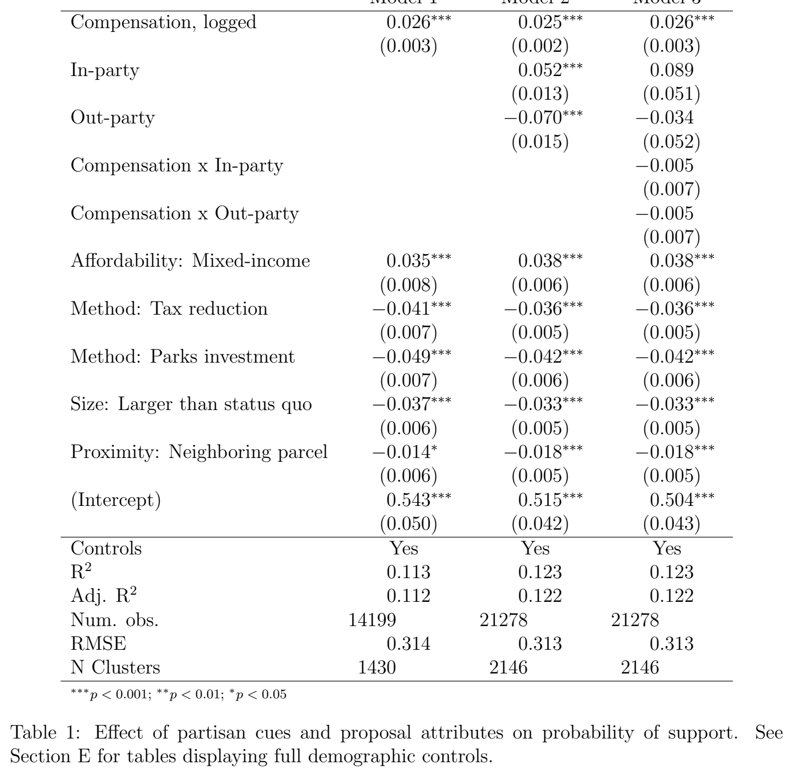

***Table 1.*** Effect of partisan cues and proposal attributes on probability of support. See Section E for tables displaying full demographic controls.

[Download data as CSV](tables/tab-01.csv)

### Variation by Housing Priors

To assess the potential inoculating effects of prior beliefs, I use theories of housing politics to identify groups which may be more resilient to party cues. Some of these moderators are binary (e.g., homeownership) while others are continuous. For continuous variables, I operationalize the group by using a two standard deviation change, making the coefficient more comparable to a binary indicator (Gelman 2008). Tables are presented with only the coefficients of interest for space consideration. Tables with all control variables are included in Section E.

Financial Exposure The first group is composed of those believed to be highly attuned to the direct financial implications of new housing development. Homeowners are seen as extremely risk averse due their home being not only their largest asset, but also one that geographically fixed and illiquid (Fischel 2001). Consequently, becoming a homeowner causes voters to turnout at higher rates and pay more attention to land use politics, like new housing development (Hall and Yoder 2022). Homeowners should have strong priors about new housing development, making them less likely to be influenced by partisan cues. I code homeownership as a binary indicator.

While “not in my backyard” (NIMBY) opposition is typically associated with homeowners, renters have also been found to oppose new market-rate housing out of a similar self-interested motivation. Renters who are concerned about rising prices tend to oppose housing development near them because they believe that the new development will actually increase their rent, threatening their housing stability (Hankinson 2018). While this belief is contrary to the expectations of homeowners as well as the majority of economic research on the effect of new housing development, such “supply skepticism” is common (Been, Ellen and O’Regan 2019; Nall, Elmendorf and Oklobdzija 2024). I identify renters who may express this behavior by asking: “How worried are you about no longer being able to afford your apartment in the near future?” with a 5-point scale ranging from “not at all worried” to

“extremely worried.”

A final group which may feel threatened by nearby change are those who foresee great challenges with relocating. This group includes both homeowners and renters who, if faced with moving, would face difficulty finding a new place to live. Such immobility has been found to affect political attitudes including favorability towards immigration (Velez 2020). I operationalize this concept by asking: “Let’s say something happened causing you to no longer want to live in your neighborhood. How easy would it be to find a new home in a different neighborhood?” A 5-point scale ranged from “very difficult” to “very easy,” which I convert to a continuous variable and scale as described above.

To test whether the effect of partisan cues varies by these financial implications, I interact the inclusion of partisan cues with the above defined attributes. If the attribute is associated with having strong priors, I expect the interaction to be statistically significant and have the opposite sign of the lower-order partisan cue coefficient. For example, the coefficient for in-party cue is positive. If an attribute-defined group is more immune to party cues, the interaction between the attribute and in-party cue should be negative and statistically significant.

In Table 2, Model 1 tests whether homeowners respond differently to party cues compared to renters. While homeowners are less supportive of new developments than renters, I find no evidence that homeowners are less responsive to partisan cues. Both interaction terms are null. Model 2 assess moderating effects among renters based on price anxiety. Again, I find no evidence that price anxiety shapes the effect of partisan cues. Model 3 compares respondents who express a sense of immobility. While more immobile residents are more opposed to new development, I do not find that mobility moderates the effect of partisan cues. In all, I find no evidence that respondents with stronger financial exposure to housing development are less responsive to partisan cues.

Model 1 Model 2 Model 3 In-party 0.030 0.037 0.058∗∗∗ Out-party −0.075∗∗ −0.073∗∗ −0.070∗∗∗ Homeowner −0.059∗∗∗

Rent anxiety (2 sds) −0.028

Immobile (2 sds) −0.037∗∗ In-party x Homeowner 0.033

Out-party x Homeowner 0.008

In-party x Rent anxiety (2 sds) 0.069

Out-party x Rent anxiety (2 sds) 0.002

In-party x Immobile (2 sds) −0.005 Out-party x Immobile (2 sds) 0.007 (Intercept) 0.519∗∗∗ 0.662∗∗∗ 0.499∗∗∗ Controls Yes Yes Yes

R2 0.123 0.058 0.121 Adj. R2 0.122 0.054 0.120 Num. obs. 21278 6160 21528

RMSE 0.313 0.310 0.313 N Clusters 2146 621 2171

∗∗∗p < 0.001; ∗∗p < 0.01; ∗p < 0.05

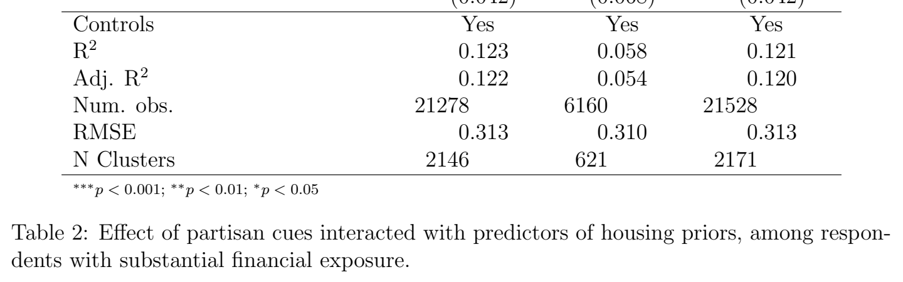

***Table 2.*** Effect of partisan cues interacted with predictors of housing priors, among respon- dents with substantial financial exposure.

[Download data as CSV](tables/tab-02.csv)

Neighborhood Defenders The second group includes respondents whose traits suggest that they may be heavily invested in housing politics. Drawing from (Einstein, Glick and Palmer 2020)’s concept of “neighborhood defenders,” these respondents attend local meetings and vote in local elections. They have either lived in the community for a long time or expect to remain in the community for a long time. Of course, many of these respondents will also be homeowners, but focusing on these characteristics is a more direct way to identify those most likely to have strong attitudes about nearby development.

I use four definitions of this group. First, I ask how many community or local meetings respondents have attended in the past 12 months, with options ranging from “none” to “10 or more meetings.” Next, I inquire about voting in elections for local or city officials. I also record what year respondents moved into their current neighborhood as well as how long they plan to live in their current home before moving.

Reviewing Table 3, Model 1 tests whether local meeting attendees are less responsive to partisan cues. The signs of the interaction terms are in the opposite directions of the lower order cue coefficients, but the coefficients are extremely noisy. Model 2 repeats this test for those with higher degrees of local voting. If anything, local voters are more responsive to in-party cues, an effect in the opposite direction expected by RQ1. However, there is little evidence they respond differently to out-party cues. Additional null results are found among those with longer neighborhood tenures and expectations for remaining locally. In all, neighborhood defenders are not more resistant to partisan cues.

Symbolic Attachments The final group is composed of those who express strong symbolic attachment towards housing development, their neighborhood, and urbanism generally. Research has found general attitudes towards cities and developers to be very predictive of support for local housing policy (Broockman, Elmendorf and Kalla 2024). I capture these beliefs using a 101-point feeling thermometer. It is theoretically unclear whether those with very favorable or unfavorable attitudes towards these groups would have stronger housing

Model 1 Model 2 Model 3 Model 4 In-party 0.055∗∗∗ 0.057∗∗∗ 0.057∗∗∗ 0.056∗∗∗ Out-party −0.071∗∗∗ −0.069∗∗∗ −0.068∗∗∗ −0.068∗∗∗ Local meeting (2 sds) 0.054∗∗∗

Local vote (2 sds) −0.015

Years of residence (2 sds) −0.035∗

Years expected (2 sds) −0.031∗ In-party x Local meeting −0.017

Out-party x Local meeting 0.025

In-party x Local vote 0.069∗

Out-party x Local vote 0.021

In-party x Years of residence 0.025

Out-party x Years of residence 0.006

In-party x Years expect 0.030 Out-party x Years expect −0.024 (Intercept) 0.497∗∗∗ 0.491∗∗∗ 0.480∗∗∗ 0.480∗∗∗ Controls Yes Yes Yes Yes

R2 0.125 0.120 0.120 0.120 Adj. R2 0.124 0.119 0.119 0.120 Num. obs. 21528 21520 21528 21528

RMSE 0.313 0.314 0.314 0.313 N Clusters 2171 2170 2171 2171

∗∗∗p < 0.001; ∗∗p < 0.01; ∗p < 0.05

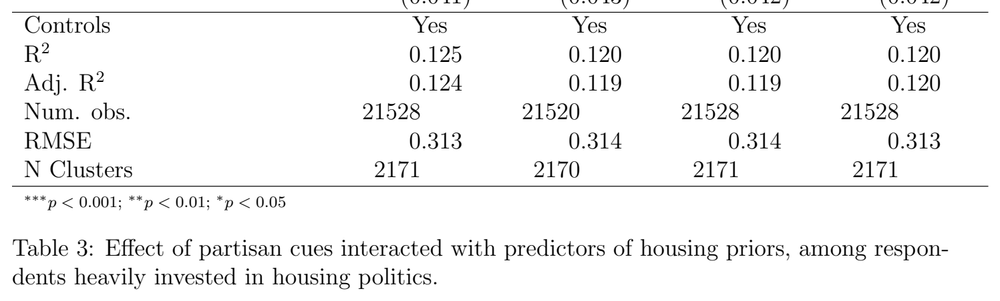

***Table 3.*** Effect of partisan cues interacted with predictors of housing priors, among respon- dents heavily invested in housing politics.

[Download data as CSV](tables/tab-03.csv)

priors. To account for this, I scale the variable so that “0” represents respondents who indicate “50” (perfectly neutral) in the survey. Next, I calculate the absolute value of the scaled variable. As a result, higher values of this scaled variable represent stronger beliefs (positive and negative) compared to lower values. I then re-scale the variable to a two standard deviation change around the mean (Gelman 2008). Larsen and Nyhold (2023) find housing attitudes to be partially explained by broad beliefs about local preservation rather than spatial proximity or effects on home values. To capture their theory, I replicate their five question index of local preservation attitudes (see Section F). Finally, as possibly the most direct attitudinal measure of strong priors, I ask respondents how important of an issue local housing development is to them.

In Table 4, Model 1 shows the local preservationists are no more immune to party cues than people who care little about local preservation. Model 2 shows that respondents with stronger feelings towards cities are also not immune to party cues. Model 3 shows the first evidence that strong priors insulate the effect of partisan cues. Here, strong feelings towards developers negate the negative effect of an out-party cue, but strong developer attitudes do not moderate the effect of in-party cues. And while Model 4 suggests that voters who place a high importance on the local housing supply are less supportive of developments overall, the same voters are equally responsive to partisan cues.

## Discussion

Together, these findings suggest that partisan cues are powerful even in the traditionally nonpartisan context of local housing development. Furthermore, there is little evidence that voters with strong beliefs about housing policy are immune from these cues. If elites begin to use partisan cues, voters will likely adjust their opinions in the expected directions. Many housing policy advocates have expressed wariness of that outcome, fearing that polarization may limit the ability of state legislators pass bipartisan housing legislation.

Model 1 Model 2 Model 3 Model 4 In-party 0.056∗∗∗ 0.056∗∗∗ 0.056∗∗∗ 0.057∗∗∗ Out-party −0.068∗∗∗ −0.070∗∗∗ −0.069∗∗∗ −0.068∗∗∗ Local preservation index (2 sds) −0.020

FT cities abs (2 sds) 0.001

FT developers abs (2 sds) −0.047∗∗∗

Supply importance (2 sds) −0.075∗∗∗ In-party x LP index −0.000

Out-party x LP index −0.036

In-party x FT cities −0.023

Out-party x FT cities −0.022

In-party x FT developers 0.001

Out-party x FT developers 0.063∗

In-party x Supply importance 0.008 Out-party x Supply importance 0.044 (Intercept) 0.478∗∗∗ 0.490∗∗∗ 0.491∗∗∗ 0.479∗∗∗ Controls Yes Yes Yes Yes

R2 0.120 0.119 0.123 0.128 Adj. R2 0.119 0.118 0.122 0.127 Num. obs. 21528 21434 21458 21528

RMSE 0.314 0.314 0.313 0.312 N Clusters 2171 2160 2163 2171

∗∗∗p < 0.001; ∗∗p < 0.01; ∗p < 0.05

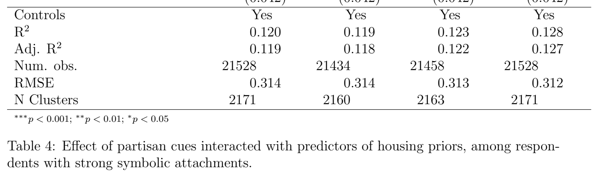

***Table 4.*** Effect of partisan cues interacted with predictors of housing priors, among respon- dents with strong symbolic attachments.

[Download data as CSV](tables/tab-04.csv)

However, as applied to supporting nearby housing development, the policy outcomes may not be uniformly harmful. When appealing to homogeneous communities, a cue from an party leader who matches the partisanship of the target community may make housing easier to build. For example, housing is most under-supplied in largely left-leaning areas. Associating development proposals with Democratic statehouse leaders may provide positive cues to win local support.

In contrast, were pro-development legislation to come from Trump administration or a right-leaning state government, these Republican cues would decrease local support for the proposals, countering the administration’s efforts. Of course, cues polarize in both directions—winning copartisans and losing outpartisans. Thus, the inclusion of a partisan cue in a politically heterogeneous community risks magnifying conflict, but with no net change in housing support. Policymakers may be better served by appealing to financial self-interest in these heterogeneous contexts.

These two tools of partisan cues and compensation ought to be viewed together as a comprehensive approach to housing policy. Just because partisan cues do not diminish the effect of compensation does not mean they have no impact on the ability to use compensation effectively. For example, voters in low-income, dense urban environments require less compensation due to their higher baseline level of support for development and their greater proportionate valuation of the compensation offered. Here, even a little compensation per voter can be effective in winning neighborhood-level majority support. At the same time, these low-income, dense areas lean heavily Democratic. A cue from Republican leadership may depress residents’ support so significantly that the total amount of compensation required to break-even makes the development financially infeasible. Thus, while I find that partisan cues and compensation act independently in opinion formation, policymakers need to carefully balance their deployment to achieve the most cost-effective path for increasing the local housing supply.

## Conclusion

Using the context of local housing development, this study demonstrates how partisan cues remain influential even in policy areas where self-interest is presumed to dominate. First, support for nearby housing development increased when associated with the respondent’s in-party and decreased when linked to the out-party. Second, I find no evidence in support of partisan motivated reasoning or dual-process theory in this domain. The effect of factual information about implications for self-interest is unaffected by partisan cues, supporting the theory of independent processes. Third, I do not find evidence that strong priors inoculate voters from partisan cues. Partisan cues were equally influential regardless of personal financial exposure, local political behavior, or symbolic attitudes predictive of housing support. For policymakers, this interplay of partisan cues and self-interest creates opportunities and risks. First, the strategic use of partisan cues should only be applied to homogeneous political environments. In heterogeneous political environments, policymakers should focus exclusively on compensation to build political support. But despite their independent effects, these two tools should be viewed in conjunction depending on the local context.

## References

Barber, Michael and Jeremy C Pope. 2024. “Does issue importance attenuate partisan cue-taking?” Political Science Research and Methods 12(2):435–443.

Been, Vicki. 2010. “Community Benefits Agreements: A New Local Government Tool or Another Variation on the Exactions Theme?” The University of Chicago Law Review 77(1):5–35.

Been, Vicki, Ingrid Gould Ellen and Katherine O’Regan. 2019. “Supply Skepticism: Housing Supply and Affordability.” Housing Policy Debate 29(1):25–40.

Bisbee, James and Diana Da In Lee. 2022. “Objective facts and elite cues: partisan responses to covid-19.” The Journal of Politics 84(3):1278–1291.

Boyle, Kevin J. 2017. Contingent Valuation in Practice. In A Primer on Nonmarket Valuation. Springer pp. 83–131.

Broockman, David, Christopher Elmendorf and Joshua Kalla. 2025. “How Sociotropic Aesthetic Judgments Drive Opposition to Housing Development.”.

Broockman, David, Christopher S Elmendorf and Joshua Kalla. 2024. The Symbolic Politics of Housing. Technical report Center for Open Science.

Bullock, John G. 2011. “Elite influence on public opinion in an informed electorate.” American Political Science Review 105(3):496–515.

Campbell, Angus, Phillip Converse, Warren Miller and Donald E. Stokes. 1960. The American Voter. University of Chicago Press.

Carson, Richard T and Miko(cid:32)laj Czajkowski. 2014. The Discrete Choice Experiment Approach to Environmental Contingent Valuation. In Handbook of Choice Modelling, ed. S Hess and A Daly. Northampton: Edward Elgar Publishing.

Chong, Dennis, Jack Citrin and Patricia Conley. 2001. “When self-interest matters.” Political Psychology 22(3):541–570.

Cohen, Geoffrey L. 2003. “Party over policy: The dominating impact of group influence on political beliefs.” Journal of personality and social psychology 85(5):808.

Converse, Phillip. 1964. Ideology and Discontent, The Nature of Belief Systems in Mass Publics. Free Press.

de Benedictis-Kessner, Justin and Michael Hankinson. 2019. “Concentrated burdens: How self-interest and partisanship shape opinion on opioid treatment policy.” American Political Science Review 113(4):1078–1084.

Demsas, Jerusalem. 2024. “The Only Force Stronger Than Polarization? Rising Home Prices.” The Atlantic .

Druckman, James N, Erik Peterson and Rune Slothuus. 2013. “How elite partisan polarization affects public opinion formation.” American political science review 107(1):57–79.

Einstein, Katherine Levine, David M. Glick and Maxwell Palmer. 2020. Neighborhood Defenders: Participatory Politics and America’s Housing Crisis. New York: Cambridge University Press.

Feldman, Stanley. 1982. “Economic self-interest and political behavior.” American Journal of Political Science pp. 446–466.

Fischel, William A. 2001. The Homevoter Hypothesis. Cambridge, MA: Harvard University Press.

Gelman, Andrew. 2008. “Scaling Regression Inputs by Dividing by Two Standard Deviations.” Statistics in medicine 27(15):2865–2873.

Glaeser, Edward and Joseph Gyourko. 2018. “The economic implications of housing supply.” Journal of economic perspectives 32(1):3–30.

Glaeser, Edward L and Bryce A Ward. 2009. “The Causes and Consequences of Land Use Regulation: Evidence from Greater Boston.” Journal of Urban Economics 65(3):265–278. Goncalves, Marcelo SO, Isabelle Langrock, Jack LaViolette and Katie Spoon. 2024. “Book bans in political context: Evidence from US schools.” PNAS nexus 3(6):pgae197.

Green, Donald Philip and Ann Elizabeth Gerken. 1989. “Self-interest and public opinion toward smoking restrictions and cigarette taxes.” Public opinion quarterly 53(1):1–16.

Gyourko, Joseph and Sean E McCulloch. 2024. The Distaste for Housing Density. Technical report National Bureau of Economic Research.

Hall, Andrew B and Jesse Yoder. 2022. “Does homeownership influence political behavior? Evidence from administrative data.” The Journal of Politics 84(1):351–366.

Hankinson, Michael. 2018. “When do renters behave like homeowners? High rent, price anxiety, and NIMBYism.” American Political Science Review 112(3):473–493.

Hankinson, Michael and Justin de Benedictis-Kessner. 2022. “How Self-Interest and Symbolic Politics Shape the Effectiveness of Compensation for Nearby Housing Development.”.

Hankinson, Michael and Justin de Benedictis-Kessner. 2024. “How Self-Interest and Symbolic Politics Shape the Effectiveness of Compensation for Nearby Housing Development.” Available at: https://www.mhankinson.com/documents/compensation_housing.pdf (accessed on 05/01/24).

Jensen, Amalie, William Marble, Kenneth Scheve and Matthew J Slaughter. 2021. “City limits to partisan polarization in the American public.” Political Science Research and Methods 9(2):223–241.

Kahn, Eli and Salim Furth. 2023. Breaking Ground: An Examination of Effective State Housing Reforms in 2023. Technical report Mercatus Center at George Mason University.

Kam, Cindy D. 2005. “Who toes the party line? Cues, values, and individual differences.” Political behavior 27:163–182.

Kim, Minjee. 2020. “Negotiation or schedule-based? Examining the strengths and weaknesses of the public benefit exaction strategies of Boston and Seattle.” Journal of the American Planning Association 86(2):208–221.

Larsen, Martin Vinæs, Frederik Hjorth, Peter Thisted Dinesen and Kim Mannemar Sønderskov. 2019. “When do citizens respond politically to the local economy? Evidence from registry data on local housing markets.” American Political Science Review 113(2):499–516.

Larsen, Martin Vinæs and Niels Nyhold. 2023. Understanding Nimbyism as Local Preservationism . Technical report Working Paper.

Lenz, Gabriel S. 2012. Follow the leader?: how voters respond to politicians’ policies and performance. University of Chicago Press.

Lucas, Jack, Martin Horak, David Armstrong II and Shanaya Vanhooren. 2025. “Geographic Proximity Dampens Ideological Policy Disagreement in Urban Politics.”.

Marble, William and Clayton Nall. 2021. “Where Interests Trump Ideology: The Persistent Influence of Homeownership in Local Development Politics.” Journal of Politics 83(4).

McConnell, Christopher, Yotam Margalit, Neil Malhotra and Matthew Levendusky. 2018. “The economic consequences of partisanship in a polarized era.” American Journal of Political Science 62(1):5–18.

Mondak, Jeffery J. 1993. “Public opinion and heuristic processing of source cues.” Political behavior 15:167–192.

Mullinix, Kevin J. 2016. “Partisanship and preference formation: Competing motivations, elite polarization, and issue importance.” Political Behavior 38:383–411.

Nall, Clayton, Christopher S Elmendorf and Stan Oklobdzija. 2024. “Folk economics and the persistence of political opposition to new housing.” Available at SSRN 4266459 .

Nicholson, Stephen P. 2012. “Polarizing cues.” American journal of political science 56(1):52– 66.

Panagopoulos, Costas, Donald P Green, Jonathan Krasno, Michael Schwam-Baird and Kyle Endres. 2020. “Partisan consumerism: Experimental tests of consumer reactions to corporate political activity.” The Journal of Politics 82(3):996–1007.

Pietrzak, Adrian and Tali Mendelberg. 2025. “Political Architecture: Contextual Development and Opposition to Housing.” Urban Affairs Review p. 10780874251398034.

Rahn, Wendy M. 1993. “The role of partisan stereotypes in information processing about political candidates.” American Journal of Political Science pp. 472–496.

Sahn, Alexander. 2025. “Public comment and public policy.” American Journal of Political Science 69(2):685–700.

Sears, David O and Carolyn L Funk. 1991. “The Role of Self-Interest in Social and Political Attitudes.” Advances in Experimental Social Psychology 24:1–91.

Sears, David O and Jack Citrin. 1982. Tax revolt: Something for nothing in California. Harvard University Press.

Sears, David O, Richard R Lau, Tom R Tyler and Harris M Allen Jr. 1980. “Self-interest vs. symbolic politics in policy attitudes and presidential voting.” American Political Science Review 74(3):670–684.

Slothuus, Rune and Martin Bisgaard. 2021. “Party over pocketbook? How party cues influence opinion when citizens have a stake in policy.” American Political Science Review 115(3):1090–1096.

Smialek, Jeanna and Linda Qiu. 2024. “Harris and Trump Have Housing Ideas. Economists Have Doubts.” The New York Times .

Stokes, Leah C. 2016. “Electoral backlash against climate policy: A natural experiment on retrospective voting and local resistance to public policy.” American Journal of Political Science 60(4):958–974.

Taber, Charles S and Milton Lodge. 2006. “Motivated skepticism in the evaluation of political beliefs.” American journal of political science 50(3):755–769.

Tappin, Ben M, Adam J Berinsky and David G Rand. 2023. “Partisans’ receptivity to persuasive messaging is undiminished by countervailing party leader cues.” Nature human behaviour 7(4):568–582.

Ternullo, Stephanie. 2024. ““It makes me sound like I’ma NIMBY; I’m not:” Local Political Norms and Liberal Support for Housing.” Local Political Norms and Liberal Support for Housing (March 20, 2024) .

Van Bavel, Jay J and Andrea Pereira. 2018. “The partisan brain: An identity-based model of political belief.” Trends in cognitive sciences 22(3):213–224.

Van Bavel, Jay J, Shana Kushner Gadarian, Eric Knowles and Kai Ruggeri. 2024. “Political polarization and health.” Nature Medicine 30(11):3085–3093.

Velez, Yamil Ricardo. 2020. “Residential mobility constraints and immigration restrictionism.” Political Behavior 42:719–743.

Wolf-Powers, Laura. 2010. “Community benefits agreements and local government: A review of recent evidence.” Journal of the American Planning Association 76(2):141–159.

Zaller, John. 1992. The Nature and Origins of Mass Opinion. Cambridge University Press.

## Supplementary Information

## A Sample

The sampling frame was defined to target areas where new residential construction is likely to be in demand, but also made more expensive to construct due to regulatory constraints and local opposition. Ultimately, the sample frame consisted of ZIP codes that meet the following criteria:

• Are in a metropolitan statistical area (urban area with a population of greater than 50,000). These are labor markets that are likely to be seen as important for policy designed to improve housing permitting.

• The MSA has greater than median home value compared to all CBSAs (MSAs and MiSAs). The cutpoint for median home value using 2023 ACS data is $194,400. These are areas where there is more likely to be demand for new housing, making them policy relevant for facilitating development. It also removes areas where any new development may seen as a economic boon, places where the politics of housing construction may be inherently different compared to high demand/high regulatory contexts.

• ZIP code density in populated areas is >500 people per square mile. This weighting of density by block group population allows me to include ZIP codes with a sufficiently dense developed area but rural outskirts.6 This removes very rural areas on the outskirts of MSAs, areas unlikely to be targeted for new housing development.

The resulting sample frame was composed of 10,251 ZIP codes. Sampling was stratified by ZIP code density and respondent household income quartiles (16 cells total, see Figure B-1). The sample was provided by Bovitz Forthright. Respondents are age 18 years or older and compensated through Forthright’s internal compensation scheme. Ultimately, after utilizing pre-treatment attention checks for quality control, the functional sample for most analyses is ∼2,000 respondents.

6Data are shared by Stan Oklobdzija and used in Nall, Elmendorf and Oklobdzija (2024).

## B Descriptive Statistics

Q4 155 162 152 152 Q3 167 160 151 160 Q2 167 165 166 173 Q1 152 151 152 156 Q1 Q2 Q3 Q4 ZIP code density quartile

elitrauq

emocni

dlohesuoH

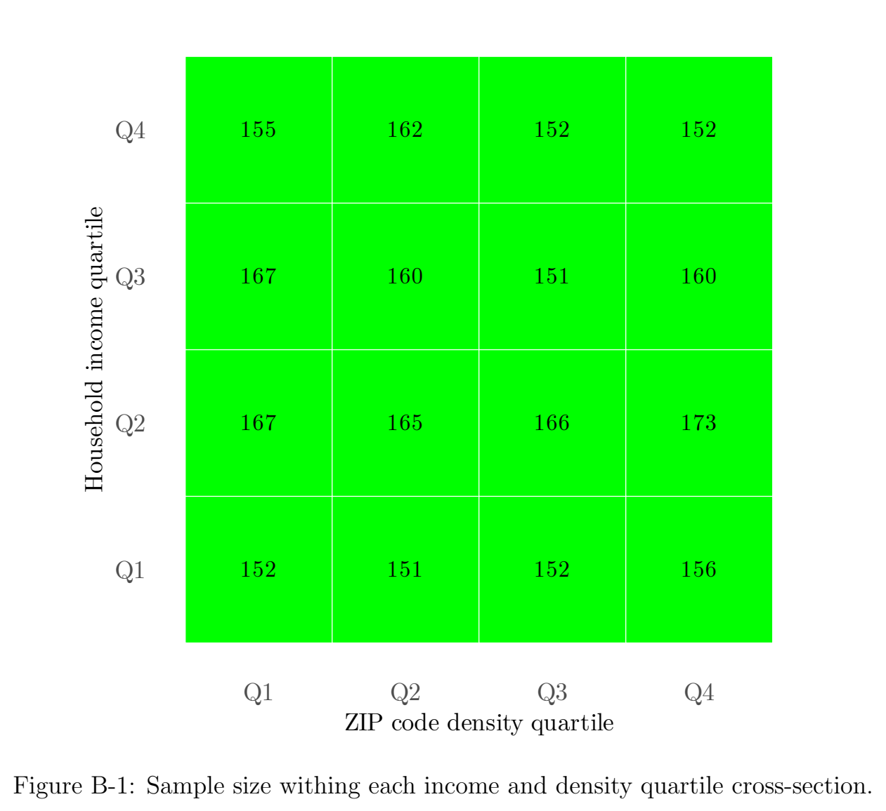

***Figure B-1.*** Sample size withing each income and density quartile cross-section.

Table B-1: Descriptive Statistics

Characteristic N = 2,155 Homeowner (0, 1) 1,531 (71%) Density (quartile)

1 543 (25%) 2 539 (25%) 3 525 (24%) 4 548 (25%) Household income (quartile)

1 481 (22%) 2 574 (27%) 3 555 (26%) 4 545 (25%) Democrat (0, 1) 1,242 (58%) White, non-Hispanic (0, 1) 1,464 (68%) College (0,1) 1,156 (54%) Female (0,1) 1,109 (51%) Age (category)

18–24 96 (4.5%) 25–34 295 (14%) 35-44 492 (23%) 45–54 436 (20%) 55–65 416 (19%) 65+ 420 (19%) 1 n (%)

## C Results without Controls

Model 1 Model 2 Model 3 Compensation, logged 0.025∗∗∗ 0.024∗∗∗ 0.025∗∗∗ In-party 0.056∗∗∗ 0.089 Out-party −0.072∗∗∗ −0.036 Compensation x In-party −0.004

Compensation x Out-party −0.005

Affordability: Mixed-income 0.029∗∗∗ 0.035∗∗∗ 0.035∗∗∗ Method: Tax reduction −0.038∗∗∗ −0.032∗∗∗ −0.033∗∗∗ Method: Parks investment −0.042∗∗∗ −0.037∗∗∗ −0.037∗∗∗ Size: Larger than status quo −0.037∗∗∗ −0.034∗∗∗ −0.034∗∗∗ Proximity: Neighboring parcel −0.015∗ −0.018∗∗∗ −0.018∗∗∗ (Intercept) 0.331∗∗∗ 0.336∗∗∗ 0.324∗∗∗ R2 0.017 0.028 0.028

Adj. R2 0.016 0.027 0.027

Num. obs. 14681 21981 21981

RMSE 0.330 0.329 0.329 N Clusters 1479 2218 2218

∗∗∗p < 0.001; ∗∗p < 0.01; ∗p < 0.05

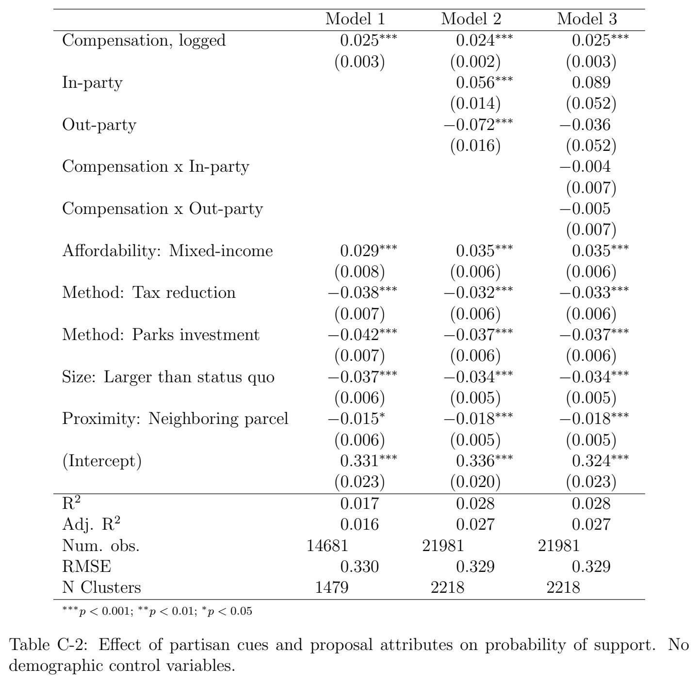

***Table C-2.*** Effect of partisan cues and proposal attributes on probability of support. No demographic control variables.

[Download data as CSV](tables/tab-05.csv)

Model 1 Model 2 Model 3 In-party 0.036 0.040 0.056∗∗∗ Out-party −0.072∗∗ −0.073∗∗ −0.072∗∗∗ Homeowner −0.104∗∗∗

Rent anxiety (2 sds) −0.020

Immobile (2 sds) −0.012 In-party x Homeowner 0.022

Out-party x Homeowner −0.004

In-party x Rent anxiety (2 sds) 0.070

Out-party x Rent anxiety (2 sds) −0.029

In-party x Immobile (2 sds) 0.013 Out-party x Immobile (2 sds) 0.015 (Intercept) 0.406∗∗∗ 0.515∗∗∗ 0.360∗∗∗ Controls No No No

R2 0.047 0.024 0.025 Adj. R2 0.046 0.022 0.025 Num. obs. 21711 6300 21981

RMSE 0.326 0.315 0.329 N Clusters 2191 635 2218

∗∗∗p < 0.001; ∗∗p < 0.01; ∗p < 0.05

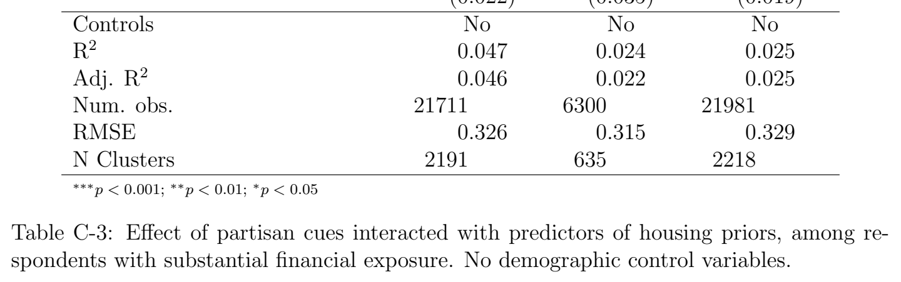

***Table C-3.*** Effect of partisan cues interacted with predictors of housing priors, among re- spondents with substantial financial exposure. No demographic control variables.

[Download data as CSV](tables/tab-06.csv)

Model 1 Model 2 Model 3 Model 4 In-party 0.055∗∗∗ 0.056∗∗∗ 0.058∗∗∗ 0.055∗∗∗ Out-party −0.075∗∗∗ −0.071∗∗∗ −0.070∗∗∗ −0.071∗∗∗ Local meeting (2 sds) 0.071∗∗∗

Local vote (2 sds) −0.050∗∗∗

Years of residence (2 sds) −0.069∗∗∗

Years expected (2 sds) −0.072∗∗∗ In-party x Local meeting −0.036

Out-party x Local meeting 0.006

In-party x Local vote 0.057

Out-party x Local vote 0.023

In-party x Years of residence 0.032

Out-party x Years of residence 0.012

In-party x Years expect 0.040 Out-party x Years expect −0.020 (Intercept) 0.338∗∗∗ 0.336∗∗∗ 0.334∗∗∗ 0.336∗∗∗ Controls No No No No

R2 0.038 0.032 0.036 0.039 Adj. R2 0.037 0.031 0.036 0.038 Num. obs. 21981 21973 21981 21981

RMSE 0.327 0.328 0.328 0.327 N Clusters 2218 2217 2218 2218

∗∗∗p < 0.001; ∗∗p < 0.01; ∗p < 0.05

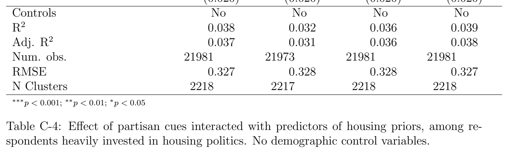

***Table C-4.*** Effect of partisan cues interacted with predictors of housing priors, among re- spondents heavily invested in housing politics. No demographic control variables.

[Download data as CSV](tables/tab-07.csv)

Model 1 Model 2 Model 3 Model 4 In-party 0.057∗∗∗ 0.056∗∗∗ 0.055∗∗∗ 0.057∗∗∗ Out-party −0.070∗∗∗ −0.074∗∗∗ −0.072∗∗∗ −0.070∗∗∗ Local preservation index (2 sds) −0.057∗∗∗

FT cities abs (2 sds) 0.002

FT developers abs (2 sds) −0.042∗∗

Supply importance (2 sds) −0.090∗∗∗ In-party x LP index 0.003

Out-party x LP index −0.058

In-party x FT cities −0.016

Out-party x FT cities −0.014

In-party x FT developers 0.004

Out-party x FT developers 0.076∗

In-party x Supply importance 0.013 Out-party x Supply importance 0.043 (Intercept) 0.337∗∗∗ 0.359∗∗∗ 0.335∗∗∗ 0.332∗∗∗ Controls No No No No

R2 0.039 0.025 0.031 0.043 Adj. R2 0.038 0.025 0.031 0.042 Num. obs. 21981 21887 21891 21981

RMSE 0.327 0.330 0.329 0.327 N Clusters 2218 2207 2208 2218

∗∗∗p < 0.001; ∗∗p < 0.01; ∗p < 0.05

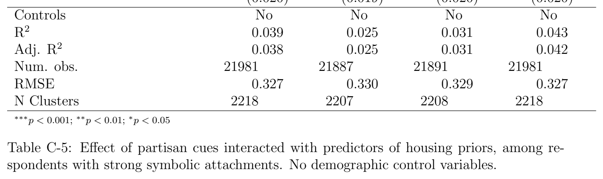

***Table C-5.*** Effect of partisan cues interacted with predictors of housing priors, among re- spondents with strong symbolic attachments. No demographic control variables.

[Download data as CSV](tables/tab-08.csv)

## D Additional Results

Model 1 Model 2 Model 3 Compensation, logged 0.007∗∗ 0.007∗∗ 0.006∗ In-party −0.014 −0.054 Out-party −0.013 0.024 Compensation x In-party 0.005 Compensation x Out-party −0.005 Affordability: Mixed-income −0.026∗∗∗ −0.021∗∗∗ −0.021∗∗∗ Method: Tax reduction −0.011 −0.010 −0.010 Method: Parks investment 0.002 −0.005 −0.005 Size: Larger than status quo −0.002 0.007 0.008 Proximity: Neighboring parcel 0.017∗∗ 0.019∗∗∗ 0.019∗∗∗ Homeowner 0.066∗∗∗ 0.064∗∗∗ 0.064∗∗∗ Income quartile 0.003 0.019 0.019 Density, quartile −0.004 0.007 0.007 Female −0.026 −0.036∗∗ −0.036∗∗ Age, category 0.024∗∗∗ 0.025∗∗∗ 0.025∗∗∗ White, non-Hispanic −0.084∗∗∗ −0.073∗∗∗ −0.073∗∗∗ College educated 0.039∗ 0.049∗∗∗ 0.049∗∗∗ Democrat −0.031 −0.037∗∗ −0.037∗∗ Income x density, quartiles −0.002 −0.006 −0.006 (Intercept) 0.440∗∗∗ 0.385∗∗∗ 0.386∗∗∗ R2 0.043 0.049 0.049 Adj. R2 0.042 0.048 0.048 Num. obs. 14201 21279 21279

RMSE 0.321 0.323 0.323 N Clusters 1430 2146 2146

∗∗∗p < 0.001; ∗∗p < 0.01; ∗p < 0.05

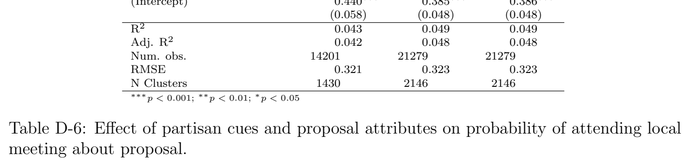

***Table D-6.*** Effect of partisan cues and proposal attributes on probability of attending local meeting about proposal.

[Download data as CSV](tables/tab-09.csv)

Among Democrats Among Republicans Compensation, logged 0.025∗∗∗ 0.025∗∗∗ Democratic cue 0.060∗∗∗ −0.093∗∗∗ Republican cue −0.057∗∗ 0.045∗ Affordability: Mixed-income 0.032∗∗∗ 0.046∗∗∗ Method: Tax reduction −0.031∗∗∗ −0.043∗∗∗ Method: Parks investment −0.038∗∗∗ −0.048∗∗∗ Size: Larger than status quo −0.034∗∗∗ −0.032∗∗∗ Proximity: Neighboring parcel −0.017∗∗ −0.019∗ Homeowner −0.034∗ −0.084∗∗∗ Income quartile −0.027 −0.032 Density, quartile 0.014 0.008 Female −0.032∗ −0.002 Age, category −0.025∗∗∗ −0.065∗∗∗ White, non-Hispanic −0.027 −0.004 College educated 0.011 0.006 Income x density, quartiles 0.003 0.002 (Intercept) 0.538∗∗∗ 0.628∗∗∗ R2 0.068 0.141 Adj. R2 0.067 0.140 Num. obs. 12224 9054

RMSE 0.312 0.311 N Clusters 1235 911

∗∗∗p < 0.001; ∗∗p < 0.01; ∗p < 0.05

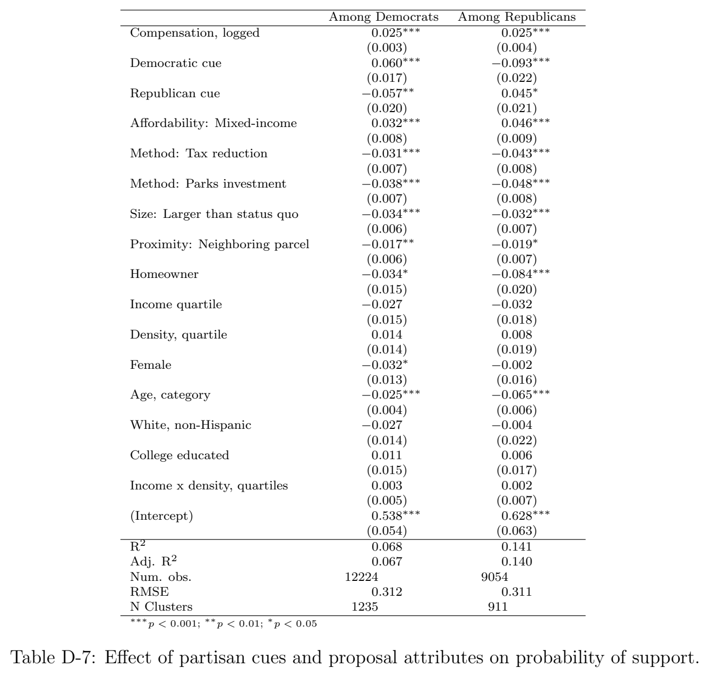

***Table D-7.*** Effect of partisan cues and proposal attributes on probability of support.

[Download data as CSV](tables/tab-10.csv)

Model 1 Model 2 Model 3 Compensation, logged 0.025∗∗∗ 0.022∗∗∗ 0.025∗∗∗ In-party 0.073∗∗∗ 0.199 Out-party −0.104∗∗∗ −0.087 Compensation x In-party −0.017 Compensation x Out-party −0.002 Affordability: Mixed-income 0.040∗ 0.046∗∗ 0.045∗∗ Method: Tax reduction −0.062∗∗ −0.048∗∗ −0.048∗∗ Method: Parks investment −0.087∗∗∗ −0.066∗∗∗ −0.067∗∗∗ Size: Larger than status quo −0.037∗ −0.020 −0.020 Proximity: Neighboring parcel −0.023 −0.024 −0.024 Homeowner −0.103∗∗∗ −0.090∗∗∗ −0.091∗∗∗ Income quartile −0.043∗ −0.041∗∗ −0.042∗∗ Density, quartile 0.010 0.010 0.010 Female −0.040∗ −0.032∗ −0.032∗ Age, category −0.046∗∗∗ −0.045∗∗∗ −0.045∗∗∗ White, non-Hispanic −0.021 −0.020 −0.020 College educated 0.005 0.009 0.009 Democrat 0.117∗∗∗ 0.126∗∗∗ 0.126∗∗∗ Income x density, quartiles 0.004 0.004 0.004 (Intercept) 0.665∗∗∗ 0.631∗∗∗ 0.610∗∗∗ R2 0.183 0.190 0.190 Adj. R2 0.173 0.183 0.183 Num. obs. 1430 2145 2145

RMSE 0.297 0.299 0.299 N Clusters 1430 2145 2145

∗∗∗p < 0.001; ∗∗p < 0.01; ∗p < 0.05

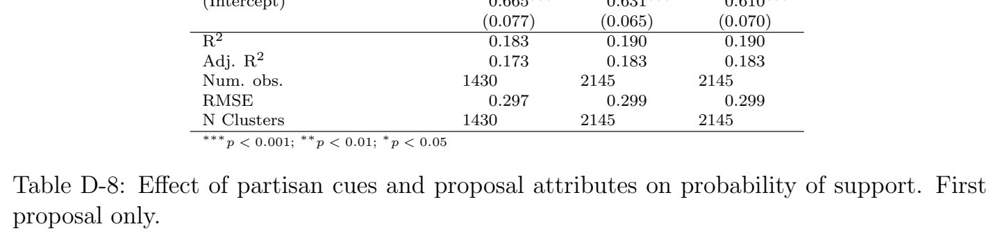

***Table D-8.*** Effect of partisan cues and proposal attributes on probability of support. First proposal only.

[Download data as CSV](tables/tab-11.csv)

## E Tables Displaying Full Controls

Model 1 Model 2 Model 3 Compensation, logged 0.026∗∗∗ 0.025∗∗∗ 0.026∗∗∗ In-party 0.052∗∗∗ 0.089 Out-party −0.070∗∗∗ −0.034 Compensation x In-party −0.005 Compensation x Out-party −0.005 Affordability: Mixed-income 0.035∗∗∗ 0.038∗∗∗ 0.038∗∗∗ Method: Tax reduction −0.041∗∗∗ −0.036∗∗∗ −0.036∗∗∗ Method: Parks investment −0.049∗∗∗ −0.042∗∗∗ −0.042∗∗∗ Size: Larger than status quo −0.037∗∗∗ −0.033∗∗∗ −0.033∗∗∗ Proximity: Neighboring parcel −0.014∗ −0.018∗∗∗ −0.018∗∗∗ Homeowner −0.062∗∗∗ −0.052∗∗∗ −0.052∗∗∗ Income quartile −0.037∗ −0.030∗ −0.030∗ Density, quartile 0.004 0.011 0.011 Female −0.029∗ −0.021∗ −0.021∗ Age, category −0.041∗∗∗ −0.040∗∗∗ −0.040∗∗∗ White, non-Hispanic −0.018 −0.018 −0.018 College educated 0.012 0.009 0.009 Democrat 0.096∗∗∗ 0.103∗∗∗ 0.103∗∗∗ Income x density, quartiles 0.005 0.003 0.003 (Intercept) 0.543∗∗∗ 0.515∗∗∗ 0.504∗∗∗ R2 0.113 0.123 0.123 Adj. R2 0.112 0.122 0.122 Num. obs. 14199 21278 21278

RMSE 0.314 0.313 0.313 N Clusters 1430 2146 2146

∗∗∗p < 0.001; ∗∗p < 0.01; ∗p < 0.05

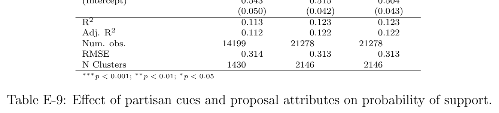

***Table E-9.*** Effect of partisan cues and proposal attributes on probability of support.

[Download data as CSV](tables/tab-12.csv)

Model 1 Model 2 Model 3 In-party 0.030 0.037 0.058∗∗∗ Out-party −0.075∗∗ −0.073∗∗ −0.070∗∗∗ Homeowner −0.059∗∗∗

Rent anxiety (2 sds) −0.028

Immobile (2 sds) −0.037∗∗ In-party x Homeowner 0.033

Out-party x Homeowner 0.008

In-party x Rent anxiety (2 sds) 0.069

Out-party x Rent anxiety (2 sds) 0.002

In-party x Immobile (2 sds) −0.005 Out-party x Immobile (2 sds) 0.007 Affordability: Mixed-income 0.038∗∗∗ 0.002 0.036∗∗∗ Method: Tax reduction −0.036∗∗∗ −0.059∗∗∗ −0.036∗∗∗ Method: Parks investment −0.042∗∗∗ −0.059∗∗∗ −0.042∗∗∗ Size: Larger than status quo −0.034∗∗∗ −0.020∗ −0.033∗∗∗ Proximity: Neighboring parcel −0.018∗∗∗ −0.011 −0.019∗∗∗ Income quartile −0.030∗ −0.045∗ −0.037∗∗ Density, quartile 0.011 −0.017 0.015 Female −0.021∗ −0.023 −0.018 Age, category −0.040∗∗∗ −0.019∗∗∗ −0.042∗∗∗ White, non-Hispanic −0.018 −0.031 −0.022 College educated 0.010 −0.005 −0.001 Democrat 0.104∗∗∗ 0.069∗∗∗ 0.109∗∗∗ Income x density, quartiles 0.003 0.011 0.002 (Intercept) 0.519∗∗∗ 0.662∗∗∗ 0.499∗∗∗ Controls Yes Yes Yes R2 0.123 0.058 0.121 Adj. R2 0.122 0.054 0.120 Num. obs. 21278 6160 21528

RMSE 0.313 0.310 0.313 N Clusters 2146 621 2171

∗∗∗p < 0.001; ∗∗p < 0.01; ∗p < 0.05

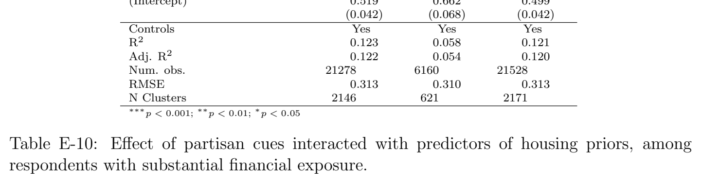

***Table E-10.*** Effect of partisan cues interacted with predictors of housing priors, among respondents with substantial financial exposure.

[Download data as CSV](tables/tab-13.csv)

Model 1 Model 2 Model 3 Model 4 In-party 0.055∗∗∗ 0.057∗∗∗ 0.057∗∗∗ 0.056∗∗∗ Out-party −0.071∗∗∗ −0.069∗∗∗ −0.068∗∗∗ −0.068∗∗∗ Local meeting (2 sds) 0.054∗∗∗

Local vote (2 sds) −0.015

Years of residence (2 sds) −0.035∗

Years expected (2 sds) −0.031∗ In-party x Local meeting −0.017

Out-party x Local meeting 0.025

In-party x Local vote 0.069∗

Out-party x Local vote 0.021

In-party x Years of residence 0.025

Out-party x Years of residence 0.006

In-party x Years expect 0.030 Out-party x Years expect −0.024 Affordability: Mixed-income 0.035∗∗∗ 0.036∗∗∗ 0.036∗∗∗ 0.036∗∗∗ Method: Tax reduction −0.036∗∗∗ −0.036∗∗∗ −0.036∗∗∗ −0.036∗∗∗ Method: Parks investment −0.043∗∗∗ −0.042∗∗∗ −0.042∗∗∗ −0.042∗∗∗ Size: Larger than status quo −0.034∗∗∗ −0.033∗∗∗ −0.034∗∗∗ −0.034∗∗∗ Proximity: Neighboring parcel −0.020∗∗∗ −0.018∗∗∗ −0.018∗∗∗ −0.018∗∗∗ Income quartile −0.040∗∗∗ −0.035∗∗ −0.036∗∗ −0.035∗∗ Density, quartile 0.012 0.014 0.014 0.014 Female −0.019 −0.020 −0.020 −0.020 Age, category −0.039∗∗∗ −0.041∗∗∗ −0.038∗∗∗ −0.039∗∗∗ White, non-Hispanic −0.019 −0.022 −0.023 −0.020 College educated −0.004 0.001 0.001 0.004 Democrat 0.109∗∗∗ 0.108∗∗∗ 0.107∗∗∗ 0.107∗∗∗ Income x density, quartiles 0.004 0.003 0.003 0.003 (Intercept) 0.497∗∗∗ 0.491∗∗∗ 0.480∗∗∗ 0.480∗∗∗ Controls Yes Yes Yes Yes R2 0.125 0.120 0.120 0.120 Adj. R2 0.124 0.119 0.119 0.120 Num. obs. 21528 21520 21528 21528

RMSE 0.313 0.314 0.314 0.313 N Clusters 2171 2170 2171 2171

∗∗∗p < 0.001; ∗∗p < 0.01; ∗p < 0.05

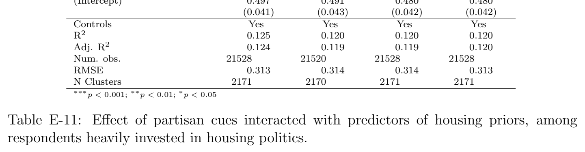

***Table E-11.*** Effect of partisan cues interacted with predictors of housing priors, among respondents heavily invested in housing politics.

[Download data as CSV](tables/tab-14.csv)

Model 1 Model 2 Model 3 Model 4 In-party 0.056∗∗∗ 0.056∗∗∗ 0.056∗∗∗ 0.057∗∗∗ Out-party −0.068∗∗∗ −0.070∗∗∗ −0.069∗∗∗ −0.068∗∗∗ Local preservation index (2 sds) −0.020

FT cities abs (2 sds) 0.001

FT developers abs (2 sds) −0.047∗∗∗

Supply importance (2 sds) −0.075∗∗∗ In-party x LP index −0.000

Out-party x LP index −0.036

In-party x FT cities −0.023

Out-party x FT cities −0.022

In-party x FT developers 0.001

Out-party x FT developers 0.063∗

In-party x Supply importance 0.008 Out-party x Supply importance 0.044 Affordability: Mixed-income 0.036∗∗∗ 0.036∗∗∗ 0.036∗∗∗ 0.036∗∗∗ Method: Tax reduction −0.036∗∗∗ −0.036∗∗∗ −0.036∗∗∗ −0.035∗∗∗ Method: Parks investment −0.042∗∗∗ −0.042∗∗∗ −0.042∗∗∗ −0.042∗∗∗ Size: Larger than status quo −0.034∗∗∗ −0.033∗∗∗ −0.033∗∗∗ −0.034∗∗∗ Proximity: Neighboring parcel −0.019∗∗∗ −0.018∗∗∗ −0.019∗∗∗ −0.018∗∗∗ Income quartile −0.032∗∗ −0.035∗∗ −0.035∗∗ −0.031∗∗ Density, quartile 0.015 0.014 0.014 0.015 Female −0.021∗ −0.020 −0.021∗ −0.019 Age, category −0.039∗∗∗ −0.041∗∗∗ −0.042∗∗∗ −0.040∗∗∗ White, non-Hispanic −0.024∗ −0.022 −0.021 −0.027∗ College educated 0.003 0.001 0.003 0.003 Democrat 0.105∗∗∗ 0.107∗∗∗ 0.109∗∗∗ 0.103∗∗∗ Income x density, quartiles 0.002 0.003 0.003 0.002 (Intercept) 0.478∗∗∗ 0.490∗∗∗ 0.491∗∗∗ 0.479∗∗∗ Controls Yes Yes Yes Yes R2 0.120 0.119 0.123 0.128 Adj. R2 0.119 0.118 0.122 0.127 Num. obs. 21528 21434 21458 21528

RMSE 0.314 0.314 0.313 0.312 N Clusters 2171 2160 2163 2171

∗∗∗p < 0.001; ∗∗p < 0.01; ∗p < 0.05

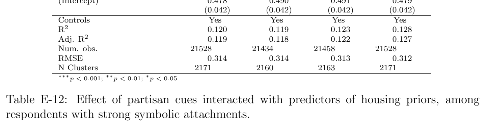

***Table E-12.*** Effect of partisan cues interacted with predictors of housing priors, among respondents with strong symbolic attachments.

[Download data as CSV](tables/tab-15.csv)

## F Survey Instrument

### F.1 Attention Check I

Respondents failing Attention Check I will be dropped from the study.

1. For our research, careful attention to survey questions is critical! We thank you for your care.

• I understand

• I do not understand

2. People are very busy these days and many do not have time to follow what goes on in the government. We are testing whether people read questions. To show that you’ve read this much, answer both “extremely interested” and “very interested.”

• Extremely interested

• Very interested

• Moderately interested

• Slightly interested

• Not at all interested

### F.2 Demographics

First, we would like to ask some questions about your background.

### 1. What is the highest level of education you have completed?

• Did not graduate from high school

• High school graduate

• Some college, but no degree

• 2-year college degree

• 4-year college degree

• Postgraduate degree (MA, MBA, MD, JD, PhD, etc.)

### 2. Do you identify as male or female?

• Male

• Female

• Other

### 3. In what year were you born?

• Drop-down selection from 1920 to 2007

### 4. What is the 5-digit ZIP code of your primary residence?

• Text-box answer

5. How much total combined income do all members of your household earn before taxes? • Less than $19,999

• $350,000 and above • Prefer not to answer 6. Generally speaking, do you consider yourself a... • Democrat

• Republican

• Independent

• Other party

### 7. If Generally speaking, do you consider yourself a... = Democrat: Would you call

yourself a strong Democrat or a not very strong Democrat?

• Strong

• Not very strong

### 8. If Generally speaking, do you consider yourself a... = Republican: Would you call

yourself a strong Republican or a not very strong Republican?

• Strong

• Not very strong

9. If Generally speaking, do you consider yourself a... = Independent or Other party: Do you think of yourself as closer to the Republican Party or to the Democratic Party? • Closer to the Republican Party

• Closer to the Democratic Party

• Neither

10. What racial group(s) best describe(s) you? You may select more than one.

• Caucasian/White

• Black of African-American

• Native American or Aleut • Asian/Pacific Islander

• Middle Eastern

• Other

### 11. Are you of Spanish, Hispanic, or Latino origin?

• Yes

• No

12. Generally speaking, do you usually think of yourself as a liberal, a conservative, a moderate, or you haven’t thought much about this?

• Liberal

• Conservative

• Moderate

• Haven’t thought much about it

13. If Generally speaking, do you usually think of yourself as a... = liberal: Would you call yourself a strong liberal or a not very strong liberal?

• Strong liberal

• Not very strong liberal

14. If Generally speaking, do you usually think of yourself as a... = conservative: Would you call yourself a strong conservative or a not very strong conservative?

• Strong conservative

• Not very strong conservative

15. If Generally speaking, do you usually think of yourself as a... = moderate or Haven’t thought much about it: Do you think of yourself as closer to liberals or closer to conservatives?

• Closer to liberals

• Closer to conservatives

• Neither

### F.3 Housing Traits

### 1. Which of the following best describes you?

• Homeowner (name on deed)

• Live with the homeowner (spouse, parents, etc.) • Renter (I pay the rent)

• Live with someone who pays the rent

• None of the above

### 2. In what year did you move into your current neighborhood?

• Drop-down selection from 1920 to 2025

3. If you had to guess, how many square feet in total is your housing unit? • Less than 500 square feet • 500 to 999 square feet

• 1,000 to 1,499 square feet

• 1,500 to 1,999 square feet

• 2,000 to 2,999 square feet • 3,000 to 4,999 square feet • 5,000 to 7,499 square feet • 7,500 square feet or more

### 4. How many bedrooms are in your housing unit?

• Studio

• 1 bedroom

• 2 bedrooms

• 3 bedrooms

• 4 bedrooms or more

### 5. How many bathrooms are in your housing unit?

• 1 bathroom

• 1.5 bathrooms

• 2 bathrooms

• 2.5 bathrooms

• 3 bathrooms or more 6. If renter: What is do you pay each month for rent, utilities, parking and other building fees?

• Less than $500 • $500 to $999

• $5,000 or more

7. If renter: Thinking about your neighborhood, what is your best guess for the average monthly rent and utilities and any other fees of a rental unit with the same number of bedrooms as the unit you occupy?

• Less than $500

• $500 to $999

• $5,000 or more

8. If homeowner: What do you think your house would sell for if you were to try to sell it in the next few months? • Less than $100,000

• $1,000,000 to $1,499,999 • $1,500,000 to $1,999,999 • $2,000,000 or more

### 9. If homeowner: Thinking about your neighborhood, what is your best guess for the

average sales price of a home with the same number of bedrooms as the unit you occupy?

• Less than $100,000

• $1,000,000 to $1,499,999

• $1,500,000 to $1,999,999

• $2,000,000 or more

### 10. Think about your neighborhood. Which best represents the typical type of housing in

your neighborhood?

It’s okay if your neighborhood has a mix of housing types. Just pick which, in your opinion, is closest to the average?

• Single family homes

• 2-story attached townhouses

• 3-story apartment buildings

• 6-story apartment buildings

• Apartment buildings taller than 6 stories

11. How far away from your home is the nearest residential building (e.g, your neighbor’s home)?

• 1/16 mile (1 minute walk away) or less

• 1/8 mile (2 minute walk away)

• 1/4 mile (4 minute walk away)

• 1/2 mile (8 minute walk away)

• 1 mile (16 minute walk away) or more

### 12. Think about the size of your neighborhood. For some people, their neighborhood is

their city block. For others, their neighborhood extends over a mile in every direction. On average, how far in any direction would you consider the border of your neighborhood?

• 1/8 mile (2 minute walk away) or less

• 1/4 mile (4 minute walk away)

• 1/2 mile (8 minute walk away)

• 1 mile (16 minute walk away)

• 2 miles (32 minute walk away) or more

13. If nearest neighbor is at or beyond edge of neighborhood. You have indicated that the border of your neighborhood does not extend past your nearest neighbor’s home. Most people’s neighborhoods extend beyond their nearest neighbor.

If you would like to correct this, please adjust your answers now.

### F.4 Pretreatment Attitudes

1. Think about your local area. Do you agree or disagree with the following statements? (randomize order, 5-point Likert scale)

• “I want my local area to retain its special character.”

• “I don’t have strong feelings about how my local area looks.”

• “My local area is truly unique.”

• “I’m happy with the way my local area looks.”

• “I don’t think too much about what my local area looks like.”

2. This section of the survey asks you to use a “feeling thermometer” to indicate your feelings toward individuals, groups, or things. Ratings between 50 degrees and 100 degrees mean that you feel favorable and warm toward the person or group. Ratings between 0 degrees and 50 degrees mean that you don’t feel favorable toward the group and that you don’t care too much for that group. You would rate the group at the 50 degree mark if you don’t feel particularly warm or cold toward the person. (randomize order)

• Real estate developers

• Big cities

• The Democratic Party

• The Republican Party

### 3. Next, we have some questions about your thoughts on housing development in your

state and neighborhood. ([STATE] is the name of the respondent’s state.)

Imagine that [STATE] passes a law that removes local restrictions on housing development. It causes a large increase in the number of new houses and apartments in your metropolitan region.

Would the market value of typical existing homes and apartments in your metropolitan region increase, stay the same, or decrease?

• Increase

• Stayed the same

• Decrease

4. Let’s say something happened causing you to no longer want to live in your neighborhood. How easy would it be to find a new home in a different neighborhood?

• Very difficult

• Somewhat difficult

• Neither difficult nor easy

• Somewhat easy

• Very easy

5. How many years do you hope to stay in your current home before moving? • Less than 1 year

• 1 to 2 years

• 3 to 5 years

• 5 to 10 years

• 10 to 20 years

• More than 20 years

### 6. If homeowner: Have you paid off your mortgage?

• Yes

• No

7. If renter: How worried are you about no longer being able to afford your apartment in the near future?

• Not at all worried

• Slightly worried

• Moderately worried • Very worried

• Extremely worried

8. Do you support or oppose the construction of more homes and apartments in your neighborhood?

• Strongly support

• Support

• Somewhat support

• Neither support nor oppose

• Somewhat oppose

• Oppose

• Strongly oppose

### 9. How important is this issue—whether or not to build more in your neighborhood—to

you personally?

• Not at all important

• Slightly important

• Moderately important • Very important

• Extremely important 10. How many community or local public meetings have you attended in the past 12 months?

• None

• 1 to 2 meetings

• 3 to 5 meetings

• 6 to 9 meetings

• 10 or more meetings

11. In talking to people about politics, we often find that a lot of people don’t vote in local elections, such as mayor, city council, or school board. In the past 5 years, how often have you voted in elections for local or city officials?

• Never

• Rarely

• Sometimes

• Often

• Always

12. Think about the next five years. After accounting for any inflation, it would be in your best interest if local housing prices...? • Increased a lot

• Increased a little

• Stayed the same

• Decreased a little

• Decreased a lot

### F.5 Attention Check II

1. Help us keep track of who is paying attention. Please select both strongly disagree and disagree.

• Strongly agree

• Agree

• Neither agree nor disagree

• Disagree

• Strongly disagree

### F.6 Willingness to Pay Module

Order of “Willingness to Pay Module” and “Compensation Module” will be randomized.

### 1. Imagine [TYPICAL HOUSING TYPE] [RANDOMIZE DISTANCE] away from your

home burned down.

Environmental regulations mean that the house cannot be rebuilt without special permission from your local government. Which of the following outcomes you would prefer? Randomly flip answer order.

• Clean up the land, but leave it empty. The parcel would be sold to a neighboring owner and kept as open land. The land would be private property and you could not use it, but it would be kept open and could never be developed again.

• Rebuild [TYPICAL HOUSING TYPE] similar to what was there before.

• Build [TYPE OF HOUSING ONE LEVEL MORE DENSE THAN TYPICAL HOUSING TYPE].

2. In dollars, how much would you be willing to pay in taxes to keep this land empty? The parcel would be sold to a neighboring owner and kept as open land.

• Text-box answer

### F.7 Compensation Module

Respondent will be randomized into one of 3 conditions (Note: Text color is for clarity in this document only):

• Control condition - nonpartisan cues

• Republican cues

• Democratic cues

For whatever scale of neighborhood density respondent selects, the housing proposal will be either a) the same level of density or b) one level more dense. For example, a respondent who lives in a neighborhood of single-family homes will either see a proposal for more single family homes or a proposal for 2-story attached townhouses. The number of units will be scaled based on 1 acre of land and the total number of units will be scaled based on the typical density of that building type. As a result, the available proposals will include:

• Single family homes (4 units)

• 2-story attached townhouses (12 units)

• a 3-story apartment building (30 units)

• a 6-story apartment building (70 units)

• a 12-story apartment building (150 units)

Additional traits of the housing development will also be randomized, including:

1. Compensation offered - $250, $500, $1,000, $2,000, $3,000, $4,500, $6,000, $9,000. Varied within respondent.

2. Compensation format - Fixed within respondent.

• a direct payment

• an income tax reduction

• an investment in local parks and streets

3. Size - Varied within respondent.

• Same level of density as existing context.

• One level increase in density compared to existing context.

### 4. Distance

• Near - Distance to self-reported neighboring parcel.

• Far - Distance to self-reported edge of neighborhood.

5. Affordability composition of proposed development - Varied within respondent.

• All units would be rented at market-rate — whatever people are willing to pay • 20% of the units would be reserved for low-income renters, 80% would be rented at market-rate — whatever people are willing to pay

• All units would be reserved for low-income renters

Prompt:

In 2024, [federal officials / Republican Candidate Donald Trump / Democratic Candidate Kamala Harris] stated their support for building more homes to help lower housing costs for Americans.

Under [a plan passed by the federal government / a new plan passed by President Trump and congressional Republicans / an old plan passed by former President Biden and congressional Democrats], residents like you will be compensated in exchange for agreeing to new, nearby housing.

The plan is controversial. [Opponents / Democrats / Republicans] argue that people should not be bribed to accept something they don’t want. Also, even if most people support the housing, others may still oppose the housing nearby, even if they are compensated.

[PAGE BREAK]

Now, we are going to show you a proposal for new housing in your neighborhood. The proposal will include an offer of compensation that would be paid for by the [federal / Trump / Biden] plan.

The results from this study will be presented to [STATE] state and federal policymakers to help them learn what residents like you think about housing. To capture the most accurate data, we ask you to thoughtfully consider this proposal.

[PAGE BREAK]

Imagine a proposal to build [SIZE] [DISTANCE] away from your home. The rental units would be [AFFORDABILITY]. The style would be similar to surrounding buildings.

Because of the [PARTISAN CUE] plan, if this proposal is approved by your neighborhood, you and surrounding neighbors like yourself will each receive [COMPENSATION TYPE] worth $[X,XXX].

### 1. Would you vote for or against this proposal?

• Yes, I would vote in favor of the proposal. • No, I would vote against the proposal.

### 2. How would you describe your support or opposition towards this proposal (including

the payment from the [PARTISAN CUE] plan)? • Strongly support

• Support

• Somewhat support

• Neither support nor oppose

• Somewhat oppose

• Oppose

• Strongly oppose

3. Would you attend a local meeting to voice your opinion on this proposal, even if this meeting were long and after a busy day?

• Yes, I would definitely attend a local meeting

• Yes, I would probably attend a local meeting

• No, I would probably not attend a local meeting

• No, I would definitely not attend a local meeting

[PAGE BREAK]

Now, we’re going to ask you about nine more proposals. We’ll describe these proposals in outline form so that they’re easier to read.

Present nine more proposals one at a time in table format, similar to a conjoint, for ease of processing. Use the same dependent variables.

### F.8 Compensation Policy Thoughts

(a) You’ve now expressed your opinion on development proposals in exchange for payments from the [federal / Trump / Biden] plan. This plan is not real and was created for research purposes only.

However, if it were proposed in real life, would you support a similar [federal / Republican Party / Democratic Party] program to compensate residents for nearby housing?

• Strongly support

• Support

• Somewhat support

• Neither support nor oppose

• Somewhat oppose

• Oppose

• Strongly oppose