# The Shape of Democracy: Jurisdiction Boundaries and the Siting of Renewable Energy Infrastructure

### Carsten Andersen, Aarhus University

### Michael Hankinson, George Washington University

### Martin Vinæs Larsen, Aarhus University

### Asya Magazinnik, Hertie School

### Peter B. Mortensen, Aarhus University

Political science has long studied how the size and shape of jurisdictions influence representation and governance, but much less is known about their effects on policy outcomes. This paper addresses that gap by examining how local jurisdictional structure shapes the siting of wind turbines—a critical challenge for the green energy transition. We develop a theoretical model which predicts how the geographical distribution of voters within local jurisdictions influences the siting of wind turbines. Using data on all Danish wind turbines built between 2007 and 2021, and exploiting Denmark’s 2007 municipal reform, which changed local boundaries while leaving the landscape unchanged, we show that shifts in local electorates strongly affect turbine siting. These results highlight how the political geography of local governments shapes renewable energy deployment, raising concerns about equity, efficiency, and democratic legitimacy in decentralized climate policy.

This version: January 30, 2026.

We used ChatGPT (OpenAI) to assist with copyediting and code diagnostics. The authors reviewed and verified all outputs for accuracy and take full responsibility for the content.

Few questions in politics are more enduring than how to define the size and shape of political communities. In empirical political science, scholars have debated these features in terms of the administrative costs of running political systems (e.g., Blom-Hansen, Houlberg and Serritzlew 2014; Ostrom 2009) as well as their implications for democratic representation, participation, and fairness (Almond and Verba 1963; Blom-Hansen et al. 2016; Caughey, Tausanovitch and Warshaw 2017; Dahl 2008; Denters et al. 2014; Gerring and Veenendaal 2020; Lassen and Serritzlew 2011; Warshaw 2019). This research highlights how the drawing of jurisdictional boundaries influences citizen representation (e.g., through gerrymandering), political participation, and political efficacy, and shapes how resources are managed, with significant consequences for democratic functioning and economic performance. However, much less attention has been paid to how the size and shape of jurisdictions affect policy outcomes.

This article addresses that question by examining how jurisdictional size and shape interact to influence policy outcomes, using the siting of wind turbines as a critical case. Wind turbines are central to the transition away from fossil fuels, making their timely deployment a global priority (Quaschning 2019). In many countries, the authority to approve turbine locations rests with local governments (see Appendix A), placing these decisions squarely within the realm of local jurisdictional politics. Because turbines generate both local costs and broader societal benefits, their siting decisions reveal how jurisdictional boundaries can shape distributive outcomes.

To formalize these ideas, we develop a theoretical model of renewable energy infrastructure siting in decentralized political systems. The model captures how local politicians weigh the economic and political benefits of wind energy projects (Urpelainen and Zhang 2022) against the risks of local opposition (Stokes 2016; Stokes et al. 2023). A key insight is that the size and shape of jurisdictions determine how voters are distributed across space, which in turn affects local politicians’ incentives over where to site turbines. As a result, turbine placement decisions reflect not only economic and technical considerations, but also the political geography of municipalities—in particular, whose preferences matter most within and across jurisdictional lines. Jurisdictions with identical population sizes but different shapes may expose different shares of their electorate to a

turbine’s impacts, creating distinct political pressures. Furthermore, the drawing of jurisdictional boundaries creates border areas where the preferences of those just inside the line are given greater weight than those living just across it, even if both groups experience the same negative externalities. While such patterns have been observed via polluting industries at the state or regional level (e.g., Monogan III, Konisky and Woods 2017), this is an understudied democratic consequence of how local jurisdictions are structured.

We test our model empirically by analyzing the placement of all wind turbines constructed in Denmark. Over recent decades, Denmark has built thousands of turbines, creating a rich dataset for evaluating the model’s predictions. We divide the country into 1×1 km grid cells and overlay these with municipal boundaries to link turbine siting decisions to local political jurisdictions. Using our theoretical model and detailed administrative data, we calculate an “approval score” that represents the proportion of voters likely to approve a given turbine site, and then examine how this aligns with actual siting decisions. Unlike border-distance heuristics used in prior work, the approval score integrates border proximity, population density, and jurisdictional shape into a single, electorally meaningful metric.

A central inferential challenge is that the observed relationship may be confounded by the underlying distribution of people and infrastructure, which could jointly determine both jurisdictional borders and turbine siting. To address these concerns, we exploit a 2007 municipal boundary reform that redrew most local jurisdictional borders. This reform changed the size and shape of municipalities, altering the composition of local electorates while leaving the physical geography of turbine sites unchanged. We leverage this reform to calculate changes in the approval score for each grid cell before and after the boundary shift. We then examine whether locations experiencing an increase in approval score after the reform were more likely to receive turbines in the post-reform period. These reform-induced changes do not predict turbine siting before the reform, suggesting that the reform was plausibly exogenous to other factors driving turbine development. To further assess whether the political mechanisms assumed by our theoretical model operate in practice, we complement this spatial analysis with qualitative evidence. We draw on interviews

with city managers from eight Danish municipalities and a systematic content analysis of local and regional newspaper coverage of wind energy projects between 2007 and 2022. These sources allow us to observe how local opposition is anticipated, interpreted, and incorporated into siting decisions, and whether concerns about political costs dominate internal deliberations. Rather than constituting independent tests of the model, the interviews and media analysis serve as causal process observations that probe the plausibility of the mechanisms underlying our quantitative results (Collier, Brady and Seawright 2010).

The study makes several contributions to debates about jurisdictional structure and policymaking. First, it moves beyond questions of (mis)representation and efficiency to focus on how jurisdictional boundaries shape policy outcomes. Second, it shows how the size and shape of jurisdictions jointly interact to structure these outcomes, highlighting the political geography of who is affected by decisions. Third, by applying these ideas to the siting of renewable energy infrastructure—a critical component of the transition away from fossil fuels (Bolet, Green and Gonzalez- Eguino 2024; Hazlett and Mildenberger 2020; Hughes and Lipscy 2013; Stokes 2020)—the study sheds new light on the political challenges of achieving decarbonization. Finally, it shows that while local opponents may be powerful, their influence in turbine siting is moderated by their position within the entire decision-making body. This creates a tension between local democratic accountability and regional equity in the distribution of environmental burdens.

### Jurisdiction Lines and the Siting of Renewable Energy Projects

Debates about the appropriate size and shape of jurisdictions are central to political science (Treisman 2007). This literature has examined questions of scale and optimal jurisdiction size (Blom- Hansen, Houlberg and Serritzlew 2014; Gerring and Veenendaal 2020; Lassen and Serritzlew 2011), the benefits of competition between local governments (Tiebout 1956), the challenges of horizontal coordination (Ostrom 2009), fiscal governance (Oates 1972), and other institutional trade-offs (Treisman 2007). However, it has paid far less attention to how the drawing of jurisdictional boundaries affects the placement of facilities with broad social benefits but localized costs,

such as renewable energy projects.

The drawing of jurisdictional boundaries is a central element of political architecture. Boundaries define which residents belong to a given community and which do not, shaping the allocation of political accountability and influence. As a result, people who live close to one another may fall under different local governments, separated by these borders. When those borders divide communities, residents just outside a boundary may bear the costs of decisions taken by a neighboring local government—decisions they cannot politically contest. These patterns can concentrate political costs or benefits within certain areas depending on how boundaries are drawn. A large literature on pollution exporting has shown, for instance, that undesirable facilities such as coalfired power plants or waste sites are sometimes placed near jurisdictional borders to shift negative externalities onto neighboring populations who cannot hold decision makers accountable (Konisky and Woods 2010; Monogan III, Konisky and Woods 2017; Morehouse and Rubin 2021). Yet we know little about how these same dynamics might unfold for decentralized facilities with less toxic externalities.

This question is particularly pressing for renewable energy projects. Renewable technologies like solar parks and wind turbines are essential to achieving climate goals, but their siting imposes highly localized costs on nearby residents. For example, turbines can lower house prices (Andersen and Hener 2023) and generate intense local opposition even in regions with strong public support for renewable energy (Stokes 2016; Stokes et al. 2023). Such opposition reflects broader resistance to so-called locally unwanted land uses (LULUs), where communities reject projects with local costs despite broader societal benefits (de Benedictis-Kessner and Hankinson 2019; Devine- Wright 2009; Furuseth 1990; Marble and Nall 2021; Trounstine 2009). At the same time, wind projects may bring local benefits, including tax revenues and job creation (Urpelainen and Zhang 2022), and can be politically advantageous if climate policy is popular among voters. However, studies of LULUs and wind energy have largely neglected how the size and shape of jurisdictional boundaries structure these political incentives, instead focusing more narrowly on the mobilization and resources of nearby opponents.

In the theoretical model presented below, we argue that the size and shape of jurisdictions affect where key infrastructure, such as wind turbines, is located, since electorally accountable representatives seek to minimize the share of the associated costs borne by their own constituents. In brief, we expect that local politicians will attempt to site turbines in ways that minimize the political costs to their own constituents, taking advantage of how jurisdictional boundaries separate those they represent from nearby residents across the border. Crucially, this is a jurisdiction-wide political calculus. Local politicians are accountable to the full municipal electorate, not just to residents living closest to a proposed site. As a result, siting decisions reflect the distribution of political costs across all voters, rather than the intensity of opposition among hyper-local activists. Although our argument is broadly applicable to a wide range of contexts, it has three scope conditions. First, it applies to policymaking in systems where local governments exercise control over land use within their jurisdiction, as is typically the case for renewable energy. Although climate goals are often set at the national level, permitting decisions are frequently delegated to local governments (Cruz 2018; Pettersson et al. 2010, see also Appendix A), giving local politicians discretion over where renewable energy facilities are sited.

The second scope condition is that this discretion is checked by some degree of electoral accountability to local constituencies for the land use decisions politicians make, in particular about the supply and spatial location of wind turbines. This requires that voters be able to observe sufficiently proximate wind turbines; that they attribute the construction of this infrastructure to decisions made by their local representatives; and that they punish or reward their representatives with their vote at least in part on the basis of these decisions. In line with this assumption, Stokes (2016) finds that voters in Canada punish local incumbents who were responsible for permitting these turbines (see also Isaksson and Gren 2024).

The third premise of our argument is that although many citizens support efforts to combat climate change in principle, they frequently oppose renewable energy projects when these developments are sited near their communities. Stokes et al. (2023) documents significant opposition to wind energy projects in both the US and Canada. This aligns with broader research that con-

sistently demonstrates resistance to locally unwanted land uses (de Benedictis-Kessner and Hankinson 2019; Devine-Wright 2009; Furuseth 1990; Marble and Nall 2021; Sandman 1985; Stokes 2016; Trounstine 2009).

Together, these three conditions suggest that electorally motivated politicians will prioritize placing wind turbines in areas of their jurisdictions that minimize their constituents’ exposure to the turbines’ real or perceived negative effects. In what follows, we develop a theoretical model that is based on these considerations and which generates testable predictions about how the siting decisions of electorally motivated local politicians are influenced by the geographical shape of the jurisdiction.

### A Formal Model of How Jurisdictions shape Wind Turbine Siting

In this section, we develop a parsimonious model that takes as input only the spatial distribution of voters over a municipality—as well as some minimal functional form assumptions on voter utilities—and produces as output a municipality-wide approval score for a proposal to site a wind turbine at a given location within that jurisdiction. We have already argued that an electorally motivated local politician will take the constituency’s approval into account when deciding where in the municipality to site a new wind turbine. By enabling us to compute what that approval score would be for any given parcel of land, our model yields testable predictions about where wind turbines are located.1

Our formal analysis begins at the level of a voter living in a spatial location i in a municipality M. To keep matters simple—and to match the structure of the data we will eventually use in our empirical analysis—we can divide the municipality into small grid cells. Let voters derive some fixed benefit b from a wind turbine project and experience a cost c that is a function of the distance between their own location, i.e., the grid cell in which they live, and the proposed turbine location. Thus, the utility U to a voter v who lives in the grid cell i of a turbine located in the grid cell j is given by the following:

1Because the model assumes binary preferences (approve or oppose), the approval score is equivalent to one minus the opposition score: everyone who does not approve is assumed to oppose.

U (i, j) = b − c(i, j) (1) This utility function captures the non-spatial nature of support for climate action, in contrast with the spatial nature of not-in-my-backyard opposition to new turbine construction. The benefits of a turbine include the offset of carbon emissions; a marginal increase in local GDP and tax revenues (Brunner and Schwegman 2022; De Silva, McComb and Schiller 2016; Scheifele and Popp 2024); and, potentially, modest impacts on local employment, although the evidence is mixed (Costa and Veiga 2021; De Silva, McComb and Schiller 2016; Scheifele and Popp 2024). Importantly, these benefits all accrue to the nation, the climate, or the municipality, but not specifically to the turbine’s closest neighbors.

In contrast, the costs are spatially concentrated around the project site. In general, opposition tends to center on two concerns: perceived environmental impacts and expected threats to property and land values, both of which are felt most acutely by nearby residents. It is worth noting that evidence on the actual effects of turbines on property values is inconclusive: while multiple studies find no detectable impacts (Hoen et al. 2015, 2011; Lang, Opaluch and Sfinarolakis 2014), Jarvis (2025) identifies a decrease of 8–10% for properties within 4 km when turbines are directly visible. Importantly, however, opposition is not based solely on realized price effects; beliefs about land value—broadly construed to include both market prices and nonmonetary value—play a central role in the majority of renewable energy projects that face delay or cancellation (Susskind et al. 2022).

Our cost function c(i, j) captures how intensely the voter experiences the costs of a turbine as a function of its distance from the voter’s own spatial location. We assume that these costs increase as the voter’s distance to the turbine decreases, with the most proximate voters experiencing the strongest opposition. In addition, we expect that these costs change more dramatically at smaller distances than at large ones: for instance, voters care a lot whether the turbine is 1 or 2 kilometers from them, whereas they are largely indifferent between a turbine located halfway across the municipality and fully on the opposite side of the municipality. We capture this assumption with the

cost function:

(cid:18) (cid:19)2

c(i, j) = k (2) d(i, j) + q

where d(i, j) is the distance between voter location i and turbine location j. The parameters k and q control the shape of the cost function experienced by voters, in particular how intensely the costs are felt relative to the benefit as well as how these costs decay over space.

In Figure 1, we illustrate this functional form with sample parameter values of b = 1, k = 1, and q = 0.1. The figure plots voter utility, U , on the y axis, as a function d(i, j)—the distance between a voter at the location i and a turbine at the location j—on the x axis. Here, the voter experiences significant costs when the turbine is up to one unit of distance away, and it is over this interval that the voter experiences the largest utility gains from moving further away from the turbine. The voter’s losses plateau after two units of distance, such that the voter is nearly indifferent between a turbine positioned four or ten units away.

(cid:16) (cid:17)2

Figure 1: Plot of utility function: U = b − k 1 for b = 1, k = 1, and q = 0.1. Distance v d(i,j)+q

d(i, j) is shown on x-axis and utility is shown on the y-axis.

With this utility structure in place, we can define the conditions under which a voter will support

or oppose an exogenous proposal to site a wind turbine at a particular location. We define this vote choice variable, A , as a binary indicator of support from a voter living at location i to site a i,j

turbine at location j. This binary indicator of support may be interpreted either as the voter’s decision if the proposal were voted on directly by the constituency or as a vote to retain or replace the politician that approved this proposal in the subsequent election. We assume that voters will support the proposal if their utility from the proposal passing exceeds the utility from it failing. If the proposal fails, all voters receive a reservation utility of 0. Then, we can write A as follows: i,j

   1 if U v > 0 → b > c(i, j)

A i,j = 0 if U v < 0 → b < c(i, j) (3)  coin flip between 1 and 0 if U

= 0 → b = c(i, j)

It remains to aggregate A over all voters in the municipality to generate an overall approval i,j

score, A , that represents the proportion of the municipality’s voters that support the construction of a wind turbine in grid cell j. We compute this vote share as the average of A in all grid cells i,j

i ∈ M, weighted by the population in each grid cell:

∑ i∈M A i,j P i

A = (4) ∑ i∈M P i

where P is the population of voters who live in grid cell i.

The ability to compute the approval score, A , for every grid cell j ∈ M allows us to compare the viability of different parcels of land in a municipality for the siting of wind turbines from a political, rather than technical or economic, vantage point. Although we expect that technical and economic considerations also play a role, our model generates empirically testable predictions about where turbines are likely to go when local politics is a key factor. In particular, we expect that the probability that a turbine is sited in grid cell j increases with A . Of course, we do not expect politics to be the only consideration that local officials consider. Rather, our argument is that within the realm of technical feasibility, the political incentives captured by A will have some

effect, and political considerations may outweigh technical or economic efficiency if politicians are sufficiently concerned about electoral outcomes.

### Empirical Context

We examine the theoretical predictions in Denmark, a nation with a long history of wind power development. From the 1970s onward, government subsidies and tax deductions encouraged wind investment, initially resulting in small turbines owned privately or through cooperatives, often by farmers. By the late 1990s, however, subsidies were phased out, and turbines grew significantly larger, concentrating ownership among large-scale corporate investors.

A crucial feature of the Danish case is the 2007 municipal reform, which fundamentally reshaped the country’s political geography. This large-scale administrative overhaul consolidated 271 municipalities into 98 larger units, redrawing jurisdictional boundaries for the vast majority of local governments (Blom-Hansen, Houlberg and Serritzlew 2014). The reform dramatically increased the size of the average municipality, fundamentally redrawing the boundaries between local jurisdictions, with the explicit aim of improving administrative efficiency and public service provision (Blom-Hansen, Houlberg and Serritzlew 2014). The reform offers a valuable opportunity to identify the effects of jurisdiction size and shape on siting outcomes. Because the physical landscape and wind resources remained unchanged while political boundaries shifted, we can isolate how changes to jurisdictional structure—both in size and spatial configuration—affect local decision-making about wind turbine placements.

Beyond this reform, several features of the Danish context make it an ideal setting to test our theory. First, Danish local governments have significant discretion over wind turbine siting. Although national guidelines restrict where turbines cannot be placed, local governments retain primary authority to decide where turbines will be allowed, subject to these constraints (Naturstyrelsen, Miljøministeriet 2015). Municipalities designate turbine zones through local planning processes, balancing national renewable energy targets with local environmental, landscape, and community concerns. They must also adhere to minimum distance requirements from resi-

dences—typically four times the turbine’s height—to mitigate noise and visual impacts. Public consultations are critical, as local governments engage in hearings and impact assessments to address citizen concerns and potential opposition.

Second, although there is broad political support for wind energy construction in Denmark, consistent with its longstanding climate and renewable energy commitments (Larsen and Hvidkjær 2025), individual projects often encounter significant not-in-my-backyard (NIMBY) opposition (Hevia-Koch and Ladenburg 2019). This creates a politically challenging environment in which local governments must navigate the tension between ambitious national energy goals and local resistance. Nevertheless, there has been substantial wind turbine construction. During the period we study, thousands of turbines were built, allowing us to estimate the likelihood of turbine placement with considerable precision.

Notably, wind projects can differ in ownership structure. In Denmark, local or citizen coownership can increase the local benefits associated with a new turbine project. In our framework, this corresponds to a higher value of the benefit term b, holding the spatially varying cost term c(i, j) fixed. We abstract from project-level ownership variation for two reasons. First, we do not have systematic data on the ownership structure of individual turbine projects for the universe we analyze, so we treat b as a municipality-wide benefit term rather than project-specific. Second, our empirical focus is on large turbines constructed after the 2007 reform, for which genuine community ownership appears to be relatively uncommon, given the scale and capital requirements of modern investor-led projects (Kirch Kirkegaard et al. 2021).

### Data

We use the Danish National Grid created by Statistics Denmark. This subdivides Denmark into 45,604 1 km by 1 km grid cells. We obtain data on the location of all wind turbines in the period 1980-2021 from the Danish Energy Agency. We combine this with information on the population of each grid cell, municipal borders, and data on the topography of each grid cell.2

2Thanks to Kim Sønderskov and Niels Nyholt for providing the data on population distributions.

Dependent Variable Our key outcome variable is whether any turbine is built in the grid cell during the period 1980-2021. In this period around 3,000 turbines have been sited, which means that only a small fraction of the 45,604 grid cells have had a turbine sited (<1%). Furthermore, increasingly tall turbines require more space between them, presenting challenges for modeling the intensity of turbine development in a given grid cell. Therefore, it makes sense to only distinguish between whether or not any turbines have been constructed.3

We can visualize trends in turbine construction by looking at the share of cells in general that hosted a turbine within that height band in a given year. We calculate the mean of the dependent variable for each height band across all cells within each year, which is effectively the percent of cells where it equals 1 for that year. Figure 2 shows the trends for all turbines in the dataset. After explosive growth of 60-80-meter-tall turbines in the late 1990s, many of these midsize turbines were taken down in the mid-2010’s and immediately replaced with very tall (>120 meter) turbines, which began to appear around 2008.

1980 1990 2000 2010 2020 Year

slleC

fo

erahS

Share of Cells with Turbine Each Year

Turbine Height 60-80 meters 80-100 meters 100-120 meters >120 meters Figure 2: Share of cells hosting turbines in a given year, using height bands. In defining our dependent variable, we focus on whether a turbine of at least 80 meters is 3We model count data directly in Appendix G using a negative binomial hurdle model.

built in a given grid cell. This threshold captures turbines that are most visible and politically salient, and thus most likely to require strategic siting. It also reflects contemporary development patterns—smaller turbines are rarely built today—while preserving comparability over time by including turbines consistently installed both before and after the 2007 reform.

Independent Variable Our treatment is the share of a municipality’s population expected to approve of a proposed wind turbine at a given grid cell. We estimate this quantity using our theoretical model (Equation 4), which takes as inputs the grid-cell population counts in a municipality. Calculating the municipality-wide “approval score” requires selecting values for the parameters q and k, which determine how approval decays over distance.4 To ensure these parameters reflect real-world patterns, we select them empirically based on prior research and an objective criterion— maximizing the predictive power of the model. Importantly, this calibration procedure is used only to discipline the spatial decay of costs; the identifying variation in our main analyses comes from reform-induced changes in jurisdictional boundaries, not from the calibration itself.

To do so, we generate a grid of candidates over the range of plausible values that accord with intuitions and expectations derived from prior research. Our grid includes q values from 0 to 1, inclusive, incremented by 0.1, as well as k values from 1 to 20, inclusive, incremented by 1, generating a total of 220 candidate pairs.5 We conduct a calibration exercise over this grid using data from the pre-reform period (1998-2006).6 First, we randomly split the pre-reform data into a training set (70%) and a test set (30%). Because tall turbine siting is a rare event, we oversample the treated observations in the training set to achieve better performance. For each candidate pair of parameter values, we compute the approval score and use it as an input into a support vector machine (SVM) classification model along with a set of additional measures of topography, wind capacity, and distance to the coastline. The prediction target is whether there is at least one turbine 4We normalize the b parameter to 1.

5We add a small offset of 100 meters to d(i, j) when i = j to reflect the fact that no one lives at the precise location of a turbine, even when they live in the same grid cell. This avoids division by zero when q = 0.

6We select 1998 as the start of the pre-reform period because that is the first year in which a tall (> 80m) turbine appears in the data.

present in the grid cell. The model is run on the training set and predictions are generated for the test set. Then we compare these predictions to the true values and compute an F1 score, which balances precision and recall.7

Through this process, we select parameter values of k = 16 and q = 0.7. Figure 3 plots the voter’s utility as a function of distance to the turbine for the chosen parameters. We see that the decay in the cost happens most intensely over the first 3 km and that the function starts to plateau after 5 km. Encouragingly, this pattern is consistent with previous findings that the effects of new, tall turbines on home prices are felt up to distances of 4 km (Jarvis 2025). However, as we show in Appendix Figure C4, our results remain qualitatively robust across a wide range of parameter values. For a more detailed discussion of the parameter tuning process, please see Appendix C.

Figure 3: The utility function for the optimal parameter values: b = 1, k = 16, q = 0.7. Dashed horizontal line represents the non-spatial benefit, b = 1. Dashed vertical line marks where the benefit equals the cost, at a distance of approximately 3.3 km.

With approval scores in hand, we can visualize how they relate to post-reform turbine siting, 7Precision is the proportion of all positive cases identified by our model that is actually correct. Recall is the proportion of all positive cases in the data that is correctly identified by our model. The F1 score is the harmonic mean of the two. We repeat this process twenty times per candidate pair of parameter values to smooth over any noise from sampling the training data, and compute the average F1 score over the 20 iterations.

starting with the municipalities of Holstebro and Lolland. These are informative municipalities as they are hotbeds of turbine siting, but are quite different geographically and politically. Lolland is a large island in southern Denmark and has generally supported liberal parties in the Danish parliament. In contrast, Holstebro is a largely landlocked municipality on the western edge of Denmark and has supported conservative parties in parliamentary elections. Both municipalities have similar land area (∼ 840 km squared), although Holstebro has 50 percent more residents (60,000 compared to 40,000 residents in Lolland).

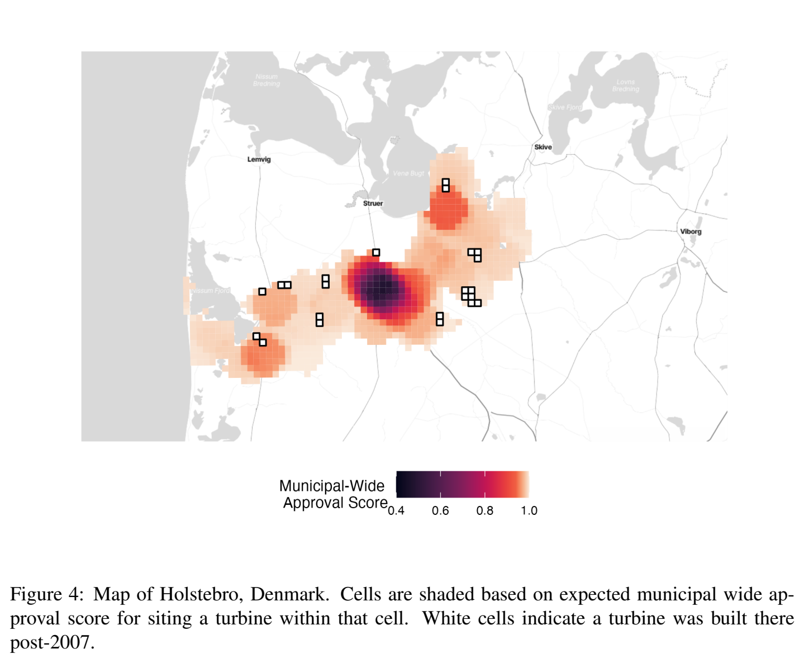

***Figure 4.*** Map of Holstebro, Denmark. Cells are shaded based on expected municipal wide ap- proval score for siting a turbine within that cell. White cells indicate a turbine was built there post-2007.

Figure 4 shows Holstebro, Denmark. The approval scores are depicted using shading. Dark purple areas are those where siting a turbine would be most unpopular. For example, the darkest part of the map is the center of the town of Holstebro. Here, less than 50 percent of voters

municipality-wide would support the location of a wind turbine. In contrast, light-shaded cells are locations where our theoretical model predicts that turbines should win majority support. These are largely along the east and west ends of the municipality, where there are fewer residents as a share of the overall population. The white cells show the actual distribution of turbines built between 2007 and 2021. The location largely followed the pattern of approval scores, staying outside the central and unpopular region.

Figure 5 shows Lolland, Denmark. Again, dark purple areas have low approval scores where we would not expect turbine siting. Since Lolland is a multi-core municipality, turbines are likely to be politically feasible either between the cores or on the northern islands of the municipality. This is supported by the actual placement of the turbines.

These visualizations provide some suggestive evidence that our approval score performs well in predicting turbine sites. In addition, they show how the approval score outperforms more naive heuristics, such as proximity to borders or areas with a low population density. Although these traits are correlated with the approval score, our model directly integrates them to provide a clearer picture of municipality-wide electoral support for this locally unwanted infrastructure. In the analyses below, we demonstrate the explanatory power of the approval score in predicting turbine siting using a regression model that links siting decisions to the approval score while controlling for potential confounder variables.8

### Analytical Strategy

We leverage the 2007 Danish municipal reform to study how jurisdictional structure influences turbine siting decisions. This reform merged hundreds of smaller municipalities into larger jurisdictions, redrawing their size and shape for nearly two-thirds of local governments (Blom-Hansen, Houlberg and Serritzlew 2014). These changes shifted the composition of local electorates—and thus altered our approval score measure for a given location—even though physical factors like topography, wind conditions, or land use remained constant.

8Approval scores for every municipality in Denmark are visualized in Appendix B.

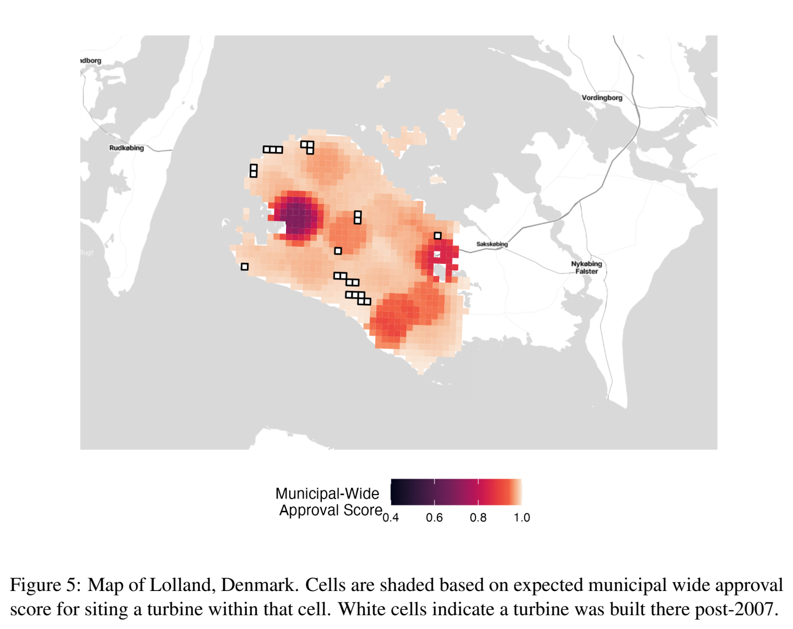

***Figure 5.*** Map of Lolland, Denmark. Cells are shaded based on expected municipal wide approval score for siting a turbine within that cell. White cells indicate a turbine was built there post-2007.

Our approach is therefore similar to a first-difference design, examining whether changes in approval scores induced by the reform predict changes in turbine siting (i.e., new turbines). By comparing the same grid cells before and after a shift in their jurisdictional boundaries, we hold constant time-invariant features of the grid cell that might otherwise confound the relationship between political geography and turbine siting.

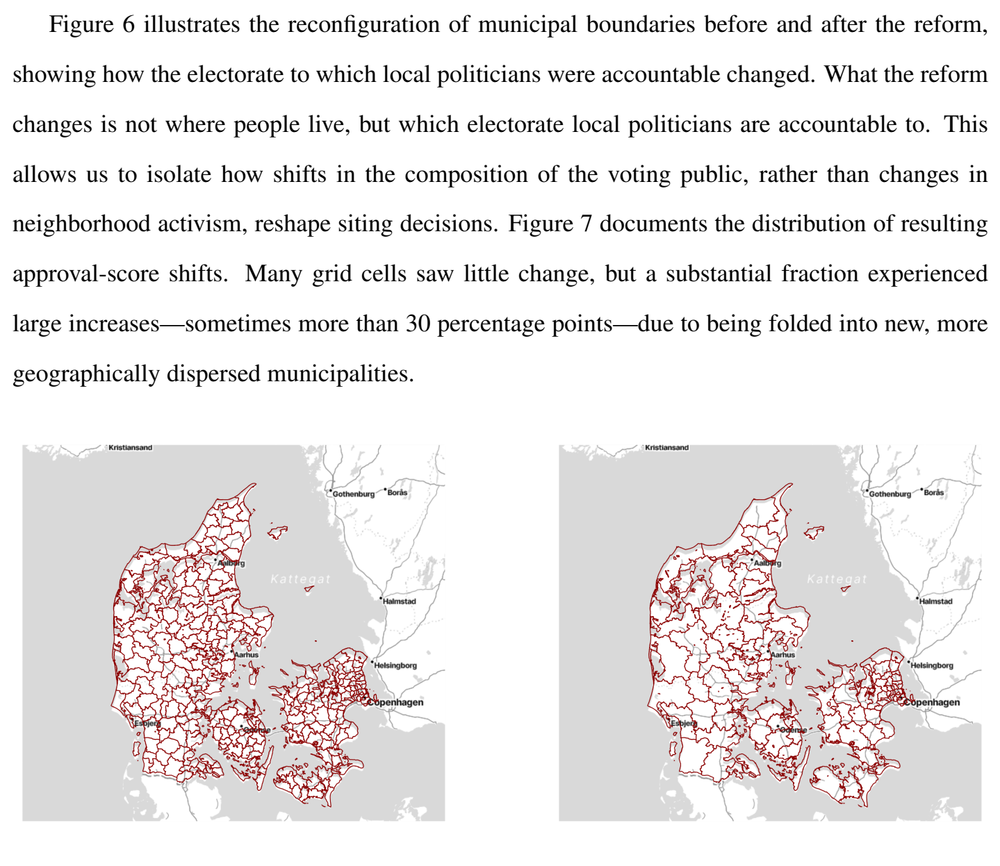

***Figure 6.*** illustrates the reconfiguration of municipal boundaries before and after the reform, showing how the electorate to which local politicians were accountable changed. What the reform changes is not where people live, but which electorate local politicians are accountable to. This allows us to isolate how shifts in the composition of the voting public, rather than changes in neighborhood activism, reshape siting decisions. Figure 7 documents the distribution of resulting approval-score shifts. Many grid cells saw little change, but a substantial fraction experienced large increases—sometimes more than 30 percentage points—due to being folded into new, more geographically dispersed municipalities.

Pre-2007 2007-present

Figure 6: Changing Borders of Danish Municipalities

A key remaining threat to inference is that areas where post-reform approval rose might also be, for other reasons, more suitable for turbine siting. To address this, we include a set of theoretically

motivated controls. Topography, for example, influences settlement patterns and hence the built environment, which can affect approval scores while also impacting wind capacity, since structures and terrain can disrupt wind flow. Rugged areas may be harder to develop, while coastal areas often face stricter aesthetic constraints. We therefore control for (1) the elevation of each grid cell’s centroid, (2) the standard deviation of elevation surrounding each grid cell (as a ruggedness measure), and (3) the distance to the coastline (Rediske et al. 2021; Wimhurst, Nsude and Greene 2023). We also directly include each grid cell’s estimated wind capacity from available data. Past research has emphasized the importance of proximity to municipal borders for siting locally unwanted land uses (e.g., Konisky and Woods 2010; Monogan III, Konisky and Woods 2017; Morehouse and Rubin 2021). For each of our analytical strategies, we include a specification which controls for the grid cell’s proximity to the nearest municipal border. Adding these border controls never alters the substantive effect of our approval score, demonstrating that our measure captures a grid cell’s political context beyond just proximity to the nearest border.

Beyond topography, it is possible that the municipal reform altered local political conditions in a way that affected turbine siting outside of the approval score pathway. To account for this possibility, we include pre-treatment municipal-wide controls for partisanship (vote share for green and mainstream left parties), percent homeowners, median household income, and percent college educated. This combination of pre-treatment controls and post-treatment municipal fixed effects captures whether areas were incorporated into municipalities with systematically different partisan or demographic profiles compared to their prior municipalities.

A related concern is that other reform-coincident changes—for example, shifts in zoning practices, formal planning capacity, or fiscal incentives—could generate patterns that resemble electoral accountability. However, our identifying variation comes from within–grid-cell changes in predicted approval induced by boundary shifts, with municipality fixed effects. Alternative channels would therefore have to vary within municipalities in a way that is systematically aligned with the reform-induced changes in political attractiveness across locations, rather than operating as broad municipality-wide reforms. We are not aware of such spatially targeted within-municipality

changes that coincide with the reform in a way that could reproduce the pattern we document. Moreover, our interviews with city managers (described in greater detail below and in Appendix J) provide little support for zoning practices, capacity, or fiscal incentives as drivers of siting decisions. Instead, officials consistently emphasized the political risks involved.

-0.5 0.0 0.5

Change in Approval Score, Pre-/Post-2007 Reform

ycneuqerF

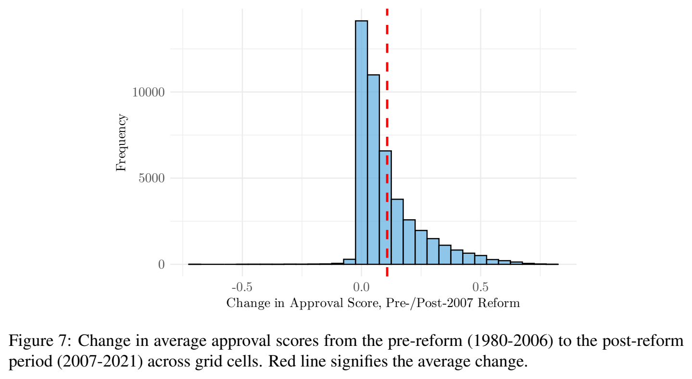

***Figure 7.*** Change in average approval scores from the pre-reform (1980-2006) to the post-reform period (2007-2021) across grid cells. Red line signifies the average change.

We model turbine siting using a logit framework, as the outcome—whether a turbine is built in a grid cell—is binary. Because turbine placement is a rare event, occurring in fewer than one percent of cells, standard logistic regression can yield biased and unstable estimates (King and Zeng 2001). We therefore use the Firth logit estimator (Firth 1993), which corrects rare-event bias and avoids separation by penalizing extreme coefficients, producing stable and interpretable estimates even in sparse data settings (Rainey and McCaskey 2021; Zorn 2005).

Finally, we cluster Huber-White standard errors at the municipal level to account for correlation within municipalities and ensure valid inference.

### Results

Before turning to the main analysis of the reform’s effects, we first describe the cross-sectional relationship between approval scores and turbine placement during the post-reform period from

2007 to 2021. This descriptive exploration helps illustrate how the distribution of approval scores relates to observed siting patterns in the data, without making any causal claims. We focus on the post-reform period because it is when most tall turbines were built and when the new municipal boundaries were in effect, allowing us to use a single approval score per grid cell and avoiding complications from pre- and post-reform differences.

Figure 8 presents a scatter plot illustrating the descriptive relationship between approval scores and turbine siting. Notably, no turbines are sited in areas with an approval score below 0.4, while nearly all turbines are sited in areas where the approval score exceeds 0.9—indicating that, according to our model, about 90 percent of the local electorate would approve of a turbine in that location. This pattern suggests that, in practice, turbines tend to be placed only in areas with overwhelming local support, which may reflect how strong local opposition from a minority can block projects even if a majority supports them. This descriptive relationship also highlights its strongly nonlinear form, underscoring the need for a model like the Firth logit to address rare-event data rather than relying on simple linear approaches.

0 0 0 0 0.004 0 0 0.004 0.004 0.011

[0-.1) [.1-.2) [.2-.3) [.3-.4) [.4-.5) [.5-.6) [.6-.7) [.7-.8) [.8-.9) [.9-1]

Democratic approval score, post-2007 reform

7002-tsop

,enibrut

stsoH

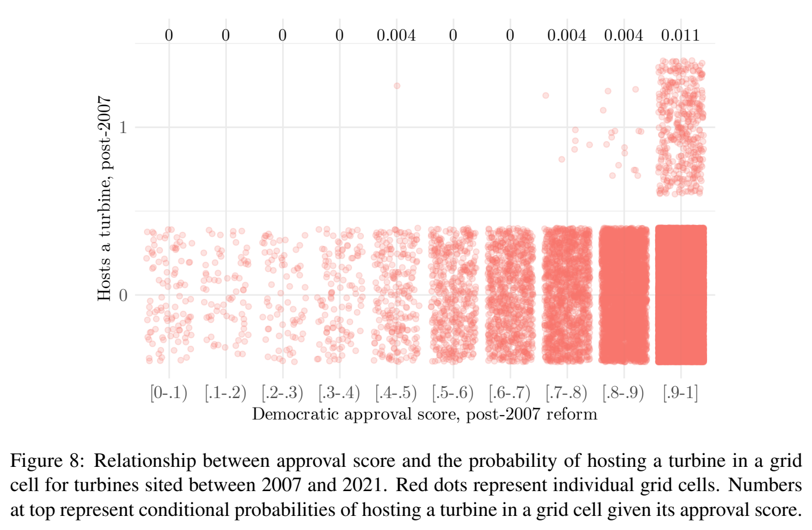

***Figure 8.*** Relationship between approval score and the probability of hosting a turbine in a grid cell for turbines sited between 2007 and 2021. Red dots represent individual grid cells. Numbers at top represent conditional probabilities of hosting a turbine in a grid cell given its approval score.

Figure 9 presents the main estimates, reporting the change in the odds ratio of turbine siting for a one-standard deviation increase in approval score (roughly 11 percentage points) using standard logit and Firth logit models. Four specifications are estimated: (1) a bivariate model; (2) a model controlling for topographic and demographic factors; (3) a model with municipality fixed effects; and (4) a model that also controls for distance to municipal borders (binned as 0–1 km, 1–3 km, 3–5 km, and 5–10 km). While model (3) is our preferred specification, we also include model (4) to test whether our approval score still has explanatory power after controlling for proximity to the border—a related measure that has been used in the literature, but that is unable to account fully for jurisdictional size, shape, and population density.

Across all specifications, we find a statistically significant relationship between approval scores and siting. In our preferred specification, which includes all controls and fixed effects, the odds ratio for a one-standard deviation increase in the approval score is roughly 1.4. This means that a one-standard deviation increase in the approval score is associated with a 40 percent increase in the odds of a turbine being sited.

Bivariate Controls Controls + FE Controls + FE + Border

Model

oitaR

sddO

Logit Firth logit

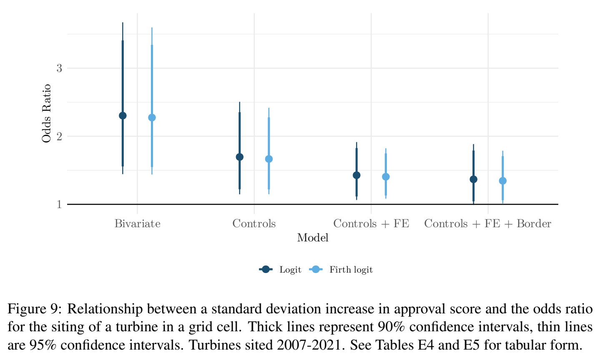

***Figure 9.*** Relationship between a standard deviation increase in approval score and the odds ratio for the siting of a turbine in a grid cell. Thick lines represent 90% confidence intervals, thin lines are 95% confidence intervals. Turbines sited 2007-2021. See Tables E4 and E5 for tabular form.

### Changes in Approval Scores and Siting Decisions

To better isolate the relationship between approval scores and turbine siting, we turn to a firstdifference design that exploits changes over time. We construct an adjusted dependent variable coded as one if a new turbine was sited in a grid cell after 2007, and zero if no new turbine was placed or if a turbine was decommissioned. This approach captures how shifts in the political attractiveness of a location—driven by changes in its approval score after the reform—relate to subsequent siting, while holding constant any time-invariant factors that could jointly influence jurisdictional boundaries, population distributions, and turbine siting. Because we compare the same grid cells before and after their exposure to a boundary change, this design strengthens causal inference by focusing on local “shocks” to approval scores induced by the reform.

Figure 10 presents the key results. These results are robust to the inclusion of detailed topographic and demographic controls as well as municipality fixed effects, underscoring that the effect of changes in approval scores on turbine siting cannot be explained by differential trends in siting based on geographic or infrastructural features of grid cells. In our preferred specification, which incorporates both fixed effects and controls, a one-standard-deviation increase in approval corresponds to a 87 percent increase in the odds of turbine siting.

These findings show that reform-driven changes in the approval score were strongly predictive of turbine siting, consistent with the model’s predictions. A 10-percentage-point increase in approval score—about one standard deviation—raised the odds of turbine placement by roughly 50–60 percent. Moreover, by holding constant time-invariant grid-level factors, this approach isolates the role of local political support in shaping renewable energy siting decisions.

### Robustness Checks and Sensitivity Analyses

Our theoretical model deliberately abstracts from heterogeneity in benefits and costs in order to isolate the spatial logic of opposition to locally unwanted land uses. To assess whether we have omitted other sources of preference heterogeneity that would affect our conclusions, we extend the model in Appendix C to allow costs and benefits to vary along two additional dimensions: home-

Bivariate Controls Controls + FE Controls + FE + Border

Model

oitaR

sddO

Logit Firth logit

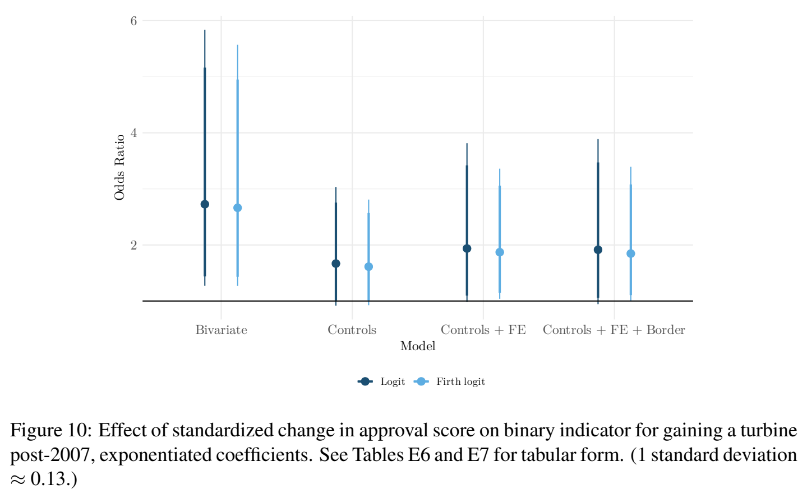

***Figure 10.*** Effect of standardized change in approval score on binary indicator for gaining a turbine post-2007, exponentiated coefficients. See Tables E6 and E7 for tabular form. (1 standard deviation ≈ 0.13.)

ownership status, which conditions how acutely voters perceive threats to property values, and green party voting, which conditions the perceived benefits of renewable energy. Specifically, we allow costs to accrue only to homeowners, while renters experience no distance-based disutility, and we allow benefits to vary at the municipality level as a function of support for green parties. These extensions introduce geographically correlated heterogeneity in voter utility while preserving the core spatial structure of the model. Using these modified utility functions, we construct alternative approval scores and reestimate our main Firth logit specification with identical controls and municipality fixed effects. The estimated effects of local approval on turbine siting remain similar to our more parsimonious baseline specification (see Appendix Table C2).

While our model tuning approach has the advantage of being data-driven, it raises the concern that parameters may be overly influenced by idiosyncratic pre-reform siting hotspots, especially as the aggregate number of turbines is relatively small. We therefore conduct some sensitivity analyses that probe the stability of our estimates with respect to the parameters k and q of the voter utility function. First, we implement a leave-one-municipality-out calibration exercise in which we

iteratively exclude each municipality from the pre-reform data and reselect k and q using the same procedure. The resulting utility functions, shown in Appendix Figure C3, tend to cluster close to the baseline. Second, we show that our conclusions are robust across a wide range of plausible parameter values: re-estimating the main Firth logit specification for all combinations of k and q yields consistently positive, statistically significant effects, with the baseline parameters producing relatively conservative estimates (Appendix Figure C4). Taken together, these results suggest that the approval score captures a stable underlying relationship that is not the result of overfitting to pre-reform siting patterns.

Another concern is that the results may depend on the specific height cutoff used to define the dependent variable. Figure 11 shows that the estimates are broadly similar across cutoffs of 60, 80, and 100 meters, suggesting that the findings are not driven by an arbitrary threshold choice. If anything, effects are somewhat larger for taller turbines, which is consistent with their greater visibility and political salience.

Finally, we implement a placebo analysis to assess whether reform-driven changes in approval scores predict turbine siting before the reform. Finding no such relationship, as shown in Appendix F, increases our confidence that the post-reform associations are not simply driven by unobserved, time-invariant factors that might jointly influence approval scores and turbine placement. This strengthens the credibility of our design by showing that it is the changes in jurisdictional structure—rather than pre-existing differences—that are linked to changes in turbine siting after the reform.

### Neighboring Municipalities

A key potential criticism of the results presented so far is that they might simply reflect population density near turbine sites rather than any politically meaningful mechanism. This concern is less likely in the reform-based analysis, where the population distribution is largely stable, and only jurisdictional boundaries change to alter approval scores. Nonetheless, to further probe this issue, we disaggregate local population density around each grid cell into two components: residents

Bivariate Controls Controls + FE

Model

oitaR

sddO

>60 meters >80 meters >100 meters

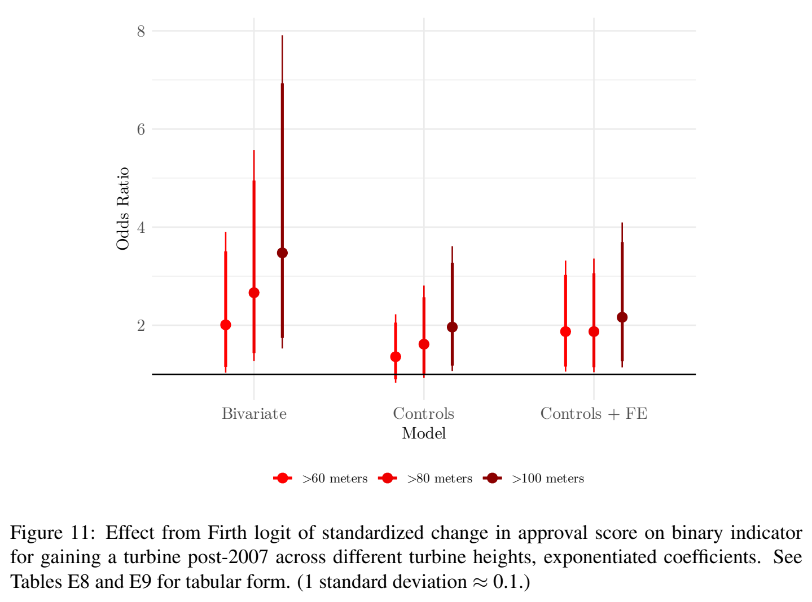

***Figure 11.*** Effect from Firth logit of standardized change in approval score on binary indicator for gaining a turbine post-2007 across different turbine heights, exponentiated coefficients. See Tables E8 and E9 for tabular form. (1 standard deviation ≈ 0.1.)

living inside the municipality where the grid cell is located, and residents living in neighboring municipalities. If our argument about political incentives holds, then only the density of voters within the same municipality should meaningfully affect turbine siting, as local politicians are accountable only to their own electorate.

We test this by calculating the density of the local population within a 1.5 km radius of each grid cell, distinguishing between voters inside the municipality and those in adjacent municipalities. We then relate these measures to turbine siting using a Firth logit model, first in a bivariate specification, and then with the inclusion of topographic and demographic controls and municipality fixed effects.

1.25

1.00

0.75

0.50

Bivariate Controls Controls + FE Controls + FE + Border

Model

oitaR

sddO

Within Municipality Neighboring Municipality

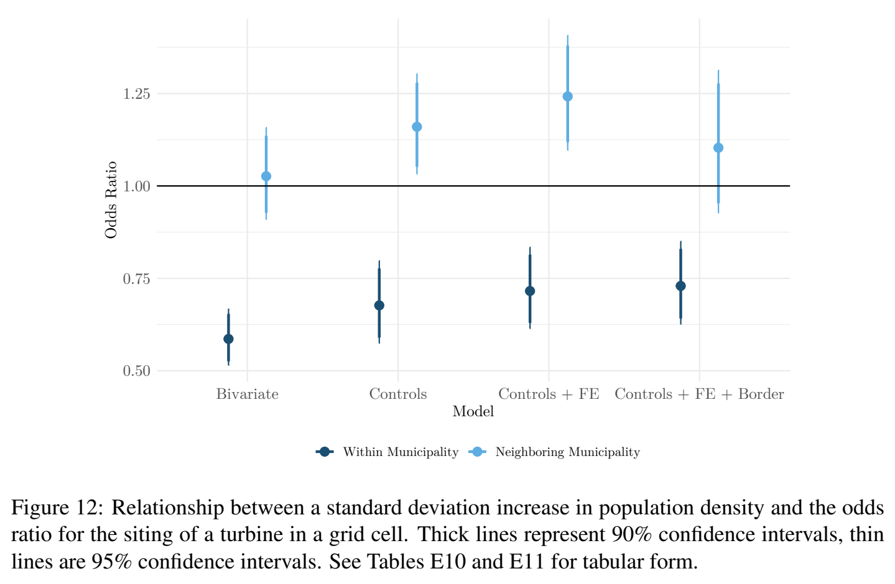

***Figure 12.*** Relationship between a standard deviation increase in population density and the odds ratio for the siting of a turbine in a grid cell. Thick lines represent 90% confidence intervals, thin lines are 95% confidence intervals. See Tables E10 and E11 for tabular form.

Figure 12 presents these results. The figure shows that the population density of neighboring municipalities becomes largely irrelevant for turbine siting decisions once we include municipality fixed effects. In other words, when comparing sites within the same municipality, only the density of local voters within that municipality predicts turbine placement. This finding is consistent with the idea that siting decisions are primarily driven by local political considerations, reflecting the

preferences and interests of voters to whom local politicians are directly accountable.

These results raise important concerns about the democratic legitimacy of decentralizing turbine siting decisions to local governments. By remaining unresponsive to residents of neighboring municipalities—who may be equally affected by turbine externalities but lack political influence over the permitting municipality—local governments can prioritize the interests of their own voters while disregarding broader regional impacts. Such patterns risk undermining public satisfaction with democratic processes and may exacerbate political polarization across municipal borders, particularly when harms are concentrated just outside the jurisdiction making the siting decision.

### Probing the Model Assumptions: Interviews and Media Coverage

To assess whether the mechanisms in our model operate in practice, we complement the quantitative analyses with qualitative evidence that addresses a core premise of the model: local politicians expect opposition to turbine projects and this expectation shapes where turbines are placed. We draw on two sources. First, we conducted interviews with city managers from eight Danish municipalities that have experience with turbine siting. These interviews help us understand how local officials perceive opposition, how salient it is during siting debates, and which considerations dominate internal discussions about where turbines can be approved. Second, we identified and systematically content coded more than 1,100 local and regional newspaper articles about wind energy between 2007 and 2022. The case selection strategy for the interviews and the newspaper corpus is detailed in Appendix J. Following Collier, Brady and Seawright (2010), we treat the interviews and media reports as causal process observations—“an insight or piece of data that provides information about context, process or mechanism, and that contributes distinctive leverage in causal inference” (p.355). Rather than offering a separate test of the model, these observations complement our grid-cell analyses by showing that the mechanisms required for our quantitative results to be causal are actually present: they document that opposition is salient to local officials, that it is anticipated, and that it feeds into siting discussions in the way implied by the model, thereby strengthening the plausibility of our statistical findings.

Interviews with City Managers. In the Danish municipalities, the city manager is the top official and central advisor of the mayor and the city council (Hansen 2024). They are thus in a key position to inform us about the local politics of wind energy deployment. The city managers were purposefully sampled from municipalities that differ in terms of size, population density, and housing prices, but their accounts of the local politics on this issue turned out to be largely identical across the eight municipalities. All city managers describe the siting of wind turbines as a politically salient process, dominated by concerns about political costs and rarely seen as a source of clear political benefits. At the same time, they emphasize a genuine interest among local politicians in contributing to the green transition. In line with this, most Danish municipalities have local climate plans with ambitious renewable energy targets. However, these local climate plans often lack concrete strategies for achieving the targets, and there are no clear sanctions if a municipality fails to meet the targets.

Two approaches seem to dominate the development of local wind energy projects. One is where a municipality announces an open call that invites developers to submit ideas for renewable energy projects in the municipality. The other is simply one where developers approach the municipality with an idea for a local project. If a project survives the initial screening stage by the municipality, then it is up to the developers to handle opposition from the landowners and affected residents, and the municipalities do not initiate formal changes to municipality and district plans before the developers have something like an understanding with the local interests. None of the eight city managers can imagine that the local councils would use compulsory acquisition of land for these projects.

Local landscape considerations matter to the evaluation of developer projects in the city council, but the main consideration is (anticipated) local opposition. Furthermore, the city managers describe potential benefits in terms of job creation and tax revenues as diminutive and insignificant. In most municipalities, the wind turbines are manufactured outside the municipality, and the developer companies channel most of the revenues out of the municipality. In fact, some of the city managers point out that the local benefits could be raised, but it would require national regulation

and redistribution that awards the local areas that produce renewable energy.

The interest of neighboring municipalities also does not seem to matter much to the siting of wind turbines. If a neighboring municipality issues a complaint, the complaint will have a delaying effect, but according to the city managers the minister responsible will normally dismiss the complaint. Furthermore, one city manager describes it as a general norm that municipalities will be cautious to complain about other municipalities.

In summary, the interviews with the city managers describe the siting of wind energy projects as infused with strong local political interests, and as politics where potential political costs dominate potential political gains. There may be a future political cost if the ambitious local renewable energy targets are not reached, but the political consequences are expected to be limited as summarized by one of the city managers: “If the municipality does not reach the 2030-target in the local climate plan it may generate some critical discussion in the council at that time, but it will not be a major political problem.”

Local Media Content. A mapping of local and regional media coverage of wind energy projects from 2007 to 2022 corroborates the impression of frequent local opposition to new wind energy projects. Based on an inclusive keyword search, 1,118 newspaper articles from local and regional outlets were selected for close reading, of which 300 articles concerned wind energy deployment. Approximately 70 percent of these articles focused on concrete local wind energy projects, and about 70 percent of these reported local opposition to the projects. Furthermore, 72 percent of the sampled dates contained one or more critical article about a local wind energy project. The articles span a wide geographic range. When mapped to official Danish municipalities, the coverage identifies wind energy projects in 43 of Denmark’s 98 municipalities, indicating that local contestation is not confined to a small number of areas but is a recurring feature of wind energy deployment across jurisdictions. The numbers are summarized in Table 1.

This mapping of local and regional media coverage does not qualify as a comprehensive analysis of the role of local opposition in wind energy projects, first and foremost because much of the opposition is anticipated in the political approval or rejection of proposed sites. When no

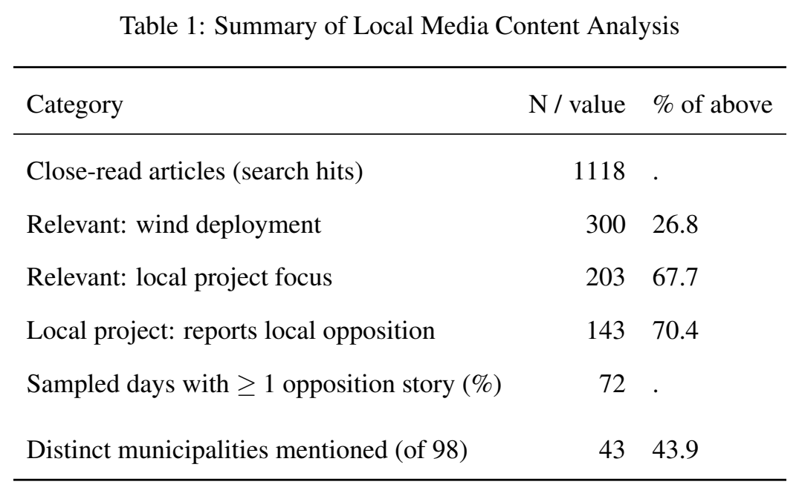

***Table 1.*** Summary of Local Media Content Analysis

[Download data as CSV](tables/tab-01.csv)

Category N / value % of above Close-read articles (search hits) 1118 .

Relevant: wind deployment 300 26.8

Relevant: local project focus 203 67.7

Local project: reports local opposition 143 70.4

Sampled days with ≥ 1 opposition story (%) 72 .

Distinct municipalities mentioned (of 98) 43 43.9

Notes: Based on an inclusive keyword search in local and regional newspapers on

randomly sampled dates (see Appendix J). Location information is recorded only when

explicitly mentioned in the article.

project advances far enough to trigger public contestation, media coverage is unlikely. What the media analysis does add, however, is a clear indicator of the hostile local political context that frequently accompanies proposals for new wind energy projects, even after careful political selection processes.

Taken together, the interviews and media mapping broadly confirm the logic of our model. Local siting decisions are not primarily technical or ideological; they are dominated by concerns about political costs, and city managers consistently report that turbines provide few immediate political benefits. This raises the question of how any projects are approved at all. The most consistent answer is a substantive, if diffuse, desire among local officials to do their part on climate issues. The limited benefits of turbine construction may also help explain why turbines are only built in locations where our model predicts that very few voters will be directly affected (see Figure

### Conclusion

This paper has examined how the size and shape of political jurisdictions structure local policy outcomes, using the siting of wind turbines in Denmark as a critical test case. While existing research has extensively explored the consequences of jurisdictional boundary drawing for representation of various partisan and racial groups, as well as administrative efficiency, it has paid far less attention to how these features influence policy decisions. We argue that the size and shape of jurisdictions affect governments’ incentives when siting unwanted land uses. Larger municipalities can place such facilities so that a smaller share of their own voters is directly affected. Moreover, irregularly shaped municipal borders can be exploited strategically to concentrate negative impacts on areas with relatively fewer within-municipality residents, thereby minimizing electoral costs. We formalize these insights in a theoretical model of renewable energy siting under decentralized authority, and test it using detailed administrative data and a rare natural experiment—Denmark’s 2007 municipal reform—which affected the jurisdiction size and boundaries of Danish local governments.

Our analysis shows that the approval score derived from our model—capturing the share of voters in the municipality expected to support a turbine at a given location—strongly predicts turbine siting. Leveraging the municipal reform we demonstrate that exogenous changes in the approval score, induced by boundary shifts, also influence siting outcomes. This strengthens causal claims that local political preferences, as structured by jurisdictional boundaries, systematically shape renewable energy development. We also show that these patterns are highly localized: only the preferences of voters within the permitting municipality predict turbine siting, while the interests of neighboring residents—who may still experience the costs—are largely disregarded.

Although Denmark is a high-trust, pro-climate country, the political mechanism we identify does not depend on consensus over climate policy, but on electoral contestation over spatially concentrated costs. Even in Denmark, where there is broad support for renewable energy in the abstract, turbines are built only where overwhelming shares of the relevant electorate are predicted to approve of their location. This indicates that spatially concentrated opposition remains elec-

torally potent even in favorable political environments. In contexts where the perceived benefits of wind energy are so low that no projects are built anywhere, there is little to explain. However, conditional on renewable projects being proposed and sometimes approved, the same logic should govern where they are placed: officials will seek to minimize the share of politically relevant voters exposed to their costs.

In more polarized political systems, general elections may provide weaker discipline over landuse decisions. However, at the local level, polarization often shifts accountability. Where general elections are uncompetitive, local politicians are often constrained by intra-party competition, primary elections, preference votes, or party nomination processes, all of which remain highly sensitive to mobilized, geographically concentrated opposition. In such settings, the politically relevant electorate may be narrower than the full voting population, but it is still spatially grounded. This implies that the incentives to site locally unwanted infrastructure in politically safer parts of a jurisdiction should persist even under polarization, albeit with respect to the voters or party actors who control political careers rather than to the general electorate.

These findings carry important implications. First, they highlight that LULU siting conflicts occur within a wider electoral context. In contrast, recent analysis of NIMBYism has often focused narrowly on the preferences, resources, and mobilization of the residents most proximate to the proposed site. If these hyper-local factors determine policy outcomes, we would not find a relationship between changes in jurisdictional boundaries and turbine construction. The hyper-local factors would remain the same. Instead, a border change several kilometers away has the ability to transform a potential turbine site from politically untenable in the eyes of elected officials to feasible or even desirable. While it is important to continue studying the effects of neighborhood activism, our results recenter decision-makers as accountable to the wider electorate—at least when elected at-large and when land-use authority is vested in general-purpose local governments rather than neighborhood bodies.

Second, the findings underscore that local political geography can distort the allocation of renewable energy infrastructure, potentially undermining both efficiency and fairness in the tran-

sition away from fossil fuels. While local control over siting may enhance democratic legitimacy within municipalities, it can also create externalities that cross jurisdictional boundaries and erode regional cooperation. The repeated siting of locally unwanted infrastructure may not only serve as a rallying point for opposition movements (Bosetti et al. 2025), but also raise equity concerns if local residents face economic barriers to political participation or exit (Bullard 1990).

Future work might extend these insights to other types of locally unwanted land uses or to contexts beyond Denmark, exploring how different institutional designs could balance local accountability with broader collective goals. At the same time, many contexts at the forefront of the energy transition are also middle-income and highly unequal democracies, such as Brazil and South Africa. While wind and solar siting in these countries also faces local opposition (Hochstetler 2020), researchers should work to incorporate potential political inequalities into the siting analysis. Greater differentials in the ability to mobilize and lobby policymakers may weaken the influence of the distribution of the electorate, compared to more equal democracies.

In sum, this study demonstrates that the ways we draw and structure political jurisdictions do not only affect how citizens are represented, but also profoundly shape the substance of policy itself. As societies accelerate efforts to decarbonize, understanding these jurisdictional effects will be crucial to ensuring that climate policy is both effective and democratically sustainable.

### References

Almond, Gabriel A. and Sidney Verba. 1963. The Civic Culture: Political Attitudes and Democracy in Five Nations. Princeton, NJ: Princeton University Press.

Andersen, Carsten and Timo Hener. 2023. Wind Turbines, Shadow Flicker, and Real Estate Values. Technical report CESifo Working Paper.

Blom-Hansen, Jens, Kurt Houlberg and Søren Serritzlew. 2014. “Size, democracy, and the economic costs of running the political system.” American Journal of Political Science 58(4):790– 803.

Blom-Hansen, Jens, Kurt Houlberg, Søren Serritzlew and Daniel Treisman. 2016. “Jurisdiction size and local government policy expenditure: Assessing the effect of municipal amalgamation.” American Political Science Review 110(4):812–831.

Bolet, Diane, Fergus Green and Mikel Gonzalez-Eguino. 2024. “How to get coal country to vote for climate policy: The effect of a “Just Transition Agreement” on Spanish election results.” American Political Science Review 118(3):1344–1359.

Bosetti, Valentina, Italo Colantone, Catherine E De Vries and Giorgio Musto. 2025. “Green backlash and right-wing populism.” Nature Climate Change 15(8):822–828.

Brunner, Eric J. and David J. Schwegman. 2022. “Commercial wind energy installations and local economic development: Evidence from U.S. counties.” Energy Policy 165:112993.

Bullard, Robert D. 1990. Dumping in Dixie: Race, class, and environmental quality. Westview Press.

Caughey, Devin, Chris Tausanovitch and Christopher Warshaw. 2017. “Partisan gerrymandering and the political process: Effects on roll-call voting and state policies.” Election Law Journal: Rules, Politics, and Policy 16(4):453–469.

Clean Air Task Force. 2024. “New report shows the diversity of clean energy siting policies and permitting authorities across the country.”. Accessed March 6, 2025.

URL: https: // www. catf. us/ 2024/ 06/ new-report-shows-diversity-clean-energy-siting-pol Clean Energy Wire. 2025. “Surveying the Harvest: How to Build a Wind Farm in Germany.”. Accessed March 6, 2025.

URL: https: // www. cleanenergywire. org/ factsheets/ survey-harvest-how-build-wind-farm-germany

Collier, David, Henry E Brady and Jason Seawright. 2010. “Outdated views of qualitative methods: time to move on.” Political Analysis 18(4):506–513.

Costa, Hélia and Linda Veiga. 2021. “Local labor impact of wind energy investment: an analysis of Portuguese municipalities.” Energy Economics 94:105055.

Cruz, Rizalino B. 2018. “The politics of land use for distributed renewable energy generation.” Urban Affairs Review 54(3):524–559.

Dahl, Robert A. 2008. Democracy and its Critics. Yale university press.

de Benedictis-Kessner, Justin and Michael Hankinson. 2019. “Concentrated burdens: How selfinterest and partisanship shape opinion on opioid treatment policy.” American Political Science Review 113(4):1078–1084.

De Silva, Dakshina G., Robert P. McComb and Anita R. Schiller. 2016. “What Blows in with the Wind?” Southern Economic Journal 82(3):826–858.

Denters, Bas, Michael Goldsmith, Andreas Ladner, Poul Erik Mouritzen and Lawrence E Rose. 2014. Size and local democracy. In Size and local democracy. Edward Elgar Publishing.

Devine-Wright, Patrick. 2009. “Rethinking NIMBYism: The Role of Place Attachment and Place Identity in Explaining Place-protective Action.” Journal of Community & Applied Social Psychology 19(6):426–441.

Düben, Christian, Richard Bluhm, Luis Calderon, Darin Christensen, Timothy Conley, Thiemo Fetzer, Leander Heldring and Maintainer Christian Düben. 2022. “Package ‘conleyreg’.”.

Firth, David. 1993. “Bias Reduction of Maximum Likelihood Estimates.” Biometrika 80(1):27–38. Furuseth, Owen J. 1990. “Impacts of a sanitary landfill: Spatial and non-spatial effects on the surrounding community.” Journal of Environmental Management 31(3):269–277.

Gerring, John and Wouter Veenendaal. 2020. Population and Politics: The Impact of Scale. Cambridge University Press.

Hansen, Morten Balle. 2024. The Danish Municipal CEO: Managing the Local Welfare State. In Managing Nordic Local Governments: Paradoxes and Challenges of the Municipal Chief Executive Officer. Springer Nature Switzerland Cham pp. 83–109.

Hazlett, Chad and Matto Mildenberger. 2020. “Wildfire exposure increases pro-environment voting within democratic but not republican areas.” American Political Science Review 114(4):1359– 1365.

Hevia-Koch, Pablo and Jacob Ladenburg. 2019. “Where should wind energy be located? A review of preferences and visualisation approaches for wind turbine locations.” Energy Research & Social Science 53:23–33.

Hochstetler, Kathryn. 2020. Political economies of energy transition: wind and solar power in Brazil and South Africa. Cambridge University Press.

Hoen, Ben, Jason Brown, Thomas Jackson, Mark Thayer, Ryan Wiser and Peter Cappers. 2015. “Spatial Hedonic Analysis of the Effects of US Wind Energy Facilities on Surrounding Property Values.” The Journal of Real Estate Finance and Economics 51(1):22–51.

Hoen, Ben, Ryan Wiser, Peter Cappers, Mark Thayer and Gautam Sethi. 2011. “Wind Energy Facilities and Residential Properties: The Effect of Proximity and View on Sales Prices.” Journal of Real Estate Research 33(3):279–316.

Hughes, Llewelyn and Phillip Y Lipscy. 2013. “The Politics of Energy.” Annual Review of Political Science 16(1):449–469.

IEA Wind. 2022. Wind Energy in Italy: Recent Trends and Future Prospects. Technical report International Energy Agency (IEA) Wind. Accessed March 6, 2025.

URL: https: // iea-wind. org/ wp-content/ uploads/ 2022/ 12/ Italy_ k2. pdf

Isaksson, Zeth and Simon Gren. 2024. “Political expectations and electoral responses to wind farm development in Sweden.” Energy Policy 186:113984.

Jarvis, Stephen. 2025. “The Economic Costs of NIMBYism: Evidence from Renewable Energy Projects.” Journal of the Association of Environmental and Resource Economists 12(4):983– 1022.

King, Gary and Langche Zeng. 2001. “Logistic Regression in Rare Events Data.” Political Analysis 9(2):137–163.

Kirch Kirkegaard, Julia, Tom Cronin, Sophie Nyborg and Peter Karnøe. 2021. “Paradigm shift in Danish wind power: the (un) sustainable transformation of a sector.” Journal of Environmental Policy & Planning 23(1):97–113.

Konisky, David M and Neal D Woods. 2010. “Exporting air pollution? Regulatory enforcement and environmental free riding in the United States.” Political Research Quarterly 63(4):771–782. Lang, Corey, James J. Opaluch and George Sfinarolakis. 2014. “The Windy City: Property Value Impacts of Wind Turbines in an Urban Setting.” Energy Economics 44:413–421.

Larsen, Martin Vinæs and Marc Hvidkjær. 2025. “Politisk Repræsentation i det Danske Lokaldemokrati.” Politica .

Lassen, David Dreyer and Søren Serritzlew. 2011. “Jurisdiction size and local democracy: Evidence on internal political efficacy from large-scale municipal reform.” American Political Science Review 105(2):238–258.

Marble, William and Clayton Nall. 2021. “Where self-interest trumps ideology: liberal homeowners and local opposition to housing development.” The Journal of Politics 83(4):1747–1763.

Monogan III, James E, David M Konisky and Neal D Woods. 2017. “Gone with the wind: Federalism and the strategic location of air polluters.” American Journal of Political Science 61(2):257– 270.

Morehouse, John and Edward Rubin. 2021. “Downwind and out: The strategic dispersion of power plants and their pollution.” Available at SSRN 3915247 .

Nadaï, Alain and Olivier Labussière. 2014. Wind Energy Development in France: From State Regulation to Local Planning. In Wind Power in Europe: Politics, Business and Society, ed. Jens-Peter Fenger. Springer pp. 85–106.

URL: https: // link. springer. com/ chapter/ 10. 1007/ 978-94-017-9843-3_ 5

Naturstyrelsen, Miljøministeriet. 2015. “Vejledning om planlægning for og tilladelse til opstilling af vindmøller.”.

NFU Energy. 2022. “Wind Energy Guide.”. Accessed March 6, 2025.

URL: https: // www. nfuenergy. co. uk/ sites/ default/ files/ nfu_ wind_ guide_ a4_ 4pg_ -_ feb_ 2022. pdf

Oates, Wallace E. 1972. Fiscal federalism. London: Edward Elgar Publishing.

Ostrom, Elinor. 2009. “A general framework for analyzing sustainability of social-ecological systems.” Science 325(5939):419–422.

Pettersson, Maria, Kristina Ek, Kristina Söderholm and Patrik Söderholm. 2010. “Wind power planning and permitting: Comparative perspectives from the Nordic countries.” Renewable and Sustainable Energy Reviews 14(9):3116–3123.

Quaschning, Volker V. 2019. Renewable Energy and Climate Change. John Wiley & Sons.

Rainey, Carlisle and Kelly McCaskey. 2021. “A Solution to Separation in Binary Response Models.” Political Analysis 29(1):43–56.

Rediske, G, HP Burin, PD Rigo, CB Rosa, L Michels and JCM Siluk. 2021. “Wind Power Plant Site Selection: A Systematic Review.” Renewable and sustainable energy reviews 148:111293. Reuters. 2025. “How a Storm of Lawsuits Paralysed Wind Mills in Northwest Spain.” Reuters . Accessed March 6, 2025.

URL: https: // www. reuters. com/ business/ energy/ how-storm-lawsuits-paralysed-wind-mills-northwest-spain-2025-01-14/

Sandman, Peter M. 1985. “Getting to maybe: some communications aspects of siting hazardous waste facilities.” Seton Hall Legis. J. 9:437.

Scheifele, Fabian and David Popp. 2024. “Not in My Backyard? The Local Impact of Wind and Solar Parks in Brazil.” CESifo Working Paper Series 11023.

Stokes, Leah. 2020. Short Circuiting Policy: Interest Groups and the Battle Over Clean Energy and Climate Policy in the American States. Oxford University Press.

Stokes, Leah C. 2016. “Electoral backlash against climate policy: A natural experiment on retrospective voting and local resistance to public policy.” American Journal of Political Science 60(4):958–974.

Stokes, Leah, Emma Franzblau, Jessica R Lovering and Chris Miljanich. 2023. “Prevalence and predictors of wind energy opposition in North America.” Proceedings of the National Academy of Sciences 120(40):e2302313120.

Susskind, Lawrence, Jungwoo Chun, Alexander Gant, Chelsea Hodgkins, Jessica Cohen and Sarah Lohmar. 2022. “Sources of Opposition to Renewable Energy Projects in the United States.” Energy Policy 165.

Tiebout, Charles M. 1956. “A Pure Theory of Local Expenditures.” Journal of political economy 64(5):416–424.

Treisman, Daniel. 2007. The Architecture of Government: Rethinking Political Decentralization. Cambridge University Press.

Trounstine, Jessica. 2009. “All Politics is Local: The Reemergence of the Study of City Politics.” Perspectives on Politics 7(3):611–618.

Urpelainen, Johannes and Alice Tianbo Zhang. 2022. “Electoral Backlash or Positive Reinforcement? Wind Power and Congressional Elections in the United States.” The Journal of Politics 84(3):1306–1321.

Warshaw, Christopher. 2019. “Local elections and representation in the United States.” Annual Review of Political Science 22:461–479.

Wimhurst, Joshua J, Chinedu C Nsude and J Scott Greene. 2023. “Standardizing the Factors Used in Wind Farm Site Suitability Models: A Review.” Heliyon 9(5).

Zorn, Christopher. 2005. “A Solution to Separation in Binary Response Models.” Political Analysis 13(2):157–170.

### Appendix: For Online Publication

### Contents

A Responsibility for Siting Renewable Energy Projects in Selected Countries . . . . . 2 B Visualization of Approval Scores by Municipality . . . . . . . . . . . . . . . . . . 3 C Theoretical Model . . . . . . . . . . . . . . . . . . . . . . . . . . . . . . . . . . . 9 D Descriptive Statistics . . . . . . . . . . . . . . . . . . . . . . . . . . . . . . . . . 18 E Results in Tabular Form . . . . . . . . . . . . . . . . . . . . . . . . . . . . . . . . 19 F Placebo Test . . . . . . . . . . . . . . . . . . . . . . . . . . . . . . . . . . . . . . 28 G Modeling Count Data . . . . . . . . . . . . . . . . . . . . . . . . . . . . . . . . . 28 H Potential Moderators . . . . . . . . . . . . . . . . . . . . . . . . . . . . . . . . . 31 I Conley Standard Errors . . . . . . . . . . . . . . . . . . . . . . . . . . . . . . . . 33 J Case Selection for Interviews and Media Content Analysis . . . . . . . . . . . . . 33

### A Responsibility for Siting Renewable Energy Projects in Selected Countries

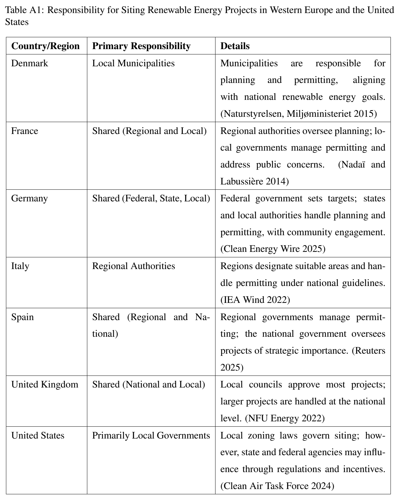

***Table A1.*** Responsibility for Siting Renewable Energy Projects in Western Europe and the United States

[Download data as CSV](tables/tab-02.csv)

Country/Region Primary Responsibility Details

Denmark Local Municipalities Municipalities are responsible for planning and permitting, aligning with national renewable energy goals. (Naturstyrelsen, Miljøministeriet 2015) France Shared (Regional and Local) Regional authorities oversee planning; local governments manage permitting and address public concerns. (Nadaï and Labussière 2014)

Germany Shared (Federal, State, Local) Federal government sets targets; states and local authorities handle planning and permitting, with community engagement. (Clean Energy Wire 2025)

Italy Regional Authorities Regions designate suitable areas and handle permitting under national guidelines. (IEA Wind 2022)

Spain Shared (Regional and Na- Regional governments manage permittional) ting; the national government oversees projects of strategic importance. (Reuters 2025)

United Kingdom Shared (National and Local) Local councils approve most projects; larger projects are handled at the national level. (NFU Energy 2022)

United States Primarily Local Governments Local zoning laws govern siting; however, state and federal agencies may influence through regulations and incentives. (Clean Air Task Force 2024)

### B Visualization of Approval Scores by Municipality

These visualizations show the the approval score, colored by quintile of the overall distribution, for each municipality in Denmark. Municipalities are ordered by land area (smallest to largest).

Christiansø Kommune Frederiksberg Kommune Vallensbæk Kommune Rødovre Kommune Herlev Kommune Glostrup Kommune Brøndby Kommune Dragør Kommune Albertslund Kommune Gladsaxe Kommune Hvidovre Kommune Gentofte Kommune Ishøj Kommune Ballerup Kommune Hørsholm Kommune Lyngby−Tårbæk Kommune Solrød Kommune Furesø Kommune Greve Kommune Allerød Kommune Municipal−Wide

Approval Score

4 0.0 0.2 0.4 0.6 0.8 1.0

Høje Tåstrup Kommune Rudersdal Kommune Tårnby Kommune Fanø Kommune Københavns Kommune Fredensborg Kommune Egedal Kommune Ærø Kommune Helsingør Kommune Halsnæs Kommune Fredericia Kommune Samsø Kommune Læsø Kommune Hillerød Kommune Roskilde Kommune Kerteminde Kommune Odder Kommune Lejre Kommune Køge Kommune Stevns Kommune Municipal−Wide

Approval Score

5 0.0 0.2 0.4 0.6 0.8 1.0

Frederikssund KommuneRingsted Kommune Gribskov Kommune Struer Kommune Nyborg Kommune Sorø Kommune Odense Kommune Middelfart Kommune Langeland Kommune Odsherred Kommune Faxe Kommune Morsø Kommune Skanderborg Kommune Svendborg Kommune Århus Kommune Nordfyns Kommune Billund Kommune Favrskov Kommune Horsens Kommune Assens Kommune Municipal−Wide

Approval Score

6 0.0 0.2 0.4 0.6 0.8 1.0

Lemvig Kommune Hedensted Kommune Sønderborg Kommune Holbæk Kommune Rebild Kommune Kolding Kommune Brønderslev Kommune Slagelse Kommune Bornholms Kommune Fåborg−Midtfyn Kommune Kalundborg Kommune Frederikshavn Kommune Næstved Kommune Ikast−Brande Kommune Vordingborg Kommune Syddjurs Kommune Mariagerfjord KommuneRanders Kommune Skive Kommune Norddjurs Kommune Municipal−Wide

Approval Score

0.0 0.2 0.4 0.6 0.8 1.0

Esbjerg Kommune Vesthimmerland KommuneVejen Kommune Holstebro Kommune Haderslev Kommune Silkeborg Kommune Jammerbugt Kommune Hjørring Kommune Åbenrå Kommune Lolland Kommune Guldborgsund Kommune Vejle Kommune Thisted Kommune Aalborg Kommune Tønder Kommune Varde Kommune Herning Kommune Viborg Kommune Ringkøbing−Skjern Kommune

Municipal−Wide

Approval Score

8 0.0 0.2 0.4 0.6 0.8 1.0

### C Theoretical Model

Extension: Heterogeneous Benefits and Costs

In our main analysis, we model the utility experienced by a voter at location i from a turbine at location j according to the function:

(cid:18) (cid:19)2

U = b − k (C1) d(i, j) + q

where d(i, j) represents the Euclidean distance between locations i and j. This assumes that all voters experience the same benefits, and that the only factor that determines voters’ costs is their distance to the turbine. While such a slimmed-down model is appealing for its simplicity—especially given its predictive power—it may risk obscuring important dimensions of political conflict that generate unmodeled spatial heterogeneities in benefits and costs.

In this section, we incorporate into the model what we consider to be the two most important sources of preference heterogeneity besides distance: homeownership status, which drives heterogeneity in costs, and green party voting, which drives heterogeneity in benefits. After introducing these adaptations to the theoretical model, we construct new approval scores based on these adaptations and reestimate our main empirical results using these scores.

Heterogeneous Costs by Homeownership Status. We assume that there are two types of voters at any location i: homeowners (h) and renters (r). Whereas homeowners have the cost structure in the baseline model (Equation C1), renters experience no costs—consistent with the assumption that opposition is mobilized primarily on the basis of property values, or that renters are much less likely than homeowners to condition their vote choice on turbine sitings. The utility functions for these groups are given as follows:

(cid:18) (cid:19)2

Uh(i, j) = b − k

d(i, j) + q (C2) Ur(i, j) = b

Accordingly, we define two versions Ah and Ar for homeowners and renters, respectively: i,j i,j

 1 if b > c(i, j) Ah = 0 if b < c(i, j) (C3) i,j

 coin flip between 1 and 0 if b = c(i, j)  1 if b > 0 Ar = 0 if b < 0 (C4) i,j

 coin flip between 1 and 0 if b = 0 Finally, we aggregate to produce the approval score A :

(cid:16) (cid:17) ∑ i∈M h i Ah i,j + (1 − h i )Ar i,j P i

A = (C5) ∑ i∈M P i

where h is the homeownership rate at location i.

Heterogeneous Benefits by Green Party Voting. Building on the heterogeneous costs model, we further incorporate heterogeneous benefits conditioned by green voting. Since these data are unavailable at the grid cell level, we take a municipality-wide approach. We assume that total benefit b is composed of two parts: be, which is the part of benefit that is constant across all voters and all municipalities, and b , which is the added political benefit to a voter in municipality (cid:18) (cid:19)2 (cid:18) (cid:19)2

1 1

Uh(i, j) = be + bp − k = 1 + g − k

m m d(i, j) + q m d(i, j) + q (C6) Ur (i, j) = be + bp = 1 + g

m m m

We normalize be to 1 and define b p as 1 times the probability of being a green voter, which is estimated with g —the proportion of green voters in the municipality. Aggregating approval to the municipality level proceeds as in Equation C5 above.

Sensitivity of Results. Each of these approaches generates a new approval score, which we substitute for our main approval score in the Controls + Fixed Effects Firth logit specification in Figure

### 10. Table C2 presents results, including estimates from the baseline model for comparison (first

column); estimates from calculating approval scores with heterogeneous costs (second column);

and estimates from calculating approval scores with heterogeneous costs and benefits (third column).

Parameter Selection for the Voter’s Utility Function

In this section, we describe our data-driven process for selecting the optimal values of the parameters k and q, normalizing the (non-spatial) benefit of a turbine, b, to 1. These parameters control the shape of the cost function experienced by voters, in particular how intensely the costs are felt relative to the benefit as well as how these costs decay over space.

We find the values of k and q that make our model most predictive of turbine sitings. Our grid includes q values from 0 to 1, inclusive, incremented by 0.1, as well as k values from 1 to 20, inclusive, incremented by 1, generating a total of 220 candidate pairs. The parameters k and q work together to determine the shape of the utility function, and together the grids of k ∈ [1,20] and q ∈ [0,1] accommodate a wide variety of shapes. Figure C1 shows the outer bounds of what can be accommodated by our candidate parameters, with k and q set to their respective minimal and maximal values. The resulting utility functions may represent a high baseline of support even immediately adjacent to the turbine (panel c) or opposition up to nearly 5 km away (panel b); costs may decay intensely over the first kilometer (panel a) or the decay can be quite gradual (panel d). These bounds contain the range of plausible functions that accord with intuitions and expectations derived from prior research: for instance, Jarvis (2025) finds that the effects of large and visible wind turbines on nearby property values are present at distances up to 4 km.

For each candidate pair, we run a support vector machine (SVM) classification model and assess its performance at predicting tall turbine sitings (>80 meters). We use the pre-reform data (1998-2006) for this calibration exercise.9 The process proceeds as follows:

1. Begin with a data set that has one observation per grid cell for all grid cells in Denmark. For each grid cell, compute the municipality-wide approval score based on the municipality boundaries during that period as well as grid-cell-level population averaged over that period. The outcome is a binary indicator of whether a turbine over 80 meters was newly built in that grid cell at any point during that period.

2. Divide this data set into training and test data. The training set contains 70% of the sample and the test set the remaining 30%. Because tall turbine siting is a rare event in the data, 9We select 1998 as the start of the pre-reform period because that is the first year in which a tall turbine appears in the data.

Model 1 Model 2 Model 3 ∆ approval (standardized) 0.627∗ 1.004∗ 0.622† Approval (pre-2007) 4.563∗∗ 12.390∗ 5.428∗ Elevation −0.012 −0.012 −0.012

Elevation, squared 0.000 0.000 0.000 Hilliness −0.218∗∗∗ −0.214∗∗∗ −0.218∗∗∗ Hilliness, squared 0.005∗∗∗ 0.005∗∗∗ 0.005∗∗∗ Distance to coast 0.103∗ 0.104∗ 0.106∗ Distance to coast, squared −0.002† −0.002† −0.002† Mean wind capacity 0.017∗ 0.017∗ 0.017∗ Mean wind capacity, squared −0.000∗ −0.000∗ −0.000∗ Prop. support green parties −1.272 −1.322 −1.397 Prop. support mainstream left −2.110 −2.068 −2.074 Prop. homeowners −0.013 −0.011 −0.011 Median household income −0.000 −0.000 −0.000 Prop. college educated 0.021 0.018 0.021 (Intercept) −12.055∗∗∗ −19.761∗∗∗ −13.205∗∗∗ Municipal FE Yes Yes Yes Num. Obs. 30913 30913 30913

∗∗∗p < 0.001; ∗∗p < 0.01; ∗p < 0.05; †p < 0.1

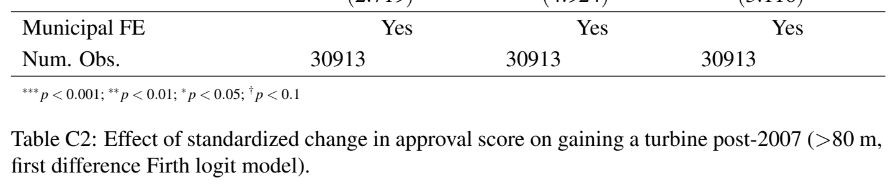

***Table C2.*** Effect of standardized change in approval score on gaining a turbine post-2007 (>80 m, first difference Firth logit model).

[Download data as CSV](tables/tab-03.csv)

(a) b = 1, k = 1, q = 0 (b) b = 1, k = 20, q = 0 (c) b = 1, k = 1, q = 1 (d) b = 1, k = 20, q = 1

Figure C1: The role of the k and q parameters in the utility model. Voter’s utility function is given in Equation C1. Dashed horizontal line represents the non-spatial benefit, b = 1.

we significantly oversample the treated observations in the training set to achieve better performance.

### 3. For each municipality-wide approval score (generated using each pair of candidate param-

eters), we run an SVM on the training data, also including the variables from our main analysis in the model. The model is then used to generate predictions in the test data and a confusion matrix is computed, giving us the true positives (T P), false positives (FP), true negatives (T N), and false negatives (FN).

4. We repeat steps 2-3 20 times per candidate approval score to smooth over any noise from sampling the training data, and compute the averages of the following metrics over the 20 iterations:

• Recall (true positive rate): Of all positive cases in the data, the proportion correctly identified by our model: TP

TP+FN

• False negative rate: Of all positive cases in the data, the proportion incorrectly identified by our model: FN

TP+FN

• Specificity (true negative rate): Of all negative cases in the data, the proportion correctly identified by our model: TN

TN+FP

• False positive rate: Of all negative cases in the data, the proportion incorrectly identified by our model: FP

TN+FP

• Precision: Of all positive cases identified by our model, the proportion actually correct: TP

TP+FP

• F1 Score: The harmonic mean of precision and recall: 2 × Precision×Recall

Precision+Recall

• Accuracy: Of all model predictions, the proportion actually correct: TN+TP

TN+TP+FN+FP Figure C2 presents the results. We choose to maximize the F1 score and choose values of k = 16 and q = 0.7 to accomplish this goal. Figure 3 plots the voter’s utility as a function of distance to the turbine for the chosen parameters. We see that the decay in the cost happens most intensely over the first 2 km and that the function starts to plateau after 5 km. This pattern is consistent with findings from the literature in economics on the effects of wind turbines on nearby home prices: for instance, Jarvis (2025) finds that effects on prices are felt at distances up to 4 km from new, tall turbines.

(a) Precision: TP (b) Recall: TP (c) F1 Score: 2× Precision×Recall TP+FP TP+FN Precision+Recall (d) Specificity: TN (e) False negative rate: FN (f) False positive rate: FP

TN+FP TP+FN TN+FP (g) Accuracy: TN+TP

TN+TP+FN+FP

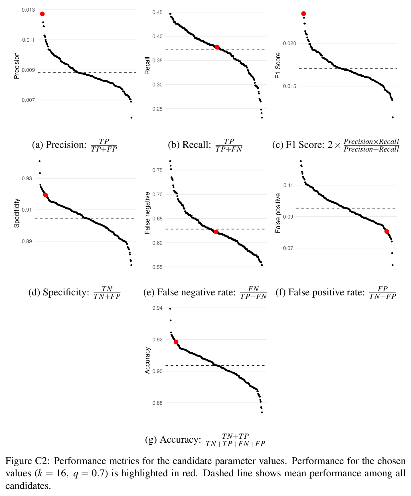

***Figure C2.*** Performance metrics for the candidate parameter values. Performance for the chosen values (k = 16, q = 0.7) is highlighted in red. Dashed line shows mean performance among all candidates.

Leave-One-Municipality-Out Validation for Parameter Tuning

To assess whether our results are driven by a small number of municipalities, we conduct a leaveone-municipality-out sensitivity analysis in which we iteratively remove each municipality from the pre-reform data and recalibrate the utility function by selecting new values of k and q using the same procedure applied to the full sample. Figure C3 plots the resulting utility functions in gray, with the function selected from the complete data shown in red for comparison. Although there is some variation across leave-one-out samples, most of the functions cluster closely around our main utility function. Nevertheless, rather than interpreting this function as a point estimate, we propose the set of functions in Figure C3 as reasonable bounds on the shape of voter disutility from proximity to turbines.

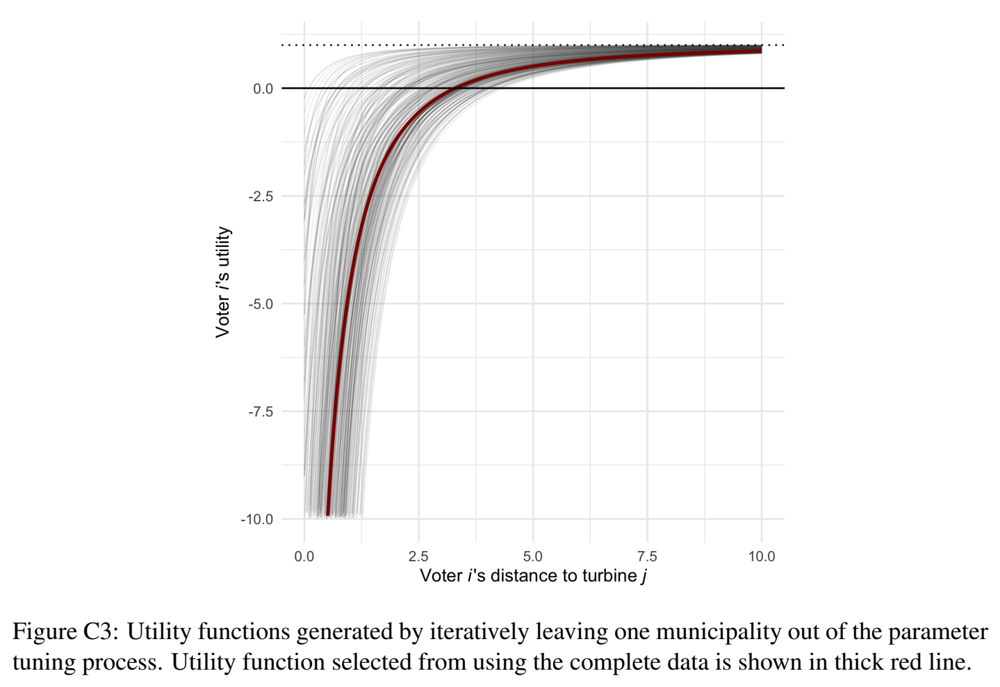

***Figure C3.*** Utility functions generated by iteratively leaving one municipality out of the parameter tuning process. Utility function selected from using the complete data is shown in thick red line.

Importantly, the downstream results are robust across the entire range of plausible parameter values. In Figure C4, we re-estimate the main Firth logit specification from Figure 10—including all controls and municipality fixed effects— for every combination of k ∈ [1,20] and q ∈ [0,1]. The figure plots the resulting odds ratios and 95% confidence intervals, with the estimate corresponding to our chosen parameters highlighted in red (coefficient = 0.627, p < 0.05; odds ratio =

1.872). Across all parameter combinations, the estimated effect remains positive and statistically significant, with our chosen parameters yielding some of the more conservative estimates. The smallest estimated coefficient is 0.491 (odds ratio = 1.634). Parameter values that produce implausibly large estimates—typically resulting from insufficient variation in the approval score and therefore instability—are omitted from Figure C4.

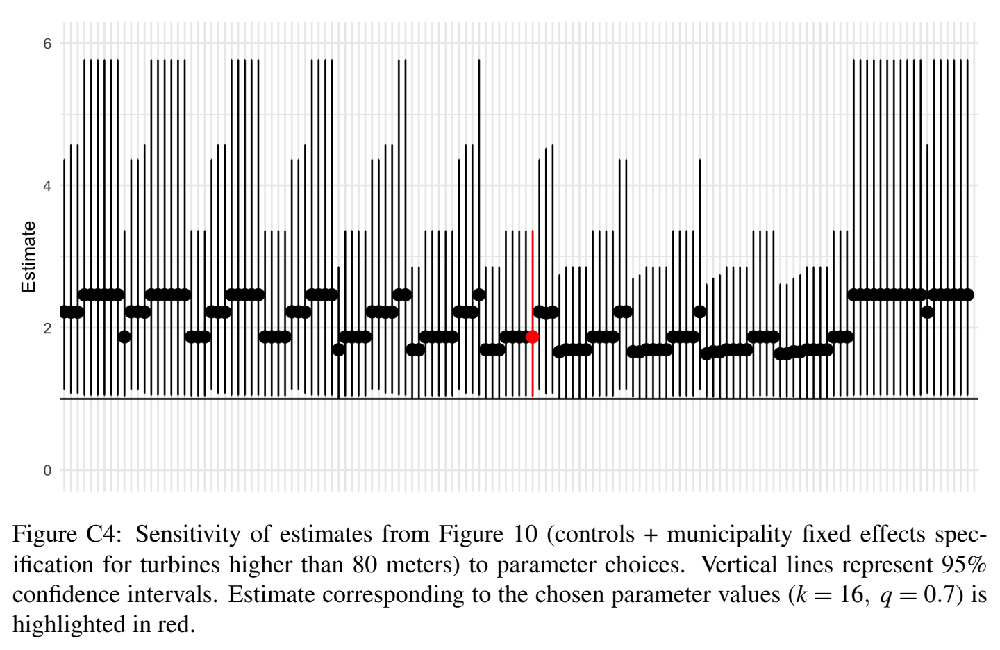

***Figure C4.*** Sensitivity of estimates from Figure 10 (controls + municipality fixed effects spec- ification for turbines higher than 80 meters) to parameter choices. Vertical lines represent 95% confidence intervals. Estimate corresponding to the chosen parameter values (k = 16, q = 0.7) is highlighted in red.

### D Descriptive Statistics

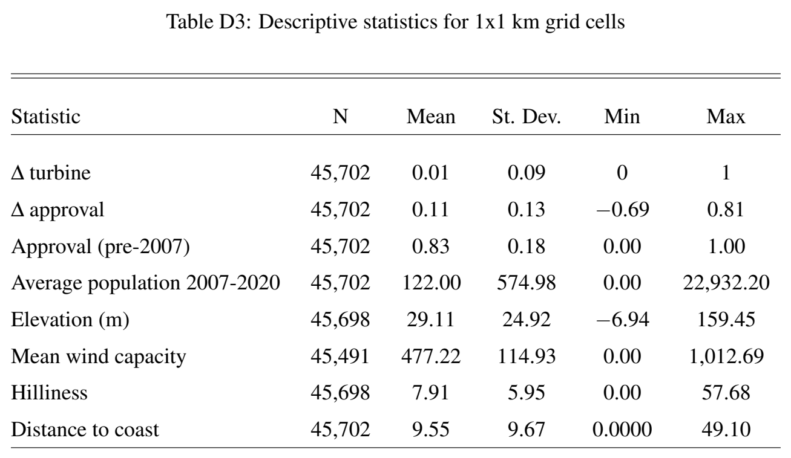

***Table D3.*** Descriptive statistics for 1x1 km grid cells

[Download data as CSV](tables/tab-04.csv)

Statistic N Mean St. Dev. Min Max ∆ turbine 45,702 0.01 0.09 0 1

∆ approval 45,702 0.11 0.13 −0.69 0.81 Approval (pre-2007) 45,702 0.83 0.18 0.00 1.00 Average population 2007-2020 45,702 122.00 574.98 0.00 22,932.20 Elevation (m) 45,698 29.11 24.92 −6.94 159.45 Mean wind capacity 45,491 477.22 114.93 0.00 1,012.69 Hilliness 45,698 7.91 5.95 0.00 57.68 Distance to coast 45,702 9.55 9.67 0.0000 49.10

### E Results in Tabular Form

Some municipalities do not host new turbines after the 2007 reform, leading to a lack of variation in the dependent variable. This lack of variation within a municipality creates challenges for logit estimation with municipal fixed effects. Municipalities with no variation in the outcome carry no identifying information for the slopes, but do create numerical and penalization effects when estimating fixed effects for them because the optimizer tries to send them to -∞. The result is a small amount of bias on the coefficient of interest.

Consequently, for our models with municipal fixed effects, we drop municipalities with no variation in the dependent variable. As a result, these models include roughly 68 to 75 percent of the number of grid cell observations contained in the models lacking municipal fixed effects.

Model 1 Model 2 Model 3 Model 4 Approval (standardized) 0.834∗∗∗ 0.528∗∗ 0.356∗ 0.313† Elevation −0.004 −0.010 −0.010 Elevation, squared −0.000 0.000 0.000 Hilliness −0.175∗∗∗ −0.218∗∗∗ −0.217∗∗∗ Hilliness, squared 0.004∗∗∗ 0.005∗∗∗ 0.005∗∗∗ Distance to coast 0.078† 0.102∗ 0.098∗ Distance to coast, squared −0.002 −0.002∗ −0.002† Mean wind capacity 0.017∗ 0.019∗ 0.019∗∗ Mean wind capacity, squared −0.000∗ −0.000∗∗ −0.000∗∗ Prop. support green parties −1.420 −1.308 −1.393 Prop. support mainstreem left −0.662 −1.976 −1.917 Prop. homeowners 0.012 −0.015 −0.013 Median household income 0.000 0.000 0.000 Prop. college educated −0.008 0.013 0.015 Border distance 0-1 km 0.353 Border distance 1-3 km −0.139 Border distance 3-5 km −0.280 Border distance 10+ km 0.229 (Intercept) −4.748∗∗∗ −9.725∗∗ −8.471∗∗ −8.750∗∗ Municipal FE No No Yes Yes Num. Obs. 45702 45362 34009 34009

∗∗∗p<0.001;∗∗p<0.01;∗p<0.05;†p<0.1

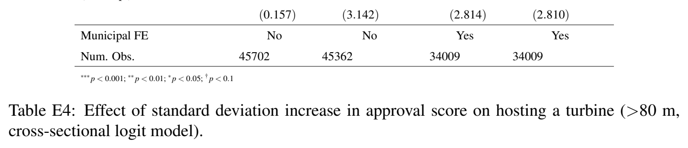

***Table E4.*** Effect of standard deviation increase in approval score on hosting a turbine (>80 m, cross-sectional logit model).

[Download data as CSV](tables/tab-05.csv)

Model 1 Model 2 Model 3 Model 4 Approval (standardized) 0.822∗∗∗ 0.511∗∗ 0.340∗ 0.297∗ Elevation −0.004 −0.010 −0.011 Elevation, squared −0.000 0.000 0.000 Hilliness −0.176∗∗∗ −0.218∗∗∗ −0.217∗∗∗ Hilliness, squared 0.004∗∗∗ 0.005∗∗∗ 0.005∗∗∗ Distance to coast 0.078† 0.100∗ 0.097∗ Distance to coast, squared −0.001 −0.002∗ −0.002∗ Mean wind capacity 0.016∗ 0.018∗∗ 0.019∗∗ Mean wind capacity, squared −0.000∗ −0.000∗∗ −0.000∗∗ Prop. support green parties −1.381 −1.212 −1.299 Prop. support mainstreem left −0.673 −1.953 −1.894 Prop. homeowners 0.012 −0.016 −0.014 Median household income 0.000† 0.000 0.000 Prop. college educated −0.008 0.013 0.015 Border distance 0-1 km 0.359† Border distance 1-3 km −0.135 Border distance 3-5 km −0.275 Border distance 10+ km 0.229 (Intercept) −4.743∗∗∗ −9.632∗∗ −8.192∗∗ −8.462∗∗ Municipal FE No No Yes Yes Num. Obs. 45702 45362 34009 34009

∗∗∗p<0.001;∗∗p<0.01;∗p<0.05;†p<0.1

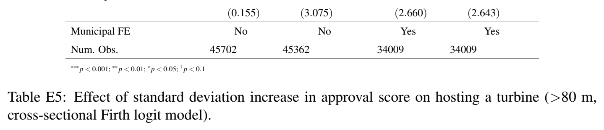

***Table E5.*** Effect of standard deviation increase in approval score on hosting a turbine (>80 m, cross-sectional Firth logit model).

[Download data as CSV](tables/tab-06.csv)

Model 1 Model 2 Model 3 Model 4 ∆ approval (standardized) 1.003∗∗ 0.512† 0.661† 0.650† Approval (pre-2007) 8.422∗∗ 4.900∗ 4.826∗ 4.601∗ Elevation −0.005 −0.012 −0.013 Elevation, squared −0.000 0.000 0.000 Hilliness −0.170∗∗∗ −0.212∗∗∗ −0.211∗∗∗ Hilliness, squared 0.003∗ 0.005∗∗ 0.005∗∗ Distance to coast 0.093∗ 0.104† 0.102∗ Distance to coast, squared −0.002∗ −0.002† −0.002† Mean wind capacity 0.016∗ 0.017∗ 0.018∗ Mean wind capacity, squared −0.000† −0.000∗ −0.000∗ Prop. support green parties −1.741 −1.372 −1.453 Prop. support mainstreem left −0.980 −2.131 −2.103 Prop. homeowners 0.018 −0.011 −0.009 Median household income 0.000 −0.000 −0.000 Prop. college educated 0.001 0.021 0.023 Border distance 0-1 km 0.415 Border distance 1-3 km −0.094 Border distance 3-5 km −0.154 Border distance 10+ km 0.428† (Intercept) −11.970∗∗∗ −14.022∗∗∗ −12.690∗∗∗ −12.861∗∗∗ Municipal FE No No Yes Yes Num. Obs. 45702 45362 30913 30913

∗∗∗p<0.001;∗∗p<0.01;∗p<0.05;†p<0.1

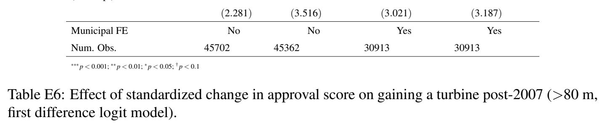

***Table E6.*** Effect of standardized change in approval score on gaining a turbine post-2007 (>80 m, first difference logit model).

[Download data as CSV](tables/tab-07.csv)

Model 1 Model 2 Model 3 Model 4 ∆ approval (standardized) 0.980∗∗ 0.479† 0.627∗ 0.614∗ Approval (pre-2007) 8.235∗∗ 4.635∗ 4.563∗∗ 4.329∗ Elevation −0.006 −0.012 −0.013 Elevation, squared −0.000 0.000 0.000 Hilliness −0.177∗∗∗ −0.218∗∗∗ −0.218∗∗∗ Hilliness, squared 0.004∗∗∗ 0.005∗∗∗ 0.005∗∗∗ Distance to coast 0.092∗ 0.103∗ 0.101∗ Distance to coast, squared −0.002∗ −0.002† −0.002† Mean wind capacity 0.015∗ 0.017∗ 0.017∗ Mean wind capacity, squared −0.000∗ −0.000∗ −0.000∗ Prop. support green parties −1.711 −1.272 −1.353 Prop. support mainstreem left −1.002 −2.110 −2.080 Prop. homeowners 0.018 −0.013 −0.012 Median household income 0.000 −0.000 −0.000 Prop. college educated 0.001 0.021 0.023 Border distance 0-1 km 0.420† Border distance 1-3 km −0.091 Border distance 3-5 km −0.150 Border distance 10+ km 0.426† (Intercept) −11.805∗∗∗ −13.677∗∗∗ −12.055∗∗∗ −12.197∗∗∗ Municipal FE No No Yes Yes Num. Obs. 45702 45362 30913 30913

∗∗∗p<0.001;∗∗p<0.01;∗p<0.05;†p<0.1

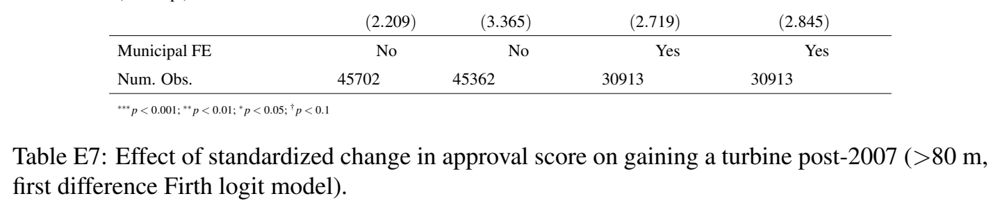

***Table E7.*** Effect of standardized change in approval score on gaining a turbine post-2007 (>80 m, first difference Firth logit model).

[Download data as CSV](tables/tab-08.csv)

Model 1 Model 2 Model 3 ∆ approval (standardized) 0.698∗ 0.307 0.627∗ Approval (pre-2007) 6.398∗∗ 3.547∗ 4.590∗∗ Elevation −0.004 −0.011 Elevation, squared −0.000 0.000 Hilliness −0.176∗∗∗ −0.216∗∗∗ Hilliness, squared 0.003∗∗∗ 0.005∗∗∗ Distance to coast 0.088∗ 0.102∗ Distance to coast, squared −0.002∗ −0.002∗ Mean wind capacity 0.013† 0.016∗ Mean wind capacity, squared −0.000† −0.000∗ Prop. support green parties −1.625 −1.158 Prop. support mainstreem left −0.912 −1.897 Prop. homeowners 0.017 −0.010 Median household income 0.000 −0.000 Prop. college educated −0.002 0.022 (Intercept) −10.202∗∗∗ −12.019∗∗∗ −11.966∗∗∗ Municipal FE No No Yes

Num. Obs. 45702 45362 30913

∗∗∗p<0.001; ∗∗p<0.01; ∗p<0.05; †p<0.1

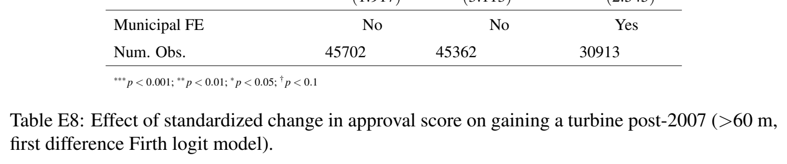

***Table E8.*** Effect of standardized change in approval score on gaining a turbine post-2007 (>60 m, first difference Firth logit model).

[Download data as CSV](tables/tab-09.csv)

Model 1 Model 2 Model 3 ∆ approval (standardized) 1.246∗∗ 0.674∗ 0.771∗ Approval (pre-2007) 9.940∗∗∗ 5.877∗∗ 5.438∗∗ Elevation −0.008 −0.012 Elevation, squared −0.000 0.000 Hilliness −0.183∗∗∗ −0.232∗∗∗ Hilliness, squared 0.004∗∗∗ 0.005∗∗∗ Distance to coast 0.079† 0.088† Distance to coast, squared −0.002† −0.002 Mean wind capacity 0.014† 0.015∗ Mean wind capacity, squared −0.000† −0.000∗ Prop. support green parties −1.980 −1.326 Prop. support mainstreem left −0.917 −2.108 Prop. homeowners 0.018 −0.014 Median household income 0.000 −0.000 Prop. college educated 0.001 0.028 (Intercept) −13.297∗∗∗ −14.337∗∗∗ −12.856∗∗∗ Municipal FE No No Yes Num. Obs. 45702 45362 30913

∗∗∗p<0.001; ∗∗p<0.01; ∗p<0.05; †p<0.1

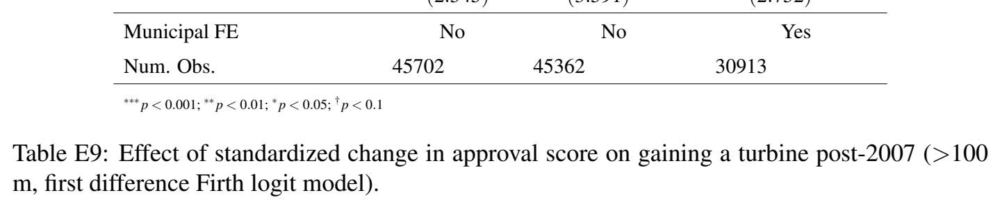

***Table E9.*** Effect of standardized change in approval score on gaining a turbine post-2007 (>100 m, first difference Firth logit model).

[Download data as CSV](tables/tab-10.csv)

Model 1 Model 2 Model 3 Model 4 Own density (logged, std.) −0.534∗∗∗ −0.390∗∗∗ −0.334∗∗∗ −0.315∗∗∗ Elevation −0.000 −0.006 −0.007 Elevation, squared −0.000 −0.000 −0.000 Hilliness −0.151∗∗∗ −0.190∗∗∗ −0.191∗∗∗ Hilliness, squared 0.003∗∗∗ 0.004∗∗∗ 0.005∗∗∗ Distance to coast 0.087∗ 0.105∗ 0.103∗ Distance to coast, squared −0.002† −0.002∗ −0.002∗ Mean wind capacity 0.019∗ 0.020∗∗ 0.020∗∗ Mean wind capacity, squared −0.000∗ −0.000∗∗ −0.000∗∗ Prop. support green parties −0.998 −1.191 −1.257 Prop. support mainstreem left −0.642 −2.090 −2.048 Prop. homeowners 0.016 −0.010 −0.008 Median household income 0.000∗ 0.000 0.000 Prop. college educated −0.014 0.006 0.007 Border distance 0-1 km 0.222 Border distance 1-3 km −0.159 Border distance 3-5 km −0.275 Border distance 10+ km 0.240 (Intercept) −4.736∗∗∗ −10.642∗∗∗ −9.199∗∗ −9.334∗∗∗ Municipal FE No No Yes Yes

Num. Obs. 45702 45362 34009 34009

∗∗∗p<0.001;∗∗p<0.01;∗p<0.05;†p<0.1

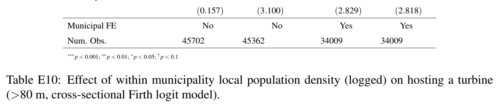

***Table E10.*** Effect of within municipality local population density (logged) on hosting a turbine (>80 m, cross-sectional Firth logit model).

[Download data as CSV](tables/tab-11.csv)

Model 1 Model 2 Model 3 Model 4 Neighboring density (logged, std.) 0.026 0.148∗ 0.217∗∗∗ 0.098 Elevation −0.005 −0.011 −0.012 Elevation, squared −0.000 0.000 0.000 Hilliness −0.181∗∗∗ −0.223∗∗∗ −0.223∗∗∗ Hilliness, squared 0.004∗∗∗ 0.005∗∗∗ 0.005∗∗∗ Distance to coast 0.094∗ 0.105∗ 0.106∗ Distance to coast, squared −0.002† −0.002∗ −0.002∗ Mean wind capacity 0.020∗∗ 0.020∗∗ 0.020∗∗ Mean wind capacity, squared −0.000∗ −0.000∗∗ −0.000∗∗ Prop. support green parties −1.739 −1.590 −1.590 Prop. support mainstreem left −0.642 −1.931 −1.927 Prop. homeowners 0.015 −0.013 −0.010 Median household income 0.000† −0.000 −0.000 Prop. college educated −0.018 0.016 0.017 Border distance 0-1 km 0.272 Border distance 1-3 km −0.091 Border distance 3-5 km −0.262 Border distance 10+ km 0.208 (Intercept) −4.582∗∗∗ −10.772∗∗∗ −8.927∗∗∗ −9.044∗∗∗ Municipal FE No No Yes Yes

Num. Obs. 45702 45362 34009 34009

∗∗∗p<0.001;∗∗p<0.01;∗p<0.05;†p<0.1

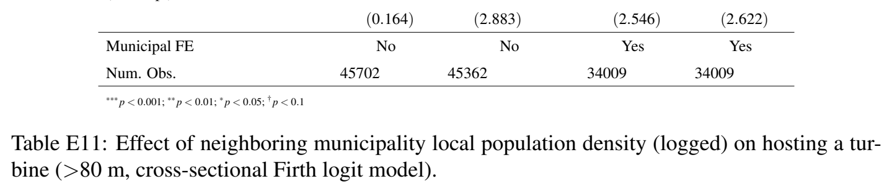

***Table E11.*** Effect of neighboring municipality local population density (logged) on hosting a tur- bine (>80 m, cross-sectional Firth logit model).

[Download data as CSV](tables/tab-12.csv)

### F Placebo Test

As a placebo test, we use the same model as in Figure 10 to measure the effect of a change in the approval score on the location of a turbine before 2007. Figure F5 shows that the increase in the approval score of a grid cell after reform was not associated with its hosting of a turbine before the 2007 reform. In other words, areas which have historically attracted wind development—largely rural areas with wind potential—were not more likely to see an increase in their approval rating. 2.0

1.5

1.0

0.5

Bivariate Controls Controls + FE Controls + FE + Border Model

oitaR

sddO

Logit Firth logit

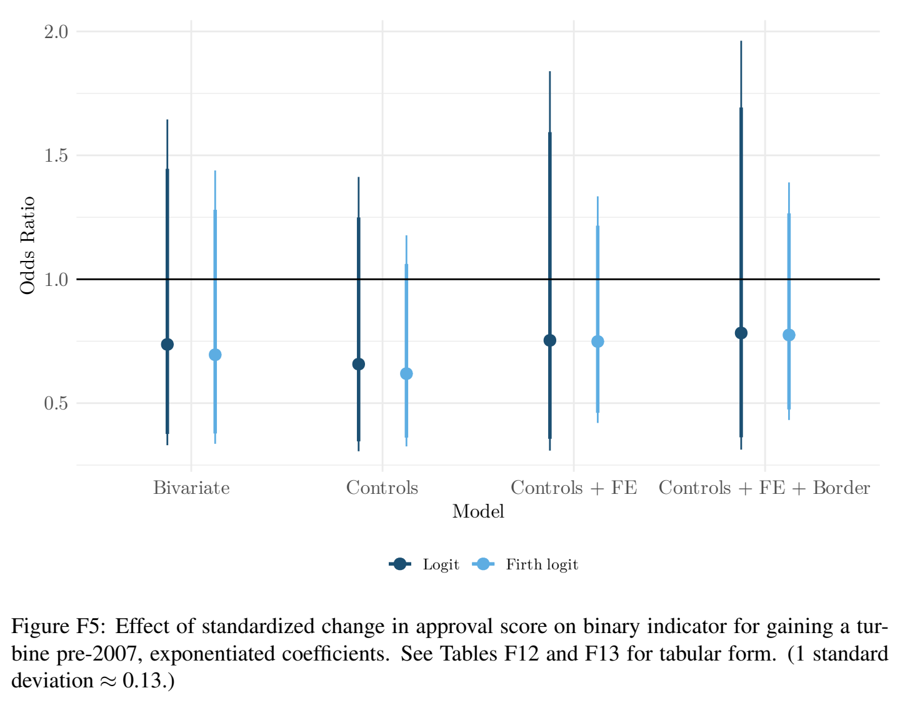

***Figure F5.*** Effect of standardized change in approval score on binary indicator for gaining a tur- bine pre-2007, exponentiated coefficients. See Tables F12 and F13 for tabular form. (1 standard deviation ≈ 0.13.)

### G Modeling Count Data

To model the effect of a change in approval scores on the number of turbines constructed, we need to account for both the skew of our data and the high number of cells without turbines (count zero). To handle the concentration of zeros, we use a negative binomial hurdle model. The “Zero model” results help identify the factors related to the extensive margin—the presence or absence of

Model 1 Model 2 Model 3 Model 4 ∆ approval (standardized) −0.305 −0.419 −0.283 −0.244 Approval (pre-2007) 2.677† 1.352 −0.822 −0.241 Elevation 0.000 −0.005 −0.009 Elevation, squared 0.000 −0.000 −0.000 Hilliness −0.131∗∗ −0.158∗∗ −0.156∗∗ Hilliness, squared 0.003∗∗∗ 0.004∗∗ 0.004∗∗ Distance to coast 0.015 0.132 0.144 Distance to coast, squared 0.000 −0.003 −0.003 Mean wind capacity 0.024 0.055∗∗ 0.056∗∗ Mean wind capacity, squared −0.000 −0.000∗ −0.000∗ Prop. support green parties −3.226 −3.024 −2.863 Prop. support mainstreem left 0.046 −2.300 −1.838 Prop. homeowners 0.010 −0.032 −0.026 Median household income 0.000 −0.000 −0.000 Prop. college educated −0.027 0.068 0.073 Border distance 0-1 km −0.703 Border distance 1-3 km −0.988∗ Border distance 3-5 km −0.656 Border distance 10+ km −0.063 (Intercept) −8.564∗∗∗ −14.159∗∗ −19.242∗∗ −20.401∗∗∗ Municipal FE No No Yes Yes

Num. Obs. 45702 45362 30913 30913

∗∗∗p<0.001;∗∗p<0.01;∗p<0.05;†p<0.1

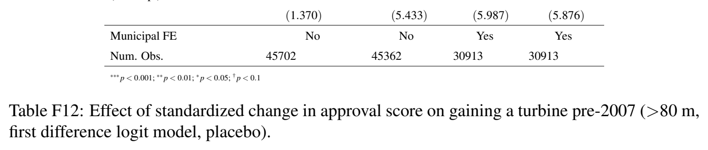

***Table F12.*** Effect of standardized change in approval score on gaining a turbine pre-2007 (>80 m, first difference logit model, placebo).

[Download data as CSV](tables/tab-13.csv)

Model 1 Model 2 Model 3 Model 4 ∆ approval (standardized) −0.363 −0.479 −0.289 −0.255 Approval (pre-2007) 2.180† 0.784 −1.130 −0.603 Elevation −0.003 −0.007 −0.011 Elevation, squared 0.000 −0.000 −0.000 Hilliness −0.133∗∗ −0.158∗∗∗ −0.155∗∗∗ Hilliness, squared 0.004∗∗∗ 0.004∗∗∗ 0.004∗∗∗ Distance to coast 0.014 0.131∗ 0.143∗ Distance to coast, squared 0.000 −0.003∗ −0.003† Mean wind capacity 0.022† 0.052∗∗∗ 0.053∗∗∗ Mean wind capacity, squared −0.000 −0.000∗∗ −0.000∗∗∗ Prop. support green parties −3.064 −2.255 −2.106 Prop. support mainstreem left 0.011 −1.876 −1.463 Prop. homeowners 0.011 −0.047∗∗ −0.040∗ Median household income 0.000 −0.000 −0.000 Prop. college educated −0.025 0.063 0.069 Border distance 0-1 km −0.598 Border distance 1-3 km −0.930∗∗ Border distance 3-5 km −0.613† Border distance 10+ km −0.052 (Intercept) −8.121∗∗∗ −13.235∗∗ −17.098∗∗∗ −18.117∗∗∗ Municipal FE No No Yes Yes Num. Obs. 45702 45362 30913 30913

∗∗∗p<0.001;∗∗p<0.01;∗p<0.05;†p<0.1

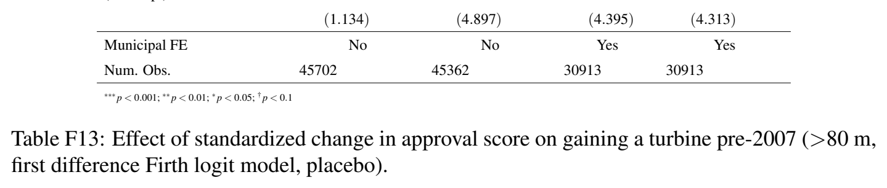

***Table F13.*** Effect of standardized change in approval score on gaining a turbine pre-2007 (>80 m, first difference Firth logit model, placebo).

[Download data as CSV](tables/tab-14.csv)

turbines in a given cell. The results of the “Count model” show the factors influencing the intensive margin—the number of turbines in a grid cell, conditional on nonzero counts.

We use the same change in approval score design of our main analysis, estimating the relationship between change in approval scores from pre- to post-municipal reform on the number of post-2007 turbines, controlling for pre-2007 approval score. Because our dependent variable is now the number of turbines post-2007 (rather than a change in the number of turbines), we include a control for the number of turbines in a cell before 2007. Model 2 includes the same covariates as in our logit and Firth logit models. We standardize the geographic controls to limit collinearity between the linear and quadratic terms. We also standardize our measure of median household income to improve estimation. Model 3 includes municipality fixed effects.

As shown in Table G14 Model 3, a standard deviation change in approval score post-2007 reform is associated with a 72% increase in the odds of hosting any turbines post-2007.10 In contrast, a standard deviation change in approval score is not associated with a change in the odds of hosting an additional turbine conditional on hosting any at all.

That the main effect of approval score is on whether to host any turbines—rather than an additional turbine—is not surprising given the unobserved variation that can occur in the number of turbines sited in a grid cell. For example, taller turbines need more space between them in order to maximize their energy efficiency. Therefore, it is unclear whether two 80-meter turbines are a more intense outcome compared to one 120-meter turbine. Alternative approaches, such as the cumulative turbine height in a given cell, require strong assumptions about the linear additive effects of turbine height. Instead, we believe that political conflict occurs most closely at the point of deciding to site new turbines, rather than the number of turbines.

### H Potential Moderators

In this section, we unpack potential moderators believed to be important for local accountability and our proposed theoretical mechanism.

First, we examine whether our treatment effects vary in close elections. Because Danish municipal elections operate under proportional representation with multiple parties, the larger the size of the dominant party (or faction), the less competitive the electoral environment. We operationalize competitiveness as (1 − voteshare) of the largest vote-getting party in the municipality following the 2007 consolidation, then standardize this moderator. As shown in Table H-15, local 10(e0.678 −1)×100 = 72%

Model1 Model2 Model3 Countmodel: (Intercept) −2.337† −0.820 −0.074 Countmodel: ∆approval(standardized) 0.258 0.186 0.048 Countmodel: Approval(pre-2007) 3.090∗ 2.334† 1.399 Countmodel: Num. turbines(pre-2007) 0.221∗∗∗ 0.221∗∗∗ 0.250∗∗∗ Zeromodel: (Intercept) −11.613∗∗∗ −9.476∗∗∗ −8.614∗∗∗ Zeromodel: ∆approval(standardized) 0.964∗∗∗ 0.511∗ 0.678∗∗ Zeromodel: Approval(pre-2007) 7.963∗∗∗ 4.672∗∗∗ 4.833∗∗ Zeromodel: Num. turbines(pre-2007) 8.907∗∗∗ 8.942∗∗∗ 9.402∗∗∗ Countmodel: Elevation 0.084 0.165 Countmodel: Elevation(squared) −0.009 −0.174† Countmodel: Hilliness −0.292∗∗∗ −0.333∗∗∗ Countmodel: Hilliness(squared) 0.029 0.038 Countmodel: Distancetocoast 0.033 0.079 Countmodel: Distancetocoast(squared) −0.049 −0.137† Countmodel: Meanwindcapacity 0.136 0.230 Countmodel: Meanwindcapacity(squared) −0.056† −0.054 Countmodel: Prop. supportmainstreamleft −0.545 −0.174 Countmodel: Prop. homeowners −0.013† −0.010 Countmodel: Medianhouseholdincome(std.) −0.181† 0.008 Countmodel: Prop. collegeeducated 0.006 −0.008 Zeromodel: Elevation −0.197 −0.192 Zeromodel: Elevation(squared) −0.035 0.039 Zeromodel: Hilliness −0.734∗∗∗ −0.854∗∗∗ Zeromodel: Hilliness(squared) 0.120∗∗∗ 0.175∗∗∗ Zeromodel: Distancetocoast 0.544∗∗∗ 0.589∗∗ Zeromodel: Distancetocoast(squared) −0.194∗∗∗ −0.216∗∗∗ Zeromodel: Meanwindcapacity 0.514∗∗∗ 0.433∗ Zeromodel: Meanwindcapacity(squared) −0.136∗∗ −0.155∗∗ Zeromodel: Prop. greenparties −1.367 −1.266 Zeromodel: Prop. supportmainstreamleft −0.894 −1.833† Zeromodel: Prop. homeowners 0.016† −0.011 Zeromodel: Medianhouseholdincome(std.) 0.098 0.026 Zeromodel: Prop. collegeeducated −0.005 0.009 MunicipalFE No No Yes Observations 45702 45362 34009 ∗∗∗p<0.001;∗∗p<0.01;∗p<0.05;†p<0.1

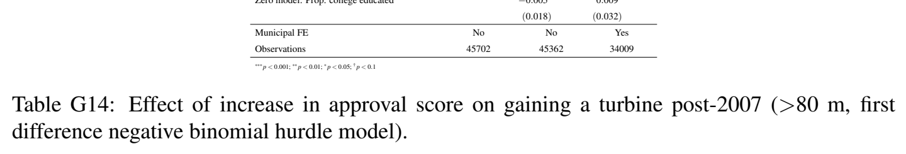

***Table G14.*** Effect of increase in approval score on gaining a turbine post-2007 (>80 m, first difference negative binomial hurdle model).

[Download data as CSV](tables/tab-15.csv)

competitiveness does not moderate the effect of the change in approval score on turbine siting.

Second, to assess the role of local ideology, we compute a similar competitiveness score for the combined size of green and mainstream left parties in the election following the 2007 reform. Note, for this design, we remove the control for green and mainstream left vote share pre-reform to avoid collinearity. Because the mayor is selected by the council, this combination of vote for green and mainstream left parties directly dictates the mayor’s partisanship. As shown in Table H-16, local ideology does not moderate the effect of the change in approval score.

These null effects suggest that the relationship between electoral geography and turbine siting is neither moderated by local competitiveness nor local ideology. Instead, the uniform sensitivity to local electoral geography suggests that the political backlash to turbine siting is relatively nonpartisan and sufficiently powerful to shape local officials behavior even in seemingly safer political contexts.

### I Conley Standard Errors

Conley standard errors allow for arbitrary spatial correlation in the regression residuals within a specified distance. We select the specified distance of 5 kilometers, as that is the distance at which our utility function begins to plateau. We replicate our logit models Table E4 and Table E6 with Conley standard errors using conleyreg (Düben et al. 2022). Results are substantively the same (Tables I17 and I18).

### J Case Selection for Interviews and Media Content Analysis

Interviews

For the interview component, we focused exclusively on municipalities that had experience with processes of wind turbines siting during the study period, as our objective was to understand how local officials navigate the political challenges associated with these decisions. To capture meaningful variation across relevant political and socioeconomic dimensions, we selected municipalities using three criteria: housing prices (higher vs. lower), municipal size (smaller vs. larger populations), and geographic location (East vs. West Denmark). Housing prices proxy differences in local economic pressures and resident composition; municipal size reflects variation in administrative capacity and political structure; and geography captures well-known East–West differences in settlement patterns, land use, and political context. These three dimensions yielded eight distinct selection cells. We identified one municipality in each of the eight cells and invited them to

Model 1 Model 2 Model 3 Model 4 ∆ approval (standardized) 0.888∗ 0.478† 0.638∗ 0.620∗ Competitiveness (standardized) −0.233 −0.113 −0.412 −0.415 ∆ approval x Competitiveness (std.) 0.016 0.023 −0.045 −0.027 Approval (pre-2007) 7.442∗∗ 4.514∗ 4.661∗∗ 4.384∗∗ Elevation −0.007 −0.012 −0.013 Elevation, squared −0.000 0.000 0.000 Hilliness −0.175∗∗∗ −0.218∗∗∗ −0.217∗∗∗ Hilliness, squared 0.004∗∗∗ 0.005∗∗∗ 0.005∗∗∗ Distance to coast 0.083∗ 0.103∗∗∗ 0.101∗∗∗ Distance to coast, squared −0.002† −0.002∗∗ −0.002∗∗ Mean wind capacity 0.015∗ 0.017∗∗∗ 0.017∗∗∗ Mean wind capacity, squared −0.000† −0.000∗∗∗ −0.000∗∗∗ Prop. support green parties −0.973 −1.245 −1.331 Prop. support mainstreem left −0.827 −2.098∗ −2.069∗ Prop. homeowners 0.017 −0.013 −0.012 Median household income 0.000 −0.000 −0.000 Prop. college educated −0.003 0.021 0.023 Border distance 0-1 km 0.421∗ Border distance 1-3 km −0.090 Border distance 3-5 km −0.148 Border distance 10+ km 0.418∗ (Intercept) −11.159∗∗∗ −13.391∗∗∗ −12.705∗∗∗ −12.792∗∗∗ Municipal FE No No Yes Yes

Num. Obs. 45702 45362 30913 30913

∗∗∗p<0.001;∗∗p<0.01;∗p<0.05;†p<0.1

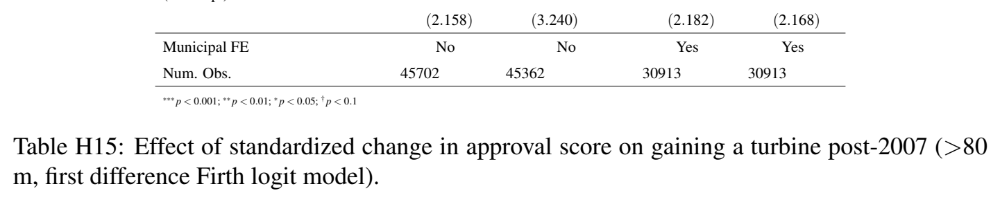

***Table H15.*** Effect of standardized change in approval score on gaining a turbine post-2007 (>80 m, first difference Firth logit model).

[Download data as CSV](tables/tab-16.csv)

Model 1 Model 2 Model 3 Model 4 ∆ approval (standardized) 0.777∗ 0.474† 0.570∗ 0.557† Left vote share (standardized) −0.213 −0.137 −0.226 −0.225† ∆ approval x Left vote share (std.) 0.005 −0.033 −0.098 −0.092 Approval (pre-2007) 6.985∗∗ 4.628∗ 4.397∗∗ 4.150∗ Elevation −0.006 −0.012 −0.013 Elevation, squared −0.000 0.000 0.000 Hilliness −0.178∗∗∗ −0.217∗∗∗ −0.217∗∗∗ Hilliness, squared 0.004∗∗∗ 0.005∗∗∗ 0.005∗∗∗ Distance to coast 0.092∗ 0.102∗ 0.100∗ Distance to coast, squared −0.002∗ −0.002† −0.002† Mean wind capacity 0.015∗ 0.017∗ 0.017∗ Mean wind capacity, squared −0.000† −0.000∗ −0.000∗ Prop. homeowners 0.018 −0.013 −0.011 Median household income 0.000 −0.000 −0.000 Prop. college educated −0.002 0.021 0.023 Border distance 0-1 km 0.426† Border distance 1-3 km −0.091 Border distance 3-5 km −0.152 Border distance 10+ km 0.415† (Intercept) −10.769∗∗∗ −14.004∗∗∗ −12.640∗∗∗ −12.775∗∗∗ Municipal FE No No Yes Yes Num. Obs. 45575 45362 30913 30913

∗∗∗p<0.001;∗∗p<0.01;∗p<0.05;†p<0.1

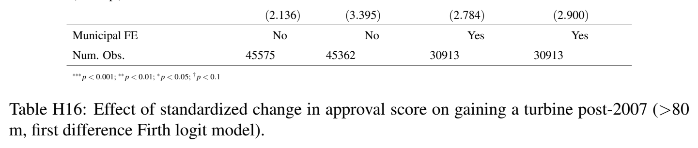

***Table H16.*** Effect of standardized change in approval score on gaining a turbine post-2007 (>80 m, first difference Firth logit model).

[Download data as CSV](tables/tab-17.csv)

Model 1 Model 2 Model 3 Model 4 Approval (standardized) 0.834∗∗∗ 0.528∗∗ 0.356∗ 0.313∗ Elevation −0.004 −0.010 −0.010 Elevation, squared −0.000 0.000 0.000 Hilliness −0.175∗∗∗ −0.218∗∗∗ −0.217∗∗∗ Hilliness, squared 0.004∗∗∗ 0.005∗∗∗ 0.005∗∗∗ Distance to coast 0.078∗ 0.102∗ 0.098∗ Distance to coast, squared −0.002∗ −0.002∗∗ −0.002∗ Mean wind capacity 0.017∗∗ 0.019∗∗ 0.019∗∗ Mean wind capacity, squared −0.000∗ −0.000∗∗ −0.000∗∗ Prop. support green parties −1.420 −1.308 −1.393 Prop. support mainstreem left −0.662 −1.976 −1.917 Prop. homeowners 0.012 −0.015 −0.013 Median household income 0.000† 0.000 0.000 Prop. college educated −0.008 0.013 0.015 Border distance 0-1 km 0.353 Border distance 1-3 km −0.139 Border distance 3-5 km −0.280 Border distance 10+ km 0.229 (Intercept) −4.748∗∗∗ −9.725∗∗∗

Municipal FE No No Yes Yes Observations 45701 45361 30871 30871 ∗∗∗p<0.001;∗∗p<0.01;∗p<0.05;†p<0.1

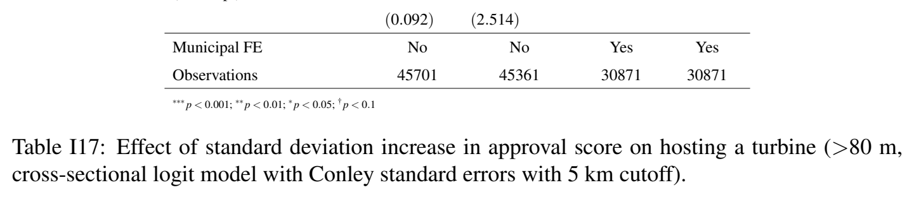

***Table I17.*** Effect of standard deviation increase in approval score on hosting a turbine (>80 m, cross-sectional logit model with Conley standard errors with 5 km cutoff).

[Download data as CSV](tables/tab-18.csv)

Model 1 Model 2 Model 3 Model 4 ∆ approval (standardized) 1.003∗∗ 0.512† 0.661† 0.650† Approval (pre-2007) 8.422∗∗∗ 4.900∗∗ 4.826∗ 4.601∗ Elevation −0.005 −0.012 −0.013 Elevation, squared −0.000 0.000 0.000 Hilliness −0.170∗∗∗ −0.212∗∗∗ −0.211∗∗∗ Hilliness, squared 0.003∗∗ 0.005∗∗∗ 0.005∗∗∗ Distance to coast 0.093∗∗ 0.104∗ 0.102∗ Distance to coast, squared −0.002∗ −0.002∗ −0.002∗ Mean wind capacity 0.016∗ 0.017∗ 0.018∗ Mean wind capacity, squared −0.000∗ −0.000∗ −0.000∗ Prop. support green parties −1.741 −1.372 −1.453 Prop. support mainstreem left −0.980 −2.131 −2.103 Prop. homeowners 0.018 −0.011 −0.009 Median household income 0.000 −0.000 −0.000 Prop. college educated 0.001 0.021 0.023 Border distance 0-1 km 0.415 Border distance 1-3 km −0.094 Border distance 3-5 km −0.154 Border distance 10+ km 0.428† (Intercept) −11.970∗∗∗ −14.022∗∗∗

Municipal FE No No Yes Yes Observations 45701 45361 30871 30871 ∗∗∗p<0.001;∗∗p<0.01;∗p<0.05;†p<0.1

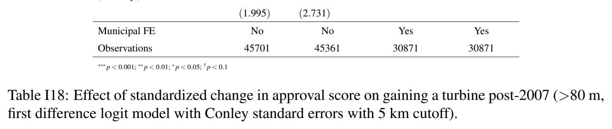

***Table I18.*** Effect of standardized change in approval score on gaining a turbine post-2007 (>80 m, first difference logit model with Conley standard errors with 5 km cutoff).

[Download data as CSV](tables/tab-19.csv)

participate. Seven of the originally selected municipalities agreed to be interviewed. To complete the stratified design, we then invited an additional municipality that fulfilled the remaining cell, resulting in a total of eight interviews. The city managers agreed to speak with us on the condition that they could not be identified, which is why we do not report their names or the names of their municipalities. After each interview, we wrote detailed memos to ensure that we accurately captured their insights. In each case, we contacted the city manager (kommunaldirektør). City managers attend and help prepare city council meetings, coordinate administrative departments, and typically have long tenures (Hansen 2024). As a result, they possess a comprehensive understanding of internal decision-making processes, including how opposition is anticipated and how political considerations shape siting decisions. Their institutional knowledge makes them ideal respondents for probing the assumptions of our theoretical model. All interviews were conducted in 2025 using online meeting platforms, and each interview lasted between 20 and 30 minutes. All city managers were asked to describe the administrative and political processes of wind turbine projects in their municipalities, including questions about what they consider to be the key factors influencing the siting of wind turbines. A semi-structured interview guide was used to ensure the coverage of key areas while allowing for exploration of mergent themes.

Media Content Analysis

For the media content analysis, we relied on the Infomedia database, which provides comprehensive coverage of Danish newspapers. We developed a search string through several iterations to balance inclusiveness and relevance. The final search string was (translated):

(wind turbine* OR “wind turbine park*” OR wind park* OR onshore wind*

OR wind energy*) NOT (job advertisement* OR vacancy notice* OR obituary* OR death notice*)

The search was restricted to local and regional newspapers, as these outlets are the primary arena in which local conflicts, mobilization efforts, and political reactions to proposed wind turbine projects are reported. National outlets provide only selective or episodic coverage of such issues, whereas local media capture the detailed political dynamics central to our analysis. To obtain a manageable but representative corpus, we drew a stratified random sample of 50 dates from the period 2007–2022, stratified by quarter to ensure temporal balance. All articles returned on each sampled date were screened and coded. This procedure yielded 1,118 newspaper articles, of which 300 were substantively concerned with wind energy deployment. Among these relevant articles,

approximately 70 percent focused on concrete local wind energy projects, and about 70 percent of these reported local opposition to the projects.

When relevant articles explicitly referenced a location, this information was recorded as a place name (municipality or city). To link media coverage to administrative jurisdictions, all coded locations were mapped to official Danish municipalities using a two-step procedure. First, location strings that directly matched the name of an official municipality were assigned accordingly. Second, remaining location strings referring to cities, towns, or broader geographic areas were matched to the municipality in which they are located using publicly available geographic reference data and manual normalization. Of the 300 relevant articles, 206 explicitly referenced a location, and 178 of these articles were successfully mapped to an official Danish municipality. Consequently, using this approach, media coverage of wind energy projects was linked to 43 of Denmark’s 98 municipalities. Importantly, location information is only available when articles explicitly mention a place; the absence of a municipality identifier therefore reflects a lack of explicit geographic reference rather than missing data. As a result, the media content analysis should be interpreted as a descriptive indicator of the local political context surrounding proposed wind energy projects, rather than as a comprehensive census of opposition across municipalities.

To assess the level of intercoder reliability, two coders independently coded 326 articles, yielding an intercoder agreement of 81 percent for coding local opposition (n=75), 88.3 percent for whether a local project was mentioned in the article (n=128), and 89.6 percent for whether the article was relevant or not (n=326).