# The Supply–Equity Trade-off: The Effect of Spatial Representation on the Local Housing Supply

### Michael Hankinson Asya Magazinnik

Conditionally accepted in The Journal of Politics

Abstract

Institutions that structure representation have systematically disadvantaged racial and ethnic minorities in the United States. We examine an understudied dimension of this problem: how local electoral rules shape the provision of collective goods in relation to racial groups. We leverage the California Voting Rights Act of 2001, which compelled over one hundred cities to switch from at-large to district elections for city council, to causally identify how equalizing spatial representation changes the permitting of new housing. District elections decrease the supply of new multifamily housing, particularly in segregated cities with sizable and systematically underrepresented minority groups. But district elections also end the disproportionate channeling of new housing into minority neighborhoods. Together, our findings highlight a fundamental trade-off: atlarge representation may facilitate the production of goods with diffuse benefits and

concentrated costs, but it does so by forcing less politically powerful constituencies to

bear the brunt of those costs.

Keywords: spatial representation, local political economy, housing, electoral institutions, inequality

Both authors contributed equally. For helpful feedback and advice, we thank Sarah Anzia, Devin Michelle Bunten, Devin Caughey, Ryan Enos, Justin Esarey, Andrew Menger, David Schleicher, Julian Wamble, Hye Young You, the Local Political Economy Conference, and the MIT Junior Faculty Research Group. We appreciate the research assistance of Isaac Hietanen and Laura Agosto. All mistakes, however, are our own. This work has been supported (in part) by Grant # 2105-32770 from the Russell Sage Foundation. Any opinions expressed are those of the principal investigators alone and should not be construed as representing the opinions of the Foundation.

∗Assistant Professor, Department of Political Science, GWU. hankinson@gwu.edu

†Assistant Professor, Department of Political Science, MIT. asyam@mit.edu

A central concern of governance is how the benefits and costs of collective goods are distributed over the population. But many collective goods — public parks, transit hubs, or affordable housing — are bound to a physical location, meaning their benefits or costs are unavoidably spatially concentrated. While resolving conflict over the provision of these spatial goods calls for the democratic process (Valentini 2013), equitable outcomes can only be expected if all geographic constituencies — each neighborhood within a city — have equal access to representation. The stakes of geographic representation are particularly high in the American context, where entrenched racial and economic disparities in political power have been constructed by, and in turn reconstructed, legacies of segregation (Trounstine 2018; Soja 2010). Thus, the distribution of spatial representation may reinforce or remedy existing disadvantage.

One instance of this spatial allocation problem concerns land uses that society needs, but few people want nearby. Known as locally unwanted land uses, “LULUs” can range from new housing (Hankinson 2018), to energy facilities (Stokes 2016), to drug addiction treatment clinics (de Benedictis-Kessner and Hankinson 2019). Because LULUs are perceived to threaten the property values, safety, or general quality of life of nearby residents, they have historically been channeled into the politically weakest areas (Mohai, Pellow, and Roberts 2009). In response, efforts to increase equity often involve amplifying the voices of the people living in these areas, strengthening their ability to block the siting of the LULU. But repeated obstruction can lead to an undersupply over time. For LULUs with spatially diffuse benefits but significant value, such as an affordable housing supply, this undersupply may exacerbate economic inequality in the long run.

The importance of spatial representation in this supply–equity trade-off is most salient in local politics. Municipal governments typically control the siting of LULUs, with conflict over these decisions operating along spatial rather than ideological dimensions (Marble and Nall 2021). Moreover, the institutions that structure spatial representation differ across municipalities, allowing us to causally identify their effects. We focus on a key feature of

electoral institutions affecting the relative influence of geographic constituencies: how votes are aggregated into city council seats. Voters may be pooled into one large, multi-member district, with each citizen voting for several candidates (at-large elections). Or, they may be assigned to smaller, single-member districts, with each citizen voting for only one candidate (district elections). While both institutional forms aggregate the preferences of an identical voting population, they produce different constituencies for elected officials, with the former beholden to the population as a whole and the latter primarily to the voters in their district. In this paper, we estimate the causal effect of district elections on the supply–equity trade-off of new housing, a municipally-controlled land use with strong local opposition (Einstein, Palmer, and Glick 2019). To do so, we leverage the California Voting Rights Act of 2001 (CVRA), which spurred city councils to switch from at-large to district elections but introduced some conditionally random variation in the timing of these reforms. First, we use city-level panel data to measure the effect of switching to districts on the amount and structural composition of new housing units permitted annually. Second, we use an original, 8-year panel dataset of geocoded housing approvals across six cities to capture the effect of district elections on the spatial distribution of new housing.

Additionally, we contribute a framework for analyzing minority representation and electoral reform. Using election panel data, we measure city council control by race and the descriptive representation of each racial group relative to their population share within the municipality. Our approach reveals that control of California city councils is not exclusive to white majorities, nor is underrepresentation on city council always greatest among Latinos. Rather than relying on these heuristics, we identify the unique balance of power within each city, allowing for cleaner measurement of both preexisting representation gaps and of the effect of district elections.

Our findings are twofold. First, the switch to district elections decreases the permitting of multifamily housing — the type of housing most often opposed by current residents but also most essential to an affordable housing supply — primarily in cities where minorities are

best positioned to benefit from the electoral reform. These are cities that are highly segregated and that had sizable but vastly underrepresented racial minorities before undertaking reform. These conditional findings match existing research showing that district elections increase minority representation — the theoretical mechanism that drives our results — contingent on either the size of the minority population or its spatial segregation (Abott and Magazinnik 2020; Dancygier 2014; Meier et al. 2005; Trounstine and Valdini 2008). Second, we present evidence from case studies of six cities that the switch to district elections ends the disproportionate channeling of new housing into minority neighborhoods, causing cities to more equally distribute new housing between their majority and minority constituencies. Together, these findings support our theoretical contribution linking spatial representation to a supply–equity trade-off in collective goods. Because at-large systems are more likely to underrepresent minority voters, unwanted housing is more likely to be concentrated in minority neighborhoods, all else equal. When district elections empower neighborhood-level interests, they primarily amplify the voice of minority neighborhoods, as majority neighborhoods are already represented by at-large coalitions. No longer able to channel housing into politically weak minority neighborhoods, district-elected councils are forced to more evenly distribute new housing across neighborhoods — and consequently demographic groups.

But this decrease in the supply of new housing threatens equity both locally and nationally. Limiting new housing not only raises rents (Been, Ellen, and O’Regan 2019), but prices out those seeking to move to cities with high upward income mobility, exacerbating longrun income inequality (Ganong and Shoag 2017) and entrenching existing patterns of racial segregation (Trounstine 2018). Absent the large-scale subsidization of housing, rising prices from a further constrained supply will disproportionately harm low-income communities, a constituency that district elections are meant to empower. We close with a proposal that may better balance descriptive representation, distributive equity, and the necessary supply of housing as well as other policies with spatially concentrated costs and diffuse benefits.

## The Spatial Scale of Representation

In pursuit of reelection, representatives strive to meet the needs of their constituencies. Even if legislating on the same policy questions for the same population, elected officials are expected to behave differently should their constituency within that population change. Possibly the most extreme change in constituency occurs when legislative bodies switch from multi-member, at-large elections to single-member, district elections. As of 2012, approximately 64 percent of American municipalities relied on at-large voting for their city council elections, whereas 14 percent used district elections, with the remaining 22 percent utilizing some form of hybrid systems (Clark and Krebs 2012).

This city-level variation largely stems from the early 20th century, when municipal reformers sought to counter the influence of machine-style politics via at-large systems (Trounstine 2009). Reformers believed that at-large elections would produce council members interested in the outcomes of the city as a whole, not in the patronage politics of their own district. In reality, the constituency of the at-large legislator is not always the city as a whole. Elected officials are most responsive to those who participate, generally meaning wealthier, more highly educated white voters; low turnout in local elections exacerbates this participation gap (Hajnal and Trounstine 2005). So long as an at-large city maintains a majority white turnout with racially polarized voting, a white coalition can secure an all-white city council. By contrast, cities that can draw districts where the underrepresented minority constitutes a local majority can assure a minimal standard of descriptive representation.

The connection between institutional design and minority disenfranchisement has not gone unnoticed. Section 2 of the Voting Rights Act of 1965 (VRA) specifically prohibits any “voting qualification or prerequisite to voting or standard, practice or procedure” meant to discriminate on the basis of race. After challenging direct impediments to Black voter registration, civil rights advocates began using Section 2 to target Southern cities with at-large elections. Though successful litigation was limited by a high standard of proof, Southern cities that were compelled to switch to district elections under the VRA experienced

increased minority descriptive representation (Sass and Mehay 1995).

The effect of district elections on policy outcomes is less clear. Much of what we know about spatial representation and policy comes from the “pork barrel” literature, where the geography of the voter-legislator dyad is tied to the supply and allocation of federal distributive goods (Weingast 1994). But looking at local governments, Tausanovitch and Warshaw (2014) find little evidence that policy responsiveness varies between at-large and district elections. However, they do not investigate land use or distributional policies, motivating our research in two ways. First, land use is widely considered the domain of local politics, one almost exclusively controlled by the municipal government. Second, whereas Tausanovitch and Warshaw (2014) compare citizens’ ideology to the ideological placement of policy outcomes, local housing policy lacks a strong ideological dimension (Marble and Nall 2021).

Thus our work brings new empirical evidence to bear on the interaction between descriptive representation and government investment in communities of color, a connection that scholars going back to Du Bois have theorized — and that politicians on the ground today understand very well. Du Bois (1910) documents how Black legislators in Southern state governments drove the establishment of free public schools in Black communities during Reconstruction. In our own interviews with California city council members, we heard echoes of the same theme. Quoting a white constituent who spoke out in favor of moving to district elections, Anaheim city council member Jose Moreno recounts:

She was saying, ‘the one thing I noticed in my neighborhood is, the more Latinos

moved in, the worse services we were getting — I don’t see our streets getting

taken care of, I see divestment happening from our neighborhoods. And what

I’ve come to understand is, it’s not that Latinos diminish the neighborhood; it’s

that politicians diminish Latinos, and when they move into a neighborhood that

neighborhood is not invested in.’1

City residents and local politicians alike are keenly aware of how race interacts with the spatial scale of representation to decide how resources are distributed across neighborhoods. This voter feels — and her elected representative understands — that her diversifying neigh- 1Conversation with Jose Moreno, 01/13/20.

borhood is losing its political influence under a white at-large governing coalition, and that the remedy is to tie her elected representative to her neighborhood, establishing a direct accountability mechanism for how land is used and resources allocated in that space.

Just as district-elected representatives are rewarded for bringing resources into their districts, they are incentivized to shift LULUs out of their districts. In theory, were a LULU in the city’s collective interest, every other council member would vote in favor of its siting, and it would pass. But councils often operate according to a norm of legislative logrolling, wherein the council defers to the member representing the host neighborhood. This local deference is repaid in future siting decisions, allowing everyone to survive the political threat of a LULU when it is proposed for their district (Burnett and Kogan 2014; Schleicher 2013). With each neighborhood able to block new development, district-elected cities struggle to permit new housing compared to their at-large peers. Cross-sectional studies of local institutions support this theory, finding district elections associated with decreased permitting of single-family homes (Lubell, Feiock, and De La Cruz 2009), increased use of growth management regulation (Feiock, Tavares, and Lubell 2008), and greater restrictions on the siting of group homes (Clingermayer 1994). Most closely related to our own work, Mast (Forthcoming) finds that a nationwide sample of cities that switched to district elections between 1980 and 2018 experienced a decline in housing units permitted annually. Our papers are complementary. While Mast (Forthcoming) uses a national sample of cities that includes those who chose to switch to district elections, we focus on cities that switched to district elections due to conditionally exogenous legal pressures. Our use of the CVRA roll-out helps us to avoid the threat to inference from cities adopting district elections as part of a bundle of actions designed to shape the housing supply. Furthermore, along with measuring the effect of district elections on aggregate supply, we also capture changes in the spatial distribution of new housing, demonstrating the equity implications of the reform.

## The Political Economy of Zoning

To show how electoral institutions activate housing’s supply–equity trade-off, we detail the political process of housing approvals as well as public attitudes towards different types of housing. In local government, proposals for new development travel through one of two paths: “by-right” and discretionary review. By-right proposals are allowed under existing regulations. If a developer wants to build a 6-unit apartment building in an area zoned for up to 6 units of multifamily housing, that developer’s application simply needs to meet the required building standards and codes. As a result, the 6-unit project is largely insulated from political pressure that could either downsize or even block the proposal.

However, if the developer wants to exceed the allowable capacity of the lot by building a 12-unit apartment building on that same parcel, her application will be subject to discretionary review by the city’s planning commission and, if appealed, the city council. Review begins with a public hearing where any resident is allowed to speak for or against the proposal. After deliberation, members of the legislative body vote whether to approve the project by granting a zoning amendment. This discretionary review opens the permitting process to political demands, with voters directly pressuring members of city council.

Like any regulatory regime, the discretionary review of housing proposals generates its own political economy. But unlike the distributive boon of pork barrel spending, new housing is usually seen as a burden to nearby residents. Development brings noise and congestion, harming quality of life. New residents may consume more in public services than they provide in tax revenue, raising the tax burden of existing property owners (Hamilton 1976). Biases against racial outgroups may cause residents to be wary of new neighbors, especially if those neighbors are of lower economic standing (Charles 2006). These threats to property values lead homeowners in particular to oppose new housing in favor of the status quo (Fischel 2001). Counterintuitively, renters may not only oppose new market-rate housing because it harms their quality of life, but also because they believe it will attract demand to their neighborhoods, causing rents in their neighborhoods to increase (Hankinson 2018).

Still, housing preferences vary based on the unit’s structure. Among homeowners, singlefamily homes are seen as the most tolerable form of housing (Marble and Nall 2021). For one, a single-family home is far more expensive than a unit within a multifamily building. Thus, future residents are more likely to be wealthy and white, and to contribute more in tax revenue than they use in public services, mitigating some of the above concerns. Labeled “cumulative zoning,” single-family housing is typically permitted by-right anywhere that is residentially zoned, whereas multifamily housing is restricted to specific areas or requires discretionary review. This single-family preference can be seen in how California cities zone their land, with single-family housing allowed on 70 percent of the land in California cities compared to only 20 percent for multifamily housing (Mawhorter and Reid 2018).

The resulting quantity and structure of new housing are consequences of both institutional design and political behavior. Low-turnout local elections and the discretionary review process reward the preferences of organized, wealthier homeowners who want either no new housing, single-family housing only, or housing channeled outside of their neighborhoods (Einstein, Glick, and Palmer 2020). By overrepresenting the majority, at-large elections increase the likelihood of new housing being channeled into effectively disenfranchised minority neighborhoods. In contrast, district elections have the potential to empower underrepresented minority neighborhoods to participate in city council land use decisions, lowering the overall quantity while equalizing the spatial distribution of new housing.

## Hypotheses

We do not expect all types of housing or all places to be affected equally — even within the group of cities deemed appropriate for conversion to districts under the CVRA. In this section, we discuss the conditions under which we expect conversion from at-large to district elections to decrease a city’s permitting of new housing. First, we expect that district elections will primarily decrease the permitting of multifamily rather than single-family housing (H1 ), for two reasons. Not only does single-family housing tend to generate less neighbor-

hood opposition (Marble and Nall 2021), but it requires more space per unit, and thus is usually built on the outskirts of a city, where there are fewer neighbors to provoke. Additionally, multifamily housing is more likely to require discretionary review, which is vulnerable to NIMBY (“Not in my backyard”) pressure. Because of cumulative zoning, single-family homes are less susceptible to the same political process.

Three further conditions frame the types of cities where we expect districts to most dramatically reshape the political process that generates new housing. The conditions under which an at-large system may be held legally responsible for minority vote dilution are succinctly stated by the Gingles test, the standard that plaintiffs must meet in order to win cases against at-large voting districts under the federal VRA. To prove that district elections are likely to increase minority representation, plaintiffs must show that the relevant racial or language minority group is “sufficiently large and geographically compact to constitute a majority in a single-member district”; that this group is “politically cohesive”; and that the majority usually votes as a bloc to defeat the minority’s preferred candidates (Thornburg v. Gingles, 478 U.S. 30, 53 n. 21 (1986)). But the CVRA lowered the bar set by the Gingles test, requiring only that plaintiffs show evidence of “racially polarized voting,” and thereby creating variation in the levels of segregation, demographic composition, and majority political power among treated cities. In keeping with recent studies identifying conditional effects of district elections, our next set of hypotheses focuses on these city-level moderators.

First, district elections are more likely to improve descriptive representation when minorities are segregated enough to form majority-minority districts (Abott and Magazinnik 2020; Trounstine and Valdini 2008). Once formed, these districts can more easily elect a minority candidate, changing the racial composition of a city council. Cities with high levels of segregation are also likeliest to create the initial conditions for an unequal distribution of housing. If majority voters were evenly distributed throughout the city, no neighborhood could serve as a “dumping ground” for unwanted housing and district elections would have no imbalance to correct. Thus, our second hypothesis (H2 ) is that district elections will

decrease the permitting of multifamily housing in residentially segregated cities.

Next, existing research has found the effect of district elections on descriptive representation to be greatest in cities with large shares of minority residents, where majority-minority districts can be more easily drawn (Abott and Magazinnik 2020; Meier et al. 2005; Trounstine and Valdini 2008). Most studies operationalize the minority population as one racial group. While this approach may be appropriate for studying the federal VRA, which focused on at-large districts with underrepresented Black minorities in the South, it is inadequate for California cities, which often include substantial populations of multiple racial groups that may or may not act as a unified political bloc for the purposes of voting rights claims (Sette 2020). We therefore shift our focus to the population share of the dominant racial majority, defined as the group that systematically wins the most council seats.2 District elections have the ability to dramatically change the council composition — and thus policy outcomes — in cities where the dominant group on council composes a relatively small share of the city’s population. We therefore predict that district elections will decrease the permitting of multifamily housing in cities with low majority populations (H3 ).

To produce a spatial inequality in housing for districts to correct, minority neighborhoods must lack council representation to champion their interests under an at-large system. We predict that the most dramatic policy changes will occur in cities where the racial majority on council is most overrepresented relative to its share of the city’s population. Thus, district elections will decrease the permitting of multifamily housing in cities where the council majority is significantly overrepresentative of that racial group’s population share (H4).

Finally, along with changes in the city-level supply, we also expect a change in the spatial distribution of new housing within cities. District elections mean representation has been evenly divided across the city, making it harder for council members to channel unwanted housing into any given community. Because previously underrepresented areas are likely to be minority neighborhoods, we expect that any positive relationship between minority 2This includes dominant groups that capture a plurality of the council. Given the dominant group captures a majority approximately 90% of the time, we use “majority” throughout.

neighborhoods and new housing permitted will weaken under district elections. In short, race will become less predictive of a neighborhood’s housing burden under district elections compared to at-large, all else equal (H5 ). Together, these predicted effects illustrate the connection between spatial representation and the supply–equity trade-off of collective goods.

## Identifying the Causal Effect of District Elections on

## Policy Outcomes

Existing research has struggled to identify the causal effect of district elections on political and policy outcomes. Even after controlling for any number of covariates, crucial unobserved differences remain between cities with histories under each institutional form. Comparing cities that switch to district elections to those that remain at-large is no less prone to unobserved confounding, as cities that undertake reform are likely to already have stronger political representation of groups that stand to gain from district elections. We advance our understanding of the causal effect of voter aggregation by leveraging the staggered timing of switching to districts within a group of comparable cities in the wake of the CVRA. Rather than making potentially biased comparisons between cities that switched to districts and those that remained at-large, as most previous studies have done, we exploit conditionally random variation in treatment timing among eventually treated units.

Based on our interviews with key participants in CVRA litigation, we argue that, for a specific and readily identifiable type of city, there was a great deal of random chance in the timing of treatment. Focusing on this set of cities greatly reduces the threat of unobserved confounding; however, we additionally control for time-varying measures of these cities’ housing markets and minority political strength, as well as city-specific time trends. The combination of these quasi-experimental and model-based approaches makes us confident that our estimates represent the causal effect of district elections on housing outcomes.

The CVRA’s lowered standard for minority vote dilution meant that numerous cities across California could in principle face successful litigation and be required to switch to

district elections. Furthermore, the CVRA incentivized litigation by making defendants — budget-constrained municipal governments — responsible for all associated legal and court fees, even in the case of an out-of-court settlement. However, switches happened slowly at first, accelerating only in 2016.3 Given the large number of equally appropriate candidates for legal action, what determined the timing of treatment among cities that eventually switched to districts? Direct legal pressure to switch to districts requires the identification of a plaintiff, a city resident who could claim harm from at-large elections. In general, plaintiffs came from one of three sources. First, they could emerge from internal political networks: in Santa Barbara, for instance, the suit was brought by a group of local activists who had been engaged in civil rights work in the city for decades.

Alternatively, plaintiffs could be recruited by one of the national or regional activist networks that became involved in CVRA litigation: the Mexican American Legal Defense and Educational Fund (MALDEF) or the Southwest Voter Registration Education Project (SVREP). Although these groups were no longer operating under the strict Gingles test, they nonetheless wanted to focus on cities that clearly stood to gain from district elections. Using in-house demographers, they identified and recruited for legal action at-large cities with histories of minority underrepresentation; where the minority group constituted at least 20% of the population such that majority-minority districts could be drawn; and where the total population was over 50,000 people, as MALDEF leadership believed that smaller cities would not benefit as much from district elections.4 But due to internal capacity constraints and competing priorities — both SVREP and MALDEF have missions that extend beyond voting rights and serve areas beyond California — these groups did not ramp up their litigation efforts until 2018, when SVREP decided to prioritize legal action in the still at-large cities that they considered overdue for reform. Appendix Section D.4 includes more details on this 3See Appendix Figure A-1 for the share of cities with district elections from 2010 to 2019.

4While these groups initially focused on Latino minorities, cities with sizable underrepresented Black or Asian minorities are no less targetable under the CVRA, and no different in their expected response to treatment under our theory. We therefore apply these standards for any racial minority in the construction of our sample.

history from our interviews with MALDEF’s leadership.

Finally, private law firms entered the fray, since victory for the plaintiff was nearly assured and the defendant shouldered all legal fees. These lawyers were less discriminating in their case selection, targeting cities of various sizes and with more tenuous prospects of gaining minority council seats upon switching to district elections.

Thus, on the whole, switching to districts under the CVRA was not a random process. The earliest switchers tended to be larger cities with significant disparities between their minority populations and minority council representation, which would hand reformers a meaningful and high-probability victory under the as-yet untested law. By contrast, cities targeted with litigation more recently have been, on average, smaller and less carefully chosen, as the CVRA’s legal standard has been well-tested and the plaintiff’s likelihood of success understood to be high. Nonetheless, conditional on being one of the numerous cities that MALDEF initially deemed appropriate for legal action, there was a considerable element of random chance in the timing of switching. With much on their agendas, MALDEF and SVREP had neither the resources nor the consistent institutional focus on voting rights cases to target all of these cities at once, and there was no coordinated strategy on the part of either organization to target the most unequal or vulnerable cities first.5

Motivated by the CVRA’s unique context, we conduct a generalized difference-in-differences analysis using the 60 cities that have, at any point between the CVRA’s initial passage and the present day, switched or committed to switching to district elections, and who satisfy MALDEF’s more stringent criteria.6 Henceforth referred to as the causally identified sample, this subgroup yields causal estimates under the assumption that the timing of switching is conditionally exogenous to our housing outcomes of interest, after applying statistical controls. Critically, our time-varying controls include measures of minorities’ past politi- 5Source: Conversation with Thomas Saenz, President and General Counsel of MALDEF, 01/13/20, and Lydia Camarillo, President, SVREP, 02/06/20.

6Appendix Table A-1 lists cities that switched to district elections post-CVRA and those included in our causally identified sample. Appendix Table A-2 compares the characteristics of our sample to all cities in CA and all cities that switch to district elections post-CVRA. Appendix Figure A-3 plots treatment status over time for our causally identified sample.

cal success to account for cities with stronger internal political organization selecting into districts earlier (or, conversely, for cities with particularly low minority representation presenting themselves as most targetable to outside groups). Although we see no empirical evidence that cities selected into districts based on past housing outcomes (see Figure 1) — and, after reviewing hundreds of council meeting minutes, no evidence that housing entered cities’ deliberations about switching to districts — we nonetheless include several housing market indicators, such as vacancy rate, home ownership rate, and median home value.

Our causally identified sample yields a substantively meaningful, policy-relevant estimate, interpretable as a local average treatment effect for the kind of city that meets a minimum standard for benefiting from district elections. While our estimates are not generalizable to all cities, there are many cities which meet MALDEF’s thresholds but have not yet agreed to switch to district elections, leaving them out of our causally identified sample. Including these yet-to-agree-to-switch cities, the list of cities “well-suited” for CVRA litigation grows from 60 to 112 cities, representing 24% of all municipalities in California and containing 45% of the state’s population. In short, nearly half of California lives in a city where we have seen or would expect to see our local average treatment effect for the causally identified sample.

## Aggregate Outcomes

To test our hypotheses, we constructed a comprehensive database of all 482 municipalities in California. We recorded each city’s council structure (district or at-large) and, for the 136 cities that switched to district elections, the year of its first district election, which we use as the date of treatment throughout this study.

For the reasons discussed in the previous section, we restrict our analysis to the causally identified sample, defined as California cities that would ultimately switch to districts, that have more than 50,000 residents, and where there is at least one underrepresented minority that comprises more than 20% of the population. We measure total population and minority population shares using U.S. Census data, and identify underrepresented minorities using the

California Elections Data Archive (CEDA). CEDA’s data contains the names and vote counts of every candidate who ran for city council in California from 1998 to 2019, allowing us to compute the number of Asian, Black, Latino, and non-Hispanic white city council candidates who won office in every city-year.7 For each group, we define “past electoral success” in year t as the number of seats won by its members divided by the total number of council seats up for election in the city over the prior twelve years (t − 12 through t − 1).8 Finally, we compare each racial group’s past electoral success to its population share at the time of the city’s first district election. A group is “underrepresented” if its past electoral success is less than 85% of its population share. This eliminates cities with minority populations that have been relatively successful in winning elections — cities that would not have been priority candidates for CVRA litigation in the eyes of reformers.

Our measurement of past electoral success also supplies a framework for the study of representation and the CVRA. Because multiple racial groups may be underrepresented within the same city, we should not always expect Latinos to benefit the most from district elections. To identify which racial group is most underrepresented, we select the one with the largest gap between its population share and past electoral success, out of all the underrepresented groups that comprise more than 20% of the city’s population.9 If no group meets this standard, we code the most underrepresented group as “None.” Table 1 shows the distribution of most underrepresented minority groups among all 136 cities that have agreed to switch to district elections, as well as the 60 cities in our causally identified sample. While Latinos are the most underrepresented minority in 84% of these 60 cities, Asians constitute the remainder — a sizable 16%. Moreover, Table 1 shows that over one-third of all switchers fall short of reformers’ conditions, having no clear underrepresented minority of sufficient size. 7We discuss estimating candidate ethnicity using wru (Imai and Khanna 2021) in Appendix Section D.3. 8Twelve years is the longest fixed time period we can use, given that our housing panel begins in 2010 and CEDA’s election data goes back to 1998.

9We follow the heuristic of 20% used by reformers, as it is a rough lower bound on the size of a group that could reasonably benefit from district elections: given 5-7 districts and generous assumptions about the group’s compactness and voter turnout, 20% is approximately what is needed for a citywide minority to constitute a district’s electoral majority.

Second, our data allow us to identify which racial group has had the greatest electoral success in city council races. We define this “council-dominant majority” as the one with the highest past electoral success as of when they switch to districts. Unsurprisingly, whites dominate the council the vast majority of the time; still, 9% of all switchers and 7% of the causally identified sample have nonwhite council-dominant majorities, suggesting that the heuristic of white-dominated councils and Latino underrepresented minorities is not perfectly reliable. In fact, several CVRA lawsuits have been launched by Asian plaintiffs in cities with white or Latino-dominated city councils. We incorporate this nuance in all subsequent analyses throughout the paper.

Table 1: Council Representation by Racial Group

Asian Black Latino White None

All switchers (136 cities)

Council-dominant majority 0.03 0.01 0.05 0.91 0.00

Most underrepresented minority 0.10 0.00 0.55 0.00 0.35

Causally identified sample (60 cities)

Council-dominant majority 0.02 0.03 0.02 0.93 0.00

Most underrepresented minority 0.16 0.00 0.84 0.00 0.00

Notes: Values represent the proportion of cities (all switchers or causally identified sample) having each racial or ethnic group as their council-dominant majority or most underrepresented minority. All rows sum to 1.

We first test the effect of district elections on the number of housing units permitted each year at the city level. To do so, we use a panel of housing permit data from 469 municipalities from 2010 to 2019 collected by the U.S. Census Building Permits Survey. These data include the number of total units permitted as well as the distribution of new units between single-family and multifamily housing. For our dependent variable, we take the natural log of housing units permitted.10 Thus the model specification used to test H1 is given by Equation 1:

log(Y + 1) = β + β district + X γ + ρ + η + ζ t + ε (1) it 0 1 it it i t i it

10We add 1 because there were no units permitted in some city-years, making the natural log undefined. We present alternative specifications in the “Robustness Checks” section. See Appendix Section D for more background on data collection.

where Y is units permitted in city i and year t; district is a binary indicator for having district elections in place; ρ is a city fixed effect; η is a year fixed effect; and ζ is a city-specific linear time trend. We additionally account for time-varying city attributes: X includes percent non-Hispanic white, percent Black, percent Hispanic, median income, homeownership rate, home vacancy rate, and median home value (drawn from 5-year American Community Survey (ACS) estimates from 2010 through 2019) as well as past electoral success for the city’s most underrepresented minority, as constructed for Table 1.11 Huber-White standard errors are clustered at the city level.

To test our next three hypotheses — the conditional effects of district elections on segregated cities (H2 ), cities with relatively small majority populations (H3 ), and cities with significant majority overrepresentation (H4 ) — we define data-driven thresholds for low and high values of each variable. We measure citywide segregation using the Theil’s H index as calculated in Trounstine (2016). We define majority population share based on 5-year estimates from the ACS for the group identified as the council-dominant majority in Table

### 1. To compute majority control of council, we scale the council-dominant majority’s past

electoral success by its population share; values greater than one reflect descriptive overrepresentation and values less than one reflect underrepresentation. Finally, we assign all cities in the causally identified sample to terciles according to their pretreatment segregation, majority population share, and majority council control. Distributions of these variables as well as the cutpoints that determine assignment into terciles are shown in Appendix Figure A-4.

To assess conditional effects, we interact the treatment indicator with an indicator for being in the top or bottom tercile on segregation, majority population share, and majority overrepresentation, leaving out the middle tercile of data. This modeling strategy directly compares the treatment effect of district elections across cities with high and low values of these moderators; thus, it guards against the pitfalls of interpreting coefficients from 11We impute missing ACS data using Amelia (Honaker, King, and Blackwell 2011).

multiplicative interaction models that lean heavily on assumptions of linearity and common support (Hainmueller, Mummolo, and Xu 2019). For ease of interpretation, we define the baseline category in each model as the condition where we expect to see conditional effects: high segregation, low majority population share, and high past majority overrepresentation on council. Our full specifications are given in Equation 2:

log(Y + 1) = β + β district + β (district * low segregation) + X γ + ρ + η + ζ t + ε

it 0 1 it 2 it it i t i it

log(Y + 1) = β + β district + β (district * high majority pop) + X γ + ρ + η + ζ t + ε

it 0 1 it 2 it it i t i it

log(Y + 1) = β + β district + β (district * low majority control) + X γ + ρ + η + ζ t + ε

it 0 1 it 2 it it i t i it with racial composition variables omitted from X, as they are highly correlated with the tercile indicators.

### Effects on the Aggregate Supply of Housing

First, we present a visual assessment of parallel pretreatment trends between treated and as-yet untreated cities in our causally identified sample. This check rules out two major threats to causal inference in this setting: selection into district elections on the basis of past permitting behavior, and preemptive changes to housing outcomes in anticipation of electoral reform. We generate Figure 1 by coding each city’s time to treatment from t − 3 to t + 3, where t is the year of the first district election. We construct each city’s associated “control” set out of all other cities in the causally identified sample that would not be treated over the same calendar years (though they would be treated at time t + 4 or later). Then, we plot the average outcomes for treated units by year (t − 3 to t + 3) in red, and for all their associated controls in black, with vertical lines representing 95% confidence intervals. Looking over time periods t − 3 to t − 1, we see parallel pretreatment trends in multifamily permitting even before adjusting for city characteristics.12

This nonparametric approach is also useful for understanding how cities responded to 12In Appendix Figure B-5, we also verify that parallel trends hold within the top and bottom terciles on segregation, majority population size, and majority council control.

district elections over time. In the year of the first district election, we see a dramatic decline in permitting of multifamily housing, followed by a rebound in the following year. This short-term disruption was likely the result of either a temporary slowdown in government operations, or developers waiting to submit their permit applications until they could see how district elections would reshape the council. After this adjustment period, however, treated cities stabilized at a new equilibrium that was below their pretreatment levels and below their causal counterfactual.

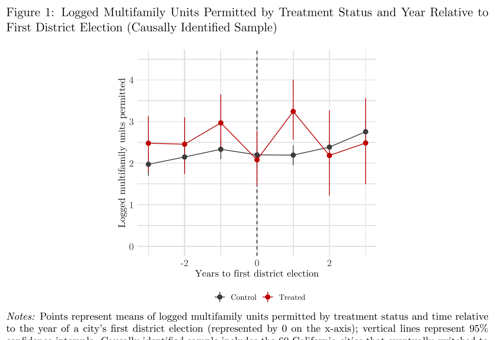

***Figure 1.*** Logged Multifamily Units Permitted by Treatment Status and Year Relative to First District Election (Causally Identified Sample)

Notes: Points represent means of logged multifamily units permitted by treatment status and time relative to the year of a city’s first district election (represented by 0 on the x-axis); vertical lines represent 95% confidence intervals. Causally identified sample includes the 60 California cities that eventually switched to district elections and that had histories of minority underrepresentation; a minority group constituting at least 20% of the population; and a total population of over 50,000 people. Treated group consists of the subset of these 60 cities that converted to districts during our panel; control group is constructed of the members of the same sample that were not yet treated at the time.

Next, to summarize these patterns and adjust for covariates, we estimate Equation 1 on our causally identified sample, yielding the overall effect of district elections on the number of housing units permitted annually. Column 1 of Table 2 shows that switching to districts

decreases the permitting of multifamily housing units by 0.81 log points or 55 percent (p = .08). For scale, the median at-large city permitted on average 46 units of multifamily housing per year. By contrast, Appendix Table B-4 shows that the effect on single-family housing is substantially smaller and too noisy to be meaningful. This pattern of results is consistent with multifamily housing being both less desirable and more vulnerable to NIMBY pressure via discretionary review compared to single-family housing.

Testing H2, within cities with high levels of segregation, district elections cause a 1.23 log point or 71 percent decrease in the permitting of multifamily housing (p < .05). The interaction term is positive but noisy, suggesting that cities with lower levels of segregation may experience less dramatic change from district elections. We next look at the size (H3 ) and overrepresentation (H4 ) of the racial majority group compared to the combined minority populations. In cities where the electorally dominant racial group composes a relatively small share of the population, district elections cause a 1.35 log point or 74 percent decrease in multifamily housing permitting (p < .01). Likewise, in cities with high levels of majority overrepresentation, district elections cause a 1.29 log point or 73 percent decrease in multifamily housing permitting (p < .05). The positive interaction term in both models suggests that the effect of district elections is smaller and less predictable in cities with larger and less overrepresented majority populations.

Robustness Checks

We report robustness checks for the analyses where we find the most significant effects on the aggregate housing supply: Columns 2-4 of Table 2 (H2 –H4 ). To assess model dependence, Appendix Tables B-5 to B-7 decompose the specification in Equation 2 into a bivariate model without fixed effects as well as models with city and year fixed effects, timevarying controls, and city-specific time trends. The effect of district elections is consistently negative before the addition of time-varying covariates or city-specific time trends.

We also ensure that our results are not sensitive to the measurement of the dependent variable, which includes both large outlying values and zeroes in city-years that saw no per-

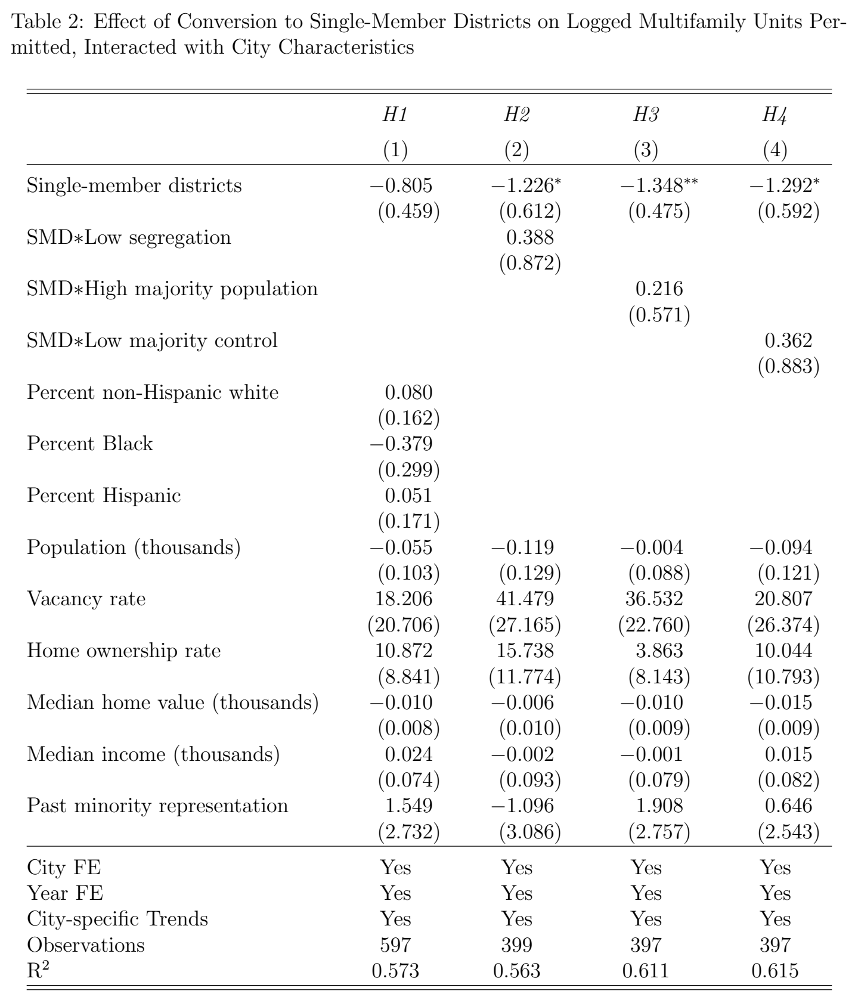

***Table 2.*** Effect of Conversion to Single-Member Districts on Logged Multifamily Units Per- mitted, Interacted with City Characteristics

[Download data as CSV](tables/tab-01.csv)

H1 H2 H3 H4

(1) (2) (3) (4)

Single-member districts −0.805 −1.226∗ −1.348∗∗ −1.292∗ (0.459) (0.612) (0.475) (0.592) SMD∗Low segregation 0.388

(0.872)

SMD∗High majority population 0.216

(0.571)

SMD∗Low majority control 0.362 (0.883) Percent non-Hispanic white 0.080

(0.162)

Percent Black −0.379

(0.299)

Percent Hispanic 0.051

(0.171)

Population (thousands) −0.055 −0.119 −0.004 −0.094 (0.103) (0.129) (0.088) (0.121) Vacancy rate 18.206 41.479 36.532 20.807 (20.706) (27.165) (22.760) (26.374) Home ownership rate 10.872 15.738 3.863 10.044 (8.841) (11.774) (8.143) (10.793) Median home value (thousands) −0.010 −0.006 −0.010 −0.015 (0.008) (0.010) (0.009) (0.009) Median income (thousands) 0.024 −0.002 −0.001 0.015 (0.074) (0.093) (0.079) (0.082) Past minority representation 1.549 −1.096 1.908 0.646 (2.732) (3.086) (2.757) (2.543) City FE Yes Yes Yes Yes

Year FE Yes Yes Yes Yes

City-specific Trends Yes Yes Yes Yes

Observations 597 399 397 397

R2 0.573 0.563 0.611 0.615

Note: ∗p<0.05; ∗∗p<0.01; ∗∗∗p<0.001

mitting at all. In keeping with the dominant approach in the housing economics literature (e.g., Mast Forthcoming; Glaeser, Gyourko, and Saiz 2008; Kahn 2011), our main specification uses the natural log of units permitted plus one, which has the advantages of capturing treatment effects as a percent change as well as limiting the influence of outliers. To verify that our findings do not hinge on this choice, we also reproduce Table 2 with two alternative codings of the dependent variable: unlogged units permitted scaled by the lagged population of the city (Table B-8) and a binary indicator for whether there were any units permitted in a city-year (Table B-9). All three approaches yield consistent patterns of results.

One concern for identification is whether cities that switched to district elections were already permitting fewer housing units prior to the change in electoral system. As shown in Figure 1, there is no reason to suspect this was the case; however, as an additional check, we use Granger causality tests to detect any potential “treatment effects” that may have emerged prior to cities’ switching to district elections. Appendix Figure B-7 shows that our conditional estimates are close to (and statistically no different from) zero prior to the year of the first district election, t. In contrast, the estimates on multifamily housing are uniformly negative and stable following the year of the first district election.

Finally, a growing recent literature in economics and political science has been concerned with issues around the identification and interpretation of treatment effects in panel data when treatments occur at different times (e.g., de Chaisemartin and D’Houltfœuille 2018; Imai and Kim 2021). In particular, Goodman-Bacon (2018) has shown that the two-way fixed effects estimator is a weighted average of all two-by-two difference-in-differences estimates that can be constructed from subsets of the data, with weights determined by the size of each subset and the variance of the treatment in that group. In Appendix Figure B-9, we estimate Equation 1 on the terciles in which we find conditional effects (high segregation, low majority population, and high majority group council control), and decompose the estimated treatment effects into their component two-by-two diff-in-diffs (y-axis) and associated weights (x-axis). These component estimates are consistently the same sign as our overall treatment

effects, and there are never large weights assigned to outlying estimates. We also reestimate Equation 1 on the same terciles using the fixed effect counterfactual approach proposed by Liu, Wang, and Xu (2021), which provides more reliable causal estimates than conventional two-way fixed effects when treatment effects are heterogeneous or there are unobserved timevarying confounders. The results, plotted in Appendix Figure B-8, generally agree with the estimates reported in Table 2.

## Distributive Outcomes

Next, we apply our theory to the spatial distribution of the housing supply. To test H5, we constructed a dataset of zoning changes emerging from the discretionary review process by coding the minutes of every planning commission and city council meeting from 2011 through 2018, totaling over 2,000 meetings. The intensity of this data collection required sampling cities. We selected cities that would maximize our ability to detect a treatment effect should one exist. First, we selected cities with multiple years of post-treatment data. Second, we chose cities that had a white majority large enough to potentially dilute the representation of a Latino minority via bloc majority voting. Third, we chose cities large enough to generate enough new permits across an array of neighborhoods that an effect on spatial distribution would be detectable. These decision rules winnowed treated cities to Santa Barbara, Escondido, and Anaheim. We match these treated cities to similarly sized and racially composed cities with at-large elections as controls: Santa Cruz, San Buenaventura (Ventura), and Glendale, respectively.13 Although these cities are larger and more diverse than the average California city, we believe our spatial findings capture a mechanism generalizable to other medium to large cities with sizable minority populations.

Reviewing meeting minutes, we coded details of each approved housing proposal and zoning change, including the number of units, the composition of units, the proposal’s address, and year of approval.14 Importantly, this coding reflects any increase in the by-right 13Table A-3 shows demographic data for treated and control cities. Of note, Ventura held their first district election in 2018, which is accounted for in our difference-in-differences model.

14Coding decisions are discussed in Appendix Section D.5.

“buildable capacity” of the city, giving us the universe of legislative decisions allowing new housing to be built. We geocoded these decisions to the Census block group level and merged them with time-varying socioeconomic variables drawn from the ACS. These block grouplevel controls include median income, percent non-Hispanic white, percent Black, percent Hispanic, homeownership rate, residential vacancy rate, and median home value.

We examine the distributive equity of the housing supply by estimating the moderating effect of a neighborhood’s racial composition on its annual change in buildable capacity. Our dependent variable is log housing units approved annually via discretionary review. We include both single-family and multifamily housing, as all units in this dataset were vulnerable to NIMBY political pressure via discretionary review. We classify every block group in the six treated and control cities as “white” or “minority” using cutpoints defined by the top and bottom tercile of percent non-Hispanic white in each city prior to treatment. As before, we remove the middle tercile of data.15

To measure the effect of district elections within cities, we interact the treatment with an indicator for being a minority block group. This interaction signifies whether district elections affect the housing supply differently within minority block groups compared to white block groups. We use this interaction to measure the effect of district elections on the equity of the distribution of housing between white and minority neighborhoods. Our estimating equation is:

log(Y + 1) = β + β district + β (district * minority) + X γ + ρ + η + ζ t + ε (3) bit 0 1 it 2 bit bit i t i bit

where Y is housing units approved via discretionary review in block group b in city i and year t, minority is an indicator for being a minority block group, X is a vector of timevariant, block group-level controls (enumerated above), ρ is a city fixed effect, η is a year fixed effect, and ζ is a city-specific time trend. We estimate standard errors using a wild bootstrap (Cameron, Gelbach, and Miller 2008) clustered at the city level, as that is the unit of analysis at which treatment assignment occurs, and within which we expect the most 15Appendix Figure C-11 visualizes the raw permit data by block groups within cities.

meaningful correlation among unobserved components of outcomes.

### Effects on the Spatial Distribution of Housing

We first assess pretrends on our variable of interest: the difference between the logged number of units approved in block groups with high and low concentrations of minority residents within the same city. Taking the same approach that we used to produce Figure 1, we show in Figure 2 that treated and control units follow similar pretreatment trajectories.16

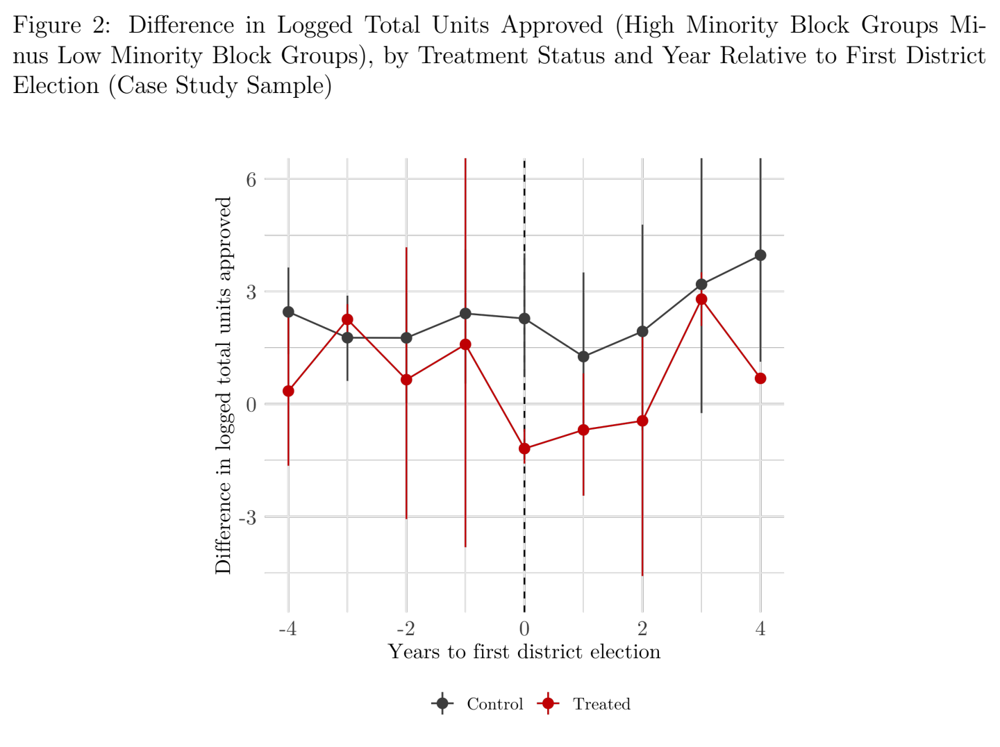

***Figure 2.*** Difference in Logged Total Units Approved (High Minority Block Groups Mi- nus Low Minority Block Groups), by Treatment Status and Year Relative to First District Election (Case Study Sample)

Notes: Points represent means of the difference between logged total units approved in minority and white block groups, by treatment status and time relative to the year of a city’s first district election (represented by 0 on the x-axis); vertical lines represent 95% confidence intervals. Case study sample includes Santa Barbara, Escondido, and Anaheim (treated) and Santa Cruz, Ventura, and Glendale (control).

Table 3 shows the results of our spatial analysis in tabular form.17 We find that moving 16Appendix Figure C-10 shows parallel trends separately for white and minority block groups.

17See Appendix Section C.1 for discussion of robustness across standard error specifications.

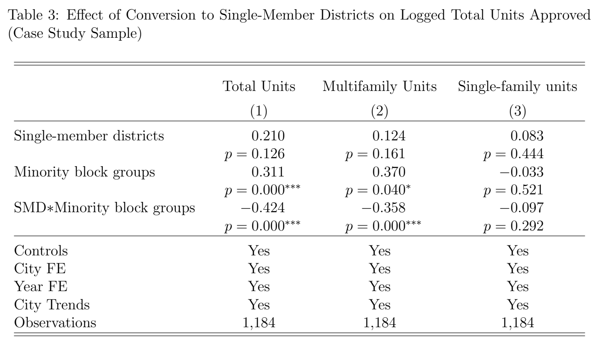

***Table 3.*** Effect of Conversion to Single-Member Districts on Logged Total Units Approved (Case Study Sample)

[Download data as CSV](tables/tab-02.csv)

Total Units Multifamily Units Single-family units (1) (2) (3)

Single-member districts 0.210 0.124 0.083

p = 0.126 p = 0.161 p = 0.444 Minority block groups 0.311 0.370 −0.033 p = 0.000∗∗∗ p = 0.040∗ p = 0.521 SMD∗Minority block groups −0.424 −0.358 −0.097 p = 0.000∗∗∗ p = 0.000∗∗∗ p = 0.292 Controls Yes Yes Yes

City FE Yes Yes Yes

Year FE Yes Yes Yes

City Trends Yes Yes Yes

Observations 1,184 1,184 1,184

Notes: ∗p<0.05; ∗∗p<0.01; ∗∗∗p<0.001. Case study sample includes Santa Barbara, Escondido, and Anaheim (treated) and Santa Cruz, Ventura, and Glendale (control).

to district elections significantly decreases the disparity in permitting between white and minority neighborhoods. Under at-large representation, minority block groups see 0.31 log points or 36 percent more housing units approved annually compared to their white block group counterparts, even after controlling for demographic and housing market covariates (p < .01). And while the effect of district elections for white block groups is not statistically different than zero, it is large and negative for minority block groups. Switching to district elections decreases the permitting of housing in minority block groups compared to white block groups by 0.42 log points or 35 percent (p < .01).

Figure 3 directly compares the racial disparity in permitting in at-large and districtbased systems. On the left, we see the differential between white and minority neighborhoods under at-large elections, wherein minority neighborhoods take on 36 percent more units than white neighborhoods. On the right, under treatment, this differential falls to a statistically insignificant negative 0.11 log points (11 percent). The difference between these estimates represents the effect of districts on racial equity in permitting. Supporting H5, we find that

districts reduce differential responsiveness to the NIMBY interests of white as opposed to minority neighborhoods.

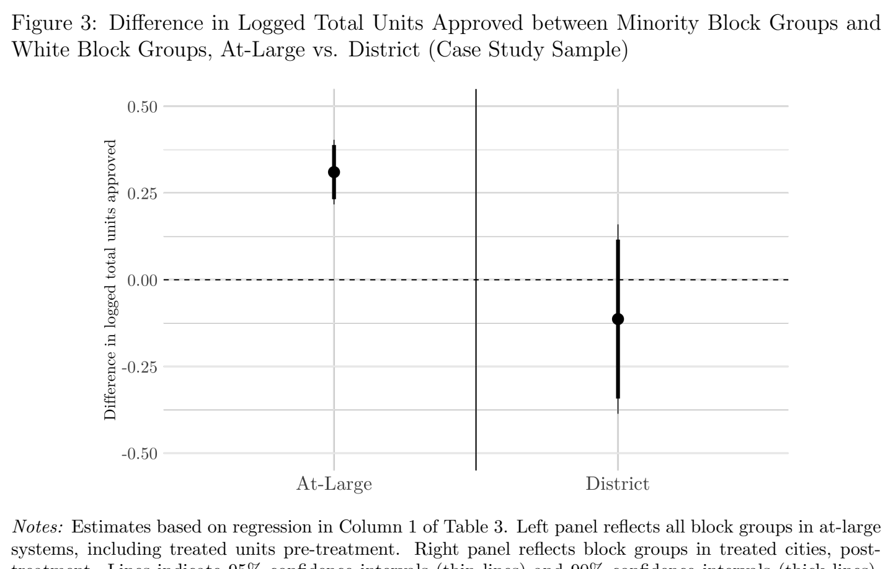

***Figure 3.*** Difference in Logged Total Units Approved between Minority Block Groups and White Block Groups, At-Large vs. District (Case Study Sample)

Notes: Estimates based on regression in Column 1 of Table 3. Left panel reflects all block groups in at-large systems, including treated units pre-treatment. Right panel reflects block groups in treated cities, posttreatment. Lines indicate 95% confidence intervals (thin lines) and 90% confidence intervals (thick lines). Case study sample includes Santa Barbara, Escondido, and Anaheim (treated) and Santa Cruz, Ventura, and Glendale (control).

### Robustness Checks

Appendix Table C-10 decomposes the distributive outcomes model to test for sensitivity to different specifications. Further, to allay concerns that our results are being driven by one city, we sequentially drop each city from the sample in Table C-11. In every alternative sample and model specification, the effects are stable and statistically significant.

Our decision to define white and minority block groups with respect to each city’s own distribution is driven by both theoretical and empirical concerns. We believe that the block groups with the highest relative minority concentrations in each city are likely to have the weakest political representation; moreover, our approach ensures balance in the number of white and minority block groups. However, applying uniform cutpoints across all cities —

and thus ensuring that all “minority” block groups are indeed majority-minority — also has merits. We do so in Appendix Table C-12, and the interaction term grows even larger — unsurprisingly given the sharpened contrast between white and minority block groups.18

As before, we use a Granger causality test to visualize how the housing trends of treated cities differ from those of control cities before and after switching to district elections. Appendix Figure C-12 shows that our coefficient of interest, the differential between white and minority block groups under district elections, is close to and statistically no different from zero prior to the year of the first district election (t). Upon treatment, the coefficient is uniformly negative, with the greatest equity gains concentrated immediately post-treatment.

## Conclusion

Faced with racially polarized voting and neighborhood segregation, civil rights advocates have viewed district elections as a pathway to descriptive and, even more importantly, substantive representation for racial minorities. With carefully drawn districts, previously underrepresented neighborhoods can be nearly guaranteed a voice in local government. Our research contributes to a broad assessment of the consequences of this reform in two ways. First, we find that district elections constrain the ability of cities to permit new housing. Segregated cities with sizable and systematically underrepresented minority groups — where reformers can most easily draw majority-minority districts — experience the strongest effects. Our conditional results affirm findings from the growing literature on this reform: district elections interact with the underlying political landscape. We believe these results are generalizable to any minority group facing polarized voting, including renters, the poor, and even religious minorities. Researchers studying this reform should test for conditional effects, and cities that do not meet these criteria may wish to pursue aspatial reforms.

Second, we present evidence from case studies that district elections break the correlation between minority block groups and new housing. While this may be in the hyperlocal, shortterm interest of newly empowered minority voters, the restriction of the multifamily housing 18This approach leaves two cities without any minority block groups, so we favor Table 3.

supply is likely to drive citywide housing costs even higher, disproportionately burdening the lower-income minority communities the reform was meant to assist. Put simply, the decentralized neighborhood control of district elections may trade spatially concentrated inequalities (new housing units) for a spatially diffuse burden (citywide housing costs). These results call for additional scrutiny of the distribution of other concentrated benefits and costs across the full range of cities in our analysis.

Because city councils and county commissions govern the majority of land use decisions in the US, we expect this supply–equity trade-off to stymie the siting of most LULUs. For theory from outside of land use, Hills Jr and Schleicher (2011) argue that the closing of military bases and the easing of trade tariffs present similar concentrated costs for nearby communities and affected industries, respectively. Within Congress, both policies saw inefficient, logroll-type outcomes until reform bundled individual decisions and removed substantial discretion from the legislature. We suggest a similar reform for housing permitting.

State governments have an interest in each city permitting their fair share of housing to maintain statewide affordability and economic growth. To counter this decrease in supply, district elections can be paired with top-down pressure from the state government via withholding intergovernmental transfers (e.g., Elmendorf 2019). Under at-large elections, this top-down pressure would channel housing into underrepresented minority neighborhoods, exacerbating distributive inequality. But under district elections, with more equal representation secured, the supply would be more evenly spread across neighborhoods. This pressure would simultaneously generate new housing to counter rising prices while equitably distributing its spatial burden.

Policies with concentrated costs and diffuse benefits are rarely popular (Wilson 1980). But LULUs present a uniquely challenging concentrated burden, one subject to the spatial aggregation of voters. We have identified how the spatial scale of representation affects the trade-off between local interests and collective outcomes — between distributive equity and aggregate supply. Institutional design to overcome the problem of allocating concentrated

costs should move beyond this trade-off to the pursuit of both goals.

## References

Abott, Carolyn, and Asya Magazinnik. 2020. “At-Large Elections and Minority Representation in Local Government.” American Journal of Political Science 64(3): 717–733.

Been, Vicki, Ingrid Gould Ellen, and Katherine O’Regan. 2019. “Supply Skepticism: Housing Supply and Affordability.” Housing Policy Debate 29(1): 25–40.

Bertrand, Marianne, Esther Duflo, and Sendhil Mullainathan. 2004. “How Much Should We Trust Differences-In-Differences Estimates?” The Quarterly Journal of Economics 119(1): 249–275.

Burnett, Craig M, and Vladimir Kogan. 2014. “Local Logrolling? Assessing the Impact of Legislative Districting in Los Angeles.” Urban Affairs Review 50(5): 648–671.

Cameron, A Colin, Jonah B Gelbach, and Douglas L Miller. 2008. “Bootstrap-based improvements for inference with clustered errors.” The Review of Economics and Statistics 90(3): 414–427.

Charles, Camille Zubrinksy. 2006. Won’t You Be My Neighbor: Race, Class, and Residence in Los Angeles. Russell Sage Foundation.

Clark, Alistair, and Timothy B Krebs. 2012. “Elections and Policy Responsiveness.” In The Oxford Handbook of Urban Politics.

Clingermayer, James C. 1994. “Electoral Representation, Zoning Politics, and the Exclusion of Group Homes.” Political Research Quarterly 47(4): 969–984.

Dancygier, Rafaela M. 2014. “Electoral Rules or Electoral Leverage? Explaining Muslim Representation in England.” World Politics 66(2): 229–263.

Data Relationships between Permits, Starts, and Completions. 2020.

de Benedictis-Kessner, Justin, and Michael Hankinson. 2019. “Concentrated Burdens: How Self-Interest and Partisanship Shape Opinion of Opioid Treatment Policy.” American Political Science Review 113(4): 1078–1084.

de Chaisemartin, Cl´ement, and Xavier D’Houltfœuille. 2018. “Two-Way Fixed Effects Estimators with Heterogeneous Treatment Effects.” Available at: https://arxiv.org/abs/ 1803.08807.

Du Bois, William Edward Burghardt. 1910. “Reconstruction and Its Benefits.” The American Historical Review pp. 781–799.

Einstein, Katherine Levine, David M Glick, and Maxwell Palmer. 2020. Neighborhood Defenders. Cambridge University Press.

Einstein, Katherine Levine, Maxwell Palmer, and David M Glick. 2019. “Who Participates in Local Government? Evidence from Meeting Minutes.” Perspectives on Politics 17(1): 28–46.

Elmendorf, Christopher S. 2019. “Beyond the Double Veto: Land Use Plans As Preemptive Intergovernmental Contracts.” Hastings Law Journal 71: 79.

Feiock, Richard C, Antonio F Tavares, and Mark Lubell. 2008. “Policy Instrument Choices for Growth Management and Land Use Regulation.” Policy Studies Journal 36(3): 461– 480.

Fischel, William A. 2001. The Homevoter Hypothesis. Cambridge, MA: Harvard University Press.

Ganong, Peter, and Daniel Shoag. 2017. “Why Has Regional Income Convergence in the US Declined?” Journal of Urban Economics 102: 76–90.

Glaeser, Edward L, Joseph Gyourko, and Albert Saiz. 2008. “Housing Supply and Housing Bubbles.” Journal of Urban Economics 64(2): 198–217.

Goodman-Bacon, Andrew. 2018. “Difference-in-Differences with Variation in Treatment Timing.” Available at: https://www.nber.org/papers/w25018.

Hainmueller, Jens, Jonathan Mummolo, and Yiqing Xu. 2019. “How much should we trust estimates from multiplicative interaction models? Simple tools to improve empirical practice.” Political Analysis 27(2): 163–192.

Hajnal, Zoltan, and Jessica Trounstine. 2005. “Where Turnout Matters: The Consequences of Uneven Turnout in City Politics.” The Journal of Politics 67(2): 515–535.

Hamilton, Bruce W. 1976. “Capitalization of Intrajurisdictional Differences in Local Tax Prices.” The American Economic Review 66(5): 743–753.

Hankinson, Michael. 2018. “When Do Renters Behave Like Homeowners? High Rent, Price Anxiety, and NIMBYism.” American Political Science Review 112(3): 473–493.

Hills Jr, Roderick M, and David N Schleicher. 2011. “Balancing the Zoning Budget.” Case W. Res. L. Rev. 62: 81.

Honaker, James, Gary King, and Matthew Blackwell. 2011. “Amelia II: A Program for Missing Data.” Journal of Statistical Software 45(7): 1–47.

Imai, Kosuke, and In Song Kim. 2021. “On the Use of Two-Way Fixed Effects Regression Models for Causal Inference with Panel Data.” Political Analysis 29: 405–415.

Imai, Kosuke, and Kabir Khanna. 2016. “Improving Ecological Inference by Predicting Individual Ethnicity from Voter Registration Records.” Political Analysis 24: 263–272.

Imai, Kosuke, and Kabir Khanna. 2021. “Who Are You? Bayesian Prediction of Racial Category Using Surname and Geolocation.” https://github.com/kosukeimai/wru.

Kahn, Matthew E. 2011. “Do Liberal Cities Limit New Housing Development? Evidence from California.” Journal of Urban Economics 69(2): 223–228.

Liu, Licheng, Ye Wang, and Yiqing Xu. 2021. “A Practical Guide to Counterfactual Estimators for Causal Inference with Time-Series Cross-Sectional Data.” Available at: https://papers.ssrn.com/abstract=3555463.

Lubell, Mark, Richard C Feiock, and Edgar E Ramirez De La Cruz. 2009. “Local Institutions and the Politics of Urban Growth.” American Journal of Political Science 53(3): 649–665. Marble, William, and Clayton Nall. 2021. “Where Interests Trump Ideology: The Persistent Influence of Homeownership in Local Development Politics.” Journal of Politics 83(4).

Mast, Evan. Forthcoming. “Warding Off Development: Local Control, Housing Supply, and NIMBYs.” Review of Economics and Statistics .

Mawhorter, Sarah, and Carolina Reid. 2018. Local Housing Policies Across California. Technical report Terner Center for Housing Innovation, UC-Berkeley.

Meier, Kenneth J, Eric Gonzalez Juenke, Robert D Wrinkle, Polinard, and JL. 2005. “Structural Choices and Representational Biases: The Post-Election Color of Representation.” American Journal of Political Science 49(4): 758–768.

Mohai, Paul, David Pellow, and J Timmons Roberts. 2009. “Environmental Justice.” Annual Review of Environment and Resources 34: 405–430.

Roodman, David, Morten Ørregaard Nielsen, James G. MacKinnon, and Matthew D. Webb. 2019. “Fast and wild: Bootstrap inference in Stata using boottest.” The Stata Journal 19(1): 4–60.

Sass, Tim R, and Stephen L Mehay. 1995. “The Voting Rights Act, District Elections, and the Success of Black Candidates in Municipal Elections.” The Journal of Law and Economics 38(2): 367–392.

Schleicher, David. 2013. “City Unplanning.” Yale Law Journal 122: 1670–1737.

Sette, Kevin. 2020. “Are Two Minorities Equal to One? Minority Coalition Groups and Section 2 of the Voting Rights Act.” Fordham Law Review 88(6): 2693–2734.

Soja, Edward W. 2010. Seeking Spatial Justice. Minneapolis: University of Minnesota Press. Stokes, Leah C. 2016. “Electoral Backlash against Climate Policy: A Natural Experiment on Retrospective Voting and Local Resistance to Public Policy.” American Journal of Political Science 60(4): 958–974.

Tausanovitch, Chris, and Christopher Warshaw. 2014. “Representation in Municipal Government.” American Political Science Review 108(3): 605–641.

Trounstine, Jessica. 2009. Political Monopolies in American Cities: The Rise and Fall of Bosses and Reformers. Chicago: University of Chicago Press.

Trounstine, Jessica. 2016. “Segregation and Inequality in Public Goods.” American Journal of Political Science 60(3): 709–725.

Trounstine, Jessica. 2018. Segregation by Design: Local Politics and Inequality in American Cities. New York: Cambridge University Press.

Trounstine, Jessica, and Melody E Valdini. 2008. “The Context Matters: The Effects of Single-Member versus At-Large Districts on City Council Diversity.” American Journal of Political Science 52(3): 554–569.

Valentini, Laura. 2013. “Justice, Disagreement and Democracy.” British Journal of Political Science 43(1): 177–199.

Weingast, Barry R. 1994. “Reflections on distributive politics and universalism.” Political Research Quarterly 47(2): 319–327.

Wilson, James Q. 1980. The Politics of Regulation. New York: Basic Books.

## Online Appendix for “The Supply–Equity Trade-off: The

## Contents

A Descriptive Statistics A-2 B Aggregate Outcomes A-7 C Distributive Outcomes A-18 C.1 Distributive Standard Errors . . . . . . . . . . . . . . . . . . . . . . . . . . . A-24 D Data Collection A-25 D.1 Aggregate Permits . . . . . . . . . . . . . . . . . . . . . . . . . . . . . . . . A-25 D.2 Electoral Institutions . . . . . . . . . . . . . . . . . . . . . . . . . . . . . . . A-25 D.3 Estimating Candidate Ethnicities . . . . . . . . . . . . . . . . . . . . . . . . A-25 D.4 Interviews with Key CVRA Stakeholders . . . . . . . . . . . . . . . . . . . . A-26 D.5 Zoning Amendments . . . . . . . . . . . . . . . . . . . . . . . . . . . . . . . A-28

## A Descriptive Statistics

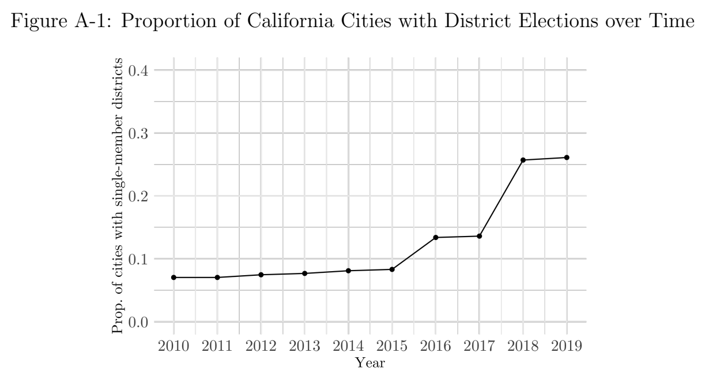

***Figure A-1.*** Proportion of California Cities with District Elections over Time

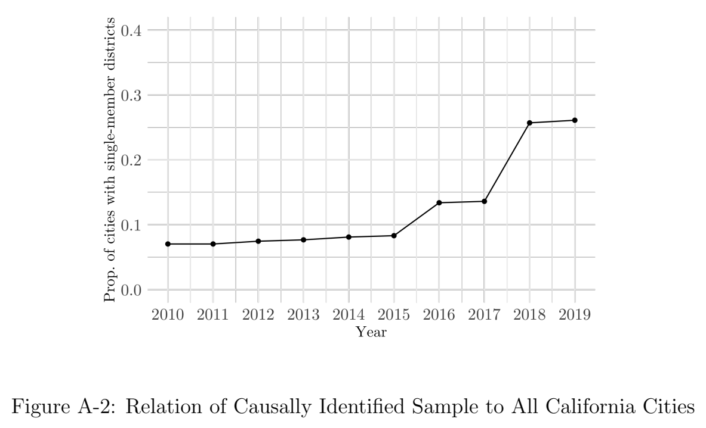

***Figure A-2.*** Relation of Causally Identified Sample to All California Cities

Notes: Rectangle size proportionate to number of cities included in each group.

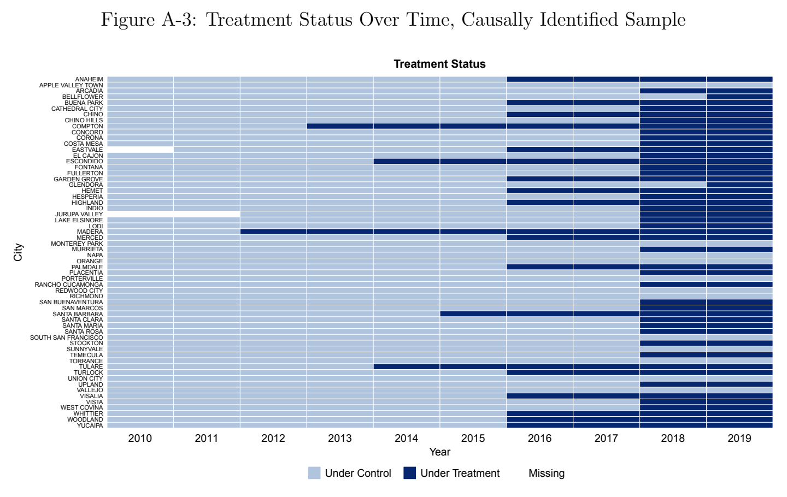

***Figure A-3.*** Treatment Status Over Time, Causally Identified Sample

ANAHEIM APPLE VALLEY TOWN ARCADIA BELLFLOWER BUENA PARK CATHEDRAL CITY CHINO CHINO HILLS COMPTON CONCORD CORONA COSTA MESA EASTVALE EL CAJON ESCONDIDO FONTANA FULLERTON GARDEN GROVE GLENDORA HEMET HESPERIA HIGHLAND INDIO JURUPA VALLEY LAKE ELSINORE LODI MADERA MERCED MONTEREY PARK MURRIETA NAPA ORANGE PALMDALE PLACENTIA PORTERVILLE RANCHO CUCAMONGA REDWOOD CITY RICHMOND SAN BUENAVENTURA SAN MARCOS SANTA BARBARA SANTA CLARA SANTA MARIA SANTA ROSA SOUTH SAN FRANCISCO STOCKTON SUNNYVALE TEMECULA TORRANCE TULARE TURLOCK UNION CITY UPLAND VALLEJO VISALIA VISTA WEST COVINA WHITTIER

WOODLAND

YUCAIPA

2010 2011 2012 2013 2014 2015 2016 2017 2018 2019 Year

ytiC

Treatment Status

Under Control Under Treatment Missing

Notes: Cities included here that were not treated over this panel were ultimately treated in 2020. The cities of Eastvale and Jurupa Valley are shown as missing in 2010 and 2010-11, respectively, because they were not yet incorporated in those years.

Table A-1: Cities Treated by CVRA and Year of First District Elections; Bold Included in Causally Identified Sample

City Year Duarte 2018 Palm Springs 2019 Modesto 2008 El Cajon 2018 Novato 2019 Madera 2012 Encinitas 2018 Antioch 2020 Sanger 2012 Eureka 2018 Apple Valley 2020 Compton 2013 Exeter 2018 Brentwood 2020 Escondido 2014 Fontana 2018 Camarillo 2020 Tulare 2014 Fremont 2018 Campbell 2020 Santa Barbara 2015 Fullerton 2018 Chico 2020 Anaheim 2016 Hesperia 2018 Citrus Heights 2020 Banning 2016 Indio 2018 Claremont 2020 Buena Park 2016 Jurupa Valley 2018 Davis 2020 Chino 2016 Kingsburg 2018 Elk Grove 2020 Chula Vista 2016 Lake Elsinore 2018 Half Moon Bay 2020 Dixon 2016 Lake Forest 2018 Imperial Beach 2020 Eastvale 2016 Lemoore 2018 Lincoln 2020 Garden Grove 2016 Lodi 2018 Livermore 2020 Hemet 2016 Lompoc 2018 Los Alamitos 2020 Highland 2016 Martinez 2018 Marina 2020 King City 2016 Menlo Park 2018 Monterey Park 2020 Los Banos 2016 Morgan Hill 2018 Moorpark 2020 Merced 2016 Murrieta 2018 Napa 2020 Palmdale 2016 Oceanside 2018 Ojai 2020 Patterson 2016 Oxnard 2018 Orange 2020 Riverbank 2016 Placentia 2018 Oroville 2020 S. Juan Capistrano 2016 Poway 2018 Pacifica 2020 Turlock 2016 Rancho Cucamonga 2018 Palm Desert 2020 Visalia 2016 Redlands 2018 Paso Robles 2020 Wildomar 2016 S. Buena(Ventura) 2018 Porterville 2020 Whittier 2016 San Marcos 2018 Redwood City 2020 Woodland 2016 Santa Clara 2018 Richmond 2020 Yucaipa 2016 Santa Maria 2018 Rohnert Park 2020 La Mirada 2017 Santa Rosa 2018 Roseville 2020 Alhambra 2018 Santee 2018 San Rafael 2020 Arcadia 2018 South Pasadena 2018 Santa Ana 2020 Atwater 2018 Stanton 2018 Selma 2020 Barstow 2018 Stockton 2018 Simi Valley 2020 Big Bear Lake 2018 Tehachapi 2018 Solana Beach 2020 Carlsbad 2018 Temecula 2018 S. San Francisco 2020 Cathedral City 2018 Twentynine Palms 2018 Sunnyvale 2020 Ceres 2018 Upland 2018 Torrance 2020 Chino Hills 2018 Vista 2018 Union City 2020 Coalinga 2018 Wasco 2018 Vacaville 2020 Concord 2018 West Covina 2018 Vallejo 2020 Corona 2018 Yucca Valley 2018 Westminster 2020 Costa Mesa 2018 Bellflower 2019 Windsor 2020 Dana Point 2018 Glendora 2019 Goleta 2022

Table A-2: Characteristics of Cities in Aggregate Analysis by Type

Mean Mean Mean p-value of p-value of (Untreated) (All (Causally difference, difference, switchers) identified all switchers causal sample sample) vs. untreated vs. untreated Population

Number of people 30,258 78,404 102,951 0.00 0.00 Percent non-Hispanic 48 43 36 0.02 0.00 Percent Black 3 5 6 0.01 0.01 Percent Asian 10 11 14 0.25 0.05 Percent Latino 29 29 33 0.89 0.11 Past electoral success

Prop. of seats w/Latino candidate elected 0.18 0.11 0.09 0.00 0.00 Prop. of seats w/Black candidate elected 0.03 0.03 0.05 0.73 0.32 Prop. of seats w/Asian candidate elected 0.03 0.04 0.04 0.59 0.45 Prop. of seats w/white candidate elected 0.74 0.80 0.77 0.02 0.34 Income and land use

Median household income ($) 71,310 66,856 63,859 0.11 0.02 Median home value ($) 499,112 412,141 395,692 0.00 0.00 Home vacancy rate 0.10 0.07 0.07 0.00 0.00 Home ownership rate 0.59 0.59 0.58 1.00 0.42 Density (population per sq. mile) 4,132 4,102 4,599 0.92 0.20 Residential segregation (Theil index) 0.03 0.07 0.08 0.00 0.00 Housing outcomes

Units permitted annually, single-family 44 83 93 0.00 0.00 Units permitted annually, multifamily 31 63 83 0.00 0.00 N 306 136 60

Table A-3: Characteristics of Cities in Distributive Analysis by Type

Mean Mean p-value of

(Treatment) (Control) difference Median income 63836 56294 0.00

Median home value 442599 530896 0.00

Home ownership rate 0.45 0.38 0.00

Home vacancy rate 0.07 0.07 0.78

Proportion Black 0.02 0.02 0.11

Proportion non-Hispanic white 0.49 0.69 0.00 Proportion Hispanic 0.35 0.14 0.00

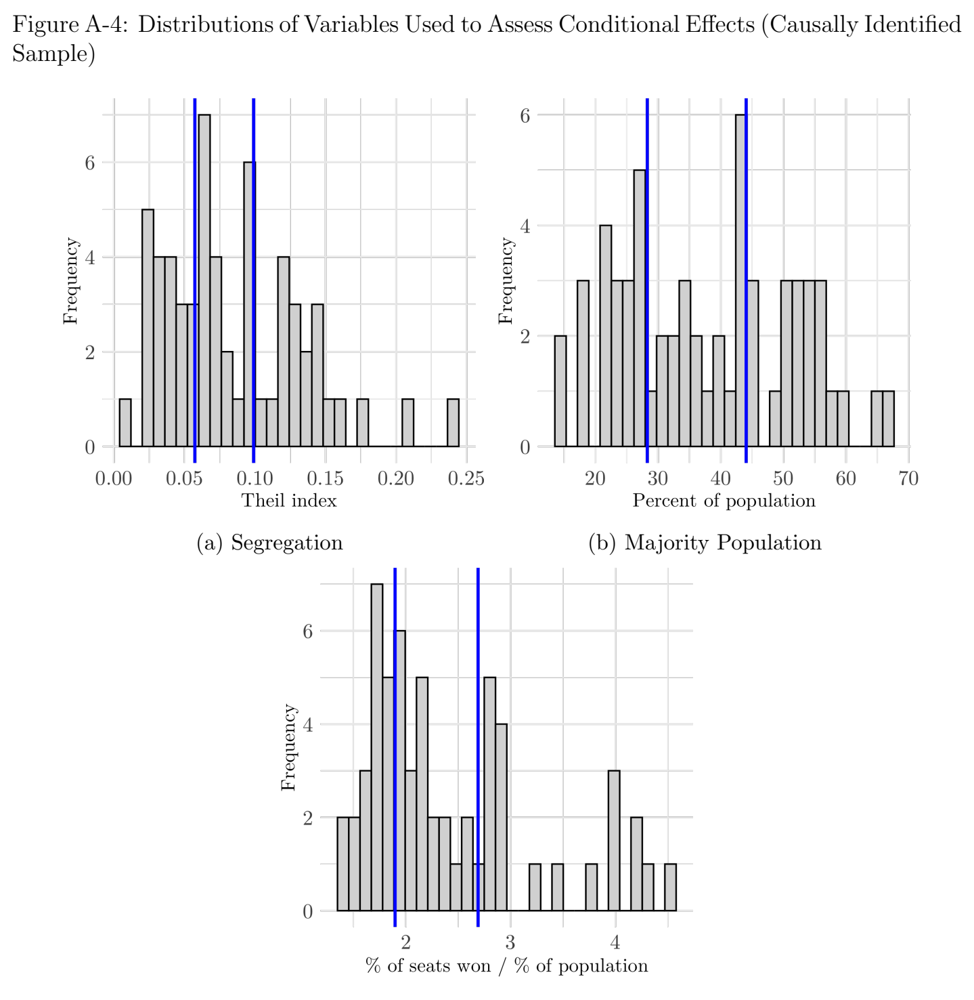

***Figure A-4.*** Distributions of Variables Used to Assess Conditional Effects (Causally Identified Sample)

(a) Segregation (b) Majority Population

(c) Majority Council Control

Notes: Tercile cutpoints are marked in blue. Distributions are defined over the pretreatment values of each variable for cities in the causally identified sample. Assignment to terciles is determined at the city rather than observation level: our measure of segregation is time-invariant and observed pretreatment for all cities; for majority population size, we assign cities to terciles based on average values over their pretreatment panels; and for majority council control, we take each city’s value from the year before their first district election, as this already incorporates a twelve-year pretreatment history. Causally identified sample includes the 60 California cities that eventually switched to district elections and that had histories of minority underrepresentation; a minority group constituting at least 20% of the population; and a total population of over 50,000 people.

## B Aggregate Outcomes

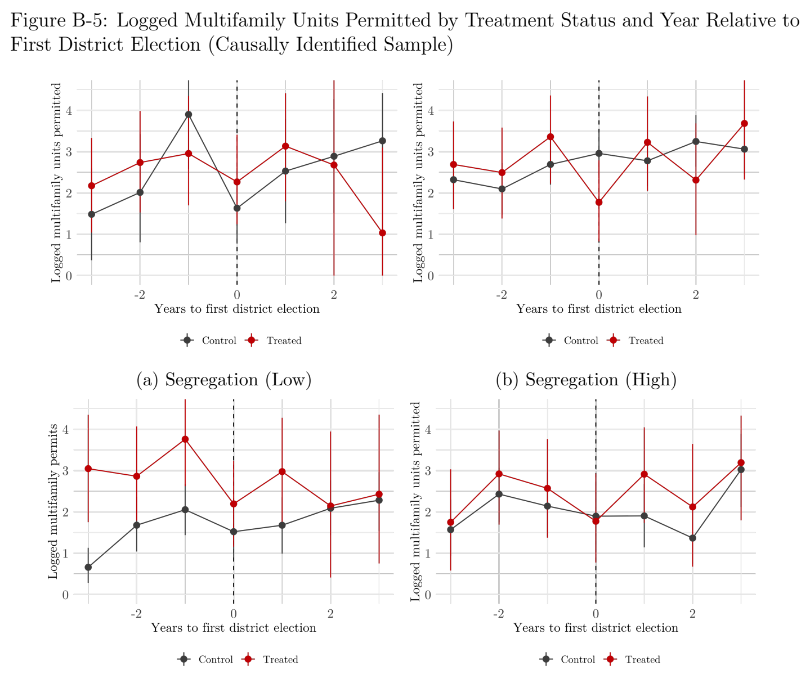

***Figure B-5.*** Logged Multifamily Units Permitted by Treatment Status and Year Relative to First District Election (Causally Identified Sample)

(a) Segregation (Low) (b) Segregation (High)

(c) Majority Population (Low) (d) Majority Population (High)

Figure B-5 (continued): Logged Multifamily Units Permitted by Treatment Status and Year Relative to First District Election (Causally Identified Sample)

(e) Majority Council Control (Low) (f) Majority Council Control (High)

Notes: Points represent means of logged multifamily units permitted by treatment status and time relative to the year of a city’s first district election (represented by 0 on the x-axis); vertical lines represent 95% confidence intervals. Causally identified sample includes the 60 California cities that eventually switched to district elections and that had histories of minority underrepresentation; a minority group constituting at least 20% of the population; and a total population of over 50,000 people. Treated group consists of the subset of these 60 cities that converted to districts during our panel; control group is constructed of the members of the same sample that were not yet treated at the time.

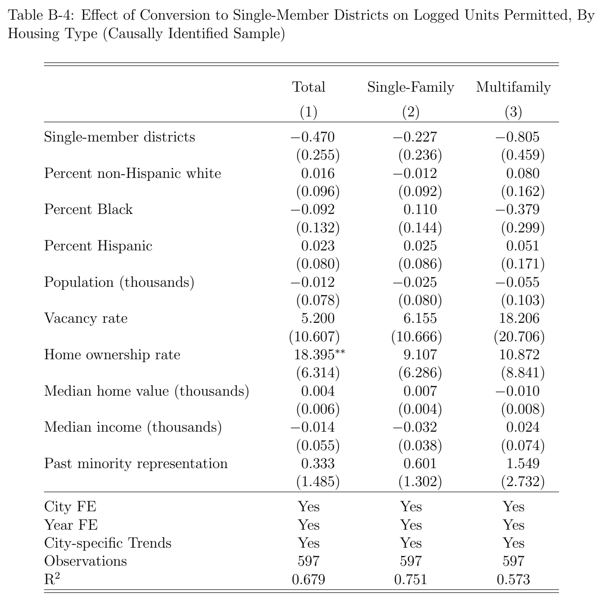

***Table B-4.*** Effect of Conversion to Single-Member Districts on Logged Units Permitted, By Housing Type (Causally Identified Sample)

[Download data as CSV](tables/tab-03.csv)

Total Single-Family Multifamily (1) (2) (3)

Single-member districts −0.470 −0.227 −0.805 (0.255) (0.236) (0.459) Percent non-Hispanic white 0.016 −0.012 0.080 (0.096) (0.092) (0.162) Percent Black −0.092 0.110 −0.379 (0.132) (0.144) (0.299) Percent Hispanic 0.023 0.025 0.051 (0.080) (0.086) (0.171) Population (thousands) −0.012 −0.025 −0.055 (0.078) (0.080) (0.103) Vacancy rate 5.200 6.155 18.206 (10.607) (10.666) (20.706) Home ownership rate 18.395∗∗ 9.107 10.872 (6.314) (6.286) (8.841) Median home value (thousands) 0.004 0.007 −0.010 (0.006) (0.004) (0.008) Median income (thousands) −0.014 −0.032 0.024 (0.055) (0.038) (0.074) Past minority representation 0.333 0.601 1.549 (1.485) (1.302) (2.732) City FE Yes Yes Yes

Year FE Yes Yes Yes

City-specific Trends Yes Yes Yes

Observations 597 597 597

R2 0.679 0.751 0.573

Note: ∗p<0.05; ∗∗p<0.01; ∗∗∗p<0.001

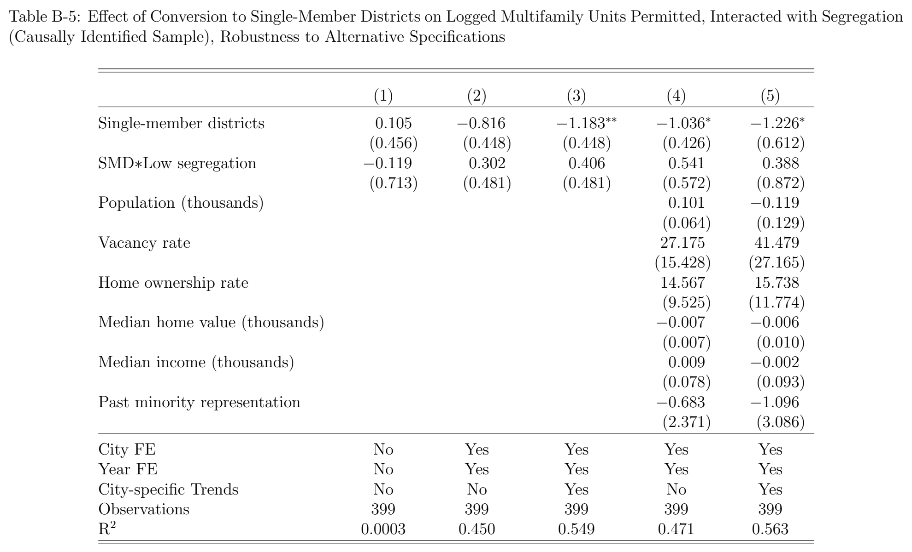

***Table B-5.*** Effect of Conversion to Single-Member Districts on Logged Multifamily Units Permitted, Interacted with Segregation (Causally Identified Sample), Robustness to Alternative Specifications

[Download data as CSV](tables/tab-04.csv)

(1) (2) (3) (4) (5)

Single-member districts 0.105 −0.816 −1.183∗∗ −1.036∗ −1.226∗ (0.456) (0.448) (0.448) (0.426) (0.612) SMD∗Low segregation −0.119 0.302 0.406 0.541 0.388 (0.713) (0.481) (0.481) (0.572) (0.872) Population (thousands) 0.101 −0.119 (0.064) (0.129) Vacancy rate 27.175 41.479 (15.428) (27.165) Home ownership rate 14.567 15.738 (9.525) (11.774) Median home value (thousands) −0.007 −0.006 (0.007) (0.010) Median income (thousands) 0.009 −0.002 (0.078) (0.093) Past minority representation −0.683 −1.096 (2.371) (3.086) City FE No Yes Yes Yes Yes

Year FE No Yes Yes Yes Yes

City-specific Trends No No Yes No Yes

Observations 399 399 399 399 399

R2 0.0003 0.450 0.549 0.471 0.563

Note: ∗p<0.05; ∗∗p<0.01; ∗∗∗p<0.001

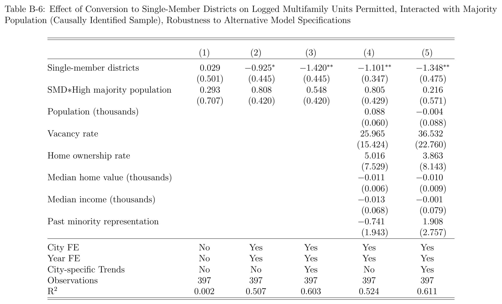

***Table B-6.*** Effect of Conversion to Single-Member Districts on Logged Multifamily Units Permitted, Interacted with Majority Population (Causally Identified Sample), Robustness to Alternative Model Specifications

[Download data as CSV](tables/tab-05.csv)

(1) (2) (3) (4) (5)

Single-member districts 0.029 −0.925∗ −1.420∗∗ −1.101∗∗ −1.348∗∗ (0.501) (0.445) (0.445) (0.347) (0.475) SMD∗High majority population 0.293 0.808 0.548 0.805 0.216 (0.707) (0.420) (0.420) (0.429) (0.571) Population (thousands) 0.088 −0.004 (0.060) (0.088) Vacancy rate 25.965 36.532 (15.424) (22.760) Home ownership rate 5.016 3.863 (7.529) (8.143) Median home value (thousands) −0.011 −0.010 (0.006) (0.009) Median income (thousands) −0.013 −0.001 (0.068) (0.079) Past minority representation −0.741 1.908 (1.943) (2.757) City FE No Yes Yes Yes Yes

Year FE No Yes Yes Yes Yes

City-specific Trends No No Yes No Yes

Observations 397 397 397 397 397

R2 0.002 0.507 0.603 0.524 0.611

Note: ∗p<0.05; ∗∗p<0.01; ∗∗∗p<0.001

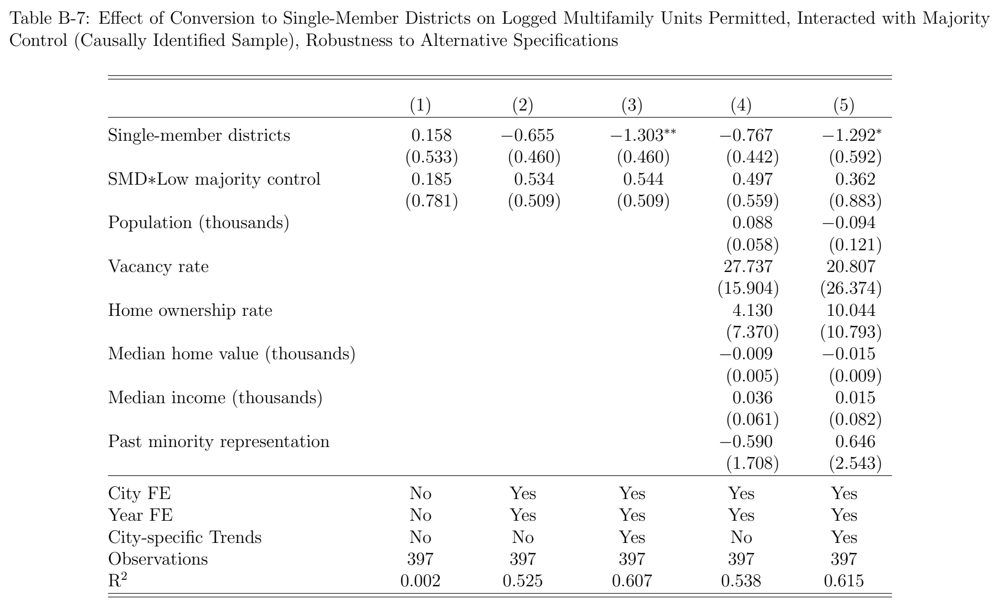

***Table B-7.*** Effect of Conversion to Single-Member Districts on Logged Multifamily Units Permitted, Interacted with Majority Control (Causally Identified Sample), Robustness to Alternative Specifications

[Download data as CSV](tables/tab-06.csv)

(1) (2) (3) (4) (5)

Single-member districts 0.158 −0.655 −1.303∗∗ −0.767 −1.292∗ (0.533) (0.460) (0.460) (0.442) (0.592) SMD∗Low majority control 0.185 0.534 0.544 0.497 0.362 (0.781) (0.509) (0.509) (0.559) (0.883) Population (thousands) 0.088 −0.094 (0.058) (0.121) Vacancy rate 27.737 20.807 (15.904) (26.374) Home ownership rate 4.130 10.044 (7.370) (10.793) Median home value (thousands) −0.009 −0.015 (0.005) (0.009) Median income (thousands) 0.036 0.015 (0.061) (0.082) Past minority representation −0.590 0.646 (1.708) (2.543) City FE No Yes Yes Yes Yes

Year FE No Yes Yes Yes Yes

City-specific Trends No No Yes No Yes

Observations 397 397 397 397 397

R2 0.002 0.525 0.607 0.538 0.615

Note: ∗p<0.05; ∗∗p<0.01; ∗∗∗p<0.001

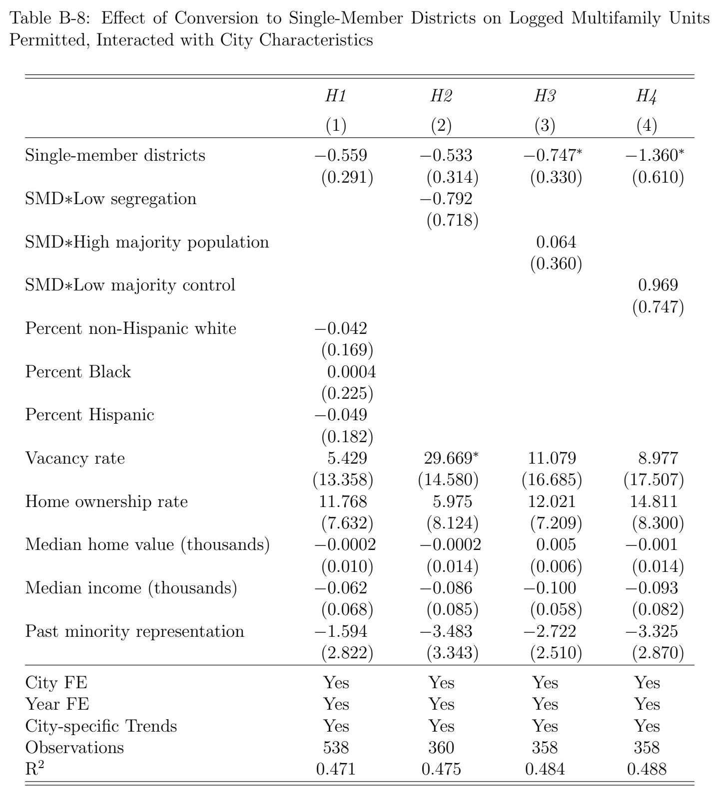

***Table B-8.*** Effect of Conversion to Single-Member Districts on Logged Multifamily Units Permitted, Interacted with City Characteristics

[Download data as CSV](tables/tab-07.csv)

H1 H2 H3 H4

(1) (2) (3) (4)

Single-member districts −0.559 −0.533 −0.747∗ −1.360∗ (0.291) (0.314) (0.330) (0.610) SMD∗Low segregation −0.792

(0.718)

SMD∗High majority population 0.064

(0.360)

SMD∗Low majority control 0.969 (0.747) Percent non-Hispanic white −0.042

(0.169)

Percent Black 0.0004

(0.225)

Percent Hispanic −0.049

(0.182)

Vacancy rate 5.429 29.669∗ 11.079 8.977 (13.358) (14.580) (16.685) (17.507) Home ownership rate 11.768 5.975 12.021 14.811 (7.632) (8.124) (7.209) (8.300) Median home value (thousands) −0.0002 −0.0002 0.005 −0.001 (0.010) (0.014) (0.006) (0.014) Median income (thousands) −0.062 −0.086 −0.100 −0.093 (0.068) (0.085) (0.058) (0.082) Past minority representation −1.594 −3.483 −2.722 −3.325 (2.822) (3.343) (2.510) (2.870) City FE Yes Yes Yes Yes

Year FE Yes Yes Yes Yes

City-specific Trends Yes Yes Yes Yes

Observations 538 360 358 358

R2 0.471 0.475 0.484 0.488

Note: ∗p<0.05; ∗∗p<0.01; ∗∗∗p<0.001

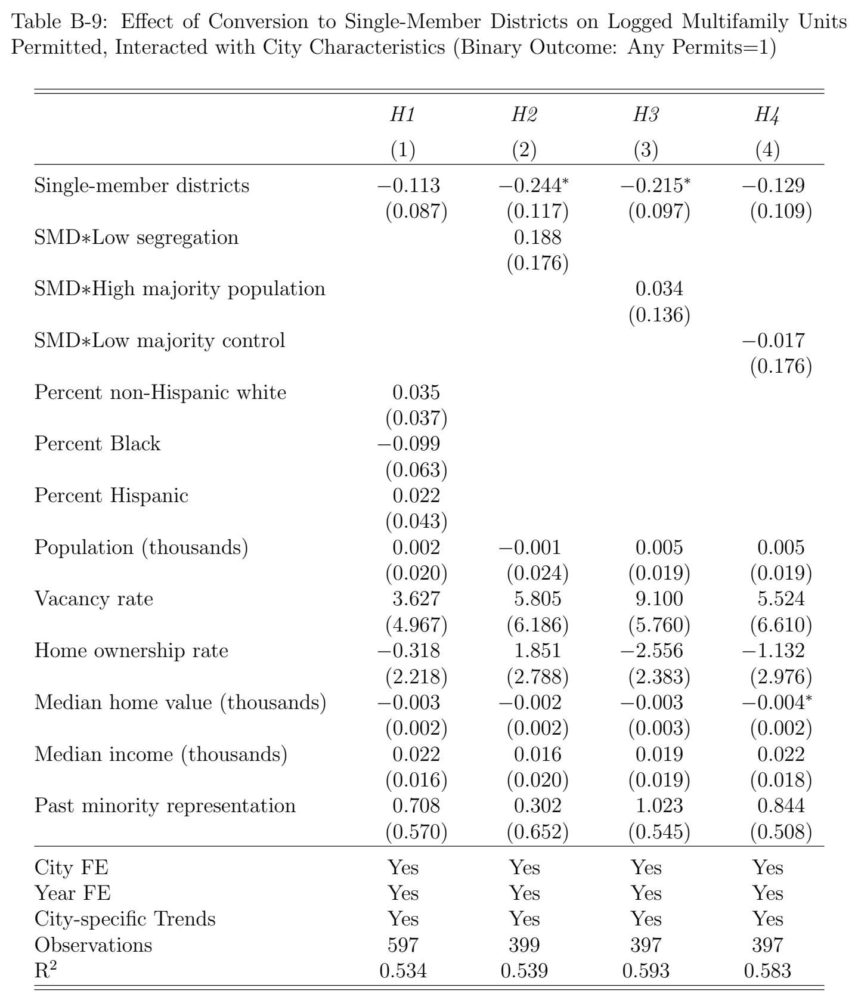

***Table B-9.*** Effect of Conversion to Single-Member Districts on Logged Multifamily Units Permitted, Interacted with City Characteristics (Binary Outcome: Any Permits=1)

[Download data as CSV](tables/tab-08.csv)

H1 H2 H3 H4

(1) (2) (3) (4)

Single-member districts −0.113 −0.244∗ −0.215∗ −0.129 (0.087) (0.117) (0.097) (0.109) SMD∗Low segregation 0.188

(0.176)

SMD∗High majority population 0.034

(0.136)

SMD∗Low majority control −0.017 (0.176) Percent non-Hispanic white 0.035

(0.037)

Percent Black −0.099

(0.063)

Percent Hispanic 0.022

(0.043)

Population (thousands) 0.002 −0.001 0.005 0.005 (0.020) (0.024) (0.019) (0.019) Vacancy rate 3.627 5.805 9.100 5.524 (4.967) (6.186) (5.760) (6.610) Home ownership rate −0.318 1.851 −2.556 −1.132 (2.218) (2.788) (2.383) (2.976) Median home value (thousands) −0.003 −0.002 −0.003 −0.004∗ (0.002) (0.002) (0.003) (0.002) Median income (thousands) 0.022 0.016 0.019 0.022 (0.016) (0.020) (0.019) (0.018) Past minority representation 0.708 0.302 1.023 0.844 (0.570) (0.652) (0.545) (0.508) City FE Yes Yes Yes Yes

Year FE Yes Yes Yes Yes

City-specific Trends Yes Yes Yes Yes

Observations 597 399 397 397

R2 0.534 0.539 0.593 0.583

Note: ∗p<0.05; ∗∗p<0.01; ∗∗∗p<0.001

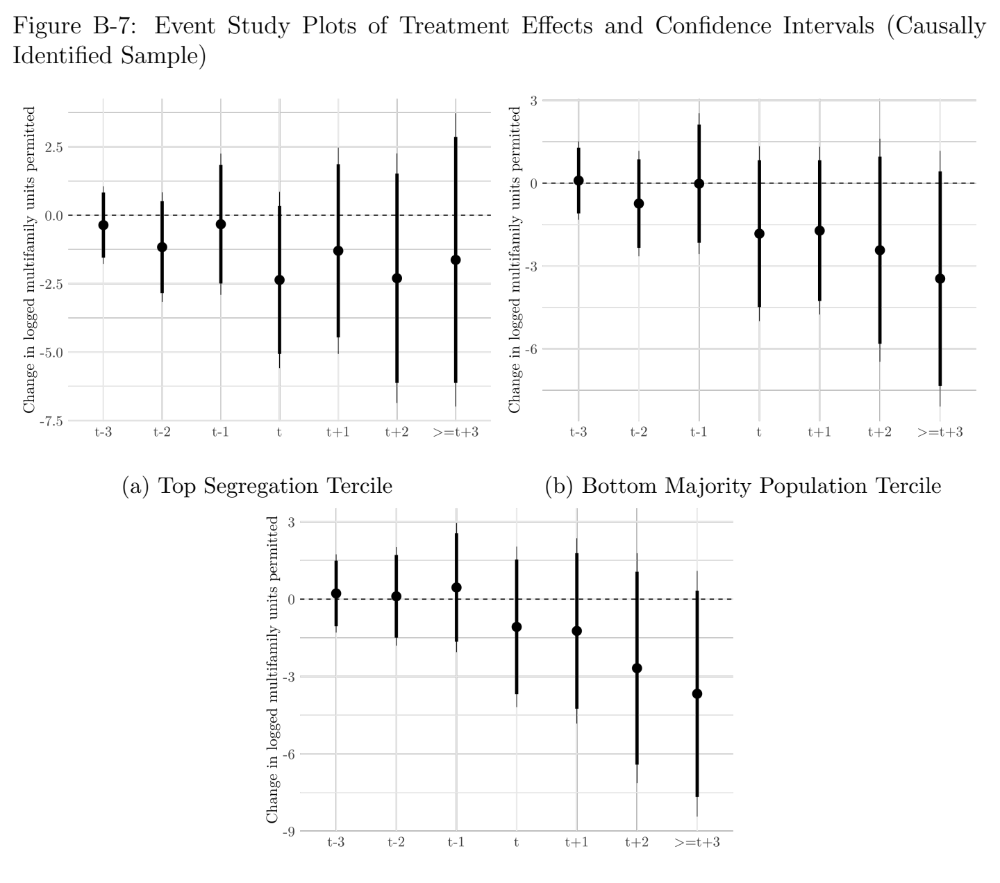

***Figure B-7.*** Event Study Plots of Treatment Effects and Confidence Intervals (Causally Identified Sample)

(a) Top Segregation Tercile (b) Bottom Majority Population Tercile

(c) Top Majority Control Tercile

Notes: Point estimates from Granger test, conducted on relevant terciles within the causally identified sample. This sample includes the 60 California cities that eventually switched to district elections and that had histories of minority underrepresentation; a minority group constituting at least 20% of the population; and a total population of over 50,000 people. Lines indicate 95% confidence intervals (thin lines) and 90% confidence intervals (thick lines).

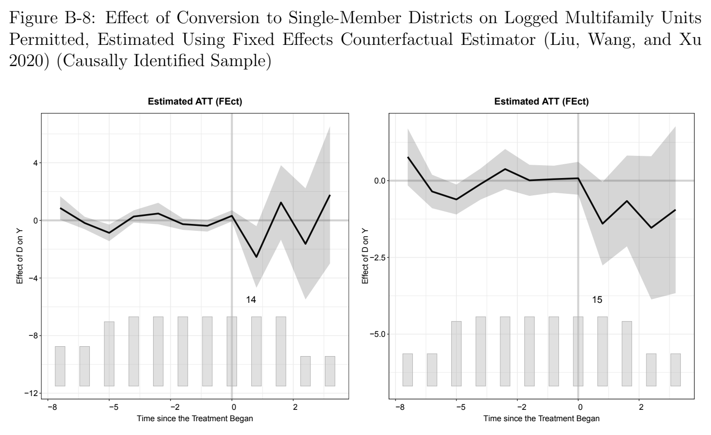

***Figure B-8.*** Effect of Conversion to Single-Member Districts on Logged Multifamily Units Permitted, Estimated Using Fixed Effects Counterfactual Estimator (Liu, Wang, and Xu 2020) (Causally Identified Sample)

−12

−8 −5 −2 0 2 Time since the Treatment Began no

fo

tceffE

Estimated ATT (FEct)

0.0

−2.5

−5.0

−8 −5 −2 0 2 Time since the Treatment Began (a) Top Segregation Tercile

no

fo

tceffE

Estimated ATT (FEct) (b) Bottom Majority Population Tercile 0.0

−2.5

−5.0

−7.5

−10.0

−8 −5 −2 0 2 Time since the Treatment Began no

fo

tceffE

Estimated ATT (FEct)

(c) Top Majority Control Tercile

Notes: Estimated treatment effects and 95% confidence intervals, conducted on relevant terciles within the causally identified sample. This sample includes the 60 California cities that eventually switched to district elections and that had histories of minority underrepresentation; a minority group constituting at least 20% of the population; and a total population of over 50,000 people.

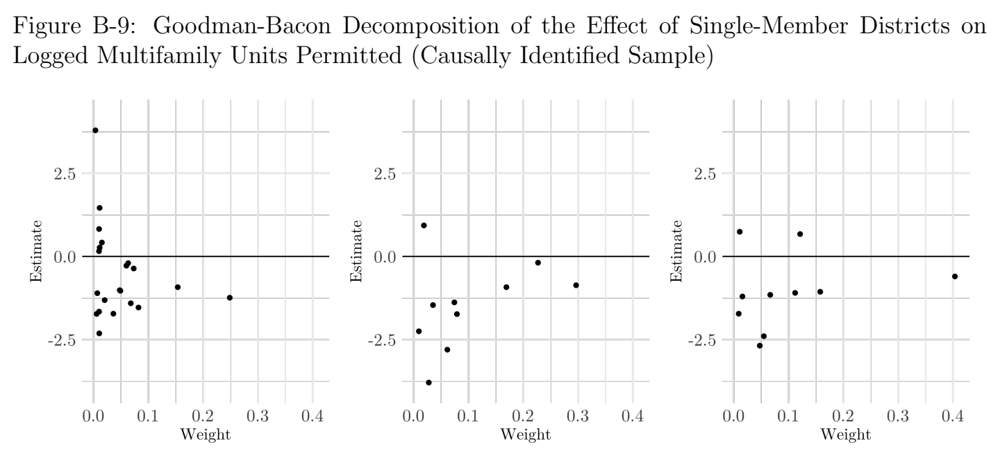

***Figure B-9.*** Goodman-Bacon Decomposition of the Effect of Single-Member Districts on Logged Multifamily Units Permitted (Causally Identified Sample)

(a) Top Segregation Tercile (b) Bottom Majority (c) Top Majority Control

Population Tercile Tercile

Notes: Models in each panel are equivalent to a fully interacted version of Table 2, where the treatment effect on which we conduct the Goodman-Bacon decomposition corresponds to the effect reported under “Singlemember districts.” Each point represents one of the difference-in-differences comparisons that constitute the overall two-way fixed effects estimate, with the weight assigned to that estimate on the x-axis. Causally identified sample includes the 60 California cities that eventually switched to district elections and that had histories of minority underrepresentation; a minority group constituting at least 20% of the population; and a total population of over 50,000 people.

## C Distributive Outcomes

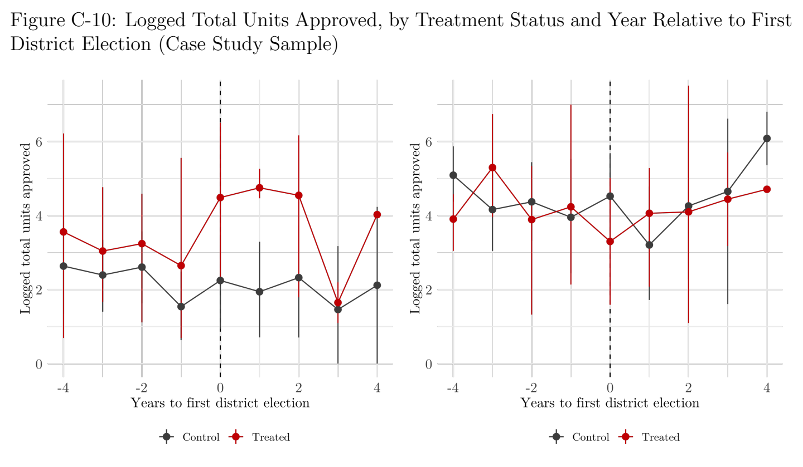

***Figure C-10.*** Logged Total Units Approved, by Treatment Status and Year Relative to First District Election (Case Study Sample)

(a) White Block Groups (b) Minority Block Groups

Notes: Points represent means of logged total units approved by treatment status and time relative to the year of a city’s first district election (represented by 0 on the x-axis); vertical lines represent 95% confidence intervals. Case study sample includes Santa Barbara, Escondido, and Anaheim (treated) and Santa Cruz, Ventura, and Glendale (control).

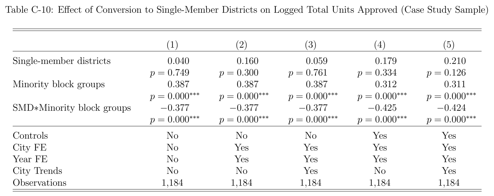

***Table C-10.*** Effect of Conversion to Single-Member Districts on Logged Total Units Approved (Case Study Sample)

[Download data as CSV](tables/tab-09.csv)

(1) (2) (3) (4) (5)

Single-member districts 0.040 0.160 0.059 0.179 0.210

p = 0.749 p = 0.300 p = 0.761 p = 0.334 p = 0.126

Minority block groups 0.387 0.387 0.387 0.312 0.311

p = 0.000∗∗∗ p = 0.000∗∗∗ p = 0.000∗∗∗ p = 0.000∗∗∗ p = 0.000∗∗∗ SMD∗Minority block groups −0.377 −0.377 −0.377 −0.425 −0.424

p = 0.000∗∗∗ p = 0.000∗∗∗ p = 0.000∗∗∗ p = 0.000∗∗∗ p = 0.000∗∗∗ Controls No No No Yes Yes

City FE No Yes Yes Yes Yes

Year FE No Yes Yes Yes Yes

City Trends No No Yes No Yes

Observations 1,184 1,184 1,184 1,184 1,184

Notes: ∗p<0.05; ∗∗p<0.01; ∗∗∗p<0.001. Case study sample includes Santa Barbara, Escondido, and Anaheim (treated) and Santa Cruz, Ventura, and Glendale (control).

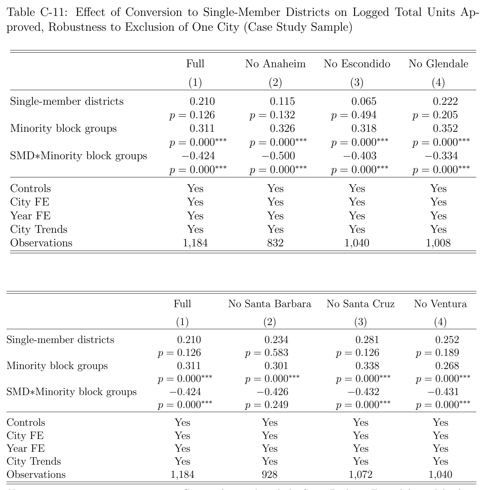

***Table C-11.*** Effect of Conversion to Single-Member Districts on Logged Total Units Ap- proved, Robustness to Exclusion of One City (Case Study Sample)

[Download data as CSV](tables/tab-10.csv)

Full No Anaheim No Escondido No Glendale (1) (2) (3) (4)

Single-member districts 0.210 0.115 0.065 0.222 p = 0.126 p = 0.132 p = 0.494 p = 0.205 Minority block groups 0.311 0.326 0.318 0.352 p = 0.000∗∗∗ p = 0.000∗∗∗ p = 0.000∗∗∗ p = 0.000∗∗∗ SMD∗Minority block groups −0.424 −0.500 −0.403 −0.334 p = 0.000∗∗∗ p = 0.000∗∗∗ p = 0.000∗∗∗ p = 0.000∗∗∗ Controls Yes Yes Yes Yes

City FE Yes Yes Yes Yes

Year FE Yes Yes Yes Yes

City Trends Yes Yes Yes Yes

Observations 1,184 832 1,040 1,008

Full No Santa Barbara No Santa Cruz No Ventura (1) (2) (3) (4)

Single-member districts 0.210 0.234 0.281 0.252 p = 0.126 p = 0.583 p = 0.126 p = 0.189 Minority block groups 0.311 0.301 0.338 0.268 p = 0.000∗∗∗ p = 0.000∗∗∗ p = 0.000∗∗∗ p = 0.000∗∗∗ SMD∗Minority block groups −0.424 −0.426 −0.432 −0.431 p = 0.000∗∗∗ p = 0.249 p = 0.000∗∗∗ p = 0.000∗∗∗ Controls Yes Yes Yes Yes

City FE Yes Yes Yes Yes

Year FE Yes Yes Yes Yes

City Trends Yes Yes Yes Yes

Observations 1,184 928 1,072 1,040

Notes: ∗p<0.05; ∗∗p<0.01; ∗∗∗p<0.001. Case study sample includes Santa Barbara, Escondido, and Anaheim (treated) and Santa Cruz, Ventura, and Glendale (control).

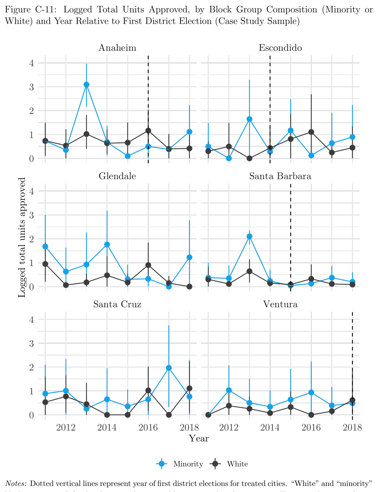

***Figure C-11.*** Logged Total Units Approved, by Block Group Composition (Minority or White) and Year Relative to First District Election (Case Study Sample)

Notes: Dotted vertical lines represent year of first district elections for treated cities. “White” and “minority” block groups are defined as being in the top and bottom terciles of percent non-Hispanic white in each city prior to treatment; block groups belonging to the middle tercile are not shown.

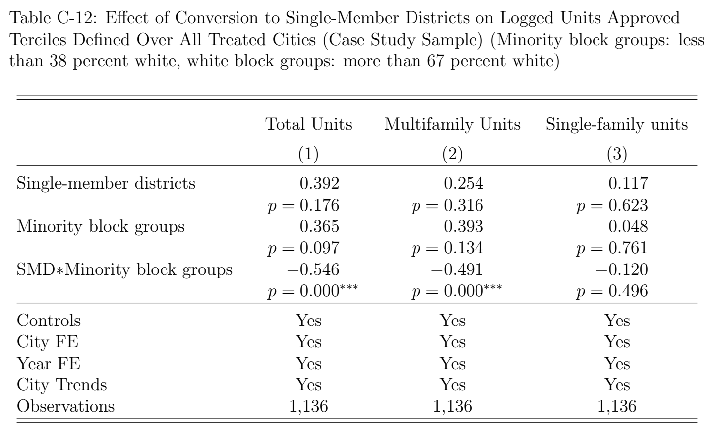

***Table C-12.*** Effect of Conversion to Single-Member Districts on Logged Units Approved Terciles Defined Over All Treated Cities (Case Study Sample) (Minority block groups: less than 38 percent white, white block groups: more than 67 percent white)

[Download data as CSV](tables/tab-11.csv)

Total Units Multifamily Units Single-family units (1) (2) (3)

Single-member districts 0.392 0.254 0.117

p = 0.176 p = 0.316 p = 0.623

Minority block groups 0.365 0.393 0.048 p = 0.097 p = 0.134 p = 0.761 SMD∗Minority block groups −0.546 −0.491 −0.120 p = 0.000∗∗∗ p = 0.000∗∗∗ p = 0.496 Controls Yes Yes Yes

City FE Yes Yes Yes

Year FE Yes Yes Yes City Trends Yes Yes Yes

Observations 1,136 1,136 1,136 Notes: ∗p<0.05; ∗∗p<0.01; ∗∗∗p<0.001. Case study sample includes Santa Barbara, Escondido, and Anaheim (treated) and Santa Cruz, Ventura, and Glendale (control).

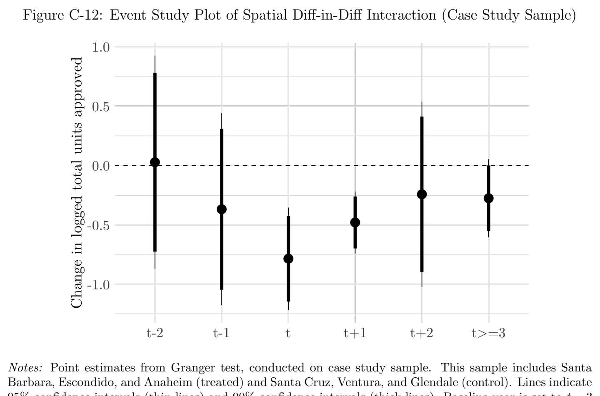

***Figure C-12.*** Event Study Plot of Spatial Diff-in-Diff Interaction (Case Study Sample)

Notes: Point estimates from Granger test, conducted on case study sample. This sample includes Santa Barbara, Escondido, and Anaheim (treated) and Santa Cruz, Ventura, and Glendale (control). Lines indicate 95% confidence intervals (thin lines) and 90% confidence intervals (thick lines). Baseline year is set to t − 3 so that every treated city has at least one pretreatment year.

### C.1 Distributive Standard Errors

The wild cluster bootstrap algorithm does not produce standard errors, so we only report p-values in Table 3. Although one could compute the standard deviation of the bootstrap distribution of the estimate, doing any kind of inference using this quantity relies heavily on an asymptotic normality assumption that is unlikely to hold when the number of clusters is small (Roodman et al. 2019). While there is not a correct approach for inference with a small number of clusters, Appendix Table C-13 shows that the patterns of statistical significance are identical whether we use the wild bootstrap, block cluster bootstrap (Bertrand, Duflo, and Mullainathan 2004), or conventional cluster-robust standard errors.

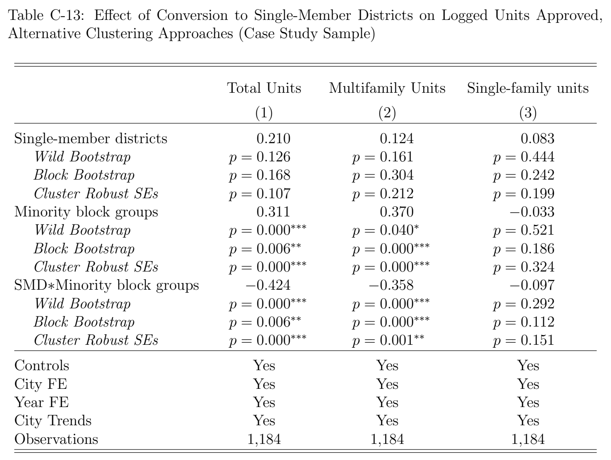

***Table C-13.*** Effect of Conversion to Single-Member Districts on Logged Units Approved, Alternative Clustering Approaches (Case Study Sample)

[Download data as CSV](tables/tab-12.csv)

Total Units Multifamily Units Single-family units (1) (2) (3)

Single-member districts 0.210 0.124 0.083

Wild Bootstrap p = 0.126 p = 0.161 p = 0.444 Block Bootstrap p = 0.168 p = 0.304 p = 0.242 Cluster Robust SEs p = 0.107 p = 0.212 p = 0.199 Minority block groups 0.311 0.370 −0.033 Wild Bootstrap p = 0.000∗∗∗ p = 0.040∗ p = 0.521 Block Bootstrap p = 0.006∗∗ p = 0.000∗∗∗ p = 0.186 Cluster Robust SEs p = 0.000∗∗∗ p = 0.000∗∗∗ p = 0.324 SMD∗Minority block groups −0.424 −0.358 −0.097 Wild Bootstrap p = 0.000∗∗∗ p = 0.000∗∗∗ p = 0.292 Block Bootstrap p = 0.006∗∗ p = 0.000∗∗∗ p = 0.112 Cluster Robust SEs p = 0.000∗∗∗ p = 0.001∗∗ p = 0.151 Controls Yes Yes Yes

City FE Yes Yes Yes

Year FE Yes Yes Yes City Trends Yes Yes Yes

Observations 1,184 1,184 1,184 Notes: ∗p<0.05; ∗∗p<0.01; ∗∗∗p<0.001. Case study sample includes Santa Barbara, Escondido, and Anaheim (treated) and Santa Cruz, Ventura, and Glendale (control).

## D Data Collection

### D.1 Aggregate Permits

The Census Bureau’s Building Permits Survey is the leading source of cross-municipality data on housing permits, surveying the over 20,000 local governments which permit 98% of US housing production. On average, 94% of units permitted are eventually completed, with the decrease in units stemming from design changes or permits abandoned (Data Relationships between Permits, Starts, and Completions 2020). Our dependent variable is units permitted because permitting is a political decision, whereas building completions are affected by exogenous factors such as internal financing. Of note, the number of observations in our panel models falls below 600 and 400 because two of the cities in our causally identified sample were incorporated early in the panel. Eastvale was incorporated in 2010 and entered our panel in 2011. Jurupa Valley was incorporated in 2011 and entered our panel in 2012.

### D.2 Electoral Institutions

We assembled an original panel dataset of city council structures from 2010 through the present for the 482 Census-designated places in California. We began by coding all of these cities as at-large, except for the 59 cities identified by California Common Cause to be by-district as of 2016 (https://www.commoncause.org/california/wp-content/ uploads/sites/29/2018/03/california-municipal.pdf). For each of these cities, we used internet searches to learn the year of their first district election. To find all subsequent conversions to districts under the CVRA, we used a combination of internet searches, city council websites, local media reports, and interviews (see section D.4 below). For each city that converted, we collected the following information:

• Year of decision to convert

• Year of first district election

• Reason for conversion (lawsuit, threat letter)

• Method of conversion (court order, council resolution, or ballot initiative)

• Plaintiff/source of threat letter

### D.3 Estimating Candidate Ethnicities

CEDA’s data only includes names, not ethnicities, of candidates, so we coded the ethnicity of candidates using the wru package in R (Imai and Khanna 2021). This package uses data from the U.S. Census to compute the probability that a person is of a given ethnicity given their last name and county of residence. Similar prediction procedures are known to have higher error rates for women and Blacks, but this should not pose a major issue for our analysis. Latinos and Asians constitute the vast majority of the nonwhite population

across most cities in our sample. As for women, Imai and Khanna (2016) point out that their method is biased only if surname is correlated with location or personal attributes, including the rate of interracial marriage and the likelihood of changing one’s last name after marriage. For instance, as long as white and nonwhite women are equally likely to marry someone of a different ethnicity, and to change their last names when doing so, the misclassification of white women as nonwhite and vice-versa should only introduce random noise, but no bias, into our coding of city council members’ ethnicities.

### D.4 Interviews with Key CVRA Stakeholders

We conducted a site visit to Southern California in January 2020 to talk to key stakeholders in CVRA litigation, local government, and housing politics. Their names, locations, and titles are given in Table D-14.

Excerpts from Conversation with Thomas Saenz, President and General Counsel of MALDEF (January 13, 2020)

What informed your selection of cities in which to pursue legal action under the CVRA?

“There’s no hard and fast rule, but we had to use some general criteria that include size of the jurisdiction and our ability to draw a majority Latino district. We have generally not challenged anyone under 25,000 in population, and our goal has been to focus on those that are over 50,000 in population. I think there are circumstances that apply in smaller jurisdictions that don’t necessarily apply in larger jurisdictions. In small jurisdictions — and this is my personal view — there is a greater justification for an at-large system. If a city’s so small that you don’t see the distinction between neighborhoods that you see in larger jurisdictions, where the wealthier neighborhood ends up, wholly apart from race, having all the city council or governing body coming from one neighborhood — that’s a little bit less likely to occur when it’s a much smaller jurisdiction. We have also insisted on the ability to draw a Latino majority CVAP (Citizen Voting Age Population) district — a compact district, we’re not going to pursue something where you can only draw a Latino district with spindles in different directions...We also look at electoral history. If there have been Latinos consistently elected, we won’t even do an RPV (racially polarized voting) analysis and we will forego that jurisdiction for the moment.”

Why did it take a couple years since the passage of the CVRA to see litigation take off?

“I can only speak for MALDEF: things were going on that kept us very busy in the early years. Then I left, and litigation was more or less consciously downplayed by the leadership at the time, first for philosophical reasons, and ultimately for a mix of philosophical and financial reasons. I came back in 2009 and it took a little time to get a system up and running, but now we have a very good, comprehensive system to identify jurisdictions and move forward in systematically challenging at-large systems at the local level.”

Table D-14: Stakeholders Interviewed During Site Visit to Southern California, January 2020 Name City Position

City Council

Jose Moreno Anaheim City council member

Denise Barnes Anaheim City council member

Danny Fierro Anaheim Policy aide to city council member Jordan Brandman Grant Henninger Anaheim Candidate for city council Paul McNamara Escondido City council member and current mayor

Consuelo Martinez Escondido City council member

Olga Diaz Escondido City council member

Ardy Kassakhian Glendale City council member

Ara Najarian Glendale City council member and current mayor

Mike van Gorder Glendale Candidate for city council Maegan Harmon Santa Barbara City council member

Oscar Gutierrez Santa Barbara City council member

Kristen Sneddon Santa Barbara City council member

Eric Friedman Santa Barbara City council member

Jeanette Sanchez-Palacio Ventura Candidate for city council

Planning Commissioners and Urban Planners

Steve White Anaheim Planning Commission member John Armstrong Anaheim Planning Commission member Mike Strong Escondido Planning Commission member Jeffrey Lambert Ventura Planning Commission member Alex McIntyre Ventura City Manager

Sandy Smith Ventura Former Mayor and Land Use Consultant, Sespe Consulting John Hecht Ventura Land Use Consultant, Sespe Consulting

Shine Ling Los Angeles∗ Urban Planner

Plaintiffs and Lawyers Involved in CVRA Litigation

Thomas Saenz Los Angeles President and General

Counsel, MALDEF

Lydia Camarillo San Antonio, TX∗ President, SVREP

Kevin Shenkman Malibu∗ Attorney for several CVRA plaintiffs & threat letters

Sebastian Aldana, Jr. Santa Barbara Plaintiff, CVRA lawsuit

against City of Santa Barbara

Frank Banales Santa Barbara Plaintiff, CVRA lawsuit

against City of Santa Barbara

Barry Capello Santa Barbara Attorney for plaintiffs, CVRA lawsuit against City of Santa Barbara ∗ Conversation conducted by phone.

Name City Position

Community Organizers, Activists, and Interest Groups

Ada Bricen˜o Anaheim Labor leader/Chair, Democratic Party of Orange County

Catherine Jurca Glendale Member, Glendale Historical

Society Board of Directors

Lee Moldaver Santa Barbara Board Member, Citizens Planning Association of Santa Barbara County Vijaya Jammalamadaka Santa Barbara President, League of Women

Voters of Santa Barbara

Pedro Paz Santa Barbara Board Member, The Fund for

Santa Barbara

Anna Marie Gott Santa Barbara Local Activist

Lucas Zucker Ventura Policy and Communications Director, CAUSE

Writers and Journalists

Spencer Custodio Anaheim Reporter, Voice of OC

Bill Fulton Ventura Urban planner and former mayor

of Ventura, CA

### D.5 Zoning Amendments

To geocode increases in buildable capacity within cities, we reviewed the meeting minutes of the two bodies which control the discretionary review of new housing proposals: the planning commission and city council. We begin with minutes from 2011, as Census block group boundaries will be stable post-2010. This allows enough time to establish pre-trends within our treated cities. For each proposal, we recorded the street address, total units, and the divide of units between single-family and multifamily housing.

As political outcomes, our goal was to identify the year the proposal emerged from the discretionary process. This year may be different from the year of construction and even different from the year of the final permit, as the final permit may rely on a back and forth the discretionary body about design details even after the number of units has been approved. To identify this year of final discretionary review, we first check if the city council voted on the project. Any lower board decisions can be appealed to city council, meaning the voice of the city council is the most important discretionary hurdle. If city council does vote on the project, we use the year of the city council vote. If city council does not vote on the project, we used the year of the last density-based discretionary approval by the planning commission.

Occasionally, a city will make a change to their overall zoning code by amending the General Plan. Such changes affect a swath of the city, potentially many neighborhoods and thousands of individual parcels. While these zoning changes (or “rezonings”) may not become reality until a decade into the future, they are politically meaningful increase in the

capacity to build by-right. As a result, we code each rezoning by its increase in buildable capacity. Because the overlap between block groups and upzoned neighborhoods is not perfect, this process involves discretion in allocating upzoned units across multiple block groups. Still, we believe we have generated the most accurate multi-city representation of changes in allowable density over the past 8 years.

There are several types of residential proposals we do not include. First, we do not collect data on renovations nor conversions of apartments to condominiums. The legalization of existing illegal units is coded, as legalization is similar enough to building a new unit. Additionally, we include proposals by commercial enterprises seeking to designate part of their existing structure as residential. Finally, we do not collect data on permits approved by the staff of the city’s planning division. These projects are less vulnerable to discretionary approval and often are only reviewed for conformance with existing code.

Ultimately, the data we collect represent the corpus of permits that were approved by passing through the political gauntlet of discretionary review. These data capture the output of permits that should be most directly affected by the change in representation from district elections.