# The Voters’ Veto: Local Racial Demographic Change and Exclusionary Behavior

### Michael Hankinson

### May 27, 2026

Abstract

As Western democracies diversify, racial threat risks activating exclusionary attitudes among members of the majority. While research has focused on support for immigration restrictions, local housing policy is the primary means of maintaining racial segregation in the US. Using referendum vote share from over 3,700 precincts in Los Angeles County, I show that an increase in the local non-white population is associated with greater behavioral support for direct democratic control over affordable housing. I argue that this “voters’ veto” is valued for excluding low-income, predominantly nonwhite residents from one’s community. This relationship exists across majority white, Black, and Latino precincts, demonstrating that exclusionary reactions are not limited to racial threat among the majority. Instead, a shrinking white population may signal shared concerns about neighborhood trajectory. Given local conditions can shape po-

litical beliefs, these findings provide a local mechanism for the shift of both white and

minority voters towards exclusionary political movements.

Word Count: 4,578 words (excluding references)

Keywords: demographic change, local politics, housing, segregation, direct democracy For helpful feedback and advice, I thank in alphabetical order: Brandon Bartels, Justin de Benedictis- Kessner, Hanno Hilbig, Martin Vinæs Larsen, Asya Magazinnik, Melissa Sands, Andrew Thompson, Omar Wasow, Chris Warshaw, Salih Yasun, and workshop participants at the National Capital Area Political Science Association, the GWU American Politics Workshop, and the UC-Berkeley Housing Politics and Policy Conference. I also appreciate the research assistance of Loralei HoJay. Special thanks to Ryan Enos, Aaron Kaufman, and Melissa Sands for sharing their data.

∗Assistant Professor, Department of Political Science, George Washington University. 2115 G St NW, Washington, DC 20052. hankinson@gwu.edu. ORCiD: 0000-0003-4099-2633.

The United States and other Western democracies are rapidly racially diversifying, largely due to immigration (Frey 2018). According to theories of racial threat, a growing minority population may present an economic, cultural, and political threat to the majority group (Blalock 1967; Blumer 1958), eliciting exclusionary attitudes and behaviors among its members (Craig, Rucker and Richeson 2018; Kaufmann and Goodwin 2018). However, three overlapping limitations have hampered theory in this space.

First, researchers have focused on the exclusionary responses of non-Hispanic whites (e.g., Abrajano and Hajnal 2015; Fouka and Tabellini 2022; Outten et al. 2012; Reny and Newman 2018; Sahn 2025), risking a majority-minority dichotomy that overlooks the motivations of Black, Latino, and Asian voters. Where minority attitudes have been examined, research has largely relied on static distributions of group size rather than the dynamic process of demographic change (e.g., Bobo and Hutchings 1996; Gay 2006; Oliver and Wong 2003). Second, work on demographic change has measured either attitudes or behaviors that only indirectly shape policy—turnout and candidate choice (e.g., Enos 2016; Newman, Shah and Collingwood 2018; Hill, Hopkins and Huber 2019)—rather than direct behavioral support for exclusionary policy itself. Third, studies that do measure policy preferences emphasize national outcomes like immigration (e.g., Enos 2014; Hopkins 2010), even though a voters’ local exposure to demographic change in the U.S. is heavily shaped by municipal zoning. “Exclusionary zoning” establishes a local price floor that blocks lower-income, disproportionately non-white residents (Einstein, Glick and Palmer 2020; Rothwell and Massey 2009; Trounstine 2020). The few studies linking demographic change to local exclusionary policy focus on citywide institutional outcomes attributable to white homeowners (e.g., Newman 2013; Sahn 2025), leaving the more recently diversifying communities under-examined.

I address these limitations using a California law known as “Article 34” which requires any new “low-rent” housing project to win majority approval at municipal ballot.1 Article 34 transferred decision-making over affordable housing from city councils to local electorates, 1Though initially targeted towards public housing, “low-rent housing” has been interpreted to include any housing in which 50% or more of the units are government-subsidized.

and the California legislature has tried three times to repeal it via statewide vote (1974, 1980, 1993). The 1993 effort offers a rare opportunity to observe voters’ behavioral support for an exclusionary policy tool: direct veto power over new affordable housing.

Using returns from 3,718 precincts across Los Angeles County, I find that a standard deviation increase in a precinct’s non-white population from 1980 to 1993 is associated with a 4.5 percentage point (d = .32) increase in support for this “voters’ veto.” Results are similar when change is operationalized as a proportion, and are not explained by changes in density, residential churn, median income, or percent foreign born. This exclusionary response emerges in majority white, majority Black, and majority Latino precincts alike. If anything, the response to a declining local white population is larger in non-white precincts, and is not driven by a decline in any minority group’s own size. To address the possibility that new voters rather than incumbent residents drive the result, I show that among precincts with minimal residential churn and minimal demographic change of their own, spatial proximity to a rapidly diversifying neighborhood predicts higher support for the voters’ veto (+3.5 points, d = .24).

Together, these findings suggest that exclusionary reactions to local demographic change are not limited to the traditionally understood majority group (i.e., whites in the U.S.), nor reducible to intergroup competition. Instead, a shrinking white population may signal shared concerns about a neighborhood’s political, economic, and social trajectory, what Pattillo- McCoy (1999, p. 6) describes as middle-class Black neighborhoods working to “fortify” themselves against encroachment from poorer communities. The implications are twofold. As minorities increasingly move to suburbs (Badger, Bui and Gebeloff 2019), voters across racial backgrounds may protect existing exclusionary zoning, deepening the affordability crisis. And given that local conditions shape social identities and partisanship (e.g., Cramer 2016; Larsen et al. 2019; Ternullo 2024), the local mechanism documented here may help explain the broader movement of Latino, Asian, and Black voters in high-immigration areas toward more exclusionary political coalitions (Cai and Fessenden 2020; Fraga, Velez and

West Forthcoming).

## Direct Democracy as an Exclusionary Institution

Direct democracy in the United States has long enabled voters to bypass legislative processes via ballot measure (Gerber 2011), and at the state and local level it has frequently been used to perpetuate housing segregation. In a 1964 California statewide election, voters in predominantly white cities near diversifying areas were more likely to support a measure permitting racial discrimination by sellers, landlords, and real estate agents (Reny and Newman 2018). Once de jure segregation was prohibited, voters constructed economic barriers instead: single-family zoning sets a minimum price of residency, and municipalities near center cities that received greater mid-century Black migration were more likely to adopt it (Sahn 2025; Trounstine 2018). This use of policy to economically “defend” one’s community is known as “exclusionary zoning” (Einstein, Glick and Palmer 2020).

I focus on one such tool: direct democratic control over affordable housing. While the institution appears race-neutral, its origins underscore the tension between racial demographic change and the voters’ veto. Following the Housing Act of 1949—which promised 810,000 new units alongside the Second Great Migration—residents in the Northern California city of Eureka spearheaded a constitutional amendment letting voters stop their local housing authority from building low-income housing (Cavin 2019; Varian 2022). Partnering with the California Real Estate Association, the campaign pitched the amendment as essential to countering “minority pressure groups” and preserving white neighborhoods (Staff 2019), while the official voter guide framed it as a vote “neither for nor against public housing” but for “the democratic process of government” (Voter Information Guide for 1950, General Election 1950). The amendment passed narrowly, and by 1968 voters had rejected nearly half of all proposed public housing statewide—roughly 15,000 units—with many agencies shelving projects rather than risk a vote (Cavin 2019). The U.S. Supreme Court upheld

Article 34, finding: “This procedure ensures that all the people of a community will have a voice in a decision which may lead to large expenditures of local revenues. It gives them a voice in decisions that will affect the future development of their own community” (James v. Valtierra, 402 U.S. 137 (1971)). At the justices’ private conference, Chief Justice Warren Burger allegedly scoffed at the plaintiff’s claims, framing their argument as a suggestion that “too much democracy violates the Equal Protection Clause” (Cavin 2019).

Subsequent repeal attempts at the ballot box failed in 1974 and 1980, with pro-Article 34 campaigns emphasizing taxes and local democracy rather than race. By the third repeal effort in 1993, public commentary connected Article 34 to community character and quality of life. State Assembly Member Gebe Ferguson, for example, framed support for the voters’ veto as unrelated to race and shared across racial lines, claiming that “low-income black communities don’t want low-income housing built in their communities either” (Martinez 1993). While Ferguson likely extrapolated about Black preferences, affordable housing has been historically stigmatized through stereotypes about its occupants (Tighe 2010). If voters view direct democracy over housing as a means to exclude poor minority residents, then the veto power granted by Article 34 would be a valuable backstop against not just affordable housing, but local racial demographic change.

What shapes voter support for direct democracy? Voters are often only “weakly principled,” caring more about policy outcomes than process (Prothro and Grigg 1960), and so may protect direct democracy when they believe it will produce their preferred outcomes. A primary threat to a majority group’s preferred outcomes is demographic change, which can threaten the status quo power structure (Blalock 1967; Blumer 1958) and generate a broad anxiety over the loss of economic, cultural, and political power (e.g., Abrajano and Hajnal 2015; Thompson 2023). Absent the conditions for positive intergroup contact (Allport 1954),

a sudden increase in the local non-white population is therefore expected to elicit a desire among white voters to retain direct democracy as a means of ensuring exclusionary policy. Demographic change can occur at national, regional, or local scales, with each plausibly evoking different mechanisms (e.g., identity and federal politics; media coverage and crime; home values and neighborhood trajectory). Local change should most closely drive exclusionary behavior in the case of Article 34, where the policy lever itself is local.

### Demographic Change in Los Angeles County, 1993

From 1980 to 1993, Los Angeles County saw little growth in its Black population but large increases in Latino migration and a proportionally large increase in Asian migration. Simultaneously, the non-Hispanic white share fell from 53 to 38 percent, and the median Los Angeles County voter experienced a 14 percentage point (54 percent) increase in their precinct’s non-white population. For racial threat to operate, voters must perceive these changes (Hopkins 2009; Wong 2007). A 1992 survey found that 56 percent of Los Angeles County residents felt their neighborhood was changing ethnically (Bobo and Zubrinsky 1996). Because Latino and Asian arrivals concentrated in historically Black areas (Bergesen and Herman 1998), Black residents were the most likely to perceive change (78 percent).

Local demographic change may drive exclusionary behavior through two pathways. The first is concern about what a shrinking white share signals for one’s neighborhood. Members of many racial groups show some ingroup preference (Charles 2006; Farley et al. 1994; Krysan et al. 2009), but there may also be a shared preference for white neighbors rooted in concerns over political and socioeconomic trajectory. For example, white constituents tend to receive better representation, responsiveness, and public goods from local government (e.g., Hankinson and Magazinnik 2023; Schaffner, Rhodes and La Raja 2020). Contemporaneous evidence is supportive. Charles (2006)’s Los Angeles Study of Urban Inequality, fielded in 1992–1993, found a consistent racial rank-ordering of preferred out-group neighbors across racial groups, with whites always most preferred and Blacks least preferred—even among

non-white respondents. Pattillo-McCoy (1999, p. 6) similarly describes middle-class Black families working to “fortify their neighborhoods against this encroachment” from poorer, predominantly minority areas.

The second pathway is perceived competition among racial groups for space and resources (Bobo and Hutchings 1996; Gay 2006; McClain and Karnig 1990). Charles (2006, p. 164) finds that Black Angelenos’ preferences for Asian neighbors are negatively shaped by the belief that Asians pose a competitive economic and political threat. This tension was acute in early 1990s Los Angeles. Eighteen months before the 1993 Article 34 vote, the acquittal of four officers in the Rodney King beating triggered rioting concentrated in South Central and Koreatown, in which Black and Latino rioters targeted the Korean community amid resentment over labor-market competition and political underrepresentation (Johnson Jr and Farrell Jr 1992). Bergesen and Herman (1998) attribute the intensity of the riots specifically to neighborhood racial succession, with areas of greatest demographic change exhibiting the highest violence.

In short, while existing literature largely associates racial demographic change with racial threat among white voters, local change may also provoke exclusionary behavior among non-white voters—either through shared concerns about what a shrinking white population implies for a community’s trajectory, or through perceived competition with arriving minority groups. Through both pathways, increases in the local non-white population may drive support for the voters’ veto across racial backgrounds.

## Internal Demographic Change

I use two analytical strategies. First, I assess the link between internal precinct demographic change from 1980 to 1993 and support for repealing Article 34 in November 1993. Second, I subset to precincts that experienced minimal residential churn and were racially stable over the period, and measure the relationship between spatial proximity to a rapidly diversifying

Census tract and support for repealing the voters’ veto. Results are substantively similar across both strategies, and exclusionary responses appear in majority Black and majority Latino precincts as well as majority white ones.

### Data

I combine precinct-level returns from the 1993 election with tract-level Census data to generate 3,718 precinct observations in Los Angeles County. Los Angeles is the only county for which I located a contemporaneous voter file—common resources lack precinct returns and digitized boundaries from this period—but it provides a uniquely dense multiracial context and, with 9 million residents in 1993, a substantively meaningful share of California’s electorate. Because no shapefile of 1993 precinct boundaries exists, I use Enos, Kaufman and Sands (2019) geocoded 1992 voter file to allocate tract-level Census quantities (Manson et al. 2022) to precincts in proportion to each precinct’s share of tract voters.

Dependent Variable The dependent variable is the precinct-level vote share supporting the voters’ veto—that is, the complement of support for repealing Article 34. The weighted mean was 55.4 percent in favor of the veto power. Figure B-1 shows that support was concentrated outside the more urbanized parts of the county, and tracks party registration (Figure B-2).

Independent Variables The treatment is local racial demographic change in the leadup to the 1993 election. Because the election predates the American Community Survey, I linearly interpolate between the 1990 and 2000 Censuses to estimate 1993 values. I operationalize change in two ways—percentage point change and proportion change—because theory does not privilege one; the two are correlated at 0.65 and capture related but distinct aspects of demographic turnover (Section C). The population-weighted median precinct saw a 14 percentage point (54 percent) increase in non-white population over the period. Because aggregating tracts into precincts introduces measurement error that compounds across the

two time points, I winsorize the treatment at the 5th and 95th percentiles; non-winsorized results are substantively identical (Table H-9).

### Empirical Strategy

I regress precinct-level vote share supporting the voters’ veto on the 1980–1993 change in non-white population, with both treatments standardized for comparability. The identifying assumption is selection on observables. The granularity of within-county variation rules out shift-share approaches, which require county-level migration data (Borusyak, Hull and Jaravel 2025).

All models include 1980 pretreatment controls for percent non-Hispanic white, homeownership rate, vacancy rate, log median household income, population density, and unemployment rate—observable conditions that may be associated with both subsequent racial change and contemporaneous economic anxiety. Results are substantively identical when I additionally include the 1980–1993 change in each control (Table D-1), though such timevarying controls risk post-treatment bias if they are themselves affected by the demographic change (Sen and Wasow 2016). I include Census place fixed effects to absorb time-invariant place attributes, weight by precinct population, and cluster Huber-White standard errors at the place level to account for correlated treatment within places.

### Results

Table 1 reports the main estimates. A standard deviation increase in the percent non-white population (+10.4 percentage points) is associated with a 4.5 point (d = .32) increase in support for the voters’ veto; a standard deviation increase as a proportion change (+54.2 percent) is associated with a 3.4 point (d = .24) increase. Two concerns about the strategy warrant comment. First, omitted variables may be spatially correlated, and the proximity design (below) presumes outcomes are affected by nearby tracts, both violations of SUTVA. A spatial Durbin error model accounting for spillovers and spatial autocorrelation in the errors

Support for voters’ veto, 1993 Model 1 Model 2 Pct. point ∆ in non-white pop. 0.045∗∗∗

Prop. ∆ in non-white pop. 0.034∗∗∗ Pct. white, non-Hispanic (1980) 0.067 0.055 Pct. unemployed (1980) −0.517∗∗∗ −0.670∗∗ Pct. homeowner (1980) 0.137∗∗∗ 0.123∗∗ Pct. vacant (1980) −0.303∗∗ −0.274∗ Log median household income (1980) 0.010 −0.004 Pop. density (1980) −6.040∗∗∗ −5.367∗∗∗ City FE Yes Yes R2 0.751 0.723 Adj. R2 0.740 0.711 Num. obs. 3651 3651

RMSE 2.556 2.694 N Clusters 142 142

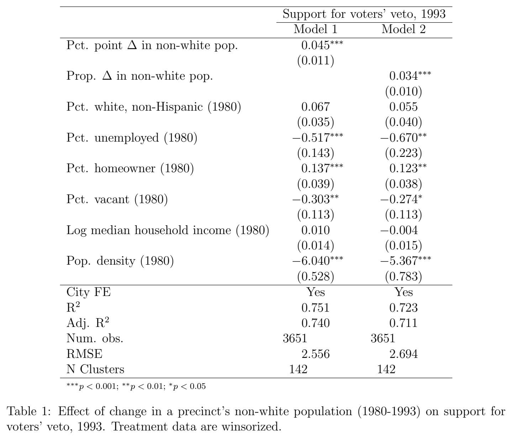

***Table 1.*** Effect of change in a precinct’s non-white population (1980-1993) on support for voters’ veto, 1993. Treatment data are winsorized.

[Download data as CSV](tables/tab-01.csv)

yields substantively similar, statistically significant estimates (Section E). Second, several alternative correlates of racial turnover do not explain the result: precinct-level changes in population density, residential churn, and percent foreign born are not consistently associated with support for the voters’ veto (Tables G-5, G-6, G-8), and while a decrease in median household income is associated with greater support, its magnitude is roughly half that of racial change (Table G-7). Two alternatives I cannot directly test are local crime—for which neighborhood-level data prior to 2000 are unavailable—and within-municipality fiscal-policy concerns, the latter of which is unlikely to explain results given place fixed effects.

### Mechanisms by Racial Groups

If the relationship reflects racial threat as conventionally theorized, it should be concentrated in majority white precincts. To test this, I interact the treatment with indicators for whether a precinct was majority white, majority Black, or majority Latino in 1980 (372 majority Black and 401 majority Latino precincts; majority Asian precincts, n = 8, lack statistical power for separate estimation).

Figure 1 shows the opposite of the standard racial-threat prediction. Majority Black and Latino precincts exhibit increases in support for the voters’ veto that are at least as large aa those in majority white precincts. The exclusionary response to a declining local white population is not confined to majority white precincts.

Two further tests sharpen the mechanism. First, I estimate the association of an increase in each minority group separately, including all groups simultaneously with lagged 1980 levels (Figure 2). Percentage point increases in each non-white group are associated with higher support for the voters’ veto, while the proportion-change association appears driven by Latino growth—consistent with the possibility that precincts losing white residents over this period were also seeing the largest proportional Latino gains, though the simultaneity makes group-specific estimates difficult to interpret. Second, I test whether majority Black and Latino precincts respond to a decline in their own group’s share, as a group-threat account

Sd. pct. point change

Sd. proportion change

0.0 0.1 0.2

Estimate

tnemtaerT

Race/Ethnic Group Majority Precinct All Non-White

Latino

Black

White

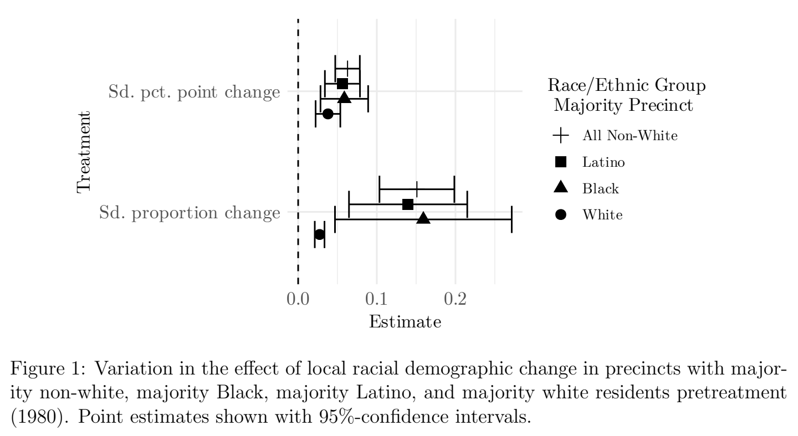

***Figure 1.*** Variation in the effect of local racial demographic change in precincts with major- ity non-white, majority Black, majority Latino, and majority white residents pretreatment (1980). Point estimates shown with 95%-confidence intervals.

among minorities would predict. They do not (Tables D-2 and D-3). Only a decline in the local white share is associated with greater support for the voters’ veto. Together, these subgroup analyses suggest that voters across racial backgrounds may share concerns about the political and socioeconomic trajectory of a neighborhood as its white share shrinks, rather than responding to threats to their own group’s standing.

## Proximity to Demographic Change

One threat to the within-precinct results is compositional. Support for the voters’ veto may be rising in diversifying precincts not because incumbent voters are responding, but because new voters are arriving. Two pieces of context make this unlikely. First, precincts with more non-white voters on average show lower support for the voters’ veto (Figure B-3), so new non-white arrivals would have to be voting against type to drive the result. Second, exit in response to local demographic change is more likely among the least racially tolerant—the voters most supportive of the veto. If anything, compositional change should attenuate the observed relationship.

Sd. pct. point change Sd. proportion change

Other

Race/Ethnic Group Asian Other Asian

Latino Latino Black

Black

0.00 0.25 0.50 0.75 1.00 0.00 0.02 0.04

Estimate

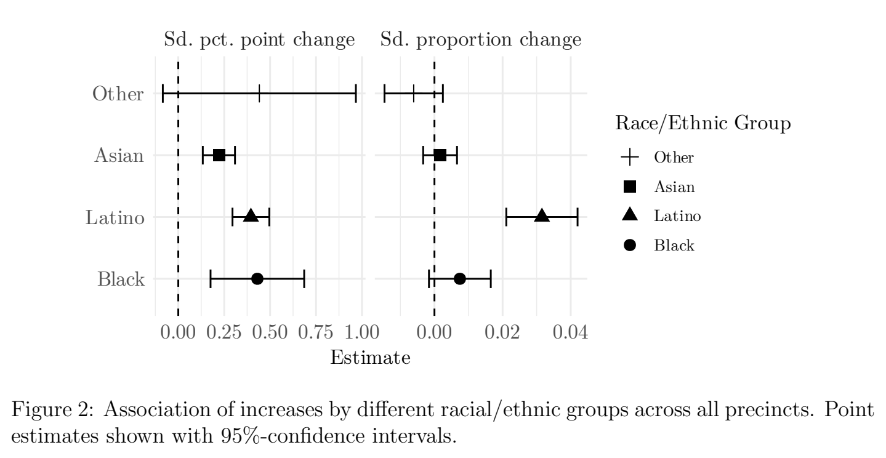

***Figure 2.*** Association of increases by different racial/ethnic groups across all precincts. Point estimates shown with 95%-confidence intervals.

To address this concern directly, I use a second identification strategy that does not rely on within-precinct racial change as the treatment. Following Reny and Newman (2018), I measure each precinct’s proximity to a rapidly diversifying Census tract. Among racially stable, low-churn precincts, those closer to diversifying neighborhoods were more supportive of the voters’ veto than those farther away—evidence that residential turnover is unlikely to explain the results in the previous section.

### Data and Empirical Strategy

Using the same precinct data, I calculate each precinct’s proximity to a “diversifying tract“: a Census tract whose non-white population share increased substantially from 1980 to 1993. Defining “substantial” involves a trade-off, since too low a threshold may capture imperceptible change and too high a threshold sacrifices statistical power. My main specification defines diversifying tracts as those above the 90th percentile of non-white population increase — a >27 percentage point increase, or a >127 percent proportional increase. Results are substantively similar at the 85th and 95th percentiles (Tables I-10 to I-13). To ensure changes are likely to be perceptible, I subset to tracts above the bottom tercile of popula-

tion (>3,136 residents); Figure C-7 maps the resulting set under both definitions. Census tract boundaries do not perfectly match perceived neighborhoods (Wong 2007), but they are stable over time and the standard unit in studies of neighborhood racial change (Lee et al. 2008).

Proximity is the negative distance between each precinct’s centroid and its nearest diversifying tract, standardized so the treatment is a standard deviation increase in proximity (approximately 3.5 kilometers). I regress precinct vote share supporting the voters’ veto on proximity, with the same 1980 pretreatment covariates as the previous design (percent non-Hispanic white, homeownership rate, log median household income, vacancy rate, unemployment rate, and population density) Census place fixed effects, population weights, and Huber-White standard errors clustered at the level of the nearest diversifying tract.

### Results

To isolate exposure to nearby change from within-precinct change, I subset to precincts in the bottom tercile of both residential churn and own racial change from 1980 to 1993. In these precincts, the non-white population rose by less than 6.5 percentage points (median +3 points) under the percentage-point definition, or less than 27 percent (median +4 percent) under the proportional definition.

Table 2 reports the results. Among these minimally changing precincts, a standard deviation increase in proximity to a diversifying tract is associated with a 3.5 point (d = .24) increase in support for the voters’ veto. The relationship appears in both predominantly white and non-white precincts, though estimates are noisier given the restricted sample (Table J-15); the same sample limitation precludes separate analyses of majority Latino, Black, or Asian precincts.

Percentage Point ∆ Proportion ∆

Model 1 Model 2 Model 3 Model 4 Prox. to pct point. ∆ in non-white 0.030∗∗∗ 0.018∗∗

Prox. to prop. ∆ in non-white 0.052∗∗∗ 0.040∗∗∗ Pct. white, non-Hispanic (1980) 0.196∗∗∗ 0.171∗∗∗ 0.149∗∗ 0.148∗∗ Pct. unemployed (1980) −0.606 −1.010∗∗∗ −0.799∗ −1.109∗∗∗ Pct. homeowner (1980) 0.033 0.041 −0.018 −0.000 Pct. vacant (1980) −0.721 −0.849 −0.922∗ −1.052∗∗ Log median household income (1980) −0.072 −0.095∗∗ −0.046 −0.079∗ Pop. density (1980) −5.169 0.599 −7.494 −4.536 Place Fixed Effects Yes Yes Yes Yes R2 0.597 0.665 0.595 0.643 Adj. R2 0.552 0.628 0.545 0.598 Num. obs. 403 403 373 373

RMSE 2.333 2.125 2.434 2.286 N Clusters 37 37 33 33

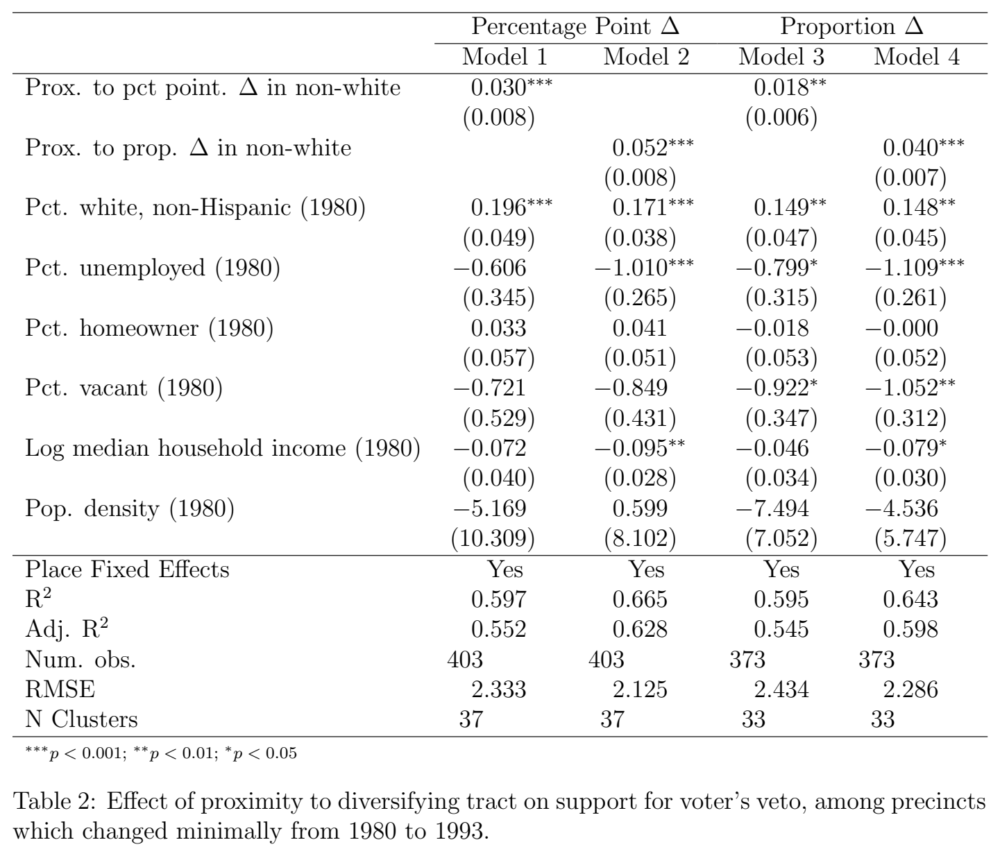

***Table 2.*** Effect of proximity to diversifying tract on support for voter’s veto, among precincts which changed minimally from 1980 to 1993.

[Download data as CSV](tables/tab-02.csv)

## Discussion

Research on neighborhood racial change typically frames intergroup encounters as either contact or conflict. Oliver and Wong (2003) find that minorities living near one another tend to hold lower outgroup prejudice, while Enos (2017) shows that the salience of group identity rises with relative group size, spatial proximity, and segregation, raising the prospect of conflict absent the conditions for positive contact outline in Allport (1954).

My findings neither emphasize contact nor conflict. Rather, they suggest that local racial demographic change can activate broadly shared concerns about a neighborhood’s political and socioeconomic trajectory that are attributed to racial turnover in general. A desire to protect the voters’ veto is therefore not equivalent to heightened racial prejudice. For instance, I would not expect to find a parallel relationship between local demographic change and support for racially targeted statewide ballot measures such as restrictions on public services for undocumented immigrants (e.g., Campbell, Wong and Citrin 2006). But even when not driven by overt racial threat, behavioral support for local exclusionary policy can produce the same outcomes as if it were, entrenching existing patterns of segregation. Two scope conditions are worth emphasizing. First, the result that majority Black and Latino precincts respond to a declining local white population—and not to declines in their own group’s share—pushes against a simple group-threat extension to minority contexts. Whatever drives the response, it is not symmetric ingroup defense. Second, although the within-precinct and proximity-based designs converge on the same substantive finding, neither rules out every alternative. Local crime, in particular, remains a plausible confounder that I cannot directly test given the absence of neighborhood-level crime data prior to 2000. Researchers with more recent outcomes should examine it directly.

Finally, the geographic setting matters. Los Angeles County in 1993 was uniquely dense, uniquely diverse, and uniquely shaped by the Second Great Migration and post-1965 immigration. Whether the same exclusionary response would emerge in less dense, more recently diversifying suburban or exurban contexts, where minority arrivals are a more novel phe-

nomenon and intergroup contact opportunities are more constrained, is an open question.

## Conclusion

Three limitations have shaped existing work on demographic change and exclusionary politics: a focus on white voters, a reliance on attitudes or indirect behaviors rather than direct policy support, and an emphasis on national rather than local outcomes. This study addresses each by examining a rare instance of direct behavioral support for a local exclusionary tool—the voters’ veto over affordable housing under California’s Article 34. Across 3,718 Los Angeles County precincts and two analytical strategies, local exposure to an increasing non-white population from 1980 to 1993 is associated with greater support for that veto, and this exclusionary response appears in majority white, Black, and Latino precincts alike. The implications are timely. Los Angeles County in 1993 closely resembles California as a whole in 2020 demographically, and the state continues to diversify: California’s white population fell 24 percent from 2010 to 2020, the largest statewide decline. In November 2024, Democratic leaders pulled a fourth attempt to repeal Article 34 from the ballot after polling showed it underwater (Board 2024). Given the similarities in demographic trends leading up to 1993 and 2024, advocates may have been wise to pull the measure and avoid a rebuke of the state’s efforts to limit local control over affordable housing. Meanwhile, a countermovement, “Our Neighborhood Voices,” is organizing a competing initiative to end state preemption of local land use policy (Brasuell 2022). While hopes to loosen local control as a response to both segregation and the housing affordability crisis hang on scaling decision-making up to the state level, the findings here suggest local demographic change pulls voters in the opposite direction.

Currently, Americans harboring exclusionary attitudes—either on national immigration policy or local zoning practices—are more likely to find their policy preferences embraced by the Republican Party. As the United States diversifies, there is growing evidence that

many Latino, Asian, and to a lesser extent Black voters may be to moving away from the Democratic Party, especially in areas with high levels of immigration. The exclusionary behaviors found in this study align with and may provide a local foundation for this national shift of non-white voters towards the Republican Party. More broadly, in the context of the nation’s housing affordability crisis, these findings underscore the tension between integration and local democratic control over housing in a diversifying society.

## References

Abrajano, Marisa and Zoltan L Hajnal. 2015. White Backlash. Princeton University Press. Allport, Gordon. 1954. The Nature of Prejudice. Addison-Wesley Publishing Company.

Badger, Emily, Quoctrung Bui and Robert Gebeloff. 2019. “The Neighborhood Is Mostly Black. The Home Buyers Are Mostly White.” The New York Times .

Bergesen, Albert and Max Herman. 1998. “Immigration, Race, and Riot: The 1992 Los Angeles Uprising.” American Sociological Review 63:39–54.

Blalock, Hubert M. 1967. Toward a Theory of Minority Group Relations. John Wiley and Sons.

Blumer, Herbert. 1958. “Race Prejudice as a Sense of Group Position.” Pacific Sociological Review 1(1):3–7.

Board, The Editorial. 2024. “It’s a shame California voters won’t be able to dump this racist anti-housing policy in November.” Los Angeles Times .

Bobo, Lawrence and Camille L Zubrinsky. 1996. “Attitudes on Residential Integration: Perceived Status Differences, Mere In-Group Preference, or Racial Prejudice?” Social Forces 74(3):883–909.

Bobo, Lawrence and Vincent L Hutchings. 1996. “Perceptions of Racial Group Competition: Extending Blumer’s Theory of Group Position to a Multiracial Social Context.” American Sociological Review pp. 951–972.

Borusyak, Kirill, Peter Hull and Xavier Jaravel. 2025. “A practical guide to shift-share instruments.” Journal of Economic Perspectives 39(1):181–204.

Brasuell, James. 2022. “Ballot Initiative Could Overturn California’s Zoning Reforms.” Planetizen .

Cai, Weiyi and Ford Fessenden. 2020. “Immigrant Neighborhoods Shifted Red as the Country Chose Blue.” New York Times .

Campbell, Andrea Louise, Cara Wong and Jack Citrin. 2006. “‘Racial Threat’, Partisan Climate, and Direct Democracy: Contextual Effects in Three California Initiatives.” Political Behavior 28:129–150.

Cavin, Aaron. 2019. “A Right to Housing in the Suburbs: James v. Valtierra and the Campaign Against Economic Discrimination.” Journal of Urban History 45(3):427–451. Charles, Camille Zubrinksy. 2006. Won’t You Be My Neighbor: Race, Class, and Residence in Los Angeles. Russell Sage Foundation.

Craig, Maureen A, Julian M Rucker and Jennifer A Richeson. 2018. “The Pitfalls and Promise of Increasing Racial Diversity: Threat, Contact, and Race Relations in the 21st Century.” Current Directions in Psychological Science 27(3):188–193.

Cramer, Katherine J. 2016. The Politics of Resentment: Rural Consciousness in Wisconsin and the Rise of Scott Walker. University of Chicago Press.

Einstein, Katherine Levine, David M Glick and Maxwell Palmer. 2020. Neighborhood Defenders. Cambridge University Press.

Enos, Ryan D. 2014. “Causal effect of intergroup contact on exclusionary attitudes.” Proceedings of the National Academy of Sciences 111(10):3699–3704.

Enos, Ryan D. 2016. “What the Demolition of Public Housing Teaches Us About the Impact of Racial Threat on Political Behavior.” American Journal of Political Science 60(1):123– 142.

Enos, Ryan D. 2017. The Space Between Us: Social Geography and Politics. Cambridge University Press.

Enos, Ryan D, Aaron R Kaufman and Melissa L Sands. 2019. “Can Violent Protest Change Local Policy Support? Evidence from the Aftermath of the 1992 Los Angeles Riot.” American Political Science Review 113(4):1012–1028.

Farley, Reynolds, Charlotte Steeh, Maria Krysan, Tara Jackson and Keith Reeves. 1994. “Stereotypes and Segregation: Neighborhoods in the Detroit Area.” American Journal of Sociology 100(3):750–780.

Fouka, Vasiliki and Marco Tabellini. 2022. “Changing In-Group Boundaries: The Effect of Immigration on Race Relations in the United States.” American Political Science Review 116(3):968–984.

Fraga, Bernard L, Yamil R Velez and Emily A West. Forthcoming. “Reversion to the Mean, or their Version of the Dream? An Analysis of Latino Voting in 2020.” American Political Science Review .

Frey, William H. 2018. Diversity Explosion: How New Racial Demographics Are Remaking America. Brookings Institution Press.

Gay, Claudine. 2006. “Seeing Difference: The Effect of Economic Disparity on Black Attitudes toward Latinos.” American Journal of Political Science 50(4):982–997.

Gerber, Elisabeth R. 2011. The Populist Paradox: Interest Group Influence and the Promise of Direct Legislation. Princeton University Press.

Hankinson, Michael and Asya Magazinnik. 2023. “The Supply–Equity Trade-off: The Effect of Spatial Representation on the Local Housing Supply.” Journal of Politics 85(3):1033– 1047.

Hill, Seth J, Daniel J Hopkins and Gregory A Huber. 2019. “Local Demographic Changes and US Presidential Voting, 2012 to 2016.” Proceedings of the National Academy of Sciences 116(50):25023–25028.

Hopkins, Daniel J. 2009. “The Diversity Discount: When Increasing Ethnic and Racial Diversity Prevents Tax Increases.” The Journal of Politics 71(1):160–177.

Hopkins, Daniel J. 2010. “Politicized places: Explaining where and when immigrants provoke local opposition.” American political science review 104(1):40–60.

Johnson Jr, James H and Walter C Farrell Jr. 1992. “The Fire This Time: The Genesis of the Los Angeles Rebellion of 1992.” NCL Rev. 71:1403.

Kaufmann, Eric and Matthew J Goodwin. 2018. “The Diversity Wave: A Meta-Analysis of the Native-Born White Response to Ethnic Diversity.” Social Science Research 76:120–131. Krysan, Maria, Mick P Couper, Reynolds Farley and Tyrone A Forman. 2009. “Does Race Matter in Neighborhood Preferences? Results from a Video Experiment.” American Journal of Sociology 115(2):527–559.

Larsen, Martin Vinæs, Frederik Hjorth, Peter Thisted Dinesen and Kim Mannemar Sønderskov. 2019. “When Do Citizens Respond Politically to the Local Economy? Evidence from Registry Data on Local Housing Markets.” American Political Science Review 113(2):499–516.

Lee, Barrett A, Sean F Reardon, Glenn Firebaugh, Chad R Farrell, Stephen A Matthews and David O’Sullivan. 2008. “Beyond the Census Tract: Patterns and Determinants of Racial Segregation at Multiple Geographic Scales.” American Sociological Review 73(5):766–791. Manson, Steven, Jonathan Schroeder, David Van Riper, Tracy Kugler and Steven Ruggles. 2022. “IPUMS National Historical Geographic Information System: Version 17.0.” Available at: http://doi.org/10.18128/D050.V17.0.

Martinez, Gebe. 1993. “4 Overlooked Propositions Add Up to Dollars and Cents Election.” Los Angeles Times .

McClain, Paula D and Albert K Karnig. 1990. “Black and Hispanic Socioeconomic and Political Competition.” American Political Science Review 84(2):535–545.

Newman, Benjamin J. 2013. “Acculturating Contexts and Anglo Opposition to Immigration in the United States.” American Journal of Political Science 57(2):374–390.

Newman, Benjamin J, Sono Shah and Loren Collingwood. 2018. “Race, Place, and Building a Base: Latino Population Growth and the Nascent Trump Campaign for President.” Public Opinion Quarterly 82(1):122–134.

Oliver, J Eric and Janelle Wong. 2003. “Intergroup Prejudice in Multiethnic Settings.” American Journal of Political Science 47(4):567–582.

Outten, H Robert, Michael T Schmitt, Daniel A Miller and Amber L Garcia. 2012. “Feeling Threatened About the Future: Whites’ Emotional Reactions to Anticipated Ethnic Demographic Changes.” Personality and Social Psychology Bulletin 38(1):14–25.

Pattillo-McCoy, Mary. 1999. Black Picket Fences: Privilege and Peril among the Black Middle Class. University of Chicago Press.

Prothro, James W and Charles M Grigg. 1960. “Fundamental Principles of Democracy: Bases of Agreement and Disagreement.” The Journal of Politics 22(2):276–294.

Reny, Tyler T and Benjamin J Newman. 2018. “Protecting the Right to Discriminate: The Second Great Migration and Racial Threat in the American West.” American Political Science Review 112(4):1104–1110.

Rothwell, Jonathan and Douglas S Massey. 2009. “The Effect of Density Zoning on Racial Segregation in US Urban Areas.” Urban Affairs Review 44(6):779–806.

Sahn, Alexander. 2025. “Racial Diversity and Exclusionary Zoning: Evidence from the Great Migration.” Journal of Politics 87(4).

Schaffner, Brian F, Jesse H Rhodes and Raymond J La Raja. 2020. Hometown Inequality: Race, Class, and Representation in American Local Politics. Cambridge University Press. Sen, Maya and Omar Wasow. 2016. “Race as a bundle of sticks: Designs that estimate effects of seemingly immutable characteristics.” Annual Review of Political Science 19(1):499–522. Staff, The Times. 2019. “Why it’s been so hard to kill Article 34, California’s ‘racist’ barrier to affordable housing.” Los Angeles Times .

Ternullo, Stephanie. 2024. How the Heartland Went Red: Why Local Forces Matter in an Age of Nationalized Politics. Princeton University Press.

Thompson, Andrew Ifedapo. 2023. “Asian American Racial Threat and Support for Racially Discriminatory Policy.” Political Science Research and Methods pp. 1–18.

Tighe, J Rosie. 2010. “Public Opinion and Affordable Housing: A Review of the Literature.” Journal of Planning Literature 25(1):3–17.

Trounstine, Jessica. 2018. Segregation by Design: Local Politics and Inequality in American Cities. Cambridge University Press.

Trounstine, Jessica. 2020. “The Geography of Inequality: How Land Use Regulation Produces Segregation.” American Political Science Review 114(2):443–455.

Varian, Ethan. 2022. “California’s ‘Racist’ Article 34 Remains an Obstacle to Affordable Housing.” TCA News Service .

Voter Information Guide for 1950, General Election. 1950. Technical report.

Wong, Cara J. 2007. ““Little” and “Big” Pictures in Our Heads: Race, Local Context, and Innumeracy About Racial Groups in the United States.” Public Opinion Quarterly 71(3):392–412.

## Online Appendix for “The Voters’ Veto: Local Racial

## Contents

A Article 34 Background A-2 B Descriptive Relationships A-2 C Defining Treatment A-5 D Within Precinct Results A-9 D.1 Intergroup Competition . . . . . . . . . . . . . . . . . . . . . . . . . . . . . A-10 E Spatial Durbin Error Model A-12 F Visualization of Bivariate Relationships A-14 G Alternative Explanations A-15 H Internal Change, Non-Winsorized Data A-18 I Proximity to Change, Alternative Thresholds A-19 J Proximity to Change, by 1980 Racial Composition A-22

## A Article 34 Background

Article 34 of the California Constitution:

“No low rent housing project shall hereafter be developed, constructed, or acquired in any manner by any state public body until, a majority of the qualified electors of the city, town or county, as the case may be, in which it is proposed to develop, construct, or acquire the same, voting upon such issue, approve such project by voting in favor thereof at an election to be held for that purpose, or at any general or special election.”

1993 ballot measure to repeal Article 34 (Proposition 168):

“LOW RENT HOUSING PROJECTS. LEGISLATIVE CONSTITUTIONAL AMENDMENT. Amends state constitutional definition of low rent housing projects to include only projects owned by a governmental entity as defined. Excludes projects found to have no significant negative impact on the revenues of the affected governmental entity, and whose physical appearance is found to have no significant negative impact on the surrounding community. Requires approval by voters only upon qualification of ballot petition as specified. Exempts projects approved on or before November 3, 1992, or projects with existing contracts for federal financial assistance.”

## B Descriptive Relationships

118.8(cid:176) W 118.6(cid:176) W 118.4(cid:176) W 118.2(cid:176) W 118.0(cid:176) W

lon

tal

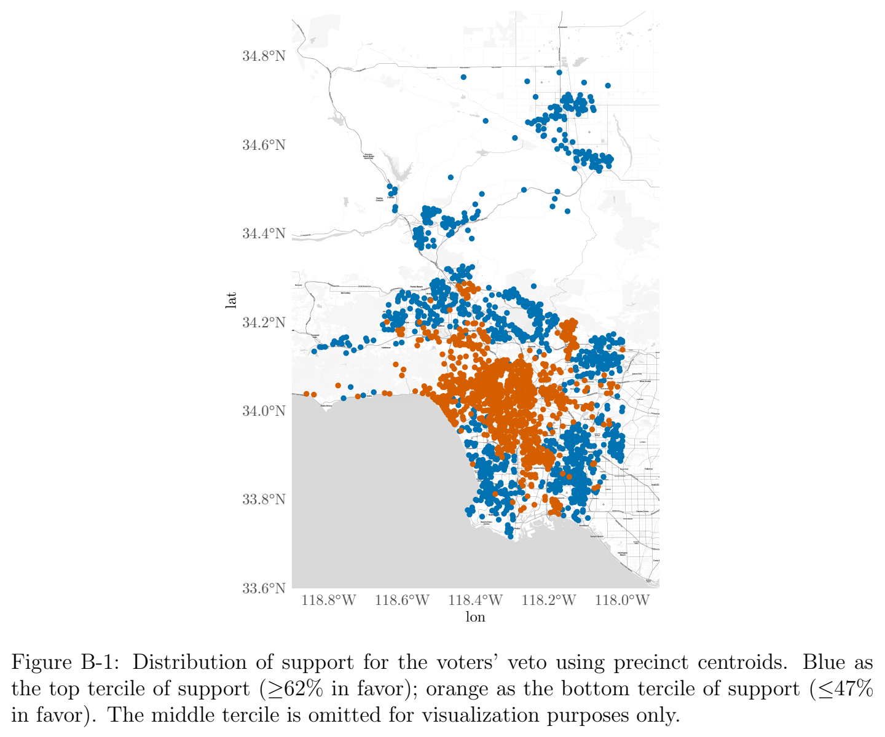

***Figure B-1.*** Distribution of support for the voters’ veto using precinct centroids. Blue as the top tercile of support (≥62% in favor); orange as the bottom tercile of support (≤47% in favor). The middle tercile is omitted for visualization purposes only.

0.0 0.2 0.4 0.6 0.8 % registered Republican, 1992 ,otev

'sretov

rof

troppus

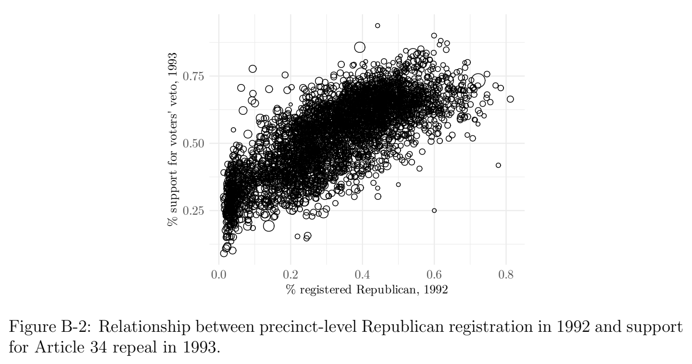

***Figure B-2.*** Relationship between precinct-level Republican registration in 1992 and support for Article 34 repeal in 1993.

0.00 0.25 0.50 0.75 1.00 Percent White, Non-Hispanic, 1980 ,otev

'sretov

rof

troppus

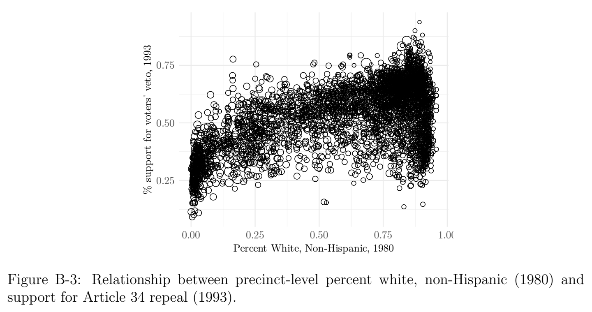

***Figure B-3.*** Relationship between precinct-level percent white, non-Hispanic (1980) and support for Article 34 repeal (1993).

## C Defining Treatment

Figures C-4 and C-5 show maps of how precincts changed from 1980 to 1993. Green precincts experienced the smallest increase in their non-white population (bottom tercile), pink precincts experienced the greatest increase in their non-white population (top tercile), with the middle tercile omitted. Q3 precincts (pink) of both measures of racial change generally cover comparable areas, though with some notable exceptions around the Santa Monica Mountains in the upper left quadrant of each map.

To understand how areas of intense demographic change may differ, Figure C-6 shows the relationship between the 1980 percent non-Hispanic white population (i.e., pretreatment white population) on the x-axis and each treatment measure on the y-axis. In very white areas, large changes in percentage point population are unlikely, e.g., 98 percent white precincts cannot experience 20 percentage point increases in non-white population. However, a large proportion change is common in very white areas. A 98 percent white precinct could easily experience a 4 percentage point increase in the non-white population, equaling a 200 percent change in the non-white population. In short, most of the variation in the percentage point change in population occurs in areas between 50 and 80 percent white, whereas most of the variation in proportion change is in areas that are greater than 80 percent white circa 1980.

118.8(cid:176) W 118.6(cid:176) W 118.4(cid:176) W 118.2(cid:176) W 118.0(cid:176) W lon

tal

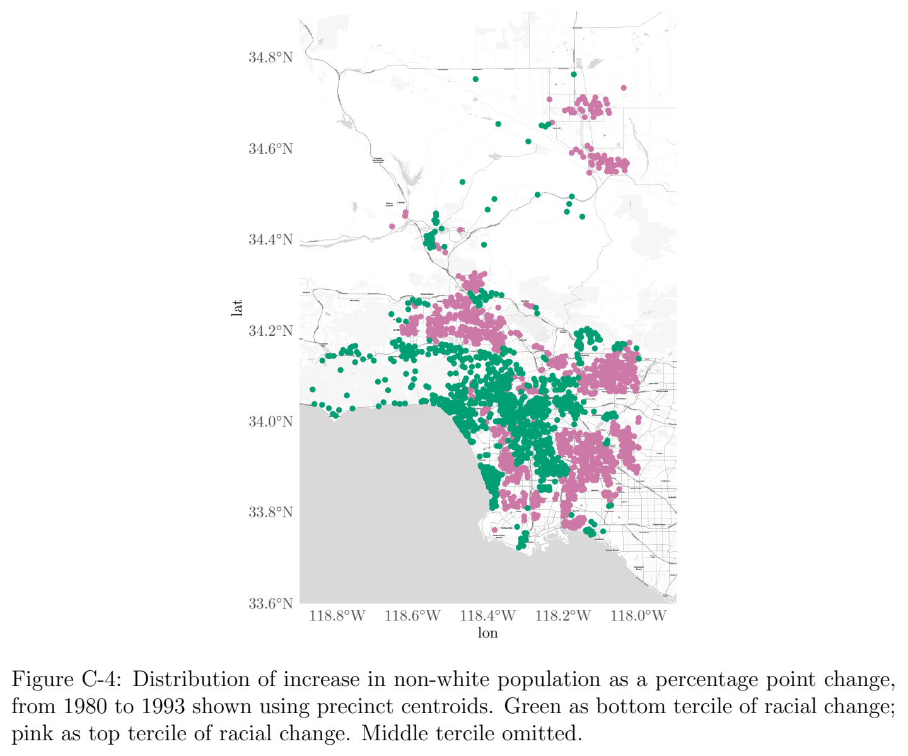

***Figure C-4.*** Distribution of increase in non-white population as a percentage point change, from 1980 to 1993 shown using precinct centroids. Green as bottom tercile of racial change; pink as top tercile of racial change. Middle tercile omitted.

118.8(cid:176) W 118.6(cid:176) W 118.4(cid:176) W 118.2(cid:176) W 118.0(cid:176) W lon

tal

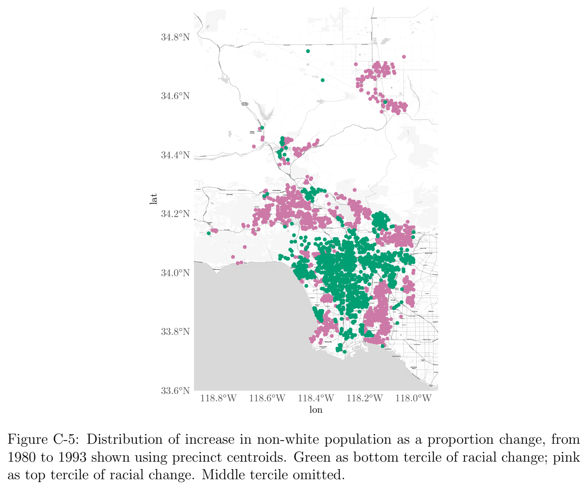

***Figure C-5.*** Distribution of increase in non-white population as a proportion change, from 1980 to 1993 shown using precinct centroids. Green as bottom tercile of racial change; pink as top tercile of racial change. Middle tercile omitted.

-0.2

0.00 0.25 0.50 0.75 1.00

Percent white, non-Hisp., 1980

39-0891

,noitalupop

etihw-non

egnahC

0.00 0.25 0.50 0.75 1.00 Percent white, non-Hisp., 1980 (a) Percentage point change

39-0891

,noitalupop

etihw-non

egnahc

.porP

(b) Proportion change

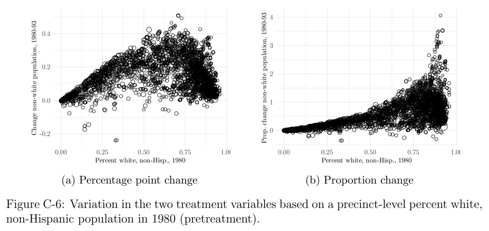

***Figure C-6.*** Variation in the two treatment variables based on a precinct-level percent white, non-Hispanic population in 1980 (pretreatment).

119.0(cid:176) W 118.8(cid:176) W 118.6(cid:176) W 118.4(cid:176) W 118.2(cid:176) W 118.0(cid:176) W 117.8(cid:176) W 117.6(cid:176) W lon tal

(a) Percentage point change 119.0(cid:176) W 118.8(cid:176) W 118.6(cid:176) W 118.4(cid:176) W 118.2(cid:176) W 118.0(cid:176) W 117.8(cid:176) W 117.6(cid:176) W lon

tal

(b) Proportion change

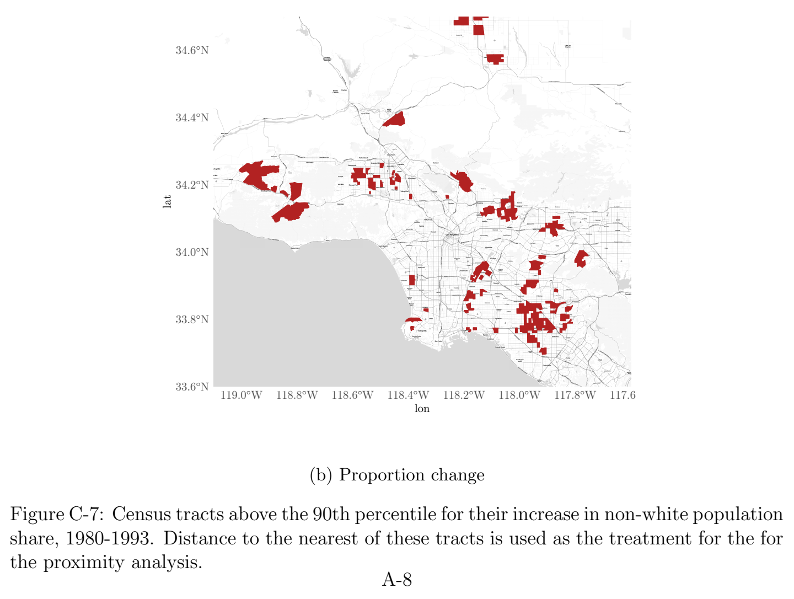

***Figure C-7.*** Census tracts above the 90th percentile for their increase in non-white population share, 1980-1993. Distance to the nearest of these tracts is used as the treatment for the for the proximity analysis. A-8

## D Within Precinct Results

Support for voters’ veto, 1993

Model 1 Model 2 Model 3 Model 4 Pct. point ∆ in non-white pop. 0.045∗∗∗ 0.044∗∗∗

Prop. ∆ in non-white pop. 0.034∗∗∗ 0.028∗∗∗ Pct. white, non-Hispanic (1980) 0.067 0.073∗ 0.055 0.085∗∗ Pct. unemployed (1980) −0.517∗∗∗ −0.784∗∗∗ −0.670∗∗ −0.937∗∗∗ Pct. homeowner (1980) 0.137∗∗∗ 0.171∗∗∗ 0.123∗∗ 0.155∗∗∗ Pct. vacant (1980) −0.303∗∗ −0.764∗∗∗ −0.274∗ −0.831∗∗∗ Log median household income (1980) 0.010 −0.045∗∗ −0.004 −0.072∗∗∗ Pop. density (1980) −6.040∗∗∗ −6.024∗∗∗ −5.367∗∗∗ −6.011∗∗∗ P.p. ∆ unemployed (1980) −0.420∗∗∗ −0.404∗∗∗ P.p. ∆ homeowner (1980) 0.143∗∗∗ 0.113∗∗∗ P.p. ∆ vacant (1980) −0.635∗∗∗ −0.778∗∗∗ Prop. ∆ med. household income (1980) −0.021∗∗ −0.040∗∗ City FE Yes Yes Yes Yes

Controls Yes Yes Yes Yes Time-varying Controls No Yes No Yes R2 0.751 0.763 0.723 0.737 Adj. R2 0.740 0.753 0.711 0.726 Num. obs. 3651 3649 3651 3649

RMSE 2.556 2.495 2.694 2.627 N Clusters 142 142 142 142

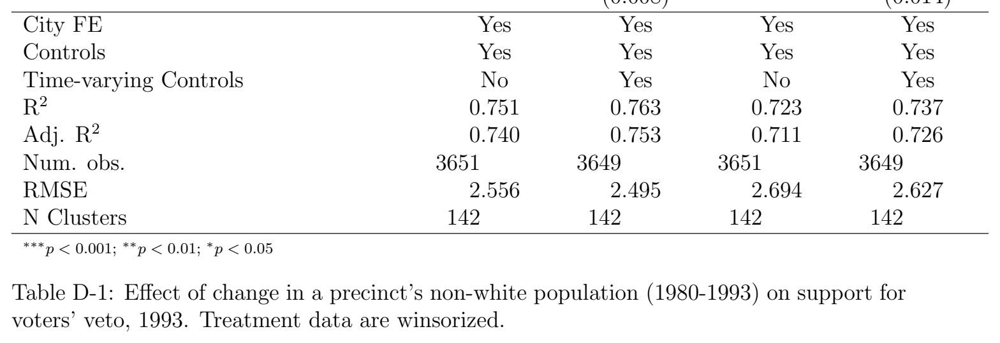

***Table D-1.*** Effect of change in a precinct’s non-white population (1980-1993) on support for voters’ veto, 1993. Treatment data are winsorized.

[Download data as CSV](tables/tab-03.csv)

### D.1 Intergroup Competition

To test whether the main relationship is driven by either a concern over losing white residents or rather a decrease in one’s own racial group which may stimulate group threat among minorities, I test whether majority Black and Latino precincts show a similar increase in support for the voters’ veto when their own racial group decreases in size. These coefficients are also not standardized. The percentage point change model is based on moving from 0 percent to 100 percent of that ethnic group, whereas the proportion model is defined as a 100 percent increase in group size.

Isolating these majority Black and majority Latino precincts, I find that a rise in the non-Black and non-Latino populations, respectively does not elicit an exclusionary reaction (Tables D-2 and D-3). Only a decrease in the local white population spurs support for local control over affordable housing. These subgroup analyses suggest that voters from an array of racial and ethnic backgrounds may feel concerns over the economic, social, and political trajectory of their neighborhoods as the local white population shrinks, rather than concerns over the size and influence of their own racial group.

Support for voters’ veto, 1993

Model 1 Model 2

Pct. point ∆ in non-Black pop. −0.028

Prop. ∆ in non-Black pop. −0.043

Pct. unemployed (1980) −0.272∗∗∗ −0.258∗∗∗ Pct. homeowner (1980) 0.032 0.036 Pct. vacant (1980) −0.171 −0.131 Log median household income (1980) 0.063∗∗∗ 0.056∗∗∗ Pop. density (1980) −2.489 −2.126 Place Fixed Effects Yes Yes R2 0.585 0.587 Adj. R2 0.555 0.557 Num. obs. 369 369

RMSE 2.025 2.020 N Clusters 19 19

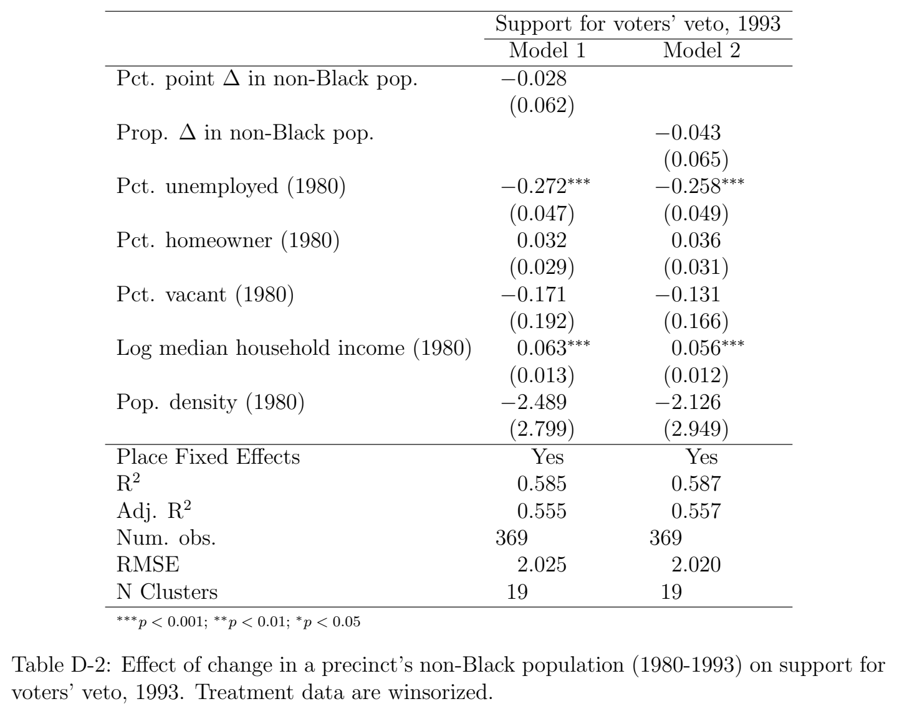

***Table D-2.*** Effect of change in a precinct’s non-Black population (1980-1993) on support for voters’ veto, 1993. Treatment data are winsorized.

[Download data as CSV](tables/tab-04.csv)

Support for voters’ veto, 1993 Model 1 Model 2 Pct. point ∆ in non-Hisp. pop. −0.163

Prop. ∆ in non-Hisp pop. −0.092∗ Pct. Hispanic (1980) −0.038 −0.029 Pct. unemployed (1980) −0.838∗∗ −0.830∗ Pct. homeowner (1980) 0.067 0.068 Pct. vacant (1980) 0.401 0.393 Log median household income (1980) 0.156∗∗∗ 0.156∗∗∗ Pop. density (1980) −3.314∗∗∗ −3.194∗∗∗ Place Fixed Effects Yes Yes R2 0.600 0.600

Adj. R2 0.541 0.541

Num. obs. 393 393

RMSE 3.492 3.493 N Clusters 44 44

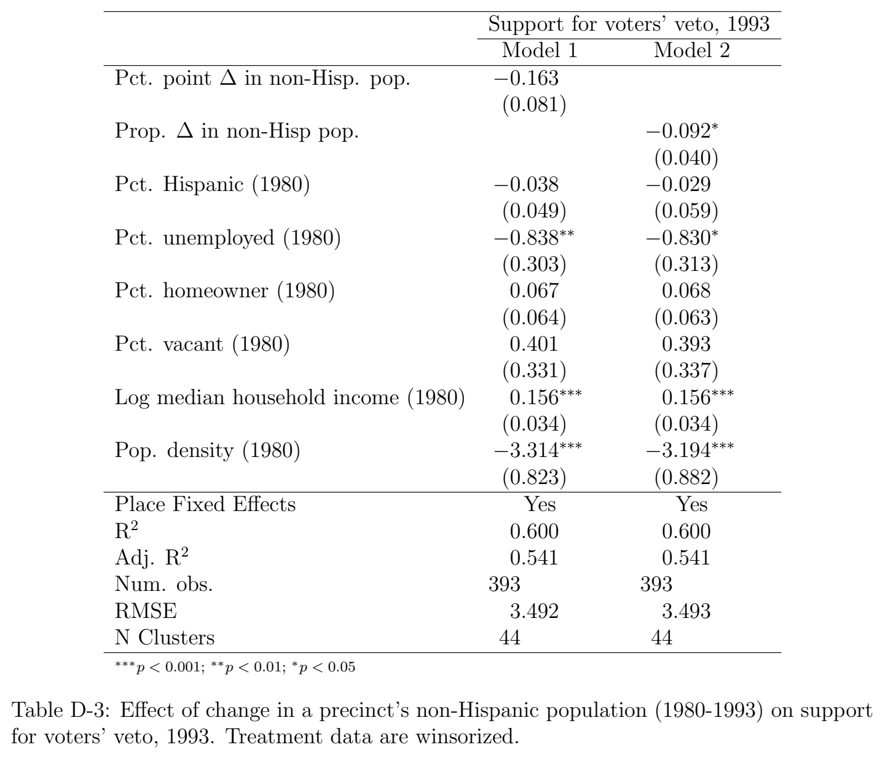

***Table D-3.*** Effect of change in a precinct’s non-Hispanic population (1980-1993) on support for voters’ veto, 1993. Treatment data are winsorized.

[Download data as CSV](tables/tab-05.csv)

## E Spatial Durbin Error Model

Spatial autocorrelation can be a problem when using geographic data due to the data’s violation of SUTVA. Neighboring observations can influence each other, violating SUTVA’s independence assumption. Likewise, omitted variables may be spatially correlated. Fortunately, these relationships can be modeled.

Using a spatial model requires two steps: the definition of spatial relationships and the choice of a model to account for spatial dependence. The most common way to model spatial relationships is by using queen contiguity weights. These weights account for spatial interactions between units sharing either a border or a vertex. Contiguity weights are especially helpful for the precinct data used in this analysis because the relationships are not sensitive to absolute distance. For example, some parts of Los Angeles County are very dense, where spillovers may only extend 500 meters. In contrast, interactions between precincts in rural Los Angeles County may occur at the level of several kilometers. By defining spatial interactions at the level of shared precinct borders (i.e., a queen continguity weights matrix), this design accounts for variation in the scale of human interaction across Los Angeles County. To select a model, I considered how spatial dependence may be affecting the analysis. First, the treatment of demographic change is likely to be affecting neighboring precincts. In fact, the second analysis of this study is based on exposure to nearby diversifying precincts. Thus, the model would need to account for this spillover effect. Second, there are likely omitted variables which may be spatially correlated. A spatial Durbin error model (SDEM) accounts for the spatial spillover effects of covariates as well as autocorrelation in the error term (LeSage 2014).

I reproduce the results from the Table 1 using the SDEM. Due to the computational intensity of incorporating the spatial autocorrelation, adjustments were made to the model specifications. Models 1 and 3 include Census place-level fixed effects, but no covariates. Models 2 and 4 include covariates, but no fixed effects. The covariates in Models 2 and 4 are the same as those in the non-spatial results: the 1980 precinct-level percent nonwhite residents, homeownership rate, vacancy rate, population density, log median household income, and unemployment rate. The results are substantively similar across all four models. All models use the queen continuity weights matrix and are weighted by precinct population. Having accounted for spatial spillovers and spatially correlated error terms, a standard deviation increase in the local non-white population increases support for direct democracy over housing by 2.0 to 2.2 percentage points. When defined as a proportion increase, the effect is a 0.8 to 2.8 point increase in support for the voters’ veto over affordable housing. These effects substantively match the results from the non-spatial OLS model in Table 1.

Support for voters’ veto, 1993

Model 1 Model 2 Model 3 Model 4 Pct. point ∆ in non-white pop. 0.022∗∗∗ 0.020∗∗∗

Prop. ∆ in non-white pop. 0.028∗∗∗ 0.008∗ Pct. white, non-Hispanic (1980) 0.099∗∗∗ 0.110∗∗∗ Pct. unemployed (1980) −0.581∗∗∗ −0.644∗∗∗ Pct. homeowner (1980) 0.095∗∗∗ 0.084∗∗∗ Pct. vacant (1980) 0.072 0.079

Log med. h.h. income (1980) 0.013 0.009

Pop. density (1980) −3.178∗∗∗ −3.197∗∗∗ Place Fixed Effects Yes No Yes No

Controls No Yes No Yes

Num. obs. 3112 3112 3112 3112

Parameters 235 17 235 17

Log Likelihood 3592.387 3653.932 3637.647 3602.665 AIC (Linear model) −5404.983 −6233.041 −5852.253 −5851.342 AIC (Spatial model) −6714.774 −7273.864 −6805.294 −7171.331 LR test: statistic 1311.790 1042.823 955.041 1321.988 LR test: p-value 0.000 0.000 0.000 0.000

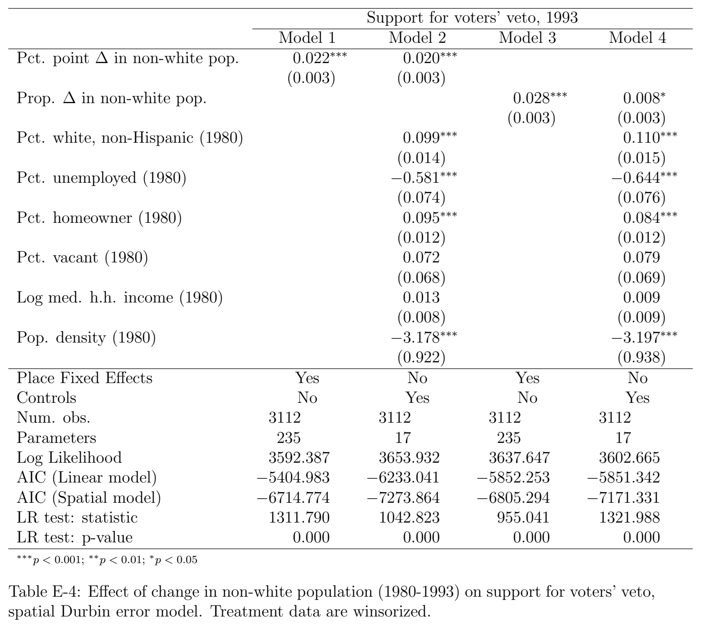

***Table E-4.*** Effect of change in non-white population (1980-1993) on support for voters’ veto, spatial Durbin error model. Treatment data are winsorized.

[Download data as CSV](tables/tab-06.csv)

## F Visualization of Bivariate Relationships

Figure F-8 shows the bivariate relationship between my two treatment variables and precinct support for the voters’ veto (Article 34 repeal) using binned box and whiskers plots. Precincts that experienced greater increases in non-white population from 1980 to 1993 showed greater support for the voters’ veto over affordable housing in the 1993 November election.

[0-.05) [.05-.10) [.10-.15) [.15-.20) [.20-.25) [>.25)

Change non-white population, 1980-93 (winsorized) ,otev

'sretov

rof

troppus

[0-.20) [.20-.40) [.40-.60) [.60-.80) [.80-1.00) [>1.00) Change non-white population, 1980-93 (winsorized) (a) Percentage point change

,otev

'sretov

rof

troppus

(b) Proportion change

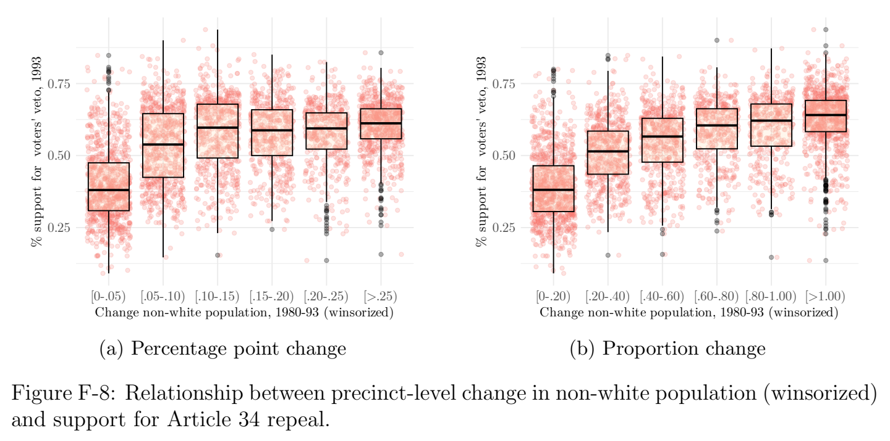

***Figure F-8.*** Relationship between precinct-level change in non-white population (winsorized) and support for Article 34 repeal.

[0-2.5) [2.5-5) [5-7.5) [7.5-10) [10-15) Distance to diversifying area (km), 1980-93 ,otev

'sretov

rof

troppus

[0-2.5) [2.5-5) [5-7.5) [7.5-10) [10-15) Distance to diversifying area (km), 1980-93 (a) Percentage point change

,otev

'sretov

rof

troppus

(b) Proportion change

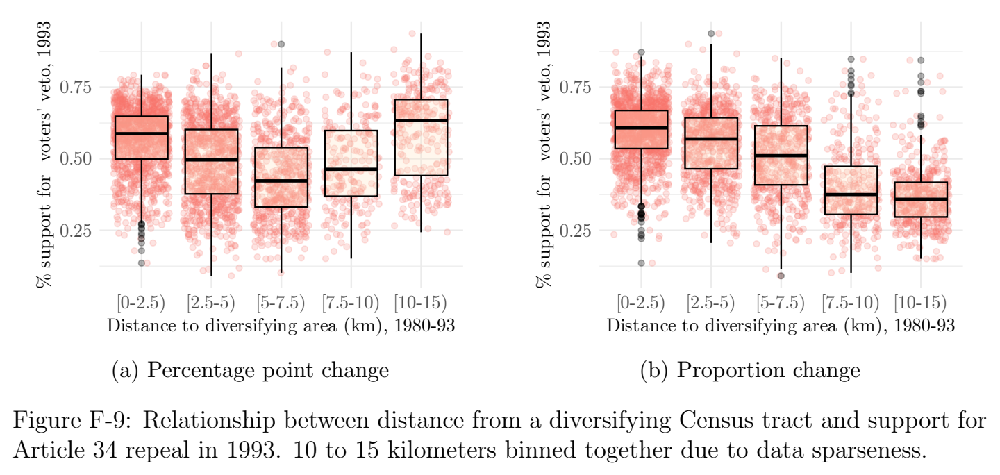

***Figure F-9.*** Relationship between distance from a diversifying Census tract and support for Article 34 repeal in 1993. 10 to 15 kilometers binned together due to data sparseness.

Figure F-9 shows the bivariate relationship between a precinct’s distance from a stimulus tract and support for the voters’ veto using binned box and whiskers plots. Precincts farther from these diversifying tracts — defined using either percentage point change or proportion change — show less support for direct democracy over housing.

## G Alternative Explanations

Support for voters’ veto, 1993

Model 1 Model 2 Model 3 Model 4 Pct. point ∆ in pop. density, 1980-93 0.010∗ 0.011∗∗

Prop. ∆ in pop. density, 1980-93 0.015 0.015∗ Place Fixed Effects Yes Yes Yes Yes Controls Yes Yes Yes Yes Time-varying Controls No Yes No Yes R2 0.713 0.732 0.713 0.732 Adj. R2 0.701 0.721 0.701 0.721 Num. obs. 3651 3649 3651 3649

RMSE 2.744 2.651 2.742 2.652 N Clusters 142 142 142 142

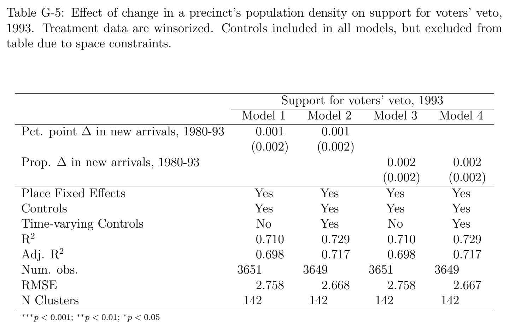

***Table G-5.*** Effect of change in a precinct’s population density on support for voters’ veto, 1993. Treatment data are winsorized. Controls included in all models, but excluded from table due to space constraints.

[Download data as CSV](tables/tab-07.csv)

Support for voters’ veto, 1993

Model 1 Model 2 Model 3 Model 4 Pct. point ∆ in new arrivals, 1980-93 0.001 0.001

Prop. ∆ in new arrivals, 1980-93 0.002 0.002 Place Fixed Effects Yes Yes Yes Yes Controls Yes Yes Yes Yes Time-varying Controls No Yes No Yes R2 0.710 0.729 0.710 0.729 Adj. R2 0.698 0.717 0.698 0.717 Num. obs. 3651 3649 3651 3649

RMSE 2.758 2.668 2.758 2.667 N Clusters 142 142 142 142

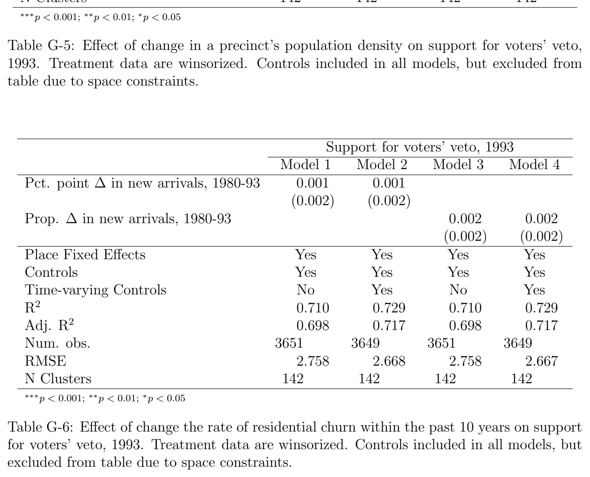

***Table G-6.*** Effect of change the rate of residential churn within the past 10 years on support for voters’ veto, 1993. Treatment data are winsorized. Controls included in all models, but excluded from table due to space constraints.

[Download data as CSV](tables/tab-08.csv)

Support for voters’ veto, 1993

Model 1 Model 2 Model 3 Model 4 Pct. point ∆ in med. hh. income, 1980-93 −0.030∗ −0.039∗∗∗

Prop. ∆ in med. hh. income, 1980-93 −0.016∗ −0.029∗∗∗ Place Fixed Effects Yes Yes Yes Yes Controls Yes Yes Yes Yes Time-varying Controls No Yes No Yes R2 0.719 0.733 0.717 0.732 Adj. R2 0.707 0.721 0.705 0.721 Num. obs. 3649 3649 3649 3649

RMSE 2.715 2.648 2.723 2.652 N Clusters 142 142 142 142

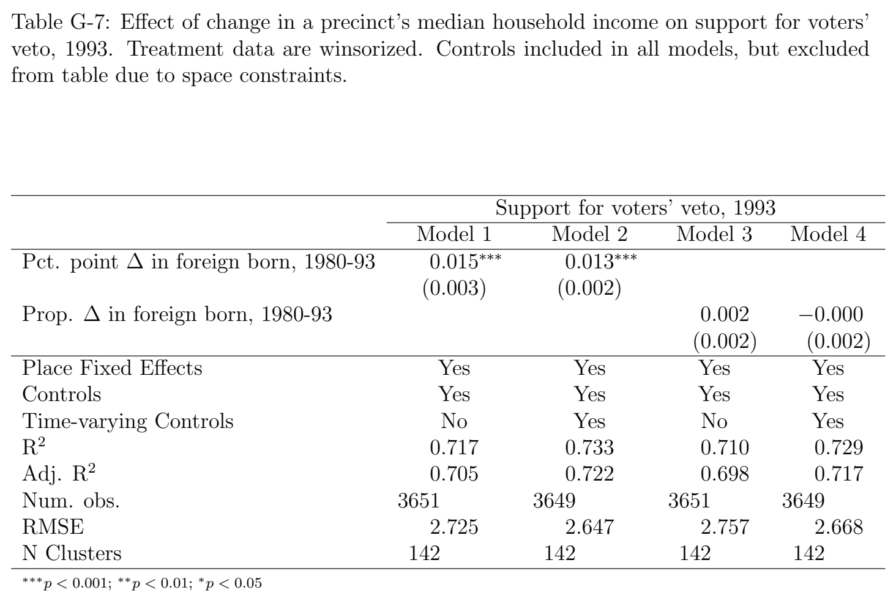

***Table G-7.*** Effect of change in a precinct’s median household income on support for voters’ veto, 1993. Treatment data are winsorized. Controls included in all models, but excluded from table due to space constraints.

[Download data as CSV](tables/tab-09.csv)

Support for voters’ veto, 1993

Model 1 Model 2 Model 3 Model 4 Pct. point ∆ in foreign born, 1980-93 0.015∗∗∗ 0.013∗∗∗

Prop. ∆ in foreign born, 1980-93 0.002 −0.000 Place Fixed Effects Yes Yes Yes Yes Controls Yes Yes Yes Yes Time-varying Controls No Yes No Yes R2 0.717 0.733 0.710 0.729 Adj. R2 0.705 0.722 0.698 0.717 Num. obs. 3651 3649 3651 3649

RMSE 2.725 2.647 2.757 2.668 N Clusters 142 142 142 142

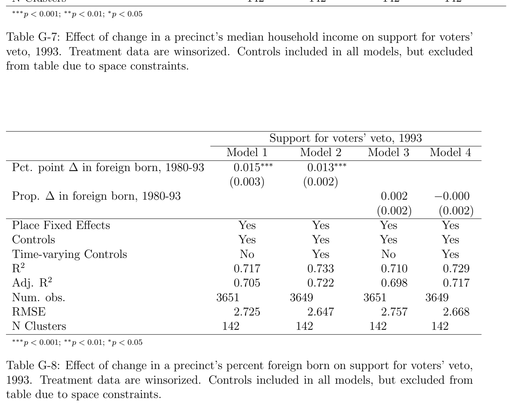

***Table G-8.*** Effect of change in a precinct’s percent foreign born on support for voters’ veto, 1993. Treatment data are winsorized. Controls included in all models, but excluded from table due to space constraints.

[Download data as CSV](tables/tab-10.csv)

Regarding Table G-8, the null effect may be due to two sources of measurement error. First, during the period of this study, there was considerable debate among demographers over how to accurately measure the percent foreign born, let alone the share of immigrants who were non-white (Van Hook et al. 2006; Woodrow-Lafield 1995). Second, percent foreign born was measured via the long-form Census which only sampled 1 in 6 households. While this sampling approach may be sufficient for states and places, it faces limits when aggregated to the precincts with a median size of roughly 1,200 residents. In contrast, these limitations do not exist for the percent non-white population data, which comes from the short-form, full-population Census.

## H Internal Change, Non-Winsorized Data

Support for voters’ veto, 1993 Model 1 Model 2 Pct. point ∆ in non-white pop. 0.042∗∗∗

Prop. ∆ in non-white pop. 0.030∗∗ Pct. white, non-Hispanic (1980) 0.071∗ 0.073 Pct. unemployed (1980) −0.546∗∗∗ −0.673∗∗ Pct. homeowner (1980) 0.137∗∗∗ 0.124∗∗ Pct. vacant (1980) −0.307∗∗ −0.277∗ Log median household income (1980) 0.007 −0.007 Pop. density (1980) −6.017∗∗∗ −5.470∗∗∗ City FE Yes Yes R2 0.747 0.720 Adj. R2 0.736 0.708 Num. obs. 3651 3651

RMSE 2.575 2.711 N Clusters 142 142

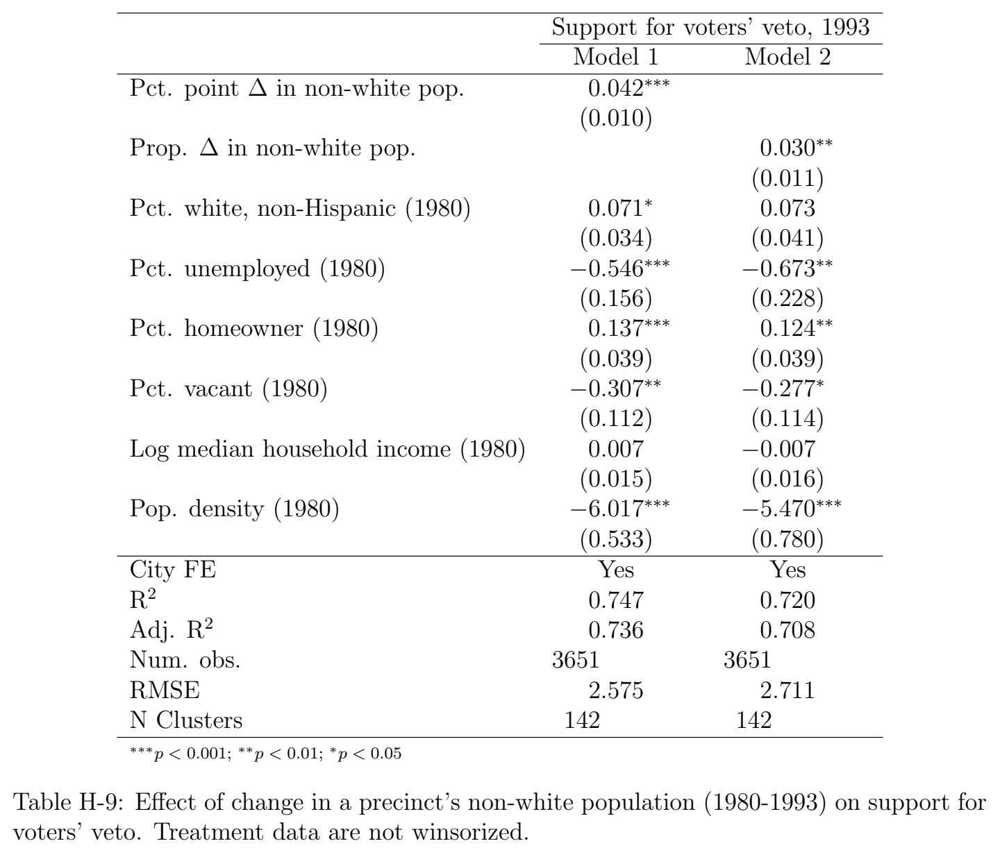

***Table H-9.*** Effect of change in a precinct’s non-white population (1980-1993) on support for voters’ veto. Treatment data are not winsorized.

[Download data as CSV](tables/tab-11.csv)

## I Proximity to Change, Alternative Thresholds

Percentage Point ∆

Model 1 Model 2 Model 3 Proximity to change (95th) 0.020 Proximity to change (90th) 0.030∗∗∗

Proximity to change (85th) 0.030∗∗∗

Place Fixed Effects Yes Yes Yes Controls Yes Yes Yes R2 0.594 0.597 0.576 Adj. R2 0.549 0.552 0.530 Num. obs. 403 403 403

RMSE 2.340 2.333 2.391 N Clusters 41 37 27

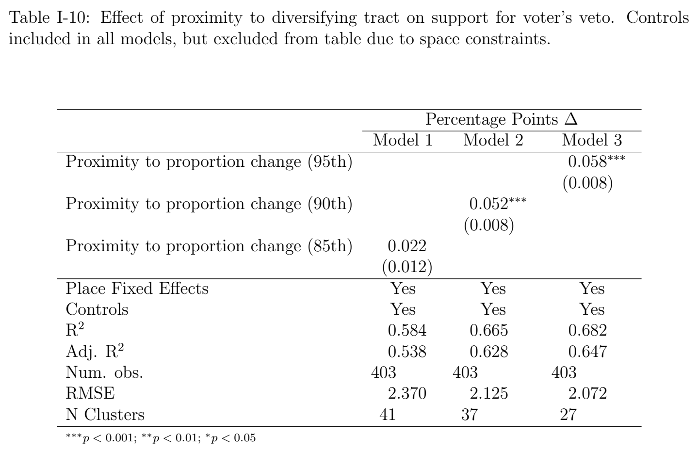

***Table I-10.*** Effect of proximity to diversifying tract on support for voter’s veto. Controls included in all models, but excluded from table due to space constraints.

[Download data as CSV](tables/tab-12.csv)

Percentage Points ∆

Model 1 Model 2 Model 3 Proximity to proportion change (95th) 0.058∗∗∗ Proximity to proportion change (90th) 0.052∗∗∗

Proximity to proportion change (85th) 0.022

Place Fixed Effects Yes Yes Yes Controls Yes Yes Yes R2 0.584 0.665 0.682 Adj. R2 0.538 0.628 0.647 Num. obs. 403 403 403

RMSE 2.370 2.125 2.072 N Clusters 41 37 27

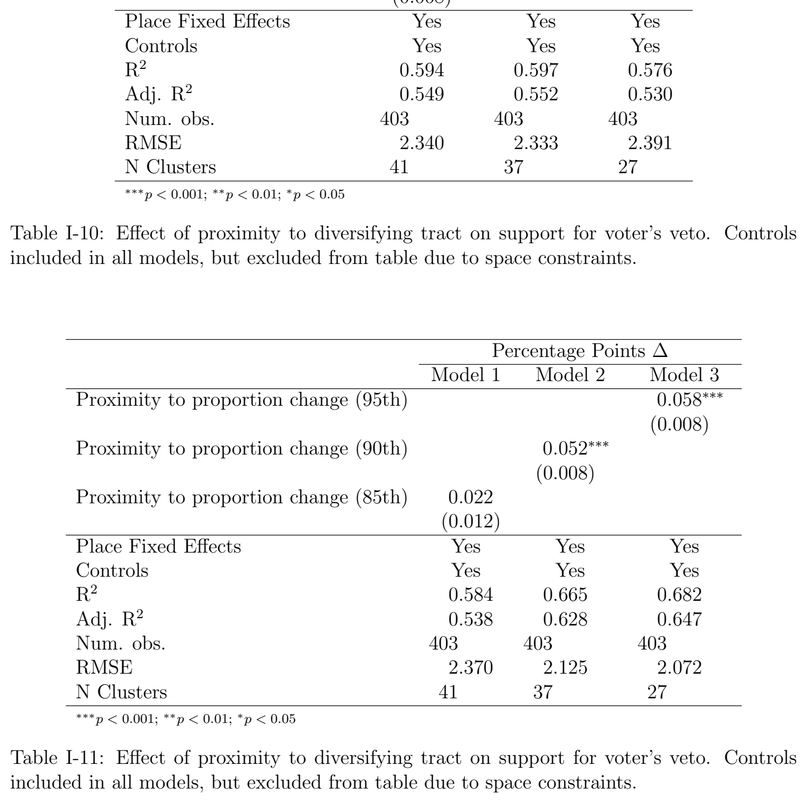

***Table I-11.*** Effect of proximity to diversifying tract on support for voter’s veto. Controls included in all models, but excluded from table due to space constraints.

[Download data as CSV](tables/tab-13.csv)

Proportion ∆

Model 1 Model 2 Model 3 Proximity to change (95th) 0.003 Proximity to change (90th) 0.018∗∗

Proximity to change (85th) 0.017∗∗

Place Fixed Effects Yes Yes Yes Controls Yes Yes Yes R2 0.591 0.595 0.581 Adj. R2 0.541 0.545 0.529 Num. obs. 373 373 373

RMSE 2.445 2.434 2.476 N Clusters 38 33 22

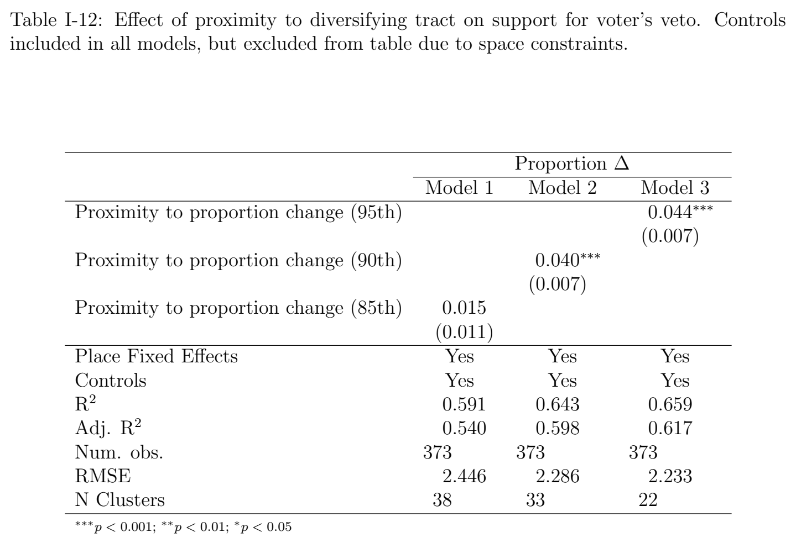

***Table I-12.*** Effect of proximity to diversifying tract on support for voter’s veto. Controls included in all models, but excluded from table due to space constraints.

[Download data as CSV](tables/tab-14.csv)

Proportion ∆

Model 1 Model 2 Model 3 Proximity to proportion change (95th) 0.044∗∗∗ Proximity to proportion change (90th) 0.040∗∗∗

Proximity to proportion change (85th) 0.015

Place Fixed Effects Yes Yes Yes Controls Yes Yes Yes R2 0.591 0.643 0.659 Adj. R2 0.540 0.598 0.617 Num. obs. 373 373 373

RMSE 2.446 2.286 2.233 N Clusters 38 33 22

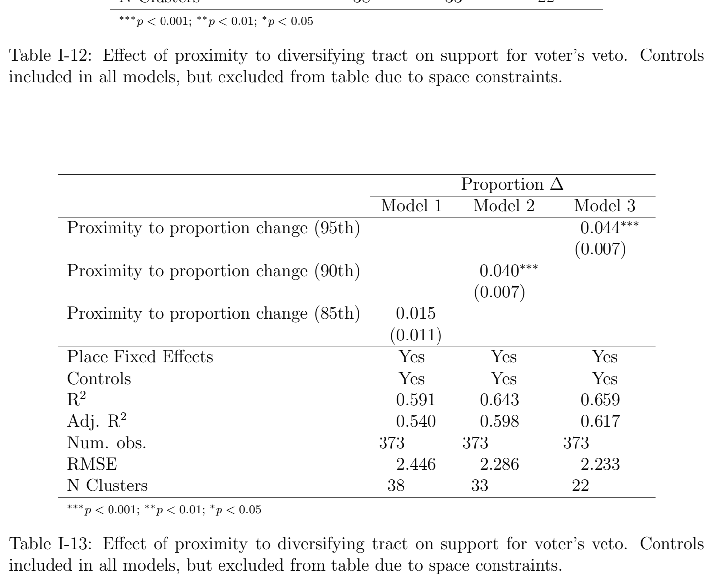

***Table I-13.*** Effect of proximity to diversifying tract on support for voter’s veto. Controls included in all models, but excluded from table due to space constraints.

[Download data as CSV](tables/tab-15.csv)

Percentage Point ∆ Proportion ∆

Model 1 Model 2 Model 3 Model 4 Prox. to pct point. ∆ in non-white 0.030∗∗∗ 0.016∗∗

Prox. to prop. ∆ in non-white 0.020∗ 0.013 Pct. white, non-Hispanic (1980) 0.192∗∗∗ 0.154∗∗ 0.148∗∗ 0.119∗ Pct. unemployed (1980) −0.615 −0.528 −0.774∗ −0.782∗ Pct. homeowner (1980) 0.038 0.059 −0.014 −0.010 Pct. vacant (1980) −0.704 −0.756 −0.952∗ −1.048∗ Log median household income (1980) −0.071 −0.079∗ −0.046 −0.055 Pop. density (1980) −4.668 −1.800 −7.253 −6.316 Place Fixed Effects Yes Yes Yes Yes Controls Yes Yes Yes Yes

R2 0.597 0.578 0.592 0.589 Adj. R2 0.552 0.531 0.541 0.538 Num. obs. 403 403 373 373

RMSE 2.334 2.388 2.445 2.453 N Clusters 42 42 37 37

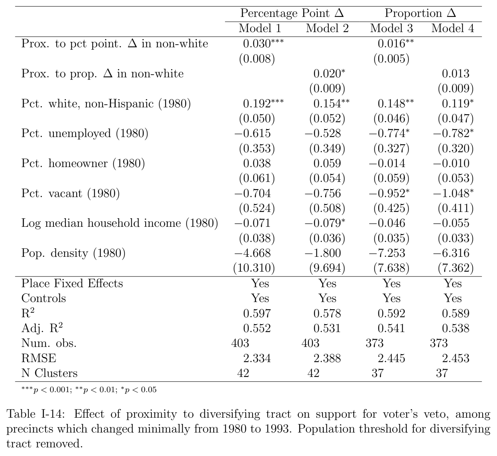

***Table I-14.*** Effect of proximity to diversifying tract on support for voter’s veto, among precincts which changed minimally from 1980 to 1993. Population threshold for diversifying tract removed.

[Download data as CSV](tables/tab-16.csv)

## J Proximity to Change, by 1980 Racial Composition

This analysis is conducted on precincts in the top tercile percent white (> 85%) and the bottom tercile percent white (< 52%). These values differ slightly from the “within precinct” analysis as the data are subset to precincts which changed only minimally between 1980 and 1993. Proximity to a diversifying tract is interacted with a binary variable for whether the precinct was in the top percent white tercile in 1980.

Results here are noisier due to the very limited sample sizes. However, precincts that were in the bottom tercile percent white still show a generally statistically significant reaction to the proximity of a diversifying tract. The lower order term in Model 1 is significant at the α = 0.10.

Percentage Point ∆ Proportion ∆

Model 1 Model 2 Model 3 Model 4 Prox. to pct. point ∆ in non-white 0.028 0.010

Prox. to prop. ∆ in non-white 0.056∗∗∗ 0.043∗∗∗ Prox. to pct. point x white prec., 1980 0.005 −0.002

Prox. prop. x white prec., 1980 −0.008 −0.049∗ Pct. unemployed (1980) −0.472 −0.977∗∗∗ −0.909∗∗∗ −1.283∗∗∗ Pct. homeowner (1980) 0.026 0.034 −0.057 −0.058 Pct. vacant (1980) −1.068 −0.964∗ −0.873∗ −0.725∗ Log median household income (1980) −0.047 −0.074∗ 0.023 −0.018 Pop. density (1980) −8.927 −3.601 −13.427 −10.552 Place Fixed Effects Yes Yes Yes Yes Controls Yes Yes Yes Yes R2 0.599 0.664 0.596 0.654 Adj. R2 0.549 0.622 0.539 0.605 Num. obs. 374 374 340 340

RMSE 2.313 2.118 2.447 2.266 N Clusters 36 36 32 32

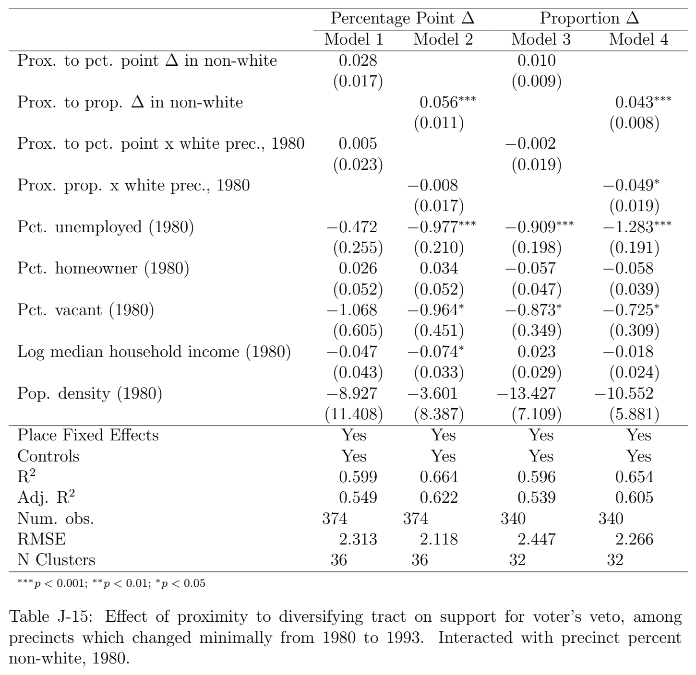

***Table J-15.*** Effect of proximity to diversifying tract on support for voter’s veto, among precincts which changed minimally from 1980 to 1993. Interacted with precinct percent non-white, 1980.

[Download data as CSV](tables/tab-17.csv)

## References

LeSage, James P. 2014. “Spatial Econometric Panel Data Model Specification: A Bayesian Approach.” Spatial Statistics 9:122–145.

Van Hook, Jennifer, Weiwei Zhang, Frank D. Bean and Jeffrey S. Passel. 2006. “Foreign-Born Emigration: A New Approach and Estimates Based on Matched CPS Files.” Demography 43:361–382.

Woodrow-Lafield, Karen A. 1995. “An Analysis of Net Immigration in Census Coverage Evaluation.” Population Research and Policy Review 14:173–204.